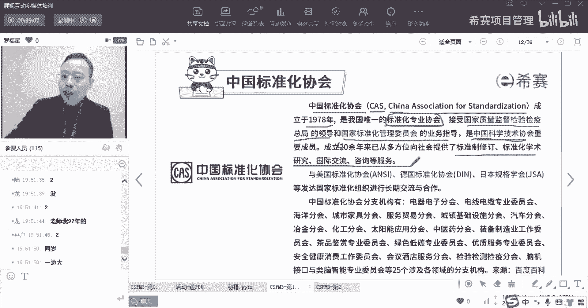
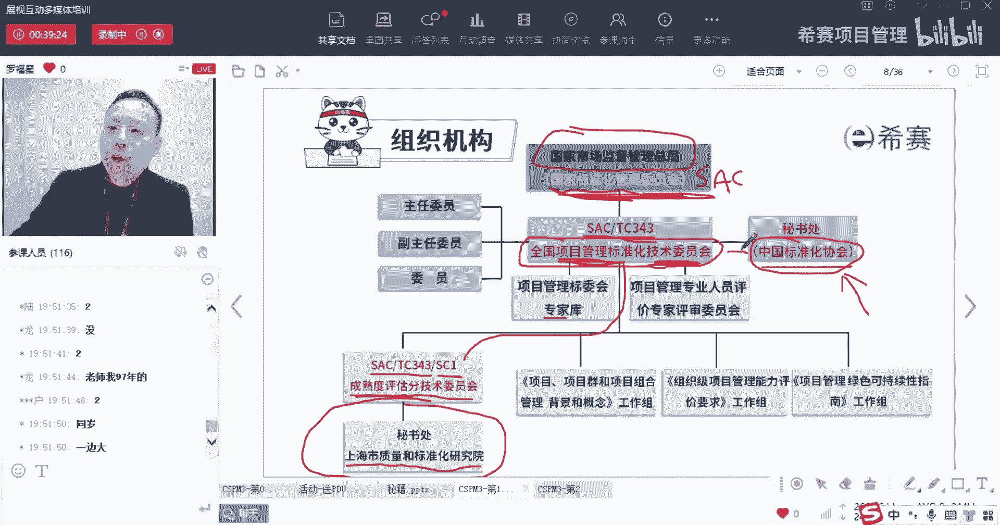
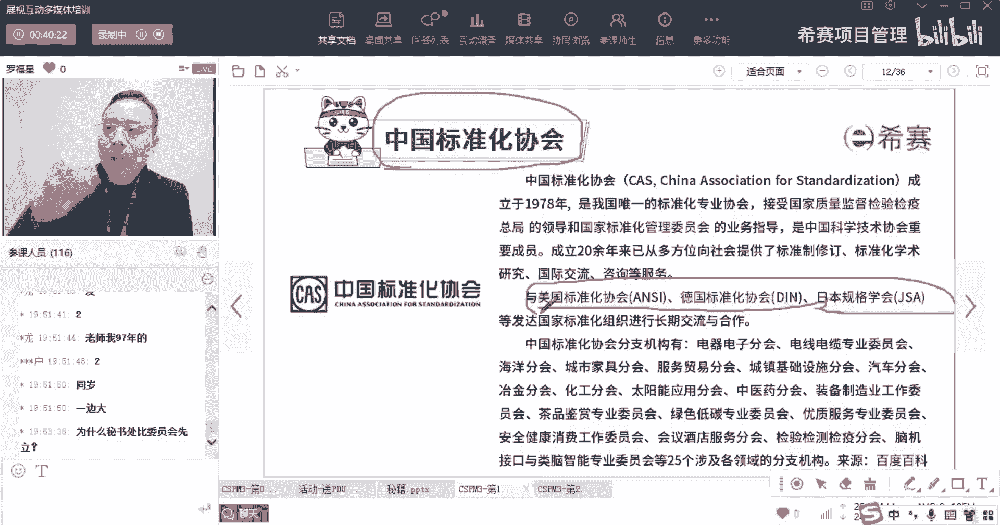
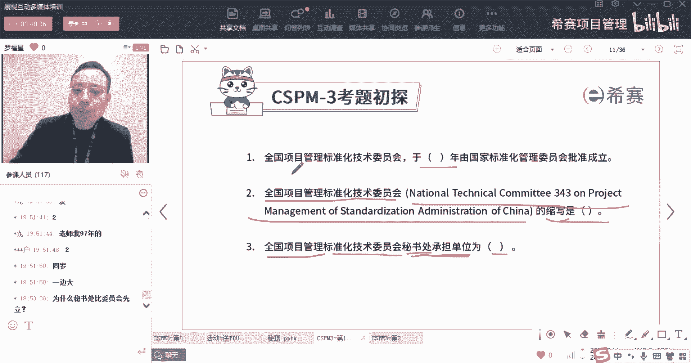
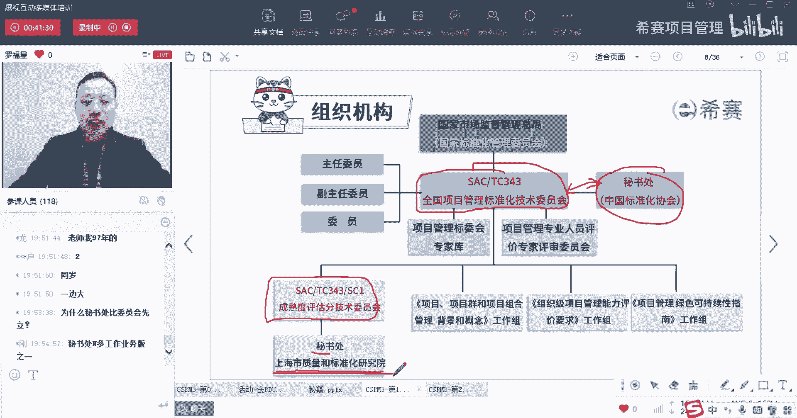
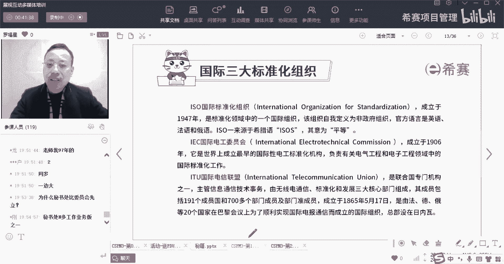
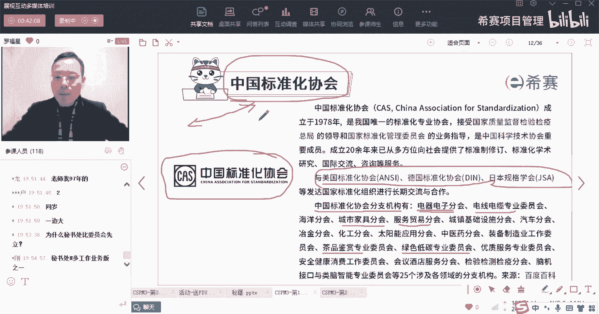
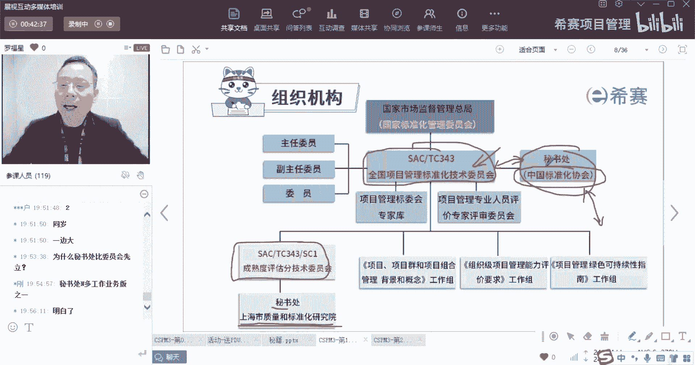
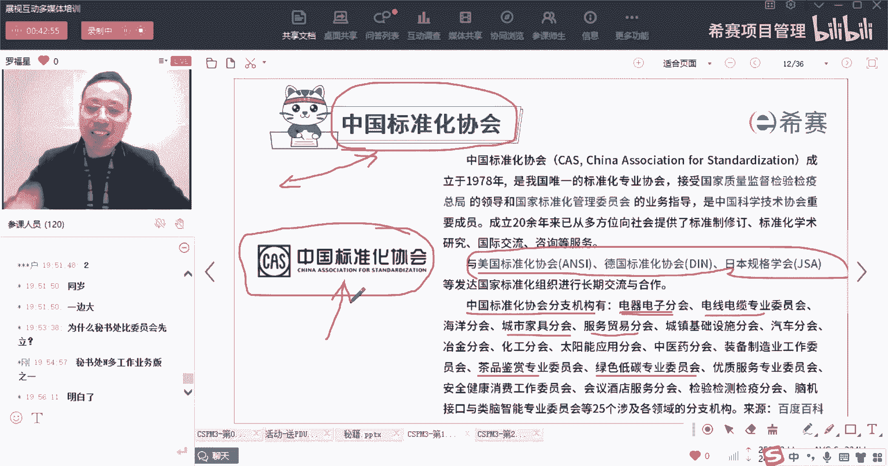

# 【收藏】CSPM-3中级项目管理认证考试直播课精讲视频合集（零基础入门系统教程）！ - P4：CSPM长空1-4中国标准化协会CAS - 希赛项目管理 - BV16p42197SH

然后接下来再来认识另外一个，叫中国标准化协会，也就是刚刚第三道题目的正确答案，那中国标准化协会请注意哦，他不是专门为这个为这个谁来做秘书处的哟，他本身在没有这个事情之前，就已经有这个社会团体了。

他就已经有了，他在1978年的时候，就有78年的时候你出生了没有出生的，敲个一，没有出生，敲一个案，1978年的时候你出生了吗，兄弟们出生了，敲一个一，没有出生，敲一个二，所以他在1978年的时候。

我那时候还没出生啊，我没有很老啊，兄弟姐妹，我才我是81年的，我知道你们有人好奇我哪一年的，97年的小弟弟叫叔叔啊，那中国标准化协会它的那个简称叫CAS。

CAS叫china association for denzation，叫CAS中国标准化协会，那这个中国标准化协会是由1978年成立，是我国唯一的一个标准化专业协会，OK所以它是属于一个社会团体。

它属于一个协会标准化专业协会，他同时也是接受国家质量监督，检验检疫总局的领导，以及国家标准化管理委员会的业务指导，并且他同时是中科协，叫中国科学技术协会，中科协是中科协的一个重要的组成成员。

他成立了有几十年，那就不是20年，应该是成立了40多年啊，成立了40多年，他也是向社会提供了很多的这种标准的制定啊，修订啊，标准化的这种学术研讨呀，国际交流啊，所以也就是说刚开始的时候。

我们不是看到这里有一个这个嘛，就全国项目管理标准化技术委员会，他要去承担一些就国内的一些标准化的制定呢，还有一些国际的一些交流事项吗，那有一些事情谁具体去落实呢，哎由中国标准化协会它来去负责做。

所以所以你看他会做了很多事情，做了很多这种标准的制定啊，修订啊，然后交流啊，咨询啊等等，这是中国的标准化协会，你看这里有一个叫美国的标准化协会叫NC，还有一个叫德国的标准化协会叫DIN定。

然后还有的是日本的规格协会嗯，那肯定也就是相当于日本的标准化协会，叫JSA，我们的这个中国标准化协会，跟他们之间有很多这种长期的交流和合作，那这一句话其实在告诉你一个什么信息呢，他是要告诉你一个信息是。

这个中国标准化协会，它的地位相当于美国标准化协会，德国标准化协会，日本规格协会在他们国家的地位，秘书处不是专门为这个事情而成立的，而是说这个事情他需要一个秘书处的时候。

那么谁谁来做我的秘书处，就算中国标准化协会，它不是你的秘书处。

它依然也是成立的，他自己是一个独立的单位，它本身就是一个独立单位，只是说在这一年的时候，在2008年的时候，成立了这个叫全国项目管理，标准化技术委员会以后，然后去设定秘书处的时候。

把这个协会来作为他的秘书处，你做他的秘书处，以后呢其实关于秘书处它到底是什么概念，我不是很清楚，但是从字面意思来讲的话，也就是你去承接很多具体的工作，包括去推进这个项目管理，专业人员能力评价等。

都是由秘书处来去负责落实，负责去进行，还有包括说像像像在这里，这里有一个叫成熟度评估的这个分技术委员会，对吧，那么他也会有一个秘书处，那么这个秘书处，你看它是叫上海市质量和标准化研究所。

而这个单位呢也是成立了很多很多年，他是很久很久以前就已经有的。

它并不是在最最近这一年才成立的，可以理解吗，这是关于这个秘书处啊。

你看同时呢它底下会有很多的分支机构，中国标准化协会的分支机构，里面有电汽电子分会，你看我们说它是属于什么，属于那个就是全国项目管理的标准化协会，下面的秘书处，可是他除了有项目管理协会。

它有电紫电器的协会，电线电缆的专业委员会，有什么城市家具的服装贸易的，然后什么绿色低碳的，然后茶品鉴赏的，所以这个中国标准化协会，它不是专门为这个谁谁而准备的。

他自己本身是一个独立的一个社会团体，一个社会性的团体，他不是专门为他而成立，不是专门为这个TC343而成立，而是在全国项目管理的标准化技术委员会以后，需要一个秘书处来承接很多具体的工作内容。

那么就安排了这个中国标准化协会。

来作为他的秘书处，是这个意思啊，同时如果你们拿到了一个cs pm的证书呢，就是由中国标准化协会来给你盖章的啊，是由他来给你盖章的。

