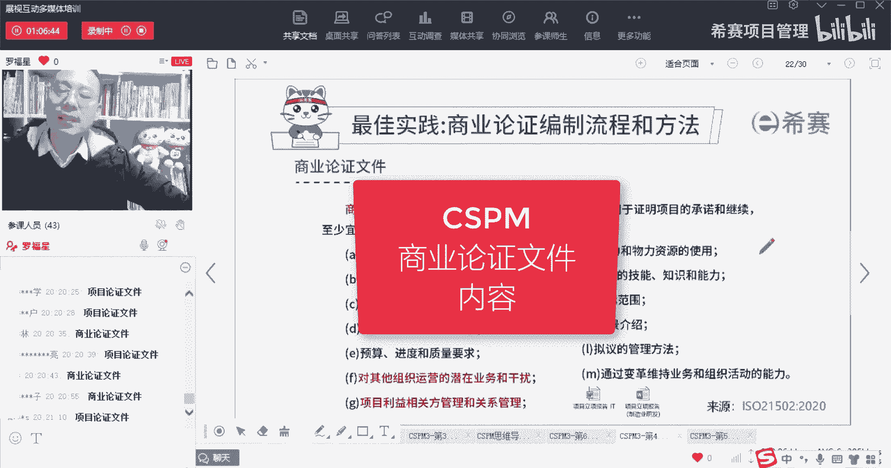
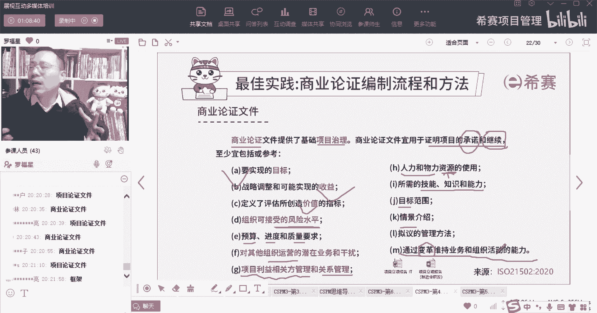

# 【收藏】CSPM-3中级项目管理认证考试直播课精讲视频合集（零基础入门系统教程）！ - P44：CSPM长空4-9商业论证文件 - 希赛项目管理 - BV16p42197SH

那整个商业论证文件呢，它其实包含很多很多东西，商业论证文件，它是能够为我们整个项目来提供一个治理，治理，我们在前面学过了，是不是有印象吗，我们说治理，其实你可以把它简单理解为是搭搭框架呀，搭环境啊。

搭台子呀，来去定基础啊，定规则，定要求啊，搞制度啊，然后确保确保这东西能够怎么样去进行对吧，那么商业论证文件，它其实就是我们这个项目的一个项目治理，OK它就是一个基础的项目治理，会考的啊。

兄弟们这就会考的，然后呢整个商业论证文件，他说应该要去用来证明这个承诺和值得继续，所以这里面还有一个词，他除了说你刚刚开始觉得值得做，同时后面还有一个词叫继续这个词。

它告诉你我们在过程中也要进行商业论证，在过程中也要进行商业论证，OK商业论证里面可能会包含很多东西，包含项目的目标啊，包含可能我们想要去实现收益呀，这个项目它能够创造这些价值。

哪些哪些哪些指标去评它的价值，还有就是可接受的风险水平，我们这个项目还有这个风险水平，最高在在多大之内，我们是OK的，超过的话，我怎么怎么样对吧，还有什么预算进度质量的要求，以及一些啊。

与对其他的组织运营的潜在的业务和干扰，其实也就是说可能对其他的运营有一些影响，也是什么样的一些影响，还有要管理利益相关方，还要管理关系，还有资源管理，人力和物力，资源管理，对不对，都是资源管理。

人力物力资源管理，还有我们所需要的一些什么技能知识和能力，这也是资源管理中的内容，还有目标的范围情境，以及什么什么管理方法，以及诶这里有一句，通过变革来维持业务和组织活动的能力。

也就是说有可能我们会我们做项目本身，它能够去产生这种商业变革，产生这些业务变革，这个业务变革，其实不是说，真的是把这个业务线做了一个变革啊。

这个业务变革是说诶我多了一个什么东西出来。