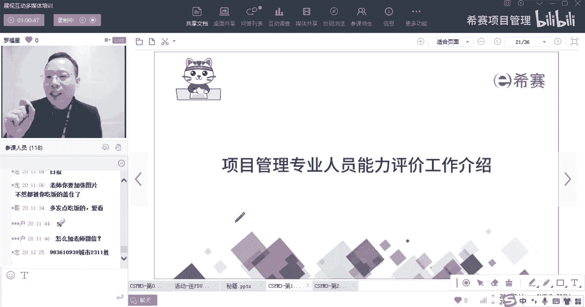
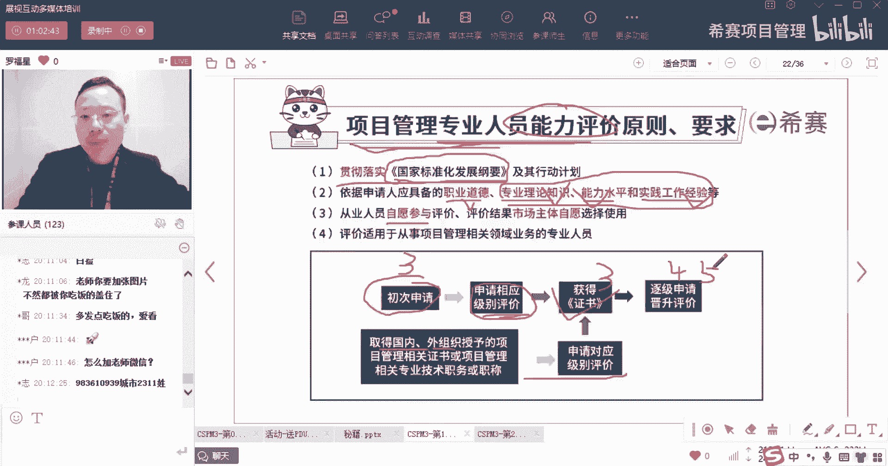
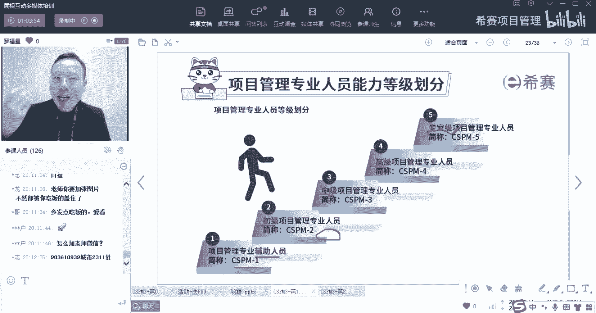
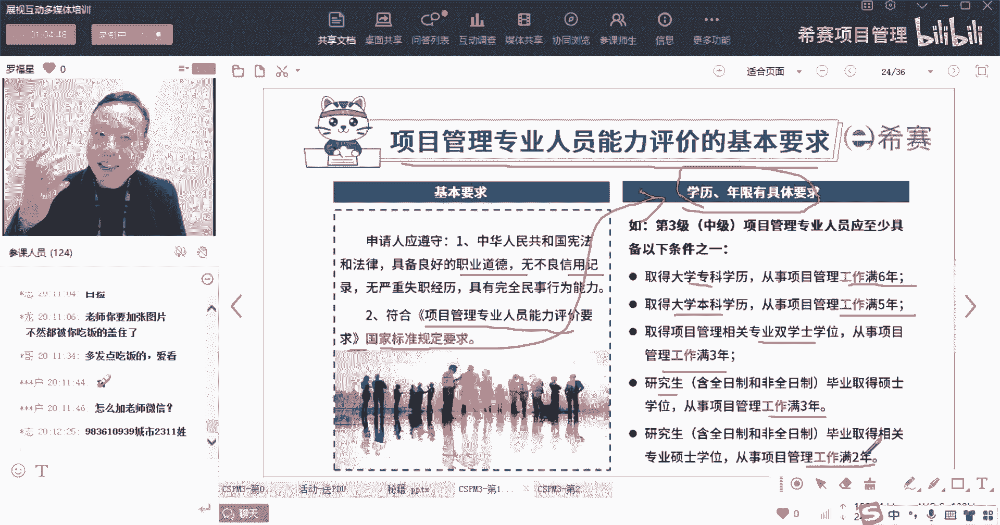
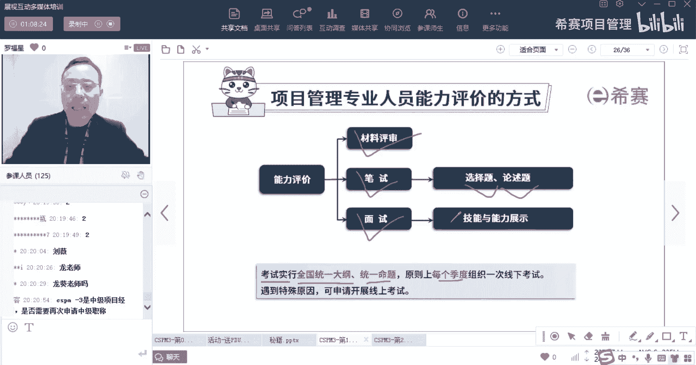
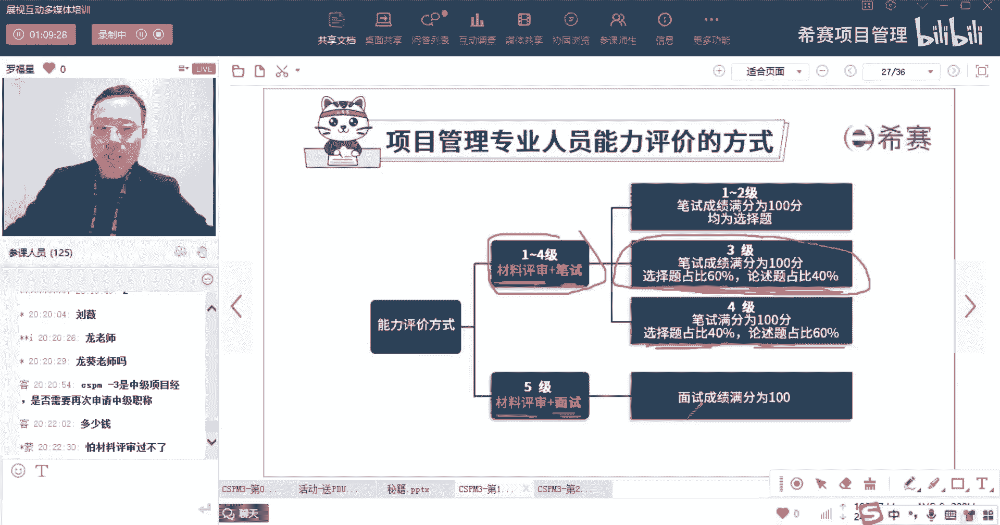

# 【收藏】CSPM-3中级项目管理认证考试直播课精讲视频合集（零基础入门系统教程）！ - P6：CSPM长空1-6CSPM考试评价方式 - 希赛项目管理 - BV16p42197SH

接下来是第一章的第二个板块，叫项目管理专业人员能力评价的工作介绍。

那么他的这个评价介绍中有什么呢，首先第一个是国家有一个政策，国家一个叫国家标准化发展纲要，国家标准化发展纲要里面它会有很多内容，我们在第13章的时候再展开讲，在这里先不说。

你只要知道说我们做了很多这种关于项目管理，专业人员能力评价，它是贯彻了这个国家标准化发展纲要来做的，然后呢申请人要有职业道德，专业知识能力水平，实践工作经验诶，你会发现这里很有意思，他讲的有四个点。

一个叫职业道德，职业道德一般是我们不管任何行业都要有对吧，除此以外有专业知识能力水平，然后工作经验他会特别强调这个，而事实上整个关于项目管理，专业人员能力评价要求，因为他一直会强调这三个方面。

这三个方面会很重要啊，一直强调啊，然后呢，就是所有的从业人员是自愿来去参与评价，然后评价结果也是跟他说，跟市场主体自愿选择去使用，那么评价方式是怎么评的，就是关于这个项目管理专业人员的那个能力。

评价怎么评呢，第一次你自己申请啊，你申请比方说你申请的是三级对吧啊，建议大家直接申请三级啊，我们就来看参考试的评价，咱们这个评价其实就是考试啊，你考试通过了，那么你就获得这个三级的证书。

你要是考试没有通过，下次再来对吧，还有一个路径是，你如果取得了国内的某一些那种资格认证，或取得一些国外的某些组织所授权的，这个项目管理的这个资格证书，那么对应的我们就可以去直接申请，就不要去考试了。

那么这个呢等会也会给你讲到好，你申请到了某个级别，比方说申请到三级以后，后面就是可以去逐级申请四级，再逐级申请五级，他会有这个过程。

那整个考试一共分到了五个层级，第一层级叫辅助人员，叫一级辅助人员主要干什么呢，辅助人员就是比方说诶你专管风险哎，在风险这个板块来去做一些支撑，你专门去管这些进度，那你就辅助去做一些进度。

专门做一些什么政治管理，政治分析等等啊，做一些数据收集呀，信息收集呀，做一些需求分析啊等等，你就是去辅助项目经理，第二个级别是初级，初级呢他叫初级项目管理专业人员，就是能够去管这些比较相对比较。

简单一些的项目，就是一般般的这种项目不是很复杂的项目，然后到第三级，第三级叫中级项目管理专业人员，他就是说可以管理类型复杂的项目，什么叫复杂的项目呢，就可能这个项目本身它的环境很复杂。

也可能说是这个项目，它本身它这种变动特别频繁，还有可能说是内容很多很繁杂啊，都可以，然后再到后面的第四，叫高级高级项目管理专业人员，他就是可以管理一些什么那种什么项目组合呀，还有一些更多的这种人。

还有国际化的一些项目呀，到后面专家级，专家级呢就是可以去参与制定标准，参与去制定一些国家标准啊。

会有这样一个要求，你会发现项目管理专业人员的评价要求，对这个基本要求是什么呢，首先第一个是要遵纪守法啊，遵纪守法的公民，法律呀，有良好的职业道德呀，没有一些不良的信用记录呀等等好。

还有第二个是符合项目管理，专业人员能力评价要求的，这个国家标准规定要求有什么，比方说像这里有一个叫学历年限的要求，这个学历年限的要求，这里面其实焦点是什么呢，焦点是工作经验啊。

他会讲的说是如果你是大专学历，你要有6年的项目管理工作经验，如果是本科学历，有5年的项目管理工作经验，如果是双学位，有3年的项目管理工作经验，然后如果是研究生啊，3年的工作经验。

研啊那个什么非日制的两年的工作经验，所以他其实是对于大家的这种工作经验。

他会更加的看重好整个它的这个评价呢，它是这样的，整个评价呢它会有一个是要材料的评审，然后呢有笔试，有面试，考试是用全国统一大纲统一命题，原上每一个季度考一次，那么我们今年的考试呢哎也有四次。

然后呢他的考试是这样考的。

就是如果说是考1~4级的话呢，就是材料评审加上笔试，材料评审加笔试，那么这个材料评审加笔试的话呢，就是说你要去填若干的一些资料过来，然后交照片过来对吧，然后加笔试。

笔试的话我们直接建议大家直接从三级开始啊，那个二级也没什么好考的了，直接从三级开始，三级呢笔试是有100道单项选择题，那么这100道单项选择题占比占到60分，然后还有论述题，两道两道论述题占到有40分。

材料评审刚开始的时候，刚开局的时候都是比较放水的啊，你如果考过了偏僻的话，你就可以直接那个啥呃，但是如果说连PMP都没有考过的话，如果连P都没有考过的话，那可能就会稍微那个一点，到时候你联系一下。

说一般应该是可以的，然后到后面的四级呢，就是考试选择题占40%，然后论述题占60%，然后到五级呢就没有考试了，到五级的时候就是面试。

