# 【收藏】CSPM-3中级项目管理认证考试直播课精讲视频合集（零基础入门系统教程）！ - P8：CSPM长空2-1项目管理专业人员能力评价要求 - 希赛项目管理 - BV16p42197SH

大家晚上好，欢迎来到西三网专业的职业教育平台，我是罗福兴，那今天晚上我们一起来分享的是，CPM课程的第一节正课呃，今天晚上刚刚已经讲过了第一章，接下来呢讲的是第二章，叫项目管理专业人员能力评价要求。

那项目管理专业人员能力评价要求，其实也就是来自于这一本教材啊，也就是来自于这本叫啊国标41831啊。

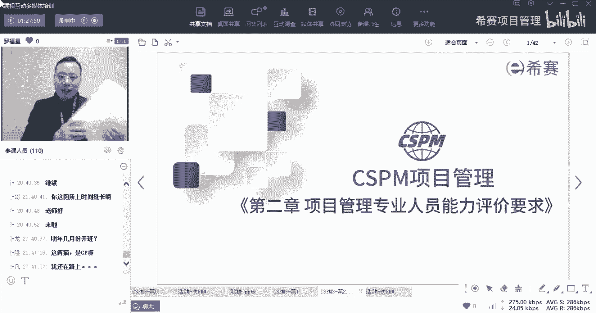

那这本国标41831，他的它里面的这些内容呢，考试分到两块，一块呢，是关于项目经理和PMO人员，能力评价的五个层次哦，你真的是你认真看完这五个层次以后，你会有一个很大的一个视野的开拓。

就是如果说你自己是做老板呢，或者说是你给公司做，就是做一个高层，做一个高层管理者，你知道哦，原来给员工去分层，有这么多地方可以区分，它是可以帮你去做一个很好的分成，没有这本没关系，没有这本的话。

你联系一下销售这个东西，你可以联系销售，他会给你发一个电子版，因为哦我知道了，因为我我知道了，我那我开始还是拿错了，是因为这本书是不可以盗版的，所以呢你可以他会给你发电子版，可以我拉错了拉错了拉错了。

尴尬了，他可以，你可以跟销售去发这个店就联系啊，好不好，万总跟销售去联系啊，他会给你发一个电子版给你，因为这个东西的话，我们不能够直接帮你打印的那个，因为它上面已经明确明确标注了，说不能够请全好呃。

一个呢是会讲到项目经理和PO，他的这个能力进阶的五个层级，我真的是觉得这一段写的非常好，然后第二个呢是第三级，项目管理专业人员人员能力评价的详解，也就是说咱们考的这个CSPM杠三。

他对你的这些具体的人员能力评价要求是什么。

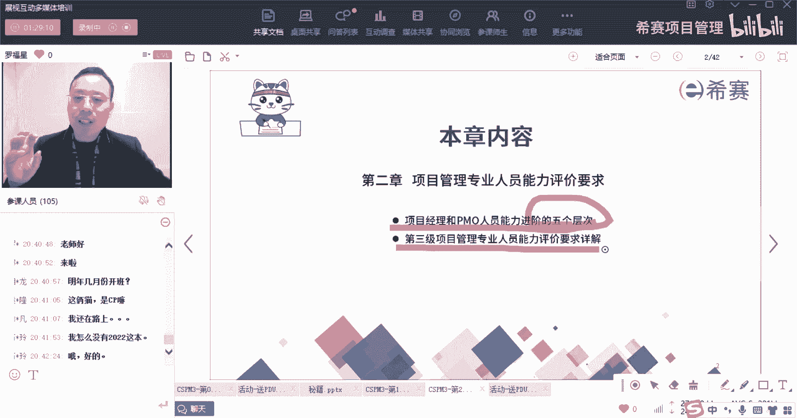

我们一起来看一看，首先呢你得要去指导下，关于项目管理专业人员能力评价要求，它是一个国标，它是一个国标，它是国标，推41831杠2022，所以它里面有两个信息，第一个信息是它是它是一个国标。

还是一个行业标准，还是一个企业标准，它是一个国家标准啊，这个项目管理专业人员能力评价要求，是一个国家标准的这一个，第二个呢是他是哪一年发布的，是2022年发布的，也就是去年发布的啊，他是去年发布的。

其实还有一句话是什么呢，还有一句话是在第三第13章的时候会讲的，第13章的时候会讲的是什么的，超市它是我们国家自主研发的啊，这个这个标准是国家自主研发的，是我们国家自主研发的。

这个不是也不是那种靠国际标准来统彩的，是我们自己来去研发。

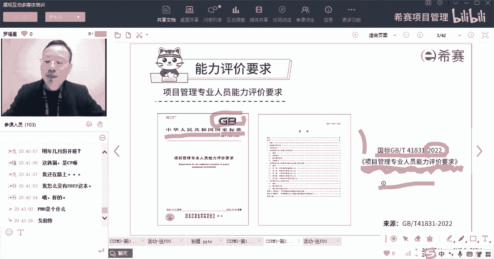

好，来看一下，项目管理专业人员能力评价要求，是2022年发布的什么标准嗯，是国际标准，国家标准，然后是行业标准还是团体标准呃，所以王总可以得到我的第一个课堂小礼物啊，今天王总可以把名字敲一下。

它属于一个国家标准啊，兄弟们，这属于国家标准，它属于国家标准。

它不是那个行业标准，也不是团体标准，它属于国标，它属于国家标准。

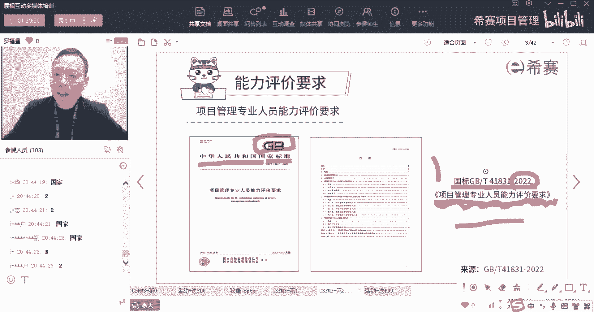

OK然后呢，它是2022年发布的，然后它规定了什么，它规定了项目管理专业人员能力评价，一些术语啊，定义啊，能力评价的维度啊，以及什么能力划分的等级呀，几个等级呢，五个等级，五个等级。

我王志斌是那个有40，是那个说自己年龄年龄远大的王志斌吗，也许我记错了，要是我记错了，不好意思啊，然后我OK那看来我没有记错，OK差不多对吧，那么它里面会告诉我们说是关于项目管理。

这些个这个标准里面有什么能力分五级，然后每个等级它对应的这些核心能力要求，评价方法，评价结果等等，所以这个文件是一个国家标准啊。

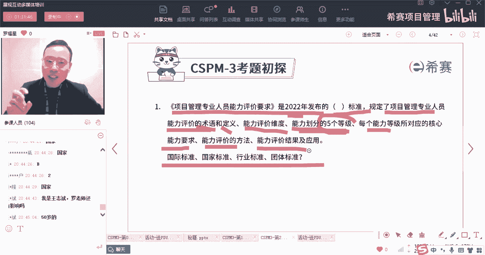

是一个国家标准，然后这个国家标准里面谈历了很多很多，很多很多信息。

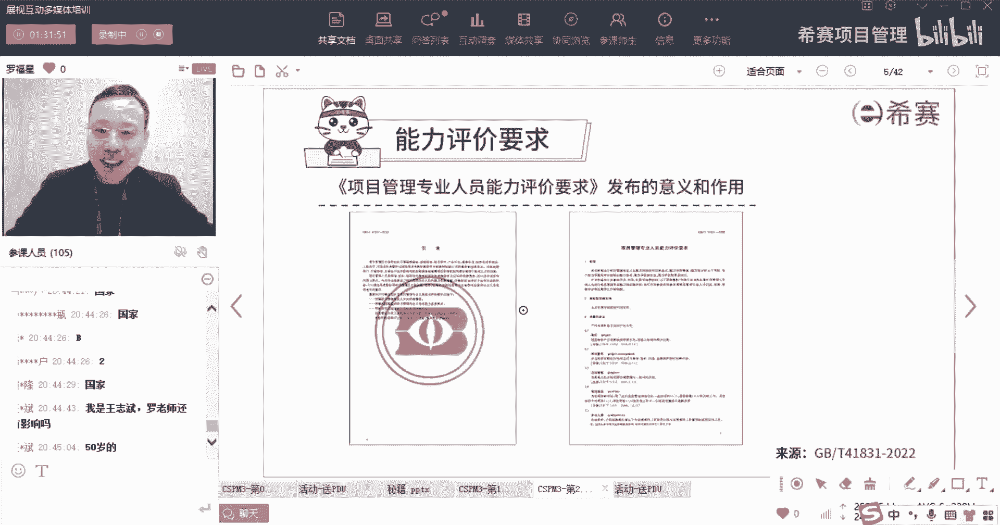

那我们看一下它到底列的这个五个成绩是什么，他说关于项目经理和p mo人员PMO是什么呢，刚好有同学在问PO的英文叫啊project management office。

project叫项目management，叫管理office，叫办公室，项目管理办公室，可能你们公司有项目管理办公室，也可能没有项目管理办公室，但是有一些公司它会有叫总裁办，他可能有一些叫总经办。

可能会有一些叫什么什么什么别的，这种什么什么知识办公室，他可能会冲淡了这个PMO的这个，这个类似的角色呃，他是干什么的呢，就是如果说你你们呃，你们公司有这样一个岗位的话。

你知道他会去把公司的各种项目管理的标准，规范，把它整理起来以后，再要求各个项目都按照这个标准规范来进行啊，是这样的一个意思，你也可以去做小弟，你也可以去做小弟，他又不是说都是老板才能够进。

你可以是他也需要小弟弟，小妹妹来去做，做具体工作的人员呢，好那我们来看一下关于项目经理和PMO的人员，他的这个能力进阶的五个层次。

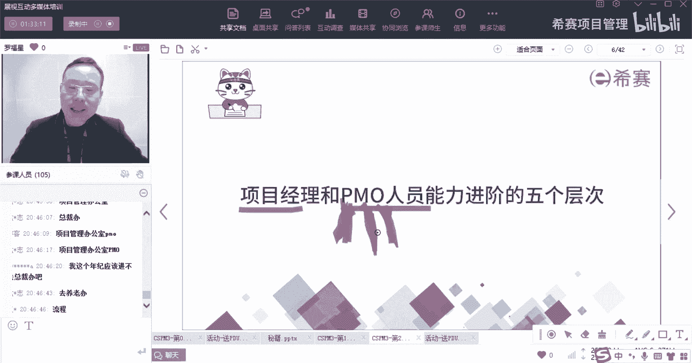

首先他说整个咱们这个项目管理专业人员。

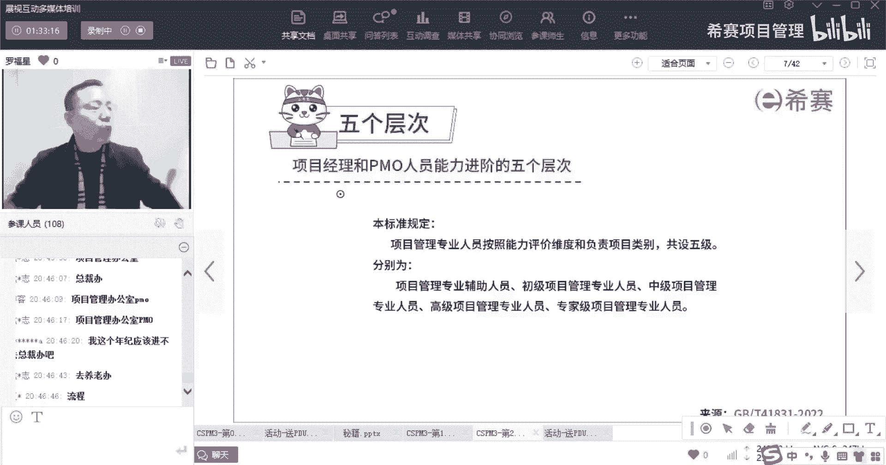

能力评价要求这个国标，这份国标里面呢，它会规定的是说我们的这个能力评价维度，和负责的这个项目的类别，一共是有五个级别，分别是辅助级，初级项目管理专业人员，中级高级以及专家级，所以这个你也要记得。

就是初级中级高级以及专家级，在底下，还有一个辅助人员，胡志明，就他他他都还没有达到，那种说去管理项目的这个程度，这是辅助对辅助级初级中级高级和专业级好。

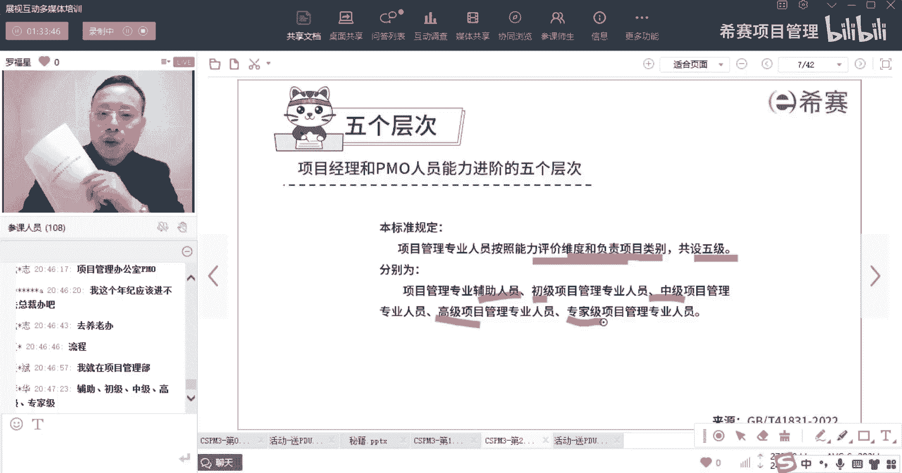

然后呢，他的那个评价维度呢是从这三个维度来进行的，一个维度叫专业知识啊，就是专业知识这个维度，一个维度呢是能力素质，就是能力素质，这个维度还有一个维度是实践经验，从经验这个维度。

然后这个能力数值里面又会有环境的，环境的能力，个人能力和技术能力等等这些内容，那么这里面就是有一个题目中考过，前面已经看过啊，前面有个题目的考呢考什么，说是他会关注实践经验，那他会很关注这个实践经验。

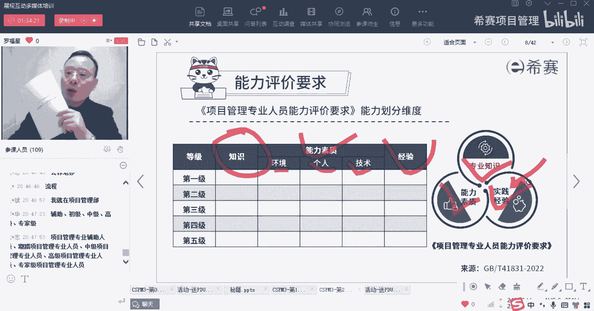

那么这些东西它到底是什么差别，什么意思，等会我们也会看到好，来先看这个题目，闭着眼睛可以做的出来，是不是有一道题目是这么考的，他说项目管理专业人员能力评价，要求他对于专业人员能力评价的维度呢。

有知识的维度，有能力素质的维度，同时呢还会有什么的维度，还有经验的维度哇，梦总梦总这个是志在必得，必须要得到我的一个柯南小礼物，是不是梦总mod把名字敲一下啊，好孟伟至孟总，OK到时候记得联系销售啊。

我到时候会把你们的名字都发给，发到我们的那个自己内部的一个沟通群里面，到时候联系销售好，所以呢这个考试题目他就这么考的这么简单，就是如此简单，就说我们的能力评价的维度有三个维度，一个是知识的维度。

一个是能力素质的维度，还有一个是经验的维度好，另外第二个题目如果是对就答一，如果是错，你就答案，第二个题目他说是商业敏感度，它属于项目管理专业人员能力评价要求，对于专业人员能力评价的维度是对的吗。

是对的就打一，错的就打二，商业敏感度，是不是属于项目管理专业人员的人民评价要求，里面的一个评价维度，答案是NO啊，答案是NO啊，答案是二啊，因为他的那个评价要评价的维度只有三个，一个是知识，一个是能力。

一个是素养。

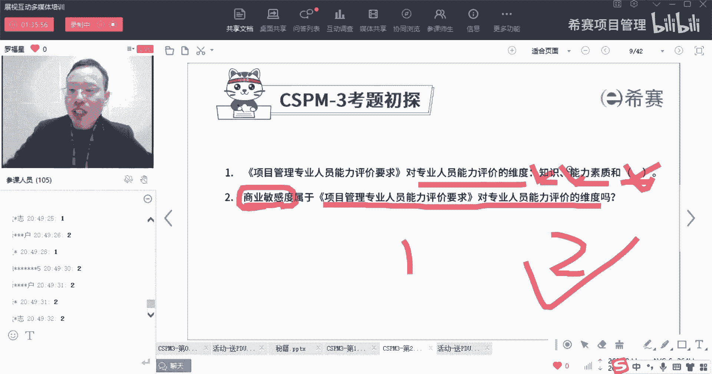

那一个是经验，OK也就是说他的评价维度就是这三个，就是从这个专业知识，能力，素质和实践经验，这三个商业敏感度，对于商业敏感度它是属于里面的之一，但是它不是一个大的维度，它是属于里面一个具体的一个细节的。

技能或技巧，它属于一个具体的几个技能或技巧，它不是属于一个维度维度，它只有这三个，一个是知识的维度，一个是能力，素质的维度。

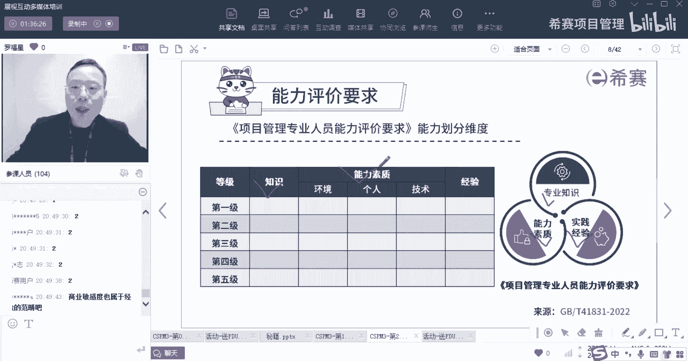

一个是经验的维度，是这样子的。

