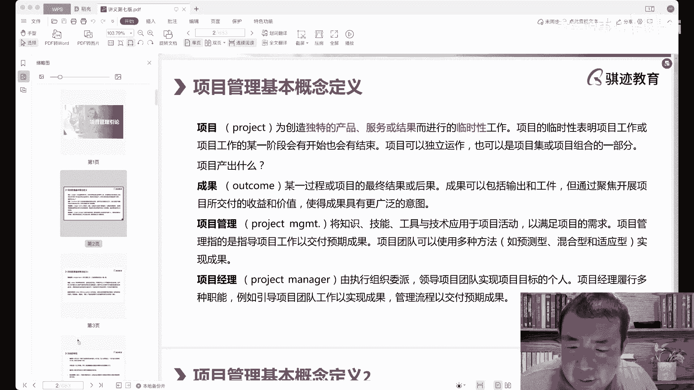
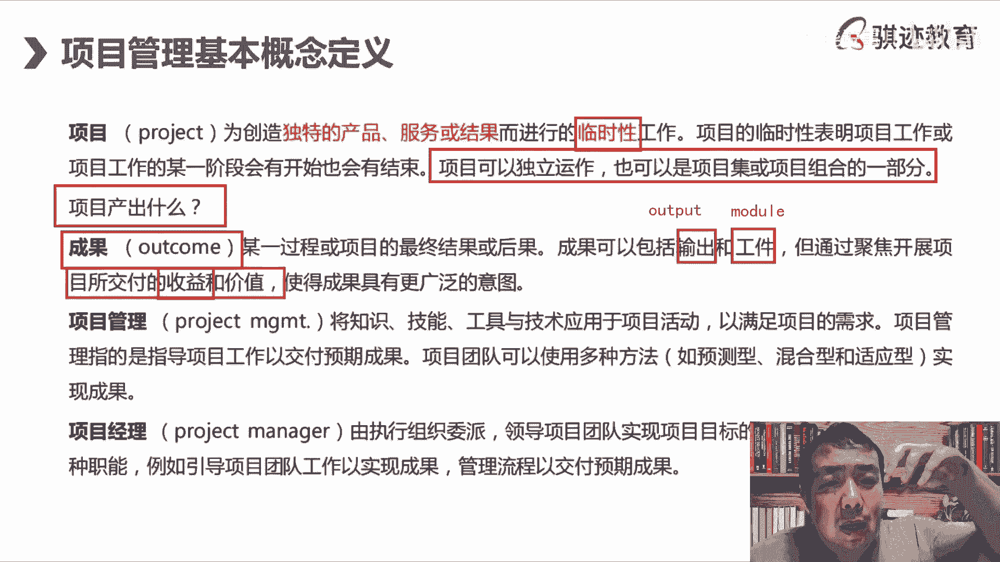
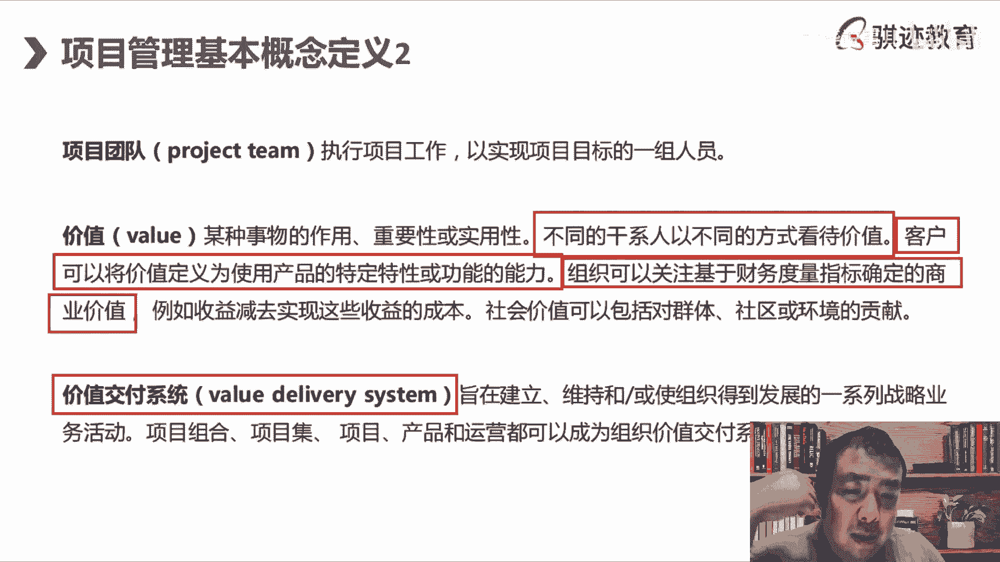
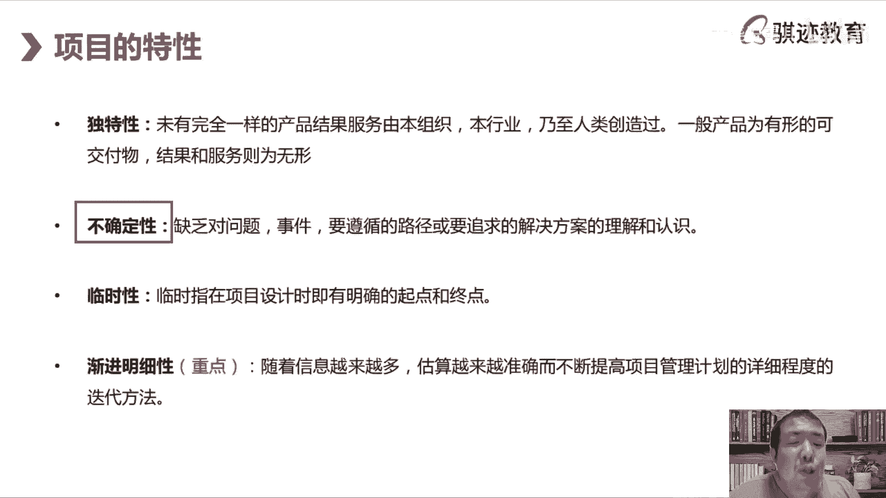

# （收费视频完整版分享）PMBOK第七版课程PMP考试报名认证培训精讲-零基础项目管理第七版教程最新版直播课回放视频免费课程资源-骐迹教育谢阳主讲 - P1：1-1项目管理引论 - 老尧说事儿 - BV1ek4y1s71N

好那么项目管理的理论，那么首先我们会定义一下，项目管理是什么东西啊，我们会定义下项目管理是什么东西，项目管理是一帮临时的人进行的临时性的工作，然后创造的是独特的产品成果服务啊，这是项目概念的定义。

Project，那么project这个词是怎么来的呢，All right project，大家如果英文比较好的话，其实可以发到群里啊，推荐我们在那个小儿童的平台上，可以可以阅读啊，大家可以在平台阅读。

然后纸质的也会寄给大家，那么project这个词来自于呃，英文的另外一个词叫做project，所以大家如果知道幻灯片大一英文就叫project project，所以项目最初的管理其实它的形式很有意思啊。

当然我们现在开始讲的会比较慢一点啊，项目一开始的管理形式其实很有意思，就跟放幻灯片一样，将项目管理的整个过程像换以前的幻灯片，大家可能没有看过啊，幻灯片以前是什么，它是一片一片一片一片的透明的胶片。

然后放在这张p d d power point，然后一片一片的在那个光源下一片一片的抽动，然后呢图形的变化来解释项目的过程啊，这就是project，所以项目最初它的一个表现形式是什么啊。

就是将一整个独特的工作安排，分割成一片一片的过程演示给别人看啊，这就是项目，所以项目在管理定义上啊，这是正式的定义，大家要记住啊，学过学过，接下来PMP项目管理，那就要知道项目管理的定义是。

首先要创造独特的产品成果服务，那么什么叫独特的产品文文书啊，就是你所在的组织，你所代表的群体从来没有做过，之前没有做过一模一样的，可能有类似的，但是不是一模一样的，从来没有做过一模一样的类似的结果出来。

产品成果服务出来，那么它就是一个项目啊，那么为什么叫产品成果服务呢，如果你的项目中创造出的是一个有形的东西，我们称之为产品啊，product产品product，那么如果你创造出的是一项啊。

如果你创造的啊，我们就好了啊，我在PPT上传好哎。

这就是小额通不太好的一个方面，就是小合同，每次呢就是说我上课呢可以重新上传一下啊，得重新上传一下，嗯嗯啊啊好，那么大家就可以看到啊，那么继续，那么呃，独特的产品是产品指的是有形的结果，服务指的是什么。

使那个过程它没有特定的结果，但是它有啊交付价值的那个过程称之为服务啊，服务在那个当中定被定义为是，买方和卖方共同努力，产生一段对于卖方和买方来说，有价值的那个过程，称之为服务啊，比如说我们去饭店吃饭。

他就是一个服务，比如说我们去澡堂里搓澡，泡澡搓澡，他就是个服务，服务讲究的是一个过程，能给买方带来有意义的结果，有价值的结果就是服务，那么什么是结果呢，它是一种状态啊，项目的第三种呃。

可以达成交付的价值，交付的形式是什么，是结果，结果是一种状态，它呢是我们能够作为乙方，就是我们的项目的交付方给被交付方，给对方一个什么想要的一个最终的状态，结果比如说我们是我们这个项目。

我们的项目目的是什么，能够让客户比如说是呃生产出啊，能够让客户能生产出啊，他想要的啊产品，那么我们这个项目可能是什么，是一个生产流水线的安装项目啊，我们流水线呢是买来的，不是我们项目创造。

但是我们项目的结果是什么，能够让客户正确的使用这条流水线，能够问客户安装使用这条流水线，这就是一个结果啊，这个结果比如说再举一个比较简单的，容易理解的例子，什么是结果，比如说天马上就热了。

很多人在家里呢就是要什么啊，打扫卫生，打扫卫生它就是一个结果啊，作为买方来说，他并不一定喜欢打扫卫生这个过程，但是他肯定喜欢卫生，被打扫干净以后的这种结果，他是想要的，所以他不需要这个过程。

也没有具体的产品，但是会想要他期望的那种结果，称之为啊结果就是这么个意思，所以项目就会交付独特产品，承诺服务所做工作，那么临时性怎么讲呢，临时性怎么讲呢，临时性指的是这个未交付独特的产品成果服务。

而进行的工作，它是有时间段和时间开始和终点，有一开始就明确的项目开始和终点，有开始有结束，但是这个是以临时性的，可能会跨度很长，也可能会跨度很短啊，那么就像我一直喜欢给大家举举个例子。

我们每个人都在做一个项目，这个项目叫人生，当你哇哇落地的时候，别人落地就哇哇的从娘胎里出来的时候，你的人生这个项目就开始了啊，当你来自于尘土归于尘土的时候呢，你人生的这个项目呢也就结束了。

打人不会永生对吧啊，永生是个美好的愿望，人不会永生，但是人在这个世界上来，每个人其实都在经历的是一个项目啊，它带来的是独特的产品中，每一个人的人生都是独特的是吧，当然我们就不讲了，太那个啊太太哲学了。

这个东西不太好啊，就是我们给大家明白一下啊，所以任何事情都是内容，那么有一些事情呢他就不是我说什么，这不是项目，比如说生物的繁衍啊，繁衍后代种族的繁衍，它就不是项目，为什么它周而复始的一代又一代。

一代又一代基因传承下去呃，没有起点，也没有终点啊，可以我们可以近似的看作是既没有起点，也没有终点，所以它就不是一个项目项目一个特点，它一定会有起点和终点，这个起点终点是在一开始就被设定好。

每个人都有一个出生，每个人都会有一个结局，对吧好，那这就是项目啊，我们讲的非常帮助的理解，非常非常哲学一点啊，那么项目的临时性表现在哪里啊，项目的工作会在某一个阶段会有开始和结束。

项目可以是独立运作的啊，注意这一段呢就是PMBOK第七版的啊，一种一个表述了，项目是可以是独立运作的啊，项目是可以独立运作的，也可以是什么呃，也可以是项目或者项目组合的一部分，也就是说一个项目。

它可以依靠自身独立的运作下去，它也是可能别与别的项目一起，为了实现一个更高层次或者更宏大的结果，而一个组成部分啊，这就是我们后面讲的项目集和项目组合啊，那么以下部分注意了啊。

如果你们学过PMBOK第六版的话，那么注意了，以下部分的学习是第七版的新表述啊，项目产出什么，我们前面讲了，项目是为了独特产品，人工服务去产出的对吧，但是从抽象概念上注意啊，就考出来了。

它的产出叫做成果啊，注意独特的产品中，成果服务最终是项目的最终结果或者后果，它叫做outcome，outcome是可以包含了输出，叫做output和弓箭model啊，那么有些同学说老师这个我有点晕啊。

不要急，我先给你们写的啊，只要alter，这叫弓箭m o d u l a model输出与弓箭啊，那么这句话怎么理解呢，就是我们打个例子吧，我们先举个例子啊，我们可能为了能够生呃，能够创造出一个嗯。

如果我们是上帝啊，我们这样举，如果我们是上帝，我们可能会为了创造出一个智慧生物，可能会什么创造过很多遍地球上的生物形态，直到有人的出现，所以每一轮地球上的主导生物嗯，卡了吧，没有卡，有人卡吗。

没有我的网络很稳定啊，好就是我们每一轮地球上的主导生物都是，如果有上帝或者有神或者造物主之类的，神明存在的话，都是造物主的output，但是只有人类最终成为了outcome。

那么来啊啊这个稍微扩展一下啊，给给大，就是今天我上课啊，给大家一开始就是说有有有有个理念，你们知道吧，在人类统治地球之前，地球上有多少轮生物啊，生物讲的是生物统治的地球。

最后才演化出了人类这样一个智慧生命群体，满一开始啊叫做艾迪卡拉纪的生物大爆发，然后再从生物从一个细胞，单细胞多细胞状态变成什么，有开始有各种各样奇形怪状的形态，最后出现了第一轮海洋生物啊。

比如说那个海洋呃，呃地球历史上的啊，最初的呃就是说杀手叫做奇虾啊，大家可以去看一下，就是古生物奇虾，后来呢又变成什么角石啊啊啊啊，变成了90，后来又变成什么啊，三叶虫，然后呢。

又变成了我们那什么那个那个巨型的那种，什么鱼鱼类对吧，然后又演化出了恐龙，然后一轮又一轮主导地球生物的都是输出，但是这些输出如果你是一个地球主宰的，就是上帝的话，这其实并不是你想要的。

另外就比如说我们现在以恐龙为例啊，啊，虽然现在我们不一定说恐龙一定不是智慧生物，但是从啊人类目前对于恐龙的化石和研究看来，恐龙应该不是高度智慧的生物，跟人类远远不能相比啊，恐龙在地球上统治了将近2亿年。

它是呃如果地球有造物主的话，是地球造物主有史以来最杰，人类之间最杰出的auto，但是它却不是造物主想要创造出的，智慧生物的outcome，结果造植物，植物想要创造什么，是从高度智慧和聪明的生物啊生物。

所以造物主用一场陨石撞地球，和一场地理大灾变，将恐龙从地球上抹去，然后作为哺乳动物的祖先的人类，从那个像小耗子，小老鼠，小猴子这么大小，开始慢慢慢慢慢慢慢发展，然后呢呃因为机缘巧合。

最终形成了造物主想要的智慧生物的结果，就是outcome，所以outcome是我们回来回到理论来，什么叫outcome嘛，就是我们想要的最终结果，理想结果，为了这个理想结果，我们会会创造。

项目中会创造很多的实际结果，但是这些实际结果，都是为了这个奥斯卡和奥斯卡服务的啊，我们再举一个不太值，就是说比较接近现实的，我一直喜欢举的例子，比如说大家爱迪生发明灯丝，大家都知道吧。

爱迪生发明灯泡灯丝，爱迪生output就是输出了2000种灯泡的灯丝材料，但是最终只有钨丝类的这种灯丝，最后成为了能够担当有效的灯丝的，灯芯的那个灯丝的那个电灯的灯芯，灯芯那个结果啊。

结果以及这个灯芯应该做成多系通多少电啊，与之相对应的呃，说明技术工艺流程，这些都是叫做module啊，弓箭这个两个有效的结果形成了啊，人类啊工业时代的一个非常伟大的发明，叫做灯泡啊。

灯泡是我们人类第一次用燃料，能源之外的能源实现了照明，实现照明啊，所以你们知道吧，就是说呃呃通用电气通用电气啊，呃通用电气什么部门都能卖，但是有一个部门他不会卖的，不靠这个挣钱，就是照明部门。

因为照明部通用电气的照明部门就是什么，这是人类电气照明的老祖宗爱迪生发明的灯泡，然后入股生产的，知道吧，一直延续到现在，这个部门通过，那就什么都能卖啊，啊极易什么都能卖，唯有照明部门是不能卖的。

这是主业啊，这就是奥斯卡啊，我开个玩笑啊，你明白了吗，这是我们最终想要的结果，它可以体现什么，通过啊，通过这聚焦展开项目所交付的价值，使得成果具有防范的意义，这才是我们想要的东西。

Outcome outcome，有时候是抽象的，你有时候是具体的，德勒斯本身其实并没有原因，但是它在通电的情况下给人类带来了光明，这种光明是人类历史上从来未有，唉你们可能不太意识到电灯所带来的光明。

给人类社会带来的巨大意义，是你们可能是想远高于你们的想象啊，所以这是他交付的收益和价值，那么提到了收益和价值收益，我们在PMBOK第六版里其实讲过，还有有形收益和无形收益，但是价值呢来了。

价值是PMBOK第七版，最在项目基本概念里面里面，最重要的一个定义的引申就是呃，这里可以先讲讲，后面会继续讲啊，项目原先在第六版和之前一直强调，是为了交付产品成果服务，结果达成项目目标啊。

输出和弓箭是什是什么东西，就弓箭指的是比如说项目当中，比如说我们生产出了一个结果，生产出了一个机器，那么与机器一并输出的是什么啊，比如说这个机器的使用手册，保养手册，这些就是弓箭啊，这就是宫颈啊。

或者说我生产这个机器过程当中，我们会使用到哪些项目文件，这些也是弓箭啊，弓箭这个词我们在项目管理的偏颇，第七版当中会反复用到，它一般指的是各种文件，而非直接结果，是各种文件支呃，支持性的吧，模板啊。

文档或者组件等等这些东西model，从英文英文这个词model就可以看出，它是组件模块啊，它并不是直接的结果，但是它是直接结果的一个组成部分啊，好那么我们继续啊继续啊，非常啊。

这叫lucky tiger的这位同学啊，这个问题提的非常好，我们上课我就我们我一直很鼓励，我们上课就要像这位同学一样，要能够啊，要能够认真的听课，也要能够积极的发言啊，问问题问错没有关系啊。

就怕不明白的时候不问好，我们继续啊，项目在项目的各基本的理念概念定义当中，在篇幅和第七版pp i和许多其他的理论体系，最终做到了一样一致，同意就是最终我们做很多事情，管理是为了达成结果。

结果的意义是什么，PMI最终和其他很多理论体系，因为老师因为除了教PMP，还教其他很多理论课程，比如像敏捷，其实我也可以教啊，比如说I头IT服务管理我也可以教啊，以及其他一些理论，其实我都叫。

而很多的理论最终的达成就是说，交付的最终目的定义为价值value啊，偏偏僻原来一直不强调这一点啊，这样我们是项目的成功标准是什么，交付了用户想要的东西，但是他最终最终是想要东西，最终是什么。

实现了用户想要的，实现了用户想要的什么价值，他认为最值钱的东西，或者最最值得他需要的东西，这就是value value，尾号3253258个同学呃，不model是凹凸的组成部分，它可以是福特的组成部分。

也可以是独立的支持output的东西，使得成果具有更广泛的意义啊，所以我们为什么要强调价值这件事情，就是我们给项目管理的目的，下了一个终极的定义啊，项目管理的终极定义是什么，为客户交付他们所想要的价值。

而非简单的交付产品啊，那么交付价值和交付产品又有什么区别呢，有些东西想不懂，如果交给用户，他想要的一台，比如说我们还是以机器来说，我交给用户想要的一台机器，不就是用户实现了用户的价值吗。

在很多的场景当中是的，但又不完全是啊，就是yes，不是妥妥的，yes啊，很多时候我们给用户交付某样东西，是背后是为了实现用户想要的价值啊，那个啊就像啊就像啊我们怎么举个例子，我们举个生活当中的例子。

就像我们叫手表好了，就说这个很经典的例子，手表为什么电子表已经这么精，精确精密的电子表，大家知道吧，这是几乎不会出现延时，为什么还有很多人花很大的价钱去买机械表。

啊有同学说老师机械表可以考场里面带进考场，然后可以可以看时间，电子表不能在一个考场啊，好好好好好，那就是有钱人都是有钱人，买买好表都是为了考试进考场看对吧，那么其实就是这个这个就来了啊。

这个就是当有一样产品的高度，聚焦于用户价值的时候，他出现了一个为了装杯对吧对，有一点有一点他就是为了体现一种什么，你看得见的功能，成果功能之外，你看不见那个东西跟PO和第六版全是管，啥也管拍。

哎你们这个段子讲的有点意思啊啊啊，所以大家也知道为什么有钱人会买机械，好歹就是为了拿这样东西和普通人区分开，而非这项工东西本身的功能，就是因为机械表它很独特，它很贵，一般人不会买，我买了。

我体现出我是有钱人，我是有品位的有钱人，所以这个产品机械表这个产品从功能上来说，它是完败给电子表，你为什么走时最精确的机械表，也不可能比电子表做得更正确啊，不可能比几十块钱的电子表做得更明确。

但是他却有无可取代的价值，这就是为什么电子表录制精确的机械表，却没有从我们生活中消失，对所以来了这句话，所以我们单位客户生产价的时候，最关键就是说客户想要什么样的东西，才能真正实现他认为最有价值的实现。

才是项目的最终目的呃，尾号5428的同学是这样的啊，对啊你们表达的其实都不错啊，嗯我们实现了客户想要的价值，项目才算成功了啊，项目的结束是在我们讲项目本身，在规划计划的时候就会有始有终。

项目的结束是可以预期的，但是项目的成功与否，取决于你是否实现了用户的价值，P不可以，第六版以前怎么定义的，成功标准是你是否实现了项目应该做的，比如说交付目标，是否实现了项目所要创造的可交付成果。

但是第七把我们继续延伸了，要创造出客户想要的价值，OK项目才是成功的，所以价值这个主张理念，重新定义了我们项目管理的一个成功标准，和最高目标，这是第六版和第七版的不一样，但是这一点我是非常认同。

因为聚焦于价值，才能将事情真正做得好啊，啊所以我们后面会有什么价值体系啊，我们后面的课程当中会有价值体系，那么这个呢其实也和和我老师讲的，其他课程理论打通了，所以我一般这个课件的这部分。

我觉得嗯其实早该如此了啊，这个理论更新，这个这部分其实更新的有点晚很多，其他理论在好多年前就已经这么做，比如说像那个我们其他部分敏捷就是这样啊，还有其他很多的管理理的。

其实都已经往这价值主张的这方面去想，实现价值多少没有定义，比如实现部分价值对这个是个难点啊，呃呃那给他给这位同学发言，价值如何证明它实现了它的判别，其实要比原来的我们讲是否完成了交付，我们想要的产品呢。

结果的交付要难，但是这也是我们管理的不断提升的一个要求，啊有同学说啊，有同学说对客户来说，价值是交付有限无限的产品的企业，也可以是服务的企业，也可以是结果的一种体验啊。

唉所以有时候价值这个东西真的说不清楚，比如说呃我们举个例子，比如说你如果从客观的角度去看，我花了好几个小时时间去排队，然后去坐过山车，然后在过生日啊，就是很多女生，就是男生。

有时候也会有这个过山车拼命的尖叫啊，呜那下来最后下了过山车之后，两条腿都发软了啊，都尿裤子了，花时间花精力还得还还受到了惊吓，还受到了刺激，对于从结果来看，这个完全不合理呀对吧，不会让客户用书字。

但是他却实现了客户的价值，客户就是要诉求，这是客户的一种类型的诉求，实现了他这样体验刺激的这种价值，明白了吧啊，所以价值这个东西就很就很难很难，所以有些人会看不懂啊，你排几个小时队去坐什么过山车。

自己找自己收啊，甚至我以前坐过山车还看到过什么，排了两个小时队，好不容易排到他了，死活不敢上去啊对吧，所以客户对客户来说，什么是价值，很难去像以前一样通过交付什么东西来衡量，而是要看客户认不认同。

买不买单来衡量，这也是现在项目管理很多，包括服务管理还是其他方面管理的一个特征，看客户买不买单，认不认同你所揣摩所定义的这个价值的交付，符合它的价值诉求啊对吧，所以就像有很多奢侈品，你们知道吧。

越涨价越有钱人买，一旦你打折了诶，就没人买，嘿嘿对吧，因为你没有搞清楚，有钱人买奢侈品才是为了什么啊，所以这个事情呢等你们有钱的时候，你们就会想明白啊，如果你们还没有想明白。

说明你们还不够有钱哈哈跟我一样不够有钱啊，好我们继续往下讲啊，这就是我们项目干管理当中这个概念，我们给大家细说了这个系统啊，一开始我们讲的会比较慢啊，那么接下来我们讲啊项目管理，项目管理是什么概念。

Project management，Project management，project manager是将知识技能工具技术应用于项目活动，以满足项目需求，这样的工作，项目管理的本质是什么。

运用科学的方法来，最有可能实现项目的预期交付啊，用科学的方法去进行啊，实现啊，价值是可以预测的吗，项目开始前是不是就知道不二，在现在很多的项目的环境当中是非常有意思，价值是很难去预先完全定义好的。

因为它很可能随着环境的变化而变化，时代的变化而变化啊，这个真的是越来越有意思啊，所以你知道吗，为什么现在敏捷的项目管理越来越流行，就是因为人们的世间的各种万物的一种变化，对人们的诉求变化影响太大了啊。

就比如说一件衣服，你两年前买的时候觉得这件衣服很好看，这就是我喜欢的衣服，两年之后你放在衣柜里瞅都不瞅，一眼愁死了，大家都怎么会买这件衣服是吧，很多女生是不是有这种体会，就是衣服是没有变。

还是那件衣服只是人变，但是衣服已经交付了，他没办法随着你的人的变化而变对吧明白，但是项目的交创造和交付，它会有个过程，这个过程当中的价值主张，是很有可能会随着时间变化而受到内部，外部影响而变化的。

所以项目管理当中的最终的聚焦点，是看整个项目生命上限的，用户的价值诉求在哪里，我们要尽可能实现用户的价值，获取科诺的用户需求变化啊，对对大同的同学说，价值是不是就是客户想要的，其实他说的是错的。

也可能认为有这对的，有时候客户嘴里不说，但是身体很诚实，对吧啊，所以这个事情就变得，如果你其实正纯粹来说追求价值，这个事情就变得什么比较玄乎啊，但是方向是没错，但是难度提高，那么项目管理我们回来。

项目管理就是将知识，技能工具等等用于项目活动来满足项目要求，用科学的方法来去做管理，而非拍脑袋做决定啊，这个我们之前呢啊啊引导课，心脑课其实讲过，那么项目经理是干什么的。

有组织委派的领导项目实现目标的人，项目经理在PMBOK第七版当中定义呢，被更加的范围值得更加扩大化了，它不但要完成项目的交付，交付什么东西啊，独特的产品丰富，还要实现什么降项目价值的交付，要给用户提供。

尽可能满足用户诉求的用户价值啊，还要对项目管理之外的东西有所了解啊，这就是我们后面会讲的PMI人才三角的变化，OK这就是项目管理的一系列定义，我们在第一页给大家分享一下啊。

上来一页PPT讲了四十三十多分钟对吧，我今天来晚了一点是吧啊，讲了30分钟有一点点，是不是一个PPT一页PPT讲半个小时对吧啊，但是这一页概念其实非常重要，先给大家的树立一个简单明了。

但是牢固清晰的基础概念，那么项目管理概念之，那么项目当中我们有团队，团队是实现项目的这一组人，项目经理的职责不但要交出结果，而且在这个结果当中，保证这一组人能够帮助你实现。

以他们为主体来去实现这样的结果的项目团队，project项目团队这组人可以是全职在项目组工作，也可以是兼职在项目工作，或者有这两种形态组合而成啊，甚至是有多大，比如说项目的某些阶段。

他会在项目中的全职位项目工作啊，一天八个小时都在项目工作，那么也有些阶段可能呢，他一天只为项目干两三小时活，都是有可能，这叫项目团队啊，那么什么是价值，我们前面讲某种食物的作用作用，实用性不同于干系人。

以不同方式看待价值，客户可以将价值定义为，使用某种产品的特定性能功能的能力，组织是可以关注，基于财务指标之间商定的商业价值啊，那么这两句话什么意思啊，哎注意啊，价值在这里会继续细分一下。

有同学看懂这句话什么意思啊，这句话其实写的很好啊，我们在做项目的时候，有一件事情是很矛盾的，甚至是精分的，既要实现客户价值，也要实现我们乙方的价值，项目经理要有一个有时候是一个精分的人。

叫既要又要嘿嘿嘿嘿，你既要实现客户价值，也要维护我们作为乙方，应该在这个项目中获得的利益，你要两者兼顾啊，在很多的很多的项目当中啊，我们会经常会发生什么，大部分情况下啊，因为偏僻的描述角度默认是乙方的。

我默认是乙方的项目经理，我们大部分讲出什么，怎么样从甲方那里去赚到钱，是大部分乙方项目经理的什么价值主张，这叫价值主张，那么有一部分同学呢，是在甲方角度去当项目经理的，那么他的家族叫什么，作为一个甲方。

怎么从这个项目当中，尽可能为我甲方组织去创造价值，但是乙方的价值呢诉求呢我是不好的，我们最好什么乙方一分钱都赚不到啊，被我们彻底榨干啊，还要让他们倒贴我们最好对吧。

就是这时候甲乙双方被这种不正确的理念呢，便扭曲成了对立方，其实一个项目当中，就是现在的项目管理理念，或者其他管理员都讲甲乙双方在一场机遇啊，旅程啊，只有你有些理论啊，这老师讲的讲啊，艾特的理论当中。

这叫custom journey，用户旅程当中双方的一段缘分当中，应该是一致达成一个价值主张的和谐一致，然后共同为一个共同的价值目标而去努力，而不是你我之间的呃，或者是啊你死我甚至讲的难听点。

就是你死我活的一样过程，而是一个双赢的过程啊，但是这个要实现这个过程，对项目经理的要求就比较高了啊，你怎么兼顾甲方立和乙方立，价值记住包含了甲方利益，也包含了乙方令你作为一个项目经理。

虽然你默认角度是乙方的，但是你都要兼顾，而且是应该是以像按照我们的理论来看，而且应该是以甲方利益为主啊，注意啊，我默认是为了实现甲方价值为主，但是也要照顾兼顾到我们乙方的利益，加一个角度。

OK这个设定能理解吧，那么我们会考虑到什么东西啊，有形的价值和无形的价值，比如说收益减去实现这些收益的成本，就是我们的什么净收益对吧，乙方很多时候关心什么，这个项目我们能赚多少钱。

但其实项目的价值也包括什么，这个项目能够为社会带来多少价值，创造多少就业环境能够造成变化，能够给我们的社区带来什么呢，活力等等等等等的这些对吧，在这个方面呢，啊啊中国人其实我觉得反而是很多时候。

因为中国的，这种体制啊，啊体型更浓啊，没有很简单，就是一个项目在中国高铁是不赚钱的，铁路是不赚钱的，甚至是亏钱的，但是高铁和铁路的网络，给我们每一个中国人带来了莫大便利啊，这点可能大家也体会不到。

但是现在全世界都在都在找中国人去修高铁，是为什么，铁路这种既便宜啊，又精既近又快速又经济的这种交通方式，能够拉近人们的生活距离，提升提升巨大的生活便利，这些东西，唯有中国人在这种兼顾了社会收益的啊。

效益的这种情况下，才能做到全局做到最好啊，可以说很多人的生活，中国人的很多的地方生活，尤其一些以前不太发达地区的人的生活，就是因为有了高铁，有了铁路啊，完善的铁路系统，生活得以改变啊。

你们如果因为很多同学，我相信可能也不是都是生活在那种发达城市，大大城市有很多同学来自于就说呃欠发达地区，你会看到很多欠发达地区的人的生活，就是因为通了铁路，通了高等级的公路而改变。

而所以很多的中国的中西部的，尤其是中西部欠发达地区，人们的生活聚集的区区域是什么，往高铁站，往铁路站，往交通枢纽区聚集，带来巨大的人啊，这就是什么项目，像这种高铁项目啊啊快速高速公路项目。

铁路项目带来了巨大的社会教育，他可能自身是不赚钱的啊，但是它带来的社会和群体和，社和社区的这种共性效益是非常难以估量，很难很难以估量啊，这就是我们国家为什么要花这么多钱，在中西部修建这么多基础设施的。

嗯啊啊哈哈哈哈，明白了吧，这个就是项目的价值的一种实现的一种主张，你知道吧啊好，那么在PMBOK第七版当中呢，多了一个新的概念啊，叫做价值交付系统，这个注意一下啊，我们在第七版之后呢。

就可能在第七版的考试之后呢，可能考到这个概念叫做价值交付系统，Value delivery system，那very delion是吧，旨在建立维护和使得组织发展一系列战略，业务活动啊。

那么它是我们原先的第六版讲的价项目，项目及项目组合运营的更高一层啊，所以你可以看作是业务交付系统，是一种抽象的，所有向企业内创造价值活动的，一个什么管理总平台，但是它是抽象。

那么这个东西呢是战略的本身的体现啊，它是战略本身的实际业务的体现啊，叫价值交付系统啊，那么企业的战略其实说这句话应该反过来说，企业的战略就是综合性的运用项目及项目组合。

项目产品运营来实现企业战略具体实现的方法，管理体系称之为价值交付系统啊，他叫VDS啊，那么在老师讲的其他理论，比如艾特里面叫做service values，Sbs service values。

其实都是一样的啊，所以这块东西你可以看作是什么啊，pp从其他领域里边CTRLCCTRL自然改改啊，如果你们学理论学的比较多的话，这个其实和其他理论当中的价值体系，其实就是能考过来啊。

它是战略层面的具体实施实现的体现啊。

有同学尾号9399的同学注意项目的价值观，就是满足甲方需求前提下，尽量降低开发投资，这个你就狭隘了啊，格局小了，格局有档次了，什么档次了，就是我的脑袋是吧，好好那我那我调整一下啊。

把我的脑把我的脑袋调整一下，好好，好继续啊，所以项目的特性我们会过来对吧，项目具有什么独特性，不确定性和临时性，还有见解明晰性，那么前面独特性和临时性我们讲过了啊，项目当中会有不确定性，什么是不确定性。

不确定性从抽象一点感讲啊，就是或者层次高一点的讲，不确定性是项目存在的意义，为什么项目一定是会有不确定性的，项目存在的意义就是个什么，克服这种不确定性，将独特的价值通过独特的产品。

经过服务交付给我们的客户或者发钱啊，如果是个纯甲方的项目，就交付给发钱，如果是一个有甲方乙方关系的，那么就是乙方交付给甲方项目的意义，就是为了客户不确定性，因为我们不能100%的缺点。

为什么我们根本不知道哪句，根本不知道这个东西怎么实现，我们通过一步一步的科学方法的管理啊，和有效的思维和等等的一些方法措施，最终实现了，我们一开始拍脑袋是直接想不出的那种结果，对不确定是不是属于风险。

对不确定性是风险的主要来源，所以项目非常好，项目天生就是与风险相伴随着，所以如果提到项目就不可能没有风险，因为项目就是为了克服风险而存在的一种形式，你可以这么从这个角度怎么认为，有同学问啊。

价值交付系统是指，为了实现公司的高层及战略规划，进行了一组项目项目集啊，不一定项目项目集这个更高一点啊，项目项目及项目组合，产品运营都是为了实现公司的战略，那么他们都受到公司战略的啊。

具体实现的指导就是什么，指导价值交付系统的指导，对吧，那么就我就用我前面举的那个例子对吧，中国铁路的价值交付系统是什么，为了极大的方便和降低中国的交通物流成本啊，所说说是作为啊，所以你知道吧。

中国的铁路这个乘坐成本是全世界，就是说同等速率和质量当中最便宜，他玩具如果他是私营的，或者以以经济赚钱盈利为目的，他完全可以做得更好，让一部分高到让一部分人做不起铁路，他绝对是可以盈利的。

而且一赚点东西，但是对整个社会来说，他所创造的社会价值和效益就会大大降低，明白吗，所以这就是为什么中国铁路必须由国家来专营，中国没有私营铁路的吧，啊公园里面的那个小火车不算啊。

公园里边呜呜那个小火车不算啊，中国的铁路是没有私营的啊，在全世界范围来看，只有中国这样的国家铁路是完全国家盈利，而且国家运营并且适应不是以盈利为目的对吧，OK你明白了吗。

