# （收费视频完整版分享）PMBOK第七版课程PMP考试报名认证培训精讲-零基础项目管理第七版教程最新版直播课回放视频免费课程资源-骐迹教育谢阳主讲 - P10：4-1项目管理原则下 - 老尧说事儿 - BV1ek4y1s71N

我们开始今天的课程，今天讲的是项目管理原则项啊，那么我们之前上一节课讲的项目管理，原则上和项目管理原则下，是PMBOK第七版的一个呃，相当于从另外一个角度描述，项目经理和项目内人员职能职责。

思考方式的这样一个东西，那么它呢更加抽象概念化，但其实很有用，对于有经验的人来说更容易理解，对于无经验的认可更加抽象，所以我们的上课，大家有可能有些东西听了会云里雾里啊，如果没有经验的同学来说啊。

但是这个没有关系啊，其实我觉得没有关系呃，从考试上来说，这部分考的不会很多，但是从你对项目的理解上，我觉得是有意义的，所以我们放在这里讲啊，分两集讲好，我们课后练习题，我们每节课的结束都会有课后练习。

章节练习，我正在筛检，我争取尽快的筛出来，第一部分让大家去做章节练习，但是请记住啊，前一部分的章节练习是很少的啊，是很少的，我们后一部分慢慢会多，前一部分因为的原创，因为教材改过了啊，所以不要急。

稍安勿躁，我们今天的课后练习是有的，上完课就做好吧，好开始，那么前面我们讲了原则，1~6，现在讲第七，根据项目环境进行裁剪。

skier啊，什么叫裁剪。

裁剪在PMBOK第六版当中被提到，是对项目的各个方方面面进行增加。

减少深感修图等等更新，重新定义等等，是叫做裁剪啊，你们可以通俗的认为，对项目的各个方方面面进行改变啊。

注意这是对项目的各方面设定进行改变啊，注意是设定改变，不是对具体内容对吧啊。

进行改变，比如说呃呃什么叫做裁剪，我们打举个例子啊，就是你经营一家小饭馆啊。

我很喜欢用做菜做例子啊，经营家小饭馆，原来呢我们只做早饭啊。

然后呢我们发现什么啊，我吃午饭的人也挺多的。

有点卡有点卡吗，我看一下我的网络啊，网络应该是正常的，网络是正常的，有点卡歪，大家都卡不卡啊，卡卡顿，这个东西还是可以影响我们的学习体验的对吧，大家问一下有没有卡，没有卡，我就继续啊，我卡了。

我调整一下应该还可以卡对吧。

好，那么继续讲啊，如果我开个小饭店，我原来开始是只做早餐的，然后呢我做午餐。

那么这是不是一种裁剪，注意啊，这不是一种裁剪，这仅仅是工作范围的变化，那么什么叫做裁剪呢，就是我们本来是自己做供应早餐的，现在呢我们开始使用预制方法，去预制菜的供应方法去做餐。

用连锁加盟的形式去进行经营早餐，这个就是裁剪，因为设定从自营变成了加盟，这种设定的改变就是裁剪啊，因为它实现方式改变了，从做早餐变成做午餐变成做晚餐，其实它的本质只是范围增加了，对不对，明白吗。

所以对于项目管理当中的范围增加减少。

它不是裁剪啊，或者说不是裁剪的重点，他你也可以说它裁剪，但它不是裁剪的重点，裁剪的重点是要让项目的各个方方面面。

能够统一一致，为了项目成功而服务。

这个叫做财经啊，那么我们为什么做早餐，一开始是啊自己自营的。

后来变成什么，要要要要要用呃，加工或者是代加工。

是加工形式，因为你们看到做早餐呢其实挺赚的，从人工作变成煮饭基岩做算算算，那么为什么知道吧。

这是为了保证项目成功，我们要赚很多钱，自己做早饭，虽然成本可能会比较低，你们知道做早餐为什么很赚，因为其实成本很低呀对吧，但是它很难以规模的扩大和扩张，所以当如果你要早餐做得大，你一定用现代化规模方法。

所以预制菜料理包，中央厨房这些东西都是可以满足早餐的要求啊，而且规模化上去之后呢，它成本也能够压低。

会逐步逼近人工的午餐对吧，人工的早餐对吧，就像肯德基麦当劳早就做早餐了对吧，很多人就觉得哎呀，我们外面路边摊那个早餐吃的有点不太卫生啊，担心不太卫生，我们吃肯德基麦当劳放心，那么这就是不同的模式对吧。

肯德基，麦当劳本来是不做早餐这样一块工作内容的，但是呢他为了扩大市场影响盈利，那肯定也可以做对吧，只是举个例子啊，这只是一种裁剪，只是用设定，你可就裁员，指的是吧，你可以做，你也可以不可以也可以不做。

你可以做得多，也可以做得少，你也可以什么用这种方式做，用那种方式做，但是裁剪是为了什么达成项目的目标和期望啊。

所以它会有在各个方面。

各个方向方面之内的均衡啊，这个东西呢在第六版提过。

但第七版被放大了，我们后面会有一个专题去介绍。

如何进行项目的方方面面的裁剪，所以以我的认知来说。

裁剪就是一种取舍啊，增加减少修改删除都是一种调整。

包括调整啊，调整就是什么，增加一点，减少一点。

组合起来就是调整，对吧啊，所以这个东西本质上就是一种取舍啊。

有句话你们听过广告词，人生充满取舍对吧，我们讲人生其实也是个项目，所以项目也充满取舍。

你想要各方面做得好，达到最佳最优是不可能的。

你一定得有一个统一协调，折中妥协牺牲的这样一个方法。

才能达成你项目期望的目标啊。

交付你的价值。

那么这个时候我们呃嗯叫做裁剪的概念啊。

裁剪概念，那么大家呃再举一个大家的例子，大家可以体会一下啊。

就可以体会一下，那么比如说啊我们又还是讲到吃对吧。

那么同样是同样是啊餐饮行业。

我们再举个餐饮行业新上一批算裁剪吗。

这个好像不算裁剪，只是一种取舍调整，同样只是餐饮行业。

为什么肯德基麦当劳和萨莉亚，大家知道吧。

肯德基麦当劳萨莉亚，可能有些同学来我肯德基麦当娜都知道吧对吧，为什么他们都定位于普通人群。

但是肯德基麦当劳却没有代替萨利亚。

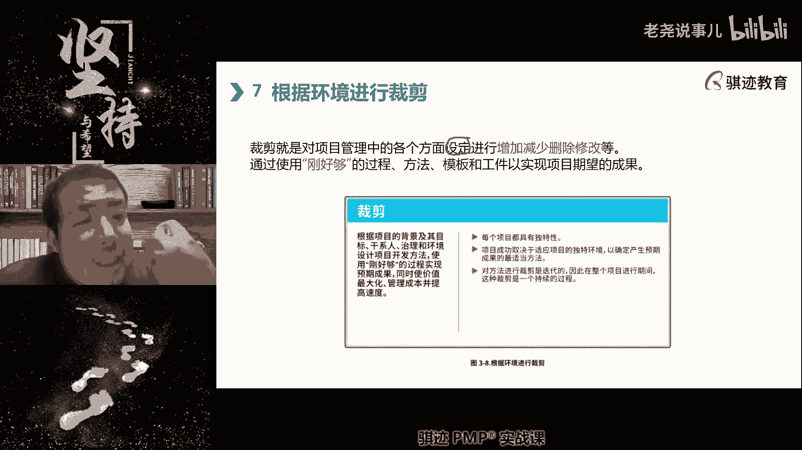

这就是一种裁剪，因为大家都是做普通老百姓阶层。

甚至中低端收入阶层，但是萨莉亚呢他就有所裁剪。

他不去做他不擅长的快餐那款。

他专门做什么，他认为可以和别人差异化竞争的那个西式简餐。

乃至中餐那一块。

他强调强调极致的节省成本，来极致的降低价格，你会看到现在肯德基，麦当劳价格也是越来越贵对吧，所以本质上大家的管理思路就是要相互错开。

才能达到各自的目的，都是为了生存嘛，对吧啊，有句话那个那个那个那个那个让子弹飞一句话，赚钱嘛，不磕碜对吧。

就这个意思啊，那么项目中也有很多的。

像这种不磕碜的这种环境对吧，我们要想功能全。

就一定会成本高，进度长，我们想要功能又全。

成本又低，那么一定会做的很慢，因为投入的资源少。

慢慢做啊，而且大，而且也不一定啊，所以他一定会这么进度差，如果我们又想要做得快，又想要功能全，它一定会加剧成本提高。

这都能理解吧，所以范围进度，成本这三个方面一定是会存在相互之间妥协。

然后产生裁剪的结果，你一定要舍弃一点东西。

协调一点东西啊，坚持一点东西，才能让范围进度成本。

这个项目管理最关键的三个主题能够协调一致。

这就是一种裁剪，每一个项目经理，在每一个项目当中，都会面临这样的裁剪的一种环境啊，你要知道要取什么舍什么，要调什么好。

才能够达成项目标，那么他的原则是根据项目目标来的，一切以项目目标，就是我们现在篇博客第七版就讲了什么嗯，最能够为客户创造价值啊。

好呃讲了这一通，大家是不是有点明白这种事情，其实这跟做人一样，有时候人很难做到面面俱到对吧。

有人说有一种人很优秀，叫八面玲珑啊，但是这种人很难，而且好好先生其实是不受人欢迎，就是你好我好，大家好，每个人都觉得你好的，这种人可能真正还不如有一些是吧，敢于做出自己的风格的人。

更深入的欢迎增加也是采集问，注意对这个问题问的非常好啊。

rain这位同学就问这问这个问题，问的好啊，表扬就是增裁剪。

它不是字面意义上的去减少增加，也是一种裁剪，裁剪可以看作是一种自由，为了项目目标而进行。

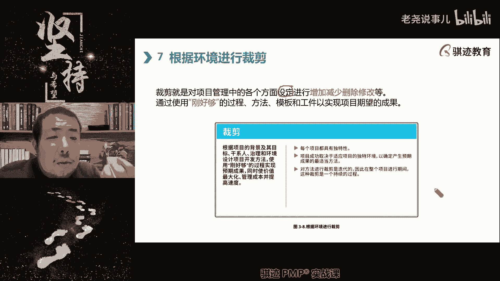

自由考量和调整的一种过程，那么他的当然他的原则是刚好够，就是说适用不过度浪费啊。

过犹不及，恰如其分啊。

建筑材料的调整算裁剪吗，不算啊。

裁剪更多的是什么方法，工具啊。

文件啊，就是你对项目经理来说采集更多什么，你使用这个文件还是不使用这个文件。

你使用这个过程还是不使用这个过程，你内容做的多还是做得少。

材料这个太太那个了，像建筑材料的调换。

这种属于就是具体的工作内容，环境的这个并不算裁剪，除非这个材料是一种关键的材料，它涉及到成本啊，客户满意度啊。

质量等等方面，那个可能会涉及到财政层次，一般来说这个层次不够啊，我们讲的是项目管理的方向啊，并不是具体实务方向。

好项目的成功取决于项目独特环境。

所以裁剪，所以我们就根据这个第二条。

大家看到啊，根据这个第二条，所以裁剪是并没有一个统一的方法。

和统一的一个什么啊。

方法论的啊，那么这个东西呢我们打个比方，就好比什么，大家知道啊，我和我们在直播间里很多是女孩子对吧，女孩子的化妆就是这样的。

每一个女孩子的脸都是独特的啊，哪怕是双胞胎，两个姐妹，两个人也有细微差别，每一个女孩子她化妆的时候。

她的化妆方法就有裁剪，这里多打那么一点点影。

那你少花一点点眉是吧，这里多加一点什么东西，这些也是就类比上就是裁剪一。

没有一个两个项目是一模一样的，所以没有一个项目的裁剪方法。

可以完全适用于另外一个项目，所以要项目经理根据当前的环境和直击刑法。

去进行裁剪啊，同时你在项目初期进行了裁剪。

可能仅仅适用于项目初期的设定。

到了项目后期呢，它可能和中期和后期它可能会变化。

所以裁剪是一个持续的过程，就是不断的调优。

不断的使的项目刚好够，这样一个过程应该是迭代持续，能明白吧，这就是其实裁剪的过程，也是一个做事情的过程啊。

如果你们细细想一想，线上线下交换诶，同学线上线下交换啊，尾号0073同学，我和7649同学，你们想的层次都低了，线上线下或者建筑材料的调换，这些其实本质上只是工作内容的初层初见层次。

你的裁剪更多的是什么，要从更高比这些层次高一点点的考虑啊。

高一点的角度考虑啊。

裁剪后需要变更吗，然后有同学说对很，如果你对项目的设定裁剪很有可能。

但规定绝对啊，取决于裁剪到什么层次，什么过程或者什么方面。

是很有可能需要变更的啊，很有可能需要变更好。

那么财经要考虑智力因素，那么这句话什么意思啊。

就是啊我这里会稍微讲的多一点，因为后面有彩电组踩点，是PMBOK第七版特别突出的一个主题啊。

稍微多讲那么一丁丁啊。

那么裁剪要考虑什么治理因素，什么叫制定因素啊，所谓的治理就要考虑到项目的治理。

环境和公司合规，就是你觉得有时候觉得通过这个裁剪。

可以达到你的目的，但是他不合规对吧。

你项目预算紧张，你想减少一部分质量相关的活动。

来降低经费可以，但是如果公司规定一定要通过这些质量要求的，那么对不起，你要注意项目的治理环境。

他会要求你一定要打成这样才行啊，所以很这个东西如果大家在大公司里工作，那么你会尤其体验深刻。

为什么大公司当中规矩多，大家都知道的，大公司规矩多，对吧啊，大公司规矩多之后，它的治理环境就复杂，所以你在裁剪的时候受到的制约就很多啊。

所以啊我们跟大家说一句那个啊。

所以如果你想在项目管理这个领域，做出一些很亮眼的实践和成绩来说，大公司不一定是最好的，因为大公司对你制约太多了啊，相反中型公司和小公司反而能够做的更好，因为它对你的制约少对吧。

治理虽然能够保证你项目成功，这对成功率提高是对的。

但是你想想做的出彩，那么他的社会制约的明白了，因为大公司不要你不是它的本质。

就不需要你做的多出彩，但是它需要你成功率高啊，你希望你稳定啊，没有效率，但是稳定能够做出他想要的东西，这是公干公司的管理的一个目的。

而对于小公司来说呢，他希望你什么啊，可以不用那么规范，但是一定要做的够好啊，然后呢为国有公司挣很多钱啊，怎么怎么啊。

这就是治理因素啊，不同公司的不同治理环境因素，会显著影响你的裁剪过程，所以有时候你会看到什么，有时候我也是有机会啊。

在不同公司管管项目的时候，我有一种体会很无奈，明明在那个公司，就可以按照这种很有效的方法做了，到这里来了啊，对不起啊，这个不行那个不行。

这个尊重那个尊重啊，你会觉得很憋屈啊，管得很憋屈，这是没有办法啊，但是并不，这并不等于说治理不好啊，这只是治理带来的一些限制性因素。

但是智力能够保证你不犯错啊，能够保证你这个成功的高啊，能够少冒风险啊，治理还有很多的目的，就是为了能够减少风险啊。

合规性要求很多的，本质就是一个风险减轻要求啊。

好那么财经要考虑的项目独特性，接下来看。

其实这个我前面已经讲了，没有一个两个项目是一模一样，所以针对每一个项目。

要进行该项目独特的裁剪啊，这叫项目独特性。

对吧啊啊。

这就是怎么说呢，好我们我们讲啊。

虽然我现在我老婆坐在我对面，但是我要讲一些让他不开心的话啊，比如说你追妹子，你知道吧，没有两没有任何就是你是个男生，你要追妹子，没有一个没有两个妹子是完全一模一样的脾气。

秉性和想法，所以你针对每个妹子都要考虑你的行为，裁剪和你的反应，裁剪对吧，然后让她哄她开心，这也是种裁剪，明白吗，群里我们知道我们在直播间里。

有很多是钢铁直男，知道吧，怎么讨小姑娘更新，要根据每一个小姑娘他的行为喜好。

他愿意跟你交流什么。

不愿意跟你交什么，然后进行自己的交流过程和接触过程的裁剪。

能够表现出自己有吸引力的一面，对吧啊，这是叉老师带你们走向男生都像海王的渣男，第一步。

我老婆在坐在我对面，不开心的走开了，我今天晚上会被会被家暴吗，开玩笑啊。

智力因素是指公司条条框框吗，对对，智力因素你可以认为是公司的条条框框的啊，你可以简单的认为。

啊我们上课讲的欢乐一点，因为这个东西有点枯燥，知道讲的欢乐一点。

比较裁剪，要遵循上级组织的方法论啊，我们有一定的方法论，就是说我们要一定遵循什么样的方法去进行啊。

比如说我们公司。

我们公司的方法论是什么，都要利用敏捷的方式去开展项目对吧，这是这也是啊，这和治理环境因素有关系，但智力环境因素呃可能更大啊，方法具体的方法论可能更加呃，切记时间点就是方法。

比如说我们公司的方法能做什么啊，讲究效率，我们获得我们公司工作方法论是什么，都是讲究什么控制成本啊等等等等一系列啊，要根据公司方法论去进行。

老师你的老婆考了PNP吗，我的老婆又考学，没有让让他懂PMP，我在家里地位就更低了。

他又瞪我一眼。

治理治理因素的大定义是啥。

治理因素的大的定义，就是这企业对于所有管理过程的规范。

不知道你听到了吗。

就是过程的规范叫做治理，结果的确定叫做管理啊。

好，第四个还要考虑项目管理过程的时间和成本啊。

那么对，这个就是呃，说到就是说你要一切东西都要考虑代价啊。

时间成本啊，代价这个很容易啊，裁剪很多时候就要考虑，其实这个我觉得这是原书，其实我要考，其实这都是要考虑这三个因素。

在范围进度成本这个三个因素。

如果你的裁剪不是裁剪范围进度成本的话，那么你都要考虑其他的采景因素。

对于范围进度成本的影响，其他要加一个范围。

我觉得这里要再加一个范围，但是就怎么了，你们知道时间成本对吧啊，你要考虑印象，因为裁剪其实最终的目的都是为了什么，达成项目成功，不是不是为了范进程啊，不是为了范进程的最优啊，这个就狭隘了。

裁剪的目的都是要考虑什么项目，如何能够达到最大化的成功而进行的，但是它往往会影响到时间，成本和范围，其实也会影响到我们的啊基准，所以之前那位同学讲的很对，裁剪往往是要影响什么基准啊。

你要走变更了啊，那么裁剪也遵循专业的人做专业事啊。

那么我们取舍也要让专业的人去做专业的事。

那么包括什么，比如说我们很很简单的事情，我们在后面学到的绩效预热知识领域当中。

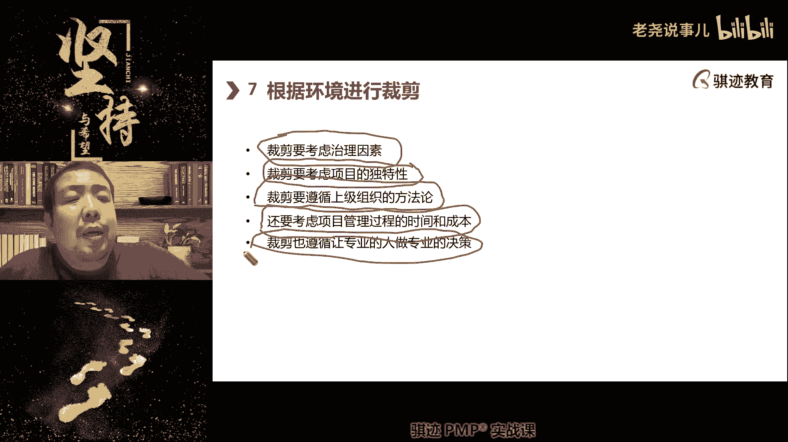

我们今天就要学的像风险，风险就是什么专业的人做专业的事。

由专业的人来裁剪，这个风险怎么管，对啊啊这个风险怎么应对，我们怎么样去客观地面对某一类风险。

或者所有的风险啊，所以这是管理上，从管理角度裁剪，是项目经理一定要考虑的事情，你不可能什么东西都得到。

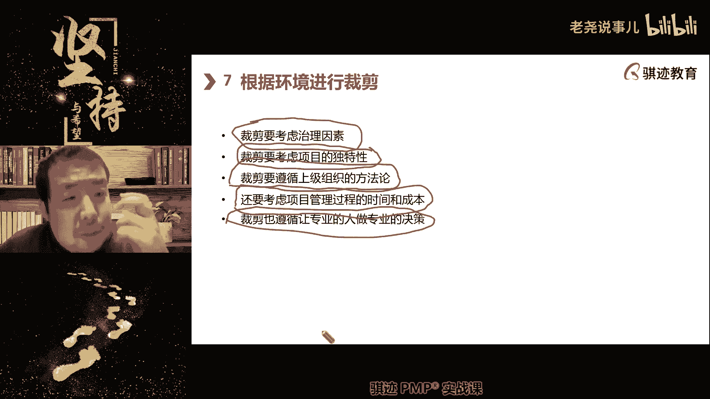

你也不可能什么东西都做得完美，你只能做到刚好够是一个重量的啊。

恰如其分，我们中国人有个词叫恰如其分啊。

那么裁剪可以带来什么好处呢，啊这个就大家就看看就行了啊。

有有有有，反正有点无聊，什么提高效率，创新吸取经验教训。

可以分享独特过程之中，采取新的实践方法得到进一步改进，通过实验发现改进我们的成果过程。

在具有多个专业领域里。

用裁剪方法也能够有效地进行整合啊，注意裁剪的这里要注意一点啊。

我们把这个词框起来，裁剪的一个很重要的目的。

除了实现项目的成功的最大化以外。

还有一个很方便的就是整合，就是能够让彼此当然也是为了项目成功啊，那么裁剪它是通过什么将本来彼此不协调，有矛盾的各个组成部分能够捏到一起。

一方面在一起啊，比如说我呃，比如说我在成本上我们是用什么东西啊。

我们是用最低原则，是价格最低的原则去做所有的事情。

但是我们在范围上呢要是尽可能满足客户要求。

那么这个是不是明天就会产生矛盾对吧，尽可能满足要求，肯定要做很多事情。

那么成本就不可能低，那么这两者怎么去整合呢，就要对范围和成本各自区进行一部分妥协。

退，让我们尽可能在一定范围和授权内。

满足客户要求。

同时成本一定要在我们可以接受的。

底线之下去执行，越低越好。

明白吗，这就是一种裁剪结构，那么具体往这个方向不断渐进明细去落实。

我们的底线在哪里对吧，我们的上限在哪里，这就是一种裁剪。

到最后范围和成本就能够对接上，彼此不矛盾。

否则范围越多肯定成本越高对吧，范围一般来说越多肯定这么高啊。

那么从传呃，从长远上来看，组织的适应力会有所增强啊。

那么呃可以增强组织的组织的适应性，对方法过程进行裁剪具有迭代性，因为它是个持续过程，然后我们需要收集所有的该写人的反馈，了解我们对于一种效果并增强组织价值啊，OK这一段写的比较啊，理论化理解一下就行。

没什么大意思啊，这就是裁剪，但是裁剪呢这里就不再多说了啊，怎么如果每个方面项目管理的每个方面裁剪啊，才有同学问裁剪是贯穿始终了吗，是的啊，好那么其他其他东西我就不说了，等到裁剪会有专题课的时候就说啊。

讲得更细一点，有同学问方法论和制定因素区别在哪里，方法论是治理的知识和智力有区别。

但是是治理之下的一种具体的一种。

实现形式的要求啊，叫方法论。

比如说我们呢我们跟客户打交道的方法是什么，先礼后兵这个方法论啊。

啊对吧，这就是一种方法啊。

好刚才讲到第七，现在讲第八个好，第八个啊，将质量融入过程和交互当中啊。

那么这个呢就涉及到质量，老师喝的啥，对于问老师喝的啥。

这个同学显然不对，我不够了解，那巴黎水啊，不不带广告啊。

没有任何链接啊，有但没有拼多多什么一元爽够啊，没有这种事情啊。

啊熟悉我的同学都知道啊，喜欢喝巴黎水是因为比较清爽好那么好。

那么继续啊继续啊，我们上课会欢乐一点，但是我们啊还是要聚焦于学习啊，将质量中的过程给交付当中。

那么这就讲到质量这个东西对，要有植入质量这个概念。

在管理过程和结果当中，质量是既包含质量，对管理来说是既包含在过程当中，也体现在交付当中。

那么这个这个什么意思啊，啊我给你们给你们举个例子啊，给你们举举这样一个例子。

就说呃现在现代社会很多的我们讲啊。

用户体验是不仅仅是产品体验。

也是过程体验啊，过程体验，那么那么过程体验指的什么。

不仅仅产品要好，交付和使用，产品过程当中，对于这个产品的交付和支持以及处理维保等等。

这些都会成为用户体验的一部分。

这些都会影响到满意度，质量最高的目标是客户满意。

它都会影响到客户满意，客户满意会影响到我们长远的商业利益。

所以客户满意也是项目成功的一个。

非常重要的标志啊，因为我们从价值角度讲。

产品自身带来的给客户带来的价值，以及你的服务给客户带来价值会同样重要。

服务是过程性的，产品的质量。

结果是状态型啊，或者是或者是确定性。

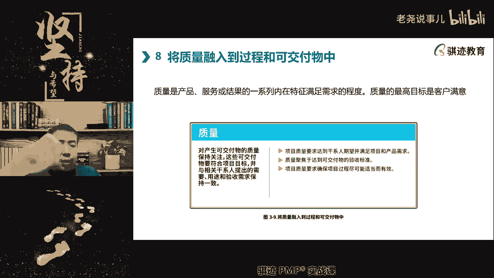

这两者同样重要啊，同学们就要记住，那么我们举个例子啊啊啊网上看过视频啊。

有同样号就不说了啊。

有啊有某up主啊，凌晨三点做测试很坏啊，假装啊，他他有个圈子里面。

有他在圈子里面很多人都买很多车啊，都是买电车或者豪华豪车，很多凌晨三点给各个豪车品牌。

电车品牌。

造车新势力等等等去打电话，说我的车在一个很偏远的地方抛锚了，那就说很多的这就是售卖车的这种，他们都那个叫什么卖汽车的。

他们都提供一个知识服务或者保险也有对吧，卖尤其是卖车很多的承诺，比如你的车如果出故障了，我们会帮你去拖车和处理。

拉到最近的指定的维修厂，就把你进行维修应急，他凌晨三点故意打这种电话给各个车厂，结果啊不出所料啊，越是就说注重用户客户体验的品牌。

他们越是服务周到，解决的就越好啊，那么越是某些啊高高在上的那些品牌啊。

就就就就越忽悠人啊，好很有意思啊。

那么这个就是什么，这个就是你会看到什么，它和你交付的产品有关系吗。

没有任何关系，我是假冒故意打电话告诉你。

我那个了啊，跟产品其实没有任何关系，质量没有任何，但是它跟服务的交互过程有关系。

然后就会得出很多体验，如果你在半夜凌晨三点车抛锚了，然后你需要拖车对吧，我们虽然可以去找保险拖车，但是你在卖我车的车上。

主机厂，你在卖我车的时候，你给我承诺过，给我们提供24小时拖车服务对吧，去支持我在荒郊野岭找不着人怎么办，我很害怕，你要帮助我们对吧。

对这种就是什么质量的过程给用户带来的满意。

妈妈们举举个例子知道吧啊啊。

所以有时候呢就是说用户选择很多产品。

或者认为很多产品价值高，并不一定是这个产品多优秀。

而更更有可能是吧这个产品优秀，它的服务和交付过程也很优秀。

所以过程和可交付成果，对于我们质量来说同样重要。

这个让能让用户满意的，我们就称之为质量啊，满足需求的程度就称之为质量啊。

所以现在有很多的你们知道，尤其是就是说服务型行业就特别明显，有很多的店有很多的那个叫什么商家。

他们可能产品不是最优秀的，但服务过程很优秀啊，我一说你们就知道很多了。

有名的有名的那个品牌对吧，商店啊，品牌或者餐饮啊等等这些都有对吧。

好听明白这个意思了对吧好，那么质量注意啊。

这个质量要学一下，我们后面会有相关的绩效率。

会去讲质量啊，老师交付过程指的什么。

有同学说胖东来，你这个一下子就把我那个那个那个叫什么。

某个案例教学案例给讲出来了啊，那就不扯了，因为这不在pp课程啊。

你们如果听过爱豆的话，我会讲胖东来的啊，好交付过程什么，有些同学可能不是行业。

所谓的交付，交付叫什么，叫做delivery，英文叫delivery，你们打一打delivery up诶。

Delivery，那么交付这个词儿是这两年啊。

这不是最近这一二十年吧。

开始跟流行起来，因为它指的是将产品从生产完毕的状态。

到能够给客户产生价值的状态。

这个过程称之为交付过程啊，交付过程。

那么为什么要讲交付呢，因为很多东西不是生产出来就能用，他得给用户安装好啊。

然后手把手教用户用，然后能够给用户产生价值，如果它是个消费产品，比如说什么空调，是不是得给你用户安装好啊。

给你调试好对吧，如果这是台机器，这期能不能在这个生产流水线上，能够帮助你去生产你想要的产品对吧，这个过程都叫做交付。

有时候交付是甚至是比产品更重要的东西啊。

那么只重视产品而不重视交付，在现代社会上越来越吃不开。

同学们明白了吗。

啊不是售后服务。

所以有些东西还没有明白，比如说呃比如说哎我就举着给你举个例子。

马上到夏天了，是不是啊，马上到夏天了。

那么我问你们夏天你们最需要什么东西啊，空调对吧，每年到夏天或者夏天之前或者夏天的时候。

总归会有很多人要什么要装空调，换空调，那么这个时候交付就体现出来。

可能大家空调质量都很好，但是你们家的空调用。

从预约到上门要花很多时间，上门之后呢，要这个要加钱。

那个要加钱，唉空调装的不太好啊，空调还漏风，或者什么空调制冷不好，就这些东西可能跟产品无关。

而是交付过程不好，结果导致人家很反感这个品牌。

怎么这个样子，以后再也不买了对吧。

那么售后服务是另外一回事，就是在日常用户使用的当中，如何对它进行维护。

交付就是怎么教给他这个过程，明白叫交付啊。

交付和那个是同样重要的啊，啊嘿嘿你们你们一帮肖学长啊啊临到考试了。

今天拼命在群里和和卫星单独密，我老师这个题目怎么做，这个是必死哎呀哎你们记住你们以后记住啊。

考试之前应该所有的都胸有成竹了。

不要考试前突击问我啊，过程很重要。

这个体验过程对吧，我们再说了，高级饭店的很多东西一定好吃吗。

不是为什么很多人喜欢去高级饭店。

他的服务过程很让你很有什么什么格对吧。

AC之间的那个格对吧，这就是一种交互啊，对不对啊啊我还特地学过一点点啊。

比如说先生你要点一瓶什么酒吗。

那么19是要把这个九放在这里，酒瓶上好看啊。

先生给你看一下对吧，然后他给你倒酒的时候还用毛巾包好，明明明避免手温影响那个酒给你倒一点。

尝尝，现成这个酒，你满意了吗，满意的话，给你来一杯一杯多少钱。

一瓶多少钱，就高级，高级饭店才会有侍酒师啊啊那么小饭馆是吧。

老板来啤酒，两瓶好了，不扔过来自己喝是吧。

这就是个交付过程，明白吗。

好。

那么质量有这些维度啊，稍微理解有绩效啊，质量绩效一致性。

可靠性，韧性满意度啊，这个稍微给大家解释都要解释一下啊。

绩效指的是这个东西，是不是你想要的预期对吧。

空调的交付是不是从空调的交付。

从下单开始一直到安装完毕。

使用这个过程都叫做交付，比如从下单开始，有没有专人给你去进行跟踪。

是不是啊，有没有专业人告诉你啊，我们现在到哪个阶段了。

预计什么时候上门，上班之前有没有改的话啊，先生女士，你有没有空，我们现在准备什么时候安装对吧。

如果怕恰巧你没有什么空啊，我跟你们约对吧。

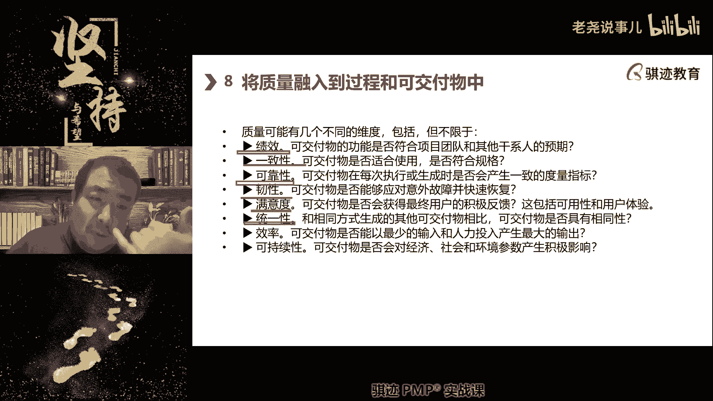

我给你再约个时间啊对吧，尽量找你有空的时候给你安装对吧。

安装之前我们会说啊，先生你要安装空调，要强调有没有动安装在哪里。

能不能安装，我们如果打洞怎么打，管线怎么走对吧，如问得越细致。

当天安装的就越顺利对吧，这一系一系列的沟通事情给你做好沟通。

是不是一种交互呢，那么安装过程当中到你家里来有没有穿袜套。

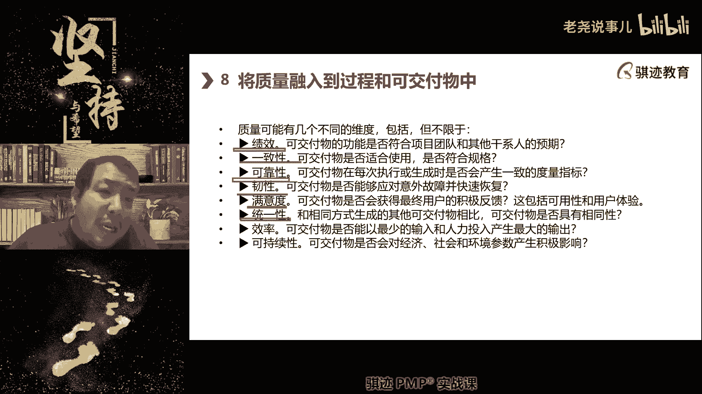

比如说有没有有没有穿袜套，有没有把你家里踩脏，比如说家里要墙上要打洞。

要打钉子，要挂室内机，不要挂起来了嘛对吧，室外机是不是要打洞。

这些打洞的时候有没有灰尘又落好，不要把家里弄脏对吧，他安排管线的时候去施工的时候。

有没有按照安全规定，比如人绑好安全带，不要掉下去对吧，然后施工过程当中有没有有没有把你东西弄坏。

这些都是交付过程，这些跟产品可能都没有关系对吧。

好明白了。

有些东西可能不做这个不做这一领域的东西，可能都得交付，什么叫交付。

很多同学觉得什么叫交付啊，就一手交钱一手交货，这就叫交付对吧，其实不是现在社会的很多的可可交付成果。

交付的东西，它是有个过程，这个过程是一种体验。

如果做的不好，也是一种折磨，哈哈也是一种折磨。

但大家可能或多或少都被折磨过，对吧啊啊这这是我一个外行人。

但是大家可能家里都装过空调来拿到夏天了，快要装空调这个例子来给大家做比方对吧。

都明白了吗，这是只是一件很简单标准化的商品。

如果是一件很复杂的定制化的东西，比如说定制化的一个大型的IT系统。

我要去交付，这个就复杂的多了啊，可能是这门课可能是有很经验的。

很有经验的人可能才能说出个条条框框，然后根据实际经验来不断优化。

才能完成这一次交付，下一次交付可能又是一个，根据客户具体环境去交付的过程啊。

这种可能是非标的交付啊，好那么这个就讲的太深了啊。

但是你明白交付的这个重要性对吧好。

那么质量当中，我们讲绩效就是看符不符合预期对吧。

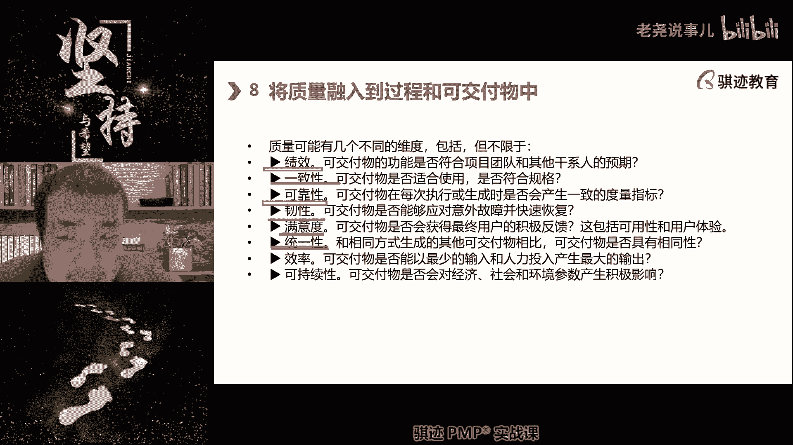

一致性是不是合格，注意啊，我们合格不合格，在质量上可能我们叫做一致和非一致。

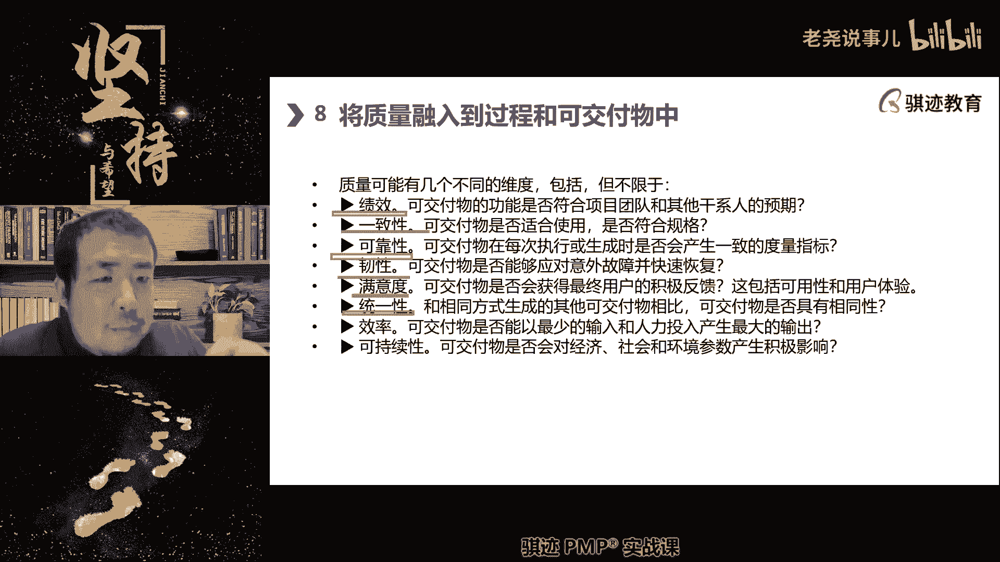

有这个词啊，专业一点啊。

COCURIOUS和incoherence啊，用这个词啊，可靠性啊。

reliable啊，能不能每次都一样啊，这个靠不靠谱。

对不对，可靠不可靠啊，就是说比如说我们又以开车举例对吧。

这个车可靠性高吗，就是说哎容不容易坏，对吧啊。

某些品牌号称什么买买发动机送车对吧，他那么这个话的意思是什么。

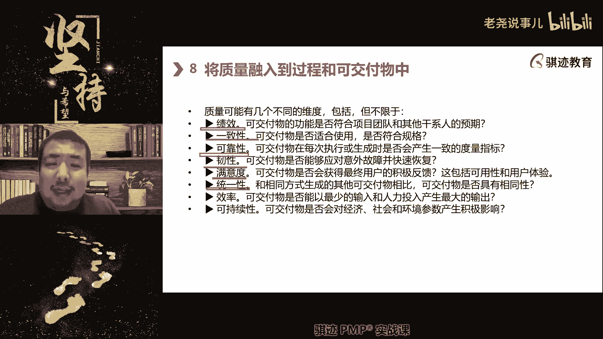

车可能做得一般，发动机特别靠谱，可靠性特别高对吧。

好任性就是能不能啊。

注意韧性这个词也是在偏颇和第七版当中。

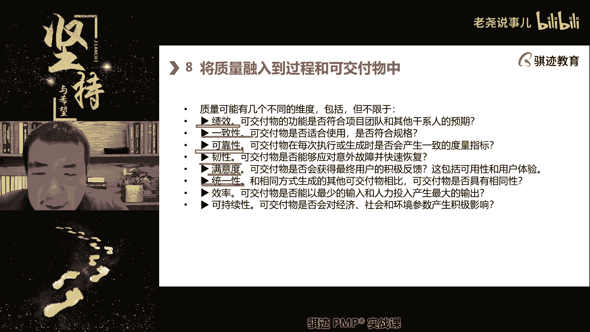

我们反复提到的一个事情，就是说能不能在出错的情况下快速恢。

快速恢恢复，那么可交真是可交付自身的属性啊。

它不是交互过程属性呃，这个指的是什么意思啊。

就是我们现在的社会的产品越来越复杂，所以产品难免总会出错。

那么能不能避免出错可以，但是很难。

或者有时候避免出错的代价很高，不如说如果出错。

我可以迅速恢复回来，可能成本更小，我们将实现一个质量。

你可以用多种方式，但是要考虑到成本，在用户满足用户满意情况下。

我们要考虑成本因素啊，这个后面讲，这是现代质量观点，要考虑成本因素啊。

所以能够快速恢复也是一种韧性啊，所以大家现在越来越多的买到这种带电子产品。

IT产品，它都有什么功能啊。

来实现韧性，来告诉我一下，来脑洞一下，告诉我一下你们买的各种各样的IT产品。

电子产品都有什么功能，能够实现任性，快速实现理解。

格式化这位同学。

你有什么东西要哈哈哈哈哈哈哈。

格式化哎，重启的方式叫什么。

一键恢复恢复出厂设置，一键恢复对吧。

这个就是一个什么，与其很复杂的帮用户去修复。

不如提供给用户一个很简洁的一键恢复，这样的方式对吧。

现在越来越多的电子产品，IT产品都有个一键恢复的方式，很多的很多人的手机。

比如说死机了或者什么大家都知道对吧，长按电源键关机，再长按电。

再按电源键什么东西开机就可以恢复过来对吧，如果不行的话，我们可以一键恢复出厂设置对吧。

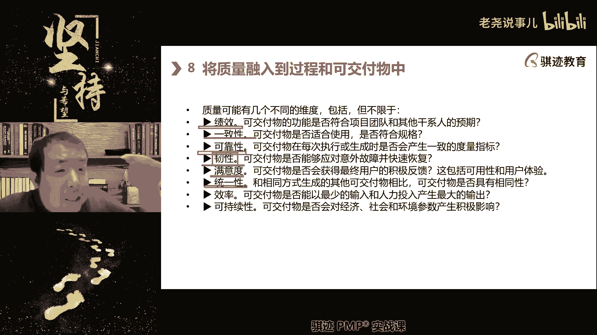

不知道哪里这个机器很卡，但是我搞不清楚哪里用户不懂，那么怎么办呢。

一键恢复出厂，这些都是可以增强韧性，但这些都是这些没有任性。

没有你们讲的那么高大上啊，但是项目任性有点复杂啊。

将项目设计我们之前讲过设计成具有韧性。

就是什么，这个项目考虑到了各种可能出错的因素，然后当出错的时候呢。

能迅速从出错中恢复，这是项目任性啊，这个我们会在风险当中讲质量韧性的时候。

我们能够迅速的从质量故障中恢复过来啊。

它指的是产品。

好那我们我们呃我们举个例子。

大家那个啊啊那兔都看过吧，那个那那那那年那些那年的大图。

那些事都看过了，那兔里面有一个那什么啊。

那个什么呃，那个骆驼对兔子说啊，你们卖的都是山寨货。

他说这我就听了，兔子拿出那个802火箭弹的，中国当年著名的产品对吧。

802火箭弹有发射架可以发射，发射架弄丢了可以单支啊。

发射单只的那个触发器弄丢了。

点一把火都能发射对吧，好人性可能有强不强强。

只要有那个弹头。

火箭弹弹头怎么都可以发射对吧，这个韧性还不够强吗，对吧明白了吧。

啊好满意度啊。

满意度就是给用户的最终体验啊，最终体验，那么统一性。

是不是每一件交付的同样可交付成果，它的相同性是一模一样啊。

相当于没有，就是可就是你的产品。

同一件产品的可重复性啊，好这是统一性还有效率。

我们能否最少投入最大产出和可持续性啊。

可执行指的是经济环境的产生，积极影响的可视性，它指的是各种啊环境可sustainable啊。

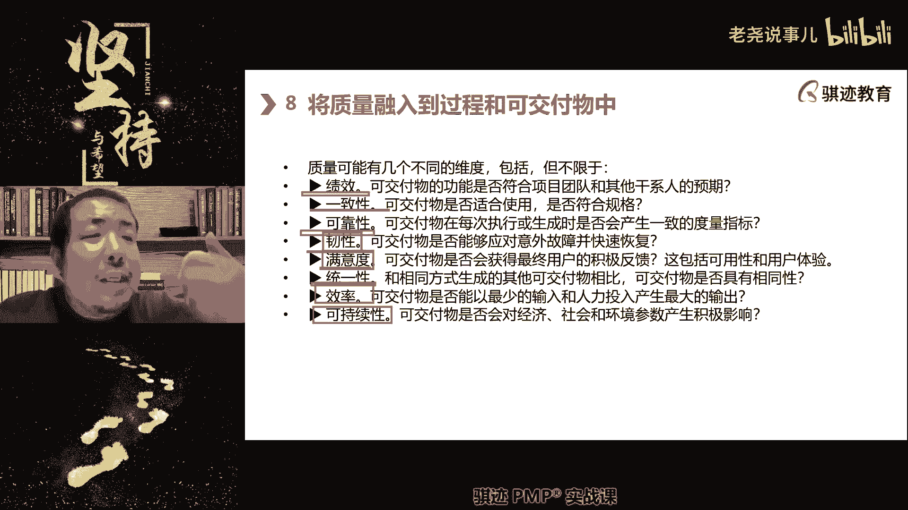

环境可试验等等，这种经济可学习啊，那么这些都是质量的各种维度啊。

就知道，那么我们在pm和第六版的这个课程当中呢。

基本上只讲前面这几种三种，但是之后现在又加了韧性。

满意度，统一性，效率和可持续，大家稍微了解下概念就行。

想到了军工特性啊，然后理论都是相通的。

哎对学完拼命就发现理论都是相通的，那么我们来学习一下。

顺便在这里多注意啊，这里是质量责任，顺便来学习一下质量责任啊。

那么质量责任当中呢，分为传统质量观念和现代质量观点。

那么给给大家讲一讲，后面讲到质量的时候呢，我们会再提一下，但就不会特别像这样子啊。

质量分为传统质量观点和现代质量观点。

那么这两种观点有什么区别呢，传统质量观点是来源于什么，人们当生产力比较落后。

尤其是在第一次工业革命之前，人们生产力非常落后的时候，所持有的对质量的观点，那么那个时候生产有没有生产。

有没有项目也有，但是它们的特征是什么，对于生产过程当中的原理不够充分了解。

不过对科学原理了解的相对比较少。

第二控制能力，人的工程技术，人类的工程技术。

控制技术能力很弱，没办法做到有一些前面一些东西，比如说统一性啊。

我做1000个啊，我做1000个产品，1000个产品一毛一样，一点都分辨不出来。

在大规模工业生产时代之前，这些都是很难做，因为什么人工人工人工手工肯定会误差。

偏差比较大，对吧好。

在这种情况下，人们要保质量有没有要求，那个时候质量有没要求也有要求。

那么怎么保证质量呢，我们控制能力弱。

重现能力弱，那么我们只能什么。

我们只能尽可能把可交付成果做的质量。

在我们的能力范围内尽可能做了高，他做了高了之后呢就容易达标。

所以产生的第一个传统质量观点。

质量是越高越好啊啊质量是越高越好。

其实现在的质量观念就不是了啊，现在的质量观点指的是什么。

要符在满足符合适用客户满意的基础上。

只要做到了客户满意，然后再考虑什么最佳的成本和收益，只要符合了客户满意。

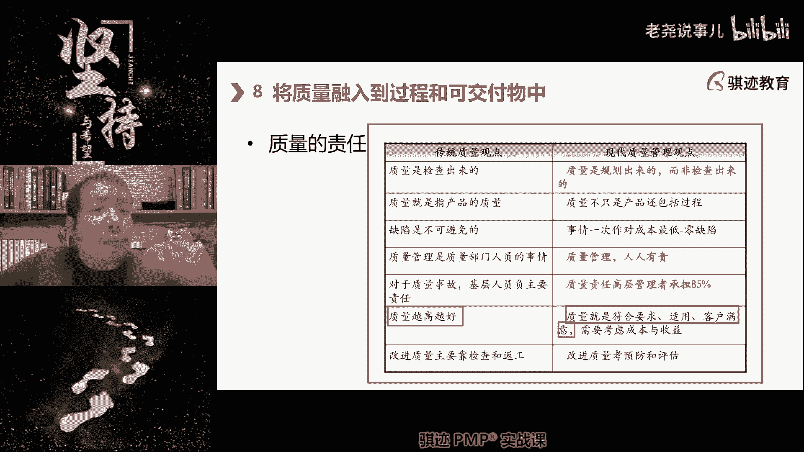

我们更多的会考虑什么成本和收益啊，所以现在会有一种特征啊，很多的行业领域的特征对吧，不到质保期绝对不坏。

一到质保期它就坏啊，这就是现代质量管理所产生的特征，对吧啊，OK啊那么这是第一个。

那么接下来也就来了，因为人们原来是什么。

对于质量的过程很难以控制，所以质量，往往人们人们对于质量的体验都是来自哪里啊。

质量是通过检查，因为只有通过检查才能知道。

这个质量状况都是事后的，所以传统的质量观点认为，质量是事后检查出来的。

实际上呢我问你们，当一个产品被生产出来之后，是不是这个质量就已经确定了。

是不是敢卖延保的。

一般不会有道理啊，所以如果一个厂商卖你延保。

那么你就可以比较相信这个东西靠谱对吧啊，那么质量是检查出来的，这个这句话就就是这个意思啊，这就是这个意思，实际上我们生产出来之后质量就得了啊，比如像我女儿从他从他娘胎里生出来之后，他其实他的智商啊等等。

这些方面其实就大致就已经确定了对吧，你对他进行检查，大家知道小baby生下来之后要做什么，要采足底血。

要护士会帮你先检查小孩子有没有十个手指，十个脚趾，五官是不是都在啊，正不正是另外一回事情，五官眼眼睛耳朵鼻子五官是不是都在对吧。

这些都是检查，但是如果说小BB生下来啊，没有鼻子，没有眼睛，那怎么办，那只有只有这样了，你要接受知识，因为你没法改变，什么时候能改变，孩子在娘胎里还没有生下来，做大盘鸡，你们知道不是大不是大盘鸡啊。

大盘鸡如果做过父母知道，就产检有一个阶段叫做大排畸。

大规模排查畸形，有个阶段去做这个检查。

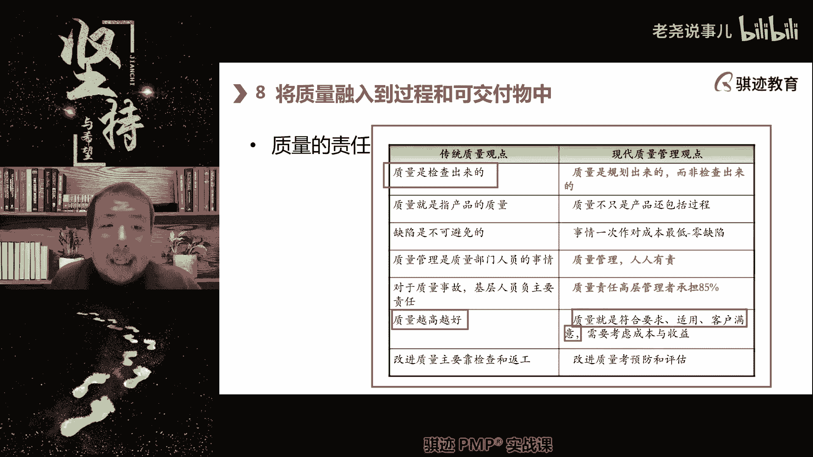

如果检查下来确实有很严重畸形，医生会建议你终止怀孕，这个时候可以把这个东西给排除掉。

没办法逆转，这种人类的现在的怀孕啊，什么东西没法用。

但是你可以啊避免很多孩子生下的人间痛苦，对吧啊，明白吧，所以质量当有现代化的技术手段和之后，我们质量是规划出来的。

而不是检查，因为到了检查已经客观事实已经不能改变，他只能说以后做得更好，但是当前并无法改变，所以质量我们要从从头。

从规划的源头开始就做好，这叫现代质量观念，明白了吧，这个观点很重要啊，如果你没有想清楚，这个说明你还是传统质量管理，那么质量我们前面讲过不仅仅包含产品，还包含过程对吧，那么传统质量管理。

因为人们的过程控制能力有限，所以人们总是觉得质量总是缺点，总呃不合格的融合会出生的没法比，现在质量观点认为什么质量应该一次性做对，几乎没有缺点叫零缺陷，几乎没有，或者说绝对没有对吧。

这个世界上没有绝对的事情，那么质量管理呢是现代质量管理社会人人有责，因为每个人都生在项目中的人。

每个人其实都间接或者直接参与到项目的，可交付成果和过程的质量当中去的，所以人人有责，以前人为什么质量就是质量部门的事情啊。

不是质量部门的，不用关心质量，这是错的啊，那么质量当中如果出现问题呢，高层承担主要责任，而不是质检部门啊。

而不是质检部门，所以质检部门在现代质量管理当中。

不应该是背锅的，背锅的是什么，是管理人啊，所以现在的质量管理主要考的是什么。

改进质量，考虑预防和评估，就是事前规划，事前准备和事中事后检查，那么以前质量主要靠什么啊。

事后的检查和返工以后反攻啊啊来解解好，那么这就是我们讲的，质量的传统观点和现代观点，那么对于这个大家能不能理解啊，这个其实考试的时候考到质量是很有用的啊，考试经常喜欢考这方面的东西。

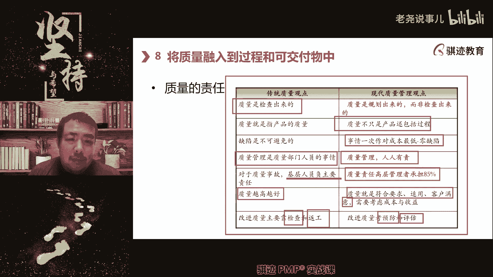

你没问题没问题，我们继续啊。

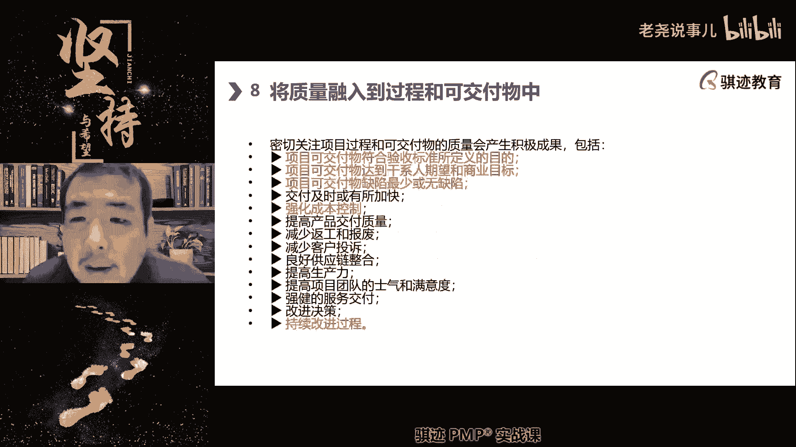

那么质量当中呢我们会密切呃质量过程，密切关注过程和交付质量会产生积极的效果。

那么第一我们会交出合格的产品。

注意啊，第二是达到用户的期望和商业目的。

为什么有同学能告诉我啊，为什么这两个东西不合在一起讲。

这两个东西有什么区别，我来问问你们。

你们想想这两条有什么区别呃，项目可交付成果符合验收所定义的目标。

可交付成果达成该行期望和商业结果。

带来的价值不同。

