# （收费视频完整版分享）PMBOK第七版课程PMP考试报名认证培训精讲-零基础项目管理第七版教程最新版直播课回放视频免费课程资源-骐迹教育谢阳主讲 - P18：6-3规划绩效域 - 老尧说事儿 - BV1ek4y1s71N

思路啊，所以你在制定预算当中要考虑这四块东西啊，他们都会影响预算，我们的专题会讲，这是预算制定的具体的思路啊，那么接下来我们说规划的时候，我们要规划团队的组成。

那么团队可以怎么组成呢，注意团队可以是内部人员组成。

也可以是外部软件组成。

也可以是内外结合起来组成，可以是全职人员。

也可以是兼职人员，也可以是全职兼职混合的组成。

所以我们在对团队进行规划的时候。

会考虑到团队在同一地点内开展工作。

能力和必要性，那么什么意思啊。

这句话是不是说，我们嗯必须要在所有的团队成员。

在同一地点去开展工作，是这样的吗。

是这样的吗。

或者说问一个方式。

在大家在同一个地点去开展工作，是不是一种最优的选择。

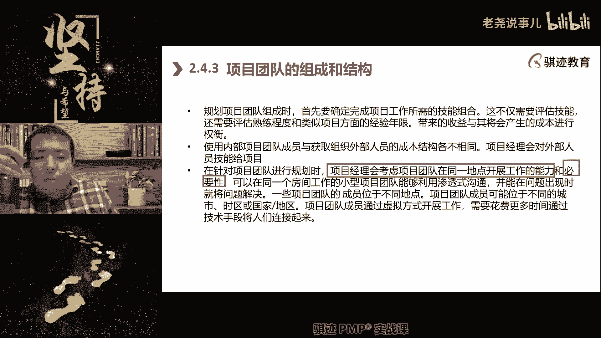

你在规划团队的组成的时候，是不是最优的选择。

你在规划团队组成的时候。

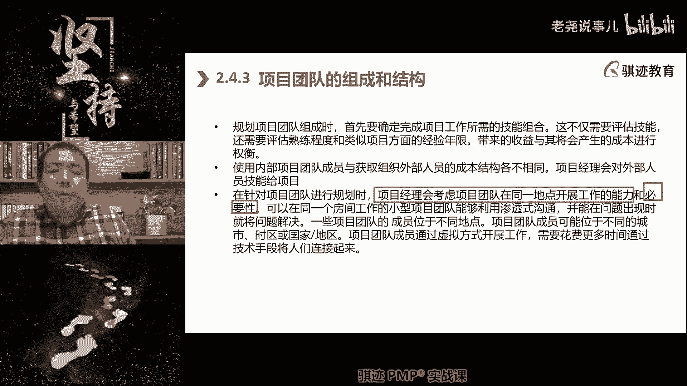

集中在一个地点并不一定是最优的，为什么。

虽然你在集中在一个地点，大家的沟通比较方便对吧，这交谈基本告吼对吧。

吼一下就可以了，但是集中那个地点会让你在团队的选择上受限。

如果不在这个地方，他就不能承认我团队成员。

虽然他能力很优秀对吧，第二我团队如果都集中在比如说北京。

或者比如在上海，那么如果我有很多的事情要在西安，要在重庆。

要在广州去干活，那怎么办呢对吧。

那么就会造成什么啊，较多的差旅，时间和成本的开销对吧。

所以团队我们会考虑虚拟团队，也就是说在不同地理地点开展工作。

团队的这种可能性，以及它带来的好处与收益之间的比较。

注意啊，虚拟团队也不是必须的。

要取决于它的收益和代价，因为团队不在一个地点。

他的沟通开销会变大，更注重沟通规划和沟通管理啊。

管理成本会成倍增加。

所以取决于你的项目的具体环境啊。

那么不在同一个地理电缆，还来给我们的团队组成是多样化对吧。

比如说北方啊，一般来说北方的人呢比较呃呃直爽啊。

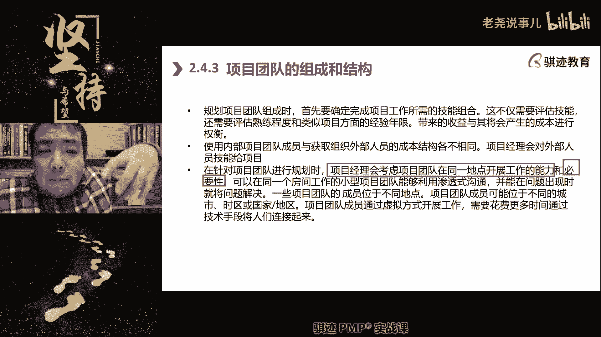

南方人呢一般比较婉约对吧。

所以不同的人的性格搭配起来做事情，其实可能会更效果啊。

一个团队如果都是一个性格，其实也不一定是好事情，包括不同的学历。

不同的文化，不同的性格啊，不同的能力。

这些东西如果可以组合在一起的话，其实会带来更好的效果。

因为全面性会更好啊，所以团队组成这站在大部分的pp考试当中。

你都会考虑这个事情，就是团队的全面性。

因为全面性或者叫跨职能性啊，这是两个事情啊，全面性会带来什么好处呢。

团队尽可能的会依靠自己内部去解决事情，那么跨职能性是什么。

它有多彩座椅，都有这作用，不同的技术能力，美国人不但有自己的专长。

就不止一个专长，那么会带来什么好处啊，我们当有人。

比如说请假了，有事情的时候，我们可以什么让其他人去顶替他。

这是我们在规划团队的组成和结构上的知识。

那么他俩会讲到结构，其实就讲到我们之前讲的什么东西啊。

记得吧，我们的团队组成结啊，就是我们的项目组成结构啊。

我们的项目成员是来自于职能部门，还是来自于项目部门内对吧。

我们的团队是什么扁平化了，就是项目经理后面是什么。

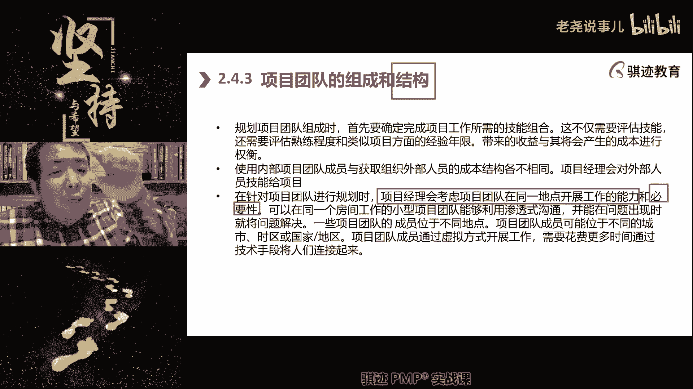

都是团队人员还是什么还是七啊，它是三角形的啊。

啊金字塔型的，就是项目经理在顶点后面有团队主管，团队主管，下面团队成员。

那么这些都是我们在规划的时候考虑的，那么具体为什么会有各种结构。

它的好处坏处呢，我们等到后续课，尤其是沟通课的时候讲。

很多时候一个团队为什么会考虑。

比如说不使用直接沟通，而使用什么金字塔型啊，或者我们叫做啊。

我们或者叫做的链式啊，啊，这这种事情就是因为什么沟通开销的关系到好。

那么规划沟通啊，规划沟通，规划沟通这个东西呢。

就是说我们要考虑用什么形式，和谁以什么方式进行沟通。

沟通什么东西，一次沟通多久，要给谁，能够传递什么形式，这些都是要规划的啊。

那这个东西呢可能就比较呃比较就比较枯燥，而没有特别的东西。

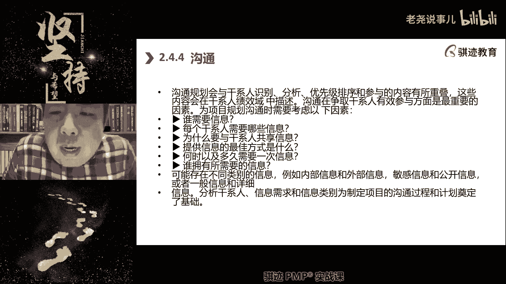

要根据不同的人群做不同的沟通规划发展，就是啊，那么如果你说的再通俗一点。

就是这么叫见人说人话，见什么说什么啊对吧。

好那么我们也我们在规划呃，呃绩效于当中也会有什么规划，如何去如何去使用和安排食物资源啊，包括我们的材料啊，设备啊，软件啊，测试环境啊，许可证啊等等等等这些东西啊，拥有大量的实物资源项目。

如果建筑工程项目将为采购货以获取资源，所以规划实物资源可以得出采购需求，所以我们规划实物资源会产生采购需求，这点请记住啊，另外一个项目中现在很少有项目，所有的项目呢产出都是依靠自己项目做的。

总要或多或少都会有什么从外面购买的需求啊，对吧，你可以用你的笔记本来写代码，但是你的笔记本总额得买完，你怎么总不见得你们公司自己生产笔记本，就算你们公司自己生产笔记本。

笔记本那些芯片总不见得是你们自己生产吧，就算笔记本里的芯片是你们生产的，生产芯片用的啊，贵贵贵，硅晶片总归是你们公司生产的吧对吧，总归有些东西需要从外面买，好那么规划实物资源的呃，要考虑什么。

包括材料的交付，移动储存和处置的提前期以及跟踪，从抵达现场交付的手段啊，那么这个就讲到什么，在很多可交付成果是实物的场景当中啊，可交付成果是实物的场景当中，你要考虑到实物资源的一些特性。

它需要有什么储存，移动交付处置的准备时间，准备时间，所以物料这些东西就是是实物资源密集的项目，所以一定得考虑到的啊，所以在古代如果用打仗来比喻叫做兵马未动，粮草先行，没有很多。

如果是以实物资源作为交付形式的很多项目，如果你没有物料，人到齐了，有什么用，又不能开工干活，其项目需要大量的实物资源的团队，会从战略角度考虑，从订单交付到使用的安排啊。

那么这里就讲到了食物资源的管理当中，如果是从外面购买的，就又牵扯到我们的什么控制采购，控制采购啊，那么如果要保证这个食物资源的可用性，我们会采取什么方案，比如说选择多个供应商。

比如说选使用对供应商的持续跟踪，依靠依据合同进行绩效管理跟踪等等，这些方法，啊所以老师以前也做过一些项目啊，就做过一些IT项目，比如说我搭建一个数据中心啊，那么我的项目实施在这个数据中心。

真正搭建的时候呢，其实这可能只有什么，可能是只有两三周时间，但是这个数据中心搭建之前啊，整个一个很大的数据中心搭建之前，我在实物资源的准备阶段，我会花几个月去准备，因为不同的物料它的供应链是不一样的。

比如说啊基本的原材料啊，是就是基本的就是说啊物料原材料啊，建筑原材料其实就是说你他一定是先到场，先开工先做，然后后续的什么啊，我们的设备材料设备啊，以及设备组件，它是后运到现场。

因为你只有在现场的基础建设建完了，才能进行按设备安装，安装完设备之后再开始进，继续进行什么东西啊，接下去的是吧，我们的啊IT设备，我们前面讲的是基础设备，比如说电啊，风冷啊。

这些东西在IT设备进行了安装和实施啊，它是一环扣着一环，每一环中间他都有自己的准备时间，和自己的入场时间，这对于我们的很多项目经理来说，这个时间的把控和节奏啊，注意这个也牵涉到一个节奏。

这可能是一种什么交付和实施节奏，这个节奏也是一种宝贵的经验啊，很多的项目经理如果没有做过的话，就会就容易什么有预告吗，学习用吗，就是就会有什么东西啊，就会有一种错过，一个等于所有东西都错过的东西啊。

只要一环没有扣好，尤其是在实物资源占主导的那些项目当中，只要有一个环节没有做好，后面的环节都都会卡顿啊，比如说我们本来应该什么基呃，这基础的厂房设施干完之后呢，我们的生产设备就进去安装。

但是如果你厂房设施没有盖好，我们的生产设备就没有办法进厂，他在外面就可能没有找到导播的地方进行堆积，厂房设施如果没有地方堆积，没有地方摆放，我们就没有办法进行进行安装。

我们的安装工程师就没有办法进场去进行实施，所以当一个错误就可能产生一系列错误，这是实务型呃，实物资源或者呃可交易成果，是实物的那些项目所经常会面临的一个问题啊，那么这个问题呢如果在可交付成果是无形的。

和或者是可交规模，仅仅是成果的那种项目当中呢，就比较容易克服，或者根本不存在这个问题啊，这个特别注意你以后的管的项目是哪种特性呢，怎么也要注注重这种特性啊，有时候光关注后期没有用。

你还要关注这个货期的风险，以及它的风险应对措施啊，这是我后面会慢慢跟你们讲的一个项目经理，他的风险敏感度和风险意识很重要，一方面来自于他经历过踩过坑，吃过亏，就知道这中间有风险，另一方面来自他的见识。

可能他自己不一定采购跟社会，但是他听别人说，或者见识到了别人曾经采过跟社会，他自己学习到对吧，他会啊啊，这个东西说来总觉得很简单或者很简单，其实实践当中做做其实是一个很难把握的事情。

你怎么在纷繁复杂的变量当中去做好，平衡和控制，一旦不如你所意，怎么去进行迅速调整，这些方案都会想好，所以这个其实也牵涉到什么，我们再多说一句，这个这个方面啊，我们的实物资源的这种货期啊。

你们说货期啊把提前量也把安排工序顺序吧，其实牵扯到一个什么，你的脑子里能不能想到足够多的，假如假如出现了这样和这样和这样的情况，我怎么办，假如出现了这个道，而这个没有道德怎么办，假如出现了这个提前了。

而这个落后了怎么办，当你对各种假如都能够想得到，并且有相应的预案的时候，你的价值就体现出来了啊，那么做过项目的同学啊，听懂掌声啊，这个群这个只做过和没做过的人的差距，就在这里好。

那么接下来就是我们规划采购啊。

规划采购这里是我们要注重讲的东西，因为采购知识领域的呃。

采购的知识领域的那个绩效率的很多东西呢啊，因为偏颇和第第第第第第第七版当中呢。

就没有采购采购绩效率了啊。

就没有采购绩效益了，所以我们在这里会稍微讲一讲采购，但是采购呢又是一个比较嗯。

怎么说呢，比较相对有一点的难度和复杂的东西啊。

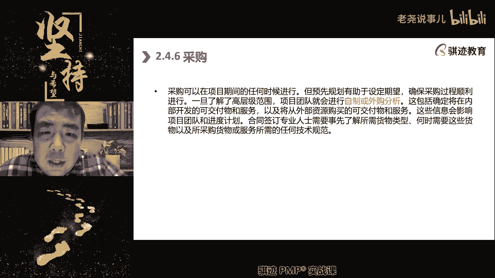

因为它里面的有些概念会比较多啊。

那么首先我们讲什么时候会触发采购，当我们进行高层次的分析。

发现有一些东西通过自制和外自制。

外购分析之后，我们自制不如外购啊。

我们就会触发采购。

对啊，买半斤层最喜欢说的什么字的造。

不如买对吧。

外部分析，那么采购的特征啊。

那么后面一个后面这这今天这一节，最后这点内容我们都会讲采购啊，大家可能会花的时间稍微长一点啊。

啊那么采购采购的特征是什么。

第一项目经理通常无权签署法律信息啊。

项目经理一般不是采购的，在这个在采购这个领域。

我们是甲方啊，我们如果讲到采购，默认我们就是甲方，我们一般没有权利去跟供应商直接签约。

项目经理一般是没有这个权利的。

那么但是我们应该对采购过程有了解。

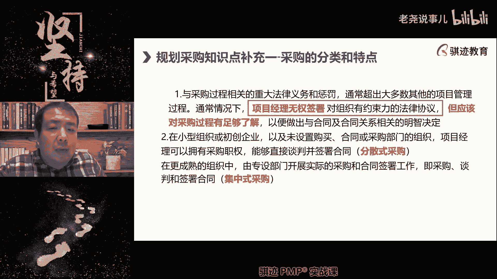

谁有权利拒签预案，采购流程当中的负责人和采购经理。

他们是有权利签约好，这一点是首先要注意啊。

那么采购过程当中呢，会涉及到采购部门和法务部门。

采购主要负责价格和货源，法务主要负责合同。

知道吧，如果你们在大公司里做过，就知道，就是很多的跟你要供应商才签署协议。

最麻烦的两件事情就是什么。

让法务通过你的采购合同，和让采购买到你想要买的东西。

因为项目经理无权去签署协议。

所以很多时候，项目经理对这个采购施加的影响是有限的啊。

最终是以采购经理采购过来的结果为准啊。

有同学说框架协议，那你以为框架协议怎么签，框架协议有时候反而更难切啊。

对了，但是框架写有什么好处。

你签一次框架以后再买了，就不用每次去审核合同啊。

这个是所以如果你要频繁购买的那些东西呢，或者经常性或定期购买的呢。

都可以使用框架协议啊，OK这个是不错，说明这个是有时间认知啊。

那么我们继续讲，所以项目经理要推进采购。

一般是用两种形式，如果这是一种小额的，或者你们公司比较小。

没有采购部门的，那么就自己去谈判，这叫做分散式采购啊。

分散式采购，如果我们要买大额的。

有采购部门的，那么就会使用集中式采购，有采购部门啊来去进行采购。

项目经理提出采购代表团队提出采购需求。

由采购部门寻找卖方和相应的啊中标方啊。

找过程，然后呢谁来负责签署合啊，谁来负责，最后审核合同法务。

最后由法务审核完成之后，由采购经理啦，最后来签署合同来完成我们这个采购啊。

好那么这个看一下啊，采购当中的步骤是什么，首先第一步啊，经典步骤。

第一步，制定采购工作说明书，SOW啊，这个呢现在已经不怎么提了啊。

你们只要知道是采购工作说明书，就相当于什么，我要定一下我要买什么东西。

第一步第二步，估一下我准备花多少钱去买。

有时候我可以独立的评估出我要花多长时间买，有时候呢我没有这个能力。

我根据招投标的结果来估，比如说我有十个投标人。

其中有九，其中有八个人呢给我投出了20万左右的价格，那么我们可以认定为什么啊，假设他们相互之间没有传统，我们就可以认认定什么。

这个东西呢，大只用20万买，如果是一个差不多合理的价对吧，第三发布招标广告啊，告诉大家啊，大家来进行投标啊，咱现在投票，同时呢我们先进行什么叫卖方短名单啊。

叫做初筛啊，我们先根据资质啊，什么东西进行初筛一轮，就像你们出去找工作，投简历投给hr。

你以为hr每个都看，他通过一定条件就可以把有些很多人删掉啊，不是985211的pass。

不是98521的pass对吧。

工作经验没有时间的pass啊，35岁以上的pass。

然后所有人都pass了，对吧啊，好第五啊。

准备发布招标文件，就是说呃有呃就是说由我们甲方提出的。

就说我要买什么的一个文件。

还有什么你怎么给我回答的一个回答格式，称之为招标文件啊。

这个我们会再细分细讲，然后呢，接下去让入围的。

初步入围的那些卖方呢去填写啊，你们按照格式给我填。

填完之后呢，会提交过来啊，提前提交过来啊，那么第七步就开始什么评标。

就是找专家开始评定这个技术，然后呢我们根据自己的财务和自己的采购。

然后对他的这个花费来进行评定啊，值不值这个钱，我们准备花什么钱。

那么是不是要杀杀价格，最终来选出中标的人，签署合同。

完成实施采购，注意做到这里只是完成实施采购啊。

那么完成实施完采购之后还要干什么。

接下去就是监督采购，监督你的和你签约，已经成为供应商的那个人啊。

那那家公司监督他给你干好活。

及时向你交付应该交付的东西，然后向他付钱，这是监督采购的啊，那么这不是这个就不是实时采购的啊，我们这里讲的其实是啊规划采购和实施采购的。

那么我们我们因为讲的是规划啊。

规划的那个绩绩效预防，我们继续讲规划采购。

那么规划采购当中我们会规划出这几个文件啊，请注意我们会规划出这些文件啊。

这七个文件都是要指导怎么作用，采购管理计划。

是对这个项目中所有的采购，进行指导的指导性文件。

它是个方法论指导性文件，一个项目只有一个。

然后注意啊，很多东西搞不清楚一和二的区别啊，注意二。

对于每一个需要采购的内容，我们都可以制定一个独立的采购策略。

比如说对于那样东西，我们的采购策略是什么啊。

谁便宜买谁，因为这个东西高度标准化啊，买谁都一样。

谁便宜买对，而对于这样的东西呢，它应该什么，我们要质量尽可能好，因为这是项目中关键地方使用啊。

出了出了问题就是什么啊，这减脂麻丢西瓜对吧。

对于每一项采购都可以制定我们如何购买。

怎么付钱啊，怎么交付合同，怎么签等等，这些都如何去推进采购。

这些都在写在采购策略的。

可以试一试一策略，当然也可以多试一策略啊。

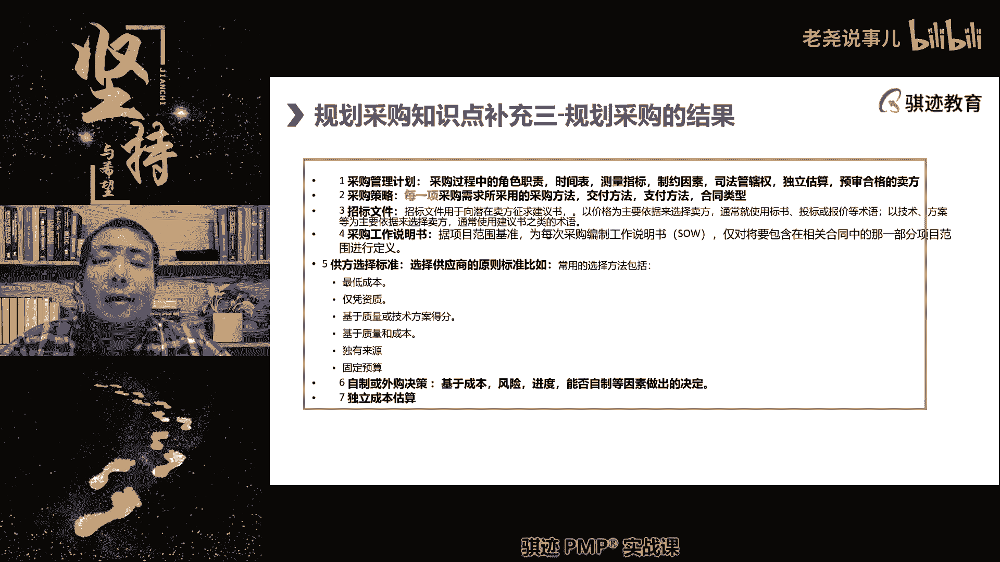

第三个就是招标文件，我们前面讲过啊，我们的应答书啊。

格式啊，我们的需求呢，那么这也包含啊，然后这里我们就包含了采购工作说明书。

具体描述我们准备买什么东西。

这是第四个，第五个我们的评分标准，我们叫公方评分标准。

包括什么，价低者得满足资质要求的人能中标。

谁技术方案最好，谁中标啊。

谁的质量最好，谁中标，对吧啊啊，有些时候呢是因为独有来源。

没有办法，没有人竞争了，那么谁来投标，谁满足要求。

谁来，这就过啊，等等这些称之为公方选择标准啊。

公方选择标准。

好第六个啊，我们规划采购当中。

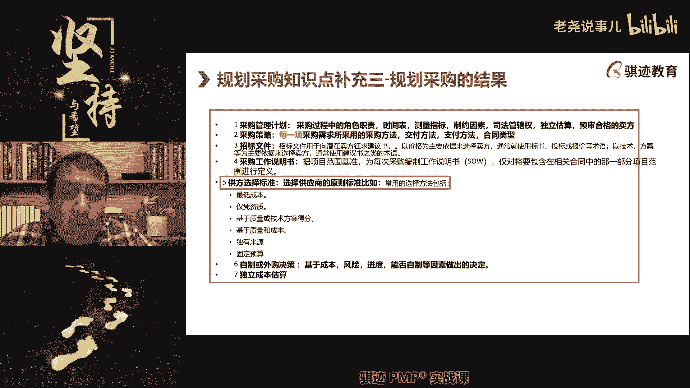

我们要有理由自证，为什么需要自制外购权哦。

为什么需要自制外购啊，也就是说为什么我们自己不做而向外面采购啊。

你要有证，你要要要要有理由说服高层和采购部门。

我为什么自己不做而去外面采购。

因为我们自己做不了对吧，或者我们自己都不合算。

或者我们自己做风险高对吧，我们从我从外面购买，最后我们这一项每一项采购。

他这个采购我们估计要花多少钱，有些可以自己直接估算。

有些要依靠供应商的报价，基于他们的报价基础上再估算出来好。

以上这七样东西就是我们的规划采购的结果。

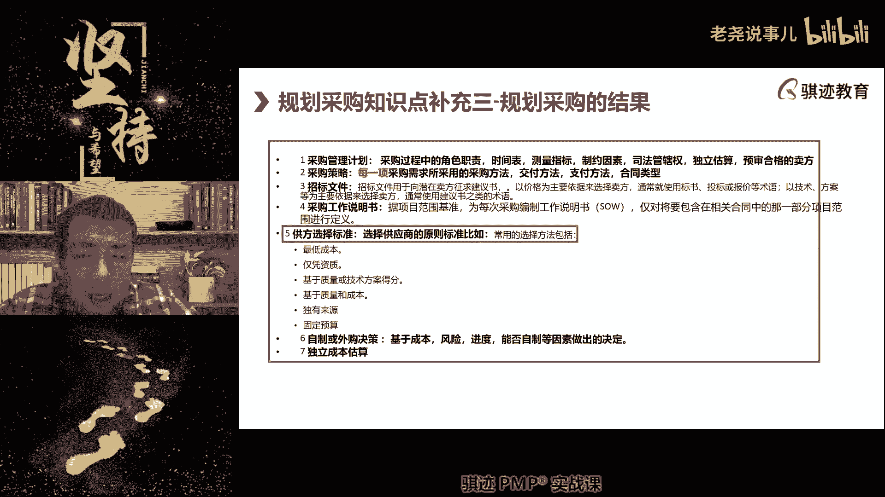

它们的作用意义都明白了吗。

都明白了。

好明白了往下讲啊，好后面内容还是有一点啊。

好不多，但是今天有点辛苦对吧，大家辛苦了哈哈大家辛苦啊。

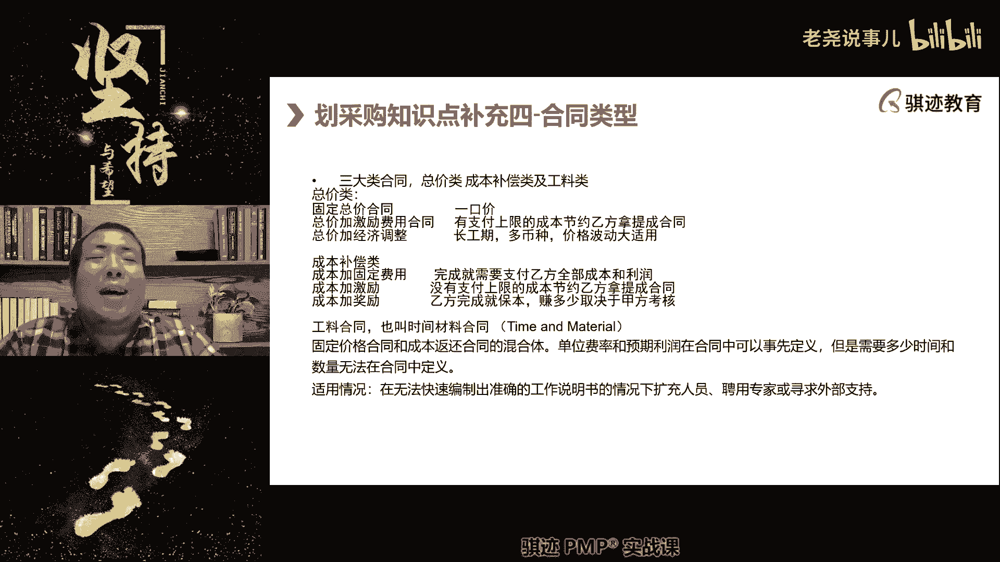

那么采购当中我们会有三大类采购合同。

GG请注意这个是经常喜欢考的东西啊，三大类啊，我们把特征都写在这里。

我跟大家稍微说一说啊，啊我们说一说第一大类叫总价类。

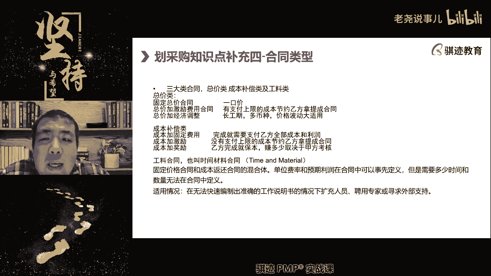

总价类的特征是什么，今天讲的都是知识盲区。

对这个，所以你们都要都要好好学习啊，但是这个是实践当中和工作中都很有用啊。

啊有些同学就从来没有经历过采购对吧，做项目其实做经历过采购是非常正常。

因为你不可能项目中所有东西都自己用对吧。

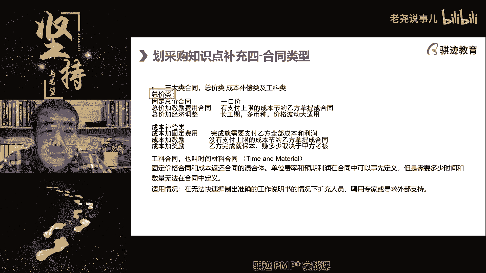

第一种叫总价类，什么叫做总价了呀，总价类指的是有固定的最高限价。

我只付到这个钱，超过这个钱我不付。

这个叫做总价来明白吧，它一般设定的场景是什么。

是项目范围比较明确，工作内容很仔详细。

然后呢不太会变更，但是如果要做变更的话。

要额外要加钱啊，是总价来，第二类呢叫成本补偿类。

指的是什么，我们没有办法做出，我们有范围。

但是没有办法做出很详细的范围啊，那么在这种情况下，我们会进行什么签售成本补偿。

或者说我们的范围是明确，但是我们不知道花多少钱去做完。

因为这个东西太不可控啊，它的实际完成成本太不可控啊。

所以我们会使用成本补偿类啊，那么呃啊那就要时间时间有点晚了。

那我就呃不呃不举很多详细例子啊。

那么第三类也叫做工量合同，也叫做时间材料合同。

这类合同什么意思啊，就是说它有单价，我们按照单价计。

或者按照任天计，干一天是一天，或者干一个单位是一个单位，比如说我经常喜欢举的例子，砌墙砌一米墙啊。

十块钱，那么砌几米墙给你多少钱，这个就称之为什么工料合同啊啊。

或者什么干一小时给你多少钱。

比如老师可以举个例子。

啊可以举例当中供料活动就好比说什么，你们去肯德基麦当劳打工啊。

是多少钱啊，肯定麦当劳现在一个小时14块是吧啊。

不同地区不一样的吧，是12块到14块对吧，这个就是工料合同呀。

你做一个小时给你一小时工钱对吧，你做十个小时给你十个小时工钱。

这个就是工料合同，明白适用于什么，适用于我事先约定好的啊。

事先约定好的工作时间，单位根据时间和数量来记。

它，不需要很详细的范围啊，您讲到什么时候。

我听到什么时候，没关系，对我我也会认真跟你讲，没有给你们细细讲完，我是不会下课的。

而且不收额外收钱啊。

好另外讲啊，那么这是工料合同，都明白，工料合同是介于总价合同和成本合同之间的啊。

适用于什么快速扩充人员寻求外部支持啊，这时候项目中很常见很常见的啊，那么会在总价类合同当中会有几类总价啊。

第一类总价是什么，是固定总价，指的是什么一口价啊。

这个大家很容易理解的吧，我们生活中大部分的标价都是一口价。

就是一个固定价格，不再会有其他的额外的这种波动啊，价格实际支付的价格波动。

第二类总价呢叫做总价加激励。

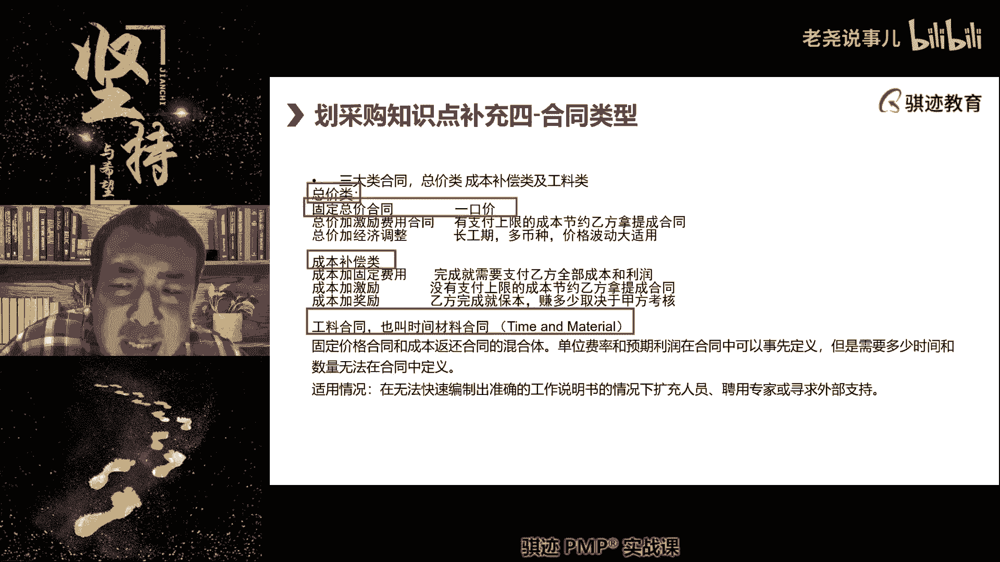

什么意思啊，就是我跟我跟我的乙方约定。

你我最高付你10万块钱，但是呢你成本我有一个心理成本，这个是这个事情呢，我最高花10万块钱做完。

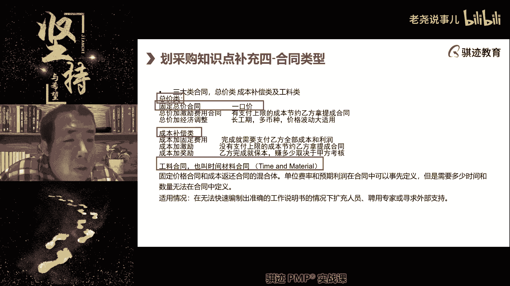

但是我有个心理成本8万啊，心理成本8万，你事情你事情给我做完了呢。

如果比8万低的，比如说每低100块钱，你就可以额外提成30块钱或者20块钱。

这样你为我省的越多，你就赚得越多，这种时候就叫总价加激励。

但是如果你给我超支了，虽然我也给你，我也我也会给你报销。

但是抄到我的心理价位，比如说10万块钱以上，对不起，我只付10万。

这个就叫总价加进。

明白了，那么什么叫总价加经济调整呢，比如说我们这个合同可能要执行好多年。

或者我们这个合同呢，要涉及到人民币和美元的兑换。

最近是不是美元涨得很厉害对吧，或者我们这个合同呢又涉及到什么。

价格波动非常剧烈啊，我们这个啊我们这个合同，我们这个合同里涉及到很多东西。

都是实跟石油有关系的对吧，最近油价上涨，上下波动很剧烈。

那么我们怎么样能够让这个合同长期有效执行，因为如果价格波动太剧烈。

有一方觉得这执行这个合同不算，我们可能就把这个合同废掉了，然后后面再去签个合同。

过了没就又废掉了，这个是不是对于买卖双方的武力啊，所以我们会签署这样一个合同。

就是什么，如果价格涨到多少了，我们自动调整价格，如果价格跌多少了。

自动下下跌多少，如果汇率变动多少了，我们自动什么调整我们的货币的合同金额。

那么这个呢就是总价加经济调整，以保证合同能长期有效的执行。

兼顾双方利益。

OK吧好，那么这是总价类合同。

那么成本补偿类合同呢有一点点搞啊，脑子啊，先接触，第一种是乙方最愿意做的合同类型啊。

但是这种一般是属于很强势的一方才会签到的，成本加固定费用指的是什么，只要活干完了，乙方花多少钱，甲方就报销多少钱，只是其其其二，乙方会拿到一笔固定的利润收益啊，旱涝保收花钱多少钱。

都是你报销，我还能雇我，还有固定收益啊。

听听就爽是吧啊，就要成本加固定固定费用啊。

那么第二种呢叫做成本价激励和总价价激励，其实是一样的。

但是它没有天花板，比如说我们这个事情本来我跟你说。

我心理价位800块钱干完了，但是只要10万块钱干完都能接受。

当然了，你能用5万块钱干完呢更好，我还可以奖励你，但是呢你现在给我用50万干完了。

如果我们签的是总价价激励。

对不起，我只给你10万，超过的部分你自理，但是如果我们签的是成本加激励呢。

我还是得付你50万，但是这个50万呢我们要根据扣提成比例什么。

我要扣，我要扣你钱啊，我困起这个就是成本加激励。

他没有上限。

但是其他的部分总价价激励呢是一样的啊，第三种成本加奖励是什么意思啊。

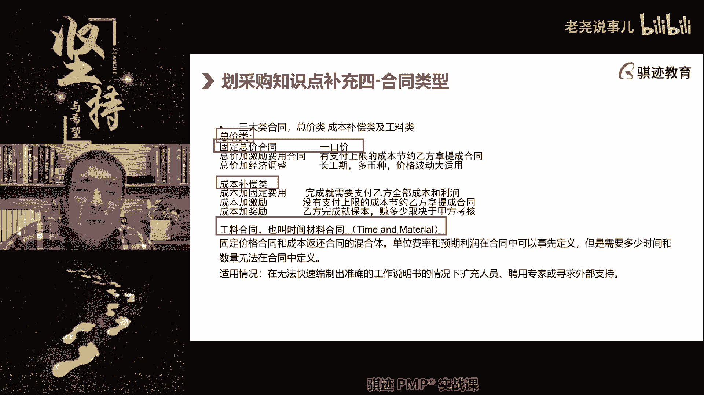

你把活干完了，花多少钱，我给你报销。

但是呢你活干的好不好，会决定你能挣多少钱。

你活干的越不好，你的利润就越低啊，我给你评价越低，你的利润就越低。

你活干的越好的，我给你评价越高，你的利润就越高，这种叫做成本加奖励。

好这些合同类型都明白了吧。

明白了，同学给你扣个一。

不明白的还可以继续问我啊，但是这个考试经常会考。

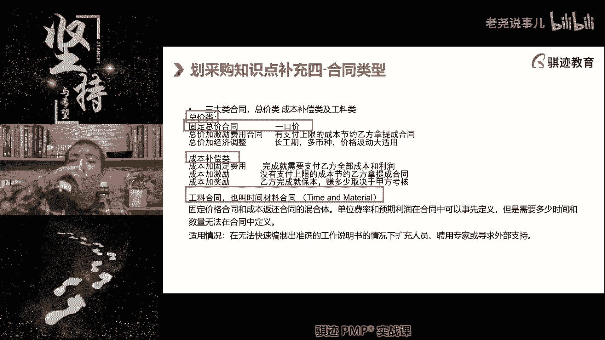

好接下去讲变更。

哎呀，同学们算了算了算了。

今天今天我们讲到这里好吧，留个尾巴吧啊，因为今天增加了我们的课后练习嗯。

上次上次课的课后练习还增加了项目章程。

所以今天那个变更讲不完了，但是变更仍然是我们考试中，非常重要的一块东西。

那么今天也晚了，如果继续讲的话，会影响大家的。

收看效果以及休息时间，因为讲得太晚。

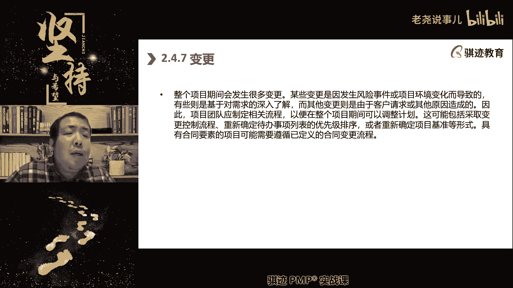

很多同学也听不见，也累了对吧，这个实事求是，那我们这里留了一个小尾巴。

我们今天课程上留了个小尾巴，下次上课的时候呢，我们把变更管理好好讲一讲啊。

这个要好好讲一讲，然后呢我们会讲啊，讲完我们的课后练习。

把这些课后练习讲好吧，那么我们今天就先讲到这里。

我们讲规划绩效率，最后讲到欠一个变更签。

一个变成黑签，一个收尾好吧，我们今天先讲到这里再讲下去，我相信很多同学就累了。

好吧好，那么我们今天上这里，那么所有的同学请注意啊。

我们稍后我会把那些项目章程那部分，PPT截出来发给大家。

那所有同学请注意我们后面的变更类的题目啊，变更的这个课这个预习来先预习一下。

然后我们从下一节课开始就开始讲专题课。

范围进度成本的专题课，那么这个专题课呢咱预习一下那个内容呢。

就相对来说大家比较容易接受，后面很长一段范围进度成本敏捷专题。

这些都是我们原来偏颇和第六版的核心课程。

我们会就核心课程的叙述方式，再给他继续重新啊。

滚一遍，里面很多东西，其实我们今天课已经涉及到，但是没有深入，我们后面会深入的去讲解。

明白了吧，好那么希望大家及时的做好复习和预习。

好吧好，那么我们今天的课程就到这里。

谢谢大家拜拜。

不辛苦不辛苦啊，你们听得辛苦啊。

只要你们听的不不累就行了，希望大家理解。

因为你们的学习掌握是我最高的目标。

