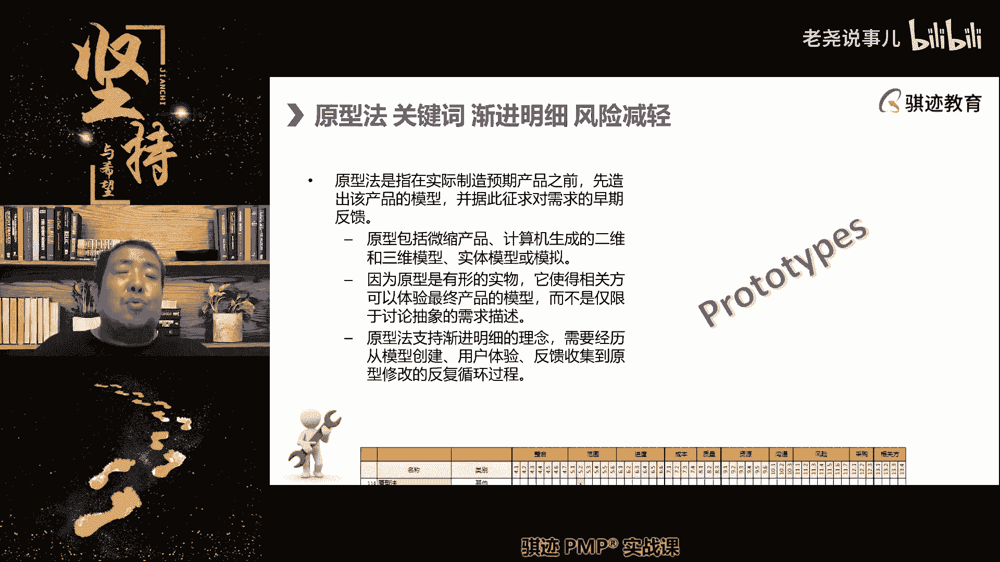
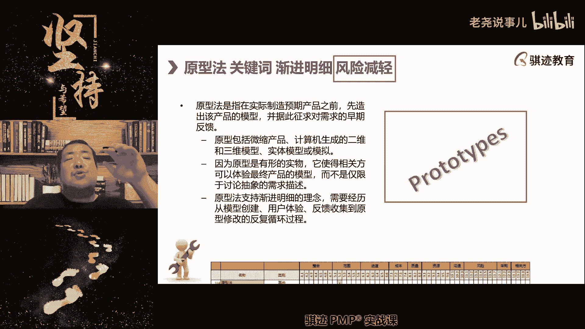
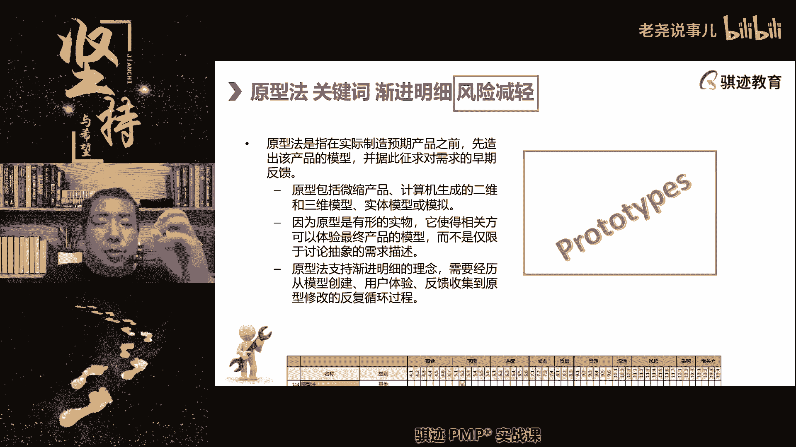
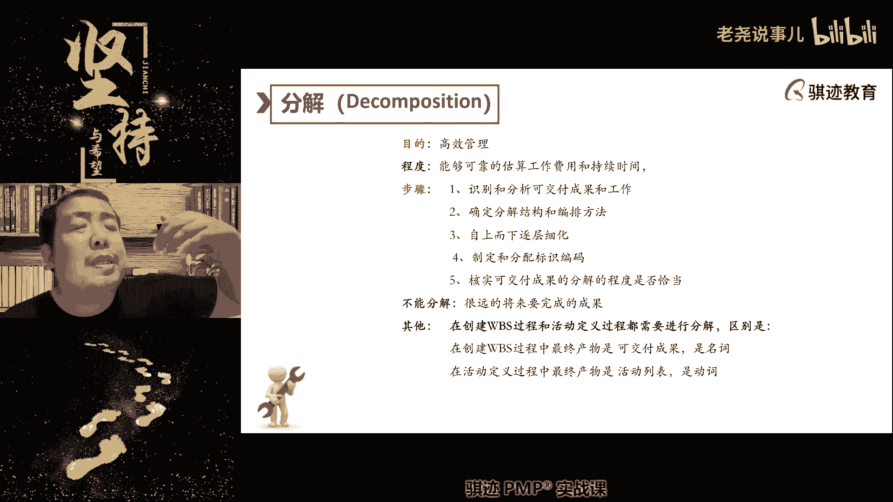
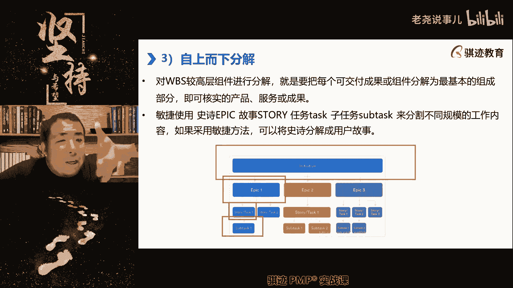
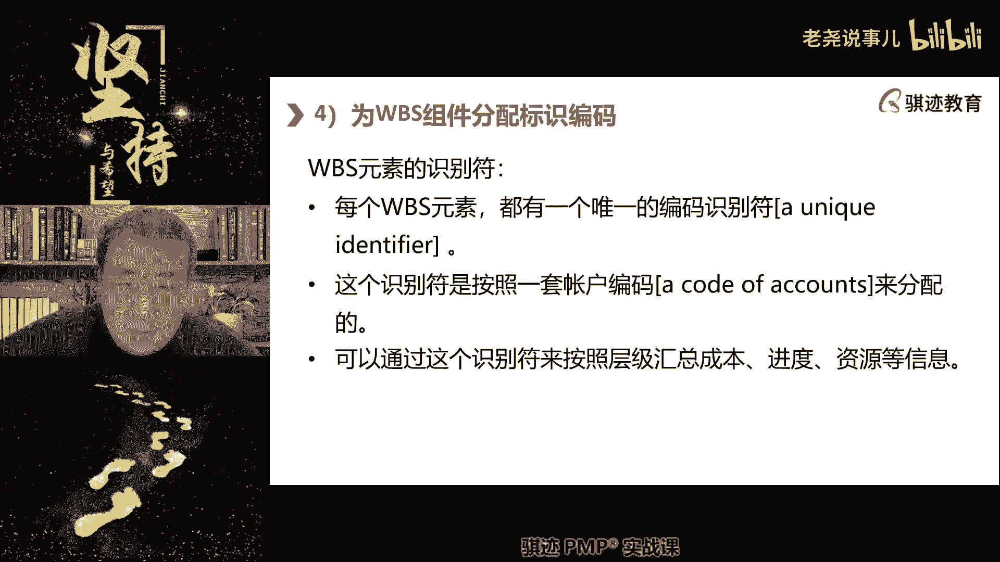
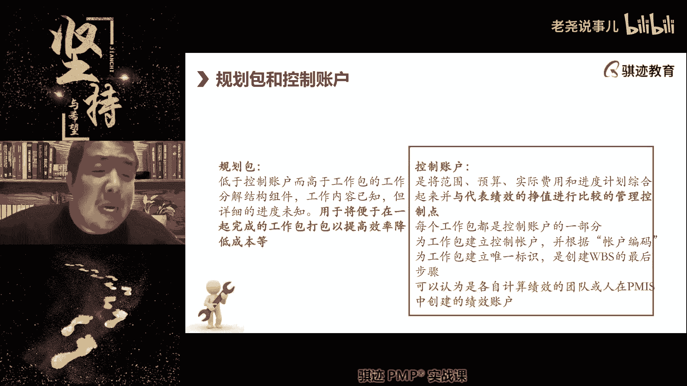
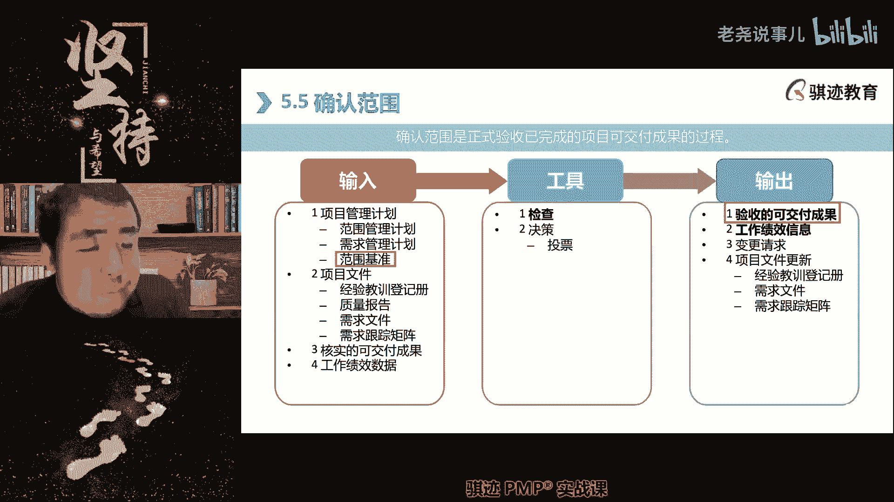
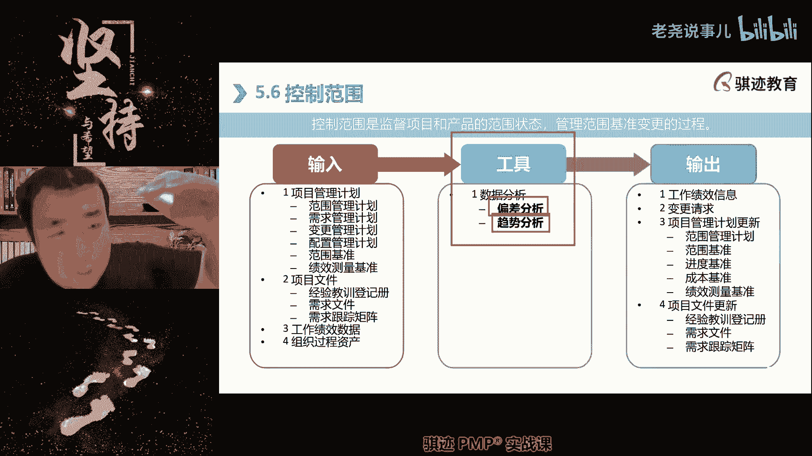
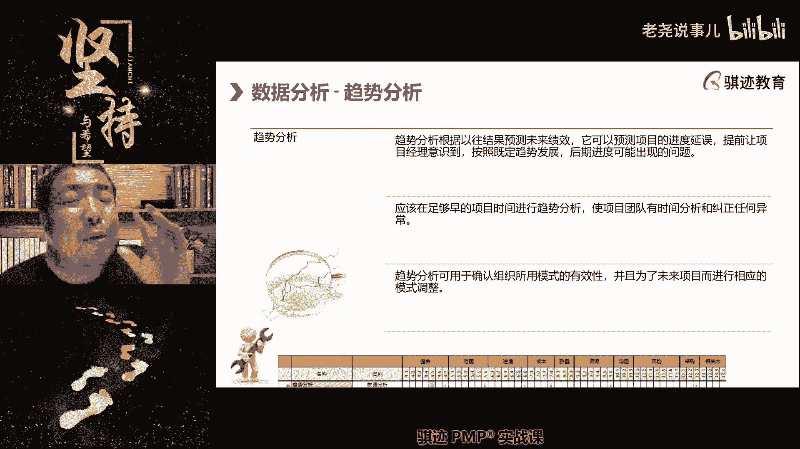

# （收费视频完整版分享）PMBOK第七版课程PMP考试报名认证培训精讲-零基础项目管理第七版教程最新版直播课回放视频免费课程资源-骐迹教育谢阳主讲 - P21：7-3项目范围管理 - 老尧说事儿 - BV1ek4y1s71N

需求进行两两的结合。

对他们的可结合程度进行打分和。

结合的效果进行打分，打分之后呢进行分类统计汇总，对于那些得分最高的，最能满足用户需求的那些特性。

我们将在产品设计当中予以保留。

这种就叫做质量功能展开，叫做框quality function deployment，指质量功能展开，OK明白吗，他就是这样一个将特性和啊。

这特性和我们的用户需求进行结合，来选出最有意义最有价值的特性的一种啊。

质量规划和设计需求设计方案啊，这叫QFD啊，这是第二种引导市场或者第三种工具。

包括什么用户故事啊，注意用户故事呢就是说什么在敏捷当中。

我就经常有他的描述性什么，我是谁，我想要什么东西以达到什么商业目的啊，我是叉老师，我想要你们通过pp来提高我的圈内生了啊，我带的学生通过的P考试越多，那么我的名声就越小，我的生意就越好走对吧。

当然是学校生意啊，我只是学校给学校打工。

就这个意思明白了吧，所以这个呢就是我们的引导式讨论会啊。

是一种需求收集工具，那么接下去呢我们会讲一个叫需求展示啊。

那么讲需求展示呢就讲到这里。

PP里面讲的东西都比较粗糙啊，大家请记住PP里讲的很多东西比较粗糙，其实需求管理分为什么，需求收集，需求整理，需求反馈和验证和需求的这种定义就是什么，需求首先要从呃我们的干系那边收集过来。

接下来呢我们对需求来进行整理，然后整理出一个什么啊，从一个非常主观的不明确含糊的需求，变成一个什么清晰明确的一个需求，然后反馈给需求的提出方去验证，这是你想要的吧，对吧啊，就比如说啊。

比如说呃呃你的老板给你十个颜色吗，啊那么你就跟他说，诶老板这是你你要你要的这个烟，还是给你烟，地上就得打个火对吧，这就是验用行为反馈给你的老板验证啊，你的需求是什么。

是不是给你递商之间再给你打个火对吧啊，那么老板点了点头，是的啊，那么你就给老板递上烟打个火对吧，这就完成了一个需求的收集和定义，那么这个就是需求，这个就是需求管理当中，其实我们是四部。

那么系统交互图就是一个什么，需求反馈的一个工具，就是尤其是用在什么，我们的工业设计和it设计当中，我们给用户设计了一个系统，然后要给用户展示，人与系统之间是怎么进行交互的，来可用户确认一点。

这是你想要的系统吗，啊啊可这可以看作是一个什么概念性的原型，你可以看成是一个概念性的原型，这是你想要的想要的系统吗，如果是的，我们按照这样一个规划方式继续，如果不是，请告诉我哪里不是。

我们继续进行改进啊，这是一个需求反馈的工具，叫系统交互图，OK明白了吧。

好继续往下讲，那么我们在需求的管理当中。

经常会遇到一种场景，就是用户表达不清楚啊。

表达不清楚啊，他想要什么啊，比如说啊比如说你问一个啊男生啊。

你想要一个什么啊，你想要一个什么样的对象，那个男生跟我说，我喜欢温柔的，善良的，善解人意的啊，得得得得得啊，那么这个时候呢你懵逼了对吧。

什么叫温柔善良这个东西，这怎么定义温柔善良呢，然后你只能跟他说啊，你喜欢林志玲那种类型的，还是高圆圆那种类型的，还是迪丽热巴那种类型的。

对吧啊你啊你往哪种类型去靠。

这个其实就是一种原型啊。

你想要的那种类型是哪种类型啊，啊你会，然后那个男生跟我说啊，我想要迪丽热巴那种类型的，但是比他呢啊更加啊啊贤淑一点啊，更加文静一点对吧，然后呢，我们在初始的原先基础上再进行精细加工。

然后呢加工捏出来这个人之后说啊，这是你想要的那种类型的吗，是的啊，然后告诉你，对不起，这种姑娘早就被人抢光了，哈哈哈哈哈哈哈啊。

所以原型法啊，我们开玩笑的开玩笑，原型法的英文叫做prototypes。

它是用通过用呃。

嗯是预先设计的，由粗到细啊。

由由粗到细，有同学说啊，等会再回答，如果有问题再问啊。

由粗到细，由概念到具体的这样的过程，慢慢慢慢的将用户的啊需求，从表述不清到表述清楚。

这样的过程叫原型法，它分为抛弃型原型和眼镜型原型。

这两个都可以用，早期可以抛弃啊，你像高圆圆呢。

还是要迪丽热巴的，对我要迪丽热巴的高圆那个就抛弃掉啊，然后呢迪丽热巴的那个圆形技术再改进一下吧。

啊用于减轻需求不明确带来的风险。

所以原刑法也是风险减轻的一种具体方法。

而不是一种具体策略，它是风险减轻策略的一种具体方法。

叫做原型法，明白吗，它的背后的思想是什么。

渐进明细，从粗略到详细，逐渐明晰。

你的许褚。

啊OK明白了吧，然后原型它只是原型。

最终你在创造可交付成果或者确定需求的时候，仍然需要进行技术性的落地啊等等这些东西啊。

圆形发音的手绘图啊，同学啊，注意你表达了所谓的原型法一定会产出手绘图，高保真图什么啊，中保真图，这个，这，这这些东西只是特定行业的圆心法的一种称谓。

不一定所有行业从你的描述法当中，描述的方法当中。

应该是你是属于啊，IT互联网那种那种方向工作啊，不是所有的很多的行业都会有原型法。

但是不是所有的行业都是你这么说，但是呃都会有类似这样的概念啊。

从不精确到精确，从粗略到详细的原型。

到最终最接近最真实产品的啊，就是你像所说的高保真原型。

高保证券已经非常接近最终产品。

那么高保真原型和和最终产品主要区别是什么，高保真原型只是帮你捏出来的，它并不一定能够生产出来或者能量产出来。

他要考虑到一个落地和落地成本，落地难度。

落地技术问题，成本效益的有问题啊。

好那么这是原型法啊，那么最终我们会将收集来的需求落到两个文件。

注意所有的需求都会落到需求文件当中。

但是只有符合smart原则，并且能够达成项目目标的那些需求。

才会选入到范围当中去，成为基准的一部分。

观察和交谈不是这就注意观察。

有同学问观察和交谈，它是一个需求收集工具，指的是什么。

我观察的目的是什么，不是看你做的好不好，而是看你这个做的过程当中。

或者行为的过程当中，能够产生什么样的潜在需求啊。

那我们还是举那个例子啊，我们讲观察调查，举个例子。

我蹲在厂门口观察工人，晚上九点下了。

晚班出来，很多工人都饥肠辘辘，想吃东西，这就收集出了一个什么夜宵需求。

如果我换一个角度，我是一个厂长。

我蹲在厂门口看工人，九点钟出来之后还有精神干活。

那么我发觉什么，他们的工作效能还可以再压榨一下。

我是一个黑心的老板，明天就宣布什么工厂十点钟才下班。

这是监控。

明白了。

工作内容不保啊，举个例子啊，举个打工人。

打工人很心酸的例子啊，好那么这是需求，那么需求是。

就是说我们在需求文件当中所描述的需求，应该是统一格式的啊。

统一格式的这种描述的那么多，但是在需求文件当中。

需求未必都会进入范围，但是进入范围的需求，一定会被记录在一个东西呢。

叫做需求跟踪矩阵，这个就进入这个表格就意味着什么。

我们向客户承诺，你这个需求我们肯定不会做啊，然后呢，我们用这个举例来跟踪这个需求的实现过程，已被已被什么相关方问我啊，这个需求做的怎么样啊，有没有做完啊，落实到哪里啊。

那么我们可以根据需求跟踪矩阵来查看啊，向相关方证明我们的需求做还是没做。

所以如果我们出现了可交付成果当中。

应该有某个需求而没有做出来的，我们首先查看什么，需求跟踪矩阵当中有没有去落实做，如果这个需求连需求跟踪矩阵都没有出现，说明什么，这个需求根本没有被挑选入项目范围当中。

我们就认为这个需求本就不应该做啊，然后相关方呢，可能我们该技能跟我们什么出现了误解，他觉得应该做，我们觉得不应该做啊，所以他也就根本就没有跟踪，没有纳入范围内，也就不用跟踪对吧。

这就是需求跟踪矩阵和需求文件好。

这是我们讲的收集需求，收集完需求之后，我们就进入定义范围。

定义范围其实很简单，只要输出一个文件，项目范围说明书啊。

那么这里我们会再详细讲一讲，范围和需求是怎么转化，范围是客观描述啊，比如说举个例子啊，茶老师肚子饿了，我想吃东西，这是个需求吧，我肚子饿了，我想吃东西。

这是需求吧，那么我们的项目范围是什么，给叉老师提供一碗蛋炒饭。

那么这碗蛋炒饭里面应该有什么，包含多少克的蛋，多少克的饭，用多少克油的吃。

有有有多少个油，然后这个饭炒菜总共有多少种啊，那么这相应的这些提供的内容就是什么，我们的范围也有同学问啊，这个问题挺好，有同学问会不会存在纳入需求跟踪矩阵的需求，在没有完成中途提出不要了，走变更可能了。

这可能也会，也会从那个什么需求跟踪理论当中啊，预期数，但是一般我们不会把它擦掉，我们会记住这个需求半途被客户中途取消掉啊。

会有这么个结果啊。

这个问题非常好啊，但当然了，这个考的可能会比较少啊。

但是这个问的没问题啊，那么我们在定义范围的时候呢。

就会用备选方案分析，注意定义范围，为什么被会会有备选方案生成和备选方案分享。

是因为我们同样实现用户需求。

可能会有不同的范围啊，我们继续拿前面那个例子，超老师肚子饿了，想要吃饭，而且肚子饿了。

我要填饱肚子，我可以你用一碗蛋炒饭满足曹老师的要求，我可以用一碗面条满足唐老师的要求，我也可以使用什么啊，方啊饼干啊，不是方便面，OK1碗方便面或者是饼干满足他。

那么这就是不是多种备选方案，不同备选方案是不是意味着项目的不同范围。

那么取决于你的取舍对吧，比如说我我对我来说。

我现在只想快速填饱肚子，越快吃到嘴里越好，那么我可以选择什么视频看啊，我想吃的舒服一点啊，啊不要那么垃圾食品，我可能去吃个蛋炒饭对吧啊，我想吃的爽一点啊，晚上我也不考虑健康不健康，吃的爽一点。

那么我吃个泡面对吧啊。

不同的备选方案可能会导致不同的项目的范围。

这能理解吧，那么我们对于我们用户所要求的可交付成果的，这个产品进行分析，也能得出项目范围啊，那么这种场景往往是什么好，我们对于已经明确在项目的规划阶段，已经明确定义了产品是什么样的时候。

那么我们可以使用产品分析，来从它的产品结果上倒推出，要实现这样的结果，我们需要做哪些范围，好那么就比如说什么啊，中国人要想什么登月人啊，有人登月，那么那么一定倒退是什么，我们需要什么。

我们需要大载荷的火箭对吧对吧，长久对吧，那么要想发射成功，长久需要什么，我们现在有之前的火箭的技术准备对吧，我们需要绕月，然后呢无人登月对吧，然后通过产品的一步一步分析，我们就可以显现出来。

实现这个东西需要哪些哪些哪些东西，这就是一个范围的，相当于倒推，从结果向这个所有领域的一种倒退啊，这就是产品分析啊，那么这个社会重要才行好，那么最后我们会将需要做哪些注意。

我们前面讲了，有些是用户看得见的，有些是用户看不见的，通通呃，需要实现哪些注意啊。

这个表现不太好，需要实现哪些东西，有些是用户看得见的，有些是用户看不见的，通通通进入到一个很重要的文件，叫做项目范围说明书啊，它里面有这些东西，请注意啊，这个考试经常会考它里边是什么。

对于项目范围和主要可调成果的描述，以及假设条件和制约因素。

这个假设条件，制约因素，就比项目章程当中的假设条件和制约因素。

更加详细和具体啊，可能不一样，但是更加想是贴近具体工作层次啊。

那么范围说明书里有什么项目范围，描述这个表示的表示啊。

它虽然叫定义范围，但其实是描述，那么什么叫描述啊，我们做什么和我们不做什么的一种表述啊。

注意项目范围，有时候你要说你做什么啊，要完成什么，完成什么，完成什么，可能是可能是比较难的。

但是你可以反过来说，我们不做什么，我们不做什么，我们不做什么，反而是比较容易表达啊。

所以项目的边界在哪里，我们可以用做什么和不做什么结合在一起。

去描述项目范围。

说的一个作用就是描述项目的工作边界在哪里。

啊这会他会写明哪些工作不属于项目，明白了吧，第二他会写明项目中的可交付成果，第三他会写明验收标准，注意这个验收标准要不要和客户达成一致，要不要和我们的与客户签署的合同，里面保持一致，要不要。

这个标准要不要保持一致，非常好，就不要保持一致啊，所以项目范围说明书在制定完成之后，一定要客户签字达成一致，这个是要点啊。

如果不达成一致，双方的认知不一，我觉得这个事情该做，你觉得这个事情不该做。

来了就会产生分歧，明白了，这是很多题目的考点之一，就是没有就范围说明书达成一致啊，那么验收标准，那么验收过程在哪里定义的，在项目范围管理计划当中定义验收过程，验收标准由项目范围说明书定义啊。

啊那么最后是我们的除除外责任，第四项是除外责任啊，就是天灾人祸不包对吧啊，啊，就像就像比如说你跟你跟那个什么保险公司，签了个合同对吧，车辆进水是包赔的，进水之后发动机二次启动就不赔了，对吧好。

所以要防止车辆二次发动机熄火，一定要注意什么啊。

不要开启，雨天不要开启自动启动，自动启停会自动给你发动机二次启动啊。

完蛋了，然后再次进一次水，那就不保修，保险公司就不晚。

好好这个文件非常重要，是我们跟客户达成一致。

那么我问你们，如果在预测型的项目当中，我们没有跟客户就项目发挥说明书达成一致。

后续可不可以去进行WBS的分解，可不可以进行活动的安排和排序，可不可以做。

可不可以，对记住不可以不可以，请记住不可以啊。

一定得放个说明书，签字确认了才能后续工作做。

因为如果不达成一致，后面的工作可能都白做啊，预测型是的是定义好。

但要达成一致，你所认为的应该做哪些，和客户应认为应该做哪些要达成一致。

所以项目范围说明书要签字。

都签字确认明白了吧，啊题目要听清楚啊。

好那么有了项目，但是项目发布说明书，我们也知道是渐进明细的啊。

它是渐进明细的，所以他呢一开始是只是描述什么做什么，不做后续呢。

我们今天就知道啊，他做的里边里面的详细内容是怎么样的。

但是不会超出那个做和不做的边界啊，这叫间距明显。

好那么接下来的工作就是创建的BBS啊。

注意创建WBS创建完成之后呢，我们就得到了范围基准。

项目范围基准，但是这部分WBS呢，现在PNP考试呢考的就比较少了啊。

我们只是介绍一下WPS呢，就类似于像这种树状的这种结构。

我们将项目发挥说明书是最顶层的，项目发挥说明书逐层分解。

分解到最底层，最底层是什么啊，我们称之为工作包，也就是说最短可以在八个小时之内完成，最长不超过80个小时。

能够完成的这个特定工作结果，我们称之为工作包。

注意啊，它是一种结果，它是一种结果，那么这样的分解叫对工作的详细分解，称之为WBS分解。

WPS分解完之后，又以便于我们对它进一步分解。

得出执行的过程，我们称之为活动进度，那一章再会讲啊，所以WPS分解是我们建立基准的，非常重要的一环，哎来了，我这个也是网上说的敏捷型，不存在WBS敏捷型，也不存在预测型所谓的活动。

但是敏捷当中有什么有任务啊，有task，但是没有活动。

对吧，所以我们这里讲的默认都是什么预测性。

敏捷是另外一套玩法，我们会在敏捷专题会讲啊，不要急，但这个问题问的非常好。

good啊，WB是最底层，我们称之为工作包工包。

好，那么WBS的分析当中呢，我们会有一个工具叫decomposition啊，这是我们现在项目管理当中篇和第七版当中。

一个被提升了更高的工具叫做分解啊。

就是化大为小，化繁为简。

分解，我们将项目范围说明书逐渐分解，分解分解分解到最细小的每一个具体结果啊。

就比如说一部车啊。

我们讲项目范围说的时候，我们是开发一部车，那么它分解最后的每个结果是什么。

这个车上的每一个零部件都有可能是个工作包。

但是最终如何去生产出来，这个车上的零部件是我们的什么，是我们的具体活动过程，但是我们只要知道，如果我们分解出了1万个零部件，我们把这1万个零部件都生产出来了啊，都制造出来了。

那么我们就可以把这1万个文件拼成一部车。

这就是分解的过程。

啊那么WBS的编排方式呢。

P已经不考的，可以看一下啊，可以按照阶段分解，如果我们的阶段比较多。

可以按照阶段分解，如果可交付比较成成果比较多呢，可以按照可交付成果来分析。

有同学问WPS是否可以应用到多项目，类似于字典的，可以啊，注意可以，但是这个会比较复杂比较复杂，WPS分解可以用于什么项目级的分解，也是可以的，但是这个就分解的非常的复杂了啊。

我们一般不会这样，除非真的有比较啊。

那么规划包括空账户呢，知道一下规划包呢就是比工作标高，但是比空置账户低的啊。

一类工作包的集合用于什么打包啊，就相当于打包打包控制账户指的是什么，这一类活都归啊。

或这一堆活都归为这一组人干，我们将这些活扔到这组人的账户里面去，可以对他们进行绩效考核。

所有人的公职账户的工作内容加起来，就是整个项目的工作内容范围啊，所有控制账户的总和，就是整个项目的所有的工作范围，怎么个意思好。

那么WBS分解呢，我们一般前面讲啊，大家可以看到就像类似于像啊。

前面讲这种才会分解，那么在敏捷当中呢，我们不讲分解。

但是敏捷有类似的分解啊，我们会有initiative。

story task和sub task这种文章啊，就是说我们也会有什么宏大的叙事啊。

较大的场景啊。

具体的故事内容和每一个故事之下的任务。

甚至是子任务来形成分解，这是敏捷当中的范围的分解。

但是他呢并不严谨。

意义上对于我们的5w vs分解啊，这是取决于需求的大小，需求越大，我们就块越大，但是我们一定会把也会把什么大块的需求。

不利于实现剁成小块，最小块的可以实现的过程啊，那么从story到task的过程，其实就是一个什么，从需求转为实现过程的一个实现动作啊。

它中间其实也跳过了范围，OK这个不用类比啊，大家只要知道一下敏捷。

到时候怎么去进行分解就行，那这就是一个WBS分解的一个例子啊。

第一层，第二层，第三层，第四层啊，其实这后面我们后面会拿这个图去看的啊，我们在WBS的工作包下面不是分解，是活动吗，我们还要继续进行分解，一个活动，两个活动，三个四个五个活动。

我们完成这五个活动就能实现这个交互。

这就是WBS分解，那么WBS分解完之后，对于里面的每一层WBS不。

无论是它是不是底层的工作包，都会授予一个编码啊。

WB4编码诶，有同学问啊，工作包括活动啥关系啊。

诶这个问题问得很好，可能如果同学不问问题的话。

可能感觉讲的比较快，那么问了问题，那么我们很好，那么我们就稍微详细讲讲。

工作包是一个结果最小的一个结果，比如说我们还有前面讲一部车。

假设我分解出1万个零件，每一个零件是一个结果对吧，那么比如说我们分解出有一个零部件，是一颗螺丝，螺丝是一个客观事实结果要生产出这个螺丝。

需要做几步动作和活动过程来生产这个螺丝。

它是一个过程，比如说第一，我们要从原材料的那个那个那个那个啊。

钢棍上去截下去。

截一小段的什么我们的钢材啊，这是第一步动作，第二步呢。

我们要对这个螺丝来进行机械车床加工对吧，第三步呢这个螺丝加工出来之后呢，我们要对应进行什么抛光膛线对吧，这三步做完之后呢，我们就得出一个结工作的包的结果，就是一颗合格的螺丝啊。

所以就像有同学说的一样，工作包是一个结果，活动是实现结果的，一步两步，三步四步，五步六步。

明白了他是个过程，可明白了，你们就从螺丝是怎么产生的，去思考一下就可以了好吧，但是这个关系你们得明白啊，有同学提，我就说一下啊，这个东西得明白，虽然这个现在也考了。

也没有以前多了，但是该明白的明白好，每个WBS在我们的分解的层级上。

都会有一个编码啊，包括以后每一个活动，其实它有编码。

活动的编码和WBS的编码，其实是会联系在一起。

好那么分解的是否适合这个现在不怎么考了。

反正你们看这个，你们自己看一下就行好，那么最后我们有了项目范围说明书。

有了WBS。

还有一个东西叫做WBS的字典，它是什么东西啊，对于WBS的详细描述啊。

对对WPS详细描述。

啊在这里对于WBS当中的详细描述。

各个层级包括工作包在内，各个层面详细描述。

称之为WBSC，因为它里边WBS只是一个名字吧，一个曾经为一个名字。

对于这个名字背后的含义，我们对其详细定义和描述称之为WBS字典。

包括什么，编码是啥，它的内容是啥。

有什么最细节的假释条件和质因素啊，谁来负责干这个事情啊。

里面包含哪些活动，这个这两部分要等到什么进度规划结束之后。

反过来填这一部分所需资源呢，要等到资源规划完。

反过来填成本估算了，要等到成本估算完之后，反过来再点质量要求是质量上限啊。

所以这个其实就是什么，定了范围才能确定其他的其他的规划做完呢。

又补充完整范围的相关内容啊。

包括最细节的验收标准，这个要和我们的项目方面保持一致。

这些东西WBS的相关内容呢全部定义好了。

那么就可以合成最终的什么，最终的我们的终极宝物啊。

范围基准范围基准其实是由项目范围说明书。

WB和WBS词典三块东西共同组成。

范围，记者，它从整体分解和细节定义。

来精确定义整个项目的范围及其实质内容。

这个就是基准，为什么叫基准，你在实际创造可交付成果的过程当中。

时刻要拿你的当前可交付成果。

与我们的模板相当于样板进行对比啊。

这是我们的一个标准样板件，你生产出来的其他可调成果要和标准样板间比。

有没有比他做的大了，做了小了。

做了歪了，如果有大有小有Y说明你的范围就跑偏了。

这是用于给你进行校验，到底你完成了没完成少完成了多完成啊。

这就是范围基准。

明白了吧。

好那么我们制定完了范围之后呢，接下去就确认范围。

确认范围其实比较简单，就是客户验收，那我问你们在这个子过程当中。

你们以你们的工作经验啊，你们有限的工作经验，你们认为有同学又来举例子，这个很空置账户和规模和规划包很难举。

诶，其实这个现在考试考的很少。

给你们给你们举个例子吧，其实这个现在考的不多啊，所以我们节省时间就没有说。

那么你们要问啊，那么什么是规划包啊啊那我举个例子。

比如说呃我们要搞。

比如说我们学校宿舍要搞卫生，每一间宿舍呢都要拖地啊。

都要完成地表整洁，墙面整洁和什么和桌面整洁对吧。

然后呢，我们所有学生开始了吗，呃呃的教室啊，教室啊，那我们所有学生呢就开始什么啊，所有学生就开始什么啊，分组啊，我们分为墙面组，桌面组和地面组。

墙面组负责所有的墙面清洁，地面组，所以负责所有地面清洁。

我们的桌面组，所以负责桌面情节，那么我们就形成了三个控制账户。

当我们把三个控制账户当中的，所有工作全都做完了。

那么木门其实就完成了项目的所有范围对吧，这就是控制账户，它其实是对于考核，比如说我们一共有十间教室。

一间教室当中，我们墙面一共有什么，有四面墙对吧，组成四四面墙对吧。

顶顶上查不到，就算四面墙，那么我们时间教室一共多少40面墙啊。

那么我们在啊墙面组同学的空战物理，就是有40面墙的相应的工作内容要做啊，那么地面组也一样对吧，我们有啊十个教室，那么就十个地面要去拖地啊，桌面组呢我们一个教室，比如说有20张桌子。

十几张桌子就是200张桌子的桌面要去擦对啊。

这就是桌面啊，这就是控制账户，明白了吧。

那么什么是规划包呢，就是比如说啊什么是规划吧。

就是我们可能什么我们换个例子啊。

换个例子规划的，比如说我们要搞绿化啊，我们每每幢楼在盖完楼之后。

是不是都要搞绿化嘛对吧，那么我们是盖完一幢楼搞一次绿化，还是所有的楼盖完了一起搞绿化。

肯定是一起搞绿化，所以搞绿化的这个事情，比如在楼盘开发当中搞绿化的事情。

是不是虽然每幢楼都有自己的专属的绿化对吧。

但是搞绿化这件事情，是所有的楼的绿化集合在一起做的。

它可以提高效率，所以我们会有一个规划包。

叫做这个楼盘的绿化工作，还是集合了很多来自很多工作包当中的，包含的绿化工作，或者不是工作方，和很多我们的分析结构当中的绿化工作，合在一起啊，集中做那么氯化呃，呃绿化团队会专门负责所有的绿化工作。

那么就避免了什么，我们的工作中分类什么啊，你是一号楼，一号楼得配备什么建筑团队，得配备什么装修团队，得配备6号团队，2号楼还得配备建筑团队，装修团队和6号团队对吧，我们把它捏在一起做。

那么这个就明白这个意思，因为篇幅和第六版，对规划报的这个定义也很模糊啊，这是我个人的见解，考试也没怎么考，我只能给你们要，没问题，只能给你给你们举个例子，能明白了吗，好那么我们继续回来啊。

继续啊，但是有问问题就问啊，有问题就问，我们上课是这样的原则。

尾号317同学，你这个理解还是不对，我给你举个例子，白举控制账户是什么。

我们有很多工作，我们很多工作，结果有一组人或者一个人来负责。

我们把这些工作的工作，全都扔到他的控制账户去，这就是他应该完成的事情。

所以空置账户下并不一定只有一种工作包，规划包里面呢是放在一起做会更有效率，它也不一定是一种，也可能是多种。

取决于你放在什么东西，放在一起做会更有效率。

嗯OK啊嗯好，我们时间关系就不再继续解释，有问题跟我们群里来聊啊，就在问，那么确认范围当中，我们前面讲了啊，有个问题被打断了，确认范围当中最主要的一件工作是什么，这个是考试要记住客户一定要签字。

画押签验收通过一定要签字确认啊，那么考有些考试当中考题就是这样。

我们通过了验收，但是在客户那时候又不认账的关键是什么，在确认范围的过程当中，没有让客户书面确认啊，验收主要通过什么。

对于可交付成果的检查来最终书面确认。

达到了我们的验收标准，可以进行移交啊，这是确认范围的一个重要内容，其他的就没什么好讲。

那么确认范围的依据是什么。

依据就是我们的范围基准，包括我们的项目范围说明书啊。

里边的验收标准，执行范围，管理计划当中所定义的什么验收流程。

和验收方法，我们有时候呢是什么一次性全验光，也有可能是什么，做多少验多少，也可能什么定期验收，这都取决于范围管理计划啊。

好那么这个呢现在这个是九个啊。

那么最后一个呢就是我们的控制范围，我们的控制范围当中呢，就是什么将日常当中我们的可交付成果的啊。

生产执行状态与我们的范围基准相比较。

来得出当前的项目的啊。

工作范围是变大还是变小。

是满足还是缺失，能，这个能听得懂吗啊，就是说我们应该达达成100项功能确认范围，就相当于验收对确认范围就是验收客户验收，而且叫客户验收，因为还有一个内部质量控制，就是什么内部验收啊，两者验收啊。

就是可以，如果有些情况下是可以放在一起做的啊，那么控制范围是什么，拿我们的范围基准与实际生产相比较，看看做的多了还是少了。

比如说我们应该做100个功能，你实际做的过程当中呢，你发现只实现了98个功能，那么还差两个功能，这就是范围变小了啊，或者说我们本来应该实现100个功能，结果你给客户做了个120个功能，一问下来呢。

客户没要求你自己给客户多做了20个功能，这就是什么镀金对吧啊，所以控制范围可以用于发现潜在的什么范围，蔓延和镀金啊，那么它会使用两个工具，一个叫做偏差分析，一个叫做趋势分析，那么什么叫做偏差分析。

就是今天我们上课最后两个基础概念啊，我们课后练习题就到下一次再做啊，什么是偏差分析啊，基准相比你是高于基准还是低于基准，还是正好等于基准，对于控制范围来说，正好等于基准是最理想的情况。

对于控制成本和控制进度来说，高于基准是越高于基准越好。

但是对于控制范围来说是正好等于基准。

是最好的对吧，我们做的东西既不多也不少，是最好的，和基准相比既不多做也不少做，这是最好，这叫做偏差分析，什么叫做趋势分析啊，就指情况正在变得好和坏。

根据过去的一贯表现来预测。

未来会变得更好还是更坏的啊。

这个在控制范围当中不太容易打比方，我就可以换一个比方的啊。

就是说小明呢考试100分的考试呢，这次考了50分，那么它的偏差分析是好还是坏，这是第一问，第二问，小明上次考试考了40分，这次考了50分，那么它的趋势分析是好还是坏，这是第二个，请告诉我。

这是今天的最后两个问题。

嗯这是TM，好非常好啊，可以很容易得到一个结论，按照偏差分析来说，它仍然没有及格。

偏差是不好的，但是呢正在逐步改善趋势是好的。

明白这，所以偏差分析和趋势分析是我们日常分析当中，最常用的两种分析，OK好，那么这就是控制范围内，控制范围其实也没啥多讲啊。

平常分析对错没关系啊，好，那么这就是我们今天讲的范围管理的所有内容。

好吧啊。

那么今天的内容比较多了，我们讲了变更对吧，然后又讲了我们的一致性啊等等的规划，绩效与剩下的内容，然后讲了如何在预测环型，预测开发类型当中。

我们怎么样去做，一步一步去做范围的管理规划和控制啊。

这就是今天上课的所有内容好吧，今天上课内容有点多的啊，所以希望大家今天下课之后呢。

温习一下，明天不上课，但是明天最好明天呢大家预习一下进度管理。

因为进度里面的概念更加复杂一点，偏差是实际与目标之间的嘛，是实际与基准线，你可以认为是及格线，实际与及格线之间是正的还是负值。

实际减及格线好吧，那么我希望大家呢，呃复明天呢复习一下今天上课的内容，然后呢预习一下进度管理相关的内容，好吧好，那么今天上课又又晚了啊，又晚了，我们最近上课都很晚，因为我们第一次改版改了版。

所以讲的内容变多了啊，然后大家学习的内容也变多了啊，所以啊我免免不了有些东西会讲的慢一点，但是也是为了大家消化吸收，好吧好，那么这就是我们今天上课的内容，那么希望大家啊做好相应的分析。

那么课后呢我会跟我们的教务说啊，开放我们的范围管理这一章的练习题，供大家进行练习。

好吧好，那么这就是今天上课的所有内容，我们周四再见。

拜拜好好休息了啊拜拜，不要明天上课。

明天睡醒了就忘记啊。

