# （收费视频完整版分享）PMBOK第七版课程PMP考试报名认证培训精讲-零基础项目管理第七版教程最新版直播课回放视频免费课程资源-骐迹教育谢阳主讲 - P24：9-1项目进度管理下 - 老尧说事儿 - BV1ek4y1s71N

我们讲的进度是什么，进度的核心是提供详尽的计划，但是进度管理当中呢。

我们要依照项目的开发，生命周期类型来制定有效的进度管理的方法，敏捷有敏捷的进度管理方法，预测有预测，进度管理方法是方法是截然不同的啊，这点要特别注意，敏捷呢我们不会制定详细的计划，随机应变。

而预测呢则会制定详细计划，然后然后是谋定而后动啊。

策略不同好，那么这是我们讲，然后呢，我们上节课开始，关键讲什么，进度管理当中我们遵循的思想是什么。

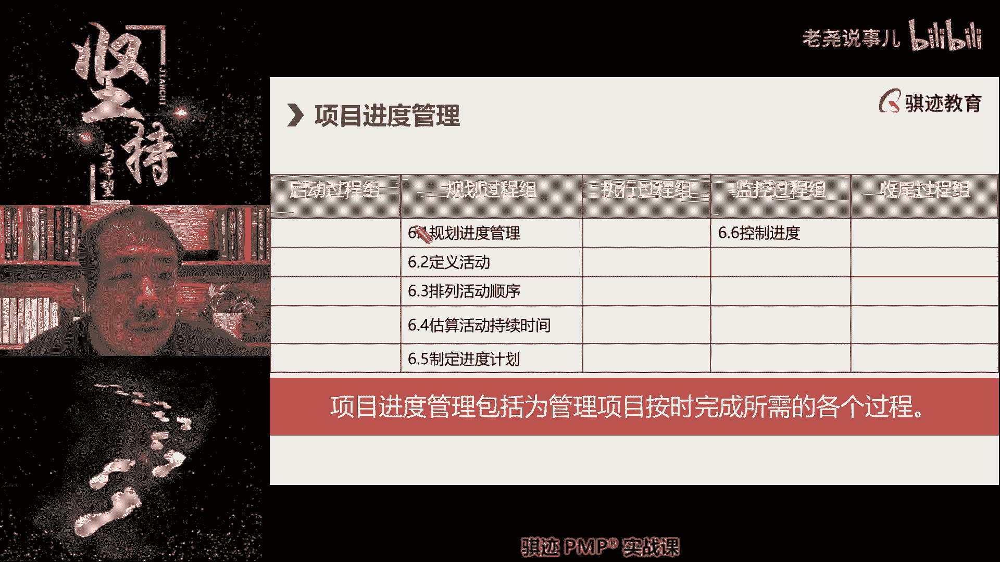

先排顺序再定时间啊。

我们上节课讲了，因为顺序位置的不同会影响时间啊，所以我们先排顺序暂停时间，然后将二元一次方程变为二元一次方程组，然后得到一个唯一的解，那么进度管理呢，我们以后前面也讲了啊，上节课也讲了。

是遵循渐进明细的原则，因为范围是渐进明细的进度的基本单元活动，它的呃来源是主要，来源是来自于我们范围当中WBS啊，所以范围也是渐渐明啊，范围是渐进明细，所以进度的规划也是渐进明细，也就意味着什么。

无论是敏捷型还是预测型。

都是先都是规划详尽规划马上要做的事情，但是对于未来的事情呢，不做详细的规划啊，这一点上敏捷和预测是一样的，那么预测只是说什么，如果我们能识别清楚，能够确定下来，尽可能确定下来，而敏捷则是要适应变化。

所以就算能确定下来，我们也不会确定下来，防止现在确定了，后面发生了变更，明白这个思想吗啊。

所以鉴定明细和预测敏捷是无关的。

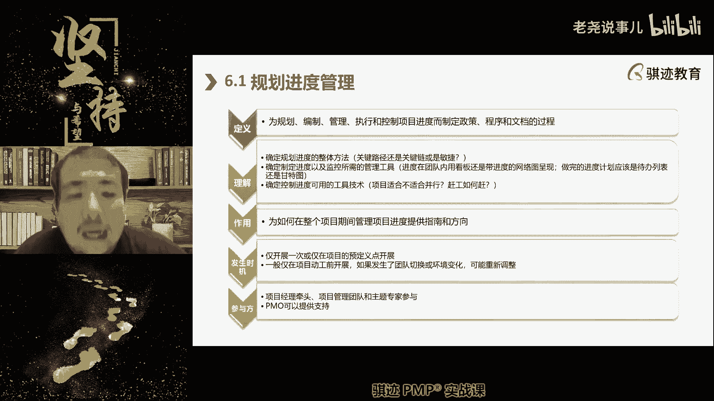

它是一个项目管理的规划的一个基本概念啊，然后呢我们首先讲了。

我们先要制定一个进度计划，制定进度计划，管理计划当中要看取决于使用不同的项目的，开发生命周期类型，注意这个时候我们如果是混合型的话，那么你的金融管理计划当中要体现不同的啊，生命开发。

生命周期类型的这样一种特征的管理方法，特征啊，最后输出一个进度管理计划，然后进入定义活动啊，定义活动当中呢。

我们会将活动分为三类啊，包括独立型啊，能够独立地产生绩效的依附型是呃，其辅助支持作用可以分摊绩效的啊啊啊依附型。

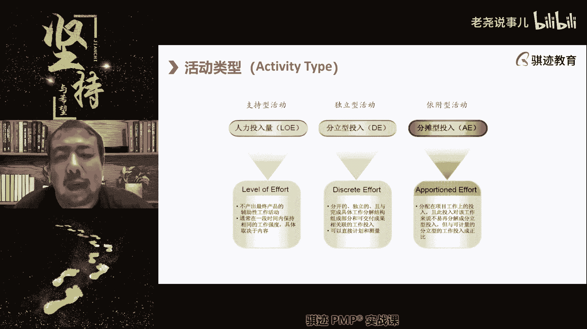

然后支持型呢是跟绩效没有直接关系的，是因为支持前两种活动啊。

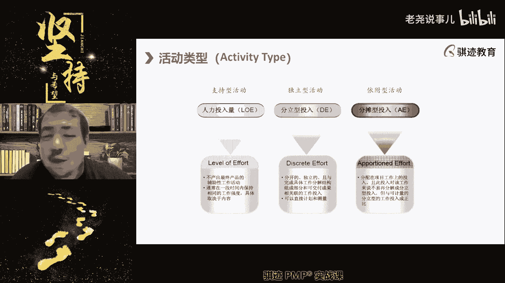

好我们，然后我们又说从WBS的工作当中。

分解出来的活动，它可以嗯嗯它可以与VBS相关联，对吧，就我们上节课程他会有自己的编码。

然后呢符合滚动规划，然后我们把它会把它所有的活动。

都列入活动清单，当然活动清单，活动并不完全都来自于啊WBS工作包分解。

而有一部分来自于什么质量的规划。

来自于风险的规划啊，来自于我们的采购规划。

好那么我们活动当中呢还会有活动属性啊，活动属性。

活动属性当中是描写了这个活动的详细定义，中间有些定义呢我后面会讲到啊。

包括颈前颈后，接下来马上就讲了啊，你们回忆一下啊，我们今天这里讲的东西都是上节课的回忆啊。

然后呢接下就是里程碑，那么什么是里程碑呢。

我们讲是持续时间为零的那些活动，叫做里程碑对吧。

它标志着重要的状态开始，或者重要的时间节点啊，好啊我们不讲的很细。

就帮大家回忆一下，然后接下去我们讲的关键讲了第一个排列。

活动顺序，我们找出活动时候，第一个排列活动顺序的排列方法有两种。

一种叫pedipolitical diagram mazement，一种叫error diagram endment。

PDM适合安排工作，ADM适合汇报工作对吧。

那么在P分PDM当中呢有四种活动类型啊，第一种呢是呃叫做啊FS关系就是顺序关系啊，FS其实是顺序关系，前序活动结束，屁股指向后动，获取活动脑袋，屁股指脑袋啊，我们先做完这件事，接下去做那件事啊。

这种叫做FS关系，那么接下去过呃，我们很容易理解的是，S和FF什么同时开始两件事情，或者这两件事情必须同时结束啊，那么这就是S和FF，它们分别是脑袋指脑袋和脑屁股指屁股，那么最后一种呢是后续活动开始了。

前序活动结束，一般用的场景是什么，活动和活动之间是不能出现时间的空档啊，不能出现时间空档，比如说我们上节课讲了站岗放哨对吧好，这是我们前面讲的活动的四种类型啊。

然后呢，我们讲了一下颈肩关节过度化的绘图特点对吧，比如说没有颈前活动的活动是开始。

没有紧后活动的活动是结束啊。

好那么OK我们又花了很快的时间。

然后呢，我们把啊我们的活动之活动的一些定义啊。

我们的顺序定义呢，那么接下来我们讲依赖关系啊。

依赖关系呢考试当中呢，他他不不太会直接考你概念。

但是依赖关系对于我们日常项目管理，是非常重要的。

你在安排整个项目活动当中，工作当中考虑的最顺序安排。

考虑最多的是什么，就是依赖关系，所谓的依赖dependency。

就是所谓的dependency，我们在啊工作环境中，经常经常会用到这个词叫dependency。

尤其是外企啊，那么什么意思啊，就是这件工作完成。

他的先决条件是内建工作，那么两个工作之间具有依赖关系。

比如说啊比如说洗澡这件事。

这件这个活动啊，大家现在听说都要洗澡对吧。

洗澡这个活动，他的依赖活动是什么。

来来问你们一下，如果我要安排像安排生活一样安排项目。

那么洗澡这个活动他的啊紧前依赖活动是什么。

在他之前必须做的一个活动是什么。

来有同学告诉我吧。

放水烧水脱衣服对哎对的啊。

那么烧水呢，一般如果大家在农村可能是要烧烧水。

现在农村条件好了，烧水的也少了对吧，那么水呢基本上水龙头拧开热水器开。

具有颈前依赖关系是什么，一定得衣服脱掉才能洗澡。

对不对啊，所以脱衣服是颈前的依赖关系。

那么有同学说老师呃，洗澡能不能不脱衣服。

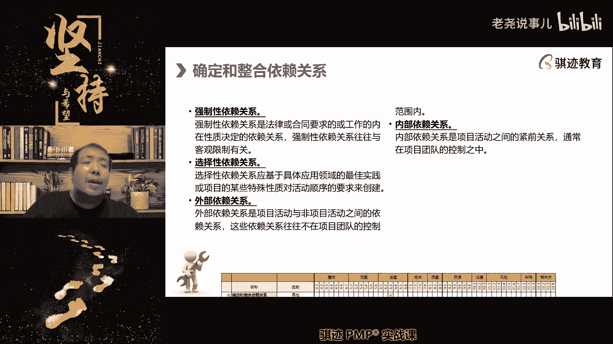

洗澡可不可以可以啊，但是这个属于非正常行为啊。

所以先脱衣服再洗澡。

它是形成了一个什么强制依赖关系啊，可以是吧。

哈哈啊，你们洗的是正经的岛吗，哈哈哈啊。

所以脱衣服和洗澡这两个活动是强制依赖，必须得先脱衣服再洗澡对吧。

当然有些同学说啊，我和老师我很懒对吧。

我省得打两遍肥皂了，我在我的衣服上打完肥皂，然后呢搓完之后我的衣服洗干净对吧。

身上也洗干净了，对不对啊，开个玩笑啊，明白吗啊这个当然这个当然是不正确的对吧啊，所以这是强制依赖关系。

那么还有一种呢叫做选择性依赖关系啊。

那么在这个这个是取决于不同项目了。

强制依赖关系一般符合自然逻辑，自然逻辑，比如说啊我问你们。

你们所在的地区的习惯是先喝汤还是先吃饭。

哎对中国大部分地区是先喝汤啊。

先吃饭再喝汤。

还有一些地区呢是不喝汤的，那么南方梅岭以南的广东，广西那边很多人呢是先喝汤在吃饭。

所以喝汤和吃饭这件事情呢。

根据不同的环境。

他们的依赖关系是不绝对的，但是要遵从某些局部的自然规律。

这就叫做选择性依赖关系。

汤饭一起吃啊，汤饭一起吃。

这个就是什么S同时吃对啊，我也喜欢你骑士啊。

但是同学啊尾号096的同学忠告你啊，啊汤饭一起吃容易发胖容易发胖啊。

好那么依赖关系当中呢，有一些是项目活动和非项目活动之间依赖。

我们称之为外部依赖关系，就是我们项目内做的一些活动。

依赖于不是在我们项目内发生的一些事情，这叫外部依赖关系。

项目内活动之间的依赖关系，大家称之为内部依赖关系啊。

OK这都能明白对吧啊，所以依赖关系明白了吧。

项目中两个活动在一起做，在前一先一后去做。

或者同时做这两个活动未必有依赖关系。

我们之前那些举个例子对吧，排队做核酸，排在我前面那个和排在我后面。

那个和我们可能是毫，很有可能是跟我毫无关系的对吧，只不过我们恰巧就排在一起，所以他做不做核算和我没有关系。

只要我能做核酸就行对吧，所以这个这个并不构成依赖关系。

只是恰巧两个活动放在一起执行而已啊，但是有一些呢就会有依赖关系。

那么他一定不能违反对吧，比如说必须先脱衣服再洗澡啊。

这都能明白了啊，为什么要讲个真那个呢。

因为项目中存在诸多的依赖关系。

那么你在安排项目进度的时候，项目经理为了使得进度安排达到最优。

某些方面平衡会调整活动之间的前后顺序。

但是我们很有可能是没有办法打破，或者是不愿意打破依赖关系的。

因为选择性依赖关系是可以打破的，但是我们不愿意打破。

可能代价比较高，而强制依赖关系是没有办法打破的，因为打破就没办法做这个事情对吧。

那么比如说还有一些是绝对的强制依赖关系。

比如说盖房子一定是什么，先打地基再盖楼，楼盖上去了还能打地基吧。

不行啊，所以这是必然是先打地基再败了。

否则的活动，必然有一个或者一个以上是无法进行的对吧。

所以这个时候作为一个项目经理来说，你要考虑到这些事情的依赖关系，顺序等等这些东西来推进项目，来安排项目啊。

所以依赖关系呢，我们也会在项目的排列顺序当中呢，你记好这个事情有什么依赖的关系。

必须排在什么事情前面，这个事情必须和什么事情一起做才行。

对吧好，好。

那么接下去我们会讲一个之前讲过的概念，叫做提前量和滞后量，来先考的。

先拷问一下大家，我们之前讲过的提前量和滞后量，如果要体现我们是移动。

在时间轴上移动哪个活动或者哪种活动，我们是在时间轴上进行往左移动或者往右移动，来体现体现量之后的是哪种活动，对我们始终只会在时间轴上移动，紧后活动，也就是所谓的被指向的那个活动是能移动的。

指向别人的活动相对是不移动的，明白了吧啊，这个注意这个呢其实并不一定能考得上，或者是根本就考不上，也有可能的，但是这个大家对于大家今后工作实践当中。

去看图，比如说人家画了个图，上面写着啊FS加三，那么你要明白啊，这个进度网络同行加三。

就意味着这个活动结束之后，要隔三天才能开展紧后活动啊，明白啊，那么接下去这个问题让大家思考，那么我们的项目中，为什么要增加提前量和滞后量，有没有同学能回答我，项目中为什么要增加提前量和滞后量。

请问你们有没有有没有同学能回答，我为什么需要提前量之后的项目变更，不是没有变更，也会将提前量项目进度，那么侍卫的制定项目进度增加提现制，那么目的增加提前量或者滞后量，它的目的是什么。

顺序变化预防突发时间啊，有那么一点意思啊，有那么一点意思，对控制风险这个表达就非常好啊，啊我们的大学同学啊，这个控制风险就非常好啊，那么请记住提前量和滞后量，主要的作用就是用于化解。

防范或者减轻活动与活动之间的风险啊，就比如说你们在项目中，经常会遇到这样一种场景，就是说我们会有前道工序和后道工序，对不对，那么前道工序做完了要交，马上就要交接给后道工序，那么这个过程当中就会有个交接。

对不对，那么有一些项目活动当中，如果你前道工序做完了，然后再开展后道工序，那么就会什么导致交接不充分，衔接不充分，那么衔接不充分就会导致什么效率下降，或者提的提高风险，所以在前道工序快做完。

然后快要到后道工序的时候呢，我们会让后道工序先进场，以在一段时间内与前道工序进行并行啊，那么这个时候呢，提前进场就是一个什么提前量啊，就像这里提前进场就是一个提前量啊，那么我们可以用什么理解知道吧。

大家有一个有一个东西知道吧，就是说呃百米接力大家知道吧，就是有一个冷知识啊，留点余量，那么这是另外一个就不留点余量，是另外一个形，同学们啊，两回事情之后，所有可能进去之后，为什么要讲这个东西。

因为这是我们项目进度安排当中常见的一种啊，一种形式方法啊，常见的就是百米接力，有个冷知识，知道吧，就是男子100米4×100米接力的世界纪录，比博尔特跑100米还要快，哎你们这个知道吧。

你们去看一下，比博尔特跑100米乘跑四个亿世界纪录，100米加起来还要快，这是为什么，并不是四个博尔特一起在牙买加，一下子就出现了克隆的三个博尔特，一共四个博尔特在400米接着跑，这个培训费是多少。

什么叫这个培训费是多少，诶，有诶教务，教务不要在我们在那个直播间里说这个啊，同学们啊，那么我们说这个事情啊，那么为什么知道啊，是因为接力跑当中呃，一一名一名短跑运动员在跑到接力区的时候。

在交接棒之前，另外一名跑步运动员已经提前启动跑了。

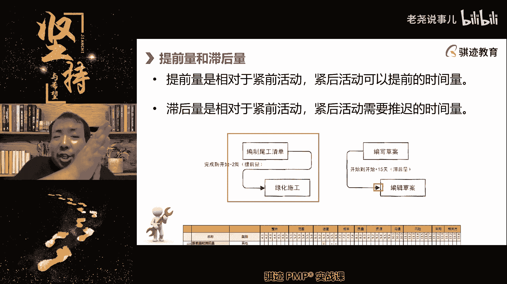

他们在高速跑步当中去交接棒，这样就可以节省交接带来的时间浪费。

那么就这个棒子，除了第一名跑步运动员起步的时候，有一个起步时间之外，其他都属于接近于最高跑速状态，这个这个棒子他中间是没有起跑，而博尔特跑四个100米，他要起四个步，速度会慢，明白吗。

所以提前量的作用就是是是什么，活动与活动之间竟有一个充分并行交接，使得活动和活动衔接更加顺畅啊，更加顺畅，这就是所谓的提前量啊，所以提前量的意义是什么，在项目需要有活动间交接的时候。

使交接并变得平滑顺畅，有同学说可以再点点作用吗，我在讲呀，不要急，提前量的主要作用是什么。

使得活动活动间的交接变得顺畅啊。

从而降低降低或者减少或者消除风险啊，那么滞后量呢则是什么，则是另外一个意思，支付量是往往发生了什么，活动和活动之间如果同时做，或者是一起做，或者是紧接着先后做，可能存在什么啊，相互干扰和影响啊。

这个是我经常经常喜欢说的一个例子，比如说我在马路上，比如说大家马上就水泥马路，在铺完水泥马路之后，比如说有人脚印子踩上去，这个水泥马路以后就永久上面有脚印子，所以水泥马路铺好了之后呢。

有一段时间是不能踏入的，要等它干透了才能够再踩上去，对不对，所以水泥马路铺路到我们人可以通行，这个中间一定会存在一个滞后量，两个活动之间会拉开一个时间差来体现什么啊，这个缓冲的过程啊，活动间的缓冲过程。

这是为了减少活动与活动之间干扰，如果两个活动之间存在干扰和相互影响的话，那么我们要增加滞后量来避免这个事情的发生，明白了吧，所以提前量和滞后量，是用于化解活动与活动之间的风险。

一种风险是交接不充分的风险，一种风险是什么啊，相互有干扰的风险，前者使用提前量，后者使用之后量啊，明白这个意思就可以了，这也是我们安排项目当中，经常会考虑到的事情啊，有同学注意啊。

有同学说我我们使用提前量可以去用，可以相当于体现了什么，我们的进度压缩对啊，在有一些在很多的场景当中，我们将本来是应该首尾相衔接的活动，增加了提前量，可以压缩进度，是的啊。

但是这是仅仅是提前量的另外一个作用，提前量的主要作用仍然是什么，使得活动充分，使得活动能够有并行器，能够充分交接啊，因为有些活动有些活动并不需要交接，但是呢它叠在一起做就呃叠在一起重叠的做呢。

可以节省进度对吧，本来这么长，现在变得这么长对吧啊，那么我之前看大家的评论呢，看到一个字啊，看到一个有人说是为了增加缓冲，增加冗余，注意这个就不对了，提前量和滞后量并不解决缓冲冗余这个事情。

它的主要目的是缓冲和冗余是有的，它是体现在活动的估算时间，我们后面会讲啊，如果一个活动风险比较高或者难度比较大，那么本来他三天完成的，我们可能会给他五天的完成时间，这个活动的冗余缓冲啊，诸如此类子。

它这个时间是体现在活动内的，而不是体现在活动间，因为风险是在活动内部的，而不是在活动与活动之间，明白了吧，化解活动与活动之间的风险，我们用提前量滞后量化解活动内的风险，我们后面会马上就讲到。

是使用活动应急储备时间啊，OK这就都明白了吧，这是项目管理当中，你安排活动进度顺序当中，一个非常重要的一个概念啊，项目经理安排的专业不专业，很很大程度就看你的这个运用各种进度，相互间衔接工作啊。

然后那么并行啊，如何去同时进行或者分开这些东西的运用。

好继续往下讲啊，然后呢我们就形成一个叫项目进度网络图。

注意进度网络图当中初始状态，我们前面已经讲了，没有持续时间，没有时间轴，但是有活动与活动之间的相对关系啊。

它们之间是什么关系，有没有提前量，滞后量。

这个是有的啊，只有相对位置和相对关系啊。

好这是我们讲的呃，排列活动持续时间，那么接啊。

排列活动顺序，接下来就是估算活动持续时间了，那么接下来这个估算活动持续时间是估算单。

先从单个活动持续时间开始估算。

然后再局部估算，最终到整体估算。

那么但是我们这里首先要讲一些课本上不讲，但是我觉得你们来学我的PP课，一定要知道的事情，你们在估算活动是持续时间的时候，会有哪些思想方法。

你怎么估一个活动需要几天，你们会用哪些朴素。

你们可以随意发挥啊，告诉我你们会用哪些朴素的思想，来估这个事情到底要做几天。

做完，类比到啊。

我昨天吃饭用了30分钟，所以我今天吃饭了，估计也用30分钟，可以怎么还有呢，根据经验对这个就叫专家判断，OK啊，很多同学已经把我们的第一个和第二个，这个这个我们讲啊，根据经验就是专家判断啊。

哎你们看到这个PPT上是说这个这个怎么样，怎么样怎么样对吧。

哎你们根据自己工作实践当中来哦，接下去我们是想大家一起分享类比三点拆分诶。

这个其实都可以啊。

啊那么来了啊，我们不要讲，那么这个时候就不要讲理论，首先这一点估算活动持续时间是一个项目。

就是他其实遵循了一个项目管理的。

一个基本朴素的实践思想啊，就是什么从理想到现实啊。

我推荐大家在估算活动时间的时候呢。

用理想到现实的方法估算啊，这是一种思想方法。

什么叫理想到现实，你先按照最乐观的去估啊。

我们一般都因为什么最悲观，是考虑各种情况就考虑不清楚了。

说不清楚了，我们按照最乐观，没有任何负面影响啊。

按照一个一切都顺顺利利，没有意外。

没有惊喜的这种情况下，我们预计这个事情会集体晚晚。

这种情况下是不是把很多的干扰因素都排除了，他所付出的时间一般是乐观时间。

那么我问你们乐观时间是长还是短嗯。

对所以项目管理其实是一个什么啊。

尤其在进度管理上，它是一个从呃理想到现实的过程。

当然和我们那个相反啊，我们有句话，以前有句话叫理想很丰满。

现实很骨感，对吧啊，那么进度管理当中呢是啊理想很骨感短。

现实很丰满，你要满足各种现实条件情况向现实妥协。

为什么要向现实妥协。

是为了能够这个进度落地，那么我们会把这个里边呢增加冗余，增加额外的考量啊，然后呢是将情况评估的恶劣一点，乃至更恶劣一点来看，在考虑这么多恶劣情况下，这个进度能不能执行下去。

考虑的越多，不利因素和情况仍然能够执行的进度。

它的落地可仍然可以执行的这个进度计划，那么它的可行性就越大啊，那么记住一点一个劲啊，这是我给你们分享的几个思想啊，思想方法啊，一个进度计划安排得再完美，如果它不能落地，它就是一个最糟糕的进度计划。

进度计划的最最最最重要的一点就是他能落地，他能按照这个计划做得出来，做不出来都是空谈，都是扯淡，都是放屁，一个进度计划必须等没等落地。

那么怎么能让这个进度就落地呢。

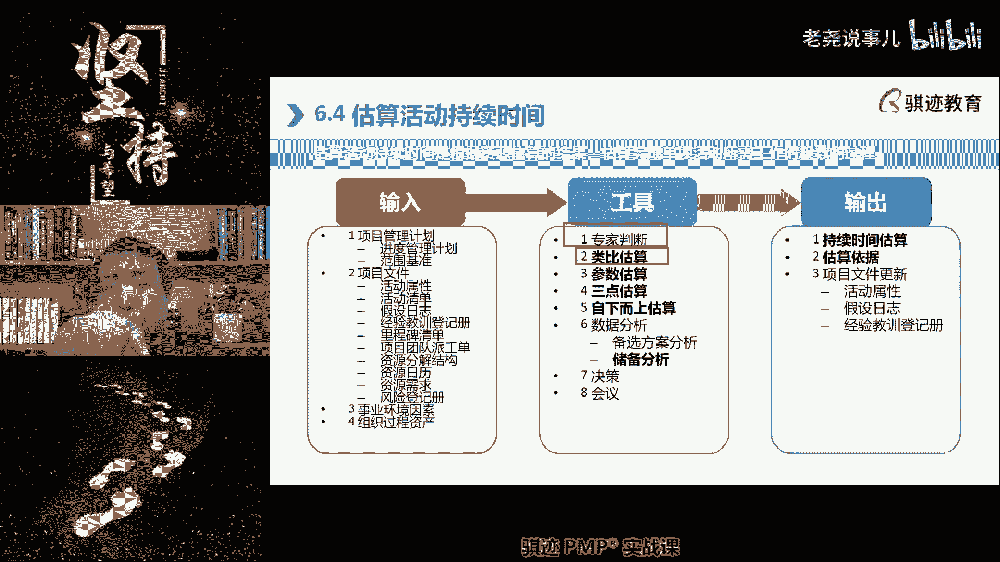

首先你要根据最乐观的情况排除一个安排，排除估算出单个活动需要多少时间，然后再估算整个项目需要多少时间，然后再从理想走到现实啊，这个情况其实我们太乐观了，做不到啊，其实实际上更多的可能是用这种情况判断啊。

这个条件呢可能我们拿不到啊，那边可能什么资源可能会不足啊，这里呢可能什么会发生一些意外情况啊。

那么充分考虑到了各种不利因素。

然后将进度计划贴近实践实际。

最终制定出来的才是一个虽然不见得完美。

但是最能够落地的，能最能落地，并且能成功的进度计划，我认为才是完美的进度计划，这一点大家能不能理解。

啊。

能这个这个思想方法能理解吧。

这是一种很朴素，但是很有效的项目管理的思想方法。

OK啊好。

这个是分享给大家，以后大家在估计时间的时候呢，你就要按照什么最理想的去估，然后呢慢慢慢慢向最糟糕的靠拢。

那么对你来说，你还要安排进度，要考虑什么事情啊，最糟糕会发生什么。

这个时候呢，你要按照最糟糕的情况再去过一个时间啊，再去忽悠谁，然后并不是说我们在实际最终做安排的时候。

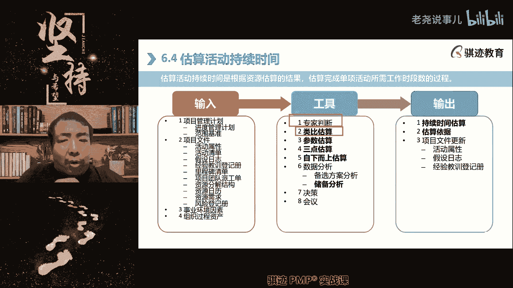

并不是按照最乐观去安排，也不是按照最糟糕的去安排，但是我们会知道你的极限情况在哪里，这个有点像三点估算，但是这个思想范围，但是我们一般都是按照考虑到最糟糕的情况，能够应变的情况下去。

按照贴近实践能落地的合理的安排制作。

OK明白了，但是这个话有点有点意外啊，就是说这是一个更加朴素，但是更加抽象，就是什么，你的安排应该是合理的。

既不悲观也不乐观，但是你的安排的背后，充分考虑了各各种不利因素。

就是说哪怕所有的不利因素运气不好。

你是个衰到极致的人，却发生了你的项目的安排。

仍然能够在这种情况下进行应变。

或者能够进行有调整的空间余地，能够承受这种不利情况的发生的。

那么这就是一个好的安排项项目结构安排啊。

敏捷会使用这样的方法吗，敏捷不会使用这样的方法。

但是注意敏捷的使用，为什么PM3很强，敏捷敏捷，但其实大家知道你们的实践工作当中，我相信大部分的人是不用敏捷的。

所以我跟你们讲的很多思想方法是吧，是你们实践工作当中会仍然会用到预测型当中，我们的传统的规划思路是这样的。

花费有限制吗，比如一天十块钱也可以啊，如果你对自己要求比较高。

OK啊，那么这个呢就其他的一些脑洞的事情，可能就我们就不提了啊，好那么明白了，这是一个我给你们。

我告诉你们的，我估算活动持续时间的一个朴素方法啊。

从理想到实践，我们后面再讲制定项目进度计划当中，还有一个另外一个会教大家一套方法啊。

我们安排哦，先先给大家剧透一下，我们安排进度方法会有主流。

会有两种方法，一种叫做顺推，一种叫做倒推啊，这两种呢大家都会。

但是如何去顺推和倒推，那么这个中间呢有些东西呢，呃可能有些东西不熟悉，但是告诉大家认知方法，教育好好等我们讲到再说好，我们继续讲啊，思想方法都学会了对吧，然后在呃我们的估算活动持续时间当中呢。

会有如下这些估算方法。

那么这些估算方法，我们之前是不是在规划绩效与都学过了，用什么东西学过来啊，那么这里快速讲类比估算呢，用于早期快速的从高层次的或者是粗略的活动，不算啊，不能作为基准，但是呢一般呢呃可以用于项目启动阶段。

商业论证阶段可以使用啊，成本低，时效短，但是准确性差对吧，参数估算呢则是一切都中等。

依赖数据准确性和模型有效性对吧，那么最精确的呢是什么。

是我们的啊，最精确的是我们的自下上估算啊，这种估算的最慢，但是呢也在最准确，所以有些同学说我们估算是用什么方法分解，对分解的本质就是要企图自下而上啊，就像一个积木把它拆开来的目的是干什么。

然后再把它拼起来对吧，积木如果你不准备把它拆开拼起来，你为什么把它拆开来，你把它拆开，就是为了后面再自己把它拼起来对吧，那么只有把它拆开了，你才知道每一部分是怎么组成的，对不对啊，这就是分解啊。

那么再讲的朴素一点，项目管理的实质是什么，自上而下的什么规划和自下而上的估算，规划是从顶到底而反馈这种估算的结果的，是底到底，某种意义上，这和人类的社会结构也是一样，人类的社会结构。

整个社会当中的绝大部分的事情的决定者，是社会最顶层的领导者，他们决定，然后一层一层一层分解到社会的最普通阶，层的每一个人啊，但是社会的贡献和最终结果的体现，是靠社会中的每一个人的努力付出。

自下而上的汇总，在得到整个社会的层面，或者说体现在领导人的管理，绩效的结果上的东西，所以项目管理某种意义上，其实也和人类社会的行为是一致的啊，讲的有点拔高对吧，OK能理解吧，能理解我们去过啊。

那么我们再稍微讲一讲三点估算啊，那么稍微讲讲，我们之前其实也讲过三点估算的考试。

计算题不考，但是有可能换个概念题，记住一点，三点估算只用于局部估算。

不用于全局估算，它只用于单个活动或者局部活动的估算。

三点估算的方法是什么呢，我们的数据量有限。

我们的数据只能找到最大值是什么，最小值是什么。

但是这个数据所体现的规律，背后的规律不知道，那么我们只能通过三点估算来猜测一个大致的。

可能的概率分布和范围，那么我们就会使用三点估算啊，三点估算的公式大家反正也知道对吧，最小值加最大值加四倍，最有可能值除以六，那么这个值就成为期望值，那么期望值的是什么，就是比这个值大的，在实践当中。

比这个值大的概率是50%，比这个值小的概率也是50%，就是这个意思好吧，具体计算我就不说了啊，有同学有同学有兴趣的话，可以可以算一算，可以看看啊。

就具体就不说了，那么在估算活动时间当中呢，我们就会运用到一种东西叫做储备分析，储备分析呢它分两种啊，在进度上啊，我们讲讲进度上除以六吗，最大最小加四倍，最有可能除以六，对了除以六，最大最小加四倍。

最有可能除以六啊，那么我们回来啊，除非位移指的是什么，就是我们前面讲的，虽然它可能发生，但是它也可能不发生，那么但是我们为了防备它要发生，我们会预留额外的时间来做准备，那么我问你们个问题。

为什么进度当中，我们所使用的储备在活动层面啊，我先把概念讲出来，你思考一下，为什么在活动层面是使用时间作为进度的，应急储备，就是我们的应急时间，但是在活动以上，比如工作包层面，我们的进度的工作包层面呢。

却使用金钱曼尼作为我们的什么储备，为什么到了活动这一集，用时间，活动上面用金钱，有门同学能告诉我，啊我们先不讲储备这个概念啊，啊这一部分其实为什么要讲这个事情呢，因为是要给大家拱呃。

全面的认知进度是怎么安排，因为进度安排对我们的我们今后的管理，项目工作是非常重要，活动是过程工作包决定成果，工作就是工时，就是金钱，时间比时间重要，没有讲到点子啊，我没有看到开展活动价就相当于钱啊。

我没有看到答到点子上的啊，我还没有看到答到点子上了啊，你们想想为什么活动层面，如果我要比如说我举个例子啊，这个活三天干完的，但是呢我觉得这个活有这些风险，很有风险，技术难度比较大，容易失败。

那么我安排这个活呢，五天到晚，那么他就有两天的时间应急储备啊，那么为什么在这个活动层面用时间来记，而不是说这个活有很大的风险，所以呢我额外留了2000块钱来应对这个风险，万一这个事情做失败。

为什么为什么用前者而不用后者，为什么，啊今天这节课，其实很多的都是企图给你们讲管理的，实践的道理，想不临时，那那那这个就我跟你们讲啊，这就是你们对象了，因为到了活动。

我来给你解释吧啊你们解释的都没有达到点赞，因为到了活动这个层面，时间是可以解决问题的，钱解决不了问题，很多的事情在活动这个层面，无论你花多少钱都是解决不了的，只有花时间去解决，我们举个例子啊。

大家那个那个那个那个我一直很喜欢的，那个例子啊，大家那个黑金看过周朝先那个看过吧，你坐什么车来，我坐马自达啊，我们都是坐奔驰A奔驰rose rose rose less，你做笨马自达，难怪你会塞车对吧。

那么来了周朝鲜，这个是故意的，因为只要是塞车，无论你坐的是奔驰还是劳斯莱斯，还是马自达还是五菱宏光，都会塞车，你无论车多贵，他都不能帮你在路上节省时间啊，或者说能够准时到达。

能够准时到达的只有什么提前出门，所以在黑金里，周朝先说的这句话，他是故意要羞辱那个持刀的人啊，那么他不说哎你为什么不提早出来，这是显得很low，他写的说啊，他故意说啊，你坐马自达，我们坐奔驰。

劳斯莱斯的，所以你穷鬼，所以你不会来对吧，其实他是故意歪曲这个概念，真正的原因是什么，在活动的层面，如果出现了意外，只能用时间来弥补，比如说这件事情我做错了或者做失败了，那么无论你花多少钱。

这件事情也是失败的，但他失败了之后，你无论花多少钱，他还是失败，只有一种办法能够弥补什么，我再做一次，但再做一次需要时间卡了吗，哎你怎么又来一个通行卡，没有卡呀，网络非常稳定啊，老师的网络非常稳定。

明白了吗，所以我们要在很多高风险的活动当中，给予那些活动再做一次，或者再做一会儿的机会，来化解这个活动不能按时完成的风险，那么我们会给他时间，还是会给他金钱，当然是给他时间，明白了吧啊这就是活动层面。

为什么使用时间应急储备，而活动层面以上呢，比如说工作包那个层面的很多，就是活动集合的那个层面，那么这个时候呢钱能够起到作用就更大了啊，这个时候我们才会用金钱计，但是实际上我们知道时间就是金钱。

时间可以折算成钱，对吧啊，好明白了吧，为什么活动应急储备是时间，而项目应急储备是用金钱来计的，就是这个道理，那么我们回来，我们在估算单个活动持续时间的时候，我们前面也讲了它的风险阻，对于储备这块来说。

它主要是应对风险，那么它的风险来自于活动内部的执行过程，存在不确定性啊，存在不确定性，那么这种不确定性如果是已知的，那么我们就会使用什么应急储备，如果是未知的呢，就会使用管理储备啊，这是我们的设定啊。

那么一般来说活动层面是没有管理储备的啊，管理储备一般和我们是没有的啊，什么我们只会使用什么应急储备，就是针对已知风险，因为活动层面，我们的风险大多数都是能识别的啊，在活动上面啊。

项目经理要针对高风险的活动，及时识别这活动内的风险，然后给予适当的应急储备啊，OK这就是我们讲在估算活动持续时间当中的，储备的起到的作用，应对活动内的过程分析，啊那么就像啊每天早上老师的女儿。

早上早上爬不起来，那么我我们总是让他什么，在早上08：10分之前啊，要吃完早饭，穿完衣服，跟他的爸爸就是鹅啊，跟我一起出门，我送她去幼儿园，但是呢，其实我知道08：15分也是可以，按时到达幼儿园的啊。

我们家走到幼儿园大概10分钟左右就行，其实08：17分18分也是可以啊，20分甚至都可以就比较赶啊，但是呢我会留有足够的储备，因为万一有什么我的女儿赖伐啊，不不不拔不起来，让我耍性子对吧。

把衣服穿的卖孩子总有，这就是针对于小朋友，我已经识别了，小朋友早上可能会迟到的各种风险来源，已经识别了，做了相应的安排，举这个例子大家能明白了吧，所以也将跟跟跟大家上课一样，大概是八点钟上课。

我每天到了上课时间啊，就上课日就周二周47。50分，我就会什么啊，准时的去上线，因为我算过啊，10分钟之内可以解决所有上课的准备时间，其实5分钟就够了，但是为了安全的能够给大家准时上课。

那么留了5分钟或者更多的储备时间啊，这就是活动我们上课的这个活动的储备的分析，好，那么最后我们会得出一个活动持续时间的估算。

注意我们对于单个活动或者一阶段的活动的。

持续时间的估算，是只估算一次还是持续的。

或者是啊间歇性的，或者是有规律的，隔一段时间重新估算一次。

是哪一种。

哎对基本上大家的意思啊是间歇性的有规律。

或者说你做持续也行啊。

对活动的持续时间进行估算，为什么随着项目的开展。

我们对于项目的了解和项目的情况，各种情况的发生。

我们会经常的重新审视项目的进度计划。

来安排出相应的项目进度。

所以项目进度计划并不是制定出就不会变的，而是要根据渐进明细情况做适当的调整，但这种调整不是以什么，因为我某个事情没有安排对啊，只延误了，所以我们调整或者某个事情呢，我们开始没有识别，不知道要做啊。

后面要增加来做这种呢，就是不良的良良好的这种调整情况是吧。

我们对于情况的认知呢出现了变化。

比如说我们本来认为什么项目进度会什么啊。

会在十天内完成啊，比如说我们在半个月内能完成，但是突然之间我们发觉了什么东西啊，在去年做规划的时候，我们认为啊，这6月下半月我们能不能把项目做完。

结果到了今年呢突然发现什么呃。

我们下下周是不是要过端午节，要休息三天，多休息了那么一天。

那么可能对项目进度有影响，那么我们去年可能并不知道怎么安排。

所以呢及时调整项目进度计划，这个也是渐进明细对的啊，所以对活动时间的定期或者持续的更新。

也是一种项目渐进明细规划的体现啊，然后估算的精度呢也是伴随着项目开展。

会越来越精确。

因为伴随项目开展，我们拿到的信息和项目的实时反馈。

会越来越准确啊，好那么我们会得出对持续时间的估算，那么一开始估算比较粗糙的时候呢。

我们可能已经波动区间啊，正-2000啊，这个事情呢十天完成最快的八天。

最慢呢12天就正两天，然后随着项目的开展呢。

这个波动区间呢会越收越小啊，越说越小。

那么活动持续时间估算，应该有最熟悉的个人和小组实施啊，专业的人做专业的事情。

然后我们如何去估算。

应该输出一个估算依据，好。

那么这是我们活动持续时间的一个估，算的一个文档，给大家看一下。

不含滞后量是什么意思啊。

啊啊有同学问其中不包含任何滞后量，对对对对啊。

这个这个问的非常好啊，注意滞后量不是活动持续时间。

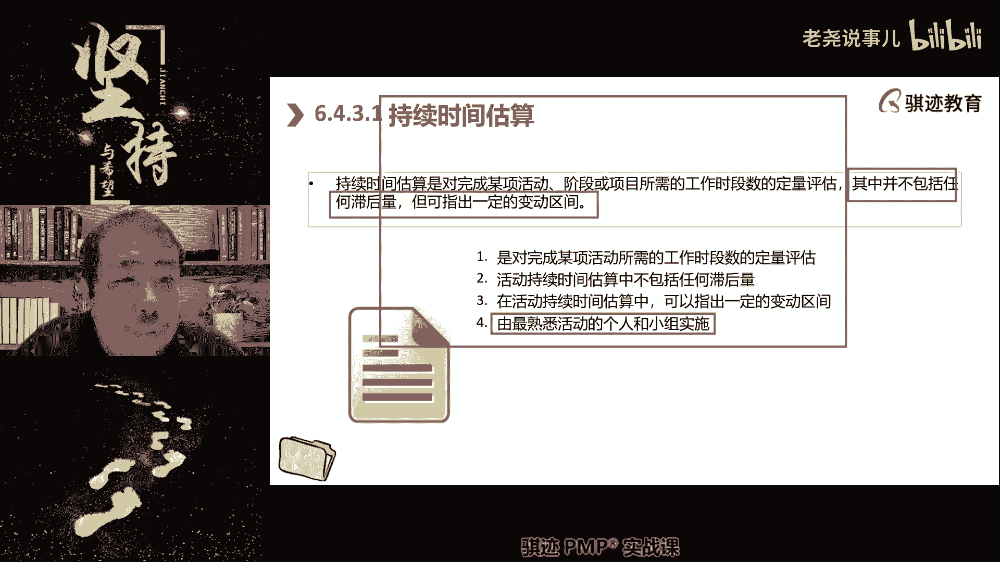

是活动与活动之间的人为设置的延迟。

它不是持续时间，明白了吧啊。

他可能在整个项目进度内呢，是算整个项目进度的一块时间了。

但是活动活动之间对于单个活动来说，我们现在讲的是估算活动持续时间。

对单个活动来说，他是不受这个影响。

不受这个影响，因为你只是活动接的嘛，我们讲过提前量和滞后量是活动间的。

对单个活动持续时间是没有影响啊。

好那么我们讲到这里来问大家一个问题啊，我们休息之前给大家这里讲的非常慢啊。

那么这个例题呢，首先啊先跟大家讲一下这个例题呢。

我们就不准备大家可以在课间休息的时候，把这个题目来画一画啊。

把这个题图画一画啊，因为计算机现在取消了，所以就不准备给大家做计算题啊。

但是我在休息前我问大家一个问题啊，我们中场休息问的问题。

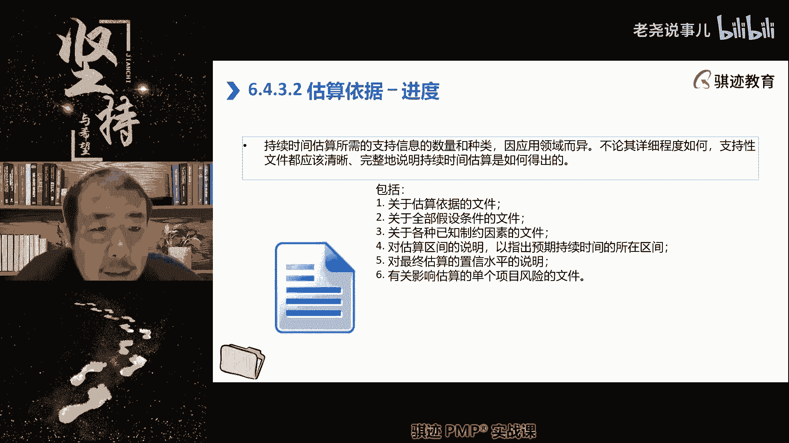

活动的持续时间的，另外除了顺序发生的时间和顺序。

对活动有重大影响之外，另外一个决定因素是什么。

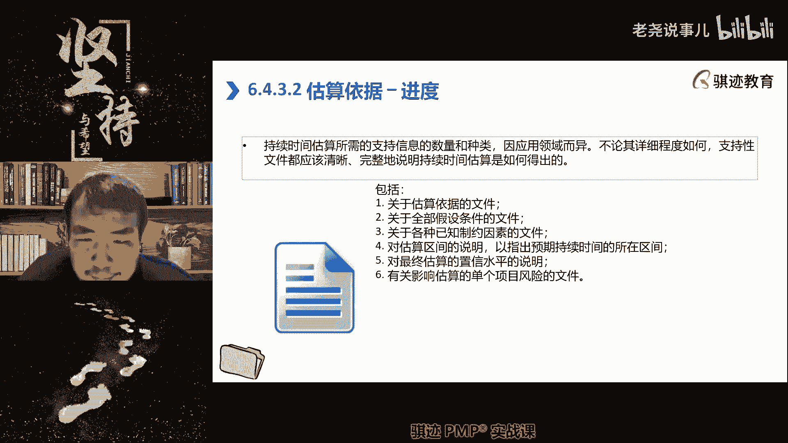

另外一个决定决定单个活动时间长短的。

决定性因素是，有没有人和同学告诉我啊，非常好，资源资源难易度，难易度已经体现在活动的那个里面，业务场景哈哈资源啊表达的专业叫资源。

你能获在活动上能够投入的资源多寡。

直接决定了这个活动能持续多少。

我们前面我妈，然后会有另外一个概念。

同学们请注意，就是资源投入的越多，不一定活动能够无限制的压缩。

每一个活动有它固有的最短极限啊。

最短极限。

那么有一个很有名的故事啊，有一个很有名的例子啊，就是说产品经理经常会有这种概念，女人怀孕生孩子需要几个月。

女人怀孕生孩子需要几个月，女人怀孕生孩子需要九个多月。

十个月，产品经理就认为我让三个人啊。

去像女人生孩子一样，然后在家上班两个月就能把孩子生下来。

这是一种错误概念，活动有它固有的最短时间是无法无限制的压缩。

它会压缩到一个最短时间节点。

不能再压缩了啊，明白吗，所以一个女人生孩子是十呃。

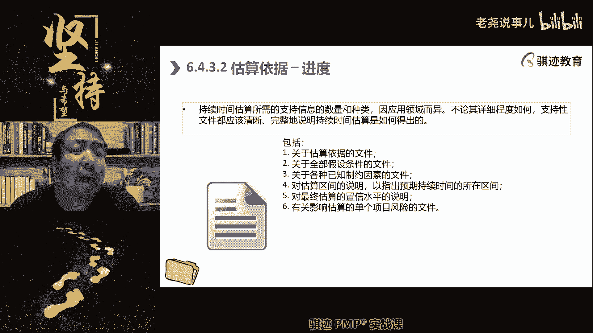

十个月，十个女人生孩子她也是十个月。

10月怀胎是无法压缩，明白吗，所以活动具有最短时间的刚性。

但是在这个最短刚性时间刚性之外。

那么来了就可以什么资源投入的越多。

你的活动进度就越短，越逼近那个最短的刚性世界。

明白了吧好，所以我想说最后一个说的一点是什么。

在估算活动持续时间的时候，你一定在这之前已经开始与他并行，或者与他稍后均匀干什么，估算活动持续哦，估算活动资源啊，而且这个库这个估算和那个估算估算资源。

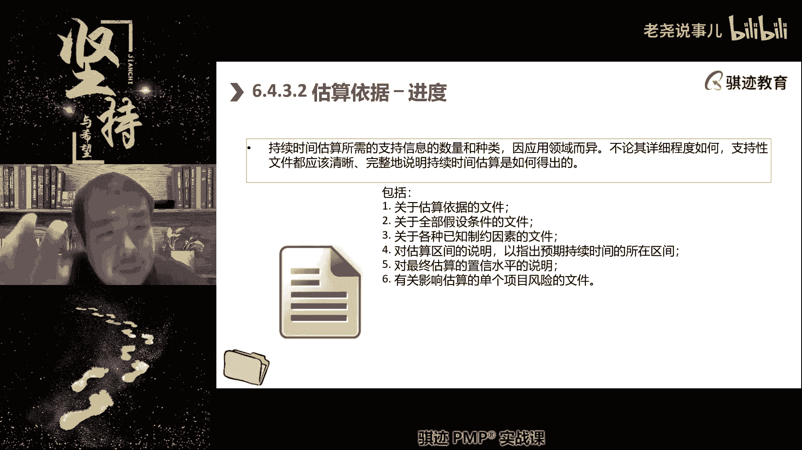

和估算持续时间是交替进行的，这是我们实践当中的一个正常方法。

什么意思啊，就是我先估算一版活动持续时间。

为了达成这个一般活动持续时间。

我根据这个持续时间呢，需要我去估算100什么资源。

然后根据再根据这个估算所需要的资源。

去获取资源，因为我说我要十个人，你就给我十个人了，我说我要十个人。

你能给我五个人好，那么肯定这个活动会变长对吧。

我们再根据拿到五个人的这个资源的投入，到这个活动。

能投入五个人的这种情况下，再估算一下这个活动需要持续时间多久啊。

然后在经过多轮的不断的协调调整。

可能这个资源比较关键，多投一点，那个活动呢比较不关键，少投一点，进行多轮的调整之后呢。

最后活动得到的什么估算时长就比较精确。

这个就是物以另外一个角度讲，为什么估算持续时间要进行多轮次。

哪里明白了吧。

好，以上这些就是以上这些就是我们休息之前的啊。

我们的啊这什么课程内容。

然后我们休息的时候呢，大家看这张表啊。

然后呢将这张表啊最好能够画出来，自己画画啊。

我们就呃因为现在考试也不考画图题嘛，也不考计算题了，所以就不强求课间休息了，大家画一画啊，能够把能够按照我们之前讲的颈前关系绘图法，将这张表格化为一个颈肩关系的网进度，网络图啊。

好我们休息让大家看到画这张图都会画了吗，啊，这个其实是我们以前啊，在篇博客第六版的老考纲当中，是要考的计算题啊，改了新考纲之后，这个计算机比率持续下降，现在已经不靠计算题啊。

好那么你可以看一下这个这个图里面，关键要看是什么啊，要看出图从哪里画对吧，我们稍微简单介绍一下啊，一没有颈前活动，一就是开始我们讲没有颈前活动，活动就是什么，就是开始对吧，所以一是开始，二跟着一对吧。

三跟着二，四跟着三，5678都跟着四对吧。

然后就形成了这样一个图对吧。

所以我们画图很简单，就可以画成这样一图，这样一个图就可以了啊。

那么来了，在没有学习后面的内容的情况下。

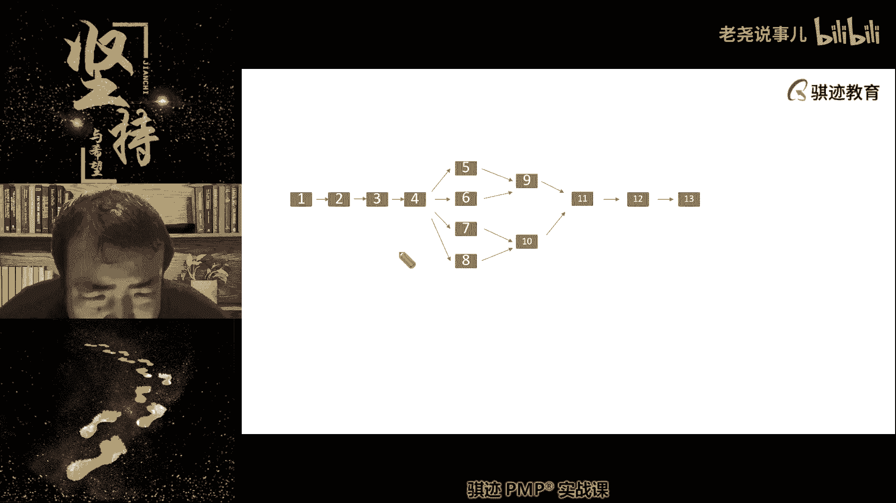

我问你们，在这个图当中，如果你要考虑风险，那么你会在哪里去放活动内的应急储备，或者是放活动间的提前之后，会在哪里去放这些东西。

关键路径你怎么知道哪里是关键路径，我们现在都不算计算东西，哪里是关键路径，啊啊很好啊啊，大家可以看出什么，在这个当中四是一个非常关键的活动，因为如果四延误了，后面同时会影响四个活动。

同时开始会产生连锁反应，对不对，所以四这个活动是所有活动当中影响最大的啊。

那么我们后面会在后面我能学到。

就是把有最多的分支或者汇聚路径的那些活动，是最为关键和影响最大的活动，它的风险也就最高。

我们应该给予重视和一定的储备。

明白了，那么有些同学说哎呀三延误一下，四也要延误对吧，那么老师，所以我认为什么1234其实是同等重要啊。

同学们注意啊，这个要你要考虑到实践场景啊，我们在很多当中呢，我们我们在很多的工作当中是这样的啊，比如说啊四这个活动是什么，是打地基啊，然后三这个活动呢是平整地面啊，那么5678呢分别是盖四幢楼，5号楼。

6号楼，7号楼，8号楼，盖四幢楼，那么你会发现什么事情啊，如果三延误了四打地基就不能开始对吧，打地基如果不能开始，我5678的工程队要不要进场，不用急着进场，可以让他们先后面外面等着。

外面就晃到使劲在喊问，但是如果轮到四开始打地基了，那么56784个四幢楼盖楼的工程队，是不是就要进场要准备了，这时候你四这个活动延误了，那么你的工程队是不能地基，我们讲它是相对于盖楼。

是一个强最强的强制性脉地基不打完，工程队不能干活，对不对，这个时候你会发现什么东西啊，你的工程队盖楼的工程队白吃你的白喝，你的住在你的工地宿舍里，却没有活干，这个损失是不是很大，是不是。

但是如果我三延误了，那么我四干不了，我5678，我我可以采取措施，我会让他们先不要急着进场对吧，所以在有最多的汇聚和分支的这种情况，汇聚和分支的这种情况下，我们会特别注意这种活动。

因为它会带来最大的影响面啊，所以明白了吧，所以对这种具有最大影响力的活动，应该特别的进行注意好。

这就是告诉大家一些时间当中的一些道理啊。

虽然有可能1234啊，虽然实践当中也是1234，肯定是在关键路径上对吧。

但是四这个活动会影响最多的，后续活动，可能带来给你带来的损失也是最大的。

好那么接下去我们就开始讲制定进度计划了啊。

那么讲到制定进度计划，我们就沿着我们休息之前讲的一个话题。

我们对于活动的持续的时间的估算是什么。

是一种滚动规划和持续更新的。

那么我们的活动的持续时间，又是和资源有非常密切不可分离的关联关系啊，所以我们的进度计划其实是什么，另外一个层次就是我们或者我们讲，与前面前面层次相衔接的。

是一个从理想走向现实的过程。

所以进度计划在预测型当中制定的时候，它是一个从理想逐步走向现实，它往往是一个什么，从最短的整个项目进度时间，慢慢慢慢慢慢塞进冗余储备。

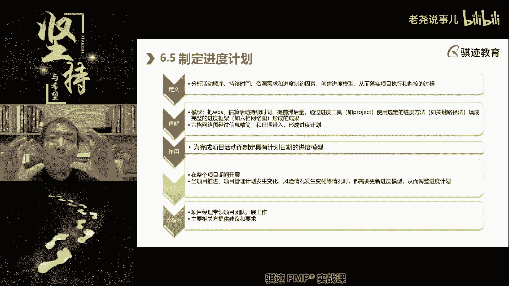

额外时间等待。

然后慢慢慢慢一般都是什么变长的那个过程。

那么这样一个过程，就是我们最常用的一种故障方法。

卡有有有同学遇到还卡吗，不卡呀，我的网络很稳定啊，不卡啊。

OK这就是一个啊，我们回来啊，这就是一个什么，我们在顺推法当中常用的一个方法，就是先估算一个最理想的状态，然后慢慢慢慢慢慢慢慢，将它加入到各种现实因素进去。

