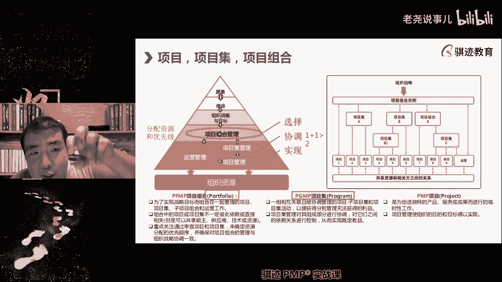
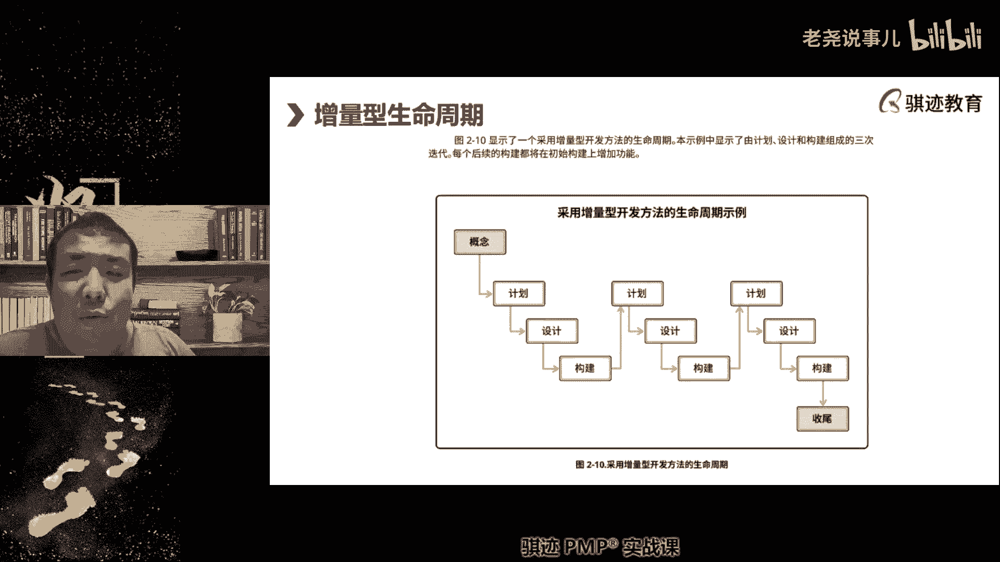
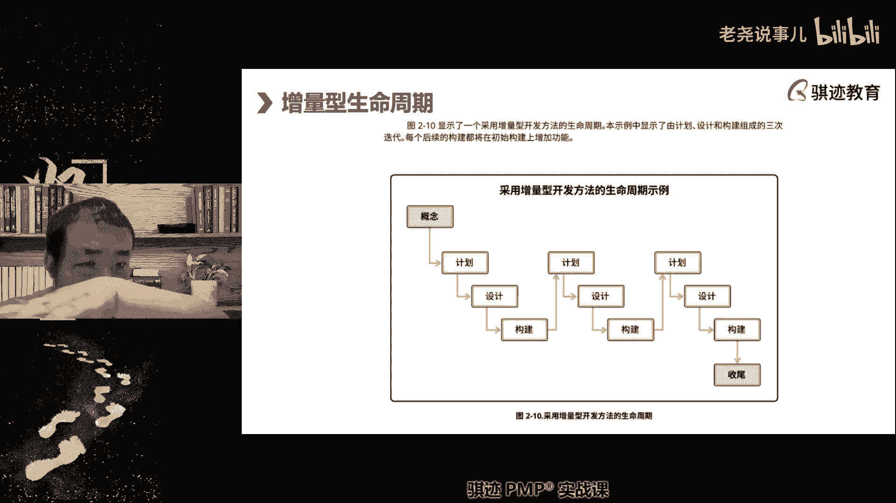
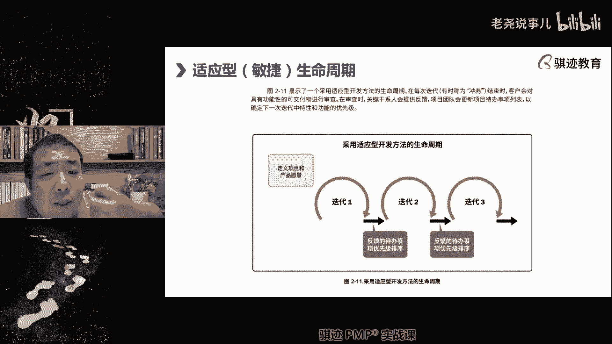
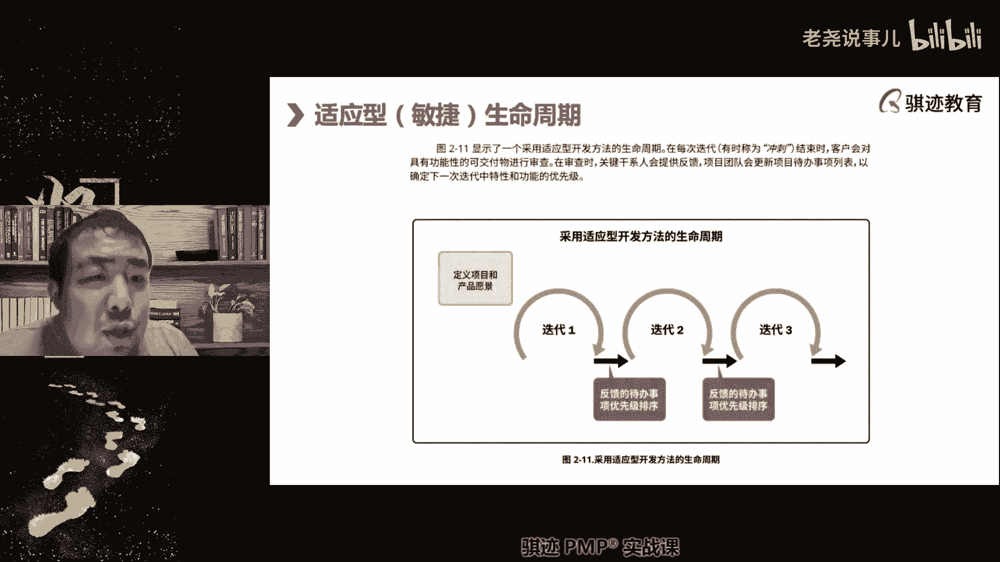

# （收费视频完整版分享）PMBOK第七版课程PMP考试报名认证培训精讲-零基础项目管理第七版教程最新版直播课回放视频免费课程资源-骐迹教育谢阳主讲 - P3：1-3项目管理引论 - 老尧说事儿 - BV1ek4y1s71N

他不可以时时刻刻去做这个事情，项目经理在项目中，时时刻刻做的最多的事情就是沟通。

但是沟通确实不是一个单列项，是为什么，因为沟通重要，但是沟通不能由一个人来承担，项目中的沟通，在项目管理到一定一定复杂程度之后，它是通过规划和团队共同执行来实现，项目经理只有一张嘴，两只手对吧。

你一天能沟通多少人，如果项目很大，人员很多靠你一个人是沟通不过来的，你一定要有良好的沟通规划和。

然后依靠团队去做内外沟通和内部沟通，所以沟通不仅仅是一个个人的能力。

而是你的团队能力，也是你对于这个团队设计的结果啊，所以它不仅仅是一个人的，我们讲的人才三角是三角，是你自己个人的，当然我们期望啊PMI现在的设定，我们期望如果你在团队中，不仅仅你具有这个433减能力。

而且如果大家都有的话，那就更好啊，对包含在工作方式呢。

其实包含在这里啊，沟通其实很多时候包含良好的沟通，其实包含在我们的影响力技能里面啊，沟通看到吗，保安在这里啊。

好这是项目经理到底应该具备什么样的能力。

什么样扮演什么样的定位角色，这个描述有效的沟通如何学习呢，嗯我们会在沟通的相关的绩效域里面会讲啊，我们会讲如何进行有效的沟通啊，那么我们也会在敏捷课程里，其实敏捷当中的沟通其实我挺提倡的啊。

现在越来越多的项目管理中沟通其实有提升，敏捷沟通啊，等到我们敏捷这节课会讲啊，会讲到不要急项目管理课的，你不要看PP的课，可能嗯你们也就听听，就这么这么这么这么几个，20几个晚上，其实内容挺丰富的啊。

给你讲的东西挺丰富的好，那么我们节奏慢一点啊，接下来我们讲项目中的各个生命周期啊，这个是要记住的，项目中我们会有各种生命周期，最大的周期叫做产品生命周期，什么叫产品生命周期就是一样产品从设计创造。

交付使用到淘汰消亡的整个过程，叫生命周期过程，这是项目中最长的一个生命周期，而且注意啊，而且注意的是什么，那产品的生命周期就是下面这个看到吧，而且什么。

往往一个较大的产品，是通过诸多项目来完成它的生命周期的。

所以项目的生命周期一般都短于产品生命周期，所以比产品生命周期短一层次的是什么，小一个层次的是项目生命周期，一个项目或者多个项目，通过项目的努力来完成一个产品的生命周期，比如说那项目一啊。

是产品的引论阶段啊，引评论阶段，那么这个项目很有可能是什么项目啊，那么这里自由发一下项目一，很有可能是什么项目，或者什么类型项目，不一定要很具体啊，在这个产品的生命周期当中，项目一可能是什么项目。

测试下，一我尾号123，为什么是做测试啊，调研项目实验性堆，这些都是对的，就是前期论证探索测试验证之类的，都是很有可能是项目一定要做的事情，它是整个产品，一般这是个非常复杂大型产品的第一阶段，对吧啊。

那么第二阶段项目二和项目三就可能是什么，我们的开发项目开发交付，我们通过项目和项目三将整个产品搭建起来，并交付给客户，那么项目四项目五，项目六呢，成熟阶段什么产品已经开发完毕了。

我们对产品进行持续的更新优化，铁蛋啊，概念啊，看老板更重视哪一块吧，这个倒不是这种，这是自然规律啊，自然规律，那么等到项目期呢，则是这个项目淘汰这个产品淘汰，可能我们从项目期开始又是另外一个轮回啊。

啊那么这就像我前两天发朋友圈一样，萨尔那加的无尽轮回的起点，我们把一个旧产品淘汰了，往往要用一个新产品去取代它的项目期，可能就是这个这个产品的消亡，淘汰阶段，我们逐渐逐渐会去淘汰掉这个产品。

不再向市场提供啊，互联网太常见了，对的是的是的啊，但是有些东西项目既不是那么好做的，就比如说微软现在早就停止了，windows7的那个叫什么支持对吧，但是win7还有很多人用，比如像像我查老师。

我我我的台式机还是装了windows7，win10永远活在我的虚拟机里，因为我觉得win10是win10不受我控制，win10这个微软后台的控制太厉害了，我不愿意让我养王者，他永远活在我的心里。

我就有问题对吧，所以windows要淘汰win11不是又出来了。

win10可能要也要淘汰了对吧，也要淘汰了。

也有可能停止支持了，但是这个淘汰和停止支持，转换的过程没有那么好做。

真的没有那么好做的啊，对于有些产品来说，只是讲一讲啊，好那么我刚才举的例子正好就回答了，有位同学问老师淘汰阶段应该怎么做，就是另起一个产品，然后引诱用户从老产品跳到新产品去。

那么这一页，接下去我们继续讲项目的各种各样的设定啊，这一页设定，那么就说明了项目的层级关系啊，项目当中的层级关系啊，那么在这个层级关系当中啊，那么但是这个这一部分呢，现在PMI的设定呢考的比较少了啊。

但是人家要知道，项目之上为什么要有项目集和项目组合啊，第一点一个组织当有一定规模之后，他所进行的项目往往有多个，如果多个项目都需要什么有关联。

都需要进行放在一起进行协调管理，它就会形成一个层级，叫做项目集，用于协调一系列有关联的项目，比如说啊，比如说比如汽车研发当中经常就有汽车研发，现代的汽车研发都是什么，先研发平台，然后基于平台去开发汽车。

所以平台开发是一个项目，平台之后呢，呃呃生产各种不同的车，是各个独立的项目，但是车要生产的成功，要研发的成功，离不开平台的研发，知道吧，所以有些公司把平台玩到了极致啊，那么你们知道吗。

像什么啊啊地球当年地球最速SUV，兰博基尼的沃瑞斯和奥迪的Q7和，和大众的途锐啊，都是一个平台，他是先研，因为兰博基尼的奥迪，大众都是大众集团，下面他在研发的时候呢，先研发这个汽车平台。

然后再用这个平台呢去给不同定位的车型呢，去运用使用来开发汽车，可以降低成本，提高效率，所以你会看到什么呃，像途锐啊，乌斯啊，Q7啊，他们组成了一个啊什么平台，我忘记了哦，大众什么平台的项目集。

他们都是在这个平台家具研发的，只不过各自侧重点不一样啊，然后每一个车型的研发呢都是一个项目啊，那么他们共享一个平台，这就实现了什么，1+1大于，大家不用各自独立去研发车辆的平台啊，车辆平台设计。

从而什么提高效能，降低成本，也降低风险，啊这就是我们什么啊啊这就哦我刚才看了一下，因为我们5月份考试的同学还在问问题啊，看一下手机，这就是我们当时讲的项目级的意义进行协调，还有一些情况其实都是什么。

项目与项目之间要抢夺争夺关键资源，比如说我们这个项目和那个项目，都需要用这个专家，但是专家一天只能干多少小时，80个小时或一个周只能干五天对吧，专家拒绝加班对吧，人家专家人家牛叉，那么怎么办呢。

我们我们成立一个项目集，然后规定啊135啊，这个这个专家给你项目A用二四，你专家到那个项目上去干活协调啊，稀缺资源也是可以的，这项目集，那么项目组合它的管理层级又不一样，那么大家看项目组合。

这个层级之上是什么东西啊，是组织的战略目标，组织的战略目标，所以项目组合，是为了实现组织的战略目标而来的，那么大家看啊，大家看下面啊，看我框框框出来的项目组合就是PFMP啊。

我们前面讲的项目机就是PGMP，所以当你们学完PMP之后呢，你们可以有兴趣可以学那个PGP啊，PGMP现在开始有中英文双语的，以前老师学的时候是全英文的啊，对英文不好的同学来说。

这个这个这个这个这个难度太大，那么平PMP就是项目组合，那它的英文呢你看到portfolio，portfolio这个这个什么意思啊，股票投资组合也叫portfolio，所以类比一下是不是就明白了。

项目组合管理的意义是什么，从组织那里啊，为了实现组织战略目的，拿一笔钱，拿一笔资源不一定是钱，也可能资源拿来之后呢，像投资股票一样啊，这个项目投一点，那个项目集就是这样注意啊，项目组合比项目极大。

所以它下面可以管几个项目几啊，这里投一点，那里投一点，但是我投下去的这些钱和资源呢，要能实现组织给我的战略目标，比如组织给我们这个项目组的战略目标，是提升市场占有率10%啊，这是我们的战略目标。

那我们拿这个钱呢啊，投入研发，投入市场运营销啊，投入公关对吧，那么研发市场营销和公关相互之间有关系吧，可能完全没有关系，新产品研发和公关完全没有关系，对不对啊，但是他们都是为了能够在未来提升我们产品。

市场占有率10%，而努力的这个战略目标进行，所以项目组合下的项目及项目，甚至包括运营可能相互之间是毫无关联的，但是他们放在组合在一起进行投资，投入资源，可以实现组织的一个高层次的战略目标。

这就是组合的意义啊。

有同学问，那么数据中台和ERP是项目结项目组合，那要取决于你组织的目的，如果你把它放在一起是为了什么，能够很好的两者整合在一起，那么它是项目集，如果你把它放在一起的目的是为了干什么。

是为了实现组织战略目标，比如说我们要进行数字化转型，这样一个战略目标，那么它是组合，取决于你的目的是什么啊。

好好那么继续往下讲啊，好，那么在篇博客的第七版当中提到了一个概念，叫做产品管理啊，那么产品管理不同于，不同于啊啊不同于项目管理。

产品管理包括了什么啊，包括了一产品生命周期当中的项目集管理啊，这是偏包括第七版新理论，它包含了项目集管理。

包括了相关的项目子项目及项目级的活动，所以产品管理可以看作是针对一个娜娜。

我们把它拖起来了，产品管理跟上的第一是针对某一个产品。

它的整个生命周期内的诸多项目，乃至这些项目所组成的。

占项目集和项目组合进行管理的一种形式，它是针对产品的，所以呃就像呃就像那个那个什么呃，比如说我们像字节跳动对吧，字节跳动下面有什么有抖音对吧，有那个叫什么飞书对吧，这些都是什么，针对不同项目产啊。

这不就是不同产品管理的那么抖音，飞速下面自然有很多的，下面自然有很多大量项目项目进行开展，它是以产品作为管理分类的一种管理形式对吧。

啊就像大众点评下面有什么啊。

优美团对吧，大众点评美团是一家对吧，那么大众点评是一个产品的产品管理的一条线。

那么美团是管理条线，它们相互之间既有融合。

但也有自己独立性对吧。

问产品经理的还是项目经理的这个东西问的，就他们的职责不同。

职责不同啊，今日头条皮皮虾抖音。

其实阿里系比较明显啊，这个我们举个例子啊，不深究，举个例子明白吗啊，第二个产品生命周期当中的项目管理啊。

那么产品管理政策上面就是这种方法，将产品的功能开发的程度作为进行监督啊，那么它会项目管理在产品生命中的项目管理呢，它会更细，更贴近产品的某一一大块功能来进行，做一个功能或者一个阶段的功能和实现和交付。

来进行管理啊，好那么有时候呢会反过来啊，这个概念有点搞啊，大家其实要记住，就是有时候呢我们产品比较小，注意啊，这个时候呢产品是小产品，但是呢业务部呢是大业务部，或者是我们的管理范畴是大管理范畴。

小产品大范畴，这个时候就反过来是项目集内的产品管理啊，项目集内的产品管理，就比如说很多做电商的就是这种形式，比如说我们电商会有什么海外电商部，它其实就是个项目集，海外电商部当中可能什么。

我们梦向海外卖几百种产品。

我们将这几百种上千种产品呢，分为多种不同产品类型对吧，有美容美美容美发产品对吧，有零食类的产品，有生活便利类的产品等等等等，那么它的每个产品都很小，不不足以对它进行什么，是以产品为主进行管理。

但是呢他们的产品啊又具有一些共性，都是这种电商类的产品，所以我们用电商集合的这种方式对它进入，反过来了，产品概念反而小了，而项目及概念反而大了，来进行管理了，这时候呢是小产品大管理。

前面一种呢是大产品啊，相对较小管理啊，相对啊小小管理其实不小啊。

我们通过这样一系列管理呢，能够能够通过应用产品管理能力，因为因为比如说都是比如说零食类的辣条，比如说是火腿肠对吧，比如说是QQ糖，这些都是零食，他们的管理方式是类似的，产品管理的线路等等都是类似的。

我们通过可以对它进行集中式管理，来提高管理效率对吧，天可能一组人都是管零食的，他们管理特性差不多对吧好，这个就叫做什么项目集内产品管理啊，这个特点虽然产品管理是一个单呃单独的领域，有其知识管理。

但是它的项目几个项目管理呢，是这两个的关键整合点啊，所以偏博科的第七版，提到了项目管理和产品管理的相互关系吧，产品管理有产品管理的产品经理，项目管理有项目经理，他们两者是合作关系，没有谁大谁小。

现在给你解了明白了吧啊，虽然可能有些是大产品，有些是小产品，但是它们两者的定位不同，没有最大值求产品经理更多的面向市场，要对市场负责，要背市场KPI指标，项目经理更多的是面对实现，要对实现负责。

一般不背KPI指标啊，不背啊，市场的那种K开始，好这就是产品管理和项目管理的一些交集啊。

好继续好，那么来了我们前面讲了，继续往下讲啊，项目的生命周期当中，项目自身我们也有它的生命周期对吧，它的生命周期当中呢，点这里我们罗列了典型的生命周期类型啊，这个大家可能都看得懂啊。

尤其是搞it的LIT领域当中的生命周期，特别的标准啊，相对特别标准，所以他一般会有以下这些注意，不是所有的阶段，所有的项目都一定都有，这些是可选件，你可以从这些抽象概念的阶段当中抽取。

这些阶段的设计来组成你自己的项目啊。

这种相当于标准件，那你抽取来自己自定义啊，有同学说产品经理对价值负责。

项目经理对交付负责，那这也不对啊，现在拼不过地，基本不是跟你说了吗，也要对价值负责，只不过产品经理面对市场。

要对市场负责，项目经理面对结果要对结果负责，这是这个区别，就是项目经理主要是做什么，这个东西，客户喜欢和满意的东西，我要尽可能生产出来啊，然后去交付给市场，产品经理是什么。

我这个东西为什么为什么卖不过同行，我要对这个位置负责，就这个意思啊，给大家举个小例子啊，那么所以可行性研究设计构件，测试部署和收尾是我们典型的几个阶段，项目我们后面会讲到项目会分为若干个阶段。

但是项目不一定都有这些阶段，不同的项目可能就会有不一定都有啊，长尾号3366同学啊。

今天大家回答问题还是比较热烈，非常好啊，产品和结果有什么不好。

产品是有形的，好比一只苹果，我经常说法是一只苹果，你这只苹果吃就可以给你带来愉悦，对不对，什么是结果呢，你来听超老师的课，来我们琪琪上上课学习，然后考过了PP，拿到了这张证书，凭借着这张证书，你跳槽。

然后升职加薪，迎娶白富美，走上人巅峰，这是一个结果，明白了吧，哈哈当然当然PB正数没那么大魅力啊，但是这是你往人生更高处走的一块坚实的台阶，是可以做到的，但是没有那么高高度啊，举个例子。

考试通过是一个结果啊，我们来学P最终目的是很重要的一个，最终目的是为了考试能通过，这是一个结果对吧，我们不是为了那张纸啊，PNP证书那张纸一张纸不值那么多钱啊，一张纸大家自己家里打印，打印很便宜的。

几块钱就搞定了啊，那么这是生命周期各个阶段，分为可行性设计构建测试部署收尾，我们稍微解释一下啊，因为今天时间也不早了，但是该讲的细点讲的细点啊，第一节课总是会讲的慢一点啊。

可行性就是看这个事情能不能做项目，很多时候的第一阶段往往都是什么，先看看这个事情能不能做，不能做，我们先尝试一下，做不了，我们后面就不用花力去真正去做对吧，尝试第二个，如果我们能做。

接下来我们会对它进行设计设计规划，看看怎么样一步一步把东西做出来，设计又分为高层次设计和细节设计，还分为属性设计，参数加这个后面再学设计，我们叫做三重设计啊，我们经典的质量管理论当中有三重设计啊。

概要设计，细节设计和参数设计啊啊这就不说了啊，啊越讲越扩展，第三个是构建啊，我们真正的去把这个东西实现出来，要有品质保证啊，做出来不能粗制滥造，有品质保证，把这东西做出来，做出来之后呢，我们要验证。

那么我们要进行测试啊，看到测试很多T就知道啊，跑跑测试用例，测试驱动开发等很多IT同学就可以了，注意测试不是所有的东西，所有的项目都有测试，不是所有的项目都有测试啊，或者说有些项目测试是没有意义的。

或者有项目根本不做事，也是有不是一定必须的啊，但是大部分的项目呢，或多或少都会有相应的测试，比如验收也是一种测试对吧，最后还有部署，就是将这个东西投入使用啊，那么部署这件事情呢，以前PNP呢也提到。

但是没有特别强调，其实这个在价值交付当中，部署是非常重要的一个环节，什么意思啊，举个例子啊，我给客户生产了一台机器。

这台机器通过验收意味着这台机器有价值吗，过程是根据不同的行业项目形态来了啊，开始结尾是肯定可行性，也不一定有的，有些项目就不做，或者没办法做可行性研究上来再说，也有的啊，一样机器通过了验收。

它就是有价值的啦，不是为什么，因为一台机器他对客户真正有叫什么，我把这些机器安装到客户的生产现场，能看任务，客户能用，我们为客户生产这些机器，去生产客户想要的产品，它才是有价值的对吧。

如果我们是个工业项目，我们给客户生产了一台流水线上的机器。

这台机器只有装在流水线上，并能正确的工作，产生客户想要的结果的时候。

他才是有意义的，所以部署是最终实现价值交付的一个，非常关键的阶段，但是不是所有的项目都需要部署的啊，也一样啊，因为有些项目是不需要部署的啊，就好比你考p mp需要部署，不需要，只要你考试通过。

自动就拿到证书，结果就出来了，不需要部署，没有部署这个概念对吧，好，最后收尾呢就是总结经验教训，然后是结束项目啊，就收收尾啊，结结束结束收尾呢，一般几乎所有的项目都需要啊，或多说都需要。

那么这是不额项目的通用的概念的，这些阶段可以根据本项目特点进行组合，也可以重复，比如说设计可以多个阶段都在做设计，我们从最初粗略设计到详细，就可以做多个阶段对吧，构建也可以多阶段构建啊，一阶段构建什么。

二阶段构件都是可以，所以可以组合，可以跳过，可以省略，根据你的项目需要，自己像搭积木一样去搭起来就行好吧，这个能理解吧。

那么我们以接下去啊，接下去我们以预测行为例啊，我们以预测行为例，跳的有点卡啊，我们也有一段没有，我们以预测行为例子啊，来讲述一下呢，在预测型，这是一个预测型的项目的例子啊。

但是是通用的项目例子项目总归会有的吧，前期准备阶段啊，我们会有前期准备阶段，然后呢一直到我们的可行性研究和立项完成，前期准备完成完成，然后进入项目的什么章程，制定项目的章程，制定项目章程制定完成之后呢。

项目高层次设定都设定完了，那么启动阶段就结束了啊，然后进入准备阶段，准备阶段就是对项目做各种各样的规划，这是以前天猫第六版，对项目生命周期的标准描述啊，现在已经被我们前面的那几个自由组合。

给取代了啊，但是这个也跟大家还是要提一下啊，是的，然后项目的各种计划做完了。

接下去干什么，进入执行工作啊，我们会进入构建啊，测试构建和测试其实都是执行啊，然后为监控项目的过程，最终收尾结束，项目收尾之后的东西呢，可能会移交给运营去进行持续生产啊。

这就是一个典型的预测型的项目生命周期啊，那么它呈现出来的特征呢，就是我们接下去讲的三大类项目生命周期的，第一类叫做瀑布型的预测性啊。

这是进入到我们今天上课的尾声了。

但是啊越来越重要了啊，所以大家还是要集中注意，第一节课会讲的稍微多一点点啊。

第一种生命周期类型是我们讲的三大类预测。

敏捷和混合当中第一类预测预测生命周期类型，我给他一个中国的成语啊。

古语啊来描述它的特征，叫做啊，大家很多同学都已经听，很多同学都叫谋定而后动。

叫做谋定而后动，就是先把所有可能做完的计划给他做完了。

然后一步一步往前走，不回头把事情做完。

这种项目的生命周期类型就叫做预测性。

他是先预见未来需要做什么，然后用最优化的方式把东西都安排好，一步一步错。

有同学问开始和结束必须有过程。

是不可以没有过程，可以有可以没有，但是总得有开始结束对吧，过程决于自己啊，要爽由自己对那个广告词是吧，那么预测型啊，我们回来啊，预测型的特征，某地而活动，他追求的是什么最高效，就不要误解啊，确实是这样。

他追求的是最高效率，因为所有的事情都计划好了去做是最有效率的，但是有个前提，你们知道预测型它的最大前提是什么，要想预测型有效的工作，他一定要有一个最大的前提，什么检。

怎么剪辑，知道吗，明确资源充足。

资源充足不是前提啊，不是说用预测机制一定自认同目标。

明确创新可行性不好，不环境变化不剧烈。

变化较少，环境稳定。

需求明确对就是这个意思啊，环境需求。

环境明确带来需求明确的预测性，最大的挑战和敌人是什么，剧烈变化的环境和需求，因为你每次因为我都否定了你，每次一改，我所有的计划都得全都来过。

会严重降低我的效率，有类似项目经验啊，人脑洞开的不错，但是不对啊，所以预测性适合什么项目啊，环境变化不剧烈，需求稳定明确并且稳定需求，如果很明确，但一天晚上变化也不行，明确并且稳定，环境稳定，需求稳定。

不改变或者改变的很少，这种适合预测性，它其实效率其实很高的，而且预测型为什么受人欢迎啊，一预测型的这个行为方式就是人类的行为方式，我们每个人做事情都是不是有脑子的人啊，或者是思维比较稳重的人。

都是不是先思考好怎么做，然后再去做，是不是是不是我们成熟的人，成熟稳重的人，大部分行为都是这么做的对吧，属于特权，所以比较符合人的行为习惯，但是缺点就是不适应变化啊，那么预测型呢。

长期占据了人类生活当中的项目形态，主要因为从古至今人类社会剧烈变化，大部分都是变化时都都不太剧烈啊，只在最近这100年变化特别剧烈，在以前的时候呢，我们都可以慢悠悠的做完谋定而后动这些事情。

但是现在的社会进步越来越快，变化越来越快，所以没办很多场景当中没办法再用预测性，所以才有了之后的这些类型，之后的这些类型都是在最近这100年内，还有啊，古人是有很朴素的迭代增量敏捷这种思想。

但是呢啊不成体系，因为古代没有这个环境啊，一直到近代100年才有这个事情好。

那么继续往下站。

好那么接下来就有迭代型和增量型，什么叫迭代型啊，就是每一次迭代就产生一次新的产品，每一次迭代产生一次新的产品，通过老产品给新产品提供经验教训，提供啊新的需求来实现不断的演进。

这个时候迭代已经体现出了一定的什么，体现出一定的适应性，二，所以迭代呢是属于在偏颇和第七版的新分类啊，领先分类不是这么分的，新分类当中已经它是归于混合型，它是归于混合型啊。

那么有些同学说老师迭代敏捷什么东西，我搞不清楚，能不能举个例子，哎你们还没问，我就说了，是吧，我们举个例子，什么是迭代IPHONE12345。

现在IPHONE几啊，IPHONE14对吧。

IPHONE的每一代你会看到都比上一代有所改进，但是呢又有不一样，你每一代的IPHONE是不是都得要用新最新一代IPHONE，是不是每一代都得重新购买，所以IPHONE的生就是产品这个历程。

每一代都是一代的迭代，它吸取了上一代的经验，然后根据当下人们的需求去设计下一代，所以你讲到这个人，我也一直不太喜欢TIM库克啊，不得不说TIM库克是个成功的商人，他比乔布斯啊圆润一点。

乔布斯就是很注重创新，很很固执啊，所以乔布斯能设计出很惊艳的产品，贴膜后可能最能设计是什么，适应市场需要的产品，所以你会看每一代的IPHONE，都是体现出市场最需要什么，就给你什么。

比如说当大屏幕手机兴起之后，乔布斯当年很长一段时间，都不喜欢大屏幕的手机，但是听不过很长啊，这是涨涨涨舵苹果之后，市场需要大屏幕的手机，所以苹果就把屏幕做的越来越大，就迎合市场需求。

有人问里程碑是个什么概念，我们等到讲到进度管理会的程碑啊，敏捷可以看作是预测到进度敏捷过渡吧式的啊，所以迭代，每一次的迭代结果都会产生出一个新的产品，比如说车汽车汽车经常用什么某某型汽车，2021款。

2022款，2023款，2024款对吧，他每一次都是迭代，但是每次都是新的车，迭代和敏捷的最大区别是敏捷，不论敏捷里面的内，自己内部的改进过程也是迭代，但是它不论怎么迭代，它都是同一个产品，1。0版的。

2。0版的，3。0版的，4。0版的，它都是一个产品，不会让用户重复购买，或者不会让用户重复购买，整个部分，他可能最多让用户重复购买，增加的那个部分，它都是对于一个产品的不断改进。

迭代呢则是对于一类产品的不同一类产，一系列产品当中的不同产品的不断改进，用上一代产品来经验来改进下一代产品，这叫迭代，明白吧，所以迭代有什么它的缺点啊，因为他要完整的交付一次啊，注意这个点。

他要完整的进行一次交付，所以迭代在迭代的过程当中是比较长的，它的周期是比较长的，所以迭代的缺点在于交付速度慢敏捷，为什么心情要敏捷，相对迭代的有个优势，就是交付速度快，因为现代社会人们耐心越来越差啊。

市场淘快鱼吃慢鱼啊啊走在前面的消灭，落在后面的这种场景来越多，人们越来越等不起，所以迭代这种形式呢也显得节奏略拖沓啊，在很多场景，但是它依然有很多场景当中适应，为什么迭代有什么好处啊，它不用推倒重来。

所以有些动物场景当中需要推倒重来，成本很高的呢，就不能就就不能使用敏捷啊，敏捷经常会推倒重来，但是在很多场景中推到同样成本太大，所以用迭代会更好，好那么一样作为混合型过渡的一种。

从预测向敏捷过渡的用生命点叫做增量。

增量什么意思呢，就是有一个最基础的产品。

然后你客户需要什么呢，我在这个上面呢每需要一个新功能。

新需求，我就在这里面独立开一条线，在这上面呢搭起一部分交付给你，搭起一个交付给你，这个讲的还比较抽象，我给你们举个例子啊，这是我的老听我课的同学肯定知道，所以我就选了一个例子，你家里装修硬装的时候呢。

是预测性，因为一次做完不可能反攻，反攻成本很高的对吧，布线啊啊的地面找平啊，砌墙啊，水电煤啊等等这些东西，但是等到软装的时候呢，它就是个增量过程，你们如果家里装修过，就知道软装怎么整啊。

哎我这里想想要放把椅子。

哎我明天说希望这里墙上挂一幅画，后天我觉得呢唉这里画放一个盆栽不错。

你的每一个新的需求，都会产生一个新的小的一个呃增加线程。

然后我们通过计划设计构建呢，来向我们的产品进行什么增量的交互啊，这里增加一点内力，增加减，所以家装真正的结束是什么，你家里被装修成你想要的家的样子，不再往里面添添加东西了，加装就结束，所以软装这个阶段。

其实很多人的生命当中的生活当中会持续很长，可能好几年我家里始终觉得缺点什么，这里加一点，那里加了一点，直到我觉得满意的，这就是我喜欢的家的样子。

装修在真正结束啊，增量是不是也不不增量，不迭代，增量只是往上面加，他不一定会舍，他是不会舍弃，也不会放弃的啊，这是简单的往上面去加，有同学问迭代中最重要的是不是保留上版本，不是不不不迭代。

你的你的迭代已经是开开始往敏捷那边啊，迭代不一定会保留上海篮板，可能上一个版本很失败，我们吸取的是失败经验，下一个版本开发的是完全不一样的产品，再说我们重新卖给市场啊，这是景点。

但是我这个描述更多是偏T偏软件的，这就是增量，你知道吧，就算这个技术，那么为什么要讲迭代和增量呢，因为敏捷的形式很有意思，敏捷这种形式我们就要讲了。

是最适应变化环境这种形式它在交付上。

我们敏捷后面有专题会讲啊，他在交付上是就形式就是迭代加增量。

不断的在迭代周期内去进行更新更新改良改良。

同时又不断的往里面加东西，加东西，加东西，加东西加东西来满足市场日益变化的需求，但是敏捷放弃了什么东西啊，我不再追求一次性就定义完产品，我根据市场的需求来决定接下去做什么啊。

这是敏捷的最大特征，他不再预测未来，所以它叫做适应性嘛，什么叫适应，适应就是他放弃了谋定而后动啊。

所以敏捷有个词，有另外一个成语词叫做随机应变。

我不再会预先预判会发生什么事情，我根据现场情况随机或根据当前的商业环境，商业要求，随机应变的去做出反应，做出改变来最好的适应市场，所以这其实我们今天课程讲到最后，这也其实呃呼应了前面讲了。

我们前面讲工作方式啊，我们讲的那个工作方式，商业敏锐度和影响力。

记得吧，为什么要商业敏锐度啊，就是为了最快速最准确的。

最全面的抓取市场的反馈。

来对我们的项目的交付内容进行调整。

对项目经理要求，你要知道外界要求什么。

才能让你的项目要交付。

对所以敏捷的特征是什么，快速迭代，频繁交付啊。

那么敏捷之后有你们，我们是不是觉得前面有个词叫超敏捷，那么超敏捷就更有意思了啊，就是如果我偏爱的对于聪明这个定义呢，我没有仔细查，如果以我自己理解的定义对吧，大家有个词，如果搞IT的可能知道啊。

第一名opp s devios这两年很流行吧。

这个我觉得就是更聪明一点了，他的交付是实时交付，持续交付，当然它适用的范围就更窄了啊，DEVS基本上现在就活在IT领域里啊，跑不出IT，注意敏捷这种形式脱胎于IT，但是现在应用的很多都是无形可交。

付成功的场景，比如说艺术创意啊，比如说金融产品啊，比如说是一些那个什么咨询服务啊等等，都是使用敏捷的管理方式啊，生命周期方式好，但是这个呢我们具体敏捷怎么运作，敏捷怎么运作。

我们会在敏捷专题课做做非常详细的这节课，仅仅给大家起个头，告诉大家，在这一块当中，我们有这三大种主要类型形式，好吧好。

那么今天最后这节课要讲的是一个设定，这个设定讲完我们今天课就结束啊。

这是什么设定呢，这张表格大家熟悉吧。

很多同学老同学很熟悉，这是偏播客，第九啊，不不，第六版算是嘴瓢了啊。

第六版的子过程表一共49个，那么在PMBOK第七版课程当中，这张表在不正将不在，作为我们的叙述主体，我们的叙述主体将围绕知识预进行，但是这里面的内容将被插牢插了20，拆散融合入知识欲和我们的主题课当中。

这里面所教会的知识，根据考试要求会略作删节调整，我们会做叫做裁剪啊，那个裁剪这个词汇讲，然后融入到我们课程当中，但是我们的讲述主体不再按照这个条件，但是话说回来了，大家如果想有兴趣的话。

可以去网上看一下啊，和学习一下，PMBOK第六版的这个知识体系的描述，对于大家了解项目管理也是非常有帮助的好吧，那么这就是我们今天上课的所有内容，我们今天上课将项目管理的一系列基础设定，全都讲讲了一遍。

下节课我们会讲价值交付系统。

好吧好，我们今天的课就上到这里，那么感谢大家的支持，也谢谢大家的，已经背完了，上面的不需要费下，现在已经不需要费下，现在已经不需要背下，但是熟悉知道是有好处的，有好处啊，明确跟你们说有好处。

但是不需要背下来好吧，那么我们今天的课就上到这里，感谢大家的支持，也感谢大家的小小体谅啊，今天稍微有一点小的意外波动好吧，还需要再看一遍第六版吗，不需要啊，可以跟着我的看。

但是如果你额外有进去看一下第六版，也是极好的，好我们今天课就上到这里，拜拜啦，对跟第六问题，等下他跟着我学，知识点还是有的知识点还是有巴巴拉，今天上的有点懵，对今天的课就是会有一点概念比较多。

所以一开始的同学可能会有点难以接受啊，有任何问题我们下了课，还可以在我们的微信群里已经讨论，有任何问题可以在群里艾特我，问我题目，问我概念。

