# （收费视频完整版分享）PMBOK第七版课程PMP考试报名认证培训精讲-零基础项目管理第七版教程最新版直播课回放视频免费课程资源-骐迹教育谢阳主讲 - P33：12-3敏捷专题中 - 老尧说事儿 - BV1ek4y1s71N

会根据敏捷实践指南当中会出的比较偏。

他说要给予什么可以灵活组合的家具。

可以灵活组合的家具啊等等啊，你们反正以后看了就知道啊，那么呃第三我们要有教育团队，也要有培训教练和技术支援，也就是说我们虽然说敏捷团队都要自组织，要什么，要通过自己的不断提高解决问题。

但是团队也是需要必要的技术指导啊，培训啊教练，但是不是直接帮你做事情，而是要告诉你或者提升你更好的做事情，这叫做教育，然后呢要有奖励，就是说要有对吧，正反馈自己团队做得好，奖金就要高，奖金做的高。

团队就做的更好。

正反馈自己，嗯嗯好继续往下讲啊。

这就是敏捷团队的一系列特征和运作机制。

大家都能理解了吧啊，那么接下来我们讲敏捷团队当中。

我们一般的人数呢是在5~9人，注意啊，呃这个人数不会特别规定。

但是我们pp考试当中的设定，有时候是用什么设定，因为不同pp的参考书现在不只是pm bob本，有些书当中是5~10人。

所以敏捷当中我们一般默认不超过十个人。

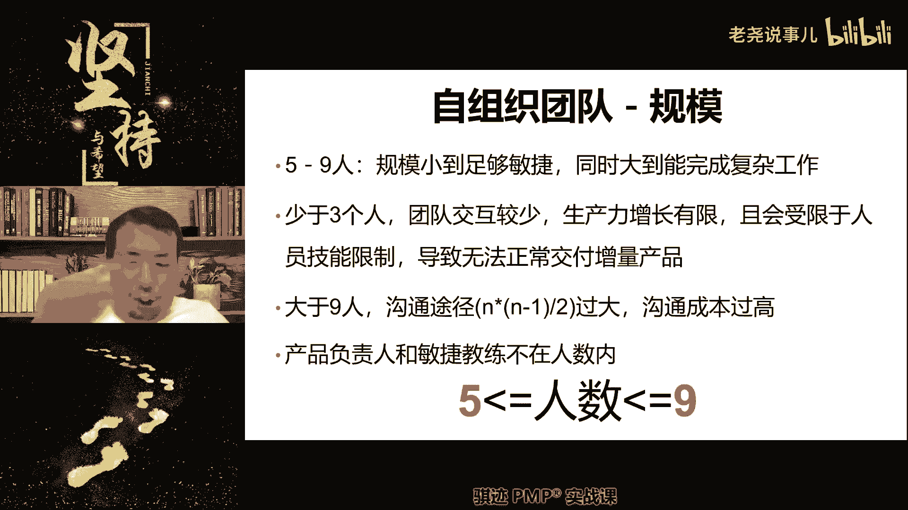

一般最佳规模是5~9人啊。

不超过十人，注意这个十个人是纯开发团队，产品负责人和敏捷教练不在其内，对吧，所以这个请记住啊。

最佳是5~9人，但是我们说一般说不超过十个人。

好那么敏捷团队当中我们什么。

我们所谓的分布式团队不仅仅指的是人，在不同的地理地点。

它还包括什么，有个英文叫diversity，多元化。

也就是说我们最好团队当中不要总都是一类人，我之前跟你们讲过。

好像是就是团队当中最好不是都是一类人，因为都是一类人，大家的思维模式过于单一，会考虑不周全。

所以我们最好是什么多样化，由老中青三代有男有女对吧。

这种情况下呢，有中有外，这样的情况下呢，大家有适当的分析。

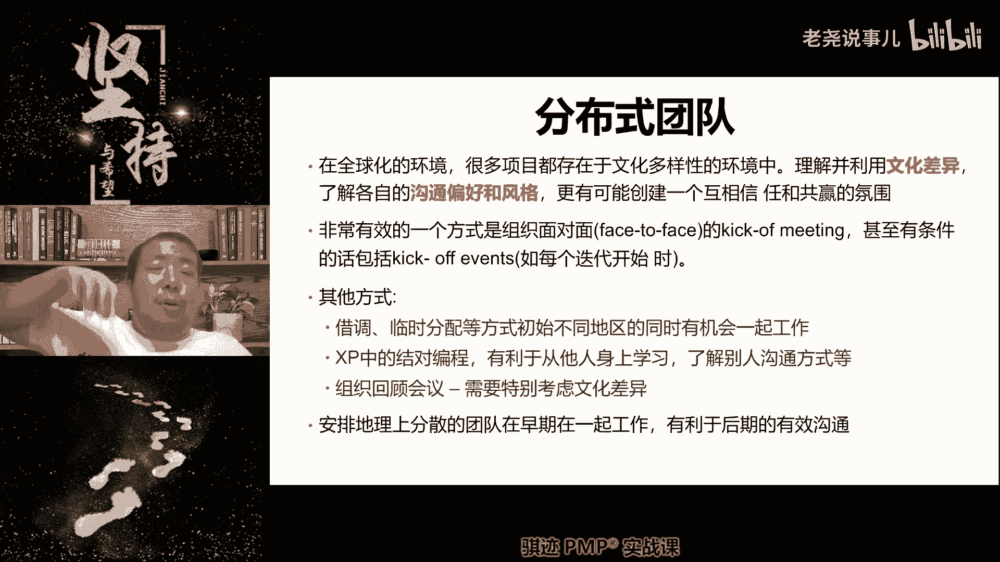

适当的不同的见解和角度，那么考虑事情呢会比较周全啊。

啊明白了吧好那么这就是分布式团队。

那么我们利用网络等等技术呢。

我们可以实现虚拟的一对一的这种这种面对面，但是有条件的话，真实物理一对一会更好啊，这是我理好。

那么这个呢也就是说所以敏捷当中，我们这里这一条条看下哎呀，苏丹拿手有点困难，稍微慢一点，所以我们安排地理上分散的团队。

在早期工作有利于后期沟通，所以如果条件允许，我们可以先团队在一开始早期行政的时候。

先集中起来一小段时间，然后再分开是比较好的，好，这是敏捷。

当团队当中的一些特征和一些经历的过程啊，这一部分呢希望大家理解这个是考试比较多的。

因为它既考了敏捷团队的形成过程，也考了啊敏捷的啊。

团队管理，团队资源管理。

好那么接下来就我们讲敏捷的适应性，所谓的敏捷的适应性就是什么，我们从敏捷转啊。

从预测转换成敏捷啊，适应性敏捷的适应性，计划的转变。

其实就是一个从预测转向敏捷的一个过程。

那么这个过程呢首先要改变的是什么，注意啊，我们讲推动敏捷改革转型。

我们之前讲过很多，它主要依靠什么东西啊，主要依靠一个高层的文化转变和驱动。

高层的文化转变和驱动啊，然后呢观念的转变自上而下的。

自上而下的高层驱动，从上而下的推动这第一个啊，所以我们呃学过课的同学都知道，因为是自上而下推动，所以敏捷，很多时候呢有一个东西叫做我跟你经常讲，就不讲武德，敏捷就要求所有人跟着高层的意志去推行啊。

如果你不能接受，那么你首先要转变啊。

不讲道理要求你接受啊，你不能你不能不讲武德的。

只有什么东西啊，你不能对客户不讲武德，因为你管不到他。

你不能对供应商不讲武德，你管不到他，除此之外主要是组织内的人啊。

我们因为敏捷需要啊，需要产生什么转变，就不讲武德，就要求你按照敏捷方式来啊。

并不是说什么我们要跟他沟通啊，开会啊，不是因为敏捷是从高层往上推行的。

所以就是这么不讲理的，就要求你按照敏捷了。

我们不讲道理，好，那么接下来一个呢是敏捷，是以价值驱动的为驱动观念，就是说传统的项目的预测性是以什么。

以计划驱动，就是完成计划，就是项目完成了。

敏捷的是以交付价值为驱动，那么我们还会在敏捷过程中讲究。

不断的降低风险，通过什么不断适应环境来降低风险。

然后应对环境的不断变化。

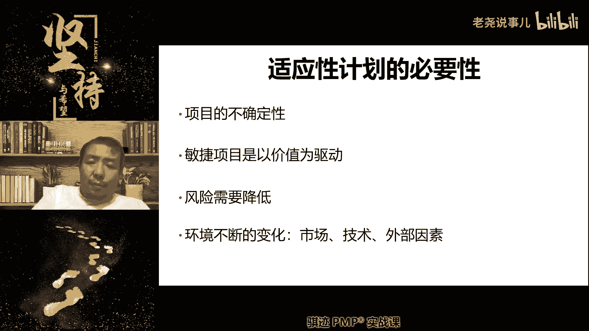

那么敏捷当中我们关注真实需求，体现渐进明细啊，我们敏捷的计划呢啊是应用于整个生命周期的。

那么接下来我们就会讲敏捷适应性，怎么让大家逐步进入到敏捷的。

这个这个这个这个这一层层来，那么敏捷也是会制定计划。

但是我就像我们前面讲，敏捷的计划是高层制定的越远。

但是越总体细节制定的越近。

越体现渐进性，所以敏捷的适应计划呢是分为四个层次。

第一个层次是全生命周期都是用到的。

叫做敏捷愿景，那么你可以看作是敏捷项目当中的项目章程。

我们之前项目章程讲过，对不对，敏捷项目的项目章程就是敏捷愿景啊。

他表达的是我们在这个敏捷项目当中。

想要做到什么样的远大前景啊。

What our visu。

英文叫愿意叫vision对吧，好那么这是全生命周期的，那么在最近一年当中呢，我们会出第二个东西叫做线路图，注意啊，线路图和发布计划啊，是我们给用户看得见的啊。

这个就是线路图，哎这图片怎么没了。

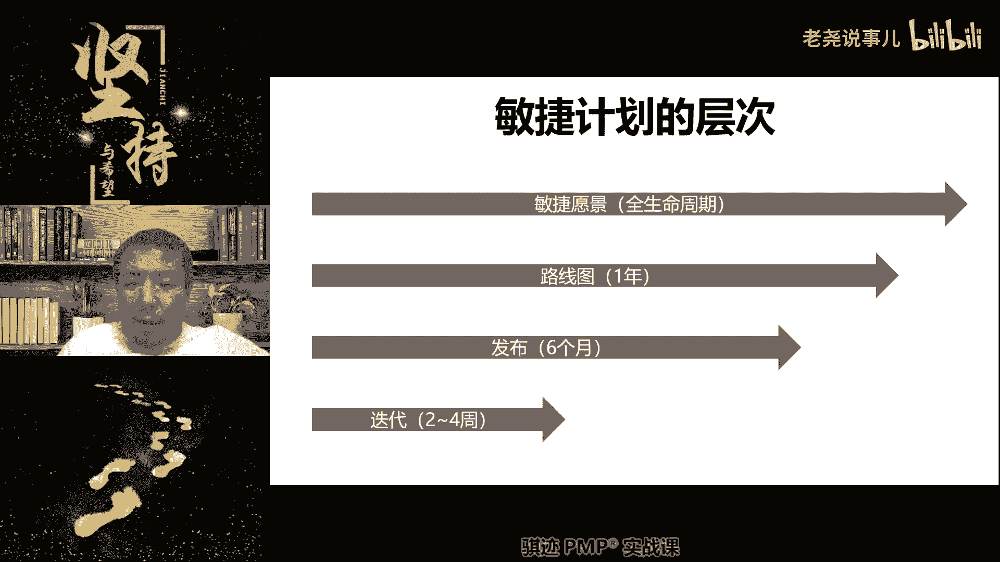

这是插队的产品线路图，搞错说线路图。

那么线路图指的是什么，我们会在这个产品呢。

我们未来的高层次设计当中，会在未来的过程当中。

呈现怎么样的演变过程和进化特征。

这叫做线路图，知道吧啊那么这个呢就属于什么啊，比如说很多那种什么企业领袖啊。

比如说什么啊啊马云啊，马化腾啊，他们说啊。

我们对于阿里的产品啊，对于腾讯的产品啊，未来会有什么样的线路图，对我们的微信会有什么样的啊。

我们要在未来的几年当中，我们的微信会怎么样怎么样就怎么样变化对吧。

然后要让微信从一个单纯的社交工具，变成一个什么全平台的基础。

就是这种东西对吧，那么我们的产品是怎么，这个线路图其实说穿了就是告诉我们的客户。

告诉我们的外部干涉。

我们的产品将通过怎么样的一步一步演化，走向未来。

给用户提供怎么样的高层次价值的过程，就称之为产品线路图，它呢往往也会有一个时间轴，但是他不会承诺一个特定的时间点，但是他会承诺，在未来的某一个时间的大致时间内，我们的产品会提供何种高层次的啊结果特性。

为我们和客户共同创造更好。

好这是产品线路图。

所以产品线路图用户是看得见的，用户是看得见的。

好稍等一下啊。

好那么接下来在产品线路上。

这是我们相当于我们给客户画了个饼对吧，我们在用最粗俗的语言。

我们给客户画了个饼，那么丙要不要实现要实现的啊，那么丙怎么实现呢。

要靠下面一层，我们针对这个丙一年之内要完成了这个饼。

我们把它切成咚咚咚咚切成几道，我们告诉你啊。

这个饼呢会有最关键的几个环节，那么每一个环节呢我们会进行一次重要的发布。

那么这个称之为发布计划啊。

发布计划，那么到了发布计划就是什么团队开始参与啊。

线路图和敏捷愿景和团队呢没啥大关系。

是产品经理。

产品负责人高层和的敏捷项目经理负责的事情，到了发布计划和迭代计划呢，项目团队就采取了啊，那么我们会根据发布计划的。

比如说敏捷运件里面还有5WEH看看这个。

那么我们在发布计划当中呢。

我们就会制定出什么东西啊，我们在未来的一般是六个月左右啊，3~9个月内我们会有几次发布。

每次发布可以实现产品线路图当中哪一个。

我们画的饼或者饼的哪一款啊。

然后将这个饼呢切小啊。

将这个饼切小啊，那么这样客户才能相信我们啊。

你画了个大饼给我，我怎么消化，你把饼切小，我好慢慢消化啊。

请上第一块饼，那你告诉我这个这么大一块饼当中的第一块饼，将在一个月以后进行第一次发布好。

我们来了，我们就会制定第一次发布啊的一个粗糙目标啊。

出装目标。

那么为了这个实验出装目标呢，最后呢我们会进行规划什么迭代计划啊。

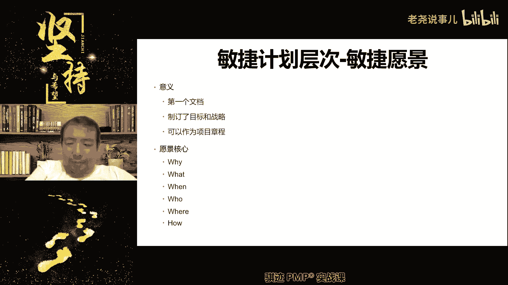

我们我们假设一个月之后呢，我们会进行一次第一次发布。

那么我们两周迭代一次迭代两次，那么我们具体概括了啊，第一次迭代我们聚集做完哪些东西。

做完之后呢，先看市场反馈，市场反馈之后呢。

我们再迭代一次，然后争取用两次时间把这个第一次发布做完，第一次发布做完之后，我们给客户画的这张饼的第一块小饼就做出来。

这就是他们相互之间的关系。

敏捷的极化层次。

好那么在敏捷定义愿景当中呢，这里稍微看一下，有个有一个概念叫产品盒子，产品盒子其实这个东西很无聊啊，顺便说一句。

敏捷相关的很多题目当中，有些很多定义很无聊。

都是搞偶的，稍微黑一点啊，搞敏捷的那帮人定义出来各种时髦的词。

其实这个东西是很普通的东西，他们定义出这种比较时髦的词。

而且你没看过，觉得啊我们很高大上。

比如像产品盒子输出的产品盒子就是什么，在一个盒子的正面和背面写上我的卖点是什么。

名称是什么，背面写上怎么功能等。

就是对一个产品进行一些高层次的定义，它非要起个名字叫产品盒子，你反正记住就行。

他考试考试要考，对吧啊，你记住这里有个东西叫产品合资。

用于进行敏捷愿景定义，小说用设计一个产品的关键属性啊，它的名称，它的标识，它的功能啊，它的主要功能啊。

详细功能和操作要求等等，没关系。

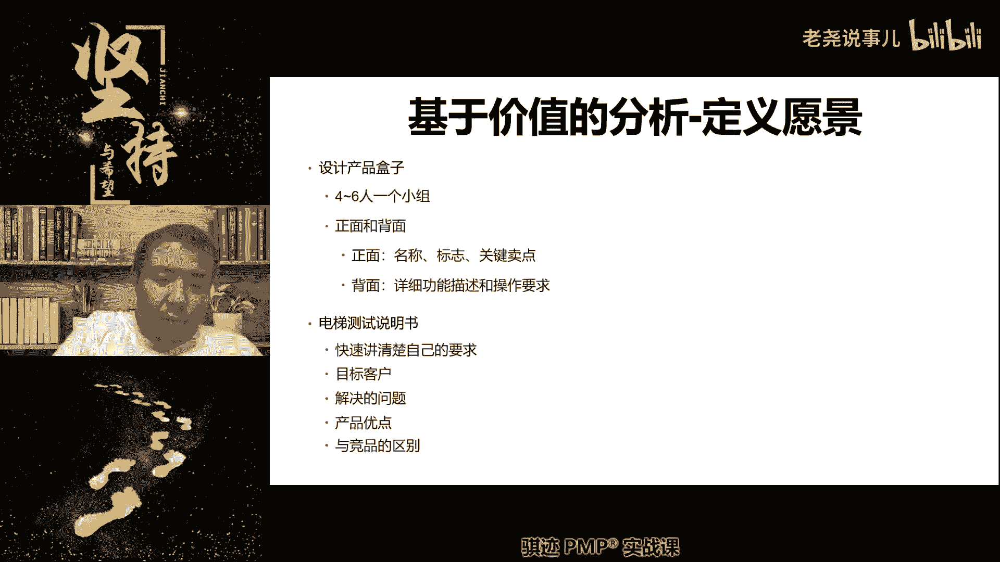

就可以了啊，我们偏僻，不要求这个东西，不要求考的考的太过详细的。

好那么这是我们的呃敏捷运营产品线路图。

发布计划和我们的呃那个是什么啊。

迭代计划相互之间关系啊，那么如果呃要那个学习的细一点的话。

我们会里面会讲一讲啊，最后再讲一讲这些东西啊，要记，那么在发布计划这个层次呢，我们会由PO来决定啊。

这个时候的PO来决定。

电梯测试说明书啊，电竞测试说我自己概念都不是很清楚，然后我去看一下，我觉得我我我不太喜欢这种，特别这种乱七八糟的概念啊，我都会去看一下，我有点忘记了，我我就多，我都有点忘记了。

电机测试说明书啥啥啥啥概念，他们老是喜欢定这种什么乱七八糟的，这种概念吧，我当时去看一下，我真的有点忘记了，就这种这种天到晚的这种乱七八糟名词，我对这个东西比较反感啊，好呃发布计划我们先讲一下啊。

发布计划由PO来决定，这个时候呢由PO来决定，团队呢参与共同进行分析，这时候团队会参与进来了啊，由PO决定，一般这个发布计划呢会与进度范围啊，我们的时的资源有关啊。

我们初步呢只需要维护一开始两三个迭代需求，资源，不做过多的估算啊，那么在我们制定到发布计划的时候，PO已经要准备好满，根据我们前面讲的什么科诺模型啊，啊莫斯科法则啊，100点法则的所整理出来了。

满足能够将工作量填满。

根据价值优先度高低，能够将工作量填满两三个迭代的需求清单。

我们这个需求应该是两三个迭代呃，至少能够两三个别在内。

做不完的那些需求要列出来，然后呢对它进行高低进行排序。

然后填入到我们的迭代计划方面，然后用最高价值的迭代的迭代的那个计划安排。

来实现我们的发布的第一次发布，第二次发布，第三次发布啊。

那么在发布计划当中呢，我们会选择迭代周期，注意啊。

迭代计划是决定迭代里面做什么。

迭代周期是在发布计划的时候制定的，那么迭代周期是什么。

我们用两周一迭代还是四周一年代，还是三周一年代还是一周一年代，这是迭代周期，是在发制定发布计划的时候制定的啊。

估算速率就是指的是我们各开发的速度啊，实现了速度如何，然后呢确定用户股市有信息，我们会进行排序，注意啊，用户故事的优先级是我们的PO为主来决定。

但是团队可以帮助参与的，那么这个呃呃这个事情呢会开一个非必须的。

会叫做代办事项系啊。

产品代办事项细化会，我们会对待细化PO为主，团队参与，帮助PO对这个用户需求进行排序，那么用户需求我们后面会讲到，他会用用户故事的方式进行描述，那么用户故事简单说什么，我是谁。

我要什么来实现什么样的商业价值，用这种三段式的语言来描述一个需求啊，然后选择故事和发布时间，那么这些东西都是发布计划定的啊，发布计划定。

啊时间注意啊，时间为什么划掉了，有同学都说为什么时间缓了，注意啊，我们发布什么东西，和我们还剩多少时间是没有关系，我们是按照固定的节奏去制定发布计划的，和我们剩多少时间是没有关系的啊。

为什么时间划掉，那么这就说什么东西啊，啊不能因为说啊我们的剩余的时间不多了，所以我们要加快发布计划，这是一种不科学的做法啊，发布计划应该是根据现有的资源，现有的工作范围和我们既有的安排进度来进行。

按部就班的发布，不是根据你还剩多少时间来发布什么东西。

这个是不对的啊。

你不能说倒过来去适应它，敏捷当中，我们说不能倒过来去适应它。

而是什么啊，而是我们的计划要适应设计可转实际情况。

好，那么我们的发布计划当中就会体现出用户故事，地图什么意思啊，就是说我们用用户故事来体现这个需求，一个一个一个一个的分解过程，我们会将用户故事分解为用户的任务。

和用户的行为等等啊，那么这个就不酗酒了啊，因为这个东西考的就比较细节一点啊。

敏捷当中比较细节一点好。

那么最后一个就是迭代计划，注意啊，迭代计划是我们下节课就周四讲。

具体实现迭代当中的一个最后一块拼图啊，我们讲了半天。

其实都讲概念，最后一块拼图迭代计划指的是什么，本次迭代的内容和迭代的方式。

那么本次迭代的内容，我们会在这冲刺规划会或者迭代规划会上决定。

然后我们用什么方式进行迭代，会有两种模式，一个是基于速度，一个是基于承诺啊。

那么什么叫基于速度啊。

基于速度是我们预测我们会用什么样的速度。

就是开发效率来完成啊，这个迭代内的任意工作啊，比如说我们就像我们说呃。

我们这个迭代周期内，预计我们以软件开发为例，我们在这个迭代周期内，我预计能写1万行代码，所有的团队中间站里能写1万行代码。

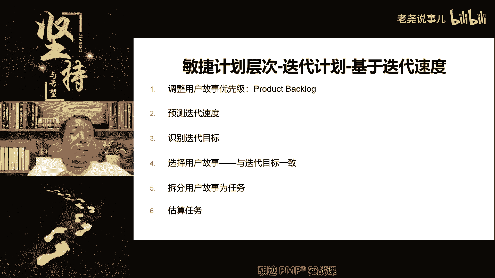

那么1万行代码我们能。

我们能作用这1万行代码做多少事情，那么我们就会选择最有价值的用户故事来匹配。

我们的迭代目标，不是我们本次迭代目标是什么，能够实现某个重要的用户功能的上限，那么我们怎么实现这些用户功能呢，要根据相应的用户过程去实现。

然后进行匹配，这种是基于速率的啊，也就是说你的开发速度越快，我们能够匹配的用户故事和能实现的目标。

就越多啊，这是基于迭代速度。

第二种啊，这种模式的前提是什么。

我们能清晰的估算出。

有同学问用户故事什么意思，我跟前面刚刚讲过啊，我们到后面也会讲，用户故事是一种标准，相对标准化的描述用户需求的一种方式。

他是说我是谁，我需要什么来实现什么商业价值，比如说我是沙老师，我需要小额通的平台来给大家授课。

然后呢满足我们的教学需求对吧。

这就是一个用户故事对吧。

啊那么我们啊明白了啊，那么我们用用户故事这样的方式呢。

来看能够实现多少用户故事，来进行什么速率的评估。

那么在这种评估下，它相对较为精准啊。

效率较高，但是它的缺点是什么，是呃用户故事的工作量和优先级。

必须能评估的比较准确对吧，觉得准确，而且他并不考虑效率提高，比如说我们在开发迭代过程当中，一开始做的比较慢，熟练了以后呢会做的快，这个是没有办法用速率来评估对吧，你改进的速度可能很难评估出来对吧。

所以我们接下来就会有另外一种叫做。

基于团队承诺啊。

那么基于团队程度呢，我们就不分析的这么客观，这么细，为什么啊，你要能做写完1万行代码，这个东西也太苛刻了啊。

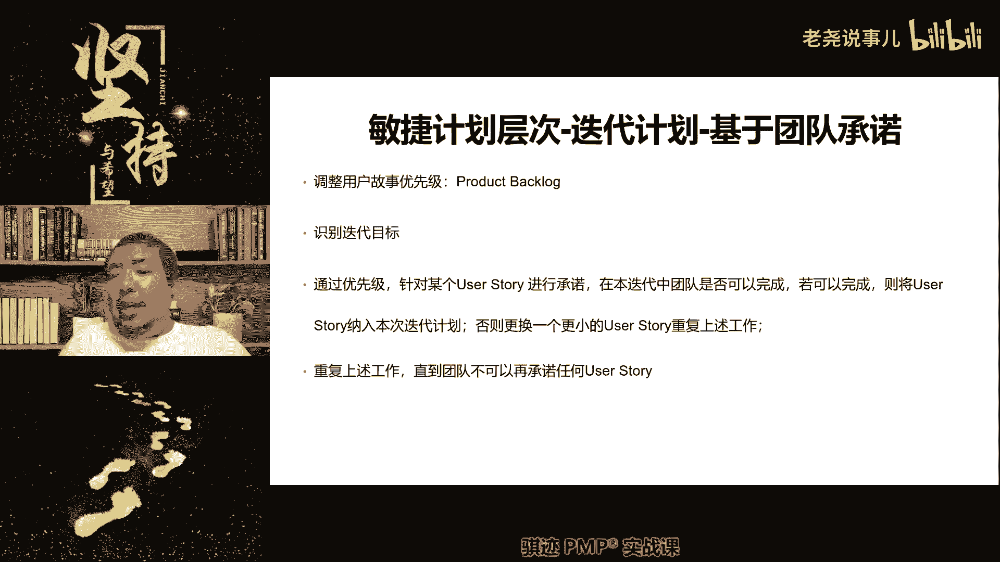

啊大家当年听过那个故事吧，就是说啊公司招人啊，有的公司招人说嗯问一个程序员，你一分钟打多少字，然后说你根据你的打字速率，你一天能不能写5000行代码，能信我想要代码，我们再来考虑怎么招。

你给你多少薪水对吧，这个就有点过分了是吧，所以前者基于速率有那么一点点那种味道啊，它仅限于我们的工作效率。

可能很很明显的体现在我们的工作结果上，那么如果这个事情会有很复杂，很简单或者不可预测性，工作速率很难以稳定的评估，怎么办呢，那么我们就不对它进行进行。

我们接下来进行进行第二种模式，基于团队承诺，当速率不容易评估的时候呢，我们会选择第二种，那么第二种是什么意思啊，来我们来了，我们先设定一个迭代周期，这个迭代周期呢我们比如说是两周，我们点了进行了两周。

然后呢我们进行优先级的什么，进行用户故事优先级的排序，然后呢PO拿出一个优先级故事。

问你啊，这个工作能不能在本迭代周期内做完。

可以啊，那么这个工作就纳入到本次课的知识点，然后再拿出第二个第二个用户故事。

就是第二这个需求的工需求，完成的工作能不能完成，能啊继续进去，然后再拿出一个还能不能啊，不等了。

做不完了，第三个碳单做来不及做，那么第三个我把第三个工作一切为二。

你先做场其中的50%可不可以团队呈现，觉得一下。

虽然我们觉得很紧张，但是我们提升效率，还可以根据主观的发展啊塞进去。

那么最后我们就完成了什么，两个大的用户故事，加一个劈开来的小的用户故事，构成了本次迭代计划的团队承诺，团队承诺。

未PO在本次迭代周期内完成这些用故事对啊。

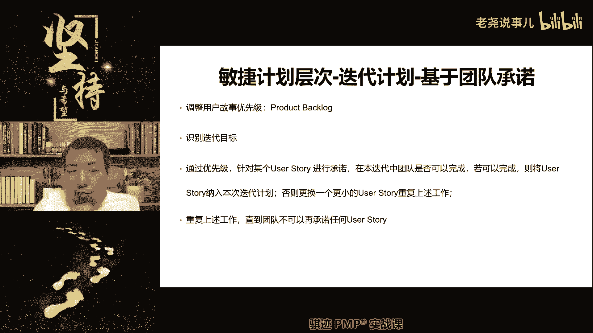

好，这就是我们这个听上去有有有，有一点点很难理解，那么就说啊我们打个比方。

先给你吃一个包子吃，这样吃下啦，吃完再给你吃个包子，吃痛了，吃了三个四个五个六个车再吃。

吃不下，吃不下包子，吃不下哎，吃个小笼包吃一下哦，还能撑一下，再吃个小笼包。

小笼包好吃，下饭吃不下，吃不下哎，再吃一粒花生米，吃不消啊，吃不下啊，吃一下再吃，再吃一粒花生粉，说什么都吃不下了，再小的花生也吃不下，咽不下咽不下啊。

一到喉咙口了，好不吃了，那么等到噎到喉咙口了，那么我们的团队就没有办法再承诺好，那么接下去团队在整个迭代周期内运行。

就是把我们塞到喉咙口的包子小笼包，把花生米全部消化掉。

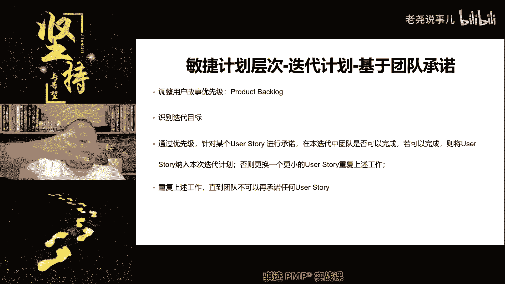

变成我们的结果，也就是能量哈，这个比喻能够理解吧，这就是基于团队承诺啊。

所以基于团队承诺呢更容易激励团队，什么能够做更多的工作内容，而不是用精确的估算，因为精确的估算并不容易。

什么啊，估算出我们的效率改进和团队能力提升啊。

基于速度很简单呀，基于速度其实我觉得更容易理解。

我不知道为什么啊，基于速度就是很简单，比如说我们估算团队，我们讲的打个不太准确。

但是很容易理解吧，团这个团队在这个迭代周期里，能写1万行代码好，1万行代码差不多可以实现什么。

我们估计可以实现五个功能好，所以我们根据团队的代码的效率。

我们就给团队分配五个，实行五个功能的工作任务。

这就是基于迭代速度，但是这个里面没有考虑什么。

这五个功能当中可能有三个功能呢比较简单，代码好写，有两个功能呢功能很复杂，代码难写对吧，然后呢他有没有考虑什么。

我们且前三个功能之后呢，可能对这部分代码比较生疏起来慢，但后两个后两个代码写的时候呢，我们效率提高了，熟悉的写的快，他也没有考虑需要这些东西啊，所以基于迭代速度更适合什么吧，我们不考虑效率改进啊。

难度大致是一致的啊，然后呢，我们的速度呢能够保持一个匀速的时候呢，比较适合用这种方法。

但这种估算相对来说更加准确啊，更加准确，更加客观。

这个事情听上去好像school master没啥事，其实是有很多事情，基于速度不太好，时间基于程度比较长了，基于速度也是有的，因为基于速度，我们可以用另外一种方法叫做故事点数啊。

我们我们那后面就会讲到，会基于故事点数去进行估算。

因为这种估算是相对估算速度，就是说你能完成多少个点数，然后你觉得这个用户故事值多少点数。

用这种方式进行匹配啊，但是这一切呢都是什么。

基于团队和PO之间的博弈，知道吧，进行博弈。

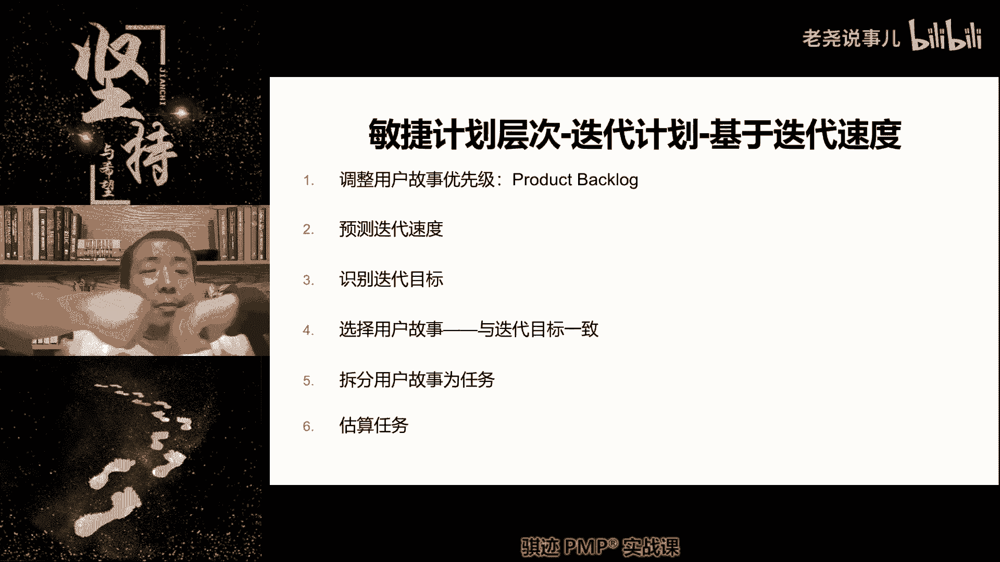

团队呢当然也不是说什么啊，八十八十这个带起来手容易受伤。

团队当然也不是说啊，我们认为高效的团队，也不是说不愿意去做。

而是什么，他可能也不一定能意识到自己的极限在哪里。

或自己的提高的潜力有多大啊，所以迭代数字呢估算的较为准确啊，啊但是呢不太容易呃。

有底更高的挑战和能发掘更多的潜力。

基于承诺呢不太准确，有可能这种承诺呢，团队本身能可能能做三个大需求。

四个大需求，但这个团呢他只敢承诺两个需求对吧。

这个时候团队的能力其实就是，什么也没有充分发挥。

所以他各有优劣啊，后者比较主观，但是容易激发主观能动性。

前者比较客观，但是不容易，什么激发人的斗志。

好吧，那么这两种估算方法其实都是可以的啊。

基于迭代速度及其实都可以啊，实践当中也都用啊。

也都用。

好那么这就是我们本节课讲的内容啊。

那么最后我们会讲呃，啊最后这一页是敏捷计划工具，会有叫时间和叫tom box。

Time box，其实就是什么，我们一个迭代周期的固定迭代长度叫时间和啊。

就喜欢起个名字，就是迭代长度。

TPX有固定的，有非固定的，注意有固定的，有非固定，那么基于固定和非固定，就有我们后面一节课就会讲，有基于流的敏捷和基于迭代的敏捷。

我们之前讲的所有的模式。

其实是基于迭代的敏捷，所以它的时间和是固定的。

我们前面讲啊，两周一迭代，三周一迭代，一周一迭代。

有时候呢我们是不固定的，比如说上一个迭代呢是一周，后一个迭代呢是三周。

最后一个迭代可能是两周，也可能会有这种形式，因为敏捷不拘泥于一种形式。

明白了吧，好那么呃我们今天的课就上到这里。

那么讲到这里为止，我相信很多同学还是对敏捷有一种诶，认识不清啊，或者什么也没关系，因为这两节课上就是节前的那节课和这节课，都是为了周四那节课做五天，周四这节课就很重要了。

我们会将将前面的所有的知识串联起来。

然后去讲什么东西啊。

然后去讲整个敏捷的是基于迭代和基于流的。

是怎么玩的，会讲怎么玩了。

但是你要知道搞清楚怎么玩，一定要有我们这两节课讲的这些基础概念。

才能去理解啊，好吧，计划扑克是我们后面做的那个讲的啊。

对计划扑克，就相当于我们对工作量的相对评估啊。

诶这个呢我们后面可能会穿插改进一下，那么或者这样啊，你们要如果问我们就直接讲就好了，因为已经已经讲了计划工具了吧。

计划扑克是什么东西啊，就是啊它叫做。

它叫什么，就是我们对一件事计划不会这样，它是评估相对工作量的。

就是我们是基于迭代当中的，就是迭代速度是评估相对工作量的。

啊啊我们讲嗯嗯是怎么玩的呢，就是我们拿出一个用户故事。

就是一个需求，然后大家评估这个需求要花多少时间完成，这个时间可以是绝对时间啊，但是我们一般用于相对时间有点数。

用多少点数来完成，然后呢每个人呢就相当于从扑克牌里抽一张牌。

你认为需要五点，我认为需要七点，然后所有人从扑克牌里抽出一张牌之后呢，呃我们会决定这个点数。

然后呢，但是不是马上决定，然后让抽出牌的点数，最大的人和点数最小的人发言，让点数对单人发言是什么，你为什么认为需要这么多点数才能做完。

点数最小的人呢。

他也发现，为什么只需要这么少的点数就可以做完，然后如果我们的差异很大，大家的分歧很大，再进行第二轮抽扑克啊。

第二轮投票，然后慢慢慢慢慢慢的进行收窄，窄到大家最后达成一致，这个需要多少点数啊。

这叫做计划扑克，他有另外一个名字，你也可以记住叫做宽带德尔菲。

唉这帮人造词真是厉害啊，我我看到这人都头疼。

我记那么多词，我觉得头疼啊，叫做宽带德尔菲。

就是计划扑克啊，那么计划扑克用于估算出点数，点数有什么用啊，点数就是用于基于迭代速度，比如说我们一个迭代内。

我们估计点数可以完成工作的点数是60点，那么来了我们我们承诺我们做60点的工作。

然后呢我们来到这间工作，有人认为这件工作要十个点点数完成，有个人认为这个工作呢。

只要五个点点数就能完成啊，其他人都认为什么七个点，六个点，八个点啊，然后我让十个人投十个点的人的发明。

为什么这个要十个点才能做完，然后投五个点的人呢，为什么他只需要五个点。

最后呢大家进行集思广益，最后呢把它收窄收窄收窄收窄到最后呢。

大家普遍认为，认同七个点是完成这项工作的最合理的点数好。

那么我们就从那么这个工作要做了，PU调出来，这个优先级很大。

要做，那么我们就从60点点数当中呢扣除七个点，那么我们还剩53个点。

那么53个点呢你可以PO继续往下跳，许久，我们挑出一个需求来进行一次计划扑克。

然后呢估算出它的相对点数，然后从60点里面扣扣扣扣扣。

一直到把这个点数扣光，对不起，做不来了啊，点数扣完了啊。

就相当于我们的行动力，用完了不能再行动了，请到下一回合，就像打游戏。

明白了，这就是基于迭代速度。

宽带德尔菲啊，就宽平德尔菲还是宽带德尔菲。

忘记了，反正就是这个意思，唉好好吧，就是我给你既然讲到这个，我就给你讲一下好吧。

听不懂，所以就是就是听不懂这个东西，其实有时候面对面或者做个做个小实验，做个小互动会更好一点啊。

哎对就是有些同学，所以你明白所有的同学听不懂。

哎再讲一遍，好吧啊，再讲一遍啊。

就是说假设我们是做迭代计划，点数公式不一定是公式，就是相对公式啊，就是说点数是一个抽象的概念啊。

就是一个抽象概念，比如说我们完成一个非常简单的功能。

需要一点，假设啊，我们认为完成一个非常简单的基础功能，需要一点，那么我们本次迭代呢，在我们的工作能力能够完成的工作能力。

相当于完成60个基础工作的，基础功能的那个能力，那么我们的本次迭代，那个能够完成的工作点数呢是60。60点。

然后呢PU呢会抛出各种各样的需求对吧。

当然有些需求复杂，有些需求简单，我们认我们可以通过刚才讲的计划扑克。

认为每一个抛出来的需求。

相当于多少个基础功能，比如说它值七点，就意味着相当于七个基础功能啊，完成那个相当于十点好。

那么我们不断的接下来，直到我们点数耗尽。

当我们点数耗尽的时候，就意味着什么，我们基于这种工作效率。

我们没办法在这个迭代周期内再开发新的功能，这是一种相对工作量评估方式。

它并不是具体的公式啊。

怎么拆解定义点数，点数是一个相概念啊，它不是一个时间啊，这是一个约定，就只是个约定，比如说我们定义啊开发一个啊类啊，比如说软件开发当中开发一个基础类设为一点。

就是相对，那么相对而言啊。

它你可以在实践当中，其实你是可以把它归结为。

比如说我们花两个小时时间写代码成为一点啊，但实践。

但是理论当中呢，这是团队自行评估的，对的啊，明白了吧，这就是基于迭代速度的。

所以这种方式呢这种方式呢啊啊可以量化，但是呢并不能体现出改进和激励效率。

所以这是基于数，但是它好处是什么，容易做出那个什么评估结果。

但是基于承诺就比较难了。

为什么你到底是能做还是不能做，往往是人的主观的一种判断。

就人的主观方向很容易脑子一热，比如说我们团队信心气都很高，刚刚完成了一个很大的目标，我们觉得我们无所不能啊，我们可能会承诺的过多。

就会导致这个迭代周期内做不完也是有可能，所以两个东西各有利弊。

基于承诺更主观，但是容易主观判断失误，基于呃呃更客观的。

基于迭代速度呢，我们的呃评估更准确，但是不太容易体现出效率改进的结果。

OK这些大家都能明白了吧。

这一圈说下来能够明白了吧。

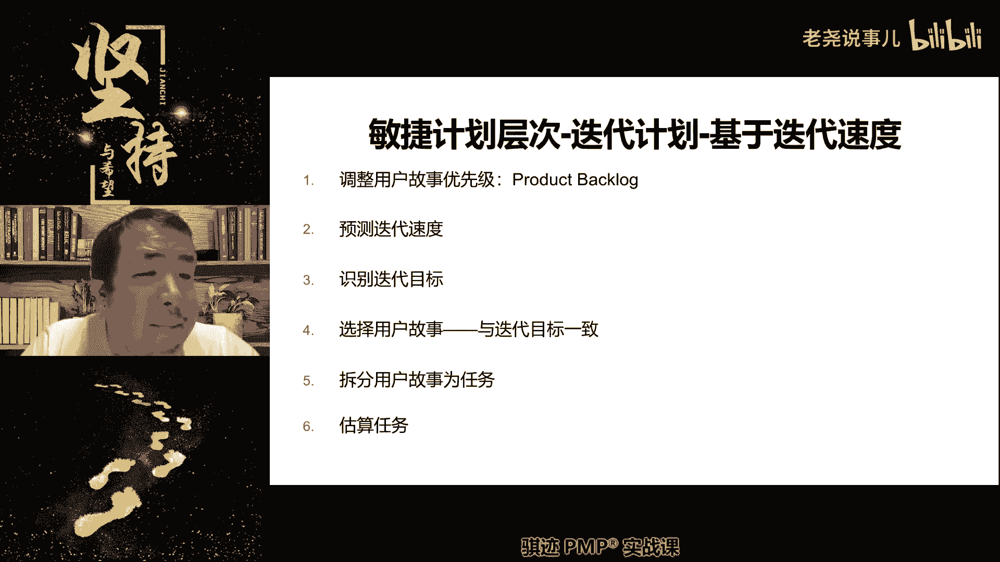

好如果能够明白的话，那么我们今天的课程就上到这里啊，今天又有点又有点晚了啊啊但是这个很开心啊。

同学们，你们问题问得越多，那么我越容易帮你们解释，那么呃讲解，那么这样也就越容易让你们能够什么。

从学习当中获取你们不理解的东西，对你们考试会更有利啊。

敏捷的部分呢，没办法，你只能说更多的是面向于考试对吧。

明煞雾罩对，确实有些东西一听就明白了没，要不要紧。

等到周四那节课，我们讲过敏捷的那个整个一个流程，过程了之后呢。

大家可能会更加容易理解一点，好吧，但是前面一定要我这是为什么。

要前面一定要先把概念讲清楚，否则我先讲敏捷流程再讲里面的概念。

你们更少不了，我觉得你们先尽可能理解啊，一些概念等等，我们周四讲完之后呢，你再回头回来再慢慢的再理解一遍会比较好。

这这个其实也是正常，因为敏捷的模运作模式和思维模式，和我们通常所运用的预测性为主的思维模式。

可能就是有一点区别啊，所以很多同学上来看。

他本来能接受，这是很正常，好吧好，那么这就是我们今天上课的所有内容，那么我们今天就上到这里好吧，周四晚上八点。

我们继续好吧，不见不散啊，那么今天就上到这里了。

拜拜，这只手就不能回了，只要只能这样了。

我受伤了好吧。

