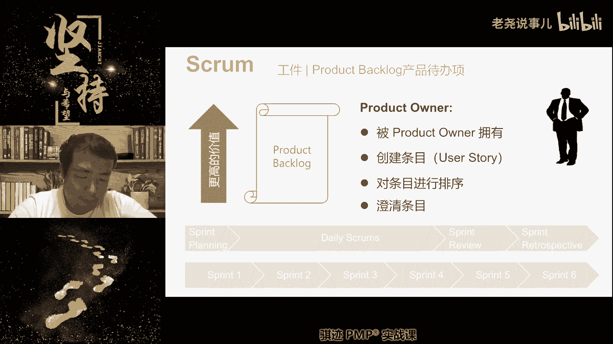
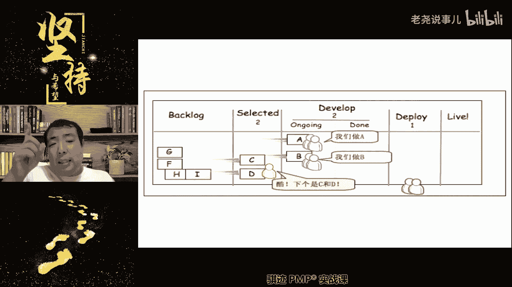
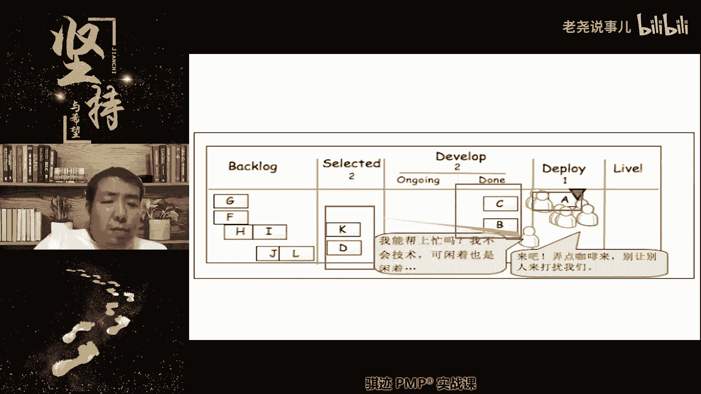
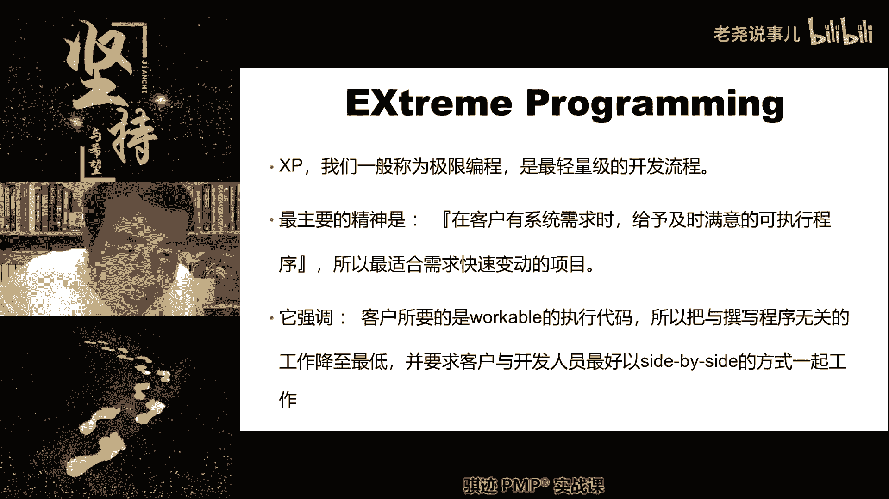
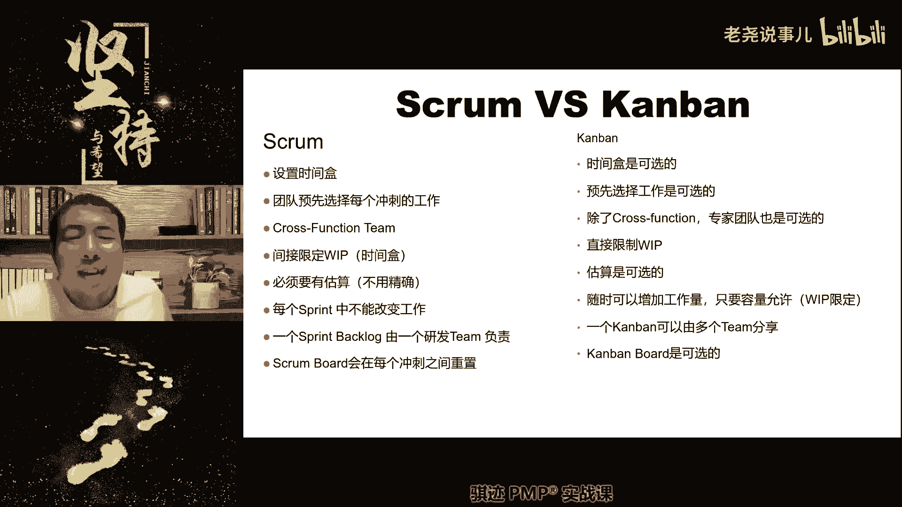
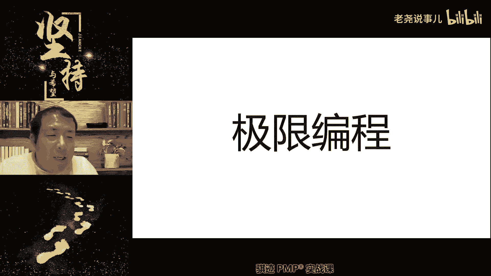

# （收费视频完整版分享）PMBOK第七版课程PMP考试报名认证培训精讲-零基础项目管理第七版教程最新版直播课回放视频免费课程资源-骐迹教育谢阳主讲 - P35：13-2敏捷专题下 - 老尧说事儿 - BV1ek4y1s71N

哎你们这些人懒不懒，这么大一啊，字都不太打击，你看跟我一样。

手伤掉了PO不属于团队，这个在第第一节课就讲过了吧，第二节课就讲过了对吧，好那么休息之前最后一个问题，如果完不成迭代承诺，或者超额完成迭代成功怎么办，两种情况啊，第一如果完不成，如果完不成。

那么我们在迭代完，在迭代结束前，我们发觉已经完不成了，我们承诺完成十个用户故事，到迭代完成前还没几天了，只完成了五个，肯定完不成了，那怎么办呢，我们会重新衡量当前还剩多少工作。

然后呢优先先完成可能完成的价值最高的工作。

然后总结经验，开会不会总结经验，然后总结什么，为什么我们没有及时完成啊。

然后去进行交付啊，也要交付，因为最后可能我们承诺了十个。

完成了七个，七个是不是也要进行spring review meeting啊，产品评审会也要进行产品委员是吧，也要评审啊，也要经受迪迪的啊检验啊，那么有同学会问老师做了一半的怎么办。

做了一半的，我们会将这个用户故事扔回到产品待办事项。

但是他做了一半。

所以就意味着下次再做，只要花一半的工作量就可以实现它的价值。

所以做了一半的需求一般都是价值会上升，因为他只要付出比原来小的努力，就可以获取完成这个需求的价值，明白了他会扔回到产品代办事项。

重新参与排序，它往往优先级会提高，下次更容易被选中，明白了吧啊。

是这样一个机制，所以spring backlog就是冲刺代办事项，没有做完的事情会扔回产品代办事项。

重新接受价值排序排序的挑选。

这是工作没有做完的情况，那么工作如果提前做完了呢，哎你们你们工作中有没有遇到过工作提前做完，我相信你们肯定没有，嘿嘿嘿嘿啊，我们讲敏捷团队是个高效能的团队，是个自觉的团队对吧。

我们明明冲刺周期是两周十天，我们只用8000，被其他人认领吗，你写好文档，写好写好技术技术参数，写好技术文档就可以了。

没关系啊，如果我们只用八天就做完了，还剩两天没事情干了。

所有的东西都按照要求做完了，还剩两天没事情干了，那么可以怎么办，分两种情况。

感觉只会延后对吧，我就知道你们这种自觉性不够对吧，一如果PPO有要求。

PO可以继续从产品待办事项当中挑选。

有价挑选，他认为最有价值的需求，就是用户故事放进本次冲刺迭代周期内。

让团队继续完成啊，注意所以这种情况比较少。

PO可以有权利你们都做完了是吧啊，你们今天开展会啊。

你们都不工作，我们都完了，我们我这里的任务都做完了。

接下去没有工作也没有困难啊，你们每个人都这么说，就我一看诶，还有两天才到中期结束。

诶你们是不是有两天空着，来来来再给我做两个需求是可以的啊对吧。

那所以有些人就可以说啊，都做完了，检查一遍，到点再讲，你看人家积极性不高了对吧，PO是可以吸挑选去。

那么如果PO没有要求。

比如你你要知道，有些东西你提前做出来未必有价值，他也要考虑市场能量，我提前交付给客户未必就好。

知道吧，比如说我老的功能，老的需求还可以卖钱的，我为什么就要提出新需求啊。

来来来那个对吧，也是可以。

那么另外一种什么团队可以自由支配，团队怎么自由支配啊。

我们可以用这个时间对产品进行改进，对工作内容进行改进，进行培训，进行团队认为有客户价值的事情都可以做，明白了吧，我们可以进行一切，我们认为有价客户价值的改进活动，这个可以由团队自行决定，如果PO不决定。

可以由团队来决定啊，这个也是可以的，所以提前完成的话，就会有这样的情况，都知道吗，好如果都知道的话，那么我们就休息一下好吧。

那么讲到这里呢，啊，strong的主要的工作内容流程基本上就到这里了啊。

那么当然具体开发是因为不同项目不一样，这个就没法说了，对吧啊。

那么休息完之后哦，当然当然休息完之后再跟你们说一下，就是说啊再提一提吧，就是我们讲的SCREMASTER应该扮演什么角色，但是后面也会讲，好吧好。

我们先休息一下吧，美日常会一般PO不会参与。

PO可参与，但也可以不用参与。

取决于PO有没有空啊，好那么我们休息一下。

我们休息到我们休息去啊，我们学习之前讲了。

关于基于strong的固定迭代周期。

的这样一种敏捷的形式，那么。

啊那么它是固定跌的周期最长一个月。

不可以临时拖长啊，聚焦价值等等这些就不说了啊。

那么我们稍微往前回忆一下啊。

我们来讲一讲那个叫什么敏捷当中的。

我们的持续改进，我们前面讲过了对吧啊，持续改进当中会有哪些人参加这个这些东西呢。

大家稍微看一看，因为回顾会我们基本上就考个概念。

也不会太多的去讲啊，他为什么进行回顾和持续改进。

基本上看了一搞清楚这个概念就行了啊。

所以我们刚才讲的其实已经足够了，那么我们接下去要讲的就是。

再强调一下敏捷当中的啊。

一些人的扮演的角色和名当中，我们讲的blog就代代办事项。

那么代办失效呢，我们前面其实已经讲了，他应该会有迪迪，我们前面讲了definition of them对吧。

应该是definition of them，他应该是非开发过程的非功能性的，然后它是包含了质量标准啊，应该达成共识啊。

应该达成共识。

是和谁达成共识啊，是和PO达成共识啊，不用和市场达成共识，我们不直接对市场负责，但我们对PO负责，主要跟PO达成共识吧。

啊那么这是产品能源，产品代办事项和啊冲刺代办事项啊。

我们之前其实讲了一个呃，讲了我们啊。

产品待办事项是不断的实时在更新的。

P o，无时无刻都会随时随地，都会从市场或者自己发现各种各样的需求。

它会让这些需求来纳入到产品代表市场当中，所以一个尽职称职的PO。

他的需求是永远做不完的啊。

永远有事情让你做的哈哈价值高低不得，永远要时间，你做的啊。

他会排序，永远也做不完，但是会根据价值进行动态排序，你先跳上来的。

最上面的需求总是什么价值最高的，那么产品蛋白实验应该是非技术性的独立性啊，需求和需求之间应该是不存在特别的关联，它应该符合用户故事，应该是符合invest的原则啊，这个就是这个词就硬硬凑出来。

大家看一下就行了啊。

然后用户故事的描述方式我也给大家讲过了啊，那么注意啊，在用户故事之上，我们的需求还可以变得更为复杂，那么注意啊，如果一个任务他变得更复杂了，它可能会变成一个用户故事，如果一个用户故事它变得更为复杂。

以至于没办法在短时间内完成的，它会变成一个史诗啊，我们叫EPIC，那么EPIC的过程它变成了一个宏大的一件事情，这个事情由诸多的细节组成，然后呢是一个非常宏观的事情，那么我们就会被它继续提升。

称之为seems主题啊，所以需求当中并不是用户故事，是就是唯一的一个单位，用户故事上还会有史诗，史诗上面还会有主题，sips是不是最高是最高的啊。

那么PO呢他就负责什么更新待办事项，然后澄清这些条目，给团队塞需求，提需求。

然后买单吧买单，那么PO可以不懂技术。

他只要懂事长就可以。

好那么在呃这个这个过程其实我们讲过。

那么在scrum过程当中，我们会用到这样一个很典型的叫scream board。

冲刺面板。

那么光波的当中呢，我们会写明什么，我们的冲本次冲刺的目标，总体目标是什么，有哪些准备去做，有哪些正在做，有哪些已经完成的，我们每每天都会更新这个spring planning的，就是board啊。

我们叫scream board，从更新这个boss，那么更新它有什么好处呢，更新哪有什么好说的，然后可以使得我们的状态实时的被显示出来啊，所以我们后面会讲到，我们会在一个工具上去显示它这是什么东西啊。

而不是在工具工具上不会显示，是我们在内部会去显示它啊，那么我们会将项目的状态或者是也可以放到，当然也可以放上去吧，就给你放在一个我们后面讲一个很重要的东西，叫做信息辐射源。

我们会放在这当中来展示项目当前的实时状态。

好那么用户故事这个就不说了啊，这个就不说了，其实我刚才跟你们讲，其实已经讲过了啊，那么这三种，前面我们讲的这些敏捷迭光当中的三个人。

三个角色，一个是PO啊。

一个是开发团队，那么PO不一定是全职的，可能是兼职的，那square master就是我们的敏捷大师，敏捷教练呢他可能也不一定是全世界性，他可能带多个团队，但是团队成员一定得是全职的。

就是全心全意为本项目服务的啊。

好那么我们在工作当中我们会追求什么的。

至少在短期内可以是面对面的呃，同地理地点的办公进行渗透式沟通，那么这里又提了一个敏捷和技术造成啊，什么叫渗透式沟通，就是说我们的沟通是啊没有障碍的，能够直接切入主题的，不寒暄的那种沟通，叫肾的功能。

直接点到关键点的那种沟通叫渗透式沟通，不是趋于表面的沟通，就渗透式公共是面对面的，然后有一个词，反正你们记住几点，就是有可变化的加剧，就是我们的办公摆设啊，敏捷，据说提这东西就是不是一成不变的。

办公摆设是随时可以改变的，是半开放的，可以随时改变布局摆放的啊，这个这样一个家家居环境啊，那么敏捷当中呢，我们会使用到敏捷的信息辐射源啊，信息服务员是干什么，告诉项目当中的团队成员。

更多的是告诉项目的所有相关方，我们当前项目的实时状态啊，实时状态，那么项目当前实时状态可以是哪些呀，我们之前讲的敏捷大师所画的BENAPERCHAT，Bend down chat，可以放在上面。

还可以更新什么东西啊，我们当前正在做的是哪些方面的工作，已经取得哪些效果，项目的产品正在处于什么状态，这些都可以放在信息辐射延长，以便所有的相关方干系人，都对我们项目有兴趣的。

相关干系人都能实时的了解项目的状态，并提出反馈啊，对很多同学说我们就会使用极软，但是极弱也不是万能的，成本有点高，有些东西过于轻量化啊，啊这就不做题了啊。

好那么敏捷当中呢我们稍微提一下啊。

romaster square master这个角色就是敏捷大师，他这个角色注意它的几个特点。

我们之前讲过啊，其实也在我们项目管理原则当中。

其实体验过就是仆人是管理对吧啊，我们是禁止勤勉的管家，还记得吧，敏捷管理原则把项目管理原则。

勤勉管家对这些都是用来形容square master，那么scrum master他是仆人式管理。

我们前面讲的是打野包鸡对吧，包鸡包眼送经济的。

就这种意思，他呢不对解决方案负责。

对过程负责，也不对人负责，这个请记住啊，他只关心他的眼里，只关心意思，敏捷的秩序和敏捷的理念有没有被贯彻。

项目中是否存在障碍。

我们讲障碍是什么，过程不正确，问题是什么，结果不正确。

如果存在过程不正确，我们会予以教导，教练和指导引导帮助，但是不会直接帮助你解决问题啊，那么这个请注意，我们在敏捷的考到，我们在P考试当中经常会遇到，比如说项目经理。

以前是开发专家团队遇到的开发问题，能不能让项目经理来解决，不行不行。

因为授人以鱼不如授人以渔。

我没说不对，项目结果负责，PPT里面说我们只是说不对，解决方案负责，项目经理敏捷，项目经理肯定是得对结果负责，但是过程由团队自组织啊。

没说不不对。

结果负责啊，否则光master为什么会有人事任命权，你想一想对不对啊。

他只是不对人负责人，什么叫对人负责，每个人管好自己，我不会特意来管理你啊，但是我会盯，我会盯着你，如果你做得不好，又不自己改正，又不能融入团队。

那么我只能优化点。

咳咳来促进各项活动开展。

确保strong被正确理解和贯彻啊。

所以敏捷大师，脑子里还是日常思考一个什么事情啊，怎么样能够帮助团队做的越来越好。

越来越好一样。

呵呵唱起来了哈哈OK明白了吧。

我们来调节一下，不要太严肃对吧，这就是square master所做的东西啊。

看上去是轻松了，其实对人的要求反而更高了。

好那么PO呢我们讲的只对产品价值负责，交付价值负责啊，负责澄清需求过程，不管这是团队成员对吧好。

那么接下来我们来讲一个东西，接下来一种呢是基于流的。

它的英文叫flog，敏捷的方式，这种敏捷方式呢呃更多的源自于敏捷的一部分，前瞻就是敏捷的，任何前瞻就是敏捷的有一部分，那呃理念是来自于精益LAN啊。

给大家打个字叫精益，它的英文叫lean，精益的，那么精益的理念是什么呢，说给大家讲一讲，哎呦这个考试就扯得太远，就现在亲戚的亲戚比远亲了。

你知道吧，我们稍微讲一讲啊，经营的理念是什么，我们的工作当中。

我们的我们的工作，生产当中会存在很多的浪费和不改进啊。

和浪不改进不优化，这就是浪费，如果我们不断的注重过程细节。

将浪费消除掉，将问题瓶颈消除掉。

我们就能不断的提升价值，这是精益的基本可素概念，那么精益认为什么东西是浪费啊，转接等待啊。

注意这个理念就很重要了啊，等待是一种浪费。

转接是一种浪费啊，空置是一种浪费，半成品是一种浪费啊。

东西做到一半不做了是一种浪费啊。

所以精益的理念是要消除，比如说什么一堆东西做了一半做不下去了，一个东西要花很久才能做出来。

同时做很多东西，但是又交不出来东西，然后呢一下子就教出来很多东西。

这种都存在浪费啊，所以我们需要用类似于精密的理念。

去管理这个流的这样一种方式啊。

所以我们就使用了碳板啊。

这个可能在制造行业当中可能更容易理解，但是敏捷把它延伸的到了我们的开发过程。

品质过程也存在浪费精力就消除浪费。

对品质是什么质量的波动啊，那个叫什么那个等等也也存在浪费啊。

不熟练也是，那这个就不细说了，因为还有什么mua mua maria。

这个就不说了，这个理论一套一套，但是我觉得近义总有一天会被中国人改写啊。

因为丰田已经丰田已经快挺不住了哈。

只能说国产车牛逼啊，那么呃看板的原则就是遵循精益，然后他呢经看板这种敏捷模式下的，我们没有固定的注意我的描述啊。

这个非常重要，一定得记住，没有固定的迭代周期。

它的精髓是什么啊，既来既作即做即走过程尽可能的快而没有瓶颈。

好我再说一遍啊，既来即做即做即走过程尽可能的快而没有瓶颈。

有没有同学能不能在在在在在在，在公屏里帮我打一下这串字。

啊啊啊谅解一下，那么这就是看板的理念。

因为呃看板追求的什么。

就是说啊，在制品数量，基本上就是我们与其同时做十件事情，然后一下子把它做完，不如同一时刻集中精力做一件事情。

然后一件一件把它做完。

这样的效率和加只教父效果，要比同时做十件事情。

然后把它做完来得高，浪费来的小，等待时间来得短，更不容易出现瓶颈，这个就叫做啊看板的这样一个，遵循经历的这样一个原则啊，既来既做，就是我提了很朴素的语言啊，就是当然了，有一点点把这个东西矮化了啊。

但是便于大家理解，知道我们是主要是这方面。

是更多时候便于大家去理解，便于大家去考试，因为考试啊既来即做，即做即走，没有固定的迭代周期对吧，然后过程尽可能的快，同一时间做的内容呢啊尽可能的少啊，所以看板精一的极致，我们就是有一些理论啊。

大家如果听过了，就IT里面有一个仅限，基本上就只能用于IT叫做DIO的理论，里面叫做什么叫做单件流，就是同一时刻只做一件事情，但用最快的速度把一件事情给做好，到下一个环节再做啊。

这就是限制在制品数量到一啊，那么这种过程我们既然是既来即做，即做即做，它就没有固定周期的对吧，那么当然了，你也可以说什么啊，光master可以规划一个呃不固定，但是有周期的，就是我们做一段时间。

保持这样一种高效率的运作，做一段时间，然后停下来呢啊整顿一下，然后再做一次也是可以的啊，但这个周期呢就是不固定的啊，好接下这个可能大家比较难以理解，接下来我们会用一组图来表示啊。

来来来解释看板是怎么运作的，那么请注意看板实际运作当中的精髓是什么，不断地通过突破解决瓶颈，看板就是你不是看板，如果它作为工具，它就是我们常说的那个中文的那个看板，它是日文can b，这很碰巧的翻译。

看不完，can be啊，这can be，但英文的什么什么翻译我也不知道怎么翻译，反正就这么来的啊，是从日本那边开始先来的，它是一种，但是他遵循的是精益的理念，所以我们提到的经历它是一种，如果往大了说。

我们现在讲的这种敏捷方法，就是看板的敏捷方法，如果往小了说，看板是一种工敏捷工具啊，敏捷工具，我们现在讲的是利用抗板来解释，基于流的这样一种方法。

好来了，那么在这样一个初始状态当中呢，我们有blog看到吧。

就是待办事项，注意这个时候呢我们就不像spring啊。

因为它有固定的，我们会挑选代表性，不会不再挑了，红色小人代表产品经理，蓝色小人代表开发团队和，绿色小人代表实事团队啊，但开放式当中都是属于属于项目工程技术团队，工程师团队。

那么产品经理呢会什么负责挑选需求，然后没有，因为没有固定的迭代周期嘛，所以就没有string planning meeting，即来即做，即做即走啊，好那么我们总共有四个环啊。

三个环节第一个环节叫做select啊，就是我们左边的这个叫做select，那么就是说什么选中需求，我们第一个环节是要选中，我们同时能选中的需求是有限的，Select，第二个环节呢叫做develop。

就是开发开发当中呢，它的它也是分什么两个小环节，一个是正在开发中，一个是已经开发完啊，那么第三个环节呢叫做部署，部署呢是什么。

是将产品放入到生产环境当中去。

deploy部署，那么部部署完成之后呢，然后就产品就上线了啊，那么这个大家可以看到选择开发和部署，下面都有个数字，这个数字代表什么意思啊，当前最大可以执行的数额，最大可以可以执行的再制品数量有多少啊。

我们最多只能同时处理的数量，就相当于最多同时能够处理的工作任务啊，这个意思明白了吧，好有些同学会觉得奇奇怪怪，这个你可以看到就相当于一条柔性的生产线啊，流水线生产线啊。

只不过这条生产线呢不是像机械生产线一样，可是有形的。

它可能它的过程呢是无形的，好我们来看一下怎么玩，第一呃。

测试测试，但是不考虑啊，我们讲的简单点，我就更复杂了。

就举个例子啊，好我们首先从待办事项当中挑选A和B，A和B是价值最高的PU拿出来拿出来之后呢，他的挑选当他挑选出来的时候，他的select的上限达到了上限二二，我可以挑两个，我当前已经挑两个。

他还能再挑啊，不行好，挑完之后呢。

他看一下他挑选之后的下一个环节，是不是空着的，好。

我挑出来的需求就可以扔到那边去，啪扔过去，扔过去之后呢。

我不会等你做完了，我在那挑选来了，我会继续挑选A和B。

做完了之后呢，我认为C和D解结局是最重要的事情了，我也挑出来。

但是我挑出来之后可以往下扔了不行，为什么，因为A和B正在开发中，他们在开发完成，扔到下一个环节之前是不能够接受新的需求的，所以你的C和D等等卡等待你的环境好。

那么过了一段时间之后呢，A和B当中的A呢做完了啊。

A做完了之后呢，他从going on going，正在开发中变成了灯。

开发完开完之后，Q我们就可以扔过去，扔到什么，扔到开关那个环节啊。

扔到开关那个啊，扔到部署的环节，说错啊，都部署好。

扔过去，部署之后呢，我们就会有什么东西啊，就会继续可以从什么。

我们刚才C和D不是有两个在等的那面吗，哎我们完成了一个，我们就可以把C挑过来。

继续做，B还在开发中，对吧好，那么这个环节当中呢，C被挑选出来之后呢，一选中这个环节又什么又空下来了，诶，PO环节诶，我又可以挑一个需求去上线了吗，平衡啊，他又去选了一个啊，这个这个咱暂且不论啊。

好咱就不理，但是呢这个时候呢我们开始讲为什么是有看板，因为在看板的过程当中，最容易发现整个开发流程过程当中，什么瓶颈在哪里来了，瓶颈来了，我们的部署环节出现了障碍和问题，部署不了好部署不了之后呢。

我们只能卡在这里了，不能继续往下不行，往下走了，对不对，那么这个时候呢B也开发完了，B能不能去上线不行，因为A还没有上线，同时只能有一个上限，M还没上线，如果部署有问题，看又有开发中。

怎么那么先让他开发呀，不要急不要急。

好来了，这个时候两个小人仍然，这个时候两个小人仍然在什么开发，因为上限是二，所以两个小时仍然在开发C，但是两个小人呢已经把笔给开发完了，那么另外两个小人，蓝色小人说什么，我们没事情，因为我们的上限是二。

所以我们不能够再继续开发了，那么这两个人是不是闲着呢，那么你们想想，如果这两个人闲着怎么做才是最好的方法。

他们最好的方法闲着也是闲着，这两个蓝色小人会去帮绿色小人是吧，一起去解决部署问题。

好哎对了。

明白了吗，这就是一种敏捷的团队的这种，那么在流在拘留的敏捷团队当中。

我们很自然地会将资源，因为会有每个环节的上限，我们会自然的会将那些闲置资源的上限的环，节的资源流动到瓶颈的环节，去帮助瓶颈消除瓶颈。

因为瓶颈在A那里。

不在CN啊，那么这个时候呢，一对蓝色小人去帮助，一对这对绿色小人去部署了，但是这个时候呢，因为我们之前已经把C拿过来，所以我们在选中当中呢又可以选出一个K了。

好来了，继续看啊，接下去呢我们C也做完了，但是C和B都不能部署。

因为A卡住了，那么这个时候两个蓝色两个蓝色小人干什么，也另外两个蓝色小人呢也没有事情做了。

他没有事情做，怎么办呢，他就会也去帮忙。

那么如果某一个环节在基于流。

为什么拘留叫流水，流水会经过很多流水环节吗。

在急流的过程中，如果某个环节堵住了，那么其他的环节它的上游环节和它的下游，下游环节会空下来，上游环节会什么堵住了，没办法干，都会慢慢的将资源流动到被堵住的那种环节。

去帮忙帮助他疏通，然后才能让这个水流起来，知道吧，所以水管如果堵住了，哪里水压最大，堵住水管那一点是水压最大啊。

好那么接下去这个时候发现什么红色的PO，它也没事情做。

因为他也不能继续选了开发环节。

因为部署环节读作开发环境也处于停滞状态啊，虽然开发环节没有产生瓶颈，也没有堵住，但是因为下游堵住了。

所以他也流流不动去对吧，所以呢PO也过来帮忙了啊，他说PO说我能帮上忙吗，虽然我不会技术，但是咸水是咸的，然后说哎你去给我打杂，去来倒点咖啡，别让人打扰我们，我们呃呃所有的团队集中起来。

把这个部署问题给解决掉。

好经过一段时间之后呢，好部署总算成功了，我们把ABC都部署上去，然后K开始部署了，我不能，然后通过这样的环节，我们就什么打通了，打通了之后，你会发现什么在某些工作能力强的环节。

甚至是会可以什么有更多的上限，比如说像开发，因为开发团队人多嘛，他的上限会根据这个情况还可以调整提升上限。

好这就是基于流的一种很简单的演示形式，任务可以回退吗，任务不可以回退，只在只能在某个环节去解决它，哎有些同学你要注意听讲啊，你看像尾号317同学，我们讲了流经历和看板啥关系，我之前已经讲过了。

没仔细听吧，机遇流的这种敏捷方式，他的理念来自于精益，精益的理念是什么，消除浪费，提高效率，那么看板是一种流的敏捷的方式，看板本身可以是个工具，但是我们可以基于这种工具，创造出一套我刚才演示的敏捷的。

这种基于流模式的敏捷模式啊，这就是他们之间的关系，那么敏捷当中我们我们之前的课就讲过，敏捷包，主主流是两种，一种是基于迭代的，就是前面的strong，一种就是我们的看板模式嗯。

现在我们讲的其实就是基于流的模式对吧，明白了吗，任务不会回答啊，那么我们接下去会讲一些东西比较哦，可能会考到我们确定一点，就是所以一个基于流的，基于流的模式的敏捷环境当中，它的吞吐量是取决于什么东西的。

是取决于它的开发速度和它的单件效率啊。

开发速度和它的单单件过程，那么这个这个原则你们可以。

你们可以在敏捷实践指南书上叫做利特尔法则，Little law，他不叫小法则，因为那个开发者发明这个理论的人，提出这个理论叫做little l i t t l e little小啊。

它的名字就叫little，他提出的这个法则叫little law对吧，所以根据立法法则，我们处理一件东西的时间，往往是很难大幅度压缩的，那么我们要提升效率，最好的办法是什么，提升拓展最后怎么办。

我们让工作要一件一件的，通过我们的流程去解决啊，一次一届一次一件，这样的话效率是最高的，这就叫做单节流啊，这这是立条法则讲了，那么还有一个表述方法什么啊，哈不I，还有一个比方就是基于流的这种模式。

它的速度取决于就像木桶原理。

取决于最慢的那个环节，或者是最容易达到瓶颈的那个环节。

木桶原理大家知道对吧，桶能装多少水，取决于最短的那个板子，那么那么木桶原理当中呢，全自动版，那么敏捷当中，我们的整体效率是取决于最容易堵住的。

也就是最容易产生瓶颈的堵塞的那个环节。

是我们的关注点。

而且因为基于流模式，刚才这个给大家演示过，基于流的这种模式。

我们的资源会不自觉的流向那个堵住点，因为一旦你这里堵住了，其他地方就没活干，就会留下了，你帮助你去解决对吧，但这是基于我们良好的高效能团队啊，那么接下去还有一句话啊，那么基于流的考的比较少。

一般都是基于考基于迭代的啊，基流的还有一句话当然是其他理论来的，就是瓶颈之前的都是浪费，就是瓶颈之前，就是比如说在解决部署这个环节环节之前。

缓解之前，这些KBCB包括A是不是都是半成品啊，他们还没有部署上去，上限是不是都是半成品啊，我们讲半成品有没有价值，敏啊，精益和敏捷当中都讲，半成品没有完成的，99%完成的都是没有价值。

所以这些东西在流程当中都是浪费，所以瓶颈点之前的都是浪费，瓶颈点之后的都是什么闲置，因为这边堵住了，下游就没有流量，下游就没活干，他都是工作处于闲置状态，所以基于流动模式呢，它的一个思想是什么。

不断的找出系统当中的瓶颈，解决这个瓶颈，从而提升整体的效能，增大吞吐量啊，加快价值交付，明白了吧，那么它的另外一个好处是什么，因为没有固定的交付周期和迭代周期，既来既做既做几种。

它的交付频率和交付效率进一步得到提高，大家想一想，如果我们是基于迭呃，基于迭代这种像逛这种方式，是不是我们等到比如说两周一个QU，我们两周冲刺结束之后，是不是在进行。

就是我们前面讲的就是string review啊，就是我们的产品评审会是不是再去做评审，要两周之后再评审，那么如果我们改用基于流的呢，我们第一个产品2000就走完这个流程来，就可以上线了。

那么我们两天之后就可以把他交出去，不要等到两周之后再把它交出去，是不是用户价值的交付速度就更快了，这个其实也符合PO和第七版，我们讲的什么基于用户价值的项目的目标啊，我们的项目目标是基于用户价值。

好这些都能理解吧。

这些都能解决啊，那么怎么那么最后一个啊。

我们讲考试当中可以遇到，怎么判断某个环节是瓶颈啊。

就是我们前面讲了什么瓶颈，之前都是浪费。

瓶颈之后就是闲置，如果某个环节他后面的环节都工作量不饱和，但是他之前的环节呢已经做的太多，没办法继续工作了，那么本环节就是瓶颈，明白了，就是所有人都等着你做完才能开展他们的工作。

那么这个这个人就是我们工作当中的，最薄弱的点木板当中的最短一个板，也就是我们的瓶颈，BONNIK啊。

我们叫平行，叫BONNIK，你就明白了吧。

啊这里给大家看一看QUAN和看板的一些区别，留得最慢的就是平点，也可以可以这么理解啊，你看这里，但是有可能会有几个环节，因为比如说你的下一个环节堵住了，所以你不一定是完全堵住啊，有时候赌注是什么。

就流的很慢，也是平行对吧，因为他留着慢，你也变慢，你和他的速度其实是被迫和他保持一致，那么他不一定就是说你你也是只是因为他慢，你才慢啊，导致速度最慢的那个环节是平行，那么这这面PPT呢。

是我们的rap和看完了一个比较，这个大家可以稍微看看啊。

因为这个是ACP会问的更多，我们的考试呢呃这个呢会问的相对少一点，看板也会考的相对会少一点啊，大部分的考试敏捷相关的考试题目都是问的。

都是QU。

好那么接下去我们会介绍一个extra programing，但是会非常简单啊。

WIP啊啊，有同学问WP非常好啊，这个问题问的我刚才没有特别解释是吧。

WIP以后因为没有解释英文，其实前面PPT有叫再制品，Work in process，叫再制品或者叫半成品，那么我们前面讲过敏捷和精密的概念当中，再制品和半制品都是没有价值，什么是战士WIP啊。

就因为我们就就就就就就就讲了那个叫什么呃，因为呃相关的理论用了很多WP的P，我就没有特别解释啊，有些同学可能也不一定熟悉啊。

就是半成品啊，Work working process，好那么接下来我们介绍一下XP啊。

叫极限编程，Extra programming xp。

XP呢是一种最轻量级的开发，这个考试考的更少，你们只要知道一些基础概念啊。

XP是怎么玩的呢，啊我们那个供周星驰那个功夫看过了。

周星驰功夫里面有句什么话，天下武功什么东西啊，后面半句是什么。

唯快不破对吧。

天下武功唯快不对吧，啊那么XP它就主打的一个是什么。

会那么XP是怎么换的呢。

哦不好意思。

什么是冰块化的。

那么XXB是怎么追求快的呢，它是这样追求快的啊。

就是第一客户和开发人员肩并肩的开发，第一点沟通速度最快，第二，需求必须最为简单，第三实现必须是最为简洁。

用这样的方式来实现最快的需求。

到实现的这样一个过程，好我再说一下啊，需求就是客户和开发人员肩并肩地进行开发。

然后沟通开销和速度最快。

开销最少最快，这是第一个，第二个需求必须是最为简单的，然后呢实现必须是最为简洁的，刚好满足这个需求，在遵循这样的原则情况下，我们可以最快速的将需求变为实现，用最短的时间，这种玩法就叫做extra通关率。

那么具体往里面它会有什么XP教练。

XP开发人员，什么什么什么东西呢，就不说了，因为这里面的东西太过于偏向T化了。

就不给大家做做过多介绍了啊，那么他的XP的精神其实跟敏捷的初步的精神。

就是说也是个人啊，他的精神叫简单沟通反馈。

勇气尊重啊，这几个可以稍微记一下，简单沟通反馈有其尊重啊。

这以前敏捷也是这么讲，OK这个稍微记一下就行。

这是XP啊，XP的什么小游戏，小事件等等，我就不讲了啊，那么这是我们介绍的第三种敏捷的玩法。

XP也是基于流的注意啊。

XP也是基于流的好。

那么这两个讲完之后呢，啊今天课后最后最后一点内容我们会留下。

还要讲最后两种敏捷形式。

这两种敏捷形式我们称之为大规模的敏捷形式，大规模为什么要大规模。

因为敏捷当中我们讲团队一般不超过十个人，他适合小作坊小团队。

但是我们在有些场景当中确实环境复杂，很变化很剧烈，但是它的工程量又很大，不可能仅用小团队在短时间内能做得完。

那么此事古难全怎么全反。

这你能理解吧，我又要适应能力强。

工程量呢又很大，又呢时间呢又比较紧迫，那我怎么两难全，那么这个时候，我们就会用到两种大规模敏捷形式，第一种叫做SOS，不是那个求救的SOS啊，哎sorry我手好方便啊，叫quan of光。

有哪些同学打一下啊，光of qu就是用ROM团队来组成QU，那么在这个当中呢，我给大家稍微画一下，在这个团队当中呢，我们的组成单元最小组成单元不是一个自然人，而是一个小的敏捷团队，然后呢，我们在开各种。

我们前面讲的各种各样的会的时候呢。

我们不是让人来看，而是让团队代表来开，然后开完大的光会之后呢，我们回去再看小的光会，然后比如说我们scream planning，我们前面的scream planning meeting，我们的冲刺啊。

冲刺规划会当中呢，我们规划的时候呢，先按照团队进行单位规划啊。

每个团队去认领任务啊，认领完之后呢，再在小的时光，团队内部呢再认领一次任务，这样的情况下，我们的单个迭代周期内的工程量，就可以做的很大，比如原来是60个故事点。

现在可能一个迭代最低能做600个故事点对吧，当然可能这种以这种形式上呢，可能什么仪式会什么会稍微复杂一点，每次开会呢先要开大会。

再开小会对，但是可以什么扩大人员规模啊，提升单次迭代的工程量，但是它仍然是基于迭代，那么这种方式呢是把人员进行分割，人员进行分割，那么第二种形式呢，我们叫做SAFE啊，规模化敏捷啊。

或者有些理论叫ESIMACFE，或者ESFACCF那是另外一种理念，你们不需要知道很详细，因为这个东西你们研究一下，可能考试也就考个一两道了不起了，但是可能你们研究可能研究半两遍啊，经济投入比不值得。

他是什么例子啊，它是从内容实验活动，我们不拆分团，我们团队也是拆分的，但是我们的更重要的拆分什么。

我们先将很大一个项目的工作内容，拆分成若干块，尽可能不相关的独立内容，每块内容自己跟自己去玩，什么敏捷，我们敏捷完了之后呢。

再定期把这些内容拼起来啊，我们把内容拼起来。

比如说我们做一个大型的系统，我们将这个系统呢分为若干个板块，然后每一个板块自己去做敏捷，敏捷完了之后呢，再因为各个板块之间联系不大，敏捷的一段时间之后呢，我们再将这各个板块的敏捷的工作内容。

成果呢再拼在一起。

形成一个大的敏捷成果，然后再去进行反馈。

然后再去拆开来，是这么，那么这样的黑河有好处，避免SOS的那种什么大会开完，开小会的什么效率损失，我们还是一个团队，只不过我们的团队的敏捷的呢，不再是整个项目的产品，而是产品的一部分，然后呢。

由呃呃e cf的教练呢，负责什么这个东西进行拆解和拼装，就这样的工作啊，但是具体玩法呢就不需要大家了解的太深，了解太深，只要知道ECF就是先分割内容，然后大家各自去敏捷，然后再拼起来这个玩法。

好这是两种大规模的敏捷全称，我我也忘记了，韩国人就我们一直叫ECF。

不叫忘词，就叫safe或者e safe。

中文名称我还真忘记了，不好意思，你们网上可以搜一下，肯定没打错啊。

它叫scale of free啊。

一一什么呢，不能sky skilled your free，什么什么什么东西，我忘记了，我忘记个词了，不好意思好，那么这就是我们今天的敏捷的第三个课时。

那么今天我们将敏捷的所有的内容全都串起来。

讲好吧，那么至此，敏捷肯定也是多个团队敏捷的啊，以多个子团队进行敏捷，因为敏捷都是要求什么小团队，单个敏捷团队一定要小团队，人一多就没效率，他也是多个团队，只有这些团队呢他们在工作的时候。

相互之间不像光谱子方要开大会，联想会他们呢只是在内部开会啊，提高效率只在内部开会啊，外部呢我们定期去做拼装的时候会开会啊，但是不会外部频繁去，是这样的吧，都是大规模，都是都是多个敏捷团队的啊。

所以才能才能大规模嘛，因为要解决一个人力资源的上限问题，对吧好，那么这就是今天我们的敏捷课程的所有内容，那么在下课之前，在下课之前，大家还有什么问题可以再问一下，给大家5分钟时间准备下。

下节课我要给你们写写题目，所以有点有点还是有点忙的啊。

你们可以休息了，我要给你们写写题目。

有问题吗，有问题可以问啊，没问题，如果你们持续的没有问题，我们今天就结束，好吧好，我们三天的敏捷课程，这样听起来，是不是，大家对敏捷的整个这个概念就有理解了吧，用户故事是什么。

我们前面正好来来来，我们再回过来讲一遍，我们其实前面已经讲了啊。

所以我PPT其实已经我们之前讲过啊。

用户故事上我们之前没讲过啊，所以大家回不去。

那什么是用户故事啊。

有同学问还有什么公式没搞清楚是吧，很多方法在实际工作已经用了很有效。

我每个环节意义了对吧，用户故事是由产品经理，产品拥有人负责编写的描述，对于用价值功能用户故事主要是什么，谁要什么，为什么要，就是我是谁，我要什么，为了什么商业利益价值目的啊，举例作为一个用户。

我要可以注册账号，这样我就可以登录并保存我的个人信息对吧，我是谁，我要干什么，达到什么样的商业价值，作为卖家，我可以上传我的商品，这样会在网站上出售我的产品，这就是这就是用户故事，群里的问题看一下啊。

群里哪有问题啊，我们的微信群里哪有问题啊，我们的微信群里没有问题啊，啊我我有两个微信咨询，PODOD是团队的代表，是细化会不会不是不是迪欧迪，是我们在我们在那个叫什么啊。

Spring planning meeting，冲刺规划会的时候代办，实际上细化会只是以PO为主，帮助PO细化待办事项，这有效定义那个叫什么，它不是必须的啊，不是必须的，是在我们的冲刺规划会上定义的。

那么用户需求，用户故事就是需求来源，用户故事不是需求来源，需求经过规范化表述，是用户故事，第一个群啊，好等我下课我给你们看一下好吧，这个跟上课内容没有直接关系，下课给你们看一下好吧好，还有什么问题吗。

有没有问题的话，那么我们今天上课就上到这里好吧，我们的敏捷专题课就上完了，下周开始我们继续会上后面的各个绩效率，请大家预习好吧，好那么我们今天的课就上到这里吧，感谢大家拜拜啦，今天的课很重要的啊。

因为敏捷现在考的内容非常多，所以理解敏捷是怎么玩的，它中间的各种概念定义，对我们通过考试非常有帮助，你们的敏捷课已经是我前面几届同学，经过不断的迭代之后得到的一个什么啊，一个形式有效的健康。

一个一个讲述方法，用这三节课啊，我之前根据实际情况，后面还会有一些敏捷的复习课等等，我这就不及格，到时候这个可以单独再安排啊，那么所以大家如果对敏捷概念不清楚，可以群里问我，然后还可以看回放好吧。

但是一定得掌握这个东西非常重要，考试肯定考的，而且大家很多同学对这个敏捷都不太熟的好吧，其他我就不多废话了好吧，那么我们今天课就上到这里，拜拜hello，我们下周见啊，下周二啊，风雨无阻啊。

辛苦老师的手了，是辛苦这只手了是吧，哈哈受伤了。