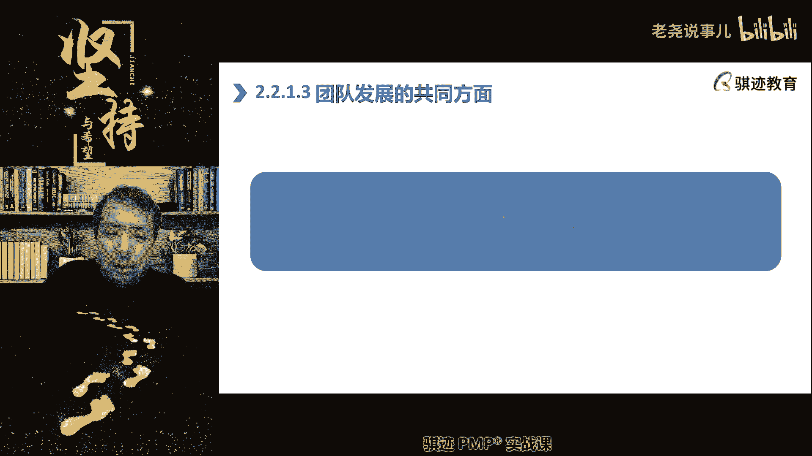
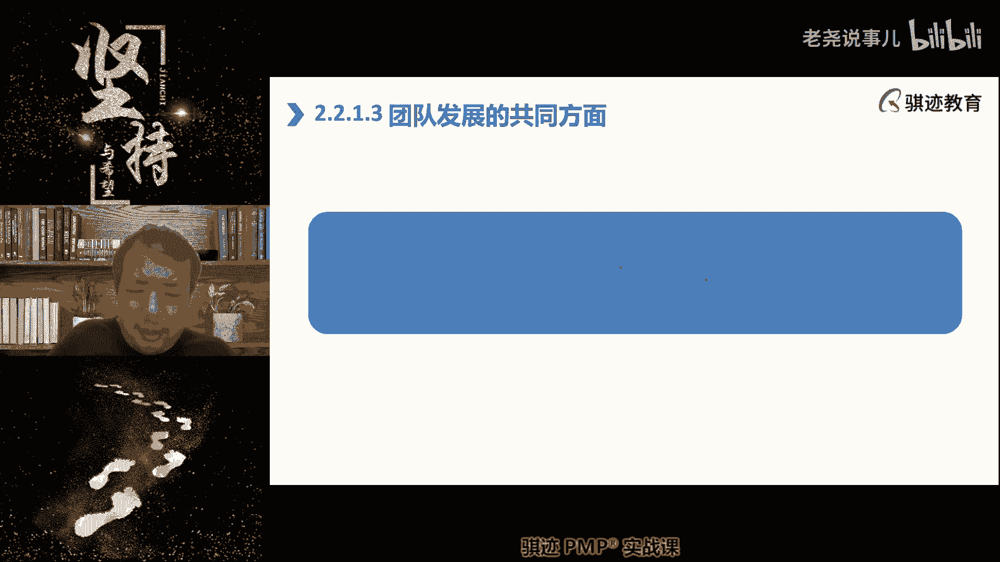
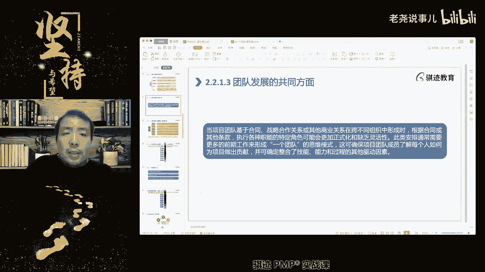
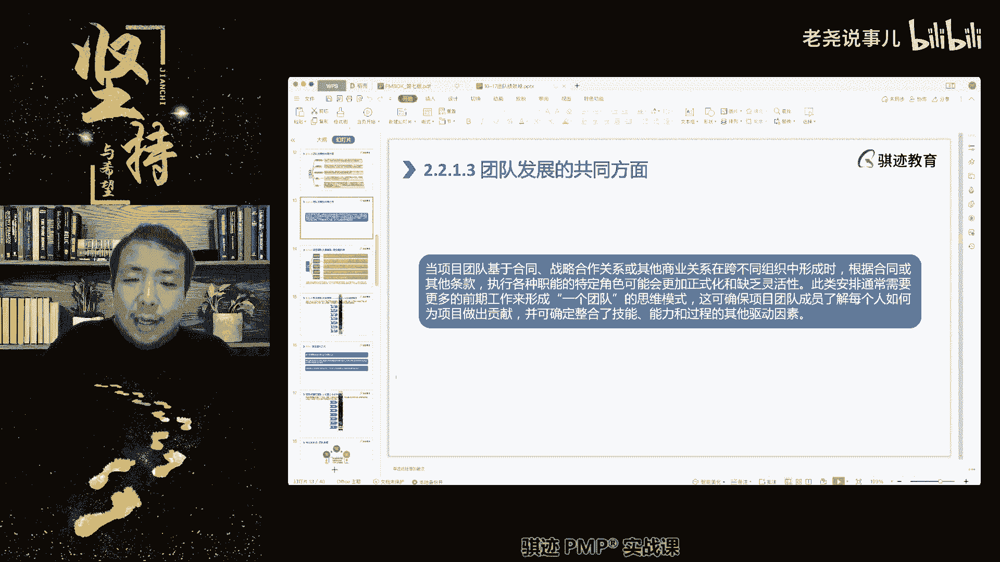
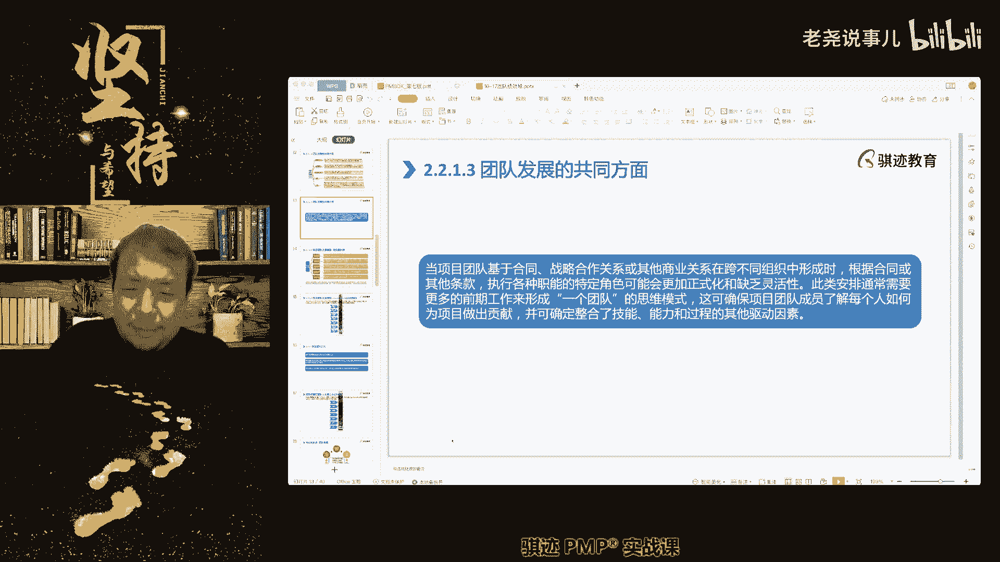
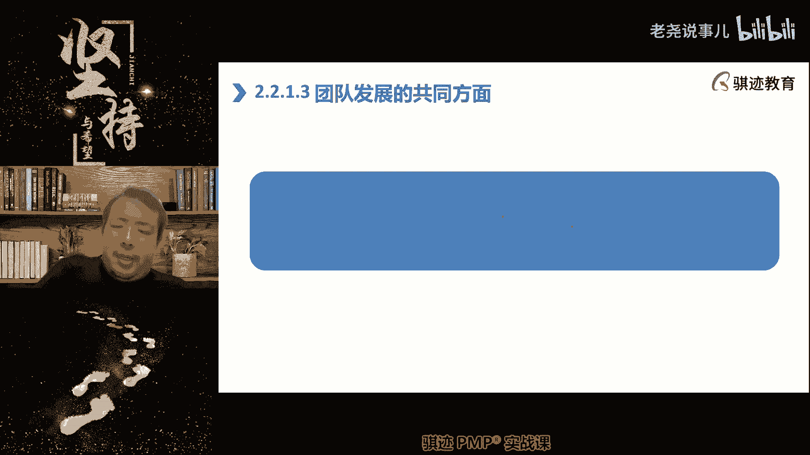
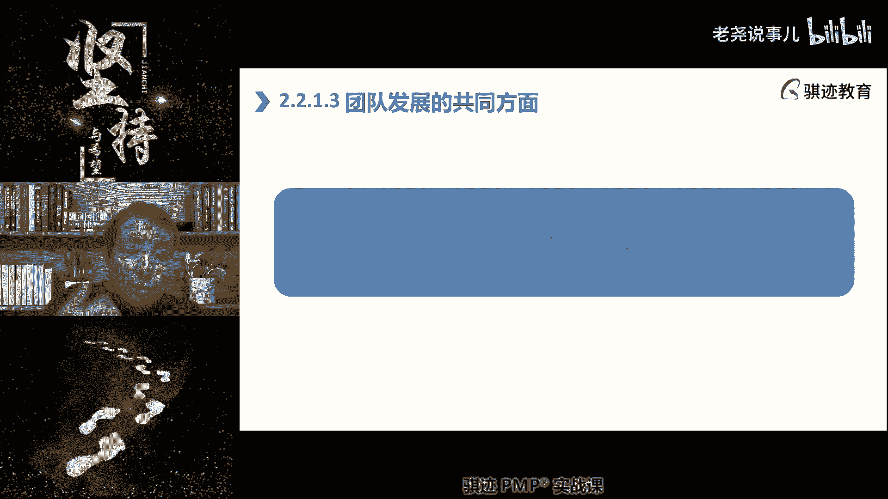
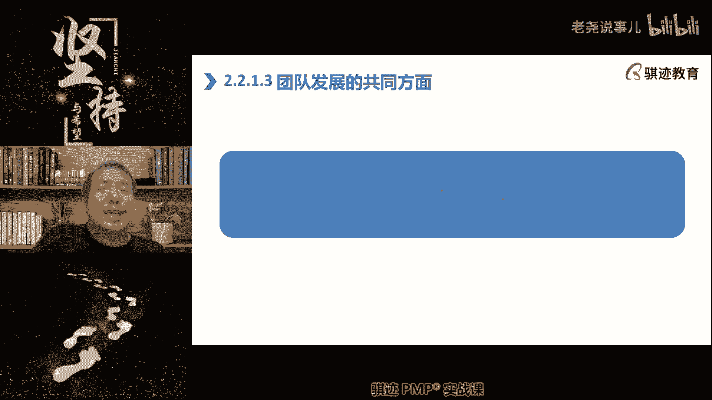
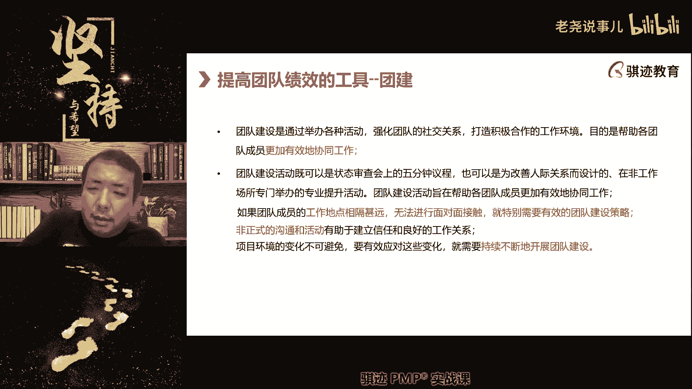
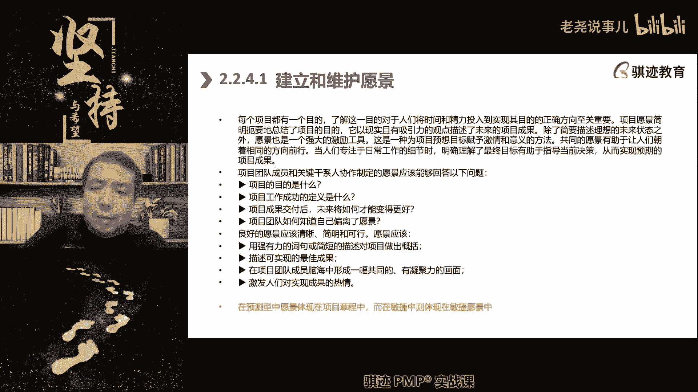

# （收费视频完整版分享）PMBOK第七版课程PMP考试报名认证培训精讲-零基础项目管理第七版教程最新版直播课回放视频免费课程资源-骐迹教育谢阳主讲 - P41：15-3团队绩效域上 - 老尧说事儿 - BV1ek4y1s71N

强调职责啊和角色，当然尽可能的忽略什么啊，我们的抬头啊，我们的身份啊，因为我们的身份是平等，那么我们要注重什么项目团队的运作，促使项目达成一致，所以我们在这个当中，会运用到一个很重要的工具。

我们后面也会讲啊，这个这一页我们漏掉了啊，我等会可以给大家看一下，那么我们会有一个很重要的工具，我们后面会用到啊，我给大家框出来，叫做项目团队章程啊，这是pm和第六版，第七版在团队建设当中的一个呃。

很重要的一点，也是符合现在的潮流，制度，就是制定一套规章制度，仅在项目团队内使用，来约束和规范团队行为，他称之为团队章程，这个章程是由项目经理牵头，团队共同参与这一套行为规范啊，这个东西非常重要啊。

非常重要，那么我们后面也会讲，但是我们这里就如果讲到，我们就先讲后面再讲一遍，因为考试啊经常会考到啊，这个社会也是一个考点，那么项目团队章程当中包括什么，我们所有人的行为规范。

我记得我的PPT后面是有的啊，那么我稍微讲的快一点啊，不细讲哪个点，那么它有什么好处啊，我们就有了这个章程之后呢，大家可以自觉地遵守章程，而不需再需要每时每刻都由项目经理鞭策，大家去做好行为规范啊。

那么会使得管理变得更加容易自觉啊，这是团队章程的一个好处，然后呢团队如果发生了冲突，内部意见不一致，也可以遵循团队当成自行解决来，是避免什么事情都要麻烦项目经理出面啊，你们可能如果管理小团队。

可能感觉不到，如果你们带过什么100个人以上的团队，你会发现什么，团队内部每天都会有各种各样的矛盾，如果我们不能制定出有效的团队章程，那么什么矛盾都得项目经理参与解决，项目经理。

无形之中就会变成团队管理方面的救火队员啊，你会不胜其烦，浪费你大量精力在内部的矛盾解决上，好所以有同学说老师敏捷有团队章程吗，敏捷也是可可以有的啊，不必然有，但是也是很推荐有的啊。

但是敏捷的目团队那是因为敏捷是自组织的嘛，所以我们自己怎么管理自己，我们可以自我约法三章，也可以自己去约定啊，项目经理，但是我我的个人认为是什么，就在我们的敏捷实践指南和那个叫什么，全部课程都都没有。

特别说明敏捷也没有没有，但是我们在实践当中，我认为敏捷也是可以鼓励大家去创建，敏捷的团队章程啊，因为这是跟我们的团队行为相关的啊，所以并不是说哪个哪个项目的生命周期特征，会使用啊，这个哪个不使用。

这个都是可以使用啊，所以这是团队，我们要注重团队发展的一些我们的团队运作，然后呢我们可以向整个团队指导，让每个人朝正确方向的发展，团队的项目的个体成员，也可以就特定任务提供指导啊。

就是指导这个意思是什么，就是说我们既可以给所有人提供指导帮助，也可以相互指导，教学相长也啊，就是这个意思可以相互帮助，相互指导成长，团队并不是所有的注意啊，有这样的概念，高效能的团队。

并不是在项目经理的驱动下去前进的，也不是只有项目经理是最聪明的人啊，相反高效能的团队不仅仅是预测性啊，预测敏捷都是这样，高效能的团队是相互可以帮助，相互可以指导，教学相长，相互扶持提高，在这样一个工程。

项目经理只是其中的一个组成功，而不是必然必须的啊，然后团队要求发展，就意味着每个人都要有所成长，这个成长不仅仅体现在能力的成长，技能的成长也体现在人的观念，人的理念和思维认知的成长啊，项目经理。

所以呃我用这个当然要偏理论点，就是说在实践工作当中，项目经理你可因为哎这个东西怎么说呢，我们再往前扩一点点啊，就像打牌一样，发什么牌你不能决定，但是打怎么去打牌是由你来决定对吧，项目经理可能很难决定啊。

很难完全决定你的团队成员的组成的素质，能力和性格等等方面，你不能完全决定对吧，很多时候你没得选，你发到你手上就是一副烂牌，那你只能尽可能把这幅烂牌打好对吧，但是项目经理管理团队和打牌不一样的。

是排自己不会变啊，不像那个周星驰牌的什么特异功能给搓牌啊，什么啊，什么黑桃三可以搓成红星S啊，没有这种对吧，但是团是可以让每个人从黑桃小三啊，小瘪三变成什么，每个人都是A4的，这就依靠成长。

人的能力不仅仅在项目中，人的能力不仅仅是专业技能的能力，还包括管理能力和思维处事能力，这种能力都是群可以通过项目的啊，所提供的成长环境，自我鞭策培训，相互之间的知识分享来共同成长，提高了啊。

因为我们传统意义而言，项目是一个周期比较长的过程，在这个过程当中，我们不仅仅依靠良，依靠良好的规划，更要依靠什么每个人的成长来让项目越做越好，项目是一个长期的过程，它不是一天两天的事情啊。

真敏捷对团团队要求是不是太高了，注意敏捷，有时候呢是相对于预测型团队，团队的起点要求高一点，他要求能够自组织，能够跨职能，就是一专多能的，就之前我们群里有同学问到了T型人才，就是一专多能，像个梯子一样。

又有宽度，又有深度对吧，但是敏捷团队也不是上来就是完全敏捷的，也可以是有一定基础的，这个肯定要比预测性要高那么一点点，然后在团队的主要负责人，敏捷项目经理ROMASTER的带领下。

通过快速的成长来体现出我们的能力，所以敏捷团队可能一开始也不一定是自组织的，但是在光master的带领下，在阿扎coach的带领下，可以慢慢的从手扶着你去怎么样管理，但慢慢撒手让你自己去走。

就像小朋友学车一样，先手扶着你骑一个连带两个辅助轮的自行车，然后呢可以撒手让小朋友骑带辅助轮自行车，然后再把辅助轮拆掉，最后自己能骑自行车是这样一个过程的，所以也不说上来就一定要怎么样，一定要怎么样啊。

当然是一上来就具具备所有的敏捷特征，自然是最好的，自然是极好的，但是这个过程啊，这个这个命运没有，很多情况下未免也太过理想啊，但是我们可以通过快速的成长，创造良好的成长环境。

来达成高效能团队的这样一个目标啊，好这一页的话我们的PPT有点问题，所以这一页的话我给大家分享一下桌面啊。

这个是小儿童的一个bug啊，我给大家分享一下桌面，我的桌面在哪里啊。

这好这里的PPT在这里啊。

你这个小额通有个bug，我们的P量是有的，然后我们讲团队方面，当团队这一下面是讲的是PMI，是在这个版当中加入了内部外部团队，因为很多时候在项目管理当中。

我们的团队可能是由内部人加外部人共同组成，甚至于说完全依赖外部的人，组织部之外的人来实现我们的项目的。

那么这个时候团队基于合同，战略关系和其他商业关系，在跨不同组织中形成的时候，要根据合同和其他条款执行各自职能，可能会更加正式化和缺乏灵活性对吧，就像雇佣兵一样，你出多少钱给你干多少活对吧。

此时此类安排需要，通常需要更多的前期工作，来形成一个团队的思维，所以如果你的团队当中，会含有组织之外的成分的话，那么你在项目初期更要树立一个概念，我们是一个团队。

我们是为了一个目标前进的这样一种洗脑模式，请记住啊，这样才能把工作做得好，然后确保每个人理解，他们不仅仅是为了合同干活，而是为了项目的一个目标来干活，然后从而整合资源，避免内外隔阂啊，这是这一页的意思。

在这一页当中呢。

在这一页当中，在这一页当中呢，我们的呃，我们的。

其实我们的PPT其实就讲到了这样一个意思，就是说当出现跨组织团队的时候。

应该怎么处理，那么还是一样形成团队共识和认知，我们是we are family，We are one team，好这就是这个意思啊，这一页这一个内容是以前没有的啊，这么被我们的小东西给吃掉。

好那么今天上课的最后一部分内容呢。

我们会介绍一系列我们的项目的管理的模型啊，会介绍一个dress the cir模型，这个是新的啊，这个是偏颇和第七版新的，我不知道他考不考，但是呢我们要讲一下，然后呢我们会讲一下传统的。

原来P必考的是塔科曼模型，但是他考的时候不一定说塔科曼啊，也会有版权问题，但他肯定会讲塔克曼模型，会讲一个dressed it团队绩效模型啊，然后呢我们结束今天的课程啊，先讲塔科模型。

注意塔科莫模型几乎每年都考，几乎每年都考啊，那么他塔科模模型可以不仅仅适用于项目管理，团队建设，它可以是是是泛用到一切职场当中的，人员之间的合作关系和程度啊，那么在职场当中，人与人都是怎么样的呢。

一开始是形成阶段，大家先因为某些工作环境因素，然后聚集到一起干活，看大家开始彼此了解对方的名字，地理团队地位啊，组织内的地位，能力背景等等这些东西啊，然后彼此相互之间开始了解，那么这个可能发生在开工会。

这时候发现大公会之前啊，那么这一阶段的形成阶段，我们在项目中建议是什么啊，早形成越好，所以当你开始组建团队的时候，你就开始进入行政阶段，因为行程阶段如果大家是初次认识，形成是后面这些阶段的必要基础。

没有相互都不认识，就后面都谈不上，对吧啊，那么接下来呢震荡阶段也是很难避免的，除了一些特殊情况，我们可能会讲啊，也是很难避免的，所以什么为什么叫战斗阶段，当人们为了一个共同的目的。

开始组合在一起干活的时候，因为人和人之间有差异对吧，就像一个哪怕是一个妈肚里生出来的双胞胎，他们的性格行为也会略有差异，所以何况是不同职场的人呢，所以大家在一起工作时间久了，必然会出现冲突。

矛盾和斗争啊，所以我们说有一句话是什么，有人的地方就有什么，我们有句话叫什么，有人的地方就有什么，不对，有人的地方就有江湖，诶嘿嘿嘿，这才是对，什么叫江湖啊，江湖是人的江湖啊。

啊当然也有另外一套说有人的地方就有什么，这个江湖啊，有人的地方就有人逃江湖，就是有人浑水摸鱼啊，有人的地方就有江湖，就有是非恩怨，打打杀项目不是打打杀杀对吧，但是项目中人多了，必然会有什么恩恩怨怨。

江湖就是恩恩怨怨，打打杀杀对吧，所以这个阶段江湖是人情世故事啊，你们可以试着扩展，但是我们还是要上课为主啊，所以人和人之间会产生矛盾，那么所以震荡阶段我们会提到后，在后面我们要进行团队建设的时候。

震荡阶段是团建的，要着重团建的一个重点阶段，就是当人们出现矛盾和冲突的时候，我们要更加注重运用团建的方式来消除矛盾啊，冲突不一定要消除，注意啊，这个概念也是很重要的，冲突不一定要消完全消除的。

因为我们什么江湖，如果一切风平浪静，往往下面就暗流涌动，人和人之间的冲突是永远会存在的，你刻意去压抑冲突，反而会导致更大的冲突乃至矛盾主义，但是矛盾是要解决的，因为什么矛盾是人与人之间的，而不是冲突。

于是事情与事情之间的啊，事情事件之间出现冲突，事件不一致是很正常，但是人与人之间呢，我们要一团和气啊，这就是矛盾和冲突啊，当然这个呢也讲的深了一点，大家明白这个意思就好啊，不可能完全消除冲突。

但是我们要尽可能消除矛盾啊，所以在这个阶段，我们要是运用多运用团建这样有益的工具啊，我们会不会讲什么团建啊，然后震荡阶段，那么经过了震荡阶段之后呢，如果我们管理的较好，或者是有一些特殊条件。

我们就可以或者较短的时间震荡进入下一阶段，那么称之为规范啊，那么塔可梦模型当中的这中间其实是有英文的，形成阶段叫做forming啊，塔克曼也很喜欢抄的造词，震荡呢叫storming呃。

呃规范呢啊叫做啊不不行啊，规规范叫forming嘛，陈述叫adjoining啊，解散叫做好，哎呀，我不好意思，下次查一次我能记，他都是带一个凹字的啊，这种风风该知道你的啊，得那么规范阶段呢啊规范阶段呢。

人与人之间呢开始寻找到工作的协调规律方式，人与人之间开始找到团队的定位，和相互之间打交道的方式，开始尝试合作，开始依据流程去做事情，记住啊，这是规范的一个特征，开始合作，开始依据流程去做事情啊。

开始共同面对一些挑战，开始集体运用集体智慧去解决一些问题啊，一切都是开始，大家呢有规矩了，规范阶段，顾名思义就是大家开始有规矩对吧，有句话叫什么潜规则也是一种规则，就怕没有规则对吧。

所以大家还是有一定的规则，无论这个规则公平与否，总是让事情的运转变得有规律，有秩序，这个就进入了规范阶段，但是他还不是高绩效生产力的最高阶段，那么最高阶段是什么，是成熟，在成熟阶段的团队高效运行。

这个高效运行要依赖什么，有个关键词，你们以后如果得分辨，塔克模型阶段里面有个关键词叫做什么，相互信任，团队基于相互信任进行高效的配合合作，能够产生协同效应啊，这些词都用的很高端，那么我给你们解释一下。

用很粗糙的话说，什么叫协同效应，所谓的协同效应就是什么，我知道你想做什么，你也知道我想做什么，我们可以心照不宣的彼此配合，不用过多的沟通和解释，我们就能理解彼此，这个叫做协同效应。

那么用一个比较中二的词汇，我每节都讲啊，这叫什么词汇啊，我给你们打，给你们讲，日本人很喜欢的叫做羁绊，当然默契相互信任，相互依赖，就是这样子，在基于高度信任的啊，信任或者高度信任的条件下。

高效的相互配合工作，这种情况下，团队能达到最高的效能啊，这种效能往往是之前几个阶段的，可能是数倍都不止啊，所以我们为什么要放在敏捷的项目当中啊，敏捷的项目当中，我们为什么要要什么，要怎么说呢。

要放权给团队，让他们自主，就是希望他们形成羁绊，哈哈啊，你们打日本我就看不懂，我只知道中文叫羁绊啊，希望他们形成默契信任，这种时候生产力是最高的，生产率最高的好，那么来了项目在经过一定时间的运转之后。

项目结束了项目，我们讲项目是有始有终的，那么在最后的阶段呢，我们团队就会各回各家，各找各妈啊，我们会进入最后一个叫解散吧解散，那么这就是一个项目当中，人与人之间的啊工作协作的模型，团队的协作。

能称之为塔克曼阶级或者塔克文的模型，塔克曼model啊，那么这个模型当中我们前面讲不是有特例吗，注意在什么情况下，我们可以不经历震荡，甚至不经历规范呢，如果很巧，你的团队成员都来自于上一个项目。

他们在上一个项目已经达到了成熟或者规范，那么他们在进入你这个项目之后，开始合作的时候呢，他们需不需要正当不需要，因为他和我们讲的是人与人之间的关系啊，更多的讲人与人之间关系，那么这个时候震荡可是被跳过。

甚至于规范也是可以被跳过的，直接进入成熟都是有可能的，如果大家是一个非常默契的团队啊，这个呢就让我想起一个以前的，看了一个这个国外的片子啊，你们看过叫做啊十啊。

11罗汉那个和12罗汉叫ocean eleven ocean tour，那个看过吧，就是11个小，就是呃呃那个那个11个各怀绝技的小偷，一起合伙去做一个小，做一个盗窃的一个买卖啊，盗窃的买卖。

那么他们在分开的时候呢，会说一句话，See you wanna，see you再见，下次见的时候就是再见的时候，大家平时都是各管各的生活，但是一旦有人召集起来呢，我们就会为了同一个目的。

然后迅速相互配合，不需要相互解释，我怎么和你配合，因为我们之间已经默契配合，我做出很了不起的事情啊，这个就是什么直接进入成熟阶段啊，你们可以去看一下那个电影很精彩啊，那个电影很精彩，商业片的挺精彩。

比较老的片子当然很有意思啊，所以这就解释什么人在分开之后，甚至可以在形成的直接进入城市里也是可以的，那么也可也可能什么塔可默默地也可能会倒退，就说你的团队本来呢是什么成熟的，相互之间很默契的。

但是因为一些原因呢，有几个团队成员呢离开了，叫做o ocean eleven，好像叫ocean twelve啊，叫做11罗汉，他就是中文翻译叫11罗汉，12罗汉好像它是三部曲，十一十二还是13。

反正你们看一下啊，你们看一下是个商业片子，很有意思，这个片子你从塔克拉模型的角度去看这片子，就可以发现人和人之间是怎么样进行磨合，达到默契，啊那我回来啊，那么项目在进入成熟阶段之后，因为某些原因。

可能有些人离开了团队，然后呢有一些新人加入了团队，然后新人和老人之间是没有默契，那么这个时候团队就有可能什么倒退，那么我们之前啊，我们的我们的PP的模拟题库里面也有啊，我们的考试里也遇到过。

如果项目团队倒退了怎么办，那么最好的办法是什么，在倒退的时候，你并不知道新人和老人之间的磨合，会怎么会发生什么样的化学反应，有可能会很糟糕对吧，但是我们只要让所有人，记住自己的工作使命和职责。

那么它的倒退程度是可以是有限的啊，我们把工作责任明确好了，你们相互之间是可人际关系是可以磨合，他对工作的影响就会减小，所以如果我们有新人加入，老人离开，那么我们不一定说一定会倒退到震荡。

我们也可以倒退到规范，然后依据规范来做事情，虽然我们相互之间谈不上什么配合，但是我们可以根据成熟的流程和明细，明确的责任划分来把工作做好也是可以的，倒退到行程重新来过，这个呢就显得什么东西啊，效率不差。

因为在形成和正当阶段，我们的生产力是较低的，在规范和成熟阶段，我们的生产力是较高的，所以对于项目经理来说，人员调整可能是没有办法避免，比如说他去跳槽了啊，他被公司裁员裁掉了对吧，那么怎么办呢。

我作为项目经理，我又不能决定这一切对吧，我又不能说你要跳槽了，我给你开三倍工资，你不要跳，项目经理没这个权利对吧啊，天要下雨，娘要下雨对吧，那怎么办，我们不是运动团建啊，团建当然是要运动。

团建是一个方面，另外一个方面是最主要是什么，定位好，每人都定义好工作流程和每个人的工作职责，那么无论谁来接手这个工作，不至于混乱，然后进入倒退回震荡，乃至形成重新开始，不一定是团建的啊。

虽然团建大部分时候都是一个好答案，但不一定都是团建的啊，我这里再强调一下，PP考试没有绝对一定正确的答案，没有绝对一定承认，要适用场景好，最后我们再讲，最后我们再讲一个啊。

dresser a civi团队绩效模型啊，啊alan dresser和DAVIDSAI开发了团队教程，涵盖了七部，第一到第四步，建立团队的是建立项目团队一个过程，第五步的技术涵盖了可持续性和绩效。

这个呢大家看一看概念就行了啊，这是偏颇和第七版的附录里面提到的一个模型，但是这个模型是第一次在pp里提到，但是为了防止考试考到，但是可能性不大啊，这个模型可能性不大，所以大家稍微了解一下。

我们只花很少的时间去看就可以了，PNP应该没人拿满分吧，嗯我觉得是最终我去考研比例都能拿满分，因为PNP经常会我们我们啊相构我们讲一下，十点钟下课啊，我们讲个事情偏僻，经常当中经常会为了一道题目。

一个培训机构当中的若干个讲师都会有意见，有时候甚至不同的培训机构之间，对于某一道模拟题啊，或者历年真题的正确答案都会有分歧和冲动，甚至会炒炸开锅倒是有可能的，以前啊以前都是有可能正常，因为理念不同啊。

看的角度不同，横看成岭侧成峰啊，所以你会有不同角度，而且不同人有呃，所以以前的考试会有个什么什么东西啊，这是我一直诟病的叫做我不太喜欢的，我不赞成的那一派啊，咋不说人家一定不对。

我以前有一种考试叫做呃呃，我经常说的叫做偏博客，原教旨主义，就是说一切题目的答案，以偏博可那本书项目管理的指南，这本书为最高依据和唯一解答标准，所有的题目都要到上面去套。

以套上去的最接近的东西为最终答案，就相当于这个是个唯一的圣经绝对正确的解，这叫原教旨主义，偏，我称之为偏颇和原教旨主义，那么另外有一些奖是相对比较少的，像我这种呢是实践实用派，我我我认为啊不是我们啊。

我至少我认为哪个答案在实际工作中，最能解决问题，又不违背理论的是最简单啊，那么目前来看呢，呃我这一派好像是受更多的受到了偏爱的支持，因为偏僻现在考试的特点就是什么，淡化纯理论的题目。

更强调实践运用和解决实际问题，在不违背理论情况下解决实际问题，所以更偏向于现在的出题风格和出题思路，更偏向于我这一版啊，就是说现在的很多的PP的考试的题目，已经很难直接从书上找到正确答案。

PMBOK原教旨主义这个呢现在已经日渐衰落，因为你找不到正确答案，你就没办法说一定说依据出来，而且PMI的官方也也说了这样一件事情，是我们的参考书有十本，不再是PMBOK，PMBOK是主体。

大部分的知识主体呢还是在PMBOK上，但是呢考试不再仅仅局限于PM，它有十本参考书里边的东西都有可能会被参考，这个东西呢就说明了一点，打破了唯偏不可的申论啊，好那么这个就不提了。

那么所以我们回来我们要广知识，要稍微广博一点，所以呃这在篇博客的附录上提到的，这样一个团队计划模型，那就放在今天上课的，今天这个上半啊团队绩效的上半段的最后一个，我来讲一下啊。

这是dressed ascii的绩效模型，那么绩效模型的第一步是什么，确定方向，什么叫绩效模型啊，就是我们如何建立起这个团队绩效和测量，控制绩效和持续的推进绩效的这样一个，怎么一步一步做的。

相当于指南啊，第一步是确定方向，确定方向回答了，为什么这个问题在这一阶段当中，团队会了解团队的使命，所以我们要想团队能够达到预期的绩效，第一件事就要让他明白什么东西啊，我们这个项目的目的是干什么。

你们为什么要这么做啊，啊讲到这个问题呢，呃我们今天会稍微抄一点啊，我就不禁想起一个东西啊，这是我看了很多网上的up主发的视频里面，然后问题就是为什么资本主义时代啊，他的战斗力会碾压封建时代的军队。

哪怕两支军队使用接近或者差不多的武器，装备和训练水平，民族主义时代的军队会碾压封建时代的军队，他会明他有件事情，我们为什么而战，当人们明白了为什么而战的时候，那么它所爆发出来的士气和战斗力。

是足以碾压旧时代的军队，哪怕他的装备物理装备水平差不多，也是一样的，因为纪律会决定执行力，执行力会决定战场效果，战场效果会产生马太效应，会产生一方对一方的碾压，所以有信仰还不是。

那么不是这个这个最关键关键是要为何而战，那么所以我们类比到项目当中，我们要项目团队，要让第一步，就要让项目团队知道我们的项目是为何而战，合格哪个目标而战，是不是以后的P有同学说。

是不是以后的P考试更难了，不是啊，因为对你们来说其实就不存在更大部分，因为自从去年最后一次运用偏博客的新啊，老老考纲之后，新考纲的题目难度是一样的，不会存在更难和更简单，你们已经是更难了啊。

新考纲确实比老考纲对于实践的要求更高一点，但是难度我觉得跟老考纲差不太多，因为通过率我们看没有明显的变化啊，更接近实践，所以工作经验更丰富的同学呢更有优势一些，对确定方向就是一种愿景，都差不多。

这意思啊，各种解释，那么第二步是什么，建立信任，建立信任回答的是谁的问题，就是这一阶段会阐述谁会加入团队，以及每个人带来什么样的能力，那么还可以包括未加入团队，但对项目有影响的关键干线的信息，建立信任。

就告诉我们每个人能干什么，我能在你身上看到哪一点，我们是可以相信的，这是建立信，因为我们在团队当中就像一支军队一样，要各司其职啊，要各司其职，所以这是第二步，建立信任，要让别人信任你的能力。

项目经理的能力是什么，管理领导能力，团队的工程师是什么能力啊，专业技术能力啊，第三步澄清目标，澄清目标，回到了呃，回到了什呃呃，这一阶段是回答了什么，怎么这个问题诶，这个好像没贴没写，书上也没写清楚。

澄清目标的意思是什么，我们要根据高层次的那个方向，接下去要告诉团队具体要做哪些，它的成功不是具体要做哪些结果出来啊，那么这个时候呢，我们的团队绩效的目标和绩效的实现的规划呢，就开始细化，第三步是目标。

相当于是目标的细化啊，目标的细化，第四步是什么承诺，在这一阶段呢，我们将目标细化之后，要让团队能够接受我们的这个计划安排，我们对于高层次的愿景，高层次的项目目标的这个细化能否实现，如何实现。

又让团队参与进来，并得到他们的肯定和承诺，让他们认为他们可以实现这一步是非常重要的，那么这一步其实也关系到项目经理，有没有足够的实践落地能力啊，所以现在的项目项目经理越来越不好带，就是以前的项目呢。

你纯纯粹管一个流程啊，当年在pm和第五版之前，PMI的对项目进行设定，就是你不需要专业的知识，你只要需要项目管理能力，就可以把项目管好，现在的项目经理呢又要当爹，又要当妈。

就说你要把这个事情能够落实下来，有能够把这个事情落实下来的能力，还要让团队承诺和你一起承诺这个东西，我能落实这个事情，我能按时完成这个事情，我能做好，这是第四步，承诺。

只有获得承诺的计划才是有意义的计划，如果一个计划他只规划，但是不承诺，那么这个计划是价值不大，那反过来说，我们之前制定进度的时候也说过是吧，为什么进度计划不能频繁的修改，是因为进度计划相当于是项目经理。

对团队和对各个干血的一种承诺，如果你这个人三天两头改承诺，你这个人就是言而无信对吧，那么第五步就是实施啊，就是实施高层次的计划分解会更详细的程度，就是详细的待办事项，团队开始努力谈点就具体干活。

第六步就是高绩效团队通过啊，通过我们的什么学习曲线啊，我们后面会讲到一个叫学习曲线啊，直播也讲过，学习曲线就是我们从一开始的不熟练，有矛盾，不默契的低效生产，慢慢慢慢过渡到达到通过不断的改进。

最终和团建啊和磨合，最终达到一个高绩效的生产，和不断提效的绩效生当然最好啊，但是很多项目情况下会达到一个瓶颈，然后进入一个高而稳定的一种高绩效状态，那么在这种状态上，我们可的绩效就可以达到很高的水平。

可以很好的协作，无需太多的监督，团队开始形成协同效应，开始产生羁绊，第七步就像塔克曼模型一样的，第七步的时候呢，我们完成了一个阶段或者团队产生了调整，那么我从新开始衡量团队能够达到的绩效，还是从头开始。

所以呃dress的CVT的团队绩效模型，其实是结合了项目管理的具体工作部，世界和人与人之间的关系呢，他可能模型的一种柔和的模型，所以这个七步其实就是我们从项目，团队管理角度看。

项目的绩效是如何一步一步去规划实现的，这样一个过程以及不断提高的过程，燃起图对了，你说表现出这个改善过程就是用燃气锅啊，学的挺好啊啊顺便说一句，燃气炉燃气图并不进行敏捷当中，用，一次性当中也能用。

对吧好，这是我们的团队发展的一个模型啊，那么这个模型呢大家知道一下啊，这个七步大家知道一下就行了，因为这是屏幕和第七版新增的，你们这次考试不一定会考到，但是塔科马模型一定会考到。

那么在团队这个团队绩效率，这个版本之子，在这个领域里面必然会考到了三块东西，塔克曼马斯洛赫兹伯格好，后面两个我们在下一堂课，下周二的课上肯定会讲啊，塔克曼啊，马斯洛赫兹伯格。

这三个三巨头三个模型是必然会考到的啊，因为这个三个模型是，相当于是人力资源管理的啊，重要的三个支柱内容啊，人怎么管理的啊，三个方面都是由人管理，这方面都是用这些基础理论去支撑去管理的。

那么我们最后再讲一讲，团队管理和范进程管理的不同在哪里，这种人力资源管理，团队管理，本质上就是人力资源管理的一个子集对吧，项目中的人力资源管理，和公司的人力资源管理其实是一样的，它是一种唯心的管理。

什么叫唯心啊，是以人的主观管理为主，没有必然的客观规律和标准，所以理论只能告诉你大致的一般规律，但是不同的项目，它的人员团队的形成的这种特征，和它能够达到绩效投资路径，是都是可能是截然不同。

而且他没有绝对的好与坏的绝对标准，他的管理是唯心，讲义没有马斯洛恩，我看看啊，没有码数了吗。

哦马斯洛在后面的工具，那么下次我给给大家加一步，马斯洛也是得考的啊，哎诶我记得我的那个有可能是漏掉了，可能是我们在制定制作PPT的时候漏的。

马斯我是肯定得加的，如果没有的话，我可以帮你们加进去的啊，团队章程也是有的，看到吧，这是必然要讲，因为考试一定得有没有对吧，没有，我下次加一节，我的PPT里面加一个啊啊你们网上可以搜一下。

其实马斯洛也这个理论也不难理解啊，但是这个东西考试的时候啊，经常就是经常马斯洛，赫兹伯格和那个那个那个塔克曼是里约经常考，这不是必然考的，一定得会好吧好，所以你们，所以我们讲。

为什么团队管理这个东西要讲那么多，因为一项目管理绕不开团队的建设，二这个东西又是唯心的，三这个东西是要经过一个啊不太完全可控，没有必然规律的一个过程，才能达到你想要的结果，这个职纪效率。

所以项目经理要在这个方面花更大的精力去，尽管，所以我讲团队的绩效管理的好坏，是体现项目经理能力的几个方面之一啊，项目经理体现基本功的是什么，做进度计划，进度计划是最得体现项目经理的基本功。

你能把事情安排的井井有条的体现就是什么，进度计划做得好，并且能够实施落地，大家认同有可信性，项目经理的管理的体现，他的水平呢是能够带得好团队，大家服你，项目经理真正体现他更高层次的高层次水准的。

我们讲不是水平，是水准的是什么，我们后面会讲的不确定性，积压有风险，因为项目是与风险相伴随产生的，项目就是用来克服不确定性的，所以怎么克服，是体现项目经理高水准的一个体现啊，管理团队啊。

制定计划和克服风险，是项目经理能力的很重要的几块的体现，而且是别人看得见啊，好那么这时我们就是我们今天也不科普，讲太多了啊，那么呃讲到这里，我们完成了今天上课的所有内容。

那么大家呢后面的内容呢可以预习一下，后面内容还有很多，而且重点内容还有很多，后面精彩不断，冲突管理也是版本之子啊，团队的那个不是把前几个版本就开始一直考，冲突管理，是我们这个版本非常重视考的一个东西啊。

冲突冲突是怎么管的啊，人际关系是怎么提高的啊，啊如何去进做培训怎么用，呃，运用马斯洛，运用赫兹伯格的理论来进行团队的激励，奖励和团队的促进提高等等，这些东西都是考试经常会考的内容啊。

所以请大家务必要掌握啊，掌握了版本之子，那么才能够提高通过率，好吧对，周末回家去，大家好好预复习和预习一下，好吧好，那么今天就不多说了，我们今天的课就上到这里，那么我们下周再见啊。

我们希望我下周手更好一点啊，也希望大家能够后面学习效果越来越好啊，呃考试能够顺利通过啊，好那么今天我们课就上到这里。

