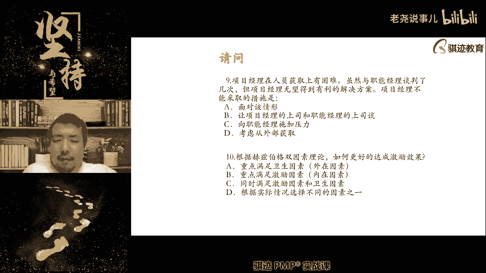
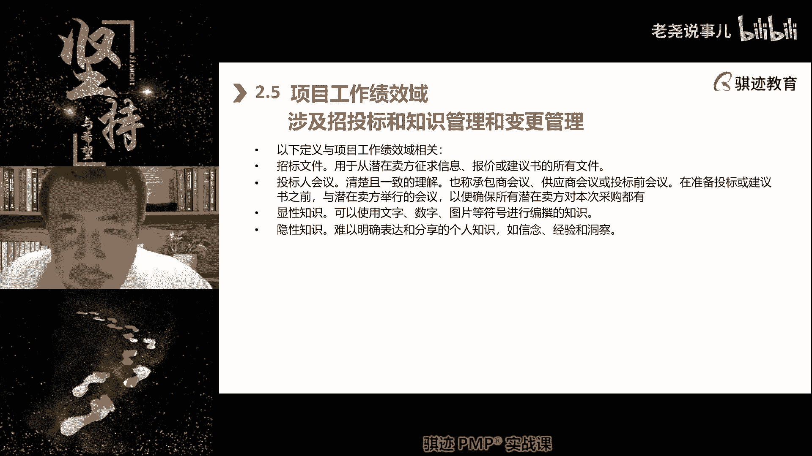

# （收费视频完整版分享）PMBOK第七版课程PMP考试报名认证培训精讲-零基础项目管理第七版教程最新版直播课回放视频免费课程资源-骐迹教育谢阳主讲 - P45：17-1项目工作绩效域交付绩效域 - 老尧说事儿 - BV1ek4y1s71N

好同学们来了，同学们来了吗，嗯可以进了可以进来，Hello，同学们都来了，是吧，今天技术上一堆小问题啊，不要紧不要紧不要紧不要紧不要紧，好大家都抓紧啊，哈喽大家晚上好，抓紧了啊。

来到直播间的大家签到一下啊，来到直播间的签到一下，有声音吗，有声音的，有声音的，同学们啊，稍等啊，那么我们再等12分钟好吧，今天有点波折，有啊有啊有啊有啊啊，很多同学已经进来了，再等12分钟好。

那么今天我们会讲两个不太重要的技巧语啊，我们前面讲了版本之子，今天讲的两个东西呢，相当于是原来的一部分内容的一个一个拼接啊，一个拼接，但是那工作绩效域和交付绩效预，在实践工作当中其实是还是很有意义的啊。

但是考试呢可能考的相对会比较少，而且是新增加的一个分类吧，就是原来体系的一部分分类的不同，所以今天的内容会比较嗯松散一些，今天内容会比较松散一些啊，好那么即将开始啊，我看一下啊，赢不了，同学来签到了。

好在这一分钟，那好我们今天第一部分呢，先讲一下我们的上节课的练习题啊，我们的资源管理的相关的练习题，我们先做一下好吧，好来的同学签个到啊，好，好我们看今天上课啊，好我们开始上课了啊，好。

那么我们第一部分先做一下上节课上课的内容，一些练习题啊，因为上节课主要讲的是团队的绩效语，所以我就直接拿了以前的，我们的团队绩效的一些练习题啊，有些同学怎么做啊，那我就省点力对吧，大家知道手不太方便。

打字有点不太方便啊，好那么先做第一道，项目经理，发现绩效偏低的缘故在于成员相互推诿，对工作接口非常模糊，为了解决此问题，可以采取什么技术，A组织分解结构，B组织理论C责任分配矩阵。

D组织结构图应该选哪个，好很好啊，那么我们抓紧点时间，因为今天的好，大部分同学都做对了，第一题选C没问题，因为关键呃这这道题的关键在哪里呀，工作的接口非常模糊，所以我们的具体工作的责任设定不太明确。

所以具体工作责任设定是在哪一个工具里面，实现的，是在责任分配矩阵IM，它的典型的表现形式是RACI举证对吧，上课讲过对吧，所以这个记住的话，这道题没了，如果说我们说，我如果说团队对于项目内的角色定位。

认知非常模糊，那就不是选这个了啊，项目内，所以同样题目改几个字，可能有如果项目内的角色定位非常模糊，那么要看什么东西啊，要看啊，要看做我们的组织结构图了啊，O b s，第二题，为了确保项目成功完成。

有足够资源可用，应该编制哪个计划，第二道题就很简单了吧，应该编制哪个计划，直接公平，你告诉我，第二道题应该如果要有资源可用，应该要有足够的资源可用，应该哪个计划来直接打在公屏上，好非常好对。

第二条选C对吧，很简单啊啊第二道题选C啊，资源管理计划，就是说我们现在其实偏僻，考试当中已经不怎么考某某管理计划，但是有几个计划还是有用的，比如说采购管理计划，资源管理计划等等还是有用的啊，好第三题。

一个跨国项目呢由高层经理呃做管理，由于项目团队成员分散的个例，面对最大的挑战是什么，有同学问这个题什么时候选D啊，什么时候选资源配备计划啊，资源配备计划是偏包括第五版的一个说法。

这是资源管理计划里面的一个子计划，现在已经不太不怎么提，但都拿出来提啊，我不怎么拿出来提的，所以OK不用不用care，所以我上课也不跟你们说，知道吧，第三题，好我们抓紧点时间啊。

第三题里面我们讲团队分散在各处，所以啊他的主要第一大挑战是沟通，第二大挑战是文化啊，第一大挑战是沟通制，分布式团队最大的挑战还是沟通，沟通之下它会受到文化影响啊，受到文化，因为文化不是必然会的。

比如说我们是跨国集团，但是我们可能文化背景是相似的，也是有可能的，对吧啊，但是沟通只要在不同的地域，它是肯定会存在沟通困难啊，不同程度的沟通困难，所以第三道题啊，我们选择题会更好一些啊。

所以当这个题目呢就像很多P考试一样，就像看他暗示你什么，比如这道题目，它暗示你什么，由于团队分散在各处，人分散了，沟通是第一个难的地方啊，其次是人的文化不同，然后呢沟通当中有一个小的方面。

就是什么时差啊，时差，好那么我们抓紧点时间啊，第四题，项目团队编写的全部作业指导书，完成流程和制度的建设，此时团队处于什么状态，第四题稍等啊，24题大部分同学都选的B对的规范啊，第第四题选择规范啊。

那么为什么呢，因为我们有了流程，但是这里没有什么讲，我们有充分的相互信任，配合默契，所以他只是说到了一个规范运作的阶段啊，但是没有形成默契，呃有同学说老师之前的练习题当中选的是文化，不是沟通。

那么要看它的题目强调什么，第三道题目，因为它强调的是人员分散，所以沟通会是最大的挑战，如果他强调的是来自不同的国家背景，有不同的教育，那么文化成为交通功能，你就要看，就要看题目里给你强调什么东西啊。

如果他没有特别强调，那么同学请记住，如果没有特别强调，如果没有特别强调，应该是选择是沟通啊，字眼有差别啊，同学们，我记得字眼有什么，如果说你们找到那道题目给我看一下啊，我默认你们记住。

因为pp当中我们的考试，我们考试当中沟通是项目管理的一个知识领域，所以我们如果都能选的话，其实应该按照知识领域来选会比较好啊，第一章的练习题里面，因为强调了什么，人员来源的多样化和文化背景的不同。

它强调的是那一点，所以这个题目里面呢怎么说呢，他如果特别强调来自于不同国家，那么它的文化会影响，取决于题目强调什么东西啊，OK这个其实不是老师故意这么去强行解释啊，因为pp考试有时候就是这样。

要看题屏幕，他想要考你什么东西，你得回答，我说过pp考试很少有绝对正确的来，好第五题，两个团队成员之间有冲突，来到项目经理，其中一个解释他他的意思理由，另外团队成绩是，我知道你从来不会听我的意见。

既然这样，你就按照他的意思好了，我们可以回去工作了，这是何种冲突解决技术啊，这个有点点难啊，想想仔细想一想啊，嗯好，第五题仔细想想到底是哪一种啊，仔细想想，快点啊，好第五题的正确答案应该是A啊。

为什么是A，我跟你说啊，这个场景当中，你要看冲突的双方是两个团队成员，他们是平等的，是不是，然后一方说了他的理由，另一方他接受没有接受对方的话，其实他没有接受他的话，也就是说你从来不听我的。

我也懒得跟你解释，我不想争吵，你愿意听他就听他，但是我不会接受，但我不愿意跟他争吵，这是一种撤退，回避，并没有解决问题，也没有解决关系，也没有解决矛盾的冲突的紧张关系，也没有根本性解决问题。

只是我不愿意继续争吵了，并不代表着另一位团队成员，向那位解释的团队成员退让，如果他解释是退让呢，就是什么，缓和包容，但是没有，所以它是撤退回避，有没有各退一步啊，没有，所以也不是妥协。

C没有东西没有迎合啊，没有迎合的啊，敌强制强迫，就是说两位团队生而平等，也没有强阳弱，所以如果我们从排除法，也可以把BCD都排除掉，所以第五道题选A啊，选A，god bless me啊，嗯第六题。

你正在着手一个新项目的规划，团队成员来自于当前进行的项目，为了了解这些团队成员，什么时候可以配置到你的项目上，你应该咨询谁啊，这个呢也要思考一下啊，注意偏偏里边有一些题目。

可能并不是直接从理论上可以知道的，可能与实践经验需要有交集啊，要理论结合实践经验啊，像这道就是有那么一点点，要结合理论研究和实践经验，因为我上课没有办法，把所有的实践场景都叫定了啊，我们上课时间有限。

好第六题应该选什么，大部分同学选了B和C，但这道题目啊选项最多的B是错的，应该选择C啊，第一个题应该选择C，为什么选择C啊，因为我们首先第一点讲了，人有有，基本上大部分情况下是不能决定自己做什么。

所以我们要决定我们上课举个例子，是要找他的职能经理，对不对，但是这里没有职能经理，那么我们说去找项目经理要人是可以的，对不对，但是这里出现了两个选项，B和C之，一个是找项目经理，一个找资源管理计划。

那么请注意，当有文件和有人的时候，找管资源管理文件要比人更专业，因为在一些大型项目当中，项目经理不一定管到具体的人的，什么时候可以用什么东西，他不一定管那么细的大型项目，不一定管那么闲啊。

小伟先带一个团队，几十上百人，可能我只是分配各个团队自己去做什么东西，我也不知道具体的哪一个人啊，具体做什么，做到什么时候，我也不一定知道，我只是把工作安排下去，我要做总体把控。

所以这个时候C比B更加精确科学，因为资源管理计划当中，有人员的使用方案和使用安排是吧，所以C会更好一些，喜欢的明白了B和C都是可以的，如果没有C也可以选B，但B和C放在一起，C比B会更好一点。

要相信制度方案胜过相信任，啊第七题啊，第七题，人们在评价外国人行为的时候，总是以他们本国文化为标准，总是认为本国文化优于他国文化，以下哪个是哪个术语反映的这种倾向啊，这是一道超纲题。

哈哈PPT有时候会出一些莫名其妙的超纲题，啊啊以前会有些你们呢呃如果8月份去考试，可能也会有超纲题，那么这种倾向叫什么啊，那么这个呢给大家看一下啊，遇到这种题目，我只是拿这个题目举个例子。

遇到这种题目不要慌，这种题目呢大概率是不计分的，就是说你答错不扣你分，答对也不加你们啊，所以考试如果看到这种莫名其妙的，我们理论家编都没有讲过的，那么不要紧，他只是抽出来啊，可能啊拓宽一下东西啊。

拓宽一下也是事业，所以这种倾向本国文化，由于他国文化这种倾向呢叫做民族优越感啊，我们的文化是最好的，这叫什名字啊，中国人是最优秀的，这是民族优越感，中国人应该是最有呃是一个生存优先权的对吧。

某个长着小胡子的人说什么，亚利安民族是最优秀的民族对吧，这是民族乐干，这个世界上只能有雅利安人才能啊，才能生存下去啊，其他的民族都劣的民族应该被消灭，这就是民族主义，民族主义指的是什么。

就是本民族应该具有优先的生存，发展空间等等权利，优先考虑本民族的啊，这叫民族主义，信仰主义呢就是指信仰什么东西，然后群体中音乐这个阶段我就不太知道啊，反正跟你们说一下啊。

当然这两个跟我们的上课都没啥关系啊，好第八题，项目经理通知，作为委托人，你有一个影响不大的冲突无法解决，你建议采取哪种冲突的解决方案，第二题，第五题还为什么没有理解，这这是我经常上课讲。

用到这道题就跟人家解释啊，这就像另外一个团队成员啊，你们先先看第八题，想一想第五题，这个就相当于什么，有一个女生跟我有，有一个女生或者是你的老婆或者女朋友，你的女朋友跟你说，我不生你气啊，我不生气。

我没有生气，他是不是生气吗，他的言语说他没有生气，他的言语说你就按照他意思做好了，他真的愿意按照他的意思，这只是气话而已啊，同学们要提高情商啊，因为他前面铺垫的一句话，你从来不会听我的，你就听他的好来。

但是我潜台词我不愿意接受他的意见，但是我也不愿意争吵，所以这是回避对吧，明白了吧，提高情商啊，第八题应该选什么，ABCD都有，第八题应该选择D，你们没想到吧，很多人为什么。

因为这里就项目经理将这个冲突的解决人，委托给了你，所以我们上课讲过，我们在有可能的情况下，优先先使用合作对吧，解决问题，合作这样的方式啊，对吧，所以解决问题和合作这两种模式是优先考虑的。

那么有些同学说无法解决，那么这个无法解决水污染，项目经理无法解决，所以他委托给你了，你优先考虑的仍然是合作，解决，明白吧，可能你作为比如说发钱公司高层项目经理，权限不够。

所以交给你的你权限够你的你地位高，权权力高，影响力大，你仍然选择使用合作是最好的，明白了，所以第八题选择题是最好的啊，第九题，项目经理在人员获得上有困难，虽然与职能经理谈判了数次。

但是项目经理无望获得有利的解决方案，那么项目经理不能采取什么措施啊，注意啊，不能采取什么措施，考试的时候像不能这种词要划出来，避免自己看着看着题目做多了，你们以后在做题目，用纸质做题目的时候呃。

考试时做什么呢，就是说你们可以在卷子上会画圈的，你们为了防止自己看错或者是自己改错什么，像这种不能啊，首先啊接下来啊，不应该啊等等这些人啊，不可以啊等等这些啊定义词，那么你可以圈一下，就告诉自己。

这是这这个词，不要漏看了啊，能和不能是2万，就两个方向的选对吧，好第九题应该选什么，不同民族文化未必完全不同，有些民族民族不同，但是文化很接近，也有的呀，未必啊，所以这个优先考虑沟通。

除非他特别强调来自不同民族认知有差异，信仰不一样，那么你考虑个跨，好第九题，选择什么，第九题刚才吓我一跳好，我看刚才差点以为你们所有人全错掉啊，差点第九题选B啊，我刚才一看几乎没有人选B啊，吓我一跳。

第九题选B，为什么选B啊，项目经理我们讲啊，这个是一个比较接近实践的题目，项目经理拿不到足够的人，那怎么办，A面对该情况可不可以啊，可以我没有办法拿不到人，就是拿不到，那么怎么面对啊。

本来应该十个人干活的，我现在只有五个人，那么我们慢慢干了，人不源不资源不足，所以我们慢慢干活，他就是面对，对吧啊，然后我们可以想办法找替代，这也是面对对吧，资源不足是一个现实的，没办法解决的事情。

可以面对对吧，那么C能不能向职能经理施加压力，当然可以，你不给我，我就死皮赖脸的缠着你要你给我人，这也是一种施加压力，对吧啊，或者把他老婆孩子绑了，然后跟他说，你给不给人，不给人，把你老婆孩子给毙了。

哈哈开玩笑啊，就是这个意思，可以用多种方法给职能经理施加压力，来获取资源对吧，第一考虑不可以可不可以考虑从外部科学，当然可以了对吧，那么不能的，只有一种就是项目经理的上司和职能上，这种是不能。

为什么我上课可能没有特别强调过，但是你们要记住一点，获取资源，并根据资源现状来安排项目工作，是项目经理的职，他不应该被上交到上司去，除非因为无法获取资源，导致项目根本无法开展，才会考虑升级到上司对吧。

在项目中，项目经理丧失什么是发钱对吧，我们讲过只有在什么啊，事关项目生死存亡了，项目没钱了，项目遇到重大的挑战了，然后要找发钱，其他情况下一般不涨，现在只是无望获得有利解决方案，解决方案是有的。

只是不够有利啊，对我来说不够有利，但是你还是能够想办法克服的，对不对，所以这种情况下当然不会考虑选疲劳对吧，只有什么情况下会选B啊，项目经理和职能经理谈判的数字，发现更或当前职能经理所承诺的资源。

根本无法启动和执行项目，那么这个时候你要上交哦，你的发钱，然后发钱去谈啊，明白了这个有个细节要注意啊，所以第九题选B好，第十题，根据赫兹伯格双因素理论，如何更好地达成激励效果。

啊第十题大部分同学都选对了，在可能的情况下，同时满足内因即激励因素，外因保健卫生因素能够达到最好的激励效果，这是赫兹伯格因素，赫兹伯格双因素里边的一个一个一个，一个一个一个核心理念嘛对吧。

所以应该选C啊，所以第十题应该选C吧，这个没有问题吧，好那么这是我们上节课讲的内容啊，第九题理解不了，那么第九题再讲一讲哎，同学们第九题的理来讲一讲，强调一个你们只要记住一个东西。

第九题要记住一个东西就是什么，资源的获取和使用是项目经理的职责，不应该被上升级上报到上级去解决，这个你能明白吧，你拿不到资源是你的本事问题，我们说的在说的在那个点，你拿不到资源是你的本事，人脉问题。

你上找上级是一个丢脸和不称职的表现，OK作为项目经理，千方百计的拿到项目所需要的资源，本身就是你的职责，所以找上级需要资源是一种无能的表现，对于一名合格的项目经理来说好，好。

那么我们，接下去开始我们今天的课程啊，第十题是同时满足呀，第十题选C呀，同时满足，因为我我难道选错了吗。

选C呀，同时满足呀，赫兹伯格的双元素讲的是要同时满足，没有重点，我上课没有说过重点满足哪个啊，我没有说过，我说的是内因外因要平衡对吧啊，就像像那个什么马云说的是吧，干活我怎么才能干得好啊，干得开心。

又拿着钱，拿够活就干得好对吧，这就是内因和外因合作，洛克说的无非就是内因和外因要同时具备啊，没有说哪个是重点啊，好好接下来开始嗯，D是比较不恰当吗，是的，反正考到赫兹伯格，你们反正记住。

同时满足内在的呃激励因素和外的保健因素，那么内在因素主要是什么，人的成就，感动力，责任等等，外资金包括什么啊，福利待遇啊，工资啊这些东西要同时满足就行了啊，那么缺哪一个都会使得激励效果下降。

好那么不多废话了啊，我们开始我们今天的课程啊，那么今天会讲两个绩效玉，这两个技效率呢在原有的pp体系中是没有的啊，工作绩效遇难，其实就是将我们原来执行子过程的啊，若干个执行工作放在这里统一讲。

那么交付计效率是原来PMP里没有PNP的，原来只有什么结束项目项目工作，有一个将可交付成果最终移交交付，这个是交付及效率，但是现在大家其实也知道，我们越来越多的实践当中，项目有一个理念啊。

项目最终的价值体现，不仅仅体现在你的开发做得多好，你的设计做得高，最终最终最关键的一步是什么，你交付是否交付的好，什么叫交付啊，将你的产品成果服务就用我们的可交付成果。

由你的开发环境移入到客户的生产环境当中去，或者是使用环境当中，让它发挥价值或产生价值，这个叫做交付，知道了吧，那比如说你们考偏僻，什么是交付啊，对于所有的同学来说，你们考偏僻交付最重的交付是什么。

其实不是那个啊，不是那张PMP的那张纸，而是什么，你有一个PPMI，你在考试中国论最终的交付是什么，而是你通过我们的P课程，你拿到了他有两个交付价值，你拿到了PMI的认证，也是吧。

学到了叉老师教给你的项目实践的一些理念，这就是一种交付，最终的教父其实是什么，你们拿着我教给你们的东西，在工作中使用起来就是我的一种交付，但是这在我们这个学习PNP这个项目当中呢。

我没有办法说在最后一步交付，因为你们自己去运用，对吧啊，那么在很多的现实的工作项目当中呢，我们最终的交付是什么，把我们生产的机器，把我们研发出来的研究结果交给委托人，交给发起人，交给客户。

交给关键干系人，由他们去运用我们的产品成果服务，来获得他们想要的价值，我给客户交付了这台机器，这台机器如果放在我的实验室里，我的工生产现场它是没有价值的，我要把我这台机器放到客户的生产现场。

然后让他为客户去赚钱，那么这台机器有原价有价值对吧，我给客户研发了一个新产品，这个新产品，客户能够拿这个新产品到市场上去卖钱，或者到市场上能够拿到他想要的利益，商业利益，比如说这个新产品使得能够那什么。

能够让他拓展市场，能够让他赢得用户的信任，能够让他通过国家的认证等等等等，这些都是给他创造了价值，所以交付这个变得越来越重要，明白了啊，所以交付这一块呢，我觉得pp现在还没有突出，但是新的理论体系。

当中交付的这一块未来会描写的越来越多，因为光会做创造，而不会去交出去delivery，那么它价值同样最终一步是无法实现，很多时候价值最终实现，这是最后那一步对吧，10年寒窗苦读就是为了什么。

一朝金榜题名，金榜题名就是寒窗苦读的交付过程，高考成绩出来了，然后进了理想的大学，这个就是什么价值输出结果，明白，所以平时书读得很好了，学习学得很好，心理素质不好，就是交付能力不强，结果到考试一慌了神。

本来能做得出的题目做不出来就会交付失败，这个例子有点有点明白了吧，好我们不多说了啊，那么工作绩效与，其实就是原来拼不过第六版的什么执行过程中，就是具体去干活的那个过程，所产生的一系列结果。

项目中具体执行有哪些，回去具体执行啊，招投标实施采购知识管理变更管理啊，其实还包含了什么东西啊，啊篇幅记本写的比较比较杂啊，旗下包括什么管理质量对吧，还不会跟你讲。

那么我们想一想我们之前学的范进程专题当中，范围进度成本有没有具体的执行过程，PMBOK体系当中范进程有没有具体执行过程，有没有，有没有范围进度成本，有没有有同学说有尾号372 16，同学给我举个例子。

范围进度成本呢，我们讲的这个三个知识领域当中，哪些子过程是执行的，有没有，其实是没有，但是实际是有的，但是为什么又没有有呢，这个老师是不是精分了是吧，你会说有的话有什么意思啊。

在PMBOK的知识体系当中，它没办法具体描述，因为不同项目的执行工作，都是有各自项目的背景，强烈的背景存在，他没办法在一个理论体系上描述，比如说你这个项目的执行是趋于什么啊，呃野外进行考察。

具体的考察工作，你这个项目的执行那是什么，这是什么，对我们的材料进行什么模具进行加工，具体的加工对吧，反正你这个项目呢是什么，具体的执行什么是，比如说我我对我来说，你们给你们上PP课，具体项目执行什么。

给你们去上课，这些都是执行，但是他们没有一个通用的方法可以描述，执行过程和执行活动，没办法通用描述，所以原来的知识领域当中就有这个问题啊，啊这也是偏颇和第六版的缺点。

为什么第七版要改成这样描述有有一定道理，因为第六版他用大家所有的人都遵循这个框架，就会发现什么，因为每家都不一样，所以没办法有一个标准的方式去描述项目，怎么执行，没有的。

你想想是不是不同的项目执行是完全不一样，有些项目执行是一瞬间，他可能规划很久很久，但一瞬间就执行完了，有一些项目呢他可能规划很少，但是执行很差的，有些项目是编执行别规划，有些项目执行呢是看得见的。

有些项目执行是看不见的，没办法统一描述啊，所以我们在工作绩效于当中，所做的所描述的执行结果都是指的什么，能够统一描述，哪些东西能够统一描述的，那这个前面已经讲过了，采购也是能够统一描述。

为什么采购招投标大家不同的，中国美国各个国家大体上都遵循同一个流程，哎你看顺便说一句，招投标，采购执行是不是讲过啊，采购分为什么招标投标，开标评标中标是不是啊，那么直招投标当中，我们的采购招投标当中。

我们的规划是输出那个七样机的七个文件，还记得吧，我们的规划是输出那些七个文件，当我们输出这个七个文件输入好之后，就把那些文件就扔到工作地效里来去执行了啊，去执行了。

我们具体拿着那些文件去要求我们的供应商来，你们来投标投票之前呢，我们还会给你在投标采购的过程中，会开一个会。

