# （收费视频完整版分享）PMBOK第七版课程PMP考试报名认证培训精讲-零基础项目管理第七版教程最新版直播课回放视频免费课程资源-骐迹教育谢阳主讲 - P46：17-2项目工作绩效域交付绩效域 - 老尧说事儿 - BV1ek4y1s71N

会经常会考到啊。

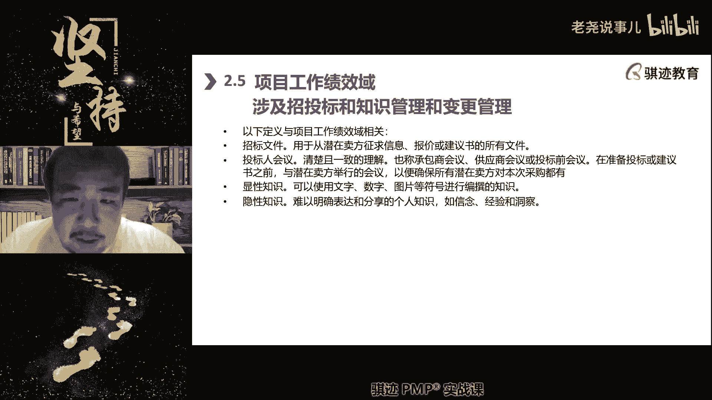

叫做承包人会议，也叫供应商会议，也叫做标前会。

那么这个会议会干什么呢，我上课之前其实也讲过，就是说我给大家统一解释一遍。

我们要采购什么东西，我们要采购什么东西，我们要采购的是一个啊。

五彩斑斓的黑色的圆形方球。

五彩斑斓的黑色圆形方球。

啊啊所以你们能明白了吧啊。

然后呢供应商有问什么叫五彩斑斓的圆形方球。

那么我给你们统一统一解释一遍啊，是这样这样这样这样这样这样这样啊。

给所有的潜在供应商都解释一遍，我们想要什么。

然后你们来投票解决我的问题。

制定计划这个过程可以理解为项目的执行过程。

不是制定规划，制定计划就是规划执行。

就是具体去做规划，是在做计划啊。

好明白了好。

那么采购他在执行有什么技巧。

采购执行采购最主要的绩效是什么，我在执行完采购之后。

得出了中标方和合同。

采购就执行采购就结束了，注意啊。

执行采购就结束了，那么有些同学说老师我只是签了个合同。

找到了供应商，供应商给我跨没供执行就结束了吗，是的。

对于采购来说，对于你项目管理的采购来说结束了，那么供应商给你供货。

你监督供应商给你供货的过程是什么。

是监督采购，OK那个叫做监督采购。

它是的监控和测量计效率的事情啊，我们后面会讲到监控测量计效率的时。

明白了好，那么这是一个执行采购，选出指定的卖家并签署合同。

这是我们招投标当中的执行的绩效结果。

这是第一块，第二块知识管理，知识管理。

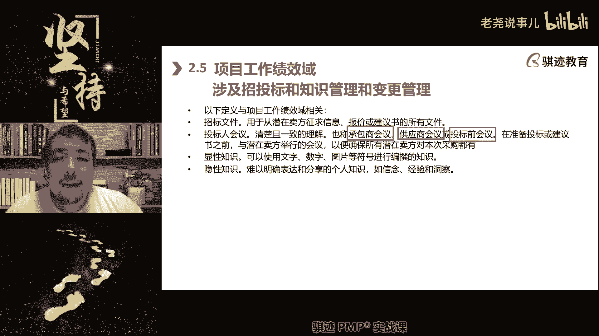

那么知识管理是什么呢，啊诶等会好，还是讲这个吧，这块啊知识管理是什么。

就是说收集在项目的执行过。

注意啊，知识管理一定只能执行起来，项目还没有进入运具体运作的时候。

你是无法产生知识的，纸上谈兵的，是无法产生知识的，知识一定是在执行过程当中产生的，所以他是执行的项目工作绩效。

那么知识管理是干什么。

从项目的执行过程当中吸取经验教训。

并将这些经验教训分发出去，让所有人都受益啊。

那么预测型当中呢是在执行阶段去进行什么啊。

知识的收集和知识的分发和知识的共享。

那么敏捷呢则是在迭代过程中。

利用什么东西来来了，如果我们使用的是适应性，敏捷性的项目管理的生命周期。

那么我们是使用什么样的方法来进行知识管理。

注意啊。

这个一定要记住，对回顾会对的，敏捷，主要是通过定期和不定期的回顾。

来进行知识分享和总结，当然敏捷也我们讲敏捷是渗透式沟通。

可以不用很正式啊，随时随地可以进行知识分享也是可以的啊。

定期总结回顾啊，那么知识分享呢我们之前也讲过。

知识分享，我们之前也讲过什么是一种非正式培训。

它传播的是我们这里写了。

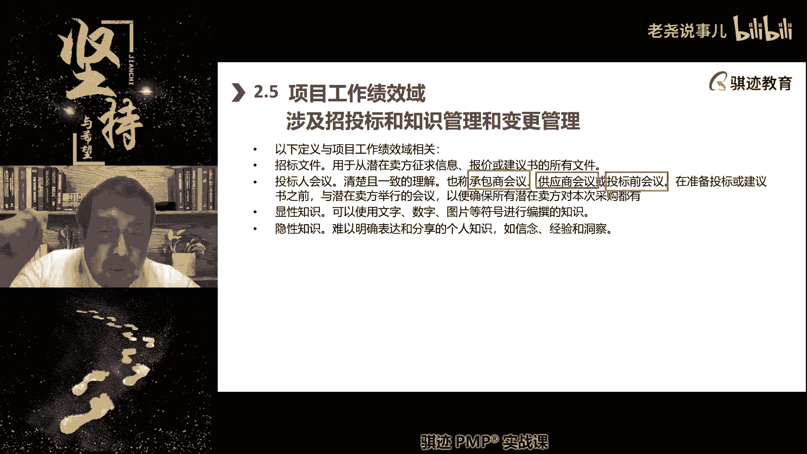

一个是隐性知识，一个是显性知识，那么知识分享主要分享的是什么知识，你们知道啊，对隐隐性知识，隐性知识是我们什么。

在工作当中自然形成的，不一定有完全的理论知识。

但是实践证明有用啊。

那么这个呢如果讲的深一点，隐性知识会有一个过程就叫显性化。

那么呃再延伸一点，项目管理知识。

其实就是人们在实项目实践工作当中做了。

总结出来之后，形成理论体系，从引进知识显性化到项目管理来理论体系。

所以很多的理论啊。

很多的基础理论都，文科理论都是来自于隐性知识，然后逐步写进化，那么很多的理科的工科，理科的理论知识呢，其实也是就实用知识。

细节微观知识都是来自于隐性知识。

工作实践当中发现咦这个方法挺不错。

然后进行改变啊，当然说呃基础的这种工科理论更多的是什么。

来自于更多的实际上是来自于什么。

先科研，然后再来，他可能缺乏隐性知识写进化的过程啊。

当然这个你们不需要知道，好像知道显性知识是来自于，主要是来自于隐性知识的显性化。

经过总结规律，然后呢有完全的理论支撑。

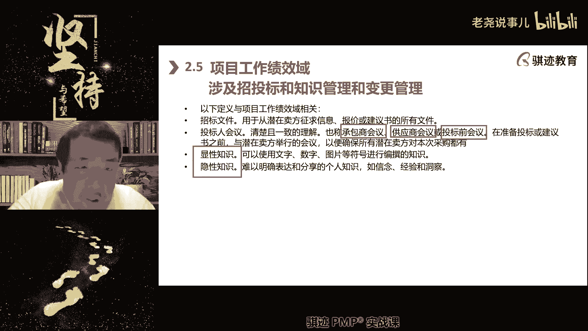

能够体系化的表述与能够与其他的理论相兼容。

总结的经验教训并不都是显性质啊。

这个要纠正一点，总结的经验教训并不都是显性知识啊。

显性知识是一种没有理论的啊，没有理论的就是非结构化的。

非结构化的经验总结教训。

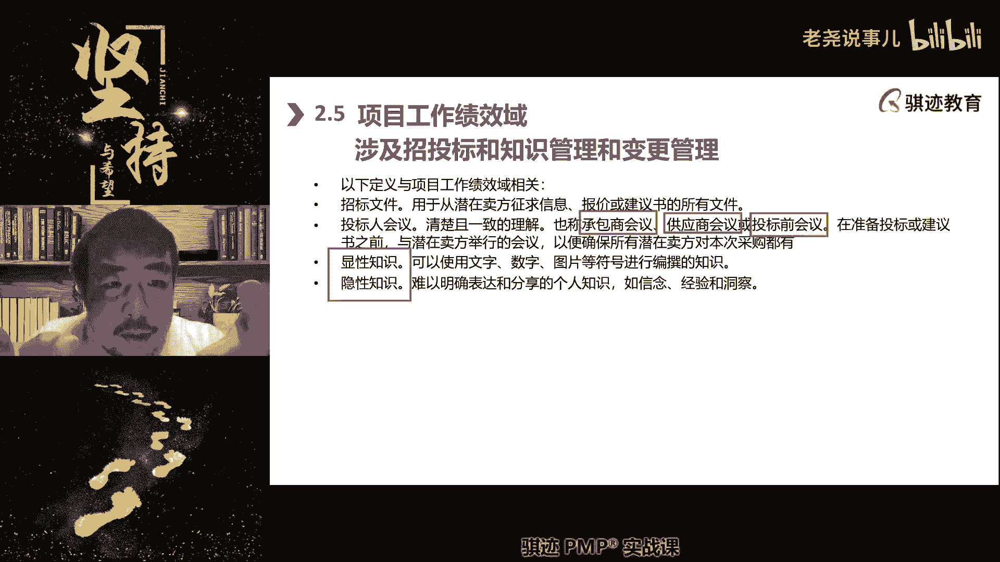

经验教训总结可能是什么啊，经验教训总结可能是什么东西啊。

比如说我们还是举个烧菜的例子，比如说烧菜的时候呃，今天我怀疑诶今天上今天晚上烧的菜呢。

我女儿特别爱吃，那么我总结了一下经验是什么。

我女儿吃番茄炒蛋，喜欢炒的甜一点点。

喜欢番茄味浓一点点，那么怎么样番茄会浓一点点呢。

就是番茄呢事先要去皮，然后在锅里呢多煸炒一下，然后可以加点番茄酱啊啊然后呢甜味浓一点的。

可以适当加一点甜。

那么小孩子就喜欢吃这个就是隐性知识。

那么什么是显性知识啊，就是说呃你可以认为当然也不太严谨啊。

没有那么严谨，就全中国最好做的。

最好吃的番茄炒蛋应该是什么，用多少颗鸡蛋。

多少克番茄，多少克，盐多少克，糖多了什么东西，然后每一步加工过程怎么样。

然后标准化一步步过来，然后能做出最好吃的味道，这个呢是写些知识啊。

显然我们在经验总结的时候，不一定会总结到这么高的高度。

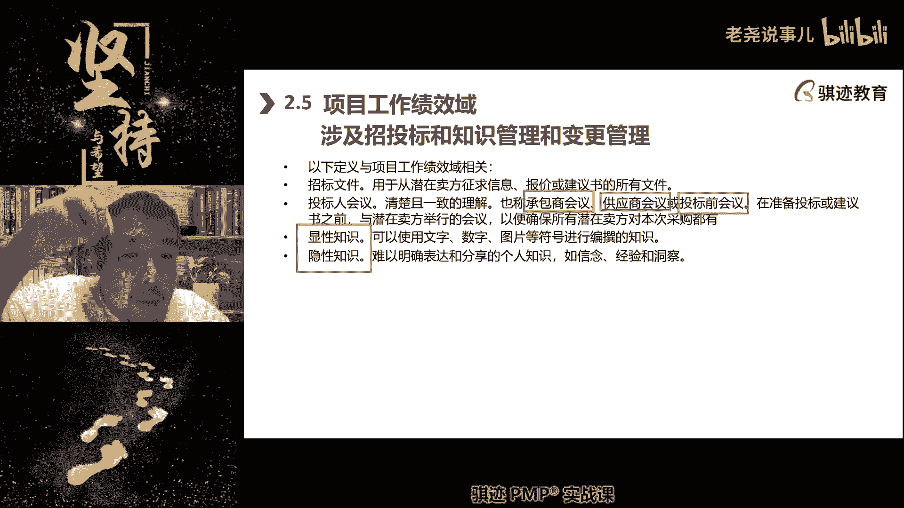

好啊这个当然这个呢不用特别去纠结显性引进。

你们其实只要知道。

所以我们在团队建设当中，提高员工能力是使用的培训。

培训传授的是显性知识。

我们在知识分享座谈会，经验总结会上分享的是什么。

是隐性知识啊，隐性知识。

但是两者都可以对我们项目产生有益的帮助，这些知识也是在执行当中才会产生的。

它在没有执行的时候是不会产生明白了，那么知识管理也是项目经理的职责之一。

不可推脱。

因为只有项目经理最适合的全局，进行知识分享和不断提高。

明白了啊，好那么当然变更管理当中的一部分也是执行，就是当一个变更，我们之前讲过变更过程，变更控制流程吧，在预测性当中，当一个变更被批准之后，是不是要执行这个变更啊，项目经理有责任。

对于已经批准变更监督指导安排变更去执行。

那么这也是经过那么变更成功的率高不高。

有没有达到变更的目的，也是日常工作的一部分。

同学们记住啊，在一些其他理论当中，变更的成功率高低是你日常管理的执行，管理的一个成管理好坏的一个缩影，那么还有哪些是涉及到执行啊，质量工作就要有质量。

你在呃，当然这个就讲那个，我们后面会讲那个那个那个质量的情况下。

也会提一下啊，质量当中我们有管理质量。

从项目的质量设计开始。

对项目的产品的生产过程进行质量把关。

这也是在执行过程当中啊，明白了。

那么我们之前其实讲过一个质量，一个质量成本概念对吧，质量有质量全部干净。

那么质量的执行过程也是管理质量管理，那么质量的执行结果呢是控制质量啊，属于后面我们的测量倾向于，那么项目的工作绩效与它会包括什么。

管理变更啊，那么还有一些呢，就是说是原来P博客里面没有提，但是其实实践当中。

我们这样做的考试很少会考到的，使团队保持关注，在执行当中。

让团队始终专注于工作，将工作之外的干扰降到最低。

这个在敏捷当中做仆人是管理。

仆人式领导当中特别明显对吧啊，建立高效的项目系统和流程啊。

那么如何去安排日常安排每天的项目管理。

执行工作对吧，与干系人沟通沟通是一个执行过程对吧，然后管理啊。

管理器材设备用啊，管理设备器材用品和物流对吧，实际物品的使用呃。

有同学问老师如果变更失败了怎么办啊。

这个问题问得很好，pp好像没有考过变更失败啊。

一些其他理论也有变更，如果失败就涉及到就是说在一些其他理论。

比如老师教的很经典，像艾特一些理论里面就会提到变更当中。

我们在变更计划当中应该有变更失败的应对啊。

当然当然我们变更里面其实是有，啊风险里面那个有哎我们那个偏僻的变更。

讲的比较简单的啊，其实是有的。

我们变更是有什么回退计划和应急计划。

但是这个回归和应急呢又是在风险里面会讲到。

沾那么点边，其实概念有点相近，就是什么，如果变更失败了，我们应该事先规划好手段。

将变更还原回，还原回初始状态。

就是相当于没有度过变更啊，下次再度，但这个PNP就不考虑，因为这个靠超出PP范围了啊，好那么接下来与合同签订。

专业人士和供应商合作，以规划采购合同啊。

就是签订采购合同，选择供应商监督变更。

促使知识转移，是这世界上主要内容工作，那么项目过程，那么在具体执行的时候呢，这里提到了几个东西啊，是我们管理的东西，我们在修之前讲一下，那么对于项目来说，大型项目和小型项目啊，这个就比较接近实际。

跟考试比对的就是越是小型的项目，项目经理管的越是细，在执行过程管的越是细，越是大型的项目项目，对于项目经理的执行过程管的越是粗，这个能明白，第一个第二个项目越是大呃，当然这跟大小没关系。

就是项目无论大小，但是越是大越明显，我们会越多的运用精益的生产方法啊，精益英文叫做令一键还原啊，可以这么理解啊，令啊精益精益生产方法是什么啊，我们其实这里就讲到了一个这里跟敏捷有关啊。

因为敏捷我们之前讲过，那个我们讲的那个那个那个基于看板模式，就是经历那个来的对吧，这里就会牵扯到有一些这个关系啊，这块其实是更多针对敏捷的，但是当时我们的传统预测性项目，也可以使用经营啊。

那么它会使用价值流图，就value stream mapping vs m vs m，Value stream map，用这个工具来什么，分析整个生产过程当中，价值是怎么一步一步一步创造出来。

然后消除浪费，提升效率，不断创造更高的价值，这个过程就叫精益生产，精益求精的生产，好，那么我们会用价值，价值流等技术来测量，增值活动和非增值的比率啊，其实其实怎么说呢，这个表达其实我觉得偏博客。

写的也不是那么的专业，其实BSM其实主要作用是什么，用于识别低效和不增值的活动，把它改换为高效的高增值的活动或者实现方式，啊这你们大致知道一下，就是运用精益的理念，在生产过程当中不断的优化提高。

持续改进，这是我们项目过程管理的一个第一个基础理论，第二个技术理念，经常的总结经验和回顾，我们敏捷当中使用回顾会，我们在预测性当中去使用什么经验教训，总结会啊，注意回顾会和经验教训总结会。

既可以在阶段结束开，迭代结束开，也可以根据需要临时召开，都是可以的啊，通过总结经验教训来帮助以后做的更好，那么同样的经验教训总结会往往是什么，在发生了事情之后才会去总结啊，敏捷的回顾会其实更强调什么。

哪怕没有发生好事和坏事，我们一样会去回顾啊，最近做的一些事情，我们一样会去回顾，就相当于影片重放一遍，然后看看哪里能做得更好，就是回顾，比经验教训总结更好的一个机制方面啊。

这你要承认敏捷的这个思想来自于精密更好，就是说我们不要每次摔倒了才知道哪里有风险，哪里有危险对吧，就像小朋友学学不一样对吧，为什么有些小朋友学学走路学得特别快，因为他摔两下就知道了啊，怎么走路是正确的。

有些小朋友呢要要走一次，摔一次走走很久，因为他每次只是在摔倒的时候，才知道这个走路方法是错的，他不生他就不知道是吧，所以聪明人和啊普通人的区别就是，聪明人会举一反三，甚至是啊举零反三。

就是哪怕他自己没有犯错，他可以看到别人的错误，然后来避免自己同样犯错误，这是聪明人做法，而经验教训总结会呢就相对比较刻板一点，他一定是发生了好的事情，大部分情况下是发生了坏的事情，然后呢总结一下啊。

为什么会被这样以后避免这个就相对比较被动，第三在执行过程中，项目经理应该时刻考虑的是什么，马尼一个是什么，在执行过程中，我们前面成本里讲的，要时刻关心资金的到位情况，第二个是什么。

当前已经投入项目的资金如何最妥善的去花，那么这个就考验到项目经理，在具体执行过程当中进行啊，在预算允许的情况下，进行实时的进行什么不断的金钱运动调整，比如说我们的项目现在预算紧张，上面拨款有限。

虽然项目本地的要拨款给我们100万，完成项目工作，但实际上呢只拨款给我们30万，远远不足以完成当前阶段的所有工作，那么我们怎么办，根据资金限制的这个约束来倒推，看哪些工作是必须得在这个阶段完成的。

然后将他们在30万的资金之内，尽可能的去完成，说巧妇要为少米之炊，巧妇难为无米之炊，项目经理大部分时候面对情况不是无语，而是少女，你在米少的情况下，你怎么样喂饱一家人呢，如果米很少。

不足以喂饱一家人怎么办，烧粥呀，嘿嘿知道吗，然后我们应该在执行过程中经经常性的审查，是否存在浪费，是否存在质量问题，然后花花在跟踪过程的时间啊，看看是不能消除浪费来进行项目过程的管理好。

那么这个就是我们讲的项目在执行过程当中，我们会在实践工作当中，心理会考量哪些方面的因素，应该如何去管理的实践工作的一些重点好，那么我们先稍微休息一下，休息休息，休息完成之后呢，我们继续讲后面的内容好吧。

好我们休息休息到21：20分继续啊。

稍微休息啊，大家。

Hello，同学们都回来了吗。

准备开始啊啊回来了，扣一规矩，回来了，扣一。

嗯都回来了是吧。

好我们继续开始啊，那么在项目的执行过程当中，我们在管理上要获得有好的绩效，还要注意什么平衡性的竞争因素。

这当中最最典型的竞争基础的平衡性。

竞争因素是什么，是三重约束。

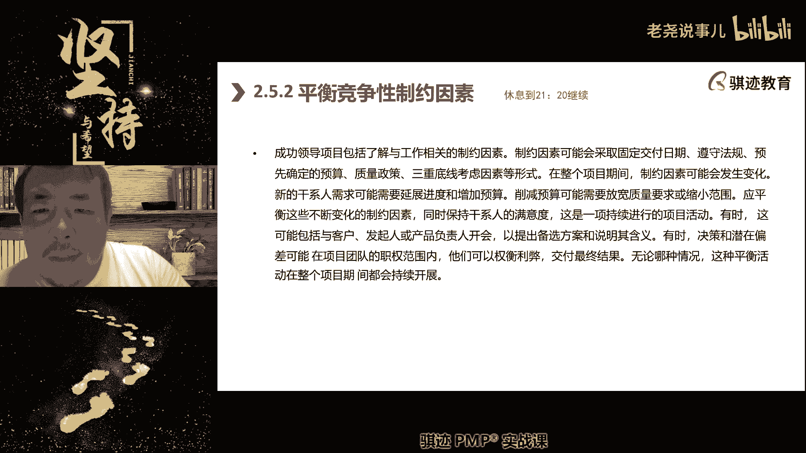

三重底线啊，就是范围进度成本，我们之前就已经讲过。

讲过很多遍就不说了对吧，要做到什么程度，花多少钱，什么时候完成。

这三个东西是相互之间会有制约，在范进程之上。

还有什么遵守法律合规要求也会产生制约。

要满足质量要求也会产生制约对吧，那么这些东西都会对项目的最终执行结果。

造成各种各样的实际影响。

因为项目中我们在规划阶段，很多时候呢都是什么理想状态。

哪怕是已经考虑现实因素，但在实际执行过程当中。

因为项目是一个克服不确定性因素的一种啊。

过程形式，所以它一定是不会和你预计的一模一样的。

开展和完成的项目。

这个形式本身就是带有啊不确定性位置的啊，所以这就是为什么叉老师很喜欢做项目啊。

为什么他永远带着你，不知道会发生什么事情的那种未知感啊。

不像管理日常工作，有时候会比较无聊。

你日复一日，年复一年，做到机械性重复性的工作会比较无聊，项目呢它会有个不确定性。

所以你所计划规划的东西。

无论你有敏捷还是预测，它永远会有你事先无法想到或考虑到的东西。

所以这个时候你就要尽可能地根据实际情况，在执行阶段进行啊动态的调整和平衡啊。

那么他也说我们会在项目的整个阶段，那我们可能会什么缩小范围。

增大的放宽质量要求，比如说增加预算，延缓记录等等等等这些东西。

而这些因素的放宽或者放缓，也会带来肝气人满意度的变化。

比如说你降低质量要求，可能干性人就不满意。

对吧啊，所以项目当中经常有时候管理的不好，这种因素错综复杂的因素。

管理的不好，就会导致连锁性的反应。

啊啊就让我想起一个故事啊，那个段子诶。

为什么丘处机要去牛家庄。

大家看过吧，大家网上没看过的同学可以去网上搜一下啊，啊几年前的一个段子。

如果丘处机不去牛家庄，中国就会成为世界最强大最富有的国家对吧。

你们晚上回去试一下啊。

都怪丘处机去了牛家庄啊。

这就是什么各种因素会产生连锁的影响和反应。

那么这个我就不展开说了啊。

这个大家要明白，天天天天，那么在工作中我们要保护好团队，是团队保持专注。

专注于什么价值交付啊，还是一样啊。

偏不和第七版强调个什么东西，你们考试的时候请记住你们的选择当中。

最正确的选项，一定是最我价值实现交付那个角度选的对对。

这是第七版的一个明显的突出点。

对价值保持专注于实现价值的工作。

它体现了敏捷当中讲不创造价值的工作。

不是说都不做，尽量少做够用就好，比如说写文档啊。

开会啊，不是说不开不稳党啊，他们也会有自己的作用，但是他不直接创造这点。

我们应该把最多的精力和时间，用于创造价值的那些事情。

在执行过程中创造这样的事情啊，所以有一些有一些企业当中。

他会有，比如说经常会有什么所谓的大公司病啊等等，就什么什么不干的。

然后呢会议嘛开了很多方案呢，除了一套有一套。

但是没人干活对吧，空谈空谈误国实业兴邦对吧。

就这个意思啊。

然后呢要在执行过程中要始终保持沟通和参与。

沟通指的是什么，内部沟通和内外沟通相互之间进行信息传递。

无论是预测性还是啊敏捷型都需要什么。

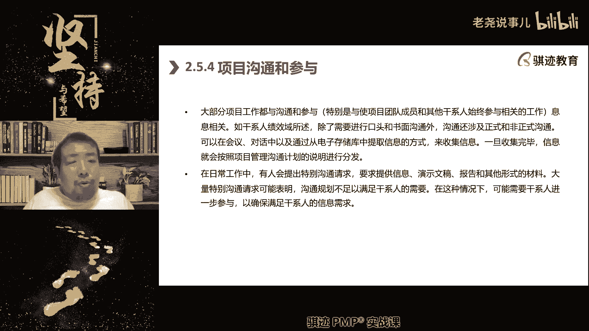

始终保持着信息传递，可以帮助我们呃，有最好的像呃项目当中的那种那种啊。

协同的效能啊，工作的效率，那么参与是什么，参与你们以后看到参与这两个词，就是就是干系人参与engagement，参与，更多的是更指的是外部，干系人以适当的方式介入到项目当中。

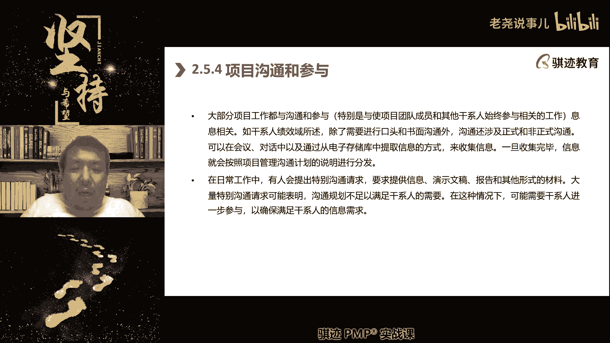

来发挥自己的作用，这个叫做参与啊。

这是在日常管理当中，那么我们之前的该学知识领域。

我们家也是版本之子当中提到的吧，干系人要不要都要深入项目。

不必因为有时候过于深入，反而会什么好心贩卖时适当参与。

所以怎么个适当吧。

他应该知道什么，不应该知道什么，他应该做什么，不应该做，应该在项目的执行过程当中。

进行动态的调整和管理，使得项目能够发挥最好的效能和协作效能啊。

然后在执行过程中，项目经理和项目管理团队要管理好实务资源。

实物资源这块就跟我们上节课讲的那个啊，人力资源其实两块。

就是原来我们篇博客里面的第九章，零的资源管理这个知识领域啊。

那么现在呢实物资源都是在执行过程中管理，那么实物资源主要是什么。

减少浪费，避免损耗，避免贪污腐败，对吧啊。

有有有迹可循啊，有有能够核查就能够进入审计这些东西啊，这个就不多说了。

这个呢也没啥好说的啊，然后处理采购。

采购前面已经讲了很多了，也不说了，对吧啊，采购当中有什么特征啊，项目经理有没有签字权。

大部分情况下没有签字权，我们大部分情况下在有采购部门的企业当中，使用的是集中式采购，下一级经理没有签字权，但是他可以提出需求，小型的没有采购部门的这个当中，我们使用分散采购，它可以有签字权啊。

所以大部分情况下呢，项目经理提出采购需求，然后由采购经理采购流程去负责采购事宜，然后呢我们配合采购经理完成这个采购事，宜，家进入监控采购啊。

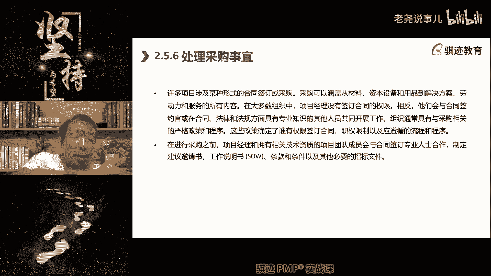

那供应监督供应商干货，那么采购当中招投标这个也说啊，那么这个呢就是我们之前一直跟大家说的信息，邀请书，就是RFI建议要报价邀请书，就是啊RFQ，不好意思啊，R f q。

那么建议邀请书呢就是最正式的RFP，一个采购如果采购东西比较标准，比较简单，我们RFQ就足够了啊，邀请报价呢邀请函呢，现在邀请函是FI，如果带有复杂的解决方案的呢，我们需要用到IMP这个到底是啥。

那么我们发出去一个F什么F什么F什么，我们的潜在供应商要有一个反馈，叫做IFF什么的，Revise，revise就是反馈我们要求说啊，你能不能跟我们一样需要采购的啊。

那个我们今我们公司今年要采购100个西瓜啊，你们能不能给我报个价工程啊，我来报个价，我给你报个FQ啊，啊啊个FP给你提供的是无籽西瓜，对吧，每只瓜重量不少于八斤啊，然后每只瓜多少钱，总共总价多少啊。

这就是FP对吧，又有解决方案，又有报价，然后呢采购最后执行就执行签订合同啊，然后我们会监督日常工作，项目经理有时候呢在日常的执行过程当中呢，他不会干任何事情，就是监控监督啊，就是也不叫监控。

就是说呃监督这个事情，和我们的监控和绩效测量其实是两个东西，有点模糊啊，原来在偏颇和第六版里面，什么叫监督啊，就是你一边在干活，我一边在旁边盯着你，这个叫监督，那么什么叫做监控和控制呢。

就是你我我不会盯着你干什么活，但是我会用测量手段和监控手段来收集，你干活的绩效，比今天你生产了多少个零部件对吧，今天你砌砌了多少米墙对吧，今天你写了多少行代码，我们会有统计，根据统计数据来进行管理。

事后管理这个叫做监控，但现在这个东西呢也没有那么强调，在执行过程当中，我们对执行过程各个方方面面要啊注意盯牢啊，观察，但是我们的书上这个表述呢，相对比较比较低级啊，其实我们已经讲过了啊。

我们的变更在我们的预测性当中，可能我们的敏捷性当中怎么做变更，怎么做监督等等等等，我们得知了，那么监督工作在敏捷性当中呢是什么，纳入迭代团队自己管理，没有纳入迭代呢，PO来管理啊对吧，那批量管理。

好那么这个就这个就不提了啊，然后呢我们也要进行竞赛进行回顾和学习。

这个之前也讲过了是吧，进行知识管理，这些都讲过了啊。

然后知识管理都讲过了，那么还有一个我们要讲一讲的，其实就讲一讲。

就是强调这些，就是说我们的质量管理，稍微讲一讲质量啊。

质量管理当中我们在执行阶段干的是什么，预防和检测。

所谓的预防是指的是什么，我们这些就是质量成本当中是什么，防止质量出错啊，我们会从哪里开始预防。

这个稍微给大家讲一讲啊，原来篇不可了，然后新的片，不过这个就没提，因为质量那是本本版本惨遭削弱，题目变少了。

但是还是给大家提提，现在题目变少，还要给大家提一提，万一考到质量当中是什么呀，质量我们讲是从设计开始，从设计开始就管理质量了啊，在我们设计一个产品的时候，就开始进行管理质量了，那么设计怎么管理质量呢。

就是说呃这就讲到设计的啊，这个给大家稍微扩展一下，不一定考到产品的设计，分为叫三重设计，这是以前老的概念啊，比其他理论也有。

第一个呢是叫做什么叫做框架设计，第二个叫做参数设计，第三个叫做什么特性设计，或者叫做或者叫做那个那个强壮性设计啊，那么质量呢往往是是在第二第三层设计当中啊，要参呃，要管理人要参与进来，什么意思啊。

你做出一个产品在做设计的时候。

并不能光考虑啊满足客户要求。

还要考虑到客户的质量诉求啊。

这是在设计当中进来，如果你在设计当中不体现。

事后再去弥补，就相当于娘胎里带着病出来，后面怎么医也是医不太好，完美最好的方法就是不要从娘胎里把病带出。

啊有同学说项目合同是项目经理可以签的吗，项目经理一般一般都不能签啊，这个就不用考虑。

一般都不能签啊，明白吗，然后管理质量是什么，我们之前讲过进度当中讲过活动对吧。

进度当中讲过活动，那么管理质量就是什么。

在进度当中呢，我们插入我们进度中，是不是要执行一个一个在实际在执行当中。

是不是要执行一个一个活动啊，在若干个进度活动当中，我们会插入质量活动，比如说我们执行了一些生产活动啊，给我们制造了一些零部件，然后呢我们制造出来之后呢，就插入一个什么检查活动，质量检查活动。

检查这些零部件是否符合规范要求啊，我们会输出什么质量检测标准，质量检测标准。

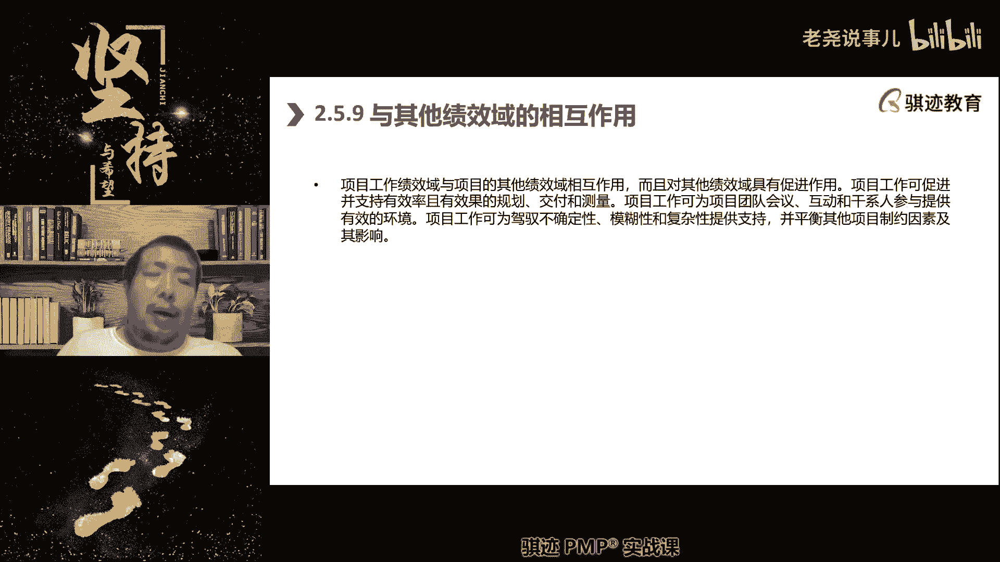

好，那么这个就是我们的讲的那个啊啊。

工作绩效率啊，工作绩效率是我们执行当中。

需要注重管理和专注的哪些方面，那么接下去我们讲的交付绩效与交付绩效率，其实他在原来的pm和体系里面只占很小一部分。

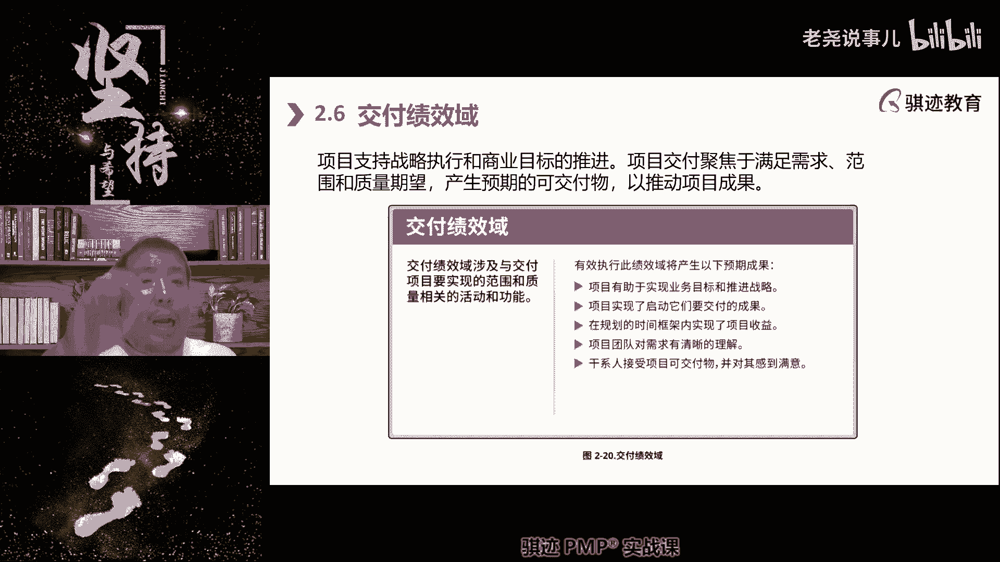

就是什么产品的最终交付。

最终产品的交付移交对吧，但是呢现在在我们前面讲过。

在现在的项目实践当中，这个这个环节比越来越重要，它的关键在于聚焦我们的产生。

可以产生预期的交付成果。

推动项目成果啊，聚焦于交出达到预期的结果。

来使得项目能够产生成果和价值，那么我们的项目可能有多个可交付成果，我们的项目成果可能有多个，然后不同的成果都能够为项目创造价值的方法。

那么我们在交付机交易当中。

什么东西是有关的呢，一是需求及其实现，那么就来了。

需求的全生命周期管理，我们会用到哪个工具。

之前讲过一个很重要的工具。

需求的全生命周期，在预测型当中会用到哪个工具。

来回答我一下。

对需求跟踪矩阵千万记住啊。

千万记住，那么需求我们在敏捷当中其实已经讲过了。

有很多需求方法对吧，那个莫斯科法则对吧，100点法则对吧等等。

那么我们这里稍微再讲一讲啊，我因为这里的话，我们考试会考一个比较偏的需求。

