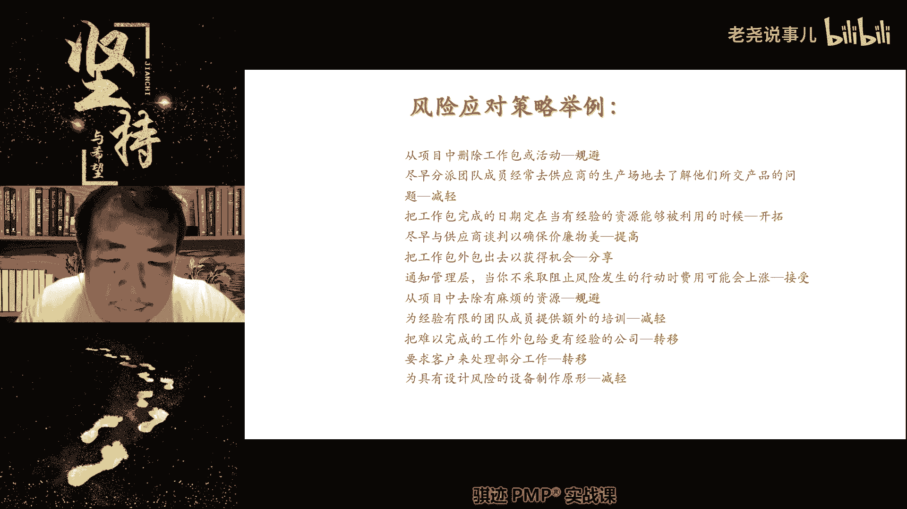

# （收费视频完整版分享）PMBOK第七版课程PMP考试报名认证培训精讲-零基础项目管理第七版教程最新版直播课回放视频免费课程资源-骐迹教育谢阳主讲 - P55：20-3裁剪基本概念 - 老尧说事儿 - BV1ek4y1s71N

啊概率降到零，那么请记住规避的概率降到零。

注意补考试的时候不要杠精接近于零，或者很接近零就可以了，不是说要绝对等于零啊，比如说我们考试什么实用性，比如说我们的考试，就比如说这么表述，使用新的技术来改善我们的项目工艺，提高项目的质量，这个是啊。

这个不是这个不是规避哈哈，另外一个就是开拓啊，规避什么，使用新技术来降低，比如说项目的质量缺陷概率啊，那么这个时候呢就是规避了啊，但是我有同学说老师新技术一定绝对能，新技术比原来能够降低。

它是一个大概率的事件，并不是说一定是在试试大概率的事件，那么你会是极大概率的事件，所以你就认为它是规避啊，那么它是从根本上去消除威胁的来源了，概率比较降低的概率程度比较大，接近于发生接近于零。

那么我们举个例子啊，规避我们举个例子啊，怎么规避偏偏考试不通过的可能性，pp考试不通过这种威胁，怎么样规避掉，怎么规避P考试通不通过，你，好王某同学啊，说是刷题加上课不，你这个不是规避，你这个是开拓啊。

我们会不会讲这是正面积极的，负面的是规避，怎么样，你们说的这些都是正面积极的，规避呢，是在消极的条件下，怎么样把概率降到零，不去考试，不报名考试就不会考试过了，嘿嘿嘿嘿，退的退的，这次不考，下次考。

哈哈哈哈哈对了，明白这个意思吧，我们举个举个比较欢快的例子啊，就像就像比如说什么，有些男生比较胆小，不敢怕，不敢和女生表白，怕被拒绝，怎么规避表白被拒绝的这样一件事情呢，那么很简单，你就不表白。

玩暧昧就不会被人拒绝对吧，但是2500已经交完了，直接变成不成分，这是另外一回事情啊，啊开个玩笑，开个玩笑啊，那么我们常见的规避是什么，是啊，延长进度计划。

改变项目策略，缩小范围都可以啊，缩小范围是一种比较不好的规避策略。

但是也能规避，比如说我们这个事情做不好怎么办，不做了，不做就不会错，所以这个是这个方法不太好，但是这是这是闺蜜啊。

明白了啊，这个大家可以查看啊。

第二种没办法降低概率，但是我们要采取应对怎么办。

可以第二种方法，就像我们日常经常遇到是这样的啊，规避是消极的，抬头记忆，对的啊，没问题，就是我们想想，如果这个事情注定要发生，不要发生在我身上就行。

我们身上就行，这种正所谓所列哇啊死道友不死贫道对吧，有句话叫死道友不死贫道，这个就是转移，如果渡劫一定要有人被雷劈的话，请不要劈我劈旁边那位道友，这个就叫做转移，就是将受到负面影响的后果由别人来承担啊。

那么这个时候呢，通常要向别人呢支付一定的费用或者代价。

比如说我们一起渡劫对吧，为了防止为了不让我被批，虽然我也会有很大概率我也会被劈雷，那么怎么办呢，我们给旁边一起渡劫的道友，买一身全身的金属盔甲，脑袋上动一个高高的针对吧。

然后那个雷劈下来了之后，就有一个很大的概率呢，什么劈到隔壁到有被雷劈，仍然是什么会有这个概率发生的，但是呢劈不到我脑袋上就行了，P隔壁去对吧，这个就是转移啊，我们还有什么常用的转移方法啊，买保险啊。

请记住，买保险是转移啊，为什么是转移啊，你买了保险就不会不出意外了吗，就不会不生病了吗，不是的，客观的概率仍然是一样，但是一旦发生这种不幸，这种苦痛的时候，你的金钱损失可以由你承担，变为保险公司承担。

所以保险尤其是什么社保，社会保险，社会工作保险啊，意外人身保险，这些保险都是帮你承担负面的金钱损失。

OK这个是取决于能否降低概率。

有很多的场景没有办法降低概率或者降低概率，非常不划算，那么我们就把这个责任转移给别人啊，还有什么可以外包外包也是一种转移，比如说我们干这个事情很有风险，那么我们自己不干，外包给别人干。

别人干也一样有风险，但是如果出了问题呢，别人承担啊，我们就不用承担责风险对吧，但是呢我们活给别人干，肯定要给别人赚钱，所以要付出相应的相当于对价。

就是别人的利润，就是我们的风险对价，所以某种程度上外包的利润就是一种风险对价，使用担保书，使用保证啊，这些都是风险转移概率不变，承受风险影响的主体从内部，注意我的描述啊。

承担风险向的主体从内部转移到外部去，这是转移，如果在外部和外部之间转呢，这个不是转移，这个是减轻啊，后面会讲到。

哎我女儿又来了，不好意思啊，她又进镜头了呢，他又拿了一个，他又拿了一个小球球啊，不好意思，第三种是什么，我们没办法转移，也没有办法规避，我们只能尽量降低，这个就是减减轻啊，这个就是减轻。

洗澡还没满啊，我啊那么减轻我们通常是采用什么，那减轻需求，我们之前讲过减轻需求不明确，我们可以使用的方法就是原型开发，使用原型来减轻需求不明确。

那么减轻什么错误率，我们可以使用什么进行更多的测试。

来减轻故障的交付率，不能减轻故障的发生率，但是可以减轻故障，为什么交付率也是减轻对吧，然后减轻啊我们的什么我们的呃，错误的概率是什么，也可以使用复杂程度较低的流程对吧。

如果我们一个承包商做的不好，我们让另外一个承包商做也是一种风险减轻，但是如果选的不好，可能会越选越糟糕，这反而是风险上升啊，我们生活中有哪些例子是风险减轻的啊，风险减轻的啊，等下看啊。

还是养身体啊，你觉得鼻子有点塞，鼻子有点痒，呼吸道有点不舒服，这是什么风险的前兆，感冒感冒的前兆对吧，那么感冒能不能规避掉很难，其实感冒很难被规避掉啊，这个病毒很厉害，交通方式。

那么感对感冒这样一个负面风险，我们怎么减轻啊，如果你觉得身体不舒服啊，然后呢鼻子比较塞啊，又有点头晕眼花，那么可能是感冒过程干嘛了吧，马上洗个热水澡，吃点感冒药，躲在被子里捂一身汗，不一定能够不感冒。

但是可以把感冒的症状就是降低，感冒的症状，就是它的影响，或者是感冒时期发生概率可以下降不少，所以当你要感冒的时候，当你要感冒的时候减轻，一般是在呃什么是发生了或者发生之前，或者是发生了。

如果是发生之前呢，就是降低它的概率，像我讲不起来啊，你觉得你要感冒了，还没有感冒，但是觉得人不舒服了，马上洗热水澡，然后喝热水，然后再让自己出汗，吃感冒药，这是降低概率，那么如果你真的是感冒了。

已经流鼻涕，流眼泪咳嗽，感冒了不咳嗽了，那么其之所早吃感冒药什么可以降低它的影响，虽然不能完全消除，但是可以帮助你们降低感冒对你们的啊，人的感受的影响，但是我所说的什么洗干洗热水澡武汉，然后是吃感冒药。

并不能绝对保证你们不感冒，或者感冒之后毫无感觉是没有办法保证对吧，但这个大家都知道吧，所以这些措施都是我们生活中的负面的，感冒风险的减轻措施，理解了吧。

有些时候是没有办法的，为什么选择减轻，因为有些时候是没有办法转移，也没有办法规避的，像感冒这件事情，感冒这件事情能转移吧，没办法转移的，无论你是亿万富翁还是穷屌丝，当你要感冒的时候，你让能让别人感冒。

然后自己不感冒，有啊没有这种技术的，人类也没有这种技术的，对不对，所以没有办法转移的，那能能不能规避啊，也没有办法规避的，人要感冒的时候，无论如何他都会感冒啊，再说一个冷知识，感冒药都是只能减轻症状。

但是不能够什么不能够啊，消除病毒啊。

感冒这个病毒这个东西呢，无论细菌性呢还是和和病毒性的病毒性，其实细菌性会更厉害，都是什么，感冒这个东西都是都是什么，都是靠人的，主要靠人的免疫力去消除的，所以你只能减轻症状，减轻概率而已。

如果在优先可以选择和减轻情况下，对优先选择转呃，呃这要看情况。

因为转移还要付出代价，对项目管理来说，转移是要付出代价的。

所以也不一定有人转移，比如说转移出去可能要付出代价更高，减轻呢可以让我们的损失呃没有那么大，可以接受，那取决于你怎么权衡，OK啊这就是不一定的啊，取决于项目的风险管理的取向。

OK明白了。

好那么所以啊所以在负面风险的时候。

如果能选的情况下，我们肯定选择规避。

但是选择转移还是减轻，取决于具体情况。

一般来说都是属于具体用啊。

题目会给你场景和设定的，题目会给你场景设定。

最后一种是接受接受呢，我们可以主动接受或者是被动接受，什么叫做主动介绍。

我有措施，但我不采取，什么是被动介绍，我没有任何措施。

我只能不接受也得接受啊，不接受也得接受，对吧好，我们来分别举个例子啊，怎么接受，什么叫什么叫什么叫做接受啊，比如说你是一个很有钱的人，那么对你来说啊，对你来说啊，啊你走在路上不小心掉了100块钱。

比如说你是个亿万富翁，你不小心走在路上掉100块钱，是不是一种风险，负面风险也是，那么对于这个风险来说，对你来说需要防范，不需要你需不需要花很多精力的。

每天都要注意啊，钱都放放好，不要钱倒在外面，钱掉下来了，很可惜，对于你是亿万富翁来说。

100块钱算个屁对吧，掉了就掉了，无所谓啊，就是一个矛，我有措施，我也不惨重采取。

因为什么对我来说毫无意义和价值，我关心的东西根本不在这个100块钱上面对吧。

另外一种叫做被动接受，什么叫做被动接受。

你没有任何措施可以采取，你只能接受这个风险的发生。

是接受这个风险的发生。

然后呢啊承受它的后果啊。

那么就比如说嘛我一直说什么啊，我一直说人这个这个这个动啊进化是不够彻底。

人这个动物身上有很多东西和很多器官和功能。

到了一定时间是一定会坏掉的，比如有个什么东西啊，眼睛每一个成年人到达一定年龄之后。

一定会发生白内障，但是什么时候发生发生的程度。

每个人不一样啊，你们记住一点，成年人在70岁之后一定会发生白内障，这是人的眼睛构造的一个极限。

眼的眼眼球的晶体啊，在用了70年之后，他一定会出现一定程度的浑浊啊，就称之为啊摆内战啊，那么现代医学已经很简单，会有措施可以去怎么开手术做，但是如果我们说如果啊在你生活在古代，你有办法去应对白内障啊。

没有对不起，你只能接受这个现实，因为在古代没有患眼球晶体的手术情况下，人是没有任何办法去对付这个白内障这个事情，所以你只能被动地接受，你在70岁之后，眼睛看得没有那么清楚，这样一个风险什么时候发生。

不知道有些人可能60岁之后，60岁就开始有白内障，甚至50几岁就有白内障都有。

有些人可能到80几岁的白内障，这个是个风险，不确定什么时候发生，但是肯定会发生啊，你们记住这一点，但是现代医学就比较发达了，人有了白内障之后呢，可以去做手术，把眼球晶体呢换一下就可以了啊。

古代近视了怎么办，你就近视了，古代近视了还可以用镜片。

这古代人真的是呃，尤其是比较近代一点的啊，它可以引用玻璃镜片。

就是现在类似于现在眼镜的出现，可以用镜片看东西是可以的，但是白内障是没有办法解决的，谁跟你说，古人活不到70岁啊，古人的平均事后命很低，为什么古人古代人的最大挑战是什么，小孩子在三岁之前的夭折率很高。

将平均寿命拉低了，但是人一旦成年之后，它的寿命比现代人短不了太多，所以70岁并不是一个什么人，到60古来稀，并不是你像那个说的那么稀罕，古人70岁还是很多的啊，你们看。

古人到70岁以上还是很多的。

古代一般不解释，所以这个就是接受，知道吧，一种是有措施，但不值得采取，一种是没有措施，只能来了这些事对吧。

好我们刚才讲的是什么。

消极的风险，OK都明白了。

接下去我们讲积极的风险，积极的风险当中也是有一个上报。

更像那个相对应的有机会，但是项目经理无权去把握，或者不在本项目内出现机会。

那么上报啊一样，另外一个开拓和就是规避相对应。

规避是负面降到零，开拓是什么。

出现几率升至100%，那么这个时候就像前面我们很多同学讲的一样。

什么通过PMP考试的概率上升到100%。

他的方法是什么。

认真听课，好好刷题，掌握做题思路。

它的概率就会提升到非常接近于100%，它就是开头啊。

当然也有一种方法的，开头是什么，找考查老师代考。

但是这个是这个是违反职业道德，好OK啊，开个玩笑啊，当然大家知道这也是一种开拓，明白了啊，开个玩笑而已，那么我们讲到机会开拓的时候，它取决于什么东西啊，我们刚才讲的，其实有些同学已经感受到了。

我们讲威胁的时候，机会和威胁的时候，威胁都是负面语境，开拓所代表的什么机会，都是什么正面语境，所以当这道题问的是风险应对策略的时候，你看他的语境语境是正面的，用机会的应对策略，语境是负面的。

用威胁应对策略，记住了吧。

我再说一遍啊，语境是负面的，用威胁应对策略，语境是正面的，用机会应对策略，明白了吧，语境是负面的，用什么规避减轻转移啊，接受上报，语境是正面的呢，用开拓啊，提高对吧啊，分享和接受对啊。

好那么开拓时将机会提升到100%对吧，那么比如说把组织内最有能力的人分配给项目，来缩短完工时间，这个为什么是开放，因为最有能力的人，哪怕他缩短一天，他也是作的，最有能力的人缩短一天应该还是很有可能的吧。

所以这个开拓是极大概率的人，这个可能性是极大概率，所以我们认为是开拓对吧。

第二种是分享。

分享是什么，和别人合作去获取收益，那么大家什么啊，五五开27K38开，对吧啊，讲到这里，我每次讲到那个那个那个让子弹飞申遗的，让子弹飞吧。

让乡绅先捐，百姓就会跟着捐，乡绅捐的如数奉还，百姓捐的三七分账。

这个就是分享啊，这个就是分享，那么这个分享是谁和谁分享啊。

当官的和乡绅分享骗百姓的收益，将应对机会的责任转嫁给第三方享有的机会，使其相应的机会所带来的部分收益啊，那么我们只要支付一定的风险费用啊。

要把好处跟别人分享。

怎么才七成啊，什么七成三成乡绅拿七成，我们才拿三成啊，甚，那么分享包括什么，建立合伙关系，合作团队啊。

建立特殊伙伴公司啊等等，这就不说了啊。

主播和榜一大哥哎呦，套路套路啊，好那么还有接下来是什么是提高，什么是提高啊，就和减轻是一样，提升发生的概率，但是不能保证一定保证或者提升效用，但是不能保证什么一定会出现，或者一定会做到最好啊。

所以什么是提高啊，考前三天突击刷题是能提高的啊，有同学问我老师，我考试考试之前实在太忙了，没空复习，只有考前三天，我明天请个假能复习一下，我考试能通过吗，我说我不能保证你通过，但是你如果认真去刷题。

然后呢能够举一反三，学习能力比较强还是有可能的啊，这个叫做提高啊，那么还有什么叫提高啊，哎我跟你们说，老师有时候有时候老师明天就考试了，我今天什么都没有复习过，怎么提高，明天就要考试了。

我今天什么都没有复习过问题了，沐浴更衣啊，求神拜佛，然后安心考，进入考场，为什么给自己一个良好的心理暗示，也能稍许提高通过的概率，不去考试，不去考试是不提的啊，不去考试直接放弃啊。

他不去考试就不会有好事情发生对吧，不去考就不会有坏事发生。

最后一个是接受，接受呢也分为主动和被动。

主动就是觉得什么这个事情太小了啊。

我不值得我去做，就比如说我还是一个有钱人，比如说你是个亿万富翁。

地上掉了十块钱，你会去捡吗，我也去捡。

你太有钱了，去捡十块钱，这个功夫你可以赚更多的钱对吧。

那么什么是被动接受啊，我们有一个很著名，有一个很著名的成语叫什么守株待兔，守株待兔就是典型的被动接受机会对吧，因为兔子什么时候撞撞树上。

你根本不知道，你只能在那边等待，这个你完全不能控制的机会出现对吧，这个是被动接受机会好，那么这就是我们风险当中的，正面风险和负面风险的应对策略，这些大家都学会了吧。

来来我们停一下，学会的同学来公平，你要学会没有学会的同学。

哪里没有清楚的，可以来马上来问我。

分享有同学来问，分享是不是已经发生了还是未发生，分享一般都是未发生，因为已经发生的事情，你再去分享好像意义不大啊。

当然这个具体看情况，这个可能没怎么没怎么往这个方向去考过啊，有问题可以问啊，有没有问题。

好就没有问题的，我们继续讲啊，那么今天时间关系我们风险应对策略，这也就不讲了，那么事后课后呢把这个PPT分享给大家好吧。

这就不讲了，那么你自己去看一下啊，理解一下。

好，那么风险呢还会有一个很啰嗦的，整体风险应对策略。

就是把正面和负面的合在一起，但是注意一点，大家发现什么东西没有了，没有上报风险的整体应对策略，为什么没有上报，因为对于风险的整体管理，是项目经理不能推脱的职责。

他不能给上报给上级管理，对于整体而言，项目经理要负最终责任，要自己来控制，个别风险是可能不在项目经理的管理范畴内的，但是整体风险一定是你自己把控的，所以不能上报，明白了要你自己去管理解决。

所以整体风险应对策略没有上报，除此之外跟我们前面讲的没啥大区别，大区别好。

那么我们就不讲了啊，那么我们之前在P博客的第七版前面，我们的PPT其实也前面，在我们在跳过的那个之前的第七版的PPT。

其实也讲过风险的那个相关的那些概念对吧，风险应对贡献策略啊。

威胁也是规划上报转移，接呃呃呃规避上报转移接受对吧。

机会也是开拓上报分享，提高接受啊，可以啊，这些都是以第六版和第七版都是一样的啊，那个只是描述顺序不同。

但是其实内容是一样的啊，篇幅和第六版和第七表示一样。

这这部分概念是没有区别，那么风风险的规划和应对和应对的策略，在考试中也经常会考到啊，我觉得应该是一定会考到。

所以大家也明白，那么我们规划了风险，我们按照一呃特定风险的特定的应对策略。

按照我们的我们前面讲的风险的什么主计划，弹回计划，应急计划，对吧啊，识别这个计划当中的残余风险，次生风险等等。

制定了风险的整个应对计划之后，我们就形成了风险登记册的第二次更新。

它里边就更新了风险的发生条件，征兆预警信号，我们应对的具体行动有哪些，是可以在有征兆的时候去启动的应急方案，应急计划有哪些是什么啊，我们在主方案执行不力的情况下，可以使用的弹回计划就是plan b。

有哪些可能是在执行当中执行之后产生的，衍生风险，就是自身风险，有哪些可能是在执行完成后仍然会存在的，原来的风险叫做参与风险。

这些都会在风险登记特征与更新，这些概念我们前面都讲过了对吧。

好那么接下来就到了啊。

最后第二个就是复议实施风险应对应对，这个东西呢没什么好讲。

但是我还是要讲一下，跟前面点题，就是什么风险应对和问题解决应该走哪条路。

考试经常会考到这个这个方面啊，还是让我们思路讲，如果有风险识别有风险。

我们前面已经讲过了，有风险应对措施，那么走风险应对的这条路。

实施风险应该的，如果没有识别或者有识别。

但是没有规划风险应对措施的，走问题解决那条路，听明白了吧，有同学公屏里给我总结一下吧，我再说一遍啊，当有风险识别，有规划风险应对的时候，我们走风险应对这条路，当没有风险识别或者是有风险识别。

但是无风险应对措施的规划的时候，我们走问题解决这条路，清楚了吧啊，有同学PPT，到时候我会分享啊，这是我额外再加起来，我到时候在群里面分享一下啊，明白，那么这个思路可以帮助大家在考试当中。

区分选用哪条路。

所以你考试的时候，如果看到有解决问题，首先看什么。

它是不是已经是一个已经识别的风险，它有没有可能是有应对措施的，主要看这个东西真的，然后选择，因为如果走风险应对，那么就做风险的整个流程应对的措施啊，咱们应急计划应对就谈下去了，如果没有的话。

那么走问题解决要干什么，要识别问题，分析问题根本原因，找出若干个解决方案，寻找最佳的解决方案，然后去应对，在识别问题的时候还要干什么，识别这个问题的影响程度和影响范围对吧，我们前面讲突出细化一点啊。

然后实施了我们认为最佳的风险应对方案，之后呢，还要去验证应对方案的有效性，这是问题解，你觉得那条思路跟风险应对，这条路可能就不一样对吧，哎有同学总结的非常好啊，考试的时候记住这一点就不会错啊。

那么这个点呢基本上也是必然会考到的，或多或少都必然会考到了，提一提大家分数拿到手可能不错啊。

其他就没有什么好强调了啊，最后是监督风险，监督风险里边呃。

提到了一个什么东西啊，我们会对定期对风险进行审查。

在审查定期审查风险的时候，我们会将一些已经不可能发生的。

或者发生过不再会发生的风险。

把它剔除出风险登记算，同时根据这一段时间的工作。

我们零星偶然的，或者是不系统的去识别到的那些风险。

我们会登记到风险登记册，第三我们会对根据当前情况调整风险的优先级。

所以在风险审定期审查的时候。

我们会识别新风险，风险定期审查的时候，我们会识别新风险，调整风险优先级，关闭风险，关闭过时风险，这些都会去做，OK明白了好，这个就是什么风险的日常监管和审查啊，这是我们自己做的啊，那么外我们前面讲了。

外部对我们的风险管理要求就会体现在什么，对我们进行风险审计啊，根据企业的风险管理的规章制度啊，有很多企业里面会有什么啊，风险管理流程，风控风控，风险控制，管理流程，那么审计就会根据行业规范，企业规范。

对我们的企业经营，和对我们的项目进行什么风险审计，看看是我们我们是不是遵循的规范啊。

好那么这是这是最后啊。

今天上课最后啊，还有两个东西啊，之前给大家一个这一页的总结啊。

这里大家可以截个屏看一下啊，这是一个小节，大家可以截个屏看一下。

好那么讲完了风险的识别啊，呃等等，分析啊识别分析啊，规划实施了之后，我们最后再回来讲，不确定预计要求对于风险管理的这个意义作用，风险管理我们最后讲一讲啊，在我们回到考试之上的更高的时间呢。

风险管理是除了范围进度成本之外，最为体验项目经理能力思路的一个领域啊，他的管理会与其他的绩效与和支持相呼应，包括什么测量，包括绩效，包括交付啊，所以风险管理的思路应用不同的项目管理形式。

预测性和敏捷性就不一样对吧，因不同的绩效益方面而有所变化，但是都是由项目经理负责，整体管理责任不可推脱的好，有同学还没说，来不及，来来来拍个拍个拍个照片。

来来拍个照片看看啊，我等会给你们继续讲吧，等下再继续混啊。

PPT我会相应的PPT会放出来。

OK明白了。

所以风险管理的好坏是什么，或者是他的他的工作内容是什么。

了解我们的环境探索和确定应对不确不确定性，了解相互之间关联关系是吧，复杂性对吧，然后能够预测风险并解决后果。

这句话第四条，这句话很大程度上是先体现在项目经理，对于整体项目风险的把控能力和感知能力。

这个要依靠经验，要依靠方法，要依靠工作态度去实习啊，是很体现你能力，所以我们一直讲一个优秀的项目经理，他管理项目总是什么有各种意外情况，但是项目总能平稳的做起来，这是能力的体现，可能情况很复杂。

波兰可能会很大，但是总能最终平稳的落地，这个背后看似有时候是巧合，是运气是狗屎，但是它的背后一定是项目经理的能力提升啊。

那么风险管理的最终结果一定是什么，项目最终成功地交付了价值。

没有受到各种风险的影响，交付了尽可能高的价值啊。

同时利用机会进行改进啊，进行改进啊，能够降本增效，因为风险的管理当中，本身就含有一定的成本因素啊，风险就肯定要花费成本去应对，当你风险管理良好，风险的不确定就是不确定，绩效率的管理。

良好结果之一是什么风险都被有效的应对完了，或者就根本没有发生，而你的储备使用是低于原来的计划。

说明你管的实际管得好，这就是不确定性，绩效率的绩效体现点价值，能交付的高风险，花费的能少啊，影响尽可能低，或者没有，OK明白了好，这就是风险啊，就是不确定性绩效率的所有的相应的内容啊，相应的内容好。

那么今天上课，不知不觉我们就来到了10。17分，那么我们今天就先讲到这里，我们会有一些客户的不确定教育呃，绩效率的练习题，我们等到下节课上课再做，下节课上课，我们讲裁剪的绩效教育的相应的啊内容好吧。

那么这节课呢虽然我们讲要讲裁剪基本概念，但是我们还是先把风险相应的东西要讲讲，细心讲实，那这部分东西对于大家考试还是业力好吧，所以我把内容历史改了一下，那么这节课的内容和标题呢，我会跟教务。

明天我会跟教授讲，我把教务改一改，标题改为啊不确定性绩效有二啊，下明明乘着七，好吧好，那么这就是我们今天上课的所有内容，那么我们后天再见好吧，就是27号继续上课，好吧好，我们今天上课就上到这里吧。

有点晚了，大家辛苦了，拜拜，老师每日一次的难度考试相比难度如何啊，基本差不多基本差不多，有些题目可能略微难一点，略微难一点。

