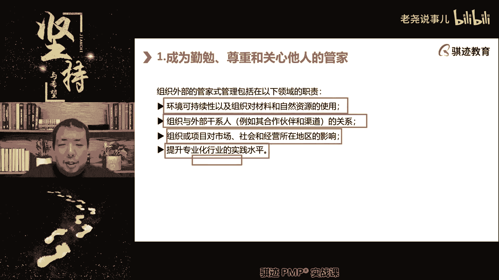
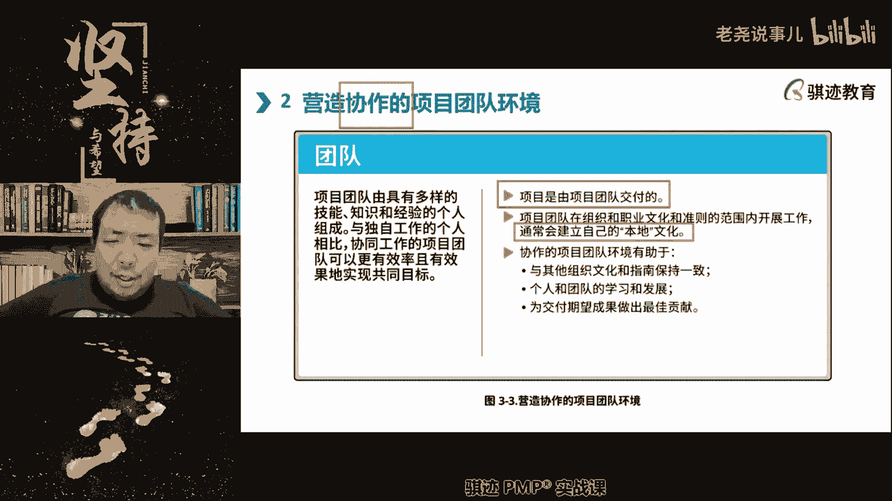

# （收费视频完整版分享）PMBOK第七版课程PMP考试报名认证培训精讲-零基础项目管理第七版教程最新版直播课回放视频免费课程资源-骐迹教育谢阳主讲 - P9：3-3项目管理原则上 - 老尧说事儿 - BV1ek4y1s71N

所以这也是PMI这两年开始转变认知，而承认向现实妥协对吧。

就像我作为一个IT行业的项目经理，我去管理一个建筑行业的项目。

可能呃也也不太能胜任啊。

虽然我对项目管理有信心，但是隔行如隔山，这个行业专业这个东西。

实在是我觉得不一定我能胜任啊，但这个得有门槛，至少等于有人带带我啊。

我知识面还是比较广，但是至少得有人带带，我明白这就是提升专业实践水平啊。

所以大家如果要转行转型的话。

往往得啊从专业知识无知识的方面去做题。

去做这个这个管理，比如说项目管理啊，所以现在越来越多的就是说项目经理。

也不能说随意的去跨行转行，可能只在行业当中。

不同子领域中国转来转去可能还行啊。

但是你要跨行业的去做这，这这这做角色的转化就越来越难度。

因为各行各业的特点就是专业程度越来越高啊，因为壁垒低的东西都会被人做烂对吧。

这就不说了啊，这是我们讲的外部的啊。

我们的领域的职责啊，那么项目经对为什么来说，对项目经理来说，提升专业的重要。

因为行业所处的环境，他的专业知识会决定了什么项目的，很多的外部环境设定和成败，所以你得你得啊掌握和了解啊。

掌握和了解，然后提升专业实践水平啊。

好那么成为合格他人管家有四个属性啊，诚实关心，可信和贵啊，这个四个大家稍微记住一下就行了啊，啊这是新提出来的啊，诚信就我目前提要诚实，那么我问你们项目经理要成时，是一种自觉自律的要求。

还是一种必须得做到的客观环境要求是哪一种，我再说一遍啊，自诚信是外部要求你怎么做，还是你自发的要求怎么做的，头一次碰到这么表达，自自发的，很多人都说自发的是吧好吧，其实我告诉你们诚信，其实从我的理解啊。

当然这个就有点扯了，反正诚信是什么大家都知道的吧，其实我自认以我的理解，诚信更多的是环境对你的要求，而非自发的，为什么知道，因为诚信才能带来别人对你的认可认同，诚信是为了别人而对项目经理来说啊。

那么那么从另外一个角度讲啊，这个这个就我们比较比较贴近现实，从嗯项目管理的本质的角度来讲，项目经理管理项目目的是什么，为了项目成功，为了给项目创造价值对吧，这是我们讲的这个这个这个理想理论状态。

但是要实现这些东西，一定得依靠别人，你要依靠别人获取别人的信任，就一定得展现出诚信，没有诚信的人是不被别人信任，所以这是环境迫使你去诚信啊，你们明白这一点啊，做项目经理，你不诚信也要被环境迫使。

要么你就会被淘汰，没人信任，你就没人愿意给你干活，没人愿意干活，你就举步维艰，什么事情做不，当然，这也是你应该从自己内心自发的啊，这句话怎么讲呢，有句话讲讲，尽量不要去欺骗别人，为什么。

因为撒一个谎可能需要用十个谎来弥补，前面不是说正直关心可信和合规吗，正直和诚信不是差不多的意思吗，正值难道不就是成年，就是有，当然这是个翻译问题啊，但确实有点翻译问题。

正直不就是诚信吗，不是一样的吗，啊那么来那么来了，这个事情有没有一种东西，但是我们只是讲管理系，说谎的人要吞1000根针的，啊注意啊，哎书上也是这么写的，这就是个翻译问题啊，前后可能有点不不对，一致。

可能第一版的，我们的校验版出来之后会好一点啊，校正版的修订版上会好一点啊，那么正直诚信，正直诚信，其实就我们讲的是什么，是一种内部也罢，胃部有一个联合，最后体现出的东西啊，这个东西其实怎么说呢。

他呢对我们管理代价是呃，如果不遵守管理代价比较高，但是我们我我要讲的是个什么话，你知道吧，如果在有些场合，你不得不善意的，或者带有为了全局目的而去隐瞒，或者欺骗别人的时候，你应该怎么做。

这个事情是比较难吧，如果你不得不去欺骗别人，或者你不得不在这种场景当中，为了整个项目不得不不正直，那你该怎么办，哎有些同学说对于某些项目来说，太诚实，做不了退的啊，是的，如果你没有办法诚实怎么办，对呀。

如果你没有办法保证完全的诚实，诚信正直怎么办，善意的谎言，这个讲的啊，那么我给大家讲讲，你们要记住一点，你是项目经理，所以你当你不得不，你当不得不去这么做某些事情的时候，那你怎么能怎么办。

你应该利用一些技巧，什么技巧的，不是欺骗啊，明明这个是红的，你给他说成黄的，明明这个是方的，你给说成原来这个是欺骗对吧，这个是欺骗，你可以利用信息差，时间差来达到某些目的，我只能做到这里啊。

那我不能说上课就叫你们骗人呃，去诱导你往那边方向想实践可能会有差异，但是我们讲深层次实践来讲，诚信正直的最终目的是什么，不是去害人，如果你不得不啊去向别人隐瞒，不愿意跟别人分享信息。

不得不让别人按照你的意思去做的话，你应该做到一个底线是什么，不能损害别人的利益，这个才是城市政的底线，有时候人没有办法完全成就，但是不损害别人的利益，是你的政治诚信的底线，就是我想说的好吧。

我只能说到这里啊，如果你必须得善意的欺骗别人，不损害别人的，欺骗是你的底线啊，第二个关心啊，关心指的是我们什么，对于我们这些事物，我们需要达到的这些事物，应该进行密切的关注啊等等。

说明什么资源可资源利用性啊，这个就是写书的人写的自然是什么意思啊，可信啊，可信指的是我们在组织内外，要准确说明自己的身份角色，就是这样行为是可以投入的，可以可信，还要求个人主动识别别人的利益。

和主权之间的冲突啊，啊注意这句啊，可信还要求个人主动识别别人利益的和冲突，此类冲突可能会削弱信心啊，它的可信指的是什么，可以被别人信赖，那个可信啊，当然这个字面意思的深化知道吧。

就是说我们要通过化解冲突，来使得你这个人是可信啊，但最后一个这个反正你们也这个，我觉得啊没什么好多讲，最后一个合规，反正这个是项目经理的，这个这个这个包含在这四个方面，政治关心，可信和合规这四个方面。

反正大家稍微记一下吧，我觉得考试每天都考，知道想办法，他让你选一选对吧。

啊有同学说甲方未必完全知道自己核心啊。

不能告诉甲方我们的实际人数，这样会甲方我觉得这么多人不值一。

那么你要告诉甲方，我们到底只挣花这么多钱。

是为什么对吧，如果你真的赚了甲方很多钱，那你要告诉我啊，甲方花的钱到底花在什么地方上，你要善意的欺骗一下工作对吧。

好那么这个不说了，我们继续往下后面讲啊，第二个项目管理原则当中。

我们要营建起协作团队新闻啊，这是一个非常重要的团队。

建立起一个团队最重要达到的目的是什么。

是协作啊，是协作，就是大家能够相互之间进行密切配合。

并已在此之上啊。

你知道吗，团队工作效能最高的状态是什么。

哎来了，如果学过TGA的来着。

团队携团队工作效能最高的一种状态。

是一种什么状态。

团队协作效能最高的一种状态是什么状态。

能不能给我描绘一下。

各司其职不差，也没有到最高。

分工明确。

各司其职，这还没有到最高，不需要项目经理心有灵犀。

嘿嘿嘿，有点这个意思啊，这个有点最高最优的状态是什么。

团队成员既明白自己在团队中的作用。

地位和职责，又能够充分相信别人。

并且配合别人，不会去计较个人得失和每个人工作量大小和回。

报以及难度的问题，我们的最佳状态是什么。

能够所有人针对项目的成功目标去努力。

而不计较其他的东西，这个时候团队的效率是最高的。

那么它包含什么因素啊，相互信任。

充分配合啊，有秩序但不拘泥于秩序。

那么这种东西也是可以诱导。

如果啊你注意啊，什么时候很容易断，如果我存在一个很大的利益诱惑。

比如说你这个项目做完了，每个人都能拿到高额奖金，但是这个项目的能够做完的。

前提是我们每个人都能做到这种配合才能做完，那么就会有利益驱使大家真正去做。

第二个，大家的感情重。

相互之间的感情重视程度，已经超过了这个这个这个这个这个一个鸡毛。

蒜皮计较这种程度，或者是相互矛盾的那种利益分歧的程度。

那么他也可以做到这种程度啊，那么这就是我一直想讲的啊。

你们如果看很多很多日本动画片，中二里面有个中二词叫做羁绊。

嘿你知道吗，为什么日本人很喜欢提这个词啊，诶你别说在管理当中。

如果能真正实现羁绊，其实是一件很容易让团队协作效能提到最高的。

人越多越要有效的协作越难啊。

这个其实我后面准备讲的，但你们既然讲这个讲。

人越多的团队越依靠什么东西啊，依靠规则。

人少的团队可以依靠相对少一点的团队，可以依靠规则。

加上我们之间的默契，因为人越多。

人心越不齐，只有规则共同规则才能够什么。

让大家能够有效的去运作，它是一个保证底线。

在这个底线之上，尽可能的去提高。

对啊。

羁绊这种东西不容易吧对吧，然后日本人最喜欢听这个词是什么动画片啊。

什么东西。

主播就是主播，主播的传销。

就是主播的家人们也是大哥的，铁子们也是哈哈。

这意思就知道啊，明白这意思了啊，那么呃，那么为什么要去注重我们的营造协作团体呢。

因为项目是团队交付的，项目经理干不干活。

管家干不干活，管家一般是不直接干活的，他是指挥别人干活。

所以最终交付价值的都是我们的团队，所以要让他们的效能尽可能最高啊。

那么团队在组织和职业文化开展项目，那么通常会建立自己的本地文化啊。

所以团队都会有什么自己的小圈子。

或者是呃局部文化，它在整个组织文化之下。

会有自己的小圈子文化啊。

而这种小圈子文化，就是这个其实就涉及到什么啊，人力资源管理。

团队管理这种东西，小圈子这种东西是受大圈子影响，但是他更多的会受到什么。

比如说项目经理，职能经理不一定，而是取决于在这个当中，小圈子文化当中影响力最高的人。

或者那一群人啊。

明白吗，这个时候不一定文化是受影响力最大的那个人。

影响啊，跟你们说一下，协作的团队有一堆什么。

与其他的组织，与其他文化组织保持一致啊。

能够帮助我们进行学习和发展，为交互做出最佳的贡献。

那么团队的建设，团队环境呃，由三部分构成，一部分是团队共识，第二部分是团队结构，第三个是过程啊，那么请注意第一部分的共识，我们会在后续有一个文件，会体现在我们的团队绩效预期当中会有体现啊。

团队纪录当中体现这个文件是什么，我们偏不过第六版就很强了，叫做团队章程，团队共识就是团队章程，体现的就是一种团队共识，注意这种共识不需要什么，不需要政治正确，也甚至不需要什么道德观念，完全正确。

但是只要是能够凝聚大家，并且能够发挥生产力就可以啊，比如说我们很简单啊，我们很简单，举一个不太不太正确的，我们团队形成共识，出来打工就是为了挣钱啊，出来打工就是为了挣钱，可不可以啊，可以我团队。

那么我只要为了挣钱，我愿意吃所有的苦可不可以，但是一定得给钱可不可以，这种共识也是可以，虽然他不太正确，我们要讲究奉献什么东西，得有人觉得这些都是骗人的，画饼可以啊，这种也可以是共识。

那么我在驱动这样团队的时候，我增大物质刺激的比例，相应的团队也能够非常努力地给我回应，是不是，这也是一种有用的共识啊，团队要形成共识应该是一种什么啊，注意团队形成共识应该是在项目经理这种管家。

在社会上以诱导形式，应该有利于促进项目的目标的达成啊，项目的目标达成啊，项目经理应该对团队共识要以引导啊，有时候团队共识会阻碍项目的达成，比如说项目遇到了挫折，然后呢。

项目内影响力最大的几个不一定是项目经理啊，有些影响力最大的那几个人就是有，有什么叫影响力，有时候有些人的能力不是最强的，权力不是最高的，但是会最逼逼的，最最最最会脚趾头哎呀，这个项目没希望了。

做不下去了，又做了，做了好几次都失败了，这个项目肯定会烂尾的不行，但不要干了，打工算了，做得再多也不行，然后大家被他感染了，也形成这种思想，这就也形成了一种，这也是团队共识。

但是这种团队共识会阻碍项目走向成功啊，这个时候项目经理有职责感知到这种团队共识，即使打破这种团队共识，所以我们讲团队共识会不断的演变啊，所以我们要诱导团队共识下，有利于完成项目目标的方向解决。

这其实也是管理学啊，注意这种事，让大家自发地认同的不是洗脑啊，洗脑不是一种长期有效的形成共识的方法啊，除非这个人脑子实在不行，像传销一样被彻底的格式化了，那就没办法了啊，好团队公式应该是这样啊。

记住不要被格式化啊，团队共识应该在团队开始时形成，然后呢持续的随着团队实际合作，然后呢并继并确定继续成功，所需要遵守的规范和实施行为，团队公司不需要呃特别的道德正确啊，什么正确啊啊，但是得用法律正确啊。

如果连法律都不正确，这个可能又是违法，这个不行啊，法律是底线啊，这是第一款团，营造团队环境当中要形成一个呃有效的啊，不一定是一定要政治正确，什么正确的实施有效的团队共识。

第二个呢要团队环境要迎接出角色职责，这个这个这个这个角色职责等等，一系列的团队的组成的架构定义啊，那么注意啊，一个团队的角色职责不一定啊，要区域环境不一定都非常重要，有些环境当中我们要淡化角色职责。

强调相互交叉支撑啊，有些场景当中呢我们要淡化这角色，但是要强化职责啊，那么还有一些环境当中呢，我们需要既强调每个人扮演的角色，又要强调哪一个职责，取决于不同的环境啊，那么总的来说，团队自觉性积极性越高。

我们越淡化角色职责，而如果团队能力和积极性不高，那么我们越要强化角色职责，明白了吗，好那么就像啊就像怎么说呢，就像在家庭生活当中就有啊，家庭生活当中就有啊，那么呃比如说啊你还是单身的时候呢。

你的角色就是一个什么单身汉对吧，但是等到你结了婚了呢，你的角色呢就会有两个，一个是职场人，一个是家庭当中的丈夫和妻子，那么这个时候呢，角色就会赋予你一定的责任感对吧，但是如果你作为一个啊。

作为一个丈夫或作为一个妻子，拒不履行自己应该在家庭中扮演的角色呢，那么啊那么呢啊家庭当中的管理者，就会对你进行什么进行管理啊，跟你强调啊，你现在是这个家里的老公了啊，你应该扮演起这些职责啊，要赚钱养家。

还要做家务对吧，那么你的职责包括什么东西啊，啊每天按时上下班，然后拿到工资回家啊，你这还包括下班之后要记得拖地洗碗对吧，这就是决策制度，有些家庭当中呢不需要这么明确，有些家庭当中呢我们会很自觉的去做啊。

像老师这个家里就是啊，我们家里并没有明确说谁一定做什么的啊，那么既可以我烧饭也可以，我也可以我带娃也可以，我给娃好吧，刷牙我们家是女儿，所以我就不能给她洗澡，这个就这个就没有办法客观条件限制。

我不能给我家女儿洗澡对吧，我老婆给我女儿洗澡，其他的我都可以啊，我们俩都可以相互之间替换，因为什么呢，两个人都希望家庭过得日子过得好，所以这个时候呢都就不用特别强调，谁扮演什么角色。

谁应该是按职责啊对吧，有时候为了管小孩呢啊，有时候什么要扮演红脸白脸对吧，这就是角色职责啊，所以我们要我们要对团基于团队环境情况，我们要帮助大家建立起一种团队的，有机组成形式。

这种结构形式可以是基于角色的，职能的职权的啊，可以继续做的对，是为了适应环境而进行裁剪的，就是为了我们为了适应这个项目环境，我们可以进行有机的协调，或者是为了满足项目需要而新设计啊，可以和组织相兼容。

也可以不和组织相兼容啊，权威人士可能会正式建立这种结构啊，项目团队会根据结构来做出贡献啊等等等，那么这个显得比较抽象，什么意思啊，我们可以根据专家的建议，我们是怎么去组成一个项目团队。

然后呢我们可以根据团队意见，对这个项目的这个组成形式和方式，决策值的定义等等的进行调整，以最适应我们开展工作和创造的，创造项目成果为呃目的，对我们的组成形式进行调整啊，那么包括了决确定决策职责。

将员工和供应商分配的团队啊，有目的性的，这有特定目的的正式委员会啊，评审的站会等等的这些东西啊，然后我们的团队环境还包括什么管理过程，管理过程，有同学问为啥是项目的外部结构啊。

因为这里讲的其实是组织结构啊，这里讲的是组织结构，你看吧，组织结构，组织结构指的是项目工作环境和组织过程之间，的任何安排联系啊，他被可以，它可以被定位，那么这个这个问题讲的很好。

我其实我准我准备后面继续讲，那就这里讲啊，这里讲我们稍事休息一下好吧，项目这这里就体现了，项目会受到项目所在组织的影响，就是你你的组织是一种什么样的形式，它会影响到你的项目内市政怎么样学习。

比如说我们的组织是一个什么高度分工，高度明确的职能，高度明确，分割分离的这样的形式，那么你很容易导致你项目内也是这样的形式，进行组合了啊，大型注意啊，越是大型的企业组织，它的职能分割往往会做的更加大啊。

但是呢这种会带来效能的下降，同样的，如果你的组织是一种效能很高的，大家不拘于固定决策，决策经常进行转化融化的，那么你的项目也可能采取这种形式，所以是外部影响内部组织的组织啊。

组织结构形式会影响到项目的组织结构形式啊，明白吧好，那么当然我这我讲项目的组成形式，讲的更加深入一点，因为这是和后面团队绩效率的团队组成，是有关系的啊，这里呢我们更多的营造了一个是什么东西啊。

项目所面临的外部的组织形式啊，这里更倾向于讲外部是怎么样，但是外部会影响内部，往往当中我们现实当中，项目都是外部是怎么样的，内部就是怎么样啊，你们的公举个简单例子，如果你们公司干活都是相互扯皮的。

几个部门不扯个十七八个来回搞不好事情的，那么搞不好你们的项目团队也是这样，如果你们公司是很高效的啊，老板一排板几个部门马上就会什么啊，涉及到如果涉及到几个职能部门，大家二话不说。

每个部门也不讲究什么责任大小啊，处理大小啊，怎么样，就会马上把那个老板说的这事情落实下去了，高能的这种这种项目组，这种企业组织架构组织形式，那么你的项目内的组成一起的往往也是这样，项目内会体现项目外啊。

好那么第三个部分我们讲的是过程啊，第六篇和第六版的叙述的主视角，就是团队会定义完成任务所分配的过程啊，那么这个呢嗯我们后面会在游戏里面讲，比如说项目团队可能使用工作分解结构，来进行分解啊。

我们的呃管理过程，执行过程也会影响到这个，也会影响到我们团队的啊环境啊，好，那么这是我们讲的，营造团队协作部分的第二部分，那么我们稍事休息啊，这里讲的会是会比较，这里讲的是会比较的慢一点啊。

后面会稍微快一点，我们现在稍事休息啊，现在是21。06分。

那么接下去我们休息了21：20分继续吧，好吧，我们先稍事休息继续啊。

那么呃团队的环境当中呢，我们要呃分解出三种对吧，这个当然也要知道。

一个是职权，一个是担责，一个是职责啊，那么这个三分简直职权很容易理解，power就是你能决定的东西，power指的就是你能决定的东西，accountable指的是什么，是对这个结果承担的最终责任啊。

责任就是说我们注意一点啊，这个英文翻译很难去表达，其实你用中文去翻译这个英文，这时候其实这个翻译有点有有一点点，那个这个可以用sci来描述的，中间的accountable怎么事啊，这个事情做好做坏。

你要承担最终结果的那个责任，这个担责明白了吧，叫accountable，那responsible是什么意思啊，就是说它是类似于像你要去去执行的这个职责，就是说这个事情得你去干。

responsible其实不是承担的，意思是你要去干的那个意思，就是说这个事情如果让你去干，那么他用responsible，所以我们会使用RACI矩阵来表达，我们项目当中啊。

每一项具体工作他应该由谁来承担责任，谁去执行，谁去咨询，谁去被通知啊，这是四种句子，指responsible is accountable，Cs consult，As inform，那么这个呢。

我们也会在后续的我们的知识领域当中啊，I也是在团队知识领域当中会给大家讲，这个就不展开了，反正大家要记住，团队当中要能够形成有效的协作和工作机制，那么我们一定程度上都是需要什么，理清每个人扮演的角色。

他有哪些权利啊，就是说这个就是我们以前拼不过第六版，以前讲的角色权利，职责啊，责任啊，那么职权就是power啊，好这几个呢啊，是我们团队当中的一些，每个人具体工作的一些设定啊。

那么无论谁因为特定的工作承担责任，无论谁负有开展特定工作职责，协调团队啊，协协作的团队都会成为负责，那么我们的责任落实点，其实应该更多的在从团队的角度，应该是落在在团队整体上，而不是应该落在个人上。

如果责任都落在个人上，那么就得到什么个人自扫门前雪啊，哪管哪管他人瓦上霜，这个大家都听过对吧，这个不利于团队协作啊，那么团队当中呢，多元化的团队可以将不同的观点收集起来，丰富团队环境啊，所以我们鼓励说。

有可能的话，团队应该有多元形成，包括内部的，外部的，男的女的，老的少的等等，不同文化背景，甚至不同国别的人，这种团队形成可以丰富我们的观点，避免偏颇啊，这也是我们营造和协作的团队环境。

但同时团队的组成来源如果更复杂，对团队的呃，呃管理者，也就是我们的项目经理的要求可能就会更高，因为不同的人可能有不同的文化背景观点，他容易和别人观点越多，越容易和别人产生冲突啊，想法和理解思维等等。

教育背景不一样，都会产生冲突，那么要求对团队有更好的冲突解决能力，和自我冲突条件的能力啊，这些东西，那么这些东西也会在我们的后面也讲啊，我们现在只是讲我们的管理原则，所以我们讲的是比较抽象，概念化的。

后面会具体实现啊，这是第二个。