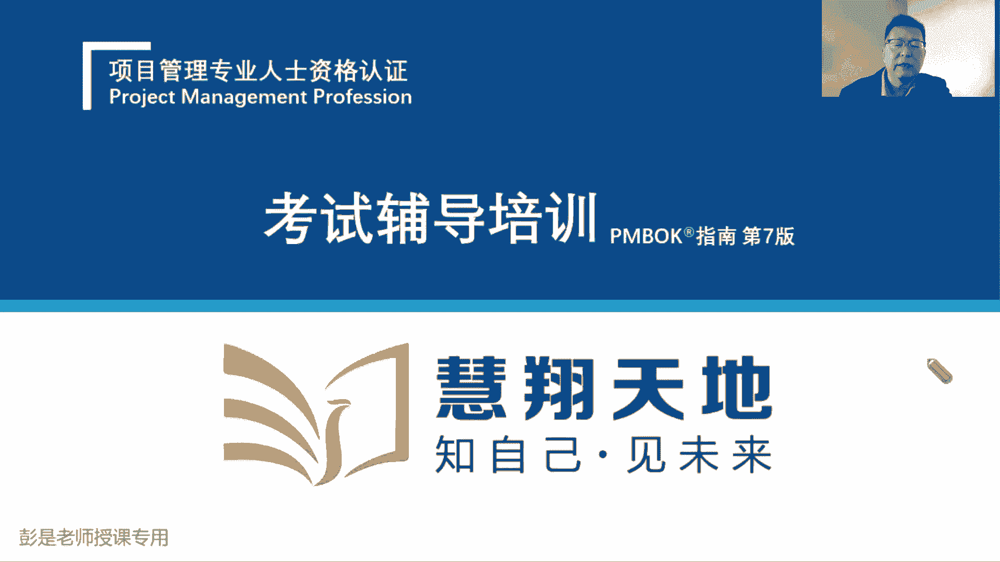
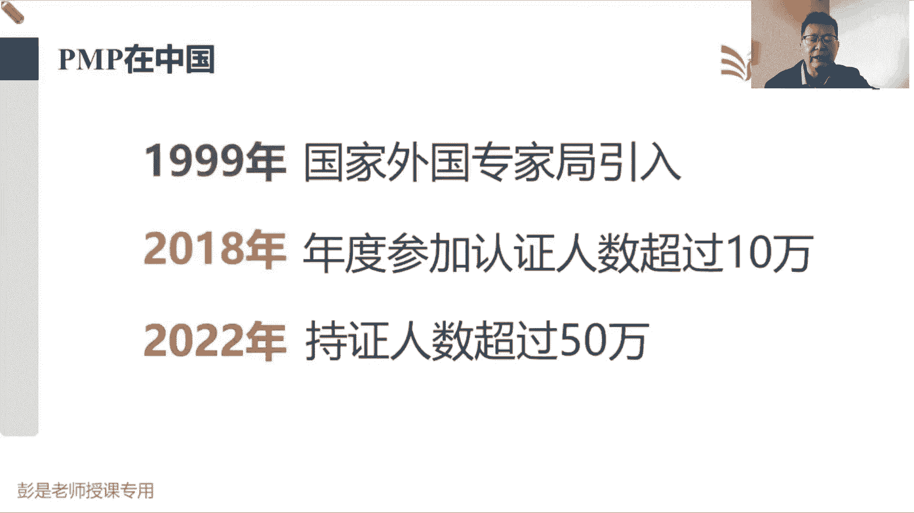

# 【新版PMP培训课程】2024PMP付费课程视频完整版免费观看，零基础通关项目管理考试！ - P1：前言--PMP介绍 - 慧翔天地 - BV1Hu4y1a7hA

各位同学大家早上好，咱们正式开始第一次的精讲课，欢迎大家来参加PMP培训了，那第一小段课程，前一个小时的课程呢，基本上大家专心听就可以了，给大家介绍一下咱学的这玩意，到底是个什么东西啊。

然后介绍一下咱考试的背景和整个的学习计划，没声音的同学可以考虑刷新重新进，检查一下你手机里面是不是关了静音了，所以第一小时的课程大家听就可以了，不需要看书，教材上也没有啊。

听一听咱学的这玩意到底是个什么什么东西，来弄去脉，把它搞清楚，还看不到课件的同学，或者是没有声音的同学，可以赶快私信班主任，私信班主任啊，课件就是现在写字的这个地方，九点钟，这就是咱的课件了。

待会相天地四个字的这个地方好，那咱正式开始了啊，第一小时的课，专心听，专心听，大概介绍一下咱学的这玩意儿。

咱学的东西呢叫PMP对吧，PMPPMPPMP证书拍马屁，好多同学管他叫拼音拍马屁了，然后咱这个考试的全称叫什么呢，叫项目管理专业人士资格认证，下半部分，这个东西全称叫项目管理专业人员资格认证。

这个证书的颁发机构是项目管理协会，注册地在美国费城，美国项目管理协会PMI简称p mi，那项目管理专业人员资格认证，看到中重点关键词在专业人员这四个字上，换句话说呀。

和咱们国家那个以考代评这种资质认证差不多，是说一旦我们通过考试拿到了证书，还就认为我们具备了项目管理，这样一个从业人员的专业水平，至少至少至少达到了一个入门级的水平啊，他算是算是初级认证，高级认证的。

还有项目集管理，项目组合管理更高级别的认证啊，那项目管理专业人员，体现我们的项目管理这方面的专业性，所以这个考试啊大家一定要重视起来，一定要重视起来，千万不要千万不要去听一些坊间的谣言嘛。

因为每个人的学习情况不一样，每个人的工作经验的专业知识啊，背景啊，知识的积累和沉淀，那不一样，所以呢所以呢你们身边的亲戚朋友同事，可能有的人认为这个考试很简单，有的人认为这个考试很难。

所以大家一定一定做好充分的心理准备，评估一下自己目前的一个情况，因为不同的人他考试难易度来说感受不同的，你相对老师来说，这个考试我觉得超简单没什么东西，但是呢对于一些工作经验，可能不那么丰富的同学来说。

学起来可能就需要有一个比较痛苦的这么一个，这么一个过渡期，因为我们需要掌握大量的专业和术语，所以做好充分的心理准备啊，这个考试没那么简单，那PMI这家机构为什么我们要学这个证书呢。

PMI这家机构成立于上世纪60年代，196几年，1964还是67年啊，到今年为止啊，大概60多年，80年80年了啊，抱抱歉，数学不好啊，快70年了，然后这家这家机构。

这家机构一直在从事项目管理这个领域的知识，知识的沉淀积累，所以呢他推出了项目管理方面的全家桶，所有的认证基本上都弃了，项目管理专业人士资格认证，咱学的这个pp，然后呢进度管理专业人士，风险管理专业人士。

商业分析，BPA就侧重于那个大产品经理那种，去分析我们项目的商业，做做可行性研究这样的人，然后还有ACP敏捷人士的专业认证，再往上走，项目项目经理再往上走，那就是我们的项目集管理和项目组合管理。

这种更高级的更高级的项目，就是多项目管理的这种这种专业认证，最后那个助理项目管理就是更初级的了，所以他就是不不停地不停地在沉淀，积累项目管理的这些方法，想办法把全球这些项目管理从业人员人员。

大家在工作中的这些最佳实践呢拿过来，我们去总结分析一下，把适用于当前这个时代的这些知识，然后呢整理成我们的教材，然后再宣传再推广，让大家去学学，以致用，在使用的过程中又会产生新的知识，然后再沉淀再积累。

就是打开这样一家机构，他专门专门就就干项目管理这个活，那关于项目管理认证，全球比较火的证书啊，现在比较火的第一大第一大最火的就是P认证，第二呢，可能有些同学也听过啊，prince store这个认证啊。

其实在欧洲认可度还可以，但是呢在在美洲啊，东南亚啊，非洲啊认可度没有这么高，在亚洲也认可度没有这么高啊，所以他的它的知识体系其实是差不多的，只不过就是只不过就是接受度有区别啊，然后咱们国家。

那咱们国家现在国标委也在出，咱们国内国内的这个CSPM，就中国的项目管理，项目管理的这种专业认证，这个后面再说了，就是因为这家机构做的火药，那p mi目前它的火爆程度达到一个什么情况呢。

全球在在全球200多个国家和地区，已经开通了考试认证机构，基本上无死角覆盖，除了一些极度的不发达国家，或者是个别的小国家没有考试认证机构，基本上发展中国家，中等水平的国家，发达国家基本上无死角全覆盖。

目前全球全球，在它的在他注册的会员一共达到了300多万人，然后持有有效证书的人已经达到了120万，120多万，然后75%的企业全球化，在招聘项目经理这个岗位的时候，会优先考虑拥有PMP证书的认识。

所以这东西目前从各个角度看，它在全球都是比较火，那火就说明这玩意有含金量，否则大家为什么要花钱去学呢，这好理解吧，火呀就说明这个证书还是只受指，还是有含金量的，值得大家去投入时间精力。

时间精力成本去考一考，那全球目前持有有效的p mp证书的人士，一共达到了120万人啊，时政国时政国第一大时政国是美国，第二大持政国，就是咱中国以前第二大持政国是日本，然后呢。

咱们19年还是18年量已经超过了日本，现在我现在我们变成拥有第二大，第二大拥有便宜征收的国家，然后咱们国内国内啊，只有pp证书的最多的企业是谁呢，咱找标杆了，改了后一大盘菜啊，华为华为目前拥有。

在国内拥有pp中是证书是最多的，他希望他的管理人员都去学这个玩意儿，华为肯定不会不会花这种冤枉钱吧，唉肯定不会让大家去花钱，做一个没有意义，没有价值的事情，所以呢这个东西既然都得到了华为的认可。

就说明它的含金量还是有的，希望大家通过学习，能够掌握一些项目管理涉及到的这些知识，然后把知识根据我们的项目实际情况，灵活的运用到工作中，可以帮助我们提高项目成功的概率，这是这套体系最大的意义和价值。

所以这玩意我这玩意有含金量，这玩意考试就自然而然有难度，这都不用想简单的东西，相信大家不不愿意去投入时间，不是不愿意投入时间资源成本去考啊，比如说什么啊，四则运算，四则运算证书加减乘除加减乘除正负。

相信大家不愿意投入时间，精力成本去考这个东西，因为这东西没有价值，没有意义，对不对，就这个意思啊，那PMP在中国的情况是，到今年为止应该是24年了，对不对，并入了中国国际人才交流基金会。

所以大家注册的时候中文中文报名，中文注册的时候会看到这个网站，不叫外国专家局了，那18年年度认证人数首次超过了10万人，2022年，在国内持证人数已经超过了50万人，然后23年今年考试人数。

考试人数至少至少应该三四十万有了啊，所以这个东西啊越来越火，考的人越来越多，所以希望大家坚持坚持坚持，这玩意火，这玩意考的人多，这玩意没那么简单，但不代表这通过率高啊，通过率看大家的学习情况。

看老师看机构。