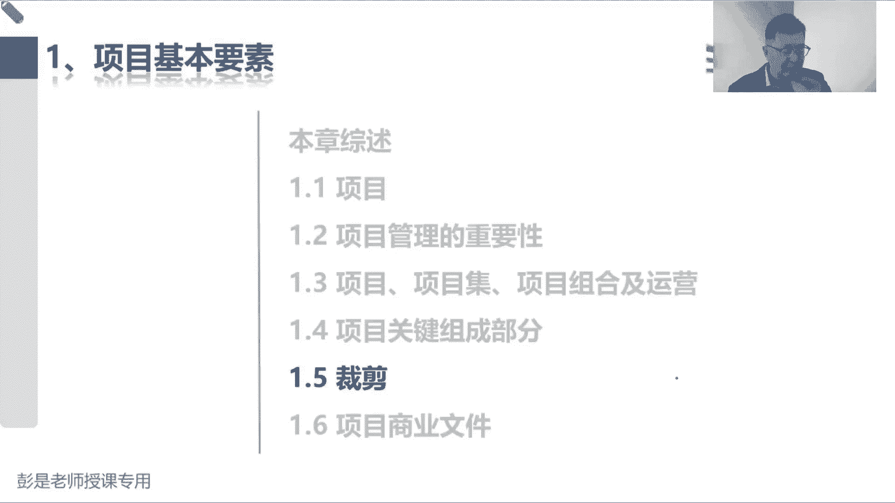
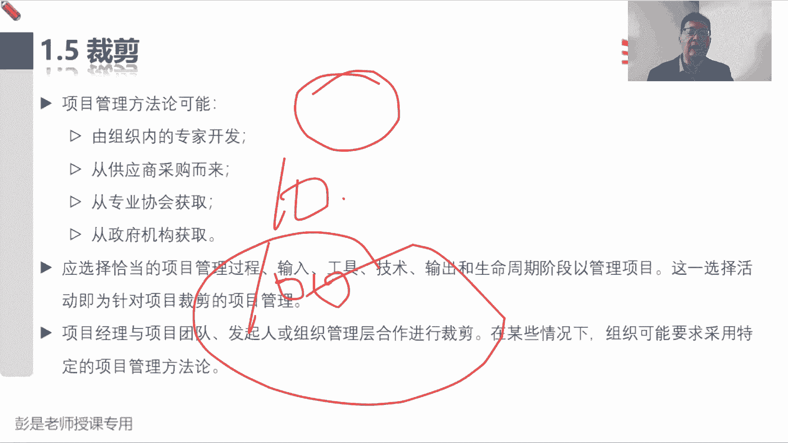
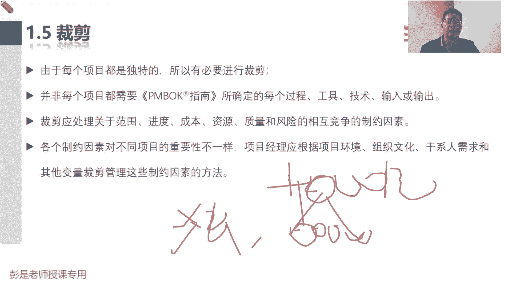
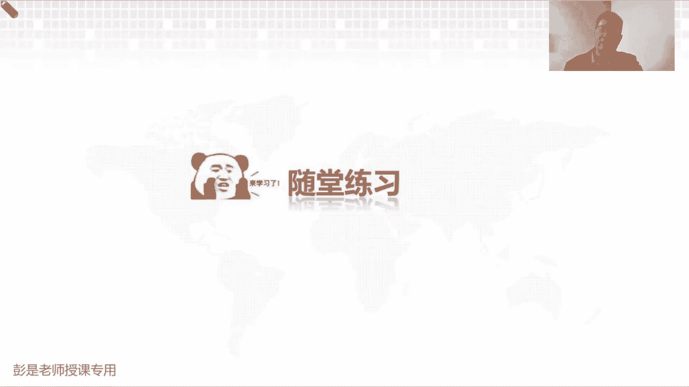
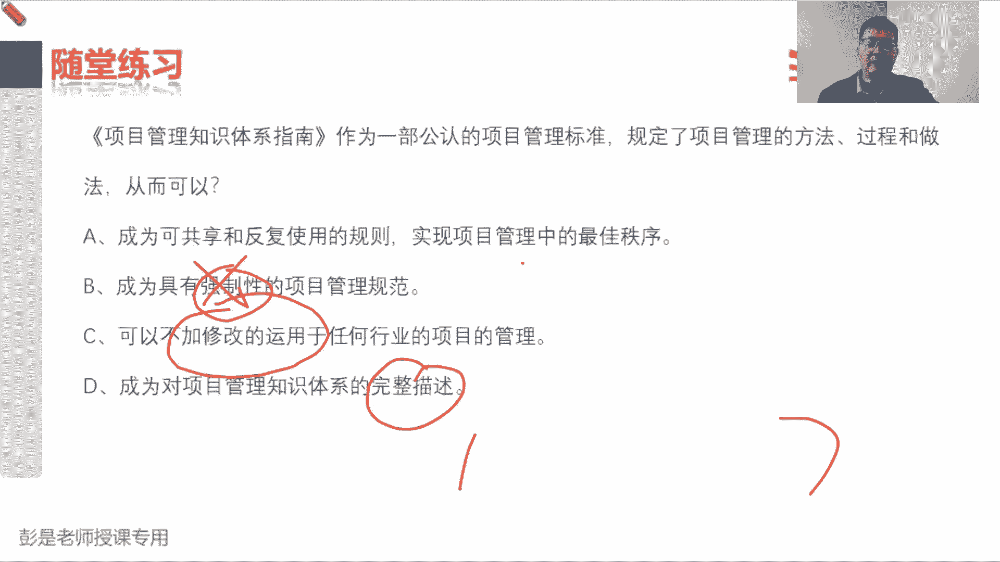
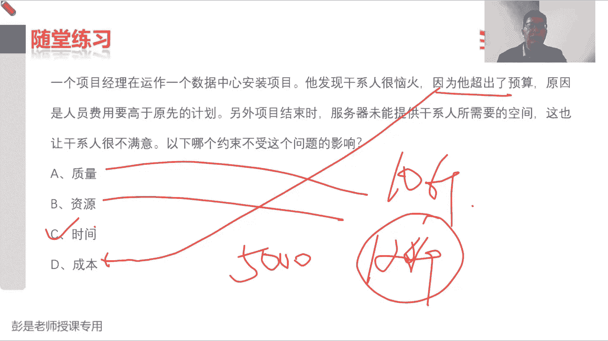
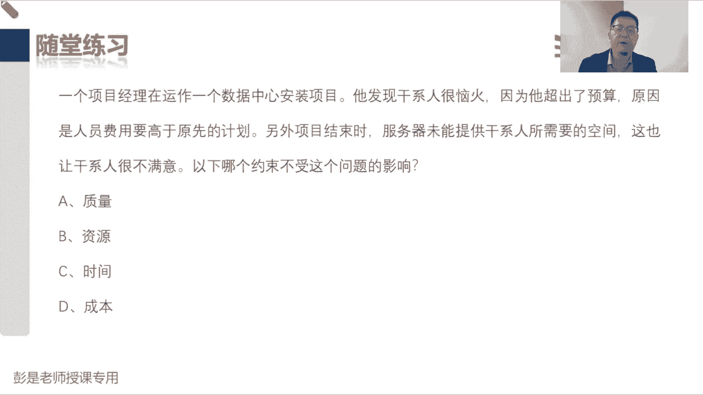
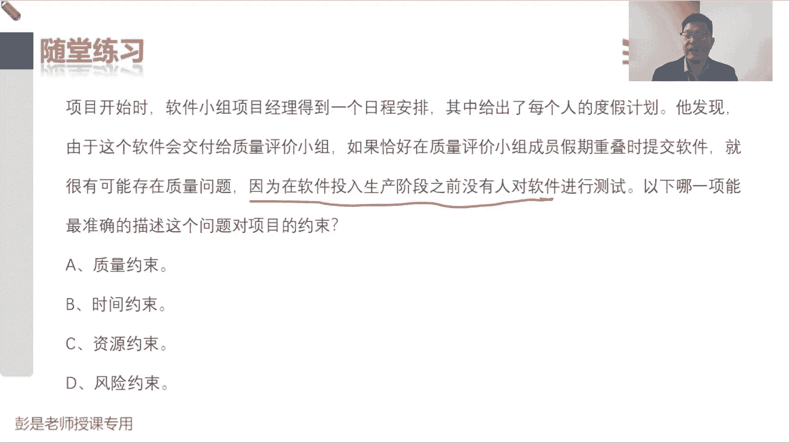
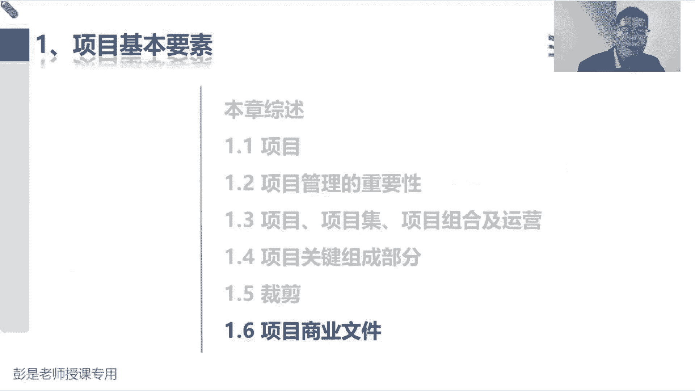

# 【新版PMP培训课程】2024PMP付费课程视频完整版免费观看，零基础通关项目管理考试！ - P10：1.5 裁剪 - 慧翔天地 - BV1Hu4y1a7hA

好各位同学，还有十秒钟即将开始下一小段旅行了，在知识的海洋里遨游啊，爬过一座山，又来到一座山，爬到一座山，又来一道一座山上不断的上升，这说明我们掌握了更多的知识，不要腻死啊，老师在哪。

我会伸出援助的小手好，接下来回顾回顾啊，有同学问啊，说生命周期涉及到的阶段具体是哪些阶段呢，刚好讲到1。5，这是裁剪，根据项目的情况来选择合适的阶段划分，刚才想一想，我们餐厅装修。

餐厅装修就需要明确阶段了吧，要搞设计啊，然后施工啊，然后呢打扫卫生，那你垒个猪圈就不需要这么复杂，就可以把阶段合并合并啊，甚至看到一些不必要的阶段了吧，这个操作就叫裁剪。

所以裁剪这个知识点啊在工作中很重要，我们要根据项目的情况去分析，采用什么样的方式去完成这个管理工作，但考试来说呢，考试来说呢，这玩意其实没法考没法考啊，到底怎么裁剪呢，只能是看情况。

生命周期阶段换成白话指一系列的步骤，可以这么粗暴理解啊，不管你是不管你是做什么，做什么类型的项目，你把你的把你的行业爆出来去想一想，对不对。

所以不同类型项目阶段划分是不一样的，好接下来这段内容听就可以了，他考试来说呀，没法考啊，那项目经理啊，通常把项目管理方法用于工作，然后巴拉巴拉，我们建议在裁剪时参考本指南的项目管理标准，什么叫裁剪。

就是量体裁衣，对症下药，量体裁衣对症下药吧，可根据项目的实际情况去分析，我们应该用什么样的阶段呢，用什么样的工具过程输入输出，用什么方法去完成这些工作，所以这就叫裁剪，量体裁衣，对症下药。

根据项目的实际情况去分析嗯，所以这东西啊这东西变成大白话，再想一个场景啊，比如说你去看病，去医院看病，是不是每个患者的情况不一样，医生的什么检查方法呀，治疗方法呀都不一样了。

这就叫裁剪呢，看情况看情况，所以我们应该选择恰当的过程输入工具，技术输出和生命周期阶段来管理项目，复杂的项目可能阶段就需要划分的细一点，多一点，简单的项目呢这个阶段呢就可以合并，所以天下大势，合久必分。

分久必合，就这个大道理，知道这个意思，知道什么是裁剪就可以了，那知道什么是裁剪的，还要去思考啊，为什么要裁剪呢，就是因为每个项目情况不一样，每个项目有每个项目的独特性，所以才要裁剪啊。

好它取决于这个项目的规模和复杂程度，就这个大道理吧，把把它从小放到大，比如说我们那个牛肉面馆炒一个炒一个鸡蛋，西红柿就炒这么一个菜，咱有必要把它分成N个阶段吗，可能直接直接这这菜就炒了，对不对。

那你炒十个炒十个鸡蛋，西红柿，炒100份鸡蛋，西红柿它的规模在不断的扩大诶，规模越大，那是不是就需要精细化的分工了，要想一想了，想一想了吧，这活儿方法就不一样了。

就这个东西啊，所以知道什么是裁剪，知道为什么裁剪OK了，因为项目有独特性，所以需要裁剪踩点是什么呢，就是从开始到结束，看看阶段怎么划分，看看每个阶段之中虽然都有五大过程组，启动规划，执行监控收尾。

看看我们需要采采采用哪些管理过程，采用什么样的输入输出工具技术去干这个活好。

所以这段文字啊，大家其实课后就可以不看了，可以不看了啊，知道什么叫踩点就完事了啊。

做做题巩固一下裁剪这个大道理，答案是啥呢，说咱们这个教材呀，项目管理知识体系指南，作为一个公认的项目管理标准，规定了项目管理的方法，过程和做法，从而可以怎么样，A成为可共享和反复使用的规则。

实现项目管理中的最佳秩序，这没毛病啊对吧，这玩意儿可以分享啊，然后这玩意在项目上都用得上啊，大家做项目的时候，参考一下这个体系里面给出的标准，然后根据项目的情况做裁剪，这是对的。

B成为具有强制性的项目管理规范，这肯定不对，C可以不加修改地运用于任何行业的项目管理，这也不对呀，要根据项目的情况做裁剪，D呢说成为对项目管理知识体系的完整描述，这也不对对吧，我们从第一版，第二版。

第三版，第六版，一直到推到第七版，是随着时代的发展，随着知识的知识的更新，不断的推陈出新，旧的知识，去掉新的知识加进来，所以它不是对整个知识体系的完整描述，只是把适用于当前这个时代的，最新的知识放进去。

哎，所以BCD都不对，正确的答案就是A楼下同学总结的非常到位啊，指南指南指南就是指导手册，指导手册啊，告诉我们应该注意有哪些注意事项，好这道这道题搞定。

再看看这道题，选什么呢，54321，买定离手，所以最后的答案是C，最后的答案是C，为啥呀，超过预算了，就违反了成本约束对吧，我找张三说，你给我花5000块钱，花5000块钱买一个128G的手机。

张三买回来手机6000块钱，他就违反了成本约束，那买回来128G的手机实际可用的空间，如果假设只有十个G，这违反了什么呢，它既是质量约束，又是资源需求啊，又是指资源资源约束吧。

服务器未能提供该型人所需要的空间，这既违反了质量约束，又违反了资源约束，题目并没有体现出张三违反了时间因素。

时间因素是什么玩意呢，比如说我跟张三说呀，11月17号下班之前，这个手机一定要拿给我诶，那如果张三啊，11月17号20点才把这个手机交给我，这说明他违反了时间约束，违反了时间限制。

所以呢以下哪个约束不受这个问题的影响，答案就是C，怎么理解资源约束呢，我需要128G的空间，这是不是一个资源约束啊，你租个车需要坐五个人，结果人家送过送过来的车只能坐四个人，是不是违反了资源运输。

同时它也是我们对这个东西的质量质量要求啊，好所以建议的答案就是C了，题干理解的不太到位啊，不要慌不要慌。

都会有一个学习的过程的，好，这道题呢这道题也有坑啊，做好心理准备，祝各位同学好运，没错，员工也算资源，好准备了，54321买定离手啊，这道题不少同学选C啊，选D呀，这道题需要认真读题，还有人选B说啊。

项目开发项目开始时，软件小组得到一个日程安排，给出了每个人的度假计划，他发现由于这个软件会交付给质量评价小组，如果恰好在质量小组休假期间，休假期间，这把是提交软件，就有可能有质量问题。

因为在软件投入生产阶段之前，没有人对软件做测试，你像哪一项能最准的说了，这个问题是项目的约束，这是什么呢，因为没有人，因为没有人，人呢也是资源的一种，所以呢是资源约束，答案是C，根本原因是因为没有人。

根本原因是因为没有人诶，所以是资源约束，其他答案都不对啊，导致问题的根本原因就是因为没有人，如果有人，如果有了资源，对其他的东西就不叫事了吧，哎这就是这道题，不是时间约束啊，什么叫违反时间约束啊。

不能按期交付才是时间约束的，早上迟到，公司要求九点钟上班，结果我迟到了，这才违反了时间约束，你公司都有考勤吧，公司要求九点钟上班，结果我9。05才到公司啊，这才违反了时间约束，没有风险约束，这个玩意儿。

没有风险的约束，这玩意啊，选C不代表着说不要不要预测风险啊，它不是一回事，所以大家知知识领域还没有充分全面掌握，之前这种题先跳过，可不可以跳过啊，后面通过学习再复盘，这种题才能更好的理解什么叫质量。

什么叫资源，什么时间，什么叫风险，如果经验还不太丰富的同学，那就等后面学完知识领域再回过头来复盘，资源不足的意思啊，就明显是这个明显告诉你了，因为没有人呢，因为没有人吧，已经给了根本原因了。

考试题型比这种题更复杂呀，这种题都是送分题啊，买不起房，买不起房根本原因是因为穷，而不是说明年买，后年买，到后年买，根本原因都是穷啊，如果有钱就什么时间买都无所谓了。

都不重要了，对不对。

