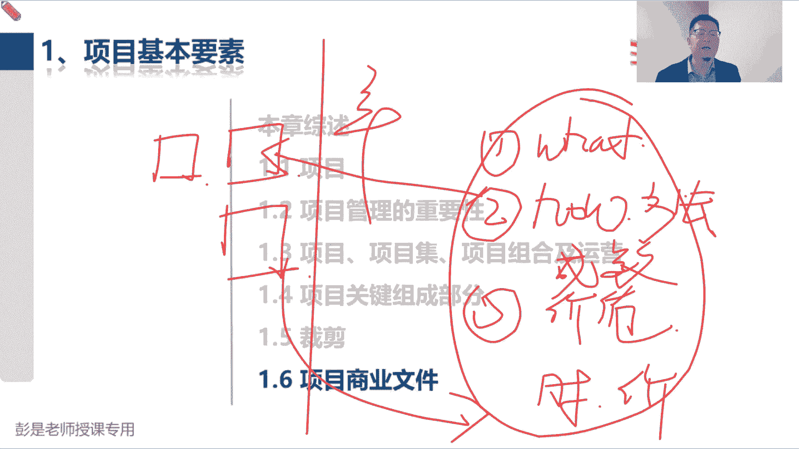
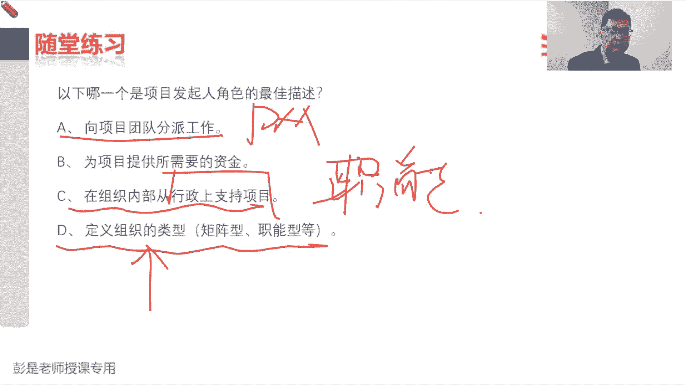

# 【新版PMP培训课程】2024PMP付费课程视频完整版免费观看，零基础通关项目管理考试！ - P11：1.6 项目商业文件 - 慧翔天地 - BV1Hu4y1a7hA

听懂听懂这个道理就可以了啊，后面会讲只是大知识领域的，到时候再说了。

扎心啊，扎心就对了，提提神提提神，好再往下拉，还有同学学过第五版呢，我太古早了，早就改了早就改了啊，现在资源涵盖的覆盖面更广了，不仅仅包括人，还有包括物资，那接下来1。6，项目管理商业文件，专心听。

专心听刚才那个痛苦的记忆，翻篇翻篇啊，商业文件其实讲完了。

其实讲完了哈，根据刚才储备的知识，看PPT说项目启动之前的需求评估，找商业机会，找到项目之后，找到项目之后，我们通过商业论证去分析这个事情的可行，性格价值，然后呢通过教育计划告诉老板。

我们什么时间赚多少钱，然后画一条线，这事跟咱没关系，发起稿发警告啊，那如果这个项目又有可行性，又有价值，发行总公司的流程，向公司申请，我们要投入资源资金人财物去做这个事情。

才通过项目章程给项目经理做授权，这个项目章程现在听不懂没关系，后面再说，那商业论证啊，这里面到底写什么内容呢，先有大概的方向了，商业论证到底写啥内容呢，第一，先写清楚我们要做什么事对吧。

我们要给给餐厅装修，我们要买设备，我们要买设备，我们要给甲方盖房子，我们要给甲方去修路，我们要给甲方开发软件，我们开发研发自己的手机，研发自己的汽车，先把这个业务的需要写清楚，这是what，然后呢。

接下来去思考这活都能怎么干，这是号吧，我们要分析公司的形式啊，看看咱公司有啥优势啊，有啥劣势啊，都有哪些方法可以满足用户的业务需要对吧，不要把鸡蛋放到一个篮子里啊，一定要找到更多解决问题的方法。

就用到了什么备选方案分析，这样的事情都有哪些方法解决用户的应用需要，用户需要需要哪个猪圈，哪猪圈，还有很多方法呢，可以用砖头，可以用木头，可以用铁丝网，可以用铁栅栏，可以用竹子，可以用水泥板，诶。

这不是找到更多解决问题的方案了吗，那找到这么多方案呢，接下来我们要去继续分析这些方案的成本，效益是什么样的呢，成本是多少，能赚多少钱，要考虑钱吧，最后呢就给老板说清楚，这么做的价值在哪。

这就是商业论证最核心最核心就这么几块，人家要做啥，我们都能怎么做，怎么做，最好说清楚为什么，因为他有价值，因为他赚的多，那效益计划主打一个什么呢，刚才说的就是时间点和价值，对吧。

餐厅开业以后三个月收回成本，然后到第六个月，第六个月我们打算利润实现10%，第十第12个月能赚他100万，两年以后我们两年以后实现财务自由，哎，告诉老板，我们的短期效益，长期效益，长期效益啊。

持续性效益就是什么时间赚多少钱，这一大块就是商业论证和效益计划，最重要的主要核心内容。

听懂了这个核心内容，再看这堆文字，基本上就差不多了，好项目经理需要确保项目方法，紧扣商业文件的意图，给出了定义什么商业论证效益计划好。

再往下这100000%要记住的知识点，发起人通常负责商业论证文件制定和维护，他管这个事儿了，他主导这个事情，他有这个决策权，那我们干啥呢，配合项目经理负责提出我们相关的建议和见解。

从而使得商业论证项目计划，项目章程和效益计划保持一致性对吧，提出我们合理化的建议啊，好记住第一小段啊，那后半段呢基本上大家听一遍就可以了，说呀我们可能会维护什么项目经理和项目集啊，要合作保持一致性啊。

总之啊有领导啊，项目集项目组合都要保持一致性吧，各个层级各个层级我们大方向要保持一致，虽然各个层级有各个层级的各自的目标，但总体的目标要保持一致性，再听一遍就完事了。

好接下来再出这张图，这张图啊，这个和这个不用记，这个和这个不用记，只要记那个大框架，反复给大家说的这个东西，就是项目启动之前，发起人搞这三个事情，许多评估商业论证效益计划的制定，然后呢，项目经理负责。

中间根据新闻周期划分为不同的阶段，阶段之间放进动端口做决策，项目结束以后，我们的成果要移交运营，那有些项目可能结束的时候不不一定能赚钱啊，可能还需要跟踪一下运营，以便于去验证有没有实现目标效应。

把这个大的框架，这个大的脉络给他搞定就可以了。

好161，那商业论证是指文档化的经济可行性研究报告，用来巴拉巴拉巴拉巴拉巴拉，这些都不念了啊，他列出了我们为什么要做这个项目，要达到的目标是啥，对不对，因为能赚钱，因为不是名就是利啊，有性价值。

无形价值啊，它有助于在结束的时候衡量项目是否成功，这都不念了，反复说的东西就巴拉巴拉了，好再往下找到这个东西，需求评估通常是在商业论证之前进行，包括要了解我们到底要做什么事对吧，人家的业务的目的啊。

目标是啥，什么有什么问题，有什么机会，这些文字都不需要去背啊，都不需要具备需求评估，就是找项目看看我们要做啥，上一论证呢就是把这个word抄过来，告诉我们老板要做一个什么事。

然后呢去思考这事儿我们都能怎么干，告诉老板怎么干最赚钱，然后呢下一句话就是把这个钱抄过来，再写一个时间，告诉老板什么时间能赚到多少钱，知道这个知道这个逻辑关系就够了，具体的内容也考试也不大，会考太细了。

现在基本上就是考思路，思路正确，逻辑思维够了，然后底层逻辑掌握了就够了就可以了啊，嗯好再往下这两个单词需要科普目标，咱已经知道了对吧，我们要降低成本，要提高质量，要实现小目标，赚他一个亿啊。

我们为了提高客户的满意度啊，这是目标，目的是什么呢，什么叫目的，什么叫目的啊，这不少同学写写文档，不知道咋写，目的是啥，他做这个事情的目的，吃什么不是不是我吃的就是糖，为什么做没错。

动机目的对动机目的对动机，动机这个词就好理解了吧，他为什么要做这个项目，对吧，客户为什么要盖这个住宅小区，客户为什么要修这个路，他为什么让我们给他做这个软件，目的对动机，那目的不同。

我们给出的解决方案是不一样的，目标就更具体，目标就更具体，目的呢更宏观没错，因为动机不同，最终我们给出的解决方案是不一样的，这是非常重要的一个理念啊，什么叫动机不同方案不同呢，什么叫同机不同方案不同。

比如说吃饭，嘿不同的饭局动机不一样，是不是这个饭吃的就不一样了，有的饭局是为了答谢客户，有的饭局是为了行为受贿啊，有的饭局你是为了相亲啊对吧，有的饭局是为了庆功啊。

有的时候吃饭是为了解决基本的温饱问题啊，有的时候吃饭呢是因为时间来不及凑活一口啊，还动机不一样，解决方案就不同，同样是吃饭吧，动机不同，解决方案就不一样了，吃得饱和吃得好，这是两回事啊。

所以他就决定了我们的多快好省，就决定了我们更细节性的这些目标，所以我们要考虑用户为什么做这个项目，他的动机是啥，然后根据他的动机才能够对症下药，给出匹配的解决方案，所以大家应该听过一些新闻呐。

像这种工程啊，面子一定要做足，是不是面子要做足，这个方案我们就要考虑了，怎么让人家看起来高大上的。

好再往下了啊，那161商业论证，他商商业论证包括的内容，这段内容啊，基本上都是在家听一遍，记到那个核心就可以了，什么核心呢，就是what好，然后how much对吧，What how how much。

做什么事怎么做，能赚多少钱，咳咳做什么事怎么做，能赚多少钱，所以业务需要就告诉我们人家要啥。

然后呢分析形式就去思考都能怎么做，并且不要把鸡蛋放到一个篮子里，我们要找到更多解决问题的方法，所以通常用到了备选方案分析，这种分析方法对吧。

分析形式就用到了备选方案分析，找到更多解决问题的方法，然后呢给老板提出我们合理化的建议，推荐一种方法告诉老板这么做能赚多少钱，再把推荐一种方法告诉老板，我们能赚多少钱，就是how much。

然后再往下目标，听前面的课程说过了，没必要反复讲了吧，提高效率赚钱，降低成本，提高质量，不同的项目有不同的目标啊，不同的项目有不同的目标吧，你减肥也要也要有目标吧，多长时间减多少斤。

达到一个什么样的标准和要求啊，对吧，是运动减肥呀，还是什么什么怎么减肥呀，这都是你啊可以可以不断不断细化的目标啊，然后162效益计划，效益计划就记一个知识点，就是时间多长时间多长时间能赚到多少钱。

知道这个中心思想具体的内容，小细节性的内容也不太需要去背了，所以效益计划描述了实现效益的方式和时间。

以及这一相应的衡量机制，所以目标效益战略极致性，实现效益的实现阶段需要益长，短期效益，长期效益，持续效益啊，因为有的项目啊到了某个阶段就可以赚钱了，第一个阶段我们给客户做设计。

第一个阶段我们给客户做设计，客户打款给了10万块钱，我们一算成本是8万，就已经开始赚钱了，但有的项目呢可能需要项目结束以后才赚钱的，这就是记到这一行其实就可以了，然后指定一个自认人去进行测算。

进行测算了。

好再往下了啊，那制定消息计划，后面这段文字巴拉巴拉不念了，看一看就可以了。

再往下什么什么巴拉巴拉都不念了，看就可以了，再往下163，这两个东西非常非常重要，但是呢我们现在先不讲，等到整合这一章再说了。

所以呢跳过它164看看是不是已经讲完了，多快好省范围，进度，成本，质量，历来作为是作为项目是否成功的一个重要因素，范围进度成本质量，李白作为评价项目是否成功的一个重要因素，对吧。

比如说减肥就顺着这个话题往下讲呗，对吧，我要减肥，减肥是为了为了为了穿漂亮衣服对吧，那你要定目标啊，一个月减多少斤啊，是减腰围呀还是减大腿啊，这都要细化呀，所以范围进度成本质量多长时间花多少钱。

花多少钱，达到什么样的质量标准和要求，完成什么工作，产出什么成果，通过这些东西评价项目成功不成功，那除了都快好省，除了都快好省了，第二个，第二第二第二个需要重要的评价指标是什么呢。

教材里面应该有没有的话，就写一下这个，满意度，我们还要考虑主要干系人，重要干系人，关键干系人，他们对项目的满意程度，因为有的项目啊，你即使做到了多快好省，人家也不一定满意，这目的对动机。

你减肥的目的是啥，是为了穿漂亮衣服，还是为了相亲，还是为了有一个强迫强健的身体，对动机动机还不理解，就想一想作案动机，犯罪动机啊，有的人杀人是为了图个乐，有的人杀人是为了过瘾，有的人杀人是为了报仇。

有的人杀人是为了赚钱，动机不同动机不同，解决方案就不一样，好这个单词这么难理解吗，那考虑谁代码印度呢不知道爱谁谁不重要，主要关系人重要关系人关键干系人活学活用啊，亲大家脑子一定要灵活起来啊。

不然就这个状态超超超级危险啊，好所以到底是谁，我也好奇到底是谁，我也好奇啊，看情况看情况活学活用啊，他只是指导我们，我们应该调查调查这些人的满意程度，来评价项目是否成功，那到底调查谁呢。

每个项目情况不一样，内部项目可能不涉及到客户啊，供应商啊，外部项目还需要考虑客户吧，那有的项目还需要考虑社会社会影响的对吧，比如有人有人采访说，诶我不看工资条，我每天跟着领导看领导怎么开会。

我就心满意足了诶，我希望离领导近一点，他没考虑社会影响，是不是就是造成了严重恶劣的，不不良的社会影响的哎，那大家都不满意，大家都不满意，他就可能慢慢的慢慢的对吧，蒸发了几十几十个亿了，结果这个东西啊。

所以情况不一样，情况不一样，到底调查谁的满意度呢，取决于这个项目的具体环境，一定是这样的啊，好但是重要的是项目结束的时候，我们一定要调查满意度，所以你看看你打车叫外卖对吧，打车叫外卖，订酒店订机票。

交易结束的时候，人家都给你推个问卷，先给个好评，他就是调查客户的满意度，对不对嗯，活学活用活学活用啊，整本教材里面没有太多的基因标准，没有太多的唯一标准，说必须是能绝对这么干，全都是非常灵活的概念。

好再往下JS这五个玩意儿，大家又要开始烧脑了啊，这个东西一定要记住它，净现值，投资回报率，内部报酬率，回收期效益成本比，但这五个东西到底如何计算，如何计算，不考啊，基本上不考。

以前还偶尔会出现在基本上不考它的算法，我们根本不需要操心，但是我们要知道这五个指标代表的含义是啥，这五个指标代表的含义啊，先搞定这个玩意儿，这个应该不太需要解释了吧，投资10万块钱开个牛肉面馆。

多长时间收回成本，这就叫投资回收期，所以多长时间收回成本，多长时间收回成本呢，那这个收回成本的周期是长好还是短比较好，只要我们要能够理解，投资个餐馆，人家跟你说50年收回成本，80年收回成本对吧。

咱都挂了，都嘎了，唉，不好不好，收回成本越快越好诶，能够掌握到这，get到这个点就够了吧，所以投资回收期越短越好，风险低，这是第一个知识点，然后啊其他这一大堆财务指标，我就先把投资回收期掌握的划掉了啊。

其他财务指标，净现值，投资回报率，内部报酬率，这仨是一伙的，这仨是一伙的啊，然后BCR单独一会，BCR效益成本比，说白了就是用收入除以成本，用收入除以成本，那大家想这个道理。

这玩意这玩意儿大于一说明什么呢，我一碗牛肉面成本是十块钱，然后卖给张三买，卖了八块钱，我肚子叫了，卖给张三，卖了八块钱，说明赔了诶，我一碗牛肉面成本十块钱，卖给李四，卖了21块钱赚了。

所以BCR需要大于一，BCR需要大于一吧，才能说明有钱赚啊，记住这个结论啊，投资回收期越短越好，赚钱不赚钱不知道，所以他越短越好，风险小，效益成本比这个指标需要大于一才说明有钱赚，那是不是越大越好呢。

越大越好吧，哎记住这个结论，不是净收入，就是收入，买了一瓶，买了一瓶可乐，成本三块钱卖给张30块钱，BCR等于三，越大越好啊，越大寿命赚的越多呀，不理解不理解的同学，你就全都变成场景去理解啊。

我买了一瓶可口可乐，三块钱成本卖给张三五块钱对吧，他等于1。7哎，赚钱了，买了一瓶可口可乐卖给李四啊，卖了18块钱，他等于六更赚钱呢，所以这个数字越大越好，好那上面这一大堆指标大家记不住的。

什么NPVILILOR这堆就粗暴理解啊，叫其他指标，其他指标呢它是算利润的，所以它大于零就说明赚钱了，它大于零就说明赚钱了，先定结论啊，先听结论，先听结论，其他指标大于零就说明有钱赚。

并且呢它也是越大越好，这一段这五个指标记结论就可以了，他到底怎么算，根本就不重要，也不大会考回收期越短越好，赚钱不赚钱不知道，所以它越短越好，因为这回收期越短，说明风险小。

BCR这个指标需要大于一才说明有钱赚，并且呢越大越好，说明赚的多，其他指标是算利润，所以呢他只要大于零就说明有钱赚，并且呢也是越大越好，好啊大于零只是名义上的赚钱吧。

要不要至少至少为什么叫名义上的赚钱呢，你要跑赢跑赢基准利率利率啊，就这个道理吧，这个太细了太细了啊，PP不考算法都不考算法都不考算法，都不考算法，都不考计算方法都不考，重要的是说八遍好。

所以作为项目的项目经理，我们能够看懂这些财务指标代表的含义就够了，作为一个项目的项目经理，我们能看懂这些财务指标代表的含义，缩写要记吗，要记缩写要记得啊，NPV净现值RYRRR这些记不住的话。

你就认为他叫其他对吧，回收期DPP，然后呢BCR单独计大于一。

这五个财务指标搞定好，再往下什么项目成功，还可能包括其他标准，这些文字全都不需要念，不需要背了啊，项目经理不算这些指标啊，有可能会参与到这些指标的计算啊，但不一定啊，项目经理可能会参与到项目之前的科研。

这件事情里面去，但在目前考试是不要求大家掌握这些东西的，算法了，后面会说到计算，大部分的计算题基本上不考，大部分的计算题基本上不考啊，尤其是一些什么什么算算什么这些财务指标啊，算什么算什么时间啊。

成本啊，这些东西基本上不考，因为这个道理也很简单，咱中国中国人计算能力太强了，计算能力太强了，好后边这一段这一段可以不记了，可以不记了啊。

做做这一段的题。

看看这道题，做完这道题，咱们来个很短的很短的短休息，然后再继续，啊计算好多分啊对啊，所以现在基本上不考了，这简单吧，说这个文档我们要树立一个项目的战略意义，以及对公司的好处。

所以就选B商业论证就选B上一论证啊，不解释了啊，你向哪一个是项目发起人的角色的最佳描述，这还值得大家去猜一猜，发起人发起人他干什么事了，需求评估，商业论证，效益计划的制定，来告诉老板。

我们这个项目又有可行性，又有价值，来去向老板申请，我们完成项目所需要的资源和资金，就这句话吧，诶他去向老板证明这个项目又有可行性，又有价值，来申请我们完成项目所需要的资源和资金，所以变成场景。

就是告诉变成场景，就是告诉老板，我们投入十个人工期，大概五个月，成本大概大概十个10万块钱，这活完了之后啊，能赚个20万，30万的，就这个意思啊，所以答案是B为项目提供所需要的资源和资金，A这活谁干的。

项目团队分配工作，这一看就是项目经理，高对吧，我们给兄弟们分配任务啊，C从组织内部行政支持，行政支持，这活谁干的，职能部门，职能部门这个概念需要解释吗，什么叫职能部门的，不是制不是制片人啊。

不是不是制片人，职能部门，职能部门就是你公司的部门啊对吧，人事行政财务采购，销售法务，每个部门有每个部门的工作职能来给大家干活，提供行政支持，来给大家干活，提供相应的知识吧，唉这是只能部门干的事情。

D定义组织的类型，这现在没讲到这个知识点啊，低这活谁干的，高层干，高层做组组织治理，项目治理，这后面会说了。

好看看这道题，sponsor就是发起人金，sponsor就是发起人，技术人员属于什么部门呢，你爱属于什么，属于什么样，不同企业命名不一样啊，有的公司就叫技术部，有的公司叫有的公司叫开发部。

研发部还叫还叫还叫啥叫啥呀，看你怎么命名了，好这道题就找你认识的知识点就够了吧，你可以在商业案例里面使用哪些财务效益部分，使用哪些指标来支持这个投资决策呢，就是那些常见的指标哈。

回收期这玩意赚钱不赚钱不知道，但是它越短越好，然后交易成本比BCR这个玩意儿需要大于一，才说明有钱赚，剩下一大一大堆，记不住的对吧，什么NPVILRLY这些指标都大于零。

就说明有钱赚，这道题的，那个B是啥，是正直冒，我记不住啊，证实了，等降到成本里，刚才说他是分析项目绩效的，不是项目是否盈利的财务指标，这道题选什么呢，项目启动之前他干啥事呢，这是做啥怎么做。

然后前价值吧，做什么事情都能怎么做，How what how how much，所以答案是B就找你现在听过的知识点选，基本上问题不大啊，这道题，正在帮助组织提升项目管理实践。

明天以每个组织项目制定一个商业案例，然后制定一个计划，你会推荐谁作为商业案例的所有者，商业案例就是我们那个商业论证吧，我们来可能还会看到什么精益精益创业画布，精益画布，以此类推，就是这兄弟。

我们需要有一个角色，这个角色叫发起人，发起一个项目的人，这也好几把发起人，他负责需求评估，商业论证，教育计划的制定。

所以答案就是第二个，这就是大概第一章第一第一章的第一小段，项目管理的基本要素，那接下来还没到下课时间，但是呢需要先给大家缓口气哈，第二第二章大家学起来轻松加愉快，缓口气，再来个短休息，现在是七点。

给我看看时间啊，现在马上17。07了，咱休息5分钟时间，讲不完，讲不完就下节课再讲呗，讲到17。12准时回来，然后预计下课时间呢讲到40吧，讲到40左右，第二章讲完了，因为饿了，肚子咕咕叫啊。

我去找点东西，憋一口好。

