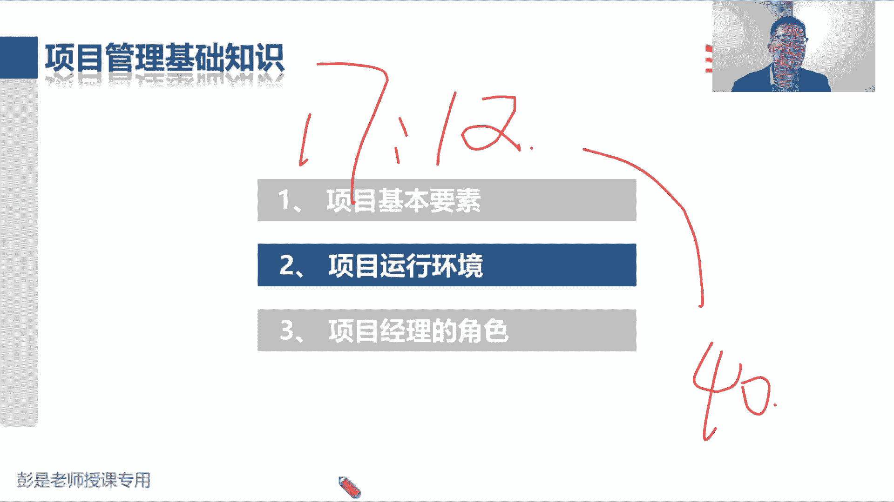
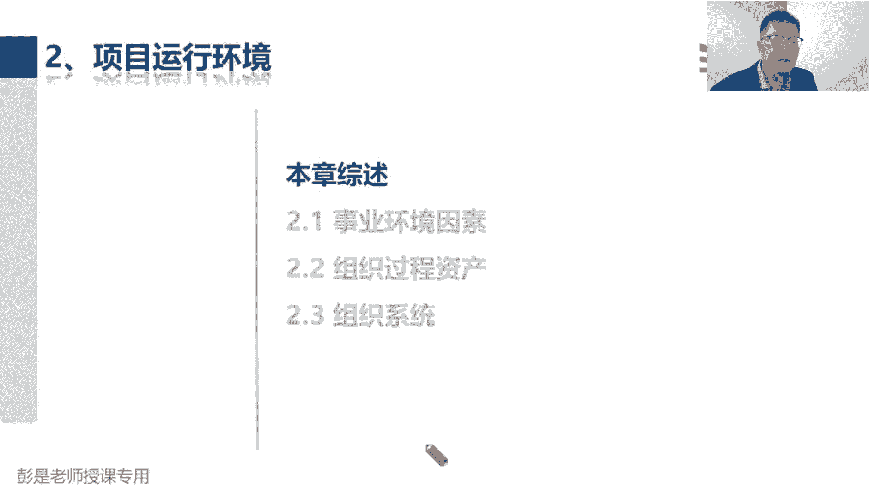
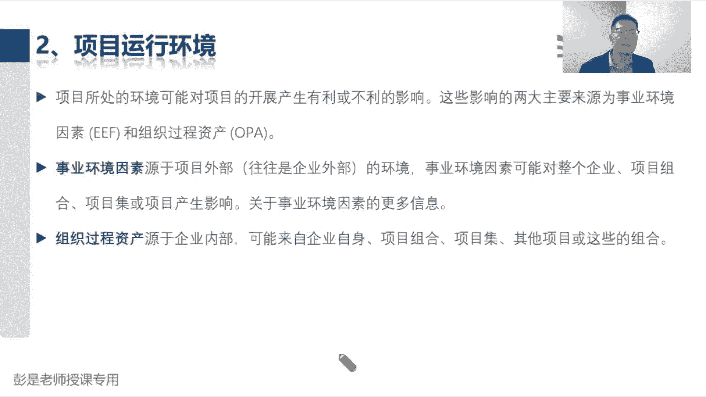
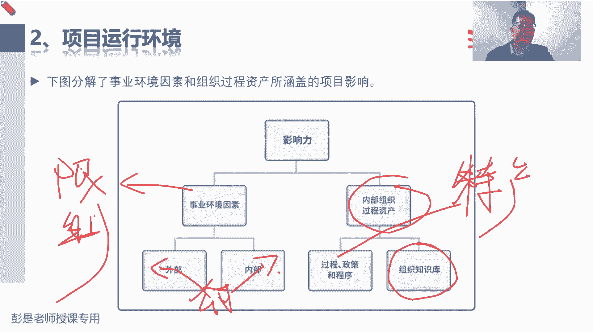
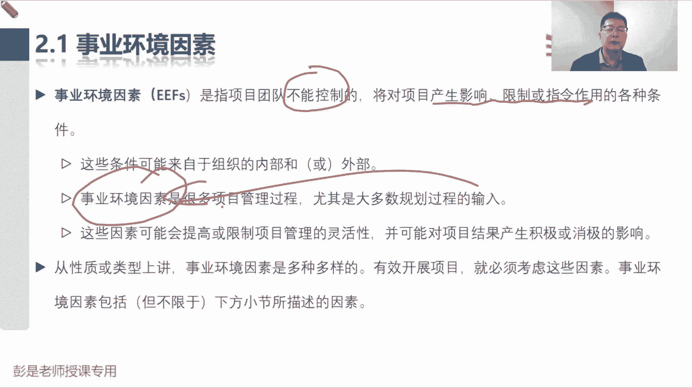
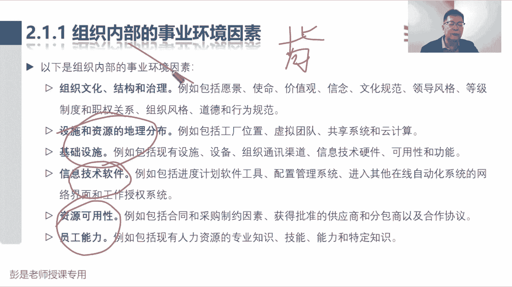
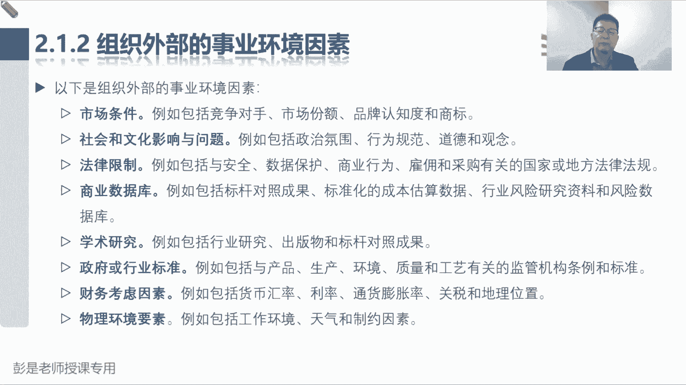
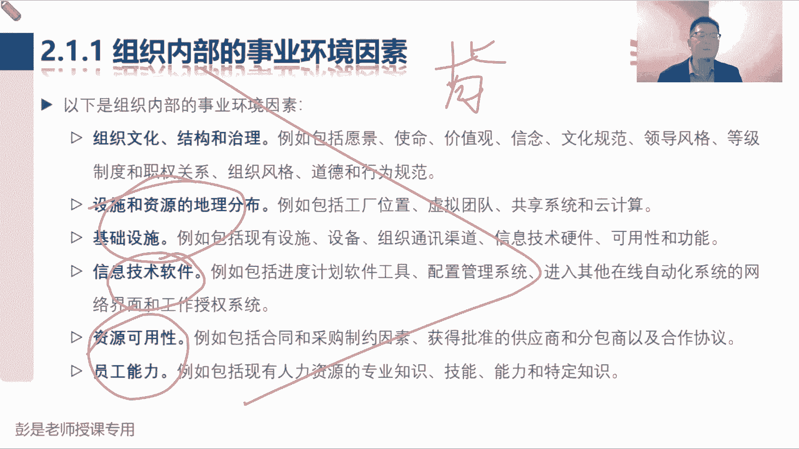
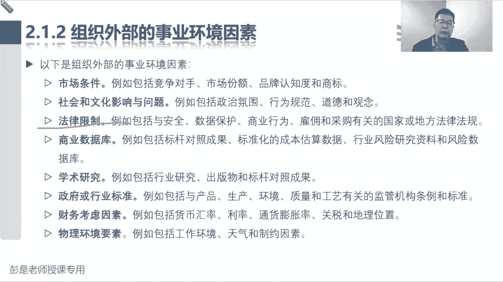

# 【新版PMP培训课程】2024PMP付费课程视频完整版免费观看，零基础通关项目管理考试！ - P12：2.1 事业环境因素 - 慧翔天地 - BV1Hu4y1a7hA

好各位同学准备了，还有十秒钟，即将开始最后一小段课程了，54321。

接下来我们看项目运行环境啊，项目运行环境阶段其实超简单，就这么三个玩意儿，事业环境因素，组织过程资产，还有那个组织系统里面涉及到组织架构，还有PMO。

就这四个东西先搞定，前两个说呀，项目所说的环境，对项目开展产生有利的不利的影响，这个影响两大来源叫事业环境因素和组织过程，资产试验环境因素，这段文字说内部外部什么什么巴拉巴拉，组织过程资产源于企业内部。

然后可能什么企业自身项目组合，项目及其他项目。

这段这段文字可以不看了，看完了你也不知道在说啥，往下看往下看啊，给了一张图说事业环境因素分成外部因素，内部因素，组织过程，资产呢分成公司的过程，政策程序，还有组织的知识库，事业环境因素的关键词是什么呢。

就这种东西啊，会对我们的工作形成限制，事业环境因素通常会对我们的工作形成限制，那他这个内核外呢是从公司，从组织这个视角去区分的，公司外部的环境因素，比如法律法规标准这些东西，咱干活要遵纪守法。

要遵纪守法呀，还法律法规会对我们的工作形成限制和约束，那公司内部的事业环境因素是什么呢，就是你公司的这些什么设备呀，设施啊，包括人员的能力呀，员工的水平啊，他也会对我们的工作形成限制和约束对吧。

我们去开个餐厅，牛肉面馆，我们又接了个活儿，给人家盖房子，那大家没有这个水平，没有这个能力，没有这个技能，这活儿都接不了，他也会限制我们工作的开展，那组织过程资产它的关键词啊叫特产嗯，特字咋写啊。

特产特产的意思是说呀每个企业的情况不一样，每家企业你们的流程政策程序标准规范，规章制度都不一样，它是结合企业的实际情况制定出来的，它是结合企业的实际情况定出来的吧对吧，就像大家听过的这些什么什么大厂。

美团啊，腾讯啊，头条啊，抖音啊，诶他们的工作流程，工作方法过程政策程序标准规范不一样的，它是根据企业的情况制定出来的，适合本企业的那套东西，第二大块呢就是企业的知识库。

知识企业积积累沉淀下来的这些东西啊，各种各样的文档资料，各种各样的文档资料，包括历史记录，包括你的什么工作用的模板，这些东西通通通放到知识库里，先有这么一个大概的认知，好上完这节课，今天就结束了。

这是今天最后一小段课程。

所以知道这个大道理之后再看，2。1事业环境因素，事业环境因素是指团队不能控制的，会对项目产生影响，限制和指定作用的各种条件，它可能来自于外部或内部，可能来自于外部和内部。

这个外和内是从公司这个视角去区分的，然后事业环境因素是很多管理过程有体制，大多数规划过程的输入，所以变成大白话，就是我们干啥活之前都看一看有没有限制条件，对吧，做什么事情都看一看我们这个事儿啊。

是涉及到哪些法律法规呢，是不是有国家标准呢，开牛肉面馆还涉及到法律法规了吧，什么食品安全法，还有什么消防，这都有规矩啊，不能乱来啊，不能乱来哈，我们的员工只会做牛肉面的，没有人做麻辣烫了。

他也会限制我们工作的开展，所以这些因素可能会提高或限制项目的灵活性，并对我们产生积极的消极的影响。

然后具体的具体的内容，以下是组织内部事业环境因素的事例，这些事例啊，第一大家不要不需要不需要不需要去背它，不需要去背啊，都是能听懂，能理解，其实就够了，第一就是组织的文化结构和治理。

不同的企业它的文化不一样，有的企业讲究的是我们大家平起平坐都是兄弟，有的企业更关注更关注层级，层级主义权力呀，上下级压，有的企业讲究的是什么狼性文化唉，每个企业的情况不一样。

那第二个就是设施和资源的地理分布，包括什么基础设施，这都是一套东西啊，我们在北京开了牛肉面馆，张三在云南点个牛肉面，抱歉亲，我们离你这么远，送不过去呀，嘿它也会限制我们工作的开展，那信息技术软件。

就是大家工作里面用的什么微信啊，钉钉啊，什么什么什么各种各样的信息系统，OA系统这种东西，他也会对我们的工作行政限制和约束，因为系统就是这样的，对不对，软件就这么做的，你就只能这么玩。

最后就是资源可用性和员工的能力，我们餐厅只开牛肉面啊，其他都不会呀，来了一单，人家想吃麻辣烫，抱歉这活我们接不了诶，所以资源的可用性和员工的能力，也会限制我们工作开展，这都是听懂就可以了。

千万不要去背啊，那以下是组织外部的事业环境因素，先不着急区分清不着急区分吧，现在你看完这些东西，再去看看它里面有什么不一样，这不是更好吗，就这个逻辑吧，好以上是组织的外部事业环境因素，你说市场条件。

市场条件和刚才的原资源可用性是一回事吗，不是一回事。

所以就区分出来了，就这个逻辑吧，好所以市场条件什么社会文化法律，商业数据库，学术研究，政府标准，财务因素，物理要素，这些东西叫企业外部的事业环境因素，可能会对我们的公众行动限制和约束，不需要大家去背。

不需要大家去背啊，如果你有记不住呢，你就进一个法律法规，这很好理解的东西吧，法律法规，法律法规，各行各业都有相关的法律法规，或者是国家出的一些相关的标准，搞食品的有食品安全法对吧，食品里面添加剂都有。

都有标准的，不能随便来吧哈嗯好，这是事业环境因素这两大块。

