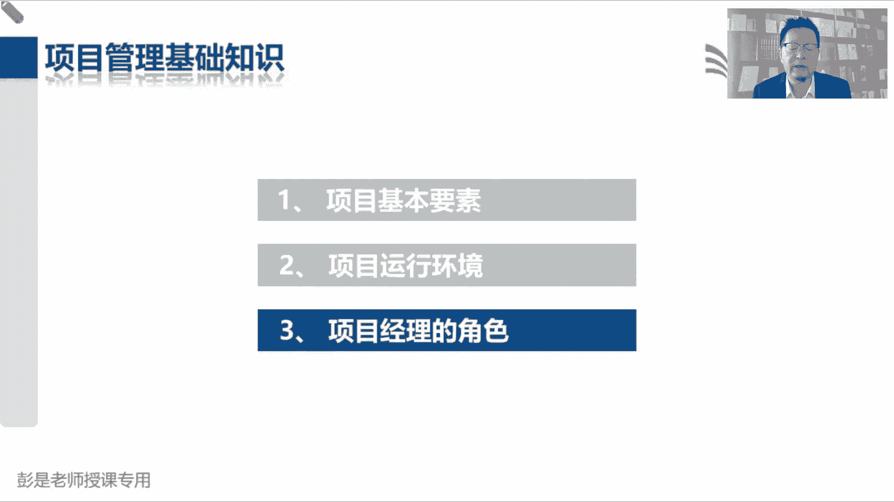
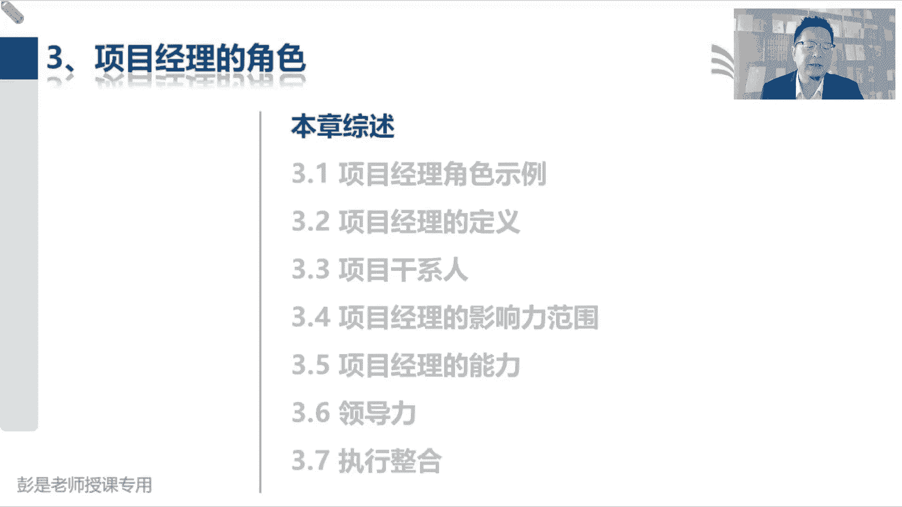
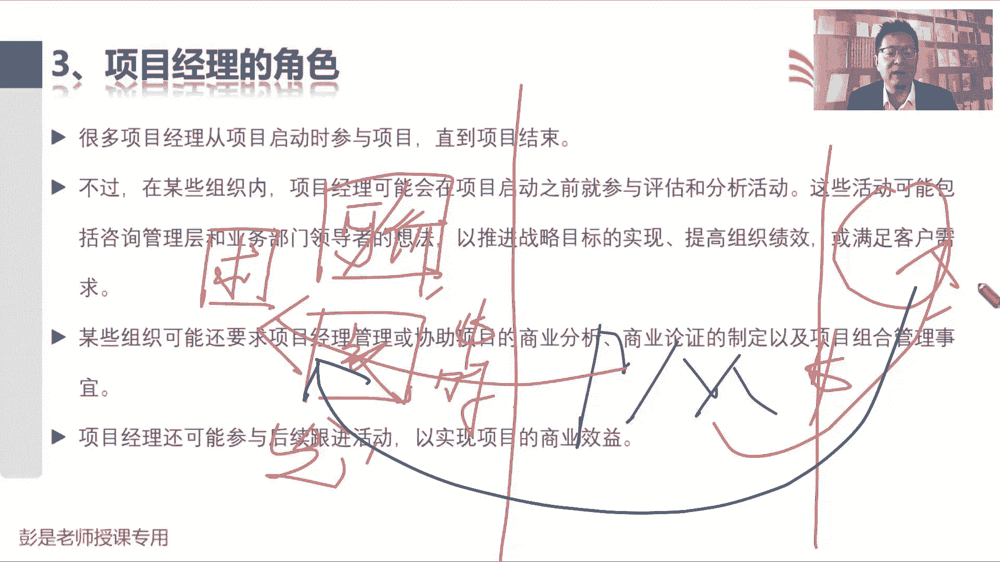
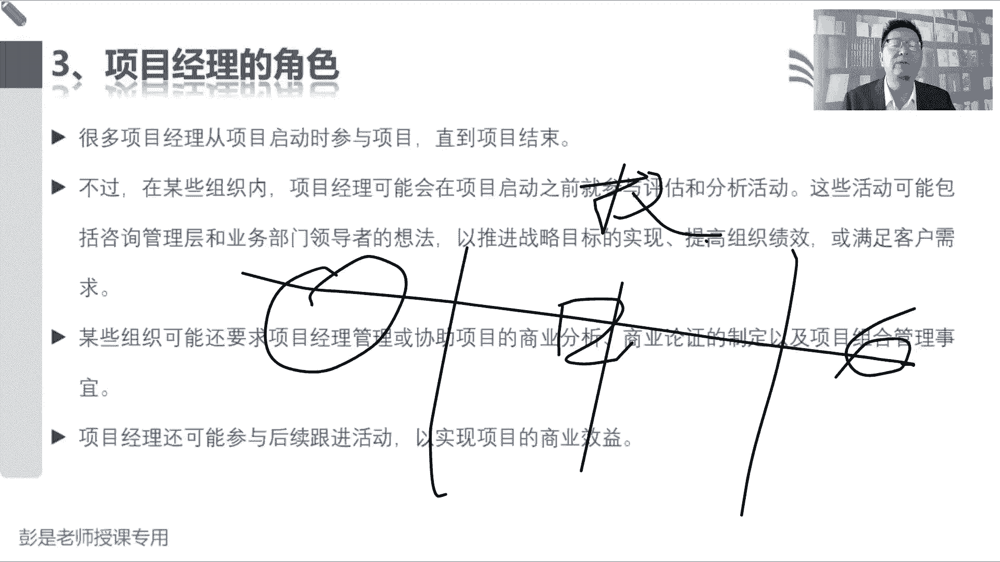
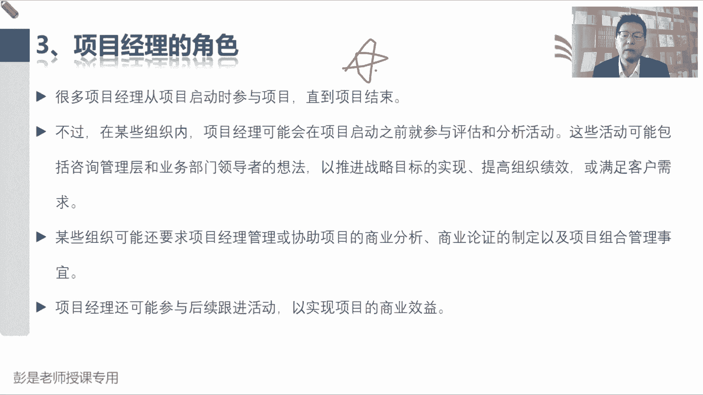
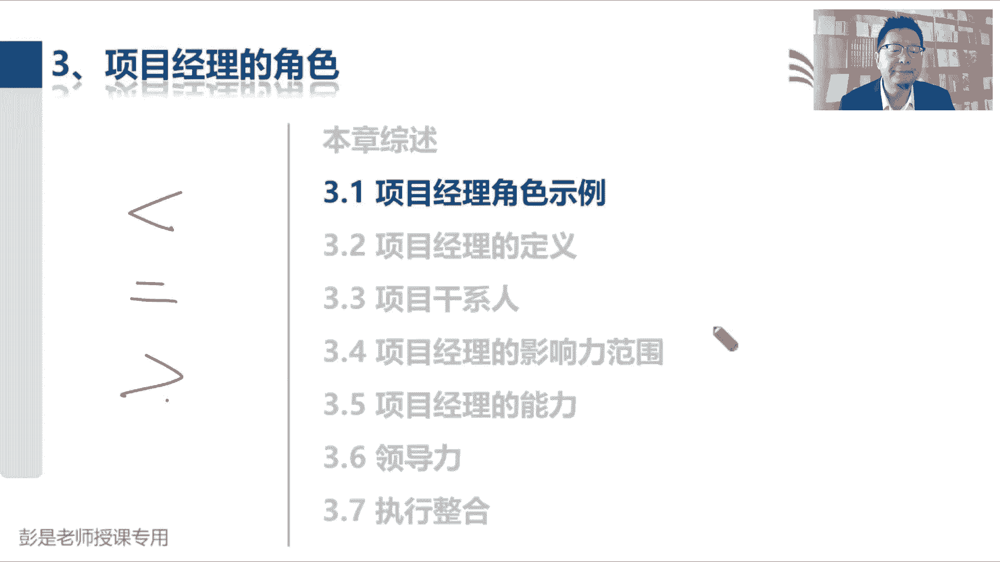
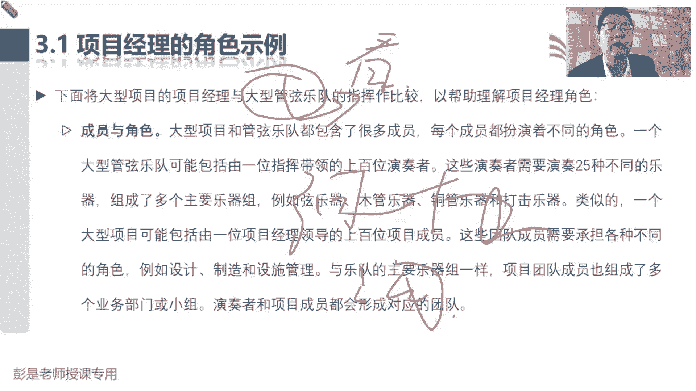

# 【新版PMP培训课程】2024PMP付费课程视频完整版免费观看，零基础通关项目管理考试！ - P15：3.1 项目经理角色示例 - 慧翔天地 - BV1Hu4y1a7hA

第一部分第三段项目经理的角色，这部分内容的字虽然看起来挺多，但重要的知识点，重要的知识点没有那么多，相对来说呢，大家后面复习的时候可以看的比较快了啊。

基本上课上听一遍，然后呢把重要的知识点反复看几遍就可以了，所以大家专心听，专心听。

咱们开始开始开始起飞了，说呀很多项目经理从项目启动时参与项目，一直到项目结束，废话根据之前我们储备的知识，我们已经知道了，项目需要有明确的开始日期，结束日期，那么从项目开始到项目结束。

作为一个专职的项目经理，我们全权管理项目过程中的这些大大情小事，然后第二段再说，不过在某些组织之内，项目经理可能会可能会参与在项目系统之前，参与到评估和分析活动，某些组织呢可能还要求项目经理啊。

做这个商业分析，我们可能还会参与后续跟进活动，来实现商业效益，所以这段文字啊，这就变成上节课给大家讲的那个大的框架了，说项目启动之前三件事，第一件事叫需求评估，对不对，去看看有没有商业机会。

去发现一些商业机会，搞清楚我们要做什么事，比如说颁布了新的法律，或者是对市场做调研，或者是去搜一搜有没有客户，甲方发一些什么招标公告对吧，通过各种各样的方式和渠道去找商业机会，去找项目诶，这叫需求评估。

做完了需求评估之后，那咱企业也不傻，咱企业不傻啊，咱要思考啊，这事儿值不值得我们花钱花时间花精力去干呢，所以呢我们要去分析这个事情的可行性，如果有可行性了，我们还要分析这个事情。

能不能给企业带来一些有形价值和无形价值呢，对不对，就是看做这事有没有有没有好处吧，这就是商业论战，做完了上一份证啊，老板肯定说哎我们这事儿赚钱，什么时间能赚到多少钱呢，你得说清楚吧。

想一想上节课说到我们那个餐厅对吧，牛肉面馆啊，这面馆开起来一年能收回成本吗，两年以后能赚他一个小目标，一个亿吗，10年以后能不能全国便开10万家连锁店的，所以要把什么时间赚到什么样的收益。

要把这个事情说清楚，就有了效益管理计划，效益管理计划主打一个告诉老板能赚多少钱，以及什么时间能赚到多少钱，短期效益，长期效益，持续性效益都给他说清楚诶，这是项目启动之前三件事，需求评估，商业论证。

效益计划的制定，这是通常是发起人负责，那现在这段文字啊，就是说啊想着这想着一个道理，说，项目经理参与到项目启动之前的这些工作之中，好还是不好呢，参与到项目启动之前，给发起人提出我们合理化的建议和见解。

这事好不好呢，挺好对不对，挺好啊，所以实际上对任何一个层级，不管是公司上到公司战略，下到具体的某一个活动，我们的相关方，我们的干系人尽早地参与到这个事情之中，提出我们合理化的建议和见解，这都是好事儿啊。

对不对，早发现早治疗，早康复嘛，让该系人参与到尽早地参与到这些事情之中，提出他的建议，提出他的见解，让我们尽量的尽量的把这个事情考虑周全，尽量的尽量的不要把这个事情做错了，都挺好啊。

所以就有了项目经理可以参与到项目系统之前，需求评估，商业论证和效益计划的制定，参与到这些事情之中，提出我们相关的建议和见解，那项目结束以后啊，上节课也知道了，项目结束以后。

可能需要把我们的成果移交给运营，那某些项目结束的时候还没有开始赚钱呢对吧，这个牛肉面馆盖好了，现在还没有赚钱呢，没有收入啊，只有运营一段时间，可能需要运营个三个月，六个月，九个月才能够收回成本。

再运营一段时间才可能会开始有盈利了，所以呢我们可能项目经理啊，还需要参与参与到运营之中去，验证一下有没有实现目标效益，去跟踪去验证是不是真的赚了这么多钱，有没有实现项目的商业意图。

还这就是项目经理的工作边界变宽了，在项目启动之前和项目结束之后，我们可能会参与其中，这样呢就确保做到了传说中的端到端对吧。

全流程啊，全过程啊，端到端的项目，这是中间事前事后哎，咱就一条龙一条龙把这事儿从头跟到尾，只不过就是中间过程是我们全权负责，全权负责带着兄弟们完成目标，时间任务，得到期望的成果。

但可能会参与到之前和之后，这段文字非常非常重要啊。

好这段文字超重要，但是呢给大家知道那个大概的结构，讲过这个大道理应该应该把它记住嗯，所以其实这段话听完了之后啊，端到端一个人干全部吧，未来最有可能成为CEO的人，最有可能成为CEO的人。

这是项目经理对吧，项目经理是重要候选人之一，因为一个出色的项目经理啥都懂啊对吧，端到端再配合到配合到那个项目制，这种这种行情对吧，项目型项目型这种组织结构类型对吧，你想想旁边有什么施工啊，工地啊。

开地铁啊，这种项目制项目经理全权负责所有的事情啊，对不对，哎就相当于一个小的CEO了吧。

好这段话只听一听这个道理啊，然后3。1，项目经理和职能定理哪个大，看情况看情况对吧，刚刚复习完呢，有些情况下职能经理说了算的，有些情况人家中方混合展出项目的预算的，有些情况下是大于啊。

那3。1项目经理的决策，这段文字呢基本上也没啥可念的了，大家课后课后啊，基本上看一遍就可以了，他就是把项目和一个管弦乐队的指挥，做了个对比，让大家更好地理解项目经理干啥事儿对吧，有人弹钢琴。

有人拉小提琴，有人吹什么什么萨克斯，有人敲鼓，作为一个指挥，作为一个指挥，我不一定能够亲自演奏每一个乐器，但是我知道每个乐器的特点，结巴什么时候动静大，什么时候动静小，什么时候应该应该磅礴大气。

什么时候应该应该应该温柔，我知道每个月期的特征，我可以带着大家通过这种组织协调，组织协调，组织协调，让大家面演奏出一个华丽的乐章，诶这就是项目经理拿个小指挥棒在那指挥，就给这个视角啊。

和这段文字呢看一看，帮助大家更好的理解项目经理的社会工作对吧，就是组织协调沟通，组织协调沟通，组织的组织大家，然后定期的排练，定期的演练对吧，然后协调大家之间的工作对吧。

你这个那个你的声音不要盖过其他人的声音，对吧，唢呐一响，全程其他其他音乐都凉了，这也不行啊，唉组织协调沟通啊。

