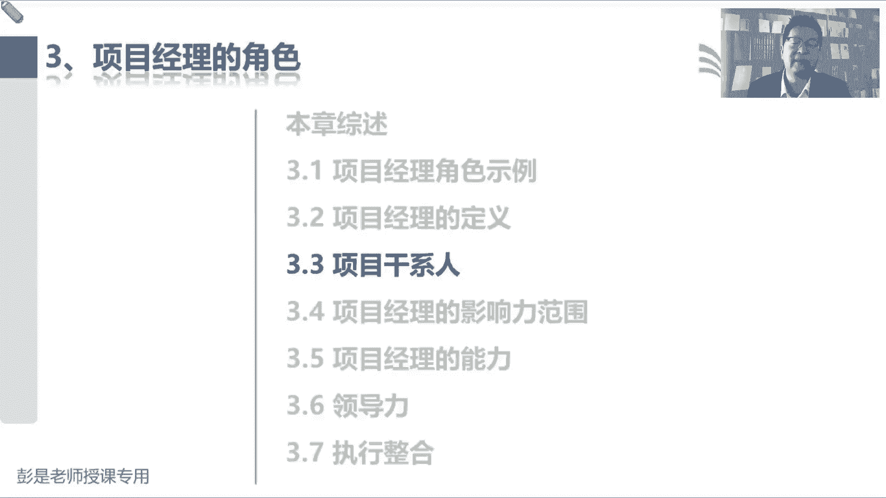
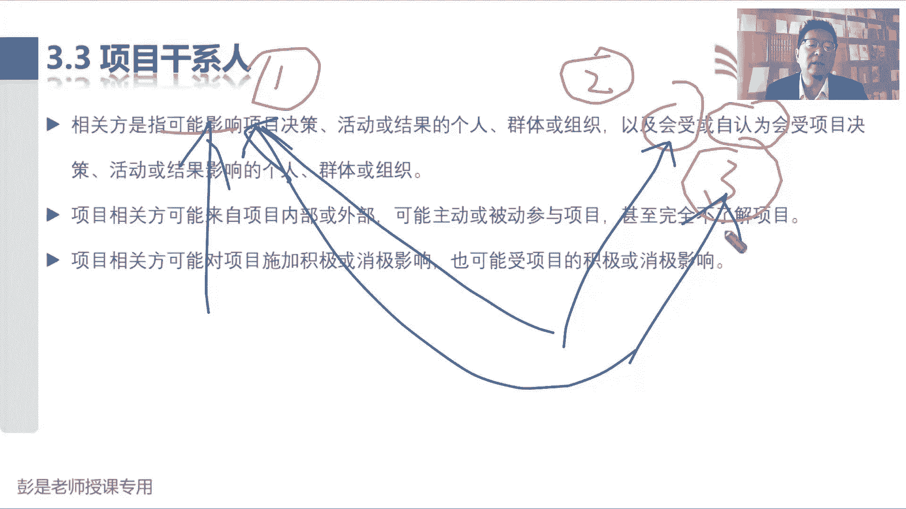
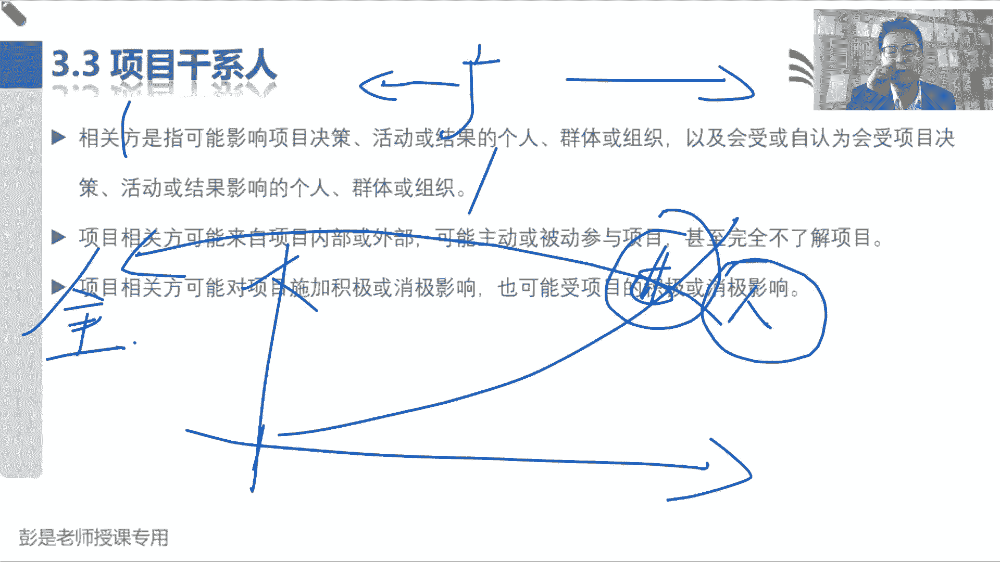
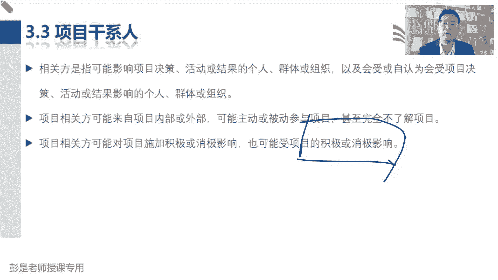
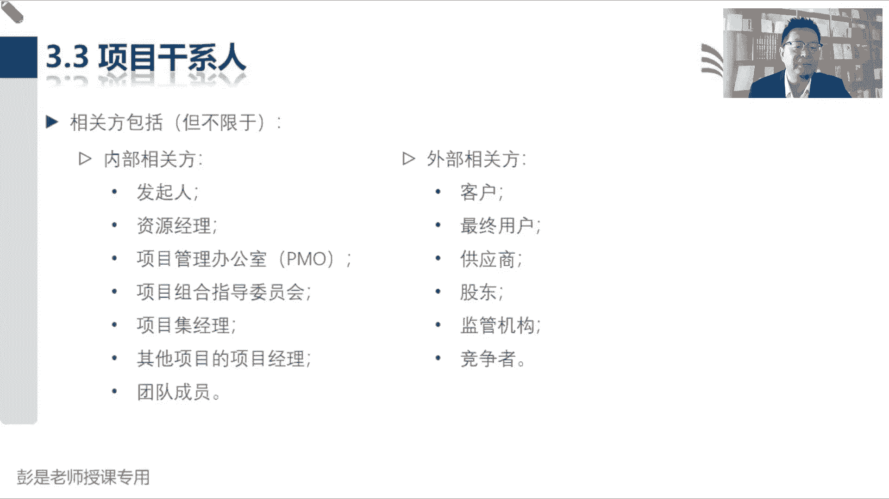
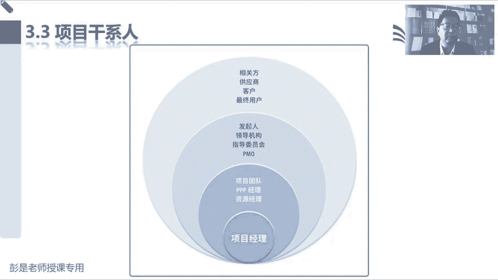

# 【新版PMP培训课程】2024PMP付费课程视频完整版免费观看，零基础通关项目管理考试！ - P17：3.3 项目干系人 - 慧翔天地 - BV1Hu4y1a7hA

然后3。3项目干洗。

项目干系人的定义还是需要大家去读一遍的啊，相关方干系人这两个单词是一回事，因为这是有，有历史典故的，咱们现在学的是第七版，第七版的中文，中文的标准的标准的术语叫干新，第六版呢叫相关方，第五版又叫干系人。

所以呢咱们所有的教材，把钢琴和相关方就给大家混用了，建议大家去提前提前适应这个单词啊，因为考试的时候你也不知道，考试的时候，不知道这个这个题到底翻译的是相关方，还是干写。

甚至以前的题还出现过这样干写括号，相关方就是怕大家认为它是两个单词啊，其实是同一个单词啊，都是那个stick holder好，那干系人是指可能影响项目决策活动或结果的，个人群体或组织。

以及会受项目决策活动或结果影响的，个人群体和组织，或者是自认为会受项目决策活动或结果影响的，个人群体或组织，所以肝血呢这是三种人，会影响项目，第二种人呢是会受到项目影响。

第三种人呢就是自认为受到项目影响，这三种人啊，最后一总结啊，其实呢还是同一种人，为啥呢在想这个大道理，可能影响项目决策结果，或者是活动的个人群体和组织，他的行为，他的行为对吧，会对我们的项目产生影响。

这是第一种人，第二种人呐会受到项目的决策，活动或结果影响的个人，他受到了项目的影响，受到了项目的影响，他就有可能有可能反过来采取一些行为和措施，对我的项目产生影响，是这个逻辑吧。

他很可能会反过来采取一些行为和措施，对我的项目产生影响，因为它是它被影响了，他受到影响了对吧，就像我家隔壁在装修，然后呢再装修一会儿，电钻声就出来了，我就被影响了，站在讲课就受到影响了吧。

那我可能就会打电话投诉他做工，对不对，物业你要管一管，那周末不要装修啊，诶就是因为我受到了影响，我就可能采取行为措施，反过来对他产生影响，那第三种人还是这个逻辑，自认为受到项目决策的活动或结果影响。

自认为受到项目影响了，也可能反过来采取行为和措施，对咱的项目产生干扰，可产生影响，所以啊其实就是三种人是同一种人。

三种人同一种人，他为什么这么写呢，为啥这么写啊，就是啊，希望我们啊把相关方的范围想得越广越好，把相关方的范围想得越广越好，这样呢尽量的尽量不要做到有遗漏，因为万一漏掉了某个干系人。

万一漏漏漏掉了某个干系啊，到了项目后期突然跳出来一个人，还说我再提两点新的需求，我再提两点新的想法，之前你们也没有征求过我的意见呢，那么这种情况下就可能导致我项目变更的代价，变更的成本非常非常非常高。

咱扛不住，所以呢我们希望尽早的识别相关方，而而且呢还要尽量的尽量的全面识别，尽量的不要有遗漏啊，但不代表着所有的人的意见和观点，都要都是重点啊，不代表着所有人的意见，我们都要重点考虑。

因为未来一定要掌握一个排序的思维，人一定要分369等，有的相关方重要，有的相关方不重要，有的人的意见优先级高，有的人有的人的意见优先级就低。

知道了这个大道理，再往下看，相关方可能来自于内部和外部，可能主动和被动参与项目，甚至完全不了解项目，这都是废话，相关方可能对项目施加积极的消极的影响，可能会受到项目是积极的消极的影响，这也是废话。

总之它的范围越广越好，尽量的不要有遗漏，然后呢识别到所有的相关方的群里，跟人和组织之后，再去排序，看看谁重要谁不重要，所以说，就像李杰同学说的，说间接被影响也算吗，当然算了，对不对，当然算了吧。

你也是被这个项目影响了，那你可有可能反过来采取措施对吧，你那个家里面隔壁装修太吵了，听不见的，听课听不清啊，然后打电话投诉他呀，这个道理吧，所以想象到更广越广越好啊，但是千万千万记住。

不代表所有所有的人，我们都重点管理，重点对待，因为人就一定要去分析它的重要性，它的优先级，所以这样按照按照毕节同学这个话题，继续往下说，这就像啊说我家楼上在装修，然后影响咱听课了，影响咱听课了。

各位同学啊，你的家属是不是咱们培训p mp这个项目，的相关方呢，你的什么男朋友，女朋友，你的老公，你的爱人，你的媳妇儿，你的小孩，甚至包括父母，是不是我们培训p mp这个项目的相关方啊。

他有没有受到咱这个项目的影响，有吧嘿，那他有没有可能反过来对我们的项目产生干扰，产生影响呢，有吧对吧，说你周末呀是不是在打着上课的名义呀，在那不知道干啥呢，也不做不不做家务，不需要不做饭，不洗衣服。

不扫地，啥活都不干诶，就可能有心生怨气啊，对不对，哎，他也会受到我们项目的影响和干扰，那提人提前和人家晓之以理，动之以情，对不对，晓之以理，动之以情对吧，今天我白天听课等等，下课了以后。

我来做一些家务哈，那现在项目结果中享有利益的任何人，这肯定是相关方啊，他受到项目的积极的消极的影响，对不对，所以陈轩同学，你肯定是做过章节练习题了，做课后练习题，做做课后练习题的时候。

四个选项里面找一个相对来说最合适的选项，仅此而已，仅此而已啊，他都告诉你了，在项目结构中享有利益的人，肯定是受到项目的影响了，对不对，这个力可能是正面的，也可能是负面的。

它不仅仅是不仅仅是指的是正面的啊，也有可能是负面的，对不对，好。

所以书上后面这就给出了相关方的一些示例，这些示例这根本就不用背，扫一眼看一看，知道怎么回事就可以了，不用背啊，这东西背下来也没啥用的，发起人资源经理字面意思吧，PO知道项目组合指导委员会字面意思啊。

项目及经理，其他项目的项目经理团队成员，然后客户和最终用户这俩有啥区别呢，这个需要想一想，因为后面后面涉及到一个重要的知识点，客户和最终用户有啥区别，客户出钱吧，用户是使用他俩不一定是同一个人啊。

不一定是同一个人，对不对，诶这是我在我的牛肉面馆，在在在美团上开了个餐厅对吧，有人可以叫外卖呀，嘿下单的人不一定是吃饭的人，下单的人，花钱的人，这是客户对吧，吃饭的人是最终用户，就这个一定要区分。

因为未来讲到敏捷，敏捷就一定想办法想办法触达终端，用户，触达最终用户，这是非常重要的一个理念，在敏捷环境之中啊，因为他要做软件开发，以软件开发为主，好供应商，什么竞争者，这都不念了。

参加这个思路是对的啊，经销商使用者。

