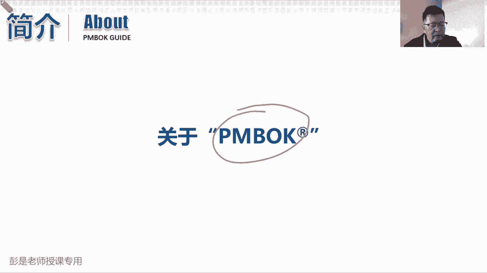
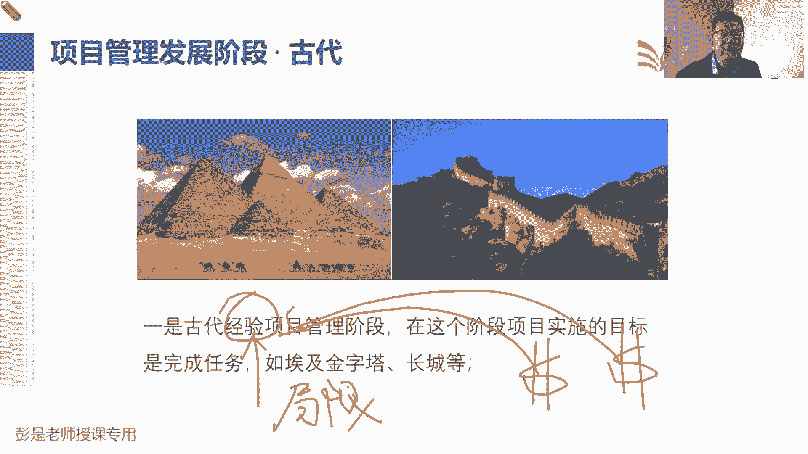
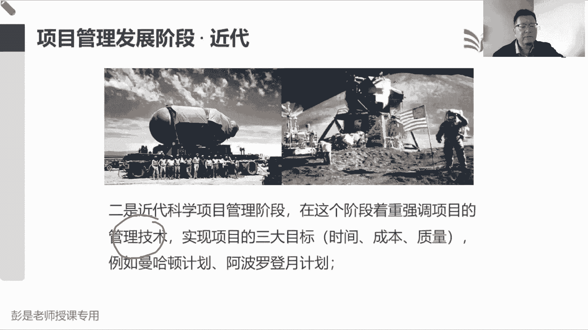
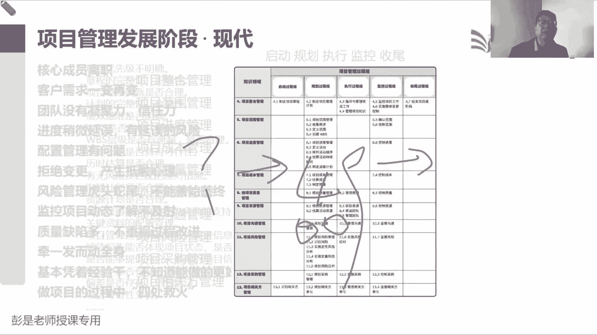
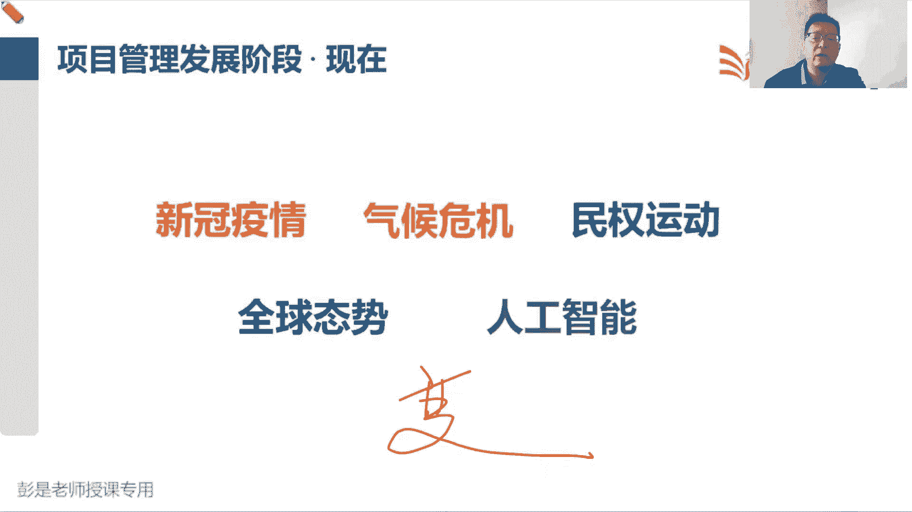
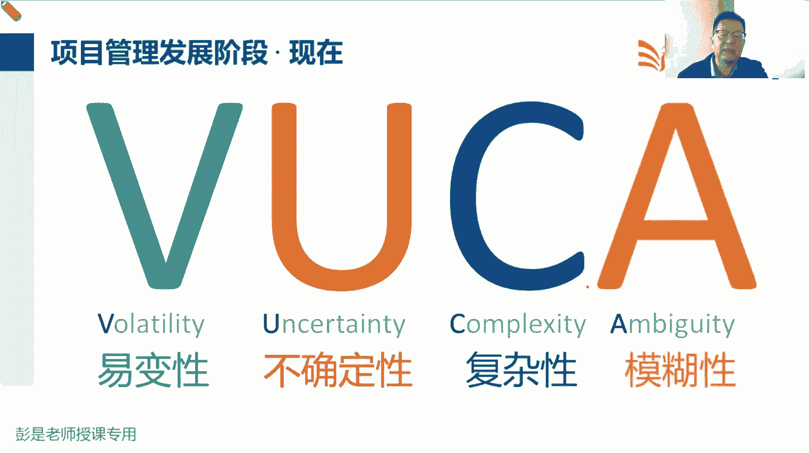
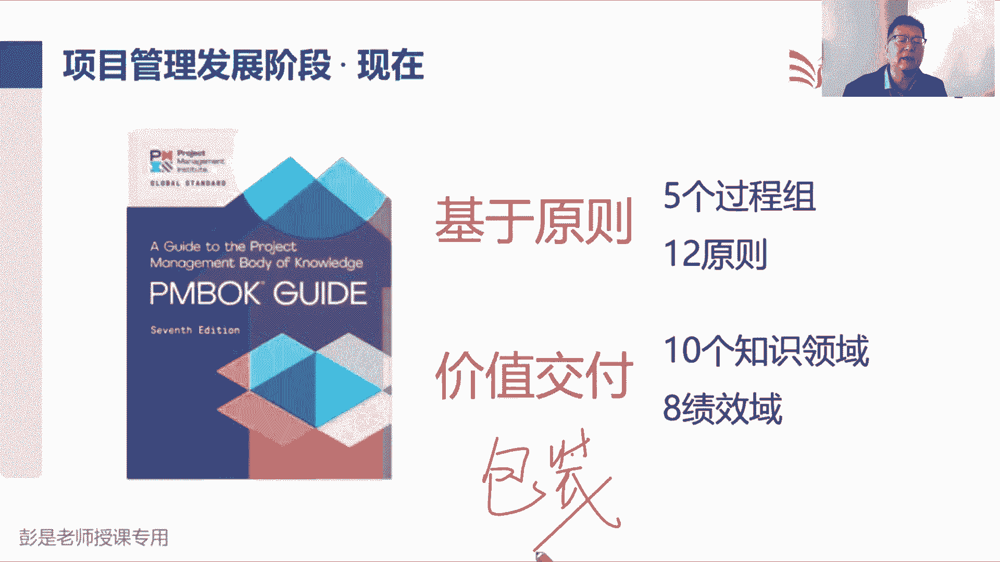
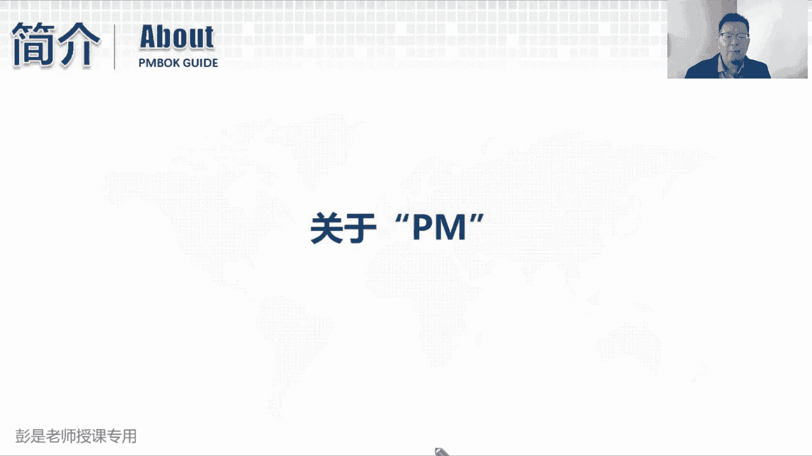

# 【新版PMP培训课程】2024PMP付费课程视频完整版免费观看，零基础通关项目管理考试！ - P2：PMBOK介绍 - 慧翔天地 - BV1Hu4y1a7hA

好那就说到教材，咱们这个大家目前目前手里应该拿到的，就叫通关宝典，那咱们官方教材是实际上叫项目管理，知识体系指南，简称PMBOK，传说中传说中项目管理领域的圣经，这是老外说的啊。

圣经的那个伟大程度不需要解释了。

那这本教材是怎么出来的，我们认为项目管理啊，通常通常通常认为它发展有这么几个阶段，最经典的就是第一个阶段，就是古代就是修金字塔，修长城，这个阶段叫什么呢，叫经验式的项目管理阶段。

在这个阶段主要的目主要的项目管理，主要的项目管理方法就是完成目标，完成任务，对不对，老板说让修金字塔，老板说让盖长城，咱就不惜成本，不惜代价，想办法把这个长城修好，但是它为什么叫经验式的呢。

为什么叫经验式的呢，它有局限性，该有局限性了，跨行业的东西可能就用不了了，我修长城的人不一定会修金字塔，修金字塔的人不一定会修商城，我在山上修长城，不一定会在荒漠上修长城，在荒漠上修长城，来到了草原上。

又不知道怎么办了，所以呢可能需要极大的成本，极大的代价去试错，才能够继续积累出新的经验，然后再花巨大的代价去试错，又积累出新的经验，就是不断的不断的用极大的代价去吃一堑。

长一智，这是第一个阶段，然后到了近代两个非常非常出名的事件，就推动了项目管理这个学科的发展，今天两个周目的事件，左边那个叫阿波罗曼哈顿计划吧，右边那个叫阿波罗登月计划，曼哈顿计划就是做那个原子弹。

他俩的时代背景基本上差不多，当时第二次世界大战，小日本嘚瑟，然后美国人怒了，生气了，所以我们要造一个造一个终极武器大招，然后一招制敌，想办法尽快的尽快的结束这场战争，所以当时就时间紧，任务重。

还要尽量的尽量的把它把这东西做成，就有了项目管理的三个目标，我们要造一个原子弹，有时间上的约束，又受到成本上的约束对吧，不能倾全国之力把钱全都花了，然后呢还要达到一定的质量标准和要求。

这玩意要一次成功啊，不能造一颗换一颗，造一颗换一颗，咱们不能这么浪费啊，所以当时一大堆一大堆先贤，一大堆科学家就想办法就去思考了，诶这事儿我们从来没做过，这是我们从来没过没做过啊。

那我们应该用什么样的科学的管理方法，管理技术，能够帮助我们提高这个项目成功的可能性呢，怎么开始拉人了，专心听课专心听课啊，大家慎重加好友啊，慎重加好友啊，咱也不知道直播间里面都是谁啊，缅北刚被打掉啊。

好有兴趣的同学去咱学习微信群里面去交流，去沟通，不要不要不要在公共区聊天啊，不知道谁是谁啊，好好书归正传，转回来啊，说当时一大堆科学家的，想办法想办法尽快的尽快的实现，我们管理好项目的范围啊，时间啊。

成本啊，质量啊，然后呢想办法提高这个项目成功的可能性，尽快的把这个原子弹造出来，前两天大家有不知道有没有看过那个电影，奥本海默是不是一大堆科学家想办法呀，哎就衍生出衍生出一大堆科学的管理方法。

也就是未来我们需要掌握的，比如说分解呀，比如说关键路径法呀，比如说政治分析呀，比如说质量，各种各样的图表，各种各样的图形化的工具，什么直方图啊，控制图啊，散点图啊，各种各样的东西啊，就用这些方法诶。

就真的把这个活干好了，就这个逻辑吧，用了这套方法之后啊，真的真的真的是有效的，帮助我们提高项目成功的可能性，尽早的都开好省的完成任务，实现目标，得到了希望的成果，美国和前苏联太空争霸对吧。

今天你发射个火箭，明天呢我们就要载人，你载人呢我就出仓，你出仓呢我就登月诶，抢着来抢着来，一仍然是十点紧，任务重对吧，还要达到一定的质量标准和要求，咱们能发射一个火箭就炸了，发射一个火箭就炸了。

这也不行了，所以当时意大利科学家呀，把之前沉淀积累出来的这些管理方法，又用到了登月航天制造这些项目上，诶，发现这些方法好使，可以帮助我们提高项目成功的可能性，帮助我们更好的去管理项目的范围啊，进度啊。

成本啊，质量啊，从而尽早的完成任务，实现目标，达到一定的质量标准和要求，所以其实从阿波罗登月计划之后，美国美国就规定了立法了，说只要是国家花钱做项目，都一定要用这种科学的管理技术。

一定要采用这种科学的管理方法，否则唉人家不让你投标的，这就是近代两个非常非常著名的事件，推动了项目管理这个学科的发展啊。

好那到了现代，大家工作中会出现各种各样的问题，到了近代啊，大家又发现了工作中会出现各种各样的问题啊，说人员管理啊，成员什么有人离职啊，员工的流动性越来越高啊，大家一盘散沙呀，没有凝聚力呀。

没有团队意识啊，没有没有集体感，没有归属感啊，或者是变更，大家通常通常会抵触变更，对变更不支持反对啊，有抵触心理啊，会焦虑惶恐不安的，然后什么风险管理对吧，虎头蛇尾，没有良好的结果呀，不能善始善终啊。

出现了各种各样的问题，那咱从管理工作上来讲，出现问题我们就去分析原因，对症下药，给出一定的解决方法，遇到问题想方法，遇到问题想方法，方法总比问题多，方法总比困难多呀，那找到了找到了这么多的方法之后呢。

这些方法这些方法呀就导致我们去思考了，下一次能不能让这些问题少出现，少发生呢，诶于是不断的总结积累沉淀，就变成了一大堆的注意事项，就变成了一大堆的注意事项，是说我们管项目的时候。

我们要去分析项目的优先级，明确不明确呢，你得到的项目任命书，项目启动书，项目章程完整完整啊，正确不正确呀，这里面的东西是不是科学，是不是合理的，然后计划是不是可行啊，以此类推，有了很多我们管项目的时候。

需要需要注意的这种注意事项，那注意事项多了太多了，成百上千上万条啊，注意事项多了，我想写就写啊，不要提建议啊，注意事项多了怎么办呢，自然而然就需要做一个事了，分组归类整理梳理数据，分组归类整理梳理唉。

什么时候注意什么东西，什么时候注意什么东西，什么时候注意什么东西，所以按照pd c a这个逻辑带明矾呢，按照PDC这个逻辑啊，我们就把它整理成了五大过程组，十大知识领域。

告诉我们启动的时候有哪些注意事项，规划的时候有什么注意事项，执行的时候，监控的时候，收尾的时候都有什么注意事项，然后再去横向纵横向去区分了，我们管范围的时候有什么注意事项呢。

管进度的时候有什么要注意的呢，管成本的时候，有哪些方法可以帮助我们更好的完成任务，实现目标呢，最后再一演变，就变成了非常非常经典的五大过程组，十大知识领域，中间的49个管理过程。

以及每个管理过程所需要的输入输出工具技术，也就是我们开始在开展这个管理工作的时候，需要什么原材料，这就是收入，拿到这些材料之后，我们可以用什么样的方法和工具技术，得到我们这个期望的结果，得到这个输出。

所以最后一整理就变成了非常非常非常繁杂的，五大过程组，十大知识领域，49个管理过程，各种各样的收入，然后呢三十三十三个项目文件，然后130几个工具和技术，就变成了咱们官方教材pm课第六版。

项目管理知识体系指南的第六版，诶这是发展到了现代就不断的沉淀，不断的积累，所以呢p mi就干了这么一个生意，他是从上世纪60年代成立，然后到了1996年正式推出，项目管理知识体系指南的第一版。

然后按照国际标准化组织ISO，按照ISO国际标准化组织的要求说，你要想成为标准的，你要想保持领先的，你这玩意儿得更新的，得与时俱进的，所以就按照ISO的标准，至少至少4年要更新一次，人家要求是5年啊。

所以呢我们就4年更新一次，4年更新一次到2000年，04年零八年，12年，一直到17年，一直推出了pm的第六版，然后17年因为出版发行的原因，所以呢所以呢导致这个退出啊，超超了超时，从4年变成了5年。

这是发展到了现代，那现在咱们学的是什么呢，第七版吧，大家备考24年3月份的同学，咱们现在考的是第七版哈，那发展到了现在呀，科学家们又发现了第六版的这些方法呀，不太实用了。

因为现在的现在项目里面最头疼的是什么呢，就是这种不确定性变数太多了，别把商业环境变得非常快呀，商业环境变得非常快呀对吧，什么今天是一哥，阿里云说崩就崩了，这两天非常火的吧，就把阿里云一摊好几个小时啊。

哇这这家伙很多中小企业的服务基本上全挂了，全都瘫痪了，变化多难以预测，不确定，所以呢就把这个单词捡回来说，因为现在什么新冠疫情啊，气候危机啊，民权运动啊，成本发展态势啊，包括人工，人工智能的出现。

就是这些因素，导致我们的商业环境非常非常非常的不确定，变数非常多，所以把乌卡时代。

把欧卡这个单词捡回来，形容当前这个时代整个大的商业环境就叫乌卡，欧卡是一个军事术语，形容战场上，也是上世纪二战的时候出的出的这个东西啊，当时说在战场，在战场上，战争局势难以预测呀对吧，变数多。

各种各样的不确定因素，整个战争局势非常非常复杂呀，然后呢，人们对于很多事情的出现，存在着没有人知的模糊性，那在现在的当今的商业环境上，也是这个四个因素啊对吧，现在商业环境。

整个项目啊变数可以可能非常多呀，需求不确定了，工期也不确定啊，这成本也难以控制啊，这人人的行为也不好预测呀对吧，不知道大家张三李四王五赵六，想一想那个想一想，十字路口都能理解这四个东西了。

想一想十字路口啊，越热闹的地方，这四个单词越明显对吧，有有有闯红灯的，有逆行的，有不看车的，有有加塞的，有加塞的啊，各个方向随时可能过来一些什么电动车呀，自行车啊，摩托车呀，汽车呀，哎就乱糟糟，变数多。

难以确定，这玩意又非常复杂，然后呢到底会发生什么呢，大家没有认知，商业环境也如此，那在这个多变的环境下，我们传统的这种管理方法它就不适用了，我们再讲五大过程组，十大知识领域，49和林墨成这些方法呀。

可能需要变需要变形，需要去通过变形来适应当前多变的这个环境，那怎么变呢，所以呢这个正儿八经的推出了第七版。

说呀，大家对项目，现在对项目经理的要求越来越高了，越来越高了，那我们五大过程组，十大知识领域，49个管理过程，第六版，这套这套思想啊，它可以适用于某些场景，但是在某些场景下它就不适用了，不适用了啊。

所以正儿八经的2021年就应该推出第七版，但是因为受到疫情啊，出版发行各种各样因素的干扰，咱们2023年，2023年才正式启用第七版，整整等了6年，2023年才正式启用第第七版，然后呢。

今年的8月份和11月份的考试，就是第一次和第二次的第七版的考试，各位同学参加的是明年3月份的考试诶，这是第七版的第三次考试，看教材吗，看教材一会会说啊好，那第七版做的是一个什么样的电动呢。

第六版是叫五大过程组，十大知识领域，它叫基于过程的这种预测型的，传统的项目管理思维方式，第七版呢就把五大国重组变成了12个原则，然后呢，把我们的十个知识领域对报到了八个技效率。

他强调的是我们要掌握项目管理的一些大方向，就叫原则，根据这个原则呀，我们去思考怎么做到价值交付，在这个多变的环境下，怎么创造给客户啊，给企业有价值的产品服务和结果，来更好地完成任务，实现目标。

得到期望的成果，所以怎么做到驾驶交互呢，就变成了八个绩效域，我们把把把这八个领域把它管理好，就可以更好的更好的完成任务，得到客户，得到客户期望的这个结果，所以12个原则实际上来说就是给领导看的。

告诉我们管项目有哪些，有哪些方针政策，八科技教育，就是告诉我们，到底管项目需要开展什么样的工作，你要着重侧重于管理哪八个领域，哎就把知识点重新做了分组，把知识点重新做了包装，仅此而已。

他不是说推翻了过去的教材，不是说推翻了过去的知识体系，就是把知识点重新分了组，重新做了包装，哎，所以整个未来我们学习过程中还是要学第六版，还是要学敏捷，学完了第六版，学完了敏捷才能够更好的去理解第七版。

他为什么这么写，所以第七版其实对备考来说是一个很好的，很好的复习的资料，因为大家学完了第六版，学完了ACB，学完了敏捷之后，你再看第七版，基本上没有什么多，没有什么特别多的新的知识点，全都是旧的知识点。

重新做了包装，去重新做了分组，加了一点点新的知识点，所以呢咱们整个学习过程中，大家手里面有通关宝典的同学，就看通关宝典这一本书就够了，没有通关宝典的同学呢可能去看第六版加，再看ACB，看两本教材。

