# 【新版PMP培训课程】2024PMP付费课程视频完整版免费观看，零基础通关项目管理考试！ - P20：3.6 领导力 - 慧翔天地 - BV1Hu4y1a7hA

好各位同学，我回来了，接下来我们看3。6领导力，这也是非常非常重要的，一小一小节内容，好54321那3。62。

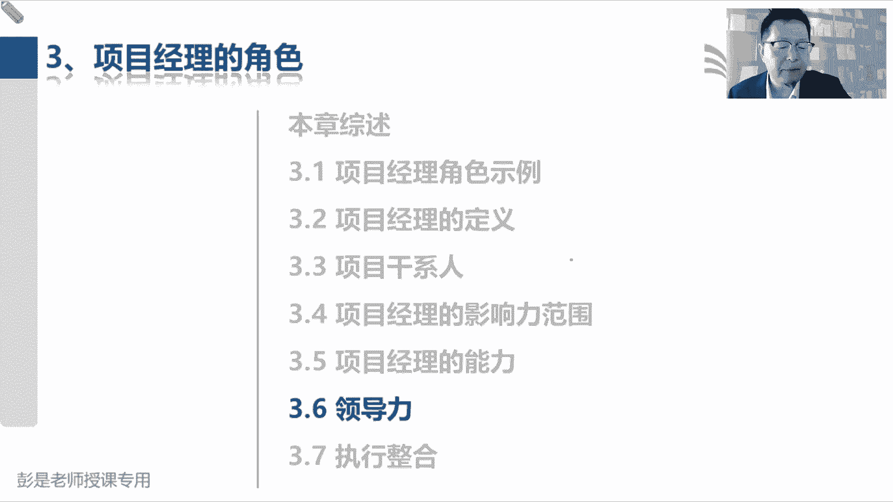

领导力领导力，领导力技能包括指导激励和带领团队的能力，这段巴拉巴拉也不念了，就像上节课说过的一个知识点啊，说管理和领导，管理和领导的本质区别，先把这两个单词搞定，管理和领导力的本质区别是什么呢。

管理啊更侧重于用权力，让张三李四王五赵六去干活，领导力呢就更侧重于发挥我们的影响力，让张三李四王五赵六去干活，所以他俩本质上的区别是什么呢，管理啊，这是大家看过看过那种战争片啊，嗯看过那种真正打仗的。

打仗的那种那种电影电视剧啊，就是兄弟们给我上，兄弟们给我上对吧，枪杆子底下出政权呐对吧，不往前冲，老子毙了你哎，用全力让对方去往前冲，这是管理，那领导力呢就是兄弟们跟我上就差一个字吧。

就体现了体现了这种风格的不一样领导力，兄弟们跟我上，对不对，兄弟们跟我上啊，身先士卒，以身作则啊，对不对，诶，带头往前冲，希望发挥我们的影响力，让大家让大家愿意跟着我们一起完成任务，实现目标。

得到期望的成果，这是这两种这两这两这两个单词的本质区别，所以呢很多很多企业就是说我们任命张三，是这个项目的项目经理，张三呢就利用手里的指挥棒对吧，这是你的权利啊，让让李四王五赵六去干活，这就是管理。

领导力呢更侧重于发挥大家的主观能动性，让大家愿意跟着你一起往前冲，那怎么让大家愿意跟着你一起往前冲呢。

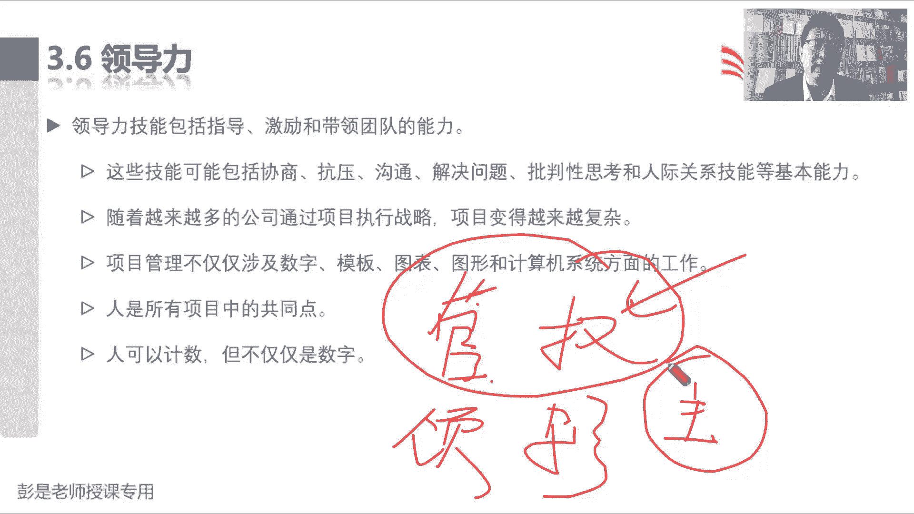

就涉及到这一小节，最重要的叫领导力风格好，后面这段文字没念到的内容啊，大家基本上课后复习看一遍就可以了，都是纯粹的字面意思，比如说人际交网站项目经理，工作的很大一部分对人际交往。

人际交往就是大家日常日常工作，和你的同事和你的朋友，和你的亲戚处关系。

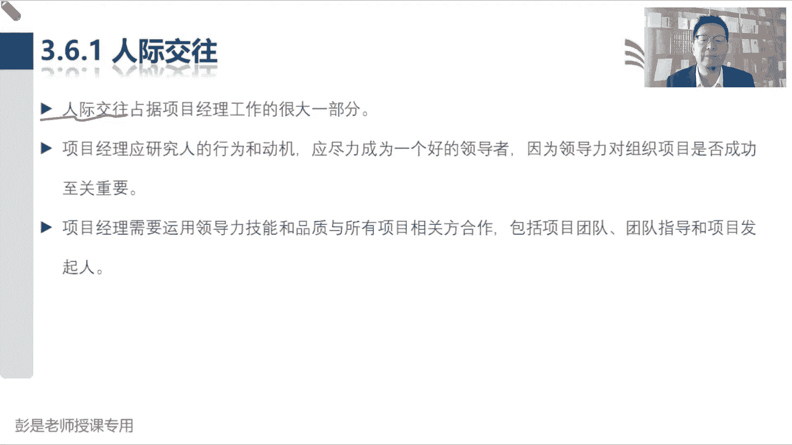

然后研究研究显示，有令领导者的品质和技能，包括但不迁移，有远见，积极乐观，乐于合作，这都是字面意思吧。

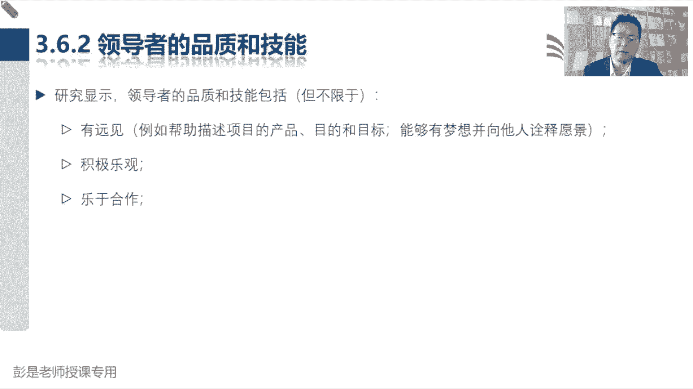

什么建立信任，寻求共识啊，发展的眼光啊，这都不念了啊。

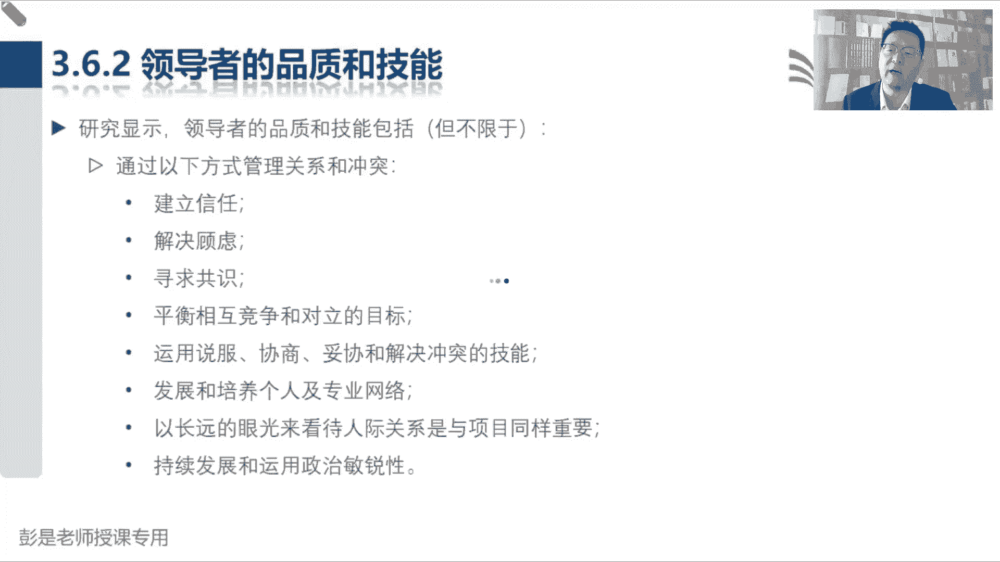

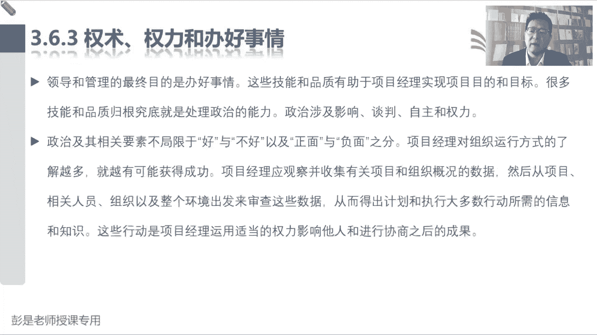

往下翻翻翻翻翻翻到全面这一小段内容，说某些情况下我们需要用全力让对方，命令对方去干活，某些情况下我们需要用影响力，对不对，影响人家让人家有主观能动性啊，那权利权利权利。

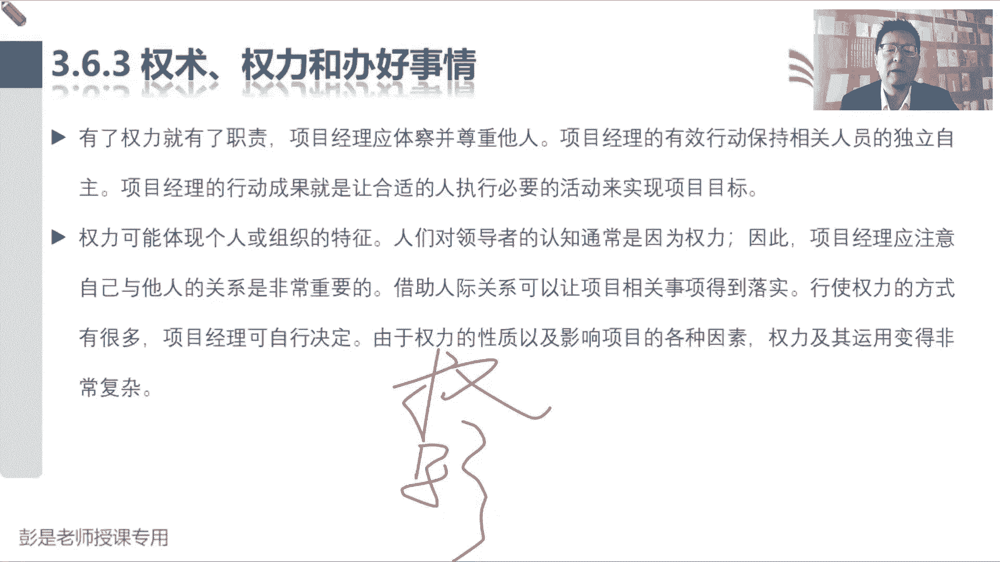

项目经理，项目经理啊，可以用的权利，常见的考点有这么五种权利类型，这需要大家记住的第一个知识点，项目经理，项目经理能够用的权利通常有哪几种呢，先把这个标一下，再把这个标一下，再把这个标一下，正式权利。

奖励权利和惩罚权利，处罚权利，这三种权利是项目经理的合法权利，合法权利啊，就是张三被任命为这个项目的项目经理，张三呢就从项目经理这个角色身上，拿到了三个权，叫正式的权利，奖励的权利和处罚的权利，对吧。

我有权利带着兄弟们完成任务，实现目标，有权利让张三李四王五赵六去干活，这是正式权利，然后李四王五赵六干活干得好，我可以给你们提高评高绩效，让你们赚更多的钱，这是奖励权利吧，嘿张三李四李四王五赵六。

你们仨迟到了，无组织无纪律，那我可以动用我的处罚权利对吧，扣奖金扣工资，扣绩效，这是项目经理拥有的拥有的，公司赋予我们的企业组织赋予我们的合法权啊，正式权利，奖励权利和处罚权利这三种权。

那公司能给我们的这三个权啊，公司能给我们的这三个权，其他的权利呢公司给不了其他的权利啊，通常高频考点就有这两个，一个叫参考权，一个叫专家权，剩下的没讲到的都可以记不住，可以不记啊，参考权说。

例如因为他人的尊重和赞赏，获得的信任，他有的时候被翻译成参照权，有的时候被翻译成了暗示权利，嗯暗示今天那个吐槽一下小合同，今天写字功能不太好用，反正听声声音能听明白就可以啊，暗示权或者叫浅释权。

就是那个潜水的潜，一个意思啊，参照权参考权，暗示权显示权，这种权利最好理解的场景，就是大家听过的一种一个一个成语，一个cookie故事，叫狐假虎威，咳咳咳，叫狐假虎威，狐假虎威是什么意思呢。

就是大家都怕老狐狸在森林里面耀武扬威的，大家都怕狐狸啊，但本质上不是怕狐狸，怕的是狐狸背后的老虎诶，就是借势解释，所以这种参照权显示权暗示权都是一个意思啊，是因为他人的尊重和赞赏获得的信任，这种情况下。

也可以用这样的权利去让对方去施加影响，这是公司给不了的权利，需要我们自己去主动去争取，对不对，因为你把工作做出色了，有一定的沉淀和积累，显示出我们的专业性，才能够获得别人的赞赏和尊重啊。

这需要我们自己去争取，第二种自己去争取的权利，就是专家权，例如拥有技能信息经验，教育培训证书，体现我们在某个领域的专业性，比如大家通过考试拿到了p mp证书，说明我们在项目管理方面呢有一定的专业知识。

有一定的经验对吧，有一定的技能啊，嘿它也可以体现我们的专业性，这是公司给不了的，公司给不了的啊，这两种权利大家听一听，记住它啊，公司能给我们的权利就是第一种地位权利，正式权利，合法权利，第二种奖励权利。

第三种处罚权，公司给不了的，需要我们自己想办法去争取的，参考权和专家权嗯，萝卜同学不用辞书，辞书已经是上一代上一代的话题了，通关宝典，你要想撕，也就是思按照我们那个章节目录就四部分吧。

第一部分项目管理基础，第二部分十大知识领域这种东西啊，然后第三部分多变环境下，这是敏捷，第四部分就是第七版，现在不建议撕了，本身也不厚啊，好知道有五种权利类型。

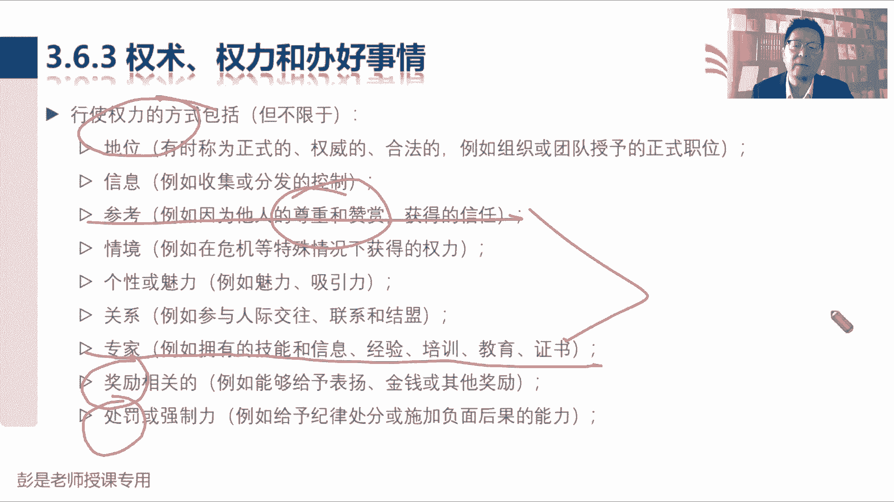

接下来根据刚才储备的知识，这句话就可以看懂了，在权利方面，顶尖的项目经理积极主动且目的明确，我们会在组织政策协议和程序许可的范围内，主动寻求我们所需要的权利和职权，而不是等组织授权。

因为组织给我们的权利，正式的权利，奖励的权利，惩罚的权利对吧，组织给我们的权利啊不一定很大呀，为啥呢，因为有的组织采用的是职能型，有的组织有的项目采用的是弱矩阵，有的项目采用的是平衡矩阵的。

在这三种组织结构之中，项目经理其实权力都不是特别大，尤其是前两种啊，那我们的正式权利，奖励权利惩罚权就可能基本上没有了，那在这种环境下，在这种环境下怎么办呢，诶那我们就需要想办法对吧。

努力的不断的提升我们的技能，经验，诀窍技巧专业性了，来证明我们的专业专业权，然后呢再获得别人的赞赏，尊重认可许可，和人家处好关系，又有了参照权，唉想办法去争取这方面的权利，这个权利企业给不了。

像我们自己想办法去争取的东西啊，这是大概五种常见的权利类型，其他没念到的内容基本上都是字面意思，并且呢考试基本上也不大好看，一看就可以了，嗯能把团队成员踢出团队吗。

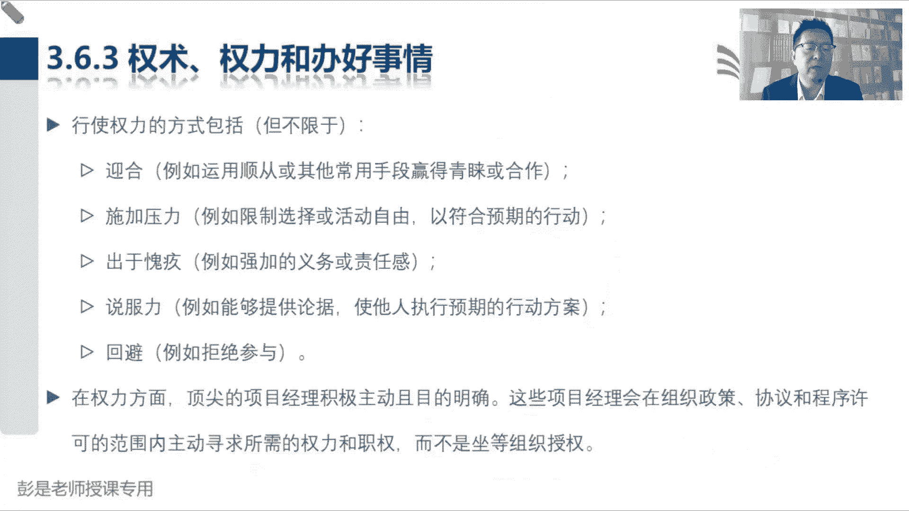

这如果你有了正式权利，合法权利不就可以吗，对吧，就像我是部门经理，能不能提出提出建议辞退某一个员工啊。

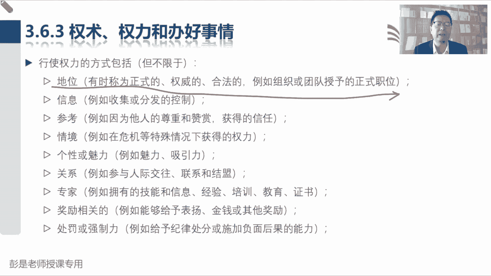

嗯好再往下拉啊。

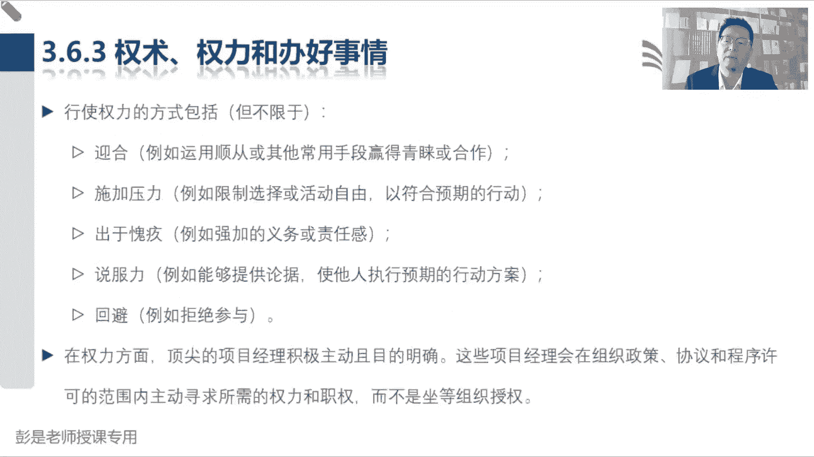

然后3。6。4，领导和领导力和管理之间的区别，刚才也说过了，领导和管理两个字不一样了，我们知道某些情况下，我们有权利做别人做做一切事情，所以管理更侧重于运用一系列已知的预期行为。

指示一个人从一个位置到另一个位置，就是靠权力命令对方去干活，相反领导力是指通过讨论辩论和他人合作，带领他们从一个位置到一个位置，就是兄弟们跟我上，兄弟们给我上这个区别。

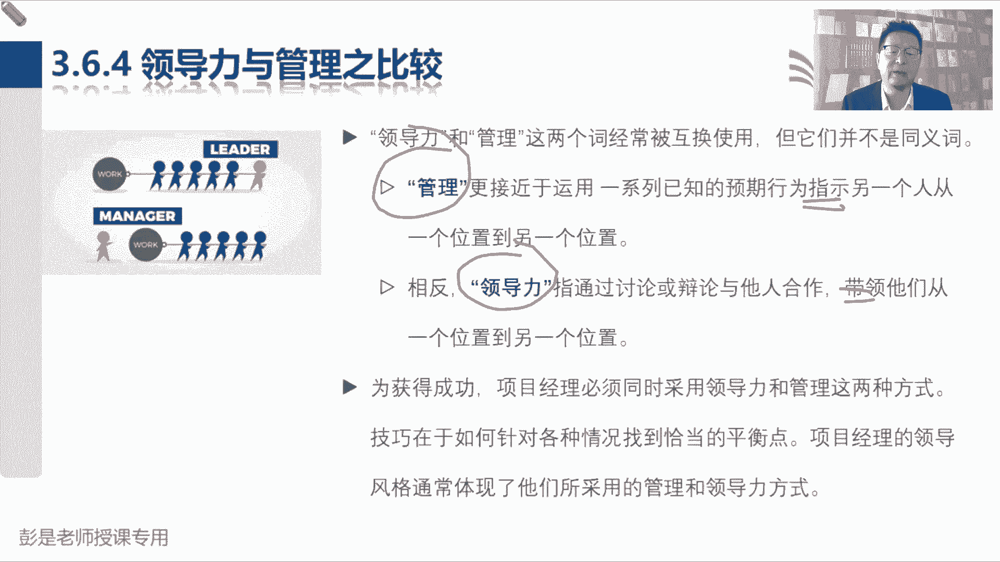

然后再往下再往下找到在这些风格之中，最常见的，包括但不限于，常见的常见的不同场景下的不同的领导力风格，这段文字也是超重要的，知识点，一定要记住，放任交易服务变革魅力和最后的交互。

非常非常非常重要的知识点，一个一个看啊，放任型，例如允许团队自主决策和设定目标，又被称为无为而治，允许让让团队呀自己决策，自己设定目标，又被称为无为而治，需要倒推了吧，换个角度看问题啊。

什么情况下你敢这么做呢，什么情况下允许团队自己来做决策，什么情况下允许团队自己设定目标，对吧，我是牛肉面馆的老板，然后团队呀你们自己来决定，今年我们要赚多少钱，你说对吧。

你们各个部门的自己来设自己的考核目标，考核绩效，什么情况下敢这么做呢，有经验不一定吧，强矩阵不一定吧，团队素质高不全面，团队素质高不全面，权责分工明确，不一定能力很强，能力很强，责任担当。

其实刚才前两个同学说的对啊，小叮当同学和呃一号同学跟项目经理放空，同学放空同学说的不对，和项目经理能力强和弱没关系啊，所以标准的用词就叫成熟的团队，尝试这么写哈，一个成熟的团队，一个成熟的团队。

什么叫成熟呢，这个场景啊，大家想，如果你有了小孩儿，如果你有了小孩儿，什么情况下，你让小孩自己做决策和设定目标呢，对吧，小孩一年级的时候，你自己决定要不要上学，自己决定要学什么东西，自己给自己设定目标。

你就不管了，不敢罢，为什么呢，因为他不成熟，中学敢不敢放权呢，不敢高中敢不敢呢，不一定大学敢不敢呢，不一定对不对，有的人可能妈宝男的30岁，40岁了还不成熟啊，所以确定的是什么，一个成熟的团队。

一个成熟的人，我们才允许允许啊，唉他自己决策，自己来设定目标啊，成年不代表着成熟，成年不代表着成熟，成熟啊，这是两回事啊，好所以一个成熟的团队，一个成熟的团队，他们自己能够主动的高效率的高绩效的去干活。

这种情况下咱就不管了，嗨我们就把权力交给团队，所以这叫放任型的领导力风格，那一个成熟的团队，一个成熟的团队啊，未来到了敏捷里面，我们又写了第二个单词来形容它，就叫自组织，一个成熟的自组织团队。

我们就可以把权力交给团队了，把权力交给团队对吧，放手啊，然后呢由团队自己来做决策，由团队自己来设定目标，咱就不管了，什么叫自主决策，自主设定目标呢，由团队成员，他们一起来完成工作的规划，执行和控制。

规划不就是决策设定目标吗，自己干活，自己做计划，自己执行，自己监控，嘿咱就不管了，就成为无为而治，一个成熟的自主自组织团队，我们就可以采用放任型的领导力风格，这是第一个重要的知识点，非常非常非常重要。

那采用了放任型的领导力风格之后啊，我们没啥事了，为什么呢，我们把权力交给团队了，授权了吧，把权力交给团队，咱干啥事呢，他就要结合到第三种领导力风格叫服务型领导，例如作出服务承诺，处处先为他人着想。

关注他人的成长，学习发展自主性和福祉，关注人际关系，团队和合作服务优先于领导，就采用这种服务型的领导力风格，有的时候也被翻译成仆人式的领导力风格，管家式的服务，都是一个意思啊，仆人式的服务型领导。

管家式的保姆，想怎么理解就怎么理解啊，哎所以这种情况下，我们的主要工作变成工作重心就变成了什么呢，给团队创造良好的工作环境，对不让团队呀想办法让团队挨了，让团队能够成熟对吧，让大家不断的成长。

不断的学习，不断的提高我们的技能，提高团队的能力，帮助团队排除阻碍，排除干扰，对不对，就是服务员就是服务员，好所以第一种和第三种领导力风格，通常通常你把它这么一对的去记比较好记啊。

所以放任型的团队成熟了，我们就授权把权力交给团队，他自己决定自己做决策，然后呢我们就变成服务员，服务员的工作是啥呢对吧，大家去餐厅吃饭，服务员的工作是啥呢，给你提供良好的就餐环境对吧。

确保什么不要太吵啊，确保大家没有人在室内抽烟呢，是不是良好的就餐环境吗，然后确保确保确保对吧，你吃的开心，吃的快乐，对不对，就这些东西啊，然后中间第二种领导力风格叫交易型，交易型领导力风格叫关注目标。

反馈和成就来确定奖励，做好例外管理，这个咱从小到大，天天身边都是这样的领导力风格，交易型的领导力风格对吧，我老老娘跟我说说，你考试要考100分，给你买个新的游戏机，这不是给我定了目标吗。

然后你达到什么样的成就，会获得什么样的奖励，会获得什么样的回报，所以纯粹的字面意思，交易型交易型，我们要给领导，给我们的成员设定他的绩效目标对吧，根据他的实际绩效情况，看看离这个目标远和近。

来确定给他多少，给他多少多少奖奖金，这东西啊，这个超好记，对吧，干好了就讲，干不好就罚呀，然后再往下变革型的领导力风格，这种呢也不太需要大家去刻意的去背了，变革通过什么理想化，什么什么特质和行为鼓励性。

什么什么激励，就是满每天提倡的是什么改革创新对吧，不要墨守成规，不要循规蹈矩，不要思维固化，看看能不能启发大家找到一些新的新的创意，这是纯粹的字面意思，这东西不用背的，最后呢魅力型领导力风格。

纯粹的也是纯粹的字面意思吧，能够激励他人，精神饱满，热情洋溢，充满自信，说服力强，就是天天打了鸡血一样啊，天天打了鸡血一样的人吧对吧，加油加油，你最棒，哎呀my f同学，你说的太棒了太好了。

绩效管理是交易行吗，就是啊绩效管理，绩效管理不就是为我们设定绩效目标，对不对，你实现小目标就会获得什么样的回报，奖金啊，工资啊，绩效奖金啊，这都是交易哈，唉所以交易型变革型，魅力型。

甚至最后的交互型交互型就是混用吧，这都不用去记的，都不用去记啊，但主要要一定要掌握的就是第一和第三种，魅力型有点虚头巴脑啊，其实不虚，其实不虚啊，因为大家有没有听过这样一个成语啊，哀兵必败，对吧。

当我们发现团队呀在士气呀，在精神啊对吧，在热情啊，在不自信啊，在这些方面，一旦一旦一旦唉，心理上有了一些这种障碍和阻碍的话，那我们要想办法了对吧，给大家加油啊，让大家充满正能量啊，需不需要呢，需要吧。

嘿所以魅力型的领导啊，就是不管条件再艰苦，想一想咱那个革命革命对吧，什么什么红军不怕远征难，万水千山只等闲，在各种各样的不利的放开放开，在各种各样不利的情况下，不利的情况下，如果团队失去了信心。

失去了信任对吧，失去了士气，那我们要想办法刺激大家对吧，充满正能量啊，他不是画饼啊和画饼两回事啊，是正能量正能量正能量对吧，让大家看到我们的远景，看到我们的目标，看到我们的长远的收益啊，长远的回报啊。

嗯它主要是给大家提高士气，建立信心，这是超重要的一件事情，可不是画大饼啊，画大饼是假大空，他是到通常来说是负面的哈，所以第一和第三种需要记住啊，剩下的几种啊，看名字，看场景应该能反应过来。

他也不太会考新奇古怪的东西。

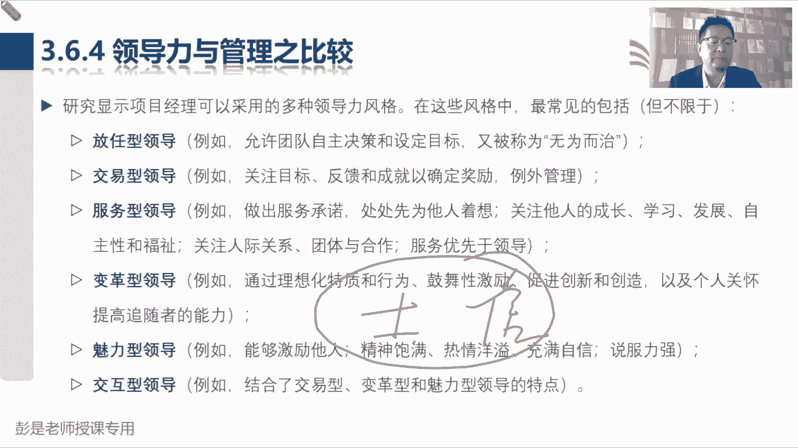

那再往下3。6。5，就没有什么需要大家去背的东西了，像这些东西啊，你说考试的时候这东西很重要啊，很重要超重要，但考试的时候这东西没办法考啊，对吧真诚，你说这玩意儿咋考，真诚这玩意儿咋考，如果想考。

只能是谜底，就在谜面上，我们很容易的很容易的可以去判断，通过一段文字描述，判断这个人真诚不真诚，这超好理解吧，什么谦虚谦恭，创造力，文化情绪智力，这都没啥，没啥可点。

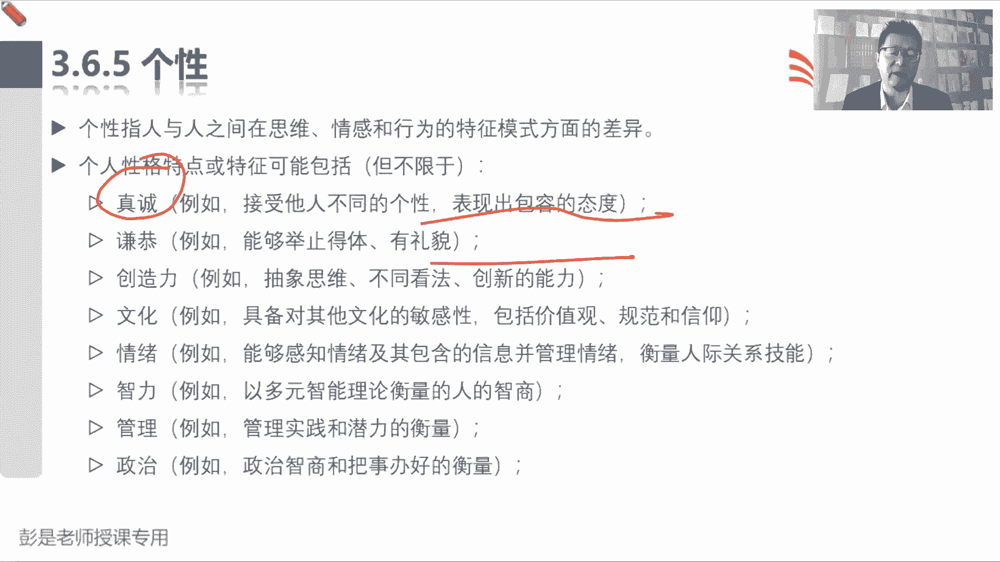

可说到老啊，看一遍就可以了，甚至都可以不看了。

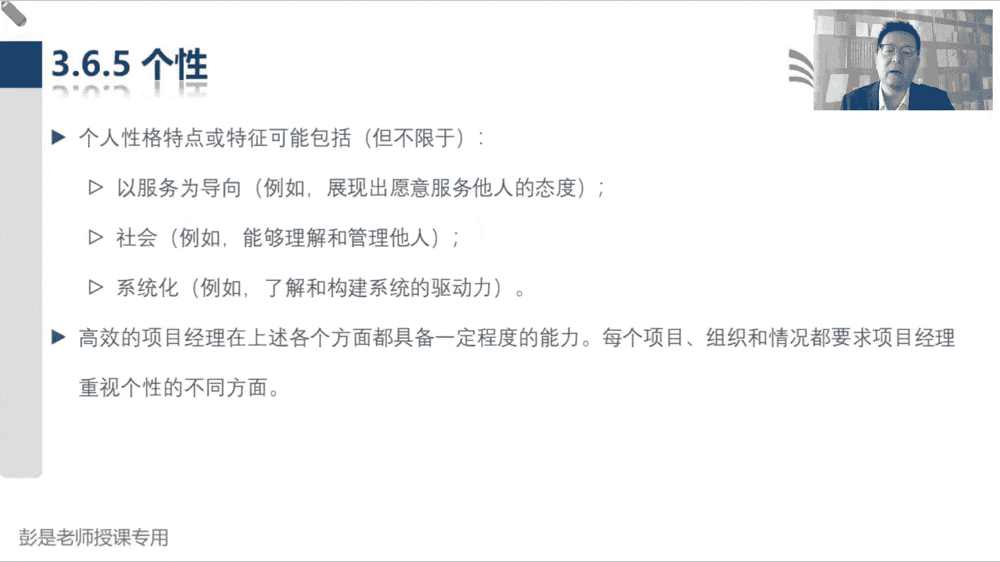