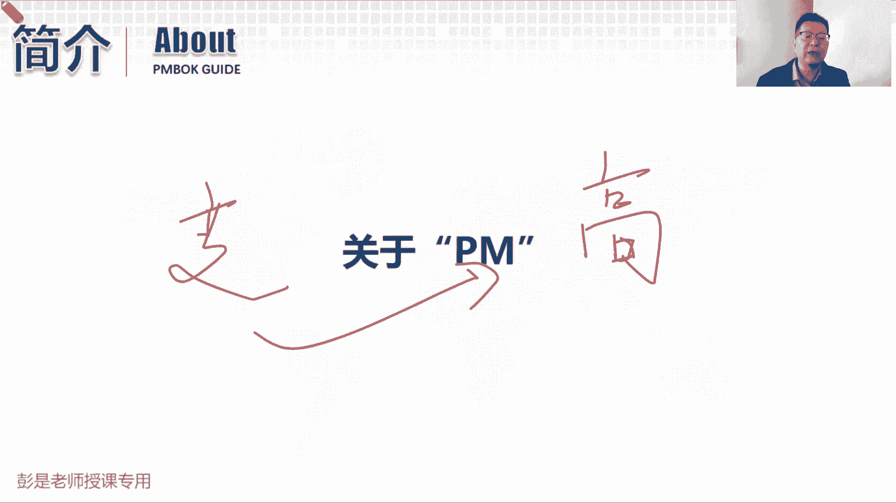
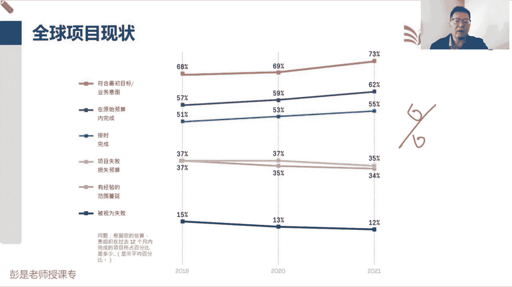
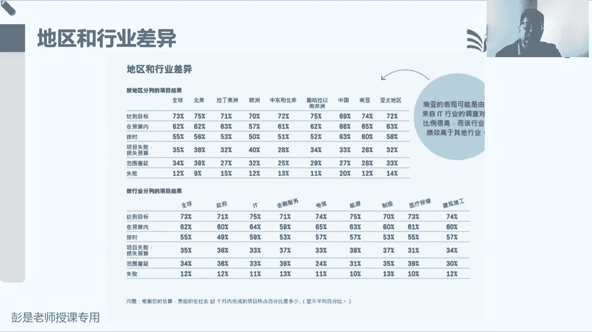
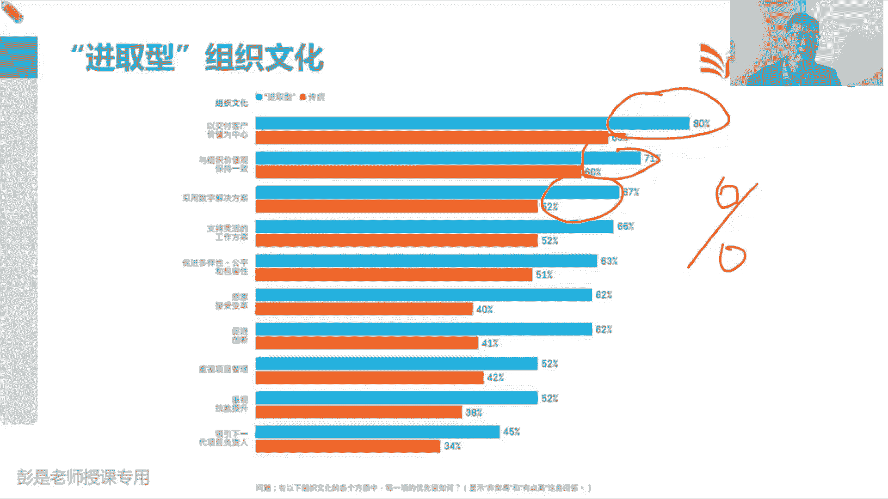
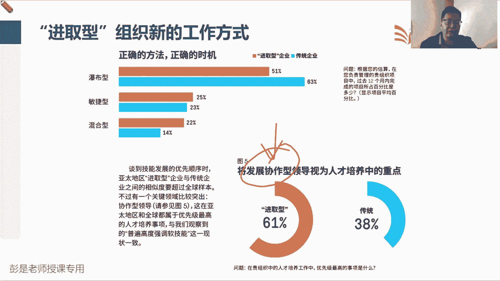
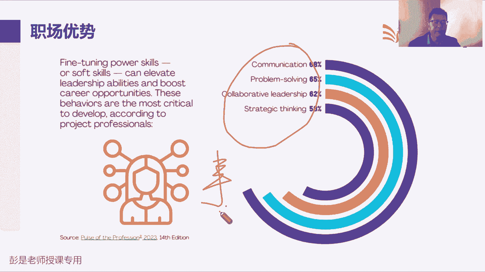
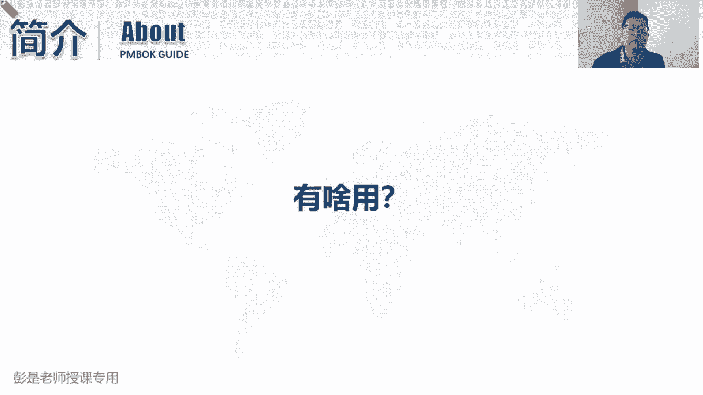
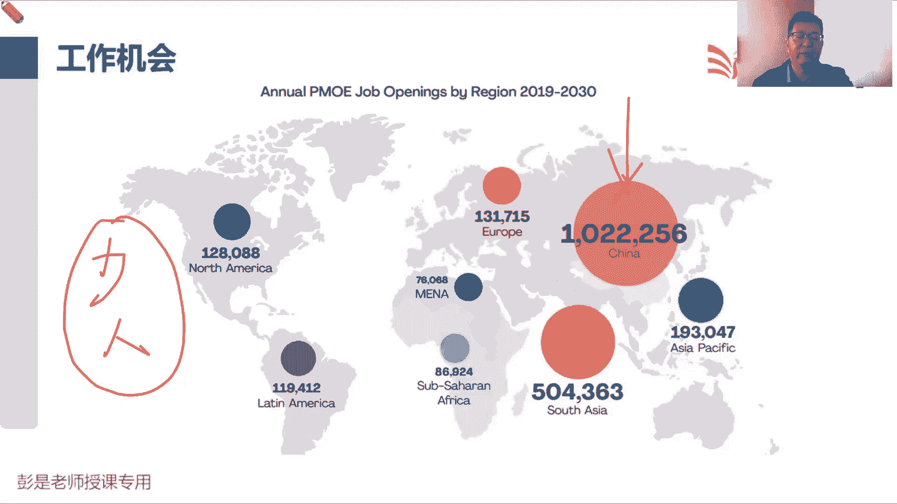
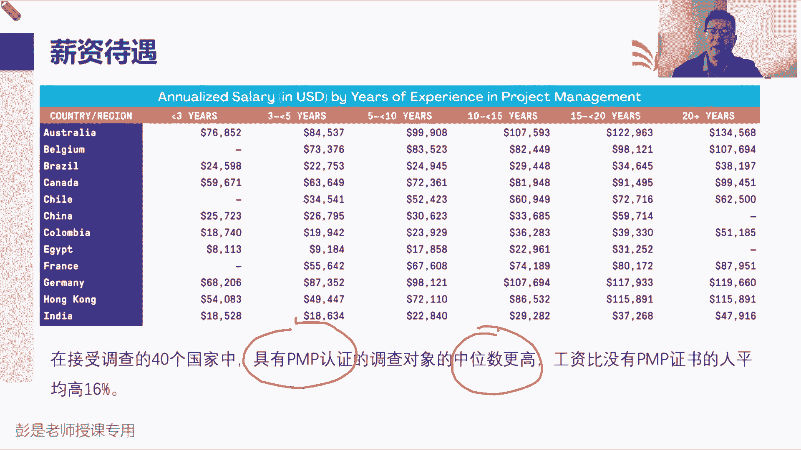
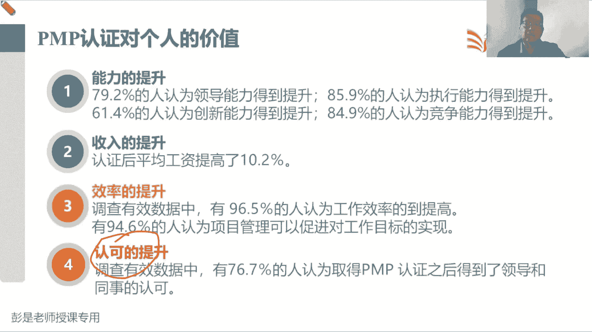

# 【新版PMP培训课程】2024PMP付费课程视频完整版免费观看，零基础通关项目管理考试！ - P3：PM介绍 - 慧翔天地 - BV1Hu4y1a7hA

你们带我下走了啊，我嘴里面有糖豆，抱歉各位同学，我要把它咽下去，因为现在感冒声音怪怪的，然后不吃糖豆就会咳嗽啊，好那再往下，现在项目环境都复杂，项目环境都多变，那关于项目经理。

对项目经理的要求也就变得越来越高吧，变得越来越高吧，项目都没有那么简单了，项目经理需要掌握了需要具备的能力，需要具备的综合素养一定是越来越高的，对项目经理的要求，对项目经理的期待肯定是越来越高的。

不能说我们花这么多钱雇一个项目经理，干一些简单的事情，对不对，所以对企业来说，反而希望项目经理啊，能够帮助我们解决这种复杂的场景，能够灵活地根据我们项目的实际情况。

帮助我们去分析我们应该用什么样的管理方法，用什么样的过程啊，收入啊，输出啊，工具啊，技术啊，变成第七版的，就是我们应该用什么样的模型啊，应该用什么样的方法呀，应该用什么样的弓箭呢去完成任务，时间目标唉。

所以项目经理就像一个优秀的，卓越的出色的设计师，画出我们项目管理的蓝图，这个蓝图可以适用于我们企业的。

当前这个项目的实际情况，所以再往下听了啊，那项目经理的要求高体现在什么程度，体现在哪些方面，看一看现在这项统计数据是2022年发布的，发布的官方的统计数据啊，说全球目前大多数项目的情况是这样的。

六十八六十九七十三%，越来越多的项目会符合最初的商业目标，商业意图，比如我们公司打算研发一款新的手机，提高市场占有率1%，我们公司打算研发一款新的汽车，赚他十个亿，八个亿的，我们公司打算盖个房子。

盖个住宅小区，捞他十个亿，八个亿的，我们公司打算研发一个新的软件来赚点钱，来提高我们的声誉，提高我们的口碑，提高我们的客户，客户群体数量，以此类推，越来越多的项目能够符合最初的商业意图。

越来越多的项目能够在预算内去完成，能够越来越多的项目能够基本上做到按时完成，其实不太多啊，然后失败的项目的概率会越来越低，然后继续进一步的思考了诶，为什么这些企业会成功的概率越来越高。

失败的概率越来越低呢，他是怎么做到的呢，这些企业有什么特点呢，来继续分析。

看看国家和地区有没有较大的差异呢，然后经过统计分析下，就会发现国家和地区没有那么大的出入，超出大家的认知啊，不要想着说欧洲啊，美国啊和我们亚太地区和非洲地区啊，唉我们觉得项目可能在非洲可能会失败的概率。

会应该高一点啊，实际上不是这样的，并没有特别大的出入，还有一些小小的差异，但是总体上来看差异没有那么明显，然后又去分析分析了，那不同行业，不同行业有什么差异吗，然后呢什么金融啊，政府啊，IT啊，电信啊。

发现统计分析下来啊，不同行业差异也没有那么大，不同的行业差异也没有那么大，然后再比如说像什么电信啊，能源啊，什么IT啊，这种这种这种这种这种领域，他成功的概率高，为什么呢，因为花的钱多呀。

所以这些这些人一定要更重视，这个这个项目的成功啊，你CC所以实际上来说差异没有这么大，那再继续分析国家和地区没有较大的出入。

那我们看企业，所以呢企业这么一比较，就会发现有明显的不一样了，不管是在什么国家和地区，企业通常分为两大类，两大阵营啊，蓝色的叫进取型的企业，橘色的叫传统企业，就是墨守成规，循规蹈矩，中规中矩。

那进取型的企业呢就是学习成长，创新改革，不断的不断的随着时代的发展，科技的进步，然后与时俱进，用我们新的新的技术，新的工艺，新的方法去适应这个时代的变化，所以蓝色的企业。

它在项目成功的比率比传统的企业要高得多，刚才那个前面那个地区差异啊，全球差异啊，差个一两个百分比，差个一两个百分点，对不对，差异不明显，但是呢对企业上去做分析的话，就会发现哎这些学习型的成长型的企业。

他们把项目做好的这个概率要高得多，要高得多好，那继续分析了这些企业成功的几率高的这么多，高的这么多。

这些企业关于管人有什么特点呢，所以呢这些企业看右下角这个东西啊，进取型的企业更关注的是人才培养，将发展协作性的领导视为人才培养中的重点，因为项目经理主要的功能是什么呢，协调大部分的时间都在沟通，对不对。

希望我们各个部门，各个来自各个部门的各个公司的，我们这帮人啊，大家聚在一起，然后有凝聚力，让大家在正确的时间，正确的地点能够正确地把工作完成，从而实现我们整体的目标，所以项目经理最重要的就是能力之一。

就是发展节奏，发展节奏协调这个事情啊，那这些学习型的企业把项目经理这方面的能力，认为是人才培养中的重点，然后再去分析了，那他具体关注项目经理掌握的哪几部分技能呢。

这四大块，第一个就是沟通协作，协作大部分的时间，顶尖的项目经理，大部分的时间都是在沟通和客户和供应商和，政府和团队和管理，团队和发起人和项目集和PO和项目组合，总之和职能经理和高层。

总之我们在整个开展项目的过程中，要和方方面面的人去打交道，去沟通，去沟通啊，那第二大技能就是问题解决，这就涉及到涉及到的那个叫什么呢，叫批判性思维，项目经理，能不能找到一些新的解决问题的方法呢。

嗯方法总比问题多，方法总比困难多，项目经理能不能根据项目的实际情况去分析，这事应该怎么办，根据我们储备的知识，根据根据我们积累的经验，找到一些科学的有效的管理方法，帮助我们更好地解决问题。

这是救火队长这种能力吧，第三个呢就是领导力，就是虽然你沟通能力很强，虽然你解决问题的很强，解解决问题的能力很强，别人愿意不愿意跟着你一起往前干活了，对别人喜欢喜欢不喜欢你啊，愿不愿意跟着你往前冲啊。

诶这是领导力，想办法利用我们的领导力，来提高我们团队成员的这种主观能动性，积极性，最后呢就是战略思维，战略战略思维啊，项目经理有没有大局观的，咱不要闭门造车，不要低着头走路啊，还要抬头看方向了。

项目经理能不能了解我们整个什么，上到国家战略对吧，下到行业趋势，再往下到企业的情况，企业的战略，企业的发展趋势，再往下就是我们项目的愿景，项目的目标，项目的任务，以此类推，有没有这种大局观战略思维。

能不能考虑周全，从售前售中到售后有这种格局好，所以这是这些进取型企业，关于项目经理更关注的是这四方面的，四方面的技能，大局观，然后带好人解决问题，沟通好事情，所以最后一。

今年项目经理的核心意义的技能就是搞好事，照顾好人。

还要有商业头脑，有商业意识，好知道这个啊。

所以这玩意这玩意到底有啥用呢，最后看工资，这是最最好的体现方式了，所以这是PIPI2022年，关于全球项目管理从业人员，这个工作机会的一个预测分析分析，结果申请了请了非常非常知名的调研机构。

给出的官方调研数据，就是说呀未来全球啊，看中国有102，102万个项目经理的工作岗位机会，然后欧洲13万，北美洲12万，什么呀，东南亚19万，然后南非50万，什么澳大利亚在这部电脑唉。

总之有这么多的工作机会，为什么要调研这个呢，就是因为缺人呐，人才紧缺呀，说我们会沟通，会积积极主动想办法解决问题的人，然后有领导力的人，有领导力的人，还有大局观的人，还这样优秀的。

卓越的出色的项目经理不够不够太少了，大部分的人可能只是初级的这种这种项目经理，助理的这样一个这样一个角色啊，正儿八经的专业的项目经理啊，人才缺口非常非常大，那工作机会多也就意味着也就意味着钱。

所以呢继续我们统计前就有了这张表。

这张表大家看咱关心的数据其实就够了啊，第123456，第六行，这是国内目前的大概的一个调研结果，是国内的大多数的项目经理啊，小于工作小小于3年以下的，基本上年薪的呃，基本上年薪222。50000美元。

然后随着年龄的增长，你的年薪会越来越高，然后大约20年以上了，这个数据太少，没有没有可参考的价值，所以就就没有调研结果，只要看看澳大利亚年，澳大利澳大利亚年薪确实高啊，人家挣得多啊，澳大利亚什么比利时。

巴西，加拿大，智利，哥伦比亚，什么埃及，法国诶，大家项目经理的项目经理的年薪，给了这样一个调研结果，那这个调研结果啊到底多少钱根本就不重要，重要的是下面这句话，那对我们这些调研受受调研的人群又做了分析。

发现了在接受调查的40个国家中，具有PMP认证的调查对象，这是通过考试拿到了PMP证书的人，他们平均工资的中位数是吧，平均工资中位数啊更高，他的工资比没有PMP证书的人，平均高达16%。

换句话说人家月薪1万，你有证书的可能月薪就是1万1600诶，大部分的人是这样的一个情况啊，个别的极端的个别案例咱们不考虑，也就是全球不管什么样的国家和地区，拥有P证书的人，拥有PP证书的人。

他的工资普遍比没有证书的人要高，16%左右，PMI肯定不是神经病，肯定不会花大量的时间精力，这个调研花了不少钱呢，肯定不会莫名其妙的花很多钱，去调查调查这样的数据啊，调查这样的数据的目的。

就是想证明他自己的权威性，他在项目管理领域，p mp证书，PMP证书，它的含金量，所以还是那句话，这玩意儿火，这玩意儿难，这玩意这玩意有含金量，需要大家认真的重视起来，这个事情啊。

千万千万不要千万不要飘，不要想当然。

那这玩意儿对我们个人的价值能力的提升，不电了，咱整个培训过程中，不仅仅是希望，不仅仅是帮助大家去去练教材啊，不会要求大家去死记硬背的，不是帮大家念教材，希望通过我们讲课的过程中。

包括未来模拟考试的过程中，训练大家的能力，什么能力呢，思维能力啊，批判性思维啊，唉底层逻辑的认知啊，推理的能力啊，这帮助大家不断的提升方方面面能力，包括你阅读的能力，看书的能力都会得到提升的。

然后收入这不念了啊，今年心理形势不好，不解释了，效率能力得到了提升，能力得到了提升，我们做事情的效率就会提升对吧，就是什么东西决定了结果呢，方法什么东西决定了方法呢，认知对吧，见过世面，有格局。

有大局观，知识储备足够丰富的人，他就能够更好地找到更多的方法，去达到期望的结果呀，所以认知的不足，通常会导致结果可能就会受到限制，那工作的效率和质量就可能有点影响，所以大家能力提升以后，效率肯定会提升。

最后一个好处呢就是认可度的提升，这应该很好理解啊，你通过考试拿到证书，发个朋友圈，那个证书超炫的，纯英文的，发个朋友圈，一大堆人给你点赞了，哎所以我们调查说有80%的人。

就约等于80%的人说取得了P认证以后，会得到领导和同事的认可。

