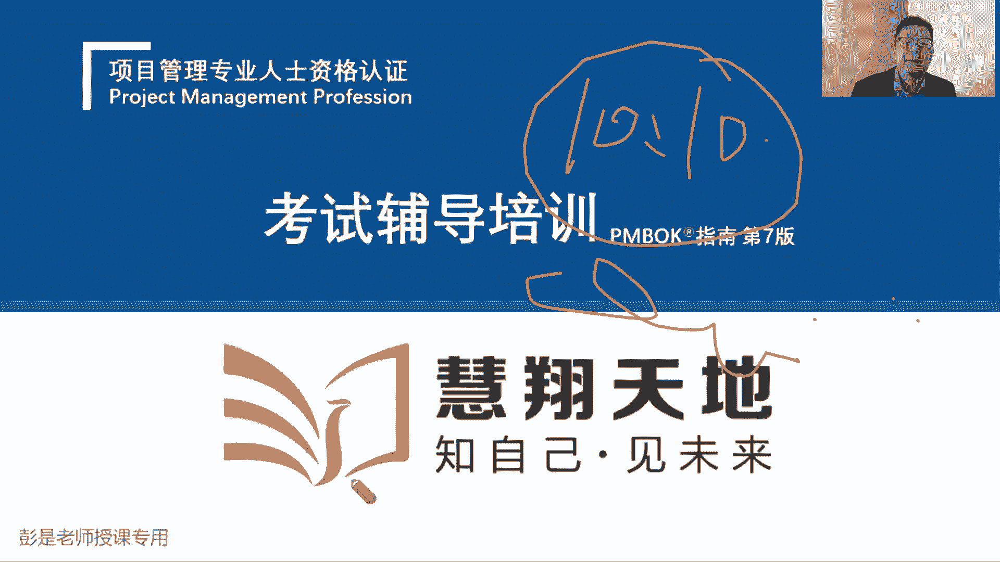

# 【新版PMP培训课程】2024PMP付费课程视频完整版免费观看，零基础通关项目管理考试！ - P6：1.1 项目 - 慧翔天地 - BV1Hu4y1a7hA

好各位同学准备了啊，咱们正式开始讲知识点了，然后呢没有通关宝典的同学呢专心听就可以了，今天第一天上课讲的速度不会很快，希望大家有一个逐渐逐渐接受，逐渐适应这样一个过程，那第一天的课程呢。

就是讲项目管理相关的基本概念，让我们知道什么是项目，什么是运营，什么叫项目集，项目组合，什么叫PO，就这些东西啊，项目环境的这些背景啊。

接下来我教材的内容和大家通关宝典的内容，一模一样，所以呢建议各位同学在听课的过程中先专心听，先专心听，先专心听，听完了之后呢，如果想做笔记，想标重点的同学，建议第二遍的时候，第二遍的时候再去做重点。

再去做标标那个笔记啊，再去做笔记，标重点，为啥呢，这个课程和教材个人建议至少至少三遍起，听一遍肯定不够的，听一遍看一遍，说老师这教材我看一遍够不够呢，这个课我听一遍够不够呢。

个人建议至少至少三遍起听一遍，你听懂了和记住这是两回事儿了，一听都明白，一听都明白啊，一下课撂爪就忘，这正常情况下，艾宾浩斯记忆曲线，了解一下，今天听完课睡一觉，明天能记到的知识点大概1/4。

然后明天周二周三周四上几天班，上几天班啊，上了几天班之后，你能记住的内容大概1/5了不起了，然后再过个什么元旦啊，过个什么春节呀，一个月不看书啊，能记到的内容基本上就约等于零了，约等于零吧。

所以无论是听课还是看书，个人建议这至少至少三面积啊，所以呢第一遍听课的时候，建议大家呢最好不要做笔记，先专心听，因为听的时候你会发现我在课件上写写画画，会写东西的，那如果你低着头做笔记。

我写的东西你就没看到没看到呢，就跟不上，跟不上呢，哎就没不理解，不理解呢就导致恶性循环，对这回又不知道我讲啥了，咱们所有的课程都是从前到后，有逻辑关系的对吧，循序渐进，循序渐进渐进啊，咱都是连续剧啊。

所以千万千万不要断片儿好了，说完了这个东西呀，再说再说学习方法，先把大道理给大家讲完啊，说老师啊专心听课，专心看书，专心做题，大家未来整个学习整个备考的过程中，第有两个天敌呀，第一个天敌是什么呢。

就是专注，专注力不够，注意力不集中，这是大多数人普遍的一个现象啊，尤其是当时在当前这个时代，大家想一想，你在工作的时候，能不能保持长时间的注意力的高度集中呢，可能10分钟，15分钟，20分钟很难吧。

因为现在干扰我们的东西，干扰我们的因素啊太多了，诶手机怎么震动了，好像朋友圈有小红点诶，有人加我好友啊，有人加我好友啊，刚才我点赞了，现在有没有人给我回复啊对吧，今天有什么热搜啊，诶有没有好笑的视频啊。

我想休息一下，刚才那个视频好搞笑啊，就是干扰我们的东西太多了，邮件啊，微信啊，钉钉啊，电话啊，微博啊，抖音啊，就导致了我们的生活，我们的生活，我们的工作的时间都叫碎片化的，碎片化碎片化的时间啊。

就导致注意力难以长时间的高度高度集中啊，那注意力的难以长时间的高度集中，考试的时候就糟糕了，咱们考试还记得那个时间长度吧，230分钟大概四个小时吧，四个小时亲，你要老老实实坐在那认真的去答题呀。

并且只有一分钟一道题呀，对对一分钟答完一道题，一分钟答完一道题，注意力如果不集中对吧，难以难以摒弃凝神，达到这个入定的这样一个状态，很多人很多人考试的前30分钟到40分钟，这个错误率非常非常的高。

为什么呢，这是没进入状态，就是注意力不注意力不集中，没进入状态就蒙了，考试的前30道题，到40道题就稀里糊涂就做完了，错了一大堆，后面再一复盘的时候发现哦这个知识点我会。

但是呢当时不知道脑子怎么样怎么样了，他就是不专注，就是不重视，所以注意力不集中是我们的第一个天体，这玩意咋练的，咋练啊，嗯破解它的方法，大家可以百度一下，很简单的方法叫番茄工作法，你没听错。

就是那个西红柿的那个番茄啊，番茄工作法的方法是什么呢，把我们的工作呀分成一小段，一小段的设置为一个翻一个又一个的番茄，时间返点时间，就那个当时有个博士去意大利玩，然后看厨师考披萨，弄了个计时器。

说完这个披萨烤20分钟，计时器一到点叮一响，哎披萨好了，诶，他就说了，那我学习的时候也弄个计时器，我就专心致志的学个20分钟，然后闹钟一响我就休息，然后呢休息个35分钟，再开始下一小段学习。

所以大家在工作中，在生活中，完全可以采用这样的方法，来做我们注意力的这种训练，你可以刚开始设置番茄时间是20分钟，慢慢的逐渐逐渐延长，它等到你适应了这种方法就变成25分钟，30分钟，40分钟到45分钟。

基本上大多数的同学保持在45分钟左右，就差不多了，到极限了，正常人基本上就是40分钟左右啊，所以咱上学的时候一节课课时，一节课的时间设置为45分钟，这是有科学依据的哈，哎大家可以百度一下这个方法。

超简单超简单啊，也不建议另外呢那个计时器计时器啊，也不建议大家用手机里的，手机里面有很多小程序，有很多app叫什么番茄工作法的计时器，不建议用这个东西，因为手机就是个恶魔，对不对，只要你打开了手机。

你就会控制不住自己的欲望，去看一看微信啊，钉钉啊，看抖音啊，哎反而会影响我们的注意力啊，所以呢建议大家买这种物理的，物理的这种这种这叫什么的，单独的一个计时器也没多少钱了，做这方面的训练啊。

大家尤其是在工作中，非常非常好的一种一种工作的方法，这是做注意力的训练，好又是各位同学今天听完课，然后后面去看书的过程中，最好最好采用这种方法，为什么呢，大家不知道有没有做过预习的同学啊。

你拿到通关宝典看看这本书，这本书大家觉得厚不厚啊，厚不厚啊啊已经做了大量的精简了，咱那个官方教材pm和第七版其实没有多少内容，大概300多页，pm和第六版600多页啊，然后ACP大概100多页。

所以想真正通过考试啊，要看第六版，然后ACP要看第七版啊，加到一起1000多页了，1000多页了，通关宝典已经做了大量的精简，把一些什么啰嗦的枯燥的不考的东西去掉了，保留了最核心的部分知识。

所以这本书最重要的作用就叫催眠，就叫催眠了，大家基本上打开书，晚上睡不着的，睡眠有障碍的同学打开书，你看一看，看个35分钟基本上就困了，基本上就困了，因为这本书有什么特点呢，叫不说人话。

大量的枯燥的抽象了这种概念，然后罗里吧嗦的说了好几遍，对不对，不说人话呀，越看越困，越看越头疼，越看越不想看了，那为什么还建议大家去看书了，这就是大家学习过程中第二大障碍叫什么呢，叫阅读。

今天这个小额通那个程序，不知道为啥写字写的不好看啊，他有点卡，大家听听懂意思就够了啊，大家学习过程中第二大障碍就叫阅读，考试过程中第二大章一定要阅读啊，说老师啊，一分钟一道题，100多个字啊。

要把这道题搞明白，搞明白什么意思，把四个选项搞明白，找出一个相对来说比较合适的选项，那看不懂啊，看得慢了，大家阅读的速度，阅读的效率，阅读的质量会直接影响到我们考试的成绩的，诶。

那现在人呢普遍阅读能力普遍不高，能理解吧，以前你还看看什么微博，看看一些什么技术资料啊，看看一些常用文档，现在呢看图片都不想看了吧对吧，现在看视频啊，什么3分钟带你读完西游记，2分钟带你读完红楼梦。

都想吃快餐哈，所以呢大家普遍阅读能力是在下降的，那考试呢又考试呢又需要具有极高的，有一定的阅读阅读的水平了，所以怎么训练这玩意呢，没有好的办法呀，就是就是咬着牙看，不说人话的书，咬着牙看咱的官方教材。

看通关宝典来训练我们的阅读能力，顺便训练一下专注力，训练训练训练训练一下战斗力，那怎么尽快的进入状态，怎么尽快的进入状态，还是刚才那两个字送给大家呀，坚持没有好的办法呀，学习它是反人类的事情。

学习它是反人类的事情吧，对对人来说呀，大脑其实我们是控制不了他的对吧，大脑我们是控制不了他的，什么情况下，大脑大脑相对来说，他的他能他能他能把自己的绩效做到最高呢，同场两个场景，第一个就是紧急情况下。

人在危险发生，危机发生的时候，诶，你的大脑工作效率是非常非常非常高的对吧，比如去看看那些什么警匪片，战争片啊，或者是什么灾难片啊，唉遇到这种情况下，大脑为了生存呢，他想办法提高宿主的生存的可能性。

对不对，我们肉体啊是宿主啊，提高你肉体生存的可能性，他才能够活下去吧，所以这种情况下他的工作效率，工作质量非常非常高，那第二个情况就是你重视，你肉体上重视这个事儿，肉体上重视这个事情。

大脑精神上慢慢的才会接受这个客观的事实，什么叫肉体上重视呢，就是坚持，所以大家大部分情况下，你说看10分钟看15分钟老师管用吗，我负责的告诉你不管用，为什么呢，你大脑不重视这个事。

你看10分钟看15分钟，大脑说还是主人在应付这个事，在敷衍了事啊，咱也就糊弄糊弄对吧，大概有点印象，记得差不多就完事儿了，咱就凑合凑合，那如果当你看书看到20分钟，25分钟，30分钟以上的时候。

大脑才会真正的重视起来这个事情哦，主人在努力，主人要学习，主人要成长，主人要走向人生巅峰了，那我们就咬着牙挤一挤，配合一下主人，这种情况下，大脑才会做这个事情，一定是这样的。

这是学习学习最根本的一个方法，就是坚持坚持坚持，所以个人建议啊，从今天上完课之后，大家未来在备考的过程中，每天学习至少坚持一个小时，不管你再忙再累再辛苦，那都是借口对吧，晚睡一个小时死不掉死不掉的啊。

至少每天保持一个小时的学习时间，因为你学20分钟到30分钟，你的大脑根本就不重视这个事儿，相当于基本上相当于没学，没有进入状态啊，那只有你只长期的坚持，长期的坚持，你进入状态的这个这个速度才会越来越快。

越来越快，越来越重视这个事情啊，好所以番茄工作法，然后看书阅读看书阅读听课，看书阅读听课，嘿，做这方面在这方面的备考的两方面能力的提升，一个是阅读能力，读写能力对项目经理来说非常非常重要，对吧。

你要管一个什么复杂项目，几十个亿的什么弄一个景区，弄一个文创园，大量的资料啊，你看都看不懂，大量的会议啊对吧，听都听不懂，这活儿你怎么管，管不好的，所以读写能力非常非常重要，好那拐弯拐回来啊。

那从现在开始，大家听课的过程中就专心听就完事了，跟上节奏，跟上节奏，好咳嗽咳嗽，11是一夫之宝啊，谢谢谢谢，刚才说到番茄工作法，我都想带货了，亲家人们谋福利的时间到了，我准备了一个小时中只卖九块九啊。

挺有意思啊，好正儿八经的开始讲知识点了，这基本要素，这章再说，看项目项目管理的重要性，项目项目及项目组合和运营项目关键组成部分，踩点，项目，商业文件就是帮助我们建立项目经理的大局观。

让我们把项目的前前后后，项目的左左右右，项目的上上下下，把这个整个的格局给他搞定啊，好那接下来第一个第一个重要的知识点项目，看看项目的概念了，项目是为创造独特的产品，服务或成果而进行的临时性工作。

创造独特的产品服务成果，进行了临时性工作，这玩意儿什么是项目啊，好像没说呀，反正都是做产品或者是搞服务，或者是搞什么科研成果，所以带场景帮助大家更好的去理解这个事情，带场景啊，场景是什么呢。

大家先想一个非常非常宏观的场景，咱整个上课过程中就是宏观到微观的，想一个非常宏观的场景，各位同学啊，如果你打算去创业，打算去创业啊，你首先想什么，市场资金干什么还有吗，做什么做什么，做什么方向哎。

这就对了，想捞钱，这是没错的哈，但是怎么捞钱是不是对吧，市场调查你要调查啥产品和服务，你要做什么样的产品和服务收益，你要赚多少钱呢，怎么赚这个钱呢，调研你要调研啥呢，所以先要明确方向吧，需要明确方向诶。

我打算成立一家什么样的企业，这个做高科技企业，搞软件对吧，什么搞汽车，搞锂电池，搞建筑，搞工程还是开发住宅，小区还是搞服务，搞科研还签订方向，这些方向就是我们企业的目标，愿景，使命价值观这些事情。

这是我们是一家什么样的企业，未来我们会达到一个什么样的状态，我们企业为什么存在，它有什么样的使命，我们大家的价值观是什么，三观诶对吧，我要做一个什么互联网企业，我们打算一年内达到日活用户。

日活用户达到100万，1000万一个亿，我打算去做做网红啊，做网红啊，打算一年以后啊，有1000万粉丝啊，两年以后有5000万粉丝啊，3年以后达到一个亿啊，我也直播带货呀，总之先搞清楚方向是啥。

也就是搞清楚我们到底做什么，就是那个what吧，搞清楚what之后，下一步你会考虑什么呢，我想做网红，一年以后粉丝1000万，半年以后粉丝1000万，日活了20万，然后每天有榜一大哥，榜二大哥给我打赏。

日进斗金的，日进斗金啊，这事哎陈轩同学说的对，怎么干吧，如何做吧，就是那个号，对不对，怎么做网红啊，怎么攒这么多粉丝啊，怎么攒攒攒攒这么多粉丝啊，我是每天讲知识呢，还是每天玩擦边啊对吧。

每天铤而走险的还是还是什么，每天每天不同的网红都有不同的路子啊，这就是耗，那这个号对企业来说就是我们的整体计划吧，对企业来说是我们企业发展的整体计划，咱把它上升上价值啊，再上升一个高度。

就叫企业的战略规划，12位同学说的没错啊，就是咱国家对国家层面上来说，我们有国家的战略规划吧，十二五十三五啊，这是宏观的，那对企业来说也如此，我们要做企业的战略规划去思考啊，怎么实现这个目标呢。

怎么达到这个这个愿景呢，怎么来实现我们的完成我们的使命呢，怎么来证明我们的价值观呢，这是好，那战略规划对企业来说就是做选择，我们选择做什么样的事来实现这个宏图大业，那这个号一旦敲定了，要做的事就清楚了。

这个号一旦定了，要做的事就清楚了，那接下来我们随便想一个场景啊，大家最好理解的场景，可能和我也不知道夕阳不一样啊，之前讲过口罩工厂，之前那个狂苗比较火的时候，讲过莽村的，莽村的度假区，然后呢讲过开餐厅。

我也不知道讲啥，大家都能听懂啊，最最接地气的案例就是开餐厅了，因为这玩意大家天天耳熟能详啊，那我现在打算开一家餐厅，打算开一家餐厅啊，然后我的目标是一年的，先开个餐厅，然后收费成本。

两年以后开个什么十家八家连锁店，3年以后呢上万家啊，也有风险，就进入投资，开个成千上万的，像什么像什么什么沙县小吃这种东西啊，唉那做的事清楚了，一年要开一家餐厅，收费成本，接下来这个事儿这个事儿啊。

我们思考开餐厅都需要干什么具体的事情呢，注册什么租房装修才能听懂吧，选址哎，就这一摊哈，选址呀，注册呀，租房啊，装修啊，选址注册，租房子，然后把它装修好对吧，买设备买设备啊，招人招人。

这把服务员厨师都给他搞定了，那把这些活把这些活干完，基本上我们这个餐厅就可以开门营业了吧，camera营业需要准备什么吗，买菜买调料，做菜然后卖出去，对不对，有人下订单了，就把菜做好了，卖出去了。

嘿买菜买原材料，做菜卖出去，那现在这两个这两这两大类事情，为什么写两行呢，再思考上面什么选址啊，注册呀，租房子装修，买设备，招人这些事情对我们企业来说是每天都干的吗，是每天都干的吗。

选址选一次就搞定了吧，选好了选好了位置就完事了，注册搞定就完事了，租房子签了合同就搞就完事了，装修装修好了就结束了对吧，买设备买完了就完事了，招人有可能需要持续开展了，但是为了便于便于理解。

反正招兵买马先把人马弄齐了诶，那这些事情通常我们认为通常我们认为啊，这些事情把它完成就可以了吧，把它完成这些事情就可close掉了，但下半这件事情好像不太一样了，下半年的事情啊，像买菜呀，买原料啊。

做菜呀，卖出去啊，这样的事情对我们企业来说，可能需要持续的定期的重复的去开展对吧，可能每天都要进货呀，每天都要买菜买原材料对吧，每天有人下了订单，我们都要做菜呀对吧，包括打扫卫生啊，包括打扫卫生啊。

擦桌子呀，诶所以厦门这件事情啊，把它完成不行，因为它需要我们持续的重复的定期的去开展，所以接下来对于我们这几家小餐厅来说，我们把事情就分成了两大类，上面这类事情把它完成就可以了。

所以通常我们就把它称之为项目，下面这个事情可能需要重复的，持续的定期的去开展，咱就把它称之为运营，所以就是这四个东西啊，目标为你是明价值观定方向，然后定战略，战略一旦敲定了。

我们到底要做到什么事就清楚了，就有了项目和运营，我们通过完成项目，通过完成运营工作，帮助我们去实现这个战略目标，帮助我们实现这个宏图大业，对不对好，所以对企业来说，现在就这么几个事。

就就就这么几个单词啊，我们定目标，愿景使命，价值观决定我们做什么事情，这是方向是what，有了我的之后，我们要去思考怎么实现这个目标呢，救了号，就是我们的战略规划，有了战略规划之后。

要做的具体事情就清楚了，有一类的事情我们把它完成就可以了，所以通常就称之为项目，而有一类事情呢可能需要持续的，定期的重复的去开展，就称之为运营，不管换到任何一家企业，都跑不过这个套路吧。

都跑不过这个套路啊，你怎么知道，所以呢现在画出来这个结构呢，就是企业企业管理三个非常非常重要的事情，叫战略管理，项目管理和运营管理，企业管理地图三件事好，那知道这个大道理，再看项目的概念。

项目是创造独特的产品服务成果，而进行的临时性工作，那主打一个第一个特点就出来了，叫临时性，不管是注册呀，选址啊，装修啊对吧，买设备呀，这个事情需要有明确的开始和结束日期，他不能遥遥无期对吧。

装修老板肯定会问了，装修几个月呀，你不能说不知道对吧，装完了再说，这老板肯定不开心，肯定不开心啊，那运营就通常我们不希望它具有临时性对吧，老板说咱餐厅啊能能运作几年呢，你跟老板说3年以后咱就黄了。

倒了个屁了，不行吧，嘿我们反而希望运营这样的事情，能够持续的重复的持续的开展下去，叫可持续化的经营吗对吧，我们赚钱赚一辈子呀，所以项目有临时性，运营通常不希望它具有临时性，这是项目带带出来。

项目概念里面，第一个第一个项目的特点叫临时性，那再看啊，项目创造独特的产品服务或成果，而开展的临时性工作，再看这个独特性，这玩意咋理解，这玩意咋理解呢，为什么叫独特的产品服务或成果，独特在哪呢。

独特在哪呢，哎独一无二没有一模一样的吧，独一无二没有一模一样的吧，为什么呢，就想了，我们哪怕是连锁店，两家店面装修布局一模一样，一模一样，它位置不一样，是这个道理吧，他的位置不一样吧，唉位置不同。

有的餐厅就赚钱，有的餐厅就不赚钱，取决于当地的居民的情况，居民的消费消费消费习惯，消费水平啊，它的位置不同，那这两家餐厅装修啊，布局啊一模一样，它的完工时间不一样，装修的人不一样吧。

哪怕你说我同样是同样一个团队，就是从同一个人，他位置也不同啊，哎所以有的房子下面可能是水泥路，可能是水土层，有的是有的房子下面可能是岩石，有的房子下面有管线，它位置不同啊，所以不管你创造什么样的。

不管你完成什么样的项目，他肯定在某些方面存在着不同点，不管是位置时间人员各种各样的因素，它肯定在某些方面存在着不同，存在着不同，这种不同就意味着独特性，这种独特性就意味着不确定，就意味着不确定性对吧。

咱这个餐厅菜品啊，装修啊，风格啊，什么什么色香味型啊都一模一样，那为什么他就赚钱，他就不赚钱呢，因为环境不一样啊，这种不确定性就意味着风险，那我们要把这个风险因素考虑清楚，所以项目管理学到最后啊。

刚才记得吧，我们第一节上课的时候说有这么多的注意事项，这是风险意识，我们要把方方面面的因素考虑清楚，这个项目和之前的项目在什么地方，存在着不同点，这种不同不同点会不会带来这种风险。

这种风险会不会导致我们项目失败诶，要有这个风险意识好，所以项目创造独特的产品服务成果，而进行的临时性工作，我们现在搞定了两个单词嗯，两个单词啊，就像一份同学说的独特性，就是说世界上没有相同的两片树叶。

每个树叶都有每个树叶的独特性，那每个项目也有每个项目的独特性，独特性搞定临时性，搞定临时性搞定啊，那顺便就把项目和运营的区别也搞定了，运营通常不希望他有临时性啊，希望通常希望他持续的重复的定期的开展。

那项目创造独特的产品服务成果，对运营的同学来说，对运营的同学来说，我们希望产出的是相同品质的产品服务或成果，不希望它独特，我们希望我们做出来的每个菜都一模一样，不要有的菜咸，有的菜甜对吧，有的菜没炒熟。

有的菜里面甚至有虫子呀，我们希望能够产出相同品质的产品服务或成果，那怎么做到这个同质化呢，所以大家想一想，指导演对吧，生产出来的每个手机呀，每个汽车呀，哎生产出来的每瓶洗矿泉水呀，最好最好最好都一样。

所以他追更追求整个生产加工，制造过程的标准化规范化，标准化规范化，就像麦当劳，肯德基流水线对吧，都是标准化的工艺，标准化的技术，规范化的操作，不需要我们的工人掌握很高的技能水平。

反正你就按照标准化的程序去干，这个汉堡，基本上做的差不多，基本上做的差不多啊，所以它更注重标准化规范化，但项目反而不这样，因为每个项目有每个项目的情况，所以我们这些共性的通用的这些标准规范。

不一定适用于本项目，尤其是在当前这个时代，因为变化多，因为变化多，因为需求的不确定啊，因为时间的不确定啊，因为成本的不确定啊，因为资源的不确定啊，因为风险呢对吧，吴凯呀，变化多，变化多。

那如果我们还去追求项目管理过程，方法的标准规范，可能就难以适应当天这个时代，所以为什么要学预测，为什么要学敏捷呢，就是应该根据项目的实际情况，主打一个灵活，灵活的，根据项目的情况。

灵活的根据项目的情况去思考，应该采用什么样的方式方法去实现目标，完成任务，产出期望的成果，好知道这个大道理啊，独特性搞定，那接下来搞产品服务成果，第三个单词，后面大家学习过程中。

最好最好能达到这个状态啊，每句话每个单词都给他搞搞清楚，然后呢还能够结合整个整个一句话，去理解它的意思，理解它的道理，那产品服务或成果，这三个单词相对来说比较好理解吧，产品什么叫产品呢，软件是产品。

矿泉水是产品对吧，吃的药也是产品啊，电脑汽车轮船都是产品，对不对，房子房子啊，所以对产品来说，我们更注重的是什么呢，这个产品有什么功能，有什么属性，有什么特点，有什么特征，这叫查明，那什么是服务呢。

服务啊主打一个工作，主打一个工作，什么叫工作呢，这是外卖物流对吧，看病人家给你提供什么法律咨询，项目管理咨询，培训哎，这都是服务啊，通过完成一些工作来达到你的目标，这是服务，第三个就是成果。

成果呢就想到那个什么大家做恶心的，做恶心的那个东西啊，什么核酸对吧，什么抗原检测，唉，新冠疫苗，这不都是科学研究的成果吗，科研成果科研成果，科研成果这种东西啊，啊对吧，你软件里面的什么算法呀。

制造业工程里面的什么工艺呀，唉就这种东西，所以我们可以通过项目的形式，创造出一些独特的产品服务或成果，有可能是产品0~1，有可能是服务0~1对吧，做一个全新的产品，或者是或者是在现有的产品上做升级产品。

一点从第一版到1。12。1，3。1，2。0，3。04。0，做产品的升级，仍然是在创造出新的独特的产品服务或成果，所以这样老师给大家备课，讲p mp啊，讲软考啊，讲1+2建啊，讲ACP呀。

哎通过备课备课就是项目通过备课，然后提供了更多新的服务，备完课就要运营就给大家讲课，以此类推导啊，好，所以项目创造独特的产品服务成果，而进行的临时性工作，这句话基本上问题不大了，所以项目运营。

项目运营对企业来说呀，就是不断的通过项目，创造了新的产品服务或成果，再通过运营去持续不断的去把这个产品服务，成果去量化，去去批量生产，去批量生产啊，从而帮助企业赚钱的，大道理搞定了之后。

大道理搞定了之后，为了便于大家更好的理解三代，把这个场景变小，变到大家个人身上就更好理解了，无论对企业来说，对个人来说，刚才那套思路是一样的，对个人来说，我们有梦想也要定我们个人的愿景目标。

使命价值观对吧，我要做一个什么样的人，未来会达到一个什么状态，可能3年实现个小目标，然后5年以后走向人生巅峰，变成高富帅，迎娶白富美，唉10年以后财富自由，以此类推哈，个人要有愿景目标和使命。

那个人就要去思考了，我怎么实现这个目标，要做好我们人生的规划吧对吧，小学中学大学，然后该上班上班，该找工作，找工作，该跳槽跳槽，该培训培训，实现自己人生的规划对吧，就像这两天比较火的那个梗对吧。

哪怕找个有找个知名的老板，看人家开会都能学到点什么，唉每个人都有每个人的人生规划，就是这个好，有了这个号之后呢，对我们个人来说呀，就有了一些项目和运营性质的工作，大家参加p mp培训。

对各位同学来说就是项目对吧，他有明确的开始结束日期啊，从今天开始上课，到三到3月份考试，考完试，这个项目就结束了，然后通过参加这个项目学到的知识用到工作中，这不是运营吗，不断的在工作中。

根据我们掌握的知识去学以致用，然后活学活用，产生更多新的知识，哎这就是运营，那对标到人生上上对标的人生上来说呀，咱从小往大说啊，从下往上说，就像这个例子，各位同学呀思考一个这个问题啊。

你谈恋爱是项目还是运营呢，谈恋爱是项目还是运营，不要想当然，那我我在之前的案例上换了个出发点，换了个起点，千万不要不要想当然了，之前的第一个场景是找对象，千万不要想当然啊。

现在我刻意的把这个把这个找对象去掉了，恋爱是运营，对谈恋爱，谈恋爱要持续的不断的去巩固，巩固双方的关系啊，这是标准的运营，找对象是项目还是运营，找对象是项目还是运营，慎重作答呀，慎重作答啊，慎重作答。

慎重作答，找对象，找对象，找对象，这通常是大多数人把它当做把它当做项目吧，嘿极个别人有没有人把找对象当做运营呢，在思考有没有人把找对象当运营干，当运营干呢，有吧诶海王渣男天天找啊，天天找啊，有对不对。

所以视角不同，视角不同，给出的结论是不一样的啊，大多数正常人情况下，我们把找对象当做一个项目，需要有明确的目标，找到对象，这个项目就结束了，找到对象之后谈恋爱维持双方的关系，对不对。

这就是运营性质的工作，谈恋爱维持关系需要重复的，定期的持续的去开展，这样的让双方让双方建立良好的信任关系，那接下来你结婚，这是项目办婚礼这样的事情，这是项目还是运营的对吧，谈婚论嫁，哎这是标准的项目。

需要有时间吧，每个婚礼用每个婚礼的独特性感，那结完婚过日子，这又是运营回吧，天天柴米油盐，酱醋茶样对吧，3。1线的哎，这是运营性质的工作了，然后你打算要小孩，这就是项目，小孩生下来之后养小孩。

这就是运营对吧，给小孩找幼儿园，找小学，找中学，找大学，这都是项目啊，找完了小孩，找完了小学，中学大学让小孩上学，上幼儿园上大学，这又是运营需要持续的重复的定期的去开展了，以此类推了吧。

唉所以对各位同学来说，这人生也是这样的，不断的一个项目加运营，一个项目加运营，持续地持续地走向人生巅峰，唉不断的往上成长，那对企业来说也是这个道理啊，有这个道理，找对象虽然是虽然是临时担当。

结束时间不固定啊，所以你要明确目标啊，要明确时间呢，如果没有明确时间会带来什么结果呢，遥遥无期就失去了动力，想了一个大道理，是不是，如果你的项目没有这个明确的时间点，没有没有这个明确的时间约束。

可能就会不了了，之所以后面会学到smart原则，非常重要的一个一个绩效考核的方法，目标管理的方法一定要有明确的时间对吧，年底之前，我想比如说大家最最好理解的场景，什么叫目标的时间约束啊，我想减肥。

我想减肥，如果没有明确的时间约束，这个肥我都减不下去，一年两年3年到底要减多少啊，不知道不知道，遥遥无期，走一步看一步了，这会导致什么结果呢，做一天和尚撞一天钟，敷衍了事了吧，所以对项目来说。

对项目来说，最好最好要有明确的开始日期，结束日期不能遥遥无期，否则这事儿没法干，就是这个道理啊，好知道这个大道理啊，到底什么是项目，到底什么是运营，其实不重要，刚才也说了吧，取决于视角，取决于市场化。

有的人就认为他是项目，有的人就把它当做运营去进行管理了好，所以现在课件上这张图，大家教材上没有听就完事了，对企业管理来说，我们定目标，愿景使命价值观，这是高屋建瓴的东西，为我们指明前进的方向。

然后根据这个前进的方向，我们就做企业的战略规划，做选择，选择我们走什么样的路去实现这个目标对吧，比如都想当网红，我们可以走很多路啊，可以讲知识，可以搞擦边，可以直播带货对吧，物美价廉，也可以。

各各有各种各样的方法讲段子，搞笑啊，以此类推，那战略规划之后，就决定了我们到底要做什么样的项目，决定了我们到底运营什么事对吧，如果是打算开餐厅，那我们就选址装修买设备，如果是你打算开度假村。

那就选址盖房子装修，以此类推，以此类推吧，嗯好知道这个大道理啊，那带出来两个新的单词，这两个新的单词啊，先给大家简单粗暴理解，一般啊，一个叫项目及一个叫项目组合，一个叫项目集，一个叫项目组合。

这俩玩意儿什么意思呢，项目集呀，项目集是什么呢，它更注重管理啊，多个项目之间的依赖关系，今天写字费劲，我就写关键词了啊，不把它写完整了，他更关注管理多个项目之间的依赖关系，多项目管理。

那什么叫多个项目之间的依赖关系呢，大家仍然好理解啊，刚才又说什么生小孩是项目，生完了小孩，养小孩是运营对吧好，然后给小孩找幼儿园，这是项目，找到幼儿园之后，天天接送小孩上幼儿园，这是运营，然后找小学。

这是项目，找完小学，然后天天接送上下学，陪他学习，这是运营，那接下来像买房和小孩在哪上学，和小孩在哪上学，这两个事情之间存不存在着依赖关系呢，现在可能有些地区已经没有学区房这个概念了，啊对吧。

但是大多数地区还有这个约束吧对吧，我的我家房子在海淀区，就是这就能上海淀区的学校，我家房子在西城区就能上西城区的学校诶，它存在着依赖关系，那我们是不是要去思考了，怎么一次把这个事情给他处理好，协调好。

有道理吧，不要因为买错房子影响小孩上学，或者是如果你做好了人生规划，说我家小孩啊散养上什么学校无所谓，那你买什么房子也就无所谓了，如果你更关注小孩未来需要对吧，有什么期望他上什么学校。

给你俩想思考在什么地方买买房这道理吧，所以这就是项目及它的管理方法，它更侧重于管理多个项目之间的依赖关系，想办法一次把多个项目给他处理好，从而实现额外的收益，避免买错房子影响小孩上学啊。

他更关注多个项目之间的协调管理，非常棒，白开同学，好知道这个道理啊，那知道这个道理之后，再看什么项目组合，这是最高大上的一个术语了，项目组合的概念是什么呢，各位同学啊，仍然对标到我们个人身上。

那对各位同学来说，你现在要做的事情可能有很多，现在要做的事情可能有很多呀，上班对吧，打工拧螺丝，有的同学呢可能说老师啊，我现在手头有个项目啊，找对象啊，有的同学老说老师啊，我现在有对象啊，我是运营啊。

天天谈恋爱啊，有的同学说老师让我参加p mp培训，学p mp啊，这对我来说是项目啊，对不对，大家要做的事情很多啊，可能是买房，有的同学可能是天天天天，天天还要考虑小孩上什么学校诶，要做的事情这么多。

要做的事情这么多，人有限的是什么呢，时间经理，能理解吧，对于我们个人来说啊，有限的是时间精力钱，我想买房，我想买车，我想买游艇，但是现在呀没钱没钱对吧，那我就先把钱花在学习上，花在成长上，花。

花在提升能力方面对吧，想办法提升我们的能力，然后走到更高的职位，赚更多的钱呢，就这个道理吧，所以我们有限的是时间精力和钱，那对于我们来说要考虑做干什么事儿呢，时间有限，精力有限，银子有限。

你把你的时间精力和银子主要投在什么上呢，主要投在什么上面呢，有的人可能就花天酒地，有的人可能买彩票看运气，有的人呢就投资买房子，有的人呢可能投资学习，有的人呢可能现在投资这个砸砸对象，砸对象啊。

重金先结婚，嘿那就需要排排序，就这个逻辑吧，事分轻重缓急，当前对我们个人来说，优先级最高的事情是什么，现在大部分大家在听课的同学，大家在听课的同学啊，现在现在来说对你来说，优先级最高的就是听课吧。

那今天可能有些同学没来听课，可能在加班对吧，也可能在谈恋爱，也可能在相亲，那对他来说，现在最重要的事情就是加班二相亲对吧，工作诶，所以就是事分轻重缓急这个大道理啊，好知道这个大道理，再看项目组合。

再看回回到企业这个场景里面去啊，对我们公司啊可能要做的事情有很多，我打算研发一个新的手机，我还打算呀现在改进我们的生产线，让我们能够生产出更多的手机，都快好省对吧，提高我们的提高我们的质量。

提高我们的效率，降低我们的成本呢，对我们企业来说呀，可能那边员工宿舍可能需要改造改造，这两天某个地方某个地方着火了，着火了啊，我们可能还需要加强我们的消防管理，安全管理，对企业来说。

可能有很多项目要开展，也可能有很多运营性质的工作要开展，那对企业来说，我们有限制的就是人才，对企业来说，我们有限的就是人财物啊，资源和资金啊，那就要去思考了，好钢用在刀刃上。

我们要去分析什么事情和我们企业战略相匹配，什么事情更重要，什么事情不重要，就事分轻重缓急排排序了，这种管理方法就叫项目组合，所以项目组合管理啊，就是对企业来说要做的事这么多，咱排排序。

以便于我们合理的安排我们的人财物，最重要的事情，我们可能在资源和资金上给予倾斜，对不重要的事情，我们可能资源和资金哎就不待见他，不待见他啊，就少投点，所以他投资组合，投资组合就从这个领域出来的。

从那个投资界出来的对吧，比如说我现在有十个亿，我是个什么私募基金的经理，有这么多钱，就这么多钱，你投资在哪呢，不得排排序吗，看看什么东西更赚钱对吧，比如现在什么什么炒房子比较火，我就炒房去买基金比较火。

我就炒基金，买股票比较火，我就炒股票，买原油比较火，我就炒期货，买黄金比较火，我就炒黄金诶，就是从投资投资领域出来的啊，把钱花在哪儿，能赚更多的钱，把钱花在哪儿，能够帮助我们更好地实现战略。

能够帮助我们更好地实现这个宏图大业，所以最后一总结项目组合更关注好钢，用在刀刃上，就这个思想，好全擦掉啊，所以这几个单词应该不陌生了吧，不管是对个人来说，对企业来说，对国家来说都是这个逻辑对吧。

国家十三五十四五咱也不能没得胡啊对吧，眉毛胡子一把抓呀，咱也十分轻重缓急啊对吧，我们可能现在更关注的什么环保啊，粮食啊，什么安全啊，卫生啊对吧，现在什么智能制造啊，人工智能啊，高科技啊。

哎这里一个一个道理啊，所以再回顾一下这两段概念啊，说对企业来说，我们要定方向或不能让大家变成无头苍蝇，不知道前进的方向就会失去动力，所以定方向就是目标愿景，使命价值观，然后呢做好企业的战略规划。

去思考我们如何实现这个宏图打野，这个如何一旦敲定了，就知道我们未来需要开展什么样的运营工作，我们未来都有哪些项目需要去做，那运营和项目，运营和项目，我们也会发现，有一些事情之间存在着某种依赖关系。

咱看一看能不能把它一次搞定，协调好，这就有了项目及这种管理方法，然后又去思考了，对企业来说要做的事这么多，有项目项目，有项目，有运营，有项目集，排排序排排序，合理的安排好我们企业的人财物资源和资金哎。

好钢用在刀刃上，这种管理方法就叫项目组合，这就是企业管理地图的全景，上到战略管理向导，项目管理，运营管理中间的项目集，再往上项目组合好，所以大家第一题，第一小段课程能把这个大道理给他听清楚。

搞明白就已经非常非常非常棒了啊，那咱就可以休息了，刚才有同学问啊，这一节课基本上就是一个小时不到，因为中间基本上每次休息啊都是78分钟左右，所以每节课呢基本上50分钟左右，并且呢。

大部分同学应该可以保持注意力高度集中，因为讲课没有那么枯燥啊，相对来说还有点意思有点意思啊，好各位，亲爱的同学，咱休息一下，现在10。50，马上10。58了，咱休息10。58等等啊，十点58+8分钟。

11。06，11。06准时回来，项目的目标啊，后面会讲到的，项目的目标不仅仅包括产品服务和成果呀，对project是项目，然后program是项目集，power flow是项目组合，Project。

这是项目，哎呀program这是项目集，然后port vue是项目组合，你这都11。18了，亲你，你那个闹钟是不是坏了，直播的回放什么时间可以看到，这私信班主任，我也不知道啊，不太确定啊，好各位同学。

我现在关视频关声音了，因为我要吸烟，这东西不方便直播啊，好各位同学准备了，还有15秒，即将开始上午最后一小段课程了，项目集更关注协调这种一代关系啊，项目组合才是排排序啊，有同学好像刚才没听清啊。

项目组合是排优先级的，这种管理方法告诉我们什么事情更重要，告诉我们什么事情更重要，是分轻重缓急，要项目集呢更关注协调这种依赖关系，什么依赖关系呢，就像你为什么买房上学，或者你们家里面装修，买家具。

装修这个事和你买家具这个事儿，明显是两个项目，但这两个项目要不要协调一下呢，装修还没装修完，家具就进场了，好像不太好吧，就这个逻辑啊，好准备了，各位同学，接下来我们看第三小段课程。

知道了这个大道理之后啊，再看书上这一大堆概念，基本上学起来就可以非常非常非常快了，所以项目创造独特的产品服务或成果，开展项目是为了通过可交付成果达成目标，达成目标目标是指工作所指向的结果。

然后要达到战略地位，要达到的目的，要取得的成果，要生产的产品或者是提供的服务，比如我们这个公司啊，我们打算上一个新的管理平台，新的信息系统哎，进的信息系统啊，装修排序排的是先后，先后不代表的重要性。

能听懂吧，先后不代表的重要性啊，先后顺序，先后顺序不代表的重要性，它是两回事啊，所以你早上起来先洗脸后刷牙，这是先后顺序吧，不代表着说洗脸比刷牙更重要，这是两回事两回事两回事，千万不要混到好。

回到知识点啊，后面还会讲项目组合和项目级的，后面还会讲到的，能听懂最好听不懂，先跳过，后面再说好，接下来开展项目，是为了通过可交付成果达到目标，这个目标是什么什么什么巴拉巴拉不念了啊，总之对企业来说呀。

不同的项目有不同的意义对吧，有的项目可能是提高效率，降低成本，提高质量，提高客户的满意度，我们现在也打算买一送一啊，给亲人们谋福利啊，目的就是赚钱，目的就是赚钱吧，我们想改进我们的服务流程。

让我们的服务员服务起来更专业，更标准，更规范，我们这样这样做的目的是提高客户的满意度，以此类推，老唉所以通过项目创造新的产品服务或成果，或者是对企业来说，成本啊，质量啊，效率啊，总之要有目标。

那这个目标，目标管理，就涉及到刚才说的一个都非常非常重要的东西，叫smart原则，这也是听一听啊，后面还会讲到的，还会讲到的smart原则是什么呢，告诉我们说目标管理，绩效管理，绩效管理啊。

这个目标啊一定要S指的是什么，敢不敢猜啊，S指的是，具体明确没错，一定要具体，一定要明确对吧，什么叫不具体，什么叫不明确啊，什么叫不具体，就是大家比如说聚餐吃好喝好，吃好喝好，他就不具体，他就不明确。

你说什么叫好，这玩意儿很很容易带有主观倾向，军马哎有的人觉得好，有的人觉得不好啊，所以他就不客观不客观啊，那M指的是什么呢，是可衡量的，指的是可衡量的，A呢指的是具有可行性的，R指的是和我们的主要业务。

或者是和我们的企业，或者是和我们的个人这个主要业务具有相关性，T指的就是时间，就是时间约束，所以就像减肥这个事儿，我想减肥，我想减肥，它就不是一个有效的目标对吧，我想变美，我想变帅。

这不是一个有效的目标，一定要具体，一定要可以测量对吧，我想一个月减肥十斤，一个月减肥十斤诶，他还要具有可行性，一个月减肥十斤诶，有可行性啊，一个月减肥100斤没有可行性啊，做不到啊。

还有和我们的主要业务具有相关性，减肥这个事能够让我变成高富帅，让我学习起来精力充沛，然后呢让我们每天保持精神旺盛的精力，还和我们的人生规划有相关性，这是目标目标的smart原则，听一听就可以了啊。

总之中心思想这才是最重要的啊，smart原则到底有哪几个单词不会考的中心思想啊，这是从主观到客观，中心思想就是从主观到客观，避免拍脑袋，避免想当然，避免因为我们个人主观的偏好。

个人主观的这种这种这种风格，影响我们去完成任务，实现目标一定要客观的，明确的，具体的，可衡量的，可验证的，还要有可行性的，所以大家知不知道，你想想你企业里面可能遇到三拍领导，或者四拍领导是什么拍呢。

大家有没有听过这个梗啊，什么叫三拍四拍领导啊，就是做决策的时候拍啥呢，做决策的时候想当然想当然的拍脑袋吧，哎做决策的时候拍脑袋，想当然，我觉得我以为对不对，拍脑袋啊，然后再拍拍什么呢，再拍拍什么。

拍胸脯，拍胸脯什么保证啊，咳咳拍胸脯保证保证完成任务，保证实现目标啊，然后事后呢拍什么呢，拍大腿对吧，哎呀后悔呀，后悔呀，当初想当然了，当初草率了，当初虫虫了，拍完大腿很可能就拍桌子对吧，骂员工啊。

甩锅呀，甩锅呀，最后呢拍屁股走人了，诶，所以我们作为一个优秀的专业的，出色的项目经理，一定要想办法想办法避免这种情况，那所有的东西我们都要客观，以事实，以客观事实为依据啊，以客观事实为依据。

避免我们的主观倾向性，有些主观的东西你很难去评价它，所以大家知不知道什么文无第一，武无第二对吧，你什么奥运会，亚运会跑什么110米栏，他跑九秒钟，你跑十秒钟就是比他慢，这是客观的可衡量的一个目标。

那你像什么写字啊，唱歌啊，跳舞啊，这玩意你很难去评价他，有的人就是喜欢宋体，有的人就是喜欢黑体，这玩意没有可比性，因为它带有主观倾向性，那我们自己做项目就要避免这种主观的倾向，计划。

这样的项目其实你很难去评价它，好知道这个中心思想啊，所以目标拔了吧，不念了，那可交付成果指的是什么呢，在某一个过程阶段或项目完成时，产出的任何独特并可核实的产品服务或成果，太多。

对标到一个明确的可测量可延症，仍然在想体现它的客观性，这是非常重要的一个理念，如果不客观就没办法评价，没办法评价，就不知道你成功还是不成功了，所以可交付成果，也是非常非常非常广义的一个概念。

什么叫非常广义的概念呢，大家很好理解的可交付成果啊，就是说比如说我是开发商，我来盖一个住宅小区，那盖好的房子就是我的可交付成果，这这通常通常可以理解到这个程度啊，那你说我的这些什么施工的图纸。

设计资料是不是可交付成果呢，画好的什么效果图，平面图啊，结构图啊，水电的图啊，这些图纸，这些蓝图是不是可交不成，我呢也是吧，也是他非常广义的诶，没错，崔健同学说的非常到位啊，是过程文件。

它也是我们的劳动成果，也是我们的劳动成果呀，它就叫阶段性的成果吧，阶段性的成果，那你说我的计划是是是可交不成功吗，我的施工计划，我的设计的计划，我的最后就交付的计划对吧，他是老适合交付成果吧。

也是他也是我的劳动成果，他也是可以交付的东西啊，所以它非常非常非常广义，那这个广义的广义的概念最后就得出来，他是某一个过程的产出，也可能是某个阶段的产出，也可能是项目最终的那个主要可交付成果。

就是盖好的房子，画好的图纸，好好的图纸啊，或者是我做好的计划，做好的方案，这都是可交付成果，包括签的合同是不是可交付成果呢，也是哎，所以他非常非常广义，千万不要把它小狭窄狭窄了啊。

好这些概念都是理解为主，你学到最后啊，这些单词你都会反复看到的，反复看到了，不需要背，那再往下来了个小小的新的知识点，可交付成果呀，可以是有形的，也可以是无形的，那怎么猜这玩意儿什么叫有形的。

这好理解啊，看得见摸得着的，那什么叫无形呢，什么叫无形的，大家听完课学到的知识是不是一个无形的，产生了新的想法，新的创意是不是无形的呢，对吧，脑子里想的方案，脑子里想的方案哎，这都是无形的资产。

那什么著作权知识产权对吧，方法公益idea，唉这都是无形的东西啊，包括我们个人的声誉啊，口碑啊，名声啊这种东西哎，所以整个项目可以创造的成果，可以是有形，可以是无形，无形的成果怎么做到可核实呢。

无形的成果怎么做到可核实呢，想想你怎么评价这个人的信誉，你怎么评价这个人的信誉，你淘宝上买东西能不能看到这家店，这家店的评价，能不能看到这家店的评价对吧，什么五颗红心，两个钻石，什么一个皇冠。

你订酒店能不能看到这家酒店的评价呢，唉总之我们要尽量的尽量想办法想办法去量化，去量化啊，好以此类推了啊，这就是开展项目模式，称通过可交付成果达成目标目标，可交付成果有形无形这么几个知识点。

再往下就给大家举了一些具体的例子，告诉我们更好的理解什么是产品，什么是服务，什么是成果，那实现项目目标，可能会产生以下一个或者多个可交付成果对吧，创造出一个新的产品，包括什么软件啊，手机呀，设备呀。

矿泉水呀，这都是我们的产品的，或者是某个产品的升级或修正版，也可能研发出一种新的服务，给大家讲PMP，讲ACP，我现在外卖小哥做物流给你送餐，另外呢我还能够帮助你，帮助你扔垃圾，能够帮助你打游戏。

哎这不是创造了新的服务，或者是科研成果或者是混合体，这就不念了，好再往下了啊，回音很重啊，看一看自己的设备调一调吧，这我也不知道咋整了啊，或者是我本身讲课的空间有回音吗，家徒四壁啊。

或者是我现在感冒有鼻音好，再往下了，那某些项目可交付成果，或者是活动中可能存在着重复的元素，但这种重复元素并不会改变，项目工作本质上的独特性，所以书上这个例子说，盖房子。

两个房子即使是什么采用相同的材料，相同的布局，相同的结构，由相同的团队来建设，但是在某些方面肯定存在找不同点，比如说位置啊，设计啊，环境啊，情况啊，参与人员嘿，这些不同点就意味着独特性。

独特性就意味着不确定，不确定就意味着风险，不确定性就意味着风险，这也好理解啊，所以就像大家听到的这些新闻，说某个地方施工施工修路对吧，把什么供水的管线啊，天然气的管线啊挖断了，把网线挖断了诶。

就是他没有考虑到这个项目环境的独特性，这条路和我们之前那条路它位置不一样，它地下的结构可能不一样，有的路下面可能是土就比较好修，比较好挖，有的路下面可能是岩石比较结实，就不好修，不好吧。

有的路下面可能有各种各样的管线，那施工的时候就一定要注意，它都意味着风险，都意味着风险啊，好再往下找到这句话给我放光了啊，那就那就事大了啊，项目可以在组织的任何层面上开展，这段话听一遍就完事了。

变成大白话，就是说呀有的项目一个人就可以搞定了，就像各位同学，你学p mp这样的事情，你自己搞定它就可以了是吧，有的项目呢可能需要一堆人，家里边什么装修啊，餐厅装修啊，我们可能需要好几个装修工人。

哪有人搞地砖，有人搞墙面，有人搞电，有人搞水诶，需要一堆人，需要一堆人啦，那有的项目可能涉及到一个组织单元，那组织单元组织单元又来了个新单词，什么叫组织，什么叫组织，这也需要给大家讲一讲。

都是听懂意思就够了，不太需要背，什么叫组织啊，什么是组织呢，不清楚啊，部门为实现目标组成的哎帅帅同学说的对啊，为实现目标组成的一堆人在一起，它可能是各种各样的形式，包括可能是某一家公司。

也可能是某个机构对吧，也可能是政府的某个机关，也可能是联合体，很多公司成立一个团队来做一个事儿，这也能听懂吧，联合体啊，嘿所以组织这个概念也是非常非常广义的，为大家教材里面。

大部分的术语都是广义的概念啊，所以就是一堆人对吧，可能来自于同一家公司，可能来自于不同的公司，比如咱开奥运会哎，奥运组织，奥运组织不就一堆人吗，来自于各个国家和地区啊，一堆人组成一起，组到一起。

把这个奥运会给他搞定，所以粗暴理解，为了便于大家简单简单理解啊，未来所有看到组织这个单词，你就先把它粗暴理解成公司，粗暴理解成公司啊，所以这些人可能来自于公司里边的一个，一个部门，这就是一个组织单元。

部门不需要解释了吧，你们公司有什么采购销售财务对吧，营销运营hr，各个部门的，有的项目可能涉及到一个组织单元，一个部门，有的项目可能需要跨部门协作，由多个部门，多个组织的多个单元来完成这个任务。

所以对方到左边那张图就是组织架构，有的项目可能一个人就搞定了，有的人有的项目呢可能好几个人搞定，有的项目呢可能在同一个部门搞定，有的项目可能需要跨部门协作才能听懂，就可以了啊，总之取决于这个项目的规模。

取决于这个项目的复杂程度，取决于这个项目到底是啥，到底做什么事，到底做什么事了，知道这个意思OK了，然后再往下书上就给出了项目的例子，这个例子基本上不念了，大家看就可以了，各种各样的可能性了。

开发什么药品啊，扩展服务啊，以此类推啊，不念了啊，这都看一看就可以了，好临时性项目有独特性，搞定了第三个第二个特点叫临时性，项目的临时性，是指我们需要有明确的起点和终点，不能遥遥无期。

但要符合我们的smart原则，我打算减肥减十斤，如果没有时间约束，如果没有时间约束对吧，减一年两年3年十年八年的都可能啊，有可能等到死了，然后就瘦下来了，嘿所以这个事情遥遥无期，人人的目标。

人的目标一旦不明确，就没动力讲这个道理，人的目标一旦不明确，就会丧失动力，就会失去动力对吧，比如学PMPPMP这个事，备考期现在是三个月吧对吧，十一十一月，12月1月二月三月大概四个多月吧。

好如果跟你说呀，考试时间不知道，可能是2024年，可能是2025年，也可能是2030年，这个这个证书你还学的吗，你就不学了吧，都不知道时间学他干啥就得干啥，好所以目标一定要符合我们的smart原则。

不管是你个人的目标，比如减肥呀对吧，比如说比如说学习呀，比如说成长啊，哎比如说找对象啊，最后有明确的目标啊，那对企业来说也如此，否则大家就会没有没有信心，没有动力了，所以最经典的失去目标。

失去动力的案例，就是那个大家知不知道以前有人挑战什么，横渡各种海峡呀，当时有人要挑战横渡英吉利海峡呀，说要从法国游到英国，然后游啊游啊游游啊游啊游，结果呢海上起了雾，起了雾之后就看不到方向，哎。

目标就不明确了，目标不明确，就不知道离岸还有多远，不知道离岸还有多远，这个目标模棱两可了，哎就慢慢越游越没信心，越游越没信心，最后就离目标很近吧，一英里，然后实在看不到海岸线就放弃了，就失去动力了。

丧失信心了，诶这个就这个道理，那第二次挑战的时候，他就知道目标了对吧，就知道目标了，选择一个好的天气，没有海，没有海雾了，那轻松就就就就就游过去了，就这个道理，所以对项目来说，对公司来说，对个人来说。

不管什么事，这个目标目标管理，司法律原则非常非常重要的一套理念好，所以为什么好多人躺平呢，就是因为看不到，看不到方向对吧，没有愿景，没有目标，没有梦想诶，他又不明确，觉得遥遥无期，那就索性就这么着了。

第二个知识点啊，临时性并不一定意味着项目的持续时间短，临时性不一定意味着项目的持续时间短，就变成人话，就是说有的项目周期长，有的项目周期短，我们不能通过周期长或者是周期短，判断它是不是一个项目。

因为有的项目短啊，可能一周两周，一个月两个月就完事了，那有的项目呢可能需要10年八年，20年，30年，50年都可能啊，对话比如什么日本的国民健康计划50年了，咱国家三峡工程30年了。

嘿但是不管周期长还是周期短，它一定要有明确的起点和终点，不能遥遥无期，不能遥无期啊，否则大家可能就没信心，没动力了，坚持不下去啊，好这个知识点搞定，那再往下这段内容也是听一听就完事了。

说在以下一种或者或者是多种情况下，项目即将宣告结束，第一个就是达成目标，在什么时间范围之内完成什么样的工作任务，花了多少钱，达到什么样的质量标准和要求，帮助企业是不是真的降低成本了对吧。

是不是真的提高质量，提高质量了，提高效率了，以此类推，达成目标，项目结束，这很好猜啊，或者是不会不能达成目标，或者是没钱或者需求不存在，或者是没人没物，对不对，或者是因为法律原因，法律这项目终止了。

比如这两天缅北抓了好多人呢对吧，人一抓哎，他们就散伙了，所以啊总之就是外部原因和内部原因，总结就完事了，总之因为各种各样的原因，咱这家伙不玩了，这不太需要去背的内容啊，这段内容都是听一遍就完事了。

那这部分内容需要大家听一遍就完事了，所以呢后面的课程，后面的课程开始慢慢提高讲课的速度的时候，大家就需要先标记了，因为教材里面啊有这么大概三块内容啊，第一块内容呢就是反复讲的，叨叨叨叨叨。

反复念的非常非常重要的知识点，就标一个五角星，标个五角星了，唉后面复习的时候就重点看，反复看都看第二种内容啊，就像现在这一小段内容啊，基本上听一遍就完事了，也没必要反复看，哎咳咳。

画个三角看一遍就可以了，看一遍就可以了啊，没必要反复看，咳咳还有第三类的内容呢，就是可看可不看，甚至都可以不看了，这种可看可不看的内容啊，这是从备考这个角度说的啊，从考试这个角度说，列出来。

只列出来其实没什么意义，可以不看了，但是从大家未来工作，或者是或者是管项目这个角度来说，还是值得保留下来的，大家未来工作中遇到类似的障碍啊，阻碍呀，想不清楚想不明白啊，翻判书可以得到一些解放。

整本教材大概就这三播内容好，那现在这一段内容就想看就看不想看，其实可以不看了，第一遍就完事了啊，再往下又来了新的小小的知识点，说啊虽然项目是临时性工作，但其可交付成果可能会在项目终止后仍然存在。

我们可能会产生社会经济材料环境相关的成果，例如国家纪念碑，就是见到一个什么流传百世的可交付成果，这段文字变成人话，就是说呀，抱歉啊，各位同学稍等，这段话变成人话，就是说。

通常我们不希望我们创造的可交付成果，具有临时性，比如说这个纪念碑，通常不希望这玩意儿有临时性啊，说纪念碑我们盖完了50年就拆了，盖好的住宅小区啊，用个30年就倒了，修好的桥，修好了桥，用个30年就塌了。

通常我们不希望我们的可交付成果具有临时性，比如大家大家针对面打的这个疫苗对吧，什么新冠疫苗，感冒疫苗，还我们希望这个疫苗能够能够持续的发挥作用，能够管一辈子，能管一辈子啊，而不像现在的疫苗。

它有临时性啊，它有效期啊，像感冒疫苗有效期一年，第2年还要打压，它具有临时性，那通常我们不我们不希望它具有临时性，才能听懂吧，就这个道理，所以虽然项目是临时性的工作。

但是呢可交付成果可能会在项目结束终止后，仍然存在，那我们希望，通常通常不希望我们创造的主要成果，具有临时性啊，知道这个道理就可以了，再往下现在课件上的内容，大家教材上没有这段内容，听一遍就可以了。

后面会反复说这个破玩意儿，狼渐进明细项目一共三个特点，叫独特性，临时性，渐进明细性，渐进明细性叫什么呢，就是信息呀，从少道多，从粗略到详细，这个大道理信息从少到多，从粗略到详细。

就让各位同学参加pp考试，这个项目，一开始大概了解了一下什么叫p mp，这个信息比较少，比较粗略，今天上完课之后呢，还大概了解了一下PMP它的来龙去脉，大概了解了一下PMP的考试形式。

大概知道了什么叫项目，什么叫运营，信息越来越多，越来越丰富，越来越细化，那其实我们做什么事情，这个规划过程都是这个逻辑啊，就是随着工作的开展，这个信息会越来越丰富，越来越细化，计划一定是从少到多。

从高层级到低层级，从粗略到详细，这是非常非常大的一个道理，了解就够了啊，所以啊鉴定明细是指在整个项目生命周期中，收集到新的相关方的见解，不断的改进我们计划的程，因为在项目早期提供的信息少。

所以呢我们不一定能够制定出，非常详细的项目计划，比如说我收到一个任务，老板说冯老师啊，十个亿工期一年盖一个住宅小区就几句话，这个信息非常少，非常粗略，非常不详细，但是随着工作的开展。

我们慢慢的慢慢的就知道了对吧，多长时间画图纸，多长时间打地基，第一大概挖多深，大概盖什么房子，盖底层怎么装修，诶，这都了解就可以了，教材上没有，就是因为不重要啊，亲就是因为不重要啊，亲不重要不重要。

听一遍就完事了，不重要根本就不重要，这玩意儿不用背不用背，就是个大道理，就是个大道理啊，好知道这个意思啊，所以项目三大特性独特性临时性渐进，明细性渐进，明细指的就是工作也随着工作的开展，越来越丰富。

越来越细化，好再往下了啊，那再往下这张图也是听一遍就完事了，不用背不用背，重要的事说三遍，这当初是什么意思呢，咳咳看看啊，中间是项目，项目结束以后，企业发生了一个变化，从当前状态达到将来状态。

达到将来状态之后呢，什么都P变了吗，价值，这能理解吗，咱们开个餐厅，开个餐厅吧，我们主打一个卖牛肉面，主打一个卖牛肉面了，然后呢现在冬天到了，我们打算上点新项目，哎我们启动一个项目。

希望我们餐厅能够生产什么羊肉串，希望我们餐厅能够做麻辣烫，希望我们餐厅能够摊煎饼诶，这些都是通过项目的形式去完成的，因为我们要买设备给我们的厨师啊，服务员啊，做培训的。

以便于我们能够给客户提供更多新的产品服务，那这些项目结束以后，公司是不是能够提供了新的产品和服务，公司的价值就得到了提升，公司价值就得到了提升，就这意思啊，所以通常通过项目的形式帮助大家。

帮助企业来创造出新的价值，那对报到个人身上也如此，各位同学，现在我们在参加培训，参加培训，通过考试拿到证书，你就会达到将来状态，你的身价就会得到提升了一个道理吧，所以叫项目项目，帮助企业创造价值。

项目帮助企业创造价值，那创造出来的价值是虚的，想一想是虚的，很可能是虚的，我们研发了一款新的手机，说公司估值啊提升了十个亿啊，股市估值体重了十个亿啊，这手机啊还没生产呢，还没生产呢，还没运营呢。

没量产呢，这个时候这个估值是虚的，所以通常需要通过运营去实现了，我们要把这个新产品啊引入市场啊，做宣传做推广，然后呢让人家下订单对吧，找渠道，找代理，找网红给我们带货呀。

然后源源不断的源源不断的生产手机，卖手机，生产手机，卖手机，买原材料，还运营在运营的过程中，可以帮助企业去实现这个价值，所以通常用词比较严谨的话说，就是项目帮助企业创造价值。

然后呢创造的产品服务成果通过运营去实现它，那大家大家学完了考试，学完了PP拿到了证书，你身价有所提升，你怎么证明他呢，就学以致用呗，在工作中，在工作中把我们学到的知识用到工作中来。

帮助我们企业更好地完成项目的任务，实现目标，得到期望的成果，来帮助企业创造价值，就这个东西啊，好这就是项目驱动变更，所以现在课上课上发了一个示意图啊，就是我们企业做企业改革。

我们要成立一个新的事业部对吧，什么火就做什么呀，什么火做什么呀，什么人工智能比较火，我们成立一个新的事业部，搞人工智能了，哎这个部门已成立，企业就估值得到了提升，咳咳部门已成立，企业估值得到了提升。

怎么证明你们企业值这么多钱呢，需要运营，对不对，好，这就是项目驱动变更，所以后面这段话也是听一遍就完事了，知道这个大道理啊，说项目驱动变更，驱动组织进行变更，从商业角度看，项目旨在从组推动组织。

从一个状态转到另一个状态，从而达到他的目标，什么当前将来创造价值不念了啊，这段内容听一遍就可以了啊，好再往下，非常非常重要的知识点，114，项目创造商业价值，Pmi，把商业价值定义为。

从商业运作中获得的可量化净效益，刚才说了，司马的原则无处不在，可量化，如果实在做不到可量化呀，至少至少也要做到可衡量，这两个是不同的意思啊，量化指的是数字化指的是数字化呀，张30秒十秒钟能跑100米。

李40秒钟能跑110米，李四比张三跑得快，这是数字化量化，那如果没办法做到数字化量化呢，我们没有计时器，那就看谁先到线呗，张三先到了，先到了终点线，张三比李四跑得快诶，找一个客观的客观的参照物。

能够做到可衡量也OK的，所以这是PMI把商业价值定义为，从商业运作中获得的可量化性效益，那这个效益啊，可以有形，可以无形，还有20分钟，各位同学坚持一下，我这嗓子实在扛不住啊，好继续了啊，嗯谢谢谢谢。

一会儿我喝点热水和热水，效益可以有形，可以无形，或者两者皆有之，这个有形无形啊，就粗暴理解，反正不是名就是利，不是名就是利啊，明什么信誉啊，声誉啊，名胜啊，信誉啊对吧，企业的狗口碑啊，商誉啊。

这都是无形的价值对吧，我们想创造给企业拍点宣传片，提高提高客户的，提高企业的知名度，我们想改进我们的产品服务成果，提高客户的满意度对吧，我们想要开一家淘宝店，然后找到水军刷刷单。

提高我们提高我们店铺的这个这个好评率啊，以此类推啊，反正不是为了名，就是为了利，这个粗暴理解就够了啊，然后在商业中，商业价值被视为回报，即投入某种时间资源，货物或者是无性的回报就不点了。

后面这一段呢有形效益和无形效益的例子，这边也是看一遍就OK了，不用背，左边都是看得见摸得着的，这些东西粗暴理解啊，右边都是虚头巴脑的，明明和利名和利，好这些东西不需要去背吧，不需要去背啊。

所以像什么货币资产啊，股东权益啊，战略一致性啊，这是你企业做的事情，和你企业的战略匹配度是多少，企业的战略目标，比如说今年我们要提高市场占有率10%，结果呢现在干的活和这个事都没关系啊。

哎这些东西不需要去背，如果实在看不懂啊，也不需要看懂，不会考这种概念的粗暴理解就够了，反正左边是明，左边左边是右边是右边是明，粗暴理解就可以了啊，像什么股东权益，这好理解吧，什么交通啊，水呀。

电脑公共利益就是大家的什么投票，选举权这些东西啊，其他的什么固定设施工具，市场份额不要解释了吧，然后再往下这段内容呢，这段内容基本上也是听就可以了，知道这个大道理就够了，说呀，组织领导者启动项目。

是为了应对影响企业的因素，这些因素说明了项目的背景，也就是我们为什么要做项目呢，他的这个来源在哪，出处在哪，基于什么样的原因，所以呢第一符合法律法规或社会要求对吧，想一想啊，想刚才我那个场景啊，开餐厅。

国家现在抓环保啊，说我们这个餐厅啊油烟太多了，你们要减排啊，哎出于基于符合法律法规或社会要求的，这个原因，我们可能去对我们的厨房做改造，厨房改造，这不是标准的项目啊，把它完成就可以了诶。

或者是满足干洗店的要求和需求对吧，我们天天来来餐厅吃饭的人，坚决要求上麻辣烫，坚决要求吃羊肉串，那我们启动项目，让我们的厨师，让我们的服务员具备给大家提供羊肉串，麻辣烫这样的服务能力，诶。

满足相关方群体的要求和需求，或者是执行变更业务或者是技术战略，我们卖牛肉面不赚钱的，我们想转型啊，改成麻辣烫了诶，执行变更变更业务，对不对，最后呢创造改进或修复产品服务或或过程，我们做的牛肉面不好吃。

我们做的牛肉面不好吃，找一个厨师给我们培训培训来改进我们的产品，就这东西啊好，所以这些原因不但需要大家去背，知道意思就够了，总之这就是我们的，业务需求，这就是我们的业务需求。

也就是项目的根项目的那个来源，为什么有项目就是基于各种各样的因素，我们发现了一些项目，发现了项目，还发现了一些商业机会，那组织领导者启动项目，是为了应对影响组织的因素，这段文字啊变成大道理，再听一遍。

听一遍就可以了啊，带场景帮助大家更好的理解我们有项目，让企业能够生产牛肉面，咱餐厅就开门开门去运营了，然后在运营的过程中发现呢，大家不喜欢吃我们的牛肉面呢，大家喜欢吃麻辣烫了，现在来吃饭的人越来越少了。

哎就会出现了一些影响企业的因素对吧，或者是旁边开了一家牛肉面，导致我们生意受到影响，来吃饭的人越来越少啊，都说人家的饭好吃啊，出现了一些影响企业的因素，这种情况下我们企业要生存，要发展，对不对。

那就需要启动项目了对吧，启动项目我们也上什么麻辣烫，也像什么羊肉串了，或者是改进我们的牛肉面的启动项目，启动项目来帮助企业创造新的商业价值，项目结束以后呢，项目结束以后啊，我们又去运营了吧。

哎就这样不断的循环，所以就是看一看，有没有出现一些影响企业的因素，出现了影响企业的因素呢，我们得做点事啊，做反抗了，启动项目去进行应对，项目结束以后呢，把我们的主要可交付成果在移交运营，在运营的过程中。

再去看看商业环境有没有发生变化，有没有出现影响企业的因素，如果有呢，再启动项目去进行应对，对企业来说就是不断的项目运营，项目运营，项目运营诶，一个台阶接着另一个台阶不断的往上走，这就是1。1。

5项目启动背景，这个大概意思听懂就够了啊，这玩意到底有几个东西不需要大家去背的，所以后面这段话再看文字的话就比较好理解了，说这些因素会影响企业的持续运营和业务战略，那领导者应对这些因素。

以便于我们企业能够经营运作下去，所以呢项目为企业提供了一个有效途径，使其能够成功地做出应对这些因素所需的变更，最终都是帮助企业在创造价值，项目创造价值，运营却，实现这个价值，项目创造价值，运营实现价值。

因为项目项目完成以后，把企业从当前状态经历过渡状态，达到降维状态，创造了新的商业价值，公司现在有了牛肉面的生产能力，有了麻辣烫的生产能力，还估值变多了，然后在运营的过程中去去实现这个价值。

不应该想办法让这个价值最大化，赚更多的钱，那在运营的过程中又会发现，又会发现有没有出现一些影响企业的因素，再启动项目去进行应对，然后又创造了新的商业价值，再去运营，以此类推。

对企业来说就这样不断不断不断的循环，这个道理能听懂就可以了啊，然后这一版不用相关方吧，相关方干系人都是一个意思，都是一个意思，以前第五版叫干写，第六版改成了相关方，第七版又改回了干写，考试的时候。

你可能会看到相关方该写这两个单词，它都是一个意思啊，还有的叫什么利害关系者，利害相关者，意思都差不多的，都是一个意思，好再往下拉，116启动项目，旨在抓住和组织战略目标相符的商业机会，还是那个场景吧。

我们在做牛肉面，发现人家做，发现人家做麻辣烫赚钱，这不就是一个商业机会吗，然后呢我们就启动项目嗯，启动项目，让我们餐厅具有生产麻辣烫的这样一个能力，还那在启动之前。

控制通常需要编制商业论证来概述项目的目标，所需的投资，以及用于测量项目成功的财务标准，和其他量化标准，这个商业论证这玩意到底是啥东西呢，两个单词啊，这两个单词第一个就是可行性，第二个就是价值。

可行性研究报告吧，他这个道理是啥呀，再带场景，我们公司咱餐厅生产牛肉面，发现人家做麻辣烫比较赚钱的，那第一去思考啊，这活儿咱能不能干，这块咱能不能干嘛，如果这个活啊对咱来说没有可行性，没有可行性。

咱就不干了，对不对，臣妾做不到啊，第一我们要去思考可行性，可行性的概念也非常非常广义，我们要考虑方方面面的可行性了对吧，什么财务的，组织的，技术的，技术的，还要考虑社会的，社会的，以此类推。

那如果有了可行性，我们还要考虑第二个因素，就是回报，就是价值，做了麻辣烫赚钱不赚钱呢，对吧，做麻辣烫赚钱不赚钱呢，要考虑回报啊，如果低价值或者是没价值的事情，我们可能也就不做了，所以这两个条件缺一不可。

还是跟老板要钱的依据啊，所以商业论证就是来论证，这个项目到底有没有可行性，这个项目到底有没有价值，所以它的主要内容后面会说到的，听一听一遍就可以了啊，就是告诉我们要做一个什么事。

然后去思考这事我们都能怎么做，然后再去思考这事儿怎么做，最好因为他有什么样的价值诶，嗯好比如说做麻辣烫，我们可以买一些预制菜，然后一烧就卖出去了，我们也可以自己买食材，然后自己加工。

还有很多方法可以实现这个目标的，这就是商业论证最重要的作用，来告诉老板这个项目的可行性，告诉老板这个项目的价值，有了可行性，有了价值之后啊，有了可行性，有了价值之后再去思考啊，说我们公司啊。

我们餐厅啊要上一个麻辣烫，上一个麻辣烫啊，好现在我们给厨房做改造，给，给厨房做改造，给服务员，给厨师做培训，我们改造设备，改菜单，给服务员，给厨师做培训，这个项目完了，这个项目完成了啊。

项目完成的时候开始赚钱了吗，想这个道理，这个项目完成的时候开始赚钱了吗，现在只是花钱吧，唉现在只是花钱呐，什么时候才开始赚钱呢，运，运营吧，哎运营才开始挣钱呢，这个项目结束的时候，我们都在花钱呢。

改造设备，改造菜单对吧，改我们餐厅的布局给大家培训，这是带花钱的，那运营还有人下订单买麻辣烫，我们才开始才开始收回成本，这能听懂哈，可能需要两个月，三个月，四个月甚至更长时间才能把才能把本收回来呀。

然后可能需要一段时间以后才开始真正赚钱，那最后的终极问题是什么呢，这些时间点要不要给老板说清楚，老板会不会问呢对吧，咱这项目完成要多少钱呢，您多长时间能收回成本呢对吧，你不能说我们改造完。

改造完跟老板说，50年以后收回成本，老板就疯了，对不对，老板肯定关心我们的效益，什么时间能赚多少钱，嘿效益的短期效益，长期效益，持续性效益都给他说清楚，这就是商业论证，还有他的好朋友。

他的好朋友叫什么呢，叫效益，后面马上会开脑袋啊，叫效益计划，叫效益管理计划，效益管理计划侧重于主打一个什么呢，就是告诉老板什么时间能赚多少钱，这是他最重要的作用，多长时间收回成本的。

项目结束的时候能不能赚钱呢，还是说需要运营一段时间的，运营，多长时间收费成本呢，短期效益，长期效益，持续效益都给老板说清楚，这样老板才会更慎重，更慎重的去考虑这个事情值不值得投资，就是这个道理啊。

这就是商业论证，还有他如影随形的好伙伴，效益管理计划好，所以这个知道这个大道理，再往下看，项目的启动通常处于以下一项或多项战略考虑，这段文字看一遍就够了，这一大堆就是刚才那四个原因展开的对吧。

什么法律法规啊，相关方要求啊，什么技术进步啊，或者什么什么什么什么改革呀，就是刚才那四大类做了展开，这些东西都是看就可以了，不太需要背的对吧，市场需求，我们对市场做调研。

会发现一些商业机会或者是战略机会，我们是做战略转型，或者是社会需要国际民生这种事情，总之考虑到这些因素，我们可以发现商业机会还有6分钟就下课了，总之从这个从这里从这里面各种因素里面。

我们可能会发现一些商业机会，发现商业机会呢，就要去分析这个事情的可行性和价值，还要给老板说清楚什么时间能赚到多少钱，好再往下拉，根据项目的目标和成功考核和成功标准，考核项目的成功程度。

考核项目的成功承诺，第二句话就是刚才说的那个大道理，在许多情况下，产品服务成果的成功，只有在项目完成后一段时间方能知晓，我们现在能生产麻辣烫了，但能不能赚钱呢，成功不成功啊，不知道啊。

需要运营一段时间才能够知晓，所以后面这个例子不见了啊，什么在产品出库成果一定要运营的时候，这玩意到底成功不成功啊，不知道需要运营一段时间啊，需要经营运作一段时间，我也讲过了，好专心听。

非常重要的一个小框架就很明显了，在项目启动之前，我们通过一个事情叫需求评估来发现商业机会，这段话说会反复讲的啊，大家专心听，我们通过需求评估来发现商业机会对吧，出于什么对市场做调研啊。

看看相关方相关的群体有没有需求啊，看看什么法律法规啊，什么科技进步啊，社会进步啊，以此类推，各种各样的原因，各种各样的理由找到商业机会，找到项目之后呢，通过商业论证来分析这个事情的可行性和价值。

做完了商业论证之后，做完了商业论证之后，还要写一个效益的管理计划，这样呢可以告诉我们的投资方，告诉我们的老板这个是什么时间，能赚到什么钱对吧，多长时间收回成本，多长时间能开始盈利了以后的盈利的。

盈利的趋势是什么，效益计划主打一个时间，有了商业论证和效益效益管理计划之后，企业或者是组织才愿意投入资源和资金，让咱们做项目对吧，这事又可行又赚钱，那才会项目经理走马上任，完成中间的项目工作完成。

将中间的项目工作实现目标，得到期望的成果，那有些项目结束的时候赚钱不赚钱呢，不知道可能需要运营一段时间，经营一段时间才能够知道，所以根据现在说的这几个单词，大家对项目经理的期待就高了，希望呢是希望啊。

项目经理，希望项目经理不仅仅是只看中间这一段，还要有格局，需要有大局观，所以呢很多企业需要项目经理参与到售前，包括需求评估啊，商业论证啊，效益计划的制定，提出我们合理化的建议和见解。

然后呢我们可能还会跟参与一下运营工作，参与运营的目的是，跟踪一下有没有实现目标效应，有没有赚到这么多钱，哎这就是整个项目管理的这个框架的这么一个，粗略的粗略的这样一个结构，哎就是全流程端到端。

受售前售中售后等到大全过程全流程管理，这是很多企业，很多企业正在发展的一个趋势，只能这么说了啊，好知道这个大道理，然后再往下，所以就有了后面这句话，商业论证和效益管理计划，都是在项目启动之前编制的。

并且要成为项目完成后，评估项目成功的依据对吧，我们去跟踪啊，到底有没有时间目标效益啊，到底是不是赚钱了，所以他们被视为商业文件，而不是项目的文件，或者是项目管理计划的一部分，它不是项目文件。

也不是项目的计划组成部分，那这些东西可能是很多管理过程的输入，这就不用记了啊，对需求评估是在上月份之前，徐州评估啊，就是找商业机会，需要评估就是考虑这些因素，找到商业机会，找到商业机会啊。

找到商业机会之后呢，去通过商业论证和计划的制定，分析这个事情和价值，然后呢项目经理走马上任，完成任务，实现目标，最后呢，可能会参与运营去验证有没有实现目标效应，那知道了这个粗略的框架呀。

知道这个粗略的框架啊，看看PPT课件，这玩意通常是在项目启动之前编制的，需求评估，商业论证，效益计划的制定，这三个小圆圈是项目启动之前的事，和他没关系，中间呢是项目经理负责从开始到结束，项目结束以后呢。

我们的产品服务成果可能移交运营，运营跟咱也没关系好，那带出来带出来最后一个知识点，前面这三个活啊，谁干谁主导，谁不走，说发现商业机会做可行性，研究出商业论证，然后测算项目的效益，效益目标，这活谁干。

说对项目经理来说，我们只能是参与，只能是参与啊，参与其中，提出我们合理化的建议和见解，那前面这个活谁干呢，我们就给了这样一个角色，就给了这样一个角色，需要有这样一个人去做这个事啊，这个角色叫发起人。

记住这个知识点非常非常重要的一个角色，发起人负责搞需求，找商业机会，发起人负责做商业论证，去测算这个项目的目标效益，效益管理计划的制定，项目经理可以参与其中，提出我们提出我们合理化的建议和见点啊。

好这个发起人到底是谁呢，他叫角色，什么叫角色，你看电视剧电影有男主角，女主角到底谁是男主角呢，不知道任何人都可能啊对吧，任何人都可能会承担起发起人的角色，但他的角色对应的工作是确定的啊。

他到底是谁根本不重要，到底是谁根本就不重要吧，好这就是咱上班上午这一小段的课程，然后呢下午一上课，我们就带着大家做做题，检查对这些基本概念的掌握情况，那上午的课程就先讲到这儿，然后因为感冒的原因。

课程中课程中可能经常咳嗽，会影响到影响到大家的听课效果，各位同学抱歉啊抱歉，多多包容，多多包容，争取下午咳嗽的少一点好，大家都上午听课，辛苦了辛苦了，咱们下午见，下午上课的时间是13：30，下午见。

下午见，各位同学，下午见，拜拜拜拜拜拜，中午好好吃饭，好好休息，嗯hello hello，各位同学，下午好，下午好，还有一分钟时间，即将开始下午的课程，大家看一看声音是否正常，课件能否正常显示。

现在基本上满血复活了，大家下午好，下午好，还有一分钟，还有30秒，嗯好，下午好，下午好，还有30秒钟啊，马上开始今天下午的第一小段课程了，还有15秒，准备了准备了，醒一醒啊，清醒清醒，下午很容易犯困的。

各位同学，下午在听课的过程中，如果困了累了，就想一想办法刺激自己啊，好十9876543210，各位同学大家下午好，咱们正式开始下午的课程，然后刚才说到下午很容易犯困了，听课对吧。

尤其是咱不在不在同一个房间后面会学到啊，这叫虚拟团队，大家可能在家里面啊，在拿着手机呀，捧着电脑啊，拿着平板啊，在听课，很容易犯困的，很容易犯困的啊，建议各位同学千万千万不要躺在床上，半躺在床上听课。

听一会就困了，你困了就容易睡着啊，所以呢大家可以想一想啊，什么物理攻击呀，魔法攻击啊，想办法刺激刺激自己，提高我们的注意力，物理攻击就是站起来走一走，伸个懒腰，头悬梁锥刺股这种方法。

魔法攻击呢就是想一想现在的经济形势啊，工作好不好找啊，涨工资了没有啊，努力不努力啊，多长时间没涨工资了，想一想房价对吧，想一想车，想一想，准备准备小孩要多少钱呢，哎这个东西啊，想办法不断的刺激自己。

刺激自己啊，让我们头悬梁锥刺股，精神饱满，热情洋溢的开始第一校园课程，快速回顾一下上午说了什么东西啊，其实第一天上课会讲的非常慢，帮助大家有一个待定的过程，好专心听，专心听，上午其实没找上了。

我们要开公司，定方向，定目标，定愿景，定是命定价值观，这是我们企业的这些大方向，方向一旦敲定了，知道了我们做什么事，接下来我们就战略规划去思考，到底我们选择对企业来说，我们选择做什么样的事情。

走什么样的路，干什么样的活，去实现这些宏图大业，企业的战略规划，战略规划做完了之后呢，就知道我们要开展的具体事情了，可能有很多个项目，可能还有运营工作，项目的是帮助我们企业，创造新的产品服务或成果。

创造独特的产品服务或成果，从而改进我们的服务，增加我们的产品，对不对，然后呢增加我们的各种各种各种价值项目，帮助企业创造价值，创造出来的价值啊，能不能实现，他们不知道需要运营，通过我们持续的运作。

想办法实现这个价值，并且把这个价值最大化，那有了项目，有了运营，有了项目，有了运营啊，接下来又去思考了，有一些项目之间，或者是项目和运营之间，可能存在着某种依赖关系，存在着依赖关系的事情啊。

我们要努力想办法，一次把这多个事情给他协调好，处理好，DEBUFF有买房子上小学，比如你们家里面装修和买家具，装修工作没完成的家具进场了，可不就把家具干坏了吗，唉这也不合适啊，所以呢要考虑协调好。

协调好这两个这两个这个事情之间的依赖关系，这种管理方法呢就叫项目经管理，后来又去思考了，咱企业啊，有限的是人财物，资源和资金啊，那要做的事情这么多，咱就掉排排序了，画一个圈圈。

把和企业战略相匹配的东西放到圈圈里，然后呢排排序，分清楚这些事情的优先级，重要程度，来合理的安排好我们企业的人财物对吧，重要的事情我们可能在资源和资金上给予倾斜。

不重要的事情呢可能资源资金啊就不受待见了，这种管理方法就叫项目组合管理，然后又又接下来就知道了啊，出存存在了好几个圈，说下商业环境变化莫测，那商业环境一旦发生了变化，不管是什么法律法规啊，市场环境啊。

客户需求啊，竞争对手啊，总之商业环境一旦出现了变化，就对我们产生了影响，出现了一些影响企业的因素，导致我们生意做的不好了，那企业受到影响啊，咱又不能坐以待毙，我们就采取一项目的形式去进行应对，对吧。

就像上午那个场景，牛肉面不好卖了，那咱就转型麻辣烫了，嘿采取项目去应对，项目应对项目应对就帮助企业创造了新的价值，然后呢再通过运营去实现这个价值，在运营的过程中，再去看一看商业环境有没有发生变化对吧。

公司公司做出来的麻辣烫，人家不爱吃啊，可能不够辣呀，那我们再启动项目，再改进我们的菜品，改进我们的工艺，改进我们的服务，再进行应对，在帮助企业创造新的价值，再去运营，去实现的就是那几个那几个循环的因素。

然后又知道了，那我们一旦发现了一个商业机会，是所有的项目都做吗，不是我们要做商业论证和消费计划，商业论证主打一个分析可行性和价值，是要去分析啊，这个事对我们企业来说到底有没有可行性，技术可行性。

经济可行性，组织可行性，财务可行性，社会效益，环境影响，都要把它考虑周全，但如果没有可行性，咱就不玩了，那如果有可行性，还要告诉老板，这活能赚多少钱，告诉老板我们的价值主张是啥。

就是有形效应或者是无形效应，那这个架势老板肯定会问啊，项目结束的时候赚钱了吗，不知道还是运营一段时间呢，多长时间收回成本的对吧，一年两年3年五年以后能赚到多少钱呢，不知道，那咱需要给他写清楚。

所以呢需要出一个效益的管理计划，侧重于告诉老板，我们的短期效益，长期效益，持续性效益都给他写清楚，这就是商业论证和效益计划，它存在的价值，那商业论证效益计划都写清楚之后呢，企业组织才愿意投入资源资金。

任命项目经理，走马上任，带着兄弟们完成任务，实现目标，得到期望的成果，得到的成果，得到的成果，咱留在手里，没用的，要移交给运营团队，运营团队想办法，想办法来实现这个价值的最大化。

所以项目经理有可能参与到启动之前的工作，也有可能参与到项目结束之后的工作吧，我们参与到项目启动之前的工作，去提出我们合理化的建议和见解，诶，我们参与项目结束后的运营，可能去跟踪有没有实现目标效应。

然后最后一个知识点呢就是项目启动之前，这三件事情到底谁搞呢，我们有这样一个角色，通常干这个活了，主导这个事情的人，称之为发起人，发起一个项目的人，向公司申请资源资金，让我们公司投入资源。

资金去做项目的这样一个人好，那做做这一小段的随堂练习啊，看看这道题，以下哪一项不是项目的可交付成果呢，瓜瓜同学再看看，仔细看，那看完整了，四个选项都看完了，千万千万不要冲动啊。

哎大家有些同学找到答题技巧了啊，BB选项，批量生产的汽车零配件，量产量产，这玩意儿就是持续的重复的，定期的产出相同品质的产品服务或成果，这充堂通常称之为运营，通常称之为运营啊。

唉A选项项目管理条例所编制的项目管理计划，上午也说过了吧，可交付成果非常非常广义啊，包括我们过程的输出，包括阶段性的成果，包括项目的最终成果，你把项目最终最终最终成果盖好的房子。

阶段性的成果就是什么施工的图纸资料，对不对，哎那我们为管理项目所编制的什么计划呀，文件啊，也是咱的劳动成果诶，所以它也可以作为项目的可交付成果啊，A是可交付成果，CC学校新开发的课程。

这也是把创造了新的服务啊，然后D选项课题研究所发现的知识哎，这也是成果呀，科研成果呀，所以这道题的答案就是第二个好，再看看下面一道题啊，以下哪一项最能表现项目的特征，肖某的三个特点对吧。

肖某创造独特的产品服务或成果，这种独特性就意味着不确定性，就意味着风险，项目是创造独特产品服务成果，开展的临时性工作诶他需要有明确的开始日期，结束日期时间不能遥遥无期，项目是一个渐进明细的过程。

一开始可能只有粗略的高层级的概括性的信息，随着工作的开展，这种信息会越来越丰富，越来越细化，所以项目的独特性，临时性渐进明细性，答案就是C有确定的期限，好再往下了啊，看看这道题，这个简单吧。

A选项说找一个题目上找一个正确的选项，A说既然和以前的项目可交付成果比较，本项目中的可交付成果中，存在着某种重复的元素，所以本项目从本质上讲不再是独特性，这句话一定要反过来看啊。

在某些方面存在着重复的元素，但在某些方面肯定存在着不同的元素，所以项目仍然具有独特性，诶这话说错了，B项目只能生产出有形的产品，唉咱不管是什么产品，服务成果，不管是价值啊，都可以有形，也可以无形。

不是名就是利啊，所以B也说错了，C项目大多数是为了创造持久性的结果，这是对的吧，通常我们不希望我们创造的可交付成果，具有临时性对吧，什么纪念碑呀，盖好的房子呀，正好能住一辈子呀。

那D选项持续时间长达10年的工作，不应该当做项目来开展，这话错了吧，项目的临时性和项目周期长短，没有必然的因果关系，因为有的项目周期长，有的项目周期短，这很正常，所以D选项说的也不对，好这道题吗。

这道题目前没讲到这个知识点，看不看看看看看他敢不敢猜呀，大胆猜呀，没学到啊，允许错允许错，以下哪一项是项目建项目管理不可见，逐渐细化的方面呢，范围需要逐渐细化，对不对，产品范围需要逐渐细化。

假设条件也需要逐渐细化，逐渐计划去分析这个东西到底成立不成立啊，所以呢正确的答案是B，没想到这个术语啊，讲到范围第一章再说了，范围蔓延指的是什么呢，这个最好最好理解理解的场景啊，失去控制的范围的变化。

最好理解的场景，画蛇添足，这不是没事找事吗，就这东西先听一听，不需要记住，不要记住这几个单词啊，后面都会说的好，再看看这道题，组织所从事业务的整体价值，通过什么东西来体现呢，C不对啊。

所以正确答案是B商业价值，商业价值可以有形，可以无形，盈利性组织，盈利性组织就是赚钱呗，对不对，我们公司市值一个亿，市值八个亿，市值十个亿，那一些非营利组织对吧，比如说某会某十字会啊。

诶人家不是盈利性组织吧，那他更注重无形价值吧，好所以答案是B，然后项目管理成熟度，这个基本上咱们PMP考试，现在也不大会考这个东西啊，因为PMI会推出一个OPM3T的同学，你肯定知道CMM这种东西。

成熟度成熟度啊，这个单词有点印象啊，是什么印象呢，这是评价一个企业这个能力到底成熟不成熟呢，通常有这么五个阶段，通常有这么五个阶段啊，就这五个阶段咋理解，你都想疫情新冠疫情刚出来的时候。

我们那个阶段是什么呢，极其混乱对吧，不知道新冠是什么玩意儿，不知道他是怎么传染，不知道咋合理，不知道咋治疗，不知道怎么降低传染的概率，无序啊，无序啊，就是乱，不知道怎么去管这个事情。

然后慢慢的随着时代的发展，随着疫情的推进，我们的关于这个东西慢慢有了一定的了解吧，告诉大家该戴口罩，戴口罩啊，然后多通风多消毒啊，就变成了可管理的这样一个模式，然后再再往后走，再往后走呢。

我们就有了标准化的管理方法，卫健委疾控中心就不断地推出什么，疫情防控指南，第一版，第二版，第三版诶，我们就有了普遍于适用于全国各地的，告诉我们大家怎么去管理它，再往上走呢，就是量化。

第四个第四个等级非常非常重要，我们能不能把我们的过程啊，把我们的结果呀都变成量化的，因为量化的目的是什么呢，改进不断的改进我们的过程，是为了得到更好的结果，这是我们判断一个企业。

评估一个企业在各个方面能力，从无序到最后的持续改进，这通常通常会考虑有这么五个阶段，就是判断这个事，你们干干的到底成熟不成熟这样一个模式，所以呢不管是项目管理呀，还是各个领域。

各个管理的领域里面都有这样类似的东西啊，这个单词听一听就可以了，初始集对吧，以管理，以定义或者叫规范集，然后量化到最后的改进好，再往下走了啊，以下都是商业价值的无形价值，除了什么东西呢，1243同学。

我看到你了，看到你了，中招了吧，各位同学，未来你听课啊，看书啊，考试啊，一定要注意这种否定用词啊，一定要注意否定词啊，千万不要因为这种这种理解上的，理解上的这种这种错觉，导致做题做错了，这太可惜了。

所以以下都是商业价值的无形价值，除了啥呢，股东权益这种题，解题的最踏实的方法就是写出来股东权益啊，这一看就是有形啊，品牌认知度这玩意一看就是无形啊，公共利益，这是无形啊，商标商誉，这是无形啊。

所以呢选A3个是无形价值，有一个是有形价值，题目说除了，所以让我们找有形价值，好这就是大概第一第11。1小节。

