# 【新版PMP培训课程】2024PMP付费课程视频完整版免费观看，零基础通关项目管理考试！ - P8：1.3 项目、项目集、项目组合及运营 - 慧翔天地 - BV1Hu4y1a7hA

1。3项目项目及项目组合和运营工作，这其实上午讲完了吧，只要掌握到上午讲完的那个程度就够了，项目是创造独特的产品服务成果，而开展的临时性工作，项目及更关注于管理多个事件之间的依赖关系，多个事情之间。

上午给大家举个例子啊，叫项目和项目对吧，买房子和小孩上学，这两个项目之间存在着依赖关系，因为买什么地方的房子，就在什么地方上学啊，唉所以我们要想办法把这两个事情给他协调好，争取一步到位，你家里面装修。

买家具，这两个项目它也存在着依赖关系，那再往下想，项目和运营之间，有没有可能存在着某种依赖关系呢，项目有没有可能和运营之间，存在着某种依赖关系啊，有吧哎有可能啊，有吧好，所以项目集它的概念也非常广义。

总之N个事情存在着某种依赖关系，这N个事情到底是啥呢，根本就不重要，总之N个事情存在着依赖关系，把它放到一起来协调进行统一的管理，它就是项目集，好，再往下拉啊，那第三个概念呢，项目组合咱就知道了。

项目组合就是说呀公司要做的事这么多，不是所有的事情都和公司的战略相匹配的，那咱把和公司战略匹配的东西放到这个圈圈里，然后呢排排序，分清楚这些事情的优先级，以便于我们合理地分配人财物。

重要的事情交给重要的人，不重要的事情交给不重要的人，这种管理方法就调项目组合好，那项目组合里面有没有可能包括项目，项目集和运营呢，都有吧，各种可能性啊，各种能听吗，咱们那个牛肉面馆一开业一开业啊。

所有项目都没结束了，也没有项目级，现在的工作重心就是运营，对不对，很好理解啊，餐厅一开业，我们的工作重心就是运营，没有项目，没有项目集，那咱就抓运营，对对降本增效，提高质量，提高客户的满意程度。

所以它仍然有各种的可能性，总之和公司战略相匹配的东西，就放到组合这个篮子里，然后排排序好，钢用在刀刃上，这就是1。3。

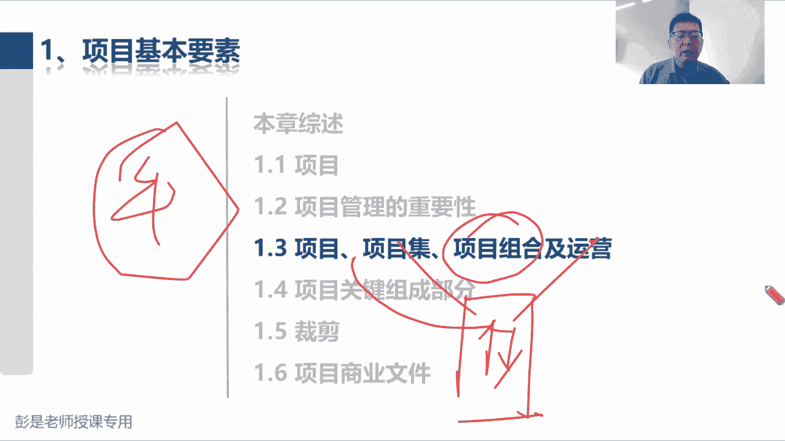

大概能掌握到这个程度OK了，所以后面的文字看一遍啊，项目管理过程罢了，一个项目可以采用三种不同的模式进行管理，作为一个独立的项目，那就是说明它不包括在项目组合或者是项目集，这句话要能反过来理解啊。

如果一个项目，一个项目没有包含在项目机制中，说明这个项目和其他事情没有依赖关系啊，这个项目和其他事情没有依赖关系，这好理解哈，他就是一个独立的存在，咱们把它完成就可以了，把它完成就完事了。

那一个项目啊不包括在项目组合里，那就说明什么呢，说明它和我们公司的战略没有必然的因果关系，没有必然的联系啊，也是一些临时的事项把它完成就可以了，唉这种临时的事情把它完成就可以了。

他和公司的战略不一定具有相关性，但不代表着说，所有的事情都要和公司的战略相匹配哈，大事小情这么多，怎么可能所有的事都会占据相关的，然后第二行说一个项目在项目集之内，那换个角度理解。

就是说这个项目和其他的事情存在着依赖关系，一个项目在项目组合内，就说明这个项目和公司的战略具有匹配性。

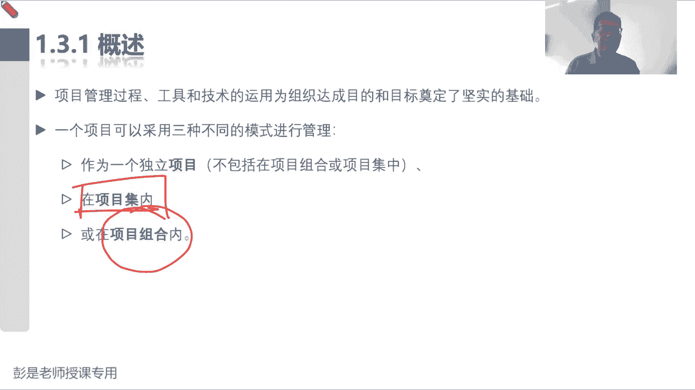

好能看懂就OK了，那再往下说，如果在项目组合或者是项目集管理某个项目，我们需要和项目组项目经理，项目经理，项目经理进行互动啊，这不用不用讲了吧对吧，咱既然在项目集里就要和项目级的管理者。

人家权力比咱大呀，人家管咱呀，人家把咱包了，那就要和人打好交道，处理好处理好我们工作上的这种协作关系好，所以后面给出了项目集的定义，项目集是一种相互一组相互关联，且被协调管理的项目子项目集和项目集活动。

以便获得分别管理所无法获得的利益，就是啊咱想办法把两件事都做都做好，避免浪费，以便赚更多的钱，对不对，买房子上小学，把这俩事协调好啊，避免浪费时间浪费钱的，家里面装修，我们来加剧这俩事协调好啊。

避免浪费时间浪费钱的，所以他的中心思想啊，就是想办法1+1大于嗯，就是想办法1+1大于二，因为大家身边里面最好理解的项目几，就是这是什么呢，修马路就是修马路对吧，想一想咱们身边啊。

你公司旁边家门口那条马路吧，通常情况下马路刚修好的时候，干干净净整整齐齐，过两天很可能就挖开了一条沟对吧，我们是供暖的，哎我们要他们弄弄管线啊，然后过两天又给补上了，过两天又挖开了，还有我们是供水的。

我们来检修检修，弄弄管道，弄弄管道，以此类推吧，那这些项目之间它存在着依赖关系啊，如果我们能够把这个事情给他协调好，尽量的减少大家的浪费，帮助大家赚更多的钱，这不是挺好的事情吗。

这就是项目及他的中心思想，好那中间藏了这么一个术语，这个单词也是听一听了解就够了，子项目集又是个什么玩意儿，下面还藏了一个子项目组合，又是个什么玩意儿，那按照这个逻辑，我是不是也可以有子项目呢。

可以有吧，所以记个大大结论啊，天下大势合久必分，分久必合呀对吧，奥运会有这么多小项目，有这么多小项目啊，然后这些小项目组合到一起，就变成了一个大项目啊，嘿所以如果一个项目机的规模太大过于庞杂，过于庞杂。

我们可以通过拆分这样的方式，变成一堆更小的子项目机，那项目组合里面的东西如果太大了，我们也可以把它进行进行拆分，变成了各种各样的小的子项目组合，那项目如果太大，我们可以把项目做拆分，变成一大堆小项目。

就这个道理啊，所以粗暴理解天下大事，合久必分，分久必合，就这个逻辑分解，永远是降低事物复杂程度的一种，非常有效的方法，公司太大了就可以分子公司对吧，部门太多了就可以分成子部门小组。

人太多了就可以分成子小组，以此类推诶，他就想体现这种层级的这种递进的关系，上下级的关系啊，知道这个意思啊，好然后再往下，有些组织可能会采用项目组合，以有效管理，在特定时间内同时进行的多个项目集或者项目。

项目组合，是指为实现战略目标而组合在一起管理的项目，子项项目及子项目组合和运营性质的工作，怎么管理它呢，排排序，合理的分配我们的人财物，所以项目组合排排序，人财物战略目标。

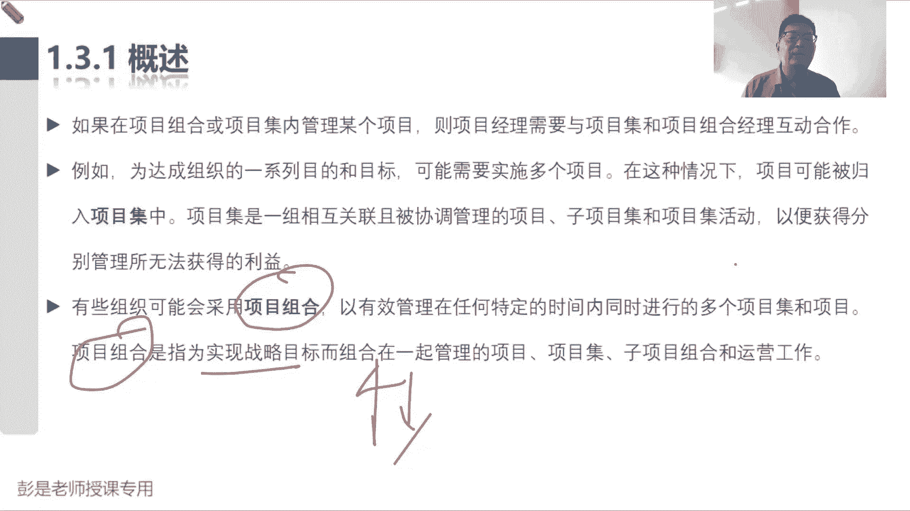

记住这几个关键字够了，所以书上给出了一张项目组合，项目集合运营，巴拉巴这个示意，这张示意图也是了解一下就可以了，未来教材里面大部分的图，大部分的图都是一个释义，这些图啊就是便于大家更好的去了解它的意思。

这些图都不需要去背，并且大家后面复习的时候，千万不要只看图，只看图是不行的啊，所有的概念定义道理，一切以文字为准，文字才最最最精准的啊，所以这张图像是体现一个什么意思呢。

这是我们根据公司的战略就定了一堆事儿啊，定了一堆事儿，然后呢有的项目啊单独存在，把它完成就可以了，项目二和项目三他俩之间存在着依赖关系，关联关系才把它处理好，协调好就有了项目及A项目及B规模太大了。

咱把它拆出一个更小的子项目及B1，然后项目组合，它它里面的东西和我们的战略挂钩了，我们来对项目组合的内容排序，合理的分配，我们的人财物，运营呢有可能包括在项目组合里运营，也有可能包括在项目基地。

所以他最后运营就画了这么一个结构，运营可能包括在项目及C里，同时呢项目及C又属于项目组合嘿，所以运营运营可能会包括在项目及项目组合，里面都可能的知道这个示意够了好。

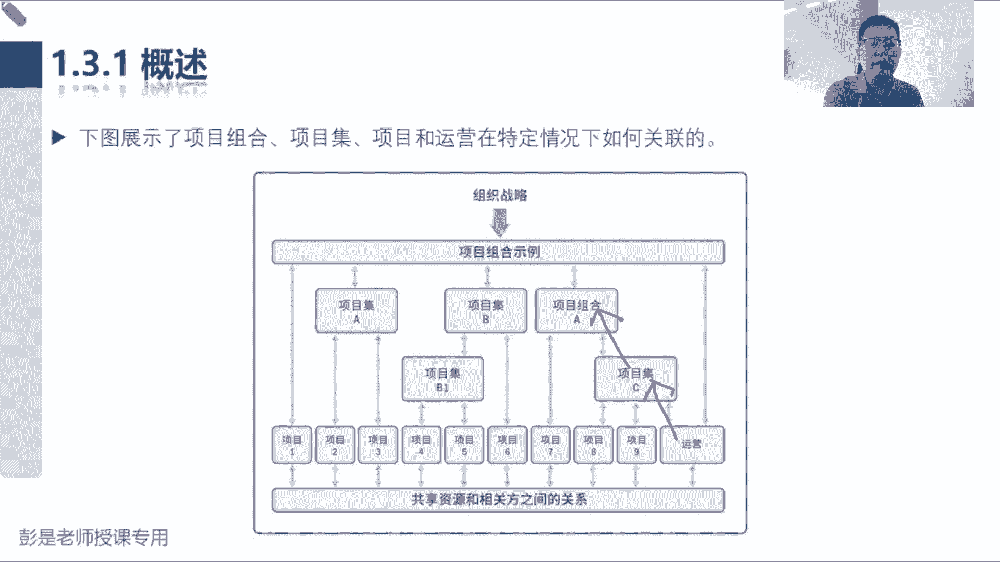

再往下说，项目集管理和项目组合管理的生命周期，巴拉巴拉巴拉不念了，但是项目组合，项目集和项目运营都涉及到相同的干系人，可能需要使用同样的资源，就可能会产生冲突，就可能会产生冲突吧，这好理解吧。

啊什么叫冲突啊，什么叫冲突，说涉及到同同样的人，涉及到同样的人，不同的干系人，对项目的期望，对项目的要求不一样，需要使用需要需要使用，同样的资源也会产生冲突，这是大家你坐地铁坐公交车抢座。

这也会产生冲突啊，哎就这个意思，所以这种情况促使企业增强内部协调，通过巴拉巴拉巴拉不念了，最后这段话一定要记住这个知识点，从组织的角度看，项目项目集和项目组合的管理，他们的重心不一样，项目集和项目管理。

重点在于以正确的方式开展项目集和项目，所以他们关注的是怎么把这个活给他干好，关注的是耗，关注的是号啊，作为一个项目的管理者，我怎么把这个项目完成任务，实现目标，得到期望的成果，作为一个项目集的管理者。

我怎么管理好这个事情之间的这种依赖关系，把它协调好，避免浪费，然后呢取得额外的收益，想办法1+1大于二，他关注的都是耗，这活怎么干，那项目组合中心是什么呢，what对企业来说什么事重要，什么事不重要。

哎对个人来说什么事重要，什么事不重要，现在我在学PMP，对我个人来说最重要的事情是学PMP，那我就把我的时间，精力成本投入到学习之中对吧，有的同学可能现在在上班对吧，现在上班如果今天请假呀。

可能听不了课呀，请假的话停停请假，请假的话请假的话可能是为失去工作呀，实习工作就活不下去了，唉最重要的事情可能是生存对吧，有的同学可能现在在相亲呢对吧，年底要结婚呐，这个可能对他来说最重要诶。

所以项目组合关注的是做什么事情，对企业来说是正确的，正确的做事和做正确的事情就是一个出发点，好再往下走了啊。

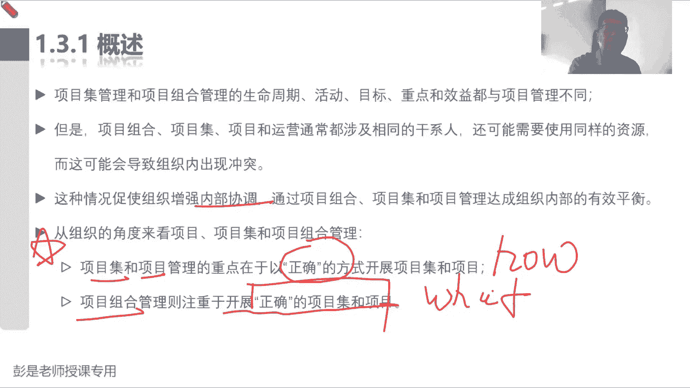

那132又在开始重复重复，刚才这些概念项目集的概念是啥呢，是指巴拉巴拉巴拉不念了啊，以便什么什么分别管理无法实现收益，它注重的是项目本身的依赖关系，来确定项目管理的最佳方法。

就是这活儿到底怎么把它管理好，然后项目集管理，注重作为组成部分的，项目和项目之间的依赖关系，好了吧，不念了。

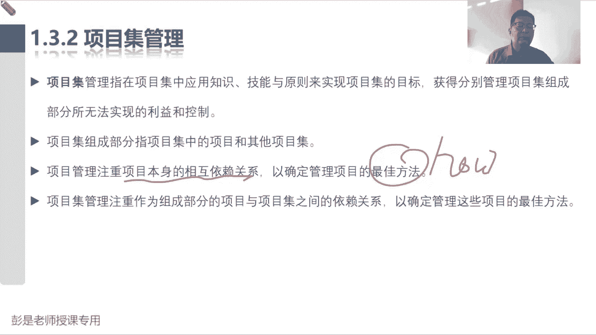

后面这一大堆文字啊，大家其实不太需要看，不太需要看啊，想看就看，不想看可以不看了，咱课上呢给大家先标这几个东西啊，这几个东西超重要，咱说呀不管其实其实不管做什么事情，项目项目集呀，项目组合呀，运营呀。

工作呀，生活呀，这四个玩意儿都，这四个玩意儿都非常非常非常非常令人讨厌，这是四大恶人，就称之为风险冲突问题和变更，因为理想情况下，我们制定好了计划，按照计划去执行，如果能够做到顺风顺水，顺风顺水对吧。

严格的按照计划去执行，那通常不会有太糟糕的结果，通常不会有太糟糕的结果，通常出现糟糕的结果就是这四个讨厌鬼对吧，风险无处不在呀，计划没有变化快呀对吧，可能随时有随时会有出现一些新的意外冲突呢。

就是非常广义的一个一个概念，大家优先级，大家抢资源，大家观点不一致，大家期望不一致，张总说我们这个项目主抓质量，你总说我们这个项目主抓成本，赵总说我们这个项目主抓进度唉，会产生各种各样的冲突。

这也好理解吧，财务说你这个项目不赚钱，我们就不批，领导说咱这项目赔点钱也能做对吧，销售通常会通常会这么想啊，销售销售我们要抓成本，然后拿回扣拿回款，然后呢你范围质量牺牲点没问题，牺牲点没问题啊。

大家的观点意见不一致，这个冲突也讨厌，那问题就是确定性的问题，进度延误了质量缺陷的工作，做的错了，工作做错了诶，这玩意儿也讨厌，需要返工，需要返工，最后就是变更，这东西也超讨厌，计划没有变化快。

总会有一些新的需求，新的想法，今天供应商提出新的要求，明天客户给了个新的需求，过两天张三请假了，过两天李四被抽调走了，过两天原材料涨价了，物价变化了，诶这些都称之为变更。

变更也会导致我们这个计划一步一个坑，一步一个坑啊，所以这四个讨厌鬼是在任何一个层级都存在的，不管是项目还是项目集还是项目组合，这是咱未来未来大家考试的时候，四个高频考点，风险怎么管，冲突怎么处理。

问题咋解决，变更怎么管理，所以后面变更就对标到整合这一章，风险呢对标到风险这一章，冲突，对标到资源这一章问题，对标到质量这一章后面会着重讲解了，先标记一下未来未来各位同学，你们复习到这段内容的时候。

一定要能够想出来变更的流程是啥呀，问题解决的流程是啥呀，冲突的策略怎么用呢，风险的管理过程是啥，好再往下拉。

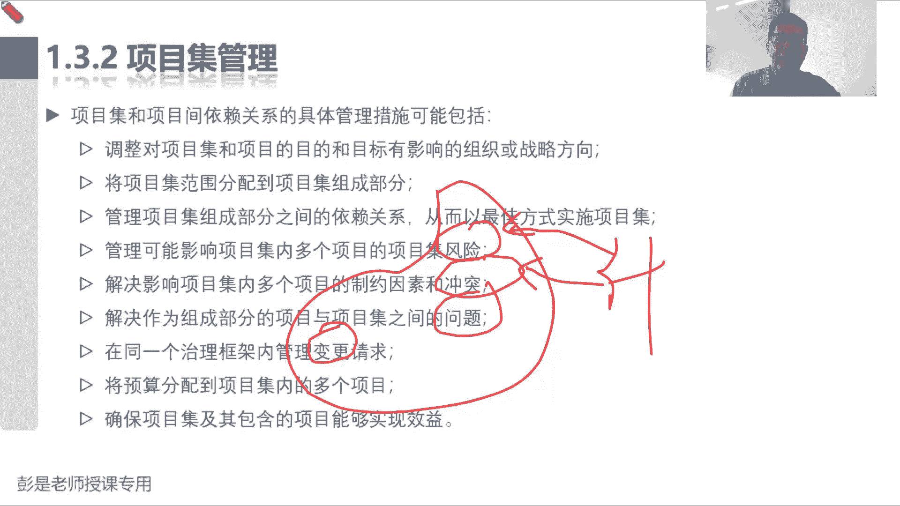

书上给了一个事例，说一个建设一个新的卫星通信系统，就是项目级的一个实例，其中所辖项目包括卫星地面站的设备，什么什么建造发射系统，整合这些视频存在着依赖关系，我们要把这些事情给他协调好。

这就是项目经济管理的实例对吧，这两天这两天老外又要发射那个火箭了，什么猎鹰九啊，那个破玩意儿吧，如果盖了这么大一个地面站，发射这么小一个卫星，这不是浪费吗，如果盖了这么小一个地面站。

弄了这么大个一个卫星，这也是浪费啊，所以要把这些事情给他协调好好。

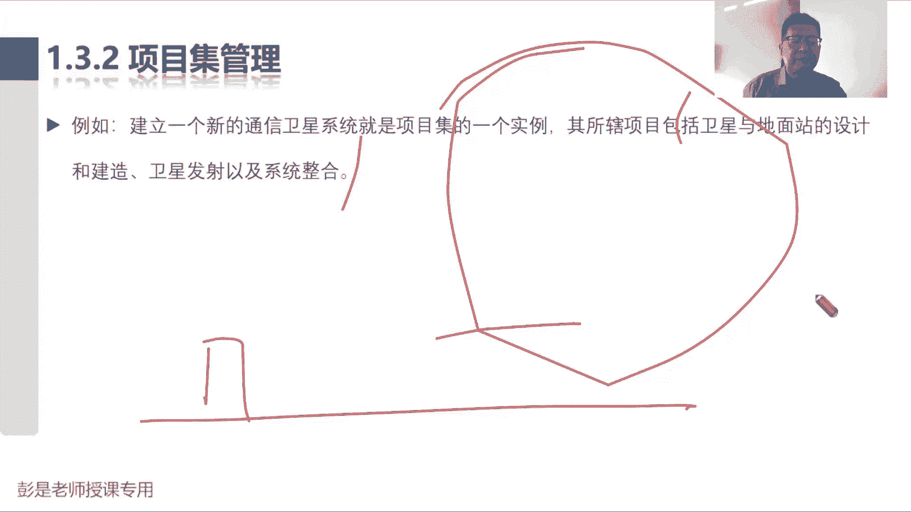

133项目组合，项目组合就这几个关键词来回倒了一堆，12排排序人财物为什么这么做呢，因为是为了战略目标，所以项目组合是指为实现战略目标，组合在一起管理的这一大堆事情，他管理这大大大堆事情啊。

他的目的就是为了帮助企业，更好地实现战略目标，所以它里面的事情不一定彼此依赖或直接相关，这句话反过来看，那项目集体的事情就一定依赖和直接相关。

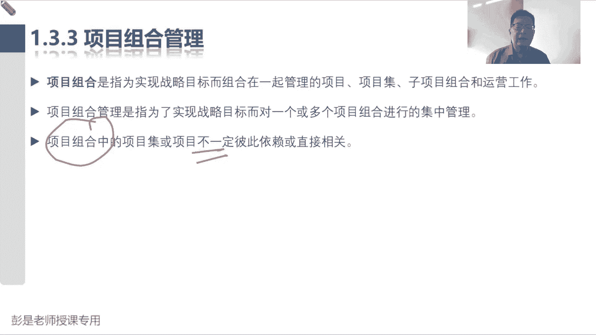

对不对好，所以项目组合管理指的是巴拉巴拉，后面这一段也可以不看了，可以不看了啊，咱们不会考项目组合到底怎么管的，咱要知道项目组合和咱项目有什么关系，就可以了，项目组合有单独的认证的。

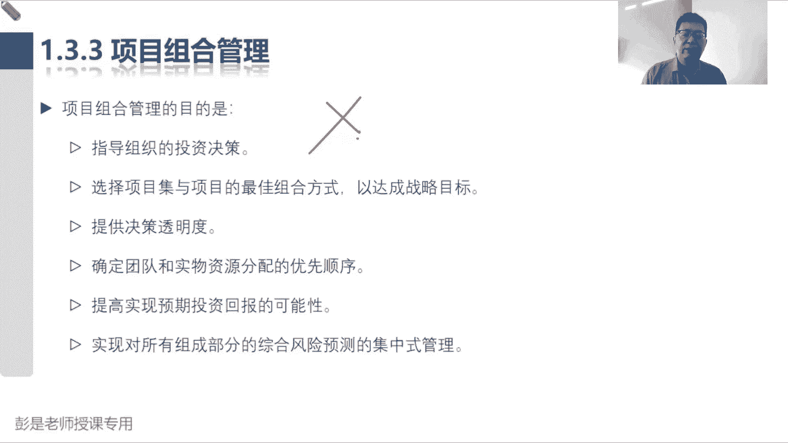

好再往下找找找找找找到这句话，重点一标OK了，要实现项目组合价值的最大化，我们就需要精心的检查项目组合的组成部分，确定组成部分的优先顺序，这么做有利于，根据我们的战略目标。

把重要的事情在人财物上给予倾斜，对吧就一堆事儿排排序，合理的分配人财物，这就是项目组合管理的方法，好书上也给了例子。

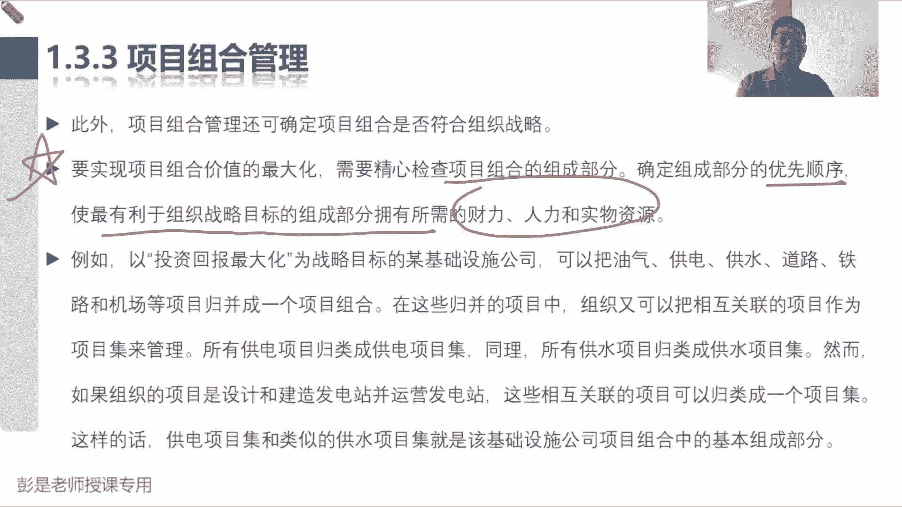

什么投资最大化，这就不念了啊，134运营运营刚才我们讲过呀，运营追求的是标准化规范化，通常情况下只能这么说啊，先听大道理，通常情况下我们关注的是运营工作，持续的重复的，定期的开展了事情。

这些事情呢最好最好最好标准化规范化，便于我们产出相同品质的产品服务或成果，比如说制造业流水线对吧，比如说麦当劳，肯德基，咱们的牛肉面馆，还我们希望我们做出的菜品都是一样的。

至少通常情况下会这么考虑这个事情啊，但如果公司发展的发展的阶段不一样，我们追求的管理工作重心也不一样，如果你公司野蛮成长对吧，我今天是昨天10万个粉丝，今天100万个粉丝，后天1000万个粉丝唉。

如果你企业达到目前是这样一个爆发式，爆发式增长这样一个状态，那什么标准规范制度，规章原则流程都让他去死，这些事情都不重要，最重要的事情就是捞钱，哪管那么多，干啥怎么赚钱，怎么来呀，这也能听懂吧。

但是如果你企业达到了瓶颈期，达到了成熟期诶，那我们就开始考虑了降低成本，增加效率，提高质量，提高收益诶，就更注重标准化规范化，所以在企业的不同发展阶段，我们要考虑的管理要素是不同的。

但不代表着说所有的运营工作都一定要标准化，规范化，对不对，看情况好，知道这个中心思想啊，所以运营管理超出了本指南所描述的，规范的项目管理范围，跟咱没关系，咱要了解什么是运营就够了。

运营更关注的是产品的持续生产和，服务的持续运作对吧，就是我们这个餐厅，我们这个餐厅啊，牛肉面馆啊，咱这家餐厅啊每天要买原材料啊，不然没有原材料，人家客户下了订单没法做菜呀，那每天我们要保证厨师啊。

服务员啊都到岗了对吧，有原材料没有人也不行啊，然后桌椅板凳，什么锅碗瓢盆这些餐具配套的东西都在呀，确保我们这些设备设施都可以正常使用啊，这个这个炒菜的锅啊，什么燃气啊，都要都要能够正常工作吧。

这些东西万事俱备，只欠东风了，没有人来也白扯呀，还要想办法想办法想办法，通过不断的通过我们的营销营销，想办法吸引更多的人来吃饭呢，来下订单呢对吧，什么美团饿了么，然后大楼发传单呢，以此类推。

诶这么做的目的是干嘛呢，这么做的目的是干嘛呢，不浪费，不要让我们的买的原材料卖不出去，不要让我们的厨师服务员没活干，不要让我们的设备闲置，对不对，然后呢，就是最好最好最理想的模式就是人家要多少菜。

我们就做多少菜，这样不浪费，以便于实现价值的最大化，所以通常情况下我们追求的是标准化，规范化的运作，想办法想办法保证它的持续高效，哎说到这个大大大大道理就可以了啊，所以他重点管理把这些输入转变为输出。

就是我们买的什么原材料，服务员，厨师对吧，锅碗瓢盆煤气灶，然后把那个菜做出来好。

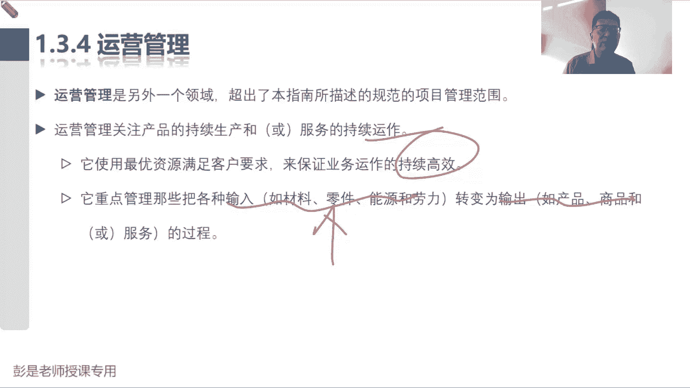

那再往下业务和业务或者是组织运营的改变，也许是某个项目关注的焦点，尤其是他项目交付的新产品和新服务，将导致业务运营的有实质性性，有实质性改变的时候，它们就存在着交叉点了，变成大白话是什么意思呢。

变成大白话再带入我们这个餐厅这个场景，想一想啊，根据上午讲到的知识点，我们现在开了一家牛肉面馆，然后呢，在餐厅运营的过程中，发现了这玩意儿不赚钱的对吧，可能利润低，利润低啊，可能人家不爱吃啊。

然后我们商业环境出现了变化，因素对我们企业产生的影响，我们不得不启动项目去进行应对，那咱其中一个什么项目呢，麻辣烫我们转型，我们不做牛肉面了，我们改做麻辣烫，改麻辣烫餐厅的布局对吧，厨房厨师的什么工艺。

做菜的手艺，包括我们的菜单，包括我们在饿了么上面，这些这些卖的菜品都要改，都要改啊，这就是一个标准的项目，这个项目结束的时候，我们餐厅就具备了制作，制作生产麻辣烫的这样一个能力，那好第一个小问题。

我们这个项目启动的时候，需不需要运营的同事，需不需要运营的同事参与其中，问问我们的厨师，这个厨房怎么改比较合适，问问我们的服务员对吧，麻辣烫，我们这个前面放个冰柜，把那些什么串都放进去啊对吧。

菜单怎么改呀，这饿了么什么美团平台上怎么怎么省，怎么上架商品啊，这些人参与到项目之中好不好呢，我们的厨师，我们的收银，我们的服务员参与到这个项目之中好不好，这么问可能还不好啊，不好就不对吧。

好我们希望这些这些人给我们提供提供，提供什么呢，他们的知识，厨师告诉我们这个厨房怎么改造，可能最省钱，效率最高，改的最快呀，对不对，不能闭门造车吧，哎就这个道理啊，所以我们希望这些运营的同事参与其中来。

贡献出他的专业知识对吧，服务员在餐厅每天端端茶倒水上菜呀，他更知道这个餐厅布局怎么改，更科学更合理更合理吧，怎么刷碗刷得快，以此类推，把这些人最好最好最好参与其中，这就是项目和运营的交叉点。

我们启动项目，从运营这边拿资源，就这些同事就叫资源了对吧，然后资源更广义啊，还指的是我们这些什么锅碗瓢盆，看看什么东西能用能用啊，把它尽量的尽量的利用上啊，不要浪费啊，对最好不要全都卖了，再买新的。

最好是最好是换换地方，仍然可以发光发热，嘿所以我们项目启动的时候，从资源这边拿资源，从运营这边拿资源拿知识，那项目结束以后，项目结束以后，这些人是不是回到各自的工作岗位了，厨师继续做麻辣烫。

服务员给客户点菜，另外给客户结账，收银员给客户结账吧，诶大家回到各自的工作岗位，所以资源回去了，那大家通过这个项目是不是学到了新的知识呢，服务员知道麻辣烫是什么东西了，知道我们的定价了对吧。

收银员知道怎么结账了，厨师知道怎么做麻辣烫了，哎大家在工作中，在项目中又掌握了新的知识，最后我们项目结束的时候，什么玩意儿交给他们了，项目的主要可交付成果吧，我们创造的可交付成果诶。

所以就带这样一个场景，去记项目和运营的交叉点，项目启动的时候，我们从运营这边拿资源打知识，项目结束的时候，资源知识还回去，然后呢可交付成果交给你，所以它的好处很多吧，它内部沟通也就更便捷，非常非常棒啊。

cc注解，对不对，这些掌握了新知识的同事再交给其他同事，是不是沟通顺畅了吗，效率高，效果好啊，所以我们希望更多的人参与到项目之中，为我们项目贡献出他的知识诀窍，经验技巧。

然后这些人在项目过程中又学到了新的知识，便于这些这些新的知识，转化成我们希望的成果好。

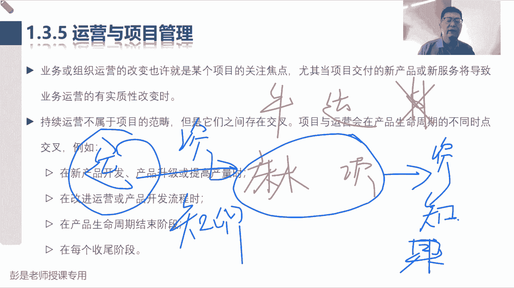

这就是项目和运营的交叉点，交叉点就是，资源知识和成果，后面好像有这个文字啊，然后中间这段什么例如啊都可以不看了。

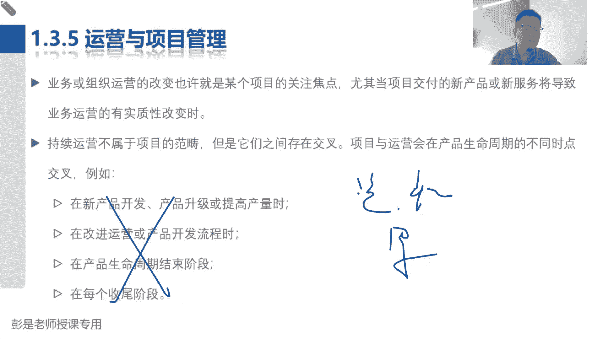

有说每个交叉点可交付成果，知识在项目和运营之间转移，除此之外呢，在这个过程中，我们将转移到项目资源，或者是支持到运营之中，或者是转移运营资源到项目之中哎，借两个还三个好，借好还再借不难，这两个什么呢。

资源知识还三个什么呢，资源知识和可交付成果，好事，这就是项目和运营的交叉点，然后他俩的差异点和共同点呢，听一听就可以了啊，不太需要去记住了，他俩的共同点是什么呢，共同点啊，不管什么事。

它的底层逻辑都是这个东西，大家有没有听过那个戴明环，不管什么工作，不管什么事情，不管是什么事情啊，都需要规划执行，控制不一定要改进，不一定要改进吧，所以项目和运营都需要有计划，都需要按照计划去干活。

都需要监督检查工作的进展，工作的情况不一定要改进的，但项目来说，未来我们要掌握的项目是一定要改进的啊，它的底层逻辑都是规划执行控制管理学啊，然后项目和运营的差一点呢，就是这个独特性，临时性渐进明细特性。

运营呢就是持续的标准化的，重复的产出。

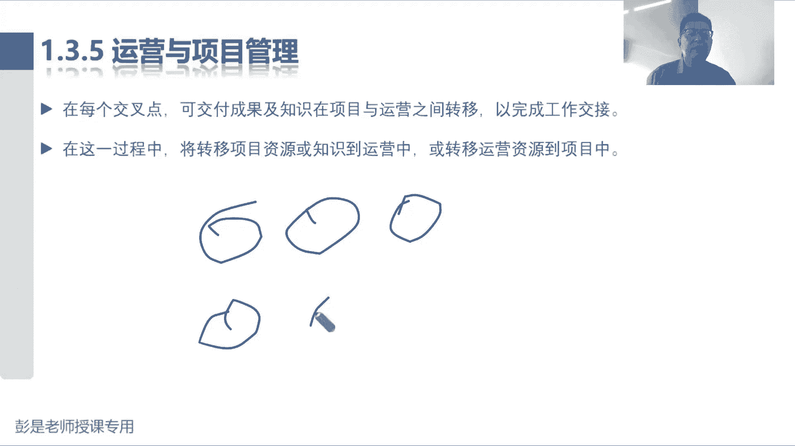

相同品质的产品服务或成果，停一停就可以了，好136，讲完这一小段，大家就可以缓一缓了，坚持坚持，你们最棒了，136这段文字，136这段文字哎不谦同学，你说完了，我比你说的早，136这段文字啊。

咱不念了啊，浪费时间，项目项目集，项目组合，这三段大家标一标，后面复习的时候再看一遍，还是那几个关键词，没有新的知识点啊，建议大家巩固。

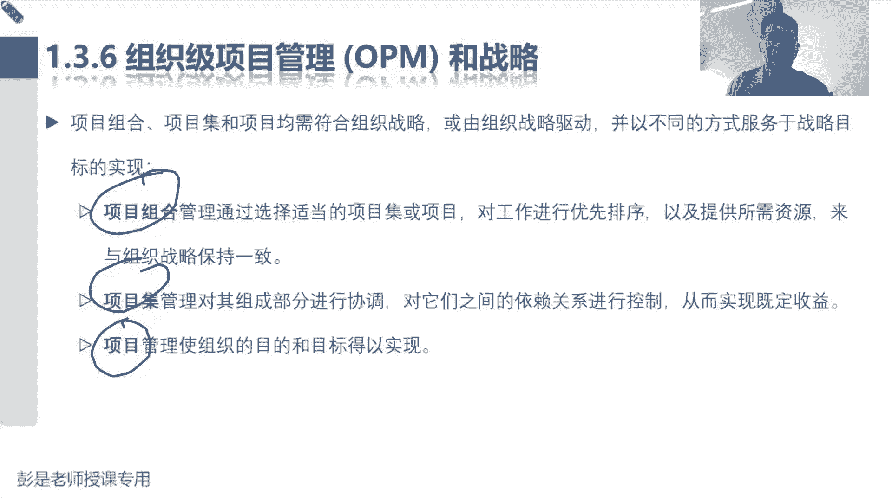

然后作为巴拉巴拉巴拉巴拉巴拉巴，这一段提到了一个东西叫OPM。

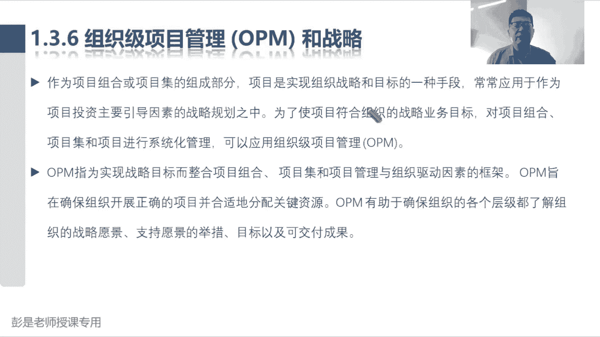

OPM是什么呢，主要看看这张图，这张图第一大家千万千万千万不要把它背下来，背下来一点用都没有，一点用没有啊，这张图啊是希望大家能够理解个大道理，理解个大道理，战略一旦敲定了，我们就知道要做什么事了。

然后有的事情和战略相关，有的事情可能和战略没有关系啊，所以呢我们需要把什么项目啊，项目集啊，运营啊，和该和战略相匹配的东西放到项目组合里，所以项目组合他的工作重心。

工作重心就是告诉我们做什么事情是正确的，把钱花在哪是正确的，所以呢它叫价值决策，对不对，投资组合呀，把钱花在哪儿好，钢用在刀背上，刀还是用在刀刃上，用在哪最有价值诶。

那项目组合一定会根据我们战略的不断调整，可能对它里面组合的内容进行变化吧，我们公司原来做牛肉面，那和牛肉面相关的东西优先级最高，现在公司转型转型做麻辣烫，那牛肉面相关的东西，咱就把它从组合里面踢出去。

把和麻辣烫相关的东西放到组合里，就这个逻辑啊，所以它可能会根据不断不断的，根据我们战略的变化，对组合的内容进行审查和调整，另外呢项目组合管理到底到位不到位呢，他还要根据我们项目和项目及反馈出来的结果。

也就是绩效，也就是绩效，看看项目集花了多少钱呢，赚了多少钱呢，看看项目花了多少钱，赚了多少钱呢，看看我们是不是好钢用在刀刃上了呢，唉所以他通过业务影响分析去分析，我们这个管理的到位不到位。

就是这个圈能看懂，能看懂就可以了啊，不需要背，千万不要背啊，然后我们又知道项目和项目集，他的工作重心关注的就是how，怎么把项目处理好，怎么把项，怎么把项目集协调好，所以呢他们更关注的就是。

怎么把这个需要的成果给他顺利的交付出来，哎所以他就是写出了成果交付，那成果交付，刚才我们要知道项目和运营之间存在着交叉点，我们常说的成果呀要移交运营啊，移交移交给运营之后，他们想办法去实现这个价值。

让这个价值最大化，那运营的过程中有可能会发现对吧，麻辣烫到底赚钱不赚钱的，开了一个月了，没有人下单了，没有人吃啊，诶我们在运营的过程中，又去发现我们的商业环境有没有发生变化呀。

我们公司干点活到底赚钱不赚钱呢，可能会导致我们调整战略计划对吧，开了卖了一年麻辣烫，发现一分钱没赚，赔了好几10万呢，转型吧，咱们做烧烤吧，以此类推吧，所以可能会在运营的过程中发现，我们的产品服务成果。

可能没有办法赚到预期的效益，实现预期的效益，那可能考虑要转型啊，改变我们的策略，改变我们的战略，这张这张图能够看到这个程度，就非常非常非常棒了，能够把这这里面这几个单词想明白就可以了啊。

那再说回到底什么是OPM，OPM的工作重心啊，听一句听一遍就完事了啊，这东西pm考试也不考，OPPM的工作重心就是战略，有战略的管理方法，项目组合有项目组合的管理方法，项目及有项目集的方法。

项目有项目的方法，运营有运营的方法，我，们是个集体，我们是个集体，大家不能各扫门前雪，这好理解吧，说你项目和运营，如果是如果是脱节的项目，不管运营运营也不搭理项目，诶，这么做不好啊。

可能导致我们这个项目最后也失败了，也可能导致人家运营也不赚钱的，所以呢我们要搭台唱戏，定架构，确保大家能够有序的有序地结合到一起，一盘棋一盘棋，便于我们更好地帮助企业实现宏图打野。

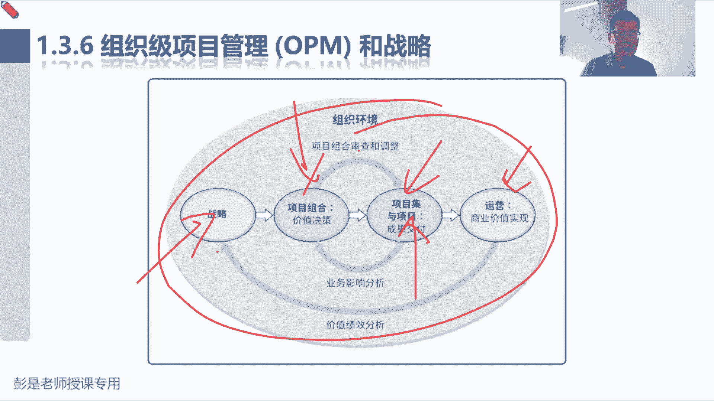

他就是这么一套方法，听一遍就完事儿了，所以就有了这么一个结论，为了使项目符合组织战略和业务目标，我们对项目组合呀，项目挤压项目化进行系统化的管理，就应用OPM，什么叫系统化的管理呢，就是什么叫系统啊。

就是项目组合，项目集项目都是零件，这些零件组合到一起，组装到一起，你不得考虑清楚吗，让他们能够相互协调，相互协作，知道这个意思够了。

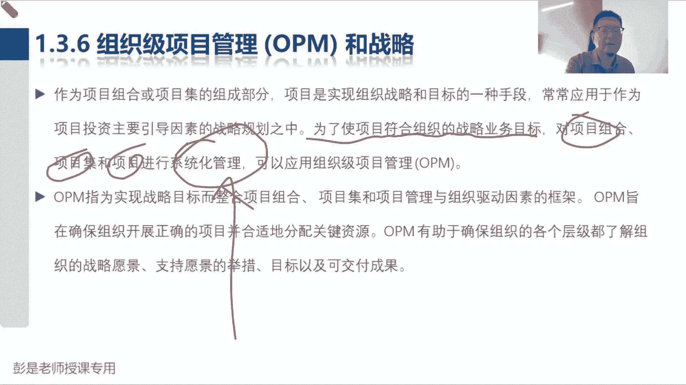

所以他是为企业企业战略服务的好，咱看看时间啊，14。29休息，各位亲爱的同学，第一小段课程过去了，恭喜大家还没睡着，休息一下，休息7分钟时间，14。14。36准时回来，好各位同学，还有15秒钟时间。

即将开始第二小段课程啦，几点下课呢，这马上会说到啊，真是个谜呀，说不清啊，好准备了，543210，几点下课啊，咱先讨论一下这个小话题，挺好玩的，说那个发个通知上写的几点下课呀，我也不知道啊。

应该是五点吧，然后有同学说，我之前经常看到六点06：30下课呀，那到底几点下课呢，到底几点下课啊，咱活学活用，我们知道了知道了，成功的标准叫多，快好，省都是高手啊，范围进度成本质量范围进度成本质量吧。

各位同学换个角度去考虑这四个东西啊，你们希不希望老师少讲点，把范围减一减，还是希望老师多讲一点，这样的讲细一点，多讲几个例子，便于大家更好的巩固这个知识点哎，范围是不是越多越好，范围多点吧。

所以这个东西咱不能动，他不能动它啊，那进度进度跳过，质量能不能降低呢，质量能不能降低呢，说还凑合讲一讲，念念教材，咱就下课了，不能牺牲质量吧，质量不能动，质量越高越好啊，不能牺牲它。

唉那向各位同学要钱合适吗，说咱五天的课，五天的课啊，我们讲不完，到时候大家再交点钱，然后再弄个课外补习班，好多好多好多学校原来这么玩吧，政客不打搅，然后呢，老师出去开补习班，收大家的钱。

这么做好像也不合适，那我们唯一能牺牲的就是进度，唯一能牺牲的就是进度，那就拖堂，对不对，五点下课，六点下课，有的时候可能06：30下课，如果实在讲不完呢，还给大家加课，还给大家讲课啊，所以范围不能动。

该讲的都要讲清楚，然后质量不能牺牲，该讲明白的都要给他讲明白，成本成本，我们不计成本，不计代价，不能向大家收钱了，我们唯一能投入的就是时间给大家多讲一点，所以下课时间下课时间不一定不一定啊。

今天预计下课时间，大概17。30到18点之间，因为第一天上课需要给大家打个预防针，需要有一个适应的过程，所以不易拖堂太久，不易拖得太晚哈，未来下课呢就可能慢慢的慢慢的往后顺延。

下次上课呢可能是六点到06：30下课，在下次上课呢可能就是06：30下课了，甚至可能有的时候会拖拖拖，拖到6。40左右啊，总之原则上是肯定拖不过19点的，原则上啊，因为太晚了，大家就我自己都快饿疯了。

不会超过七点的，从来不超过七点啊，基本上06：30左右，后面的课程基本上06：30左右，如果实在讲不完还会加课的，反正咱周末有的是时间啊，如果大家周末没时间，就晚上立找一个工作日的晚上临时讲。

那么一两个小时给大家讲课，总之原则搞定啊。

好那做一做一做这小段小段的课堂练习，随堂练习，看看这几道题，能讲完就不用加课了，对不对，这道题就掌握了这个知识点就完事了，需求评估，商业论证，教育计划的制定，这事跟咱没关系啊，作为一个项目经理。

我们只负责中间这一段，在确定的开始结束日期，开始结束日期之前完成完成工作，完完成任务，完成任务，产出成果，实现目标，项目结束以后运营，这也不在我们项目范畴之内，和咱没关系。

但是我们之间可能涉及到成果的移交，可能涉及到成果的移交，所以这种维护和持续运营，不是项目收尾的一项重要活动，他不在项目范围之内啊，他也不是项目生命周期中的一个阶段，它也不是一个独立的项目。

所以答案是C运营不是项目的一部分，虽然我们可能存在着某种关系，张三是张三，李四是李四，仍然仍然是两个独立的概念。

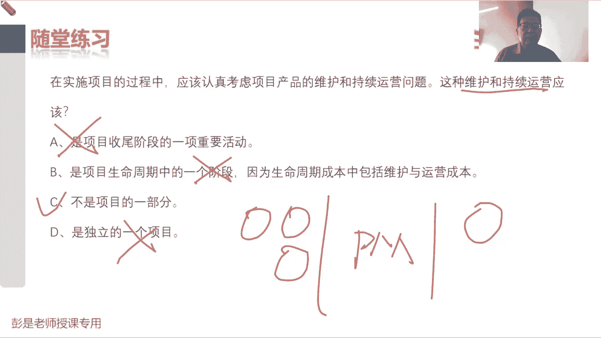

好知道这个意思啊，那这道题当两个项目有内在的依赖关系时，为了获得更好的利益，用什么样的管理方法呢，项目集哈，恭喜大家答对了对吧，一堆事存在着依赖关系，关联关系，为了获得更好的利益，想办法1+1大于二。

想办法1+1大于二，这种管理方法就叫项目集，就是D了以下哪一项属于运营的一部分，这个简单吧，什么调整现有的运营系统，产品更新换代，服务流程再造，这样的事情对我们企业来说。

通常我们认为它叫把它完成的事情就可以了，对不对，通常把这活干完就可以了，他不需要持续的定期的重复的去开展，但是会计业务就是大家你企业里面付款，收款记账，给大家发工资，发福利。

这是需要持续的定期的重复的去开展吧，唉所以它属于企业的运营的一部分工作啊，答案就是A，所以最终项目和运营到底是啥，其实根本就不重要，它取决于什么呢，取决于什么呢，就这两个字，取决于这两个因素。

找常态化还是非常态化，所以就像大家大家最好理解的，新冠刚出来的时候，过一段时间就有了核酸检测方法，在某一段时间内，这种核酸检测方法它是非常态的对吧，说本每个地方出现了本土病例。

那咱就组织大家做一做核酸检测，唉这种情况下，通常用项目的形式把这活几天干完就可以了，但是到了疫情后，疫情时代对吧，什么三天两检，三天两检诶，他从非常态化的事情变成了常态化的事情，对不对，三天一检。

三天一检，三天一检这种事情，这种事情啊就变成了运营性质的工作了吧，哎所以它取决于我们怎么看待这个东西，如果你把它当做一个常态化的东西，需要持续的定期的重复的去开展，他就认为是运营性质的事情了。

如果是临时的事情对吧，把它完成就可以了，它就是一个非常态的，通常用项目的形式去完成，所以像调整啊，更新啊，什么再造啊这些事情，这些事情，他不一定需要持续的定期的重复的去开展，单向会计业务。

一企业的职能部门，职能部门的这种管理工作，就需要持续的重复的定期的去开展。

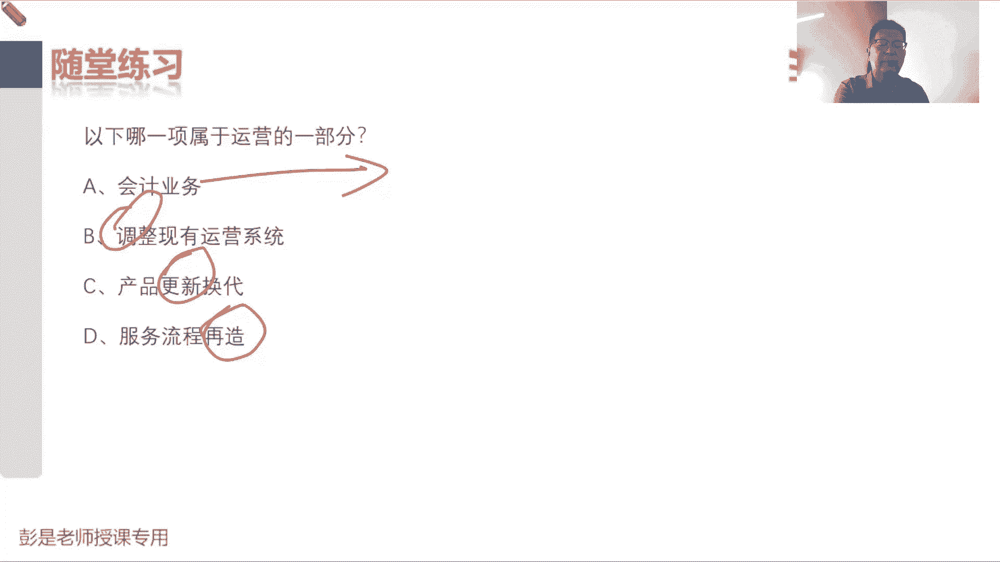

通常就认为它属于运营，好看看这道题，恭喜大家答对了，题目上找一个不正确的选项，项目和运营都受制于有限的资源，这是没错的吧，我们那个牛肉面馆就两个厨师啊，资源约束啊，牛肉面馆就一个灶台啊，资源约束啊。

牛肉面馆就十张，十张桌子只能坐20个人的资源约束，无论是项目和运营都会受到资源的限制，资源的约束，B运营是持续不断的重复进行的，项目是临时的独特的，这话没毛病，C选项项目和运营都需要规划执行和控制。

只要是工作需要管理，它就需要PDC那D就不正确了。

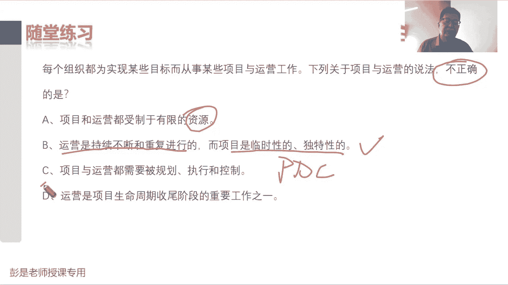

运营通常不是项目生命周期，收尾的重要工作之一，好再往下，项目集是什么东西呢，这是病了吧，项目集是一组相互关联且被协调管理的项目，就是为了恭喜大家答对了，其他选项不确定了，好在组织战略发生变化以后。

以下哪一项也会发生变化呢，公司战略发生变化，以前我们的工作重心是牛肉面，把牛肉面相关的事情放到项目组合里对吧，现在转型啊，我们改做麻辣烫了，那就把牛肉面的事情踢出去，把麻辣烫的事情放进来诶。

所以公司战略发生变化以后，我们要对项目组合里面的内容进行调整，对不对，价值角色非常棒啊，因为我们好钢用在刀刃上，钱花的地方就不一样了。

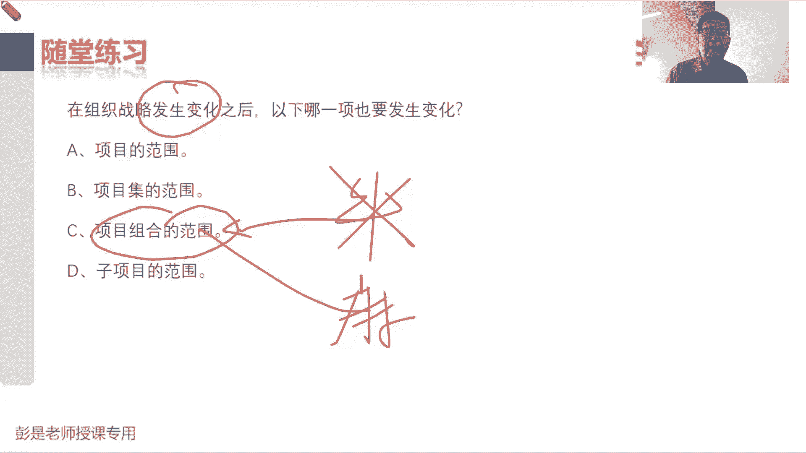

好公司会议需确定计划后5年的一系列项目，与会者结合公司战略目标展开了激烈的讨论，会议最后形成了项目的优先级清单，他们在做的事情是什么呢，选A不对啊，A更关注的是什么呢，系统化管理啊，项目组合。

项目集项目大家要联动了，大调联动啊，公司会议确定计划后5年的一堆事儿，然后呢根据战略目标展开了激烈的讨论，最后呢排排序得到了优先级的清单，告诉我们什么事情重要，什么事情不重要。

所以就是C项目组合管理一堆事。

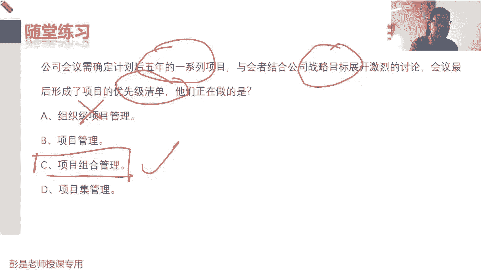

排排序，合理的安排人财物好，组织的商业价值成功开始于什么呢，目标愿景使命价值观定好了之后啊，先做战略规划对吧，战略规划一旦敲定了，我们总体的发展计划一旦定了，就知道未来或者现在我们需要做的事情。

都有哪些项目，都有哪些运营工作，然后再去思考，再去思考什么东西和公司的战略相匹配，放进去放进去，然后排排序，合理的安排人财物啊，就有了项目组合管理，再去思考什么事情之间存在着依赖关系，放进去协调协调。

管理好这种依赖关系，就有了项目积极管理，所以呢答案是C，先做综合战略规划和战略管理，以下哪一个不是运营工作的例子，54321买定离手啊，恭喜大家答对了，抓关键字啊，这个字这个字这个字一写出来。

那我们就可以分析了，根据现在这些已知的线索，就可以判断BCD它是重复开展的工作对吧，每周每周，每年，他需要持续的重复的定期的去开展这些事情，通常把它当做运营，那题目问哪一个不是运营的呢，那就A了。

未支付账户弄一个什么订单系统对，就这样去区分它，所以想想一想上网课那个案例要啊，我每天都要找一个对象，这就是渣男的渣男，就把他当做运营新质的工作了，然后关于项目组合以下哪一项说法不正确，选A的同学。

选A的同学啊，答题小技巧教给你，四个选项都看完，一定是四个选项都看完的，因为如果你看到一个拿不准的选项，往后看，可能后面的选项啊更错更错呀，A好奇怪啊，A1点都不奇怪，不奇怪好，哪一个说法不正确呢。

A项目组合经理，通过结合所有项目集和项目的数据，来评测项目组合是否成功，这是对的，B项目组合可以包含项目和项目集，这是对的，C项目组合根据企业的目标来进行组织，这是对的，D项目组合总是一组项目集。

这就不对了，里面的项目之间如果存在着依赖关系，才可能有项目极大对吧，如果没有依赖关系，它可能就包括一堆项目，甚至可能会包括运营，所以D说的太绝对了。

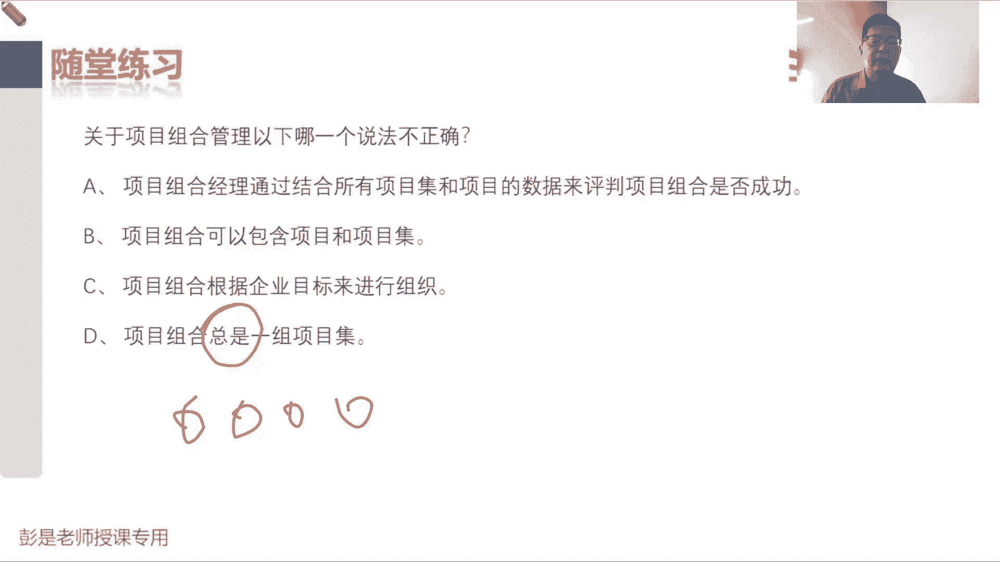

好这道题呢，一家能源公司做一系列的投资预案，想要寻找替代能源，让公司在10年后保持竞争力，然后这些预案要一起跟踪和管理，因为这个目标对公司成功至关重要，这是啥，有选A的，有选B的，有选B的。

54321买定离手这道题啊，判断不出来是否存在着依赖关系，判断不出来这件事情是否存在，存在着依赖关系啊，判断不出来的，但确定的是什么呢，一堆12让公司什么10年后还保持竞争力，对公司成功至关重要。

关关关关乎到公司的生死存亡啊，哎这就叫项目组合管理，帮助我们更好地实现战略目标，宏图大业这项目组合管理这种方法好一堆事儿。

排排序嗯，这就是1。3，大概这么几个概念，项目项目及项目组合和运营，让我们更好地认知到。

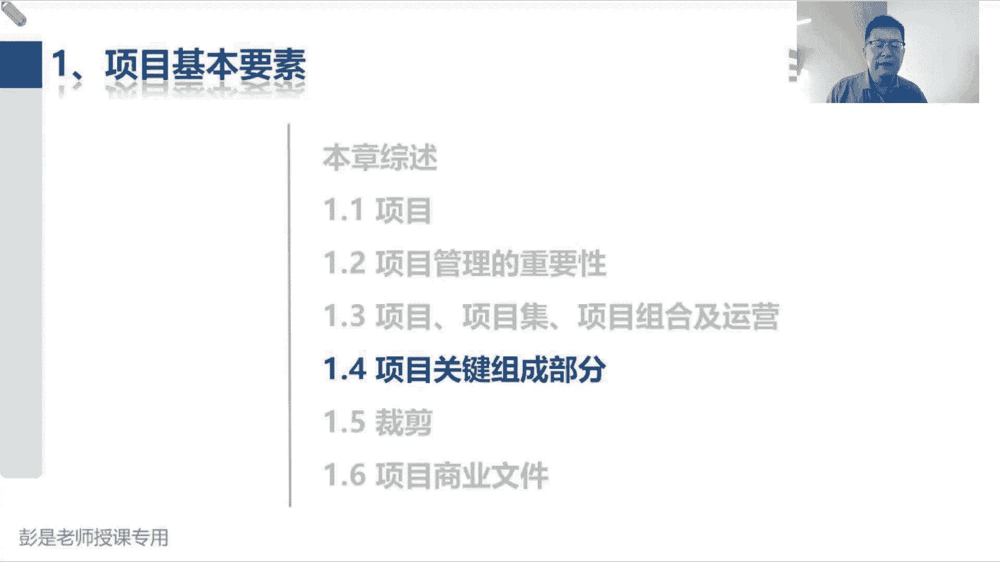