# 【新版PMP培训课程】2024PMP付费课程视频完整版免费观看，零基础通关项目管理考试！ - P9：1.4 项目关键组成部分 - 慧翔天地 - BV1Hu4y1a7hA

然后1。4。

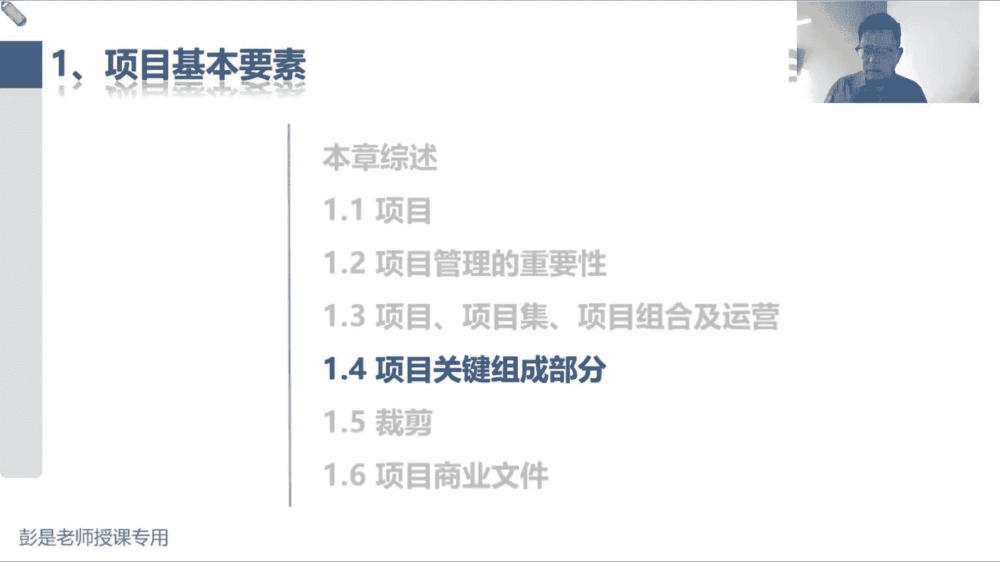

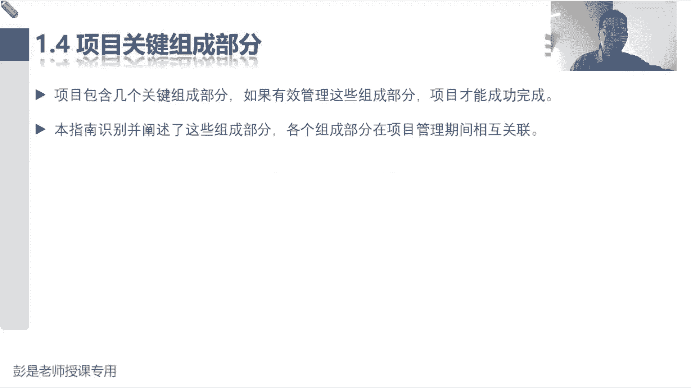

1。4啊，上来就带出来一个叫项目生命周期，这么一个概念，项目生命周期是指项目从启动到完成，所经历的一系列阶段，他为项目管理提供了一个基本框架，无论项目的具体工作是什么，这个基本框架都适用。

然后项目阶段是一组具有逻辑关系的，项目活动的集合，通常以一个或多个可交付成果的完成作为结束，阶段，可能是顺序迭代交叠的关系，阶段的名称数量和持续时间，取决于大家的管理和控制。

需要项目本身的特征及其所在的应用领域，这一大段话变最后变成人话是什么意思呢。

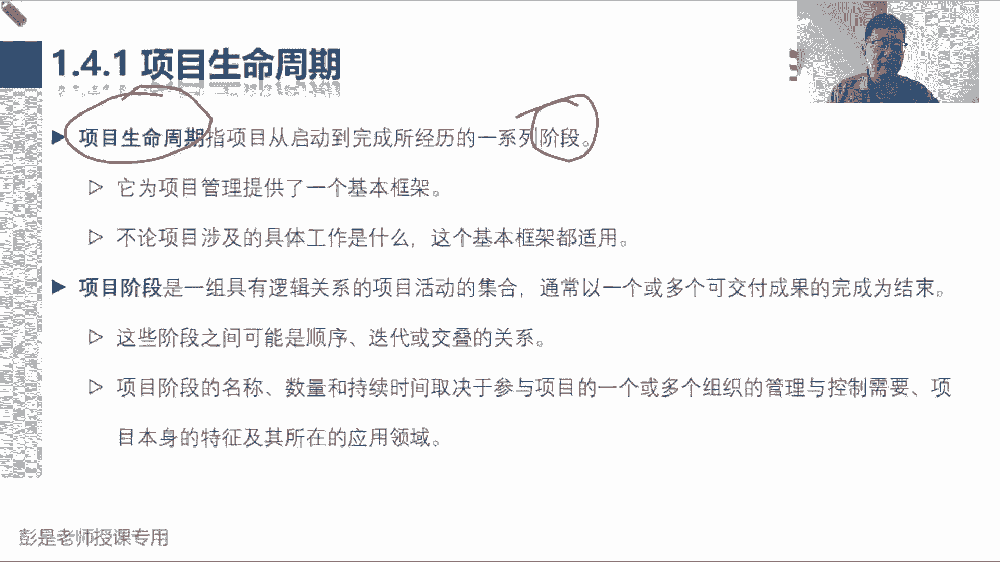

看PPT，咱知道了，项目具有临时性，需要有一个明确的开始时间，需要有一个明确的终止时间，结束时间，那开始到结束，开始到结束啊，就像咱要开那个牛肉面馆啊，我们现在有一个项目叫面馆房间的装修装修啊。

装修这个事儿，装修这个事，想这个大道理是工人过来就哐哐一顿砸嘛，就开干了，还是说我们需要先干点啥，设计，好歹得画画图纸吧对吧，给你出个效果图，您看看这个桌椅板凳这个配色，这个地砖。

这个墙面好歹得做做设计吧，诶让您看看这个这个设计效果，您满意不满意，这个布局合理不合理，科学不科学，对不对，不要把牛肉面馆装修成麦当劳，肯德基，让人家容易侵权，那告你啊，还要做设计，设计完成之后呢。

是不是就可以开始施工了，设计完成之后就可以开始施工了吧，诶人家就该砸墙砸墙，该砸该弄地砖，弄地砖，该铺该铺地板，铺地板，该刷墙刷墙，然后呢唉施工施工就结束了，施工完成之后，你不得打扫一下。

打扫一下卫生吗，开荒对吧，打扫一下卫生，把它打扫干净，然后呢就可以交付了，一旦交付给我们装修好的，装修好的这个餐厅，我们就可以桌椅板凳家具噼里啪啦进场，唉咱就可以开门了哈，这就是这个工作。

这个工作生命周期阶段的划分对吧，我们不考虑其他阶段，他至少肯定有两个阶段，设计和施工，设计和施工啊，这是我们这个餐厅这个案例，搞软件的同学，你想一想软件叫施工合适吗，你搞软件怎么搞的，我们也施工。

我们也装修，这不合适了哈，不合适了吧，那软件你搞软件开发，做总体的规划，然后搞搞需求，做技术设计，概要设计，详细设计也有规划和设计，好做技术设计，详细设计之后找人敲代码，敲完代码做测试，测试通过呀。

发布发布，然后就进入到了运维，对不对，他的阶段是这么划分的，这么划分的啊，其中有什么编码，有测试，嗯再换场景再换场景哈，说药品研发，我要研发一款新药对吧，什么新冠特效药啊，诶药品研发用得上施工吗。

用得上编码吗，用得上什么什么概要设计，详细设计有什么部署，运维发布没有吧对吧，你要在实验室做做实验，拿小老鼠小猪试试试试啊，看看有没有害，看看能不能杀杀掉病菌呐，然后做完实验室实验的。

然后要要临床实验吧，临床还有什么交叉盲测，一期二期三期啊，证明这东西真的有效啊，才能够去申请上市啊，它不涉及到施工，不涉及到敲代码诶，所以最后最后形成这样一个结论叫什么呢，不同项目阶段划分不一样。

不同的项目阶段划分是不一样的，它取决于这个项目所在的行业，行业所在的领域，所在的企业，取决于这个项目的规模和复杂程度对吧，开发软件，盖房子，装修弄药品，包括你办婚礼，办婚礼有施工吗，有可能有啊。

现场有施工啊，哎但不一样，对不对，办婚礼没有什么敲代码，办婚礼也没有什么临床，一期二期三期啊，所以不同项目生命周期阶段划分不一样，那把项目到底分成多少个阶段呢，就带出来刚才这一大段话。

看情况看情况，根据我们管理和控制的需要来分析，把它到底分成多少个阶段比较合适，它取决于这个项目的规模和复杂程度，所以最后一总结看情况，大家虽然很讨厌这三个字，但我可能从现在开始会不断的说这三个字。

因为每个项目的实际情况。

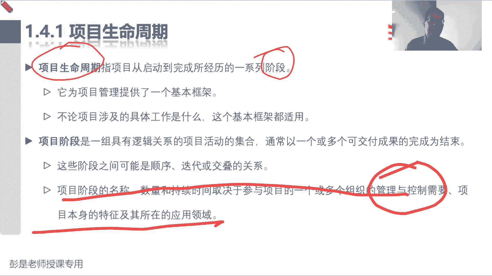

每个项目的具体情况不一样，好在看PPT再给大家透彻一下。

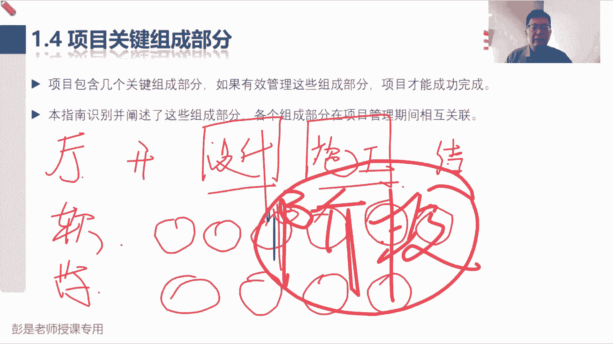

什么叫真正的看情况，刚才我们说呀，我装修餐厅啊，可能做计划，然后做设计，设计完了之后啊，施工施工完了之后啊，打扫开荒保洁啊，开荒之后呢，家具进场诶，这个餐厅就好了，这个餐厅就好了，那你像我在加哪个猪圈。

哪个猪圈啊，只有一头老母猪，这个猪圈不需要很大，几平米就完事了，需要需要画什么示意图，效果图，画个什么cad，没必要，没必要，捡点破砖头，点点破木棍子就噼里啪啦一顿干，这竹竿就搭好了，我直接就施工了。

可不可以呢，可以吧对吧，弄个鸡窝，就两只老母鸡，弄两块板一搭，拿铁丝一绑就完事了，完全可以啊，弄好了，猪圈呢也不做保洁，拿水一冲就完事儿了，小猪扔进去还在里面逍遥快乐自在呀，所以根据项目的情况。

根据项目的规模和复杂程度，我们来分析到底划分为多少个阶段比较合适，像一些大型项目阶段肯定就多，小型项目的鸡蛋很可能就少，天下大势，合久必分，分久必合呀，太大的失误，我们就需要把它进一步的做分解小的事。

咱没必要那么啰嗦，就把它合并了对吧，脑子里面一想大概什么样设计就做完了，完全没必要单独把它分出来一个阶段，还有什么画图纸，评审碰撞测试，这就啰嗦了，就这个就这个思路吧。

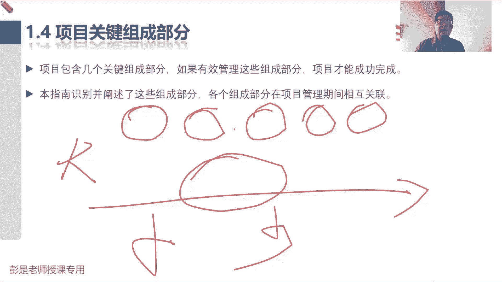

好所以最后看情况看情况，看情况取决于我们管理和控制的需要，这就是项目生命周期，以及项目生命周期阶段划分，需要大家掌握的知识点，不同类型项目阶段划分不一样，到底分成多少个阶段呢，取决于我们的管理控制需要。

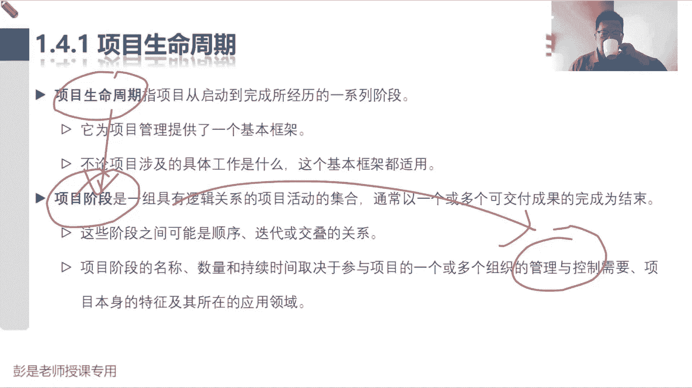

好这个知识点搞早搞定之后啊，往下扒拉扒拉扒拉，看中间这段文字就可以不念了，项目阶段可以基于各种因素来建立，我们就是我们到底分成多少多少个阶段呢，考虑这些因素，这不用不用记啊。

但是把项目分成多个阶段有什么好处，这还是需要掌握的，分为多个阶段的方式，有助于更好地掌控项目管理对吧，每个阶段有每个阶段的工作重心，这个阶段做设计，这个阶段做施工，这个阶段做保洁，做打扫卫生。

诶这样呢我们更好地管理每个阶段的工作，同时还提供了项目评估项目绩效，并在后续阶段，采取必要的纠正和预防措施的机会，这是可以及时的发现问题，及时的做修正，早发现，早治疗，早康复，及时的发现问题啊。

总之中心思想就可以帮助我们降低失败的风险，可以帮助我们降低失败的风险，回到我们的餐厅这个场景里面，如果呀人家不给你画效果图示意图啊，不给画效果图示意图啊，就大嘴一说，这个餐厅啊简洁装干净漂亮。

然后就施工了，万一施工完成之后，你发现不是我想的呀，这不就是失败的成本就高了吗，那还不如还不如先把这个效果图给你画出来，让你看一看，中意不中意，对不对，如果没啥问题了，我们再施工啊。

这可以帮助我们降低失败的风险。

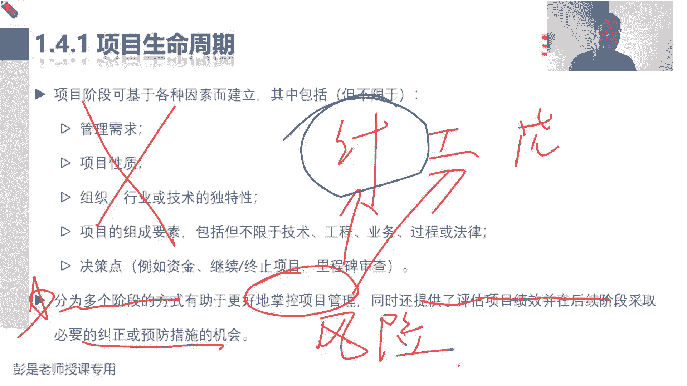

这是它的好处，好一次二再往下，那项目生命周期会受到组织行业开发方法，和所用技术的独特性质影响，因为每个项目情况不一样，但是无论项目涉及的具体工作是什么，生命周期都可以为管理项目提供一个基本框架。

就有了这个通用的生命主体结构，不管你是什么类型的项目，盖房子，装修，办婚礼，研发药品，做导弹，做软件，总有一些个阶段，总有一些阶段的工作是未开始项目干的事情，总有一些阶段的工作是在做组织和准备对吧。

比如我们画图纸，以软件做设计，做概要设计，详细设计都是在组织与准备吧，准备办婚礼之前做婚礼的筹划策划，组织与准备啊，唉总有一些阶段的工作是执行，就是根据我们设计的蓝图去落实去施工。

根据我们设计的这些技术文档去敲代码，根据我们规划好的这个策划好的婚礼的议程，去举办婚礼，哎总有一些阶段的工作在执行，总有一些阶段的工作是做扫尾公共抽象层啊，这个术语本身就够抽象了哈。

他就是根据不同项目生命周期阶段的性质，总结出来的这样的四个共性的阶段，总结出来四个共性的阶段啊，我们自己实际上实际上做项目的过程中，要把这个阶段变成你理解的专业术语，然后呢如果这个阶段的工作。

这个阶段的工作比较啊，再把它做进一步的细分，比如你开发软件，可能做产品设计，技术设计，技术设计太大了，再细分概要设计，详细设计，什么数据库设计，网络设计，各种各样的设计啊，都是在组织准备。

那我们盖房子呢就是做设计，画图纸对吧，什么效果图，平面图，结构图是吧，有些你也要制造制造业做装备，你还要画什么透视图各种东西啊，哎就这个道理啊，好那总结出这四个共性的阶段有什么用呢。

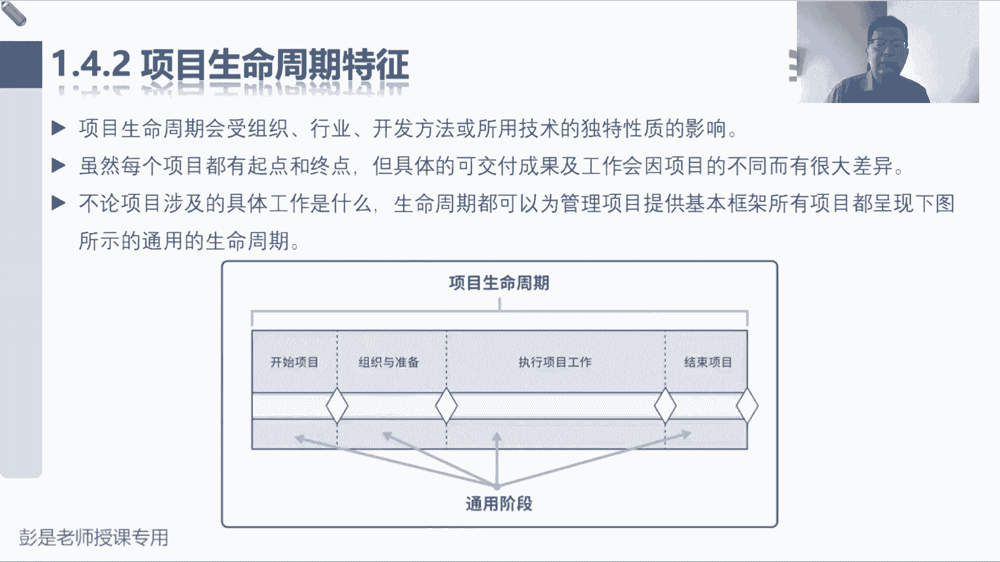

这是需要大家记住的，一定一定记住的，非常非常重要的知识点规律规律啊，那通用的生命周期结构一般具有以下特征，成本和人力投入在开始时较低，在工作执行期间逐渐增加，平台项目快要结束时快速回落，这段话就在说呀。

分阶段的成本的一个特点，什么叫分阶段的成本特特点呢。

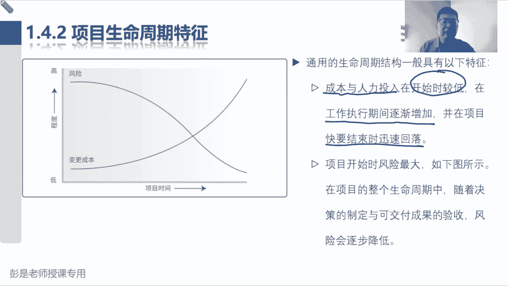

通常我们开始项目投入的人财物最少，在组织与准备投入投入的人财物就多了，到执行阶段，通常投入的人财物是最多的，然后结束的时候通常可能投入的人财物又少了，少多多多，就这样粗暴理解啊，少所以变成数字。

大家可能更好记，比如说随便举例子了啊，比如说开始的时候我们的投入10万，组织与准备，我们可能花30万请人家画图纸，施工阶段盖房子，打地基，装修唉，我们可能投入100万，结束的时候做扫尾对吧，做保洁。

做开荒，做交付可能需要10万20万，这项目就结束了，这是分阶段的成本和人力投入水平，开始少，组织与准备多了一点，执行的时候通常最多节奏的时候又下去了，那分阶段的投入有什么用呢，分阶段投入也没啥用啊。

我们要看累计，也就是总体成本，第一个阶段过去了，总体成本是10万，第二个阶段过去了，总体成本变成了40万，第三个阶段过去了，总体成本变成了140万，第四个阶段过去了，总体的成本变成了160万。

嘿我们发现总体的成本在越来越高对吧，因为随着时间的推，时间的推移，随着项目工作的开展，房租工资水电福利，这都是钱呐，所以就有了非常非常著名的这条交叉线。

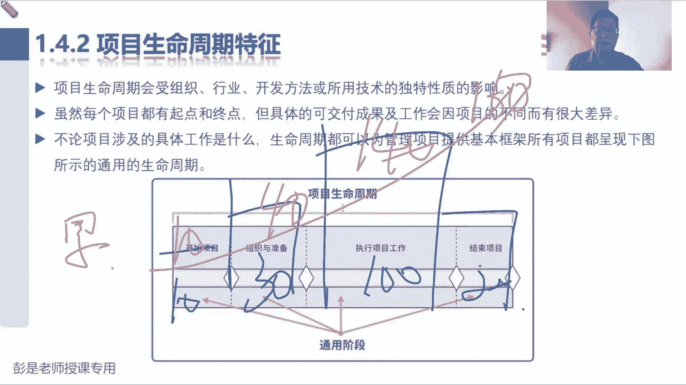

啊这根线项目的成本在不断的上升，不断的上升，不断的上升，也就意味着变更的成本，变更的代价越来越大，这能听懂吧，我们装修个牛肉面馆，装修成兰州牛肉牛肉拉面那个风格，结果老板说不喜欢。

我们要改成麦当劳这个风格，这种情况下变更的成本非常非常非常非常高，对不对，要推倒重来啊，推倒重来哈，这是变更的成本，变更的代价嗯，这段文字在说分阶段的成本和人力投入水平。

现在课件上画出来的这条交叉线在做总体成本，因为总体成本在不断上升，所以变更的代价越来越大，变更的代价越来越大，刚才那个例子不难理解吧，我们在画图纸的过程中，老板说这个这个这个这个这几个地方我不喜欢。

我们变更的代价还比较小，因为纸上谈兵啊，等咱这个餐厅装修完了，老板说这风格我不喜欢，砸了重来吧，变更的代价自然就很高啊，这是下半截导线啊，那上面这条线呢，就是说项目渐进明细的这个特点。

在项目早期信息比较少，比较粗略，都是概括性的，抽象的高层级的，所以呢信息不详细，信息不详细，也就意味着不确定的程度最大，所以项目开始的时候风险最大，然后随着项目渐渐明晰的特点，还这种信息越来越多。

越来越丰富，越来越细化，这种不确定的程度就在逐渐走低，所以就有了后面这句话，随着决策的制定和可交付成果的验收，风险会逐步降低，这是非常著名的一条交叉线，知道了这条交叉线之后啊。

最后终极的问题就是就是这个了，像到了项目后期呀，虽然这种不确定的程度最低，但是万一这个风险一旦发生了，这个风险万一发生了，产生的影响是大还是小呢，大吧因为成本高，因为成本高啊，风险一旦发生。

就变成了问题对吧，解决问题需要有病，需要有变更的代价，哎所以还是那个餐厅对吧，我们把餐厅的承重墙凿了凿了，表面上看目前啊没事啊，但是等你装修完，随着时间的推移，这个风险一旦发生哇，这就吓人了。

就吓人了吧，那这事儿怎么破，到了项目后期，一旦出现问题，风险发生成真变成了问题，哎呀影响大影响大呀，这事儿怎么破了，风险规划提前介入，前期前期哎能想到钱就好了，对不对，因为在项目早期变更的成本。

变更的代价小，所以就是问题最好能够提前出现，提前识别就有就有了那个中心思想了，中心思想是什么呢，早发现早治疗早康复，和那个病和身体健康管理一样的吧，早发现早治疗早康复，因为在像上早期解决问题的代价小。

唉想办法把它扼杀在摇篮里，大家对吧，提前做好风险管理，尽量的尽量的识别到风险，就是总之事前比事后效果要好得多，事情比术后效果效果要好得多吧，好知道这个知识点啊，那再往下。

再不显著影响项目成本和进度的前提下，干系人改变项目产品最终特性的能力，在开始时最大，对此并随着项目的进展而减弱，这句话变成人话，就是说呀，在项目早期，您说啥是啥，对不对。

改变我们产品最终的特性的能力非常非常大，在我们设画图纸的过程中，老板你说什么风格，咱就给你画什么风格，对吧，你想走北欧的风格，什么地中海风格，中式风格，什么欧式风格，美式风格，您想怎么想怎么画。

我们就给你怎么画，它改变我们产品特性的能力非常非常大，但是到了项目后期，木已成舟，木已成舟啊，变更的成本已经非常高了，房子都装修好了，再想改没这么容易了，所以他改变我们产品。

最终的能力会随着项目的进展而减弱，导致项目后期生米煮成熟饭，对不对，他就难以改变我们了，因为变更的代价非常高，这就是非常非常著名的一条，交叉线。

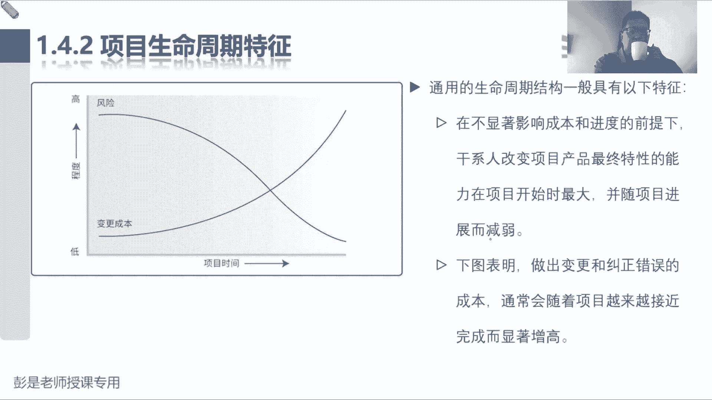

好1。43，那根据刚才储备的知识点啊，就带出来下一个非常非常重要的概念，叫阶段关口，我们项目从开始到结束，为了便于管理，为了更好控制，为了降低风险，我们把它分成了N个阶段，那分成N个阶段啊。

分成N个阶段可以帮助我们降低失败的风险，有问题及时纠正，那项目启动之前，我们做了很重要的几个几个事情啊，只要需求评估商业论证，效率计划的制定，商业论证和效益计划，去分析项目是否具有可行性，是否具有价值。

只有又有可行性，又有价值的事情，我们才愿意去开展，那大家实际工作中有没有遇到过这样的场景，原计划呀，这个项目成本是10万块钱，做到一半发现不对劲了，这个成本hold不住了，这个成本hold不住了。

现在物价涨了，人工也涨了，干的越多，赔的越多，你有没有遇到过这样的场景啊，有吧，干的越多，赔的越多呀，以前跟你签合同的时候，说，每天给你送可口可乐，一瓶水三块钱，现在的物价涨了，一瓶水涨到了五块钱。

哎我给你送的越多，赔的越多，那我们要考虑及时止损，要考虑及时止损了吧，接到港口就干这个事，所以我们要在阶段之间放一个菱形的小方块，菱形的小方块啊，作为阶段的决策点，作为阶段的决策点。

这个小方块在这个阶段关口我们干什么事呢，我们去分析项目是否还有可行性，是否还有价值，看看往下走还能不能做到，能不能做到，看看继续往后走啊，还能不能赚钱，还能不能赚钱，就这么简单。

这就是见证端口最重要的作用，嗯记得高考最重要的作用啊，判断项目是否还具有可行性，是否还具有价值，避免干得越多，错的越多，赔的越多呀，好那阶段关口怎么做比较怎么做分析呢，怎么做分析啊。

将项目的绩效和进度和项目的业务文件比较，包括商业论证，项目章程，项目计划，效益计划这段文字啊，大家其实不太需要去背它啊，不太需要去背，总之他怎么做决策呢，就是用两个东西做分析，一个是，理想一个是什么呢。

现实，这好猜了吧，像什么这些什么论证啊，章程啊，计划呀，效益计划呀，这都是我们的理想，是我们一厢情愿的项目的绩效，这就是实际情况，用理想和现实来做比较来分析是否具有可行性，是否继续继续下去，是否有价值。

好论证在前的，先有论证后有章程啊，所以只要记住这个中心思想就可以了，到了阶段高考。

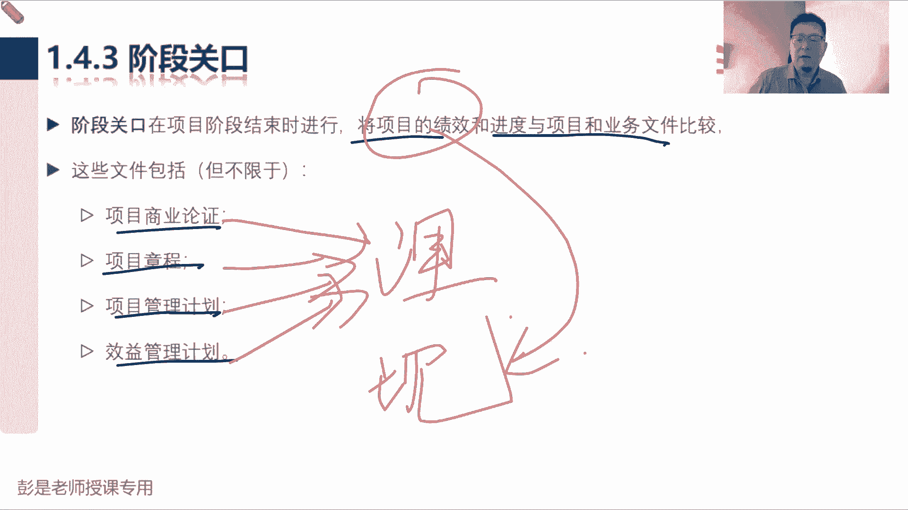

我们用理想和现实做分析，去分析项目是否还有可行性，是否还有价值，那根据分析的结果就可以给出这样的决策结果，这个决策结果呀也是看一遍了解就可以了，不太需要去背了对吧，进入下一个阶段，整改后。

进入下一个阶段结束项目停留在当前阶段，重复阶段或者是某个要素，这个其实大家大概能倒推出来，项目的状态是啥就够了，进入比如说啊进入下一个阶段啊，说明没啥问题，还有可行性，还有价值，整改后进入下一个阶段。

就说明啊还有可行性，还有价值，但用到了整改，就说明有一些小问题不太重要，那结束项目就说明可能没有可行性，没有价值了，止损了，停留在当前阶段，可能是可能说明形势不清，对不对，那咱就先按兵不动对吧。

有的企业可能烂尾楼啊，没钱了，我们就停工停一段再说，或者是重复阶段，或者是某个要素哎，重新重回去反攻了，这都不需要备糖好再往下，那在不同的组织行业或者是工作类型之中，阶段关口可能会被称为阶段审查阶段门。

关键决策点阶段入口阶段出口这段没办法，大家术语很难达成共识，所以呢他把常见的一些有可能的术语，全都列出来了，这些术语啊，大家其实也不太需要去背，学习小妙招送给你哈，什么学习小妙招呢。

你能猜出来的术语就让他去死，能猜出来的术语就不要看它对吧，比如说阶段审查啊，这段门阶段入口，阶段出口，这都很容易猜吧，就是这个关键决策点不太容易猜，看到这个词不一定不一定能明白它到底是啥。

这种东西就单独记一记，这玩意儿就是阶段关口，阶段关口和里程碑完全是两回事，千万不要把它理解成一回事了，千万不要理解成一回事啊，虽然他们在时间点上可能存在着重复的元素，但里程碑里程碑它的作用是什么呢。

表明项目的状态，重大事件，它和阶段关口作用不一样的，阶段关口是做决策的。

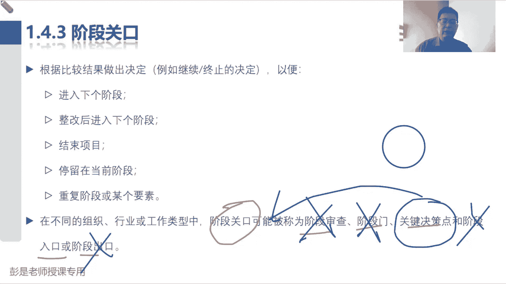

好再往下开发生命周期，说项目生命周期啊，可以是预测型适应型，项目生命周期内通常有一个或多个阶段，和产品服务成本开发相关，这些阶段称为开发生命周期，这个单词也是稍稍有一点点印象就够了，随便举例子啊。

比如啊我项目从开始到结束，由ABC第四个阶段，其中BC这两个阶段和产品服务成果开发相关，那咱就把这两个阶段称之为开发生命周期，知道这个意思就可以了，然后预测型适应型，一会儿一会儿再说啊。

这两个单词很重要的，但是从今天开始到最后一天，最后一天考试前的最后一个课程，会反复看到这两个单词的后面会解释的。

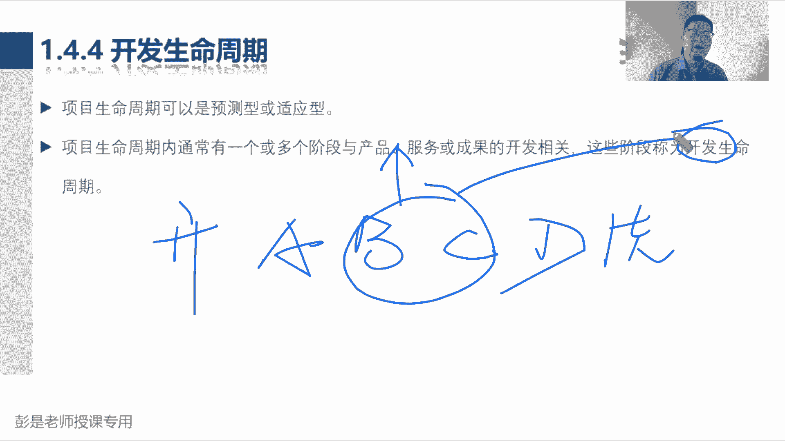

那接下来就是开发商品楼梯，可以是预测型，迭代型，什么增量型适应型，这一段内容超重要超重要，是帮助我们更好地掌握什么叫传统项目，什么叫敏捷，那讲这段内容之前，咱给大家需要缓一下。

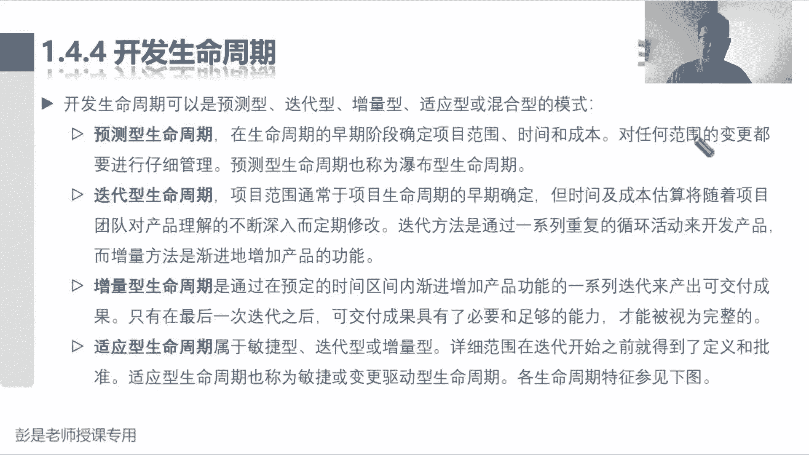

现在15。19在休息，啊8分钟时间，15点，27缓一口气，好各位同学继续了继续了，54321定清醒清醒啊，睡过头的同学应该精神饱满了好。

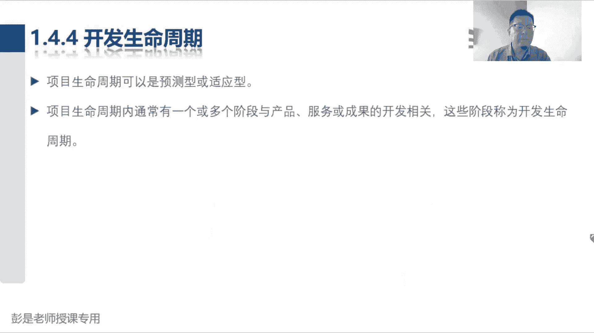

接下来我们继续往后走了啊，接下来这非常非常重要的四个玩意儿，叫预测型生命周期，迭代型生命周期，增量型生命周期和适应型生命周期，咳咳咳，其中预测型生命周期也称为传统的瀑布型。

上面标题适应型生命周期呢也称之为敏捷，也就是未来大家需要掌握的传统项目怎么管，基于过程的管理方法，五大过程组，十大知识领域，49个管理过程，然后呢敏捷怎么玩，在多变的环境下到底怎么管项目。

那这四个生命周期它适用的场景。

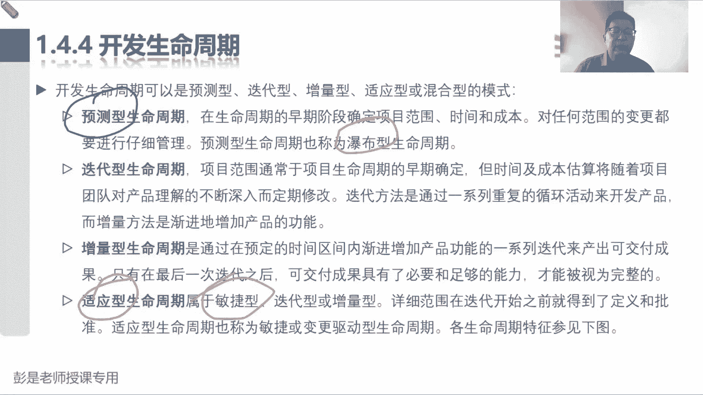

适用的场景啊，看PPT嗯，讲什么故事呢，下次休息15分钟啊，好休息15分钟，OK的啊，先坚持一小段啊，意志力的磨练也是我们培训的内容，因为大家考试你要做四个小时啊，亲230分钟吧，230分钟。

正式考试时间是九点到12。50，然后呢通常要求08：30就进考场，08：30进考场，你好歹高低八点就到那个地方了，八点到这个地方，你再倒推几点要起床，要出门了吗，所以毅力对吧，体力耐力。

这都是我们考研的考研的重要技能啊，哎好拐弯拐回来啊，没开麦，开了，JACKY同学开了吧，其他同学能听到声音吗，开了啊，如果听不到声音的同学刷新刷新一下试试好，接下来讲这四个生命周期类型。

咱先搞搞定预测型和敏捷，讲一讲它适用于什么场景啊，啊讲什么故事，以前讲超微信讲讲麦当劳，肯德基，今天换一个，咱讲哎我们那个牛肉面馆，咱开的牛肉面馆啊，牛肉面餐厅我就这么写了啊，我开了个牛肉面餐厅。

开了个牛肉面餐厅啊，张三是我的好兄弟，张三是我的好兄弟啊，今天晚上要来吃牛肉面，我知道张三的饭量，我知道张三的饭量，知道他能够吃几碗，比如说哎张三每次来呀都吃三大碗呢，满字满字不会写了啊。

张三每次来都吃三大碗，这种情况下说啊，这种情况下你去看一看那个概念，用什么样的生命周期类型，我是一次给他做几碗的，到底做几碗，到底做几碗，做几碗牛肉面是不是可预测，这简单吧，那我就用预测生命周期。

一次把这三碗都给它做出来，做到一次交付，做到一次交付吧，好有迹可循的，所以为什么叫预测型生命周期呢，这是结果可预测，结果可预测，对不对，做三碗满足他的需求，他的需求是明确的，这是张三啊。

那又来了个新朋友李四，顺便写了，这是张三同学，来了个新朋友啊，李四同学，李四同学呀，是我新认识的朋友，他到底能吃几碗，我也不知道，我打电话问他说李四啊，你吃几碗面呢，李四说呀，看情况不知道。

不知道这种情况下到底做几碗呢，做三碗做五碗，万一人家吃不了，会不会导致浪费呢，就这个逻辑吧，哎到底吃吃几碗难以预测，那如果一次做的太多了，就浪费了吧对吧，做个五碗八碗，万一吃不了，浪费啊，浪费时间。

浪费钱，浪费精力，对不对，那怎么搞，就做一碗吃一碗，做一碗吃一碗，这种方法叫什么呢，迭代，增量，就是敏捷这种思维方式了，对不对，把做一碗牛肉面，您吃一吃，然后根据他的反馈再来决定要不要做下一碗，对吧。

做一晚坐一晚，坐一晚，做一碗牛肉面出来，您吃吃完了，如果觉得没吃饱啊，我再开始第二次迭代，又得到了新的一碗面，得到了一个增量，然后他再去吃，获得他的反馈，看看够吃不够吃，它就适用于需求不太确定这种场景。

许久不明确呀，不知道他去吃几碗，未来的结果没有办法预测，所以呢通常我们就用多次交付这种工作模式吧，对不对，做完也做，做好面，尝一尝，获得反馈，做碗面尝一尝，获得反馈，看看够不够吃。

这就是预测和增量型和敏捷，预测和敏捷这两种工作模式，它适用的场景不太不太一样。

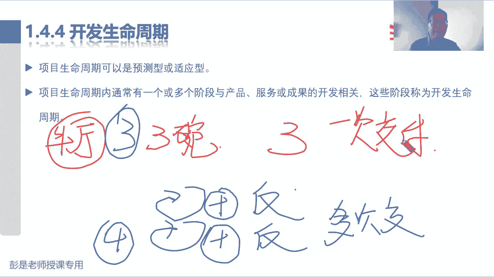

搞搞定这两个这两个东西啊，所以再看这个概念，预测性生命周期是在项目生命周期的早期阶段，我们就能够确定项目的范围，时间和成本，在早期阶段能够确定项目的范围，时间和成本，也就是说需求是确定的。

那在这种情况下，我们就可以做到一次交付，那既然需求确定，咱就最好最好最好不要改，所以呢对任何范围的变更都要进行仔细管理，适应性生命周期呢属于敏捷迭代型或增量型，详细范围在开始之前就得到得到了定义。

这段话大家听不懂，我不理他啊，不理他，然后它也被称为，敏捷或者变更驱动型的生命周期，总之就是不断的迭代增量，迭代增量，从而获得反馈，看看够不够吃，看看是不是符合人家的要求，那中间这个迭代和增量。

它其实仍然适用于不同的场景，敏捷就是迭代加增量，中间这个迭代型和增量型啊，它仍然适用于不同的场景，这个场景也很好理解，也很好理解啊，迭代型的更侧重于叫技术方案的不确定，它通常适用于技术方案的不确定性。

这种情况下，我们可能需要把工作重复开展，最后大家日常工作里面，你写文档，写资料，敲代码对吧，老板让你写个资料，我写完了第一版，老板说写的不好，给出了这这这这需要修改的意见。

然后呢咱们把这个修改意见就再把文档改一改，改完了之后呢，再给老板看，这样反复反复重复的开展这个工作，直到找到一个合适的基础方案，直到找到一个符合老板需求的这么一张文档，以此类推了，那牛肉面馆对吧。

我从来没做过饭的，和面，和面到底放多少水，到底放多少面，这个配比我完全没有任何的知识储备，这个技术方案不确定怎么办呢，就反复尝试呗，放面再放水，水多了，放面面多了，放水水多了，放面面多了，放水。

反复尝试，反复探索，直到找到一个合适的合适的解决方案，诶这是迭代型，它通常适用于技术方案的不确定性，指的是我们需要重复的开展这个工作，直到探索出一个合适的方法，那增量型呢它通常更适用于需求不太确定。

需求不太确定需求不太确定对吧，到底吃几碗面，不知道啊，那怎么办呢，就做一碗吃做一碗吃，做一碗吃诶，通过不断的增加一些产品的功能，来进行这种需求上的探索，用户需要一个什么大家手机里的什么淘宝天猫。

京东用户如果需要一个什么什么电商平台，电商软件，他也不知道需要啥功能，咱就做一个功能确认一下，做一个功能确认一下，它通常适用于需求不太确定，那敏捷呢通常适用于啊技术也不太确定，需求呢也不太确定。

那咱就有可能不断的迭代增量，迭代增量，从而进行这样的探索性的工作，不断的获得客户的反馈，这样的我们可以就可以知道我们做的东西，到底满不满足对方的需求了，好知道这个大概意思啊，先听一听。

后面会单独重点讲敏捷的游戏规则，这四个玩意儿把它搞定。

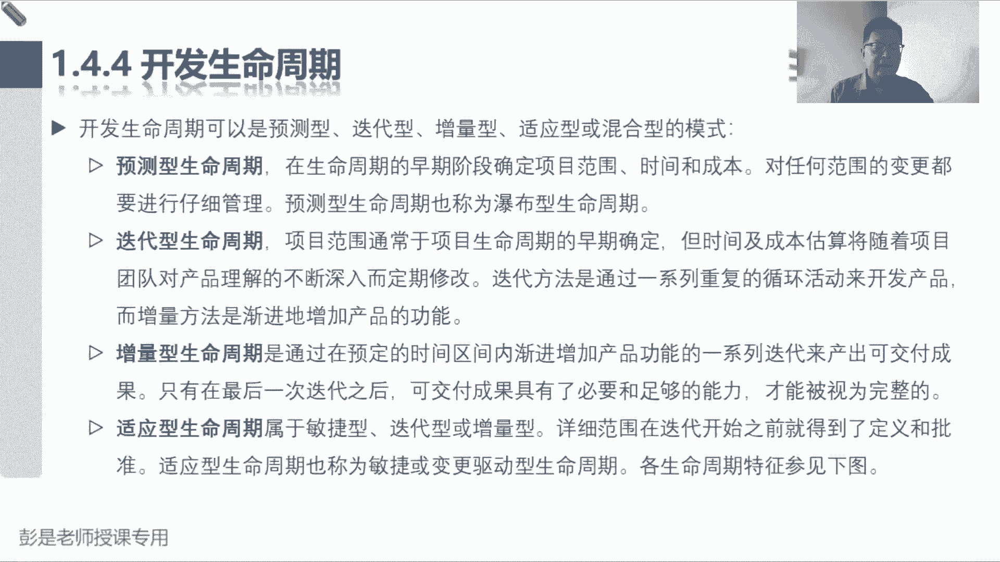

搞定之后就有了这张表，说开发生命周期可以是预测型，迭代型，增量型，适应型或者是混合型，预测型指的是需求在开发前确定，这样呢我们就可以针对成果做我们的交付计划，然后呢就可以做到一次交付了。

那如果需求不太确定，我们可能需要不断的迭代和增量，迭代和增量就知道频繁交互，多次交互，那预测型需求事先确定我们一次交互，所以过程中尽量的不要改，要限制变更，那敏捷型呢我们可以把变更实时的融入项目。

反正我们的成本低，反正我们的成本低了对吧，你说咋改就咋改，然后呢，预测型是关键，相关方在特定里程为试点参与就可以了，敏捷型呢就是因为变化多，因为需求不确定，所以呢大家都别跑，需要大家持续参与其中。

这张表大家现在不一定，有些元素不一定听得懂啊，不一定听得懂得元素先标一下，后面复习的时候都讲完了，敏捷你在复习这段内容基本上就不算啥了，但是现在不方便展开说，一展开说呀就啰嗦了，会讲很多东西的。

所以先记大结论，先去打方向哈，反正需求不太确定，技术方案不太确定，咱就敏捷小步快跑，那如果需求确定，需求确定，我们就可以做到一次交付了，对中间迭代和增量型这段文字其实可以不看了，迭代和增量型啊。

它就是周期短，周期更长，迭代的周期更长，敏捷型它的迭代周期就是重复开展工作的，这个时间通常通常小于四周，它的迭代周期通常通常小于四周，那迭代和增量型呢，它的迭代周期通常大于四周。

这段能听懂什么生命周期类型。

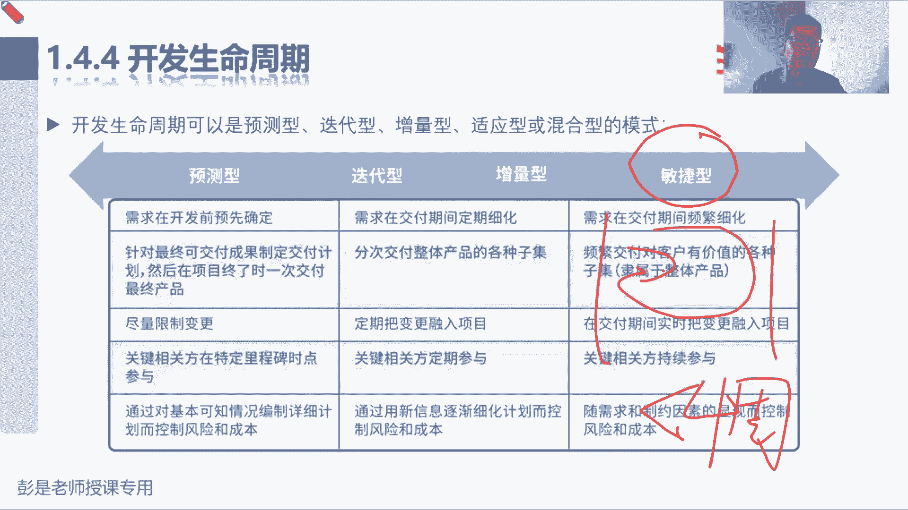

适用于什么场景就OK了，需求明确，那就预测技术方案不太确定，就迭代需求不太确定，就增量需求和技术方案都不太确定，那就适应性，然后说项目已经结项，然后运营反馈的需求，然后给你更新，再去做，算一个新项目吗。

项目已经结项了，你的资源都释放掉了，那你开展新项目是不是需要开始对吧，看去去实现这个新的需求，是不是要重新招兵买马了，需要得到授权吗，没有授权。

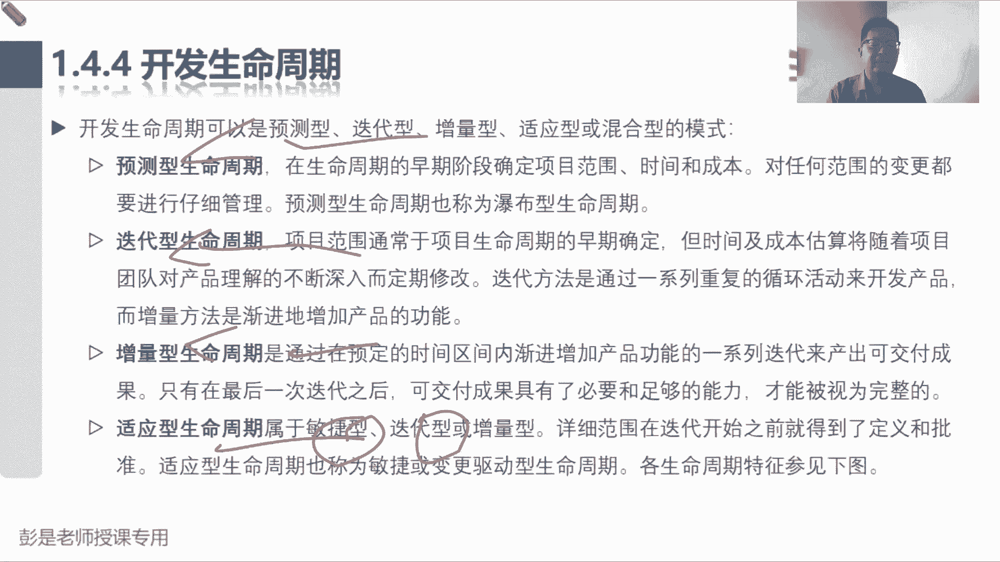

没有授权，怎么干这个事了，好再往下了啊。

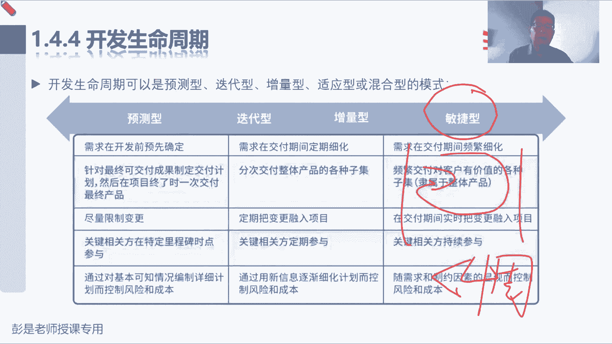

最后混合型生命周期的特点是什么呢，什么叫混合，再讲一个大道理啊，咱们项目需要有开始结束日期，项目过程中可能有ABCDN个阶段，某个阶段的需求，如果是明确的，用什么样的生命周期类型呢。

预测某个阶段的需求啊，如果不太确定对吧，什么技术方案也不太确定，我们能用适应性生命周期，所以啊就是该预测的就预测，该敏捷的就敏捷加到一起就叫混合，混合性生命周期，我们要根据这个阶段的需求是否明确。

技术方案是否明确，来分析应该采用什么样的管理方法，采用什么样的游戏规则，如果需求确定一次交付，咱就预测，如果需求不确定，那咱就敏捷，这就叫混合这个知识点听一听就可以了。

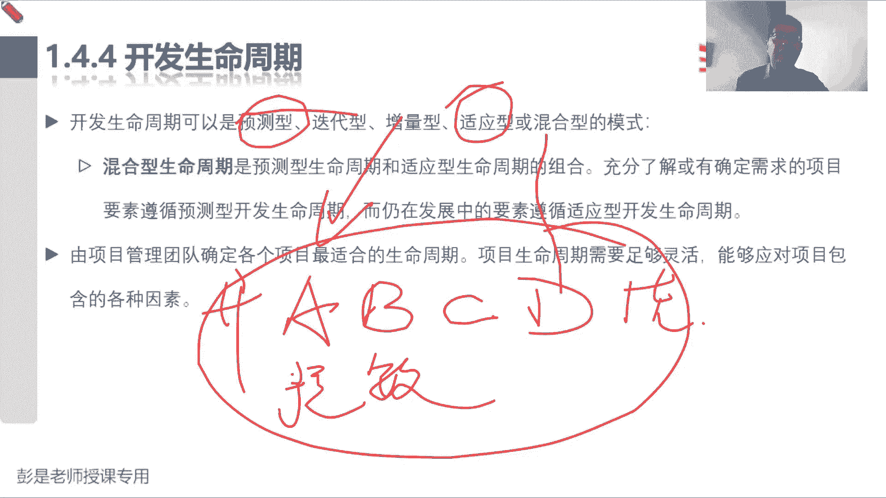

好再往下145说，项目生命周期，是通过一系列的项目管理活动进行的，也就是项目管理过程，也就是经典的五大过程组，十大知识领域，现在该用到了49个管理过程，于是呢这些文字都可以不看了啊。

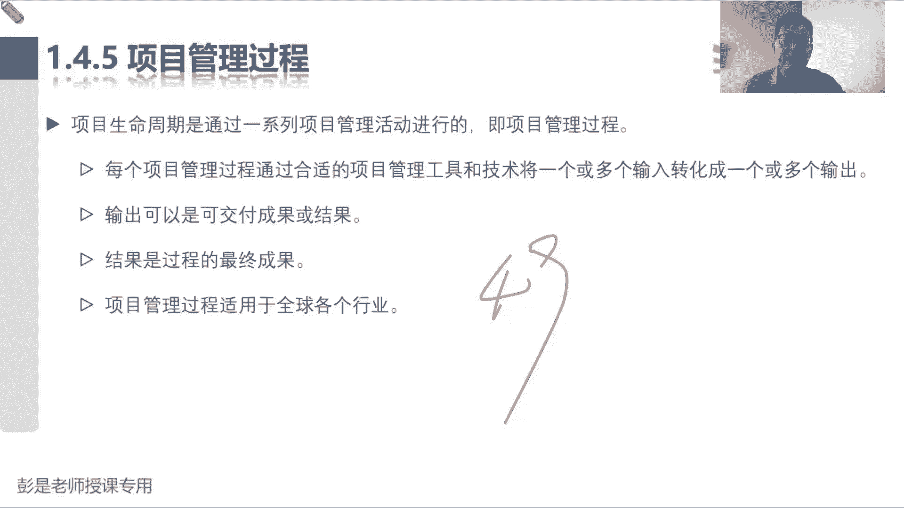

都可以不看了，于是呢就有了1。4。6，项目管理过程组，刚才说我们有49个管理过程，有这么多的注意事项，赶紧分分组啊，那分组的逻辑是什么呢，它的底层逻辑就是p DC在此基础之上加上一头。

因为在此基础之上加上一头一尾诶。

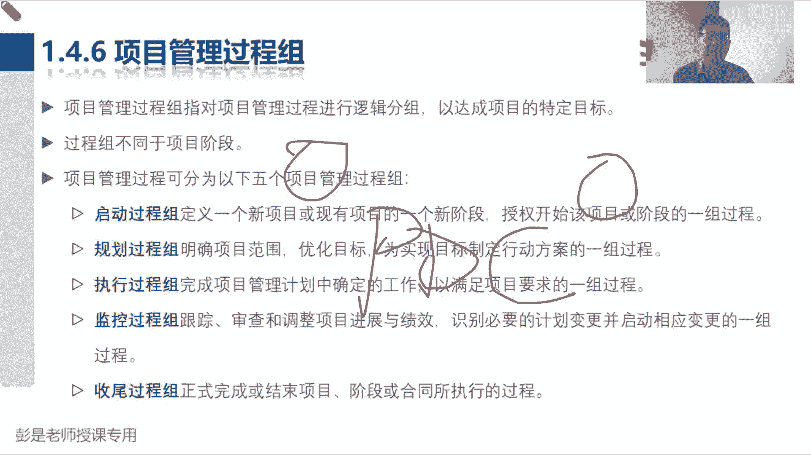

所以变成场景，变成场景，大家更好理解，等我找一个空白的地方啊，变成了场景，我们这个餐厅餐厅现在有这么几个事儿啊，啊设计这是一个阶段，第二个阶段施工，施工施工完了，做保洁打扫卫生，扫干净就可以交付了。

咱把项目分成了三个阶段，那第一个小问题，第一个小问题啊，设计阶段这个阶段的工作要想开始，这个阶段的工作要想开始啊，是不是需要得到领导的批准，是不是需要得到领导的批准，领导跟你说，客户打款了。

设计款到了到账了，嘿我们开始做设计，这很好理解啊，所以呢我们需要得到授权，没有授权就没有办法开始这个阶段授权，我们就把它放到了启动过程组，那按照这个逻辑，一旦得到了授权，那设计工作这张三画图纸。

李四画图纸，你们大家分别画什么图纸啊，大概什么时间把这个图纸画出来呀，对吧，张三画效果图啊，是先画效果图呢，还是先画什么平面图，结构图呢，这事儿得规划规划吧，设计阶段的工作也需要有计划。

所以就有了规划过程组来制定这个阶段的，或者是整个项目的计划行动方案，那做了既做好了计划，做好了计划不落实不执行，这也是纸上谈兵啊，那需要落实执行，落实执行，按照计划去干活，产出我们的可交付成果。

按照计划去画图，产出各种各样的图纸啊，这是我们的成果，所以就有了执行过程组，那张三这个图原计划一天画完，现在实际上两天了，还没交活呢，没交稿呢，李斯这个图纸啊，画错了，画错了，盲五啊。

你画图纸用cad不要拿，不要拿一张破草稿纸在纸上画呀，那这活干得怎么样，就需要监督和控制，就有了监控过程组，来看看大家的进度啊，成本啊，质量啊，是不是符合我们的计划，最后呢设计其他阶段的工作完成了。

设计阶段的工作完成，一旦通过了评审，是不是需要把我们这些图纸，什么设计资料移交给施工方呢，交给我们的施工人员对吧，记住交底啊，好让人家知道，这个这个这个这个房子怎么怎么装修啊，就有了收尾过程组。

该总结的总结，该存档的存档，该移交的移交，把前一个阶段的成果移交到下一个阶段，那以此类推了，施工人员，施工人员没有得到授权，他就没有办法开始砸墙吧，需要等信号，等信号，老板说了，可以开始施工了对吧。

我们在在砸墙啊，哎所以他也有启动过程组，那施工阶段呢也需要做计划呀对吧，你不能说我们先刷墙，刷完了墙再凿墙，凿完了墙再铺地板，铺完了地板再刷墙，这来回折腾也不行啊，也需要有自己的工作计划。

就有了规划和政策，那按照计划去干活，就有了执行过程组，活干得怎么样呢，就需要监督和控制啊，最后施工阶段完成也有收尾过程组，就把装修好的市场，装修好的房子移交到了下一个阶段。

下一个阶段再开始启动规划执行监控收尾，拥有了五大过程组好，所以五大过程组的根就是PDC计划执行和监控，那所以最后这个结论就是生命周期，从开始到结束，我们把它分成N个阶段，阶段一阶段。

B阶段C1阶段D这么做更好管理，这么做可以及时止损，这么做可以有有便于我们降低风险，那每个阶段之中，每个阶段之中管理工作上来说都有五大过程组，启动规划，执行监控，收尾都有这五大过程组。

第二个阶段还有五大过程组，第三个阶段还有五大过程组，然后再往下就是十大知识领域，49个管理过程，在生命周期的每个阶段之中都有这个东西，这就是管理管理的生命周期。

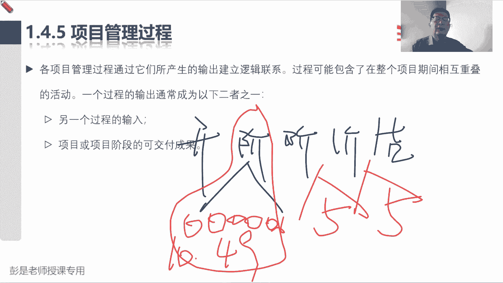

管理工作的生命周期，最后就指的是五大过程组。

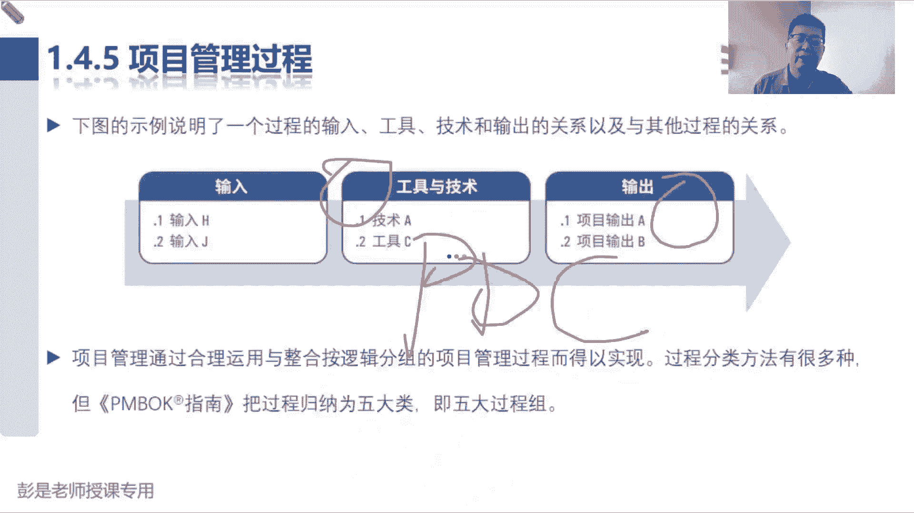

记住啊，项目管理的生命周期和项目的生命周期，不是一回事，项目生命周期是我们根据项目的开始到结束，工作性质把它分成了N个阶段，管理生命周期是指在这些阶段之中，我们管理学上，管理工作上。

按照这个管理工作的逻辑，就有了五大过程组，启动规划执行监控收尾好，知道了这段中心思想之后，标关键词表，关键词啊，五大过程组啊，六个事儿，六个关键词启动，这是授权授权，开始项目或者是项目阶段的一组过程。

嘴巴开始，项目开始，A阶段开始，B阶段开始CC阶段，每个阶段的开始都需要得到授权，那每个阶段的工作都需要做计划，就是规划过程组，每个阶段的计划定好了之后啊，都需要按照计划去干活，产出成果。

那活干的怎么样了，监控过程组两个关键词，第一跟踪审查和调整项目的进展和绩效，看绩效，看绩效，就是看看工作情况是不是符合我们的预期，这是管绩效，除了管绩效之外，还有第二个事情，就是管变更。

识别必要的计划变更，并启动相应变更的一个过程，张三工作干慢了，加加班熬夜对吧，赶赶工啊，以便于我们能够跟上计划呀，这是管变更吧，哎监控过程组两个事情叫绩效和变更，收尾，过程组呢。

就是正式完成项目阶段或合同执行的过程，这是做曹魏，这就是项目生命周期阶段划分，然后再出来管理工作的生命周期，五大过程组，在项目的每个阶段之中都有五大过程组，五大过程组最后带出来六个关键词。

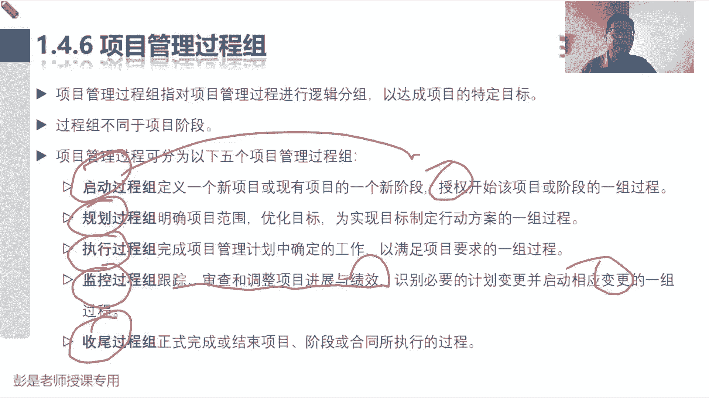

好那接下来1。4。7说项目管理的知识领域，这知识领域啊，现在各位同学可以不看，可以不看，可以不看，以后其实也没什么可看的，因为后面的课程主要讲基于过程的管理方法，就是这十大知识领域，十大知识领域啊。

也好记有多快好省，四个成功的标准，在此基础之上加上资源和风险，构成了六大制约因素，然后呢我们还要管理管理相关方干系人呐，那有人的地方就需要沟通啊，所以有了沟通管理。

另外不是所有的工作都是我们自己去完成的，所以呢再加一个采购工作中，共同构成了九个子知识领域，九个子知识领域啊，在想这个大道理，大家不能各扫门前雪压，我们需要协作呀，不能只管范围，不管进度，成本质量资源。

对不对，也不能只管进度，不考虑范围，成本质量资源也不能只管资源，不管其他人，我们不能不管不顾，所以呢需要有一个人在上面去整合，去协调统筹，运筹帷幄，所以再加最后一个项目整合管理。

就共同构成了十大知识领域，再多听一听啊，因为下次上课就开始讲整合了，这玩意现在可以不看了，好最后这个结论也是听一遍就完事了，某些项目可能需要一个或者多个，其他的知识领域，比如说建造项目可能需要财务管理。

或者是安全和健康管理对吧，什么什么QHSE就这些东西啊，不同的行业它有不同的不同的工作重心对吧，盖房子啊，施工啊，这两天出的那个事故啊对吧，我们要关注员工的健康，关注我们生产生产生产工作的安全感。

所以可能需要在此基础之上去增加一些，其他的知识领域，但教材里面列出来的十个知识领域啊，只是说大多数项目通常有这十个，我们要根据自己的情况往上加做裁剪好。

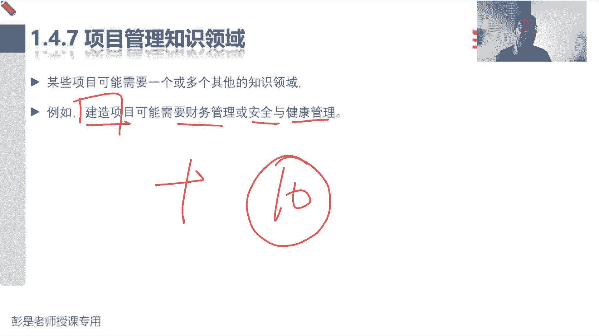

最后就带出来这么一个逻辑图，这张逻辑图就是从上到下，从上到下说一遍啊，就带出来这几个单词，这是项目生命周期，然后我们根据项目的情况，把项目分成N个阶段，不但是不管你分成多少个阶段，总有一些共性的阶段。

总有一些阶段的工作性质是开始，总有一些阶段工作性质是进行组织和准备，总有一些阶段的工作室执行，总有一些阶段的工作是收尾，把项目分成N个阶段，可以帮助我们，帮助我们更好管，及时纠错，降低风险。

那这段时间为了稳妥起见，我们放一个阶段管口阶段关口我们做决策，做决策来分析项目是不是有可行性，是否还有价值，那如果没有可行经营或者是没有价值，可能考虑止损，咱就不干了，然后再往下就是在每个阶段之中。

在每个阶段之中，我们都要去对项目进行管理，那管理工作呢常见的49个管理过程，分布在十大知识领域，这是横向做的做的分组，纵向分组呢就是根据pd c p DC a那个逻辑，再加上一头一尾善始善终啊。

所以就有了五大过程组，最后的结论就是项目生命周期的每个阶段之中，都有五大过程组，十大知识领域，49个管理过程启动了，就是做授权规划呢就是做计划，执行呢就是按照计划去干活，监控呢两个关键词。

叫看看供货工作做的怎么样了，叫绩效，然后管理好变更，最后呢收尾过程组字面意思做扫尾总结，归党移交这样的事情。

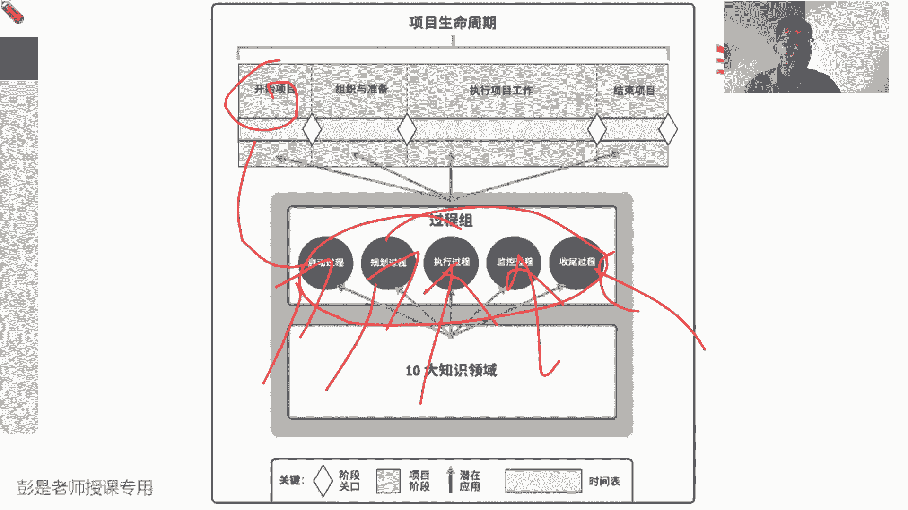

49完了，过程还没学到呢，所以现在不要问对吧，现在一讲大家就全都懵了，全都懵了啊，后面马上的课程就会讲49个过程了，嗯好一点，4。8，项目管理数据和信息，这又来了三个枯燥的概念啊。

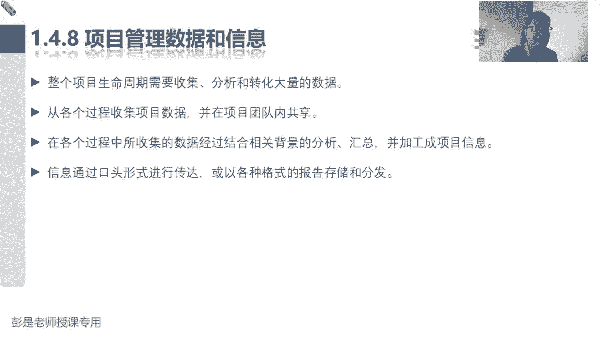

说工作绩效数据，工作绩效信息，工作绩效报告，这三个又是什么鬼呢，这三个又是什么鬼呢。

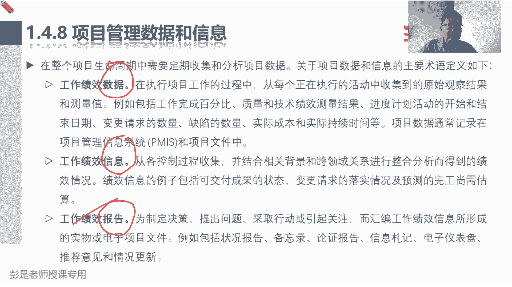

讲这个知识点之前，大家随便带场景去理解，为什么有这三个因素啊，先随便讲个场景啊，这是员工，员工上面上面应该是什么什么层级关系啊，部门部门再往上是什么层级的，公司，公司啊，好刚才那三个玩意儿。

它的逻辑关系和这个大道理一模一样，说员工每天干了什么活，张三今天种了几棵树，李四今天修了多少路，王五今天贪了多少，拉了多少牛肉面，赵六啊，赵六今天打扫了多少个房子，搭上了多少个餐桌，哎以此类推。

大家每天干了什么事，干了什么事啊，这是原始的工作绩效数据，我们的厨师服务员，收银员，保安保洁每天干了什么活，这都叫原始的工作进项数据，这些计算数据啊，老板不直接看的，老板不直接看吧。

他需要交给各个部门的管理者，保洁的交给保洁的管理者，保安的交给保安的管理者，交给保安队长啊，厨师的数据交给厨师长啊，服务员交给他，交给大堂经理啊，诶这些原始的数据要交给各个部门的管理者。

变成各个部门的工作情况，管理者收到员工的信息，员工的数据哈，说到员工的数据，然后分析我们部门今天原计划做什么事，现在实际上做了什么事，今天部门的工作情况是怎么样的，经过了他的分析评估。

总结归纳概括就变成了各个部门的工作情况，所以呢经过了加工的东西就称之为信息，就能够体现各个部门的工作情况了，就得到了信息，那厨师有厨师这个部门的信息对吧，服务员有服务员这个部门的信息，这才交给老板。

老板拿到各个部门的工作情况啊，咱再总结归纳概括，分析评估变成整个公司的工作情况，哎这就称之为今天的报告了，他就是这样一个层级关系，所以这个层级关系啊放到任何一个场景，大家基本上都应该不太难理解大家。

比如说你做体检，做体检啊，可能做到测测身高，测测体重，这都叫原始的观察结果和测量值，采血做什么彩超，B超，做什么骨密度，这都是原始的数据啊，这个原始的数据啊要交给各个科室，交给各个部门的。

变成各个部门的分析分析后的这个结论吧对吧，什么常规常规，什么血常规，然后一般情况包括什么内科，外科，超声科诶，就变成了各个部门的信息，各个部门的信息啊，交给我们的总检医生，他帮过帮助你进行分析评估。

写成了体检报告，唉综述你整个身体的情况，对不对，这就是数据信息到报告，那对标到对标到我们项目管理这个领域来说。

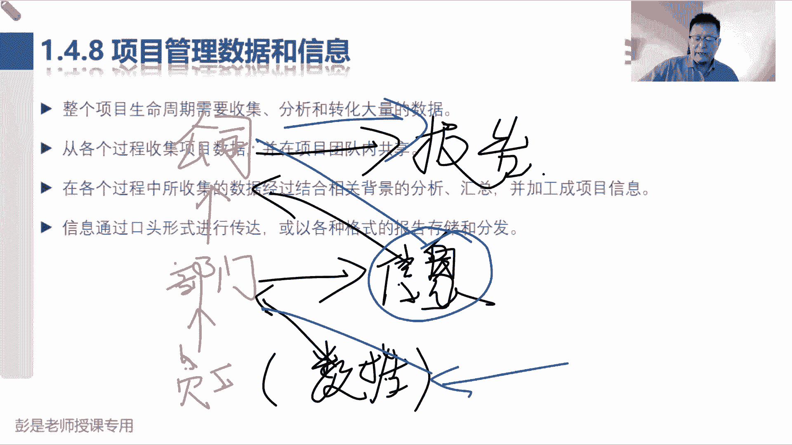

它的逻辑就变成了这样，项目经理啊，就是皇帝，咱啥活都不干的，主要干整合呀，你下边有九个大臣，有九个大臣啊，范围进度成本质量资源风险沟通，采购相关方，下面有九个大臣，分别分别帮助你。

完成这九个子知识领域的管理工作，有人管饭，没有人管进度，有人管成本，有人管质量，以此类推广，那有了九个大臣，接下来员工每天干的活，干的活啊，就叫原始的工作绩效数据，这些提交数据啊，不交给皇帝。

交给各个知识领域的管理者，交给管范围的同事，他来分析啊，我们有没有人画蛇添足啊，有没有人做范围之外的事情啊对吧，有没有人做范围之外的事情，哎我们保安每天要在我们店里面巡逻，但是今天发现呢。

保安跑到大马路上指挥交通去了，这里不是画蛇添足吗，不要抄范围啊，诶，负责范围的同事就会给你范围的工作绩效信息，那把这个数据啊就交给管进度的同事，他经过分析就可以得到进度的绩效信息了对吧。

一碗牛肉面应该10分钟就出品，结果呢今天我们厨师啊干活好像没兴趣，一碗牛肉面20分钟才做好，进度落后了诶，就得到了进度的绩效信息，那以此类推了对吧，今天菜价涨了，我们把把这个数据啊交给管成本的同事。

他来得到成本的绩效信息，唉我们就可以得到九个知识领域的技巧信息了，那九个知识领域的计量信息啊，全都交给项目经理才是皇帝，咱再总结分析，归纳概括变成整个项目的情况，就得到了整个项目的工作绩效报告。

就这样一个逻辑关系，从员工到管理者到到最高管理层。

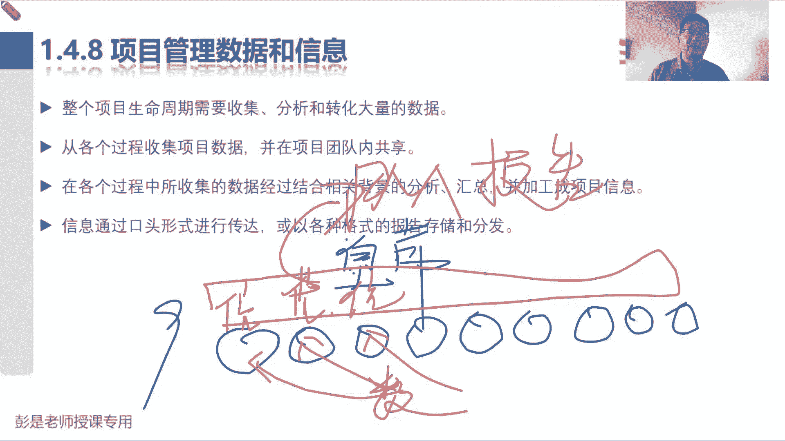

就这样一个层级递进的关系吧，所以工作计算数据是我们在工作中收集到的，原始观察结果和测量值，你还没有经过任何的分析，然后工作绩效信息呢，是收集原始的工作绩效数据，结合相关背景和领域关系分析而得到的。

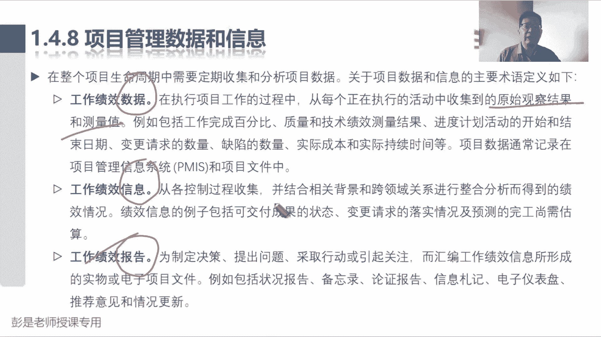

绩效情况，就这样粗暴即为九个知识领域范围，进度成本质量资源，根据当前领域的计划和实际情况做比较，就得到了各个知识领域的工作绩效信息，项目经理拿到九个知识领域的绩效信息，我们在整合分析总结归纳概括。

就可以得到整个项目的工作绩效报告，就这样一个层级的关系，好这是这一小段内容，基本上不少同学应该脑子已经不转了，但是能听懂这个道理就可以了啊，能听懂个大概意思就可以了，因为后面讲49过程的时候。

还会帮助大家去串，不要墨啊，不要目，至少能听明白就OK嗯，对半导体企业里面有代入场景，想你企业的架构，详细企业的架构就能理解了吧，你们公司有很多部门呢，每天干的什么活儿啊，原始的数据啊。

这个数据交给各个部门的管理者，就变成了每个部门的绩效信息，提到信息全都交给总经理，以汇总变成整个项目的工作基调报告，这个逻辑关系一模一模一样的啊，好接下来接下来不要夸。

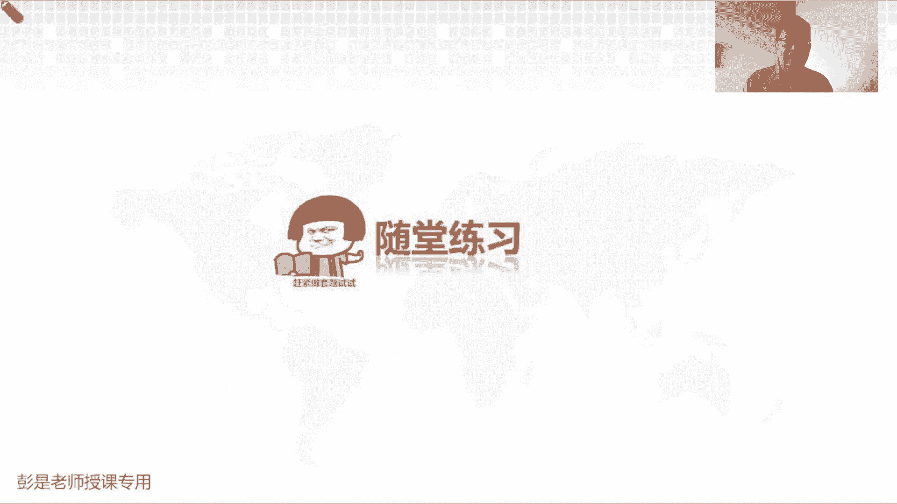

不要夸，一会你们就懵了，再往下看看题，这道题选什么呢，哎呀，考虑什么了吧，排除法，找一个正确的选项，B选项说，项目管理生命周期对于每个项目是独特的，这句话是对的吗，项目管理生命周期就是五大过程组。

启动规划，执行监控收尾，这五大过程组不管在什么项目上都是一样的，它是共性的，所以呢B不对，C选项说项目管理生命周期就是项目生命周期，项目管理的生命周期是五大过程组，项目生命周期是根据项目的实际情况。

把它分成了N个阶段的，每个阶段之中都有五大过程组，所以C肯定不对，好，那再分析一下A和D，A说项目变化和发展的时候，项目生命周期通常随之变化和发展，这一定吗，项目变阶段就变，好像不一定吧，对吧。

设计施工什么保洁，交付项目变生命周期阶段就会变吗，不一定了吧，不一定啊，他看情况的，其实D也不太确定，但总比A好一点，D是说典型的产品生命周期，包含多个项目生命周期，这需要科普了，需要科普了啊。

什么叫产品生命周期呢，这个概念其实大家了解就够了，了解就可以了啊，什么叫产品生命周期，产品生命周期指的是产品从生到死，从生到死，可以把它分成N个阶段，比如产品的研发，比如产品的研发对吧。

研发一个什么什么嗯，研发一个app，研发一个新的手机，研发一个新的电脑，研发一个新的汽车，在研发这个项目，这是个项目吧，研发好的汽车也要写错字了啊，研发好的产品啊，需不需要引入市场，就有了引入期。

导入期对吧，我们要什么宣传推广，找明星代言，让大家接商务诶，帮助我们更好的去宣传这个玩意儿对吧，放广告做广告投放上，让大家更好的更好的知道我们这个产品了，这是产品的引入期，然后呢，慢慢的买的人多了。

可能我们暂时还没赢啊，进入到上升期，可能根据用户的反馈，不断的对我们产品引进做升级做改进啊，也有很多事，也有很多，也有很多项目啊，最后呢到了产品的成熟期，就是买的人基本上稳定了，哎我们就持续的量产。

源源不断的生产，那成熟期最后呢，最后呢这个产品慢慢的慢慢的会，买的人越来越少，就是进入到了衰退期，到最后的最终退出市场，咳咳他指的是这个，根据产品从生到死这个规律，把它分成了N个阶段。

那在每个阶段之中呢，有可能有多个项目，产品的研发，有项目啊，找明星做代言拍广告，这都是项目啊，产品的升级改进完善，这都是项目啊，有可能包含多个项目啊，所以相对来说比较合适的选项是D。

好生命对阶段就这么几样，项目生命周期就对阶段项目管理生命周期就对，五大过程组，好看看这道题就简单了，在每个阶段开始时进行启动过程，它的目的是什么呢，项目生命周期的每个阶段之中都有五大过程组。

启动过程组的重心是，授权授权授权对不对，所以通常啊接到关口做了决策之后，我们就可以可能会得到授权吧，说明项目还有可行性，说明项目还有价值，所以就是B有助于确保，我们是不是符合预期的业务需要。

然后验证项目成功的标准，这样可以避免我们在错误的道路上越走越远了，不是D啊，不是来确定这个阶段所需要的这玩意，这玩意，这玩意这东西一看就是规划过程中要做的事了，做计划的时候。

再去分析这个阶段我们需要投入多少人财物，是这个道理吧，而不是在启动，好再往下拉啊，这道题，项目生命周期的哪个阶段，具有最大的风险和不确定性，就像那条交叉线就越早越早越不靠谱啊，越早越不靠谱。

所以概念计划编制实施收尾，那就A了吧，越早越不靠谱啊，越早越不确定了，项目早期信息少，信息比较粗略，高层级不细化呀，所以是A就进那条交叉线，就进那条交叉线就可以了，这没啥可解释的了吧，好关于项目。

关于项目阶段的说法，正确的是哪一个呢，A项目阶段就是项目的管理的五大过程组，这肯定不对，每个阶段之中都有五大过程组，B1个阶段的结束通常包括核准开始，下个阶段不一定吧，为什么特意放一个阶段端口呢。

C在可交付成果被确认符合技术要求之后，就可以结束该项目阶段对吗，B项目阶段的结束，涉及可交付成果的交接，所以答案是什么呢，D，阶段阶段结束，阶段结束涉及到可交付成果的交接转移啊。

总结归档离交C不只是技术要求吧，哎还要看是不是符合功能需求呢，另外除了成果呀，还要看工作，还要看工作啊，所以C选项不准，这选项不准啊，后面会讲到什么叫可交不成果，什么叫产品范围，什么叫项目范围。

选完后面的知识点，你再看前面的题就超简单了，好，以下哪一项是对适应型生命周期的正确解释，正确解释，这现在没学到，敢不敢猜，A和D肯定不是哈，A和D看完这两个选项，一看就是预测型生命周期的特点。

充分了解你交付的产品，然后能够确定总体的范围范围是确定的，它是预测型的，B选项不能选，因为在敏捷环境之中，未来我们会学到时间和资源是固定的，时间和资源是固定的，范围不固定啊，所以B不对。

所以呢答案是CC的知识点还没学到，后面复习的时候，后面讲后面还会讲到啊，然后刚才同学有同学问说，这道题问B为啥不对啊，是吧，一个阶段的结束通常包括核准下一个阶段开始，这是两回事了，能不能开始下一个阶段。

仍然需要有单独授权这样一套机制好这道题，各位同学注意了，谨慎了，小心了，开始有坑了，好选啥都有啊，A呀B呀，D呀，看这道题啊，为什么说有坑吗，说下一个项目经理运作一个软件项目，这个项目准备分阶段交付。

他计划将资源划分为两个不同的团队，同时完成这两个阶段的工作，这叫啥呢，同时完成也就叫，并行并行的就是重叠的关系对吧，并行就是重叠的关系，然后顺序关系是什么呢，就是先后，顺序就是先后，先洗脸后刷牙。

先洗手后吃饭，哎，这倒顺序关系，但是A和D不是答案，为什么呢，还有后半句的，不过他的一个高级开发人员，建议我们应该使用一种敏捷的方法，并且这个建议得到了他的认可，所以它最终采用的是什么方法呢。

敏捷敏捷呢就是迭代加增量，迭代加增量，所以呢答案是B迭代关系，没有C这个术语啊，没有C和处理，所以通过这道题更好的理解一下什么叫顺序，什么叫迭代，什么叫重叠，顺序的话就是串行，先A后B重叠呢就是并行。

A和B存在着一定的交集，可能是一部分，并行啊或者是完全并行啊，迭代关系呢就是循环循环循环，敏捷为啥是迭代和增量了，后面会讲，先记结论就可以了，现在一展开讲，基本上那个大方向就迷失了啊。

学习过程就是这样的，先了解大框架，大的套路，然后慢慢慢慢去抠细节，也有一个渐渐明晰的特点吧，好后面的题都简单了，以下各项都是管理过程组，除了啥，这送分题可以快速过了吧，启动规划，执行监控收尾。

这是五大过程组可行性研究，通常是项目启动之前做的事了，那启动过程组旨在获得授权，以便于什么呢，这也是送分题啊，还是A吧，启动过程组得到授权，开始项目或者是项目中的某一个阶段好，这道题，这道题提前预警了。

仔细看想一想，选B啊，选C啊，选D呀，这五花八门啊，这种题啊标准的解题思路是接下来这套话术了，为什么提醒大家，千万千万千万不要想当然的一想，这想当然按照我们的工作中的这种惯性思维，一想可能就错了。

好一个项目经理和承包商之间发生一点问题，他不确定承包商是否遵照合同，哪个知识领域的过程，最适合帮助他解决这个问题，接下来想场景，如果我们是高高在上的皇帝，你下面有九个大臣。

有人管范围进度成本质量资源沟通风险，采购相关方，那你现在找哪个大臣，找哪个大臣来确认承包商是否遵照合同，迟早是找负责沟通的人，还是找负责采购的人呢，这下思路就清楚了吧。

所以就定位到C找负责管采购的同事来看看，看看到底承承包商有没有遵照合同，所以答案是C，而不是沟通管理，也不是风险管理，也不是成本管理，就这样一个逻辑啊，这个沟通指的是什么呢，现在现在沟通指的是信息传递。

周报日报写什么项目日志，开会开会，不知道日报发给谁对吧，写了工作日志啊，不知道发给谁，用邮件发还是用钉钉发，还是用微信发吗，不知道，那就归到沟通管理，它侧重于信息传递，好就是大概这么去想哈。

先先大概对这对这个解题思路有印象啊，因为等你学完了49个管理过程，你就会知道控制采购这个管理过程，就是看看供应商是否按照合同在执行，看看供应商是否按照合同在执行啊，管理供应商的关于合同的执行情况。

履约情况，好再往下这道题呢，这个简单吧，说正在进行一个大型项目，分成这么多阶段，然后推荐什么方法呢，所以恭喜大家答对了，对，每个阶段重复使用五大过程组，项目生命周期的每个阶段都有，五大过程组都有啊。

这就是项目生命周期和项目管理，生命周期的区别，阶段就叫项目的生命周期，五大过程组就是管理工作的生命周期，他俩虽然从时间上讲是重叠的对吧，只要项目还在，我们就要对他完全管理啊，他俩时间上是相同的。

但是呢性质不一样，一个是实际的工作。

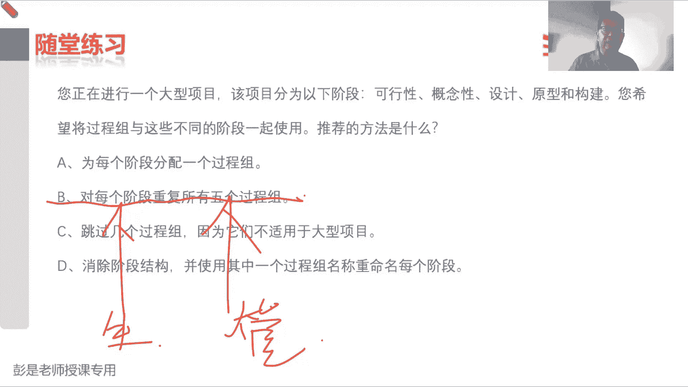