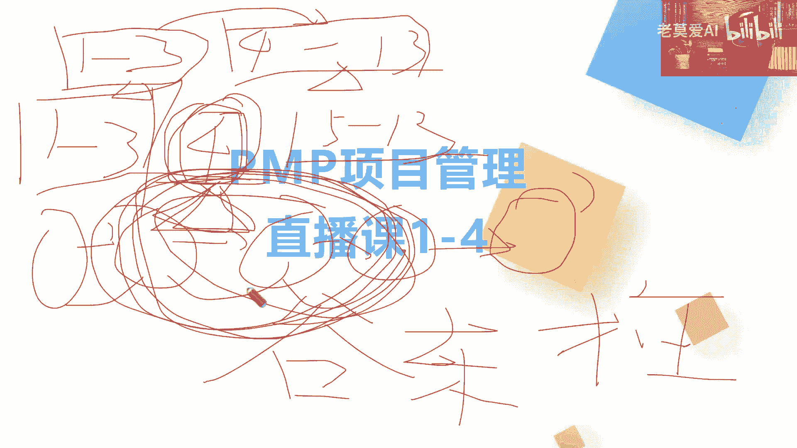
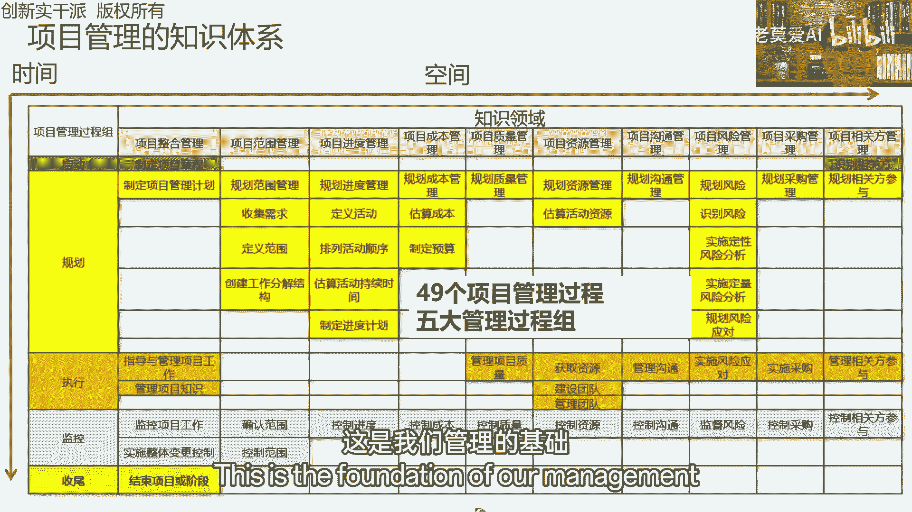
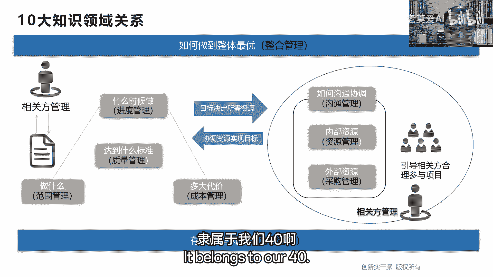
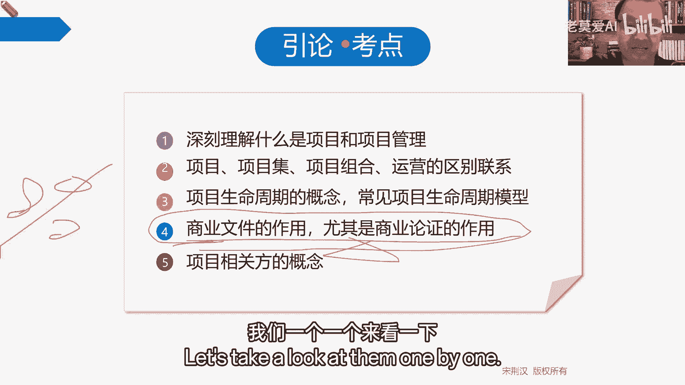
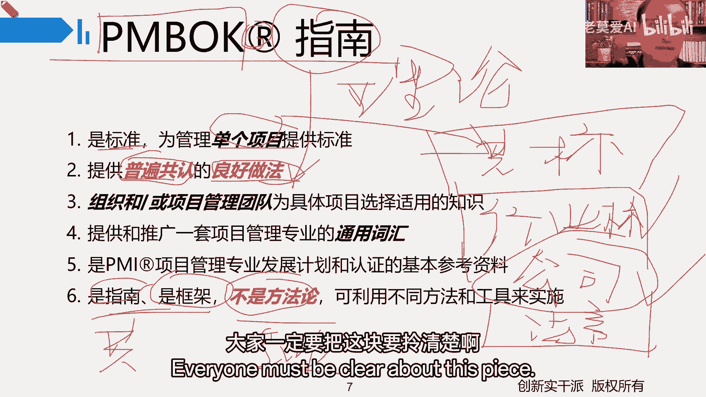
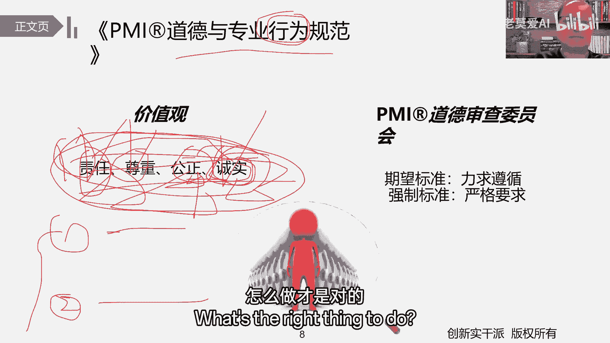
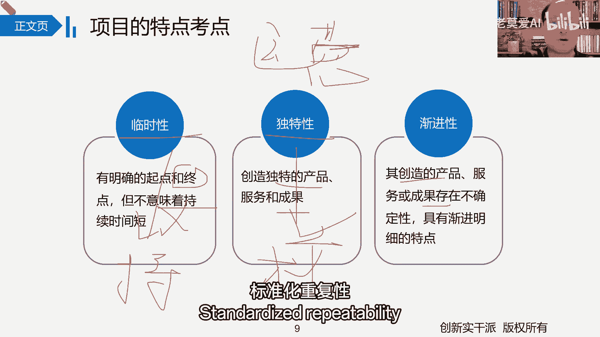

# 【最好的PMP课程】PMBOK6精华讲解1-1 - P1 - 老莫爱AI - BV1j4421D78e

好大家晚上好啊，咱们还有5分钟的时间就开始了啊，大家可以先进来的同学，先可以调试一下，整体的这个声音跟网络的情况啊，啊你搞定了，儿子好，大家晚上好，那现在时间来到了晚上的八点，我们就正式开始呃。

在开始之前呢说三件事，第一个呢我做个自我介绍啊，我叫股东，祝大家叫谷老师或柱子老师都可以，一直在讲这个PMP这一块啊，这是第一个，第二个呢咱们今天晚上的一个，这我们一共连续有四四次课。

整理串讲的一个基本安排，那我们第一次课基本上1~4章，第二次课基本上就是5~5678，第三次课呢就把其他的剩下的几章，就给他一股脑的全部讲完了，那么第四次课我们一共有四次课嘛，次次课呢他的一个呃。

第四次课整体的再把第一第第第一章从头到尾，再把基本的一个重点的部分，给大家做一个简单的一个罗列，那么上这个课的前提是什么，上咱们这个课，如果说你之前还没有这个你这个叫什么，你这个精讲的课程呢。

你还没有把这些东西把这些调学完，嗯我会建议你如果有机会啊，先去学那些，那回过头来再听咱们这节课啊，那咱们这个课整体设置的目的呢，那不外乎就两个点，第一个点呢，帮大帮大家把整体的一些之前学过的一些点。

帮大家一起再串一串，诶，说一说这是第一个点，第二点呢，那为什么在这中间呢，其实是我们大家精讲课，又不是我讲的是吧，这个为什么涉及到这个串讲的课程，我来讲这个点，对对棒。

其实就是对某些知识点的一个解读跟解析呀，呃不同的老师虽然讲的点都是一样，但是不同的老师会从不同的点的角度去做出，一个基本的一个解析，这么一个动作，这是我们的一个基本的一个核心。

所以说呢四次课程因为毕竟是以串讲为主，可能相对来说呢就没有精讲的讲的那么细呃，可能写比较快，但相对也比较快，没有今年讲的那么细，因为内容的量也相对比较多，一点也不多。

所以呢一定要有咱们精讲的一个这个基础，基本的一个基础好，这是第二个点，我讲的这个课程内容，第三个点就是课程的时间跟听课的方式，这个晚上基本的时间呢就持续在一个半小时，到两个小时之间的这个样子啊。

应该不会超过两个小时，如果超过两个小时还没讲完，还没讲完呢，我会在下次课再讲好吧，接下来讲，这争取不会超过两个小时的时间，也就一个半小时，一个小时，40分钟左右的时间啊，这是时间，那怎么样听呢。

其实就像我一直在说的这种方式，现在已经进入串讲了，大家就没有必要像精讲那样保持，那别这这这这这这种这种听课的一种精神，全神贯注，没有那个必要，为啥呢，现在的核心反倒是对于我们来讲。

你在有了精讲一等基础上，反倒是今天晚上我在带的时候，你发现哪里讲的时候好像跟精讲不一样，那回过头我们再一起精讲讲一下为什么不一样，有哪些不一样的点，在如果再不懂，我们在群里可以答疑一下，没有关系。

这是第一个，第二个呢就涉及到不同的老师，对他有不同的一个讲解的某一个知识点，不同的一个讲解方式，那这个讲解方式为啥会出现这种状况呢，你也可以做一个理解，所以究其本质。

你听课的方式以什么像精讲的那么相对比较，那么全神贯注，以相对啊，咱们到时候我讲的这四节课，你都可以基本上保持相对比较放松的态度，对你都比较可以，可以保持相对比较放松的态度。

也就是说你更多的时间你发展什么，用眼睛，眼睛甚至都可以不看，但是你要用耳朵仔细去听，听到哪个点，跟你之前在精讲的时候创到点感觉不一样，感觉不一样，这个时候你说诶那这个点不一样。

你想办法把这个不一样的点什么，把它搞懂就行了啊，这才是核心，你感觉听的是一样的，但只是作为什么，只是作为你对精讲的一个什么一个理解而已，如果你感觉这个过程，我感觉郭老师讲的也跟我们老师讲的不一样。

那都一样，你就作为基本的一个了解，加深一下印象，就这个样就行了，好不好，所以呢我们今天晚上就讲讲第1~4了，现在我们把这个课程基本点学了一个前奏之后，大家对这个PMBOK第六版呢，也有一个基本的了解。

那在我们第13章里面呢，我们可以简单来说把它就分成两块嘛，第一个就是1~3章，第二个就是4~13章啊，分成两块，有的人说我可以把它分成三块不也可以，但是第一个什么1~3章。

第第二个就是第四章单列下来是什么，第五到第13章，第五到第13章，那么如果说你是按照第一种方法，1~3章，剩下四到十四十三章，1~3章是我们考试的一个什么，是我们项目管理什么，一个概述，一个理论。

第一章讲基本概述，第二章讲项目环境，第三章讲什么，讲项目经理，这是我们项目管理的一个基础，这是基础中的基础，而这个第4~13章呢，就是我们讲的什么项目管理内容，也就是我们讲的十大十大知识领域啊。

十大知识领域这么一个过程，那换句话说，1~3章考的咱们啊现在一方面是为了折习，另一方面就考试角度来说，就学习角度来说，先把1~3章这一个理论框架把它搞清楚，把它搞清楚，那就考试角度来说。

你觉得1~3章考的多不多不多还真不多，但是1~3章搞不懂，4~13章，不好意思，弄不进去，为啥1~3章真正的考题在考试时出的并不多，出的并不多，但是什么都会以背景的方式融合在其他的，这个章节里面。

都会以背景的方式融合在其他章节里面，所以你把1~3章没搞懂，4~3章学起来感觉学的很好，到时候一考题你就搞不懂了，这也很麻烦，所以我说分两段就能这样来分的，那好如果是分三段呢，为什么只是把第四章练出来。

我们讲项目管理十大知识领域，实际上是项目管理什么九大知识领域，加一个什么加一个整合，加一个整合，有东西没有没有，连具体的方向都没有，那你说其他的九大知识领域范围进度成本质量，资源沟通风险，采购干系人。

它还有具体的方向呢，它往哪个方向走，我们都还比较理想，而整合呢往哪个方向走，不知道，所以呢它只有具体的一个方向，这就是我们做项目的核心，我们做项目的核心就是什么，就实际上做的事是什么。

进四章启动指定项目章程规划，把所有的计划搞定执行，按照这个计划去执行就完事了，接下来是监控监控阶段，就是把实际执行过程中，我们数据到实际数据，跟我们计划阶段计划两个放在一起干什么，放在一起对比。

发现有没有问题，也就是说基本上有没有偏差，或者在偏差的临界值之内，我们认为它是什么，它都是合格的，超过了偏差，那那就不行了，那我们该干什么，就加这些相关的措施的一个提升，这个叫什么，这叫控制。

能把他拉回到我们的计划之内，到底是改计划呢还是改执行呢，总之我们有个基准的点就行了，最后我们做收尾，这不就是我们项目干的活吗，这不就是我们项目干的活吗，所以今天晚上我们讲第1~1到四章。

核心就是讲个基础，一方面讲1~3章，讲个基础，20分面讲个四章，就项目管理到底是怎么干的，就从管理职能的角度到底是怎么干就完事了啊，到底是怎么干的就完事了好了，那我们学了第四章。

我们就知道我们前面1~3章讲了项目的什么，项目的生命周期，到第四章，虽然我们没办法按项目的生命周期来讲，但是不好意思，就学的本质来说，从结构化的框架，从结构化学的本质来说，我们只能按照启动规划。

执行监控和收尾来做，虽然我们在第三章不是说了，它有什么，它有整合的过程，它有什么相互交叉的过程，但是没办法学的时候，我们就假定他就是先做启动，再做规划，再做执行，在做监控，在做什么，再做收尾。

也是我们学的时候，只能学第一遍的什么基本的顺序，你第一次做项目肯定是启动完了才能做计划，计划完了做举止行，直接完了，做什么做做做做这个页嘛，监控完了NO这个时候没办法玩，结果等真正完了。

他中间又其实重复循环又在这嘛，重复循环就更多在规划，执行和监控这三个一个基本的职能，大类基本点的角度，所以我们学完了，我们得知道为什么，我们接下来课程基本上都是安排，都是按管理职能的角度进行安排的。

虽然是管理职能，但是从时间的角度初步也能这样来排，大家得知道有这么个点，因为只是从我们讲解的角度来看来看。

这样相对比较方便，仅此而已好，那我们就开始，我们今天晚上整体的一个整体的一个，1~4章的一个整体安排啊，好放在二维的空间，49个过程走，这是我们管理的基础。

也是49个过程，就是我们说的什么，所以项目管理的什么，而全部隶属于什么，隶属于我们40啊。

十大执政领，我们一会一会再说，好，让我们一起聊聊第一章做引论，就说一个基本的一个理解，那我那会儿都说了，究其本质，考试考的并不多，但是这里有个点我们要拿出来拿出来单看，就这个点，这就是商业文件。

商业文件在我们这里，我们不是一共学了两个商业文件吗，一个叫什么叫商业论证，一个叫什么叫效益管理计划，考试的时候有时候就把它弄成什么，弄成叫书页管理计划，大家知道那个意思就行了啊。

在咱们平常工作中的效益跟收益，那差的也不是那么多啊，当然他也有实质性的区区别，但是但真正在前期论证的时候，好像差的也不是那么多，总之你能挣多少钱，你你你你你投了100万，你能拿多少钱回来，这就是什么。

这就是你的效益，也就是你的什么你的收益，但是好像跟我们正常讲的不太一样，我们真正讲的时候，有的时候我们叫什么收益跟效益，那收益指的是什么，就是你能收多少钱效益呢，其实就是你的收益指的就是你的毛利润。

效益有的时候就指的是什么你的净利润，但是这个时候为什么要把这个点，我们从这个点来说，我们是真正要理解这个点，对我们后面的一个影响，你得知道前期我们项目在启动，前期我们做了什么，前期我们核心的东西啊。

就是做就在项目管理角度，我们核心的东西就是做了什么，做了可行性论证，做了可行性论证的分析，对吧啊，做了可行性论证论证理解，所以这一块因为在考试大纲里面，这块也作为一个占了一个什么。

占了80%的一个一个占比，把它专门拎出来说的，所以这块大家要看特别注意，其他都是一些基本的一些点，我们一个一个来看一下。

我们一个来一个来，首先我们来说这本书啊，首先我们来说这本书这本叫什么PMBOK指南，那首先这里PMBO带L是指这是什么，这是专利吗，这是专利的意思，那PMBO本身就是PMBO，说叫项目管理。

什么知识体系填不过这么叫项目管理啊，知识体系，那这知识体系既然是体系包含的东西多不多，就非常多了，因为你你得知道它的来源源自于哪里，它的来源就源自于我们你们公司要做得好，我们公司做得好，他们公司做得好。

就把咱们公司做的这些好的东西啊，全部给它收集起来，收集完了之后这一个整体的系统，这就是一个做项目整体系统，这叫什么，这叫项目管理，什么知识体系，所以它里面东西多不多，多庞杂不庞杂，复杂不复杂。

你拿人之前用过不见得，这就是问题了，问题就在于说你拿来不见得能够直接用，这是一个最基本的一个核心，那既然不能拿来直接用，你拿它不见得能够直接用，那说明你把它拿过来，它一时半会儿呢效果不太明显。

那怎么办呢，我们摘取一些什么，摘取一些相对共性的方法，完了我们把它放在一起，这成为我们的什么相对共性的一个标准，那我们一起来做，你看它是为什么，它是一个标准，它但它又是又又是一个什么，又是一个基础标准。

他的这个标准是怎么来的，我先给我先给大家再再扩展一下这个东西，像我刚才说了，考基于项目管理一些基本的术语，基本的一些内容啊，也就是说基于项目管理一些基本的一些语言，你们去做项目。

也就是说咱们没学项目管理之前，你们不是都在工作，做项目好了，你们公司这个项目做的很棒，做的很好，收益很好，感情的关系处理很好，什么都处理非常棒，这个收入怎么办，你们就成为你们什么。

你们行业或者说你们公司吧，咱先说你们公司叫什么，叫你们公司叫什么叫最佳实践，那换句话说，如果在你们公司里，这个方法直接可以推展开，它就是什么一个最佳实践，但是你们公司的最佳时间放在你们这个行业。

这个时候就要说行业了，因为你们是以行业为，但你们这个行业它能够形成能够通用吗，这个时候就不见得了，那不见得怎么办呢，把你们公司做得好的，把行业内其他公司做得好的，一些基本的一些好的点，把它拎出来。

把它形成一什么叫什么叫行业标准，这个叫什么叫行业标准，行为为什么行标成为一种行业标准，成为行业标准之后再往上，你只是在项目管理角度，在你们这个行业的项目管理做的是非常棒的，做的是非常好的，那怎么办。

为了把你这个行业的标准，项目管理相对的再拓得开一点，那怎么办呢，再往上走，再收集共性，成为一种什么，成为一种大家共同认可的共同的一个实践，共同的一个什么标准，那这个实验共同的一个标准。

而这个共同的实践共同的标准它叫什么，才叫我们叫这个标准，所以这个标准是怎么来的啊，我们刚才说了，你们工作做得好，把你们公司数据去数据之后，基于你这个行业提供一定标准。

再把其他很多行业的形成一什么共有的标准，所以现在我们学的这个标准是什么，是共有的一些基本点，所以它叫什么，它叫普遍认可的，什么良好实践，普遍认可的什么良好做法，什么叫普遍认可，就是大部分人不认可他。

这不叫普遍认可吗，大部分人，但并不见得所有人认可，什么叫良好做法呢，就说基于他来做，都能够取得一定的什么业绩，为什么呢，因为他就是从底下往上面进行个什么整体萃取，整体收集知识就用什么这么一个过程。

这么一个过程，那我们最近也我们说，我们的知识跟我们的理论实践啊，我们的理论跟我们的落地实践，它不就是这么一个过程吗，我们先实践再总结，总结成理论在哪，理论指导我们实践，那实践之后再更新理论。

理论之后再更新过了理论再来指导我们实践，它不就是一个来回这么一个，波浪式的这么一个过程吗，那他不就是这么一个过程，所以今天各位我们一起学的什么，学的叫PMBOK指南，它并不是一个体系，它是一个指南。

这个指南接近什么相关的标准，就是把这些共性的东西拎出来，供大家一起来学就好，所以他对我们真正的应用是什么，应用是理论指导实践，我们今天主要学习什么，学的全部是理论嘛。

但是这用的是什么叫什么叫理论指导实践，但注意要说另外一个点，我们在实践时候叫什么叫理论指导实践，但是在考试的时候，你可别说理论指导实践这句话了，考试的时候，我们就是啊理论指导理论。

落地在你的考卷上就行了，为什么呢，因为很多人在做题的时候发现，按照我们公司不是这么来的，你不是理论，你不是指导我们公司实践吗，注意考试的时候，他指的不是这个提出，不是针对你一家公司的，它是针对什么。

针对所有公司的，所以这个什么叫理论指导理论进行落地，进行实践，不是说理论指导你们家公司，指导你一个公司进行实践，一定要注意注意这一块好吧，所以那我们说它为什么是指南式框架呢，因为他是共识的理论。

共识理论，但是它不是方法论，那什么叫不是方法论呢，通俗来讲我们不是完全正确哦，通俗来讲，什么是方法论，你把这道偏不和体系学回去，甚至你没学之前，你们公司就不做项目了吗，你们公司也做项目。

你们公司也有自己的WBS，你们公司也有自己的进度管理计划，你们公司也有自己的采购管理计划，你们公司也有自己的相关的什么资源计划，风险计划，类似于这样的一些点行吧，那在你们公司这些点具体是怎么落地的。

那个叫什么，你简单来说就可以把针对你们公司，具体的落地的那些方法叫什么，叫方法论方法了，所以呢那我们说pm bok指南，它是指南是框架，因为他谈的是共性，那方法论呢他谈的不是共性。

它只是针对某一个具体的公司，或者某个具体的行业，所以你可以这样理解叫什么PMBOK指南叫什么，我们叫什么叫共性的指南，方法论呢我们叫专业的方法论，这样方便大家理解啊。

知道它们之间的一个基本的一个什么一个区别，所以我们这个书啊玩这方法很乱，大家一定要把这块要拎清楚啊。

拎清楚好好，那第二步聊完第一步之后，我们再来聊聊聊第二部分，聊第二部价值观，价值观是什么，我们人在做事情的时候，认为什么是惰什么，这是什么，符合你的价值，什么不符合你的价值，就什么是对，什么是错。

一些基本的一个观点，我们这里讲的什么责任，尊重工作，承，注意我对大家的要求这四个词啊，我建议你们把它背下来，简单不简单，你把它背下来，考试时主理论什么叫，那这个价值观是指什么。

道德与专业行为的什么价值观，什么是行为，行为就是你做与不做，你做了这个你的行为就是做了，你不做，你的行为不就是不做，所以他指导你什么，指导你做与不做，为什么我讲这一块。

因为到时候会有一个什么12大基本原则，12大基本原则指的是什么，12大基本原则指的是我们做的时候，怎么做是对的，它的前提是什么，前提是一定能做才来给你讲什么才来讲，什么时候是对的，他这样的一个基本点。

那这样跟你们，所以我们讲什么责任，也就是说我们默认说到这儿之后，我突然间想起了，大家注意啊，考试的时候就是你们做题的时候，做题的时候，有一个大家非常犯的一个忌讳性的问题，就是什么嘛，经常要加戏你膝盖。

原则上来讲，我们讲理论指导理论答题嘛，那你题干给你说什么，你就依着题干做什么就完了，你可千万别在里面加哎呦，那万一他是什么意思呢，不要说万一这个话，你要说万一这个话，你把题放那四个答案。

我都能给你把它万一对了，所以题干有什么你就说什么，但是题干有什么，你谈什么它的核心在哪里，它的核心就在于说你必须要要确保题干，如果没有说，我们就认为所有的人都尊重什么，都按这个价值观来的责任。

尊重公正诚实，或者有时候把这也写成什么叫公平啊，差不多啊，公平诚实，咱是尊重公平诚实，你得知道这么一个基本点，如果考试没说，就题干没说，这是一个什么，它隐含的一个基本的地方，隐含的一个基本的概念。

它隐含的一个基本概念，比如说我给大家说两个，我给大家说两个题，第一个说你跟甲部门，你们俩部门经常闹不到一起去，结果呢到年底的时候，甲部门过来审计你，你非常不爽，你跟他闹起来，底下的选项就有什么。

你问甲你哪有资格审核我嘞，122B呀，你跟他闹呀，什么类似于这样的选项，那首先站在我们，我刚才给大家说了，题干有没跟你说其他的，但这些价值观是什么，这些价值观是默认，什么叫默认呢，也就是说甲过来审核你。

我们默认它是什么，它是诚实的呀，他一定是负着责任来，他一定负着尊重来的，你就说他能过来审核，你肯定是他有人家都给他规定好了，让他过来审核的，过来审计的，不是说他想审计就审计，他哪有那么大权利。

这是一个基本的点，大家得把基本的点给落实了，所以考试如果没说，你可别在那加戏什么，你哪有资格审核，我不要说这样的话，我们默认所有人都是背着什么，所有人价值观都是负着责任，具备尊重公平公正的。

而且非常诚实的来做这些事啊，这是第一个，这是我给大家举的这第一个例子，第二例我大再给大家举一个例子，比如说快到年末了，项目马上结束了，马上结束，这年末了，我指望这本什么项目奖金准备回家，过年了。

给老婆交差了，这个时候我突然发现一个问题，什么问题呢，我们给客户交付了一个产品，结果这个产品呢有点问题，我们自己发现了，但是客户没有发现，客户现在没有发现，而且现在暂时用的还还还还没有什么问题。

所以就问你问你，接下来ABCD就问你什么选项呢，好了放在实际中我们怎么选，实际中我疯了，我现在给客户说，我说啊，你那有问题啊，过年都不用过了，也不用发奖金了，我脑袋进水了，那肯定不能再这样说的。

那实际中我们肯定不能那样说啊，但是我们现在记住哦，就指导理论落地的题做题，那你从理论层面呢，你现在发现问题了，虽然你现在知道，如果你给客户一说，这个年终奖可能没了，这项目奖可能没了，但是你说还是不说了。

你肯定还是要说的，为什么，因为我们奔着什么责任跟诚实的角度啊，你有一个责任给客户说啊，你也有个你也你你也可以开放的态度，诚实的态度一定要给客户说呀，你不能做隐瞒啊，你不能说隐瞒啊，即便年终奖可能没了。

所以我们讲在考试的时候，以理论指导理论，所以这四个价值观责任，尊重公平诚实，你好赖，你把这四个基本的词你给大家记下好了，基本的词儿你来讲，因为在考试的时候，就像我们说题干背景里。

你读完归你读完没有加的东西，你可千万别加，你如果非要加这些基本的价值观，是他的一个什么，是那个潜在需要加的地方，就别再加了，好吧啊，你们觉得好，这是一个基本的点，这些基本的价值观决定你是做事的什么。

是做还是不做，做完是吧，后面我们会学到什么12大基本原则，那个时候会有一个什么，会有12大基本原则去搞那些什么，怎么做才是对的。

在中间内好，那项目的特点，它的一个基本考点，其实这个基本考点考啥来考，这个基本考点核心是什么，是要让你跟运营做出一个什么基本的，一个什么基本的区别，我们说项目跟运营。

不外乎我们项目我们工作的什么两种方式嘛，不外乎两们工作两种方式，只是说你把什么时候把这种工作，把它命名为项目，什么时候你把这个工作命名，为什么认为运营它的核心区分什么，区分它的什么。

它的这三大基本特点啊，三大基本的临时性代表它绝对什么，他一定有什么明确的一个起点和终点，跟中间的持续时间是什么没关系，独特性，不管是读的过程还是独特的这么一个结果，总之跟其他东西不一样。

经济明细是我们什么基本特点越多越明朗，那什么对应着我们运营来说，临时性对应什么，是我们持续性吗，持续性一直做一直做一直做，独特性呢，因为什么标准化嘛，重复性，标准化重复性。

