# 【最好的PMP课程】PMBOK6精华讲解1-2 - P1 - 老莫爱AI - BV1LE4m1R76p

那么渐近渐进性呢，对于我们不相关的什么重复性，没有什么特别需要渐进的，就这样的一个就就这样的一个基本的点对吧，就这样的一个基本点跟它对应起来看就行了，换句话说，也就是说你愿意把这个事儿。

把这个工作更加加关注它的临时性。

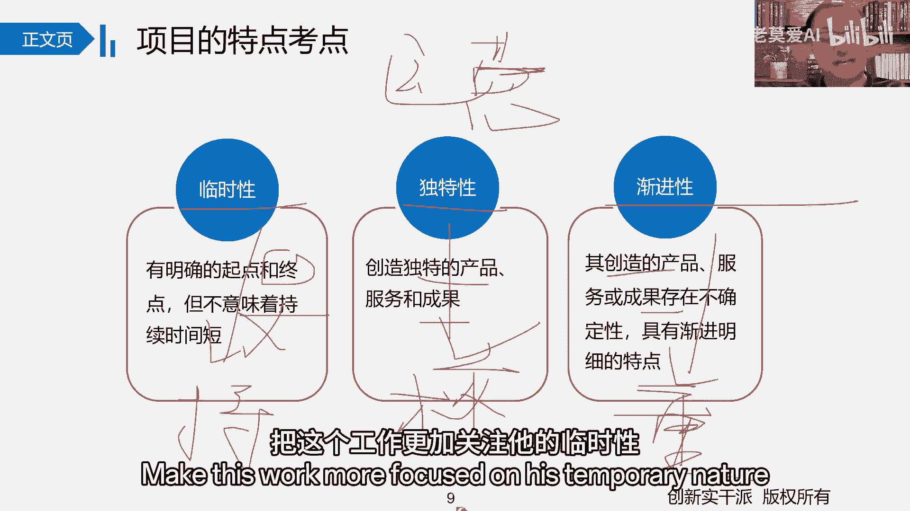

多多性渐进性，他就是一个项目，如果你愿意更加关注什么持续性重复性标准化，他就是个什么，把他们运营来做就好了，按用来做就好，用来做就好好吧，所以呢谈谈运营，谈到项目的一个基本的特点里面。

我们说做项目过程中，我们要受到相关的制约因素的一个影响，那同时呢基于这些基本的制约因素，已经奠定了我什么，奠定了我们定义我们项目的什么成功的标准，之前我们项目成功了什么，按成本之内，按时间内。

按质量内把这个事儿干完了，这叫什么，这叫项目就成功了，但是现在已经不说这个事，现在我们叫什么，什么叫成功了，在既定的制约因素下，让干行人达成了什么，达成满意，我们叫什么叫成功。

在今天的支援因素更多指的是六个范围，进度成本质量，谁来做一个什么资源，这是正常的，以及你考虑风险的异常的情况，如何让干行人相关方进行什么，进行满意的这么一个什么基本节点，我们叫什么项目成功。

而同时你也就是说我们在项目管理中，你不断的要做什么做平衡。

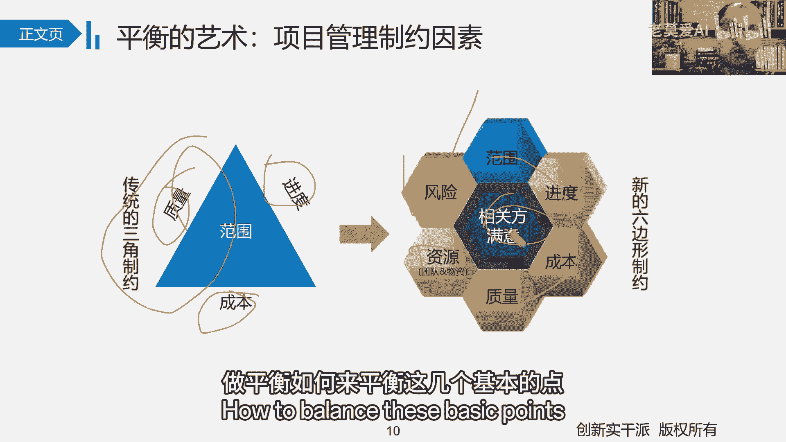

如何来平衡这几个基本的点，这也是我们需要考虑一个问题啊，这也是我们需要考虑一个问题，好那我们来我们来说这个项目，我们刚才都说了，基于共同点，我们不需要看了，主要只要他是工作，都是由人来做的，都要受限。

资源都要按照规划执行，这是管理基本点来对，关键是要什么观察它不同不同点是吧，临时性与多临时性与持续性，独特性与它的一个什么重复性，渐进明细与它的一个什么一个标准化，不需要简简明写，差不多的一个点。

与这样的一些基本点对应起来了，这就是我们工作的不同的两种方式而已。

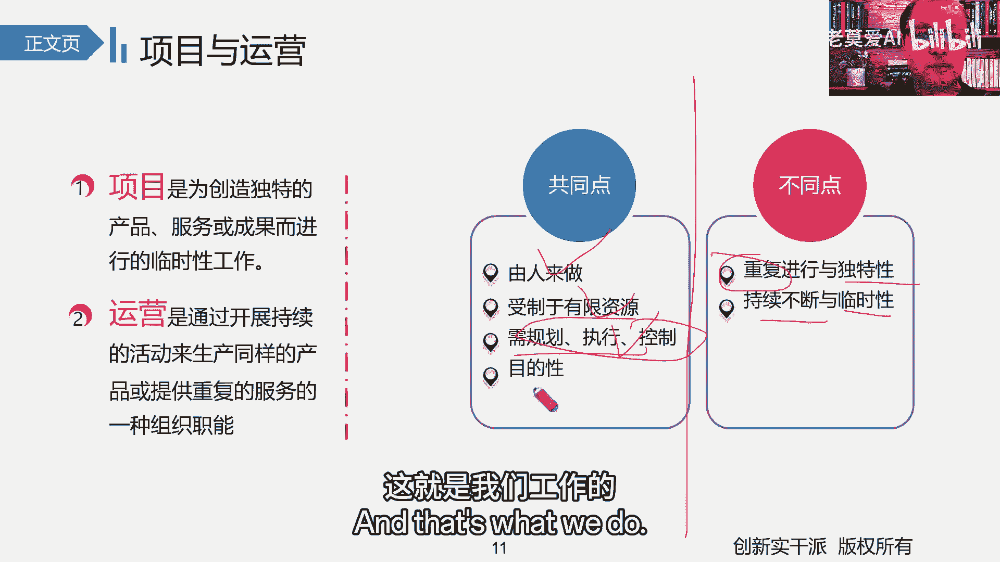

那工作不同的两种方式而已，好了，那接下来呢刚才我们聊的都是单项目，那单项目进行什么进行落地的，而落地的不仅有单项目，还有什么，还有我们讲的运营嘛，也就是说从公司的战略出发，从公司顶端的战略出发。

从公司顶端的战略出发，前面是什么怨你价值观以及公司的战略目标，给我们定好了一个项目，未来几年攻击的一个打的一个方向，然后军中落地靠什么落地，最终落地就是靠每一个单项目落地，如果有必要的话。

把项目再交付给运营，让它进行落运营，我们进行什么进行落地，进行价值的一个什么一个获取，进行价值的一一个获取，所以在这里很多人就会问到我们，很多公司也在谈，公司一共有三大三大基本点，三大方向，一个叫什么。

一个叫战略，一个叫什么，一个叫项目，一个叫什么，一个叫运营，一个叫运营啊，就这样一个基本点啊，就这样一个人，那接下来我们聊的什么，聊的是项目组合，聊的项目及这两个点啊，我们现在学完了。

你可以从项目的角度对他进行理解，什么叫从项目角度讲，我们更多以为他是什么，是阶段性，为什么呢，因为最终靠每一个单项目落地，进行什么跟运给跟运营来落地公司的理想，那我们这个项目是怎么来的呀。

他一定是隶属于某一个项目或者某一个项目集，或者它有三种形态吗，或者就是自己单单项目，那你公司如果就一个项目，那就是单项目，那你说公司如果有多个项目，那怎么办呢，那这个时候我们要注意。

你们公司如果有多个项目，你会发现一个什么问题，毕竟你们公司叫什么叫资源有限，毕竟B资源有限，咱不是说的是你们公司，应该说咱们现在处的这个环境里面，叫什么都要资源有限，所以你先做什么，不先做什么。

你取得什么，我们后面做商业论证的那些什么啊，成本效益比啊，你得有个优先取舍吧，你得给优先取舍吧，我们怎么样投资最小的收益，最高的成本效益比对吧，这就是我们进行一个什么优先取舍，因为咱们公司里面仍然有限。

资金有限，那环境还有那么多的制约因素在制约着你，很多人因在制约着你，你如何把他们做的更好，这就是你想的一个什么，你想的基本的空间，你想的基本，所以走项目组合管理管什么，其实就是串糖葫芦。

说白了就是串糖葫芦，串个糖葫芦，谁第一谁第二谁第三，谁第四谁第五，为什么，因为我资源有限，我不可能一股脑的全扑到一个项目上啊，不可能一股脑的把这个项目全做了，那你到时候试下什么都做不好。

那我们还有优先级顺序好了，这是纵向的优先级顺序，那好了，横向来说呢，我们突然发现在纵向过程中，有几个项目如果放在一起做，能够得到一个什么更大的一个价值，所以我们的叫什么叫项目集，所以项目集更多是什么。

我们可以理解成它从一个什么，它从一个横向进行出发，把它串联在一起，对它进行整体的一个优化的一个基本点，他能达到一个什么更多的价值，所以我们叫什么，叫起到一个什么1+1大于二的这么一个什么。

这么一个基本的价值啊，这么一个基本最终落地，我们单个项目进行落地嘛，那进行落地，所以这就是这么一个点，所以说它的整体方式是什么，在战略目标，战略方向的一个指导下，我们在这个指导下，我们才做项目组合管理。

对项目优先级进行什么相对应的排序啊，排序排序之后呢，基于公司的一个某些具体的一些特性，比如说你们行业的特性，比如说你们专业的特性，或者你们公司就这样，你认为哪些项目放在一起，能够取得什么更大的价值。

那你把它放一起，以项目进行落地，就能把它转移到什么，转交给运营，这是我们讲的一个基本的逻辑，而这个基本的逻辑是什么，这个基本的逻辑就是什么叫组织级项目管理，就叫组织及项目管理，它就是一个什它是一个组织。

项目管理是一个是一个基本的框架，简单来说，在战略项在战略方向的指导下，你如何来确定项目组合的什么优先顺序，在项目组合的优先数据确定好了之后，你如何来把某些你认为更好的一些基本的点，放在一起，做什么。

做项目集，做项目集，这就是什么战略成熟度的一个基本的安排，所以这叫什么，这叫组织及项目管理，好想到这我们都知道在咱们整体的思路里面，大家对这这块一个了解做一个基本的了解，就可这块考试就不咋考了啊。

因为考试已经明确说这块考试就不咋考了，大家在这块知道明白理解一下，有这么个东西，对应以咱们公司的一些基本的项目。

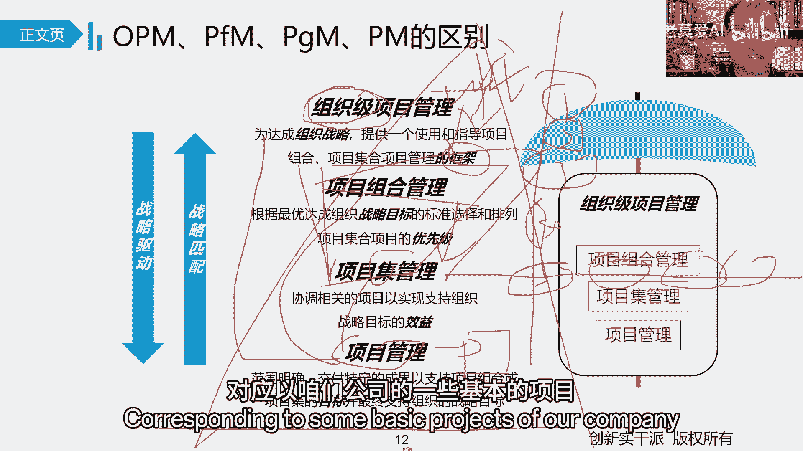

你得知道有这么回事就行了，好吧啊好了，那讲完项目的基本的因素之后，我们来聊聊我们的项目管理，到底管哪些具体内容，项目管理怎么管啊，项目管理怎么，那项目管理怎么管，我们说项目管理怎么管，按阶段进行管理。

怎么管，启动规划执行监控，执行监控收尾，按管理基本职能来管管什么内容，管这十大知识领域的，这么一个什么基本的一个内容啊，基本内容，所以呢它是时间维度。

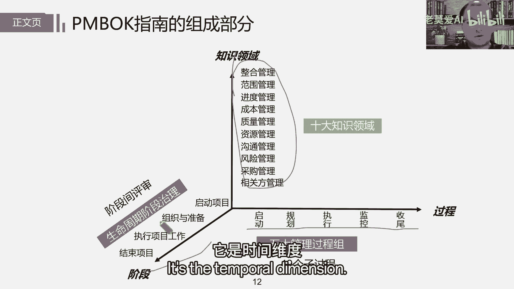

它是管理职能维度，它是什么内容维度，它的内容为它的内容三个维度吧，那我们先来聊生命周期，那生命周期，生命周期我们从时间角，时间维度对它进行什么划，分成不同的时间段进行管理，那为什么划分成不同的时间段呢。

那是因为什么，管理上本身有句话叫什么，我们叫以大化小，这叫什么复杂的问题，什么简单化，这才能叫什么以大化小，以大化小，我们只管这一段时间的事情，你看这一段时间在阶段末，有个叫什么叫阶段关卡。

或者叫什么叫阶段关口，或者叫阶段门对吧，那它的核心是什么，就是做什么，我们现在学完管理职能了，回过头来看他什么，他就是做监控项目的实际绩效，跟项目前期的一些基本文件，这不就是计划文件吗，做对比。

如果你好了，我们下一阶段，如果你有问题改正给我，下一阶段，如果你实在不行，结束或者说停留在本阶段，或者说怎么在什么进行一个改进，这不就是我们讲的什么控制措施吗，这不就是我们监督措施吗。

他们两个加在一起不就是监控吗，他们两个加在一起不就是监控吗，这是监督监督措施吗，这是控制措施，他们俩加一起不就是我们讲的什么监控吗，那这个时候我们我们生命周期，他的监控的核心不就是比我们那个叫什么。

不就是比我们正常正常，你要是讲的如果没有这个监控，你如果没没没有这个监控，你一股脑的只做到最后的，那到时候会什么一股脑的做到最后了，那到时候你这拿出东西万一不一样，就那这事不就大了吗，那不行。

所以阶段性的监控，我们阶段性的什么进行，把它进行一个监督和控制，及时的进行什么，及时进行调整，这核心的标准就是什么，我们讲复杂的事情简单化，Buff杂事情简单化，其实后面我们讲了一个什么。

后面我还讲了WBS，就是项目管理的这些基本工具，从很多意义上来讲，都是怎么样把这个复杂的事情怎么样拆解的，更简单一点，包括我们后面讲的是什么，到时候会讲到范围。

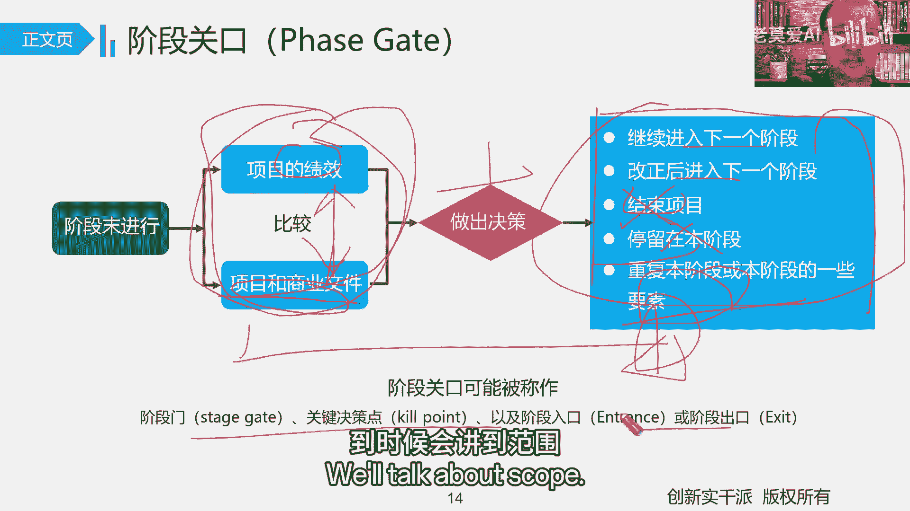

WBS也是一样，也一样好，他的应该基本是从启动到社会的一系列，什么阶段啊，一系列阶段阶段就是什么时间阶段嘛，项目经历过程中的一些基本的过程，那不就时间阶段了，有顺序的交易类迭代的什么阶段，名称和数量。

对这个自己取就行了，自己取用什么方法划分呢，其实这个没有固定的方法，没有固定的方法，所以这个跟这个对我们来讲，没有什么特别的意义，反正都是作用，这文明同类也是他给我们项目提供了基本框架。

帮助我们更加有利的什么控制项目，那当然了，像我们刚才阶段宽口一样，阶段关卡一样，你是两年控制一个项目合适，还是一个月控制一次，一个月控制一个月更合适呢，肯定是按月用分的方式更合适。

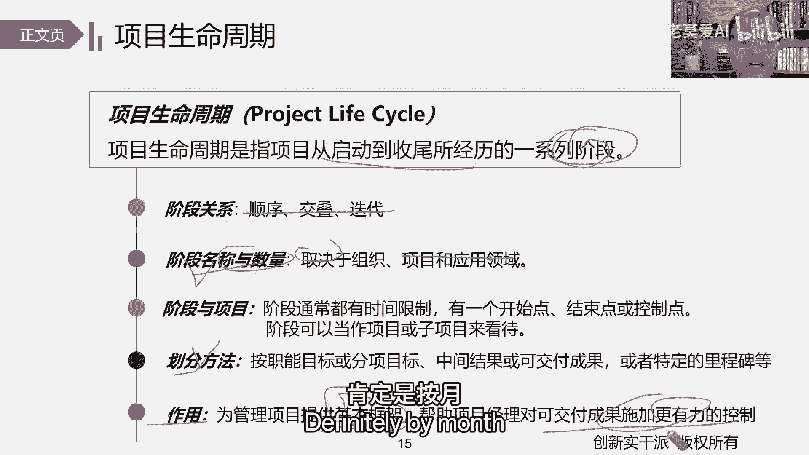

但更合适啊，但是呢在这个生命周期中间呢，我们就把它划分成不同的阶段是吧，那个叫项目生命周期，现在又来一个什么叫开发生命周期，开发生命周期你也可以加来道，叫什么叫开发阶段的生命周期，就开发阶段的生命周期。

因为这个前提是什么，这个前提就是说在整体的生命周期，各个阶段过程中，可能有那么一到两个阶段是用来干什么，就是从0~1的过程是一个什么，负责开发的过程，我们把负责开发这个过程叫什么，就叫这个阶段。

他所处的这个过程就叫什么，就叫开发的生命周期，那就叫开发的生命周期，那我们说开发的生命周期有几种，有几种，我们说预测型啊，迭代型，增量型，适应型，还有什么叫混合型，所以说我们说开发生命周期有五种。

基本的一个开发的方式跟方法，什么周期，但是我们项目的生命周期只有几种，只有三种，一种叫预测型，一种叫适应性，还有一种叫什么叫混合型，所以角度从我们学的角度，我们也可以把这个叫什么。

把这个迭代型或者增量型，直接就把它叫什么，就叫适应型，把它叫小适应性知识，只是方便我们学，因为在用的时候大家也不这么，大家也不这么叫了，就直接增量，直接迭代就完了啊，只是方便我们学的时候。

你得知道迭代性和增量型，你可以把它叫什么，叫小的适应性，方便大家做题的时候啊。

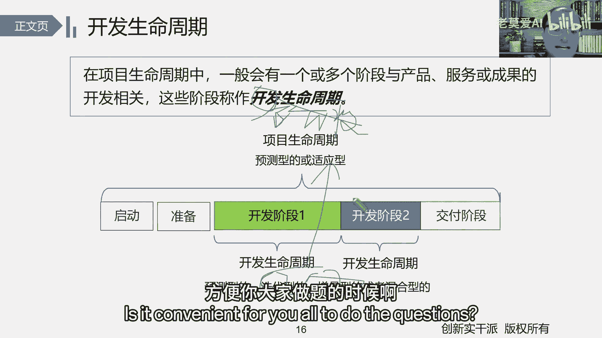

知道这么一个点，所以呢针对这四种，因为五种预测型加敏捷型就属于什么，就属于混合型，所以混合型没什么特别讲，没什么特别讲，所以我一般就讲我们四种，那它的一个基本的变化方式啊，它的一个基本方法。

一个是从需求角度来说，一个求稳定，一个求变化，一个求稳定，一个是一个从什么，从交付角度来说，一个求一次性或者整块交付，一个讲更多的机会交付，因为更多的机会交付能给客户提供什么，不断的提供价值的分化。

不断提供价值的反馈，好吧，那关于变更呢，一个为了求稳，所以他尽量限制变更，那一个呢如果有变更，我们尽可能的去什么满足你，尽可能去什么融入你，因为我需要变更为你客户提供什么提供价值。

需要变更为你客户提供市场竞争力好，那相关方的参与，因为我们按阶段走了，需求都很清楚，一般都是在关键的里程碑。

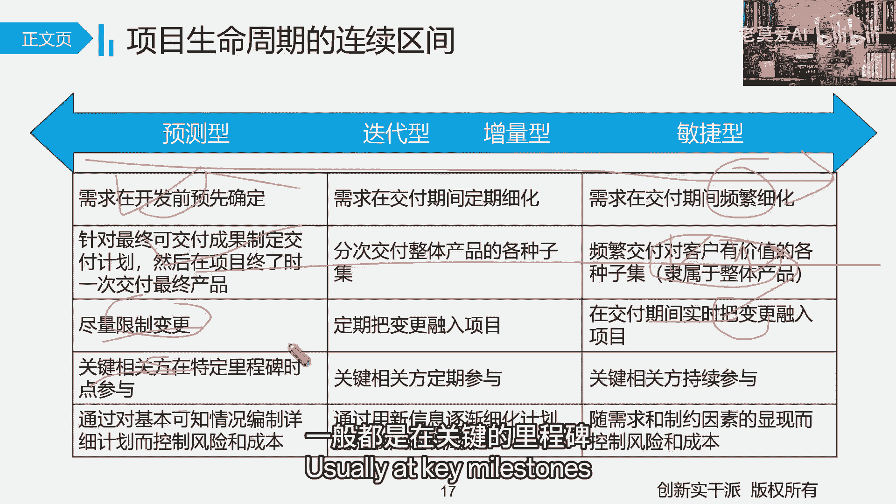

关键的节点参与类型呢，我们需要大家什么随时都能参与，方便我们对需求进行什么及时的探讨，方便我们达成什么一致的意见，但机制的意见就这样的一个基本点对，那关于风险跟关于风险和相关的成本呢。

因为我们之前都弄的比较稳定了，没什么特殊变化，所以他一般叫闭口相对比较稳定的，那这结型呢那面临什么风险，其实有的时候需求都不清，所以风险根本就不行小，而成本呢我们后面学完采购，大家都知道。

一般它采用什么，采用开口合同，它一般采用开口合同，你做什么，我给你报呃，具体合同有多少价，只要你正常做事，好像没有一个特定的一个价格好。

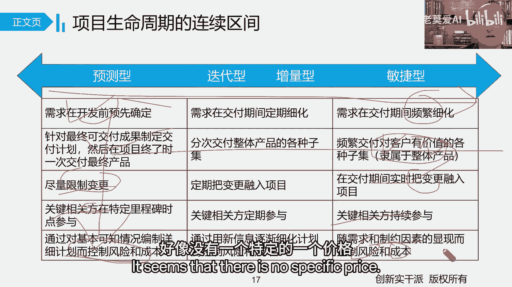

大家注意一下这些就好好，你看这两个直基本的对应，其实在我们刚刚那张表上，给大家也做了一个简单的对应，因为刚刚那张表更多是关于开发生命周期的，现在这个就关于什么项目的生命周期，实际上跟他来讲是一样的。

预测型我们都知道叫什么叫瀑布型，叫预测型，叫计划性，核心就是什么需求比较明确，我们按照计划一步一步什么一步一步的做，所以他的一步一步可能就比较长一点，计算机步一步比较长一点，那适应性的。

因为需求比较变化，我们为了不断的给客户交付价值，可能我们范围啊，需求和变化相对于比较N两波一样，可能变化的就比较多一点，客户变化率比较多一点啊，变化比较那交付的也相对比较多一点。

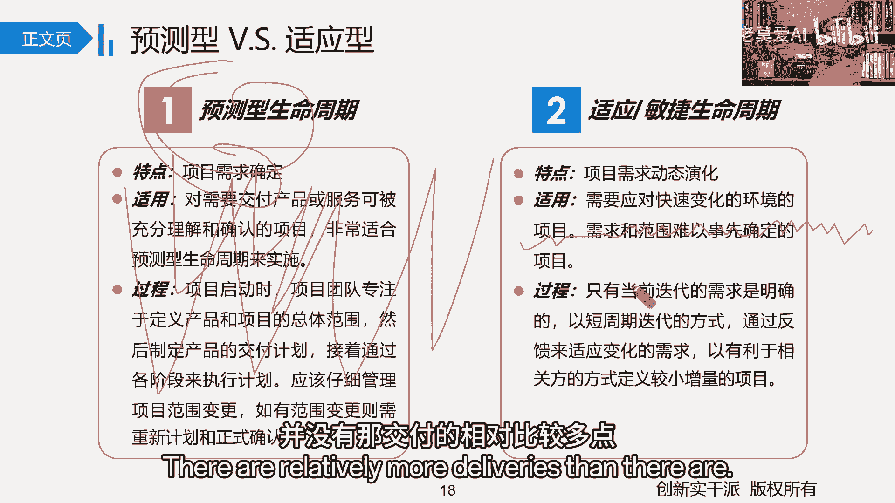

同时也能更好的为客户提供什么，提供相对应的价值，也能更好的给客户提供相对应的价值。

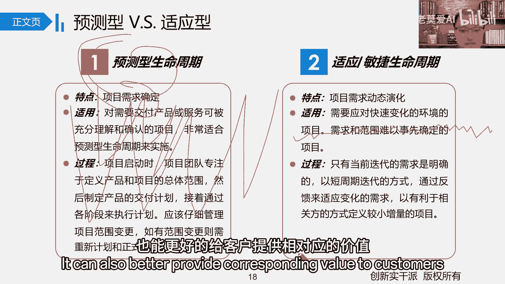

就这样一个一个基本点好了，那我们再聊聊项目生命周期的，它的一个一个什么基本的一个特点，主要针对这四个方向，一个是投入，投入我们都知道什么，这个叫什么，叫哪个阶段最高呢，是执行阶段，我们是最最高的。

您刚开始在做执行阶段，最高到收尾阶段就比较下降了，变形象了好吧，相关方面作用和影响，刚开始刚开的最高嘛，为什么，因为他毕竟是干系人，刚开始什么都不知道，你也不知道，我也不知道，那有的想法大家都需要什么。

刚开始最高，但是为什么我们要渐进明细，越推它越明，它越明朗，越推它越明朗，所以他就比较什么，越到后面就越来越低了，同时对应的什么，前面的不确定性肯定是前面什么跟他一样，不知道的越多。

所以不确定性干什么就越多嘛，所以它相当于什么越高，那到后面渐进明细，越来越干什么，越来越越明朗，越来越感觉这细化，那就越来越细化，越来越细化，而风险的影响和变更的影响，刚开始最低，为什么刚开始最低呢。

刚开始你啥都没做，或者你只做了一点点，更多是变更一下文件，变更一下记录比较少，那到后面怎么就比较多，所以呢你看就成本角度来说，我们刚开始比较低，只是就变化角度来说，刚开始比较多。

所以这就意味着对我们项目管理角度来说嘛，如果你能尽可能早的投入项目管理，因为你刚刚找的时候，虽然事儿比较多，比较乱，但是这成本比较低，你只轮得上，但是同样的随着我们间接明细。

如果你前期可以搞得定稳定一下，那后面间接明细就更加什么更加的明朗，那你前期稳定一下，后面这个这个这个叫什么，相关的成本代价也是不是越来越少，所以指的什么，我们如果能够前期更更早。

更快的投入相关的经营管理，那么获得可能性更大，同时我们的损失更小一点啊，同时我们的损失也更小，这是我们讲的项目生命周期。

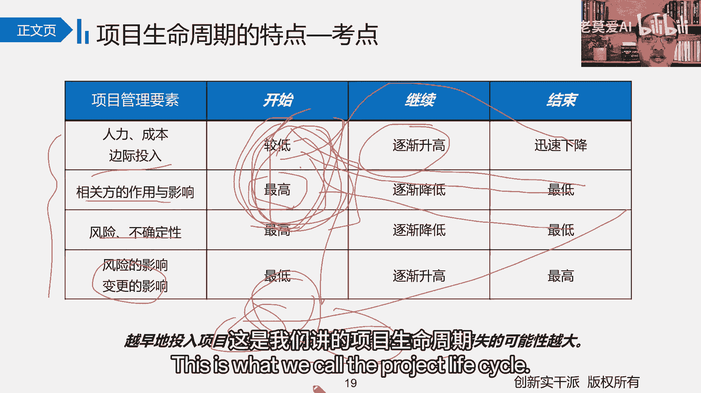

它的一个基本的特点，那项目生命周期我们讲了项目周期的阶段，关卡，讲了阶段的基本特征，它的一个基本的划分，它是从时间维度进行什么进行分割的好，那接下来我们聊聊聊聊什么呢，聊聊从管理的职能这个维度。

对它进行什么进行划分，那从管理职能维度，我们进行范围叫什么，其实从管理上来讲，我们叫什么，很多人学过管理，这什么管理就是什么，管理就是走这就是什么规划组织协调指导控制，有能力质量，那换句话说管理。

因为我们没办法管什么，没办法管执行，实际上我们管理更多是什么，就是做好计划，协调好人去执行，在做什么，在做监控，所以管理我们讲的什么，讲了讲的规划，规划，执行和监控，这三个基本的一个什么基本的职能啊。

这三个基本的职能，但站在我们的角度，我们讲项目管理为什么是五个过程呢，第一个我们加了一个启动，加了一个收尾，那我们就看启动和收尾，启动的核心是什么，名正言顺，人鬼佛神，那它的核心与我们项目是什么。

项目是临时的，所以它要有一个什么，你既然是临时的权利，是临时的，团队是临时的，项目的需求是临时的，这不是项目，甚至项目的干写的也是什么，也是临时的，那怎么办，我们在开启阶段就要把授权这个事。

项目的这个事相关的干系人达成什么，达成一个一致意见，所以我们为什么要正式启动，就像我们第四章智能项目章程一样，核心点是什么，第一个项目经理授权，第二个就是项目真实说明。

第三个就是把所有的基本点干什么达成一致，这是我们的一个核心嘛，这种嘛那中间三块呢能管理基本职能规划，做计划执行就是去干活，监控就是审视篇章，关键还有最后一个叫什么叫收尾，那为什么要收尾呢。

他这个项目比我们什么不比我们运营，那运营很多时候可能没没没收尾，过了就过了，因为差不多，但是项目的我们更多关注什么临时性，独特性和什么和渐进明细，也就是说项目跟项目本质上它是不一样的，既然是不一样的。

我们不能重复的干什么，不能重复的造轮子，所以我们该什么一定要有一个收尾过程，收尾过程核心就两个点了，一方面是把可交付成果转移出去，看你活干完没有，关键是第二方面，那是对外，关键是对内。

对内是我们学到了什么东西，我们掌握到了什么样的一些东西，这才是我们的核心啊，对啊这个才是我们的核心啊，所以对应的点就在这，那有了这些基本的经验教训之后，接下来我们不是可以干很多事吗，很多的经验教训项目。

最终的总结经验还是在收尾这里，虽然说我们在过程中间，不断的进行什么经验教训的升级，但是在数位这里，这是一个什么大的经验教训的一个什么背景，我们在不是在学第二章的时候，一块不是讲组织过程，资产环境上。

实验环境因素，你知道随时都存在，可是组织过程资产呢，如果你没有。

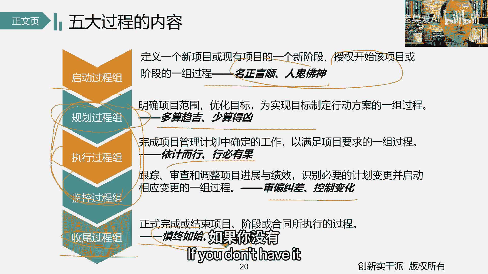

那你没有，你就没人帮你，那你就没人帮你，这就很麻烦好，那我们说我们是启动规划执行监控和收回，这里我们要有个点叫什么叫客服线性思维，这个点说的啥意思，指的是我们就像我们第三章讲了嘛，讲的是线。

第三章一会也讲讲了嘛，讲的是项目的，什么是整合，整合不仅包含了时间呀，管理职能维度啊，知识领域维度啊，不仅包含这么多，所以我们在启动阶段，规划阶段执行监管的时候，它并不是按照时间顺序直接来的。

我刚开始开篇就给大家讲了，他并不是按照时间顺序这么启动，完了才做规划，规划完了才得执行，执行完了做监控，监控完了就说并不是，比如说你在执行一个过程中发现你需要采购，执行过程中发现你有个料。

你们自己确实没有需要采购，这个时候才发现，或者说你这个料自己不合格，用完了，总之这个不是发现，那你说需要做采购的规划，采购规划完了才做什么，才做执行，再做监控，他是这样一个什么，可能是循环。

也可能是迭代，他的一个各种不同的一个什么，一个基本的一个组合在啊，他各种的一个一个基本的一个组合在，所以这个要特别注意一下，它并不是一个线性的一个基本作用啊，但是我们学习的时候，我刚才拍片也给大家讲。

没办法，那个线性呢我们是体现不出来的，就说我们用嘴巴讲，用书上写是体现不出来它是如何不是线性的，只能说它不是线性，但是我们分不出它到底为什么，它到底是怎么样，不是线性的一种什么方式。

就像我们书上说的什么，会有一种我们不可认知的一种方式。

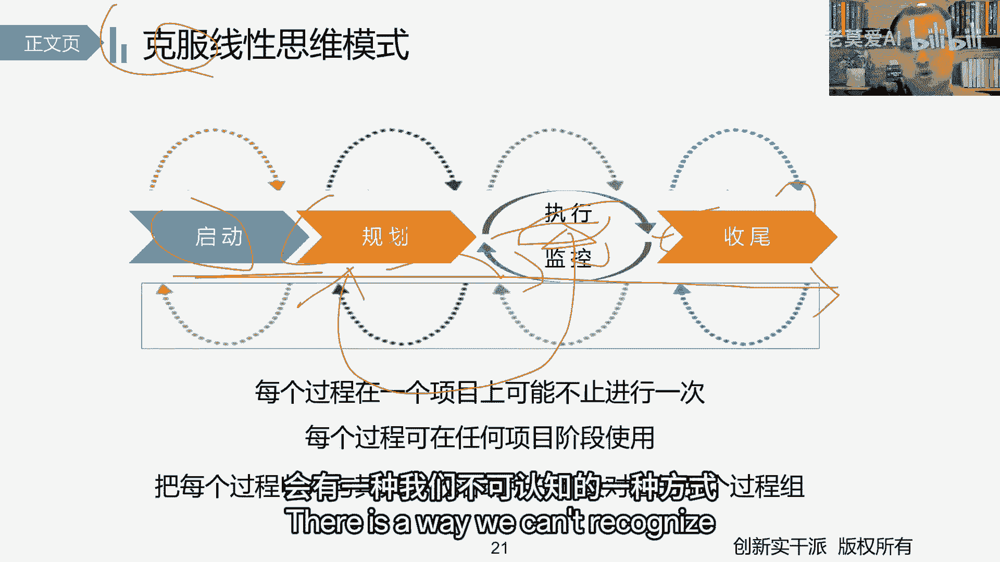

进行什么进行一个整合，就这样一个基本点好，那接下来我们看管理职能来管，按时间来管，管什么呢，管这十大知识什么，管这十大知识领域，十大知识领域做什么，什么时候做，给多少钱，花多少钱，做，做到什么程度。

接下来什么用什么资源做，内部资源叫资源管理，外部叫什么，外部叫采购，基本的一个管理，那这是我们达成项目的一些基本点，达成项目这些基本点，那在做的过程中不可避免，你要学会沟沟通。

我们作为什么达成项目的润滑剂，你跟谁沟通，不就要跟肝写人搞好关系，跟肝写人更多什么进行沟通吗，进行沟通好，这个我们讲了八大知识领域，是我们如何做事，怎么沟通，作为润滑剂。

那这个时候我们正常情况下还有什么，万一也就是说万一出现异常情况，我们怎么办，所以万一有哪些风险，万一有哪些风险，这是什么，这是我们讲的风险好，这是我们讲的项目管理，什么九大知识领域。

我们讲什么叫九大知识领域，而这九大知识领域本身呢，做项目管理按什么来的，按整合来的，就像我们现在把整个学完了，你不看到了吗，动启动啥呢，启动其实跟这个有啥关系啊，启动跟这些都没关系。

跟这些唯一有关系就是启动的时候，我大概需要知道做什么，大概是我的里程碑什么样，大概知道你给我的预算是多少，大概知道他他的成功标准或失败标准，以及审计技术标准什么样，大概知道我关键的干细人有哪些。

大概知道你能给我的团队有哪些，大概知道有些大概知道，以及大概知道主要的风险有哪些，这就指的什么，这就是我们讲从从大概的角度，相对比较宏观的角度来指导，计划阶段，就是做这些相关的什么整合相关的所有的计划。

那执行阶段呢就是按照这里面计划做的去，技术路线，具体是执行，那监控阶段呢就是该监督嘛，如果出现大的偏差了，我们及时把他拉回来，这叫什么，这叫控制，这要控制以及最终的什么。

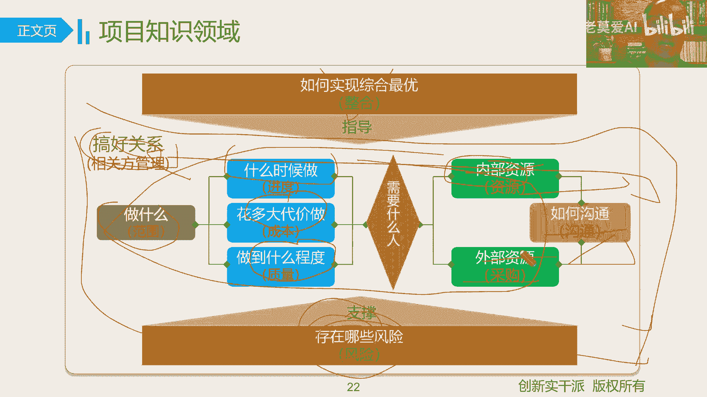

最终的我们讲收尾讲话，收尾好吧，我们就干这些事好，这两个它们之间的差别好了，讲到差别，现在我们学完了，你得知道吧，一个的他们两个纬度都不一样，一个从时间维度，一个什么管理维度管理只能维度。

所以时间角度注意要我们讲项目管理，很多人把项目管理会以为会认为什么，认为时间管理或者叫什么，或者叫进度管理，为什么，因为在这么一个面上，我们只有一个维度可以进行整体的衡量，叫什么叫时间。

因为在这个维度上，我们只有这一个维度可以进行整体衡量，叫时间，你比如说我们做事情，什么叫做事情，我们怎么做，做项目，做这么多事，在什么时间点由谁花，用什么资源做了什么事，把它做成什么样子，对不对。

就这样，这不就是什么由谁不就是资源吗，用什么资源也是资源，采购是它的一种方式，等你用资源就花了多少钱，在什么时间点上不是进度吗，做成什么样子不就是什么就是质量吗，做什么不就是范围吗，做什么目标范围吗。

那沟通跟肝闲人管理，那那那只是我们讲的润滑剂，以及我们还说到涉及到什么相关的风险，那这是我们要把所有的思路，把我们项目说的都以时间这个维度啊，对它进行整体的进行一个什么考量。

因为只有时间这个维度可以考量，你到后面我们学对我们学什么，学进度计划，时间维度，学成本计划，你看是不是也是按按时间维度进进进行区分的，按时间维度进行一个整体区分的。

那么管理维度是从管理职能的角度进行区分的，所以你跟时间有关系吗，没有关系，那任何时间上时间阶段你都要干什么，都要按照管理维度进行去管理，所以我们叫什么，每一个阶段可以视为一个什么，是一个小项目。

既然每个阶段可以输一个小项目，所以我们每个阶段都可以做什么都需要做对，也都说都需要做管理的启动规划，执行监控和收尾，监控和收尾，所以他们两个的区别，他们两个核心的区别，你只要理解到一个从时间维度。

因为它管理维度不一样就行了，所以底下的这些区别，我们就方便大家去么二进行理解，好吧啊，所以你看如何干，如果干也是从时间维度，它应该什么往回推嘛，那如果管就不是时间维度。

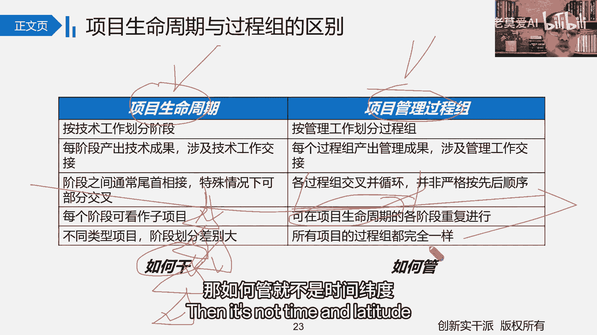

就不是时间维度好，那讲完这些基本的项目的基本知识体系之后，我们再聊聊什么项目的数据和项目的信息，那为什么要我们聊到项目的数据和项目的信息，因为我们需要监控项目，我们需要兼顾项目。

知道项目当前的一个基本状态，那你需要当前基本状态，你拿什么来知道了，就拿项目相关的什么数据，拿项目相关的信息，拿你们给我汇报的相关的什么资料，我才知道我们项目目前的一个基本状况。

这那知道项目基本状况谁知道呢，干系人知道，干系人知道项目的基本状况的目的是什么，他对我们项目做什么，方便他对我们项目什么引起关注，帮助我们解决问题，帮助我们讨论一些制定一些基本的一些决策，去方便他们。

帮助我们干什么，做这样一些基本的事情哎，就方便他们，他们帮我们做这样的一些基本数据好，那我们来看一下我们这个数据的一条流线好，我们把数据分成什么，注意哦，我们把数据分成什么三种数据，一个叫数据。

一个叫信息，一个叫报告，这个三种数据究其本质，它不都是数据吗，只是它里面的载体不一样，涵盖的东西不一样，所以我们来给它赋予什么不同的名字，数据数据就叫数据，我们把它叫什么叫原始数据，信息呢叫比对信息。

数据叫原始数据，你做什么就是什么，我们叫什么叫原始数据，信息呢叫比对，信息报告呢叫什么，叫汇总报告，汇总报告，你这下就把三个都分析出来，有的人说那里面写的不都是数据吗，是啊哼，但是它代表的意义不一样。

原始数据你做的什么地方，就这种，比如说你今天花了100块，这叫什么，这叫原始数据，这是客观的，这叫原始数据，那什么叫信息呢，信息叫什么叫比对信息，也就是说信息自己会出来吧，不好意思，不会出来。

注意要一定在这分阶段看，信息不会自己出来，我们干什么叫比对信息，也就是说必须经过什么经过比对才能得出信息，所以这叫什么，这叫每一个什么，每一个控制过程组，它经过比对之后才能得出信息，那后面叫什么。

叫汇总报告，就是把刚才我们比对出来的所有的信息，进行一个整体的什么打包汇总，分析前因后果关系，得到什么，得到一个报告，所以这个报告是什么，报告还是信息，这个报告还是信息，只是信息的一个什么一个汇总。

那比对出来得出的信息呢，其实也是拿数据来的，大家一定要理清他们之间的什么逻辑关系啊。

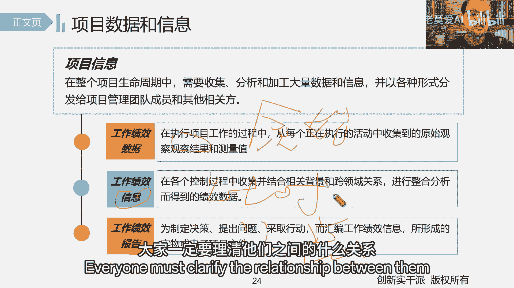

理他们之间的，所以我们数据是在执行过程数据的，而信息的比对信息是从控制过程中比对而来的，最终把控制过程进行整体的一个什么汇总，得到4。6，要加到4。5，监控项目工作汇总得的是什么。

汇总的工作绩效报告我们能拿来拿来干什么，引起关注，解决问题啊，帮忙制定相关的什么对策。

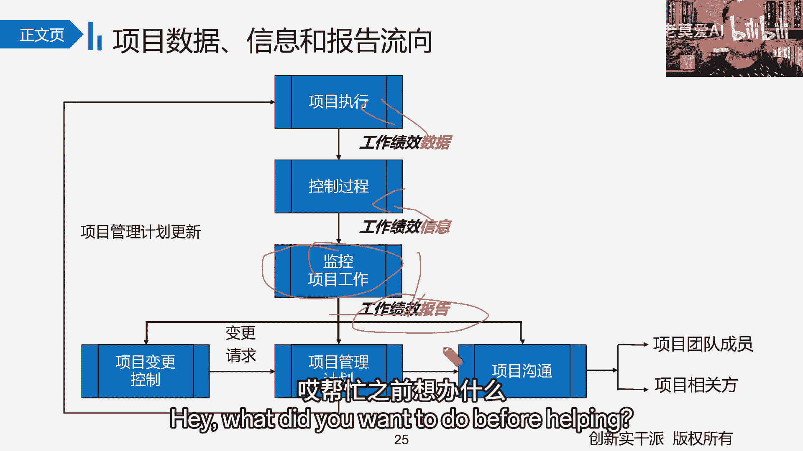

仅此而已，好吧啊好，那接下来我们聊聊最后一个话题，这叫什么，这叫项目管理商业文件，在项目启动之前啊，我们是项目，项目的核心，一定是为了解决某一个具体问题，它而产生的，一定是为了解决某一个具体问题而生。

那这个时候解决具体问题，我们在前期你就得知道这个东西到底能不能干，能不能解决，解决的情况怎么样，也就是就像我们经常讲的，可行性做的到底怎么样，原因道理在做的道理嘛，所以我们前期讲什么。

讲做了相关的什么商业论证，哎，这个商业论证呢，在我们书上讲义里面是这样来的，叫什么叫经济性，经济可行性论证，那很多人就会问，在我们公司，我们除了经济性，还有技术可行性论证等等等，对。

但是你得知道我们学的什么，学的是普遍认可的良好实践，对于任何公司来说，他可以不论证技术，但他绝对要论证什么论证能不能赚钱，他绝对要论证什么论证能不能挣钱了，因为公司我们本来是什么经营的。

本质就是我们获取相关的什么利润嘛，那就去获取相关的利润好，那我们通过商前面的商业论证论证，看它可行性到底行不行，如果行了，我们通过效益管理计划啊，怎么管，我接下来通过项目能够获得相关的什么效益。

怎么测量，由谁来负责，但跟战争的一致性不一样，基于这两个可行性分析，我们把它做什么，把它作为商业项目章程的一个什么，一个主要输入，那就是项目的目的目标，以及我能挣多少钱。

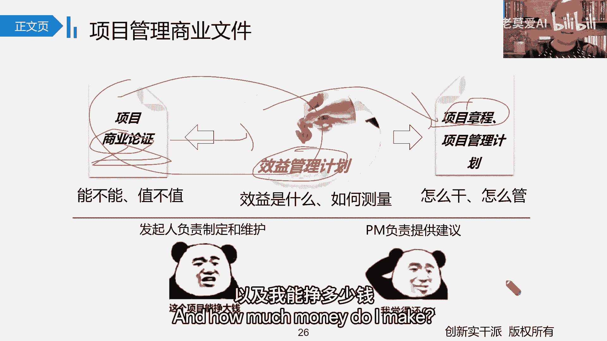

这些都作为什么，都作为主要的一个基本输入啊，都做一个主要的一个基本输入，所以项目课程呢指的什么经济可行性论证报告，它指的是经济可行性论证报告。

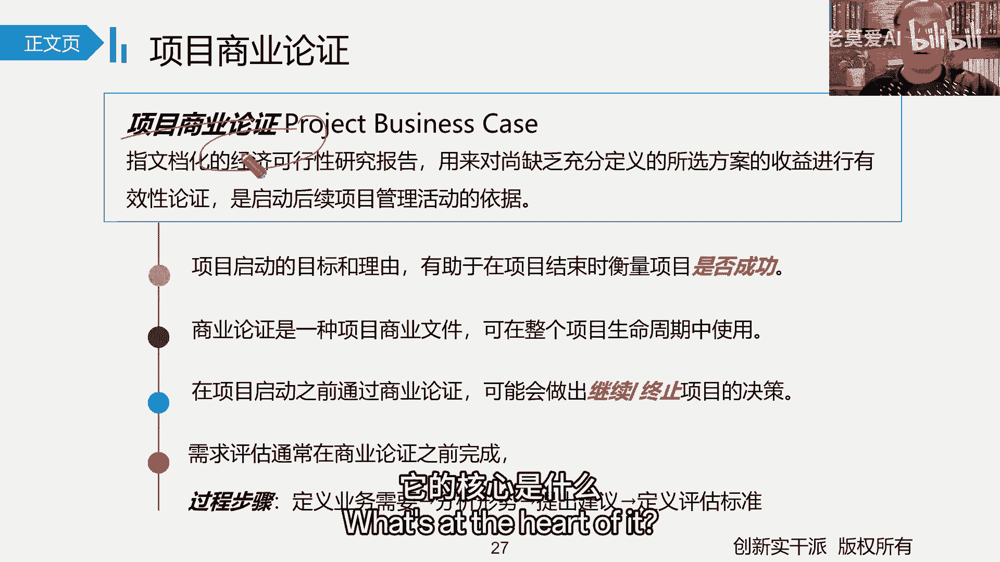