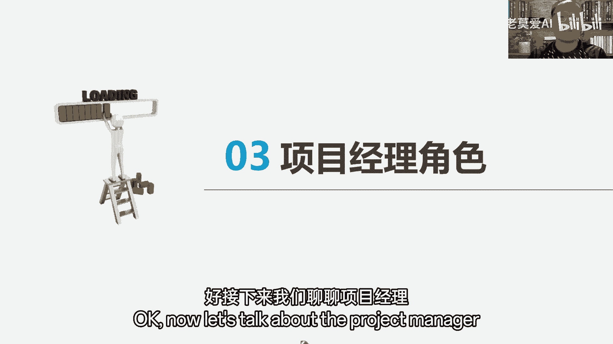
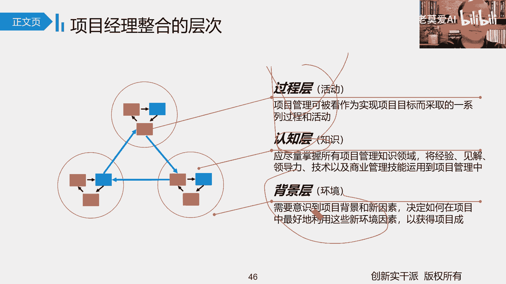

# 【最好的PMP课程】PMBOK6精华讲解1-3 - P1 - 老莫爱AI - BV1oZ421K7fm

它的基本步骤就这样啊，第一步评估业务需要，就是你真正需要的到底是什么，第二步分析形式就是你基于你现在的需要，分析当下的分析你现在的现状，以及你期望达到了，达到那个高度来解决你这个问题，好。

接下来第三步提出意见，现在有差距了，有差距之后，接下来你提出意见，提出方案，怎么样弥补这个差距，怎么样解决这个差距，这叫什么，这叫提出意见，第四步把你这个意见可行性分析之后，进行什么进行量化。

你到底能解决这个问题，解决到什么程度啊，解决到什么程度，把它进行一个什么基本的量化，所以商业可行性论证就是经济性的。

什么可行性论证报告肯定论证，那效益的管理计划是什么，就是管理效益计划，管理效益好了，我们学完第四章了，在这个在什么在管制定项目计划那一栏，我们都应该知道，现在我们的计划不是分成了两头嘛。

简单把它分成两头，意图是我们实体性计划，也就是说从技术角度，它真正应该落地的计划，比如说我们讲范围基准进度计，准成本基准质量标准，这是你真正需要落地的地方啊，你要你做完了就是按照范围计划来的。

你做完了时间做完了就按照进度计划来的，你钱花完了就是按成本计划来的，你质量做好了就按照质量标准计划来的，这是你具体你能落地的一些点，还有一类计划叫什么叫某某管理计划。

哎你听了管理带着管理两个词就说明什么，他什么他是从管理上，我怎么来啊，所以呢我们本身我们在做活动，我们分成两条路线，一直来走，一条是技术实达成路线，一条是什么，一条是管理路线。

管理的核心就是确保技术怎么样能够实现，实现了什么绩效，做的什么样能够更好一点，那怎么样能够更好一点，这是他的一个什么基本的核心动作，而这是他一个基本的，所以碰到管理路线就是什么，就怎么管。

项目的效率怎么管，所以碰到范围计划，那些实体的计划就是怎么做，怎么做，什么做什么，而这个是什么怎么管，这是什么管两个计划要分开好不好啊。

那好的，上前期商业论证的时候，我们做可行性论证的时候，我们觉得这个项目要不要做，选择项目时候还有一些基本的一些指标，这些指标注意现在这些指标，大家对这些指标的理解啊。

你大概知道他是怎么他是怎么算的就行了，考试的时候要求可能不会要求大家直接来计算，因为中间涉及的东西比较复杂。

你如回收器这平均回报率，你投资效益比是吧。

效益成本比以及这个叫什么净现值，还有内部收益率这五个基本的参数，注意考试的时候，这个办法一些基本的参数可能没办法让大家算，唯一能算的可能是个回收期，而回收期你算的时候也比较简单，也比较简单。

在这里面我们重点要分清什么，分清除了回收期是越小越好，那你回收器越小，它就回收率越快嘛，其他都是什么，其他都是越大越好，你得知道这一个点就行了，除了回收期越小越好，其他都是越大越好。

投资效益比交易成本比内部收益率，净现值都是什么，都是越大越好，来看它基本规律就行啊，好那讲到这里，我们就把第一章讲完了。

那接下来我们聊聊项目的运行环境，项目运行环境这一块不就是有三个基本点吗，一个事业环境因素，一个组织过程，资产二，一个什么重点，就组织结构，组织结构，还有下来我们就看一下PM的三种形式，好事业环境因素。

组织过程资产，首先我们得了解它什么东西，什么东西，也就是说我们在做公司的时候啊，你一定是有些人能帮你的，有些事情是能帮你的，有些事情是什么是限制你的，所以能不能帮不知道，但是他是想限制你的。

我们事业环境因素是什么，事业环境因素，你把那个词翻译过来，也可以叫什么，也可以叫啊，企业环境因素，也就是说这些基本的因素，你们比如说你们公司身处的位置啊，比如说你们公司电脑，你现在还用的是大屁股电脑。

比如说你们公司的这个这个网络环境，你现在竟然告诉我，你们公司连WIFI都没有，那这个没办法，这个就是基本的事业环境因素，对我们来讲只能干什么，只有遵守的份儿，没有什么没有改变的份，所以是好是坏呢。

不知道不知道，你就跟你们公司没有WIFI一样啊，你说他是好消息吧，你说他是坏消息，他要传不进去，你说那是好消息吧，有时候也是要是有坏消息呢，你可以延误很多时间，来来来才来接受，这就是我们经常讲的嘛。

这是我们这些环境因素指的什么，我们经常讲句叫什么叫叫这个命命苦，不要怪怪政府，命背，不要怪社会，反正你都生下来了，你不能选择你的家庭，你就好好干，该遵守就遵守，但是我们为了改变，我们可以找别人帮忙啊。

那谁愿意帮你呢，叫什么组织过程资产可以帮你，所以我们叫什么，我们交朋友的时候，你凭什么认定他是朋友，你评论他一定有些地方可以帮你，有的人说没有啊，他又没帮我，钱没有他心理上帮你也要帮你。

总之他绝对是在某些方面可以帮你的，才是什么，才是组织过程资产，所以组织过程资产也叫什么，也要组织的活动资产或者叫组织过程的资产，既然是资产，能够为你所用，肯定是好的。

既然为你所用，他就肯定是好，那你用就得了，你用得了，所以呢那组织世界环境因素，反正不管是你基础设施资源可用性，还有相关的外界的对你的一些影响，到底是好是坏，不知道，但是你必须干什么，必须遵从。

必须遵从，那相比组织过程资产呢，他肯定是好的，为什么，因为你有选择的空间啊，因为你有选择的空间，你比他更常有两类，第一类是过程政策，程序类，一般用PMO就是公司级别进行更新。

那还有我们组织的自己的知识库，你可以说我们组织项目的自己的知识库，你可以这样来理解就完了，你可以这样来理解就完了，所以他是这样一个基本点，他是这样的一个基本点。

好吧好，接下来让我们聊聊一个重点，就是我们的组织结构对项目的相关的这个影响，我们说走出来了之后，我们靠人来做事，靠这个人本身就是一形成一个团队，但这个团队啊，他到他们之间到底是怎么样发号施令。

发号施令之后还要受别人很多人基本的影响的，基本状况到底会怎么样呢，哎这个时候就涉及到组织结构，对我们项目的一个什么基本的一个影响，可是这个组织结构对我们项目基本的影响。

我们说重点呢，我们就讲三类组织结构，职能型矩阵型，还有什么项目型，职能型矩阵，哪些项，那么职能型它是我们从古至今的，它的一个什么呃，它一个流传下来一个基本的一个职能方向，为什么呢。

因为它的核心就是说每个人各管一块，你把你这一块给他负责好，所以你的专业性和什么会很强，完了你一个专业性很强的放在一起配合，相对于什么相对就比较稳，相对比较稳，这对于我们现在公司的一个成长角度。

他仍然是没有错的，因为公司需要这么专业性特别强的人，但是对我们做项目，因为做项目每次的需求可能就是不是那么稳定，可能需要跨很多部门，大家人一起干什么，一起来进行活动，那这个时候如果你用职能型。

那它的核心是叫什么，他的专业性比较稳定，但是在项目里面几个专业在一起进行合作，所以他的什么它的核心是什么，他更多什么沟通协调起来就很麻烦，更能学到几，就就很麻烦，而且在项目里面他这么只能工作。

按优惠项目工作，所以这种一般就用在什么公司内部，比较小的项目，或者一些以技术为核心的项目，你比如说我们现在很多的公司的什么研发项目，因为研发项目本身就是以技术为主嘛，就是都是研发团队进行什么进行主导。

那我就一直做研发的，我后面做项目经理，其实就这样，我就是一直做研发的，所以我会技术优先嘛啊技术做的多一点好吧。

所以它的核心都是他的这个技术很擅长，但是缺点是沟通起来特别困难啊，那接下来让我们矩阵型，那举证有什么意思。

平常你在你们职能部门里，在这啥时候在这个啥啥时候你给把他调回来。

我真正做项目的时候，你再到我项目上来做项目，这好不好嘞，这挺好呀，确定好了，你看真正该对比刚才只能行，对比刚才只能行，你看专业我也没没耽误，你到我这来，到时候沟通是不是相对相对来说啊也比较方便。

但是呢这个时候问题又出来了，问题出来的核心在哪里，就这些人他有两个什么，有两个老大，有两个领导，一个是项目上领导和项目经理，一个职能领导叫什么叫职能经理，到底听哪一个经理的。

我有两个老大问我都不知道听哪一个啊，我我我都不知道，那就听哪一个，所以也确实有的时候确实够呛啊，也就这样，所以呢像基于这个，我们职能经理和项目经理不同的权利，不是给它分成三种不同类型吗，弱矩阵。

平衡矩阵和什么，和强矩阵这么一个基本类型的，这么一个基本点啊，三种基本的，所以矩阵型哎你可以给我专业性呢也比较高，但是真正由于跨部门啊，又有两个领导，所以沟通起来相对什么比较复杂啊。

那我们再聊聊什么，聊聊项目行啊，有项目那项目导向型的这么一个点，就人嗯都没有职能经理的范儿，都是我项目经理统管，都是我项目经理做统管，那所以人归我项目经理啊，但是呢人一旦规定。

项目经理是不是解决了我们对应什么，对应职能型，他的一个什么，他的一个沟通的这么一个基本的弊端，但没沟沟洞里面，但是它也显露出他的一个什么弊端，你比如说那项目上来讲，人的专业性。

那毕竟一个人学习跟一堆人学习，他的专业性提升，那是不一样的，专业性就差很多，况且还存在很多人员配服的情，配置重复的情况也存在了很多，相对应的这个这个叫什么人员配置重，这样也项目也是临时的，万一他们走了。

万一项目解散了，这些人就无家可归，跑去干什么，跑去磨洋工一些的动作，所以他一般用什么，比如大型的长期的行吧，专业复杂的时间量比较大，或者说事情比较重，要，按专业的去复杂的。

甚至说啊一定马上就要为我们所用，是这样的一个基本点啊。

是这样一个，所以呢三种不同的职能型矩阵型，还有我们一个项目型，三种不同的组织架构啊，就对应了我们三种不同的人嘛，到时候对人员基本一个指令的一个传递和指令，基本管理它的一个不一样的点。

在还有一个不一样的点呢，啊那哪种更适合我们县委项目啊，那没有一个特定的一个看法，不仅取决于我们职能，职能团队本身，也许有咱们公司存在的什么世界环境因素，就是相关相对的各种制度流程规则啊，这种好。

那接下来我们聊聊另外一个叫什么叫，项目管理办公室啊，项目管理办公室，项目管理办公室还是什么的，他是项目管理项目的一个什么管理项目的，一个什么一个办公室，这个时候很多人都会在探讨一个问题。

就是我们讲项目经理作为一个人，他不是来管项目的吗，那你项目管理办公室，你又是管项目，他们代表立场不一样，这个项目经理啊，他管项目，他是从执行的角度干什么来管项目，也就是说他管项目重在负责什么。

负责把这个项目执行好，把这个项目干什么做出来，这个是项目经理，他的一个什么一个核心项目经理作为项目经理，他干活的一个一个基本的核心，但所以他对项目一定是专业的吗，不见的，但是但是项目管理办公室。

你代表的是谁的，谁的身份，你是企业的角度，你站在公司的角度，你管理的项目可能不是一个项目，你可能是项目N多个项目，N多个项目，集体项目，N多个项目组合，什么相关的项目，你是站在公司层面对项目进行什么。

进行一个统一的一个管理二进行，所以管理项目，谁是专业的项目管理办公室的这些人，他必须是项目管理什么相关的专业类的，什么类的人才啊人才，那你看看咱们项目经理都是怎么来的，N多的项目经理都是什么。

都是从技术转型来的，或者这个项目善于沟通，把你做些项做什么做做项目经理了，按你说话，把你拎上，你做项目经理了哎，做技术做的这个技术比较重要，来把你拎过去，你带这个技术做项目经理了，就类似于这样的一些点。

但是我们项目管理办公室，他们是专业项目管理好了，那他毕竟是代表了公司，所以他有对上和对下两层基本什么基本功能，对上他，他替工资负责，他要求你们底下做投法研究相关的规则研究，写个制度，联合相关。

这这这制度呃来代表了来代表了它，它从上对下对你项目一个整体的一个什么，一个整体的一个治理，那他对象怎么对的对象，你对你对他不就对上了吗，也就是说他你需要对他有任何的相关的，这个叫什么相关的需求。

他要尽可能什么尽可能去帮助你，来尽可能帮助，所以你看啊对相关的治理过程进行标准化，这不就是断吗，对上把东西标准化完了之后，你需要遵从对象呢，我要相关的哪一个部门做了相关的方法论呀，设置相关的技术啊。

比较好，我把它敢拿出来跟咱们共享的一个部门，让我让大家统一进行共享，统一进行共享了，你就可以用了，因为我的角度是站在什么，站在项目的角度是站在公司的层面，哪一个东西用的好用。

或者我们外接弄哪个东西用的好用，大家普遍来用，整体上提升我们整体项目的，它的一个什么整体项目，它的一个它的一个效果，按流程好，那所以你看我们分成这三类，分成这三类，其实第一类是什么。

这些知识类就是你对它无所不从，你你要啥他给你啥，这不支持了吗，第二类叫控制型，注意哦，控制型首先你得包含支持量啊，不能说光控制不支持啊，看第二类叫支持声，支持人是支持加控制型，控制型是什么。

他站在公司立场上，我有相关的政策流程制度，你必须得遵守毕业的遵守好吧，第三类是什么，现在我发现你这项目经理不专业，怎么办呢，我为了培养你，你就作为傀儡，我指哪你打哪，我知道你当，那我直接管理和控制项目。

那你项目经理做的这个知识吗，其实就是一傀儡，说白了你就是一傀儡，但这个时候也是你学习的最佳时间，纳最佳实验好，这是我们讲项目管理的。

它的一个基本的一个一个点好吧，讲到这，我们就跟大家把这个第二章，项目的基本的运营环境，简单聊完了，核心点就是事业环境因素，它是我们必须遵守的，好的是好是坏不知道，但是走出过程资产它一定是好的。

因为我们可以什么可以选择，在谈了三种基本的结构角色啊，职能型矩阵型，还有项目项目导向型，以及我们说的PMO，对上对下一个基本的规则好，接下来我们聊聊项目经理。

他的一个基本角色，就是作为人项目经理，他的一个基本的角色，他的一个111个典型的一个点好。

我们来一起来看一下，首先我们来看他的一个基本的能力，看见没，我们说他有这三个三角能力，但这三个能力实际上是什么，实际上是四个能力，第一个是什么技术，项目管理能力，技术，项目管理，项目管理这个技术的能力。

也就是说项目管理这是一个技术，这是个专业，你在这个技术专业你的能力的，像我们书上讲的哼，学PMP有助于项目经理掌握技术的，项目管理能力，就这个意思就是项目管理这个专业，你技术能力懂吗，好，你有技术了。

给你人，你如来带团队，你如何来领导团队往前冲，对我们讲领导团队怎么领导团队，就是指导团队，激励团队，带领团队一起什么一起往前冲的一种能力嘛，那好好了，原则上来讲就是什么，你带领你现在有管理项目的能力了。

给你人，你带领他的团我们就够了，但是实际上底下两个能力是指的什么，两种拓展能力，战略能力是往上，你看公司上了，我们现在做的项目，跟公司战略基本的符合程度如何，商务能力是往什么，是往外是往外。

我们在那做这个项目，在外面的商务领域，他的基本状状况怎么样啊，是往外是这样，所以说这三种能力实际上是什么。

四种基本能力啊，四种基本能力好，那么那个项目经理这个能力里面，还有一个最重要的就是项目在干什么，就是我们讲的项目经理在干什么，在干整合的能力，那我们要整合，就是说从三个层面来讲，一个叫过程层。

就是我们讲的五大过程组，启动规划，执行监控和什么和收尾，这就是我们讲的五大五五大过程走，而这五大过程组本身呢，我就说了，为什么要整合呢，它并不是我们刚才那会什么，要克服我们的这种什么这种线性思维。

你不要不要把它干成干成什么，当成这种线性思维就好，这是第一个，第二个认知层面，实际上就是我们知大知识领域的层面，知大知识领域层面，我们做计划的时候分开来做，但真正做的时候你得整合吧，你比如说资源。

资源计划跟这个进度计划是有密切关系的，而成本计划又跟资源计划有密切关系，那你资源不到位，做不了东西，你跟质量到时候又又出问题，除了这个之外，你还得整合外界环境，看怎么样能整合外界环境为我们所用。

边学习边进步嘛，边学边进步，好吧好，最后我们来看一下这个这个叫什么，最后我们来看一下这个叫什么。

这个解决问题的万能公式，出问题了怎么办，注意啊，我们把它万能公式也就意味着什么，注意如果啊假设在考试的时候，在考试的，或者在你遇到题的时候，你可以试试下，可以试一下这个基本公式说什么。

也就是说你用这个公式，你可以把所有出现的基本状况，都把它当成一个什么，当成一个基本的条件，按这个公式来套用就好，那就好好了，换成公式么，先确认信息再分析影响，再有计划再行动，因为我们现在整体的思维。

为什么这种结构化的这种思维方式，可以帮我们有的放肆的去什么，去处理相关的问题，如果没有这种结构化的这种思维方式，有的时候我们很快，脑袋里会把很多东西就混合在一起，混合在一起，好处是什么，快快。

但是混合在一起的不好是什么，我们没办法把它把把把把它分，把把它分开，把它分开之后，我们那那没办法分开之后，我们很容易脑袋会乱，对他做出另外一个什么举动，比如说我给大家举个例子。

就好比如说那大家比较讨厌的，现在好像大家很少说了，之前不是小日子排核废水吗，很多人说请问他是一个问题，还不是问题，很多人说那是个问题呀对吧，你看那排了之后影响大的小日子排核废水，那根本就不是个问题。

为什么说不是个问题呢，小日子排核废水，那是一个什么，那就是一个客观事实，也就是说小数排斥它只是一个什么客观的条件，客观的信息而已，它排核废水，这是不是已经一个客观事实了，那接下来我们干什么。

我们要分析它对我们的影响啊，你为什么说明他是个问题呢，其实你脑袋里把这个脑回路早过了，因为你说排核废水影响大海，会影响我们吃饭，就不会有什么核污染，所以它是一个问题，你是这样讲的啊。

实际上小日子排核废水对我们来讲有问题没有，有，就是直接污染我们的海洋，但是更多是什么，更多是风险，几十年后给我们带来了一些一系列东西，所以小日子排核废水它是一个基本的信息条件，接下来我们得分析。

你想就分析一下这个小日排核水，对我们造成哪些影响好，那如果对我们现在有影响，它是个什么，它才是问题，就目类影响它就是风险呀，所以有问题，你制定计划采取行动呀，有风险呀。

你制定相关的风险应对计划才去行动呀，所以他是这样的一个基本思路，但你大家在做题的时候，你会发现你有时候把那个题读了半天，什么没读懂，懂不懂，那你索性就把它视为一个什么，视为发生了一幕某个基本条件。

你看我们对模型的影响怎么样，所以看他到底是个问题还是个风险，如果是个问题，那我们的思路是什么，赶紧智能计划，智能计划我们采取行动监控过程，步行在PDCA嘛，P d c a p d c a。

那就这样一个基本点好不好。

这是我们讲的1~3章，基本基础的知识给大家讲完了好。

接下来我们再花一点时间给大家，把项目的整合管理说完，那那会我们就说过整合管理，整合管理这块本身我们就说了，整合管理做的是什么东西，整合管理从4。1，制定项目章程到智能项目管理计划，到指导与管理。

项目工作到监控以及到收尾，它本身就是我们项目的启动规划，执行监管和收尾的什么，五大基本的一个管理职能，五大基本管理职能的一个基本的体现，它本身就是一个基本的体现，那我们说项目管什么，项目管的。

我们真正做的时候做的是什么，做的本身就是整合这个动作，只是我们其他的九大知识领域，是把它干什么，把它进行细化了，一步一步把它干什么，一步一步把它分下来，仅此而已，仅此而已，所以我们说你把第四章弄完了。

把第四章学完了，实际上是等于你把项目做一遍，把项目啊。

像我宏观上做了一遍，好吧，那我们一个一个来看，来来看一下这些基本的好，那这边项目刚智能项目章程干什么了，在干启动启动就干了这么一件事，干什么启动就干了，这件事就叫什么，就是智能项目章程，就制定项目章程。

所以呢那我们项目是临时的，所以你得干什么，你得给项目证明呀，你正式批准项目，说这个项目现在我正式开始干，讲到这，我突然想起一个词，大家一定不要把它弄错了，一个叫项目的启动，一个叫项目的什么。

一个叫项目的立项，一个叫项目的启动，一个叫项目的立项，很多人在实际过程中，容易把这两个什么让他搞混，但真正从理论体角度呢，他们两个是完全不一样的，两个词，什么意思嘞，立项立项叫确立下来这个项目。

那比如说咱们公司里面，咱们公司你今年准备做五个项目，请问这个是微项目，什么时候立项的，肯定是在你们去年年底就立项目，肯定是在你们去年年底，你说哦，既然我们目标是做A项目，B项目，C项目D项目。

B项目不会项目去年年底是叫什么叫立项，那个时候叫什么叫立项，那你说A项目1月份开始干，B项目4月份开始干，C项目10月份开始干，D项目11月份一项目12月份开始，这叫什么，这叫项目的什么正式的启动。

所以他们两个什么还不一样好吧，所以你开干的时候，第一个既然项目临时的，你立项立完了，你说现在正式开始干了，那你得给这项目说个话，经理批准项目，这是第一个，第二个项目临时的项目经理的权利也是临时的。

所以你得给项目经理干什么授权嘛，这是项目中的第二大作用，关键还有第三大作用是什么，它作为启动的唯一的文件，他必须要把项目相包含的信息呀，我们后面给予的信息都是从什么来的，都是从项目章程里面来的。

都是项目上的好吧，还有所有什么相关的信息都得放在里面啊，都有相关的信息都得放在里面好吧，这都是基于项目章程这样一个基本点来，当这个项目章程大家学完了也都知道，我们考试的时候叫项目章程。

用的时候叫项目章程，但实际过程中很多公司叫什么叫研发任务书，叫项目策划任务书啊，这些都是一样的好吧，都是一样的，或者叫项目任务书都是一样的一个作用，总之在启动之前，你能把你要做什么事说明白。

这就行了好吧，所以你看它里面更多的都是一些高层级的，为什么，因为启动阶段我们拿到的资料只有什么，只有高层级的，相关的什么相对应什么宏观的一些基本的需求，所以当大家学到第五章的时候，你看5。1干什么哦。

5。2干什么，收集需求，为什么收集需求呢，因为这里我们的需求怎么都是一些高级的，宏观的，你比如很多时候我们签一个合同，做个ERP系统好了，哼，你把ERP系统他就给你15万。

你说我们有的ERP系统还卖50万了好了，那你15万也叫ERP，50万也叫ERP，他们俩包含的东西能一样吗，不一样啊，那客户要解决问题能一样吗，不一样啊，客户的需求能一样不。

所以15万的ERP虽说只要一套ERP系统，它简单给你说包括A功能，C功能，B功能，CD功能，那ABCD之间怎么联系，或者EFG之间怎么联系这些具体的一些需求，还是需要你在5。2在做这个范围之前的。

先把这些具体需求进行什么进行进进行干什么，进行细化，以及进行真正的一个什么进行落地啊，当然你不要被这些事情就从时间角度是这样的，在实际工作中，很多人已经在项目章的时候，就把需求收集的差不多了。

这里指的数据需都指的是什么，就项目章程阶段只是组建了团队，或者团队还不够完善，或者团队都是新来的，没有给你干其他那些事。

好吧，都是这样的一个基本点啊，好输入相关的商业文件，商业文件。

商业商业论证，还有商业文件，不告诉我们这个项目的目标是什么，以及做成什以及做成什么东西，这样的一些基本点赞啊，以及做成什么东西，这样的一些基本点赞好，那这里有几个工具啊，通道风暴，通道风暴，同学风。

现在大家对工具都比较熟悉了是吗，注意工具对大家的理要求，只有你理解这个工具就行了，因为现在考工具已经考的特别少了，头脑风暴，反正大家再一说只要求什么，求注量，不求质量，因为在头脑方松的情况下。

你把它不断的说开，说开看你能说个什么样的基本情况啊。

装风暴啊，还有我们说开会的时候，如果你把会议做成一个项目来考虑，那你就会前会会中会，还有会后悔会员会把相关的程序啊，规定人员参与位置啊，地方都说好，那会中呢注意切题，按流程来。

会后呢关键要确保有人去执行这个事儿，我们现在面临的会议是什么，很多时候会议开了，但是没有去执行，只是把会议记录往邮箱里的一丢，只是把会议记录往那个微信群里一丢，没有人去监督执行。

没人监督，只备注意一下好，这里有个比较重要的会议，叫什么，叫项目开工会，Take off vier，Take off qq，二方面的是什么，就我们4。2制定项目的计划，经过批准之后，我们再开这个会。

叫kick off meter，它意味着什么，规划阶段结束和执行阶段开始了，那这个时候你的计划已经干什么，你的计划已经完了，所以开这个会的目的是什么，其实一方面就是给大家说一下，我们的计划要干什么事。

领导已经批了什么事，就是把这个事给大家说清楚，二方面就是问大家有承诺吗，换句话说就给大家画饼打鸡血啊，大家要好好看，改完之后一个基本状况是什么样子，因为这里计划都定了，所以所有的资源都定好了。

需要谁做什么都说好，所以要给你打鸡血，让你处理信息好，那所以规划的时间，这有两个时间，一个叫小型项目，一个吊样项目，我们看看，带我们看小学项目，它是并没有一个明确的时间，规划的时候，孙曼就开了。

边规划边就开了，为什么他没有明确的时间呢，因为在小型项目里面，我们默认相对的人，相对的人是比较少的，那这个时候我们直接就可以，把这个会议拉在一起，直接就可以开了，这个就比较方便啊，这个就比较方便。

直接开了好了，那么说大型项目单元项目，为什么说我们要把它分开分开来看呢，必须在规划进程结束之后，我们我们才来做这个，才来开这个会议，是因为这就涉及到团队的问题了啊，这就是什么，如果是小型项目。

你在制定项目章的时候，可能团队就有五六个人，七个人团队就已经进来了，在他大型项目的时候。

