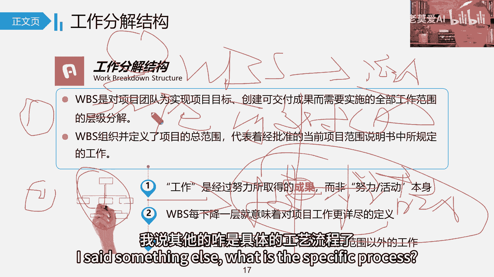

# 【最好的PMP课程】PMBOK6精华讲解2-2 - P1 - 老莫爱AI - BV1GJ4m1M7xv

类一般都是投标类，比如这里两大投票，一个亲河图，亲河图，亲河图，亲合同就是把它放在一起的才能亲和嘛，所以更多是什么，是一种叫归纳法的体现，就是把一些相似的点放在一起，把相似的放在一起，更多是一些什么。

也就是说把这些相似的人放在一起分成一个走，那不就是亲额头吗，啊那不就是分天合同嘛，我们把它称为什么称为归纳法，所以你说有没有一个分类方式也没有，因为到时候收集了数据数据那么多，你可以说我想按时间分。

这也是时亲合投，那我想按什么，我想按技术分也是亲河图，我想按地理位置分，也是亲合同，也是亲和同好，那还有一种呢就分散方式，我们现在大家做这些基本的记录的时候，用的比较多的，用的是什么用的思维导图，1。

1点把它进行查看的一个基本的点，在把它拆开一个基本的点在啊，这叫思维导图，这个就比较多点，思维导图呢，我们一般以中间向外面不断的进行发展，再发展再发展再发展再发展，再放更多，我们叫它什么叫它演绎法。

就是从中间往外进行演绎，那锌和铜的更多是从外面把它分类好之后，分类好之后，你也可以说把它进行不断的提炼归纳提炼归纳。

所以他们两个刚好是两组什么啊，引导我们后面还学一个叫什么叫引导式研讨会。

引导是研讨会，首先那我们得知道我们的核心是什么，引导这是一种能力，而引导是研讨会，它是一个具体的什么一个工具，一个技术啊，它是一个具体的工具，它是一个具具体的技术，因为我们在项目，我们在做项目过程中。

一般情况下，我们要的是我们更多是什么跨职能进行沟通，进行协调竞争，所以当时的意见就比较，就就就不见得能够快速达成一个什么统一的，这么一个计算，所以我们运用引导这种能力，这种能力更多是什么。

把大家从分散的角度，怎么样能够往如何达成一致的这个角度啊，进行不断的引导，引导引导就这样的一个点，所以它能够什么，希望我们最终的结果快速达成一个一，达成什么一致意见，所以他与主题主题研讨会在一起讨论。

一般就是人比较多，方便我们更快的发现问题，而这个引导式研讨会就组织研讨会，更多的是我们说。

他更多有这三种基本的引导方式，这三种基本的引导方式，它指的是什么。

指的就是三个不同的行业，你比如说我们叫DAD联合应用开发，两个应用开发。

也就是说我们你看由用户和项目的开发团队，一起来定义需求，也就是说这个你用户定义这个需求，他只是从市场业务需求的角度来来说，我想需要什么样的需求来满足客户，那么为了更好的来展示这个东西呢。

那我们从技术人员，我们的研发人员可以从自己机制的角度，不管是能做的或者不能做的，或者说基于这个我们做到什么程度，就不断的跟客户做一个什么，做一个基本的一个探讨的过程，所以我们要求什么。

后面每年我们就知道，我们要求我们的客户和我们的业务行业要什么，要能够整天都在一起啊，整天都在一起，这是这样好，那QFD这叫什么，这是我们制造业常用的，它叫什么，它叫质量屋，质量屋。

我们在制造业在收集客户生意的时候，通过通过把这个客户的通通过需求啊，把这个质量屋啊，通过这个质量物把它转成什么具体的功能。

具体的产品方案明确了，把它要明确了，如果不能明确，那我们也可以先做一个，但是在制造业行业来讲，他一步一步做的时候，你得前面一定得有东西给到他，你有相关的东西，哪怕质量标准不说也行，产品研发阶段。

哪怕质量标准不说也行，你有相关的这个基本的点给到，那这样就方便他下一步这么一个作业就好，我们重点这两个我们知道就好，关键重点关注下订婚故事用过程，也就是说最终的我们这个用户。

我们的用户需求在敏捷里面用什么方式来进行。

体现了，用什么用户故事用户，所以用户故事一般都是什么，它包括三方面，角色目标，还角色动机和想达到一个什么，和想达到一个商业价值啊，所以是商业的，作为一个角色，我想要什么，以便能够做什么。

所以你看到没有，就像我刚才说的，他只是把他需求结合环境啊。

什么把它展示出来，但是它并不强调我们的研发团队，你到底怎么来实现我的这个具体功能，我并不做直接的要求，为什么呢，因为你实现了很多需求，根本就没热，你比如说在I之前，假设在没有AI之前。

你说我作为一我我我我我作为一个技术工作者，我想要以后上网找记录资料的时候能够快一点，能够准确一点，以方便我进行什么，以方便我节约时间，更好的把这个技术研发做出来对吧，那你可以做这个东西啊。

你把你这个东西可以丢上去，但是怎么体现不知道，但现在从现在角度来说，是不是AI就可以帮你AI这个基本功能，就可以帮他帮你实现这些功能，那么研发团队就帮你把你研发出来AI，你看这个能实现不。

就你把那关键字把那一输输完之后，发现AI能帮你实现，这不就OK了吗，你过两天你又不爽了，你说这个AI啊，你这这这能实现，它这输入字不能按照我的心意来，那好了，那接下来我们聊聊。

后面有没有什么能够观察你的习惯，按照你的心意，到时候又又把你的工作具体加起来，当然现在现在软件都在更新换代了，这个应该以后还是一定能够实现，现在已经出现了很多的关键字了啊。

所以我们具体需求用故事的方式来体现用户。

故事的方式来来体现好了，看一下另外两个工具，观察和交谈，观察什么观察就是看嘛，交谈嘛，交谈就是什么，咱们交谈，大家相互交流着，谈话嘛就聊嘛，那不就跟刚才访谈访谈还不一样的地方。

访谈有一些既定的设置的一些既定问题，我们需要问的一对一或一对多，那我们交谈就不一样，交谈可能更多的偏向于什么，偏向于你所见所闻，当时当下直接进行什么。

进行交谈的这么一个过程，所以我们一般也有两种叫什么，一个是炮战史，一个叫参与式，旁站是什么，你做我看做我看我我你你在做的过程中，因为我在看你有哪些具体具体的一些什么，基本的一个需求，你比如说很简单。

你比如咱们现在在小区里面，你说一上电梯不是比较困难吗，有的人说是那在特别在公共场所，很多人不是像是不是在就在家，很多人上楼梯啊，老式的那房不是层比较低，他上那个楼梯比较困难吗，有些人上来，那怎么办。

他哎他就狂站什么，他一看你比较困难，那他就给你另一个需求是什么，给你装一个斜式电梯吗，这不就出了吗，那另外一个叫什么叫参与式，参与式，其实在很多时候呢，我们调查对象的要他主观上来讲，他不愿意跟你说。

他有哪些具体的需求，要不就是什么，他实在想说，但是他不知道该怎么来说，因为他不知道怎么表达，能够表达的更清楚，那这个时候怎么办，这个时候更多是你要上手去自己去做，自己去体会一下，体会这个过程中。

他讲说而又没说的那一部分东西，这叫什么，这叫参与式，更多的是挖掉他的什么，挖到他更多的什么隐藏的一些需求。

因为很多时候我们的一些专业人员在做，习惯了，他把这种东西他是说不出来的，他是不知道的，不是不知道他说不出来的，你很简单啊，大家都开车，在这自动挡没出来之前动挡，大家开手动挡的不就这样吗。

教练怎么教的，踩一脚离合挂一档，是不是，那你怎么换二档了，踩一脚离合，把一档挂到空档，再踩一脚离合，把这个空档挂到二档，教练是这样说的，可是真正操作是怎么做的，离合下去直接就上一档，上完一档怎么挂二呢。

离合下去直接就搬下来就好了嘛，直接搬到二档，一脚离合下直接搬到二了，接下来是不换三挡，离一脚离合直接换三挡，直接换挡挡好了，你觉得你问我这么一个老司机，你说你这个换挡的过程中有什么具体的需求。

我给你上哪去说我就得需求，我感觉换的很顺啊，看一跟二直接搬下来，三和四直接搬下来，到五的时候斜一点，到倒档的时候再退一点不就完事了，这个很顺的，这个有什么好讲的呀，这个没有什么特别好讲的呀。

所以但是当他自己体验的时候，他就会感觉比如从空档挂到一档，这时候晃了一个点，这时候晃了一点，中间空了时间点，如果你挂到空挡，这个时候又不走怎么办，当然这是我的假设，这是我的假设，中间又不走，那好了。

现在自动挡怎么设计了，自动挡设的基本上就是除了中间作为空档之后，其他基本几个档位都有用，空挡的作用就是什么区分，往前这个空挡作用是什么区分，往前倒车停车，这是往前嘛，空挡往前往后不就是走吗。

他做了一个什么很好的区分和衔接嘛，对吧啊，这是一个隐藏需求。

好我们聊聊原肩吧，圆形法更多什么问，那首先你得知道什么叫原形。

我们原型我们按时间来分，我们按时间来分，你在正式做出产品这个时间点之前。

做的所有的东西，你都可以把它称为什么，都可以成为模型，所以书上有什么有什么微缩的产品，有什么二维的三维模型，还有身体模型，这些都是什么，还有模拟你都可以成为什么原型，总之用于什么，正式产品没出来之前。

那为什么我们要用原型法，就是基于在很多情况下我们的什么需求，我跟你聊聊不聊，为啥我们俩都是拿嘴巴说来你的思路，你的脑袋想的东西跟我脑袋想的东西就不一样。

不一样，怎么办呢，那我们如果拿嘴巴聊，这个时候不太好聊怎么办，如果有一个达成共识的原型的东西。

这个时候方便我们干什么，方便我们这方便我们直接能够达达达成什么，方便我们直接对着它做出一个调整，做出一个反应，这样好多了，这就是原型法的一个基本的什么。

基本的一个作用，其实它体现了什么，也体现了我们在之前讲的什么渐进明细。

项目的一大特点叫什么间接明细，用一点一点做，坐着看好吧。

在需求这一块，一共有两个文件，一个叫需求文件，一个叫需求跟踪矩阵，那需求文件是记录所有的需求。

注意是记录所有的需求啊，所有的需求管你这次做没做都要记录，而需求跟踪矩阵呢，它的核心就比较简单了，他是一手左左右两手托。

一手托的是客户要达到的需求，另外一手托的是我们这次做的相关的什么。

WBS做的相关的可交购物，他们两个之间什么如何对应在一起。

这是我们需求矩阵跟踪矩阵需要干的什么，需要干的什么具体的活，这是我们需求跟踪矩阵，也就是说需求跟踪矩阵，只要能够写在里面的东西。

它就一定跟什么，他就一定要做的，但是阿范围不一样是吧，那我们接下来就是什么，就像我们说的。

我们如何从购物需要我们高层性的需求，把这个需求变成我们具体相关的什么，具体相关的，这这什么具体的产品来，把它变成我们具体相关的产品来，那我们就一步一步做好相关的高层。

你得相关的具体的一些产品表述啊，具体一些需求表述转化成有形的可交付成果，因为我们毕竟交付的时候啊，交付时你按照这个角度我们干什么。

我们需要交付一个东西出去，要交付一个具体东西出去，所以我们有一个产品分析的成果，因分析就是分析这么一个点，而通过这些产品分解啊，把它做什么怎么样，如果把这个东西转成我们具体的产品啊。

转化成我们具体产品价值，工整和价值分析这两块，大家看看就好，这两块的核心是什么，它叫价值吗，价值等于V除以C，它价值等于F就等于V属于C，为什么非你这次这个产品啊，给了一个特性的一个评价。

给你评价了一个什么他的一个价值，那C就是什么，C是我要花的一个什么基本的一个成本啊，CC它是我的画了一个基本的成本，做了一个功能，他画了一个基本的成本，这个一般情况下是在做一个什么，在做一个对比啊。

比如说A功能，A功能，它的这个它的功能价值量，可能达到50%啊，A功能它的价值量达到50%，那呢他的成本花了多少，它成本花到40%，那这个1。25它的什么性价比，用我们的话来说，这性价比很高吧。

那还有个成本，它的功能占到我们什么60%，但是他的账成本占到我们80%，那性价比就不太高，性价比的，所以通过这个点，我们做什么不做什么，就给客户有一个什么很好的量化的，一个解释空间了。

也比较也比较具有可视化，就是所以最终在范围这块，我们最终输出什么，我们的项目范围说明书。

也就是说你把这些东西都记里面就得了，所以这里包含了什么，包含了产品的范围描述。

也就是说相关的特征和功能，以及项目的范围描述，具体做哪些工作，也有我们通过产品分析之后，得到了我们什么注意，你看这里又有什么主要的可交付成果，以及可交付成果相关的什么验收标准。

还有哪些东西是我们不做的一些基本点，这四项是主要的，这两项就是外围赋予我们的假设条件，什么时候我能做制约因素有哪些，具体的一些知因素能来限制我的一些基本点啊。

好那接下来我们再了解工作分解结构，大家现在学完了，你就知道工作分解结构到底是个啥，它是一个非常好的以大化小的一个工具而已，以大换小的一个工具，我们说复杂的事情简单化，怎么简单化。

你得先把它先分解小再简单化，那你得把它分解小再减的话，所以呢他工作分解结构，这个东西就给我们提供了什么做事的框架，你一看就知道这里面到底包，你一看就知道这里面到底包含了哪些。

具体的一些基本的一些工作就知道了啊，所以工作分解结构，所以它跟工作分解，但是它又是一个框架，它没有具体实质东西，所以跟它对应的还有什么对应的，还有一个工作分解结构，什么词典，所以这就是词典。

但这里有几个点我们要注意啊。

我们要对比出来啊，就说在实际工作中，我也知道大家在做WBS时候，因为你的工作可能比较小。

一下就分解到什么，一下就分解到活动层面，那你直接按照活动技术技术。

活动层面就直接一步一步一步一步走了，但是现在从我们学习的角度来说。

还有我们从实践角度来说，也就是说你以后带兄弟，以后带你底下的人的时候，我我的建议也是这样，你按照这个基本思路来，就第一步我们只做范围分解，也就是说你把它分解到什么分解的工作包。

这个工作包是一个什么工作包，分解的是可交付成果，注意啊，工作包是分解的可交包，所以你第一步先以大化小，把它只分解到工作包的程度，这个时候我们起到一个什么叫复杂的任务，简单化，这是第一个任务。

叫第二个在基于每一块工作包，你再把它分解成具体的技术任务，或者具体的技术什么技术活动，这样其实方便我们进行什么。

方便我们去理解，为什么呢，因为后面的技术活动跟技术任务什么不同的人。

分法不一样，方法不一样，如果说你一旦从上至下。

一旦分下来，我是感觉会乱掉，会有点乱有点乱。

因为刚开始我们自己在做项目的时候，就这样，刚开就直接往下分啊。

有的我就说你这玩意儿怎么是个产品呢，他这个东西不知道怎么做，不知道怎么分了，我拿其他的咋是具体的工艺流程了。

我们技术活动从制造业的角度看，它不就是具体的工艺流程吗，他说对呀，那你上面你要出来这个产品，不就需要这么多流程吗，那不同的技术它分法不一样。

所以我们看的时候就够呛，如果没有第一部直接看，第二部看的时候够呛。

好吧啊，那最终形成我们范围基准，我们的三三合一嘛，我们的三合一三合一面，注意一下工作包规划包哦，呃规划报的层级大于工作报，为什么呢，因为他现在还不知道，所以我们要花更多的精力去关注他。

但这三合一简单来说，你可以把它理解成什么的，什么样的一个东西，你可以把它理解成一本一本字典或者一本词典，它就是一个范围技能，就是个范围基准，为什么这样讲呢，在那什么咱们的首页不就说了吗。

咱们的序言部分不就说了吗，我这本词典包含了什么字，不包含什么字，这不就是范围吗，就把范围说的清清楚楚，接下来目录部分不就是WBS吗，那后面词典部分不就是打字典吗，WBS点好了。

很多人领到这之后，一直会问一个问题，问一个什么问题。

在这个范围说明书这里会问范围基准，我们在工作中也没这么麻烦呀，注意他们在工作中会出现两个点，第一个点就是什么，因为我们的很多程序比较小，你你没有做WBS，也没有这样去什么去具体的分解你。

你甚至我们的什么项目的范围你都没写过啊，你现在代码的范围都没写，那没写，人家没写之后，但是你知道啊，你拿到客户的技术指标，拿到客户的要求也都是你们公司经常做的产品，你也都没写过，没关系呐。

但是你得知道WBS当时比较小，这是第一个，第二个还有什么，你认为比较小，在我们做的过程中，你的思路已经有了已经有了，你比如说我们正常思路，我记得我们那我们那个时候做的。

我们正常思路分别第一步先怎么分解WBS，第一步先把它分解到各个厂区，第二步，由各个厂区再把它分解到各个相关的什么，各个厂区，我们再把它分解到相关的什么不同，那个时候我们研发部主导嘛，研发部指导。

那就是分到我们研发部，我们研发部再把它按照不同的技术类别，再把它分解成什么不同的基础工艺，所以更多是我们那个时候做工艺研发的时候，更多是什么，在这进行探讨，在这儿进行探讨。

所以那个时候只是没听过大家时间都在用好，我们看一下5。5确认范围，把范围基准计划定义完之后，范围没有执行啊，讲到这我多说一句，范围没有执行范围，没有执行进度，没有执行，这个成本没有执行。

你发现这三个都没有执行，你就懵了，为啥他们都没有执行呢，不是他们没有执行，就像我说的，从管理角度，我们现在49个过程指的是什么，指的项目管理的管理角度来说的，这49个过程，所以只是从管理角度。

他没有执行，因为它更多的要做什么，要做的是控制跟谁干的活，执行是业务技术业务部门干的活，他需要按照我们的计划去执行具体的范围，那所以从管理角度我们能干什么，我们只能够看业看书籍。

在执行过程中数据到相关的数据，来在范围这个角度对他进行什么进行监控，进行对比，看他到底有没有做得更好，这样的事情啊，只能做出一个这样啊，大家理解下这个好，5。5确认范围。

首先得知道是这种我们叫啊实质性的验收，而验收呢再验出。

我们这不就是把两个有额，或者把两个点放在一起对比，一个叫确认放，一个叫控制质量检查。

这个我们就不说了，没什么特别的，为了达到结果，我们能做相关的什么检测，我这个确认范围跟控制质量，5。5确认范围，我们这叫什么叫外部验收，叫外部验收，8。3控制质量，我们把它叫什么叫内部验收。

所以现在基本的思路就来了，4。3指导与项目管理工作，再到8。3。

控制质量是我们内部验收，内部验收好了之后，走到5。5确认范围。

进行对外的什么实质性验收，接下来再走到4。7，结束项目或者什么或者阶段叫什么，叫形式的验收，叫形式的言，说他的一个基本的流程就是这样的吗，按一个基本好了，每次讲到这都会有人在问。

都会有吗，他说我们正常验收的时候，你说确认范围就是确认可交付成功的交互性，那个是交付性更多，无外乎两个点，一个叫什么范围，基于什么，就是你交付成功的数量够不够，第二个就是质量够不够。

第二个就是质量够不够，但是很多时候数量不够，那一目了然，那没什么好说的对。

但是很多人就说那质量不行，为什么也是回头，回头也是确认范围需要确认的事。

注意这就是我们谈的一个基础中的基础了。

你想想你现在突然间你去验收了，验收发现什么嘛，发现质量不好，你发现质量不好，你接下来是不是得有相关的工作去修补质量，像我们讲讲讲的到底是缺陷补救啊，那个时候只能叫缺陷补救，没办法纠正对啊。

那你现在是不是要修补质量，缺陷补救质量，那你缺陷补救质量对你来说，这不就是你项目相关的什么返工相关的工作吗，那你不返工相关的工作，这不就是项目相关的什么范围的具体内容吗，是不是项目相关的具体内容吗。

实际上这么一个事儿，所以你在回味范围那个基本的词语，未交付可交付成果而进行的什么，而进行的相关的工作，那换句话说，我们谈这个可交付成果的时候，有一个点我们没谈是什么。

就是要满满足我们的质量标准的可交付成果，你非要把它补齐，就这样就这未交付，满足我们质量标准的可交付成果，我们进行了什么相关的工作，应该是这样的一个基本点，所以你质量标准没达到，那你继续做做范围的事啊。

所以导它就是，所以我们讲范围是我们什么基础中的一个基础，但这里我们有两个对范围做出调整的空间，但是他们两个又不一样，一个主动，一个被动，但是核心是什么，一个叫范围蔓延，就是未经控制的。

被称为什么放个慢呀，比如说比如说客户跟你讲啊，你把这个变了吧，你你你也是好心，3+5除二就给他变了啊，3+5除二就给他变了，结果呢你变了之后，任何范围的变化，它是基础嘛，都会影响时间，都会影响成本对吧。

那质量影不影响，咱也不知道，那也不确定，但是也都会影响什么相关的资源，还有什么相关的风险，甚至多了干线任何沟通，所以你没变，他是基础，你没变，那啊成为发炎蔓延反冒烟，我们一定要什么管控。

所以你一般管控用什么，用这个相关的什么变更管理计划，变更管理流程来管控就好，这叫什么，这叫范围，那还有一个叫什么叫镀金。

有的时候什么也叫范围，浅变范围蔓延的更多是外面的东西给到我们。

我们说流程我们没有流，而这个镀金更多的关注是什么。

我们自己主动不走流程是走，你知道有这么个事，但是你主动不走流程，因为你自己认为多做一些，在客户面前可能会讨到一点好处，这样的一个基本点赞啊，有这样一个1111些基本点赞，你认为这样挺好的。

所以那可能你就没有要到任何的经济行为，我们在理论层面注意，要在理论层面我们都是不合适的，但在实际层面，你说你镀金多镀点金，客户高不高兴，那高兴啊，因为什么做的都是属鼠了，你多干一点，多干一点。

跟客户当然非常高兴了，那这是在第二个站在客户的角度。

你做饭与蔓延，客户说了，你让他掏钱，他说我没有，他也会不高兴的，那你还不如干嘛，还不如不让他掏钱，那你就未经控制嘛。

虽然他要求的，但你没有做那么相关的控制，是这样的情况，所以说我们说呃我们现在讲理论谈理论啊，我们就只考量理论好吧嗯好，我们把这个基础中的基础讲完了好。

接下来就看我们讲的，我们讲进度管理，也就是说我们重点是围绕着时间维度进行管，理了，进行管理了，注意啊，我们学的时候是这样分开学的，但是慢慢慢慢回去啊，啊包括一块我给大家讲的时候。

会会会把这个资源成本跟跟之间维度，给大家靠在一起呃，给大家往上靠一靠，因为大家实际工作中都是这样靠的。

只是没有把它说的太轻而已，把它说的太这样，好吧好，我们来看一下时间，那在时间这一块来讲，我们把它什么6。1规划时间管理，6。2就是定义活动，定义活动的核心就是我们刚才什么，从WBS工作包的角度。

把它分解成具体的技术相关的，或者叫业务相关的活动，那6。3的排列顺序，排列顺序的核心就是什么，那活动分解完了几千个甚至几百个，几千个，怎么样让它活动进行有效的一个顺序排列。

他就构成了它什么构成它的一个呃，有有有效的一个空间，达到一个更好的这么一个什么，达到更好的这么一个效率，这是我们讲的排列活动顺序，那排列活动顺序之后呢，接下来我们干什么，毕竟我们是需要按照时间往后推的。

那时间到底怎么样，其实就估算时间，那估算时间又基于什么，又基于估算资源而来，又基于这样来，所以我们先估资源再估时间，所以有了时间，有了它们之间的逻辑关系，把它往里一套，就成为什么成为把时间推出来。

用到关键路径法呀，用这种方法把它推出来，就成为我们的什么，我们的这个进度计划了，所以我们第一步定义活动，第二排列顺序，第三估估时间，第四步就有我们初步的一个什么计划，注意哦，这个时候叫初步的计划。

第五步，实际我们做的活儿叫什么，叫我们进行资源的分配，我们叫资源的分配啊，也就是说分配资源有什么，分配资源呢，有什么呀，好了，现在我们来学习，我们就知道了，我们前面是不是。

我们后面是不是讲了两个词儿叫什么，叫资源平滑和资源的平衡，那我们来讲讲资源平衡，如果你不分配资源，你就很可能会出现什么，如果你前期在规划阶段不做分配资源，你在后期就很可能会存在什么。

会存在这种资源平衡出问题的状况，为什么呢，我们现在在工作中不都是遇到这样的问题吗，我们很多人没有把资源跟时间，这个维度直接对上，都是想着怎么做呢，比如说你这个项目持续时间半年，半年都是想着哦。

第三个月我得找王总，给他再要十个人，现在我需要十个人了，因为你之前给王总打过招呼，你光跟王总说，王总啊，我们这个A项目到时候需要十个人啊，你到时候全力配合，你们部门需要十个人，你得全力配合呀。

王总说没问题，你做项目，咱俩这关系没问题，做吧，但真正当你第三个月去要人的时候，你发现咱们可能很多人都碰到过这样的问题，当你真正要人的时候，你发现什么，王总说小王呀，不好意思，不是我不给你。

你看我这项目上的手人手也太紧了，我现在确实没有人，那这个时候出现一种什么状况，这叫什么，这叫资源约束吗，这叫资源平衡嘛，所以你现在为了资源平衡无奈之举，王总说他现在手里项目上确实人走不开，那你无奈之下。

只能把你的项目什么只能往后推了啊，可能往后退就会说呢，但是如果在之前你都激化了，你能不能听王总，我们按计划是6月7号到6月21号，这14天我们需要用你这边十个人，你看一下这个点有没有问题好，他说没问题。

那你让他把字儿一签，到时候6月7号到6月20，你拿着这个去找他，咱们不就干什么叫有据可依的吗，一方面叫有据可疑，一方面是不是在沟通过程中，你也给他提醒了嘛，你你比如说这个叫什么，你比如这个。

到时候你比如说一周之前或两周之前，你就给他提醒，王总，我们上次签的，你看6月7号到6月21号，我们这个项目上用你这边十个人，你看你你答应给提供了，他心里也能有底吗，你什么时候有，他心里也能有底。

要不然你光说要人，你没有一个时间维度上的人，怎么样啊怎么样，这是我们讲的，那还有一个叫什么叫资源平滑，那资源平滑对我们对我们一个用处是什么呢，对我们一个用处是什么，但自由时间自由时差或者总浮动时间之内。

他去给别人帮忙嘛，调资源的时候，我发现哎这个时候他更多是关注什么，资源资源平滑，更多关注什么，它非关键路线活动，他最早开始时间和最晚开始时间的事对吧，他观众观众有没有在在他这个时间内开始的时。

那你不管是基于财务时间考虑，或者是这个时候，就像我刚才说的这些关键路上的人帮不了忙，那你得找人帮忙呀，你找人帮忙，你找谁帮忙呀，那你这个时候就有了什么关键路径法。

一看非关键路上有这么自然为我所用，那你就为你所用，那就完了。