# 【最好的PMP课程】PMBOK6精华讲解2-3 - P1 - 老莫爱AI - BV1mT421r71G

可以做资源的这个平滑，还可以做资源平衡，那好我们再来讲资源平衡，资源平衡是不是还叫什么，还有一项叫整体资源，资源数量落差太大，还做自我们来做资源，当然这个东西可能很多人在实际中没有接触过，这个，为什么。

因为这个用的时候就来说项目比较大啊，用的资源比较多的时候，我们用这个，那你你也得知道，所以我们做资源，你比做资源计划其实是三个计划，第一个你每一个工作任务包需要什么资源，这叫第一个叫他的资源需求表。

但这个只是针对工作包来讲，我们需要的资源需求吧，这是第一个，第二个就是什么，你把这个按照时间的维度进行分配，什么时间我需要什么资源，什么时间我需要什么资源，这叫什么。

这叫资源的甘特图或者叫资源的按时间分配表，这就按时间的力度，第三个就是我刚才说的，你也可以把它做一个统筹嘛，比如说1月份需要十个人，假设都是工人啊，一个班需要十个，二班需要300个，30分需要50个。

那你这样肯定也不行，所以你有必要时候可能也要调整这个进度计划，可能也要调整这对券，所以我们讲这个资源这块跟进度这一块，也是什么，也是息息相关的，所以我们看到第五步是分配资源。

基于分配的资源要调整这个东西，大家都要要调整这个东西，基于分配的资源，基于外面的约束的这个因素，我们要及时调整我们的什么一个进度计划，按几个进度吧，那到这说第六步就是什么，制定我们相关的预算。

以及制定其他的相辅助的，相关的什么话也是按照时间来的，我们一会讲到成本再说，养成本来说好，第一个就是说我们在里面进度这块，用的更多的方法，一种叫预测型，什么方法就按照我们思路来分解活动定义。

分解活动排列顺序，估算资源，估算时间排位列计划，分配资源，制定制定预算以及制定其他的计划对吧，那在敏捷里面我们经常用的是什么，就没有那么多思路，经常就是什么滚动式规划，所谓的滚动式绘画。

现在我能看清楚的东西。

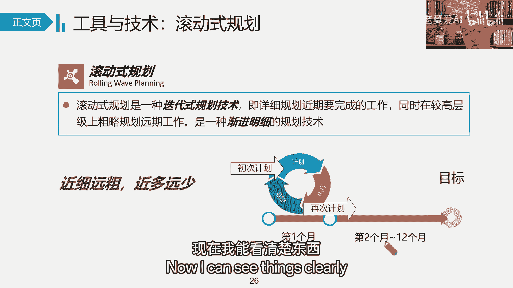

我做一点点A点往前滚的时候越来越清晰，越来越明朗的时候，我就把那些做出来，这叫什么，这叫滚动式规划啊，滚动式规划它实际上体现什么，实际上体现就是我们什么，我们的渐进明显经济命运好了。

那关于定义活动我们就不说了，接下来我们聊聊排列顺序，排列顺序说我们这不是给大家讲了吗，几年关系会多吧，PDM也是我们叫什么，也是我们叫什么，叫这个叫单代号网络图放这里的核心，我们重点实操就好。

你得知道用一个代号代表的什么活动，用个界线代表什么，用个界线代表的是我们相关的什么，我们相关的逻辑我们先关注。

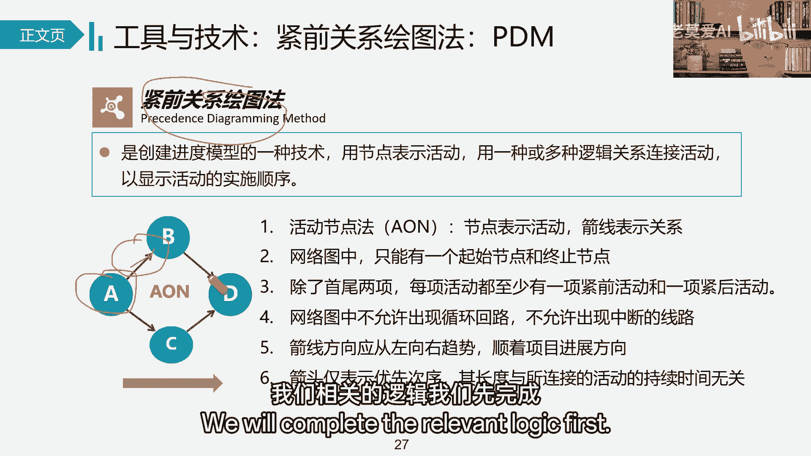

所以活动跟活动之间它是有逻辑的，那这个逻辑到底怎么分配呢，在我们书上不是写了吗，有两种基本的逻辑，一种叫硬逻辑，一种叫软逻辑，硬逻辑叫叫客观上存在的逻辑关系，他必须要这样做。

你要先我们只有先打开电脑才能打开，打开相关的视频嘛，这是硬逻辑，那软逻辑就是先做哪个后做哪个，他并没有什么直接性的一个基本的，一个直接性的一个基本的关系，你觉得哪个好，基于经验来就行，借鉴了一下好。

基于这两种基本的关系，一般我们说活动与活动之间，最终的表现会表现在四种逻辑关系里面，而这四种逻辑关系里面，我们用的最多的就是什么，用到开始这里，其他的我就不讲，重点想讲另外一个点就是什么呀。

注意活动与活动，表示最终的表现会表现出这四种关系，但是有的人也发现，往往A活动会不会B活动，这两个活动之间可能有N多种，可能这四种活动表现起来他感觉都合适，可能是用它表现起来都合适。

但是你不能用四种都表现，你可不能用四种多边形，你选择更好的就行，这个意思啊。

你选择更好的就行，你选择最符合的也就行了好了，那估算时间这一块我们就讲了什么类比法，参数法，三点估算，以及我们还底下还有一个什么，还有一个自下而上的估算，其实你非要加，还有一个对，你要是非要加。

还有一个估算方法叫什么，叫专家判断，等下可好，我们重点要搞清楚，它们之间的基本的区别在哪里。

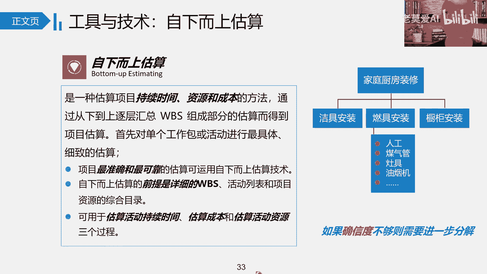

一个基本的区别在哪，好我们来聊聊这个区别在这啊，我们先来聊聊类比估算和参数估算，类比估算和参数估算，它们两个点都是什么，类比估算都是要以过它们两个点，都是要以过去的历史数据为一个，基本的什么依托。

那他们两个的区别在哪里，区别在于说参数估算必须有一个模型，而类比估算呢就直接对比着就行，直接对比对称，所以那类比估算更多是自下自上而下，整体对整体直接来估，而参数估算更在更多是利用相关的参数，1。

1点算出来，得出一个什么总结的，比如说装修一个房子，100平米花了10万就花了100万吧，方便算啊，花了100万，那么现在问你装修120平米需要花多少钱，你说你一回家那不行了吗，那120万啊，肯定啊。

这叫什么，这叫类比估算，它是总体对总体啊，感觉差不多，他现在参数估算怎么算呢，他是这样算，他是装修100平米需要100万，所以100万÷100=10000每平米，那么1万每平米再乘以120等于120万。

注意同样的一个数据，不同的算法，不同理解方式，它的什么它的应用就不一样，好吧，这是类比估算，这叫什么，有参数估算。

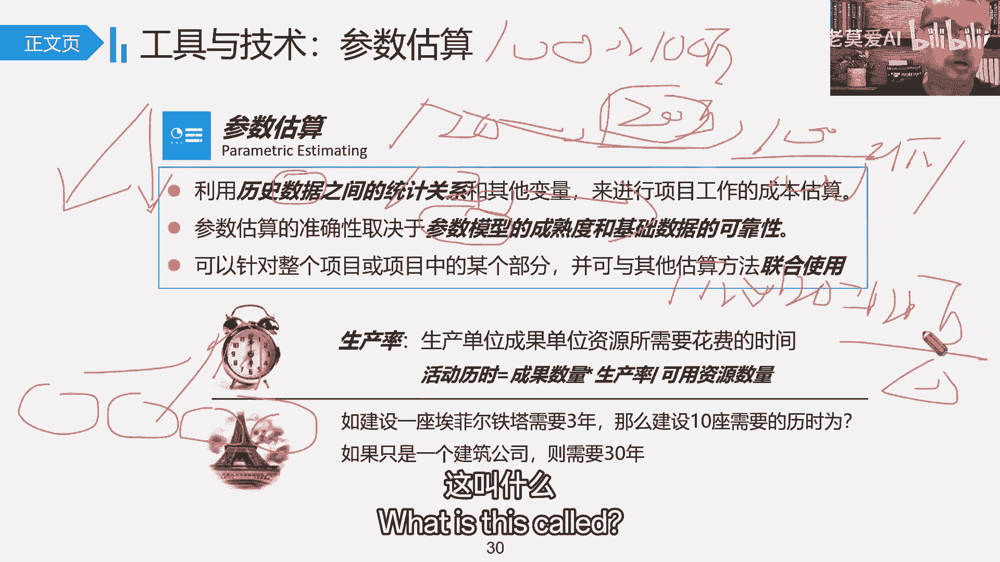

大家一下，注意它们两个之间的区别就行好，那三代估算就不用太多说了。

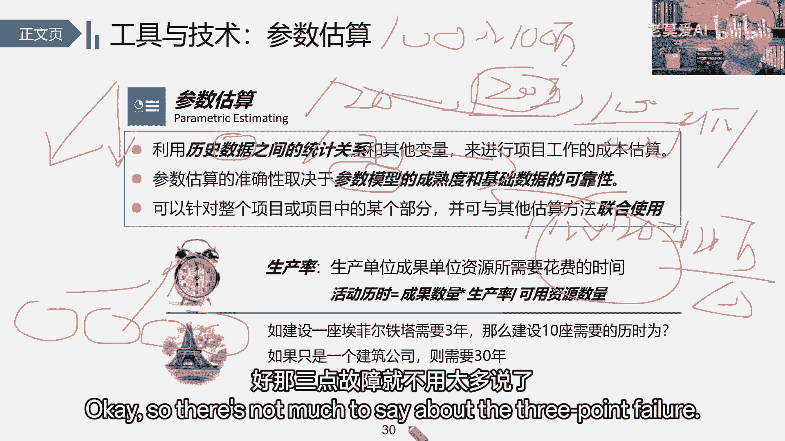

它是基于加减法而来的，基于加基于加减法，主要把这个这个叫什么六分之的，最差的跟最好的，我们用一来表示最可能的，我们用四来表示，现在中间这一块，大家得理解一下，六十八二。

四个码之间的95以及3K码之间的99。

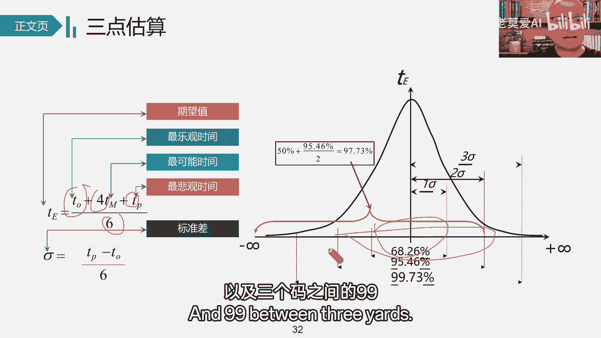

算的时候注意一下这里就好了，那自上自下而上，这就是什么，这是最精确的一种。

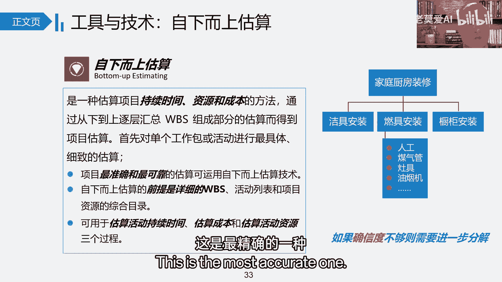

但是也是什么，也是最麻烦的人，好吧啊，也是最麻烦的啊，好那接下来我们聊聊这个估算完时间，我们和前面的网络图，结合前面的网络图，结合前面的这个时间，把网络图把时间加到网络图里。

不就有一个我们时间基本的排序吗，那初步的时间计划其实基本都有了，那接下来我们把这后备的时间计划，有了时间计划，我们接下来不是有甘特图呀，里程碑坨呀，还有指标网络图样样基本的成像工具。

那中间我们为什么要采用这种关键路径呢，讲关键路径的核心它不外乎两个，第一种找出关键路径，找关键路径的核心是为让我们干什么，让我们把核心的注意力就放在关键路径上，就放在关键路径，那什么是关键路径。

就是从头到尾路径里面持续时间是什么最长的，所以你要重点关注它，为什么它的持续时间最长，你如果他一旦延误了，是不是整体时间又又延误了，好这叫什么，这叫关键逻辑嘛，这是第一个，第二个。

实际上关键路径就是通过顺推和逆推找到什么，找到最的开始时间，最晚开始时间更什么，搞定进度的网络性啊，进度的灵活性就用什么代表进度，灵活性用用相关的什么总时差或者自由时差，要这个灵活性干啥呢。

要这个灵活性，如果在必要的时候，为了服务关键路径，那你非关键路径项目该停的是不是就得停一下，不管说做资源平衡的时候，做人力资源数量的平衡，还是说做资源平滑的时候，我从你这里借资源。

最后一个一一定的一个基本的什么一个依赖。

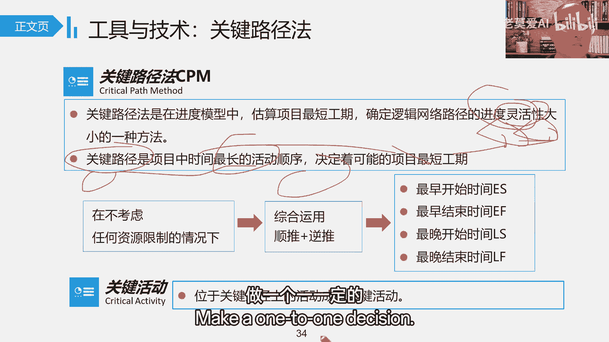

好吧啊，一个依赖总时差跟自由时差，我们现在就得知道是吧。

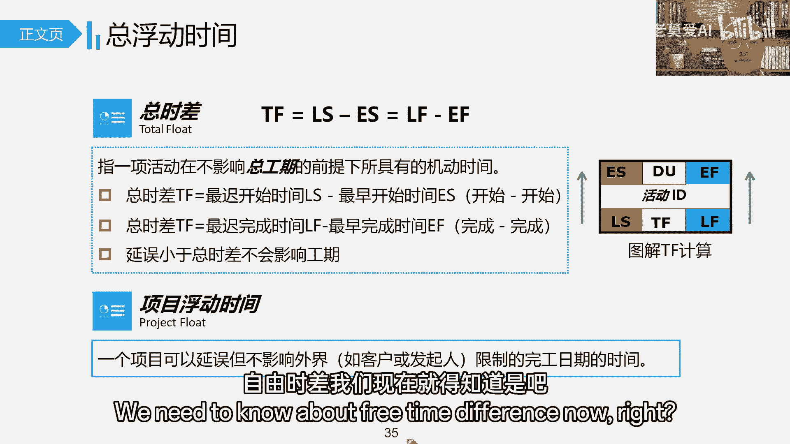

算法就不说了，关键是我们得知道他们两个一个什么，一个基本的一个参考点，总时差他的参考点是站在项目整体的角度，就是说你延误了，我不至于延误项目的整体的一个最好完成时间，所以它叫什么。

它叫总时差或者叫总体的时差，那自由时差呢，他指的是因为你后面还有人了，那人家后面那个活动后面那个人说不愿意，他就想最早开始，你不要影响我的最早开始时间啊，所以他站的立场是什么，不影响紧后活动。

那些人的什么最早开始时间，那个叫做你的浮动时间，按你的浮动时间好吧，其实在实际工作中，我们用的总时差，用的是比较多的，自由时差是一种说法，因为网络相对比较多的时候，网络上那边有有的活，他要赶在最早开始。

他后面可能风险就比较大，他就是赶到最早开始，那没办法，可能他更多的取得自由市场。

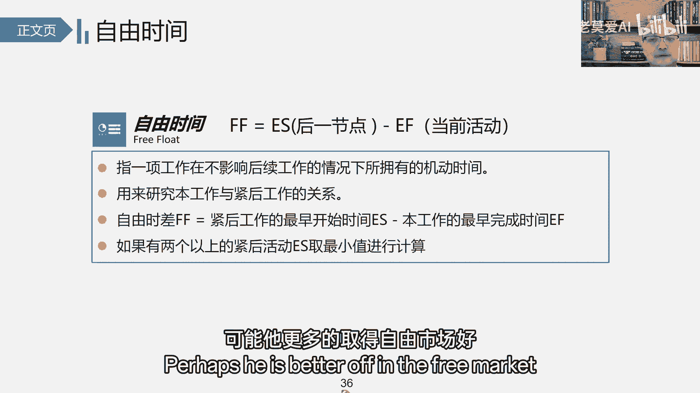

靠自由市场好，那我们再来看一下关键路径是什么，关键路径是从开始到结束路径里面加起来，所有的时间加起来总共最最长的一条，所以他到底有几条呢。

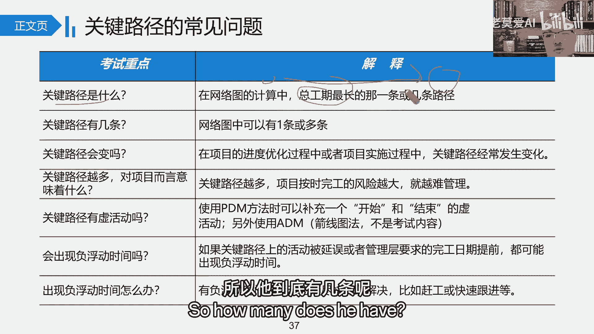

不知道，所以有一条或者多条，为什么呢，因为我们考量了什么时间加起来。

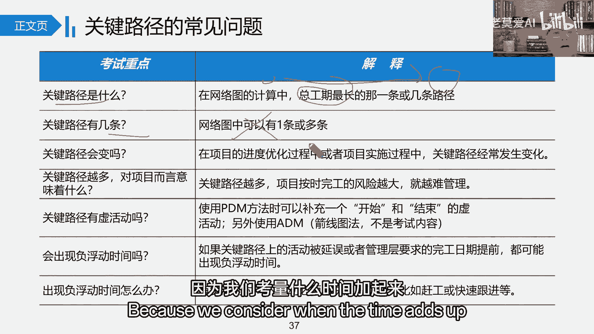

那时间加起来如果相相等，都是关键路径，压相等的，又是最长的，那都是关键路径会变吗，那我们讲的是时间，只要时间变了，那我们就经常会发生变化，比如说你延误了，或者你关键路径提产提前了，那可能次关键路径。

那可能就变成关键路径了，那关键路径越多意味着什么，关键路径越多，意味着你需要管理，同时管理就越多，那怎么样风险就越大了，没有了吧，好这个虚活动虚活动注意啊，虚活动这个不做考试内容。

因为它是双代号网络里面它是用界线，不是代表这个它双代号里面，用界线代表的是活动，但是有的活动跟活动之间，他就没办法直接在一起，它就居限做一个逻辑上的什么衔接，他们两个本身没有直接的关系。

用虚线做了一个逻辑上的衔接，这个我们不关注啊，如果考完试之后，大家有机会要是去看那双代号网络法，你可以建议大家下载一下，那么呃现在不是考一建吗，一一建里面讲的嘛，双代号网络那块讲的还比较全的啊。

其实在实际应用中。

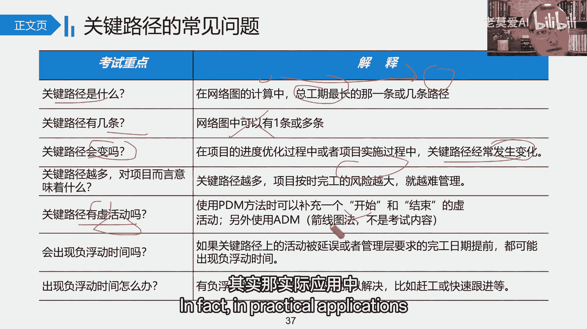

如果是个人啊，我们说个人如果是个人，你用双代号网络有的时候也比较便利，因为他是把活动跟那时间都结合在一起了，结合在一起了，好吧，出现负浮动时间，为什么会出现负浮动时间呢。

就是由于外界的什么约束条件造成的。

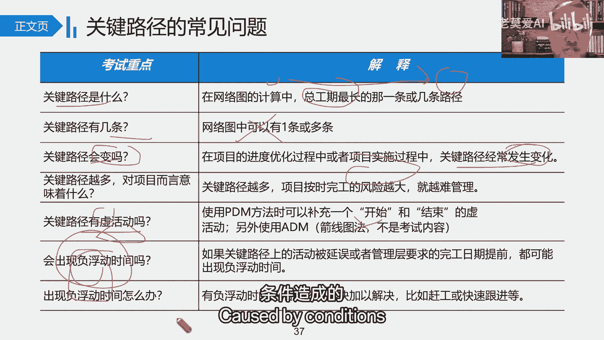

你比如说我们算出来关键路径，算出来是20天，外界的约束是什么，外界的约束说我只给你18天时间。

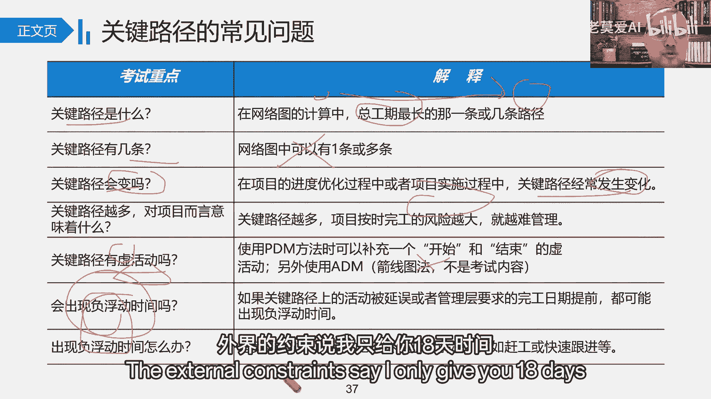

那你出现了什么，出现了负的浮动时间，你根本就没有浮动时间，那出现负的浮动值，那怎么办，你你要赶着进度来呗，赶着进度来哦。

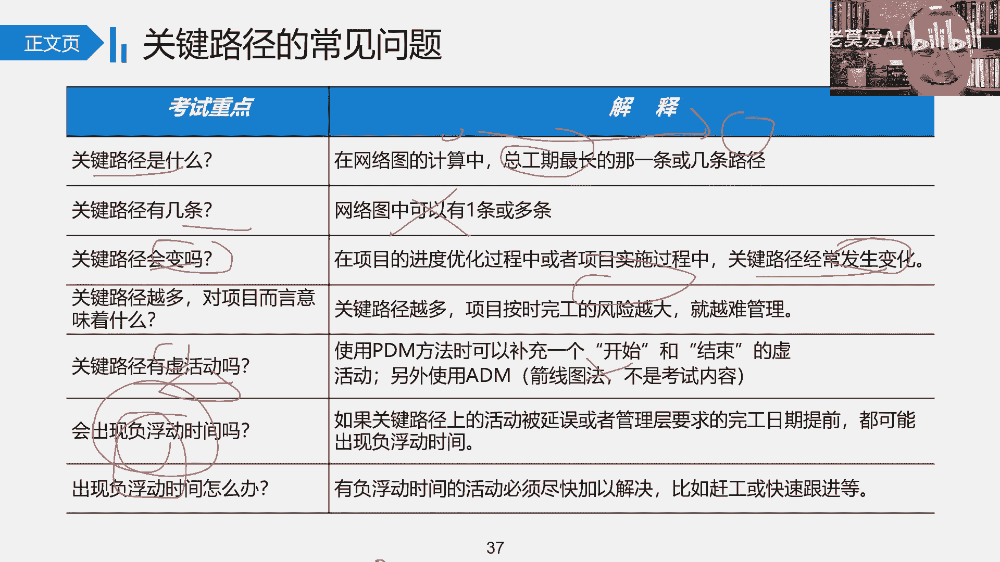

那好了，我们那会儿开始就说了，把资源做好时候该分配资源了，分配资源之后，一方面就是为了解决资源供给的问题啊，解决资源供给问题，解决资源供给供给的问题，这个一般有两种情况，一般什么特定的资源数量有限。

如果你没有，你不把资源按照时间的角度进家进行分配，他不知道他把时间安排了给给了别人，那你在同一时间你用的时候就有个问题，这第一个第二个就从整体上来整。

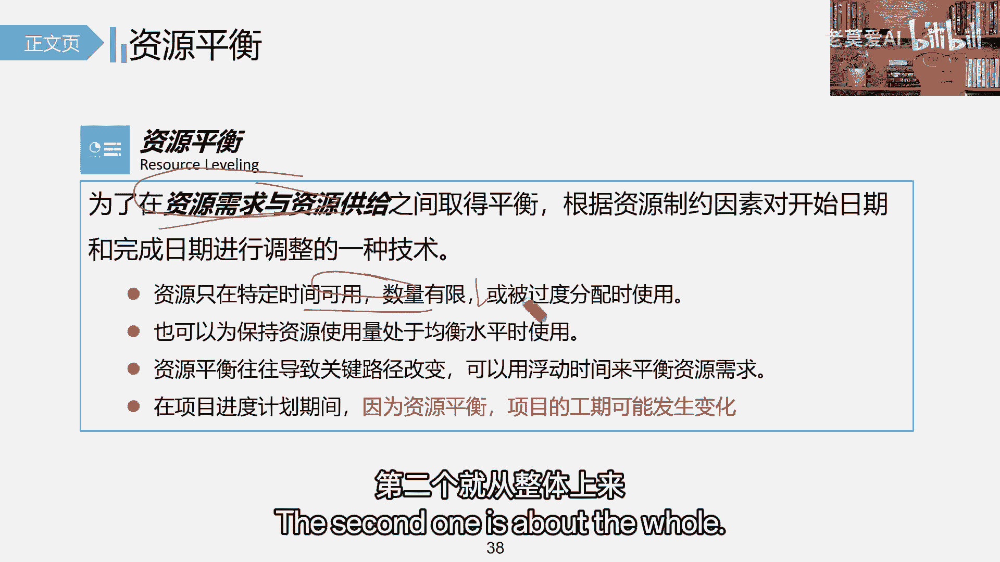

整体上来讲对吧，如果有的资源就是资源干了，投资源对于脂肪头不平衡的时候，那你怎么用呢，那你怎么样呢，可能你比如说这段时间需要这么多人，那我能不能把人给他平衡一下，到这个时候需要。

那就意味着你要把工作往后分配啊，不是说光分配人啊，因为你可能把工作往后分配呀，那你就要看行不行，那你就要看行不行，这个工作到底能不能往后移啊，得考量他的什么，考虑它的资源平滑工作能不能往后面移。

最晚开始时间嘛，这一个如果不能移了，可能还要系统调整一下前面的网络图了啊。

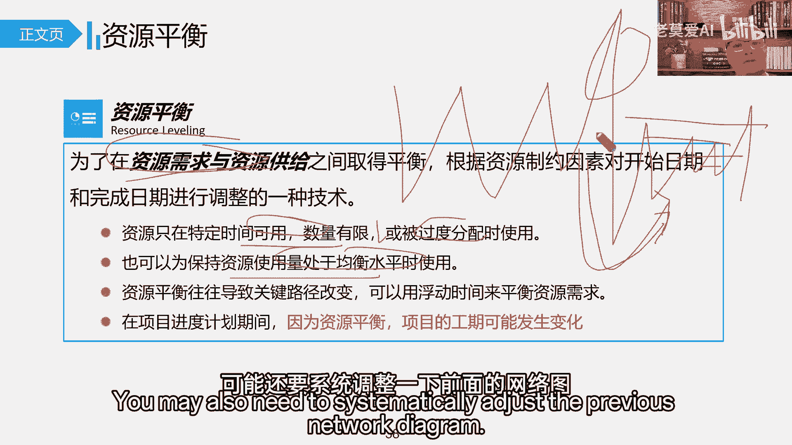

好自然平滑，那就在我们这个浮动时间内上网嘛，该往后嘛，我们作为我们调整路径头，调整我们计划的一种比较好的一种方式，不管是你借用资源，还是说为了保证时间，你让谁先开始。

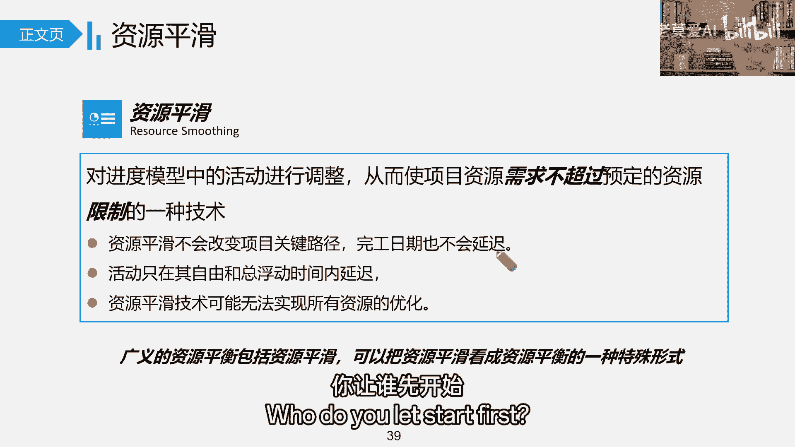

谁会开始，不可以，好吧啊，谁先开始，谁后开始都可以的一种方法，所以我们来看一下那把自然平滑还这个样子，他本来从现在开始呢，那他能不能提前开始，可以啊，假设他可以提前开始，他提前开始就完了，那资源平衡呢。

你看他现在就需要他只有两个人，那你现在给他拍照，他只需要三个人，怎么办呢，没办法呀，只有把这个工作，比如这个工作A吧，最后放在什么这里来做了，所以为什么，资源平衡一般会延长我们的关键漏洞。

但资源平滑一般不会自然平滑，因为只在浮动时间内呀，它不会延长的好不好。

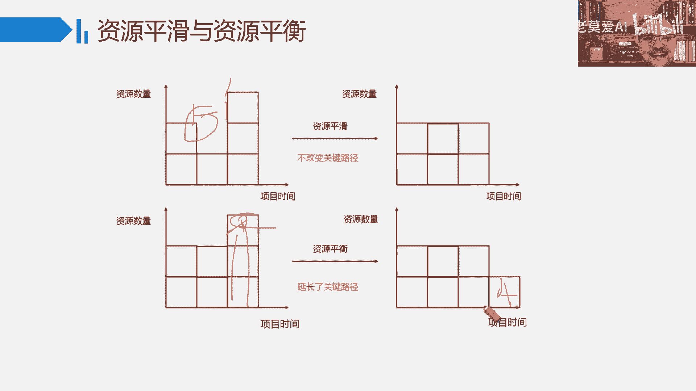

那外界的给我们的东西，就像我们说的，刚才出现了负时差，复试差怎么办，负的活动时间怎么办，所以我们一般要怎么缩短时间，就是我们缩短时间，那缩短时间我们的时间本身由什么而来的，就像我们前面一个。

由一个每个活动的持续时间而来，二有什么活动跟活动之间什么关系而来，所以你缩短时间也就从这两个大的角度，从这两个角度下观，第一个缩短它的一个活动的持续时间，二一个缩短它活动与活动之间。

网络网络关系的衔接时间，所以我们赶工赶工就是缩短活动时间嘛，快速跟进不就是缩短了，本来这两个FS不就缩短了它们之间的距离吗，我这样做行不行，提前了这一段时间就这个意思，好吧啊，所以呢在排列计划的时候。

你你你你需要快速跟进，快速跟进是直接可以表达出来的，咱赶工有的时候不好直接表达，不好直接表达，你在规划的时候一定把它弄好就行了，你比如增加资源，你这个时候可以用到什么资源，平滑的那些资源，你给他做好。

到说那个时候你去赶工，帮忙给那边去干嘛，给关键录像这个事去帮忙，这不也是赶工吗。

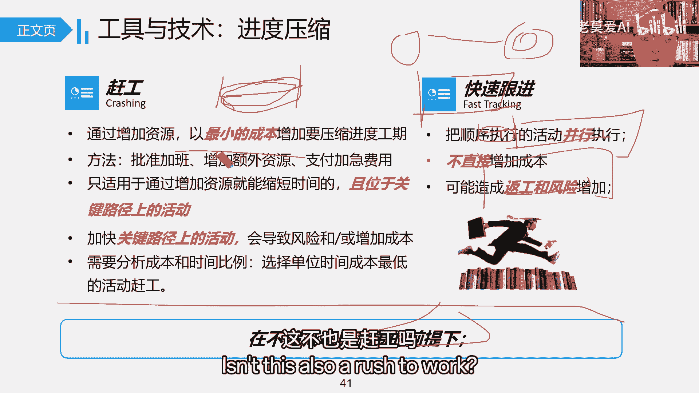

也是赶工啊，好所以他们两个之间的一个基本对比，其实究其本质核心的点，你把它们在哪里做东西就好了，赶工在的是什么持续时间，快速跟进，做了什么逻辑关系，所以改变持续时间就需要成本嘛，但是快速跟进呢。

逻辑关系变了，可能就先有风险了啊，可能是先有会把风险的增加，会把风险增加，所以赶工这里更多关注成本快速跟进，更多关注什么，关注的是风险，还关注这风险。

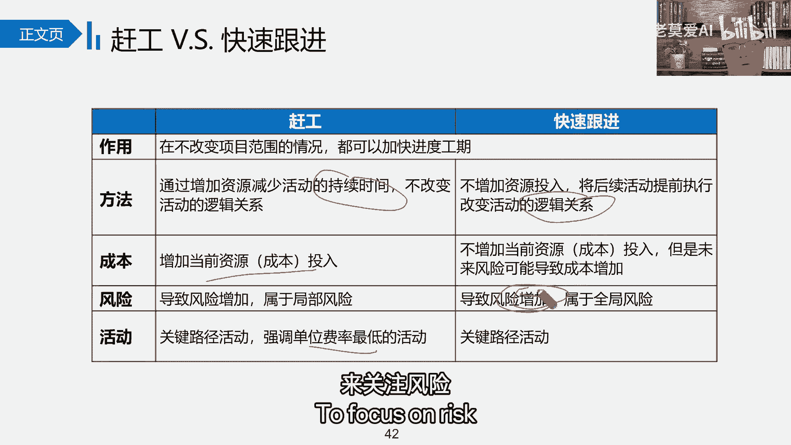

好吧啊，观众看好，这里又涉及到敏捷的一个进度，基本点好了，从这开始啊，我们把这划分一下，把把中间那条线先去掉好，从这划分之下，注意前面产品的愿景线路，限流发布，发布计划，这些东西，产品路线图啊。

这不是我们能关注到的点，明白了吧，这些是什么，这些就是我们项目的高层，他需要关注的点，你比如说我们苹果，不是每年都要发布一个版本吗，现在才大家还用的什么IPHONE15呀，IPHONE16呀。

每年都要发布一个版本，但这些东西不是我们要关注，这样我们要关注的点是什么，在这个第一版是什么时间发布在这版，实际上这一版里面包含了多少功能，这些功能我们需要做多少次迭代，我们关注的是要这些。

而每次迭代里面我们又能有，又能完成哪些基本的一个功能，我们更多关注的是什么，关注是这些，所以他的时间分配啊，说他会有个阶段性的时间嘛，你比如说7月底，7月31号我们发布第一个版本。

那你就要考量从现在6月到7月有这么多时间，我们能做几次迭代，因为在敏捷里面我们讲时间和，所以迭代的次数应该也是固定的，那这每次迭代里面你想呢我们能做多少故事，我们就一点一点做，所以我们就知道把它推上去。

就知道第一个版本发布，我们能做多少故事，它能具备什么样的一些功能，到第二个版本呢，我们一样的又具备什么样的功能。

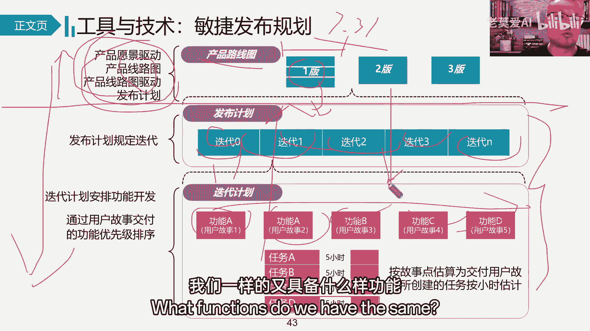

它是通过这种方式来管理进度的啊，好最终输出是什么进度基准，也就是我们的什么进度基准计划嘛。

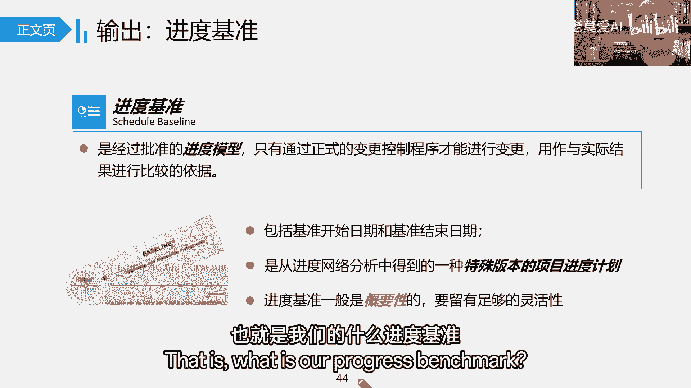

现在核心是什么，有了对比就完事了，所以我们得知道，项目进度计划指只是三种基本的表现形式嘛，开了头里程碑标网络图或者进度网络投，它只是三种基本的什么进度的表现形式。

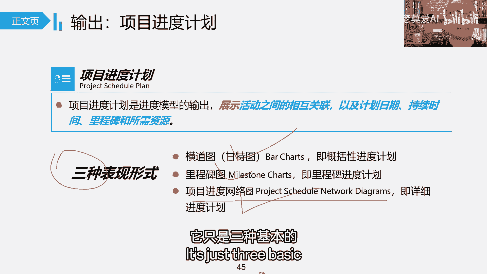

而在敏捷里面呢，我们要我们表现进度叫什么，叫燃尽投，叫燃箭头，什么是燃箭头呢，燃箭头他是把总工作量，因为它只是更多关注什么，我还剩余多少工作没做，他更多关注是什么，他不是关注你做了多少，因为他关注什么。

关注你还有多少工作没做，因为在敏捷里面实际跟我们预测型不一样，我们在预测型里面，比如说我们有个典型的点，问你做了多少，你说哎呀都完成了80%了，但是当你说你都完成80%，假设剩下的20%出了问题。

你这80%很可能什么毁毁毁于什么，毁于一旦，你像我们这烂尾楼，问你做了多少，做了90%了，封顶的时候，结果什么资金链断了，你资金链断了，现在借不来钱，请问这个楼能叫一个合适的楼盘吗，所以在敏捷里面。

我们追求的什么，我们追求的更多，不是说我做完了80%，我们更多追求什么，更多对于什么事，什么时候把这个事儿能做完，能做完能做完啊，我们关注的这个你把这个事做完了。

它就代表了这个是真正能投入什么投入使用了，而不是说你只做了80%哦，到时候一看还是不能用，那不是够呛吗，所以他更多的关注什么，更多关注我到底剩了多少工作剩多少，你看他这个他这个图也比较简单。

这是我们计划，是我们计划的，而这个点是我们实际的，那你往那一看就行了，比如说我们这画一条线，你往那一看就到这个7月份这个点上了，请问进度如何了，计划你应该做到这，实际你你你工作这么多。

那你一看就知道什么进度延迟了吗，你一看就知道进度延迟了，这是我们理想的什么剩余工作，一个做什么，做趋势预测嘛，所以原计划10月份能完成工作，现在可能得需要推到什么，推到11月底了，那怎么办。

你能做的也是什么，相相对的，你要赶工也可以赶工，如果你不能赶工，在敏捷里面，你可以提前跟相关的什么我们的产品负责人，我们的业务，我们的客户进行协调沟通啊，一起来沟通。

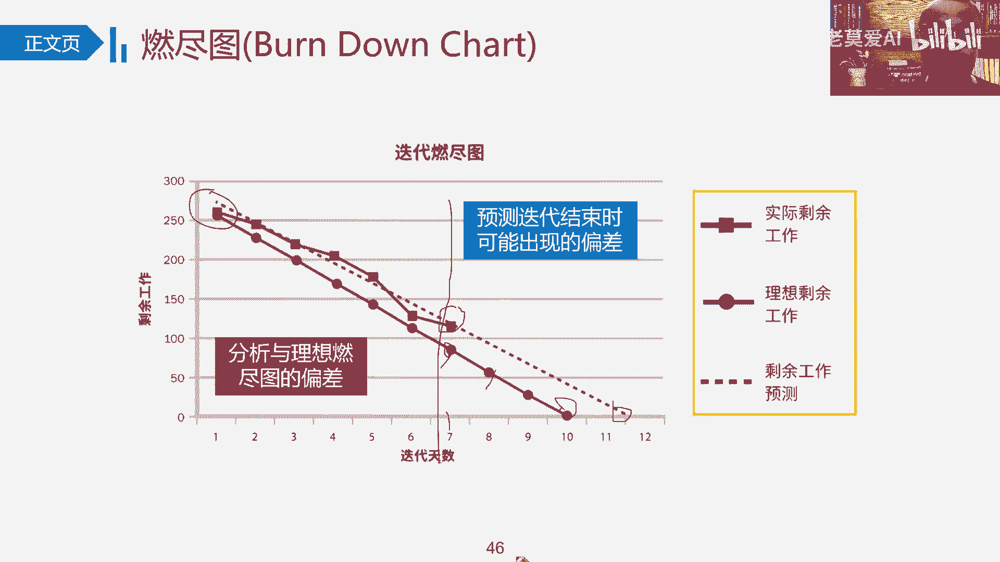

好吧好，这是我们讲的什么，讲的进度，讲到这进度这块，我就给大家把资源这块也带上，一方面你的资源计划里面哪个工作用什么资源，你得上，第二方面什么时间用什么资源，你也得知道，第三个方法就是总体上来讲。

你把资源所有的汇总之后，看那资源整体分布的一个基本情况，那你也得知道一个基本情况。

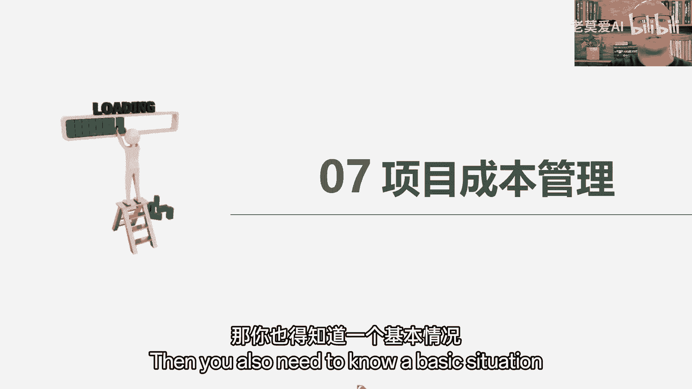

那好了，接下来我们聊聊成本，那接下来呢成本更多关注的是什么成本，更多关注的实际上就是我们讲的资源，注意我们现在讲讲成本，因为在财务上的成本没办法讲，为什么你不说你差旅费之前我们也不讲好不好。

你该加就加里面就行了，添加家里面，我们只要从大体上来讲一下，大家理解一下成本基本的关系就好了啊，理解下成本的这这些基本关系就好了好吧。

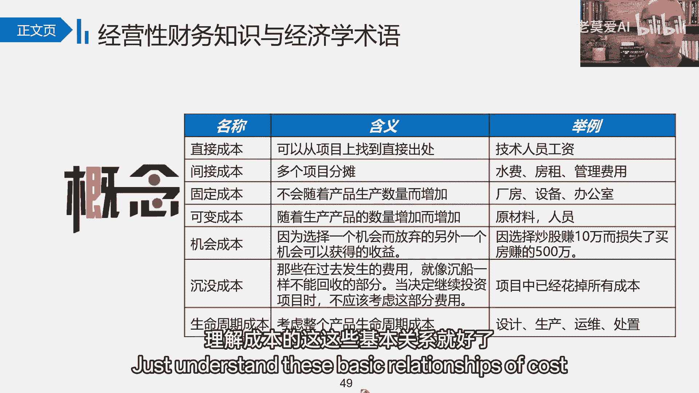

首先我们来看下这个基本概念，直接和间接的这个成本它的区别在哪呢，你能不能直接算到你产品的成本，能算的就是直接成本，不能算的就是间接成本需要分摊的，比如很简单，总经理的费用按什么，按间接成本吗。

为什么他管N多个项目，他管N多个项目，但是你项目经理的成本了，那肯定是你项目的直接成本，因为你只管这个项目固定成本可变成本，他们两个是一对固定成本呢，你反正做不到产品，这钱就得花。

比如说你们说水电不还不能说水电应该是房租，房租是你不管咋样，他是不是都得花的，但水电不一样吗，水电你要生产产品，它就由水电产生，你要不生产啥呢，没有好，这个大家都比较能理解。

关键是这两我想这俩是一对的核心，我们在做成本的时候，在做成本决策的时候，你要做一个什么，做一个相关的平衡，注意我们在项目里面，我一会讲成本，一会我们到时候讲质量都在讲一个基本的点，什么叫基本的。

你要做一个什么，做一个基本的平衡做平衡，那么机会成本，你听这是什么好词儿还是不好的词，机会吗，好事好事，但是我们讲机会成本是吧，我们一般说你不管做人，你不管做任何时候，选择你选择的一方肯定就意味着什么。

意味着放弃了另外一方啊，意味着放弃了另外一方，所以机会成本指的什么，就是你当你选择一方的时候，你放弃了另外一方所损失的成本就叫什么。

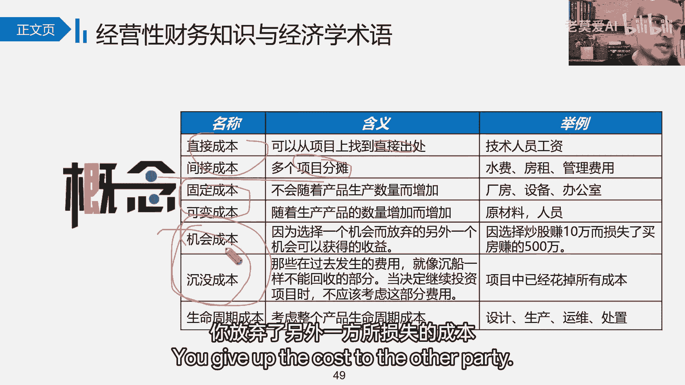

就叫机会成本，现在有两个项目，一个项目能挣50万，一个项目能挣47万，你说那好，我们选50万这个项目好了，那意味着什么，意味着你放弃了47万，这个项目你放弃了47万这个项目，所以什么，所以这叫什么。

这叫机会成本，所以你考，当然我这么一说能理解，但是我再举另外一个例子。

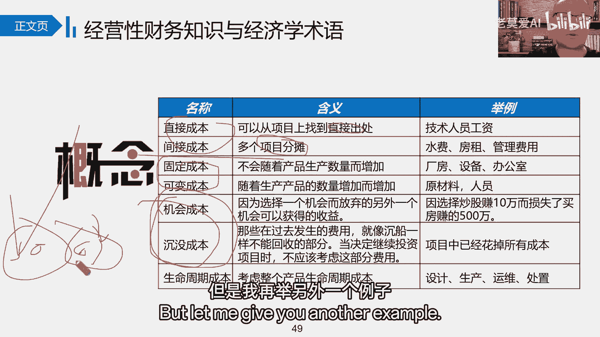

很多人把钱不是放在银行里吗，比如说每年有3%的这么一个利息吗。

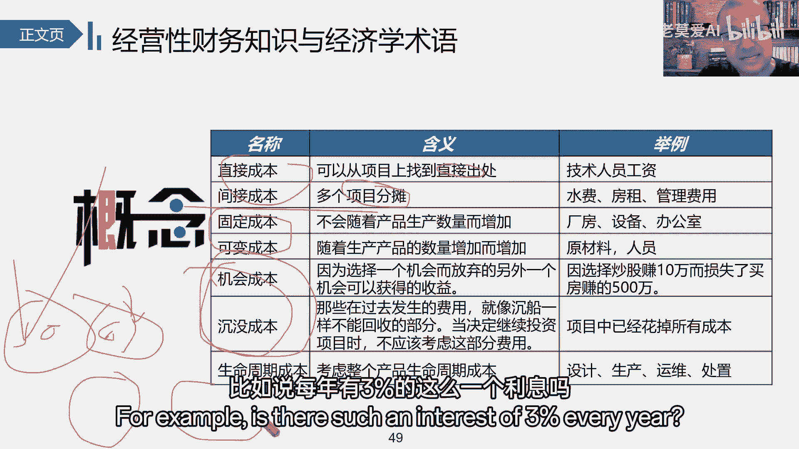

那另外一个人找你来投资，说每年给你给你3。2的利息，我每年给你3。2的利息比银行多0。2，你干不干呢，为什么很多人就不干呢，人家银行三，你3。2利息你就干，那你不是傻吗，那肯定不行，那那那肯定就不行。

那怎么办呢，那为什么很多人不干呢，因为它实际上我们都在考虑这个地方，他会说这么一句话，我放在银行里面，那30%很稳很稳的，你那3。2%到底能不能拿得到了，我还不知道嘞，你光让我投资了。

但是3%我绝对稳得很。

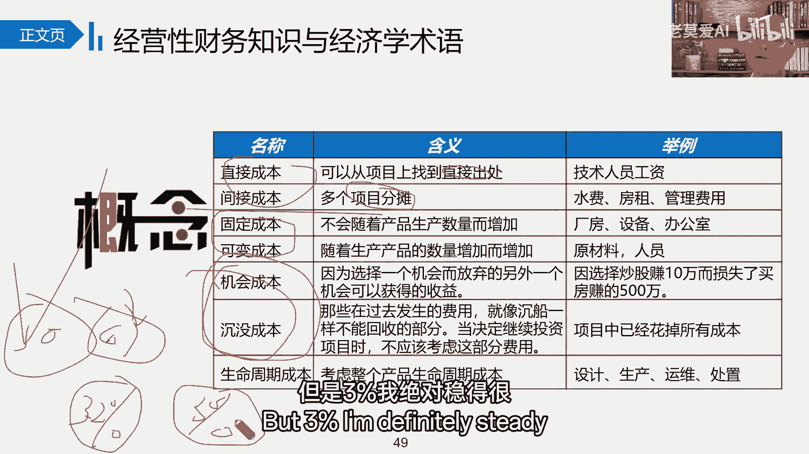

所以说机会成本是你在做选择时候，也需要什么需要考虑的点，需要考虑的，这是我们要知道的一个点啊，这是一个点你需要考虑，但是跟它对应的什么叫沉默沉默，首先说结论，沉没成本，你在做决策时候就什么呀。

就不要考虑那个点，就这个意思啊，比如说你研发了一个A产品，花了100万美组成，那现在呢工资跟你说，又一个产品可能需要150万啊，这个150万呢，后面可能可能能挣个50万，研发这个产品出来。

顺便可能挣个50万，问你这个活儿干不干，你说啥，我投150万，我就挣50万对吧，那我就一共赚200万，200万，那我前期的研发成本，你看我研发这个产品没做成功，这个产品我一共花了250万。

我才算200万，我这得不偿失呀，嗯很多人就会这样算账，这里的沉没成本指的是什么，过了你就不考虑各考虑各只基于当下，各考虑各的，你就不用考虑它，你A产品花了100万，不好意思。

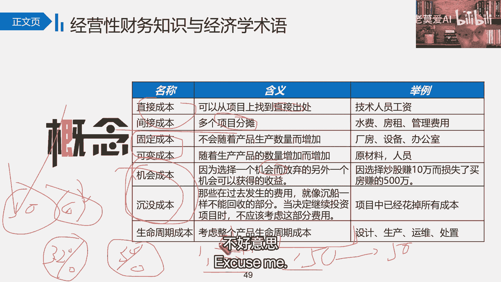

那是你的事，不用管，现在让你研发新产品了，你就只考虑研发新产品的就行了。

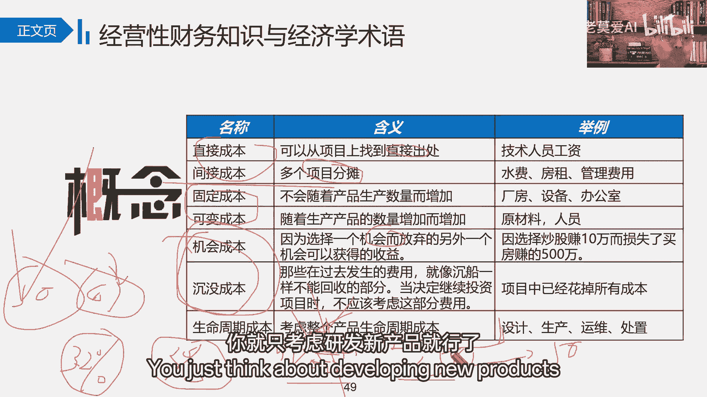

不要考虑你总体的这，这这这是不是我们平时其实也也是在做，我们平时也是在做，其实大家很多时候也都是，但是大家很多对沉没成本的意识只在什么，只在感情上的一种输出，感情上，我这么我这么考虑后发现不合适啊。

这只是在感情上的一种输出，但是我们从理论理性上来考虑啊。

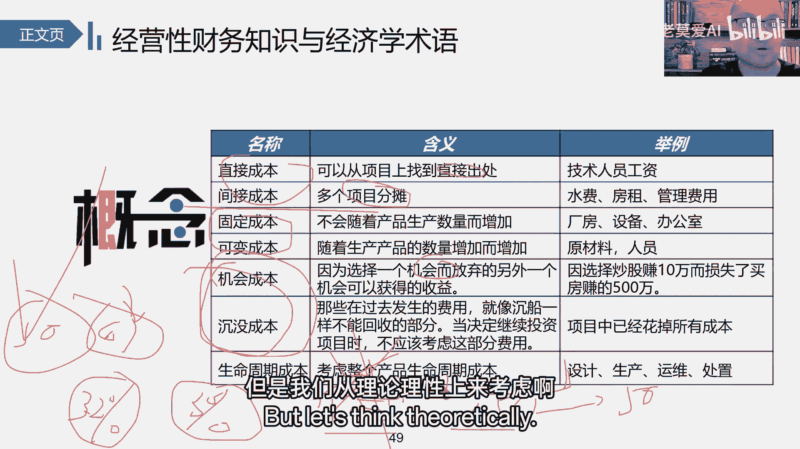

是不能考虑的，各考各的好吧，等一个这叫什么什么成本好了，那我们这里不就有四个过程组成吗，估算这叫什么，制定成本成本计划估算给我做好估算成本，制定预算以及我们控制这个成本，现在很多人把估算跟预算搞不清楚。

到底估算是啥啊，预算是啥，我看估算你妈也往上加嘞，你自上而下的估算不是也往上加，预算也往上加嘞，它的核心是什么，好我们结合资源给大家讲一下，估算成本，估算什么，实际是什么。

我们刚才不是说吧用了多少资源吗，那你成本怎么来的，那些资源的数量乘以单价，这叫什么，这叫你估算出来的一个什么，估算出来的成本，那你把所有工作包成本一相加一加，注意哦，一加之后还算吧，叫总估算，明白吧。

这叫总估算，这叫总估算好了，你拿了这个总估算给谁啊，给领导说，领导我估算一下我们这个项目需要500万，这叫总估算啊，领导说好吧，那就500万，你既然算了，那就算了吧，那就P了。

P了之后这500万才能叫什么，才叫500万的，什么500万的预算，那你拿着这500万预算在干什么了，才又往下走了，才把它分解到每个工作包里，这边这个工作包100万，这个工作包100万。

这个工作包300万，那针对这个工作包来说什么，你这个工作包你想办法最多只能花这100万啊，当然你可以节省一点，在试用过程也可以节省，甚至可以多花一点点，但是100万的预算就这个意思好吧。

你是工作医保工资包什么是300万，是你可以花的钱，所以你知道了吧，估算的目的是为了给预算提供什么提供参考的，那他得知道你这个预算到底怎么来的，那预算的目的是什么呢，预算的目的是告诉你，你只能花这么多钱。

领导只批了这么多，你就只能花这么多钱，就这个意思啊，就这个意思好吧好就这样就行了好吧，换句话说我再换一下，总共算500万，0~7的时候，领导说啥，500万，要不然那么是不是给你480万，你估了500万。

估计你估的时候有水分了，给你480万好了，那你说那那那只能480万好了，那你拿这400万也要往下预预分啊，比如450万吧，480万，450万，是不是把所有的活都打了九折，那假设你分的时候。

你也把所有的火车打九折了吧，都打九折就完了，比如说100万好了，我只能给你90万了，没钱了，这个只能给你90万，也就是说你这个工作做只能250万，所以基本思路是一致的好吧。

估算是为了给预算提供什么提供这个参考，预算下来半年下来就具体能用多少钱。

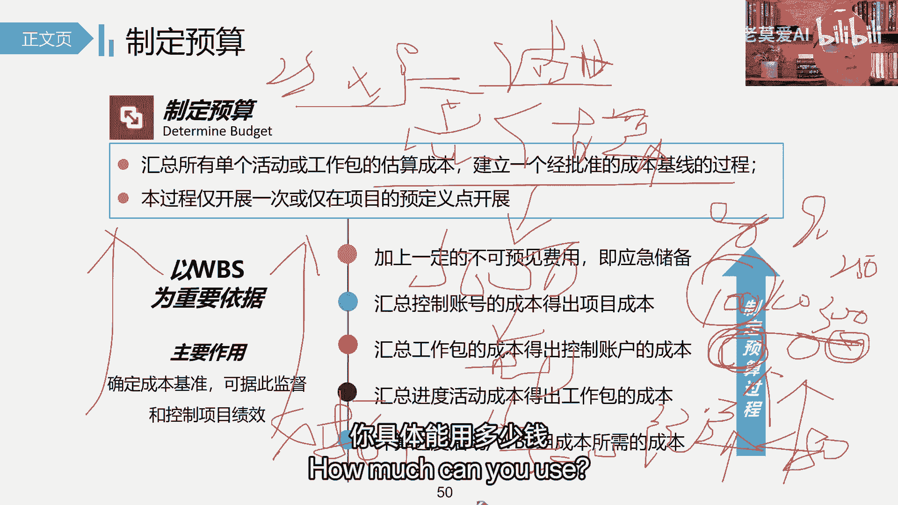

你多少钱好吧，你看批准的全部资金，那为什么说这个预算我们现在又存在过了，刚才我们讲这个字，讲资源的时候，是不是第一个叫资源需求表，就是每一个工作包对应的，你需要什么样的资源，第二我也给大家说了。

叫什么叫资源计划，你这个资源计划相当于什么，按时间维度进行分配的一个资源计划，第三个其实叫什么资源，总体的复合图，就是用资源什么时候需要什么，那个大项目才用好了，那现在我们讲的成本基准是什么。

我们把它叫成本基准计划或者叫成本计划，什么意思呢，因为我们的钱啊，一般情况下老板不会把钱一次性给你好了，即便一次性给你，你花钱，第一个跟这个对应的是一样，是不是每个任务上就跟刚才我们分享下来。

每个任务上需要花花多少钱，关键是第二个呀，你这个任务也得围绕着时间的曲线来啊，什么时间我需要花多少钱，就会形成一个什么时间的这么一个什么直方图，1月份我需要花多少，2月份我需要花多少好，第三个呢。

我们把这些进行累加，不就成为什么成本曲线吗，那累加成本的目的是为什么，第一个我往前推，截止到现在我一共花了多少钱，是不是心里有个底，第二个基于现在我往后预测，我往后预测是不是可以做趋势预测。

我整体上后面还得花多少钱，是不是也心里有个底，他是这样的一个基本点，所以呢我们的成本计划是一个什么，是一条按时间分配点，什么S型的曲线，就什么时间我需要多少钱，什么时间我需要多少钱，以后我还需要多少钱。

所以这叫什么，这才叫成本化或者叫成本计算，按时间分配的，按时间段分配的，他怎么来的，其实就是有每个月的时间，先看所有的任务我需要多少钱，再看我什么时间我需要多少钱，再看我整体时间需要多少钱。

整体时间需要多少钱好吧，那这里涉及到风险的两个点，就不就不多说了，应急储备，应急储备包含在基准内，管理储备不包含在基准，他们的核心是什么。

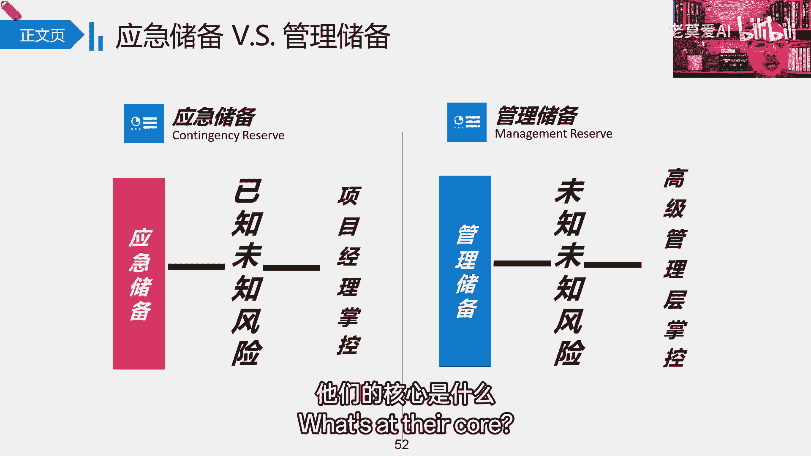

应对风险好吧，这个我们就不说了，好成本汇总嘛，你看这把它整体一汇总。

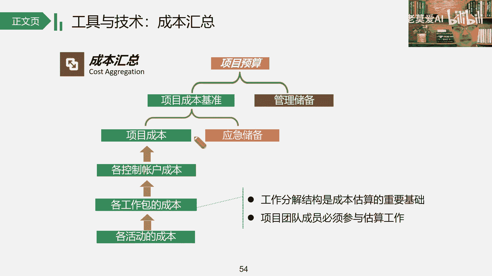