# 【最好的PMP课程】PMBOK6精华讲解2-4 - P1 - 老莫爱AI - BV1e1421k7Dh

好这是我们什么，这就是我们最终的一个成本基准，你看成本计算按时间分配的一个什么成本计划，他怎么来的，就是按照我们每个月的计划，这样什么加起来，每个月的计划怎么来的，是按照我们按时间维度。

每个月要做什么任务，那个任务需要多少资资源。

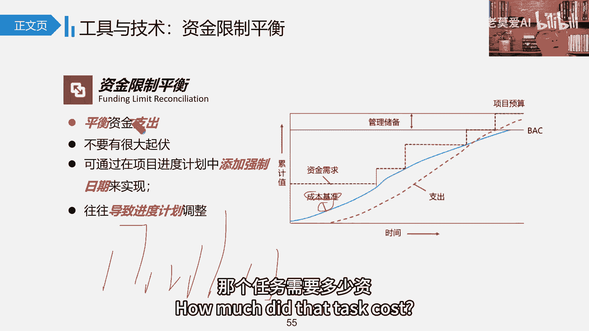

资源的价格怎么样把它录下来，因为啊按照工作包揽，所以我们才说这个叫什么，资源计划和这个成本计划都是读围绕着什么，围绕时间的一个维度来的啊。

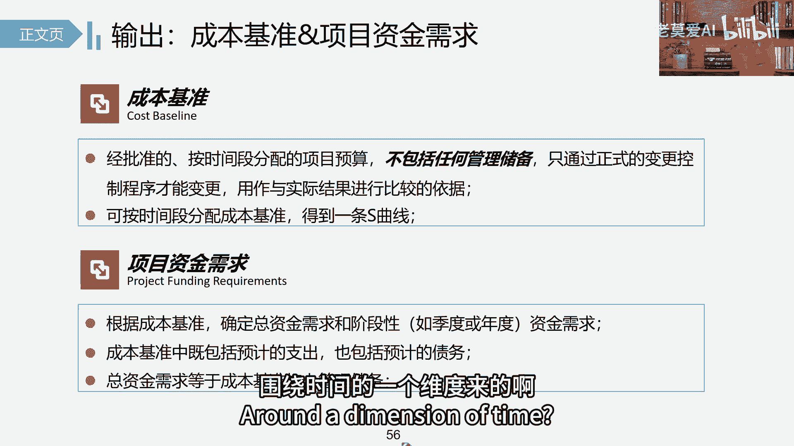

围绕时间的一个维度来的好吧，这个都没什么特别讲的，好好我们聊到政治，在正直这一块，我们现在的核心尽量往前推，而不是往往后靠，也就是说我们现在尽量就熟悉，第一个先熟悉它的一个基本的词语。

第二个知道偏差就行，更多人质量偏差，所以它的词语就说我们计划价值，我们得知道什么，首先我们得知道政治管理里面，我们叫什么叫绩效测量啊，叫叫绩效，绩绩效测量基准，那不叫绩效绩效计测量基准。

它就等于是什么成本，也就是说我们把我们干的活儿，需要干的活进行什么，用成本量化来，你比如说我们刚才说500万，500万批了，也就意味着你干这个活，你需要花500万，那我们只是给他换一种说法，叫什么说法。

就是说你这个活就值500万，你就花了500万干了500万的活，这是给他定一个什么，定一个基本的批准，那换句话说，我们现在能理解你花了500万，干了500万的活，你就是顶呱呱，就是符合预算的。

你花了500万没干完，500万的活，说明什么，成本肯定要超支嘛，成本肯定上成本，那好了，我们在时间的维度再来说，按道理你这个时候应该花500万，也就是说你应该干500万的活。

但是你实际上只干了200万的活哦，那不好意思，你进度就延误了，你把活没干完吧，进度就只能延误了，你按道理应该干500万的活，你干了700万的活哦，现在你进度肯定会提前的啊，你今天的进度要提就提前了。

因为你活干超了呀，所以首先得明白他们这几个基本的概念啊。

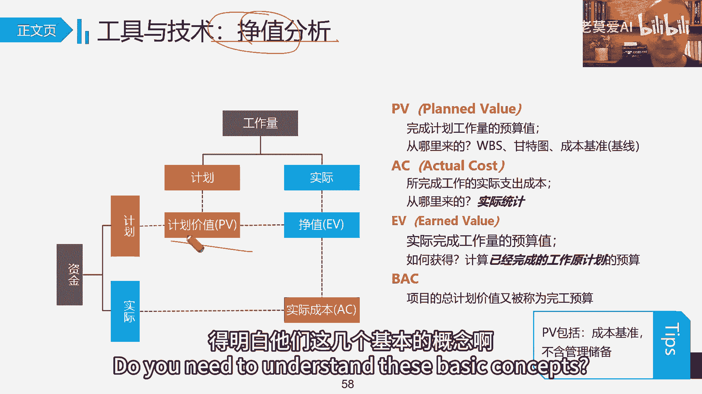

再了解它们之间的一个偏差，偏差给大家讲一下这里的核心，第一个就公式而言，EV都在前或者1V都在上，这是第一个，第二个就是我们讲的大于零都是好事情是吧，大于都大的都是好事情，大于一都是好事情。

小于零呢小于一都是不好的，那等于零呢等于一叫什么叫符合的，符合的好，这是第二个给大家说，第三个给大家再说，另外一点，也就是说成本偏差和进度偏差叫什么，叫绝绝对偏差啊，叫绝对偏差，它只能用在什么地方。

只能用在那种叫什么用，用在那种叫什么就叫什么，同一个项目的不同的阶段，或者项目的基数是一样的情况，你可以进行对比，要不然你是不能跨项目对比，而CPI叫什么叫相对偏差，它是可以做什么。

它是可以做不同的项目之间做一个什么啊，计量对比好，这是我讲的第三个，第四个关于s s SPA的SPA大于一，只能说明什么，说明整体的进度偏前，但是这个项目的进度一定偏前吗，不见得为什么。

因为我们刚学关键路径法，项目进度更多是由什么决定的，由我们的关键路径来决定的，那就意味着什么，意味着我们项目的进度，虽然SSPI大于一了，我们还得单独测量一下什么关键路径上，他干的活到底有没有抄。

如果他超了，我们就能飘起，如果他没超了。

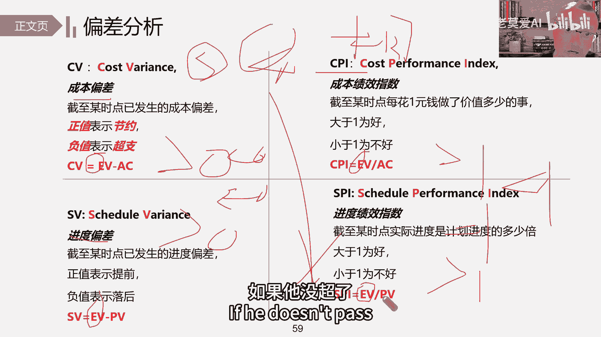

那就没法选好这一个电源，它特别注意一下好，这是我们从实际上说，这些完工的偏差，实际上这些词往后越推的点，大家理解一下就行了，大家理解，反正往后因为现在考试的话，技术这一块儿针对这个叫什么。

因为计算这一块考的也越来越少，越来越少了，而针对政治管理这块，我们更多的其实站在现代角度，你更多把它理解的偏差，这个程度已经已经OK了，往后面更多是知道有这么个点就可以了好吧。

接下来让我们聊聊质量调到质量啊。

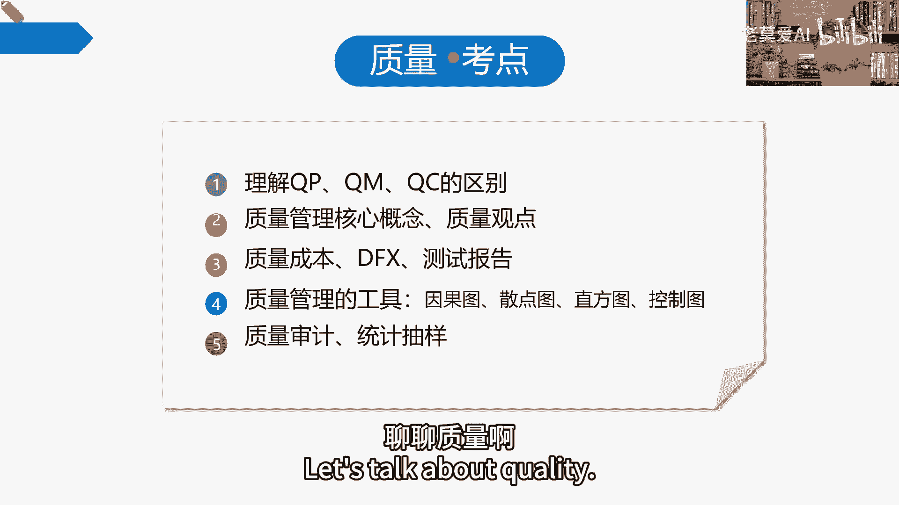

质量这一块的核心是什么，首先第一个你得知道质量的概念，我们质量的概念，我们为什么很多人谈不到质量，因为我们对这种质量没概念，因为它是什么内在的东西，通过我们能看到管理质量，管理什么。

就是管理几个指标减一减，看一下指标合不合适，所以但是我们得知道这个指标到底合不合适，从做的过程来讲，它是先有过程再有结果，而不是我们看到结果再反馈一句过程，那这这这这个就不太合适。

它一定从过程中间一步一步，才能得到最终的什么，最终的一个结果啊，最终结果好，这是第一个我要讲的一个点，第二个我们前面讲范围，基准计划，进度计划，成本计划，或者说我们讲范围计划，进度计划，成本计划。

在我们正常讲真在实际过程中，我们还有什么资源计划，我刚才给大家讲的一系列资源计划啊，这是我们讲的核心计划，辅助计划呢，我们一般就会讲什么叫风险应对计划，但是质量这一块我们把它叫什么叫支撑计划。

不把它叫核心计划，叫支撑计划，为什么呢，注意这里，首先我们要把两个词要分清，质量计划和质量管理计划，它是两个不同的槽，原则上来讲，你说质量有计划，没有质量有计划，所谓的质量计划。

你可以就理解成什么质量标准就完事了，因为质量只有一个标准，质量只有一个标准，没了就没了，有的人说那不是啊，我们公司质量计划他不是，他不是在什么时间我要减什么，要达到什么程度吗，注意注意啊。

你的那个你你你的转速啊，你比如说我们我们说就说啊，其实转座它它在出厂的时候，假设一分钟要转300转，但这300转怎么来的，300转，300转怎么来的，300转，你看他是不是就一步一步，比如说第一步先装。

那没有动力的时候空转，第二步加上动力之后，对第三步整车组装，那他这三个是不一样的，第一个没有动力，时空转，你转不到300转的，你肯定赚不到300转的，但是结合他的分析，他说那你至少可能得转到50转吧。

得转到50转，第二个加了动力，因为这个时候只有动力起，肯定要比什么300转向舵，他说你至少达到350转，这是他的检验标准，第三个是整车装配，整车装配刚才只有动力，现在整车装配之后。

是不是又有其他的重量放在上了，好可以大于300，这就合适了，谁合成，那有的人说，那我第一步减50，第二步减350，第三步减减大于300，这不就我的质量计划吗，注意其实这个也叫质量管理计划，是更多的是你。

你是为了检查最终目的能不能达到300，这也是质量管理计划的一部分，质量管理计划的一部分，是这样的一个也是这样的一个基本点，所以在质量这一块，我们能达到的一个基本点就是什么。

我们的质量的指标跟我们分阶段一些指标，以及我们接下到底怎么来管，我要什么人，采用什么资源，也同样的采用什么，哪些检测设备，在什么点检测，哪些具体的指标指标达到了一个标准，什么样更多的是什么。

我们把它叫支持计划啊，我们把它叫支持计划，所以质量管理计划它更多是什么，更多是一个管理计划，更多一个什么支持计划啊，支持计划啊，这就是为什么在实际项目的工作中，其实很多人也没有接触过这一块。

因为这是计划呢，在咱们工资体系里面已经很完善了，两组的都有，那我们先来聊一下质量和等级，这是两个完全不同的两个基本概念，一个叫质量，它是一系列内在性能满足要求的程度，那他只有两个观点叫什么，要不满足。

要么不满足，换句话说要不良品，要不什么，要不不良品，但是等级不一样，等级不一样，等级是我人为的，把它分成什么369等，369等好，这个时候我们就要说了，首先他第一个前提条件是什么，必须满足相关的规格。

也就是说首先是质量必须合标，第二个就是质量和质量之间，有等级上的差异而已，就是满足的程度有差距而已，你比如说我们说车，我们的车我们分假设我们就随便买，我们的高中低等级，高中低等级的高等车，时速300。

中等级时速200，低等级时速100，我们假设我们是这样的，这是我们人为分的吗，为什么你在高速路上跑，你像美国那种那种大路，没什么，人人跟人之间又远，所以他速度本身就设置的很高呀，当然对吧。

那你说你在咱们家农村的家里，你那个头路上，你现在能够把它标到300迈，没有意义，没有用，明白吧，你买个300迈的车，你没有用，所以呢我们什么我们愿意买这个100万，买这个低等级的。

所以但前提我们刚说的第一个，他必须要质量符合要求，什么叫质量符合要求，我要是300卖，你给我说，你这个速度就绝对要超过300万才行，那我要是100万嘞，我说100来注，注意哦。

不是说这个时候我W300怎么样，你达不到300没关系，但是如果你能超过100，对我这人来讲是什么质量较合格的，只能叫合格的，所以这叫什么不同的等级，所以在这里有一个基本的概念给大家了解一下。

说我们以后说质量，你可千万别跟人在怀疑，说你能不能把你的质量标准给我降一下，不是注意我们质量标准不降，质量标准一旦定到了，只有好和不好的，你可以降什么，可以降质量的，什么质量的等级。

在咱们公司里面叫什么叫优等品，良品次品不就这样吗，优等品高质量高于你现有的标准高了很多，你自己可能定这个标准，其实是不是也是相当于你，你你把它划到一定等级呢，两品A刚好达到质量的那次品就是不满足质量。

那就是这样的一个基本点好。

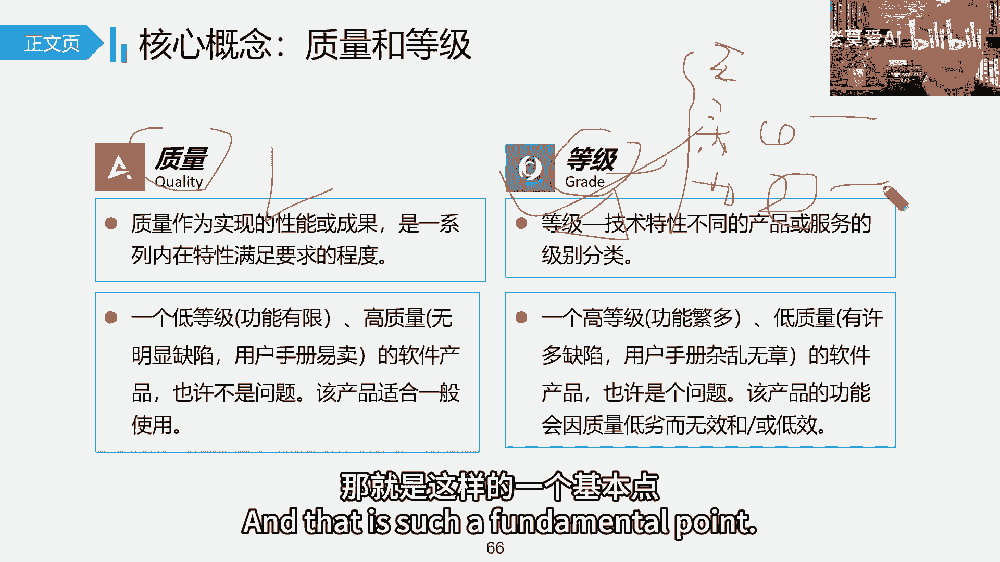

这是等级的一个基本点啊，等你这个基本这还有两个基本概念，一个叫精确，一个是准确啊，精确一个叫准确好，我们换我们，我给大家举个案例吧，你打板来说，你说你比较喜欢打枪，比较喜欢打靶，什么叫准确呢。

我们的目标是什么，目标是打的这个什么打的这个靶心嘛，十环嘛，这是我们的目标吗，那什么叫准确呢，准确就是离目标很近叫准确，你打的九环九环九环九环九环，这叫什么，这叫很准确，好称这个黄金。

这个黄金正常重100克100克，那你估算了，你估算了99克，这很准确啦，我估算了80克，我估算的不准确，为什么距离目标单位太少了，只要不准确，那什么叫精确呢，精确指的是什么，注意我虽然没达到九环。

但是我打到七环，我第一个七环在这，第二个七环在这，第三个七环在这，第四个七环在这，所以我这叫什么，这叫精确，他跟目标没关系，他们每一次作业之间，我看他们的紧密程度，顶点之间的紧密程度有关。

那怎么样更好更好的细化能说明问题有关，那好了，你说是100克，标准是100克是吧，你估了99克很准确，但是我估的是80。153克，所以我叫什么，我叫精确，我是不准确，但是我比你精确。

因为我已经精确到什么小数点后三位了，所以我们经常讲什么小数点后两位。

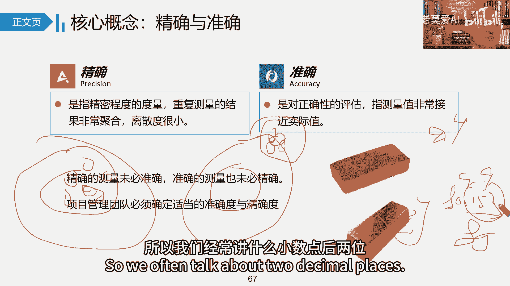

精确到小数点后三位，说的就是这个意思啊，好所以呢对于质量这个点，我们往往跟那个叫什么，跟这个质量的人说不到一起来的点就在这，因为在做质量上的关联那里，很多时候我们但不管怎么做都不过分。

所以他往往把质量做的什么做的很很好标准，比如说十，他能把这个质量给你做到二十三十五十好不好，好事质量绝对是合格的，但是在我们做项目的时候，你得做好什么，做好平衡，什么叫做好平衡呢。

高质量是要花什么高价钱，高成本来做的呀，而你项目的成本就那么多，对不对啊，所以我们叫什么叫满足要求，适合使用就好了，买的就是符合使用，符合要求，适合使用就好了，你别把它做的太好太好。

有的时候就有点什么就有点浪费了，你时间一长，你到那个点没没结束。

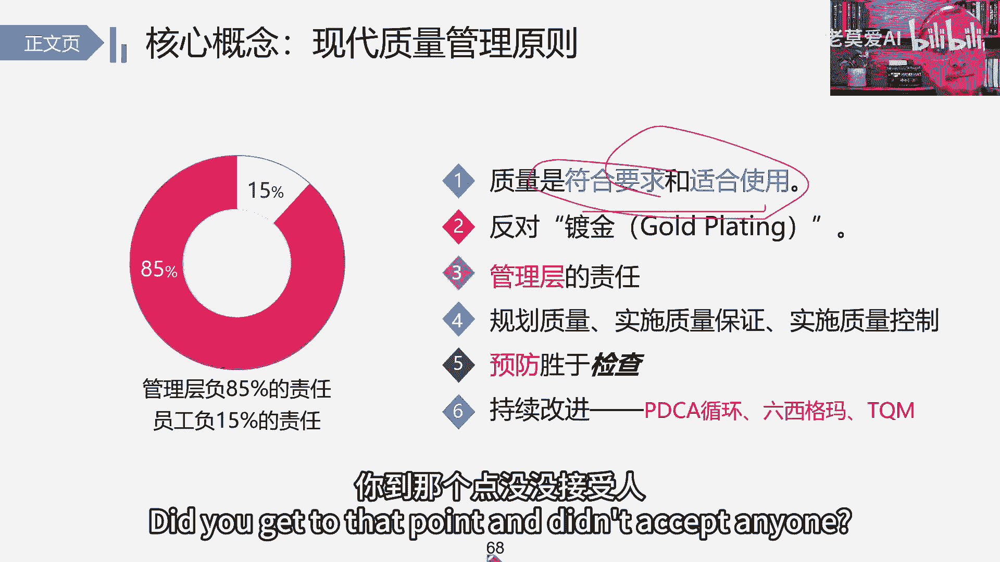

时间就是浪费好吧，因为我们什么是有成本的，质量本身有，所以质量成本我们把它分成一致性和非一致性，一致性和非一致，首先跟谁一致，跟谁不一致，指的什么，指的就是跟客户所要求的东西。

如果你做这些事情是为了符合客户的要求，我们叫什么叫一致性成本，而这个东西是不符合客户要求，叫什么叫非一致，你看非议制返工四遍，符合客户的要求吗，不符合呀，那中间我觉得他没有，这是更好是吧，他没有就没好。

后面你把它留给客户了，那没有是最好的，但是尽量不要出现，那为了符合客户的要求，我们前期该培训培训，该测试测试，该检查，把它做的更好一点，但是我们讲质量成本它是一个什么，它是个名词，但是它也是一个动词。

也就是说我们需要做什么，做质量成本分析，做质量成本，因为前期这些东西是不是也要投入一定的成本，所以那你就要想了，到底是我们前期要投入的这些，这些成本跟后期的成本，我们到底怎么样在做天门中间做一个什么。

做一个成本效益分析，你是愿意前期多投一点钱，保证后面没出来，还是愿意前期少投点钱，抱有侥幸心理要出来了，你再给人家补来，你要做好什么平衡。

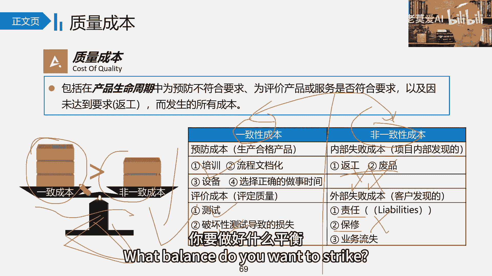

所以这个点跟我们在书里面讲的另外一个工具，叫什么叫成本效益分析。

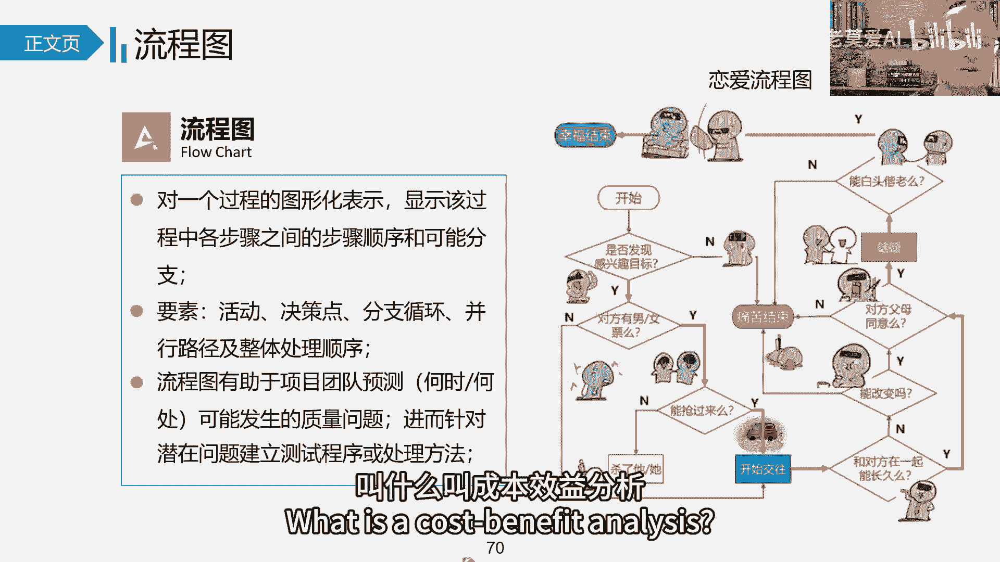

它还是异曲同工的，他要用的点其实就是全部交易分析，成本效益分析。

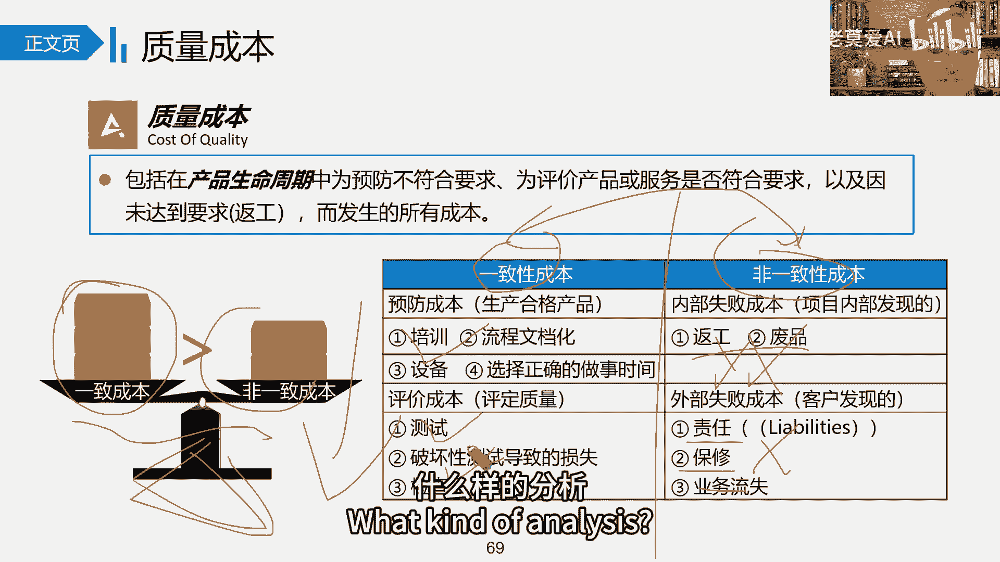

好吧好，接下来我们讲的这么几个这么几个基本的工具，就是我们质量管理过程基本的工具，大家对工具的用法还是知道的，特点作用就好，流程图从前到尾流中投，核心目的就是为了知道每一步做什么，每一做什么。

方便我们找到质量缺陷，从哪里回收线，以及方便我们安插什么相关的检查点。

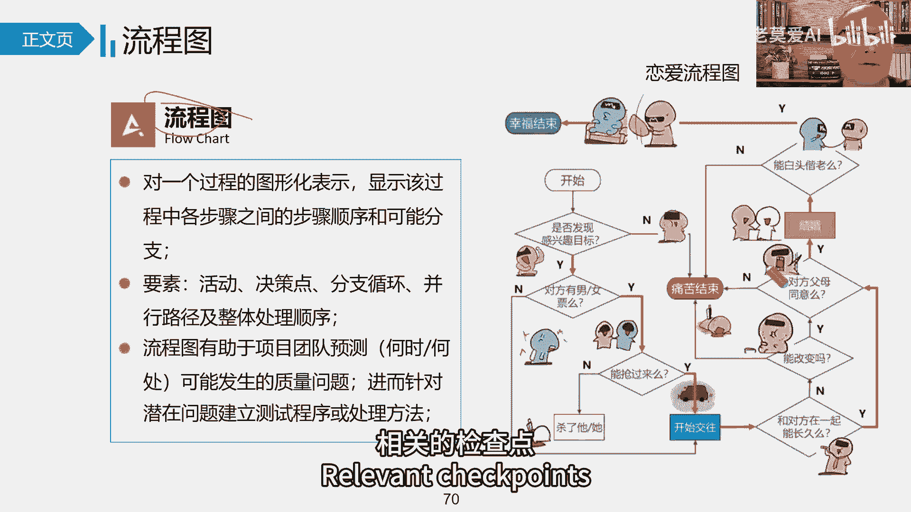

按安排相关的检查点，这是相关的，也是跟他一样的，什么流程图，好在前期我们的规划阶段，还得看后面我们采用什么样的工具规划，还有做哪些测试。

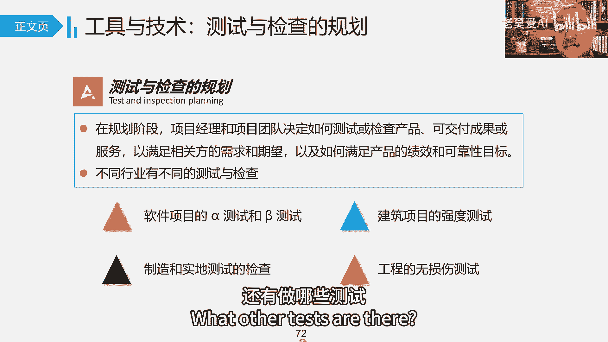

那你后面都前期规划的时候啊，都得把它做好是吧，才有相关的设备，相关的目标去做好质量管理计划。

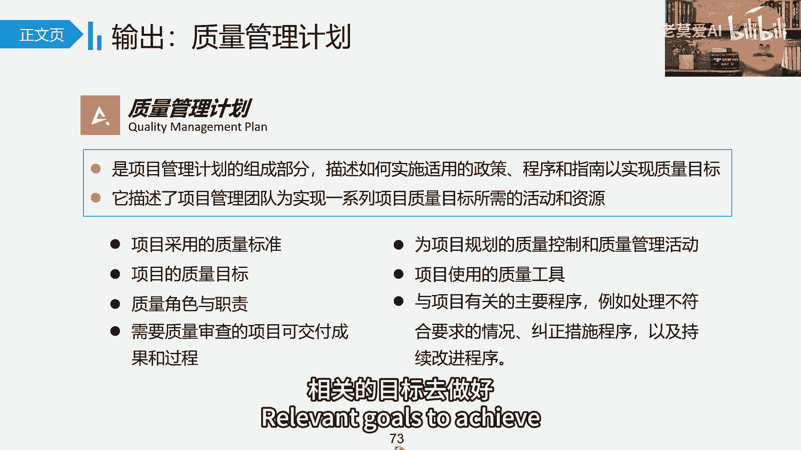

这我们就不说了，没有什么特别的好，这到时候要测量哪些具具体的基本指标。

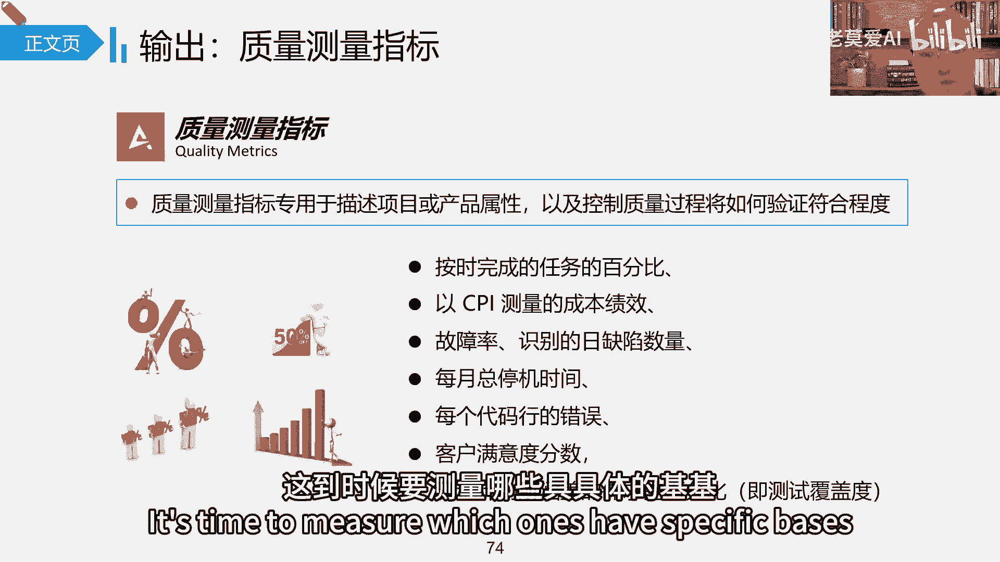

我们也得把它说出来啊，没有软是那进入管理质量部分呢，我们的核心是什么，我们的核心就是，通过我们质量相关的工具与技术，我们来做好什么，发现相关的质量问题，进而什么来解决相关的质量问题，就这样一个点啊。

就这样一点好，核对单，这要跟哪一个做区别呢，核查表核对单它是用来什么用来打勾的吗。

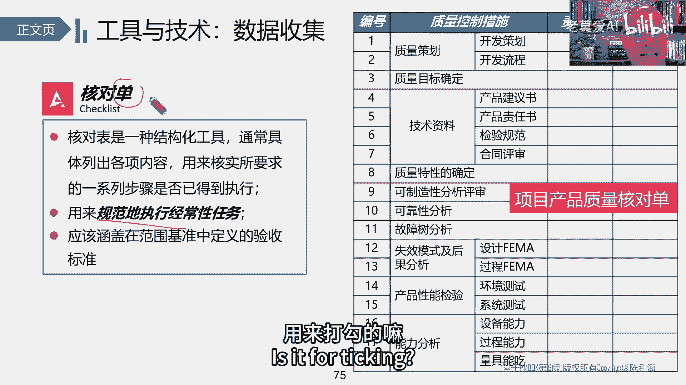

你做了还是没做，但是核查表是用干什么用来记住的，对啊，找到问题之后，我们有个基本的原因叫什么RR，这是什么RCA嘛，根本原因分析嘛，那根本原因分析我们为什么要做根本原因呢，究其本质是什么。

找到根本原因可以杜绝问题是什么，再次发生好，这是一个技术，我想说的是，它和它之间有什么特别的区别。

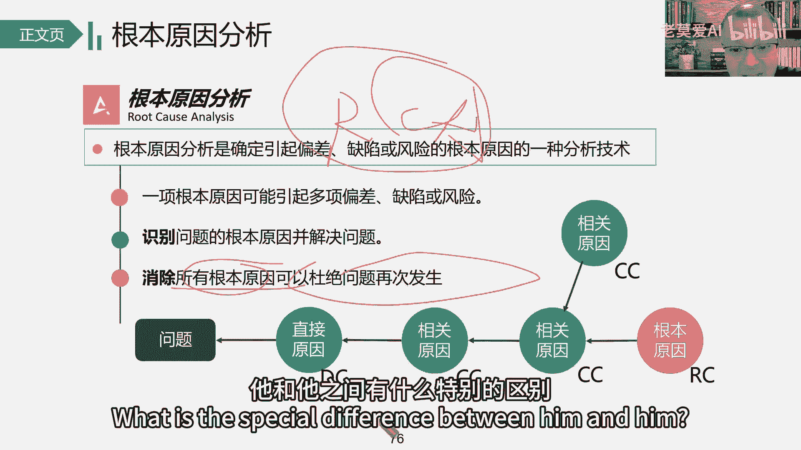

我们先把它说完啊，因果图有时候也叫什么，也叫鱼骨图，为什么也叫YY头，那他们两个之间有它可以帮助我们分析原因。

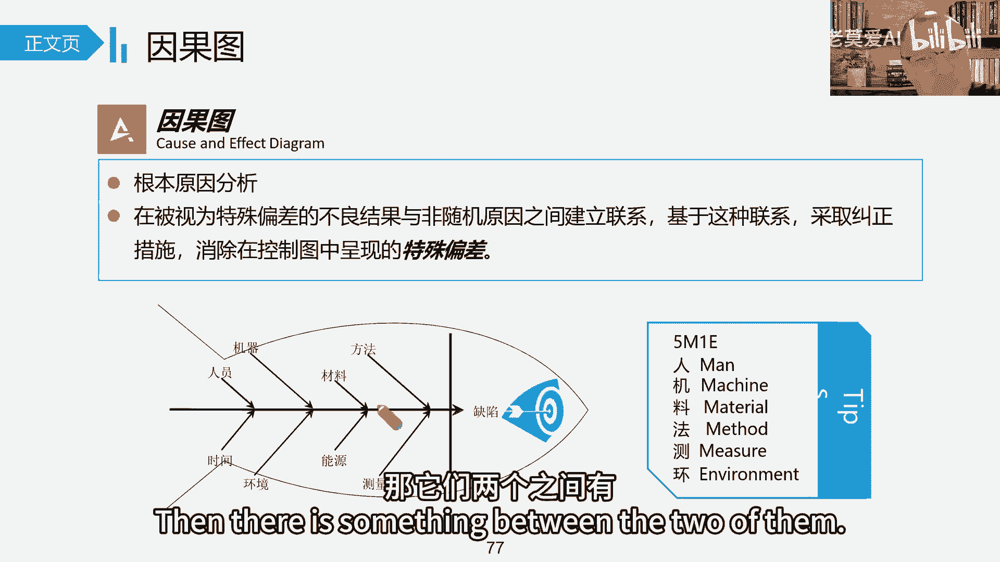

那么这个和根本原因分析之间，他们有什么区别呢，注意我们得知道根本原因分析它是一个什么。

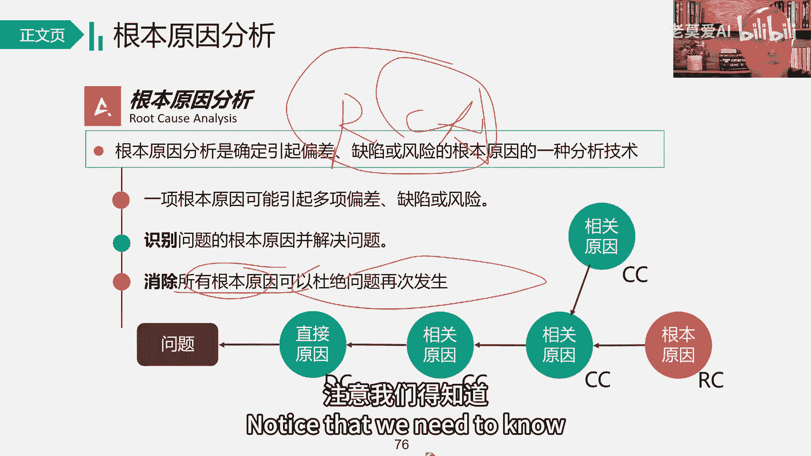

它是一个数据分析的技术，它是一个技术，他用这个技术的目的是为了找出根本原因，进而把根本原因干掉，从而干什么，从而杜绝问题的什么问题的再次发生了，那找的过程中呢，你要找到根本原因。

你是不是要找找很多的这样一些基本原因，找这个根本原理过程中，你很可能要通过这个因果图去帮你，理清楚你的什么，理清你的原因，但是他是唯一的吗，不见得也可以用什么5W论法，就是问五次为什么找到根本原因啊。

所以根本原因分析技术它是一种艺术，而鱼骨头它是一种原因展示的工具，可以帮助我们找到根本原因，但是它并不是根本原因，分析这个什么，这个工具它是一个图表。

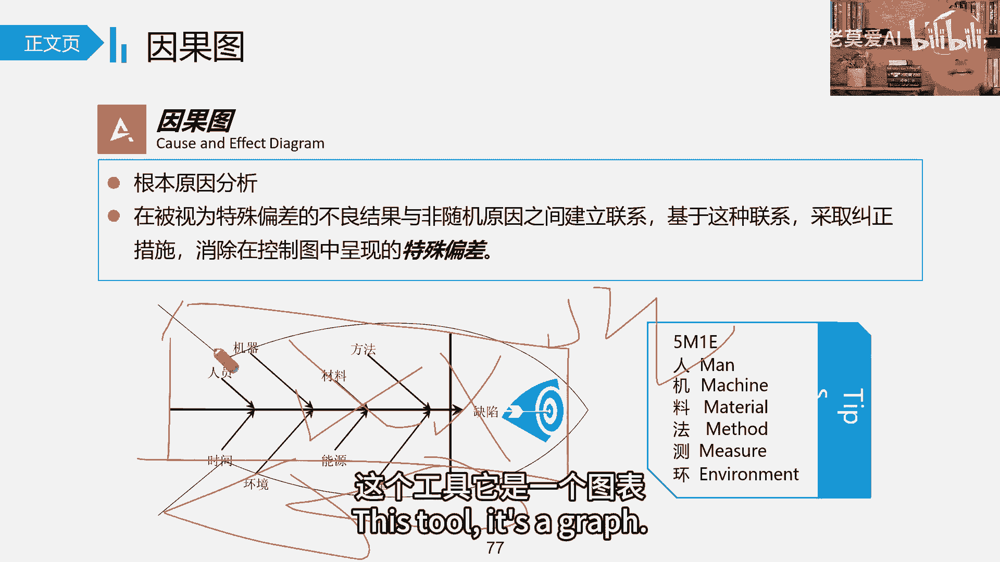

它是帮我们找到原因的，它是一个图表是吧，看这好吧，展示的工具好，直方图用来统计底下是相关的，这个项目项目是相关的什么，用柱状图的高低来代表他的什么数量，通过这个数量我们来看到什么。

主要是看到它的一个分布趋势。

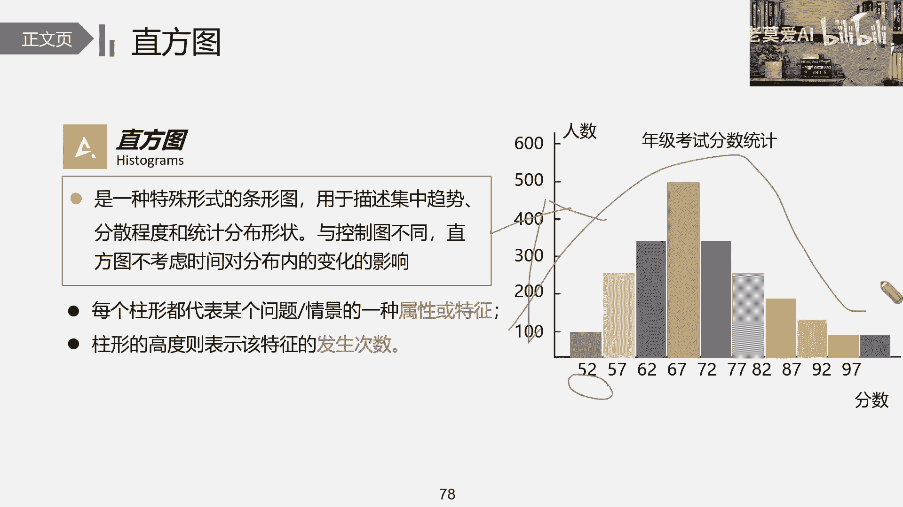

换成他的什么分布趋势，而跟直方图这个特殊的直方图叫什么叫帕累托，那正常我们脂肪的有的可能跟他一样，没有什么特别的趋势，在那怎么办，比较乱怎么办，我们又要解决问题，那怎么办，我们用帕累托对对它进行排序。

对它进行排序，把最主要的往前放，占比比亚往前往前放，排序之后带给我们的是什么，其实啊，我们在整本书里面讲排序的地方还比较多，你比如说我们前面有一个什么项目组合，项目组合的核心是不是用来排序。

排优先级的对吧，这里我们讲了帕累托排优先级的，其实回头我们学学完敏捷之后，有一个敏捷的，我们刚才那块讲的啥产品代码列表，它也是干什么，需求里面也是排序的，以及后面我们讲风险，风险里面的什么叫什么叫定性。

风险分析也是做什么，做排序排序的目的很简单，就只有一个目的，让我们更多关注什么，更多的数据放在什么那种优先级高的，这样一个什么一个基本点上啊，优先级高的这样一个基本点上啊。

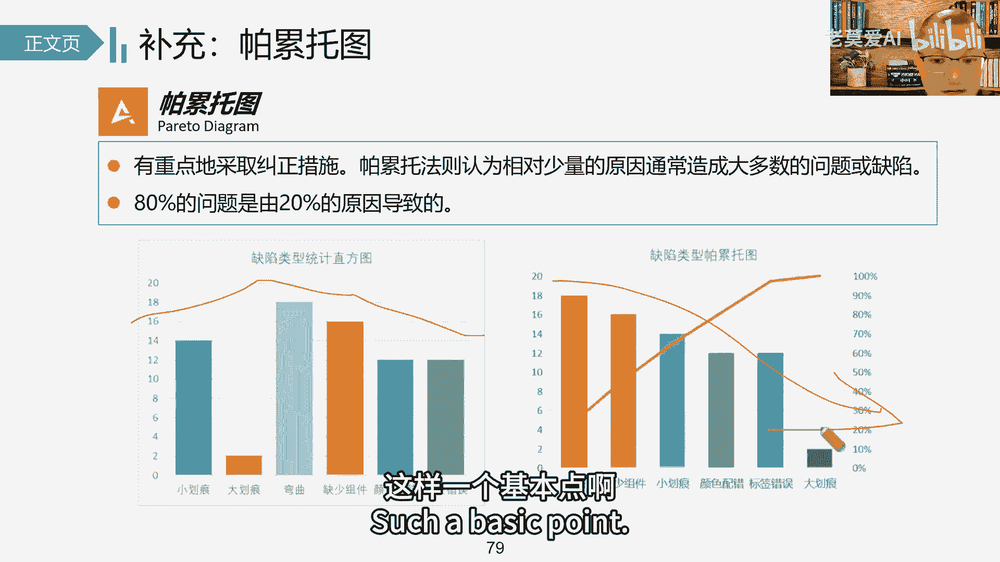

好散两头找到两个两个原因，两个事件它们之间相关的一个什么关系，看他们关系如何，到底是有通过三点头，看它们是有关系还是没关系。

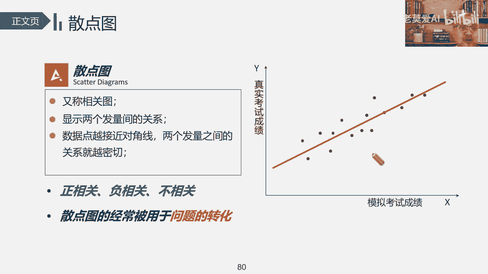

这样的一个基本点啊，三点头好，这里还有一个非常重要的工具，叫什么叫审计，审计，我们这里一共讲了三个审计嘛，质量审计，风险审计，还有管理审计啊，不是采购审计和采购审计。

那我们现在这值我们得知道审计到底在审计啥，首先说第一个点，审计到底是好事还是坏事，你得知道这个行审计在实际中，大家很多人把它认为什么，认为是坏事，为什么，因为审计都是过来找麻烦，但是在理论层面来讲。

实际上是什么是好事，为什么找你麻烦呢，因为你没按照这个来做呀，从理论层面你按照这些来做，它就是什么，它就是好事呀，所以找你麻烦很正常啊，因为理论在这啊，你实际在这中间会有差距啊，这就是找你麻烦的地方。

但是审计在理论层面，他讲的这可以是什么是好事，你看识别好的东西，识别不好的东西，分享好的东西，积极主动帮你改善，每次还要总结经验教训，这不全部都是好的事吗，所以审计是好的，这是第一个。

所以我们要全力配合，这是第一个，第二个审计，审计到底审计什么东西，首先我给大家说另外一点，就是我们经常讲什么叫SO999001呀，SOO的9000呀，这样一些基本的一个认证，那你得知道审计是一个什么。

是一个通用性的法则，通用性的规则，那好既然是通用性的规则，如果他审计公司里具体的东西，请问他懂吗，他不懂，所以他审计什么，只能审计一些通用的基本的规规则跟法则，放在我们这里。

什么就是我们你在管理质量的时候，有没有按照质量管理计划那些点具体去落实，具体去干那些事儿，因为你通过过程来来来来来来来，管理质量才能出来结果，那你固定中间省略一点，如果你没做那什么。

那到结果可能有好的过程，我们可能说才有好的结果，但是一般情况没有好的过程，你要有好的结果，那就是不孕了，但是一般情况没有好的过程，我们认为一般就没有好的结果，所以我们首先要保证什么，保证好的过程。

所以审计核心就是什么，审计的核心就是吧确保我们有好的过程，所以它只是什么，它更多是我们有没有遵循相关的政策，过程和程序的一种使用呢，这些东西在哪里体现，这些东西都在什么质量管理计划来体现。

所以审计他审不审计质量标准，审不审计，具体你质量做到什么时候不审计，他只审计你的相关的什么具体的过程啊。

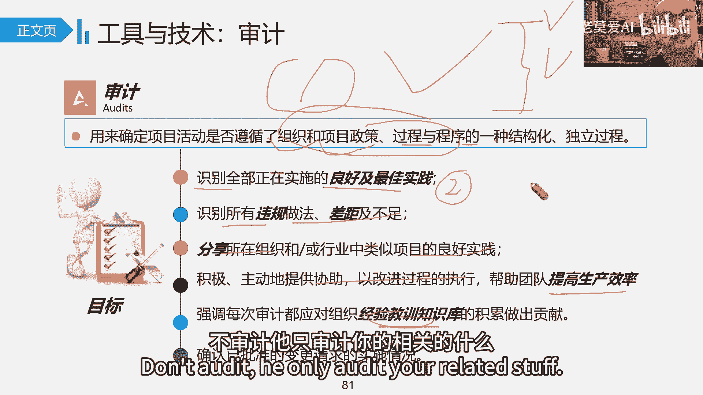

这个大家知道一下好，谁审计谁审计，这个人就不说了，因为不定不定，但是你得知道，我们在这里只知道说我们能干合适的事情，只要人家过来审计，你肯定是有计划来审计的，什么时间审计其实也不也不说。

关键的审计后审计后你要有一个组织过程。

资产的什么更新，它对我们什么是好事情变的啊，大家都知道好面向X设计，这个没什么特别说的呀，其实书上把这个讲成面向X我们实际上都在做，只是不知道这个词而已，X是哪个方面啊，不知道主要指的是特定的方面。

你要为了建，你要为了可靠性，你就为可靠性，你要为降低成本，就只为降低成本来设计。

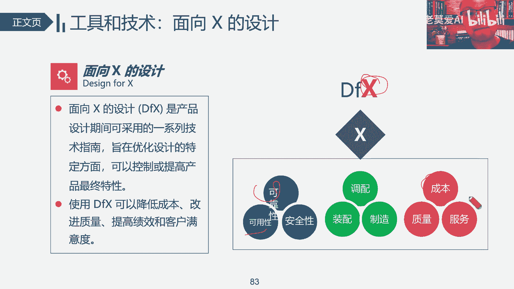

这就是什么特定的方面啊，只是特定的方面而已，好吧好问题解决，我们说质量问题的解决，那好我再说另外一个点，为什么我们把问题解决放在质量这里，那在咱公司里面为什么总是质量来说，哪里出问题，哪里出问题。

这种实际上一个点在这里，我们的研发团队跟我们的生产团队，那中中间通过什么质量作为甲什么架桥的质量，先发现质量问题，发现质量问题之后，你要做出什么做出判断，这个问题到底属于生产人员。

没有按照相关的规则制划去执行你的计划，造成的问题，如果是这样直接改进就好，还是说你研发部门，你技术部门做了那些计划而生产，让别人去执行，那值它也是这样执行的，还是出现问题了。

那这个时候什么就是你你要么需要出来处理，所以质量是第一，发现问题之后，什么先做好，做好什么问题方向的一个基本的一个什么识别，当然有的问题可能识别不了，到底是执行的问题还是什么识别不了。

总之他做什么中间的衔接啊，就这个意思好，那问题问题这一块呢，我们更多是关注什么，更多关注，以一个相对比较好的一个结构化的思维，来处理问题，这样方便我们什么，方便我们解决问题，还记得我们第三章讲的什么。

解决问题的万能公式，不就是第一个你得确认分析条件，注意所有的事情啊，所有的信息变都是相关的什么条件，第二个你得基于条件分析对我们的什么，对我们的影响有影响了，现在有影响才是急于解决嘛，才是问题嘛。

现在不急于解决，未来还没发生呢，那什么风险嘛，我们再来判点好吧，从这里也是一样的，先你确定到底是不是个问题，是问题，我们再分析原因，找到方案，选择方案，执行方案，这其实也是什么，这是P的过程吗。

这是P的过程，这是D的过程吗，这是C的过程吗，如果不行。

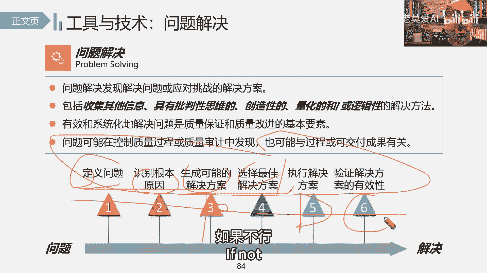

我们可能再进行下一轮，其实也是什么，也是PDC好吧好，最终呢在这一块我们就有相关的什么质量报告。

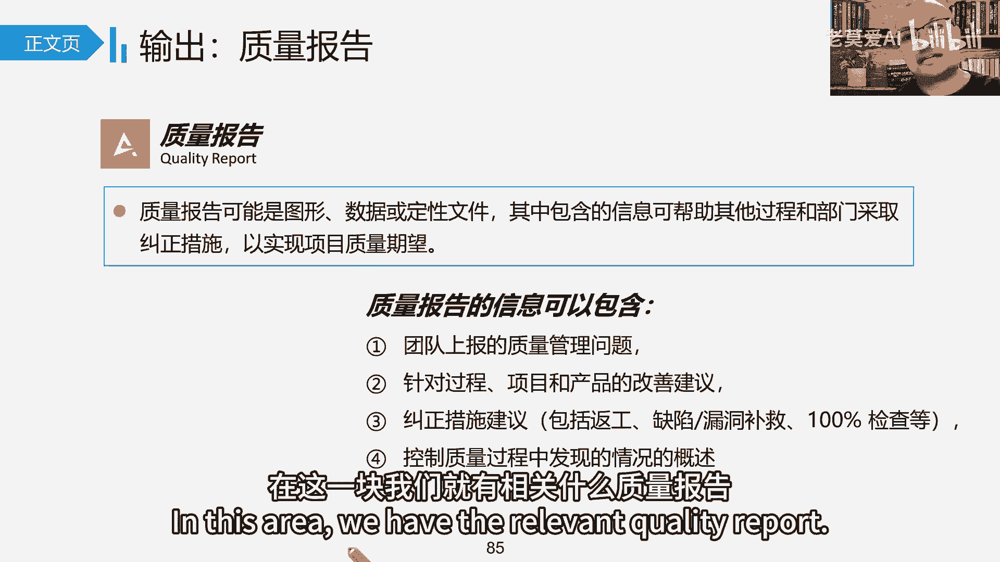

你质量到底做的怎么样啊，质量信息啊都写在一起就完事了，以及在执行过程中，我们不是要为了做质量成本，在质量管理计划中，我们要做哪些测试和评估，在执行阶段，我们就有就把它做了什么相关的测试评估。

这里测试和评估只是相关的什么相关的举，只有相关的具体数据，那我们拿这些具体数据，在控制质量阶段还得跟计划做出什么做出对比，看我们的质量到底是符合还是不合对啊。

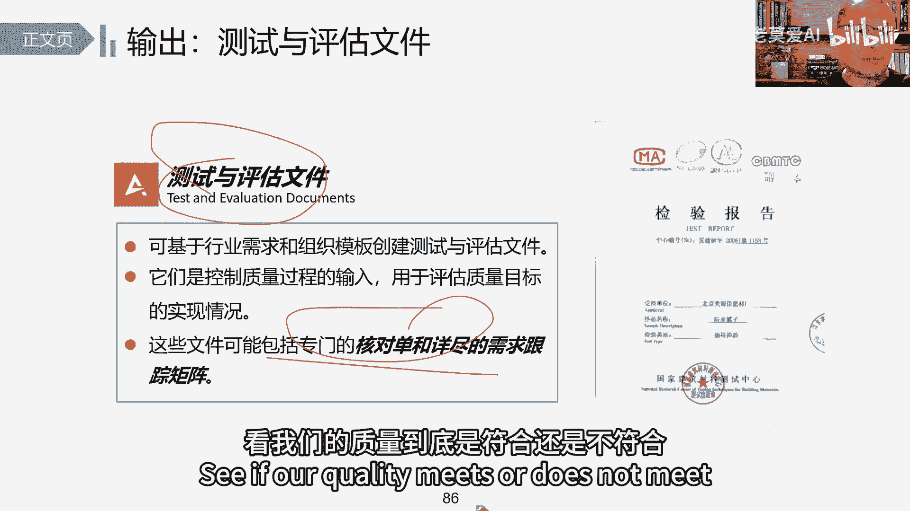

我们纸张到这好，检查表就是核的核和计数表吗，它的这里是什么，用来记录相关的数据的，要对比前面的什么核对单，核对单，这叫核查表，检查表，核查核查表要对比前面的核对单。

他们两个呢有的时候考试的时候容易出什么出，混在一起，你搞不懂了，用这个看英文吗，一个是checklist，一个check  checklist的核对单嘛，单码核对单的目的就是用来什么打勾的。

看你哪个漏做了，有没有做完，合拉表的意思就是什么，就是记录数据的对吧，哪一个缺陷有五个质量不长，尺寸不合，五个宽尺寸不良，十个外观不良，15个基础数据集质数据还有什么统计抽样，那统计抽样的目的为什么。

统计抽样，因为有些东西不能全减，第一个全减浪费时间，浪费成本，第二个有些东西它没办法确实没办法全解，所以根据我们什么统计学的原理，所以才有第三个叫什么叫统计抽样，那统计抽样在这里我们要说啊。

你你就要做一个什么，做一个准备叫什么，做一个准备叫什么，一定会有什么会有你漏检的地方，这是肯定的好吧。

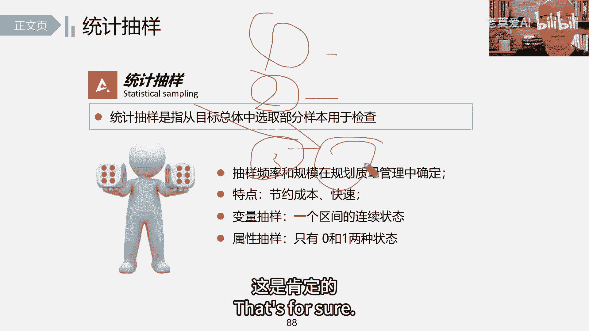

只是漏检的比例有多少而已，检查我们就不说了，就是为了判断我们工作，产品是不是符合书面要求，做的一系列相关的工作都可以成为什么，都可以成为检查，都为什么。

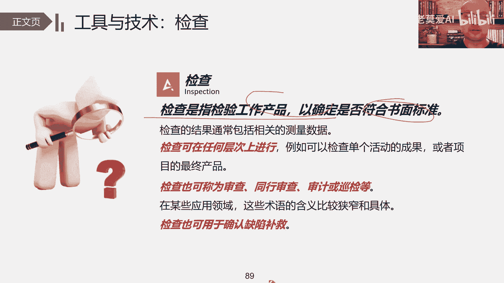

这都属于控制质量部分，再通过对我们最终的产品和进行评估，通过我们来判断质量怎么样，好吧，这是我们讲七大工具，最后一个在控制质量过程中，我们先从过程进行控制，先从过程进行控制对吧。

我们这里不是有这个叫什么。

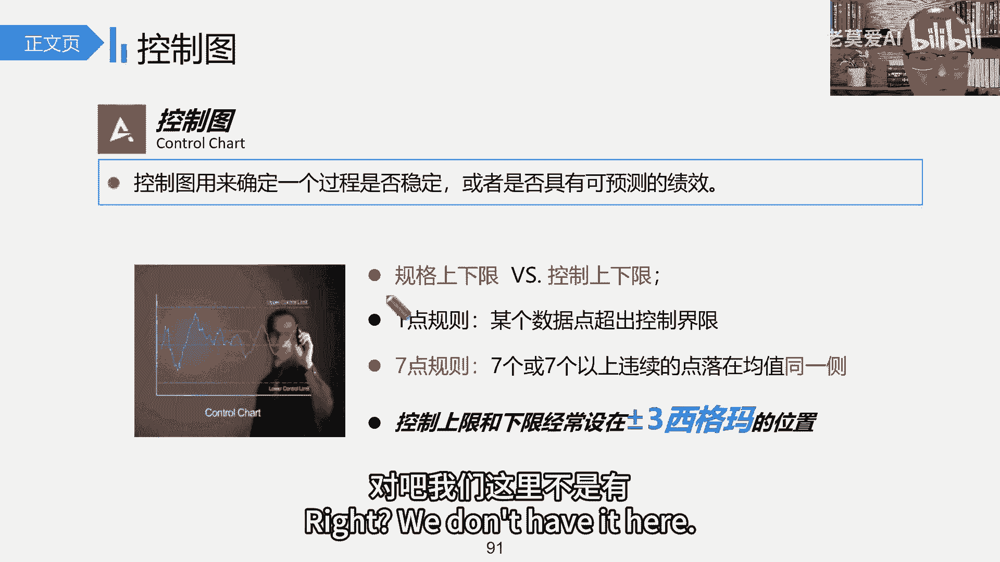

我们从过程控制这里不是有这个叫什么，有几个规格，一个叫平均值嘛，就是我们中间平均值，这个很重要啊，就是我们的基准值，那这里关键是还有两个，一个叫规格上限，规格下限，也就是说这是规格线。

还有一个什么控制线，那我们为什么要设置控制线呢，我们得知道设置控制线的原因，是我们人为设置的，也就是说设置控制线的原因就是为了，其实后面我们把风险学了，其实就是为了前期做什么，做风险的减轻动作对吧。

如果你没有控制线，假设就像我们讲的，它落到这里，我们讲一点规则和这个七点规则，假设一点规则它落到这了，现在虽然是好的对吧，如果你没有控制线，如果有控制线，我们认为是好的，但是我们可以及时进行什么调整。

及时进行调整没关系，但是如果你没有这个控制线了，它现在是好的，下一个万一跳到这了，你怎么办，因为你没调整，直接就不好，那就不好好吧，好那一点规则不行，关键是这个起点规则，注意啊，七点规则。

我们现在讲起点规则，注意连续七个点，也就是说只要是非这个随机原因导致的，所以它一般情况七个点要不在上面，或者七个点在上面或者七个点有规律，七个点同时往下或者七个点同时往上，都属于起点规则。

总之它不能有什么不能有相关的规则，它不能有相关的规则。

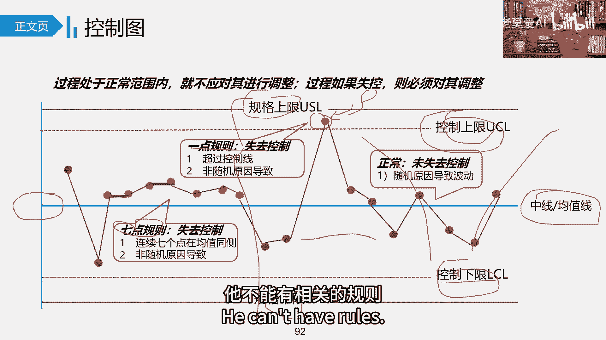

就这样一个点好吧好吧，就这样一个点好吧，这就是我们讲的这个控制图好了，那讲完控制图之后，今天晚上呢跟大家分享的第五章，第八章的一个基本内容，到这里就跟大家分享结束了，跟大家分享结束下一次课程。

我们就基本上分享就是第九章讲资源，资源内在资源，外在采购以及沟通，跟感情的沟通，还有我们相关风险这样的一些基本的一个章节，像这样的一个一个一个一个一个基本的章节啊。

我们下次课应该还是在下周的下周的周四晚上，那下周的周四晚上好吧好，那今天晚上我们就到这里就到这里好，刚才讲的过程中呢，如果大家有还是有不不理解的地方，你可以在屏幕打出来，在屏幕互动区打出来。

如果都没什么特别的事了，我们就可以下线了，好吧就可以下线了，好我等一分钟就好了好吧，谢谢大家好，那今天晚上就到这里，谢谢大家。

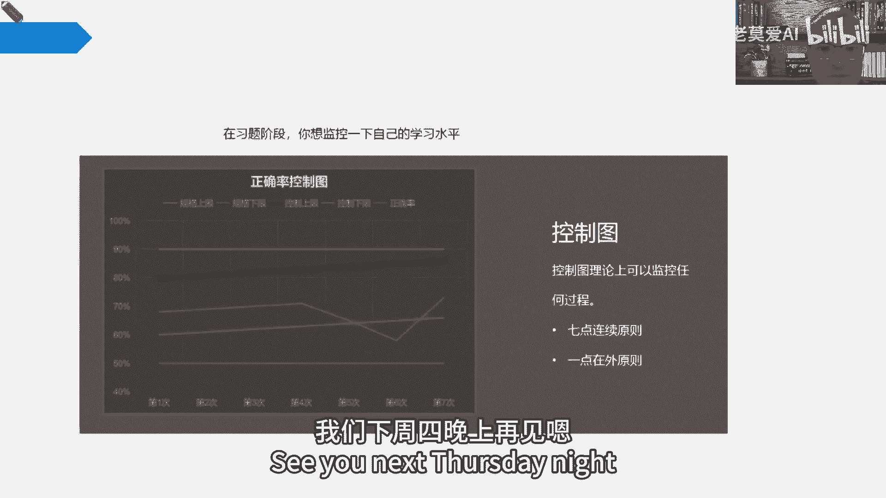