# 【最好的PMP课程】PMBOK6精华讲解3-3 - P1 - 老莫爱AI - BV1YH4y1w7Ky

问问什么人在什么时间点需要什么样，什么人在什么样相关的一些一些一些基本点，需要什么样的一些111些文件需要什么，他们需要叫需要什么样的一些文件，这都是我们沟通的具体内容，那中间的流程啊，表单呀。

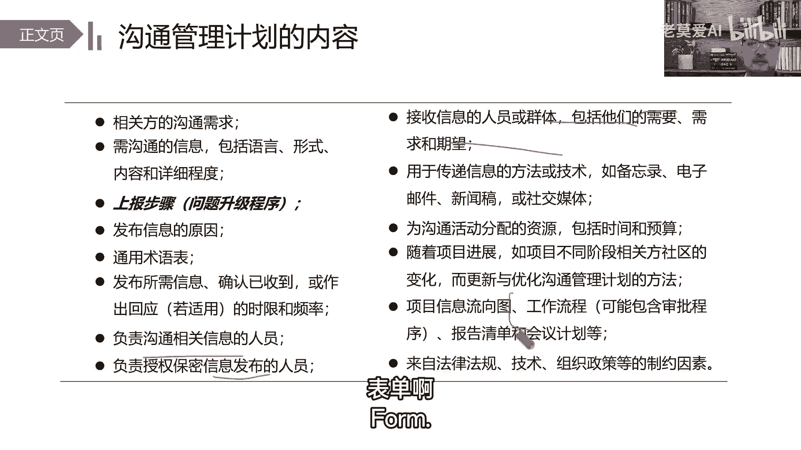

还有沟通需求啊，语言形式呀，详细程度啊，这个都是我们一些基本的内容啊，基本上好，这是我们讲的什么沟通管理计划，把计划做好了，做完计划之后我们干什么，我们要要管理沟通了，在那就意味着什么。

意味着我们按照计划里所得，对我们信息相关的什么，怎么收集信息，怎么整理信息，怎么整合信息，怎么发布信息，我们把它干什么，我们把它拎出来来做我们这样一个什么基本点，所以我们叫什么，这里叫项目报告发布。

注意他又来一个词叫什么叫报告，这报告我们前面不是讲的这个工作绩效信，数据和工作绩效信息，以及工作绩效的什么工作绩效报告，那个时候也有个报告，也有个报告，对不对，那个报告是什么。

那个报告是我们我们都说了是吧，他会做一些什么东西，他会把相关的信息汇总一下，成为一份报告，它的核心本质是什么，还是个信息的载体，那么这里讲项目报告发布指的什么意思啊，这样你简单来说就说我们项目信息载体。

它的收集与发布相关的什么整体行为，所以我们这看到什么探讨是相关的什么行为，怎么收集，最终怎么发布，他的一个基本的什么一个行为而已，所以我们这里更多干成什么，本过程会变成临时的报告。

演示博客与其他相关的什么内容对吧，你比如说我们现在很多人做什么，做短视频，以前做博客吗，现在做短视频，那你基于短视频，你今天晚上做短视频把东西发出去，我们可以从母亲上来讲叫什么。

它就是我们讲的一个叫什么，我们项目的报告发布可以简单点。

就让别人基于你得到什么代入相关信息，好的这情况好，那接下来我们监督沟通呢，那就更简单了，就基于什么，基于我们我们内在做了什么，我们计划做了什么，我们在发布报告的时候，到底哪家有没有做，如果没错。

其他基因管控角啊，其他基因因管控角沟通这一块，我们重点还是核心，你得知道就是他和肝型管理这块，它们的区别到底在哪里，以及他们的什么相关的联系到底在哪里，因为往往在考试的过程中，他更多是把什么当选人。

管理计划跟沟通管理就放在一起嘛，很多人说放在一起考迷惑大家迷惑了之后呢，你就不知道A个数到底该选哪一个，那同样的，如果是人的反馈有问题，那是什么，那是监督人的问题，是监督干性式管理，如果是质的问题。

就是如果是信息客观上存在问题，那是什么，必须是监督沟通的问题对吧，所以你在监督人的过程中，实际上监督两块，一块把人也监督，一块，把沟通什么也监督了，如果他只是信息的不正确，那就是监督沟通的问题。

如果他基于现代信息做出什么相关的判断，做出相关的相关的生发，做出相关的什么反馈，那什么，那是人的问题，那么就要走什么走人的渠道，好好，接下来让我们聊聊什么，第11章项目的风险管理，风险管理呢。

你看这块风险管理，我们什么职业风险，定性分析，定量分析规划，风险应对以及最终在做的过程中干什么，监督分析，在这里，在其他时候我们并没有刻意的把风险管理计划，不是把蒙古管理计划。

那个时候我们并没有说的那么重，但是为什么在第11章的时候，我们就说在风险管理计划这块，相对来说给我们的启发比较大呢，那是因为什么，因为这个时候我们真正就是按照风险管理计划，里面设置的一些基本的东西。

来帮助我们识别风险，帮助我们进行定性分析风险，帮助我们进行定量分析，风险以及风险发生了。

我们如何具体去按照风险的因子去应对风险，他给我们什么这个指导性的一些基本原则，我们指导好，那我们一还一个一个来来看一下啊，一个一个来看。

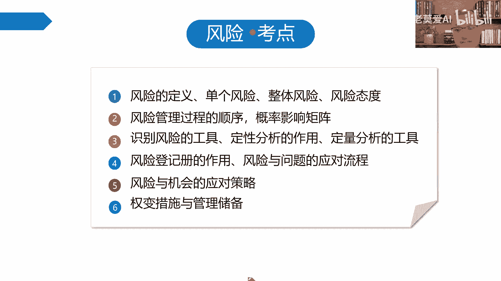

首先要站在我们角度，我们得知道风险是个啥，因为我们以前认为风险是什么，风险是一定是一个刁极的事件，消极对我们造成了什么造成影响，但是现在我们学风险，我们把它要当成一个什么，当成一个中性词。

他就是一个什么，他是一个不确定的事件或条件，一旦发生，会对我们项目造成什么积极或消极的，也是他是一个什么，他这个不确定的事件或流量，它是一个什么，它对我们项目会造成一个什么，造成一个积极和消极的影响。

所以我们谈风险一般就谈这三点，哪三点由于什么原因，导致一个不确定的一个什么事件，进而会对我们项目增一个什么，造成一个什么结果或者什么一个影响，所以这是我们谈项目一般这样谈，一般这样好。

在这里为什么我们谈概率，概率是什么，概率实际上是我们接下来对风险进行什么，进行评估的时候才用的才用的，如果不评估它呢，其实它的作用它的意义是什么也不大，大概率这个意义也不大啊，就是那么回事了，好吧。

那从我们的角度，我们先得识别风险到底是个什么东西，好在这里说到概率，我要特别强调一点啊，我们讲的概率不是绝对概率，我们讲的概率叫什么叫相对概率，如果你问风险，它来讲绝对概率。

那绝对概率只有一个叫什么叫50%，绝对概率永远是这个叫什么叫50%，对不对，50%，那要用相对概率呢，经过我们评估之后，相对是多少，那是另外一个概念，那就是另外一个概念，我们可以基于它相对发生的概率。

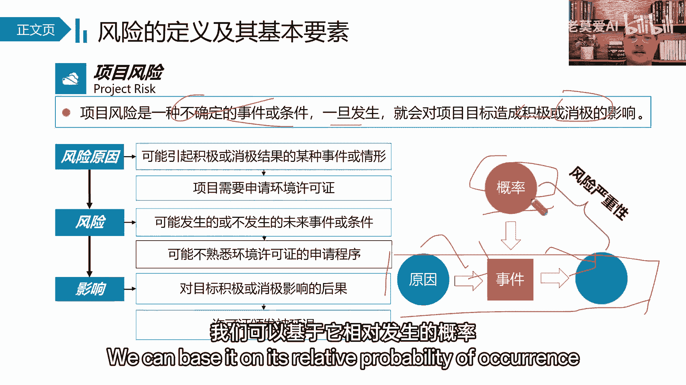

做出个打分的动作，这后面我们都学过了啊，好识别风险，那从项目层面我们又说了，项目分成单个风险和整体风险，单个风险是对，从我们角度来嘛，从项目目标的角度来说，是先有什么目标，才有什么才有单个风险。

为什么你会将这会影响项目标达成啊，我们项目目标一般分成什么时间目标，成本目标质量目标，还有我们交付什么样的成果的一个成果目标，那你从目标角度分解，哪些会影响这些东西拿不到，这是我们讲单个项目风险。

那整体风险呢就是说即便你这个东西拿，你你这个东西啊就会出现两种情况，第一种什么样的情况让他拿不到，就项目有没有可能拿不到，这是第一种风险，整体风险，第二种即便拿到了又能干什么。

所以整体风险是对从项目的结果角度进行什么，进行说话的，整体框架是从项目的整体结果，整体角度进行什么进行说话了，项目风险呢是从项目目标的角度进行什么，进行说话，这两个不一样啊。

两我们学的时候其实更多关注是什么。

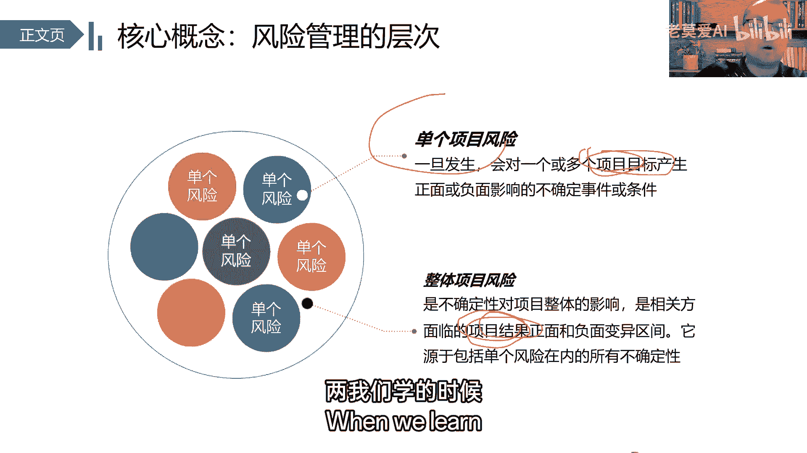

单个风险，更多关注是单个风险好，这里在前期我们了解一下风险的态度，或者叫风险的什么风，肝前对风险的整体的偏好啊，风险这对风险的整体偏，为什么呢，因为不同的干系人，同一个风险，同样大小的风险。

不同的干险对他是基于什么，基于不同的态度而言的，所以我们接下来应对风险，我们得先把风险干型人，他的一个什么基本的态度，我们把它变成我们在风险处置过程中，相当于一个什么基本的连接点啊。

基本类基基本的连接点，风险承受力就是你到底多少，你能承担，超过这个你就不能承担了，就找到他的风险力争力，还有什么风险偏好，风险偏高更多是什么态度相关，到底是喜欢那个喜欢风险还是不喜欢风险。

厌恶风险还是持中立态度，最后就结合着肝性质风险太厚，或组织的风险太后，结合着我们风险承受，组织的风险承受力，个人风险成立，把它弄成什么，弄出我们风险能玩的一个什么，风险的一个临界值。

那我们这个临界值可能就会分需要分层，我们在11。3说的什么定性风险分析的时候，基于get的影响取证，把它分成什么，分成有一个边界值嘛，这是什么，这个边界值就来自于什么，来自我们相关的临界值。

来自于我们相关的临界值啊。

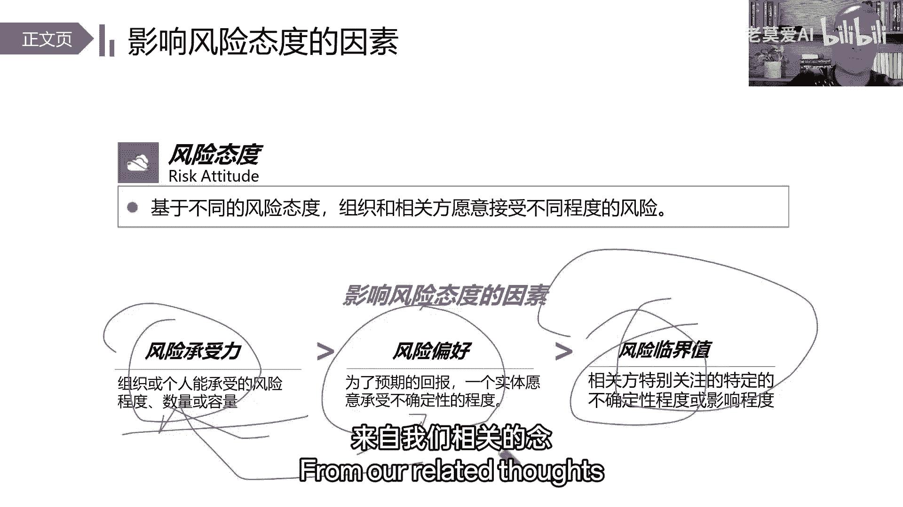

好那在风险管理计划里面也可以基于风险，风险结构对教会我们如何识别风险，比如说它可以教会我们从技术角度分为风险，从外部角度识别风险，从组织角度识别风险，以及从什么项目管理角度识别风险啊。

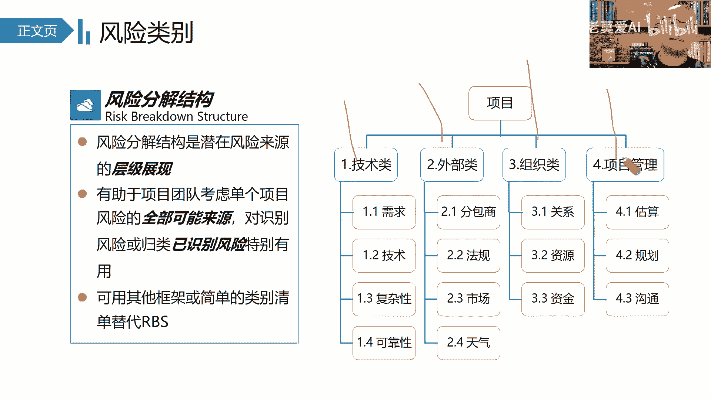

是不是，这是我们讲的什么识别风险，而风险本身我们可以把它简单来说分成两类，一种叫已知的风险，一种叫未知的风险，我们管理的时候，我们讲风险的时候，更多管理什么，更多管理是已知的风险。

因为位置的风险只能靠什么，只能靠经验积累，没有办法啊，我们讲已知的风险就指的什么，就是风险大概会有什么风险，我们知道，但是它的概率以及什么影响情况，我们是不知道的，但是为了应对它，我们还对他做了什么。

还得对他做出评估，它大概影响了一个基本状况啊，因为那这个时候我们就知道已知的风险，用的什么管应急储备吧，未知的风险用什么用管理筹备，比如说已知的风险，你知道它会发生，所以这笔钱在谁手里啊，在我们项目上。

但是位置的风险呢，它不见得就一定能发生，所以这笔钱在谁手里，不在我们项目上，在公司是什么啊，项目层面好吧好。

所以呢前期我们还得基于刚才我们分享态度，基于我们的风险承受力，标示出我们叫什么，总结出我们的一个风险概率是什么一个临界值，而这个临界值本质从哪来的，就是我们在评估风险的过程中来的，评估风险用什么来评估。

就评把这个叫什么，把我们的概率进行评估，把我们影响也给他，一个是一致评，所以他们两个一乘叫什么叫风险值，有时候也要风险的等级，还有什么风险的等级值，把它们成功之后，接下来我们不是有概率影响举证吗。

把它套进去，知道什么，它是高风险中风险还是低风险。

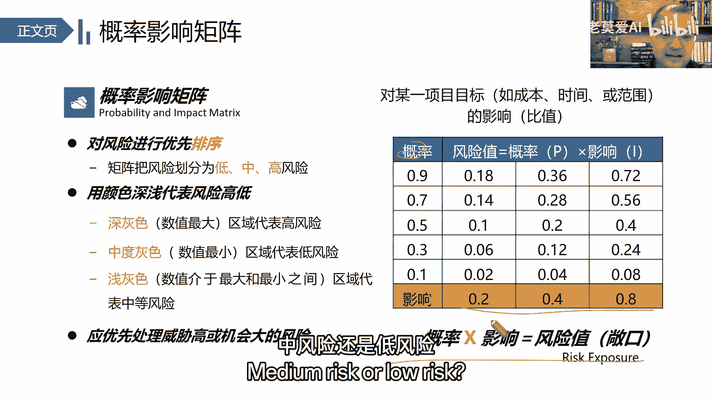

前期都必须要把这些工作什么工作做好，把工作做好好，那识别风险的时候，我们有一个什么核对单，核对单你识别哪里的风险，合并单，说白了就是识别我们以前项目上，以前我们做的老项目上。

他们项目相关的风险情况如何啊。

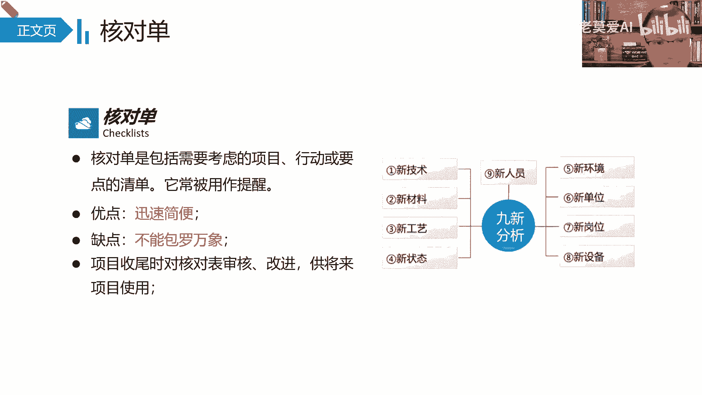

就是识别这些就看你做了没有啊，合着单，所以合同单是干什么用打勾的，还这里还有一个大的识别什么，识别风险的一个工具，叫什么SWOTIW口，也就是说从内部和外部的角度，结合到自己的什么优势和劣势。

看看如果你的优势刚好碰到什么发展的机会，那不就是你的强项吗，那不就是你就就就是你的强项吗，如果你的劣势刚好碰到要影响支援你的境，那不就是你说什么对你的威胁吗。

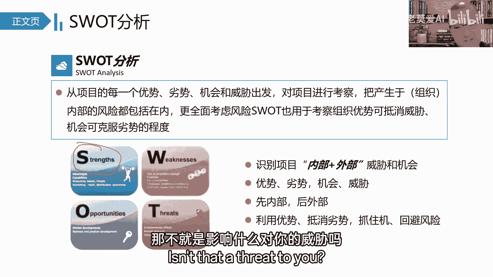

可以做什么，可以做风险的实验，可以做风险实验，好，提示清单，这是我们整本PMBOK里面唯一的一个什么，唯一的一个提示清单，他的目的就是告诉你，从这些方面可以去识别风险，从政治经济环境角度是吧。

从经济角度，从技术角度，还有五个不确定性角度对他进行什么。

对它进行一个识别，他告诉你可以从这个角度进行识别，好，这里简单聊一下这个对单跟提跟提，提跟提示清单啊，提示清单它的核心是什么，它的核心只是作为一个什么，作为一个提示来源。

告诉你可以从这些角度去给他干什么，去给他做一个什么，从从提示你从这个角度可以给它，基于基于你现在给他做什么，可能有风险，而而核对单呢更多是从什么经验教训角度。

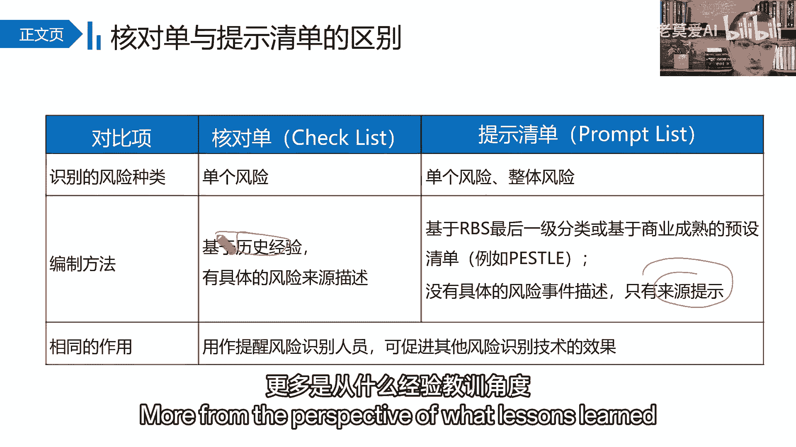

从我们历史相关的什么文档的角度来提示一下，就这些风险好，最终输出什么风险，登记册风险等因子长什么样子，不知道，其实为什么叫不知道呢，其实就是你想找什么就找什么，把你相关的思路写在里面就行，这是比较重要。

其他的格式在项目上来讲。

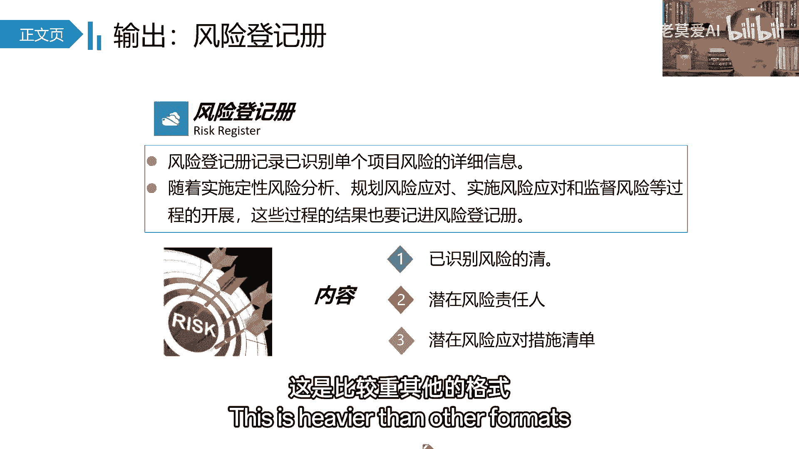

格式只要你们公司OK格式都不重要啊，格子不整啊，好我们这里来讲输出两个，一个叫风险内一测，它的核心目的是记录什么，记录我们单个的项目的相关的什么风险的。

还有一个叫什么叫风险报告，它的核心是记录我们项目什么。

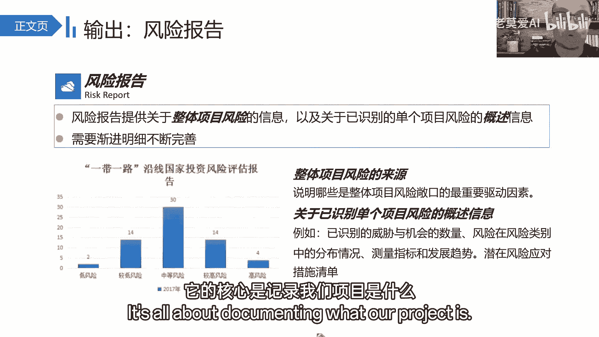

记录我们项目整体风险哎，记录我们项目整体风险好，还有输出什么，还要结合我们刚才的风险，风险态度以及风险的这个风险，干净的态度以及风险排列的举证，我们还要干什么，还要做风险概率的什么影响的一个评估。

还要不在这类风险管理计划里面，你得把风险这个概率影响评估给他举证建好，因为我们后面干什么，我们后面只是负责什么，负责用的承受力，结合风险，干些人什么态度。

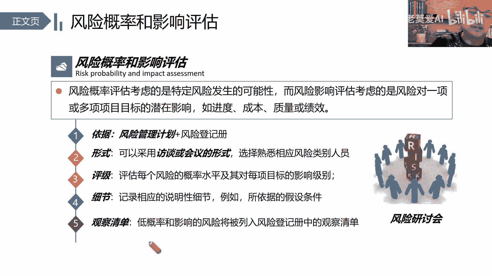

我们后面怎么用，这是我们一个什么核心啊，当然评估的时候，也可以从其他的几个角度对项目进行评估，不管是紧迫性啊，临界性，还有它的一个显不期，那么顶破型和邻近进性，给它加上另外一词吧，顶破是什么。

叫什么应对的时间短，叫什么叫应对的紧迫性啊，应对紧迫性，这是什么，发生什么，会影响多长时间才会影响影响连接性，我们虽然是这么回事，但是你可以以为什么叫发生的临界性，因为他们两个怎么做好区别。

注意这个不太准，但是方便大家区别就是应对的紧迫性以及什么，以及我们发生了什么影响，好吧，强迫及直到你的风险发生了，到具体影响出现，结果出现，他潜伏了多久，就跟我们疫情一样。

你虽然现在阳了几天之后你才发作。

这叫什么，这叫潜伏性好，那这里我们就聊聊定性分析和定量分析，他在干什么，定性分析的核心是为了给什么风险，结合概率影响矩阵做什么，做等级，优先级做什么，做排序的，做排序，这是他的一个什么一个核心定量分析。

跟他干什么进行量化的，就把我们相关的风险进行什么进行量化了，但是我们需要量化，大家都知道什么蒙特卡罗，什么决策树什么，还有这个叫什么，还有这个叫蒙特卡拉决策树，还有龙卷风投。

这些都是有的时候都需要专用的软件才能做的，所以它是什么，它对我们风险量化是唯一唯一准确的，就是相对准确的一个什么工具，但是由于它成本高，并不见得是什么，所有的风险我们都干什么，都需要做定量分析。

那哪些风险做定量分析呢，对我们在前面的风险管理计划，你得干什么，你得把它说清楚，在这里吧，只是负责执行，那这里只是负责执行啊。

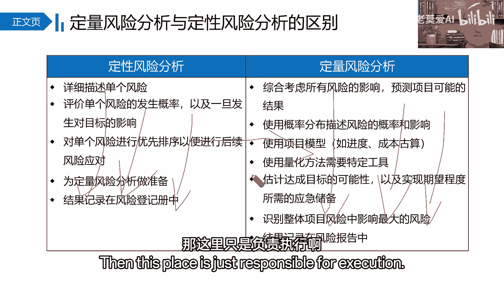

就完成了，好吧好，那我们刚才说了，在我们的风险概率影奖矩阵里面，我们通过对风险和概率的一个评估，评估完了之后，我们干什么，我们就知道他这个叫什么，他这个风险到底是高风险，中风险还是低风险，他就能摘出来。

把它摘除之后，我们要做定量分析，更多是针对这种什么一些大的风险应得的，而这里我们重点关注什么，定量分析用的这些基本的工具，第一个叫什么叫蒙特卡洛分析，其实就是什么，其实就是模拟分析。

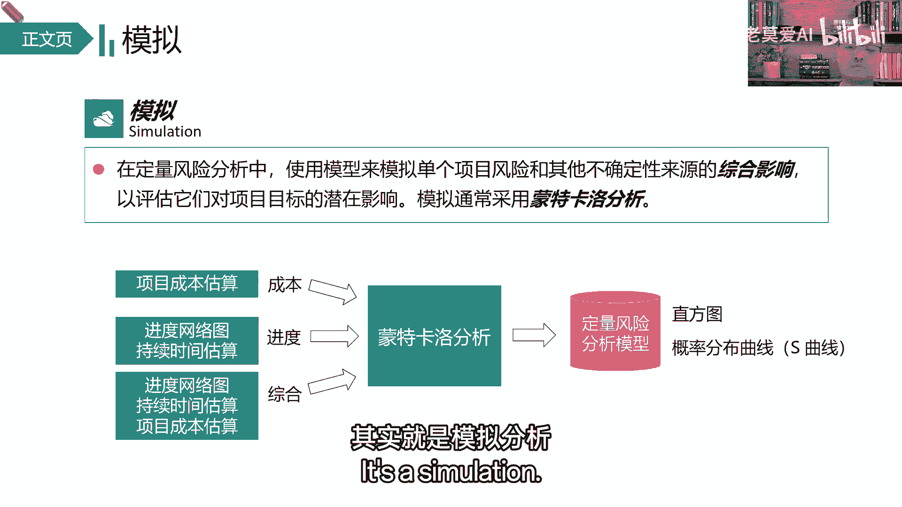

其实就是模拟分析，模拟分析，人工反正没办法算，一定要靠计算机对啊，我们在前期讲的，比如说我们估算成本或者估算进度时候好，这里我们讲的是成本，那我们就是成本，在估算成本的时候，我们不是不是这么说的。

我们就说这个成本可能是50万，可能需要60万，是不是这么估的，这个基于我们一个叫什么，基于我们的经验估出来50万60万都可以，但是具体什么样才可以，那怎么办呢，我们所有的总成本是基于我们工作报酬成本。

这不是一步一步往上加起来的吗，那怎么办呢，在蒙特卡罗分析的是模拟，模拟我们每一个工作包，他这个工作包可能取得上限，那个工作包可能取得什么下限，比如上限是10万，下限是7万，那他可能取到7万。

可能取到10万，那换句话说，他从中间取任何值都是什么都是合适的，那好他就通过电脑多次的验算把它加起来，这叫什么，这就叫蒙特卡洛分析，这叫什么，蒙特卡洛一个什么模拟分析，在这里面模拟完了之后。

你得知道什么，你比如说我们现在模拟了这么多数字，比如说这1万次或者2万次啊，我们认为1万次或2万次就满足我们的规格，我们说那百分之百的完工是需要多少，需要280万，那现在呢你给了这个叫245万。

假设这245瓦完工概率只有多少，网工概率只有85%，所以你这个时候就基于整体的风险，你是不是可以跟领导聊了，因为我们现在关注是整体风险，领导你现在给了245万，不好意思，我只有85%的概率。

能保证这个项目什么完工，那么这个项目我那你跟他聊啊，如果这些项目非常重要，至少需要95%，或者甚至95以上的概率，那你要干什么，加权是这样啊。

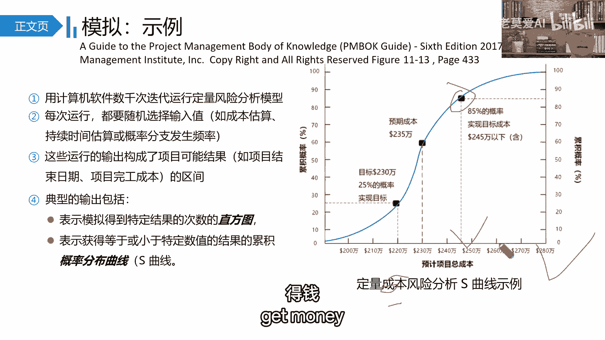

还有一个叫什么叫关键性分析，关键性分析对应的，我们前面叫什么叫关键路径分析嘛，你因为我们项目进度的延误，针对什么进度延误，就只是针对我们关键路径上那条什么关键路径，它延误了我们项目的项目。

所以我们需要考量什么，在这个风险模，在这个相关的进度模型中，什么样的风险会影响我们项目什么，这个路径的相关的整体活动。

他会延误，太棒了，这好我们来到敏敏感性分析，敏感分析是不是我们应对什么，我们说的这个叫什么，就是我们说的这么一个，另外一个量化的一个标准，因为它最终的结果是干什么，是以这种龙卷风的形式表现出来的啊。

哪一个最大，七四哪一个再来哪一个，所以从上至大是从上至下是什么，是越来越来越小，也就是说它们之间呢，就形成这么一个什么龙卷风的这种这种形状，转起来就是状分的这种形状，那这种形状给我们带来什么。

让我们关注什么，其实他已经做好优先级的排序了，让我们关注什么，定义最大的就这个意思啊，其次再关注第二个，再关注第三个，这是他的一个什么核心目的啊。

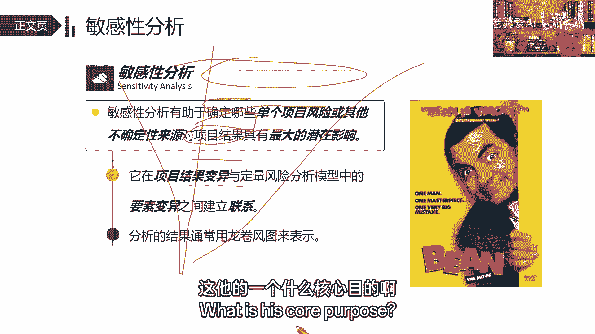

它的一个核心目的好吧，最终形成什么龙卷风，给我们改观什么，我们关注这个关注这个啊，再来关注这个，有的人说唉这个老师有的他是什么，他是负面的，他是一个什么，他是一个不太好的，我当然知道这个事儿。

我们要关注的更更更怎么样，更多点，难道这种好的我们也需要关注吗，我们也也也需要关注吗，注意好的，我们也是需要关注的，好的我们也是需要关注的，为什么好的也需要关注，你不要记得项目的核心，我们是为了什么。

为了平衡，他有这个干什么，有这个挣钱的，但同时也有什么也有亏钱的地，也就是说有有挣钱的，我们讲的什么积极的叫机会，那也有亏欠，消极的叫什么叫威胁，我们最终目的是为了什么，项目讲平衡。

那如果比如说我们这一块，假设我们正面这是什么挣钱的机会，你不能说因为这个挣钱，你把精力放在这来了，比如说比如说这个12344个，比如说这个挣40万，那你这个亏20万，你觉得我们是挣还是亏啊。

当然是挣了还挣了20万呀，还挣了20万，如果你把精力放在这了，那是不是有40万你就不去挣啊，你虽然把这20万额缴缴清了，但是另外的什么20万你是不是就不去挣啊，是这个意思啊。

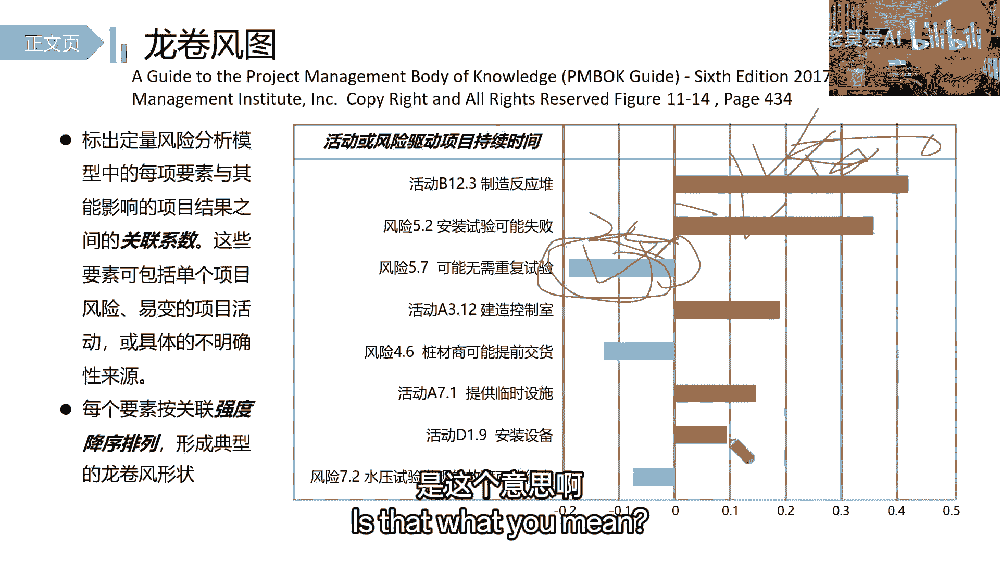

好决策树分析决策树，决策树是在做什么，决策的时候，用一个树状的形式，我们做什么，我们做出的分析呀，决策时我们用一个树状的方案做了分析，竖有相对的什么竖叉，所以呢这是基于我们在做量化过程中。

一个在绝对数分解，我们就是基于一个什么，基于一个整体，我们把两天不停的进行什么进行分解，有的人一看就知道，这不是一个这不是一个横状的一个什么动作，分解结构吗，或者模糊风险结构实际上是一样的。

只是我们算的时候干什么，就要从后往前给他算回来，看哪一条路径，什么更加的稳重，哪条路径持续使来它的整体效果会更加好，就用什么，我们就用哪一条路径的一个整体方案啊，这是我们讲决策分析。

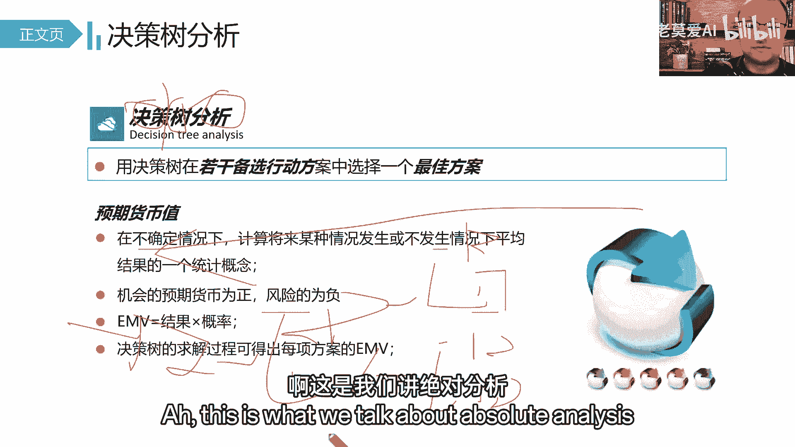

还有一个叫什么叫影响头分析，这个倒没有什么特别的啊，阴阳道人没有什么特别，它的核心目的就是什么，结合到对它有影响的相关的一些基本点，好考量。

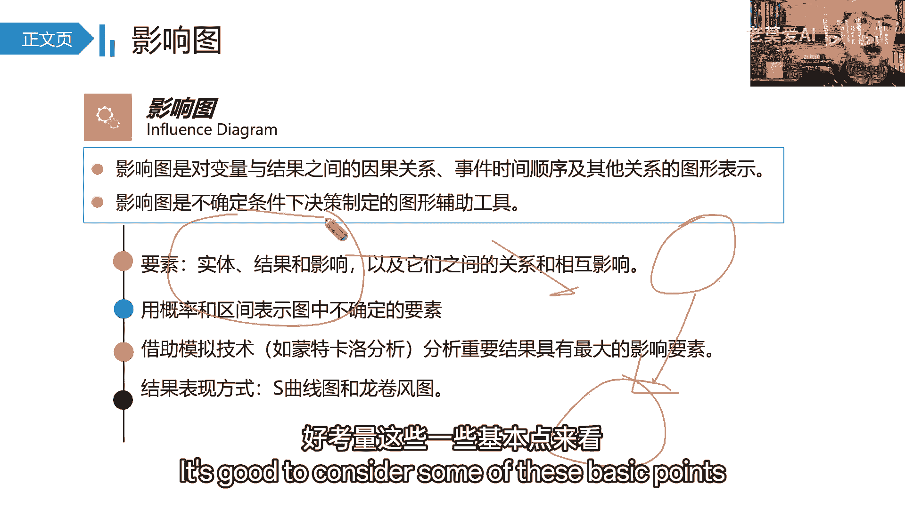

这些一些基本点来看，对它整体的一个什么整体的影响，这里啊好了，那讲完定量分析之后，我们这就是什么，马上进入规划风险应对了，但这里讲讲完之后，我们先解释几个基本的词啊，第一个叫什么叫残余风险。

第二个叫自身风险，现在我们就对比起来，他们都是什么都还是风险的，两个小的风险内容，一个叫残余下来，一个叫一个叫对，给随随辞职而生出来，一个一个一个风险残余下来，什么叫残余下来，那就是有一个风险。

你把他应对了之后，没应对完，这不就参与下来了，那次生的是什么，因为你用那个风险，其次我会生出来另外一个风险，这不叫什么，这叫叫次生的吗，这叫什么，这就叫测试风险，好吧，把这个基本的概念区分清楚了。

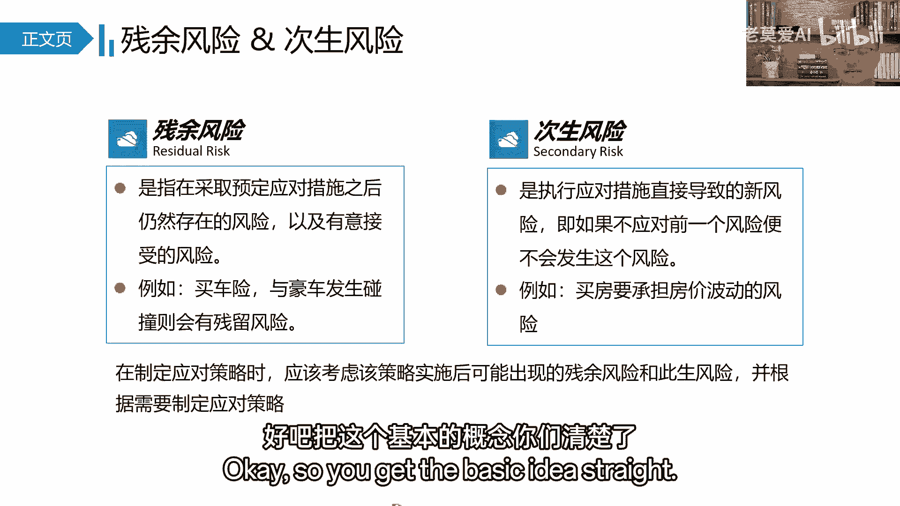

区分精神了好吧，我们接下来重点重点来看一下，我们处理这个叫叫什么，处理这个风险的时候，它相关的什么几种基本的应对策略，注意要这里我先要说一个点叫什么，我们讲什么应对策略跟应对方法一样吗。

应对策略跟跟应对方法什么，应对策略跟应对方法它干什么不一样，应对策略跟应对方法它不一样，策略只是大了一个给你一个指导的，一个指导一个方向，这怎么做，那是结合公司本身你自己做的事啊。

你是结合公司本身你自己做的事，就这个意思好吧，我们这里一共讲了什么五种基本的策略，上报规避经转移和什么和接受和接受好了，那我们先来讲一下上报上报实际上是一个什么，是一个行政策略，不是一个应对策略啊。

他是一个行政策略，不是一个什么，不是一个应政策略，也就是说什么时候上报，也就是说你搞不定核心目的，就是你搞不定你就要上报，如果你能搞定，你就不用上报，那什么时候你搞不定呢，要不你就发现你的能力不行啊。

需要更多人那里人来，要不就是什么压根这风险就不是我的，就不在我范围内搞，所以就这个点上报好，那规避规避的核心我们现在就会就知道了是吧。

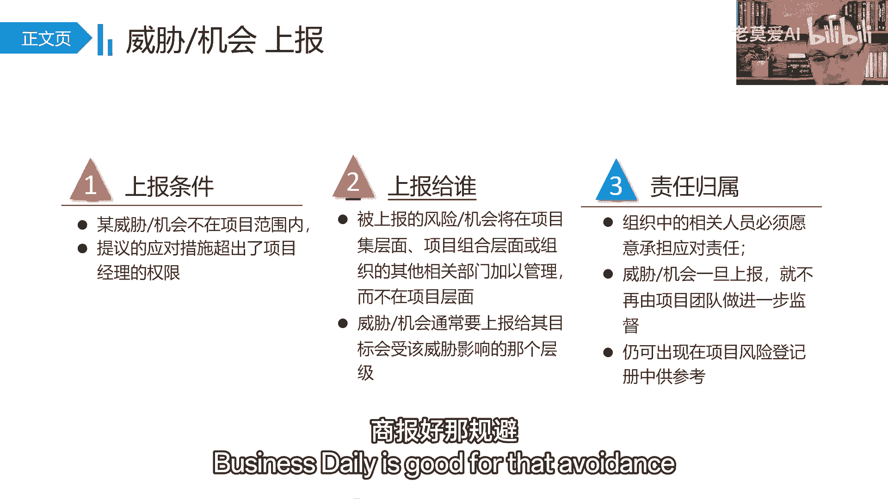

现在正在规避的核心，我们的核心目的是什么，就是采取相关的措施，主要是从原因的角度，我们刚才讲项目的三大基本要素，原因事件和结果，也就是说从原因的角度，怎么把原因什么把他干掉。

就不这不就没有不确定事件了吗，所以他就什么它就规避，那接下来我们讲什么，讲减轻减轻，我们不是还有讲两个吗，一个叫结果，一个叫对他评价的一个什么不确定性，也就是什么叫概率，所以减轻我们讲的是什么。

你可以从发生的概率角度看怎么减轻，或者说发生后对我们造成影响的影响力度，看我们怎么怎么减轻，看我们怎么减轻，但是这里讲到减轻，每次讲到减轻，我就给大家要提掉两强的，另外一点就是我们风险的思维。

和我们问题的思维为什么不一样，我们风险的思维讲的什么，讲的是事前预防的思维，我们问题解决的思维，指的是我们什么事后出现了问题，我们进行什么，我们进行问题解决的这么一个基本思维。

但在项目里面我们一定要有这种思维，哪种思维就是我们要有这种什么治前的风险，预防的这种思维，所以我们讲了减轻减轻，不管是减轻概率还是减轻影响都是什么，都是需要干什么，都是需要之前进行减轻的。

按时间进行减轻好吧，这是我们讲减轻，那当然了，如果你对数减轻不了呢，那有两种方法，一种是转移，找别人帮你来承担，注意哦，我们讲的这个风险是找别人来帮你承担，并不是指的这个风险什么，并不是一定是什么。

一定是消除掉，让专业的人做专业的事嘛，外包的时候转移，这就买保险，这就是什么，这就是找别人来帮你做这个事，按照标准来管理好，最后无奈之举，你只有感到什么，选择接受，为什么叫无奈之举呢，不外乎两种。

第一种我们讲了风险叫事前思维，既然是四强四位，你为什么要等它发生了你才接受呢，那你这就不就什么好了，我们事前不管是回避还是减轻还是转移，你都要采取一定什么措施，那这个风险太小了，不值得我发挥。

不值得我采取什么采取相关的措施，那怎么办呢，那我就默认结束，也就是说这个时候我就默认它发生了，再说这第一种，第二种就是什么，我想规避，规避不了，我想减轻，减轻不了，我想转移，转移不了，不好意思。

现在哪种方案我都试过了，确实都动不了，没办法，我们参加什么，我们采选接受这种策略啊。

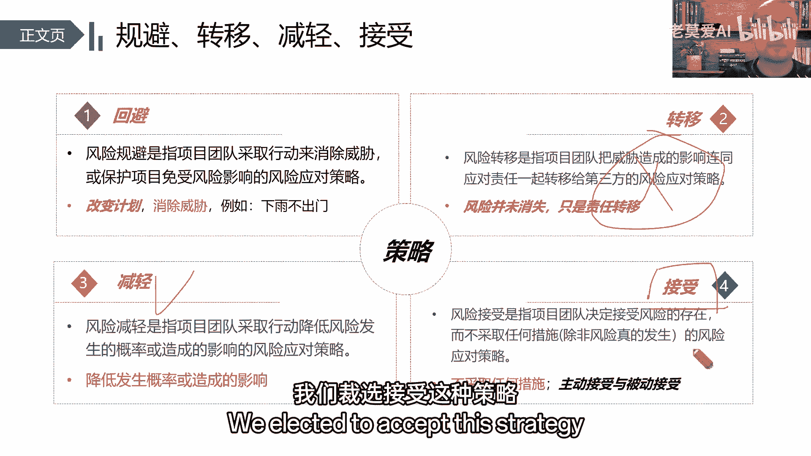

才能接受这种策略，好吧好，这里我们有什么什么主，主动接触和被动接受是吧，主动接触是应对一些储备，被动接触啥也不管，等它真正发生再说，因为这个时候真的叫被动接受，叫什么被动接受。

实际就是典型的叫叫一种叫什么，我们经常讲的一种叫什么被动接受，就是典型的我们把这相对概率在什么，相信的是绝对概率，为什么，因为确实也没招了啊，确实也没招了，因为你你你认他是绝对概率，也是认不认也是不认。

也也也是那么回事，因为你评估完了没有意义啊，所以价值，那我们再来看看机会。

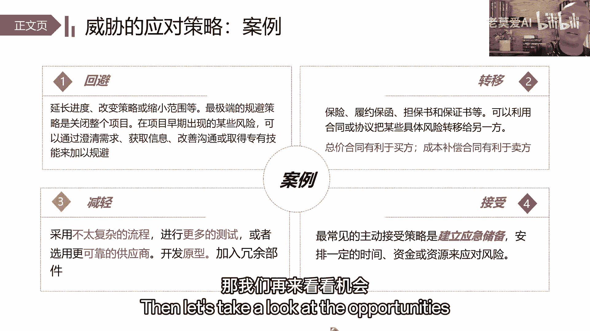

机会跟刚才是不是什么就就有机会不这样啊，因为刚才我们讲的威胁它是什么，它是一一对应的，基本上预定了，刚才我上报是通用的，我们就不说了，接下来什么规避，减轻转移和接触接触是一样的，我们就不说了。

规避是为了规避风险，让它不发生，开拓呢是尽可能让它来发生对吧，那减轻呢是为了减轻它的概率和影响，提高了，那也提高它的概率和影响，找第三方规避的风险呢是找别人进行什么转移，那我们有利益共享的，我们叫什么。

就把利益共享分享给我们的什么，我们的第三方好了，在这个过程中，其他都好理解，很多人把这个开拓跟提高理解不了，我们现在讲的风险，我们讲的概率是相对概率，但是真正发生不发生。

有没有人能确保他百分之百分呢没有，但是我们在讲威胁的时候，讲威胁的时候，那如果我不干这个活了，我可以确保他什么百分之百不发生，但是机会不一样，机会如果我们我们是尽可能想让它发生。

但他一定百分之百会发生吗，这个事我们做不了主，所以你看你注意看底下这些词语，我们的核心目的是想冲着它发生的，所以我们把最有能力的人给他，核心目的是想冲着它发生的，所以把这个能力啊，最新的技术啊。

我们都往都往上砸，都往上用啊，一定要让它发生啊，这是我们的目的，但是提高什么就提高，一旦发生了，我们怎么样更好的去利用它，更好是利用它，怎么样提高它发生的概率，或者怎么样怎么样提高了。

让我们更多关注什么关度，更好的利用它，所以你看为了早日完工，我增加一些资源，那我增加增加一些资源，增加资源一定能确保百勺王工吗，不见得，因为你只是增加了资源，说不定资源还在一起干什么打架哎呀。

那换句话说，如果他告诉你，我为了尽早完成活动，我把我们组织里最牛逼的专家全调过来了，那这叫什么，这就不是提高了。

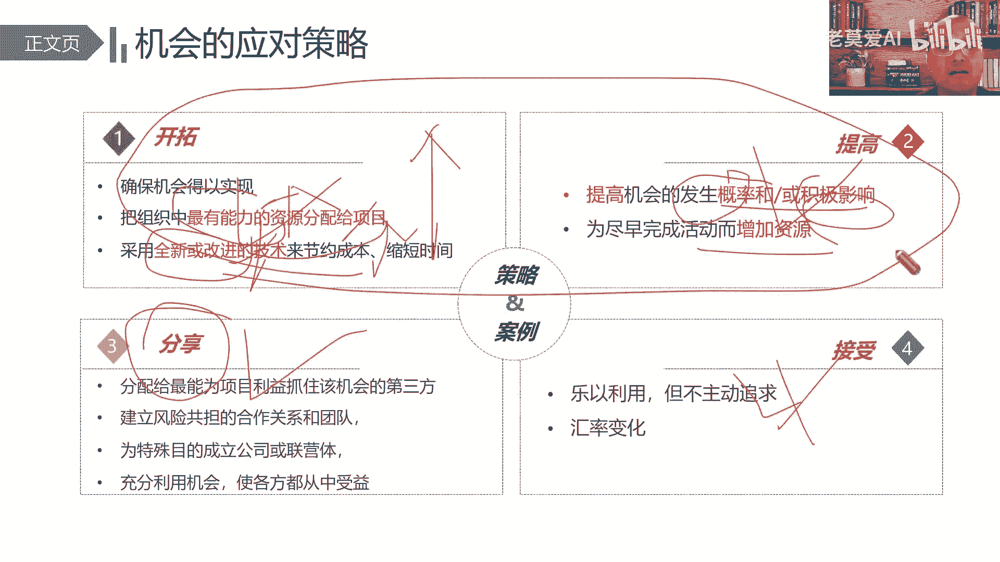

这是典型的什么开拓了，你想让尽早完成这个事一定要发生，这就成为开拓了，好吧啊好，那刚才我们讲的那些策略，那是什么，应对风险的策略，那我们把风险分成两类，从不同类型文化分类，一类风险是没有任何征兆的。

它就会发生，一类风险是有征兆的，它就会发生，那好我们讲的那些策略里面，如果针对没有任何征兆，它发生了，那我们干什么，就只有等它发生了，我们才能干什么，才能去应对它，那还有一个什么有征兆。

那我们当时说有证有征兆的，针对有征兆的，我们就等不到它发生，采取什么才去应对它，可能需要干什么，提前应应对它，那你提前应对它怎么样，相对于我们来说，我们经常讲的叫法叫一个什么教育往前走。

相关的什么可以预防措施吗，可以有个什么，可以有相关地区相对应的预防措施，就这么回事啊，那是这种什么相对好一点，所以硬接离策略，它并不是某一针对某一个风险的，具体的应对策略，它是针对什么。

他是针对这一类型的，是有这种所谓的有一些明显的信号，有些明显征兆的这一类型的风险，我们怎么来更好的就往前推来应对它，所应对侧应急应对策的是个这啊。

