# 【最好的PMP课程】PMBOK7精华讲解1-1 - P1 - 老莫爱AI - BV1aZ421N7DM

听到的同学可以打个一石头来了石头你好，晚上好，对于新来的同学，我们是第一次见面，但是跟我见面非常重要，因为基本上考点就在我这边，我们敏捷篇大概占到50，50%的篇幅还要多，所以在整个偏book里面。

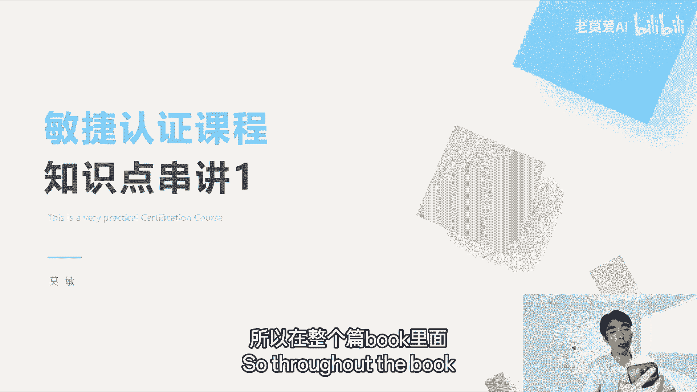

敏捷是比较重要的一个东西啊，因为现在各行各业都开始转敏捷了，所以敏捷是比较重要的，OK那我们开始吧，OK那我先讲一下敏捷串讲啊，我们这个敏捷串讲，都是按照大纲严格去布置的啊，我们首先今天分成五个话题。

第一个话题是敏捷概述，第二个是生命周期的选择，第三个是实时敏捷创建敏捷环境，第四个是敏捷在敏捷环境中交互，第五个是关于项目性的组织的考虑因素，这五个是贯穿整个项目的敏捷的东西啊。

但是今天主要先来讲一下敏捷概述。

那么敏捷概述它肯定要从敏捷宣言开始，敏捷宣言这个东西它也会有考题，但是一般的也就考的不多，也就一题两题左右，敏捷宣言里面他其实是来自于什么，我们的呃，17位的敏捷专家，他们在盐湖城的一次会议上。

他一个叫雪鸟会议上就是一个滑雪的圣地，有一个美国游牧城，有个滑雪的圣地，他们17个人在那个圣地上在开了个会，大概是2002年的时候，但是开了一个会，他们就讨论说已经来到了21世纪。

那么202 11世纪这个时候，我们需要用什么样的新的管理方法，去管理项目呢，每一个人带着一些方法过来啊，谁也说服不了谁，所以所以最后只总结出来一些宣言的东西，所以叫宣言，像这个独立宣言一样。

他一些很概括性的东西达成了一致，所以他们就有如下的一个价值观，记得宣言它不是实践的价值观，那么这些价值价值观它有哪些东西啊，第一个是强调个体和互动的东西，那么个体和互动其实放到现在来讲，我们怎么去理解。

不把我们这种软件开发的这样一个，高级知识分子当做这个生产力的这个螺丝钉，所以他是敏捷软件开发学员，你发现没有字，是软件开发学员，它起源于软件，那么软件一般是高级开发分子，是脑力劳动者。

对劳力劳动者的这个工作，你不可能像体力劳动者一样，通过打螺丝的数量来去衡量他的工作效果，他不是的，他工作效果是存在他的脑子里面的，他每天写多少行代码，软件开发多少多少东西，其实你是衡量不出来的。

他写的质量好不好，你只有通过后期来衡量，你刚开始的时候是衡量不出来的，所以他说流程和工具它再规范，总会在人去落地的时候他出错，对不对，因为是劳动，所以他更加强调的是个体和互动的能力，你像谷歌是吧。

强调说谷歌说我们只招全世界最优秀的人，那么这些最优秀的人一进来，他们其实就很明确的目标，就是我们要和融入到项目当中，一起来做一些什么事情，大家充分探讨之后，大家一起来做，所以个体的力量就变得更重。

而且现在大家都知道人力成本越来越高是吗，大家都是在追求企业的高精尖，就是尽量用少的人去达成这样的效果，每个企业都在裁员，所以他追求的就是个体，每个人产生的一个个体，个体在个体之间他们怎么样去沟通。

因为软件生产它是一个叫做什么，就高集群的这样一个高专业度的东西，它一定是很多人一起去合力做出来的，就一个人你是写不出一款软件的，你说诶微信一个人写，你不可能你一个人写一个简单的官网还可以。

所以他就强调个体和互动的，你第二个是工作软件，你需求写的再好，你总要落地吧，大家看到这个最后的结果，落地的东西，他才是能被大家承认的东西，这个是跟以前的思想不一样的，以前的思想。

你就像这些质量的工具的老大是吧，这个代理什么东西，他强调的更多的是流程，就是我们的流程，也他认认为流程做得好，结果就一定好，你要产生结果，没有一个好的流程，你是产生不出来好的结果的，对话是这样说没错。

但是现在更看重的是说我们其实就是要结果，你给我什么样的结果就更直接一些，第三个是客户合作高于合同谈判，这个东西怎么说，就相当于说我们其实一个一个企业它要做好的，它必须要有跟客户在同一战线上的能力。

怎么说，你能够帮客户拉到你的项目当中，给你提反馈啊，提意见啊，帮助你做得更好啊，这个东西才能够让企业做大做强，小米其实就是这样做的，小米是一家很听劝的公司，用户的反馈反馈到那边，他能够快速去改进。

在下一代产品中能够快速的帮他去做得更好，这个客户就相当于客户跟他一起去合作，OK最后一个就是闪响应变化高于遵循计划，那这个是什么意思呢，当需求不断的去变更，因为市场在变更，用户在变更。

用户的需求也在变更，当用户的需求不断变更的时候，我们要去积极响应用户的需求，所以说最大的不变就是变化，我们随时在企业当中要保持变化，这四个其实就反映了这些东西，最后一句话其实说的就是。

他为了让这个开发宣言能够放在任何场景里面，他提出了最后一句话，他不是一味的去鼓吹左侧的价值，他说右侧尽管右侧有其价值，我们更重视左侧的价值，这句话是什么意思，左侧价值我们觉得这个是高于右侧的。

但是也不意味着右侧没有价值，所以PMI，为什么这一次考试他要考左侧和右侧，其实右侧偏不可，第六版，左侧是第七版，这是两个为什么两个版本都要考的原因，因为两个其实都有价值，OK只是敏捷。

他在放在当下这个场景里面，很多公司用敏捷可能更好一些，对吧好，那么敏捷这个思维有什么东西，除了他的四大价值观，就敏捷宣言的四大价值观之外，还有12大原则和实践。

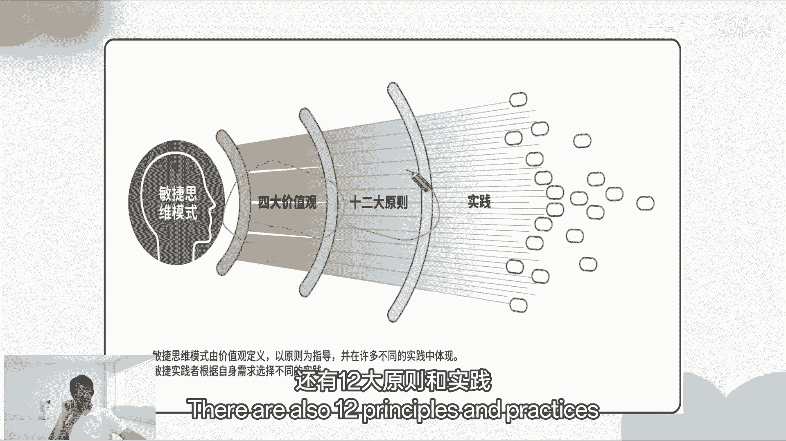

那么我们来看一下12大原则是什么，12代原则是，第一个是持续不断的及早交付交付软件，我们前面看了说，我们需要看结果，那么这个结果其实是不断的交付，及早的交付其实是更好的，怎么说。

就是这个结果交付的越频繁，你越能够让用户看到你的结果上的瑕疵，不足之处，给你的结果提意见，让你更快的去完善，对企业来说是一件好事，第一点其实讲的是第二个，新难的面对需求变化是什么意思。

为了提高你的竞争优势，你是不断的去根据客户的口味，不断的去变化，在开发后期也是一样，我们后面会讲怎么样去变化，第三个是经常的交付可工作的软件，比如说一个星期交付一次，比一个月交付一次更好。

业务人员和开发人员必须相互合作，你必须要把客户拉到和你一起，你不要觉得客户是你的对立面，给你提了很多需求，很讨厌，那这样其实就不敏捷了，你的产品在敏捷原则里面，你的产品其实是输。

就是丢失了一次怎么样改进的机会对吧，如果你把客户拒之门外，但是你这个产品最终还是要见客户的，只是包不住火的火的，第五个就是激发个体的斗志，让个体能够充分的辅以信任，能够充分的合作起来，所以在敏捷当中。

他提出了一个叫做自组织这样一个方式，自组织团队是必考项，好交谈，面对面的交谈，他其实是在很多这种题目的选项里面，如果有面对面的交谈，你们尽量要选面对面的交谈，这是考点可工作的软件，是进度的首要标准。

这也是考点，我们只看结果，不那么看重过程，不是完全不看过程，是不那么看重过程，更看结果好，第八个是步调稳定延续，这个是什么意思，如果我们这个团队定好了，我们每两周一次迭代，也就是说每两周我们发一个版本。

那么这个步调就稳定下来，就不不能说我每两周发一个版本，我说每两周我们都周二发版本，你们不能说我这一周周二发啊，下一个两周我周四发，下一个两周，我周三发就不是这样的，那就打破了平步调稳定延续的这个东西。

所以一定要步骤步调稳定延续，这个是考点好，第九坚持不懈地追求技术卓越和良好的设计，我们不断的要去学习新的技术，把它引入进来，学习新的记录技技术，我们有一个工具叫刺探，这个会考刺探。

我今天会把这些概念跟大家说一遍，后面什么叫刺探，什么东西，我会详细跟大家说，后面因为都会讲到，不然我们这一节课，其实就把敏捷原则全部讲完了，这考试的东西就讲完了，后面就没东西讲了。

因为我们后面肯定要是延伸的，现在只是一个总的东西，后面延伸的东西我会讲细节简洁为本，不做过多的设计，这个也会考最好的自主人团队，这个一定会考定期的话反思，我们会通过回顾会议来反思，这个会议一定会考。

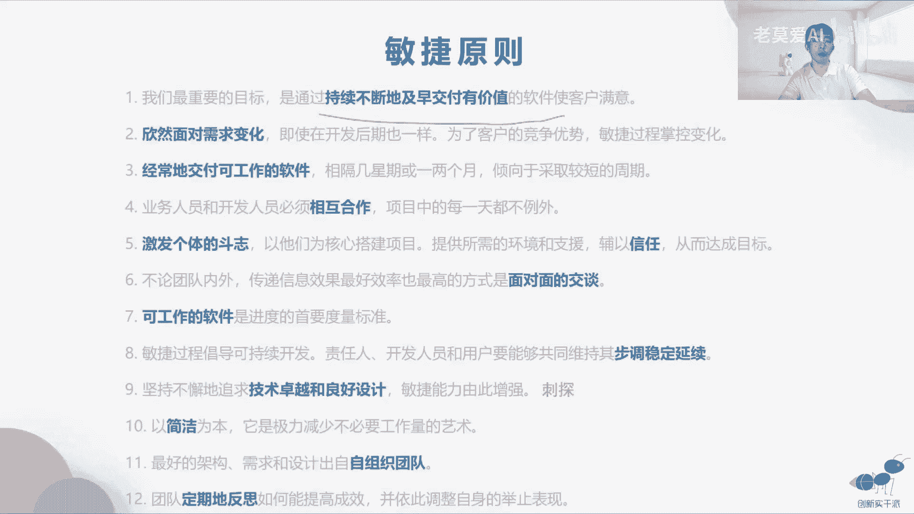

回顾会议是敏捷的一个大的考点，敏捷其实要考的东西很少，要记的内容很少，它要灵活去用的最佳实践，我们就可以跳过了，这个你考这个会不会考。

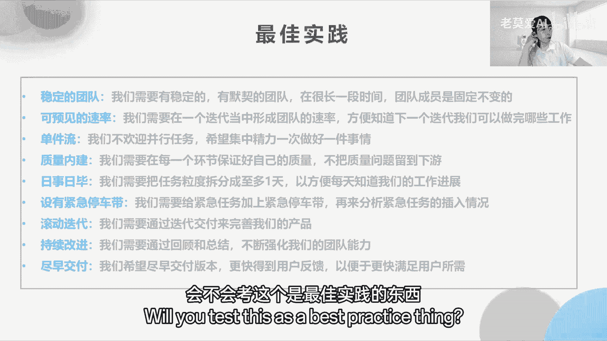

这个是最佳时间的东西，传统开发与敏捷开发，传统开发和敏捷开发最大的不同是什么，最大的不同其实就是什么成本，时间在敏捷里面是一定的，我们说好两周发一个版本，两周的周二，那么你到周二的时候。

你就要发一个版本，那有些人说，那我周二工作没做完怎么办，你做完几个工作就发几个工作，比如说你本来这一个迭代或者这个版本，它有十个任务让你完成，但是你在周二的时候，你只完成了八个任务，那么你要不要发布。

要发就把八个发了，剩下的两个就不发就好了，对到了时间点一定要加东西，这个就是敏捷的这个体系啊，那传统的是什么，传统是范围不变，比如说我甲方跟乙方签合同是吧，我合同上明确让你去做十件事情。

你只做了八件事情，那么我会扣钱的，而且没完成，可能扣的还不是20%，这么少可能会扣的更多，所以他是有严格要求范围的，那么你延期可能严重性没交那么严重，所以它可以允许一部分的延期的量，你可以稍微延期一点。

可能延期个10%，对于整个项目没有太大影响，正是传统开发项目，所以两个本质上的区别是这样的啊。

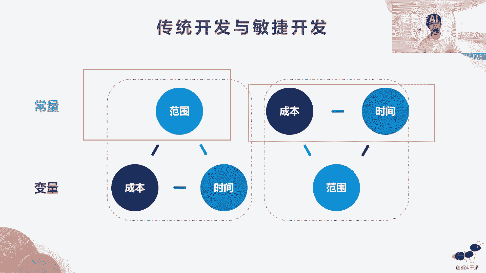

这个就是这样去解释的，那么就到了这个敏捷的概念之后，我们就可就可以描述一个精益和敏捷的关系，精益和敏捷有什么关系，精益其实是什么，襟翼其实是丰田有一个精益法则，丰田生产它是用精益法则来来去做的。

那么精益它首先是放在制造业，制造业敏捷其实它是在软件上的定义生产，你可以这样去理解它是软件上的呃生产，其实这样看来，其实全世界的生产，其实都是在学丰田的生产法则，所以丰田公司很牛逼，就是这样的。

它不仅产生各种各样的汽车，也养活了很多咨询师团队，大家都在学习他的一些方法和技巧，所以敏捷是精益，其实包含了敏捷，精益里面有个看板，那么这个看板在被敏捷也引用了，所以这个看板你看这个是画在两个之间是吧。

就金翼本身有精益的看板，那敏捷他也有自己的看板，他的看板是经过精益看板改良的，精益看板里面是有叫做WIP的，叫做的中间的一些交互也叫零件是吧啊，他为了消除浪费，它会有一些这个东西。

但是WIP在敏捷里面是没有的，敏捷其实它主要是看板，主要是一个状态墙，表示这个软件的生产的状态的，敏捷里面有有很多方法，敏捷里面这些方法是从哪里来的，我们看comm bang。

什么AUPSDMDDXP水晶啊，这些方法是怎么来的，大家不要忘记了，敏捷方法是由17个人共同创建的，所以这17个人就会有各行各业的专家的方法，是这个水晶方法都是那些专家。

七个专家一些他们觉得是矿的方法做，所以他会融合各家之长，还有个是QUAM，SQUAM的方法是大家使用的最多的，就是那个时期17个专家捷达诺斯，他觉得是矿是用的最多的，所以偏爱最容易接受的。

而且是广泛用于实践的，所以大家都都都在用QUAM方法，那么敏捷当中SQUAM方法是是用的最多的，所以PMI出的那个考题里面，几个敏捷的考题里面有百分考题不会考，都是SCM方法。

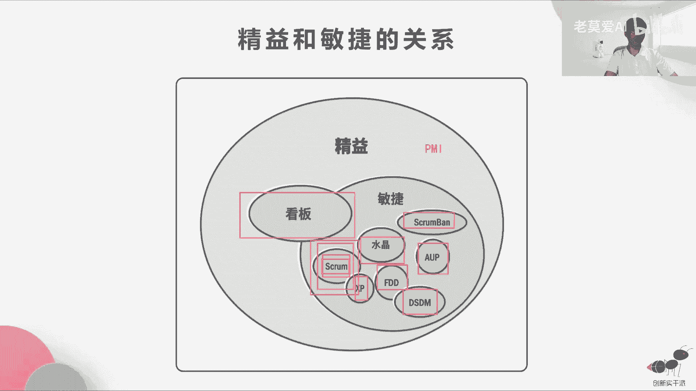

我们只要学会了score方法，敏捷部分我们肯定能消除浪费，比如说那么精益的工作浪费浪费，虽然考题不会考这个考点任务的切换。

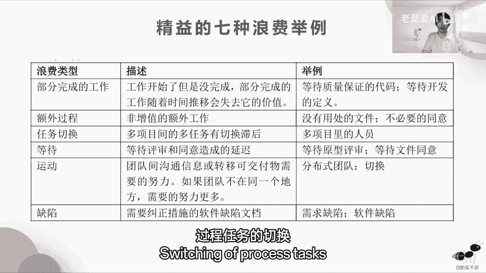

机翼的七种浪费，我们稍微是要了解一下的，最容易接受的，而且是广泛用于实践的，所以大家都都都在用QUAM方法出的，那个考题里面。

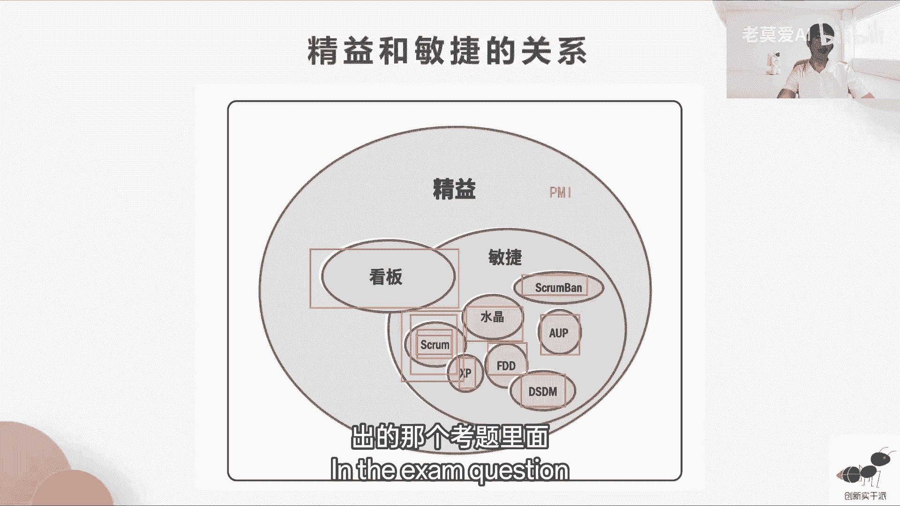

敏捷的考题里面有90%都是score方法，我们只要学会了score方法，敏捷部分我们肯定能及格，那么精益的七种浪费，这个不是考点，但是机翼的七种浪费，我们稍微是要了解一下的，比如说一个多项目里的人员。

这个人既在A项目，又在B项目，他今天做A项目的事情，明天做B项目的事情，所以就叫任务的切换，因为人的大脑不像CPU一样，你处理A事情还没处理完，再处理B事情的时候，你会有点断片，但CPU不会。

所以这个东西任务切换它就会有有有损失，他们在丰田里面被称之为浪费，OK那么运动也是浪队，分布式团队的切换，我们的团队在很多不同的地方，所以我们为为什么在敏捷里面要讲，尽量的面对面沟通，就是远程的沟通。

其实也是一种浪费缺陷，这些缺陷其实你做一件事情，你反复的去修改它，这其实也是一种浪费，所以精益的七准浪费主要是这个，但是精益的七种浪费它不考不考。

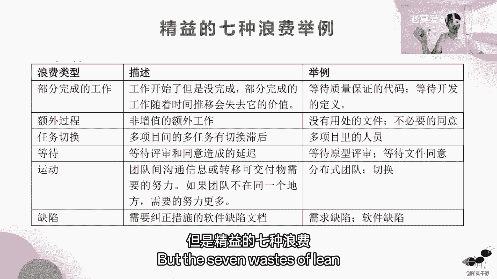

大概了解一下就好了，精益的七个原则就是针对七种浪费来说的，你既然要浪费，那我们就要消除浪费，第二个就是增强学习，第三个就是较迟决定，较迟决定是什么意思，就是你在没有收集到很多信息之前，你不要去做决策。

是丰田他们最注重的一件事情，就你如果太早去做决策，你一看到这个事情的现象，你不去研究清楚，没有收集到更更多的数据之前，你的就已经做出了判断，这个在职业经理里面是很致命的，他们这个叫什么来着。

这个叫经验主义错误，因为你做职业经理做了很多年，你什么事情你都经历过，所以你当它发生这个事情的时候，你自然的会这个你看到这个现象的时候，你自然的会往那个方面去想，就像你说我在街上看到一个人拿刀砍人一样。

那我如果经常看到这些砍人的视频，更多的是情杀，那我一看到砍人，我肯定第一个会想，男人要是拿刀砍女人，这一定是情杀，那这个事情是什么，这个事情就是经验主义，所以在了解这个事情的全部之前，你得出一个结论。

情杀其实是不对的，这个是与你以往的经验有关的，这个要摒弃这种东西，所以即丰田其实是讲的是这个，所以要较迟的决定，但是要尽快的去交付，尽快的交付，就是把结果交到客户，看他的反应就再做决策，这个是OK的。

好团队授权建立整体目光长远，这个七个原则也不考。

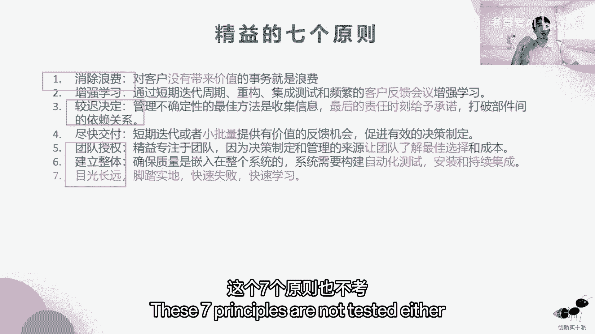

大家理解一下就好了，稍微看一下减少浪费的模型，这个也不考，简化的看板，其实就是这样的，需求池准备就绪，设计实现测试，待发布这些东西，每一个状态它给你在上面标示出来，蓝色的地方是什么，就是你的任务。

你的任务或者需求他都可以放在这里面，这个任务的呃，进行中进行中完成了整个状态，他放在这里，这个简化的看板，他就是敏捷的看板啊。

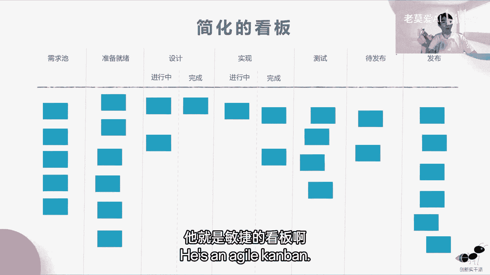

那么完整的看板，精益的看板到底长什么样子，精益的看板是这样的，它是详细的看板，也就是说它上面标有数字的，这个数字有什么意义呢，这个数字就是WIP再次品限制，再次品是什么零件，在这一个列当中的工作。

这个任务他最多能犯的数量，你可以理解什么，你可以理解为如果大家开车，你可以理解为这个是车位，比如说测试六就测试六这一列它只有六个车位，你是也就是说它只能停六部车，那你有多余的车。

比如说就像多余的任务过来，那么你得先把这个车位的车挪开，你才能把新的车挪进来，对不对，所以他挪的顺序是什么，它挪的顺序就跟这个一样，跟这个箭头一样，它只能够由前往后挪，也就是说只有发布了之后。

比如说这些，你看123456这六个任务，他全部发布了以后，或者是说这六个任务有一个任务发布了，这个待发布的任务才能够放到这个来，待发布任务，它只有两个待发布的任务，往前移动了之后，就是待发布的任务。

看一下，给大家画一下待发布的任务，到了这里以后，后面的测试才能往这儿走，测试六个以后测试，他要这个测试任务，要放到待发布之后，他才能允许有完成的任务放到这来测试，继续测试啊，就这个事情我活没干完。

或者我没有把活交出去给下游之前，我是接受不了这个活的，这个其实就是车位的概念，那么车位的概念有什么好处，有什么好处，就能够看到我们团队的瓶颈，如果一个车位，你看如果这个车位有一些车位很多。

就有些列的车位很多，有些列的车位很少的时候，这个时候我们要注意了，车位多的反而是什么堆积在一起的，你要是开上游，比如说这个测试是六，但是完成进行综合完成，它是四，对不对，它的是它不平均。

就会出现一个问题，就像水管子一样，水管子一样，水管子它水通过的速度是由什么决定的，是由最细的那个部分决定的，它不是由最粗的，比如说水管子这一头很细，到了这边他接了一个很粗的水管，又是很细的水管。

水的流速其实是跟细的水管有关系的，所以详细的看板就是我们的在讲，最好的这种工作流方式，应该是整个工作流，它每一个数字它都是很平均的，40万，整个整个任务就像水流一样快速通过，它不能忽大忽小忽小忽大忽小。

他那个大的部分其实就是阻塞的部分，我们要就要看这个大的，为什么要设置成六个任务，这个如果设置为六个任务，那实现我们能不能多放几个人去完成多个任务，那设计能不能多放几个人完成这个任务，能不能把准备就绪。

设计和实现和测试，他都变成每一次他都能完成六个任务，这样的问题就摆在我们前面，我们就可以通过看板去发现团队当中的瓶颈，所以精一的看板是发现。

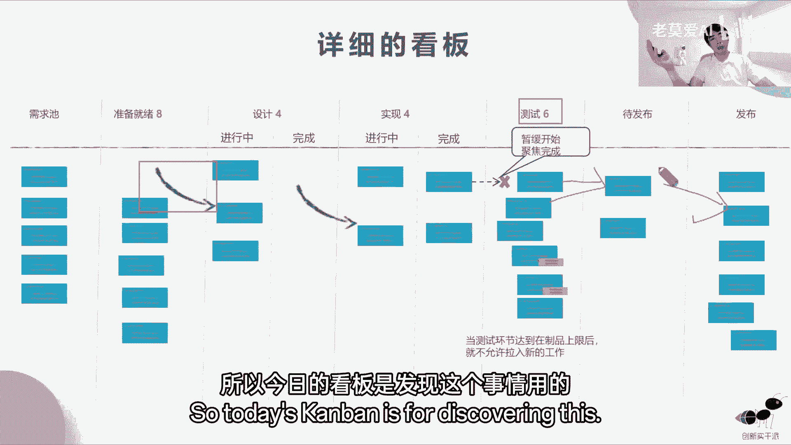

这个事情用的跟敏捷的看法不一样，敏捷的看法是就看状态。

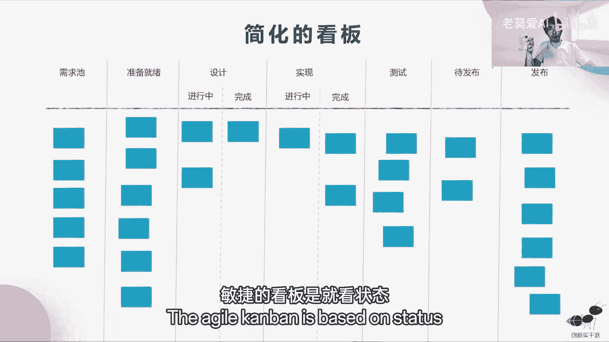

我们不做瓶颈的判断，OK好，那么这里面就会提到瓶颈，这个数字就叫再次品，再次品其实就是什么。

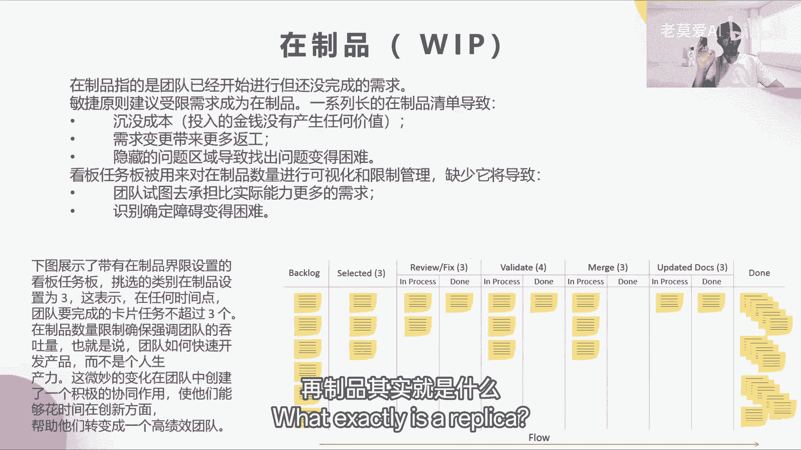

就是不产生价值的事情，我们就想说敏捷它要产生价值，它要看结果，那么没发布的事情，这些框框里面的东西它都没有价值，在敏捷里面是没有价值的，因为它不产生结果，它都是过程，它只有在发布之后。

用户看到它才有价值，用户是为看到的东西买单的，OK听懂的同学打个一啊。

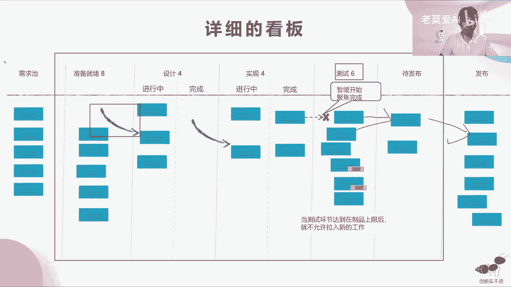

OK好，那么SQUAM我们为什么要学SQUAM，是因为SQUAM它占比54%，在所有的实践里面，其实它应用的最多的。

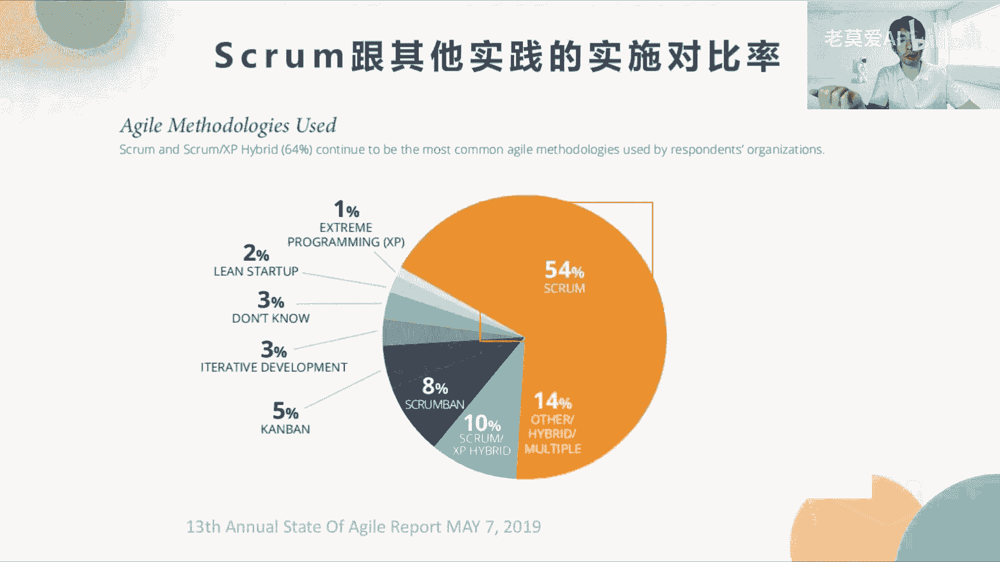

所以PMI学到那么SQUAM的这个结构框架，就是3355，你学会了3355，岂不其实考试就已经过了啊，3355是我们整个基础基座，也可以说是基座，也是整本书的思维导图里面，最重要的这一块东西。

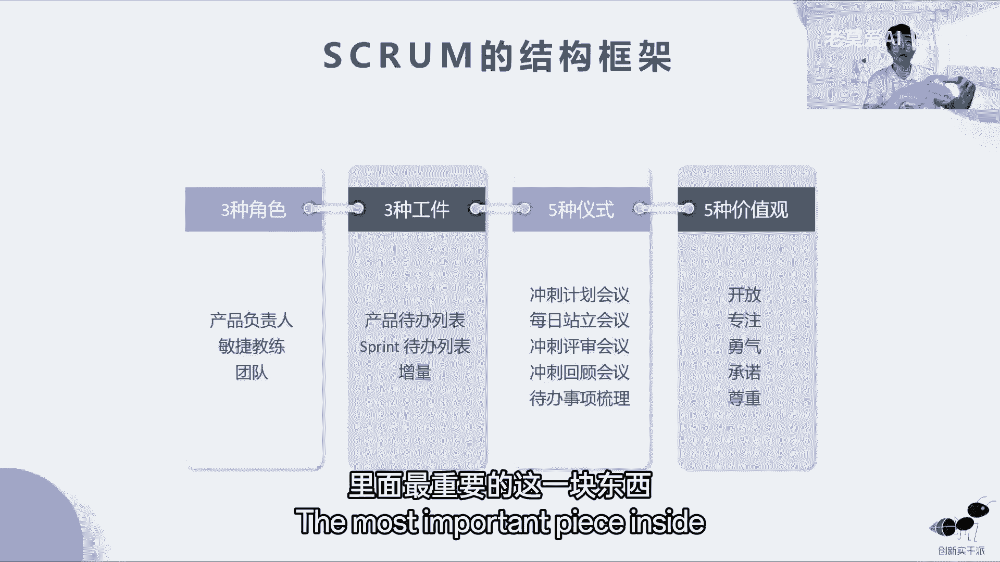