# 【最好的PMP课程】PMBOK7精华讲解1-3 - P1 - 老莫爱AI - BV1jb421J7ZZ

手机一定是整个实体，它要求的质量其实是需要很高的，所以这个里面就是预测型，所以敏捷型它指的是里面的这些软件，可以先刚开始的时候他的软件体验差一点，后期慢慢去改善，对不对啊，软件可以打各种补丁是没事的。

OK是这种回顾会议，它里面只要加了回顾会议，传统的项目加了回顾会议也是混合项目，传统的项目里面有看板这个关键字，你就想这个是敏捷项目，传统的项目加了测试驱动开发也是PDD对，就测试驱动开发。

它也是混合型。

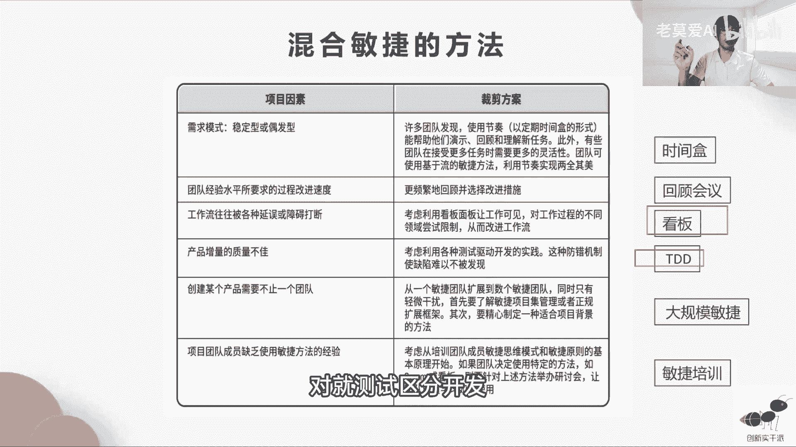

加了大规模敏捷，加了敏捷培训，它就一定是混合型的，你就靠这些东西来判断它是不是混合型，第三节创建敏捷环境，创建敏捷环境里面会介绍三个角色，有个PO是产品负责人，它相当于前一段时间我们不是划龙舟吗。

他三相当于什么整个华龙舟的一个舵手，他是控制方向的，他拿了一个大奖，控制团队往右，他是PO，整个团队的团队就是属于TM他还不分角色，大家都是出力的，对不对，唯一不出力的是谁。

SM他是没有唯一一个没有讲的，但是没有讲它也能发挥重大的作用，为什么他是敲鼓的，大家的节奏是由他来带的，他看不见前方的方向，对你们的桨有没有一致的滑到水面上，他去不断的去指导你们。

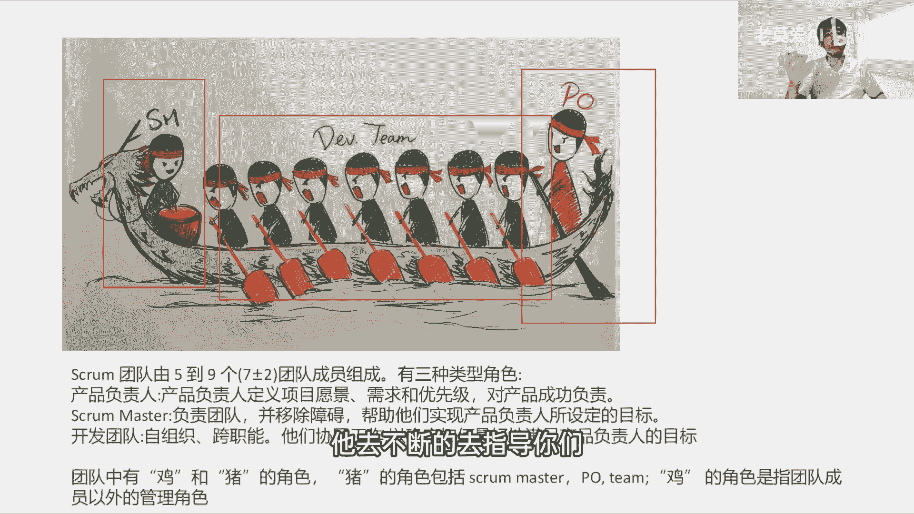

这个人就是SM在传统项目管理里面，一般是由项目管理去任务担任敏捷的，比如说你要传统的项目要转型为敏捷，那么就是由项目经理去转SM一般是这样做的，OK这个是三个角色好，那么三个角色各有侧重。

团队就是为之负责，就是为整个项目的输出结果负责的其实是团队，那么PO是什么，P第一个是他要清晰的表达的是产品代表思想，他要实现目标和使命，他要怎么样优化团队，使执行工作的价值。

确保产品代办事项对所有人可见透明清晰，以显示下一步工作，也就是说他为了追求最好的结果，他要进行的一些努力的工作，所以他是以结果为导向的，就是看大家的目前做出来的整个结果，那么SM是什么。

SM保证所有人正确的解理解并实施SCM，它是过程导向，他是看大家的过程做的O不OK符不符合，去帮助大家去纠正，就像划龙舟一样去纠正大家的一致性的发力，就是大家划桨的这个手法，你要怎么切入水中。

他是来指导这个的，所以SM在很多团队里面，他如果你没有项目经理，你的团队里面一定是技术人员去担任SAM的，我很少是看到产品同学去担任SM的，因为产品一般的是比较看重结果的对吧，他们天然就是不一样的角色。

所以有些人就跟我说，孟老师啊，我们公司有个产品，他能不能接任SM啊，我说你千万不要这样做，因为什么，因为产品一旦兼任SM，跟产品的视角不一样，因为产品只看结果，所以SM最好你如果是没有项目经理的团队。

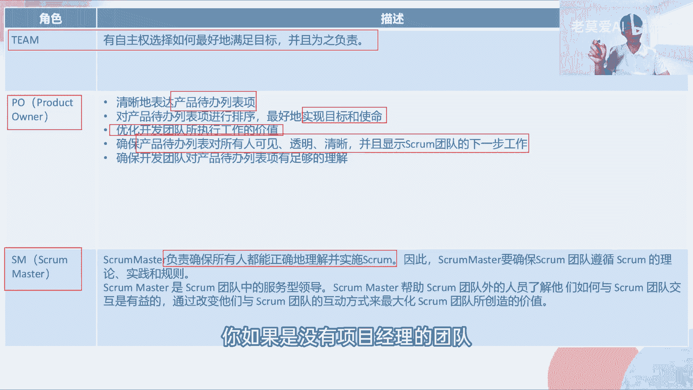

你SM最好是由技术同学来担任，那么SM他一般是什么，就是敏捷的专家啊，你首先要给他进行一些敏捷的培训，第二个是他的障碍清除者，他要去帮团队去清除障碍，去解决问题，但团队得到结果，对他辅之信任。

所以他通过解决问题去得到团队的信任，他是团队的障碍清除者，他是仆人式领导，普任试听领导的考，这个也是考点，普瑞斯领导是什么意思，他在这个团队当中，他去服务大家的，不是去发生令他不是这些人的老大。

最后是变革的引领者，在拥抱变化里面，他是比其他人更激进的，他就相当于牧羊犬，牧羊犬就是整个羊群是吧，放的好不好，往哪边走。

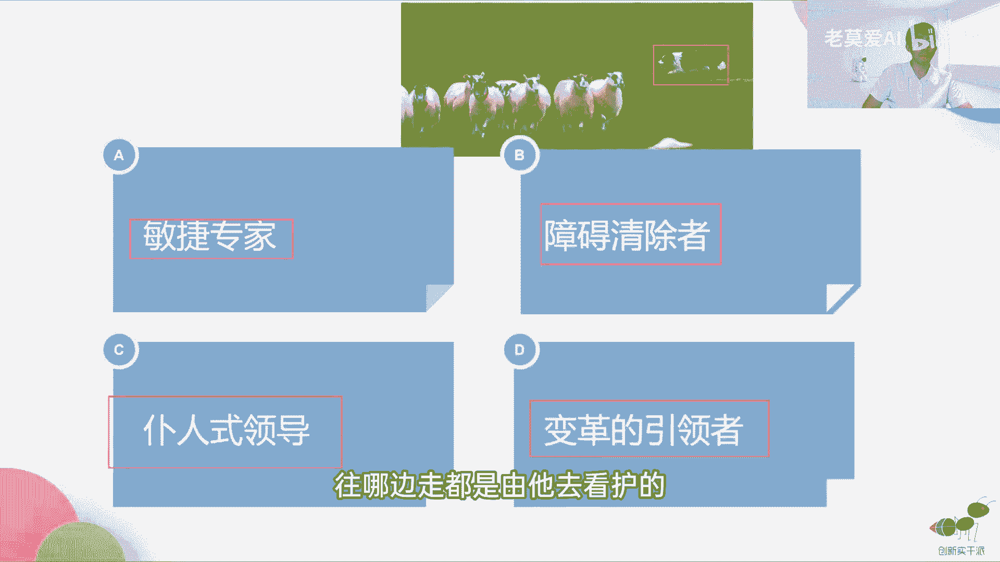

都是由他去看护的，OK好，这个有个36题啊，我们可以先做一下，哪个团队成员应该引导或促进迭代审核，你们觉得是谁，1234，OK很好啊，你们如果看到了这个引导促进这两个关键字，我们就要想到什么。

我们要想到的SM矿主管，所以正确答案是D，在SC开发团队中，谁负责确保团队遵守敏捷实践，这个是谁遵守什么东西，这已经是什么，跟过程有关，选择这个school master或者选择敏捷教练都是一样的。

这是一个怎么样，同一个东西，根据SCM理论，产品负责人的主要职责是ABCD，因为他对结果负责，所以唯一跟结果相关的是这个投资回报率好，作为敏捷团队的领导者，乔伊注意到团队的每日战力。

会议时长远超于建议的15分钟，为了保证会议简短而有效，他可以怎么样，ABCD啊，它可以建议什么，对于这个是crome master的职责，劝职肯定不对，他不能劝职，他直接改也不对。

他忽略这个肯定很消极也不对，所以正确答案。

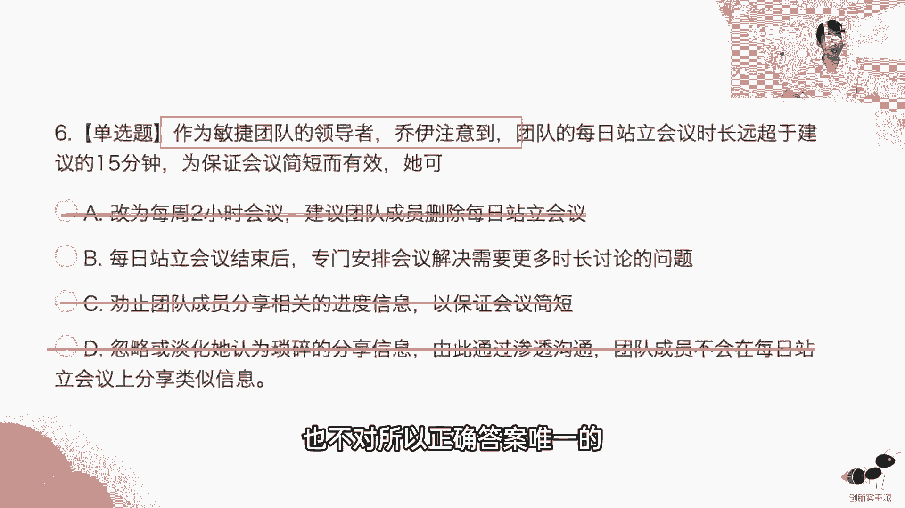

唯一的只有安排会议讨论这个问题，正确RSB不论是领导的特征，其实特征更多的是什么，在团队需要你的时候出手，我们叫做该出手时就出手，该出手时就出收，团队在刚开始遇到问题的时候，这个问题不严重的时候。

你是不需要出手，需要你出手的时候，我们后面会说该你出手的时候。

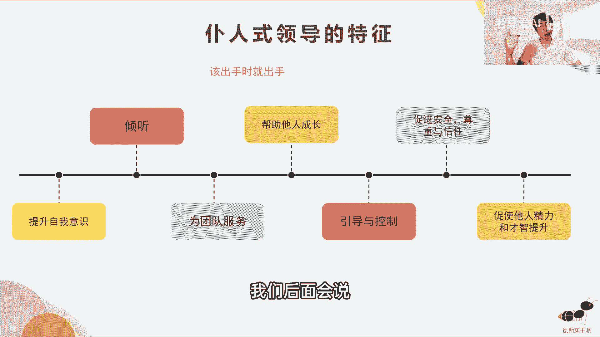

你就会出手，那么如何做好普认识领导，第一个建立大家共同的目标，第二个不断的去鼓励团队，第三个重视结果就好了，那不论是领导如何正确的导入敏捷，第一个首先做培训，这个是考点，我们在导入敏捷的时候。

我们第一步要做培训，第二个鼓励团队提供支持，第三个解决团队问题，第四个庆祝团队成功，这是一个闭环，从这里到这里，这是一个闭环，就这个闭环一定是需要那个的，需要在不断的去算起来的。

好普润是领导的一项职责是什么，ABCD更多的是怎么有知识。

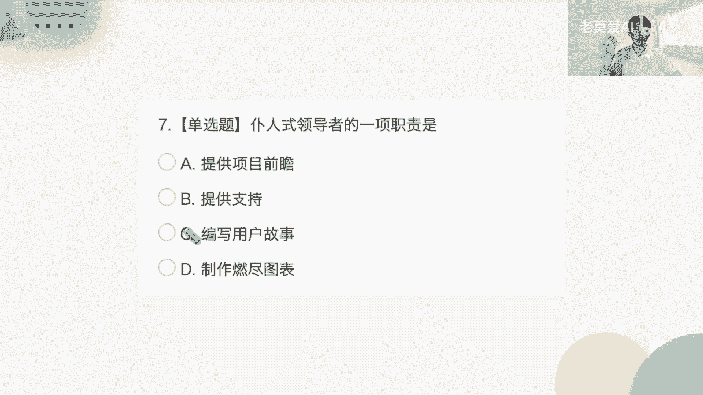

那么从项目经理转变到SM，它最重要的是什么，从以前的这种角色，发号司令的角色变成跟大家一起，怎么样共同的去做事情，共同的去分担，解决大家的问题。

好获得大家的认可，好产品负责人，我这里放了一头狼，产品负责人其实是相当于狼投篮，他首先他的职责是驱动产品的成功，你看都有结果有关，我们要记的时候，不要每一个我们都完整的记下来。

我们只要知道这个是跟结果有关，产品的愿景管理，需求池对投资回报率负责，这个也是结果定义，价值排序，排优先级决定这个东西发不发合不合适，发向利益相关者汇报，因为利益相关者他一般也就看成价值。

所以你要报只汇报结果的时候，是需要你去出面去做这个事情啊，参与的工作，比如说我们的supreme planning，我们的计划会议，第二个是我们的JACKCLOCKGING，那这个事情是什么事情。

这个事情就是代办速想梳理会，就是每一次需求来了以后，我们要梳理就是这玩意，第三个是什么，第三个是我们的spring review，这个是什么，这个就是我们的评审评审会议。

这是评审结果的这个retrial spective对吧，Rachel spective，这个是什么，回顾会议，这个是做回顾用的，然后这个这个是战略会议是吧。

DAIIS那个daily daily crome，你要参加这种会，Release plan，这个是发布计划会对吧，你要参加这个通过或否定工作，因为你验收的是结果对吧，所以通过和否定是由你来验收。

然后一个产品只能团队只能有一个，如果有两个就乱套了。

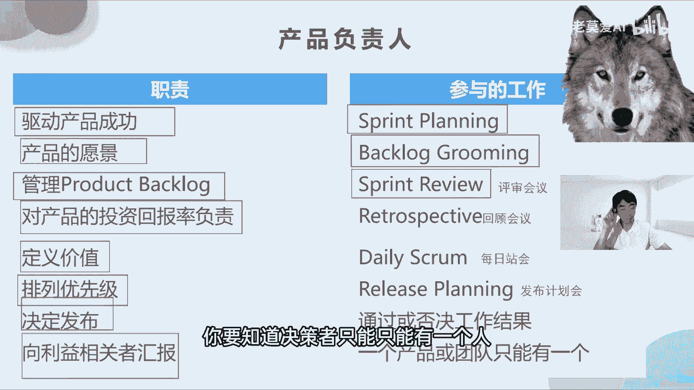

那我们可以看整个团队的属性，专门的人员需要专职团队，又需要小团队跨职能，整个敏捷团队需要跨职能的团队，有什么开发呀，有运营，有产品，有测试对吧，有有运维发布啊，这些人第三个是集中办公，集中办公。

第四个通才和专家组成的混合型团队，第五个是要由这个稳定的工作环境。

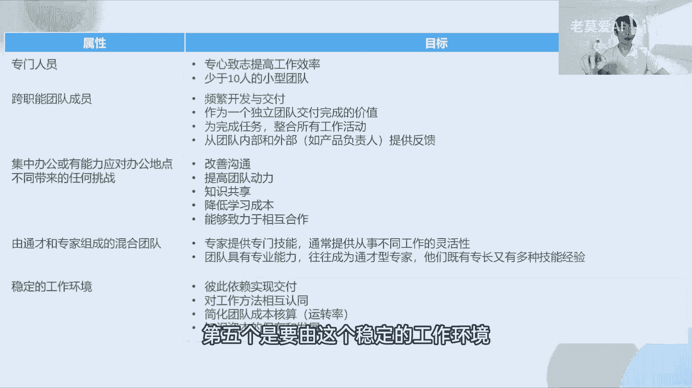

所以整个敏捷的小团队团队，一般我们是称作敏捷的小团队，一般是一个汉堡哦，一个披萨能吃饱的团队，我们一般是5~7人，5~9人，5~9人的团队，也就是七正二，这些团队的规模正正二。

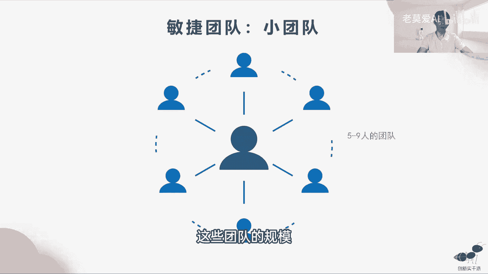

团队规模一般是这样的，好集中办公是吧。

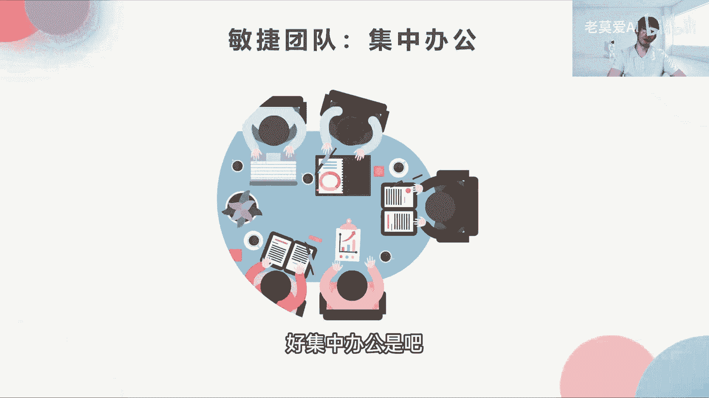

我们每个团队需要集中办公，然后又一道考题，为提高团队绩效，对于敏捷团队教练和指导的尺度是什么，A对于敏捷团队项目教练和指导是不必要的，有没有说没有吧没有，所以这个不对。

连续和普遍的指导教练和指导需不需要，这个也不太一定，由团队和需求和组组织的规模决定，这个是对的，就是敏捷啊，你一定要看团队就是看客下菜，而不是一上来就怎么样，就团队大规模推敏捷什么东西啊。

这个东西一定是要去解决问题，让团队先自己去做决策，然后再去自己去评判，就像那个我们讲的精益一样，就是不要过早的去做判断，你要拿到一些数据，达到一些这个结果之后，你才能够去做一些更准确的判断。

不要去犯经验主义的错误啊，所以正确答案是C。

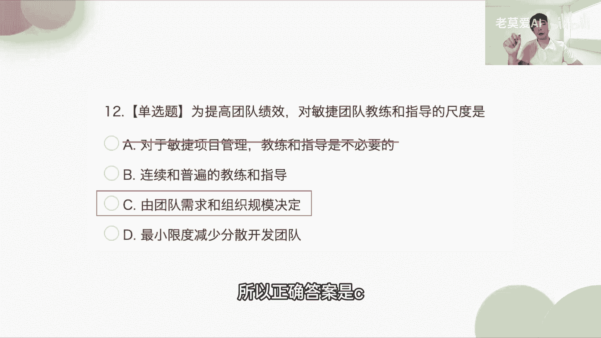

所以敏捷团队，还有一个稳定有序的工作环境是什么，就是这个团队如果有太多人离职，比如说有30%，这一年有30%的团队都离开了，这个团队不太适合做敏捷，因为敏捷他没有很多文档，他不不强调你写很多文档。

这个人一旦离职了，这个东东西，你别人来去接手的时候，看你代码或者什么东西的时候，他是接不太起来的，所以你团队如果流失严重的话，其实不太做，适合做敏捷，更适合做传统的项目，就是那种需求文档写的很细对吧。

那么如果有新人去接手的话，他至少看需求，也能知道你之前做的这些功能是什么意思对吧，也能从你的那个代码很细的那个注释里面，能够看到你代码是怎样写的，但是在敏捷团队他就变成了一个弱点了。

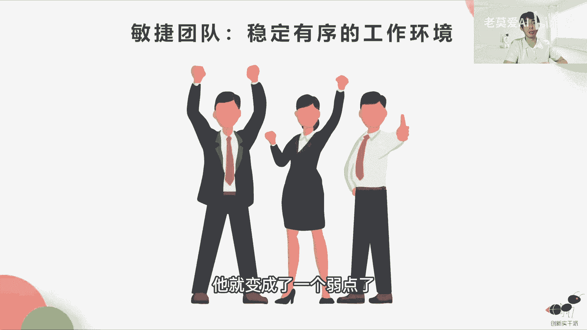

好下一次我们再哦再做一下这个题目，叫做敏捷，有一个这个重要思想，就是团队成员之间需要有高效的信息共享，以下哪一种沟通方式确保了这种思想的可行性，并且又符合敏捷宣言呢，然后这里有ABCD。

你们觉得选哪一个，这个其实在敏捷的原则里面，我们就其实已经说过了啊，就如果有面对面的沟通，一定要选择面对面的沟通。

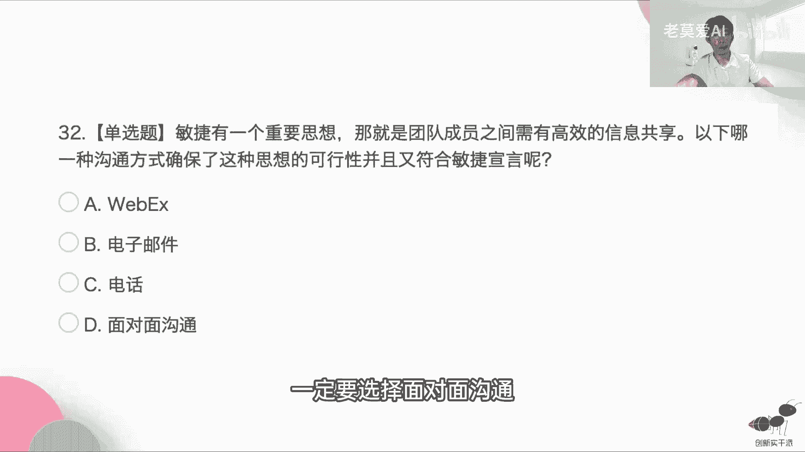

这个是毋庸置疑的，好团队的人才的能力一定是T型人才，不是I型人才，T型人才其实就是通才，他既有专业上的深度，然后又有广度，又有一些，比如说他很了解用户对吧，他能够站在某一个这个对立面的。

这个立场上去考虑问题，需要有这样的一个能力，所以团队人才能力应该是这种。

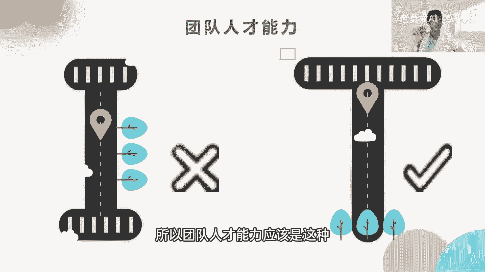

那分散团队如何处理，其实在于我们疫情后的这个团队啊，我们对于分散团队的处理方式，其实已经很高效了啊，比如说我们能够在一起，怎么样在一起，我们不断的去沟通，我们还能够通过我们的这个互联网的。

这种方式去交流，比如说啊我们的这个腾讯会议是吧，我们能够不断的去足不出户就去交流好，沟通好一些需求，什么东西就这样去处理就好了好。

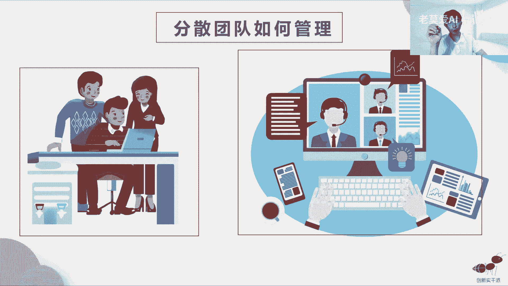

OK然后第一次第一节我们就讲完了，第一节我们敏捷串讲一讲的，主要是我们的一些敏捷团队，他刚开始搭建的时候，他要具备的哪些能力，以及我们的基础的一些敏捷的方面的一些概念，我们就给大家阐述到这里。

下一节课我们会说敏捷怎么样的，他的一个整一个过程，敏捷的过程它是到底是怎么样去做的，他这个放在第二节敏捷串联二里面对吧，那第二节课是我们的这个，如果把这个考试分为这个三个，我们敏捷串起来有三个。

那么123它的重点分别是多少呢，第一个大概占了有30%的比重，第二节课占了有50%的比重，第三节课占了20%的比重，其实这三节课就相当于就是这样去区分的，OK那么大家还有什么问题没有。

大家可以在这个问题点的时候，大家可以提一下，我们现场其实在直播的时候的好处就是这个，OK那如果大家没有问题的话，那今天的这个就已经结束了，然后回去的话我还会整理一些在，因为我们也快要进入冲刺状态了对吧。

然后因为7月份我们8月31号考试是吧，下个月其实8月份整个就是冲刺了，我们也希望给大家一些提前的一些准备，什么东西，到时候有一些这个呃需要冲刺的一些文档，我也会发到那个群里面。

然后让大家怎么样去去去看到，怎么去怎么样去准备一些冲刺的东西，OK那今天的这个直播就到这里。

这个是什么评审会议，这个retrial spective对吧，Rachel spective，这个是什么回顾会议对吧，DAVIS那个daiis chme release plan发。

不因为你验收的是结果对吧。

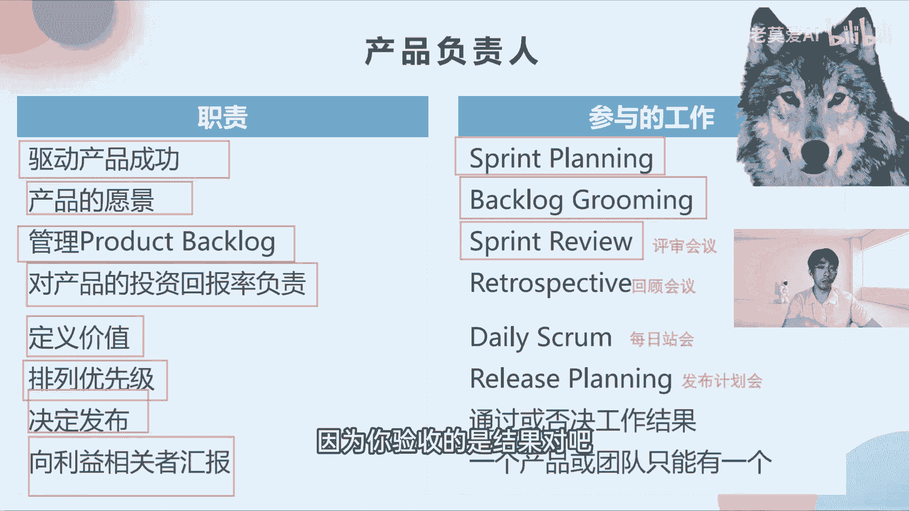

所以通过和否定是由你来验收好，那我们可以看专门的人员跨职能有什么开发呀，有运营。

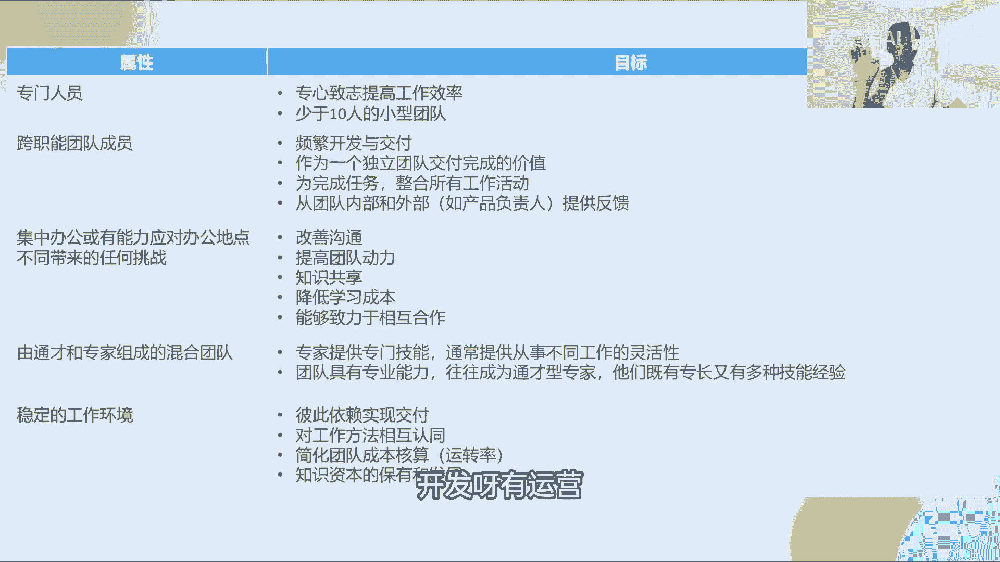

有测试发布，集中办公，第四个通才和专家组成的，所以整个敏捷的小团队团队，一般我们是称作敏捷的小团队，一般是5~9人，也就是七正二正，团队规模一般是这样的。

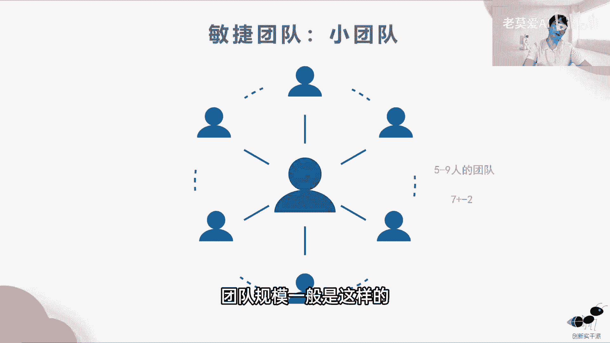

又一道考题A，对于敏捷团队项目教练和指导是不必要的，没有吧，连续和普遍的指导教练和指导，这个也不太一定，你一定要看团队，而不是一上来就怎么样大规模推敏捷，这个东西一定是要去解决问题。

然后再去你要拿到一些数据，达到一些这个结果之后。

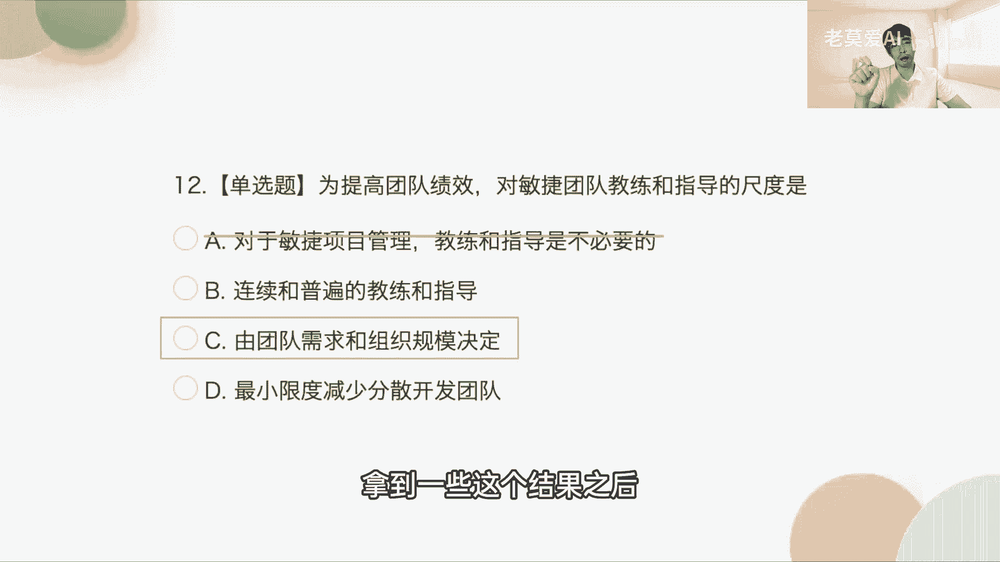

你才能够去做一些更准确的判断，所以敏捷团队，还有一个稳定有序的工作环境是什么，就是这个团队如果有太多人离职，比如说有30%，所以你团队如果流失严重的话，其实不太做，适合做敏捷，更适合做传统的项目。

就是那种需求文档写的很细对吧，那么如果有新人去接手的话，他至少也能从你的那个代码。

很细的那个注释里面，能够看到你代码是怎样写的，好下一次我们再哦再做一下这个题目，然后这里有ABCD，你们觉得选哪一个，这个是毋庸置疑的。

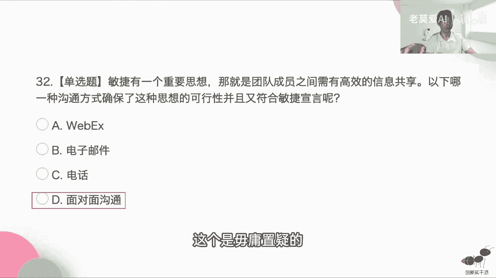

不是I型人才，T型人才其实就是通才，然后又有广度，他很了解用户对吧，他能够站在某一个这个对立面的，这个立场上去考虑问题，所以团队人才能力应该是这种。

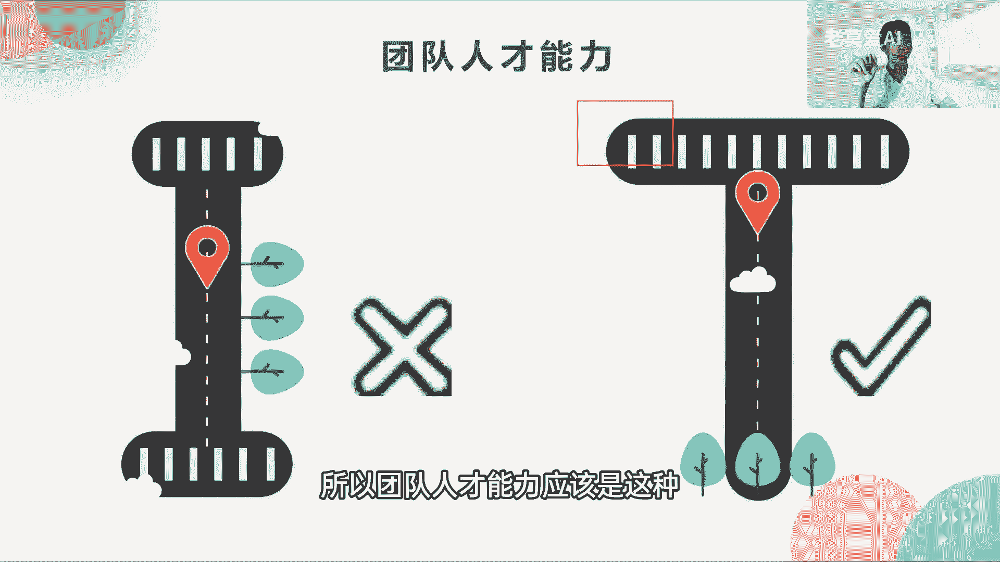

我们对于分散团队的处理方式，其实已经很高效了啊，在一起我们不断的去沟通。

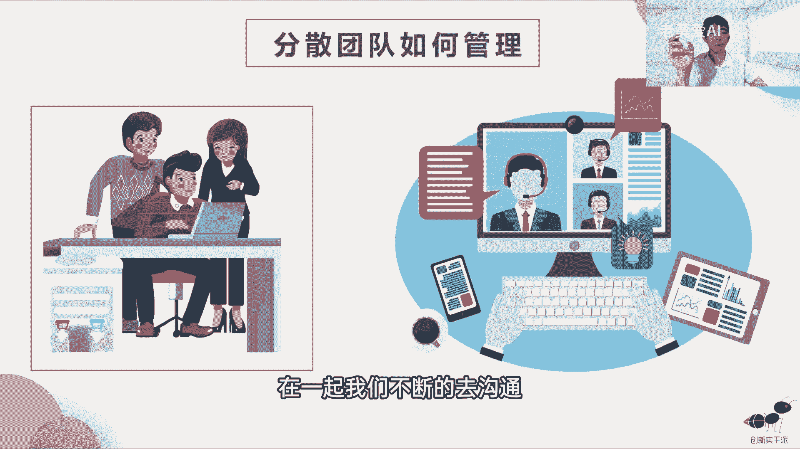

比如说什么东西，我们就给大家阐述到这里，下一节课我们会说敏捷怎么样的，他的一个整一个过程敏捷的过程，它是到底是怎么样去做的，他这个放在第二节敏捷串联二里面对吧，那第二节课是我们的这个。

如果把这个考试分为这个三个，我们敏捷串起来有三个，那么123他的重点分别是多少呢，OK那么大家还有什么问题没有，我们现场其实在直播的时候，OK然后回去的话我还会整理一些在。

因为我们也快要进入冲刺状态了对吧，然后因为7月份我们8月31号考试是吧，下个月其实8月份整个就是冲刺了什么东西，需要冲刺的一些文档，怎么去怎么样去准备一些冲刺的东西。

