# 【最好的PMP课程】PMBOK7精华讲解2-2 - P1 - 老莫爱AI - BV1GH4y1c7KV

ABCD里面哪一项，OK幻听答的非常好，正确答案是D，完成的速度，这个不是因为价值点功能的描述，故事依赖关系其实都有完成的速度，其实不是在里面的，OK用户故事练习我们就不跟大家去说了。

用户故事其实他会有自己的局限性，那么这个地方不会考，但是我们在实际的工作当中，我们一定会用到，为什么，因为产品在提很多用户故事的时候，也就是提需求的时候，他其实需求是很杂乱的，提供过来的，今天提一个。

明天提一个，所以这个就有一个局限性，就是只见树木不见森林，我完成了这些用户故事，或者是说我完成了这些需求，但是我不知道完成了这个需求，对于我们整个项目来说，或者整个产品来说，它意味着什么，不知道。

我只知道去做，所以开发人员就会变成了搬砖的，我知道我搬的每一块砖都是有用的，但是我不知道这些砖是用来建房子的，哪些部分的，我也不知道这个房子是怎么建成的，我只知道每一块砖我把它垒起来就行了。

但是你对于脑力劳动者来说，如果你没有一个这个东西，你就真的是没有把脑力劳动者当体力劳动者用，所以这个东西是不合适的，我们希望大家是一个高知识分子，我们在做每一件事情的时候。

我们都能很清楚地知道这个事情意味着什么，这个事情能够为用户带来什么样的价值是吧。

我们希望看到一个整体的图，而且是希望我们搬的每一块砖，它在这个整个图里面就像每一场战役一样，我们打的每一场这个战斗，它在整个战役里面它起到一个什么样的作用，我们其实是渴望知道的。

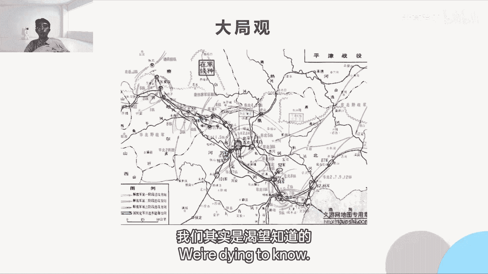

那这个东西它怎么样去知道，就会来到我们一个新的知识点，叫做用户故事地图，那么用户故事地图是黄色的，其实是每一个用户故事，它是怎么样通过一个地图的方式，把每一个用户故事摆在这个地图上面，它会有时间线。

时间线就是我们前面说的这个用户体验地图，就是用户在这个过程当中，他在购买的过程当中，他先浏览了哪些东西，购买了哪些东西，怎么加入购物车，那么这些东西是我们需要相应的，做出这样的功能。

这每一个功能点其实就是黄色的部分，所以时间线就是这样的，用户活动是大块，比如说登录模块，用户活动登录模块，浏览模块包括购物车模块，用户放入购物车模块，用户购买模块，用户支付模块，用户退货模块。

它会在用户活动里面橙色的地方去体现，下面每一个蓝色的是用户模块下的，具体的一些模块的细细模块，你可以想象为它是子模块的任务，就这样的，OK在这个蓝色的这里面有蓝色一条一条线，这个很窄的线。

这个是代表什么，它是代表每一次发布发布线，比如说在他这个地方总共有三条线，在这个蓝黑色蓝色的第一条这个下面，他就是第一次发布，这个是第二次发布，这个是第三次发布，我第三次发布，我要发哪些东西，就很清楚。

我其实在用的最好的时候，我们是看那个喜马拉雅团队，他们会把整个发布，它会加上这个时间，比如说他一个月一次发布，那么7月份他发布什么东西，他会说，7月份我们在这里发布了这么多用户故事。

这就是我们7月要做的事情，这个里面是8月要做的事情，他把这样一个用户故事，地图贴在公司最显眼的地方，就老板一眼就能看到，所以他老板一眼就能看到整个喜马拉雅app。

他在这个app的产品上层面上看更新的部分，7月份7月份会更新哪些，8月份会更新哪些，9月份会更新哪些，老板一眼就能看到，所以这个东西对于这个公司的透明。

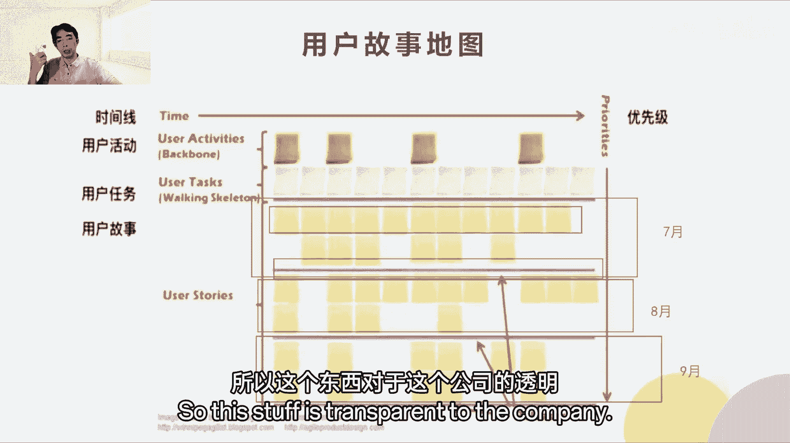

这信息透明来说是一件非常重要的，那么就像一个大的地图一样，老板一眼就能够看得出来，我们其实现在真正在打一场什么样的战役，这个战役里面我们会有哪些东西，我们会进行哪些措施，是这样的东西。

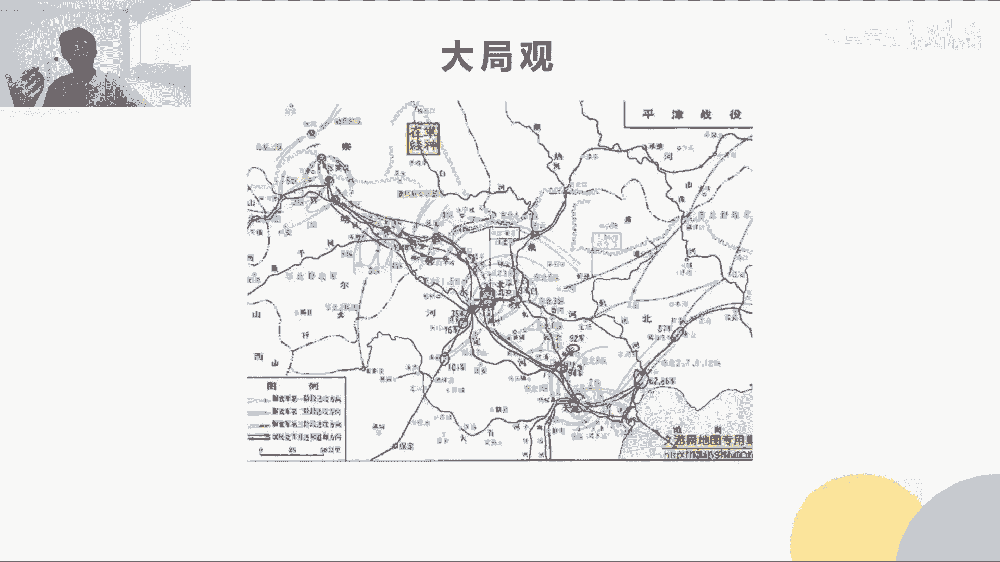

OK好，这个是用户式地图的东西，这个就是一个案例，故事地图的一个在线购书网站的案例案例，比如说用户在购书的时候，他其实分成这几个模块，业务流程管理账户是吧，比如说注册登录这些东西浏览是吧。

浏览图书清单去购买，进行图书的下单，什么东西，支付配送和退货这些东西了，下面就是他的每一个用户故事，比如说呃购买支付，先拿的支付，做比方支付，他第一个他刚开始的时候发布一的时候，他就直接线下支付。

跟京东很像，京东商城刚开始的时候，他商城没有做出支付，他就线下支付，就如快递员去收用户的钱，东西送到你家，快递员代收你这个东西多少钱，刚开始用京东的时候，我就是这样的，后面他支付宝支付做完以后。

线下支付直接就没了，第三个在后面再做微信支付，支信用卡支付等等等等，是这样的一个过程，OK这个就是我们的用户故事地图，OK如果用户故事地图大家听明白的。

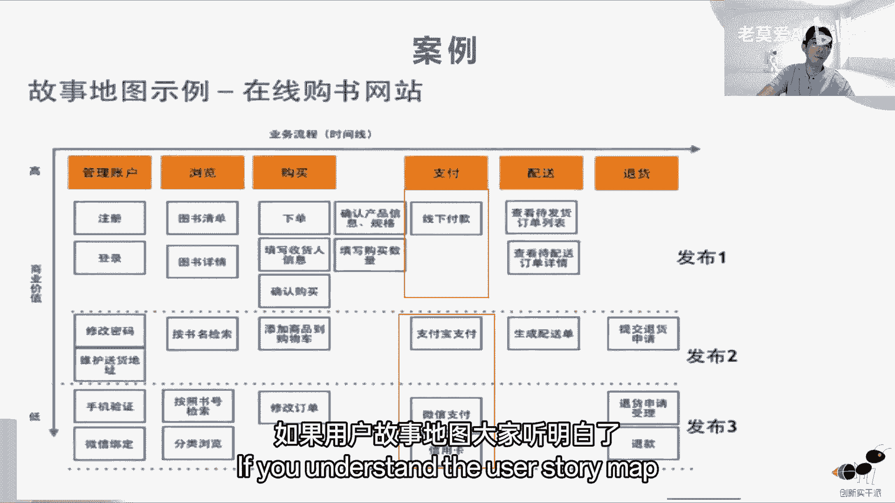

可以打个六，那我们再往下走，创建待办事项。

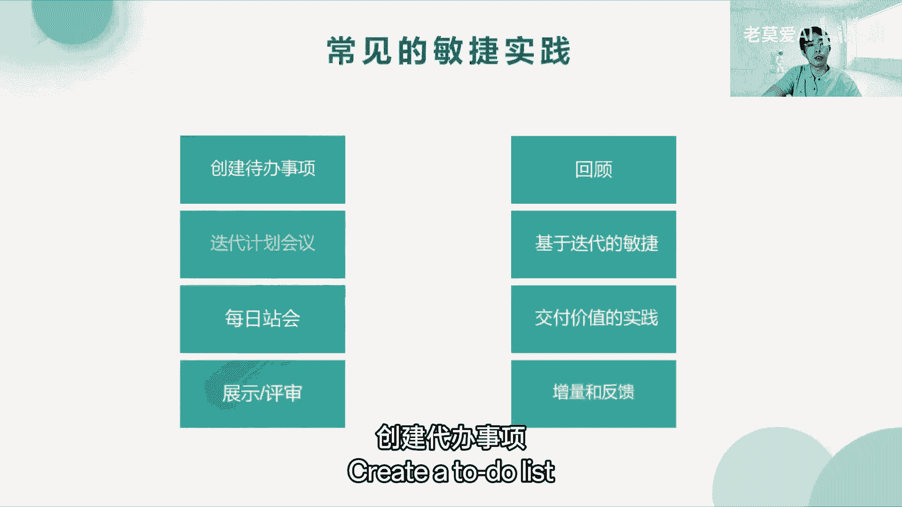

我们已经讲完了，我们接下来就要去做计划，对不对，做计划我们做计划的目的是为了什么，或者说我们的做计划的目标，我们做计划的目标就是为了产生，接下来我们要完成的事情，所以它的输出物就是我们的整个目标。

我们事情的任务列表就在这里，比如说需求池100个需求对吧，那我们做迭代计划的目的是这100个需求，在下一个两周迭代里面，我们能做多少个需求，比如说我们100个需求里面，我们两周只能做五个需求。

那么这五个需求就叫做spring blog这玩意，那么这五个需求做完了，实现什么样的目标，因为这个需求它是有价值的，对不对，那这些价值综合起来他要实现什么样的目标，比如说我们做完这五个需求。

我们的目标是让我们的销售额再涨10%，这个就是我们的目标好，那我们就围绕着这个目标去做这样的需求，就好了，好这个东西，它就是我们这一个迭代要完成的事情，这两周我们完成的这个事情，这他是输出物。

那么有了这个输出物，我们要想这个参与者是谁，项目的，所有的人都要去参加，因为计划其实是很重要的一个东西，议程议程是什么，就是这100个需求里面，对我们最优先要完成的哪五个需求，我们要去挑。

就像去菜市场买菜一样对吧，我们要买的菜是我们今天要吃的哪些东西，今天最想吃的哪些东西，我们要把它挑出来，这个是我们在开会的时候要去做的，团队要去做的，那么那为什么要去做，第一个了解即将开展哪些内容。

第二个讨论。

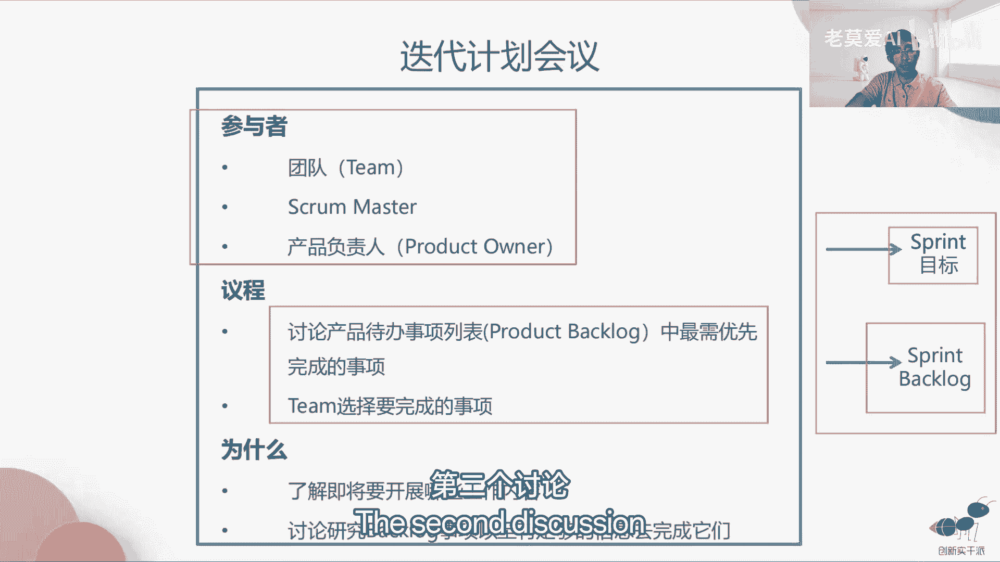

我们是不是能够有足够的信息去完成它好，那这里面就会涉及到一个东西，我们在每一次迭代做迭代计划的时候，一定是有取舍的，也就是说我们第一次迭代的时候，我们第二次迭代的时候，我们其实整个产品在迭代的过程当中。

其实就是慢慢的，怎么样不断的去完善我们的东西的，但是我们不是缺胳膊少腿的，之前我们在说什么，我们的生命周期的时候，我们就讲了迭代和增量的最大的区别是什么，迭代是我们不断的去反复的去收集用户的反馈。

就像我们画一幅蒙娜丽莎这样的图一样，他一定是迭代的增量的，它是比如说我先就打印机打印的，蒙娜丽莎增量的，比如说他是从监打这个脑袋前面，滋滋滋滋滋在打这个是吧，再打嘴巴，这个这样的在打肩膀。

那整个人的蒙娜丽莎就出来了，打印机是这样去打的，打印机器它为什么要去这样打，是因为它不需要反馈，因为你给他的是一张数码图，它只要跟你输出一模一样的数码图就行了，一模一样的打印出来的成品就行了是吧。

它不需要任何反馈，所以他是用的增量的方法，那么迭代的方法在敏捷里面，我们更多的在这个试错的过程当中，我们用的是MVP叫最小可行产品，我们是用迭代的方法，迭代的方法就相当于什么，你可以在上面不断的去改。

打补丁，就相当于第一个蒙娜丽莎的东西，比如说我们先打一个框架是吧，其实人画画跟机器画画是完全不一样的，机器打印它是那样的，人画画一定是我们先打一个轮廓出来，比如说蒙娜丽莎，那我我们先打一个黑白的素描框。

让大家看一下，大家可以去反馈一下，蒙娜丽莎这个女人画的好不好啊，丰不丰盈，是不是跟大家眼中的蒙娜丽莎是长得一样的，对不对，给漂不漂亮，再收集反馈，不断的去完善，比如说这个人是吧，他首先是一个框架。

你再去丰富一下细节对吧，丰富完细节以后，你发现他其实在背景还没有丰富，第三个再加背景，最后再加上色彩，也就是说就像我们的，如果我们再去做一个京东商城，拿这个东西打比方。

那么刚开始的时候一定是我们可以什么都没有，但是我们的浏览页要有用户可以在上面去下单，他可以去支付，这就完了，我们把基本流程打通，最小可行产品就已经做出来了，再接下来去丰富它的功能。

比如说我们再加一些微信支付，加上支付宝支付等等，加上一些各种支付方式了，再加上一些退货的东西，再加上一些什么商品推荐功能，就是你浏览了哪些产品，我要去跟你去推荐哪些商品，所以他是在这个上面。

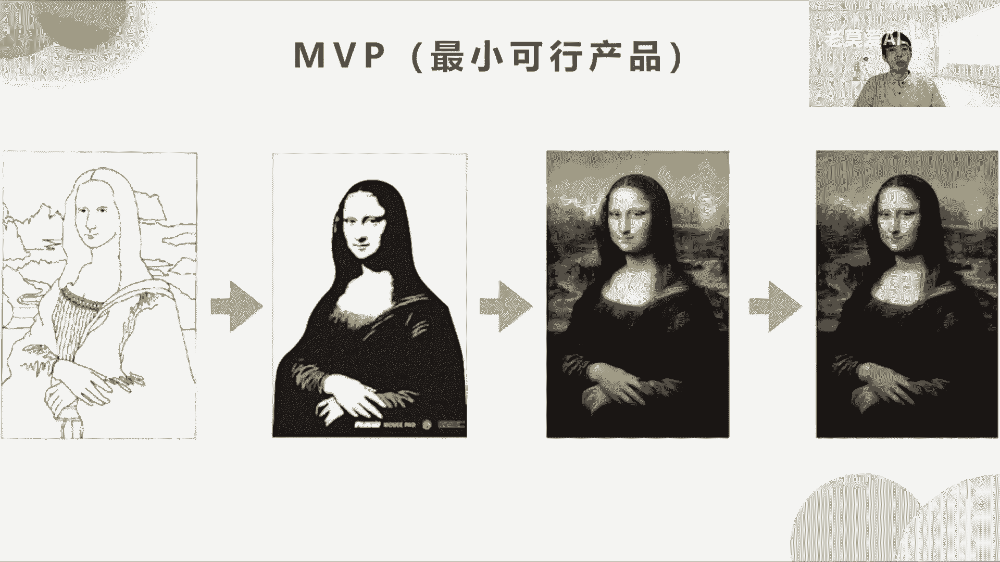

逐渐根据用户的反馈去做递增的，一个这样的过程，所以我们这个过程就叫MVP，不知道大家听明白没有，这样一个过程好，第五题说你的优先排序功能列表中，包括有十项产品功能，根据客户的要求。

你需要至少提供五个特点来推出产品，那么这些功能在称作什么东西，AB还是C还是D，OK正确答案是B，最小可行产品也叫最小可售，更能一个意思。

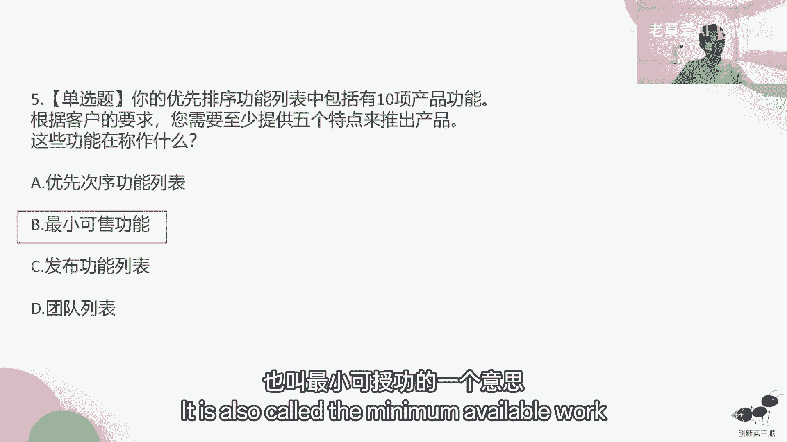

我们在这里就确定优先级，那么整个优先级的确定方法，这个东西讨论了好多次啊，第一个没有大家没有意义的，是高风险高价值的东西是首先处理，这个是大家的共识，第二个是什么。

高风险低价值的东西到底放到哪个地方去处理，高风险，但是低价值的东西不予处理，大家一定要记得，为什么我们打个比方，就像你在路边掉了一块钱，比如说你的袋子里面不小心掉了一块钱硬币。

那么这个硬币如果是滚到了马路上，你这个硬币到底捡不捡，如果这个硬币是滚到了马路上，其实车来车往的很危险是吧，那么我们可以这样记住，我们不去处理这个硬币，我就不减了，反正一块钱也不做大事，对不对。

没必要为了一块钱去冒这么大风险，如果是说第一风险高价值是什么，低风险高价值就是我的一块钱，它掉下去了，不是低风险，高价值其实是什么，低风险高的时候还不是一块钱，比如说你是100块钱。

那100块钱算是我们钱里面可能最高的，那你100块钱你掉到了路边，你捡不捡就掉到你身边，这个低风险高价值的东西，那我们肯定要去捡，这个就是歧视，处理高风险，为什么第一个要处理，因为高价值他高风险的东西。

你如果不去抓住，有可能就丧失这个机会了，我们说了，我们要高风险，就意味着高收益，所以这个是从首先去处理的，最后是低风险，低价值，它是最后处理，为什么你假如说你袋子掉了一块钱。

但是一块钱他没有滚到这个马路上，它滚到了马路边，就滚到你的脚下，你知道你捡不捡啊，你是确定旁边没有危险的时候，你会去捡，对不对，所以这个优先级是最后处理这个高风险低价值，算了就不予处理啊，是这个意思。

所以我们要分清楚确定优先级的这个标准。

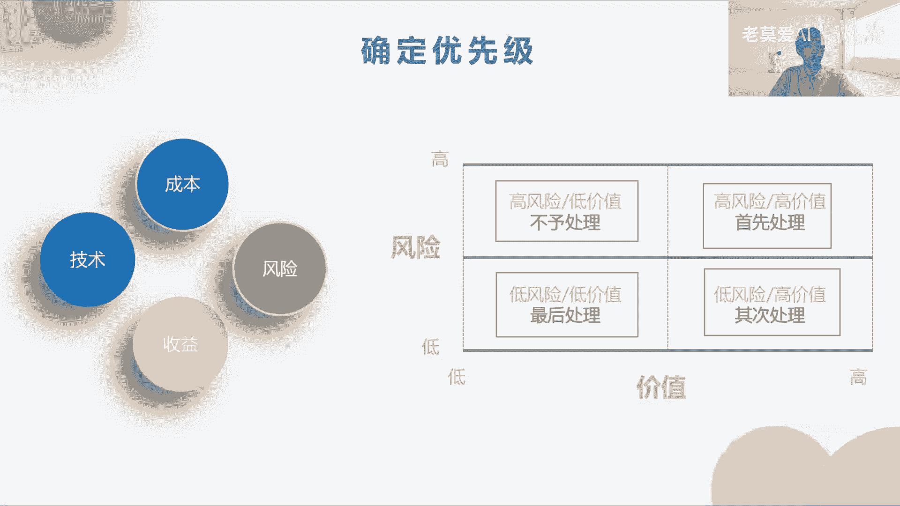

OK好在确定这个优先级排序的时候，还有一个方法叫做莫斯科法则，这个肯定会考莫斯科法则，就像我们平时说的比较多的就是P1P2，P3P4P二这些东西，它就是莫斯科法则，那莫斯法则科法则。

第一个P1就是软必须要做的东西，没有了，他们系统就不work了，就搞不了了，需求之后系统就无法工作了，所以这个东西我们就是P1优先级，P2优先级是什么，应该做的就没有，他们系统很难用。

P3可以做的就是附加值加分解，比如说一些用户体验，这些东西其实它是属于第三价值的，第四的would not就是不要做的，所以你这个东西它为什么会有这样一个排序，你要去排序，完了之后你要去砍功能。

比如说我这五个需求，这个迭代我们要做五个需求，但是突然一个用户提出了一个新的优先级，非常高的一个需求，比如说合规的需求，比如说政府部门要求做一个什么样的合规项目，要去检查我们的代码，但这个工作你不做了。

那么政府部门将强制要求关停关停你这家公司，那么你做不做，那么我们就要做，但做这个事情他是要花时间的，我们就会选，那在两周的时间内，这个需求要插过来，那些需求要又要去做，又要上线，那压力很大。

其实在敏捷里面怎么做，敏捷里面就会要求你去放弃其中某些功能，比如说五个功能我放弃一个功能，我做一个新加的功能之后，政府这个要求的功能之后，我只能放弃一个问，那放弃到底放弃哪一个功能，你先要去排序。

然后放弃的就是你这个排在最后的功能，那这个排序是由PO来决定，OK好这个就是莫斯科法则，那么这里面就会有莫斯科法则是哪一项的例子，那么我直接公布答案吧，莫斯科法则是一项基于价值的分析技能。

他是一个优先级排序，但是它是基于价值的优先级排序，这个大家要记清楚了啊，不是基于优先级的，OK好。

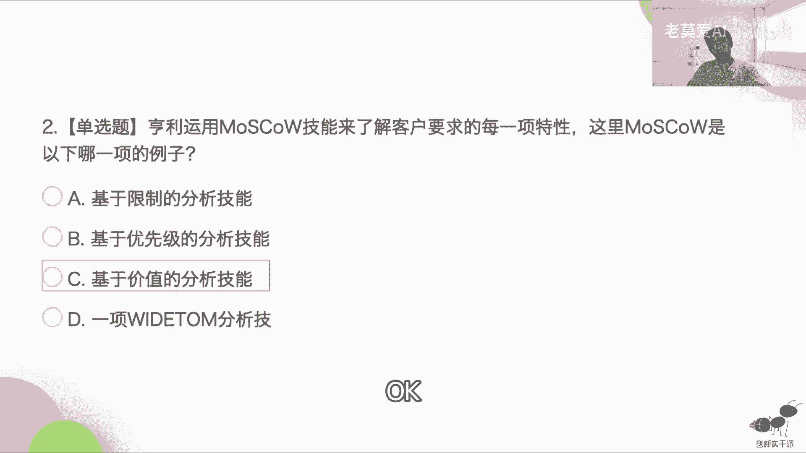

这个里面其实就是举例这个例子，其实我们不用看了，因为前面我已经说的够清楚了。

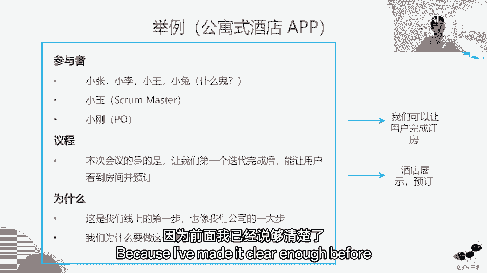

在迭代计划会议里面，其实我们要做两件事情，第一个就是怎么样去澄清，产品经理来解释一下每个故事，好比如说我们的这一个迭代目标，是这些123用户能看到房间提示，能定下房间联系我们退订。

这是一个旅游的一个场景对吧，我们要选出用户故事，这四三这三个在迭代计划会议，第一步我们就完成了这个事情就已经完了，那第二步的时候我们应该怎么做。

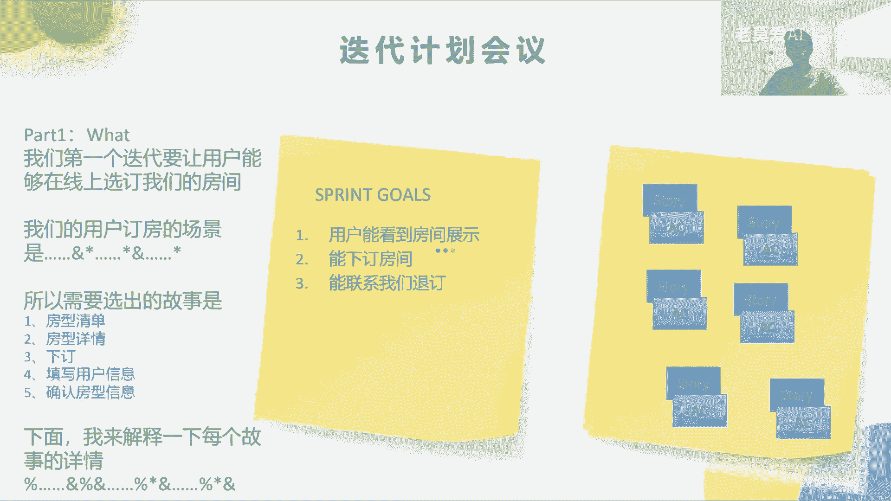

第二步的时候，我们在把怎么去实现用户故事我们讨论清楚，比如说进一步拆分这个用户故事，我们把它拆分成task，拆分成任务，那任务就是具体的，每一个开发人员去做哪些事情，比如说这样一个用户故事。

他可能需要两个开发人员一起做，在A做这个B做这个你也可以分给一个人去做，但是首先我们要把问题去把这个任务要分开，就这样的，所以这两步其实是必须要去经过的啊。

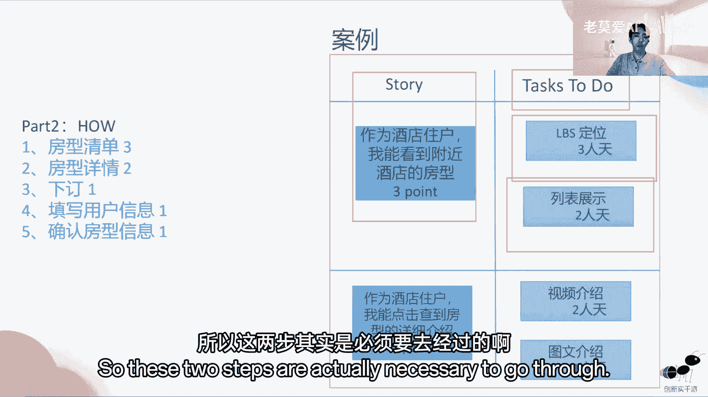

OK还有要去做一些估算用户故事，我们计划做完了之后，我们还需要去做估算这个东西多久完成，估算里面我们其实用的估算的方法叫做分分，拉契数列是什么，他就是第一个和第二个加起来等于第三个。

第四第二个和第三个加起来等于第四个，比如说0+1=1，1+1就等于二，1+2=3，2+3就等于五，2+3加五等于八，然后5+8=13，8+13=21，13+21=34，他为什么要是这样。

斐波拉契数列是因为越粗的东西，我们就越没有办法进行很好的估算，所以我们如果要估算的更准确，就请你把功能进一步的细化去分解，就像我们说我们要去估算，比如说日本的，上次我去了日本东京塔。

它的高度我们可以估算，东京塔的高度大概是有200多米，整个200多米，其实我们估算的是单位是什么，估算的单位其实是百米，对不对，我们不可能说200估估223米是吧，没有这么准确，对于这个东京塔来说。

如果是说我们没有看到数值的，大概抬起头看一下200多米吧，但是你说你要估计你们家的这个楼高，你会怎么去估计楼层高度啊，我们家楼层高度大概是你可以说2米八到3米，那么整个2米八到3米，他估算的是什么。

他其实估算的是分米，它是分米级别，它的估算的这个值就已经出来了，你估算那个东京塔这么高的东西的时候，他是一个很大的量级，那你估算的时候，你是用百米做单位，那么你自己的家里面的楼层高度的时候。

它其实是一个很小的单位，它已经分解成，比如说一栋楼，它分解成合一层，所以你分解完之后，其实你要估算的就更准确一些，它其实是以分米为单位，所以斐波拉契数列就是对于那些用户故事，他的这个故事点很大。

比如说朋友圈这个功能的时候，你是不需要去准确的估算它的，因为那个东西太费事了，而且你后面也会进一步把它细化，所以没必要估的那么精确。

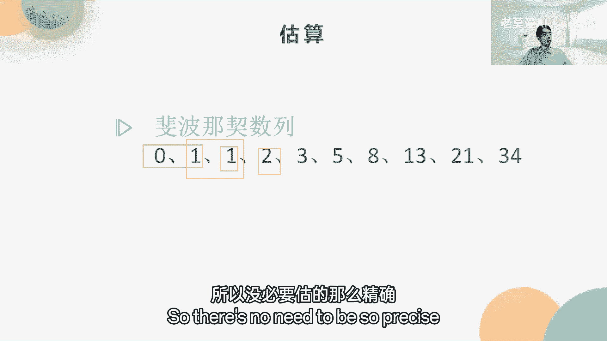

是这个意思好这里面估算人天有什么区别，我们就不说了，因为其实人天跟故事点来说，它是没有任何关系的，任天在敏捷里面它是对应着任务的量的，在敏捷里面，故事点才对应着这个故事的工作量啊。

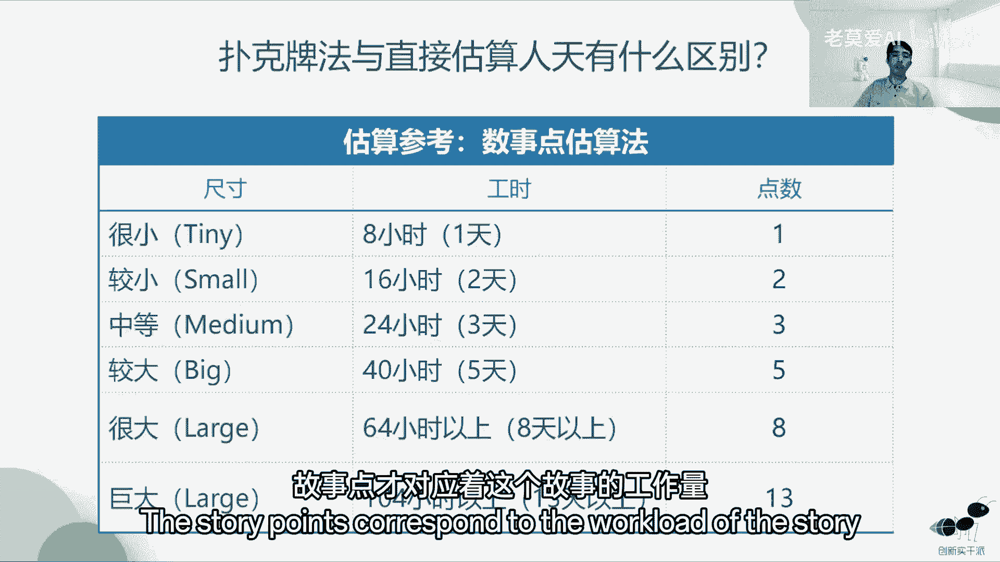

不一样的，那么我们怎么样去找到基准值，就前面说的白米和米，它都是对于不同的物体估算的基准值，但是我们怎么样找到我们自己的基准值，在开发过程当中，它有两点，第一个是页面数，比如说用户故事，我们做这个功能。

它会用到几个页面，比如说一个旅游的一个订房的页面，它是需要去四个订房的功能，需要四个页面，比如说点击订房，填写个人信息，然后审核信息，订房完成的信息，那这个是东西，我们就估算说每个页面它是一个基准。

所以这个订房需要四个页面，也就四个基准用户点数，用户的估值点数也就是四啊，是这样的，那么第二个我们可以用操作数据库的次数，或者操作接口的次数，比如说涉及到几次修改，数据库增删改查等等。

增加删除就每操作一次，他会算作一次调用，也就算作一次这个基准，第三个是完成操作的步骤啊，比如说我作为一个产品经理，我来估算的，我又不会写代码，我也不知道有几个页面是吧。

那我也不知道他对数据库有访问多少次，但是我知道退款它需要四个步骤，比如说用户提出申请，第二个提交资料，第三客户去审核第三个，第四个就完成退款，整个退款流程需要四步，我就认为一个业务流程它是一个基准。

所以四部他就是四个基准，所以这个退款功能呢，我认为是他的故事点数是四，是这个意思，那么不同的团队可以用自己团队定义的，不同的基准值，来去估算同一个页面的同一个功能。

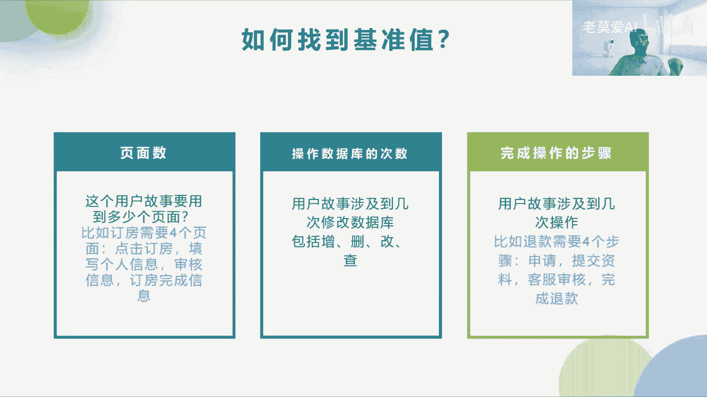

或者页面的大小和基准值，所以团队他共同综上所述都是团队共同估算，那么团队共共同估算的好处是什么，大家能够对这个东西达成一致，而且因为它叫用户故事，所以大家的视野是一样的。

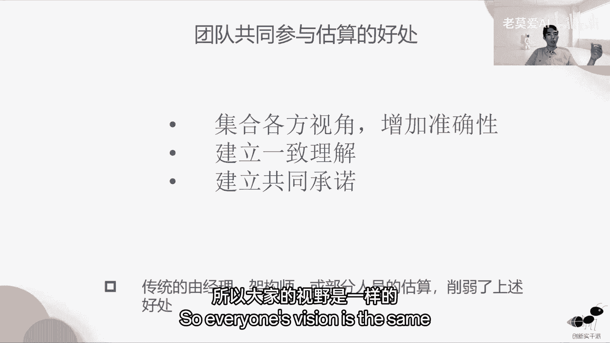

建立共同的一致的东西，好这个东西我们就不做了啊，迭代计划的讨论时间现在已经不考了。

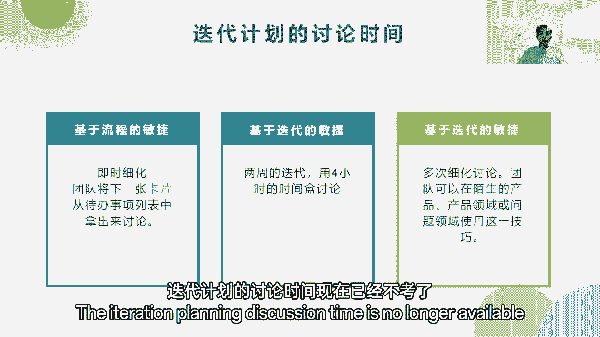

这个东西我们就已经可以不说了。

第一个就是同步进展，第二个是暴露问题，就这两个目的同步进展就是什么，通过我们能够知道每个人，通过这个每日账会，我们要很清楚的知道每一个人，他的工作内容是什么，那这样做的有什么好处。

我们每一个人其实都需要去双备份，也就是说两个人他要负责一个人，他至少要负责两个模块，你和他会有部分，比如说A他负责这个模块，B其实也知道这个模块，那这样A如果请假了，B能抵上。

所以A要很清楚B现在目前干了什么，B也要很清楚A干了什么，这个是整个团队的共同进展，不然突然哪一天A要请假，B也不知道他之前每天在干什么事情，他不知道怎么去接手怎么办。

这个同步进展对于大家来说都是一个好处啊，第二个就是问题，那暴露问题是在每天的过程当中随时暴露问题，随时去解决，这个也体现了敏捷的一些特质，暴露问题这个东西必考，你如果想团队及时的去发现团队的问题。

及时的去纠正，一定是放在晨会里边，这个东西是必考的，我再强调一下。

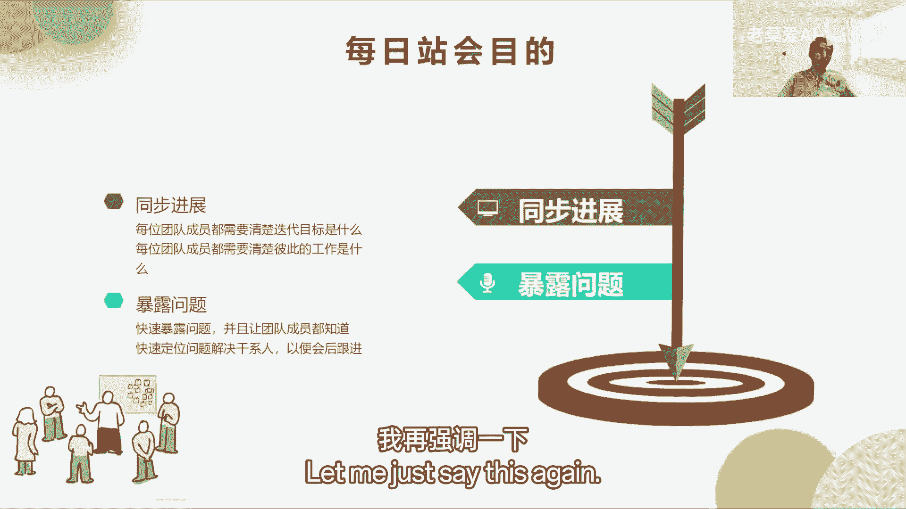

必考单会的三言一般不会考，但是这三言其实是里面其实已经说到了，第一个，第一言，上次战会我已经我我完成了什么，其实就是怎么样同步进展，第二个和第三个问题是说，从现在到下一次大会，我计划完成什么。

我的障碍是什么对吧，第一个和第二个其实都是同步进展，第三个是暴露问题，所以在整个账户的过程当中，我们是需要关注什么，第一个是彼此的承诺，第二个是团队的自组织，这个团队他不是没有一个领导。

他是跟大家共同的平等的去对话的，团队的自组织，所以在战会的过程当中，考的最多的是团队的自组织，比如说团队在战会当中，他突然遇到了一个技术问题，那这个时候他来去问敏捷教练，那么敏捷教练要不要。

敏捷教练以前也是技术出身，他要不要去解决这个问题，答案是不要，这个时候技术问题，团队要自组织，那如果是跟项目管理有关的问题，因为是属于这个项目经理或者敏捷教练的，专业性的问题，所以他这个时候他要站出来。

除此之外他不用上传，就这个意思，OK但张惠三言就是这样的。

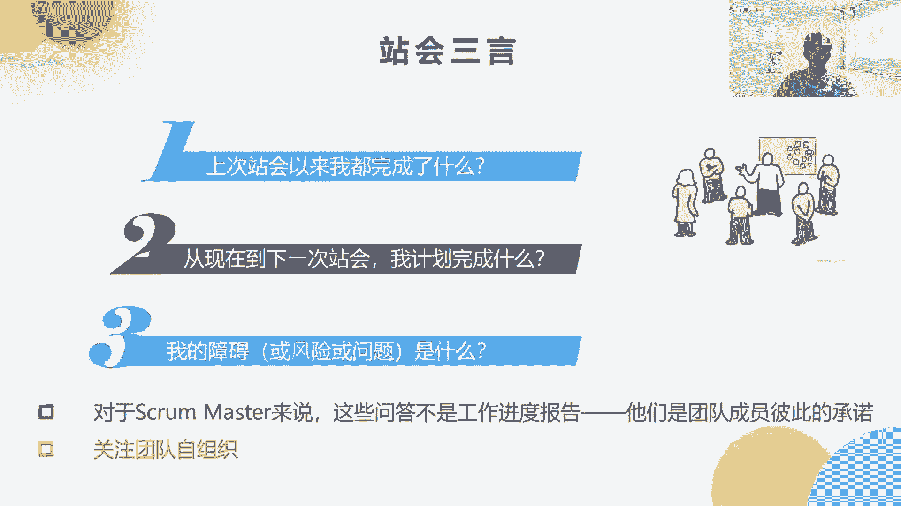

藏会的最佳实践，最佳实践，这个就可以不说，因为账会的最佳实践现在已经不考了，但是要提一下的是集合租的故事，第一个是集合租，也就是说，战会的最佳实践是不要团队的这样一个集，跟团队的关系不大的。

那些机器人去强行去打扰整个团队的进展，比如说一个领导过来问你最近的进展怎么样，那要不要在账会上再重复告诉领导，这个进展不需要，你只要在账会结束之后，由项目经理跟他去汇报进展就行了。

如果他想要知道的是结果，那么只要产品经理跟他去汇报就行了，他不要在上面去打扰团队，第二个是账会，它是要在发射源，它有一定的发射源，它一定是站在一个白板上，不管你是电子白板还是物理白板。

他一定要站在一个白板上的，怎么样去同步进展，然后第三个就是方法，方法有很多限制发言，比如说15分钟站会时间和是吧，到了15分钟强制结束，开会后会比如说有一些账，会上没有能解决的一些技术问题啊。

我们15分钟完了之后，我们叫上相关的技术人员再去开，会后会站会的问题，他要闭环，什么叫闭环上会发生的一些问题。

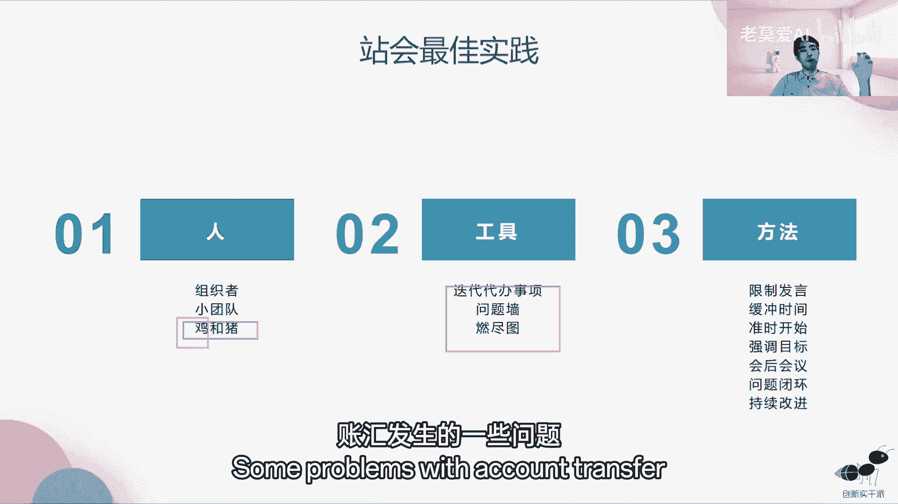