# 【最好的PMP课程】PMBOK7精华讲解3-1 - P1 - 老莫爱AI - BV1Qy411i7E9

听得到吗，能听清吗，能听清楚的同学打个一可以，ZYCOK好的，其他同学呢科科能听到吗，9763的用户手机尾号9763的能听到吗，好的好的，还有一个月要考试了，大家怎么样，有没有兴奋起来，对于我们考试。

大家还有什么想要那个的吗，他这个OK有没有兴奋起来，有没有摸出什么门道，考试的那些东西，我们在做题的时候，我们发现做错的还比较多，其实到最后下个星期我们做完了之后，我会跟大家去讲题，下周我们就讲题了。

下周讲题的时候，主要是通过我们怎么样去分析题目，就看题目，回过头把那本书当做一个查找的工具去看，不知道我上次推荐的那三个文文件，大家有没有看推荐的那三个文件，敏捷的里面的mp。

里面的不是还有一些学习资料包吗，学习资料包里面有三个冲考前冲刺文件，这个东西适应型的偏僻解题思路，预测型的40个套路，和那个重要考点图形化总结，这个东西不知道大家有没有去做，就这些文件大家要看到。

先把这个文件好像发不出来，我把它发到我们的链接发过来吧，书卷电子教材，看书考卷中知材料，这几个我们一定要看的，花的时间不多，但是它对提分有很多好处，OK如果你有很多模糊的感觉，不确定的这些东西。

你可以发群里面大家讨论一下，对你可以发群里面，因为我在群里面，你不建议大家单个来问我，因为你单个来问我，我是跟你一个人去回答，那么其他同学看不到，我建议的是大家一起来问我，因为这样就是发到群里面。

这样我每一次我答题，我会教大家说，为什么我们要这样去思考，那么我所答的问题，其他同学都能看到，其实对大家也是一种促进，不然单个说其实效率很低，对好那我们今天晚上就开始哈。

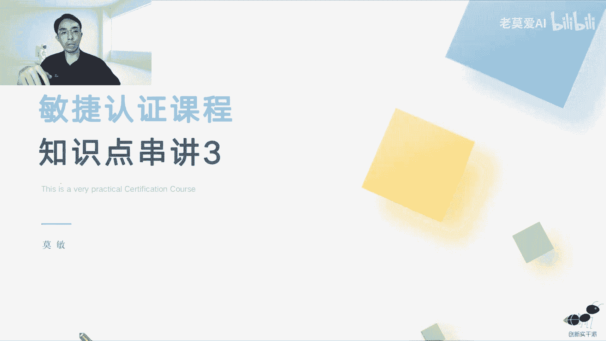

那我们先从问题实战当中来，那么问题实战它本身它是什么，就是基于我们的整个考试的场景才能念出来，因为我们的考考试，PMP的考试现在全是场景题，那么敏捷的这些场景它我们要去怎么样去思考，去怎么样去解。

因为敏捷它不像那个PMP的传统项目管理，就是第六版一样，他因为现在考的是第六版和敏捷敏捷，他解题的方式跟第六版不太一样，第六版你只要看到他所出的问题，你一定要看它放在第几章。

它每个单元就是每个题目他只考那一章的内容，但是敏捷的不太一样，它会稍微比较灵活一点，但是他也就灵活在三个角色和五个会议里面，都可以通过三个角色和五个会议的方式去化解，它整体的解决思路其实是这样的好。

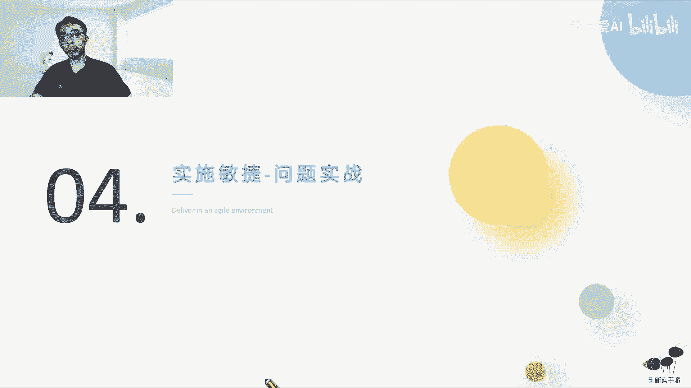

那谈敏捷常见问题20招，这个是根据敏捷实践指南里面的。

这个问题的解法，我们来去解的，Ok，第一个想要说的是，在考试里面经常会考到的DOD与DOR，那DOOR其实考的少，DOD会考的比较多一些，我们先来说DORDOR是准入，准入准入就是就绪。

那么什么叫做准入，就是需求，比如说需求已经ready，可以流入到研发的任务队列当中，是需求准入的标准，这个已经很清楚了啊，那么准准入它怎么样准入呢，它有几个标准啊，第一个这个不用记。

但是基本上我们是有这些标准的，叫准入，比如说你用户故事，业务逻辑验收标准，是不是这些东西都清晰了，就像我们上次念的那王者荣耀的白龙吟是吧，就王龙王者荣耀的那个皮肤，他这个用户故事是不是按照这个标准去写。

完整了对吧，优先级是不是定好了第三方的依赖，如果有第三方的依赖时间，第三方的依赖时间，比如说供应商这个依赖时间，是不是已经确认好了，业务期望的上线时间是不是已经定好了是吧。

那么这些干系人是不是都已经OK了，交互视觉这些东西是不是都已经给了，比如说我们可能做互联网的，会有很多这种交互视觉的贴图是吧，这些东西是不是已经ready了，就这些东西我们是需要去看清楚的。

这个是一个这个叫DOR，没有达到准入标准的东西，我是不允许流到研发那边去的，这样保证了什么，保证了需求的正确性，需求只要这一端保证好之后，那留到后面的东西，那就是研发来保证。

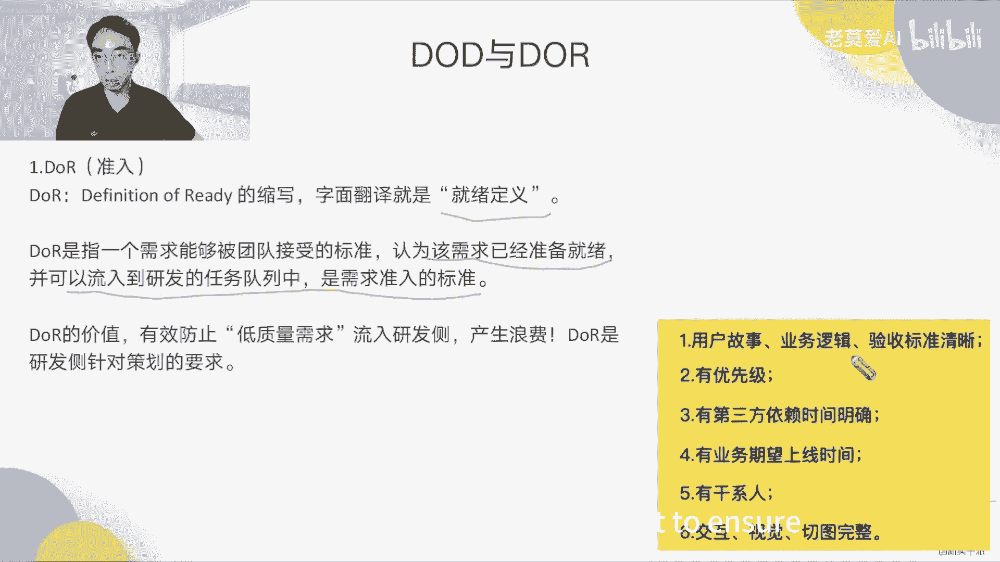

对不对，所以在这边准录，我们一定要做好，这是第一个，第二个就是准出这个标准，大家都完成了，那完成之后什么叫完成，我们要定义完成，比如说代码什么叫完成，你写了一行代码就叫完成了，其实不是。

比如说我们要看这个代码是不是已经加注释了，每一行代码或者每一个关键的阶段的，这个代码是不是已经加上注释了，这个东西就很重要，第二个就是代码提交，有没有提交到我们的公共区，如果你是做开发。

你知道代码提交不是在你的本地提交，而是提交到一个，因为你是为公司做软件是吧，时不时提供提交到公司的一个软件仓库里面，是不是第三个是代码，是不是已经已经检查，提交完之后有没有跑静态代码检查。

有没有检查完你的代码是不是合格，符合这个标准，这个是代码完成的标准，那么除此之外，你的工作完成并不是代码完成了，而你的工作向研发的工作完全ready的，这属于代码完成之后，我们测试是不是完成了啊。

比如说测试是不是集成测试了，集成测试，你的功能跟其他人的功能，是不是放到一起都测过了对吧，那有没有完成回归测试，回归测试是什么，就是测试测试测出你的那个代码有问题，那你有没有改这个bug。

比如说测试他测出三个严重bug，那么这三个严重bug你是不是都改完了，完成平台的测试，有没有平台的测试，我们全部集成之后，我们放到平台上一起去测，有没有完成零，已知缺陷，一级二级的bug数量是不是为零。

是不是这些bug都已经消灭了，这些东西才完完整整，完完整整组成了一个考试的时候，我们考考的很多的是我们发现质量有问题，那么我们反过头来说，为什么这个质量有问题，他之前有没有走DOD。

不把你的质量问题留给客户，也不是对。

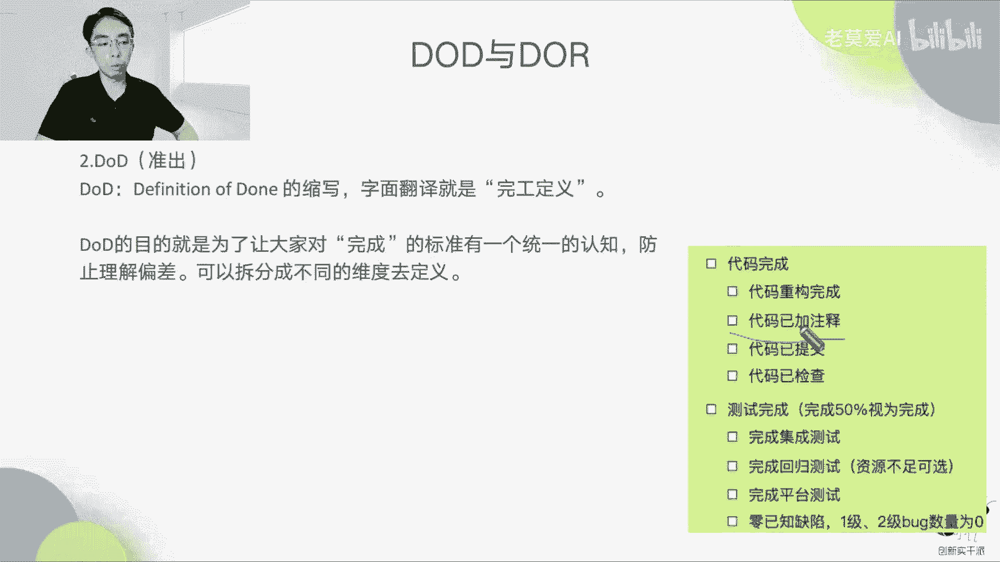

不会最后放到客户那边，客户才发现这个东西的问题，OK好，那这边有一个场景问题，就是团队目标或者任务不明确，通常他的表现是什么啊，那么就是说团队他在题目里的表现，可能是我们团队每天都很忙啊。

但是忙来忙去又慢不忙不出成绩啊。

老板又不肯加薪，那最终的原因是什么，归咎为任务不明确啊，我们没有一个清晰的目标，那清晰的目标在哪里，在敏捷的项目章程里面，大家不要觉得只有传统项目有项目，专程敏捷，也有项目赞成。

那么敏捷项目章程我们如果要记，我们可以想象敏捷项目章程有个这个东西，我一个模板我都给大家列出来了，他有一些部分，比如说项目基本情况，项目目的项目目标，项目范围是吧，项目利益相关者的角色与职责有关。

项目的缺权限，最后是管理检查点，这些东西都有，这个就叫做敏捷项目章程，所以用这个东西来明确我们的目标是不是好。

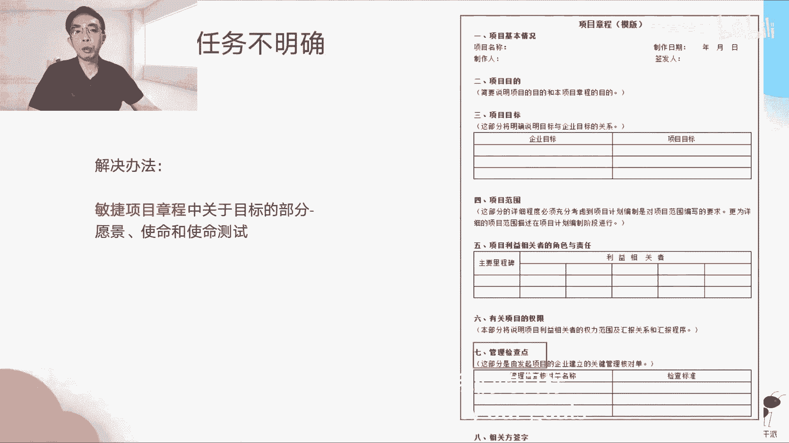

第二个是团队工作协议不明确，是敏捷开发原则，知其然不知其所以然，这个是我反复跟大家去讲过的，我们需要去知其然，并且知其所以然，那么我们的敏捷原则，比如说我们说持续的交付有价值的软件，以满足客户需求。

那有些团队我以前经历过啊，就这个团队他完成一个需求，马上就发布了，他们觉得这样很快，你们觉得这样做O不OK对于这种互联网团队，很多人说我已经够敏捷了，怎莫老师，你不要去指导我们了，我一看就觉得好笑。

为什么呢，因为其实你的这种快不是真正的快，因为你快在哪里啊，你快在我们没有做很好的测试环节，你觉得我们开发完了就丢出去了，出现问题再改，不是互联网吗，打补丁吗，对不对，但是补丁不是这样打的。

补丁不是修复质量，不是说质量问题，我先忽视，拉到外面去，我们不断的去再改，那么你就会久而久之，你就会变成救火部队，就天天在救火，因为是外面的东西都是一团质量，问质量没办法达标，所以敏捷它其实是一个平衡。

不能一味的求快，他是在快的过程当中，他要保证它的质量，质量做的又高又能快，就不会出现这种各种救火的情况，OK好。

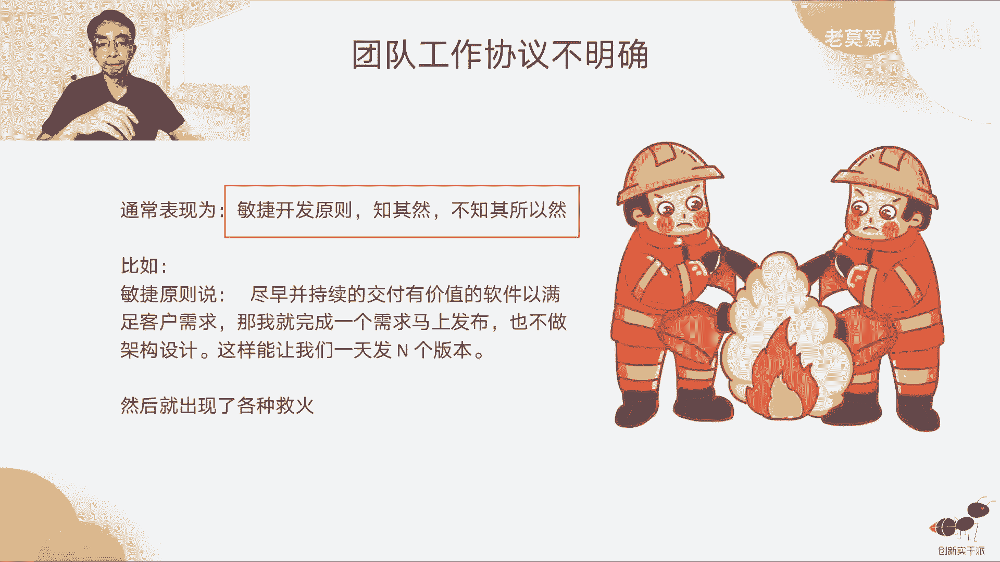

那么我们就必须要强调敏捷的原则和实践，就像我现在跟你说，敏捷不能傻快一样，对不对，所以说我们可工作的软件，是这个进度的首要标准，就是告诉大家我们这些实践的目的，可工作的软件是进度的首要标准，不是让你快。

而是要满足在快的同时要满足DOD，我们前面说的完成了定义，软件需要经过一系列的验证测试验收，他才能够满足它的发布条件，而不仅仅是开发完毕这个东西大家需要去记住，敏捷不是一味的快。

这个是很多时候会被带进坑里面的问题，好团队环境不明确，团队环境不明确的时候，是职责表现为职责分不清楚，比如说测试的case，Show case，谁来发起测试的bug，谁来跟进这些问题。

所以在这些问题当中，我们需要怎么样，我们需要明确团队SMPO的职责边界敏捷，他没有一个责任举证啊，不像那个传统的这个项目管理，他有责任举证是吧，谁谁谁做什么东西，我CAIZAI这些东西对吧。

那它是没有的，那他是没有的，那么怎么办，就是团队SM和PO的边界要列清楚，那么团队和团队之间的边界可以没有那么清楚，但是SM必须要做什么事情，PO要做什么事情。

比如说自主咨询团队PO那个SM要不要去参与，这个是老生常谈的问题了，那答案其实是SM在适合的时候参与，什么时候适合，就是团队当团队要解决这个问题，它属于项目管理的问题的时候，那么SM要参与。

第二点是当团队讨论的问题，影响了三大基准的时候，比如说影响了进度，他讨论的问题已经开始出现，影响了整体的项目的进度了，已经开始延期了，或者影响了项目的成本了，成本超支了，或者是影响了项目的范围了。

比如说这个讨论完了之后，我们增加了一个新的需求对吧，但是那个需求他是要放到这个迭代里面去做的，那么这种情况一定需要SM介入的，不仅仅是团队去讨论的，那么团队什么时候SM不需要介入。

就是你讨论的东西无伤大雅，他不是能够影响这三大基准的问题，然后他可能是一个技术问题，他跟项目管理的领域不没有没有关系，那么这个时候SM是不需要出手的。

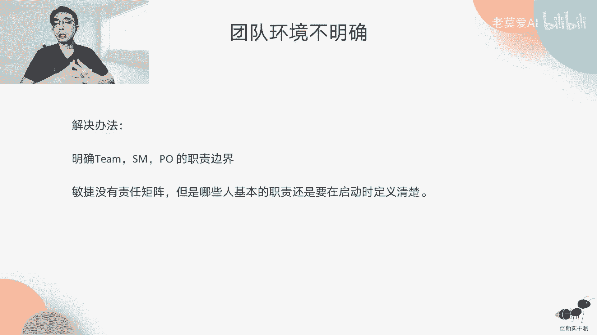

所以这个职责边界一定要列清楚，OK需求不明确，其实我们已经放过这张图了啊，但是特朗普最近好像又要上台了啊，我们就最近又把这个图又又重新拿出来了，所以需求不明确，表现为需求朝令夕改。

其实特朗普这个人就是很反复的很反复，他很会作秀，那么你如果有这样的老板，你会非常的痛苦，就今天说这个，明天说那个两天一个主意对吧，就这种老板是非常难伺候的，第二个是只见树木不见森林，只见树木不见森林。

那只见树木不见森林，其实好解决啊，就是我们只要看到这句话，我们就想用户故事地图，我们要把需求一定要列明确了。

对不对，所以我们需要在项目过程当中，由团队帮助发起人和相关方制定产品愿景，制定产品人品，当然这个厂团队这个团队是泛指的团队，也包括POK，所以我们在这个环节，我们需要一起来构建什么叫做产品路线图。

有了产品路线图，我们就有了产品的顶层的设计，所以我们在一起去明确期望和价值，在逐步分解才能实现，我们能够知道我们每一次做的事情，跟整个产品它创造价值有什么样的关系，这个要挂钩起来啊。

那么在这个上面一般是要通过什么会议去做，这个事情，一般是代办事项梳理会，去梳理这个需求不明确的会议，所以如果出现需求不明确，这个事情，我们可以考虑到ABCD几种选项里面，我们就可以选代办事项梳理的办法。

然后这个会议把需求做明确了。

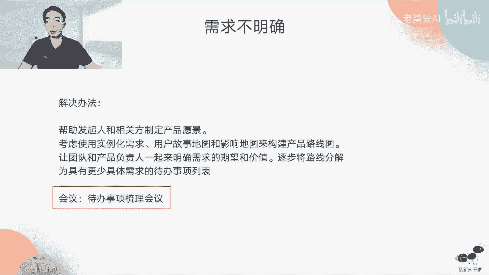

就是这样的好，用户体验不佳，用户体验不佳，就是用户看到这个产品的时候，觉得这个产品很差，像一坨屎一样对吧，那么怎么办，其实很简单。

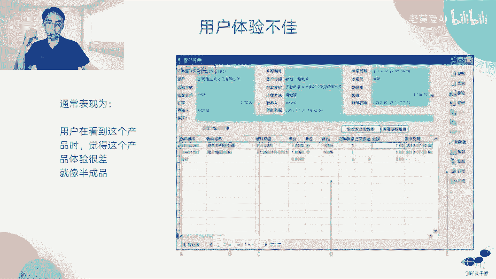

就是把用户参与，把用户拉进来，让用户早期就参与，不要在最后他看到这个是一坨屎，就是刚开始他觉得是一坨屎的时候对吧，那其实还好解决，因为刚开始的时候，大家其实对这个东西期望都不高。

因为他也知道你团队是刚开始去做的对吧，这个零点几版本做成这样是应该的，但是你如果做做得很久，然后再把这个结果素材，他会觉得这个东西很死，对不对，所以就是这个问题，用户体验不佳，就应该是这样去解决。

那么用户体验不佳的会议一般是什么，迭代评审会，迭代评审会在迭代评审会上，因为迭代评审会议他是怎么对外的，会议是邀请用户的会议，所以我们是需要在这个会议上把会用户拉进来，那么估算不准确，估算不准确。

这个就是涉及到说估算怎么变得准确，第一个是估算本来就不准确，就没有哪个人估算是一定很准的，比如说你说哎呀，我今天下班，我想去吃个火锅对吧，那有可能排队吃火锅的人太多了，你就放弃了这个选择对吧。

就像我们上次去去那个蛇口去吃那个鸡煲，然后去那边排队，我们当时7。7。20的时候排了一个号，然后我们说大概什么时候可以吃，他说半个小时之后，然后半个小时之后我看7。50了，还好像还没什么动静。

我们就走了，去另外一个地方吃饭，等吃完饭了以后，那个鸡包才通知我们说可以吃了，那个时候已经是九点钟了，就是排了一个半小时，所以就是计划赶不上变化，所以很多时候你的估算不不是准确的，像开发同学。

他很多时候估算的时候，他会估算的比较乐观，他承诺的说两周一个迭代，做到第三周他还没做完，这个其实很多时候我们身边的项目，经常会发生这个事情对吧，那怎么办，第一个事情是拆分。

就是不要去让他去估太多的工作量，太大的需求，你应该把它再进一步细分细分，细分细分成N个级别以后。

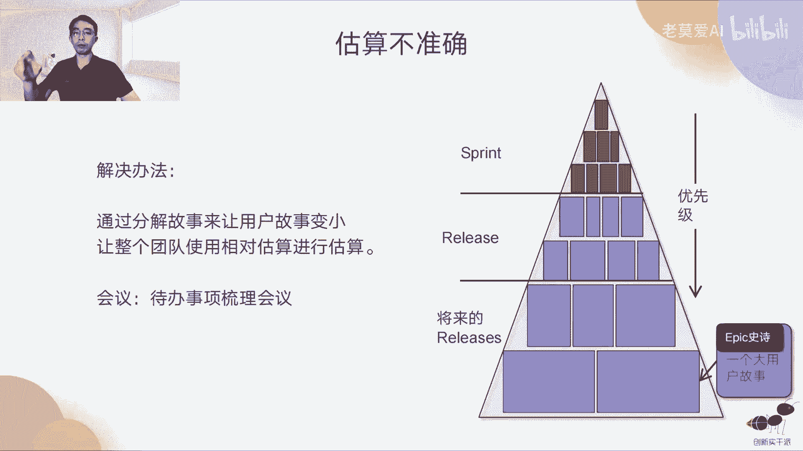

让这个团队使用相对估算团队，SMPO的职责边界，不像那个什么CAI团队，SM和PO的边界要列清楚，那么团队和团队之间的边界可以没有那么清楚，但是SM必须要做什么事情，PO要做什么事情。

比如说自主咨询团队，那答案其实是SM在适合的时候参与，什么时候适合，就是团队当团队要解决这个问题，它属于项目管理的问题的时候，那么SM要参与，第二点是当团队讨论的问题，影响了三大基准的时候。

比如说影响了进度，比如说放到这个迭代里面去做的，不仅仅是团队去讨论的，那么团队什么时候SM不需要介入，就是你讨论的东西无伤大雅，能够影响这三大基准的问题，然后他可能是一个技术问题。

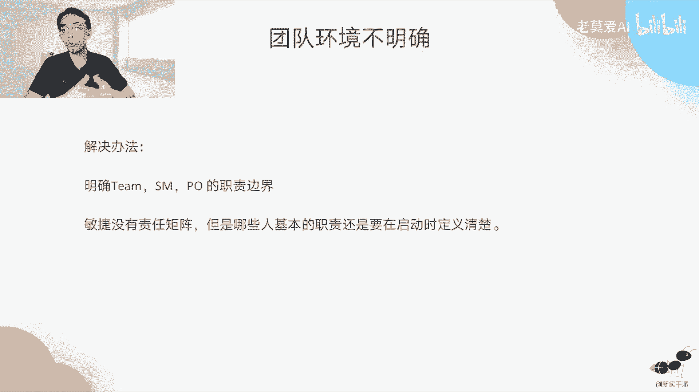

没有没有关系，那么这个时候SM是不需要出手的，其实我们已经放过这张图了啊，我们就最近又把这个图又又重新拿出来了，很仿佛他很会作秀，你如果有这样的老板，就今天说这个，明天说那个第二个是只见树木不见森林。

就是我们只要看到这句话。

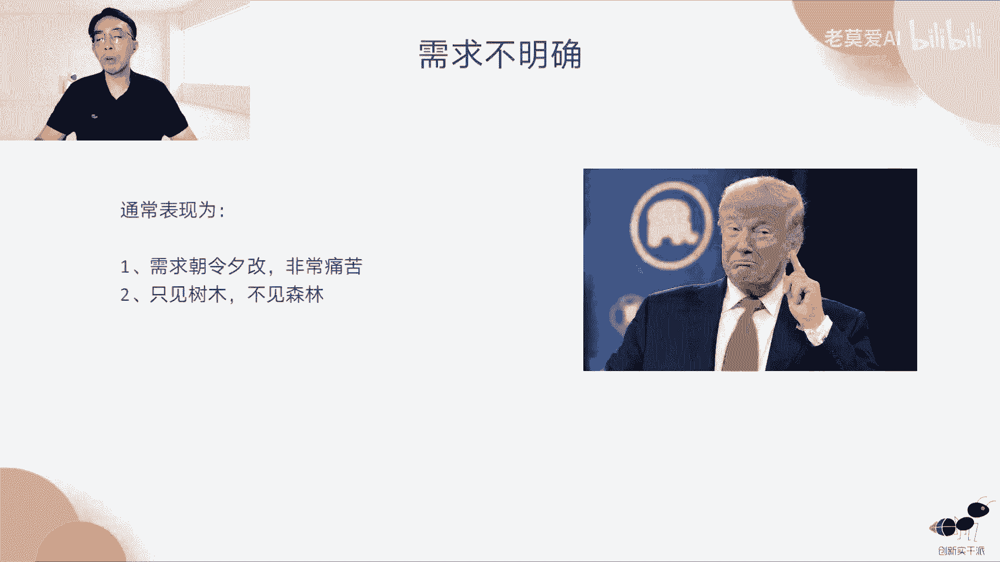

我们就想用户故事地图愿景，OK所以我们在这个环节，我们需要一起来构建什么叫做产品路线图，所以我们再一起去明确期望和价值，再逐步分解才能实现，我们能够知道我们每一次做的事情。

跟整个产品它创造价值有什么样的关系，那么在这个上面，一般是要通过什么会议去做这个事情，一般是代办事项输入理会，所以如果出现需求不明确，这个事情，我们可以考虑到ABCD几种选项里面。

我们就可以选代办事项梳理的办法就是这样的。

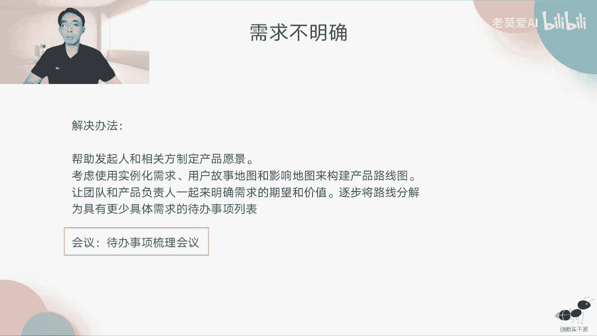

像一坨屎一样对吧，那么怎么办，让用户早期就参与，不要在最后他看到这个是一坨屎，因为他也知道你团队是刚开始去做的对吧，这个零点几版本做成这样是应该的，但是你如果做做得很久，然后再把这个结果素材。

他会觉得这个东西很死，对不对，所以用户体验不佳就应该是这样去解决，迭代评审会在迭代评审会上，因为迭代评审会议他是怎么对外的会议，那么估算不准确，估算不准确，这个就是涉及到说估算怎么变得准确。

第一个是估算本来就不准确，就没有哪个人估算是一定很准的啊，我今天下班，就像我们上次去去那个蛇口去吃那个鸡煲，7。20的时候排了一个号，就是排了一个半小时，就是计划赶不上变化。

所以很多时候你的估算不不是准确的。

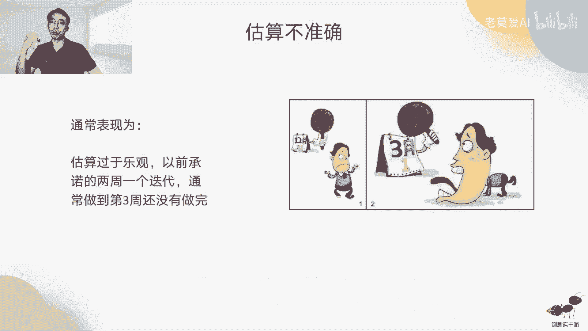

他承诺的算多的，工作量太大的需求，你应该把它再进一步细分，细分细分这个团队使用相对估算好，那估算不准确，它一般是开什么，会在这个地方我们去做估算，可以做初始的估算，还有一个估算可以在哪里做。

在那个时候是细化的估算，那个时候是估算不是估算用户故事，是估算任务，就是这个任务A同学，你花几天时间做完，所以就用户故事下面插几个。

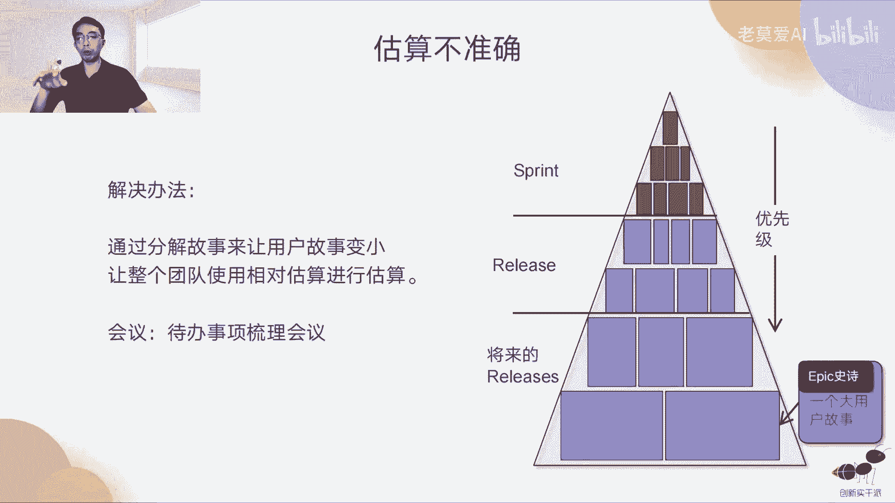

就是再拆分成具体的任务，项目经理，他会变成一个整个项目的这个沟通结构，它会变成一个新型结构，什么叫新型结构，新型结构就是五角星的星，他会向四周去，所以所以项目经理他就很就像以前。

其实我刚做项目经理的时候，我什么东西都背在身上，我其实那个时候很有成就感，为什么，因为我觉得我掌握了所有的信息，就大家所有的事情都向我汇报，所以我觉得这个东西很爽，但是慢慢的你带团队带多了之后。

你带超过30人的团队，你会觉得这个事情变得太累了，为什么，因为所有的人指向你汇报，如果一旦你处理不及时，你是变成整个数据通路的瓶颈，如果你请假了，这个团队就抓瞎了，所以你就请不了假。

就把你困在那个团队当中，所以后面才发现，原来敏捷项目管理是这么好的一个东西，以前其实我们都没有用敏捷项目管理，以前我们做项目的时候，我50%的工作都花在做计划和重，定计划当中。

我能够把那个计划做的非常的漂亮啊，但后面发现其实敏捷来了之后做这个东西，我觉得后面有点颠覆我的思想，我就觉得这个东西，好像之前做的东西都没什么卵用，除了让我自己在管理上能够做得很细，很漂亮之外。

好像对于团队来说又敏捷。

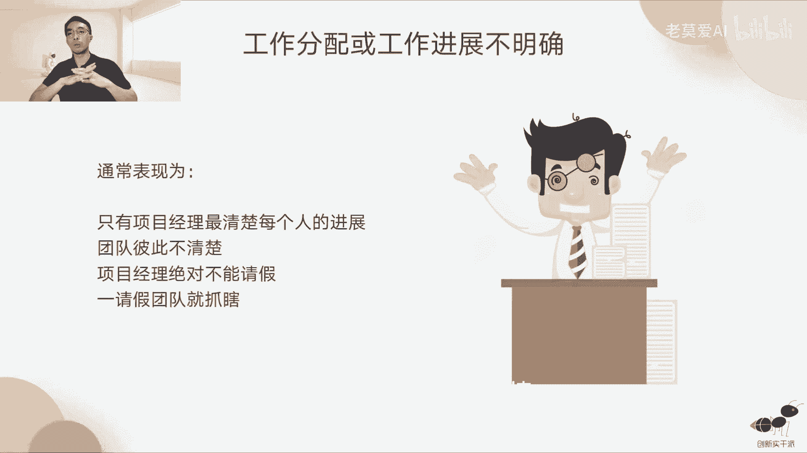

好像还还可以，所以解决的方法是团队自组织，把你的权利去分散到整个团队当中，用看板面，很可以用看板去查看这个工作进度是吧，是这样一个情况，所以这几个事情大家要去深究一下。

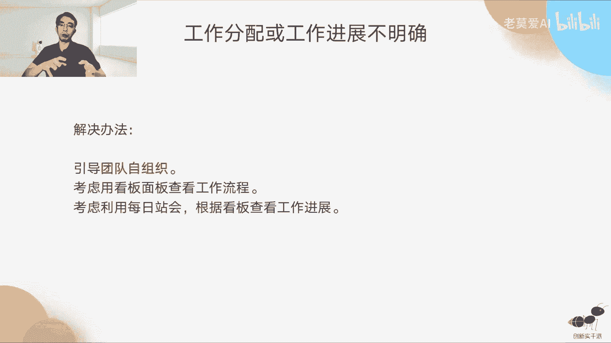

因为这个地方考试会考好谈团队面临的障碍，有些团队是团队知道有问题，但是不知道解决方法是什么，或者是团队知道解决方法。

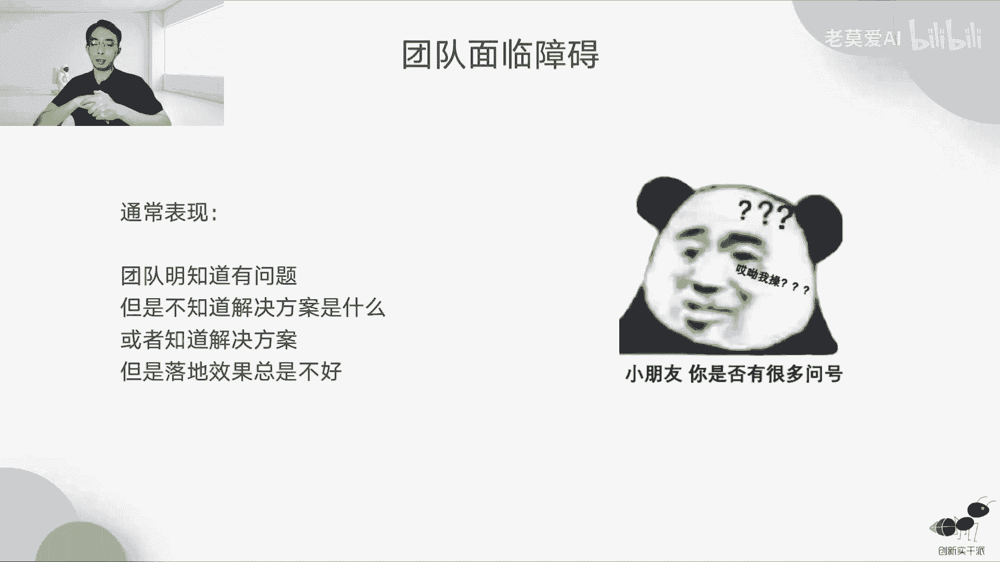

但是落地总是落不好，那这个时候怎么办，还是落到你发现没有，只要去做敏捷的题目，一旦涉及到团队，我们首先要想到的就是团队自主制，就是先让团队自己去搞，让子弹飞一会儿，团队如果搞不定，再请求SM帮助。

如果团队不知道他们有哪些，解决障碍的可选方法呢，也需要考虑向SM去求助，那么SM在这个时候，如果说也没有办法去消除障碍的话，团队就要向上汇报，所以向上汇报是下下签，我们在所有的选项里面都没有找到合适的。

能解决这个问题的办法的时候，那这个时候只能向上回报，所以这个答案不要轻易去选，很多时候不要第一个选择就是选择，看到这个问题，我们就想三杀回报，向上汇报，大家一定要避免去犯经验主义的错误，做这个偏僻的题。

什么叫经验主义的错误，我就是这样做的呀，我看我们公司就这样照的做的呀，我看我们公司的项目经理都是这样做的呀，这个就是错的，这个叫经验主义，所以我PMP他教你的并不是一套，你在工作当中用的方法。

大家记住了啊，PMP教的方法一定是一个理想主义的方法，理想跟实际它是有差距的，理想是什么，假设人人都是很好的开发，人人都是很好的测试，人人都是很好的产品经理，那么项目经理遇到这个问题怎么办。

他是有个这样的前提的，但是其实我们都知道，现实当中人和人之间都有差距的，有各种各样的人，我们要应付各种各样的人，不可能我们完全按照PMP的这种方式去走，它是提供了一种乌托邦式的解决方法。

就像你说解决马克思主义是吧，你想多了，放回来去看我们真正的政治政治，我们要去执政的时候，我们会发现，这个事情。

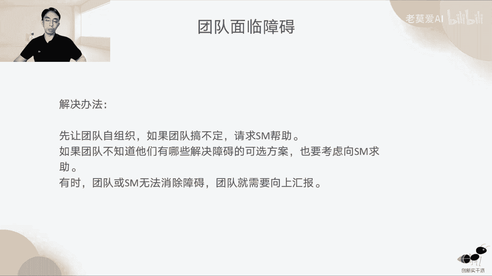

这个就是解决问题的方法，还有那个产品代办事项不够完善，导致工作延误，那这个时候是怎么办，比如说用户故事是吧，写的不够好，需求很难正确进行下去，毕竟比较需求很难理解，那这个时候。

其实产品经理把需求其实澄清了之后，开发人员老是回来问，动不动就过过来问产品经理，产品经理也觉得烦，我这个需求我都澄清了，你就好好去做，好好开发你的代码就好了，老是在这里问三问四，不耽误时间吗。

我不要写下一个需求文档了。

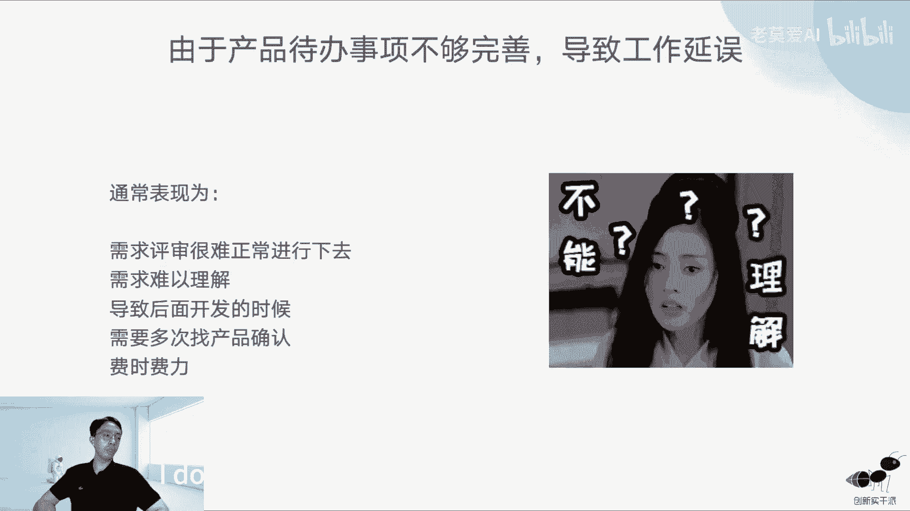

对不对，那产品其实也觉得这个东西很烦，那这个事情怎么去做，就我们不做这个反反复复的事情，我们把这个RODOR做好，就准备就绪的定义，准备好，在需求上面写的没有破绽，让开发人员觉得这个东西就是很OK的。

能够继续往下去开发的，每个人应承了之后就往下去走就好了，就大家形成这个约定就好了。

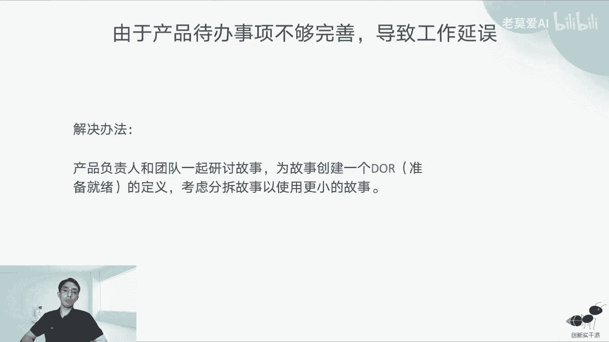

好缺陷，其实是我们的大部分人会犯的一个重大问题啊，项目常常延期，产品质量太差，开发一周很正常，很多很多时候都是两周迭代开发一周，开发说我开发完了，提花扔给测试，测试一测主干流程都跑不通。

直接又打回去说唉这个质量太差了，我们测不下去了，搞不定，那开发说那不可能啊，我这一周我都已经开发完了，你第二周是你的事情啊，你现在又搞给我，我我这个东西帮我做事吗，所以这个事情就会变成一个。

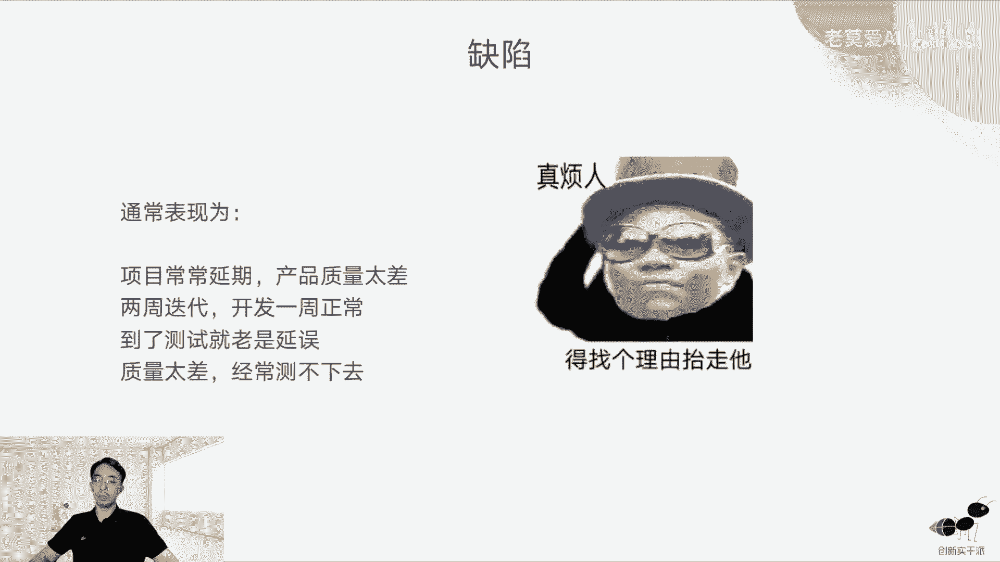

耽误项目管理进度的一个大问题，这个问题怎么解决，其实还是要怎么样去从源头上去解决，这个集体负责制，就是这个项目的质量问题，是大家一起负责的开发，你在写代码的时候，你需要怎么样去测试。

必要的时候我们要去做测试，驱动方法就是开发你要先写测试用例，每一次跑过的写过的代码，你都要用你的自己的测试用例去跑一遍，跑过了之后单元测试跑过了再去集成，再去做自动化测试，你这些东西都做完了。

叫做我DOD全部做完了。

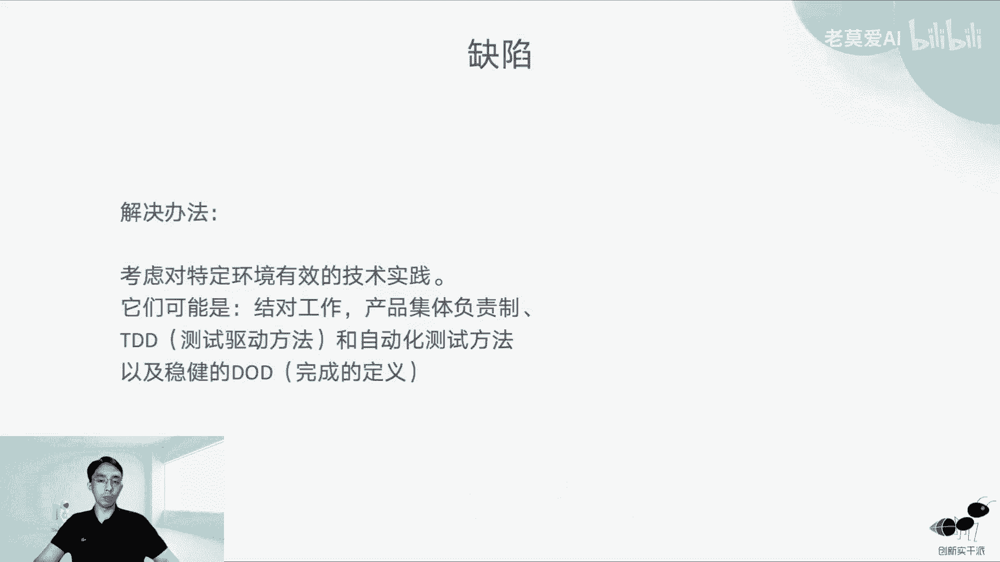

你才能够转给我测试这边。