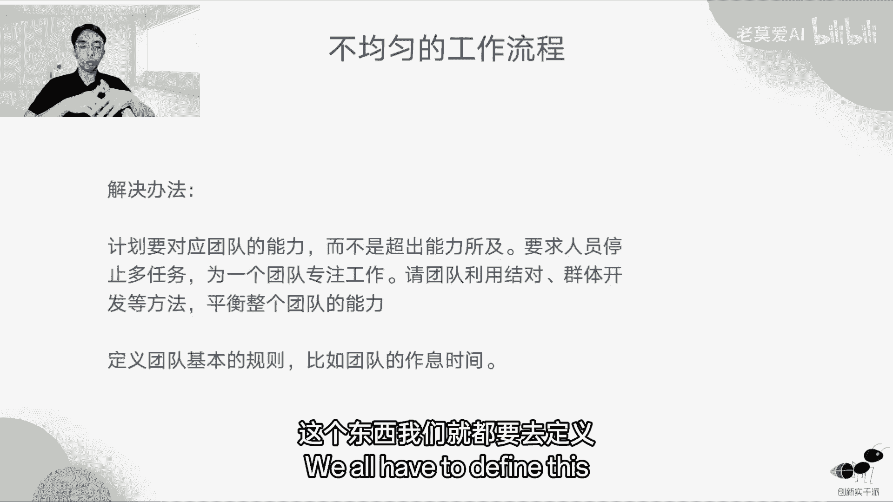
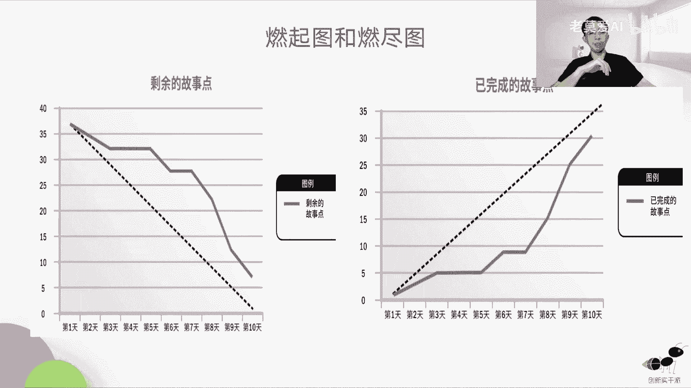
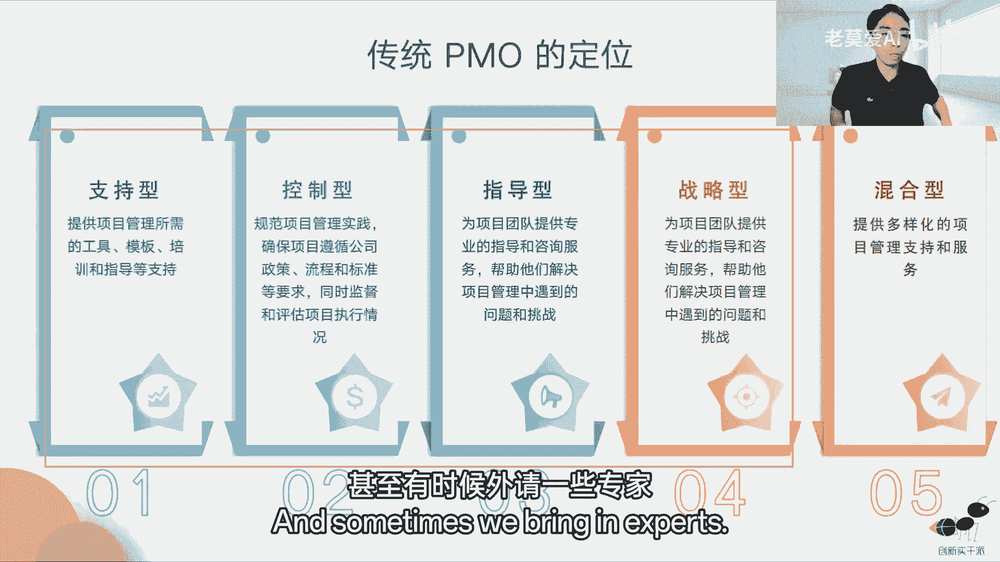

# 【最好的PMP课程】PMBOK7精华讲解3-2 - P1 - 老莫爱AI - BV1jr421K7PE

这样做好，那还有一个就是测试，在转测试的时候发现这个代码较差。

但是开发就说我是按照需求完成的，又把锅又甩到需求那边怎么办，这个又会回到源头DOD就是需求那边，他需要把它的质量搞好，比如说这个需求文档的质量，他要说他的需求文档质量是没有问题的。

他要确定他的duo d，另外就是最终的发布标准，我们要定一下，不能够说这个事情最后放出去了，这个代码质量还这么差，那你放到用户那边影响就大得多了。

对不对，好基数债务，那基数债务通常表现为什么，比如说技术这一块，我们以前在做章的时候，电商项目的时候，我们就发现其实不断的去扔需求过来，导致技术他没有时间去做一些技术上重构，导致技术越来越差了。

大家都不愿意发布了，因为一发布就是很大问题，每一次运维同学都在抱怨，我都不敢给你发布，一发布网站就崩，那其实就是技术太拖后腿了，那技术拖后腿怎么办，还是之前的坑。

我们要去慢慢又去补怎么办，同构了，每一次我们迭代的时候，我们都要放一些同构的工作量放进去，大概是10%，工作量要放进去再去做什么，进一步的刺探刺探，我们每发现一个好的开发技术，比如说前端。

你要说开发里面分前端和后端，前端它的技术革新是比较多的啊，因为它的画面表现，他们可以用各种各样的新的技术，有什么新的画面表现什么东西，它有新的技术，你就可以去引用新的技术，总比老的技术要好。

所以我们就需要如果有新的东西，我们去试验新的技术性的工具的时候，我们需要派几个人一起去看一下，这个新的技术能不能放到我们这个项目当中，这个叫刺探，就放几个探子出去，对不对，就像打仗一样。

就是放几个侦察兵上去刺他一下，没有问题，拿回来为我们所用，这个地方要做自动化的代码质量分析，这个要去做这个其实都是打基础的东西，虽然这做起来好像还不如直接做需求，它的价值高，但是这个价值是放在长远的。

它是一个长远的价值，不是一个短期价值，最后就是DOD完成的定义，DOD一直在提，说明这个东西一直要考好。

产品复杂性过高，产品追求大而全，用户很复杂，这个里面其实我们通常是表现在，没有那么技术过硬的产品经理，我们产品其实产其实要做一个产品经理，做好一个产品经理是非常难，做，加法很容易，你这里加个功能。

那里加个功能很简单，但是做减法其实很难，单小龙他就说他是自己做减法，做的很很好，所以他是中国国内现在目前最厉害的产品经理，对不对，一个微信他能够做得这么简单。

其实已经非常不容易了，OK所以不做镀金，这个是一定要跟大家说的，不管是敏捷还是传统的项目管理，都不做镀金的工作，用户要什么，用户需要什么，我们只管时间价值，不管进一步的去丰富它的一些什么功能。

不要把它做得花里胡哨，团队合作过程当中进展缓慢，团队很多问题，但是没有改进，刚开始还抱怨，后来连干抱怨都没有了，那怎么办。

我们说回顾会议，我们要定top3的问题，大家知道为什么要定top3的问题吗，因为我们项目我们说冰冻三尺非一日之寒，那么你解决这个问题，你也不能够一下子就把它解决了，你必须要抽丝剥茧。

慢慢的发现他的产生的根本的原因，慢慢的去解决，但是你只要每次能够解决三个最大的问题，那整个团队看到我们，其实这个团队还是有希望的啊，不断去进步，其实就可以了，就像小的时候我们考试一样的说。

你不要奢望说我平时我考60分的人，我突然一次考试我考了90分，这个不太现实，那提分的时候也是慢慢提的，你如果60分突然一下90分，那你可能是抄作业了，可能是抄试卷了，你的作弊了，那只能够慢慢的去提分。

那一个问题的去解决了，比如说这一块就像考偏僻这一块，可能冲突管理我老是不会，我觉得这个东西好像老是混淆，冲突管理的几个方法，这个老是混淆，那怎么办，看呢就冲突管理的这个方法，多看一下冲突管理的。

做一些冲突管理的题目，慢慢的把这个问题解决，冲突管理搞完了之后，哎我能提高五分，再搞一个。

下一个又能提高五分，这不就过去了嘛，对不对，诶，团队其实也是这样的好，那下一个问题是前期工作过多导致返工，它体现在什么地方，就是项目经理在做计划的时候，太他花很多时间，我这个就说我后期不断的去变化。

计算计划，不断的去调整，后来整个团队都不循军行的计划了，又是你计划不断在调是吧，那这个时候就会出现很多混日子了。

那这个问题怎么解决，不要做前期的太多的前期工作，也就是说我们其实做计划的时候，我们第一个可以渐进明晰的，而且团队他可以通过刺探来学习的，而且我们可以做精益看板，我们要看在制品减少，在制品的数量。

缩短迭代，最后去建立一个稳健的DOD，建立稳健的DOD都是为了去提高质量，提高质量其实就是减好返工，你一次性把事情做好是最好的，错误的开始前功尽弃。

那这个体现在什么，我们马上要做完的上线的产品就被推翻了。

为什么，其实就是因为你的价值不高，被上级领导否定了呗，那这样的事情，其实这个产品负责人是承担主要责任，因为他是整个方向上的事情，他是一个舵手，所以在团队要开会的时候，如果出现这样的问题。

我们经常要跟产品进行去沟通，让产品怎么样，每一次不管你是晨会还是什么，你要参加到整个团队当中来，要告诉团队，整个这个团队目前产出的价值，你不要突然说一下这个团队没有价值，你要去产品负责人，他要做好桥梁。

就是这个价值传递的桥梁，团队在实现价值，客户在提出需求，那么他就要去传递价值，就是把团队的价值传递给客户啊，或者传递给领导好，待办事项列表杂乱无章，这个事情怎么去处理。

其实解决方法就是怎么样用户故事地图，按价值排序。

就用这个方法就可以了，不均匀的工作流程，这个表现在什么旱的旱死，涝的涝死，有些同学是吧，团队里面有一些他比较能干的同学，他工作量很多，很多事情都得他做怎么擦屁股的事情啊。

什么客服要要要去解决一个什么问题啊，什么，因为他很熟悉流程，很熟悉，有一些开发同学他很熟悉整个工作流程，客服都找他，那么他们的一天的工作不就花了，在各种各样的事情上面，所以他就压得透不过气。

但有些团队开发团团队成员，他其实个人技能不怎么样，他写的代码也少，那自然没有很多人找他。

那这样的办法怎么搞，所以这个团队的东西，我们可以用什么结对，编程群体开发的方法去定义，平衡整个团队的能力，交锋填谷嘛，把一部分工作量其实要分出去，就任务特别多的工作量的人要分出去。

而且适时的让一些其他的同学也能得到锻炼，不要让只只是让他一个人去救火，我们还需要去定义团队的基本规则，比如说团队的作息时间啊，对不对，这个东西我们就都要去定义。

就不要让他去太累了，好相关方的要求无法满足，就比如说老板的要求没办法满足，或者是说用户的要求没有办法满足，用户找到老板，那么团队就很冤枉，我每天做那么多事情，其实为什么要做敏捷，敏捷就不看你做那么多事。

他看的是你做事的价值是吧。

那么如果相关方的要求没有办法满足，我们其实是可以与要相关方把他拉进来，还是办法把他拉进来一起工作，敏捷他其实也有相关方登记册这个东西，我是是给大家提个醒，大家不要有一个误区。

第一个是觉得敏捷没有项目章程，敏捷其实有项目章程，敏捷没有相关方登记册，其实敏捷也有，有些同学说敏捷有没有风险，登记册，敏捷也有风险，登记册怎么没有敏捷没有风险吗。

对不对，所以也要也要去管理好，意想不到或不可预见的延迟啊，明明在开发的既定时间完成项目，还是出现延迟出现在哪里。

主要还是在出现在，怎么这个测试这边资源不够的时候，如果当你资源不够的时候，可以让开发参与测试，OK如果他是一个障碍，我们要在障碍板上，也就是精益看板上去看到障碍。

去消除它的障碍，OK好孤立的团队，而不是跨职能的团队，研发和产品沟通不畅啊，他也是一个老大难的问题，一直其实从建国以来就开始啊，研发和产品它本身就是两个不同的角色，他们的思维方式都不一样。

研发因为他要实施他的思维方式是，只要你给详细的需求，我就一定能做得出来，产品是产品的思维方式，是我是发散的思维，那我给你的线索可能会比较少，但是你可以按照你自己的方式去实现我的需求。

这个是产品跟研发的天然的矛盾。

那怎么去解决这个矛盾，其实就是自团队自组织，这种自组织体现在什么地方，不仅仅是说团队和开发和产品一起工作，而且在团建的时候不要各玩各的，不要说我开发同学，产品同学搞一个团建，可能今天开发同学去吃个火锅。

一起明天团产品同学一起去撸个串，吃个烧烤，这个不叫一个团队，所以我们在团建的时候，尽量把产产品同学跟开发同学都拉到一起团建，如果你的项目，你的团建的地方不够大的，你也可以考虑说。

我们把关键模块按模块再去进一步细分，这个模块的，今天在这吃这样模块的，明天在那边吃这样的，那如果模块和模块之间沟通比较频繁的，大家还是尽量坐在一起吃好。

敏捷项目预测什么时候完成，它跟传统的项目可能不太一样，它是有迭代的，所以是迭代数乘以迭代周期是固定的，你只要拿迭代数乘以就行了，比如说老板问你这个需求几周做完，你说这个需求可能需要四个迭代。

每个迭代一周也就一个月，四周也就一个月，蓝企图和蓝进图反复说过。

我在这里就不太强调了，一个是燃尽图，它关注剩余的故事点啊，所以他能够预测完成的时间。

那么完成那个澜企图，他关注已完成的故事点好。

关于项目敏捷性的，敏捷性的组织考虑因素变革，组织变革其实也会有考题，第一个就是组织为什么做基因变革，通常有两种，第一种是转敏捷是什么加速，听说敏捷很快，有一种方法可以帮我们项目的效率进一步提高。

为了提供效率，所以我们做敏捷，还有一种方法是，我看别人做敏捷做的挺好的，我虽然不知道，但是好像这种方法还可以是吧，别人也取得一些效果，要不先试一试，我也不知道能提高什么东西。

所以基本上领导做敏捷基本上有两种方式。

好敏捷的积极性因素，第一个是管理层的变更意愿，我跟你说，敏捷一定是自上而下的，这个别人没跟你提过吧，如果你是偷偷的自己做民警，那必死111定做不下去，做不太好，他不认可这个东西，你就很难推进了。

那么一旦领导去推进了他，所以他要做什么培训，第一步通过培训切入，为什么呢，因为我们需要组织在员工认知，审核和评估的方式做出改变意愿好，第三个就是集中的团队，如果你的团队越来越集中，那么对于敏捷是有利的。

第四个是专注于短期预算指标，而不是长期目目标，而这个怎么考虑，因为敏捷它是价值驱动的，他关注的是立马是不是能够产出价值，如果你做这一个项目，比如说你不是关注短短期的价值的。

比如说你是一个慈善型的一个项目，或者是你一个研究型的项目，你本身不是关注当下的产出，你是研究人工智能的，研究今后的一个产出的这个东西，他就不太适合做敏捷，好一人才管理层速度和能力。

如果你的人才这个管理的成熟度越低越不适合，比如说你蓝领工人，你可能就在工厂上打个螺丝，那要做什做啥敏捷啊，不用你只要每天告诉我，你可以打多少个螺丝就行了，我要你每天打1000个螺丝。

每天把1000个螺丝打完，你就可以下班了，那消极因素部门有部门强，大家不能够一起变成一个共同的自主执行团队，采购策略基于短期定价，记得这个是采购的短期定价，而不是长期能力，怎么说。

假如我这个东西我是外包的，我外包给一个别人去做，他如果做完了就OK了，那这个适不适合做敏捷，这个不适合做敏捷，如果这个外包公司是跟我们长期合作的，我们想彼此交流一下，能够彼此去输出能力的。

我觉得这个是比较适合做敏捷，而敏捷是端到端的改善，不是本地效率的改善，不是说哎我们要搞一个什么开发，要敏捷起来，产品经理一听啊，我不需要是吧，那就不是敏捷，敏捷一定是从产品到开发到测试，到运维。

甚至到运营啊，端到端的交付敏捷才可以，第一是团队属于特定领域人才，他不是通才，就不太适合做敏捷，所以我们需要团队，有很强的这种协调和沟通的能力，第一是分散化的项目团队，人和人之间是分散在各个地方的。

这个其实不太适合做民警，那么如果我们要做敏捷，我们怎么样加速我们敏捷的这个文化的融合性，这个事情就是第一管理层沟通，第二个是变革管理实践沟通和引导培训，第三个很重要的是逐个项目应用。

而不是说所有的人一起做敏捷，我们先找一个试点团队，然后看他这个试点团队做的怎么样，再找下一个试点团队，慢慢的叫星星之火可以燎原，这样去做，所以C和D是一起的，先逐个去慢慢去增量，在增量的过程当中。

我们要演示上一个团队做得好，是哪些东西做得好，他得到了什么改善，这样的能够引起更多的群众的支持。

好最后这个是敏捷适应性评估表，大家可以扫这个码去看一下，我们的敏捷适应性的情况。

就是我们的组织适不适合做敏捷，那么敏捷给组织带来好处，一个是地理，如果你地理位置比较分散，你用敏捷也可以解决它的信息同步的问题，第二个是解决职能型组织的协作性问题，因为他压根就不是一个职能型。

所以请问解决这个问题，第三个是可交付成果的大小，更小的交付成果带来更频繁的交互，就是整个部门它的交互变快了，人员分配，从团队抽人到最优先级的项目，最后就是供应商的问题。

能解决供应商完成项目后知识传承的问题，因为敏捷，他这是团队之间是互相交流，他是互相备份的，就算我们这个供应商走了之后，我们团队也能接的起来现有的摊子，这个是敏捷带来的好处，而不是说供应商走了。

丢一个文档过来是吧。

那这样的我就很难接好，后面我们使用看板也可以来管理变革，组织变革，其实比如说以已排序的待办事件列表是吧，我们组织变革一些变更是吧，组织变革的一些风险，我们都可以使用看板来管理。

这个是一个好处，好这个是敏捷合同，敏捷合同应该是多层结构，灵活退出，强调共同价值，交付总价增量合同，记住不是整量总价合同是总价增量合同，也就是说，假如说我跟你签一个合同，前10万块钱。

那么如果我们是去采用敏捷项目，我可以认可这个10万块钱，如果这个项目呃掏出了10万块钱，那多出的部分我们一人一半承担，那这个东西就叫做准量加增量合同，总价值增量合同，我们这个合同要非常灵活。

而且我们在做所有的题目，包括传统型项目管理的题目，PMP的题目，只要是PMP的题目，只要涉及到合同，一定是双赢，大家要记清楚，PMP它讲究的是双赢，如果有一个选项说，我们这个项目遇到了很大的风险。

我是甲方，你是乙方，那我倾向于用什么合同，那正常的人只要不是个神经病，他肯定会说我肯定用这个总价合同来保护自己，比如说我我这个合同就签10万，签10万，但是你乙方你花了20万，那那是你活该，对不对。

谁叫你把这个成本搞得这么高，你赚不了这个钱，你亏了，那是亏你自己的，跟我有什么关系，对不对，那其实正常思维是这样的，这个没毛病，我要保护自己的利益吗，没毛病，但是在PMI的眼里面，你就是一个有毛病的人。

你说他是不是有毛病，对不对，所以开个玩笑，所以这个东西就会变成了说你这样做，在我们自己认可是是OK的，但在PMI里面，他认为你是不道德的，所以遇到这种风险大的，我们首先你要考虑到你不能用总价合同。

你要考虑到对方的你的风险，既然这么大了，那我们就各退一步，我们用成本合同去解决这个问题，成本加激励合同是不是可以，如果你是20万，是不是我要承担一些合同额，跟你一起共渡难关，这个是PMOPMI去倡导的。

所以你答题的时候一定是要这个思路，无数的同学在合同上摔过的跤，都是选的这个东西，这个事情我只保护我，所以这个东西一定不要选，OK那么好，下一步就是为什么要成立PO，PMO也会有考题，PMO考题。

P m o，它是一个引导实现商业价值的这个团队团体，他通过帮助实现项目目标来做一做做这一点，那么PMO它只要跟项目管理相关，他都要去做，但是POO不参与具体的项目一般不参与，除非那个项目特别重大。

需要指定PMO来参与，他才参与PO更多的是看流程的，他不是具体去跟进项目，所以他要帝国提供教育和项目的支持，有流程支持也好啊，专家支持也好，其实都是一种支持你输出你的一些经验和方式。

它相当于一个咨询团队，团队出了什么问题，我帮你去搞定，所以他们会给很多这种管理建议给出去，所以PM其实就是起到这个作用，所以PMO其实相当于皇上身边的一些这种，大内侍卫一样的这种人。

他是直接直接向CEO汇报的，一般是这样的一个角色，传统PMO的地位，我们会有知识型，控制型，指导型，战略型和混合型，先不说混合型和混合型，可能每一个都占有一些知识型，控制型，指导型和战略型。

它的重要性是怎么样，在老板眼里，他的重要性是逐渐加强的，知识型是最弱的，你们需要什么知识，我们就支持你，那么你需要什么模板，我就给控制形式什么，你项目必须要遵守公司的一些规章制度。

但是这种规章制度是项目管理方面的规章制度，不是hr定的，规章制度，是这种我们要去监督你去执行，那指导型是什么，指导型其实就是更进一步了，为所有公司的项目提供开放性的指导，帮助他们去解决遇到的挑战。

那么战略性就更高级，提供专业性的指导，甚至有时候外请一些专家去当。

帮他们去解决一些问题，战略性的这个是一个某大厂PMO的职责，这个不考，但是对于你现实当中是有用的，这个是以前我们腾讯的一个交付经理，他们在腾讯医疗团队的时候，他们就是腾讯医疗，是腾讯智慧城市的时候。

他们做出来一个PO的DOO的职责，阿富他有交付经理，经营管理，项管能力，建设项目，交付保障，交付合作建设，交付业务流程规划，要做这个事情，他会有这些人，项目管理接口人，经营管理接口人，交付保障接口人。

产品专家，项目专家和生态合作伙伴会，这它的基座是项目章程和专栏地图。

所以这个就是它的三结构好，那敏捷型POMOL的定位，敏捷型，比如说价值价值驱动，面向创新和多学科啊，这个怎么理解，价值驱动是我们见的最多的一种，因为做敏捷本身就是价值驱动，所以就协作的时候。

用户思维为基础去做面向创新是什么，面向创新就是去解决很多创新的一些问题，怎么做创新这个东西是由PMO来负责的，比如说我们要做一些头脑风暴公司，有一些公司他们是做办公软件的。

比如说上次我们去咨询的万众科技科技，咱们是做是一个A股上市公司，他们是做办公软件的，他们每年都会组织很多这种呃，每年一次的创新大会的时候，就会哎有很多想法，大家又根据自己的想法去实施一些项目。

这个项目如果在创新大会拿到奖了之后，老板会投资去让你去开发，变成一个真正的项目落地，所以创新大会对于这种办公软件，这个公司来说是非常重要的，他们每年都会想各种办公的场景，会用到的哪些软件呢。

我员工想创新一下，其实这个是一个很好的联盟组织的会议，叫做面向创新型，多学科型，他其实是在组织变革层面上，或者是说在战略级层面上，需要有人来去解决，所以他们去解决这个问题。

支持客户的目标好，那这个就是PMO的敏捷型，PMO可以提供的服务培训多项目管理，制定实施标准，促进组织学习，管理相关方招聘筛选和评估，项目领导执行专业化的项目任务，这个就是敏捷型pm可提供的任务。

OK好，那今天晚上的直播就到此结束，还没完，下一节课我们要讲的是天不可欺，重难点知识讲解，那么我们除了在敏捷和传统项目管理之之间，我们还有个第七版，第七版，其实他更重视的是混合型的敏捷管理。

我们在混合的这个上面上，我们其实也要拿到一些分数，他虽然所占的比重不多，但是这个地方明确是有分的，那也会只有有几道题目，所以下一次我会跟大家，把这个重难点的去过一下，下个星期好。

那今天的这个直播就到这里，我们下个星期再见。

