# 【最好的PMP课程】PMP高频错题讲解3-1 - P1 - 老莫爱AI - BV1zjsjeYEC5

我们最新的一套试卷啊，是新版的，会比前面的，可能大家的应试会会有一定的有一定的革新，所以第三套大家也是着重看一下，可是吧比前面要难点是的，但是还是一样的啊，我们还是要找规律找规律。

所以他找规律的方法其实万变不离其宗，那我们就直接开始诶，好那解题方法还是什么，看到什么我想到了什么。

所以在里面的关键字的部分，这个30道高频错题我们会挑出来。

给大家去进行一些讲解，第一道题目是这样的一个项目。

正在进行多个国家执行，其中一名区域项目经理收到一份报告，显示他们的团队的绩效低于平均水平。

那项目经理应该使用什么工具和技术，来提高团队绩效和项目绩效。

那么提高团队绩效这个东西这个关键字啊。

只要看到了提高团队绩效，我们一定要想到资源管理，因为团队其实就是在资源管理那一章里面说，反复去提及的是吧，那你就往资源管理面去找第一个团队建设活动。

那肯定就是资源管理的内容是吧。

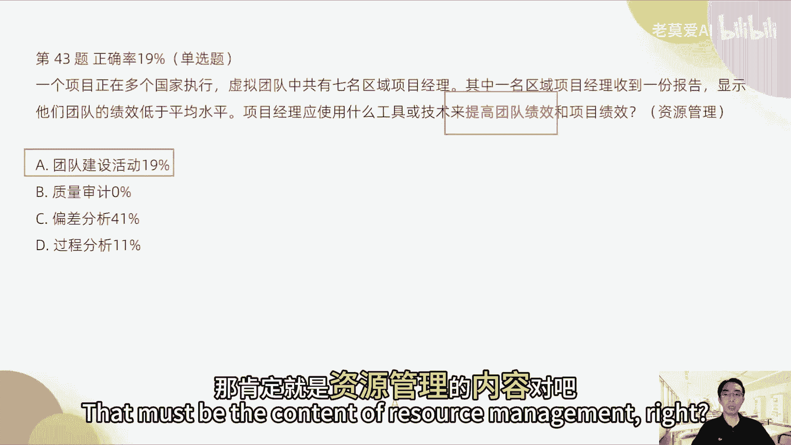

质量审计，这个是质量管理内容，跟资源管理没有半毛钱关系是吧。

这个是质量管理，那偏差分析它什么，偏差分析，一般是在在我们做成本管理或者时间管理，成本的偏差或者时间的偏差，过程分分析一般是什么，回顾会议对吧，所以你看他们每一个都有自己的知识点，他如果说提高团队绩效。

那只有A符合这个条件。

所以正确答案是A好，第49题啊，说项目经理在参照类似的项目的历史数据后，项目经理实在识别一套项目风险的，我们一看到风险想到什么，这肯定是考风险嘛。

我们就往风险那一章去考虑就好了，项目经理必须标记出。

对项目产生最大影响的风险，你看又是风险，所以项目经理应该使用哪一项工具。

所以这考的是什么呢，反复提议公检肯定是风险管理工具，那么风险管理工具我们涉及的是什么，第一个敏感性分析，龙卷风图就是这个它其中一个因素。

一个变量，它的位置，它对于整个风险的影响会有多大。

那影响大的，他肯定代表负影响，这个代表重正影响，所以它是一个龙卷风图。

左边的是负影响，右边的是正影响，负影响是什么，如果这个风险发生，我们的收益率会降低，这个是负影响，如果这个风险发生，收益率会提高，这个是正风险，也就是我们常说的机会，所以有机会有这种收益的损失。

这种东西它左和右一分开。

这个事是不是就像这个龙卷风图是吧，所以它在风险中我们经常用敏感性分析，就是用龙卷风图这个图示啊。

去进行这种风险管理的技术，所以龙卷风图是一个常见的风险管理技术。

就是风险发生的时候，这个因素是让它变负还是变正。

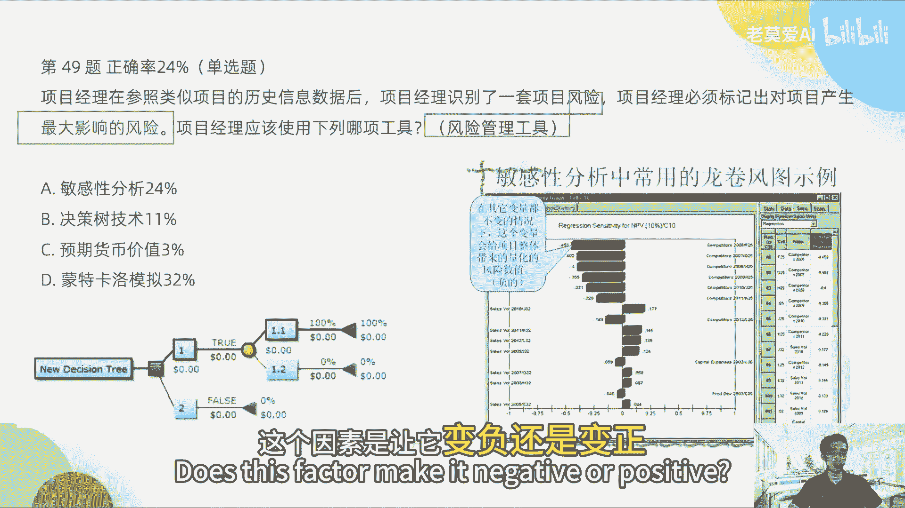

所以我们脑袋中有一个这样的图，我们就知道诶这道题应该选什么，所以这个题目选A敏感性分析，很多人会选决策树技术。

那么决策树这个东西是什么，决策树这个东西它其实是什么成本管理技术。

我们反复用决策树在做了一个事情。

做了一个考题，说决策是什么，我们做事A式不做B事，它会产生什么样的影响，比如说我们一般觉得数用的最多的。

就是49题，不是这个题，冲刺三里，那是哪个题，我们后面再说吧。

反正我们先说完这个题啊，决策树分析我们就要想到什么成本管理。

比如说我们做一个厂子，一个是修建这个厂子，另外一个是什么，第一个是修建，第二个是什么，如果不修建这个厂，我们从重新建一个或者是修复他付出的成本，我们通过决策树式分析。

但它的成本是他修复的这个大概要花多少钱，那如果我们是重新建厂是多少钱，就是这个意思，所以决策树技术其实是用在这个地方，所以这个里面其实它是用的成本管理好，很多人说蒙特卡罗分析是什么。

蒙特卡罗它其实是一套计算机建模的方法，如果我们的题目里面没有提到计算机建模。

或者没有提到计算机这两个字，我们是不用蒙特卡罗分析的，能蒙特卡罗分析是一套用计算机来分析。

每一次我们出现风险。

我们这个应对的方式去建一套模，有点类似于AI学习的那种。

但是它是通过很多数据进行建模，所以这个题目里面并没有提到任何关于计算机，关于建模的事情，所以不选D，这个蒙特卡罗分析也是一种风险管理的方法。

OK所以正确答案是A好，第50题说项目需求要求一种设备用于测试。

项目干系人认为购买设备过于昂贵，希望项目经理能够研究一下，能否交由项目团队来开发，那么项目经理使用什么技术来说服该新人，所以在这个地方我们面对这个题目的时候，只要我们看到什么购买。

购买什么东西过于昂贵是吧啊。

购买设备什么东西我们一定要想到什么，采购管理就是采购管理这一章节。

那么采购管理这一章节，他说采购一种是购买两种方法，一种是购买，一种是自己开发，所以这个就涉及到了自制或外购。

它其实在整个题目里面，它其实已经点出来了，这个分析技术就叫做自制或外购。

分析到底是自己买哦，自己去开发这个更划得来更划算。

还是我们去购买更划算，所以我我们进行的这个分析技术，就叫自制或者外购分析技术，所以正确答案是B。

很多人学成本效益分析，成本效益分析它不是采购管理这一章。

成本效益分析做的是什么，我做这个事情。

他的收益如何，他表达的是这个意思，但是这个题干里面他并没有表达这个意思，他只是说我要是采购还是自己开发这个意思。

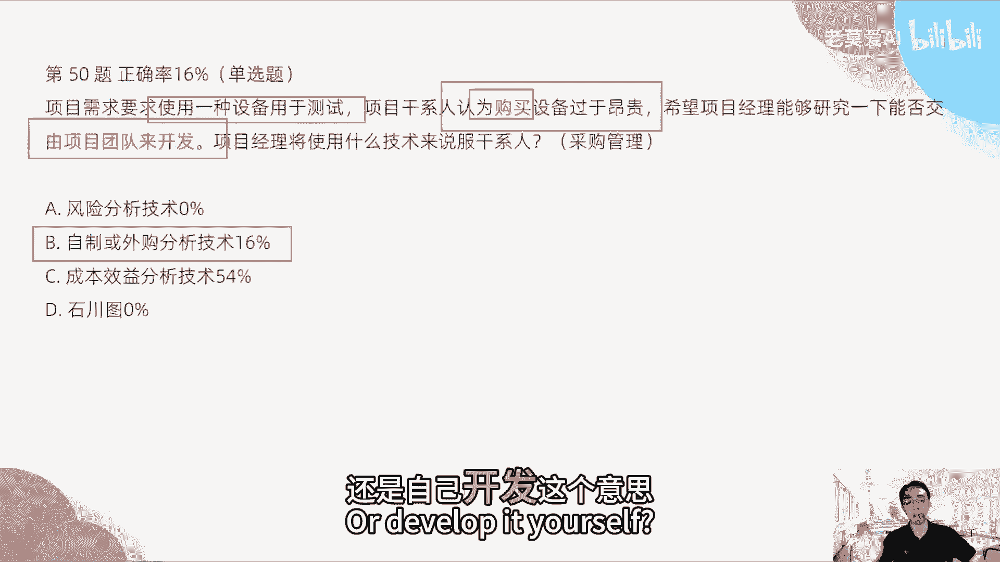

所以A就不对，正确答案是B啊，好第52题。

收到供应商建议书以后，你看一出现供应商，我们会会想到什么。

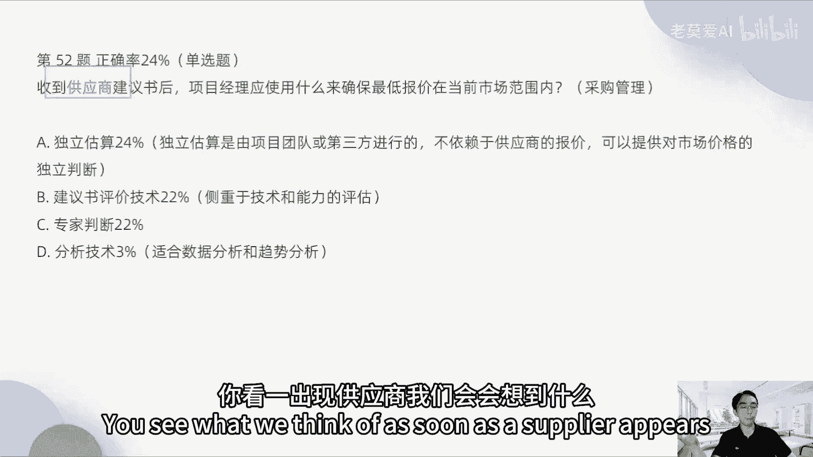

采购管理，就采购管理这一章，收到供应商的建议书后，项目经理应该使用什么，来确保最低报价在当前范围内，OK那么怎么样去确保这个里面考的是什么，采购管理好。

这个里面使用的技术是什么，独立估算，它是由项目团队或第三方进行的。

就像你请了一个专家是吧，当前市场范围的这个价格谁最清楚。

专家最清楚，你请了第三方的专家来评估这个价格。

他就不依赖供应商的报价了，所以他就有一个市场的一个独立判断。

那只有这个技术，它是不依赖于这种第三。

不依赖于供应商的报价的，所以独立估算这个是OK，也叫做这个里面可以叫做专家判断这个方法，OKB是什么，建议书评价技术。

它是怎么是供应商招标的其中一个环节。

招招标建议书，你要供应商出这种建议书，那么你得依赖于供应商的技术和能力。

为什么有建议书，我对这个项目其实不太清楚，我需要你们的建议书，B其实是这样表达一种这样的意思，对于专家判断其实没有这个准确，独立估算它是更准确一些，它使用的是第三方，我们的专家判断也有可能是第三方。

也有可能是我们自己的这一方，这里面的包括它其实在这里面，它就没有A那么准确，其实专家判断也是对的，只是没有A这么准确而已，所以更准确的应该是A，这个分析技术其实跟采购管理没有什么关系。

所以正确答案是A啊。

好第63题，项目经理加入一个项目，该项目具有可能会发生变更的高层级需求。

那么项目经理识别到工作说明书。

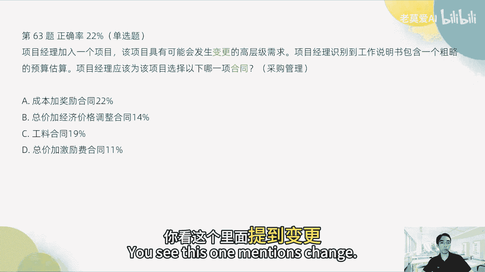

你看这个里面提到变更，好像是要考变更管理，但是它所有的选项里面没有任何，关于变更管理的这样一个怎么样选项。

所以直接pass就是你不往变更管理上去靠就行了。

你看识别到工作说明书是跟什么有关的，跟采购管理相关，对不对啊，采购管理相关，所以我们也想到采购管理包含一个粗略的预算，应选择哪一项合同，你看选择哪一项合同又是采购管理的东西，下面的选项又全是采越。

全是跟合同相关。

所以这一个题目百分之百就是落到了什么。

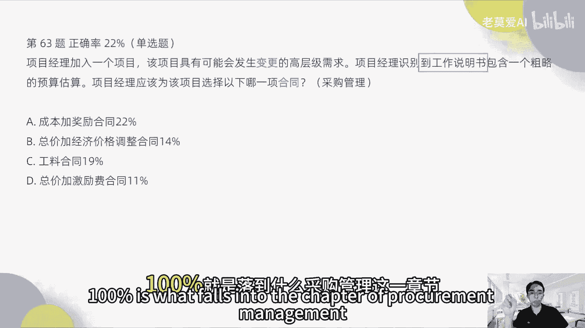

采购管理这一章节，所以我们当这一章不熟的时候，我们就反复去看一下采购管理就行了，那么哪个合同最适合呢。

对不对，我们来首先来看一下成本加奖励合同合不合适。

如果他有高层级的一些变更，也就是说他的风险很大。

我们前面说了，如果风险很大，我们要什么，如果这个项目风险很大，我们需要双赢，一定不能是什么，我赢他输，不能是说我是甲方，所以我就让我自己赢。

万一哪天你做了乙方，你怎么办，对不对，所以在PMI的这个出发点。

你一定是双赢的，大家要共赢，所以出发点如果我是甲方，我一定要把乙方的风险要考虑到，所以成本加奖励合同，它是充分考虑到应对乙方的风险的，所以这个A是比较合适的，总价加经济合同价，接价格调整合同。

这个里面它出现的主要是什么，总价将经济的调整合同。

他大部分出现在什么物价波动，他如果在里面有提到物价问题或者外汇问题。

提到这两个问题，比如说我跟外国人做生意，他可能会有外汇的一些波动，那这个时候总价加经济就OK了，这两个关键字出现了，才会选加经济价格，比如说我买了一些土豆。

那土豆的物价现在上涨了，或者我买了一些茅台，那茅台的价格现在上涨了或者下跌了。

我们要根据现代茅台的价格进行采购，这个就是总价加上经济价格。

有体现物价的波动或者体现外汇，但是我们在这里看63题，没有提到任何关于物价或者外汇的，这个方面的东西，所以B肯定是不对的，公钥合同是什么意思，公料合同其实是什么，相当于我请了一个专家。

我在做这个合同的时候，我对于这个项目的前景我是完全不清楚。

我是懵逼的，所以这个时候才会用公料合同，很简单的一个举例，就是你们家里面进行装修的时候。

你买房子进行装修的时候是吧，你对于装修的东西一窍不通，比如说我不知道怎么去装修的瓷砖地板是吧，我这些东西全部包出去，人工也包出去，工时也包出去，我只要负责监督装修的最后的效果。

这个东西就比较适合用工料合同，因为我对装修一窍不通，但是如果但凡说我本来就是搞装修的，那我家要管搞装修，我可能就是在使用材料上我能够怎么样，我去外购，但是在人工的成本上，我自己可以把控。

因为我自己做过装修，我可以请装修队啊，我自己有装修，对我来帮我自己的房子自己装修。

这个时候你这个东西就不是公料合同了，因为这个东西你自己会，所以公开合同一般是什么，我自己完全不会啊，这一块我要外包的东西。

我自己完全不会的时候，这个时候就会用工料合同，那么总价加激励费合同是什么意思。

总价加激励费的合同，他也是总价上面去有一些浮动。

这个应对在风险不是很大的情况下。

那么这里面哪里说到的风险比较大。

唉高层级的需求里面可能发生变更的，高层级需求，我们高层级的需求都没有定，高层级一般是什么战略级，就说我们的战略级方面，都还没有怎么去严格的确定上，所以风险是更大一些，所以我们选择风险最大的这成本加奖励。

而不是总价加激励，对不对，那如果这个风险不是高层级，如果他所谓的低层级需求，那我们可以用总价加激励费用，是这样的，OK好，这个是应对于低风险，我可以在这里面给大家表示一下低风险，大家就一边听我分析题目。

一边就学习哪一个章节的一些知识点就好了啊。

OK第125题，在项目工作完成后。

与客户一起召开会议，交付四个项目成果。

客户接受四个中的两个，并表明剩余两个产品不满足要求。

交付产品之前，项目经理应该遵循哪个流程。

来确保与客户端期望保持一致好，你看这个成果中的两个。

他接受了不满足需求就是交付产品，所以我们自然而然的想到什么质量，因为它不满足，这结果不满足，说的就是质量OK好，遵循哪个流程确保一致，它和什么说的是质量的成本。

对不对，质量成本有一致，成本跟非一致成本。

那么我们怎么样去控制质量，我们怎么样让它保持一致，其实就是怎么样我们控制质量的一个方法，控制质量我们放在哪里，就是AQC，我们企业不是很多企业会招测试人员吗，比如说我们做苹果手机，这个手机它做出来以后。

一定会有测试人员来测试，比如说这个好手机吧，防摔性测试，防水性测试，它的规格的测试，它的偏差，它的屏幕的粘合度这些东西，抗老化测试，这些测试是测试什么，测试结果就是测试这个手机产生的一个结果。

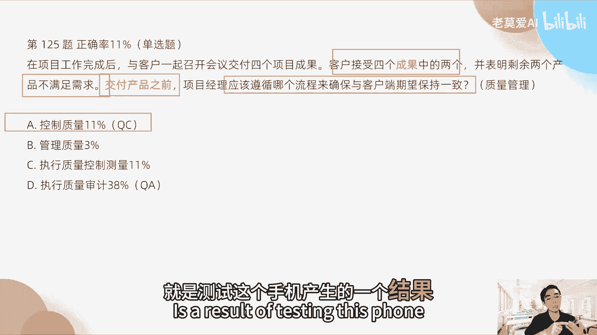

拿到手上是怎么样的，这个叫做控制质量，也叫QC，quality control叫做QC，那么这个QC它专注的是什么，交付的结果质量好，那PUA很多人选执行质量审计，质量审计是什么意思。

质量审计审计的是QAQA，quality a是什么，A其实是那个这也是审计的意思，所以这个里面对应的是什么过程，质量这个不一样，那过程质量跟结果质量有什么样的区别呢，过程质量是我们在做走机的时候。

有没有遵循手机的制作流程，我们有没有进行打板，有没有进行第一轮测试，第二轮测试，第三轮测试，那整个过程有没有有哪些人参与了哪些环节，他能够保持到了哪些环节没有保持到，这个是过程质量，这是过程质量。

所以质量是分两块，过程质量和结果质量，那么过程质量这个就是质量审计的过程。

在过程中出了一有没有出现问题，人员交接的时候有没有出现一些问题。

工作流程有没有出现一些问题，都属于什么过程质量。

但是这个里面说表明剩余两个产品不满足需求。

他说的是什么结果，所以正确答案是A好，133题，在项目的质量审查期间。

然后团队讨论了当前质量管理计划的必要变更。

以满足该新人期望，目前的计划包包括产品的特定事项和特征，但缺少一个重要方面，若要完成质量管理计划，那么项目经理应该怎么做，那么他是怎么样，他其实在这个题目里面考的也是什么，质量管理。

质量审查期间缺少一个分量方面。

因若要完成质量管理计划，我们要按照质量管理计划去推进的时候。

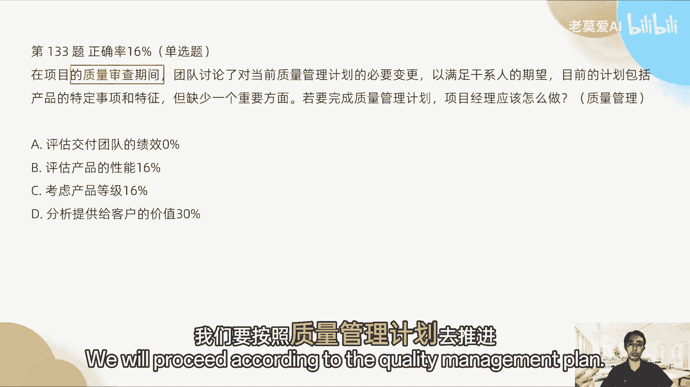

我们应该要满足哪些东西，我们需要有一个重要的方面缺失了，我们应该怎么样怎么样考虑产品的等级，考虑单价值，这个怎么理解，你看啊，团队讨论了当前质量管理计划的必要性，满足该性能期望，质量计划的必要性。

这个是什么，是在更高一层是吧，那目前的计划包括产品的定义事项和特征，那这一层是什么，第一层你现在就看到了，从这个题目里面，我看到，其实这个问题出现在哪里，就是干性人的期望，就必要变更质量管理计划。

一般我们说了是很概要的一个计划，对不对，在高层级的计划里面，我们有没有满足，缺少了一个重要方面，我们只在什么产品的定事项和特征，特定事项的特征，产品的特征是什么，这个屏有多大，对不对。

这个屏的防水性是怎么样的，这个屏的效果是怎么样的，它刷新率是怎么样的。

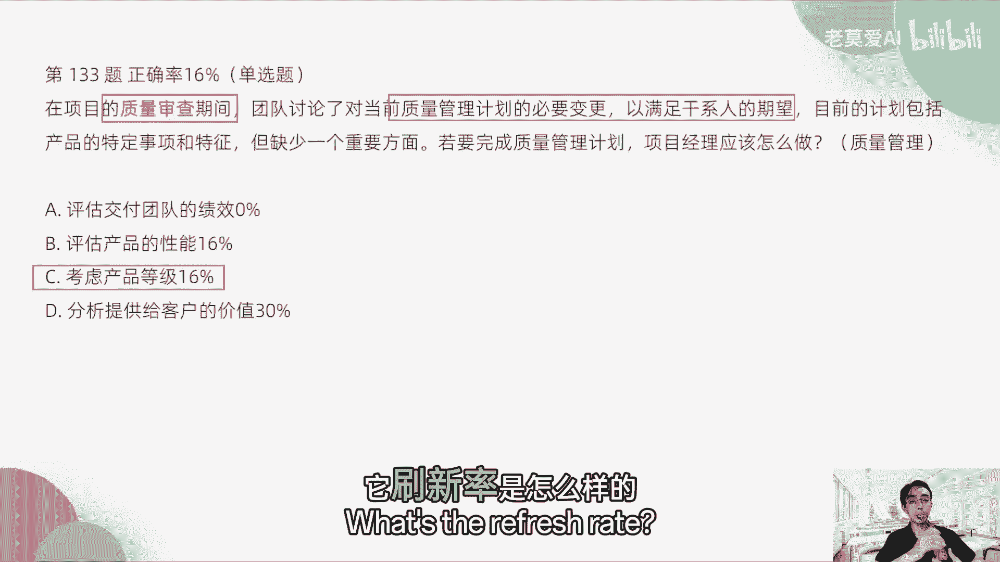

这个是代表手机的一个必要的特征，那这个特征其实是更更低一些。

所以我们质量等级就要去，产品就要去分级，高层级满足质量管理计划的这个基本要求，低层级也要去满足，但是现在低层级我们缺少了一个重要的方面。

就是高层级的东西，所以我们产品其实我们需要去分等级。

一方面满足干系人的期望，满足上层的，一方面满足特性。

满足一个小的特性的一个东西，所以这个里面就考虑的，就是产品的等级的划分了。

所以正确答案是CC，而不是说我们要去分析客户的价值。

因为客户的价值它其实提升的是什么，这个里面讲的是敏捷的一些东西，但是这个里面并没有提到任何，关于敏捷的一些话术。

他说的是质量管理计划等等这个东西，它其实还是传统的项目管理的东西。

所以D就不用考虑，正确答案是C，第134题，在项目的下一阶段。

一个建筑师将休三个月的长假，若要确定这是风险问题还是机会。

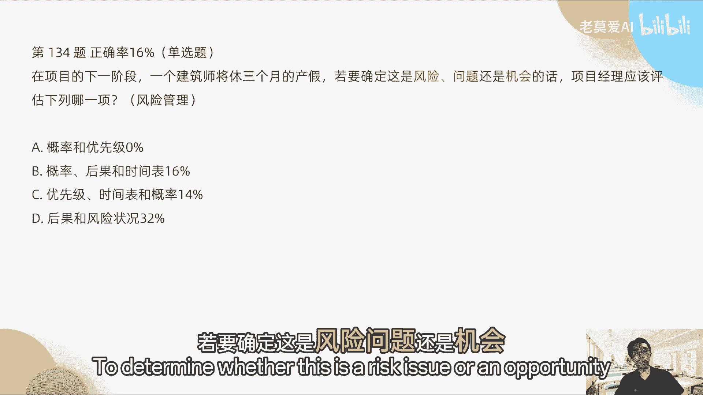

项目经理应该评估来一下好，这个里面我们就看这道题考什么。

考的是风险问题机会，那么一定是风险管理。

对不对，风险管理好，那风险管理团队考虑的是苹果，这是什么，那评估的是风险管理，风险的管理影响，风险的影响包括了什么。

出风险出现的概率和后果。

那还有什么时间嘛，对不对，还有时间表，因为他要休三个月的产假，那么这个风险将持续三个月，那风险的影响我们可以看一下风险的，风险的影响其实就是什么风险发生的概率，就是风险发生的概率和什么后果的大小。

这个是定义风险影响的级别，风险的级别就是这样来的，那风险怎么样排序，就是跟这个排序，风险发生的概率和后果的大小相乘，得到了它怎么样的一个数字，这个数字就是从大到小进行排列，它就首先要处理哪些风险。

就从这里去判断，那这里后果和风险判断，其实风险的状态是不用评估的，风险状态是摆在那里的，是我们记录的。

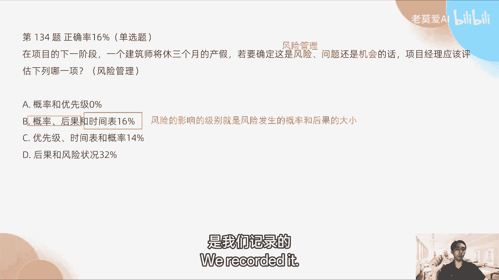

而不是说我们应该评估的哪一项，OK好，第140题，在项目过程中发生了一个意外，该事件影响了项目成本，但是未影响到时间，该事件之前被项目团队识别为一项潜在风险，那么若要限制这个事情对于项目成本的影响。

那么应该怎么去做，OK那这个事情我们应该怎么去做呢。

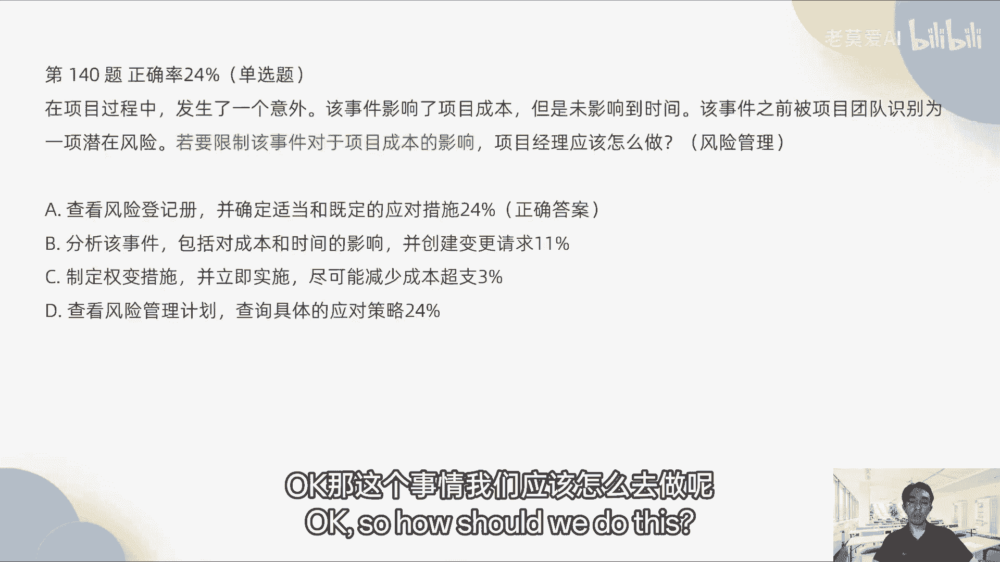

OK好，这个题目它的结果看一下结果我们写错了啊。

这个里面其实正确答案是什么，是A我纠正一下这个答案CA为什么是A。

是因为怎么样，我们这个考的是一个风险管理，那风险管理是这样的，产生了一个项目的成本，但是未影响到时间，那这个时候是怎么样影响了项目成本，他这个意外有可能会发生一次变更，项目成本是三大基准里面的三大基准。

那么没有影响到时间发生，说明时间不用变更，该事件之前被认为是风险，OK好，对成本的影响，OK那这个时候他考的就不仅仅是风险，或者是说他这个东西我把它删了，其实考的不主要是变更，风险当中含有一个变更。

所以这道题目跟一般的题目相比，它的难度要更大一级，所以很多同学错在这里，我认为错在这里是可以原谅的，因为这种题目其实不多，就真的你要那个他可能是180道题目里面，这种级别的难度顶多也就出现一两个啊。

因为这个题目其实是比较难的。

它比较考察你的比较综合的能力，第一个是你看他要查看风险登记册。

为什么，因为这个东西它是一个识别为潜在风险。

所以它识别为潜在风险的，你要去看之前我是怎么样去看这个风险的，我们要只看我们之前是怎么去处理这个风险的，所以在风险的处理办法里面。

它是放在风险登记册里面，然后再去确定适当和既定的应对措施。

那这个是事情，这个应对措施，可能是要用到三大基准里面的变更，但是他没有明确的把这个变更提出来。

他只是说这是一个风险，但要不要变更呢，我们要看它的风险登记册里面，有风险的应对措施，所以要不要变更，我们要看具体的应对措施，所以正确答案是A，OK第一为什么不对，孟老师。

我这个为什么不对，第一是什么风险管理计划，风险管理计划团队识别风险。

识别完以后，他其实是放在哪里，放在风险登记册里面，大家一定要记得识别完的风险，不是放在风险管理计划里，我们一直在讲，风险管理计划其实是一个什么什么管理计划，一般是什么高高层级的计划。

我们可以有一句话可以记叫做风险管理计划，无风险，这个风险管理计划里面，他不会去描述具体的风险。

OK这个题目有点难，第148题说，在识别风险后。

