# 【最好的PMP课程】PMP高频错题讲解3-2 - P1 - 老莫爱AI - BV1zjsjeYECg

那么项目经理首先应该做什么好，这又是一个风险管理，所以风险管理我们现在考的非常多。

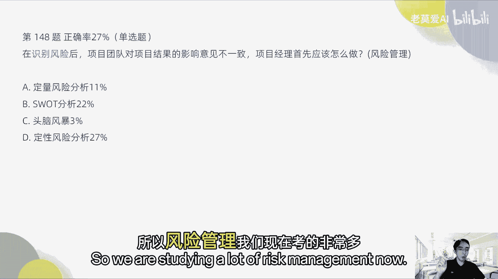

那么识别风险之后，我们对结果的影响意见不一致，我们应该怎么样识别分这里考的是什么，风险管理的流程，风险管理的流程，风险管理的流程，它一般是什么，第一个识别风险，这个其实在书上都有现成的。

识别完风险以后进行定性风险分析，再次定量风险分析，再做什么风险应对，就是这样一个流程，所以正确答案是D定性风险分解。

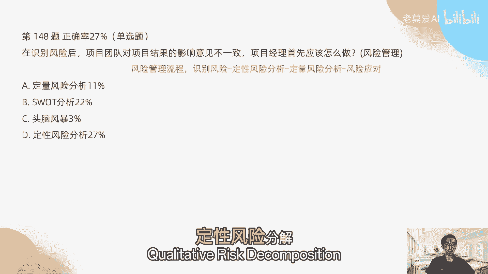

接下来是这样，就这么简单，先做定性再做定量，所以D优先于A好，第154题，在一个价值为1500万美元的项目，进行招标的过程当中，一看招标是吧，采购管理，采购经理发现有两家符合其中A的费用更高。

但是比B公司又有更多的专业知识，那么B公司符合项目的预算，A公司不符合这个处于哪个过程，其实这个是什么，甚至已经在比较价格了，对不对，比较价格是在什么时候，是在实时采购里面。

我们发现谁这个合格谁不合格这个词的里面，他其实是做了一个叫实施采购的一个过程，这道题其实比较简单，OK我们来看啊，很多同学选召开投标人会议。

投标人会议，投标人会议里面，不会去比较这两个人符不符合标的。

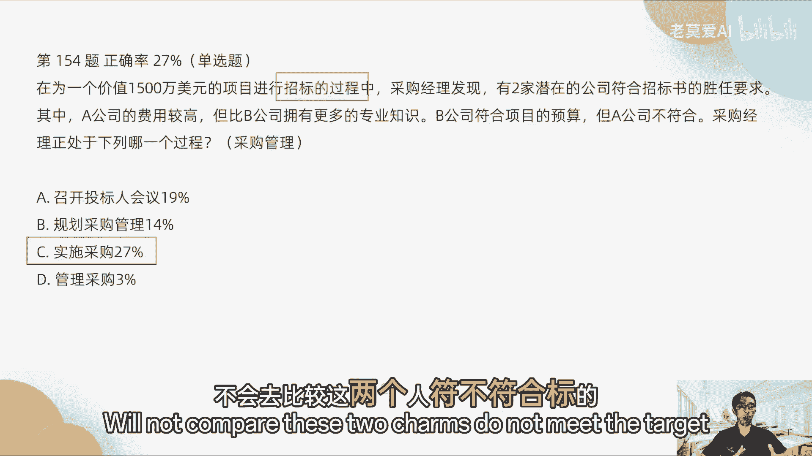

我们如果项目经理如果有兴趣参加投标人会议，我们就会看到投标人会议一般是什么，投标人会议，一般是这个招标方先去讲一下他的需求，就是他的项目是怎么样的，他的需求是怎么样的，跟大家澄清完，各个投标人代表的。

投标公司就会在会议上去提问，问甲方说哎我是我，比如说我是乙方，我就问甲方，你们这个需求是怎么样的，里面包含了哪些细项，我们要充分去讨论这些细项的东西，把它搞明白，有点像需求分析，需求澄清。

把这个东西都澄清完好，我们懂了好，我们知道你的方案，你的东西了，我们知道你想要什么东西了，接下来我们要准备方案，而且那个方案接下来会有报价，但是方案和报价他不会在投标人会议上去澄清，不会在会议上去说。

特别是报价，他不会在这个会议上直接说甲方举个牌子，这不是拍卖啊，不是说乙方说A公司说我出100万，B公司说我这个标书我去接那个标书，我只要80万就60万，50万，不会是这样的。

因为如果是这样的就没意思了，那就是价低者得，大家在那pk就打起来了，这个不是投标人会议，就是竞标，你你了解了你这个标的以后，OK下去我再写方案，再报价，报完价之后就实施采购，那么拜完价以后。

甲方就会怎么样对方案和报价进行筛选，这个是乙方彼此看不到的，就是乙方他的ABC公司，他是完全看不到甲方在做的一些动作，最后甲方会出来说谁哪个公司竞标了，进到这个标了，甲和方会公布。

他甚至有可能有一些他会公布竞标的，乙方他是以多少钱竞标的，有一些他不会公布，就甲方也可以不公布这个价格，比如说有一个偷偷的别人报了100万，他报了50万，他拿下这个标，那么甲方他有权公布。

你说你花了50万进了这个标，也有不告诉你的，他就说乙方有一个公司进了标了，他会把这个公司的名字亮出来，就比如说A公司，它就进了这个标，具体至于具体多少价格进的，甲方公司可以不告诉你。

这个是最后的招投标的一个过程，我就把招投标的过程跟大家说一下，大家都明白，所以正确答案是C好。

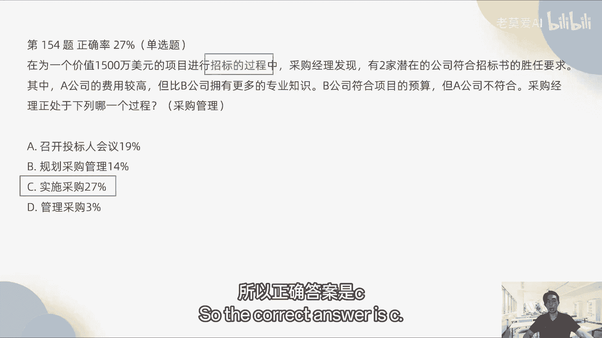

这个第66题啊，在项目执行过程当中，职能经理识别出一个有关外包团队的。

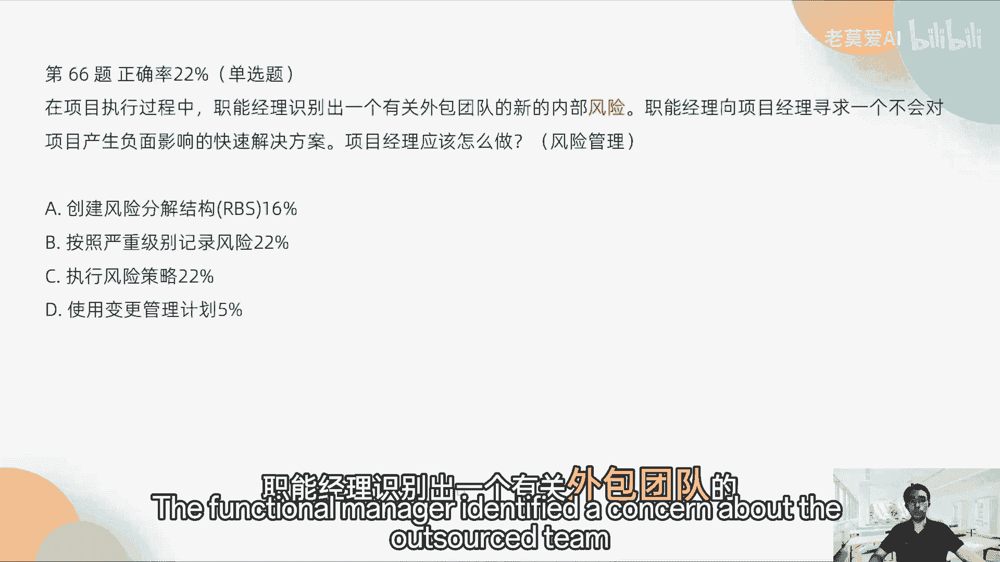

新的内部的风险，好，职能经理向项目经理，寻求一个不会对项目产生负面影响的，这个快速解决方案，项目经理应该怎么做，这个里面其实是什么，你看风险管理是不是快速解决方案，那么项目经理应该怎么做。

这个里面考的是风险，那么跟风险有关的是几个，有两个，一个B1个C对不对，所以这个里面我们就要看，到底是选B还是选C好，B按照严重级别记录风险，这个是对的，第一执行风险策略他要怎么样。

首先他要快速解决方案，我们首先要记录，按照严重级别，先要记录风险，我们在做风险，风险管理的时候，首先我们要怎么样进行风险登记，再去风险，再去分析，再去执行风险策略，所以第一步应该是B。

第二步才是风险分析，第三步才是执行，对不对，我们风险的策略，第三步才执行，所以B优先的，所以正确答案是B啊，有时候学学说什么进行什么情况进行管理，采购管理采购是什么，管理采购是什么意思。

管理采购是我们刚开始做计划的时候，那么我们在做计划的时候，我们就可以分析说我们这个项目，我们要进行采购分析，对不对，这个东西它要自制还是外购，那我们在计划阶段，其实我们要去做这个事情啊。

这个过程就叫做管理采购，在计划的时候进行管理采购。

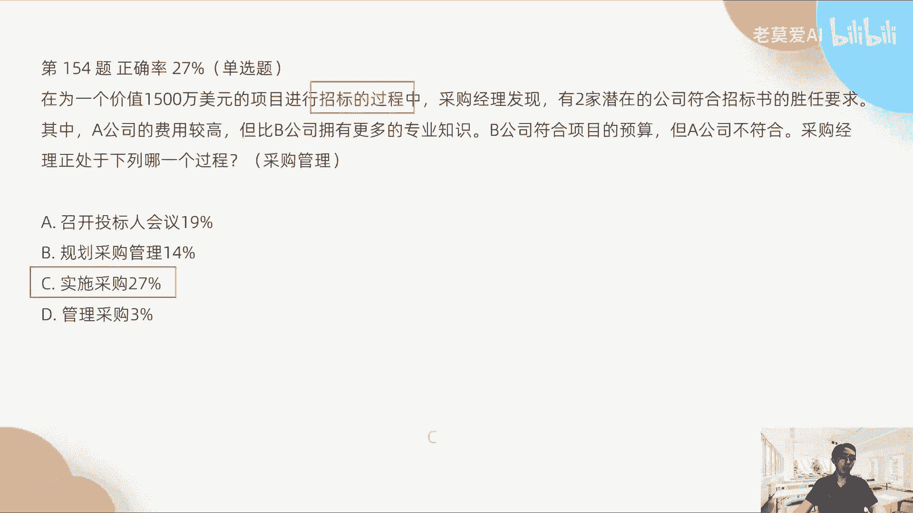

在计划过程，计划过程组的时候做这个事情。

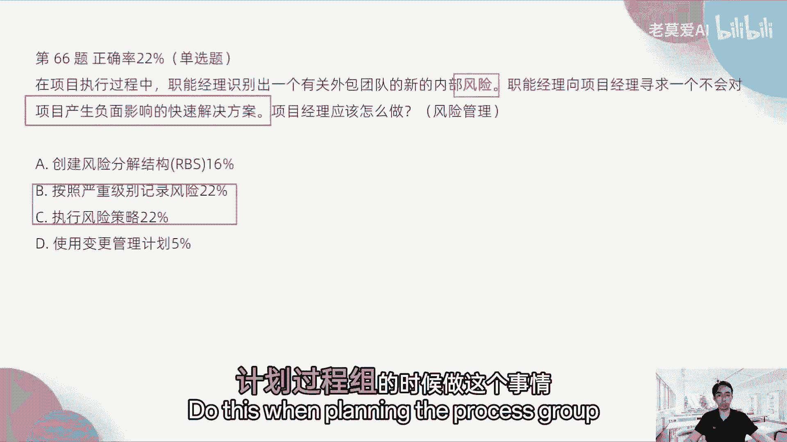

这个参上我回答你了，好第68题，作为矿主管，你正在领导有关用户故事的相对规模估算练习，由两位开发人员开始。

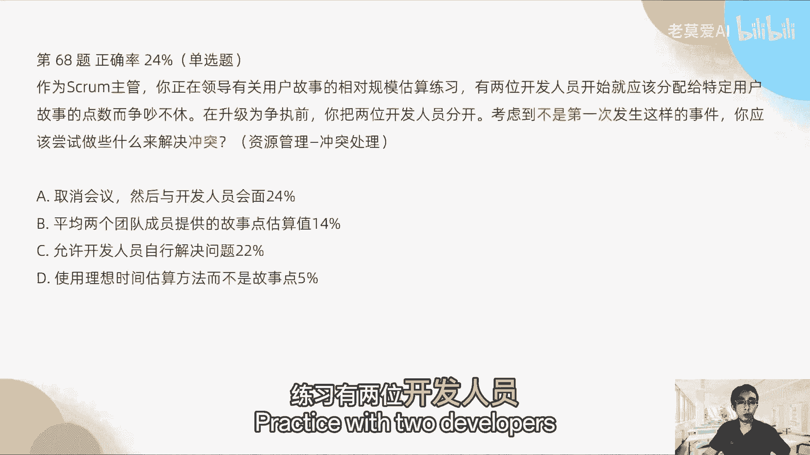

就应该分配给特定用户的故事的点数。

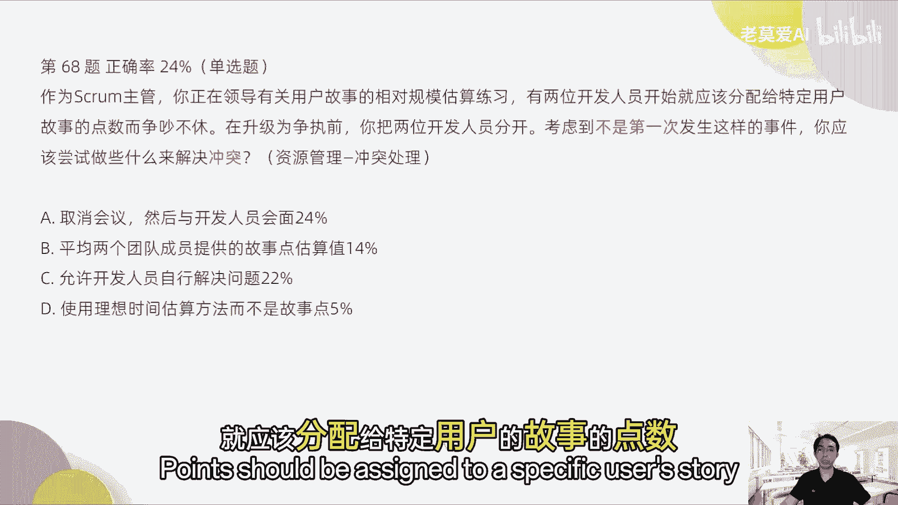

而争吵不休，在升级为增值前，你把两位人员分开，考虑到不是第一次发生这样的事件，你应该尝试用什么解决冲突，好这个你看这个里面关键字解决冲突，这个一看就是什么，一看之冲突就是资源管理。

资源管理里面就是冲突的解决方法，这个是很简单，一看就是考这个知识点，而且他考虑到的是不是第一次发生这样的事件，如果我们是第一次发生这个事件的时候，我们可能会产生的一个问题是什么，如果我说是敏捷是吧。

他发生冲突的时候，我们肯定要他自己先解决一下，对不对，自组织吗，这个是敏捷自组织，那为什么不选C是因为有了这个条件，不是第一次发生这个事件，说明前面已经没办法解决，就是自己组织没办法解决。

反反复复出现这种情况，你不可能把这个问题一直抛给团队，你自己不去解决，对不对，所以应该做什么事情，应该靠主管或者SM要取行动了，采取行动应该怎么做，那我们肯定首先我们要从冲突当中去跳出来。

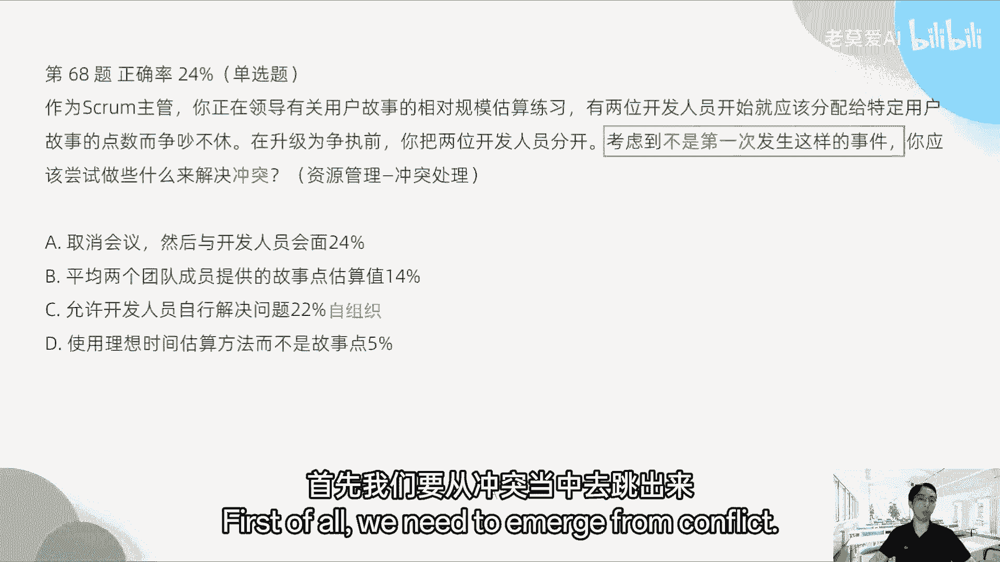

我们要去取消一下这个会议与开发人员会面，这个不是指说我们一对一的去会面，而是把两位开发人员怎么样去分开，去单独拉出来说，你们假如说我们三个人一起去讨论，说这个东西出现了这个事情，出取消会议。

这个行为是正确的，我们要保证会议的怎么样聚焦，也就是说会议应该是在去解决一个会议，大家记住了，在PMI的理念里面，一个会议只有一个主题，也就是说这个会议，假如说这个会议他要进行估算。

这个会议一定就是要做估算，如果在估算上发生了冲突。

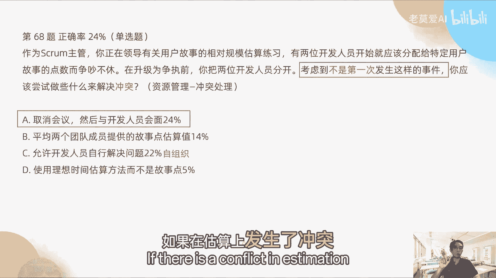

我们首先要做的事情，就是你要么就是把两个人踢出去，我们继续估算，只做这一件估算的事情，这一次的主题就是估算，要么就把估算关掉，我们先怎么样做冲突的解决会议，你不要说我们这个主题。

这一次今天我们来开估算会议，他们俩现在开始产生冲突了，我们把估算会议直接改成冲突会议，这是不对的，因为估算的会议的参加者和冲突会议的参加者。

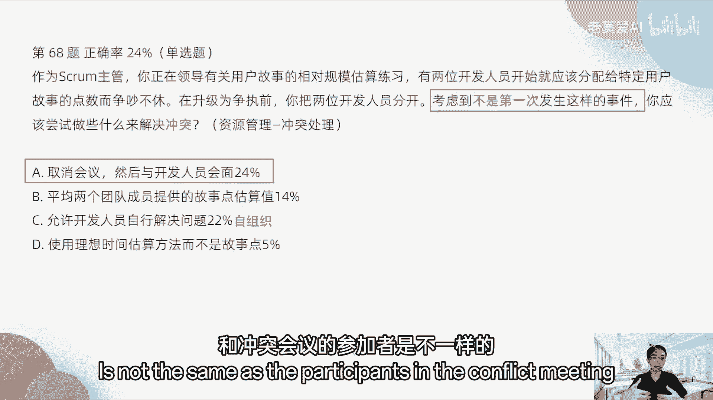

是不一样的，你不能直接不取消改，直接把它，现在我们大家都留下来啊，这个是编成一个什么冲突解决会议，大家一定要想清楚，所有的会议在PMI的PMP的考试里面，所有的会议他都是单一的，就一个一个主题的会议。

只解决一个问题，所以选会议是正确的，所以正确答案CA，第71题，一个将产品的新模型推向市场的项目，正在执行中，当竞争对手提起诉讼，号称该产品侵犯了他们几项专利时。

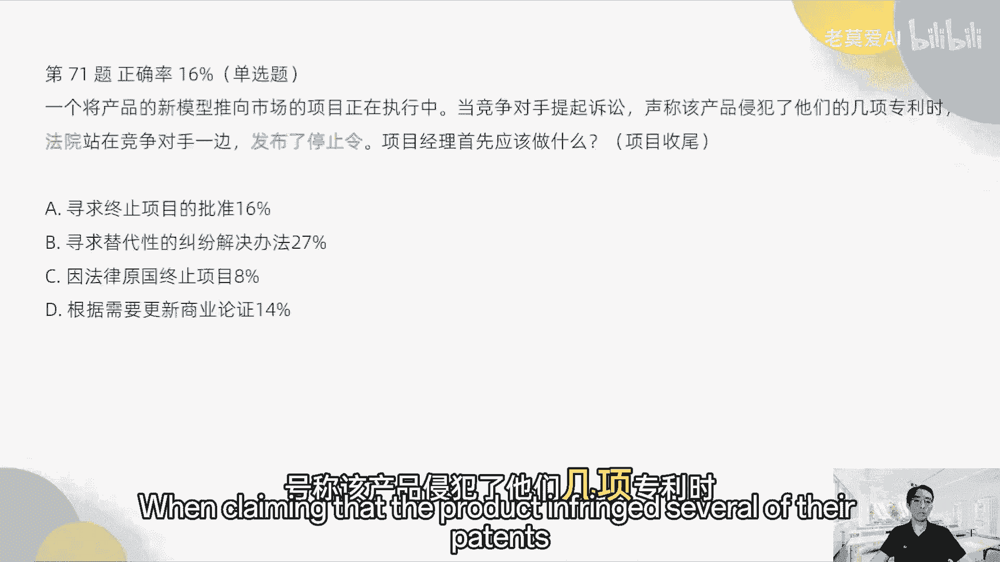

法院站在竞争对手一边，发布了停止令，他应该做什么啊，这个东西你是没有办法，当出现了这个问题之后，我们怎么样就应该进行项目收尾了，所以要寻职项目寻求终止的批准。

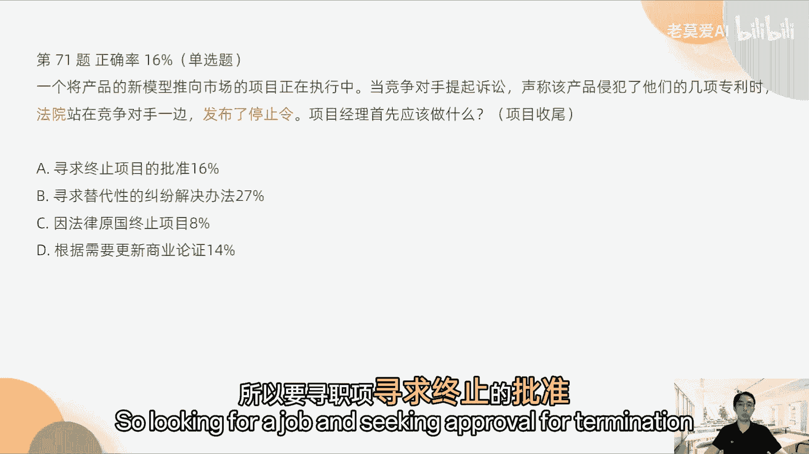

这个就是项目收尾的一个环节。

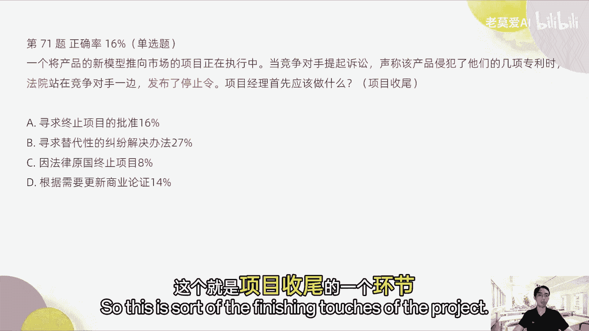

法院站在竞争对手一边，这个是没有办法，如果法院已经颁布了停止令。

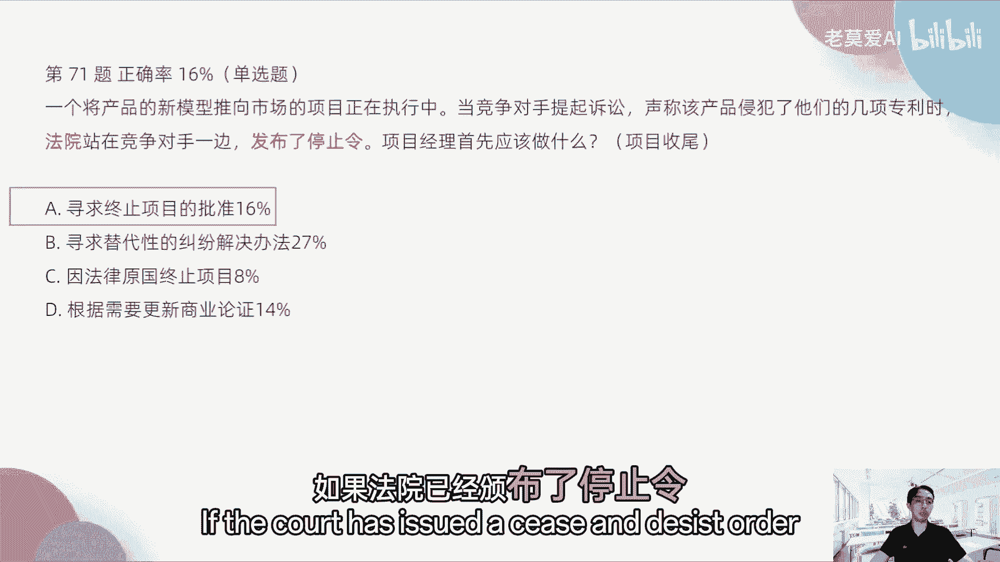

那就没有办法，那寻求替代性的纠纷解决方案，这个是已经没有办法了，法院如果已经上到法院了，你除除非什么，我对这个结果我觉得不行。

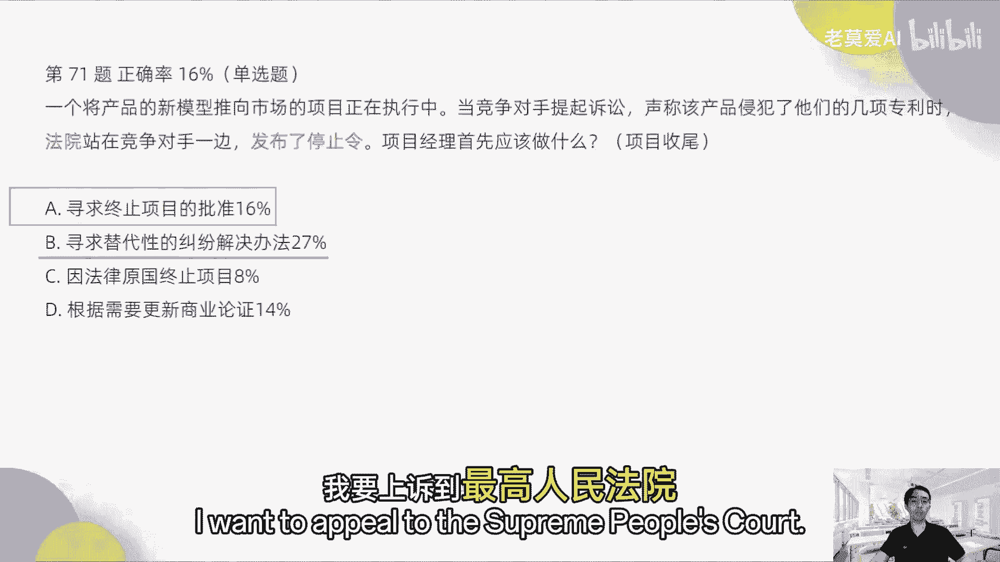

我要是这样的，而不是说法院已经判下来了，我还去寻找什么纠纷的解决方法，这个是后话了啊，而是如果法院没有介入的时候。

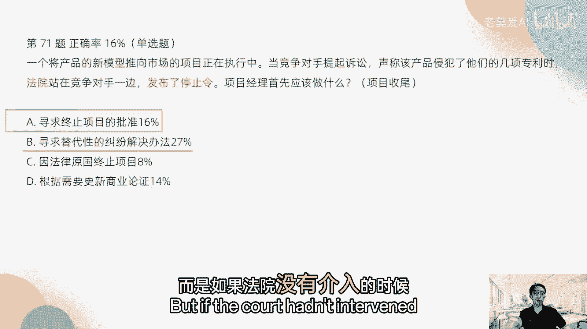

我们可以去寻找替代的纠纷解决方案。

因为纠纷解决方案在民事当中，甲乙双方是不能够协调的时候才会找到法院，所以这个顺序就反对吧，所以法院如果接手了，就没有办法去寻找解决方法，大家记住啊，就像说夫妻两个人要离婚，要闹到法院去，那要落到法院去。

已经没办法了，对不对，那你闹到法院，你还能够怎么样，民事你你夫妻双方离婚，首先是什么，民政局，对不对，我们要去民政局，民政局他有冷静期，让你冷静一下，但是如果真的到达已经去法院了，打官司的这个环节上。

这这个已经没有退路了，这不是说那是民政局已经走不下去了，才会走到法院这边，所以一般是这样的，一级一级升级，法院其实是代表着最高的协调方式，已经解决不了了。

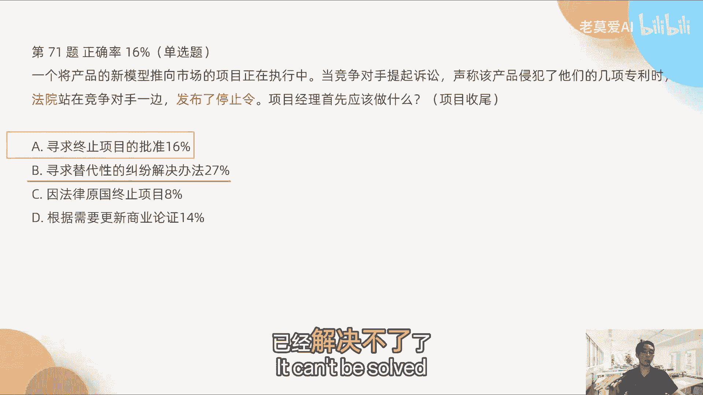

普通的方式解决不了的，OK所以B是不对的，正确答案是A好，第72题，一个多阶段项目发起人离开公司，项目文件已经获得批准并满足其目标。

资源已到位，那么项目经理应该做什么东西好。

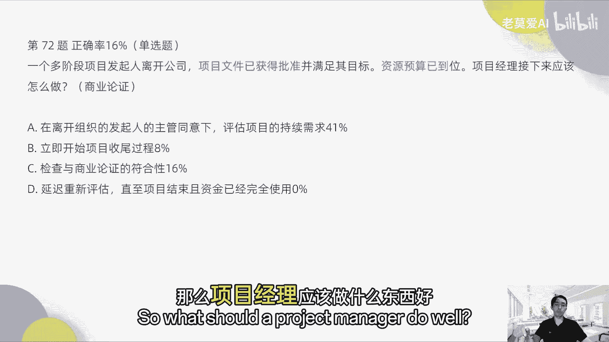

这个东西发起人你看，但是项目文件以及获批并满足其目标。

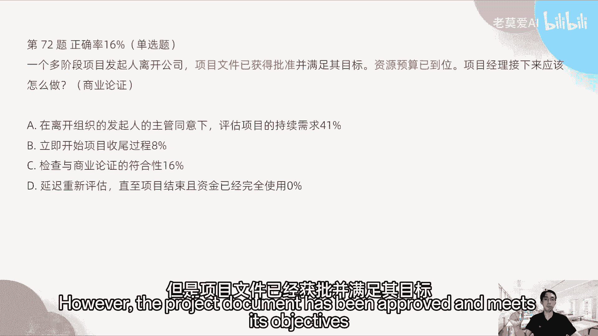

说明什么，我们的项目章程已经被批准了，商业模式已经被认证好了，所以资源已经到位了，它不它不会随着说我们发起人离开了，这个项目就还了，不是这样的，发起人只是几个人，项目的其中一个人，但是这个公司没还。

我们的项目没划，所以我们怎么样，我们要去做的事情是什么，这个事情发起人走了之后，他的商业论证的符合性是怎么样的，因为他做的发起人一般会做什么事情，他会提供资金，所以我们看这个项目，现在这些文件获批了。

资源已经到位了，那么现在这个发起人走了，那这个资金是不是继续有给到我们使用，如果这个资金没了，这个资金也没了，那么这个项目就黄了啊。

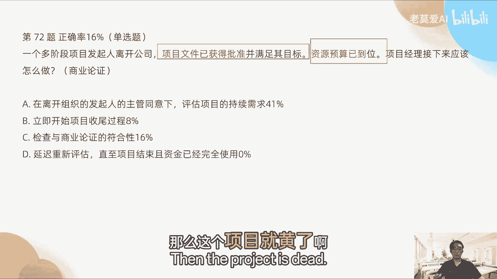

因为他发起人是提供资金的，所以在这个阶段里面，我们应该检查与商业论证的符合性。

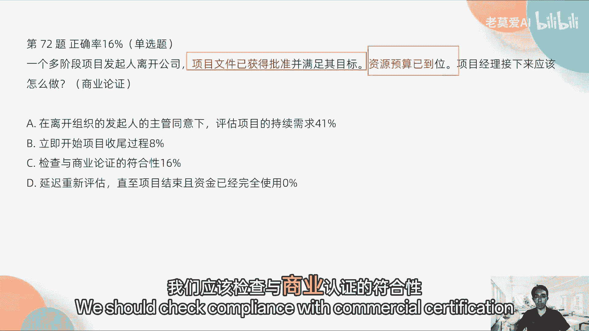

这个其实考的是商商业认证信息，不是说我们要去我们A档案。

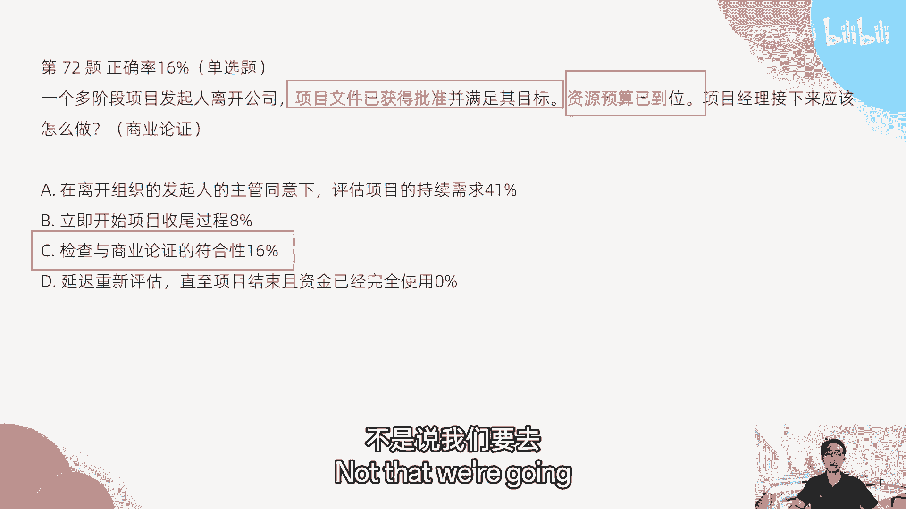

是说离开组织的发起人的主管的同意下。

评估项目的持续需求，不是这样的啊，评估项目的持续需求，因为发起人离开了。

他提供资金的人也走了，对不对，所以发起人在这里面其实是考的一个东西。

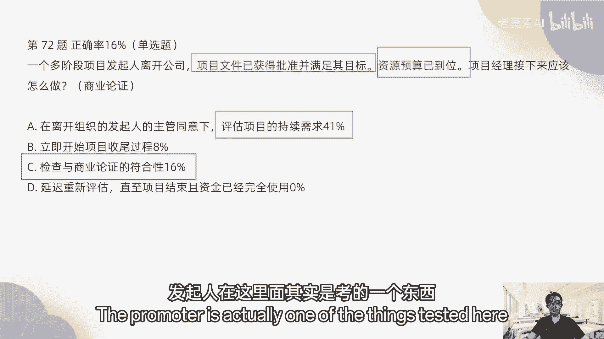

发起人是干嘛的，他是为项目提供资金的或者提供资源的。

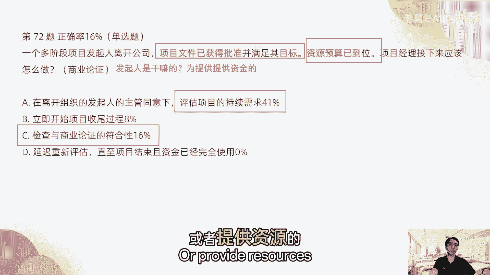

其实资源他也是要需要资金去满足，正确答案是C好，79题，你的项目曾经很难获得，项目管理计划的正式批准，因为项目干系人太多了，好这里面其实考的就是什么干系人管理，他们的要求不能放在项目里，这些项目干系人。

你看又是这些项目干系人拖延，所以问题出现了干系人身上，所以考的是干系人管理，而不是沟通管理，他们一次次的讨论他们的需求，项目范围最终获得了批准，于六个月前启动，哪项不是好的预防措施，不是好的预防措施。

我反过来说哪三项是好的预防措施。

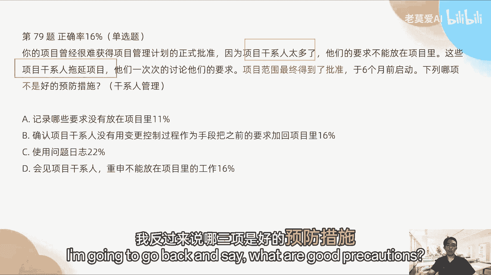

那干性能管理里面好多预防措施，也就是说肝性能管理里面做的对的地方是什么。

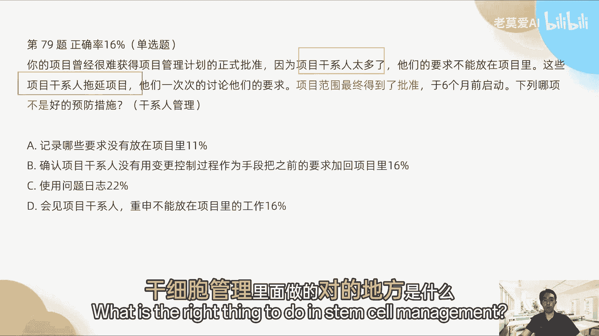

哪些没有放在项目里面，这个是它干性能的要求是要纳入进来的，这个是对的，对不对，那么这个确认项目，干系人没有使用变更过程作为手段，把之前的要求加回项目里面，这个是对的，干系人没有去乱加什么需求。

没有去乱变更，这个是对的，第三个使用问题日志，这个跟干系人没有任何关系，这是产生问题以后，我们要进入问题日子，所以跟该系人相关的，还有D会见该系人冯森不能放在项目里面工作，这也是跟该系人相关的啊。

所以这这道题用排除法就行了，因为他说不是好的语法，使用问题日志，这个问题日子并不能解决干性能的问题，而且这个问题日子，只只是用来记录问题的一个东西，所以C是错误的。

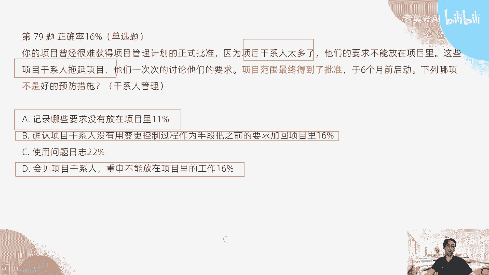

所以我们就选C，因为他说不是OK反向思考。

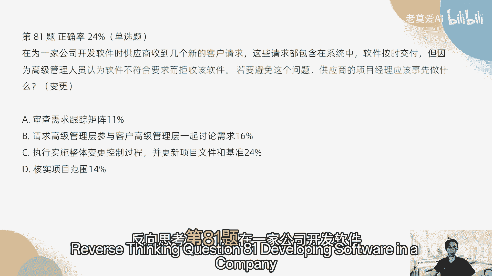

第81题，在为一家公司开发软件时，供应商收到几个新的客户请求。

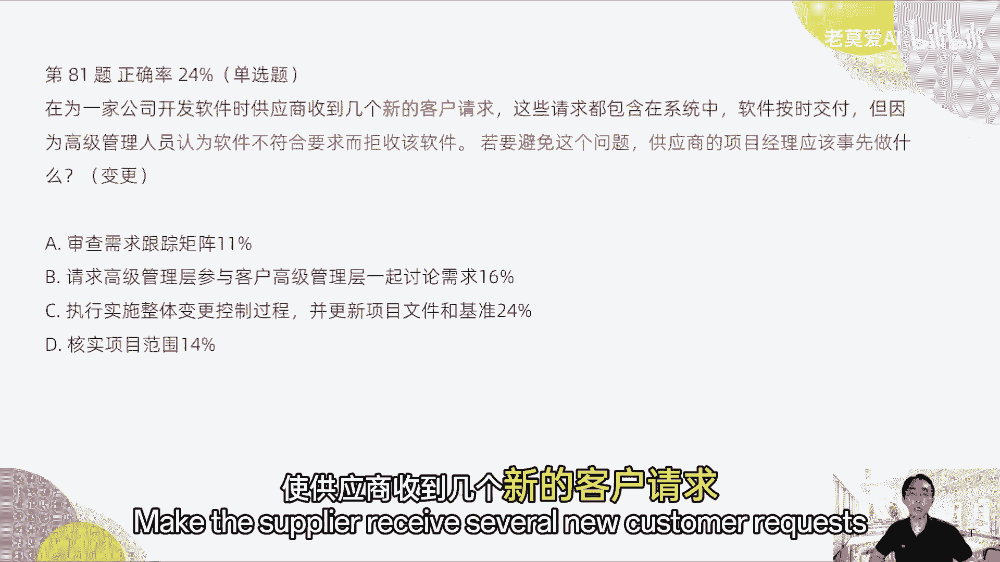

这些请求都包含在系统中，软件二次交付，但因为高级管理人员认为软件不符合。

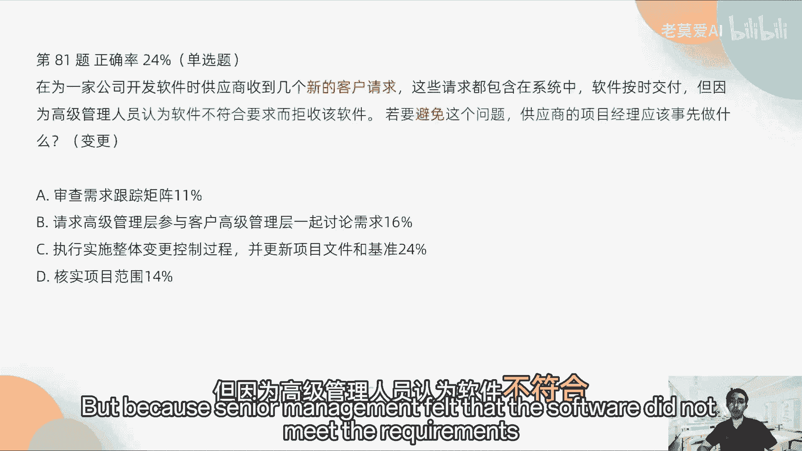

而不符合要求而拒收该软件，若要避免这个问题，供应商的项目经理事先应该做什么好。

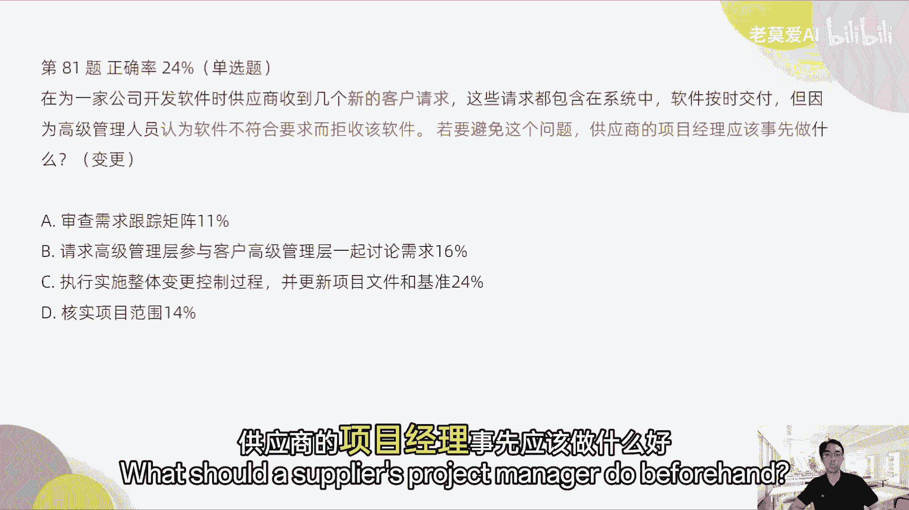

供应商收到几个新的客户的请求。

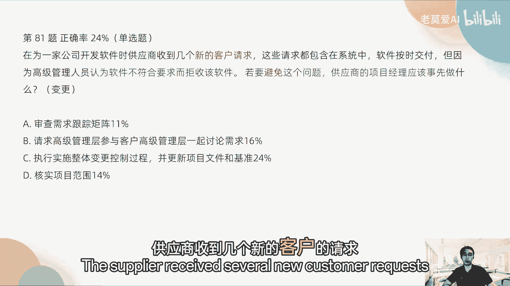

请求都包含在这个里面，因为高级人员认为这个软件不符合是什么问题。

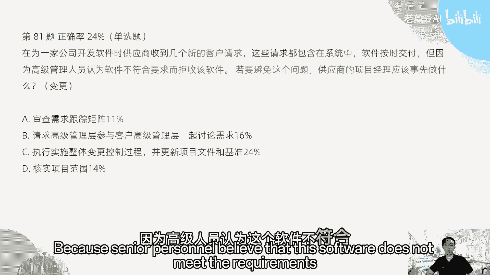

结果问题结果问题，他前面收到了几个新的客户请求，说明什么范围，客户请求是提需求，结果不符合说明什么范围有关范围，所以范围基准被打破是什么意思，就是变更，那么如果要避免这个问题怎么样。

我们前面就要怎么样进行整体变更控制，也就是说新的客户请求，那么这些请求应该走变走变更流程，并且知会到变更委员会，而且项目文件需要去更新，那么变更委员会会有什么高级管理人员，CCB就是因为CCB不知道。

所以项目才失败，所以要避免这个问题，要走变更流程，那很多同学说请求高级管理层参与客户，高级管理层一起讨论项目需求，这里面有说到客户的高级管理层吗，没有，那你怎么知道，我们一定要找到客户的高级管理层。

就是客户那边的高级管理层一起讨论需求了，那客户高级高级管理层，题目当中说到哪里有客户高级管理层，关于客户管理，高级管理层，他并不知道这个事情，所以这个事情如果是选B，代表我们真的想多了。

这个东西想的太超前了，你只是收到几个客户请求，你去找到客户的高级这个管理层去干嘛，对不对，所以这个东西不要去往外去扩散，其实外国人想的没有那么复杂，对不对。

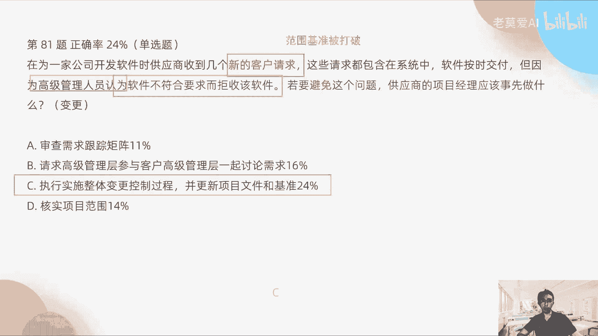

所以正确答案是C，第91题，项目已完成并获得客户批准，it部门计划对于项目进行未规划的审计，那么项目经理应该怎么弄，审计在哪里。

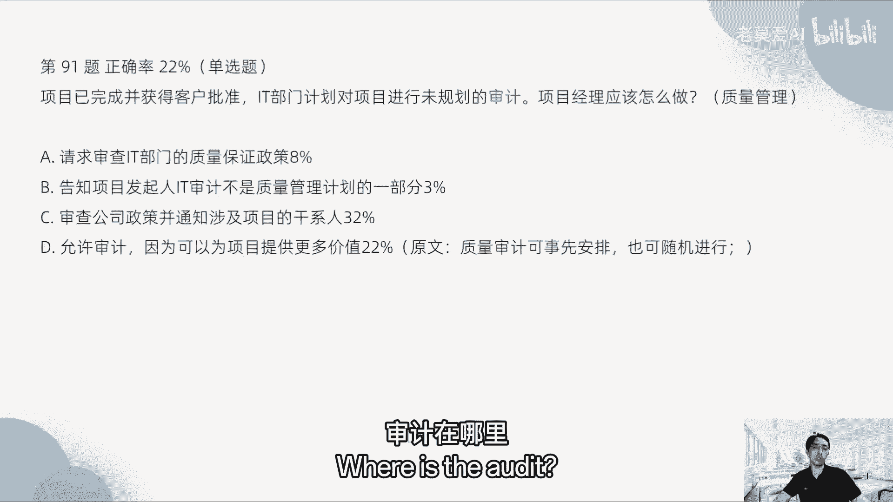

请问审计在我们的质量管理里面对吧，审计一般是其他部门或者第三方的。

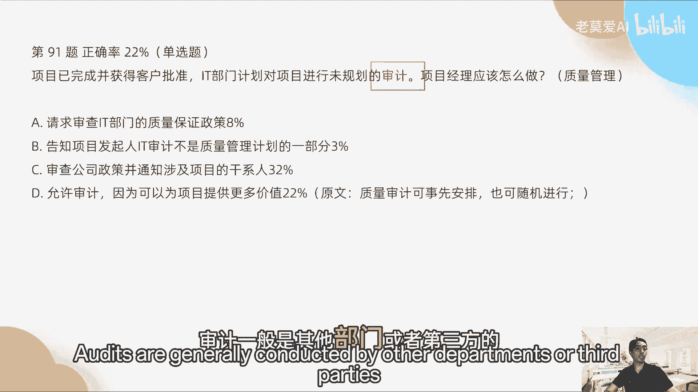

不是我们本身团队的人，那么未规划的审计我们允许怎么样去做，允许审计审计，他可以事先安排，也可以随机的进行，比如说外部审计，我们在做支付项目，我们以前做支付项目做做的比较多，那么支付项目通常有一些什么。

他临时安排的，你要不要给他支付，你不给他检查，你的系统就没法做了，他直接关停你的业务，对不对，那他也可以事先安排，也可以随机进行啊，对不对，因为人行大于一切，所以这个东西就允许啊。

只要他的这个要求是合理的，我们就需要去审计，因为这样也可以提供更多的价值，那这个价值在于什么，我们前面说了，人行的价值在于什么，人行的价值在于它，你不审计他的项目就关网，所以它的价值是最大的。

就你他的这个审计需求，它的价值是最大的，因为如果你没通过或者强行抵抗，你的收益就为零，你说这个价值大不大，对不对，所以正确答案是D，正确答案是D，所以这个里面什么C什么审查公司的策略。

并通知这个项目的干系人，这不对，就有一些审计，他如果是外部审计的，对不对，或者是说他的有一些第三方的政策的时候，他要审计过来，只要是对收益有价值相关的，我们一定要让他去审计，而不是说我们要先卡一下政策。

再通知一下才能够进行审计，这个东西不是这样的啊，检审计现在在全世界都是抓的越来越严了，特特别是在现在的中国。

审计是越来越严的，审计的地位也是逐年上升的好，第98题，一个项目需要在技术部门之间进行详细交流，项目位于不同的位置，一些团队对提供提议的沟通系统没有经验。

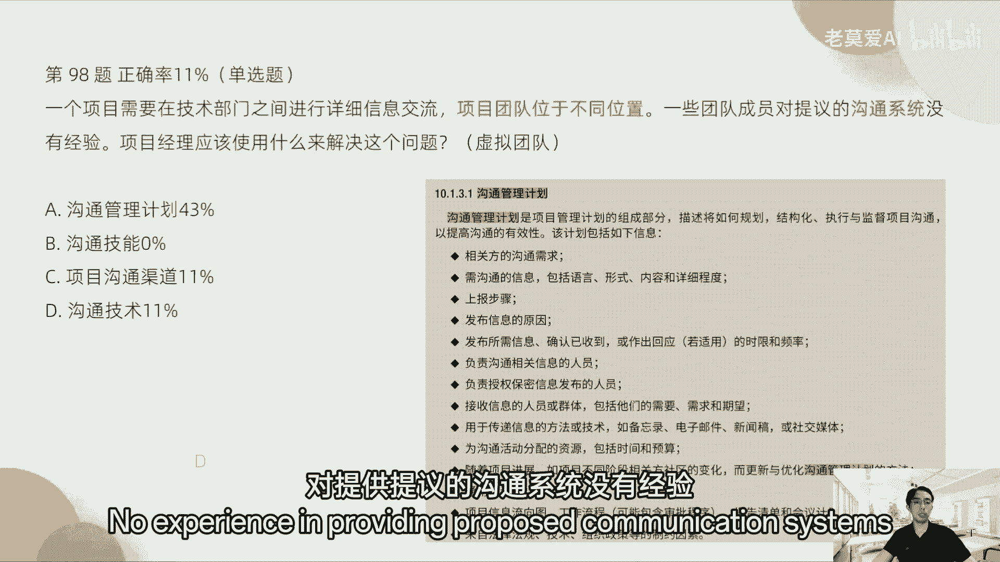

项目经理应该做什么来解决这个问题。

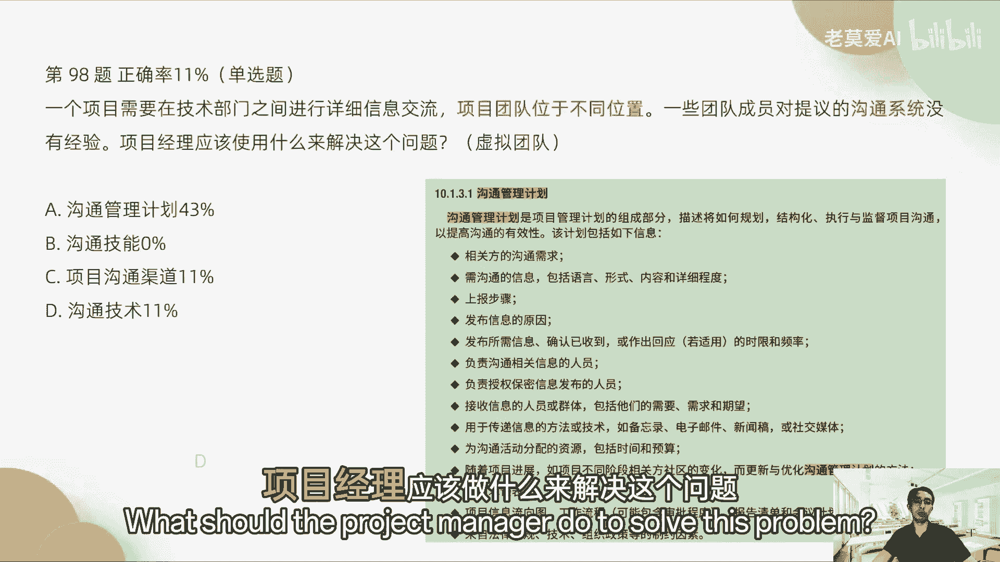

这个考的是什么，虚拟团队为什么项目处于不同的位置，对不对，这一看就是什么，又是沟通，对不对，所以我们考虑到虚拟团队，所以应该用什么来解决这个问题，而应该用动技术。

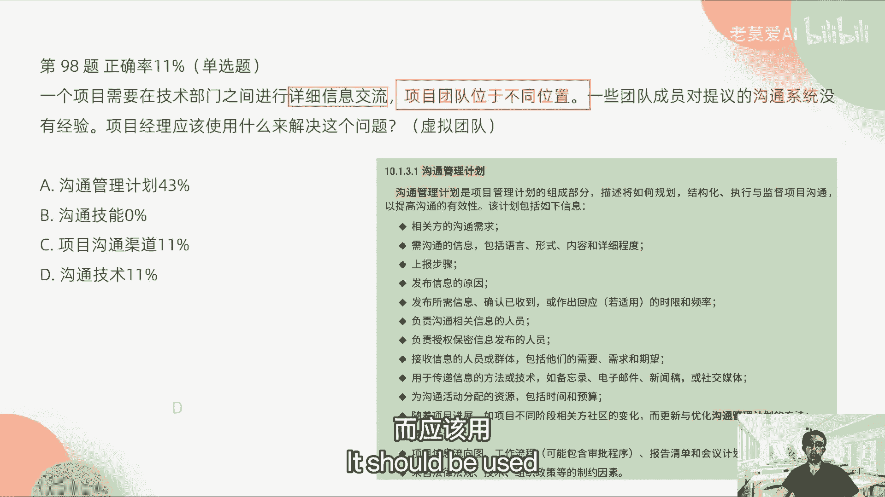

上次有同学在问我，为什么不是沟通管理计划，我们说了沟通管理计划。

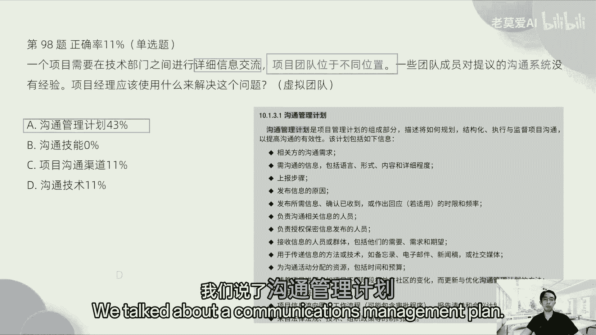

它是一个什么样，它是一个非常概要性的这个计划，提供沟通的有效性，该计划包括相关方的沟通需求，上报步骤等等等等等，这个东西太大了，对于虚拟团队来说，他们并不需要用这么这个大的一个东西。

而是需要用什么沟通的一些技术，沟通技术就是没什么技术，我们到底用什么样的沟通，是面对面的沟通，还是用什么样的沟通。

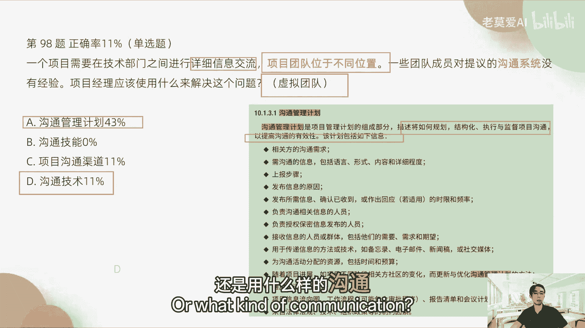

沟通的频率有多少，那这些东西他都是沟通的一些技术层面的东西。

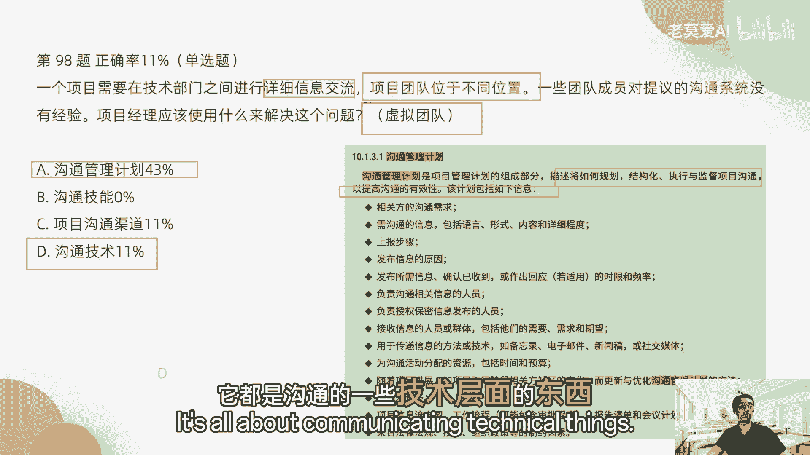

所以这个东西应该用沟通技术来去。

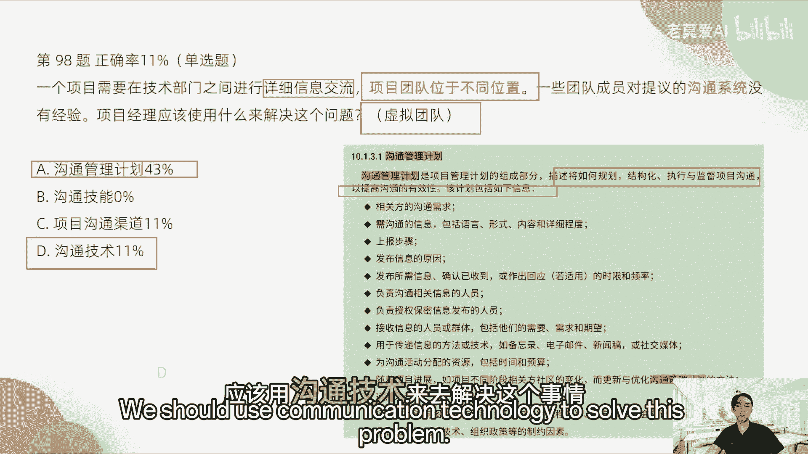

解决这个事情，包括你的沟通系统，那沟通系统它也是一个沟通技术的一部分。

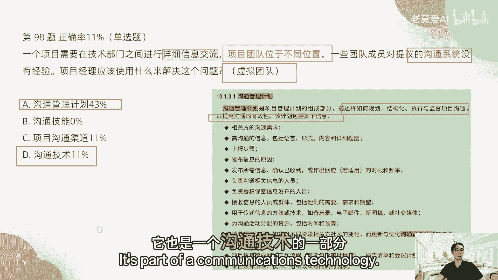

所以正确答案是D好，第107题，项目经理要求团队提供对项目应急计划的，有效性评估，若要完成工作，团队应该做什么，项目应急计划，应急是什么，应对风险是不是，所以这道题目考的是什么，风险管理，风险应对。

对风险管理，再者我们看这个四个选项，我们都知道这个是考的是风险管理，OK有效性评估，有效性评估一般是什么，风险的过程，有效性有效性是过程，那么跟过程有关的是什么，风险审计吗，定性风险分析它风险的是结果。

风险是结果风险的造成的结果，风险再评估它评估的也是结果。

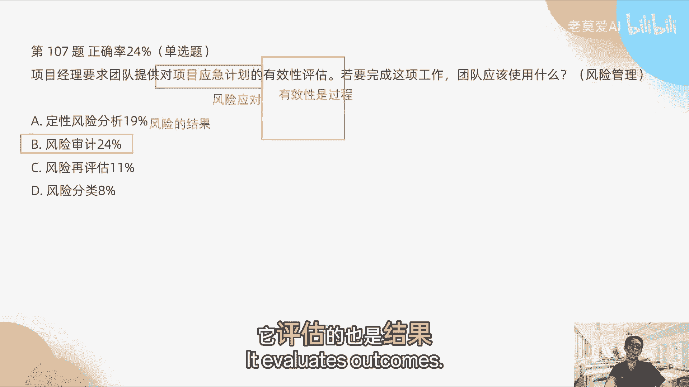

风险的影响也是结果，风险分类证明，明显没有体现到风险分级分类的东西。

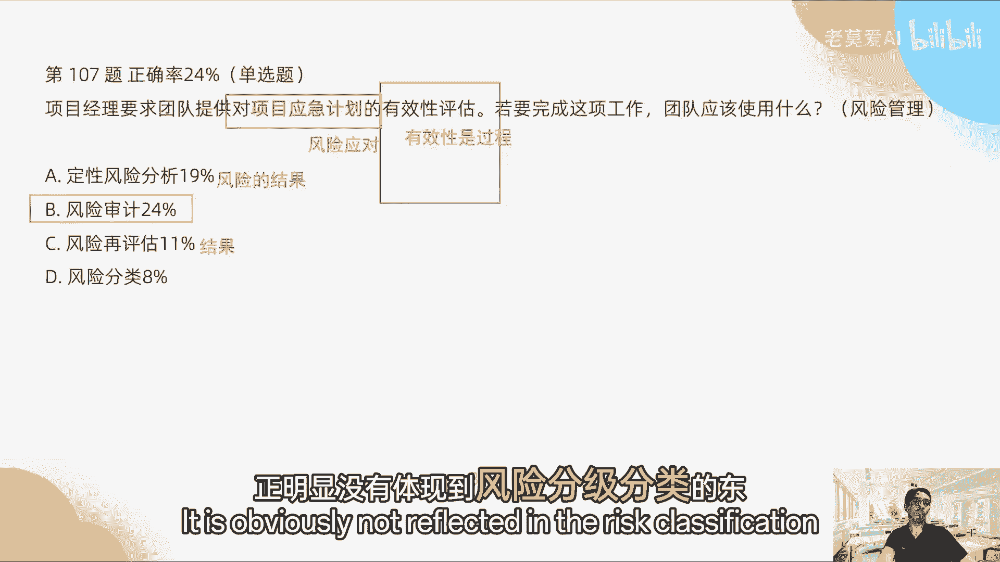

那么正确答案是B，第三题，在项目审查会议期间，发现项目交互物将需要采取纠正措施。

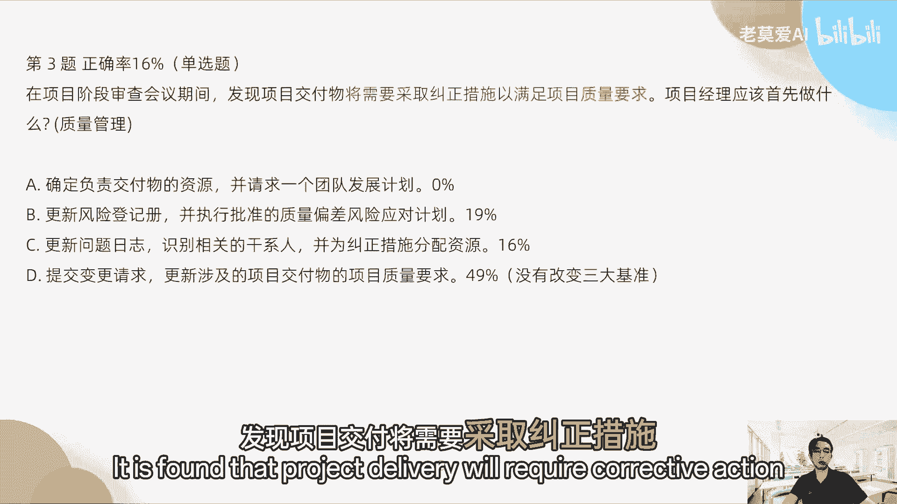

以满足项目的要质量要求，项目经理应该做什么，而这个质量啊满足质量要求，这一看就是质量管理，那么项目交付物你看在项目审计期间，对不对，那我们应该首先满足质量的要求，更新问题日志，识别相关干系人。

并未纠正措施分配资源，这个才是怎么去解决质量问题的一个办法，因为为什么要更新更新项目问题日志，是因为怎么样项目交付物不满足，你把这句话理解一下，发现项目交付物将需要采取措施以满足，说明现在怎么样不满足。

那么不满足它是一个问题还是一个风险，不满足是一个问题，所以要更新问题日志，那么不满足是不满足到某些人，如果要变成满足，我们就应该怎么样分配资源去做这个事情，比如说为什么不满足我，打个比方。

我在审查会之间发现这个手机屏幕有点暗，再怎么也调不亮，说明这个屏幕出现问题，出现问题，我们需要采取一些措施，比如说我们要换一批屏幕，那这是一个风险，是一个问题，这是一个问题，我们要识别这个相关的干系人。

那么换屏幕换要涉及到哪些人，比如说当跟供应商对接的那些干系人，这些人如果要换屏幕，是不是需要分配资源啊，你需要换供应商对接人要要做一些事情嘛，你还要做进行第二轮的供应商筛选嘛，你供应商的这个东西。

你屏幕装好了之后，你需不需要测试人员来测啊，这个事情他需不需要投入分配资源，需不需要，因为你前面测试人员已经测过了呀，那现在换了屏以后，我需要新的测试人员来测，这个也要分配资源才能做啊。

所以这个就是C我们1U要做这个事情。

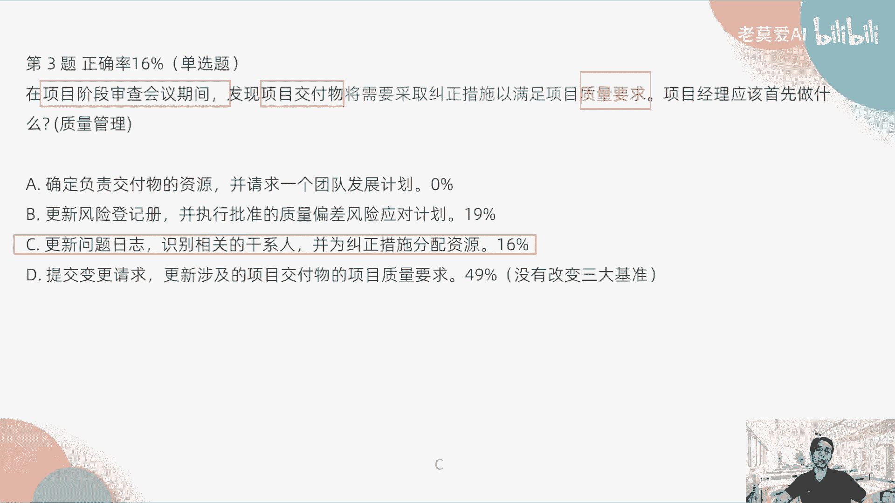