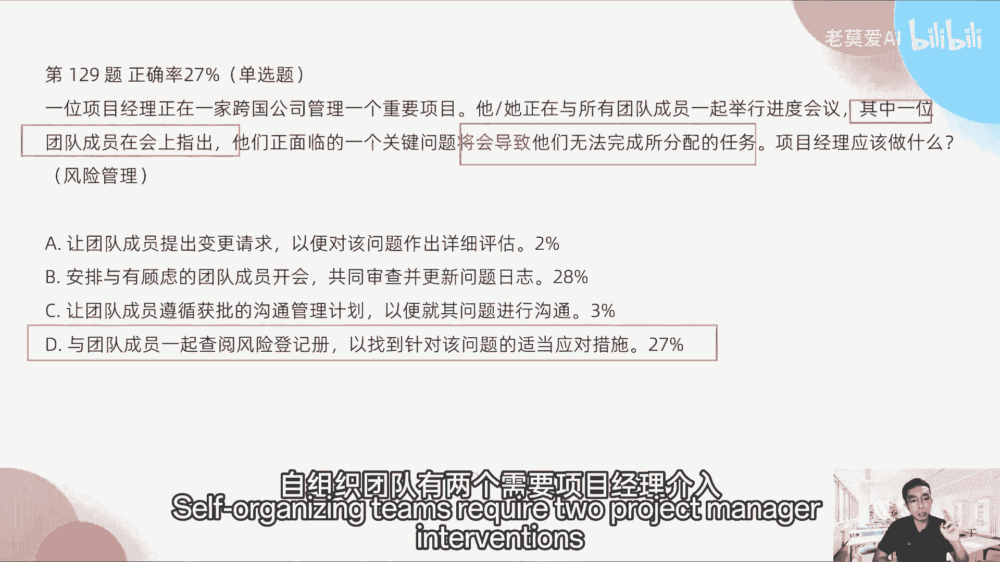

# 【最好的PMP课程】PMP高频错题讲解5-2 - P1 - 老莫爱AI - BV1VusKebEP8

好第141题，一家医疗保险保健公司正在全球部署，创新的医疗保险保健解决方案，项目经理已经完成了，已经发布，干系人对于全球医疗和风险提出了担忧，他担忧的是什么，这其实还是什么事业环境因素。

他担心的是大环境，因为它在全球部署，每个国家，全球部署，也就意味着，每个国家对于医疗的政策是不一样的，有些严一点，你像欧洲标准又很严，有时候包标准又没有这么严，他们就提出了一些担心。

那这个担心其实是什么，这些担心其实就是可行性分析，这不是可行性分析，这个是合规的情况，监管要求每一个欧盟标准什么东西都不一样，所以我们接下来要解决他担心的事情就C啊，其实你们你们可以看啊。

这个东西我们其实考的是哪些东西，医疗和风险，他如果提出来一个这么大的东西的时候，我们一般会考虑到可能是合规的，要求什么东西啊，为什么不是可行性分析啊，我们这全球部署解决方案的可行性分析，也有人去选。

如果我们这个东西它是在启动阶段，我们可能会考虑到可行性分析，但是项目已经完成了有限的发布，说明他已经不是启动阶段了，这个可能要大家还要思考一下阶段的问题。

OK好啊，而且这个里面也没提到风险，所以B我们是不选的啊，149题，在某项目执行期间，一位新的项目经理被指派负责该项目，项目经理意识到新的税收政策，正在使一个成本超支25%的风险。

然后项目经理更新了风险，使得日常操作CEO突然宣布项目可能会被取消，因为可接受成本仅为20%，项目经理一斤，为什么项目经理会一金，是因为成本超支十二十五%的风险，我们都只是放到风险登记册里面。

说明我们的承受能力，我们之前的这样的承受能力，是不止25%的，就是已经超过25%，我们的分手成呈现的承受能力，但是CEO他公布的这个成本超支，CEO能接受的只有20%，这个意味着什么。

就是我们收到的信息，就是我项目经理，我我得到的这个信息跟CEO的信息不一致，也就是说CEO并没有告诉我，这个项目超过20%，他就不做了，他没有提前告诉我，所以说明什么事情，说明沟通出了问题。

这个属于沟通管理的问题，就CEO那边，他明确的知道这个项目超不超过25%，他就不做了，但是他没有告诉我，我不知道，所以百分25%我觉得还可以做，所以这个要怎么样去避免这种情况。

所以我们要怎么样确保这个是一个沟通问题啊，所以我们要更新的就是沟通的这个信息，这一条信息要更新，确保该公司的风险承受能力得到适当更新，所以正确答案是C。

所以沟通问题很多是由于文档更新不及时，信息没有传达到位啊，这个东西出来的，这个是敏，很明显很典型的沟通问题啊，第177题，业务转型有四个阶段的交付计划，项目团队成功完成了项目的一个阶段。

为了进一步提高团队绩效，并授权团队成员，项目经理应该采取哪两项行动，选那两个提高团队的绩效，这个是属于什么资源管理，团队绩效是属于资源管理，所以资源管理的我们应该怎么做呢，第一个是组织分配。

团队上做他们擅长任务的决定，第二个应该支持团队，他专门上层的决定领域作出决定。

也就是说其实提高团队绩效，最主要的就是让团队自己去怎么样做一些决定。

决策，所以正确答案是D1，第176题，沙迪是一个软件实施项目的项目经理。

他所在的公司已经做出了一项全球范围的决定。

要转而使用一个新的会计和人力资源软件包，他了解到一些实施同一软件包的项目。

在试图将人事数据导入新的系统时，造成了数据的丢失，它对数据进行了备份，以备在以便在发生这样的问题时可以恢复数据，但也购买了保险，以支持在实施不成功时手动链入数据的费用，杀敌使用了哪些应对措施。

选择两项啊，我们这个题目考试考虑的是什么，风险的应对措施，因为他已经讲了风险的应对措施，本来有这几个都是123455个，其实都是选择两项，我们在看他做了什么动作，他对数据做了备份。

所以备份是属于什么减轻，为什么备份属于减轻，如果在公司里面，我们使用公司的系统，如果我们是开发人员，我们当然很知道公司一般的系统是什么时候，备份，增量备份一般都是每一天的晚上进行备份。

假设你的公司的系统备份是每天的零点，对吧好，那如果是你零点已经备份完了，凌晨两点，你的这个公司的数据出了问题，系统崩溃以后，备份完了一个什么好处，就可以回滚滚到零点的那个时间，那轨道滚到零点的时间。

那么你的备份，请问零点到两点，中间的这个数据是不是就损失了，对不对，这零点到两点中间的数据其实就查不到了，所以它的风险发现问题以后，他备份并不能够百分之百解决任何的隐患，零点到两点，这样的数据就没了。

那这样的交易数据，你只有手工去还原这个交易数据了，给用户推广什么东西，但你只能做这个东西，所以风险并没有完全消除，所以叫减轻，他也购买了保险，那保险属于什么，保险是等于转移转移，那转移的意思就是什么。

当你出现凌晨到零点到两点，这个东西它损失了这段时间有交易，你给用户的退款，你本来要退款，但是你买了保险啊，也就是说这一段的退款是由保险公司来赔了。

那这个东西就属于别人去赔付，这个事情就要风险转移。

所以BC是对的，他做了这两个动作好，第175题，项目执行阶段，两个团队成员在技术和人际关系层面，与团队内的其他成员发生冲突，项目经理应该首先采取哪两项行动，来解决这两个冲突，好这个选择两个。

这个是属于什么冲突，只要看到冲突，我们就会自然而然的会想到什么资源管理，那资源管理我们要解决的是，怎么样解决冲突的问题，如果这个是什么技术和人际关系，如果是技术方单，就技术方面产生冲突。

我们可以让他自己去解决，但是人际关系方面的东西它属于软技能，这个是没有办法自己去解决的啊，所以我们要干预进来，我们要安排与无法合作的团队单独去会面，第二个是在受影响的团队之间。

直接用直接协作的方式尽早去解决冲突，这两个是对的，可那CAC普队啊，在团队会议上解决冲突，让整个团队参与并找到解决方案，这个因为它的，它本身是一个人际关系上的一个问题对吧，我们让他去上会。

然后大家一起参与，这个会有可能又会遇到这种冲突。

所以这个并不明显，所以正确答案是BD173题，敏捷项目的项目经理，担心最近在在最近的迭代中失去了动力，项目经理应该用哪两种工具来分析团队绩效，那这个东西，我们首先我们看敏捷项目和敏捷项目。

然后迭代中失去了担心，失去了动力，分析团队绩效是用哪个，是用燃起图和燃尽图。

用这两个为什么，因为这两个东西它是发射源，他考的就是发射源，就是我们这个团队，到底我们现在是超前了还是滞后了，这个是代表我们的团队的绩效，用这个来去分析，在敏捷里面是用这两个，很多同学用D为什么D不对。

一完成已完成功能的累计流图。

累计流图是帮我们去发现团队的问题，它是一个结果分析的一个工具啊，就是去优化去做优化用的，所以这个里面他并没有讲到，有关于要做一些优化的动作在里面。

所以不用累积流图，第172题，在一个有不同国家的特定用户的项目完成之后，项目经理的主管询问，用户是否对项目的运作方式感到满意，他应该采取哪些行动满意，其实最重要的这个是属于整合管理。

整合管理就是我们我们在项目结束的时候，我们可能要做的一些事情，那么整合管理们，我们第一个要做的就是什么满意度调查对吧，我们要看满满不满意，就是要发满意度调查，这个是第一个。

第二个是这个获得各国对新流程的哦，不是参照沟通管理计划，对应该是这个参照沟通管理计划，因为这个东西它各个用户是不是感到满意，那么每一个用户他可能满意的，这个程度是不一样的。

然后每一个用户他们的这个这个沟通的方式，什么东西也是不一样的，所以你你这个沟通的问卷调查，问卷调查他就不能够一蹴而就，就是不不能够说哎，我们团队内的和团队外的干系人，我用同一份这个问卷啊，这个是不对的。

所以我们是其实还是要参照沟通管理计划，是给不不同类型的这样的干系人，发送不同类型的这个调查问卷对吧，你对于这个团队的内部的人对吧，他的这个满意度调查，跟你给CEO或者给客户的这样的调查。

肯定是不一样的，对吧好，第169题，在某项目的一个迭代当中。

一项已经规划的活动变得越发复杂，相关工作应在最短时间内交付。

这样的情况应该用什么样的方法，如果这个活动变得很复杂的话，我们其实是用什么跨团队，这个里面去考的是什么跨职能团队，因为我们在是一个敏捷的项目，迭代当中的一个项目，如果最短的时间内交付的话。

如果是一个复杂的项目，所以我们用什么跨职能团队去完成，这个项目就好了。

所以是C166题，某市场团队正在开发思路，改进一个现有产品。

市场主管主动联系项目经理，以确保成功推出产品所必要的措施。

项目经理应该关注什么，这个里面属于什么质量管理的内容，因为他说确保产品成功所需要的措施，那么它不是一个新的产品，它是一个现有的产品，那么现有的产品如果要改善的话对吧，我们就应该评估我们的质量。

那这个质量是什么所需要的措施，这个是结果对吧，那么如果我们要保证结果要好。

那确定并调整，有助于评估产品成功的绩效指标是比较好的。

比如说这个产品的绩效指标，这个这个缺陷率要达到多少对吧。

比如说我们生产一个手机对吧，他的那个缺陷率要达到，签约率不能超过1‰，这个是一个质量指标，所以以这个东西来去衡量，而不是说我们保证制定范围管理计划就可以了。

因为保证制定范围管理计划，只能只能保证我们该做的事情做完了，就像我们WPS，我们可前面说了，我们WPS组一个番茄炒蛋对吧，我们每一个步骤做完了对吧，但是不代表这个步骤每一个步骤做完了。

我煮的番茄炒炒蛋就一定好吃对吧。

所以我们好吃它是一个结果，这倒好好不好吃是一个结果，所以是第163题，一位项目经理正在管理一个项目，该项目非常复杂，执行期很长，虽然该项目大部分是预测性的，但是团队能够使用一个混合框架。

将执行和设计分解成更小的包企业，希望跟踪这个框架应用所带来的价值，但没有为这个框架定义一套可衡量的项目，项目经理应该先做什么，这个是属于整合管理里面的东西啊，就是你，但是关键字说企业。

希望跟踪这个框架所带来的价值对吧，然后这个跟踪价值怎么去跟踪，那么跟踪价值就应该是效，你看它的价值价值是在哪里体现在效益上体现，所以我们要去测量这个效益可以被跟踪，然后在一个监测，有一个人去监测和报告。

他们这个人可能是一个项目经理，可能是一个产品经理去监控它啊，所以最全的这个答案就是CC，而不是工作分解任务的基础上创建一个报告，并进定期更新，因为这个里面他没有C好的情况是什么，它是一个过程。

我们刚才说了工作分解结构，它是一个过程的输出，也就是说我们要打蛋对吧，我们要放油，我们要炒菜，这个东西我们只能保证，如果我们更新这个报告的话，我们只能保证该做的事情我们已经做了对吧，我们西西红柿炒蛋。

我们每一个步骤都已经做完了，但是这个步骤做完以后，他炒出来的蛋是不是好吃，我们是不知道的，因为它不是不是结果，它是一个过程，明白我的意思吧，所以这个C比B更好。

它是一个结果价值，它就是结果，它不是过程，第153题，一个项目团队正在执行。

一个大型团队已经确定了几个合同在计划阶段，然后项目经理。

项目团队统一在项目完成日期前三，前三个月签订合同，在项目执行阶段确定立即签订合同，项目经理应该怎么做，这其实就是属于一项一项变更了，确定了几个合同要求，然后你变更了合同，变更了合同。

这个事情就不是我们整个项目，只要项目知道的事情，而是说需要上报的事情，那么在合同的变更上，这个属于变更管理合同的变更上，怎么样才能上报，就是要走变更流程，找到CCB的成员。

因为CCB的成员都是一些什么发起人呐，公司的领导对吧，那这些变更你关于合同的变更，你能不知会到他吗，你肯定要知会到他，所以请求团队发起变更请求来执行合同。

是这样的，正确答案是B好，第148题，项目经理正努力弄清楚项目环境中，两个项目团队的绩效情况，在工作范围相同的情况下，团队甲计算出的故事点为100个，团队已计算出的故事点125个，哪个团队绩效更加。

我在第三个敏捷串讲的时候，反复跟大家说，在这个整个敏捷的价值交付的框架里面，衡量绩效的一定不是做的事情的多和少，在整个维度里面，其实最能衡量的是工作范围相同的情况下，质量缺陷最少的才是最好的对吧。

那前提是工作范围相同的情况下，这个也可以打比方啊。

就是两个人都在做西红柿炒蛋对吧。

你这个炒炒的蛋最后怎么样，我们每一个人都按步骤走，最后我们要尝试一下这个西红柿炒蛋对吧，做的最差的对吧，炒的味道不行的，被用户投诉最多的对吧，缺陷最少嘛，最少就是我们投诉最少，大家都认为这个好吃。

这个就真的好吃，这个是属于价值交付里面的东西对吧，所以正确答案是D啊，不是说他们计算出来的故事点什么东西多和少，就是工作量多和少，它不体现价值，有些人做了很多事情，但他都没有产生效益对吧，有些人做很好。

很少的事情就已经达到效益了啊，所以哪个团队绩效更佳呢，对不对。

这是答案是第146题，在每一次战会上，有人指出一个障碍，导致一名团队成员无法继续推进工作，项目经理发现该障碍是由一个技术问题造成的，那么项目经理应该怎么样去做，这个是考的是什么自主执行团队啊。

就是障碍怎么去排除对吧，那么正确答案是第一指导团队提出自己的方案，并加到冲刺中，就是你要让他自己，你要去引导他，指导他，然后让他自己提一个解决方案，这个叫自组织，而不是说我们为该团队解决问题。

因为这个问题他是个技术问题，如果他我们前面说了，项目经理什么时候自组织团队，项目经理什么时候开始介入，就是这个问题，他如果是项目管理相关的问题，那你要介入，因为这是你的专业对吧。

好第二个是它影响了三大基准，你要介入了，其他的时候你就让他自己搞就行了，所以它既然是个技术问题，你就让他自己搞就行了，所以这个答案是第一第138题。

某部门正计划开发一个产品，为组织引进一条新的业务线，项目经理应该做什么，来提高项目成功的几率对吧，促进一个产品，促进业务线，那么我们应该做的是什么，应该商业可行性标杆标杆对照对吧。

以确定该主次的这个商业可积金，也就是说这个是一个计划阶段，对不对，计划阶段你计划做一个这个东西，那么启动的时候我们已经记了商业论证对吧，然后在计划的时候，我们依据这个商业论证来做一个这个可行性。

我们要去对照这个可行性是不是可以，OK所以这个问题就在于DD是对的，而不是说重点关注该举措的这个范围啊，这个愿景和使命，这个可以提高产品的成功几率。

但是问题问的是，这个应该做什么来提高项目的成功几率，项目的成功几率不是范围，这个面积和产品，这个是产品的成功几率啊，这个可以这个标识一下，这个是产品的成功几率，这个才是项目的成功几率。

OK好，第136题，A公司的一个项目在最后一个迭代结束前，在既定的范围，进度计划和预算内成功交付，但在项目的庆祝仪式上，其中一位干系人却表示，他们认为该项目非常失败，因为没有增加任何商业价值。

项目经理本应该采取什么措施来避免这种认知，所以这个又会回到一，只要有避免就要回到时光倒流对吧，那时光倒流，那我们应该怎么去做，就是说意思就是一开始我们做什么就好了，所以又回到我们的一开始。

一开始是什么阶段，就是我们的启动阶段，那么启动阶段应该与发起人和关系人一起，确定产品待办事项列表中的优先事务，以便交付商业利益，就一开始的时候对吧。

我们就要去确定这个事情，而不是说我们确定是否定制沟通管理计划，使得干系人认识到项目的成功之处，这不是他他不是说他们没有收到这些信息，而是认为他没有交增加任何商业价值。

所以这个重点是在商业价值里面，所以A不对，第三十一百三十四题，在某项目进行期间，一名初级成员接洽项目经理，寻求风险减轻方面的指导和建议，项目经理应该如何去应对，然后这个里面其实就是我们的敏捷敏捷。

我们的这个叫做仆人式领导是吧，他向你寻求风险减轻方面的指导和建议，这个事事情请问你要不要自组织，那肯定不要自主制，为什么，因为风险减轻方面的指导和建议是你的专长，是你项目管理的专场对吧。

这这个时候你开该出手时还是得出手，那所以我们要提一些指导建议了，去指导，并为该这个成初级成员跟进一些开发的活动，应该是这个，而不是说让别让他再去请教别人，也不是说你从经验教训中找到信息。

也不是说你要去自己去找什么东西的啊，所以C这个东西其实更好一些对吧，他更主动一些，因为这个是你的专业，你在专业上能够帮到他，尽量去帮他好。

第129题，一位项目经理，正在一家跨国公司管理一个重要项目。

他正在与所有的团队成员一起举行进入会议，其中一位团队成员在会上指出，他们正面临的一个关键问题。

将会导致他们无法完成所分配的任务。

项目经理应该做什么好，这里面考的什么，很多人说这考的是一个问题对吧，他不是这种问题啊，将会导致将会导致将会导致说明他是一个风险，所以我们要去按风险管理的方式去回答，与风险管理相关的选项。

就只有第与团队一起查阅风险信息，以便找到该风险的适当的应对措施。

而不是B，很多人答B安排与有顾虑的团员开开会。

共同审查，你看与有与这个有顾虑的同学也就一位对吧。

我跟一位同学去开会有什么意义对吧，那如果要开会也是一起开会。

不是说与一个人开会啊，所以B是错的啊，真假案是D好。

红红问什么时候自组织，什么时候自己出手，他可能刚才刚才已经跳出直播间了。

我再说一下自组织，他有两个时间点，就是有两个需要自需要介入的自组织团队。

有两个需要项目经理介入的。

第一个是他们面临的问题和障碍，是项目管理的问题，而不是技术问题，就说他们问问他的那个问题的障碍，是属于你的专业类的。

所以你要去解决，这个是项目经理经理应该出手的地方。

除此之外，项目经理不要出手，第二个自组织团队遇到的问题，已经影响了三大基准，就是成本超支啊，或者延期对吧，或者范围增加呀，有新的需求啊，这个东西你得出手了，你再不出手，整个项目就保不住了。

所以就这两个条件你要出手，其他的你不要出手，让他们自己搞，除非他们搞不定了，你就出手，如果他说他们反复搞一个问题都搞不定对吧，反复搞了技术问题或者反复出现冲突都没搞定。

那这个时候再找你好，第125题，一位新的项目经理，在一个项目实施中途，被指派无限被指派负责该项目，在首次风险审查会议上，该项目注意到，项目团队成员所用风险管理登记册，风险登记册的版本。

与项目经理所用的风险登记册版本不一不一样，如果版本不一样。

那么我们首先考虑的是沟通问题，沟通问题就是他的这个信息不对称啊。

对不对，这个版本和那个版本都不一样，所以所以所以沟通问题，所以我怎么样去避免这种问题，应该参照公沟通管理计划，就是这个信息不对称，是不是我们沟通管理计划里面就已经说到了。

我们要怎么样输那个这个我们的更新要一致，所以我们要B，就只有这个才是跟沟通管理相关的。

很多同学说验证项目的这个工工建。

验证项目的工件其实也是对的，但是但是你们没有注意到这两个关键字是避免，就这个避免很重要，避免就是时光倒流，验证项目工件不是时光倒流，是版本不一致怎么办，如果他问的是项目经理接下来怎么办。

或者项目经理下一步应该怎么做，这个时候你选D是对的，但是他问的是本应该怎么做去避免，所以D就变得不对了，所以B是对的，避免的意思都是回到刚开始的时候，所以回到刚开始的时候。

一般的如果出现避免都是什么去找找，就是回到就是如果出现避免，一般都是回到启动阶段或者计划阶段，就是他会告诉你说，现在是执行阶段或者收尾阶段做的一些事情，那么如果出现这个问题，我们一开始要做什么。

一开一开始要做什么，无非就是我们计划阶段要怎么样去计划好对吧，我们启动阶段要怎么样去做可行性分析，我们要去分析好这些东西对吧，所以你就往前面那那些阶段去检查就好了对吧，所以B1它是计划阶段的。

然后你说的那个DDD是执行阶段的。

所以正确答案是B好，那今天的这个直播就完了，然后考试的那个注意事项也跟大家说过了，大家注意好就行了，然后除此之外所有的问题的话，我相信你们如果碰到了，遇到了啊，我们直接在群里面沟通，其实就好了。

接下来大家还有什么问题，我可以留几分钟时间，然后大家可以在群里去交流一下，如果接下来没有什么问题，那么我们今天的直播就到此结束，然后我们8月31号考试。

