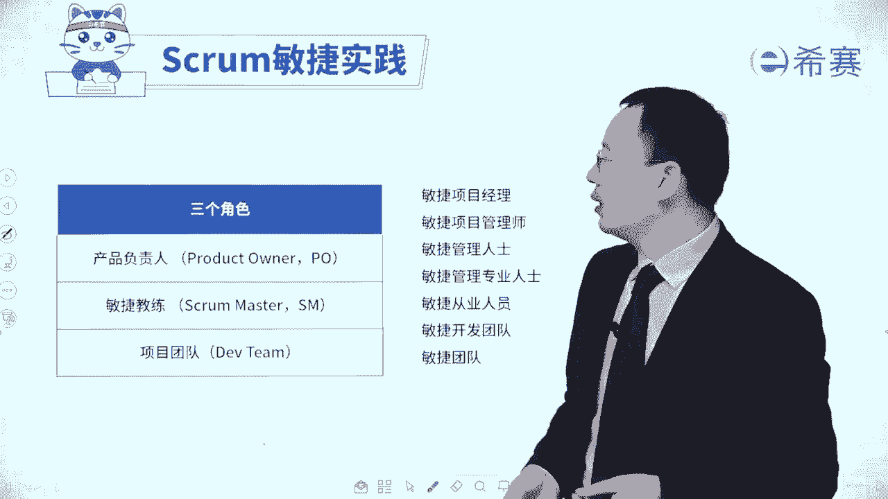
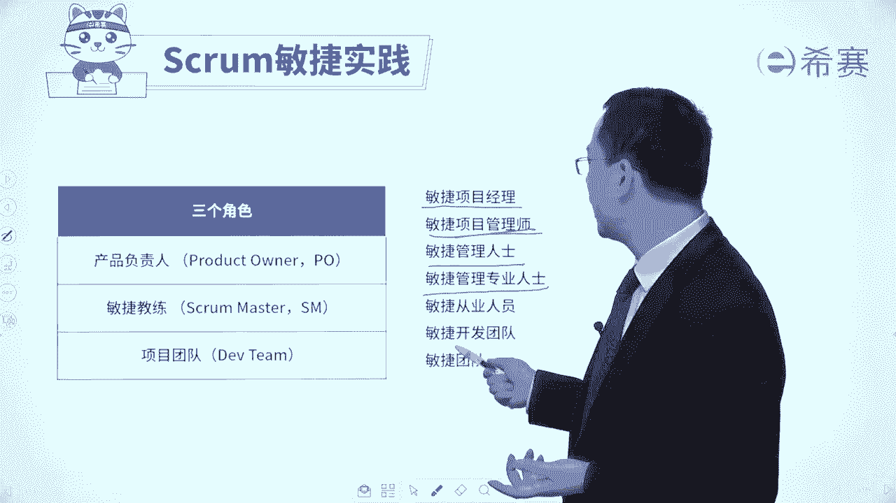

# 【最新零基础】2024年PMP认证考试课程-敏捷项目管理 - P25：25产品负责人ProductOwner - PMP项目管理 - BV11ce6ePEin

大家好，接下来我们一起来分享的是，敏捷SC实践中的三个角色，那这三个角色呢都很重要，考试也考的比较多，所以我们三个角色会分开来讲，首先看到是第一个角色叫产品负责人，叫product owner。

当然第二个角色呢叫敏捷教练screen master，第三个角色是项目的开发团队，或者敏捷开发团队，有的时候呢可能会叫ground team，有的时候呢可能会叫development team啊。

都说的是这个开发团队啊，那其实我们在整个考试过程中。

你可能会遇到一些陌生的名词。

比方说可能叫敏捷项目经理啊，敏捷项目管理专业专业人士啊，敏捷项目管理师啊，敏捷管理专家呀，敏捷项目管理人士啊。

呃等等，这些东西，你都可以把它理解为到这样一个敏捷教练，还有敏捷的从业人员呢，他就是这些都是敏捷的开发团队呀，是这个敏捷团队呢，有的时候你可以把它理解为说是这个development team。

有的时候民集团队如果往大了说，有的时候也会把它包含在这个，所以你要看他的这个意图里面，是把这些个PO包含进来，还是呃和敏捷教练包含进来，还是不包含进来，但一般情形下，我们其实不把它包含进来。

因为产品负责人，他不只是在做这个项目上的事情，他更多的是去提一些需求呀，然后定一些这种完整定义呀，以及包括说去做验收啊，做这些事情为主，但他可以还做别的一些事情，那敏捷教练呢。

更多的是去给团的敏捷做一些支撑，而具体开发工作是团队自己来完成好，我们一起来看一下啊，首先看到第一个角色叫产品负责人，Product owner，这个角色，有的时候呢考试也经常会把它缩写成PO。

那产品负责人这个角色呀，他有几个重要的事情，这里面给大家体验了三个关键词，一个关键词叫代言人，他是谁的代言人呢，他是客户的代言人，他不是客户，他是你们自己团队内部的，但他是能够代表客户的。

客户说哪些需求要加进来，他加进来客户说哪些需求更重要，他就把他的优先级抬高，客户觉得说那个什么样才才算是验收通过，那么他就是对应的桌，那什么叫验收通过，所以他是一个客户的代言人，他能够去替客户说话的。

当然了，如果说客户自己本身在，那么就是啊他就可以直接让客户来说话，如果客户不在，他就去代表客户，这是第一个，第二个词呢叫掌舵者，掌舵者，也就是我们整个这一个敏捷团队要做什么东西。

又或者说是这一轮迭代我们要做什么东西，都是由他来说了算，第三个呢叫验收者，就是这一轮迭代做完的结果，到底是验收通过还是不通过呢，也是由他来说了算，我们来看一下仔细的内内容啊，首先第一条产品负责人PO。

他要去负责指导产品的开发方向，也就是接下来重点是什么啊，其次才是什么，然后再是什么，那么这个整体的这个思路，方向节奏由谁来去把控呢，由PO来去把控，第二个，那产品复诊呢。

它是根据商业价值来对任务进行排序，什么叫对任务进行排序呢，我们开始简单过了一眼对吧，说有一个词呢叫那个product ballog，叫产品的待办事项列表，那那个产品待办事项列表。

你可以把它简单理解为是一个需求池，需求池里面有那么多需求，到底哪一些重要，哪些不重要，谁来去定呢，由PO来定，他怎么定的呢，它根据这些东西的商业价值来定，哪些东西极其有价值，优先放在前面一些。

然后再后这样的一种方式来去放，产品负责人，他会跟团队来去开展一些日常的合作，提供一些产品反馈，包括说日常的时候可以给反馈，以及在验收的时候可以给反馈，为开发东西设定方向，以及为开发下一个功能来设定方向。

也就是说本轮迭代要做什么东西，他说了算，我们在这一轮迭代快要结束的时候说啊，下一轮我们重点要做什么东西，也是由他来去提出，它是代表客户的好，第三个就是产品负责人，他可以会会跟各路神仙来合作。

来去定义产品开发的方向，所以其实有些时候呢，并不是说他自己他说什么就是什么，他也会需要去借助一些外力，他能够去跟客户啊，跟相关方呢以及跟团队意见来讨论交流，来去确定这个方向，而整个在敏捷过程中。

他们讨论了以后，确定要做什么事情以后呢，他会负责来去创建代班列表，OK创建整个产品代办事项列表，以及迭代代班列表这些东西，当然他不是自己一个人做，它一般来讲是跟团队一起来做。

就跟团队来去共同创建建一个代班列表，那代办列表中就列出了我们要做什么东西，不做什么东西，累计放在前面，累计放到后面，就是按照价值来排序，怎么样做才能够交付更多的价值，并且呢它还会列出来这些个要做的东西。

也就是我们所谓的这样一个需求，需求池里面的这样一些需求，这些用户故事他怎么样做才能够达到标准呢，这个标准也是由他和团队一起来共同定义，所以是他来负责确定产品的功能和要求，他的这个标准。

还有就是什么东西要加进来，什么东西应该要减出去，什么东西要优先往前面排，什么东西要往后面乘，这东西也是由他说了算，所以它PO它来去维护这个产品待办列表，他的话语权比较重，他来去指定一下我们要做东西。

要交付的内容，以及他能去接受这个结果或者拒绝这个结果，所以就是验收，所以你会发现它是能够去代表客户来去确定，哪些东西要做，哪些东西不做，他能够去对整个内容来去进行把关，本轮以及下一轮他是作为一个掌舵者。

以及他就是要对结果来进行验收，接受或者拒绝验收，那么什么样的人才能够去做这个PO呢，呃我们来去简单认识一下，一般来讲他的要求是，首先他应该是要具备相关的这些工作背景，他能够去懂得这些专业知识，行业知识。

这是基础，其次呢它应该是能够比较强，对很多东西有一些商业的嗅觉，商业的敏觉就是不仅仅只是说要去做哪些事情，他还知道哪些事情更重要，而价值更大，这样的话他才能够去充当这个事情，但是呢有的时候呢。

他并不是所有的东西都亲力亲为，他也可以去借助别人的帮助，比方说他可以去找一些专业的架构师啊，呃找一些专业的这样一些产品经理啊，或者是找一些专门这样一些专家来去支撑啊，都是可以的。

那你可以看到他来去对接客户，来去获取客户的需求，同时他要做客户的代言人，说哪些东西放在这里，哪些东西放在这里，这里这里这里啊，按顺序来排，他来去负责去创建这个产品待办事项列表。

以及跟团队成员一起来去创建这个迭代列表，来去定向哪哪些要做，还有就是这些要做的东西，他的那个验收的标准准则是什么，也是由他来算了算，最后我们在做一个迭代评审会议的时候，团队完成的东西累一些可以通过验收。

哪一些不行，也是由他来去负责来说了算，那呃对于考试呢有这样一些点你需要了解一下，首先第一个他要去对接发起人来去收集需求，搞定发起人，那如果说是在题干中会涉及到，有客户发前提了一些新的需求功能等等。

由谁来对接呢，应该是由产品负责人PO他来负责进行对接好，第二个呢他的职责应该是聚焦于产品本身，如果说他的职责是说啊，这个功能该怎么做呀，就是那讲细节具体的，那么这个其实是有问题的。

因为永远都要有人对整体内容来进行把关，有人负责去做一些微观的具体的细节的事情，而PO他就是那个对整个大内容来进行把关的，所以它是对整个东西来进行掌舵，而不要去聚焦于某一个细节的内容，那但凡是涉及到说。

他没有关注在了一个产品本身上面，而是在关注一些其他的事情上面的时候呢，那敏捷教练就需要去给他做一个提醒，然后把它给掰正回来，是这样的一个逻辑，好如还有就是他要去创建产品待办事项列表，它可以是自己来创建。

也可是借助团队的力量，跟团队一起来共同创建，这是他要做的事情，并且它对于产品待办事项列表中的这些个内容，会来进行排序，他排序的资格比谁都大，他的那个排序的资格是最大的，高于团队成员以及高于一些主题专家。

当然它是基于什么排序的呢，它是基于商业价值来对这些任务，对这些用户故事，对这些需求进行排序的，所以如果说题干涉及到关于对于需求的优先级，排序啊，高低呀，谁来做呢，由PO来去负责好。

还有就是他会去根据一些具体情况，说要去加薪的需求进来捋清楚一些需求，对需求进行变更进行排序，这都是由PO来说了算啊，最后还有一条就是他要去参与到整个项目，以及对于已经完成这个部分，是由他来进行确认的。

是由PO来进行确认，所以谁才有资格说这个东西是做好呢，做完成的呢，PO啊由产品负责人product owner这个角色，他才有资格，所以如果题干中有出现说啊，谁说是那个什么标准不合格呀，不接受呀。

啊验收有问题呀什么之类的，那么理论上来讲，应该是PO和团队一起来去定义，这个完成的定义叫definition of done d o d，并且呢最后的验收是谁来负责验收呢，如果说客户在，当然是客户验收。

如果客户不在，就是由PO来去负责验收啊，所以整个关于产品负责人，proproduct owner这个角色，他有三个关键词，你记住了吗，一个是代言人，他是客户的代言人，他来去收集客户的需求，对接客户。

然后去把那些客户的东西放进来啊，第二个呢他是掌舵者，他来确定要做什么东西，整个产品待办事项列表中有什么东西，按照什么优先级来进行排序，这一轮迭代我们要做什么，下一轮迭代又要做什么，是掌舵者。

第三个他是一个验收者，这是对于最后做完的结果来进行验收，是谁说了算呢，如果有客户在，就客户说了算，如果客户不在呢，那就由PO来说了算好，我们看了这么多以后，接下来我们来去做一些关于PO的题目。

通过题目来去帮你巩固一下。