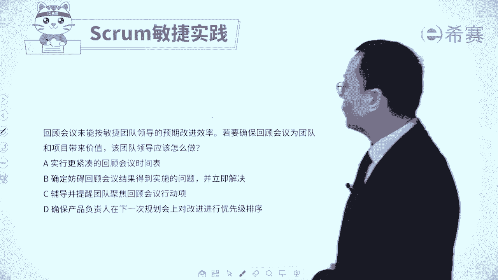
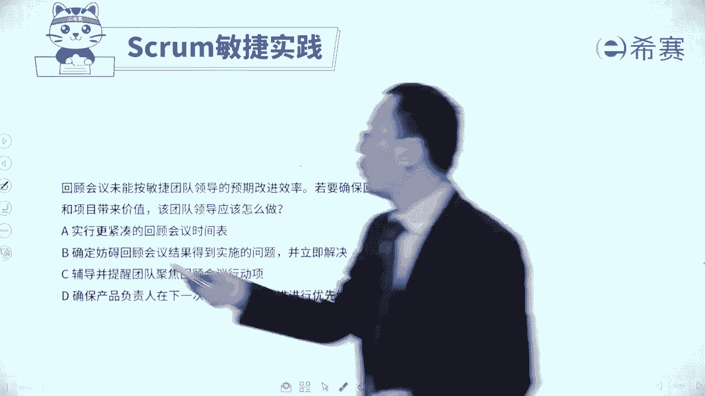
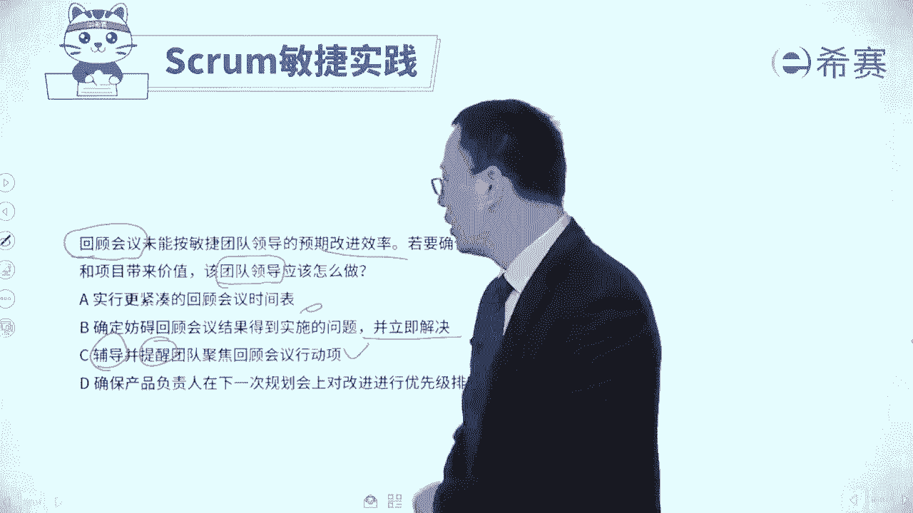
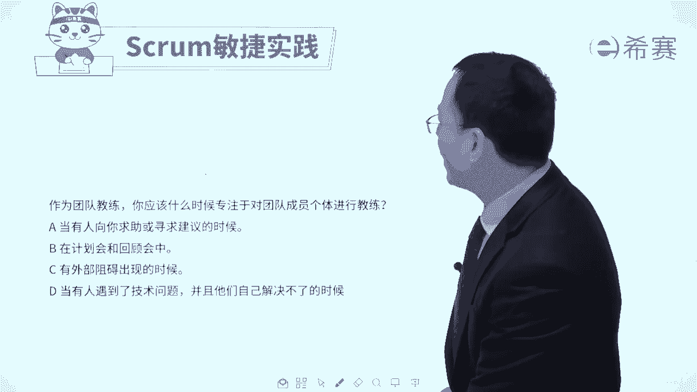
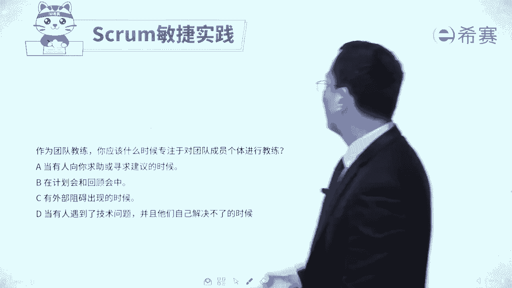
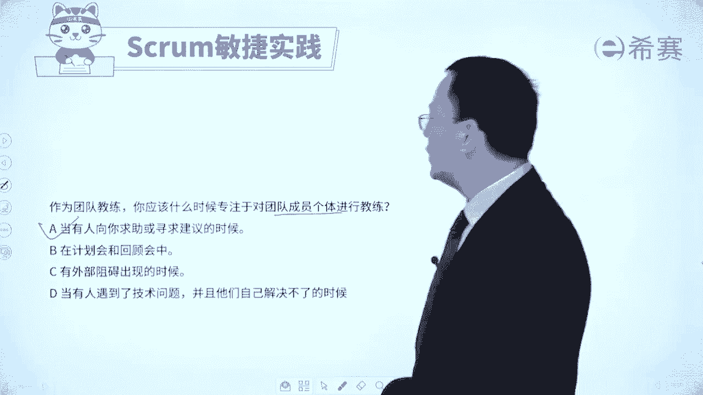
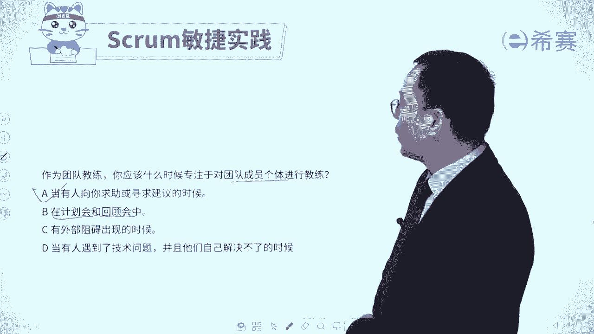
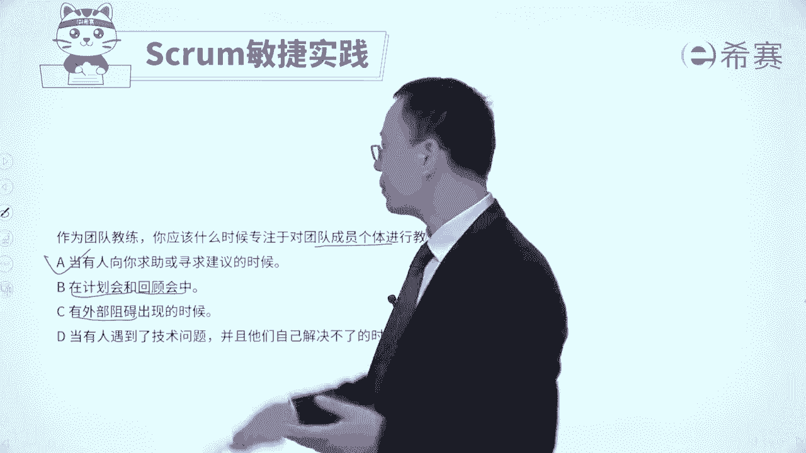
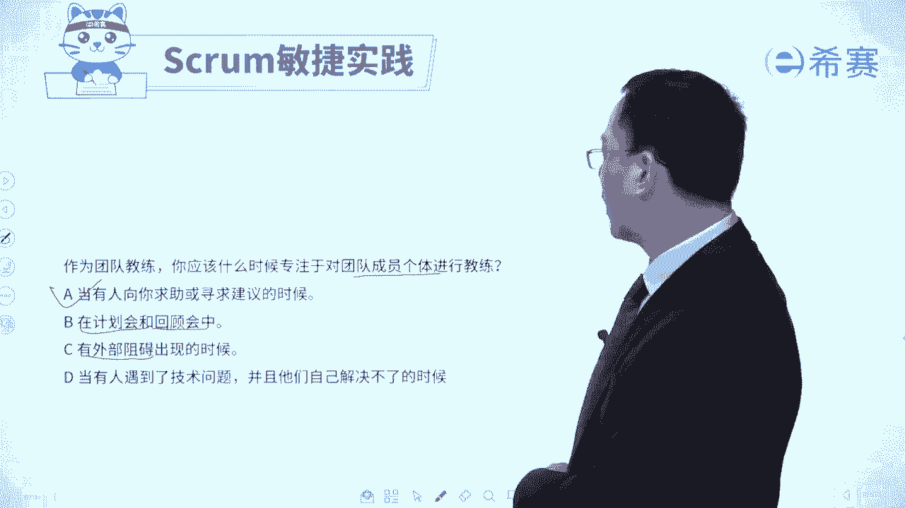
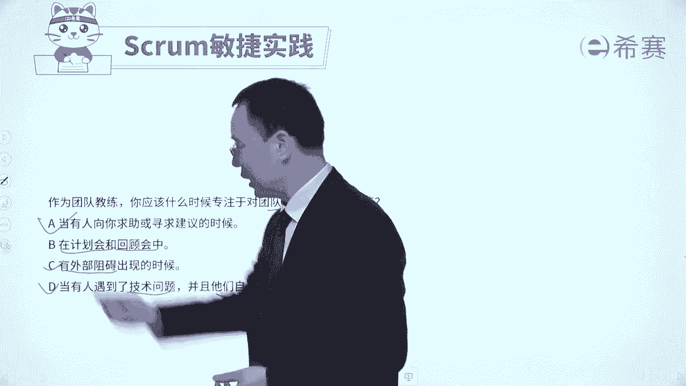

# 【最新零基础】2024年PMP认证考试课程-敏捷项目管理 - P28：28敏捷教练习题讲解 - PMP项目管理 - BV11ce6ePEin

大家好，我们刚刚已经是看过了关于敏捷教练，普洱市领导他的这样一些个信息内容，我们还给了三个词汇，还记得吗，一个呢是催化剂，一个呢是老母鸡，一个呢是味道者好，接下来我们会通过几道题目来去巩固一下。

关于这个角色的内容，我们先来看到一道这样的题目，说作为敏捷团队的一员，你发现敏捷项目的管理专业人士，和以往的领导风格是不太一样的，他并没有很强制的作出决定，而是支持团队讨论，为团队提供指导。

同时呢用信息发射源，信息发射源这个词解释一下，其实就是说啊有一个公共区间，基于这个公共区间，大家都可以看到某一些信息的，这样一个进展情况，能够让沟通更加透明啊，那么它同时会用信息发射源来公开。

项目的进展情况，让团队不需要经常性的去汇报项目的状态报告，当团队遇到障碍的时候呢，他也会帮团队去清除，那么敏捷项目领导他正在做什么呢，他正在做什么呀，哈这不就是普认识领导吗，对吧。

那你看一下选项A遵循参与式决策，这个焦点其实还不是在参与式决策，虽然说在敏捷中确实会提倡参与式决策，但他的焦点不是参与式决策，而是一个仆人式领导啊，好选项B，采用接受反馈的做法来去促进团队改进。

也不是啊，他没有说关于你们做了什么东西，然后有什么反馈，然后去如何，他就是能够去呃帮大家去辅助大家，去支撑大家，它相当于一个资源库，一个资源池，你什么时候需要你就来找我呀，我就来帮你呀，那我去引导你呀。

而不是我替你来去，怎么样啊，C选项实行与敏捷团队合作的，这种仆人式领导风格，刚好就符合，那么如果你对于仆人式领导你不太懂的话，你刚好可以看一下，他不去直接指那个不去直接去做决定，而是支持团队讨论。

为团队提供一些指导啊，支持团队讨论，然后呢还会去同步一些公开一些项目的信息，而不需要经常做一些什么什么汇报，当谈论有障碍的时候，帮人谈论去清除障碍，这就是普人士领导的风格，OK刚好就是最后一个选项。

建立一个互相互协作的团队工作文化啊，相互协作，谈论文化呢，他只是仆人式领导，需要去营造的之一，并不完整，所以C选项会更完整，这就是仆人式领导，OK所以我们要知道一下。

整个在敏捷中这个敏捷项目管理专业人士，也就是敏捷教练啊，他就是做普文市领导，他的角色定位就是普任市领导去服务大家，去提供支持，去帮助，大家好，我们再来看一个题目。

回顾会议，未能够按敏捷团队领导的预期来改进效率，若要确保回顾会议为团队和项目带来价值，那么该团队的领导应该怎么做，请注意我们稍微了解一下啊，就回顾会议呢。

我们目前还没讲到，你得要知道，就通过回顾会议，我们会说啊，这一轮迭代我们哪期做的比较好，哪一些做的不太好，我们在下一轮呢，我们应该怎么样去改进它，优化它，让它变得更好，给的是这么一回事，然后理论上来讲。

在下一轮迭代中，就尽量去按照这些要求来去做事情，那我们来看一下几个选项，A选项呢实行更紧凑的回顾，会议的这样一个时间表，这种方式，也就是说我原来可能是四个礼拜做一次回顾，现在两个礼拜做一次回顾。

您说有没有像在一定程度上也是有效的，也是有效的，但是它更强调是什么，他说我们的这一回顾会议也开了，却没有达到预期，大概率事件，不仅仅是说这个时间的维度，更重要的是我们可能没有去落实。

没有去落实那些具体的行动项，所以呢也许大概率事件有比它更好的选项啊，好第二个，确定妨碍回顾会议结果得到实施的这个问题，并立即去解决啊，请注意我们是直接帮大家去立即解决吗，你知你要知道啊，你在这里你是谁。

你是一个团队领导，团队领导呢叫敏捷教练，敏捷教练更多的时候是去做一个促进者，而不是直接替他来去搞定的这么一个情形好，第三个选项，辅助并提醒团队聚焦在回顾会议的行动项上面，这就是你看辅助他提醒他。

刚好就是符合你的这样一个促进者的角色，对不对，你要去做一个促进者，而不是直接去练一个啥，所以你是一个催化剂，所以它就是对的啊，最后一个选项，确保产品负责人在下一次的规划会议上，对改进进行优化排序。

请注意。

关于这些改进呢，更多的是团队的事情，产品负责人他更多是定方向，定目标，而具体如何去做，如何去落实，是团队去做的事情，所以你不会让他来去定这些呃，如何改进改进的东西，他只会说诶。

下一轮我们重点去做哪些功能啊，做哪些性能满足什么样的要求，关注这个点，所以呢这道题目答案是选C选项，敏捷教练，你这个团队领导，你更多的是要去辅导团队成员，去提醒团队成员，你更多的是促进。

而不是直接去替他做决定，你是去影响他，提醒他啊，问询他，用这种方式好，我们再看一个题目，作为团队教练。

你应该什么时候，专注于对团队成员个体进行教练，什么时候对团队成员个体进行教练呢。

我们来看一下四个选项，选项A当有人向你求助或是寻求建议的时候。

那么这个时候你是义务义不容辞啊，一定要帮他的啊，好第二个在计划会议和回顾会议中，计划会议呢由PO来去做决策。

然后在这个迭代回顾会议呢，是团队自己也可以完成，但你要去在场，第三个选项，有外部的阻碍出现的时候。

有外部阻碍出现的时候，理论上来讲，团队成员应该先去自己来去解决，去消化，然后实在是消化不了的时候，你才去帮他。

那最后一个选项，当有人遇到了技术问题的时候，并且呢他们自己也解决不了的时候。

那他遇到技术问题解决不了的话，应该是要去寻求支持和帮助，所以这个时候呢你确实是可以去出手，所以这个你也可以出手，这个你也可以出手。

但是更合适，包括说这个理理论上来讲也是可以去出手。

但是什么时候上你最应该出手呢，一定是第一个就是A选项中，当有人向你求助的时候，这是你最应该出手的时候，呃其次才是别的时候，因为当外部遇到这样的时候呢，他可以优先先自己想办法去解决，看能不能解决掉对吧。

当有人遇到了一些技术问题的时候呢，技术方面的问题，那他理论上来你可以去找找技术专家呀，或者什么什么之类的啊，或者说是他们团队内部，有没有人刚好懂这些东西，如果说实在不行，你再去帮他来去物色，去找寻。

这是可以的，所以团队的那个敏捷教练，他在什么时候该出手时就出手呢，最好的方式就是当有人向你去求助的时候，当然除了这个时候呢，别的时候你其实也是可以出售的啊，也是可以出售的，但是我们要知道就是对于选择题。

你一定要选那个板板上钉钉的，铁板一块的那个好，我们再来看一个题目，敏捷团队呢，他会去负责一款智能手机的研发项目，在第三次迭代中，一名开发人员由于使用了新的技术，那导致了另一名开发人员的工作。

出现了一些问题，由此就产生了冲突，开发人员经过努力还是无法独自解决冲突，当他无法独自解决冲突的时候，你该怎么办呢，哎这个时候是你该要去出商的时候，该要去帮他们去一起来化解这个矛盾的时候，对不对。

那你看一下选项A要求产品复制人来去帮他，唉没他什么事啊，产品负责人是定方向定基调的，而他是那个把把舵总舵主，选项B和开发人员沟通，并协助他们来解决问题，哎这个一看就是非常好的，对不对，这是合适的啊。

第三个选项利用职权来进行干涉，并且呢对冲突进行影响评估，你要去直接干涉吗，就是这个干涉，这个时候就是我直接去替他解决对吧，不合适啊，我们在整个敏捷中不是直接替别人去解决问题。

而是去引导支持他们去解决问题，好最后一个选项举行团队会议来讨论这个问题，并重新来去构建沟通的规则，这个很显然我们说一般情况下，当如果一个冲突，它导致一种破坏性的时候，团团队成员没有办法去解决的时候。

你应该是要去出手的，而这种团队来去举行会议来讨论，是把这个问题去扩大的这种方式，这种扩大方式它慰藉的是一个好的方式，所以呢答案是选第二个选项，就是当你被求助的时候。

当团队成员不按敏捷的方式来做事情的时候，你都要去帮忙，还有就是团队成员他的冲突解决不了的时候，你都要去上手，却要去帮忙，也包括说团队成员他不会用敏捷工具的时候，你也要去上手去帮忙，所以答案是选第二个。

你要去跟团队成员去沟通，去交流，去协助他们来去解决这个问题，我们再来看一个题目，一个团的成员向士官的教练的抱怨，他们的经理每个星期请注意哦，是每个星期都要开好几次会议，然后提供一些更新的一些情况。

但是呢那些更新呢与他们的项目是没有关系，项目团队成员是很不满，因为呢这些中断会导致他们的工作慢下来，纳米尼教练应该怎么办，首先你看完这些信息，你就知道哦，这原来是对于团队成员来讲是一种障碍。

既然是一种障碍的话呢，你作为一个敏捷教练，你应该是要帮他们去清除障碍，你是一个老母鸡，你怎么样帮他清除障碍呢，有一句话叫任何怀疑顾虑，第一时间与第一人沟通，那么这个东西的源头在哪里。

你去找源头来解决会更好一些，A选项授权团的成员可以不参加，关键是你授权了以后，他的那个项目经理，他那个职能经理会就同意了吗，不一定吧，所以这个方式通常是解决不了问题的啊，选项B向产品负责人来提出问题。

请注意，产品负责人更多是对于整个这个产品来去把关，对于方向来去把舵，他作为客户的代言人，他对于结果进行验收，但是具体这些团队这些细节的开发的事情，他是不会去具体干涉的，好选项。

C准备一个报告来说明这些会议对工作的影响，这个是干什么，这是要把这个问题扩大扩散，然后让大领导们重视起来，那很显然不适合你，对不对，好最后一个找一下这位经理来去讨论，有有没有其他的方法。

能够不中断团队成员的工作啊，也能够去达到他自己的这个会议的效果的，那这才是一个好的方式，这才是你在帮团的成员去清除障碍，所以呢答案是选最后一个选项，敏捷教练，你的重要角色之一就是帮团的去负责清除障碍。

包括各种障碍，包括一些跨职能部门的这些会议呀，一些行政会议呀，也包括说啊让你准备很多文档，哪一些冗长的过程，哪一些经常打扰你呀，哎都算，但凡是团队成员觉得被打扰，那就是打扰啊。

这个时候你就要去负起这个责任，帮他去清除障碍，就是这个逻辑好，我们再来看一下最后一道题目，敏捷团队最近接到了一项政府部门的开发工作，经过接触项目的负责人，发现这个项目呢他的需求变动很多。

而且呢范围不明确，那需求变动又很多，范围又不明确，说明什么，说明应该是用敏捷的方式来做事情，对吧好，因此团队讨论决定使用敏捷的方式来开发，公司，为其匹配了一位敏捷教练，面对这个没有敏捷经验和敏捷知识。

培训的这样一个团队应该怎么做，请注意，他特别告诉你，没有敏捷经验，没有敏捷知识的团队，那你当然就是教他呀，去培训他呀，让他会呀，对不对，所以你要让它会起来啊，你要作为一个那个垫脚石，你要去帮他搞起来。

A选项为团队成员去确定，并且去实施，最具有成本效益的这样一个敏捷培训，而这个好像看上去是可以的，对不对，好像是可以的，好B选项申请一个变更请求，为团队成员进行敏捷培训，呃既然本身是敏捷的话。

它其实就应该包含进来，就犯不着说是做一个变更请求的方式啊，C选项，确保项目的应急储备，可以覆盖所有的这一个成员的一个敏捷培训，也就是说这是意外的情况，你为什么把它作为一个意外的情况呢。

他目前不具备这个能力，你就应该是把它包含进来，所以这种把它作为一个意外情况，这肯定是错误的啊，好最后一个，为关键的团队成员安排虚拟的培训课程，来涵盖这样一个敏捷，用虚拟培训的方式。

就比方说此时此刻罗老师在给你做培训的时候，我们就是一种虚拟的培训对吧，罗老师在湖南长沙，在中关，在中电软件园，在这里去，在一个直播间里面，一个演播厅里面去讲课，嗯哼呵。

那这种效果肯定是不及我来到你的身边，然后在你们公司给你们去培训讲课，效果更好一些，所以能够线下的面对面的方式，就不要用这种方式，所以这样看下来的话呢，你会发现只有A是可以选的。

也就是当团队成员没有经验的时候，我们应该应该给他去提供培训，当然只是刚好这几个选项虽然都是培训，但一个是说用变更请求的方式，一个是用应急储备的方式，这都不合适，还有呢是虚拟培训的方式都不合适。

所以敏捷教练你应该是为他们的贡献去铺路，你给他提供帮助，提供支持，那我们通过这样的六道题目，是不是又巩固了一下关于敏捷教练，SCREMASTER这个角色的认知呢，还记得吗，那三个词汇，一个词呢叫催化剂。

一个词呢叫老母鸡，还有一个词呢叫卫道者，你要去了解一下，敏捷教练是能去帮助团队一起来，去把这个事情往前推进的，他不直接替大家做决定，而是去引导提醒鼓励的这种方式，来去辅助团队做好这样一些事情。

并且呢帮团队去清除障碍，尤其是当团队有需求的时候，你一定要去帮他来去解决一些问题，还有就是单团的，没有好好的用敏捷的方式来做事情的时候，那么你也要去提醒他，让他用敏捷的方式来去做事情。

这就是关于敏捷教练的这一个内容。