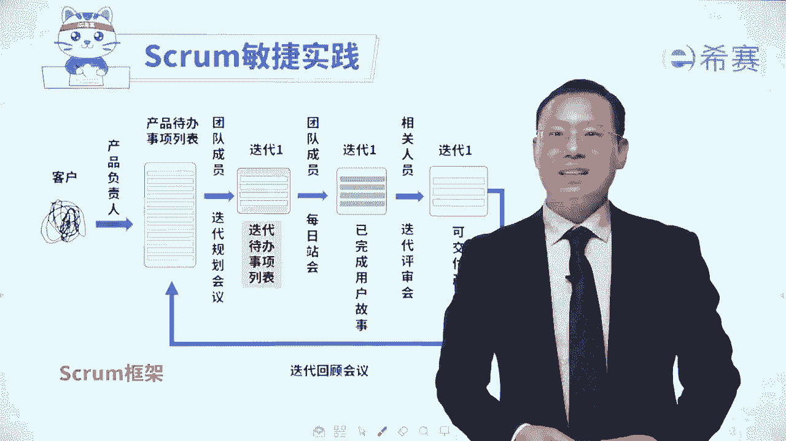
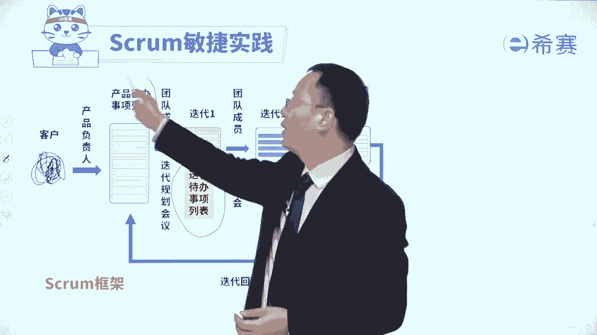
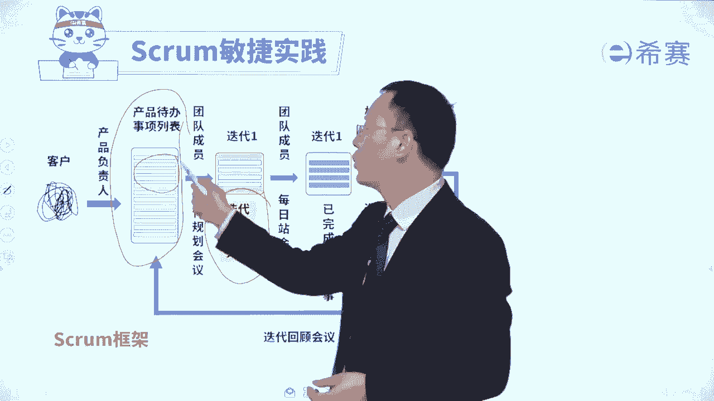

# 【最新零基础】2024年PMP认证考试课程-敏捷项目管理 - P33：33迭代待办事项列表SprintBacklog - PMP项目管理 - BV11ce6ePEin

大家好，接下来我们一起来继续分享的是是gram，敏捷实践中三个工界面的，第二个叫迭代待办事项列表，那迭代代办事项列表，你通过这张图大概能够看出来，我们是会把整个产品代办事项列表。

长长的这么一些内容，会拎出最顶上那些还没有做的一部分拎过来。

作为这一轮迭代所要做的事情，它会是通过这样一个迭代规划会议，来产生迭代待办列表，那本轮迭代呢就是要去完成这个迭代代办事项，列表中的这样一些具体内容，我们来具体看一下。

首先整个迭代代办事项列表叫spring blog，那它呢是定义了这一轮迭代的这个基本目标，能够去明确我们在这一轮迭代中，具体要做的哪些任务，哪一些事情，并且做完以后的这个表格呢。

应该放在一个大家都可以看到的地方，还记得吗，我们在前面讲过一个叫透明沟通，他应该是放在一个共同可以看到的地方，就类似于一个看板的这个样子，并且呢在这一轮中要做的这些任务，不是分配下去。

而是团队成员自己来讨论，自己来挑选，自自组织，自管理是自我决策的这样一个过程，每一个任务呢，我们每一天都会要去更新，它的这样一个剩余工作量，也就是迭代燃尽图，燃尽图，你前面也看过了啊。

我们整个这个迭代待办事项列表，它是在迭代规划会议中产生出来的，所以是迭代规划会议会产生迭代代办列表，这个列表呢它作为团队的一个资产，是我们要去完成的事情，是我们要去做的事情。

便做完以后就会产生有价值的结果，是眼前马上就可以产生结果的东西，我们可以去增加内容，可以去删除内容，但是一般情况下不会增加，也不会删除，所以是通常情形下，我们一般是不做任何改变的。

一旦这个迭代开始了以后，就不会做改变，但是如果有一些特殊情况，比方说某一些些的这样一些任务，已经发现无价值，无意义，已经过时，那这个时候呢我们也可以去删除，但是正常情况下不会轻易去删除。

如果你只是说某一个需求或者某一个任务，它的重要性没那么大了，你不能就此而删除它，除非它是没有价值，没有意义好，如果说团队同意的话呢，他说有一些事情可以是先做整体的估算，然后在迭代开始以后。

在这个过程中来去做分解，分解成小的事情，小的任务来去做估算，那整个关于迭代代办事项列表，这里也给大家列了这样的五个要点，对于解题会有帮助，首先你得要去知道一下整个迭代，它那个价值是什么。

就是来定义本轮迭代的这个目标是什么，来去明确本能迭代的这个具体的任务，以及团队自行讨论这些任务，自行认领这些任务，第二个呢在迭代的过程中，它要它的本质其实就是要完成的工作项，第三个迭代代办事项列表。

一般是在迭代规划会议上面来取创建的，第四个呢是迭代过程中，这些迭代事项一般是不会轻易的发生改变，我们一般是优先把这个迭代，那个事项中的那内容先去完成，也就是所谓的专注的，去先完成这个迭代中的任务。

但是如果有一些特殊情形，比方说某一些故事已经显然无效，或者遇到一些特别紧急的情况，如果不如何如何，就会产生很严重的效果，对吧，如果有这种特殊紧急情况，我们也是可以稍微调整的啊，有这么几个点。

那你是不是已经对于这个迭代代办事项列表，有更深的认知，迫不及待想要去解几道题呢。