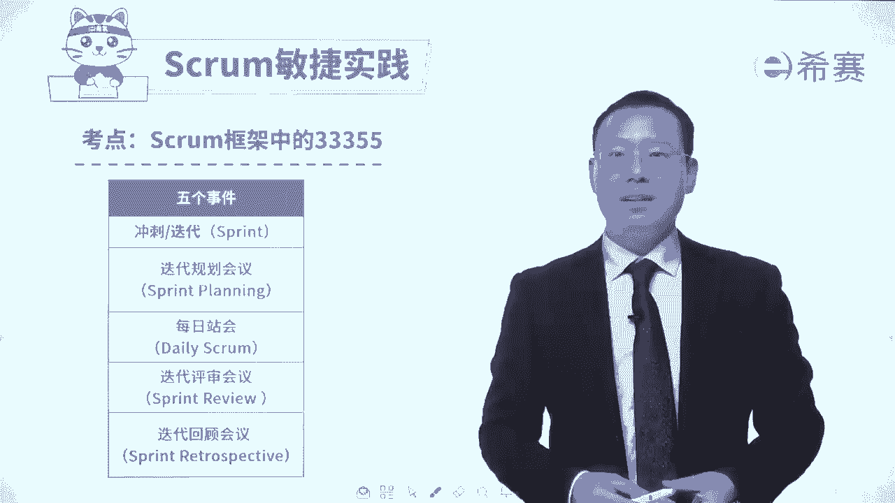
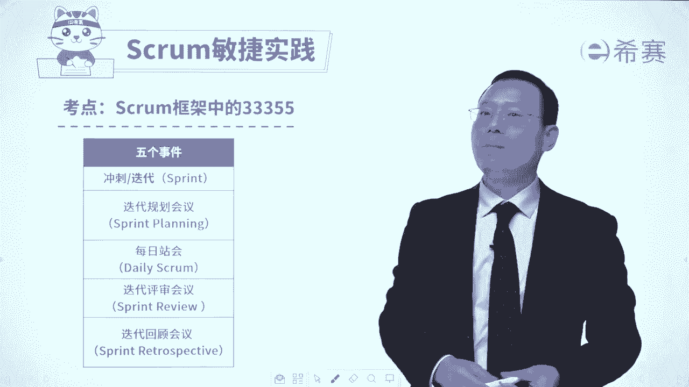

# 【最新零基础】2024年PMP认证考试课程-敏捷项目管理 - P36：36迭代Sprint - PMP项目管理 - BV11ce6ePEin

大家好，我们继续来分享的是scrum敏捷实践中的内容，那SPRR敏捷实践呢如果说是简单归纳的话。

可以叫做敏捷的33355，首先是三个支撑，然后呢是三个角色，然后是三个弓箭，再接下来呢是五个事件和五个价值观，那五个事件中，首先第一个叫冲刺迭代sprint。

我们一起来去认识一下关于冲刺迭代sprint，那我们这张图呢其实已经是见过好多次了啊，在这里你会发现整个这样一个过程，它就是属于一个冲刺或叫迭代或者叫spring，这三个词汇呢是可以去等同着去用。

是混着去用的，你需要去了解一下，那整个一轮迭代是干什么呢，一般来讲，一轮迭代式会从整个产品待办事项列表中，捞出一部分还没有做的，并且优先级比较高的东西，来列到这样一个内容中来，当然前提是先去定目标。

我们要去目标是要去做什么，就这一轮迭代的目标是什么，然后再去定具体的这些个待办事项，然后再把这个代办事项呢再去做分解，分解成小的任务，然后大家再去认领任务，认领完的任务都会列到这个产品。

代办事项列表中来，接下来团队就可以去开始来做事情，他那做事情的过程中，然后呢做呀做呀，做做东西不只是做它，还包括去测试它，去修改它啊，一直都测到没有问题为止，然后呢就得到这样一个建一个增量。

这个增量的东西，这个已经完成这用户故事的东西，我们会召开一个叫迭代评审会议，在迭代评审会议中会有PO，以及有可能会有客户来去参会来去，对于这样一些个已完成的用户故事进行评审。

评审通过的部分呢就得到一个叫可交付的产品，增量没有通过的部分，那么再把它打回去，又回到整个这个产品代办事项列表中来，然后呢我们做完这一轮迭代以后呢，后面会有一个叫迭代回顾会议。

在这个迭代回顾会议中来去回顾这一轮迭代，我们哪一些地方做的比较不错，哪一些地方可能还需要去做一些修改，调整好，又开始进行下一轮的迭代，这就是整个这一个冲刺迭代的过程，当然我们还会有一个叫迭代零和迭代N。

了解一下迭代零式刚刚开始的时候，我们第一轮首发的迭代呢，不会具体去做这些事情，所以不完全按照这个，而是做一些准备性的工作，那就是迭代零，还有就是迭代N是最后一个迭代，最后一个迭代也不去做这些具体事情。

而是对于整个做完的东西来去进行一个梳理呀，清理呀整理呀的这样一个情况，那这是迭代零和迭代N，我们整整个通过这个内容呢，再一次来回顾了一下，关于冲刺迭代sprint，再说一次，这三个词汇。

它其实就是一个词汇，是可以混着去用呃，可能在考试中既有可能会讲到是冲刺，也可能会讲到delay，也可能会直接用的是sprint啊，都是可行的好，那么关于这样一个呃第一个这样一个事件呢。

迭代呢我们就已经是分享到这里，接下来我们会认真去开展后面的考试，考的比较多的关于迭代规划会议。