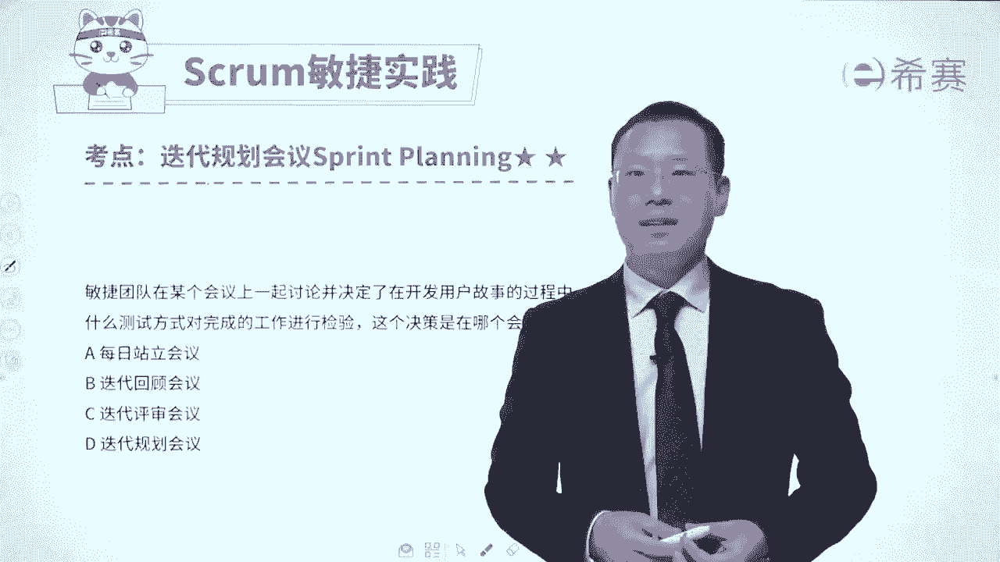
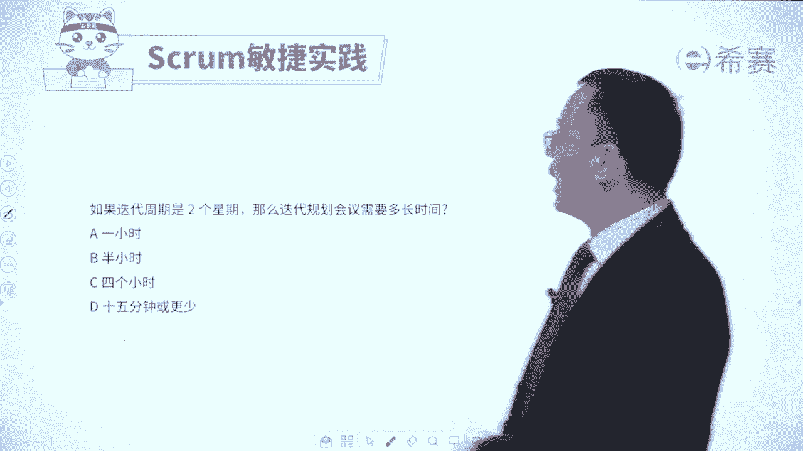
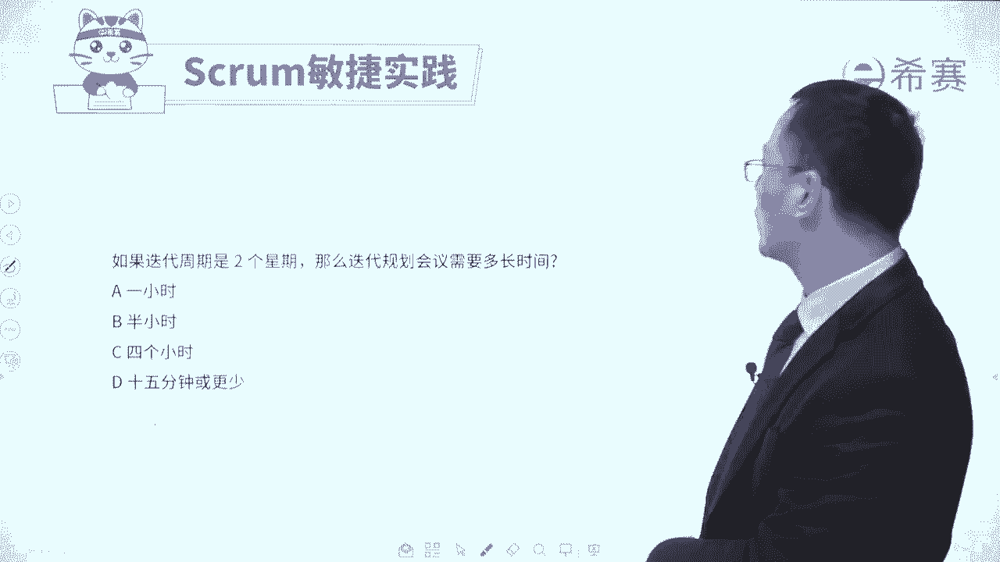
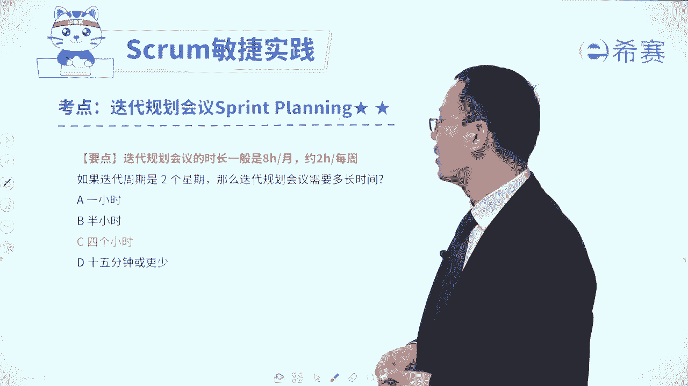
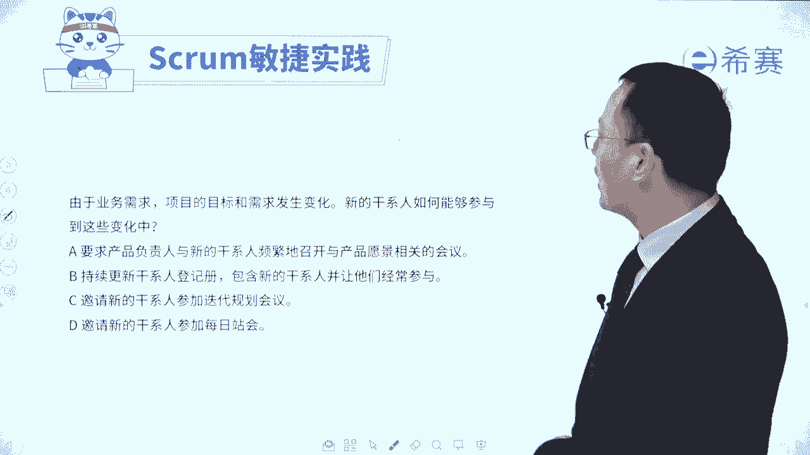
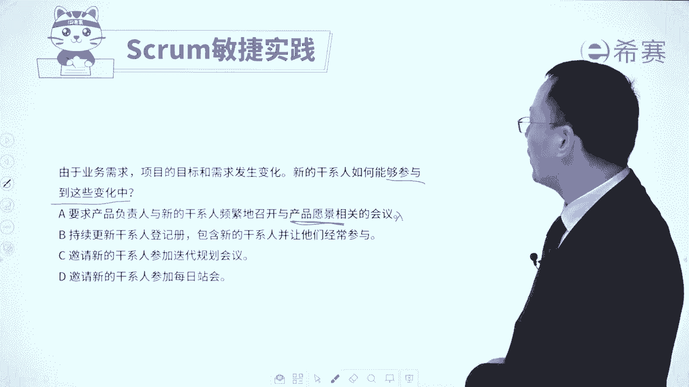

# 【最新零基础】2024年PMP认证考试课程-敏捷项目管理 - P38：38迭代规划会议习题讲解 - PMP项目管理 - BV11ce6ePEin

大家好，接下来我们一起来看几道，关于那个迭代规划会议的题目，通过这些题目让我们去反向知道哦，原来迭代规划会议它是这么考的呃，首先第一个题目，敏捷团队呢在某一个会议上一起讨论，并决定了开发用户故事的过程。

使用什么测试方式来对完成的工作进行检验，那么这个决策是在哪个会议上来确定的，请注意他是在讨论要做什么东西呀，怎么样去做呀，怎么样去验证，这一定是规划性的东西，那规划性的事情呢只有这一个叫迭代规划会议。

在迭代规划会议上，我们来去列出这一轮迭代他的目标，他的事项，他的任务该怎么样去做，事情一定是这样的，是每一天去同步信息，迭代回顾会议呢是来去回顾这一轮迭代，做的好的，做的不好的，下一轮怎么改进。

而这一个迭代评审会呢，重点是去做一些验收以及做一些反馈，所以你要知道原来迭代规划会议上，我们会去讨论关于如何去做这些用户故事，会用什么样的方式来去做这些事情，他的目标是什么，事项是什么。

都会在这个迭代规划会议上来进行，我们再来看一个题目，敏捷开发模式强调根据环境和客户的需求变化，来调整项目的工作事项，那请问敏捷团队在下面的哪一个会议上，来确定迭代需要完成的哪一些工作事项哈。

哪一个会议上来去确定，这轮迭代要完成哪些工作事项呢，那肯定是计划的会议啊，规划的会议呀，那么答案就是迭代规划会议，因为你只要在迭代规划会议上才会去明确，列出你的目标，你的要完成这些事项。

并且去把它去分成任务，去细化这些用户故事，得到这个迭代代办列表，一定是这样的，评审会议是强调的是做验收以及做一些反馈，回顾会议去讨论是做得好的，做得不好的，下一轮如何去优化和改进。

而每日战会更多的是做一些信息的同步，避免一些呃不一致的信息导致冲突，矛盾好，我们再来看一个题目。

如果迭代周期是两个星期，那么迭代规划会议的时间是多长呢。

我们说过是每两小时对应的一周，那这里是两个礼拜的话呢。

就对应的是四小时，就这么来算的啊，偶尔也有这种题目，但是很少啊。

如果说是四个礼拜的话呢，对应的就是八小时，就这么来算的好，我们再来看一个题目，由于业务的需要，项目的目标和需求发生变化。

新的干系人如何能够参与到这些变化中来，什么叫如何能参与到这些变化中来呢，其实也就是他怎么样才能够对这样一些变化，有更加深度的认识和了解，他怎么样才能够了解，那当然就是参加这个迭代规划会议呀。

我们来看一下选项A，要求产品负责人和新的干系人，频繁地继续召开这个产品愿景相关的会议。

愿景愿景在什么时候干的，在很早以前，在那个项目还没有开始启动这个迭代的时候，并且呢愿景只能够列出大方向的东西，它并不会给出具体细节的东西，所以它肯定不合适啊，好第二个选项持续更新干系人登记册。

包含新的干系人，并让他们经常去参与参与什么。

他也没有去讲，注意啊，他没有去讲具体参与什么事情，来获取这样一些信息，和第三个邀请新的干系人来参与迭代规划会议，因为在迭代规划会议中，PO产品负责人，他会去讲整个产品代办事项列表的一些事情。

以及这一轮迭代的目标，然后接下来是我们会重点去做哪一些事项等等，所以呢在这个会议上，他能够去了解项目一个大致的一些情况好，首先第一个他有没有那么多时间，每一天都跑过来参加每日战会，这是一个很大的挑战。

我们当下的信息啊，昨天我干什么，今天我要干什么，我干这个事情遇到什么困难和挑战，他不会有那么多全貌的信息，它是一个退而求其次的一个选项了，所以呢这个题目的答案是选C选项，你就需要去知道。

如果他们想要去了解团队情况，了解产品情况，就可以通过参加这个迭代规划会议的方式，来去获取，来去了解，那整个关于迭代规划会议的这样一些试题呢，我们就分享到这里，是不是你对于这样一个迭代规划会议。

有更深的认识和了解了呢，我们接下来还会再展开。