# 【直播精讲课】2023年11月班PMP项目管理认证考试培训课程第七版（更适合零基础） - P10：10.项目绩效域(交付绩效域） - PMP专家 - BV1Jm4y1g7bE

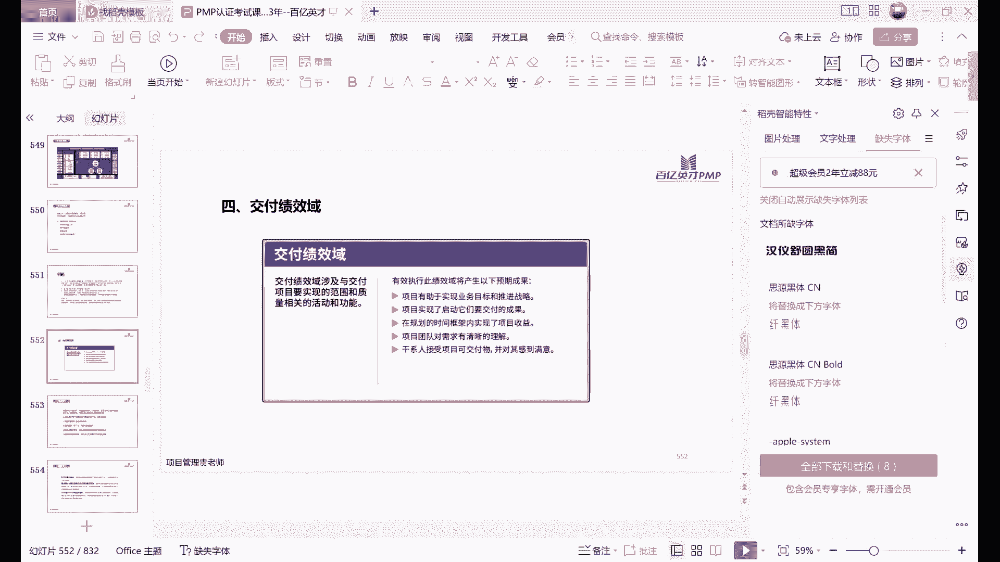

我们今天晚上开始讲交付的绩效率哈，稍等一下，我把笔调出来，那在讲交付议之前呢，先跟大家抛一个小问题哈，大家觉得我们做项目哈，我们前面讲了规划及教育，然后呢也讲了我们的工作绩效语，那现在规划好了。

工作执行也做到位了，现在进入到交付技巧遇了，在大家通常的理解当中，你们觉得交付绩效与交付应该包括哪些东西啊，可以在评论区敲一下你的意见哈，产品，嗯非常棒，要结束了，我们要交付这个产品。

交付这个服务都是对的哈，还有其他的东西吗，好大家别想哈，我边去引导大家哈，我们有学员说的要交付产品，要交付服务，这都是没错的，这非常棒非常好，那我们在交付的绩效域里边啊，除了我们交付的东西。

这个东西叫什么东西呢，它叫做可交付物啊，那大家想想除了我们的可交付之外，我们是交付是不是还有别的东西啊，比如说跟我们产品和服务配套的服务手册呀，还有质量的检测报告呀，合格证类似的东西，对不对，还有这些。

甚至呢有的还有可能涉及到一些嗯合同的条款，有没有其他的一些约定的东西，所以呢我们的交付机效率呢，不仅仅是关注我们的可交付啊，当然这个可交付呢就包括了可交付它的啊，不管是我们的产品，我们的服务也好啊。

我们其他的啊一个隐形的价值也好啊，包括了它本身包括了可交互物本身之外，还包括了跟这个可交付物相关性的，衍生性的这些东西哈，那首先成果要知道，其次呢跟他的这个成果相关联的，业务目标是否实现啊。

这些东西是虚的东西，因为不可能说诶我实现了业务目标，或者说我们没有实现有目标，我用一个看得见的东西，或者摸得到的东西来评估它，不一定啊，不一定所有的项目都有这样的一个实际看得见，摸得着的东西。

但是呢它并不是说意味着我们在交付的时候，就不需要去管这些了哈，是需要的是需要的哈，怎么去评估这些呢，那我们要通过跟我们的啊干系人啊，干系人是谁呢，主要是跟我们业务目标相关联的，比如说公司的领导呀。

客户甲方的发起人呢跟他们去确认一下，确认一下我们这个项目有没有达到他的期望，达到它的，达到他的期望呢又分了几个不同的维度，第一个呢是我们交付的产品或者是服务，是不是满足它所需要的基本的功能。

那第二个衍生点呢是我们交付的这些目标成果，跟他原本期望的这些需求点是否是一致的，他的需求点就有可能是跟他业务高度匹配的，这种关联性，或者是呢给它产生一些其他的一些商业价值，这个价值我们前面讲过。

不同的干系人对它价值的衡量标准是不一样的，对不对，所以至于这个价格值是不是一定是货币的价值，这个不一定哈，这个不一定，那对于我们的交付绩效率而言呢，我们除了要关注可交付之外，还要关注怎么去达到可交付。

让他该系人。

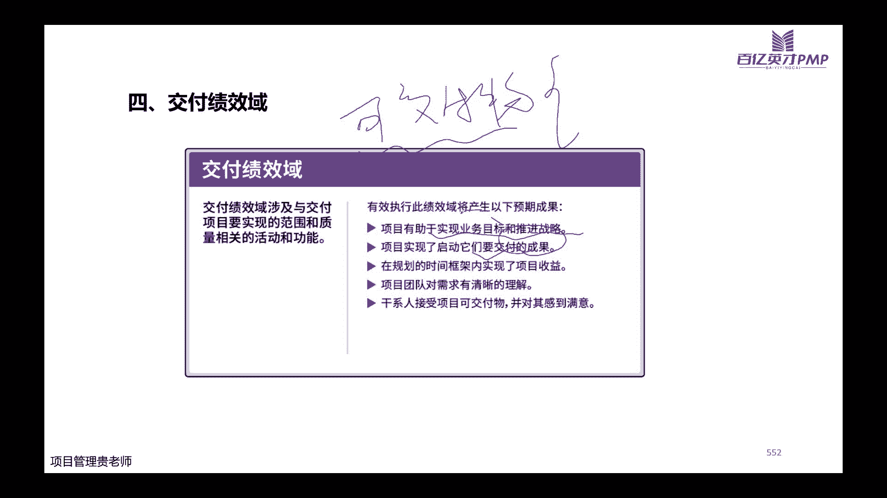

让我们的客户去满意，所以我们重点看一下哈，第一个呢刚刚提到了价值的交付哈，价值的交付，你看我们产品服务或者结果啊，它是体现价值的一种方式，同时呢如果说我们做这样的一个项目哈。

它没有新的产品服务或者成果出来，但是呢它能够给我们现在所处的这个环境，带来一些积极的一些影响和贡献，那么OK这也是属于我们这个项目的价值，那么第三点呢，也有可能是A现在公司要转型升级了，为什么呢。

因为我们上了一个新的自动化的设备，或者智能化的设备，这个设备呢它可以提升大家的工作效率，可以提升我们的生产力，那这个是不是也相当于创造价值了呀，也相当于是哈他虽然说没有直接的产品和服务。

但是呢他能够创造价值啊，这也是或者是呢唉我们前面提到过的，现在公司的整体状态不太好，哎我们推行了一系列的举措，让公司整个他的状态，能够有一个比较好的一个期望值啊，从当前的一个状态。

达到了一个未来期望的这种状态，那其中做的为了达到这种状态，做的这一部分的事情啊，这个也可以说他创造的价值，或者是呢能够维持以前的运营，所带来的一些收益啊，可能是大环境不好，别人都下岗了，别人都在裁员了。

但是呢我们啊却仍然保证大家的基本的工资，不给大家降薪，虽然说没有能力涨薪，但是呢能够保证到不给大家降薪，那在这个过程当中，我们做的啊，为了能够保持基本的运营，做的这些项目，他也可以说创造了价值。

这些都是我们在交付的绩效与要去关注的哈，关注的核心是价值的交付啊，价值的交付，那对于价值的交付呢，我们要知道哈几个点，什么点呢，第一个就是，我们的价值它虽然说是一个看不见，一个摸不着的东西。

甚至同一个项目它有很多部位，同多不同维度的这种价值，甚至呢价值，一般情况下面是不太容易去有量化的啊，除非说你是说我这个项目，他要实现多少万的盈利，或者说呢它的利润率要达到百分之多少啊。

你除非说你是用这样的一个标准能够测量，但是啊你看前面我们提了那么多的价值，对不对，不同的价值货币只是其中简简单单的一项，那还有其他的这些价值啊，业务性的价值啊，战略解析的一些价值啊，对不对。

对社会的啊一些积极的影响的这些价值啊，那么这些价值不能测量怎么办呢，如果说碰到这些不能测量的这些价值，那么我们也一定要尽可能的去跟这个价值的，需求方去跟他关联一下，看看我们能用其他的什么能够代替啊。

代替量化指标的这些内容，可以证明我们将来是实现了它的价值的，这个是事先要去把它约定好的，还要去说明的，尽可能的去量化哈，这个是第一个要注意的一个点啊，第二个要注意的一个点呢，就是我们说哈价值实现。

那有的项目哈它可能是一个研发性的项目，但是研发性的项目大家都知道，研发性的项目他肯定是要花钱，对不对，他要花钱，他要花时间，并且呢一般人可能就会觉得，研发的过程好像并没有什么价值产生对吧。

因为研发结束之后，当他研发的成果投入到运营，才会有真正的这种价值出现，那大部分人都是这样想的，那老师有人就会说，哎老师那这种项目我怎么去衡量它的价值呢，对吧，我不可能说等他运营的时候。

我再去衡量它的价值啊，那怎么办啊，所以呢我们在最开始如果说哈交付的时候有啊，相关方提出来，我们将来要衡量一下这个项目的价值，但是呢这个项目往往唉，他碰巧它又是我们的研发类的这种项目。

那我们就要去跟相关方，事先要列明一下，我们测量价值的时间段到底是什么啊，比如说我这个研发项目，我有可能是一年的时间，我一年的时间，那我给相关方说诶，这个价值测量事情就是这一年，那可以可以是可以。

但是呢我就要跟相关方说好了，这一年的时间唉，我预估我的项目刚好还能够研发完成啊，如果说是一项技术，那么技术的指标啊，技术的一些新的，有没有一些嗯一些点的一些突破。

或者是呢他刚好有一些什么样的一个产品出来，或者成果出来，这个成果呢要达到什么什么样的，123456条诶，如果说把这个就做的价值，那么这个价值的比重应该是最高的，那有的时候假如说诶想办法提出来了啊。

或者领导提出来了，那你这样我没有办法判断你这个研发项目，他将来对我公司到底能有多大的收益啊，对不对，那你也可以跟他说，哎呀没关系呀，没关系，我们可以把价值测量的时间放长一点，放到多长呢。

比如说我这个项目我研发的时间只要一年，对不对，那现在我测量价值时间，我需要有两年的时间，后面一年的时间，就作为我投入到市场上面去运营，通过运营呢会源源不断的产生啊，给公司回笼一些，回笼一些现金。

产生它的实际这个项目的这个运营的价值，那么这样也是可以的哈，所以呢当如果有，当你的项目本身它是一个花钱的项目，它的效果没有那么立竿见影的时候，如果领导这个时候又要求啊，将来价值的测量是你这个项目。

衡量这个项目做得好还是不好的一个核心的时，那你一定要注意哈，你需要跟领导或者跟客户去商量好时间段，时间段，这个是非常重要的，那么第三个点呢，就是我们前面讲的尽可能的去量化哈。

第一个点它跟第三个点可以融合起来看啊，针对主要的相关方啊，尽可能的去把它量化，那么可以量化的商业价值哈，一般大家可以去哪找呢，去我们前面讲过的商业论证里面去找哈，商业论证里面我们说了。

商业论证里面就是论证一个项目，它到底值得干还是不值得干，对不对，那既然是值得干，那么在我们的商业论证里面一定会有，它为什么值得干哈，它能够给啊，不管是给公司也好啊，给社会也好，或者给我们的团队也好。

带来的是哪一方面呢，或者哪多方面的一些价值都会有描述哈，都会有描述，并且呢在跟商业论证配套的呢，还有一个效益管理计划，就是你前面既然论证了我有12345，有这么多点的价值，可以值得做这个项目，对不对。

那么在我们的交易管理计划里面，就会对这些价值进行更详细的描述，并且呢唉何时我们打算怎么样去推行一些举措，让他能够实现这一方面的价值，并且呢在何时通过何种方式啊，把这个价值实现到什么程度。

这个是在我们效益管理计划里面，会有更详细的一些描述，当然跟核心的价值相关的这些范围和目标呢，我们甚至会把它写入到一些章程哈，所以一旦有人问你，诶说嗯既然交付的绩效又要考虑价值啊。

那这个价值我从哪里去找相关的一些，详细的一些文件呢，那么你可以考虑在你的效益管理计划里边儿，或者是呢在你的章程里边去找啊，甚至有的时候在我们的项目管理计划里边，也能找到类似的字眼哈。

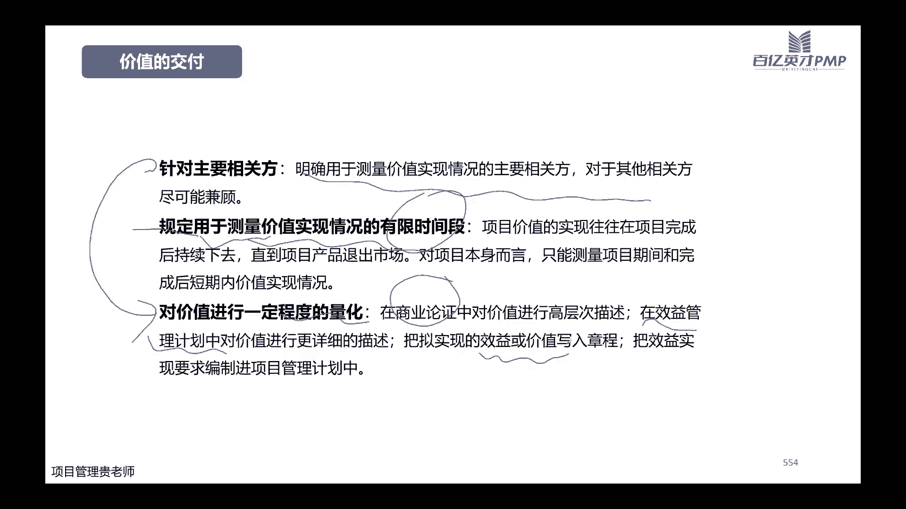

嗯这个是华为的项目管理哈，华为的项目管理呢，当然啊，大家都知道华为的项目管理是相当厉害的哈，他后面有一张更详细一点的图哈。

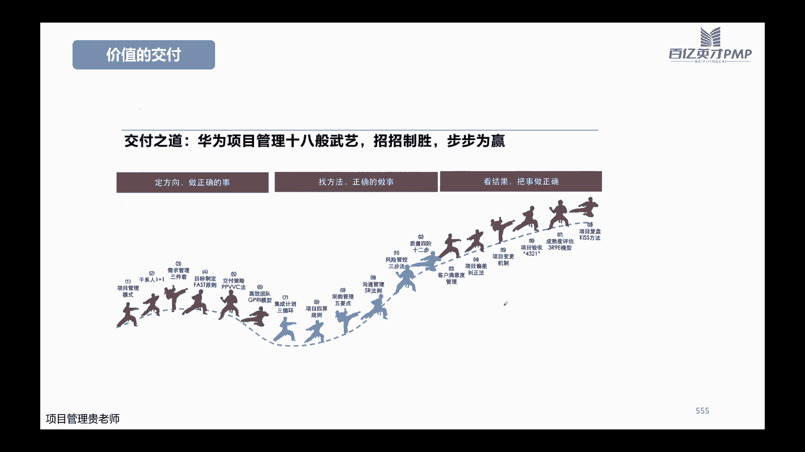

他整个公司啊就是项目管理的文化和价值观，是融入到整个公司的文化当中的，它的基因就是项目管理，对不对，所以呢你看看他的项目管理，它是从术法道人气啊，从五个不同的维度去打造，整个公司的项目管理体系呢。

首先道德层面当然就是我们公司的文化呀，公司整个项目管理的一些范围呀，以及公司遵循项目管理的价值观，到底是什么样子，这个是道德层面，那么从术的层面呢，就是我们讲的各种项目管理的一些方法论啊。

比如说客户交付类的项目啊，它分为哪几个不同类型的啊，他们做网络部署的，做软件咨询的，做信息服务的，做管理服务的，做培训服务的等等，还有其他类型的，比如说自己的一些研发性的项目啊。

或者是华为街的一些其他的一些，基建类的项目啊等等，它整个项目分级体系是做得比较完善的，这是从它们的不同的数的方面，那么从法的方面呢，当然就是我们具体的公司的啊，跟项目管理相关的一些规章制度啊。

啊项目管理的质量保证体系呀，他的决策的程序呀，还有跟我们项目本身相关的一些经营管理啊，这些是他们法的一些层面，当然还有具体的项目管理的流程，那么从他们的气啊，就母系啊工具，从这一方面呢。

他们有不同的项目管理的一些作业平台啊，比如说进度管理，他们也会有专门的进度管理的系统，进度管理的软件，还有成本管理呀，风险管理呀，还包括具体的这个工时管理变更管理呀，知识管理啊。

他们都有自己相应的一些系统，当然从人的方面呢，华为的人才体系，项目管理的人才队伍体系也是分了不同的，有认知体系，还有一些培训的一些体系，当然这是华为本身的，不可能说所有的公司。

他的项目管理体系都可都能够做到，像华为这么成熟哈，这是有点困难，但是呢我们可以以他某一个方面去切入，然后作为我们的一个嗯，很好的一个参考的一个模板哈，如果说我们的小伙伴哈，我们的学员，你所在的公司。

现在整个嗯项目管理的体系不是特别成熟的话，那我觉得对于我们来说可能有一定的局限哈，因为项目管理它的体系本身成熟的话，对于我们培养我们自己的项目管理的一些时，间的一些技能肯定是要好一些的。

因为相当于前面有有现成的模板啊，有现成的体系，有现成的框架去引导我们走，并且呢它还有一些指导，对不对，但是呢嗯如果说你没有的话，没有这方面的话，我们也不要觉得太沮丧哈，如果没有这方面的话。

你可以从你自己管的这个项目开始，把我们课堂上面所学到的这些方法也好啊，还有这些工具和技术也好啊，尝试着去应用在我们的实际的啊这些工作当中，比如说我们课堂上讲过的这些工具啊。

甚至有一些简单的一些事例的模板，我们可以去细化了啊，我们可以去根据我们的项目去细化，细化了之后去推啊，去推行去用，那如果说你在用的过程当中呢，如果你之前没有用过，那你在刚开始用。

它一定会遇到很多很多的一些问题，遇到问题并不可怕哈，遇到问题并不困难，并不可怕，你可以去请教一些同行，再去面讨论啊，或者跟我讨论都可以，然后呢不断的去把它问题去解决掉，然后完善。

这样的话相当于在你公司里边，是从你开始在慢慢的用一些更加科学，更加标准的项目管理的工具，在推理的项目，那你将来的话就是相当于是，你是在引导着整个公司的项目管理体系在走哈，所以我觉得嗯。

机会和威胁和限制肯定都是一些并存哈，这个看大家怎么想。

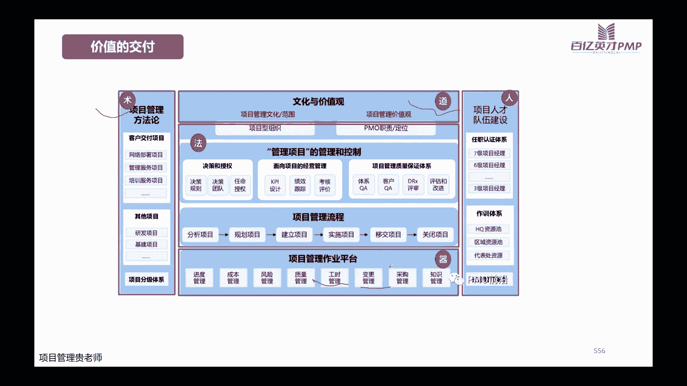

那当然这个扯远了哈，好前面是讲了价值的交付，那么跟价值里面最核心的就是大家提到的，能够看得见摸得着的这种产品和服务啊，也就是我们的科教服务，那可交付呢我们说产品和质量，那看他的哪一方面呢。

看它的主要是两个大的方面哈，当然需求和范围把它作为一类了哈，需求和范围我把它等同一类啊，另外一个呢是质量，前面呢是考虑到我们做了什么啊，为什么做什么，后面一个质量呢是我考虑到我们做的怎么样哈。

这是我们在交付的绩效域里边，重点要考虑的一个知识领域啊，两个知识领域，那范围和需求呢，当然就是聚焦于我们要教的内容，质量呢是聚焦于我们做的怎么样，也就是说这个项目你做了。

他要达到的一些绩效的水平到底如何啊，这个都非常关键，如果你的需求和你的范围都做好了，但是质量不合格，那一样的啊，白瞎对不对，你质量做得特别好，但是不好意思，人家的范围是十，但是你只做了二或者只做了五。

那也不行，对不对，那现在呢啊，大家可能会越来越关注到一种情况哈，因为呢我们现在面临的环境，它不太确定性越来越高，所以呢我们是不是所有要做的那些项目，做着做着，他还是跟原来的可交付成果的目标。

是一模一样的呢，这个可能性或者这个概率现在对比过去而言，这个可能性肯定是一模一样的，可能性肯定是越来越小了哈，为什么呢，因为环境的变动太大了，技术的更新迭代太快了，那这种情况下怎么办呢。

哎我不能说我们学的项目管理，明明刚开始说了有目标的呀，对不对，我们要尽可能奔着我们的目标去呀，啊我们要沿着我们的目标设计，我们的可交付成贵呀，但是现在环境变得这么快，那我的这些可交付怎么办呢。

跟我的目标渐渐的偏离了呀，怎么办啊，我现在就告诉你怎么办，这是一个例子哈，这是我们开发一个智能手表的一个场景哈，这个场景是什么呢，也有可能当你在最开始的时候，你是计划用12个月的时间。

用12个月的时间呢开发一款智能手表啊，这个智能手表呢我们举一个例子哈，它可能能够，能够语音报时间哎，对不对，比如说你在5年以前啊，你做这个项目，对于一个传统的手表来说，他如果能够语音给你报时间。

唉他除了时间，他还能给你播报一下天气，实时的天气，那你是不是觉得这块手表很哇塞，很制冷，对不对，那OK你花了12，你计划用12个月的时间来完成这样一款手表，的一个研发的工作。

但是呢走着走着哎呀过了半年的时间啊，或者说啊我们这个把时空拉的快一点哈，过了一段时间，过了好几年诶，你发现现在市面上的智能手表太多了，出来一个手表，它都能语音播报时间天气，它不仅能播报时间天气。

他甚至还能够实现跟你之间的语音对话，就像苹果的SIRI一样，对不对，那你说你还傻傻，等到12个月出来之后再推你的智能手表吗，啊你可以傻傻的等，但是呢等你把这个手表做出来的时候，很可能已经没有你的市场了。

对不对，人家都说杀出一片，杀得头破血流，你可能杀进去的机会都没有了，那怎么办啊，你有可能说诶，那这样吧，那我的智能手表我也新增这些功能，对不对，我也新增能够跟佩戴手表的人，对话的这种功能诶。

你要增加功能，那你要加时间呀，对不对，你要加时间，你要加人，甚至你的目标，你的功能点都加了，你的目标也会有一些偏离，对不对，好，那偏移完了是不是就完了呢，哎不一定对不对，我们继续做啊，做着做着。

发现你做到第十个月或者第11个月的时候，发现哎呀现在都人工智能了，好像光有一个SIRI也不好用啊，是这市面上这么多的人工智能软件出来，对不对，那可能有一些手表唉，他也已经嫁接了。

比如说切的GPT或者文心眼，这种大模型在里面，对不对，他除了能够啊基础的跟你对话之外，他还能够根据你和平时和他对话的这种特点，分析出来你的一些人物的性格特点，你是做什么工作的，然后呢。

自动的给你匹配一些和你工作场景，相关的一些素材呀，相关的一些内容啊，啊相关的一些引导呀，相关的一些解决方案，对不对，那你带这样一个手表，你岂不是就更加的炫酷了，那市面上有这样的产品出来了，你要不要做呢。

你可能也比较心动，对不对，你也像降低一些人工智能的模型在里面，对不对，那OK那你的目标是不是又便宜了，是的话，你又便宜了，那来大家听到我好几次说了，偏移哈，现在就要讲一个新的概念，叫做完成漂移啊。

叫做完成漂移啊，完成漂移是什么意思呢，完成漂移是指，我们为了适应现在这么快的一些技术的更新，迭代这么快的一些市场的一些需求的一些变化，那为了适应它而对我们目前正在研发，正在开发的这些产品。

给它增加一些特性，或者增加一些功能，从而导致了我们项目完工的时间，相应的有一些后延啊，这个呢不叫做我们啊，不叫做我们说啊进度有一些超支啊，啊怎么怎么样，不叫做项目失败，不叫做禁止超支，叫做什么呢。

叫做我们为了完成更好的完成项目标所完成的，所做的完成漂移哈，这个是七版里面新加的一些内容，为什么新加这样的内容，就是我可能前面讲到的，因为我们现在技术更新迭代太快了，你过去你研发新新的一款产品。

那你可能两到3年的一个周期，那现在你在研发一款新的产品，你过个两三年周期，你试试看，你你等到了两三年出来，压根就没你的空间了，市场早就变化了，对不对，你像现在人工智能技术更新这么快，三个月啊。

你基本上全，三个月基本上全部都要更新迭代一次啊，你三个月你好好的扎在里面，三个月你可以甩你的同行一大截，但是同样的，如果说你只是抱怨着你脑子这个技术，用三个月你不去关注新的动态。

那你很可能也在同步快跑的这个过程当中，被别人远远的甩在后面，这个是一定的哈，所以呢啊为了应对这种情况，有一个是我们为了目标完成漂移，那在完成漂移的过程当中呢，哎我们都知道啊。

你不可能说你设计的这个目标他就一定能实现，对不对，比如说我们刚刚讲过的，研发一款智能手表的这样的一款案例啊，人工智能进入这个模型，你想的是很好啊，你想的是很好，但是呢过了几个月发现哎。

比如说像今年5月份开始啊，国内不是大量封了一批，在国内悄悄注册的这个下载GB的账号吗，诶那你做到本来是预计啊，15个月或者16个月的时候，一款人工智能手表问世的，但是呢你突然发现你接入的这个模型。

现在GPU模型啊，人家给封了，人家不给你开放了，对不对，那怎么办啊，那你的这个目标他就完不成了，对不对，你漂移之后的目标完不成，哎那怎么办呢，那你这个项目失败了吗，也不能说失败了，对不对。

我还有一个自由的结果啊，什么意思呢，我这个时候我幸好国内的大模型也还凑合，也还比较好用诶，我迅速的我为了抵御风险，我迅速的跟国内当模型啊，再合作啊，有一个完整的一个风险的一个规避的风险，对不对。

那怎么办，那这个时候呢，虽然说哎我这个手表将来发布之后，他的一些数据的精准性，它可能没有切的GBD的这个底层的模型，那么好，但是呢他也还行，对不对，你比如说接受了文心一言的，他的一些功能效果也还不错啊。

对不对，这个时候你有一个自由的结果，这两种情况哈，这两种情况都是我们在做项目的过程当中，根据我们实事出来的一些情况，这种情况呢他要区分哈，他要跟我们所做的这个范围，慢也哎这个麦是怎么写着的。

后面我忘了跟我们所做的所说的范围蔓延，它是不一样的概念，不一样的概念，我后面专门要给大家做对比的哈，好接着说到范围蔓延就说一下，因为我们可交付出来之后，他一定是要控制质量啊，要确认范围的，对不对。

确认范围呢是我们客户或者发起人，他来正视，对我们的项目可交付成果，来进行验收的这样的一个过程，那验收之后呢，啊确认范围这个工作做完了之后呢，我们出来就是验收的可交付成果。

对于一个验收的可交付成果只有两种情况，第一是客户认可他签字确认，签字确认之后进入到我们后续的这个工作，第二种他不认可不认可，那怎么办呢，不认可我们就怎么样才能认可呢，做一些改进啊，做一些改进的措施。

那这个时候提一些变更的请求啊，对于这两种不同的情况，当然有人说那会不会有第三种情况呢，啊比如说客户他就他也不给你签字验收啊，他也不提一些变更的请求，他就拖着啊，有没有可能呢，也有可能套装纸有没有可能呢。

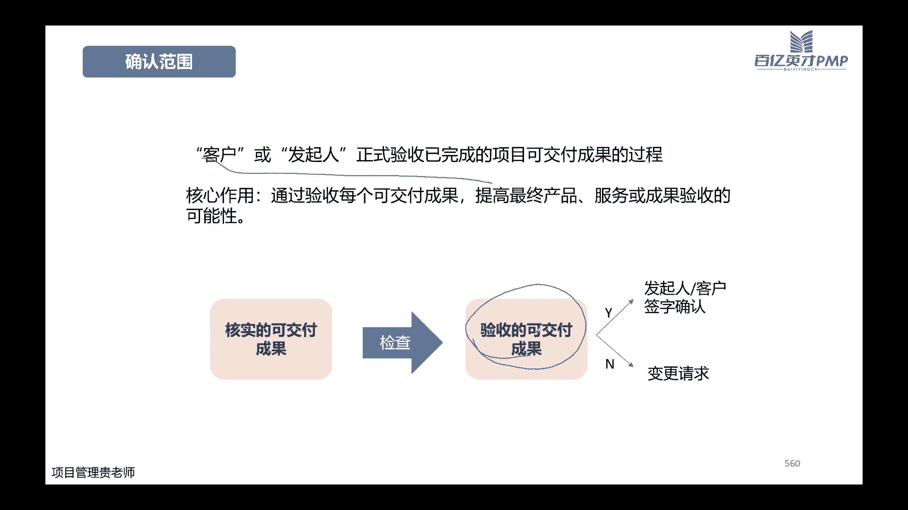

它也是有可能的哈，当然这个例外的情况，我们不在课堂上讲这些哈，好确认范围里面呢，啊重点大家关注一下他的一个输出。

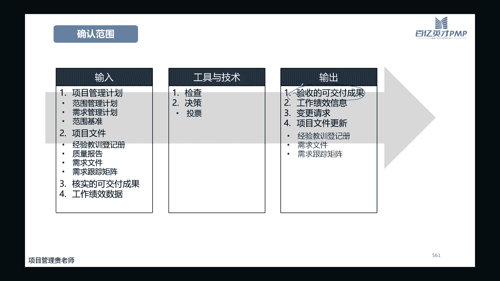

一个验收的可交付成果哈就好了，然后刚刚讲范围蔓延，我们既然说好的情况是完成漂移，而是有自由结果，那不好的情况呢啊，就是我没有基于现实的情况，对目标所做一些变动，但是呢我实际做的范围我有所增加，目标没变。

但是我的范围增了，这种情况呢就叫做范围蔓延啊，我们没有对时间成本，资源做任何的相应的一些条件，没有经过控制的一些产品，或者范围的一些扩大啊，注意是没有经过控制的产品，或者范围的一些扩大，叫做范围蔓延。

范围蔓延呢它又分了两种不同的情况哈，第一种情况呢是镀金，第二种情况呢叫做范围请便镀金是什么意思呢，镀金是我一般情况下镀金，他是团队内部可能会主动的去做出来的，一些蔓延的情况啊，比如说为了讨好客户啊。

你觉得做这个可能客户会喜欢诶，你主动的去加了一些功能，或者主动的做了一些事情，这些事情呢他可能跟我们的项目的本身的，目标的价值关联性并不大啊，你做和没做的区别都是一样的，那这个时候呢。

你可能自然而然地为这个项目去镀金了哈，镀金也许哈，你们在现实生活中都会觉得，那啊我为了让客户对我有一个好印象啊，我为了让客户啊，将来给咱们公司回款的时候能够更加痛快呀。

那我做了很多客户那边本身自己应该做的活啊，我觉得这领导肯定该表扬过吗，但不管实际现实应该是什么样子的，但是从理论上来讲，不好意思，你是镀金了哈，镀金是范围失败的，控制失败的一个典型的一个案例哈。

那么另外一种情况，范围范围内，另外一种情况是什么呢，是浅变范围的且变好，注意这个浅变既然是浅便，那什么意思呢，是指客户他每天给你增加一点小的一些要求，这个小的要求你做吧，好像有点费时间啊。

每次要花个半个小时，但是你不做吧，半个小时你都不愿意做吗，你也说不过去，对不对，你也不好意思拒绝唉，那么日积月累的，你就发现，等你回过头看的时候，你已经为了这些莫尔莫须有的或者众多小的。

不断的小的一些改变，让你的整个范围已经严重偏离了，既定的范围的基准，那这个时候呢叫做范围的请病，那放在前面呢，他这种一般都是基于团队外部的哈，基于客户本身那边给你提的一些要求，慢慢发生那种情况哈。

但这两种情况都是非常不好的情况。

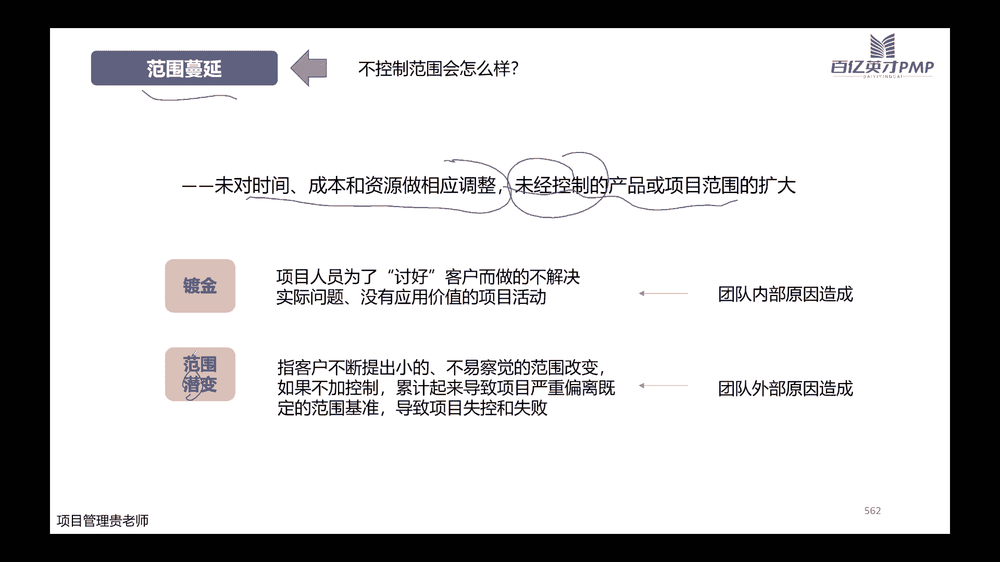

都叫做范围蔓延啊，那么范围蔓延根完成漂移，它到底啊有什么样的区别呢，区别在这里哈，我们讲完成漂移，是为了更好地实现我们的项目目标，所做的一些目标的一些漂移，对不对。

那什么情况下面我项目的目标它会有变动呢，啊它会还根据我们的环境不断的去适应变化呢，那当然是我们讲过的适应性的项目，对不对啊，所以呢从开发方法而言，完整漂移它一般情况下用在我们的敏捷型呢啊。

或者是迭代型啊，用在我们的适应性项目方法里边，而分为蔓延呢，你既然是蔓延，既然是超越了我们的范围基准，对不对，那他当然是发生在我们预测性的项目过程当中，完成漂移呢是随着我们的需求演变，而应用范围。

蔓延呢是要通过我们的变更控制过程，要预防，一个是鼓励，一个是预防属性，上面这个是经过批准的啊，这个是没有经过批准的允许的程度呢，适当的漂移，它是不会降低我们项目的价值的，甚至呢它不仅是不会降低，他。

更有可能的是为了提升我项目的价值，而做的一些漂移，但是范围蔓延呢，它一般情况下哈范围蔓延它超越了范围的基准，它会降低我们项目的价值，因为它浪费了人，对不对，他浪费了资源，他浪费了时间啊。

所以我们要做到的是零蔓延哈，所以啊留给大家一个思考题，这个思考题是什么呢，在你所做的项目过程当中，你肯定也做了很多，跟我们的本身的这个范围是有一些偏离的，这些事件，那你的这些事件。

它到底是属于完成漂移还是属于范围蔓延啊，大家自己去检验一下哈。

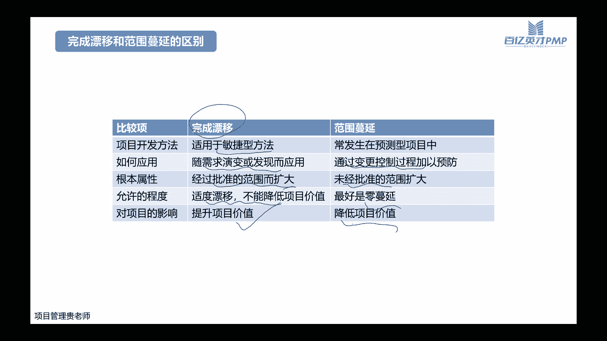

去思考一下，也可以在我们群里面一起讨论讨论，好不好，好上面呢是讲我们的可交付的范围啊，需求和范围的，那我们讲过啊，一方面是关注啊可交付它做了什么，对不对，那另外一方面呢是关注这个可教夫妇，他做的怎么样。

对不对，做的怎么样，怎么去看呢，啊是通过我们控制质量的这样的一个子过程，这个过程呢就是要核实我们的项目可交付，是不是达到了主要相关方的一些质量的要求哈。

好好他的ITTO呢，重点我们去关注它的工具和技术啊，啊核对单检查表，统计抽样问卷调查，还有我们的数据表现，重点关注这些它的输出，当然就是我们的控制结果啊，还有我们的核实过的可交付的成果。

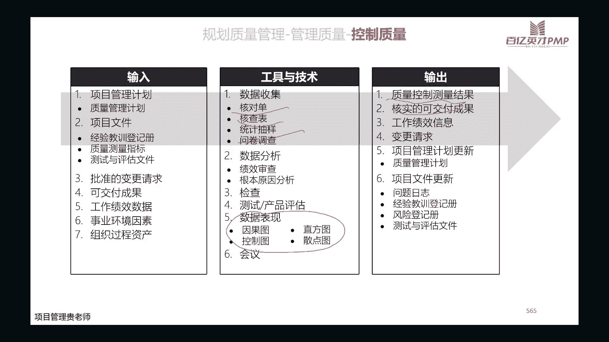

好，我们讲哈控制质量呢它跟我们的诶，刚刚大家可以看到哈，它跟我们的这个验收跟我们的确认范围啊，和我们整个项目结束阶段的验收，它是有一定的关系的哈，这个关系是什么呢，这关系我在这给大家念了哈。

首先我们肯定是嗯在执行，在工作绩效语里边会产生可交付成果，对不对，可交付成果出来之后呢，是要先做控制质量的这样的一个动作，控制质量这个动作做完了之后呢，他的输出是合适过的，可交付成果啊。

也就是说你这个质量是合格的，那是合格之后呢，我还要进入到确认范围的这样的一个过程，那光有合适过它的质量还不行，我还得去跟我的范围验收标准去比对一下，他是不是我要做的那些范围，对不对。

当你把控制质量和确认范围两个过程都做完，两个动作都做完之后，哎你说出来的才是可以被验收的，可交付成果啊，可以被验收的，可交付成果是不是就证明啊已经验收了呢，不是哈，只是说你现在输入的可交付成果。

说出来的是可以验收的，那么你就正常的进入到验收的阶段就可以了哈。

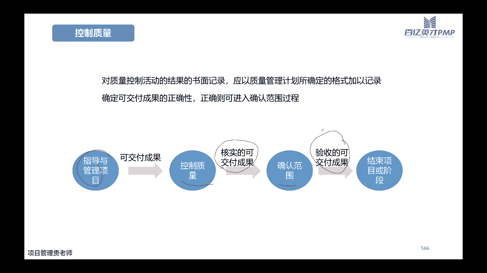

好控制质量跟确认范围的这个区别呢，哎我们说要控制质量，要确认范围，对不对，这两个区别呢考试也有可能会考哈，但是PMP考这个考的不是特别多，软考很喜欢考哈，考咱们区别区别是什么呢。

控制质量它关注的是我们这个可交付成果，他做的有没有毛病啊，做的对或者不对，而确认范围呢是他做的是不是满足我们的需求，也就是说你做的对，不是不是说你从可交付成果的方面做得对，还是不对。

而是说你这个东西到底是，就是该做还是不该做啊，是从他的接受与否的这个角度去再讲哈，所以呢既然说他们的出发点的角度不一样，执行方和关注的重点方向不一样，控制质量，一般情况下都是由我们的质量控制部门来进行。

那有人会说我们没有质量控制部门怎么办呢，那没有质量控制部门，比如说我们的申遗项目啊，或者是有的预测性项目，它没有质量控制部门，那谁做呢，那一般情况下，项目团队成员自己也要安排人去做哈。

自己也要安排人去做，那对于确认范围呢，他能够对我们判断我们是该做还是不该做，对不对，能接受还是不能接受，那显而易见，当然是由我们的项目的发起人啊，或者是我们的客户，或者是呢跟这个项目本身。

他的比较重要的一些干系人，是由他们来做决策的依据呢，控制质量当然就是依据我们的质量测量的指标，而确认范围依据的是我们的验收的标准哈，这两个区别其实大家体会一下就OK了哈，比如说今天晚上。

比如说今天晚上你给你们家人做菜啊，你是大家都不吃辣的啊，那你做的菜是辣啊还是不辣，那大家说一下辣还是不辣，这个是到底是你做的，是你在做控制质量的这个动作呢，还是确认范围的这样的一个动作呢。

或者是诶你做一个菜啊，要有一个西红柿炒蛋啊，一个这个红烧肉之前呢讲这个啊，你看一个红烧，一个西红柿炒蛋，一个红烧肉诶，那么你红烧肉做的好吃不好吃，这是质量问题还是范围问题呢，你红烧肉里面没有肉啊。

那这又是质量问题还是范围问题呢。

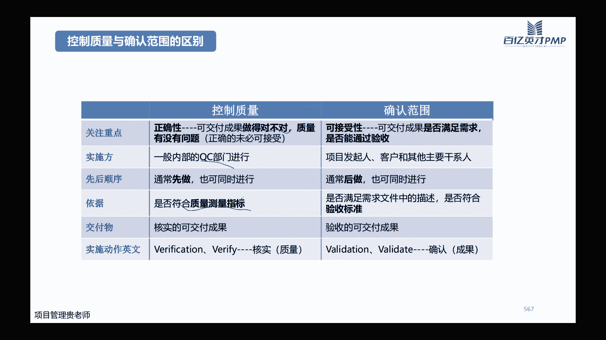

大家去思考思考哈，嗯既然讲区别，我们同时把这个质量保证和质量控制的区别，也讲一讲，因为我们在工作的绩效域里边，大家还记不记得我们在工作的效率里面讲过，要管理质量，对不对，要做好质量保证的工作。

那现在我们今天晚上在交付的机效率里面呢，又要讲到质量的控制，诶，那有些人哈细心一点，同学就会发现怎么上节课也讲质量，这节课也讲质量啊，哎是的，我确实都讲了质量，但是呢我讲的是两个不同的质量相关的字过程。

上节课我们讲过的是质量的控，质量的保证，这节课我们讲的是质量的控制哈，它们有本质的区别，质量管理，质量保证呢，它是在我做项目的过程当中去管理好质量，做中间审计啊。

审计的侧重点在于我为了做好这个可交付成果，我的动作，我的程序是不是合格啊，他是在适中在做检查，而质量控制呢，质量控制是说我有可交付成果出来了，那不管是阶段性的呀，还是最终整体的可交付成果。

都OK我有成果出来之后，对于我成果进行了检查啊，这个叫做质量控制，所以大家明白了吗啊比如说啊我们啊，比如说我前面花了几个月的时间，哎我在研发8月份新版教材的课件，那么在我研发的过程当中。

比如说汪博士汪小金哎，这个是项目管理的泰斗级的人物了，也当然也是我的导师哈，他如果说中间哎来看看说诶小郭老师，你的课件做的怎么样了呀，哎你做课件的步骤是不是诶，先根据他的一些大的这个啊导图啊。

大的框架啊，再去辅助一些600和敏捷实践指南的，一些具体的一些工具啊，是不是按照这种逻辑呀，啊是不是参考了大学的一大量的一些文献啊，啊一些数据啊，他在中间做这样的一些过程。

那他是在给我做一些质量保证的一些动作，对不对，那OK诶我三个月之后我的课件出来了啊，课件出来之后，我发给我的导师去审阅的时候，那它会使用A这个课件质量是不是合格呀，诶课件的一些这个知识点啊。

他是不是正确的呀，那他这个时候做的一些动作呢，就是质量控制的一个动作哈，所以大家明白这之间的区别了吧，明白他之间的区别之后，你就会发现哎角色肯定是不一样的了，质量保证当然是执行边执行边开展。

至于是工作执行者做呢，还是啊工作执行者之外，有专门的部门或者专门的人来做呢，都是可以的哈，质量控制呢一般情况下它都是啊这个第三方啊，或者是项目外部的一些人在做，为什么呢，因为质量控制的过程。

他强调的是你对你结果的检验，结果的检验，如果说只是自己来做的话，那么难免可能会有一些包庇的一些行为哈，所以一般情况下可能是有专门的这些团队在做，那至于它的原因呢，质量保证。

它是因为我们比如说发现了一些嗯，系统性的一些原因导致的一些过程偏差，那我们也要针对这个系统，要做一些调整，这个系统往往就是我们前面提到的过程性的呀，啊程序方面的一些问题啊，这些问题如果不解决。

那么很有可能你将来的可交付成果，他会不是说这一次可交付成果出现问题，他可能会一直循环不断的，反反复复的出现一些问题，这个是质量保证哈，那么质量控制呢是因为一些啊，比如说一些特殊的一些原因。

导致于你的整个这个结果啊，或者说整个这个过程本身有偏差，那么这个呢是它的一些核心的一些原因啊，你对于这些原因做一些纠正就好了，那质量控制呢，有人说质量控制重要呢，还是质量保证重要，那么显而易见。

肯定是我们的质量保证重要，对不对，因为质量保证是在你的过程当中加预防啊，加控制空过程做好了之后，你后续的可交付成果，出现质量问题的概率就会更小啊，就会更小，当然如果你的质量保证工作没有做好。

那么有人说我质量保证我好像没做啥呀，我质量控制我发现这个可交付成果还挺好的呀，没有什么毛病，那么恭喜你，你运气还不错，你一次没有什么问题，并不代表说你这个整个这个动作就是对的哈。

你有可能下一次或者下下一次，就出现了一些比较严重的，可交付成果的一些问题啊，甚至不可能验收，这个都是有可能的，所以我们也反复说了，讲质量的时候，他一定是预防要慎于检查的啊。

那这个侧重点是从整体的管理体系啊，这个是从局部的具体的质量问题好。

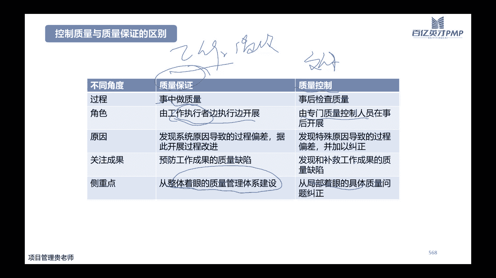

讲讲质量控制的具体工具吧，这个工具非常重要哈，考试常考考试参考，第一个工具呢就是我们的核对单，核对单是什么样子呢，给大家举了一个啊，这这还是疫情期间的哈，给大家举的这些。

比如说嗯我们考PMP考试要准备一些清单，对不对啊，你TM考试，你这个你把它作为一个项目，那OK你去备考，你去备考唉，那你备考之前总要准备一些东西吧，对不对，那你考试的精神状态怎么样啊。

考试的试卷答的怎么样啊，你的时间利用怎么样啊，唉你将来的这个成绩怎么样啊，对不对，这些都是我们考核的指标，那OK我们一个一个列啊，比如说第一个对我们考前的准备，考前一天的准备，你带的清单，带的物料啊。

口罩准备好没有啊，身份证准考证啊，个人健康声明啊，还有这个这个健康码行程卡等等的，还有一些工作证明等等，这些有没有做到位啊，当然再往他之前呢，哎上课有没有认真听讲，练习题，有没有做模拟题，有没有做错题。

有没有多把它理解了啊，对不对，这是往前的一个一个的哎，再往前呢大家报名报了没有啊，英文报名报了没有，中文报名报了没有，准考证下载了没有，对不对啊，这个也都是我们整个考试期间要做的一些工作。

那当然顺便也提醒大家，就是啊，苏老师应该在群里面就是应该说了好几次了，就是我们11月份的考试，是在11月25号啊，应该刚好是嗯，哎11大家自己去看一下星期一，一般情况应该是星期六或者星期天哈。

嗯现在应该要开始报名了，大家自己关注一下哈，关注一下苏苏老师的信息好，第二个工具呢是我们的统计抽样，统计抽样呢，它是从我们整体当中选一部分出来啊，选一部分出来作为我们的样本。

去测量一下它的一些质量的情况哈，那么对于我们抽样呢，根据我们抽样的一些嗯不同点啊，我们可以把它分为属性的抽样和变量的臭氧，属性的抽样呢是给它定性的，变量的抽样呢是定量的哈，什么意思呢，比如说。

一批零部件出来了，我挑选了一部分的零部件去测量它的一些啊，这个合格率我测量出来，我是它是合格还是不合格啊，这是属于他的定性，对不对，那你合格就是合格了啊，你不合格就是一个不合格啊。

比如说我们的PMP考试，你通过了就是通过了，没通过，fail了就是fail了，pass就pass，对不对，它是一个定性的啊，它是一个属性的，那什么是变量呢，变量是说我抽取了这一部分唉，我判断出来啊。

我是十个当中有八个是合格的，我的合格率是80%诶，那我推断出来我只抽了十个，对不对，我推断出来这1000个1万个零部件的，它的合格率80%啊，这是属于变量重量，就是给它定量的，从细节的部分推断出来。

我整体的它的一个程度啊，这个是变量的臭氧啊，这两个有一点点的小区别，大家注意一下哈，这给大家又举了一个案例，这个案例能够帮助我们更好的去理解，属性的抽烟和变量的抽烟哈，啊比如说现在商场哈。

我不知道大家有没有去关注过哈，现在的商场里面都会有一些比较好玩的，免费玩的一些儿童的设施，对不对，一些简单的儿童设施，可能原来只是在公园里边有啊，对不对，后面呢小区里边也有一些简单的滑滑梯呀。

啊这个秋千呀啊，可能有一些这样的一些都行，现在呢商场里面也会安啊，也会安这种爬楼梯的呀，啊这个滑滑梯的呀啊等等，为什么要他们要按这样的一个东西呢，因为他们觉得儿童来了之后，当然大人也会去啊。

大人带来流量就来了，流量来了之后，商家就愿意入住他们商场呀，商家愿意入驻商场的租金就不愁呀，对不对，所以呢他们喜欢啊，他们喜欢做一些儿童设施，但是呢做儿童设施之前呢，他们不是说拍了脑袋去做的，为什么呢。

他们也要做一些调研，哎他比如说调研一下，说哎，比如说我现在看看，商场里面来的儿童到底多不多，哎我把来的人14岁以下的，我叫他儿童啊，14岁以上的我把它叫做非儿童，后来我就发现诶，我统计了100个人。

或者我统计了1000个人之间，我发现啊这14岁以下的是380个人，也就是说来商场的这个比例是38%，哎，那么我要把这38%的比例，我再把它细化一下，细化一下，为什么呢，因为我现在只能判断出来儿童啊。

是38%，非儿童是62%啊，这是一个属性的，属于儿童还是不属于儿童，对不对，但是呢我还是无法判断，我到底应该建哪一种儿童设施，对不对，因为14岁这个年龄跨度还是很大的，那1~3岁啊，甚至0~3岁。

他玩的东西跟3~6岁玩的东西，以及六岁到14岁，他们小孩子关注的东西他都是不一样的，对不对，那我再来统计一波，我来统计什么呢，我来统计一下诶，1~3岁的有多少，3~6岁的和六岁以上的到底有多少。

我按这个比例来哎，最后一算出来了，它的比例大概是这个样子，3~6次的56%都是这个年龄阶层的，那那我推断出来我整个来商场的儿童中，3~6岁的是最多，有56%都是3~6岁的儿童。

那我根据3~6岁这个儿童最喜欢玩的，这种设施去采购去安装啊，对不对，所以呢上面一个就是典型的一个属性的一个，抽样的一个案例，下面呢就是我具体的啊，一个变量的一个抽样的一个应用，所以这两个有一点区别。

大家注意体会一下好，第三个工具呢是我们的直方图啊，直方图呢很简单啊，我相信所有的人都会用哈，所有的人都会用，比如说啊考试的时候会不会统计老师，会不会统计学院的分数啊，会的对不对啊。

170分以上的有几个人呢，150分以上的啊，有几个人呐，145的有几个人呢，对不对，那统计出来不就是我们的直方图吗，是的哈，这就是直方图很简单，第四个工具呢叫做我们的帕累托图，帕累托图什么意思呢。

帕累托图啊，他其实大家一看帕累托图，它好像也长得像直方图，对不对对啊，帕累托图它也是一种特殊的直方图，它有什么用呢，它是用来识别造成大多数问题的主要原因的哈，这个注意考试的时候经常也考。

但是呢大家要注意跟他区分的是因果图，英国图也叫鱼骨图哈，上节课才讲过，鱼骨图和或者是因果图，它是干什么用的，它是用来分析造成问题的根本原因的啊，然后呢帕累托图呢。

它是用来识别造成大多数问题的主要原因的哈，所以这两个有一些区别，大家注意一下，考试的时候别弄混哈，举个例子哈，你现在呢发现你们工厂里面，现在好像老出现一些工件质量不合格，对不对啊。

你做质量控制发现不合格，那为什么不合格呢，诶我调查发现，有可能是这个机器它本身它转动不正常，所以导致后面的这个弓箭它本身质量不合格，或者是呢哎也有可能是因为噪音太大了啊，影响了一些东西，所以只能不合格。

也有可能是呢唉有抖动啊，或者压力过大，或者呢有一些缝隙啊，或者是车厢不断的在颤抖啊，或者有一些其他的一些原因，然后你去实际调研之后呢，哎你就发现转都不正常，出现这么多次，出现了30多次，噪音不正常。

也出现了20多次，抖动呢也出现了20多次啊，车缝啊，车轴缝隙啊，或者车厢散布呢只出现了五次以下诶，那你就会发现哦，我可能现在更重要的是，聚焦在这两个或者这三个问题上面，对不对，我针对这三个问题哎。

我分析一下，可能主要的原因是这么几个啊，至于说你说是不是压力啊，是不是缝隙啊，是不是颤动啊，这些你去请师傅来修这些吗，不要修这些，先优先的解决转动不正常，操音和抖动的问题，对不对，好。

这个是我们帕累托图的应用哈，把啊也是一个典型的八二原则啊，把我们有限的资源，集中在我们常见的那些问题的解决上面。

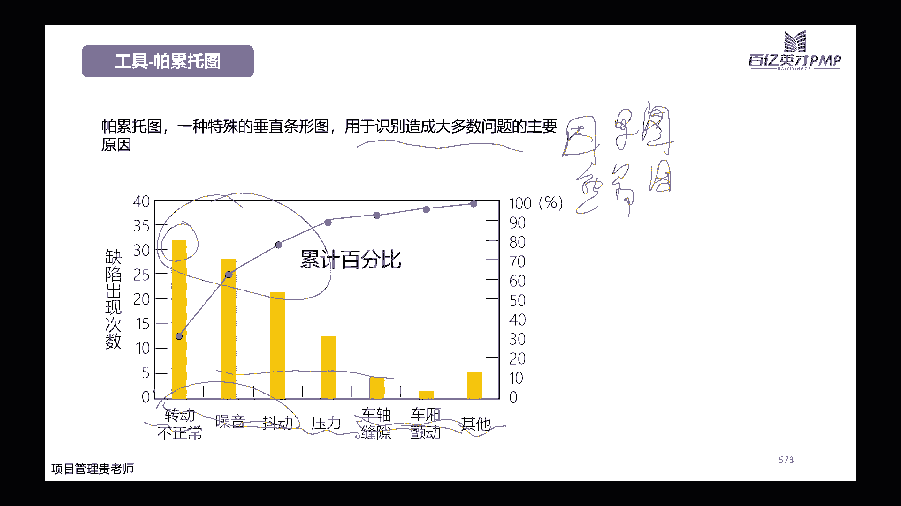

好在下一个工具呢叫做散点图哈，散点图呢，它是用来研究两个变量之间的关系的哈。

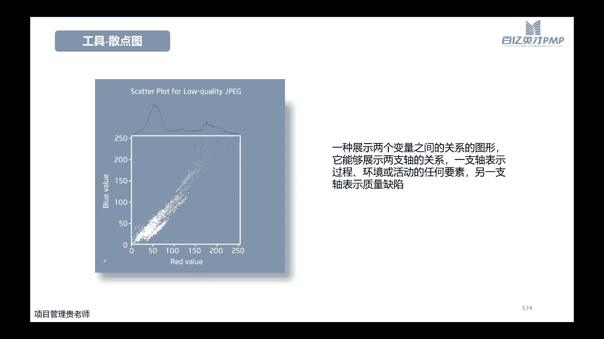

我举一个嗯啊用这个例子来跟大家讲哈，这样大家能够更好的理解啊，能够更好的理解嗯，举个什么例子呢，啊比如说我们还举刚刚这个零部件，工人生产零部件的这个案例吧，那我现在呢我发现诶工人生产零部件。

我统计一下啊，我统计什么东西呢，我第一个是统计零部件，它出来的这个合格啊，是合格还是不合格，合格的程度，然后我比如说我的纵坐标是合格率，那合格率到底我很想他合格呀，合格率跟什么东西有关呢，哎我这样吧。

我统计一下工人的啊，工作的年限吧，工作的经验诶，我去统计一下工人的年限，统计一下工人的年限，哎后来我就发现，当这个工人的年限只有一年工作经验的时候，他的这个合规律啊果然很低，只有10%。

当他有10年的工作经验的时候，哎呀，我发现他的合格率简直是高达95%，当然哈这这不是只有两个两组数据哈，我测量了很多组数据之后，发现当这个功能的年限越长的时候，确实这个弓箭它的合格率越高哈。

不同的数据点密密麻麻密密麻麻啊，都是围绕这一条线来的，那我几乎可以得出来得得得算出来，我这个零部件它的合格率，跟我这批工人的工作年限是正相关的哈，是正相关的，哎这是散点图的一个具体应用。

当然有没有负相关呢，哎有哈，比如说啊跟我们工人的这个年龄啊，跟我们的工人的年龄啊，年龄呢唉可能年龄越大啊，他的合格率就越差，比如说60岁以上的眼眼花缭乱的都老花了，确实那不行啊。

当然这个例子不一定恰当哈，因为有的他可能是越老越吃香啊，就像我们的医生一样，对不对，越老越吃香诶，他可能也是根据第一个啊无限的往上啊，这个也是有可能的，自己去找一个负相关的一个案例哈。

比如说啊我还是给大家把案例举出来吧，比如说我们纵坐标仍然是合格率，合格率跟我们的什么啊负相关的啊，比如说跟我们的这个天气情况，天气越好的时候，哎我就发现合格率是越高耶，啊天气好了。

可能是呢它的整个空气比较好啊，比较好，结果发现我合格率很高，慢慢的天气如果越来越差呢，温度越来越高呢，我出现了这个合格率越来越低啊，那有可能说这个合格率它跟我们的天气，跟我们的这个温度啊。

它是有一些负相关的这种关系，那还有一种情况呢，比如说什么情况不相关啊，比如说我们再举一个这个公证工作的，前面说的是年限啊，那我后面几个比如说跟工人的学历吧，哎跟我们的工人的学历啊。

比如说很多公司都会强调员工的学历，对不对，现在呢我发现这批工人的学历啊，小学生的也有中专生的，也有职校高职出来的啊，或者是本科的研究生都有，我发现他们做出来的合格率，每个人情况都不一样啊。

他的他的这个没做数据完完全全乱七八糟的啊，那我们几乎可以得出来，这个合格率跟工人的学历啊，没有什么关联性啊，没有什么关联性啊，这个是散点图的具体应用，那当然他们既然是关有关联性的，也有可能是线性关系啊。

也有可能是乘一个指数关系啊，或者是一些啊U型的分布，这个都是有可能的哈，这个根据我们实际测算出来的数据啊，你按照数据，你一个一个排在上面一看就出来了哈，那同时呢前面啊它是一个定性的，对不对。

我们也可以用前面说的定性相关还是不相关，那对不对，定性你看后面还有一个相当于是变量了，对不对，变量的一个东西，我既然相关了，那我强相关还是弱相关呢，对不对，它也可以根据我们的点。

这些点如果说沿着我们的相关性的这条线啊，分布得越紧实越紧密，说明它们的相关性程度越高，如果说他们是成一条啊，也是呈相关性的，但是呢这个点分布的，它相对而言不是那么的紧密啊，它是比较松散型的。

那我们可以得出来，这两个变量之间呢它有相关性，但是呢关联性没有那么长啊，没有那么强，没有那么强，所以散点图其实是很好用的，我觉得再下一个工具呢是控制图啊，控制图呢它是用来控制我们的过程，是否是稳定的哈。

用于测量这个稳定的，这个过程，是否能够达到我们可以预测的绩效的哈，那控制图呢大家要学会认几个东西哈，认哪几个东西呢，第一个东西啊，当然就是我们这些它的控制机械，控制机械。

控制机械呢啊跟它对应的还有一条是质量机械，那什么情况下面他们说这个过程他失控了呢，是有这么几种情况，第一种情况呢是当我的数据点，它超越了我的控制极限，超越了我的控制线，那当然是代表他失控了，对不对啊。

所以在我们界限之外，它属于失控了，第二种情况呢就是我发现啊，这连续这只有七个点，它都在一侧，都在我们中心线的一侧啊，那说明他也是空的，因为他正常他应该是沿着我的平均线啊，上上下下的这样分布。

平均分布他才对对不对，但是我现在所有的数据都在我的一侧，都在我的中心点一侧，说明啊，说明也是空的，还有一种情况是，虽然我现在啊我我既没有超出你的控制线，我又没有都在一侧，对不对，我是两侧我都有啊。

但是我现在七个点，至少七个点，我已经有线性关系连成线了，那你既然连着线了，你是不是意味着，当你第八个点或者第九个点，或者第11个点的时候，它就有可能超出啊，啊这边也是一样的。

所以第三种情况是当你连续七个点在同，就是没有在同一侧，但是呢已经有线性关系的时候哈，成一条线性关系的时候，所以啊失控的情况有三种，那么前面讲除了控制线，它还有质量基准线，对不对。

如果说你这个点它超过了控制线，但是你没有超过质量的极限，那说明它失控，但是呢并不是说明它的质量不合格哈，这个点大家要搞清楚，因为我担心大家考试弄混哈，他只是超越了控制系，那没有告诉你，他超越了质量基准。

这个时候不能说它的质量不合格哈，好这个是实际过程当中控制图怎么去啊，画哈，首先啊这个大家我们看这个图当然是很简单，对不对，这个示例图啊，学会看我们的周期性啊，学会看我们的这个控制的上下的这个线。

以及我们质量基准的上下的这个线就可以了，会判断就可以了，当然如果说只是为了考试做到这会看图，然后呢会根据我们嗯失控的几种不同的情况，去判断他到底失控没失控就可以了哈，在实际过程当中呢显然有难的多哈。

你如果说要用好控制图的话，你首先你要确定哈，你要确定你到底要控制什么玩意儿，对不对，你是控制你生产的生产一个零部件的时间吗，还是说你去控制生产一个零部件，它的标准动作呀。

还是说你去控制它的原材料的应用啊，还是控制他的其他的一些东西啊，对不对，你到底是控制什么，那对象你要把它确定好，第二个呢你才是根据你确定的这些数据啊，你来选择一个合适的控制图的一个类型啊，选择好的类型。

你才能具体的去收集数据啊，收集数据之后，你还要计算根据你收集来的这一堆的数据，计算出来，你的中心线和上下控制键到底分别设置在多少，和你那设计出来之后，然后把你收集来的这些数据。

按照你的中心线和上下控制键啊，实际是多少啊，就把它绘制在你的图上面，然后呢你再根据你会好的画好的这些图，你去判断一下到底失控点啊，或者说哪些点是没有受控的，你再去判断哈。

进而得到我们质量的一些基本的判断，这个是实际使用的一些各种时间的试镜，实际使用的一些步骤，那我们质量管理过程它的一些相关的关系哈，其实整个质量管理我已经给大家都讲过了，我们讲规划绩效率的时候。

有讲过规划质量管理，对不对，然后我们讲工作绩效益的时候呢，还讲过控制，还讲过管理质量，然后我们今天晚上讲交付的绩效益呢，又讲了控制质量啊，整个质量管理就是三个过程，规划管理和控制，那么这些指南过程呢。

它跟我们其他的一些项目管理的过程，它之间有一节相关性的一些关系啊，这些相关性的关系呢大家自己去看一看啊，看片不要把它弄混了，这些图呢是告诉大家，便于大家更好的去理解，我们整个项目管理的一些过程的话。

因为确实嗯如果说你们都是初次的来接触，项目管理这门学科的话，那么有可能你到现在的时候啊，你对十个知识领域，你还不清楚是哪十大知识领域啊，所以呢这些相互的关系呢，我在讲课的时候都会给大家列出来。

第一遍的时候大家可能看着没什么感觉，这个没有关系哈，等你把所有的课程都学完，都学完了之后，你再回过头来看的时候，你就会发现哦原来是这么回事啊，确确实实是这么回事啊，好那讲完了几个。

讲完了可交付物的主要要关注的两个东西啊，一个是范围，一个是质量，对不对，那么除了我们的这个可交付成果呀，啊除了它的质量和范围之外，我们还要在交付的绩效与关注哪些东西呢。

关注我们收尾的时候要做的具体的动作，哪些动作呢，第一个是收尾的时候要开一些会议，对不对，比如说我们要开的一些社会的报告会呀，啊客户的总结会呀，或者是一些经验教训的总结会呀。

以及我们员工或者团队内部之间的一些庆功会，对不对，当然也不限于这些哈，那开这个会是干什么呢，开这个会，当然啊就是首先我们的收尾的报告会啊，是为了干什么，当然是为了能够得到我们项目的发起人，或者是客户。

能够通过他们的验收啊，能够正式的去把我们这个项目去把它完结，对不对啊，包括客户的总结会也是一样的哈，这两个会呢，它其实更偏向于我们发起人和客户的，这个角度啊，征求他们的意见啊，收集他们的一些满意度。

那么经验教训总结会啊，以及庆功会呢，他更注重的是侧重于我们团队的内部，团队内部去嗯做好项目文件的一些整理呀，该归档的要归档啊，啊该奖惩的要奖惩啊，做一些事后汕尾的哈这样的一些工作啊。

那这些会议呢有一个简单的一个这个诀窍哈，就是教大家怎么去开好这样的一个会的哈，就是什么诀窍呢，旁边有一个五角星，大家可以去按按这个我们的这个五角星哈，就是尤其是我们阶段性的复盘或者。

阶段性的回复会的时候啊，可以去参考，比如说在上一个阶段或者上一个项目当中，我们哪一些做的比较好的哈，哪一些做的不好的，然后好的呢要怎么去保持啊，有一些更好的一些建议呢，怎么去执行，什么时候开始执行。

哪些做的不好啊，为什么要为什么做的不好啊，哪些需要停止，为什么要停止啊，什么时候开始停止，按照这样的一个维度去思考还会更好，除了我们的会员之外呢，我们还要写报告，对不对，要把东西落在纸面上才算数。

那我们的报告里边啊，项目的最终的报告会包括哪些东西呢，当然项目的整体的描述，或者说你是针对这个阶段的，那针对这个阶段的整体的描述概述，你要有对不对，要不然人家都不知道你是针对啥做的，这个报告啊。

搞不清楚对不对啊，所以第一部分里有第二部分呢，对于我整体的项目它的一个评估的标准啊，标准当然也得有，对不对，不管是范围的标准还是我们的质量的标准啊，还是我们要核实的一些其他的一些信息的，标准是什么样子。

以及呢我们的有没有一些偏差啊，有偏差的话，偏差是不是可以接受的，偏差的原因到底是什么，以及呢基于我们这些偏差，我们有没有做一些动作或者做变更啊，啊或者是做一些其他的一些动作的追赶，哪去纠偏啊。

那这些动作惨没产生一些成效，这些成效怎么样，那最终呢对我们的成果，对我们的可交服务它有没有一些影响，最终的可交付成果它是不是能够被核实的，能够被验收的，能够满足我们商业计划的所描述。

商业论证所描述的一些需求，以及呢我们在整个过程当中，有没有一些风险是没有意料的，有没有好的风险的处理措施，是值得将来去学习的，有没有好的啊，或者棘手的或者突发的一些问题，这些问题你是如何处理的啊。

最终解决的情况是怎么样子的，对不对，你如果说你的报告是按照这样的一个维度去，考虑的话，那么啊你你就是任何一个人，他看到你的这份报告啊，对你整个项目或者是整个你做的这个阶段的。

整体的这个工作以及工作的成果和情况，包括尤其是你有最后一部分唉，他会觉得这份文件是相当有价值的哈。

是相当有价值，相当值得在组织里面去传阅的，对不对，好好那除了我们的报告之外呢，哎有些人会觉得唉老师啊，我觉得这个报告挺好的啊，你刚刚也讲了，我们在里面会有一些嗯问题的解决，或者风险的一些解决会记录啊。

对不对，但是呢我这个项目啊，它出现了很多很多的一些问题，很多很多的一些风险，我如果说啊一个报告整体的绩效报告，总结报告可能20页，我恨不得有15页都在写我的问题，那怎么办啊。

那怎么办呢啊那我建议你把问题缩减啊，只挑最重要的一两个问题，意思一下其他问题怎么办呢，其他的问题你可以通过你问题日志的方式嘛，对不对，你通过你问题日志的方式，或者还有一些其他的工具啊，比如说什么呢。

比如说我们的经验教训登记册，对不对啊，你单独整理一个经验教训登记册，当然这个经验教训登记的，它并不是说你等到收尾的时候，你才做这个动作哈，他应该是在我们整个项目期间，他都应该不断的去总结，不断的去复盘。

随时复盘，随时就把我们的所得所想所获把它记录下来啊，把经验记录下来，识别记录，然后再分析啊，给它整理成归归类，对不对，因为你记录的时候，你可能啊12345随机的记，你就会发现这12345。

是不是可以做一个清和归类呀，我们讲过清河图，对不对，归类法唉，比如说137唉，好像都是跟我们的人员相关的，2465哎，好像跟我们技术相关的，对不对，你再做一个归档，归档之后呢，你分门别类的存储啊。

最后呢你分门别类之后，人家对于下一个项目在运用的时候，他可能就更加便捷的能够查阅，到底是哪一方面的问题。

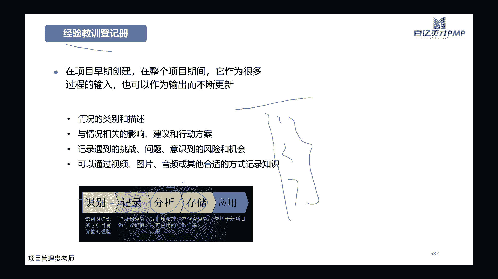

对不对，这些东西呢，啊当然都统称为我们的组织过程资产哈，所以呢有可能你们之前听我讲过啊，这个更新组织过程资产啊等等啊，怎么样，对不对，我们前面讲变更控制过程的时候也是讲过，不管我们的这个变更。

他最后是做了还是没做，最后都要记录到我们的变更日志啊，变更日志呢要总结我们的这个经验教训，要记录到我们的组织过程资产里面，对不对，那有人之前有学员就问的哈，这个组织过程资产它到底是包括什么东西呢。

哎这就给大家列出来了，它包括这么多的东西，包括哪些东西，第一有没有具体的一些政策呀，啊比如说啊做这个行业内的，有没有人力资源的政策啊，健康和安全的一些要求呀，质量政策呀，采购政策呀。

哎行业惯用的或者是呢公司惯用的，有没有相关性的啊，这个可以遵守的，这个是政策类的，流程类的制度类的，然后第二个呢是我们具体的流程和程序啊，比如说啊项目去拨款去清款，对不对，那么他的财务的控制程序呀。

啊整个公司要求预测性项目要做怎样的变更，控制程序呀，啊你出现了问题了，问题怎么去定性呢，问题的分级怎么去分级处理，怎么办啊，重大问题怎么去上报啊，管理程序工作怎么去授权，授权程序，对不对。

这些也是属于我们的组织过程资产，为什么要属于我们组织过程资产呢，因为这些都是在我们实际的过程当中，可能会遇到的一些问题，当遇到的项目情况多了之后，诶，公司领导就发现，好像很多项目都会遇到类似的问题啊。

算了，我们针对性的出一个工作流程吧，然后这个工作流程或者程序固化下来之后啊，他也就成了我们的组织过程资产哈，当然除了政策流程程序之外，还有我们的工作模板呢，比如说你们公司从来没有啊。

没有成熟的项目管理体系，对不对，都没有做过项目管理计划，那现在你学了些PMP的这个课程，你会做项目管理计划的，对不对，那你做了啊不同的项目管理计划啊，你甚至做了一个综合的融合的项目管理计划。

那你的项目管理计划，是不是也可以成为将来你们公司的项目管理计，划模板呢，可以的，对不对啊，甚至呢诶你们说老板说你这个项目做的很好呀，要给你们的项目团队发奖励啊，发证书诶，那你说这书怎么发呢。

你是不是也要在网上搜一个模板，设一个模板之后呢，根据你项目的特色去调整调整，设计了一个新的模板，那个模板老板一说诶，挺好用的呀，简洁大方，商务风挺好，以后大家复用，对不对，那你现在这个证书。

他也成了将来其他团队可以复用的一些模板啊，不一样的，还有工作指南啊，比如说你们在这个项目过程当中，突破的用了一种什么样的工具，去解决什么样的问题，诶效果意外的好，诶，效率也异常的高，诶那是不是挺好。

那行啊，哪怕也很高兴啊，这个项目你们做的很好，项目可就要不成功交了，同时呢在这个项目过程当中啊，针对什么问题，你们又践行了新的方法，非常好，以后大家都来学习你们的这种方法，对不对。

那你就形成了一种工作指南啊，对不对，工作指南也是我们的组织过程资啊，那还有我们的知识库啊，我们的项目的文件也好呀，啊档案也好呀，具体的这个经验教训总结的文档也好呀，啊还有其他的一些数据库啊啊等等。

这些都是我们的组织过程资产哈，所以我之前碰到一个学员在群里面问我说，他们公司的老板让他去啊，整一个整一个嗯，当时是说的整一个这个资产库出来，整个组织过程资产库出来啊，还是说的这个经验教训都记库出来。

我当时就说，那你这个库挺大的，老板是希望你整理哪些方面呢，他说比如说一些什么常见的一些问题呀，我说如果说是一些常见的问题，那你可能用问题日志的话，用问题日志的这个文件就能够解决，但是呢你要跟老板说清楚。

老板到底是让你去弄一个问题是治，还是让你把这个项目的问题是制度弄出来，还是说让你弄这个项目所有的这个组织过程，资产项目这个经验教训库，因为问题日志它只是你的经验教训，登记库当中的一个，对不对。

是你整个组织过程资产当中一个小小的一部分。

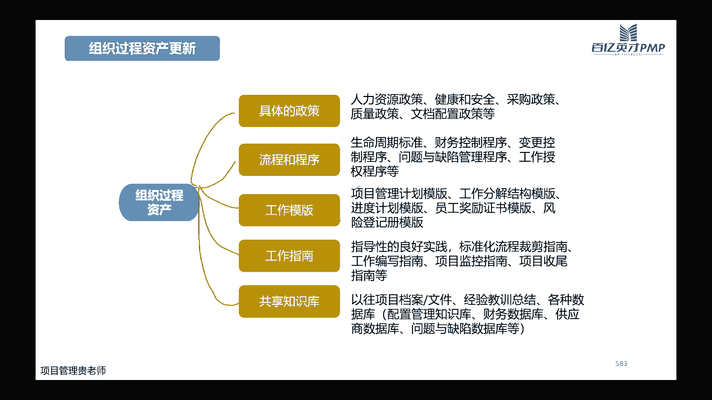

所以让他去问清楚，问清楚了再说好例题哈，嗯第一题是说这个公司呢它正在几个，第一题呢是说这个公司，它正在部署一个新的解决方案，然后呢已经包含了安全审计，作为每次部署之前要做的一个部分。

现在呢是说第一次部署之后进行安全审计，发现有违反安全的行为问题怎么办，A呢是说组织团队的研讨会，来执行根本原因分析，并且呢来制定一些纠正的计划啊，这个当然是要做的，为什么呢。

因为你现在都审计发现安全问题了呀，啊我们说了，在所有的项目当中，安全无小事，对不对，是一定要重视的，那你现在发现了违违反安全的问题，那你肯定要讨论啊，为什么违反了安全问题，它的原因是什么。

然后针对这个原因要找解决方案毙了，是说审查质量管理计划，看看是不是爆发性的安全需求，什么意思啊，意思是你如果说审查质量管理计划，如果说没有包含安全需求，那你就遵循你的质量管理计划，你就不管这个事了呗。

那怎么能行呢，如果你的质量管理计划没有包含安全，是安全要求，那说明你的质量管理计划都得变，对不对，质量管理计划都没做合格，C呢是说让审计员跟他商量一下，看看这个能不能不要这么重要啊，这怎么能行呢。

D呢是说验证质量要求和解决方案是否一致，并更新质量管理计划，那你首先要制定，对不对，你先要制定解决方案，然后你才有的验证。

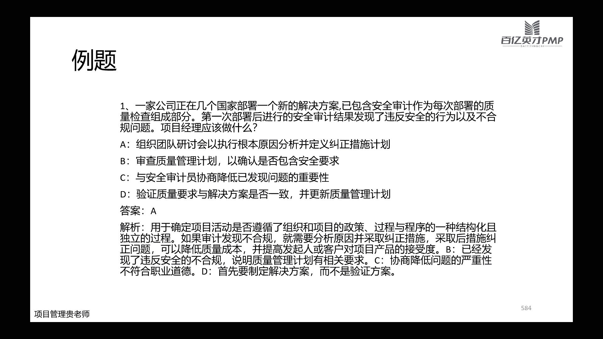

要不然你去验证什么呢，第二题第二题呢是说这个项目它的时间很短啊，期限很短，这个相关方呢就说哎你别做质量控制，但是呢你作为项目经理啊，对不对，你作为一个优秀的项目经理啊，你会说不行啊。

质量是必须要达到的呀对吧，你哪怕能够最低的这个质量标准，你也得有啊，对不对，那现在问你是要使用什么工具呢，哎我们使用什么工具呢，ABC都是什么呢，他们都是具体的做质量控制的工具。

但是现在你还没决定做还是不做，对不对，你要做，但是呢关键相关方不想做，你现在要用什么，你现在要用成本效益分析去说服他，哎质量控制是要做的，但是呢因为期限很短，那么我们采用什么样的工具或者技术。

或者解决方案或者办法去做，能够更加具备我们的成本效益啊，对不对，能够创造更加的一些效益啊，所以这个时候应该是先用成本效益分析，看看我们应该做什么，应该做什么动作，能够既满足相关方啊。

去担心这个期间很短的这个问题，又能够让我的这个项目，提供最低的质量的水平哈，好第三题，第三题呢是说，在产品的最终版本获批之前举行的相关方会议，上面，就有一个相关方抱怨啊，说产品缺失了一个重要的功能啊。

那么你应该先做什么呢，A是说讨论该问题，并让相关方相信增加更多功能已经太晚了，如果是你，你会这样做吗，你肯定不会这样做，对不对，人家给你提问题，你说你这太晚了，肯定不会这样啊。

B呢是说估算增加该功能的成本，并让相关方予以批准，你还没有啊，你还没有做任何的这个评估啊，只是相关方在抱怨说缺失了，对不对啊，那你你直接就默认了吗，C呢是说利用D的验收标准。

先核实一下相关方的这个抱怨的这个功能，是不是我们该做的有，对不对，你肯定要先做C啊，D呢是说根据该相关方的要求提交变更请求，这个B和D都是C做了之后可能要做的事情啊，C你先确认一下，如果确认之后。

发现验收标准里面确实包含了这一个功能啊，那那不好意思，那是你做多，那是你做少了，你做漏了，对不对，那你确实得做，但是呢你现在你还没有办法确认啊，所以先做C先去确认一下哈，OK嗯。

以上呢是我们今天晚上讲的交付的绩效语哈，交付的绩效益的内容并不是特别多哈，重点的就是再跟大家回顾一下，重点关注我们可交付的，他的，范围和质量，啊这是两个重要的过程，这是两个最重要的过程。

在这个重要的过程之中呢，哎你既然要关注好范围和质量，那么你要从价值出发啊，你要从价值出发去衡量，衡量不同的范围，衡量不同的质量啊，这是重要的两个过程，把这两个重要的过程掌握在这两个基础之上呢。

唉再去了解一下收尾的时候的，比如说收尾的几个会议呀，收尾的时候他的组织过程，资产的一些更新啊啊等等就可以了哈，所以这部分的内容啊，交付期效益的这部分的内容，相对还是比较容易去理解的哈。

看看大家有没有什么问题，我昨天看到有个学员在群里面说，嗯做题的错误率好高，是不是我看看是哪个学员，也不知道有没有在直播间哈，就是如果说大家在做练习题的时候，发现做题有错误的话。

嗯希望大家哈能够在群里面就是去提出来，我们一起去讨论一下哈，大家在做题的时候啊，顺便今天时间还早，我跟大家说一下，刚好上，刚好也是上次，前两天有个学员在群里面去问我的哈，嗯我跟大家说一下哈。

我们整个的项目管理的课程学习，是分了这么几个阶段哈，其实之前应该跟大家讲过，第一个阶段呢是我们的精讲课程啊，也就是我们现在正在做的这样的一个阶段，精讲的过程，他做什么呢。

精讲的过程就是跟大家详细的去讲啊，详细的去讲我们整个项目管理的，这一套知识体系啊，这套知识体系我是按照什么逻辑呢，我是按照七版教材的，先跟大家讲项目管理的概述，概述的目的是什么呢，概述的目的啊。

是我希望通过概述去让大家能够对项目管理，这门学科更好的一些认知啊，有更好的一些认知，那么第二个部分呢，跟大家讲的项目管理的原则啊，项目管理的原则呢，因为原则它是大而通的东西。

那这样是为什么为什么要讲原则，因为考试它不一定说哎，具体考你哪个原则是什么，对不对，为什么要跟大家讲这些呢，是因为后面的哈，这是我们啊，你可以说他是法啊，也可以说他是道方面的东西。

他虽然说不是我们具体的气啊，或者术方面的东西，但是它一定是我们的法和道层面的东西，即使你有的项目啊，你可能用我们后面的这个工具和技术，去套的时候，好像哪一个都套不上，但是呢因为你也知道原则上应该怎么样。

对不对，你知道知道原则，那么你也有可能创新，在原则的指导下面，创新出来一些比较好的工具和应用哈，那第三个部分呢是我们的绩效率，纪效益就重点的是讲的气树啊，讲的这一部分的模块。

所以基效益呢因为契合数这些东西它很好考呀，对不对，他既然是个考试，他考这部分的内容它好简单嘛，它设计设计不同的场景啊，让你判断判断这些不同的场景你应该怎么做啊，选择什么样的数，用什么样的T对不对。

所以考试的重点都在这一部分里面，那么在这些模块之后呢，他会告诉大家去怎么去裁剪啊，当大家掌握了这么多的工具和技术啊，道法知道了，契合数，知道了，还要知道怎么去裁剪啊，怎么样去根据不同的项目。

去选择适用的方法和工具，最后呢再给大家总结一下啊，模型工具和方法啊，这是我们整个精讲的部分的内容，通过精讲这一部分的内容呢，大家对整个知识体系啊，就会有比较深刻的一些认嗯，比较深刻的一些掌握吧。

应该是说不能只是说认知了哈，应该说比较深刻的去掌握，怎么去掌握呢，第一听讲啊，可以听直播，有些人不习惯听直播的，也可以听回放啊，但是一定要听一遍听呢听不是啊，不是说听就完了，听的过程当中呢。

还要结合着我们的练习题啊去做，结合我们配套的练习题，去巩固课堂上面讲的一些知识点啊，这是第二层，那么第三层是要干什么呢，第三层哈，一定要结合自己实际的工作的过程去思考，去年下用过的啊。

去看看你们现在用的对不对啊，用的已经很对的，去看看哦，知道一下他是为什么这样用啊，知其然还知其所以然，没有用过的，尝试着去用一用哈，尝试着去用一用啊，这是对家的一些要求，那精讲完了之后呢。

我们会有一个串讲的部分，串讲的部分干什么呢，串讲的部分是用两次课的过程，那是用两次课，把所有的项目管理的这所有的东西，再给大家简单的把重点全都出来，通过串讲之后呢，大家就能够抽丝剥茧啊。

就能够抽丝剥茧的，快速的了解到项目管理，整个的框架是什么样子的哈，这是串着的部分，最后一个部分呢才是模拟题啊，模考的部分，模考的部分呢是给大家安排了几套模拟题，那大家做。

然后呢我逐题的逐个选项去跟大家讲啊，在串讲的这个截止到串讲之后，他家应该已经所有配套练习题已经做完了，然后并且呢跟串讲相关的，这个就是我们会有一些训练题，训练题应该也已经做了，这个时候呢大家的体感。

首先知识点应该都已经掌握了，同时呢体感应该也已经训练出来了，最后通过我们模考呢啊，把这个做题的思路啊啊技巧啊啊，甚至有一些遗漏的，或者是说已经忘记了一些知识点再巩固一下哈，是整个这么三个不同的阶段哈。

嗯很多啰嗦的跟大家说了一下，其实这些内容我讲我应该啊，首次课的时候跟大家去讲过哈，讲过我们的结构，尤其是精讲的这五个部分的结构，应该都跟大家讲过哈，因为之前有个学员提到说啊，感觉课程不系统不系统。

是因为你现在还身在庐山中，不知真面目哈，你现在还在一个一个的摸绩效域里面，具体的工具和技术哈，你没有站在全局的角度去看，所以你会有这种感觉，如果大家也有这种感觉的话，没关系哈，正常非常正常，你在学一门。

就像你在学一门课程的时候，你学到具体章节，你先到章章节里面去研究某个章节，具体的东西的时候，你是不可能说站在你的全局去，看到你整个这个这本书或者这一本课程，这门这个课程它全部的哈，这个是正常的。

大家不要焦急，这部分呢不要去掌握，哎呀你试图去掌握整个框架是什么啊，整个这个系统什么，不要试图去掌握这些，但是呢对讲过的内容和讲过的知识点，以及讲过配套的这些练习题啊，当然做练习题也是为了知识点啊。

所以就直接说知识点。

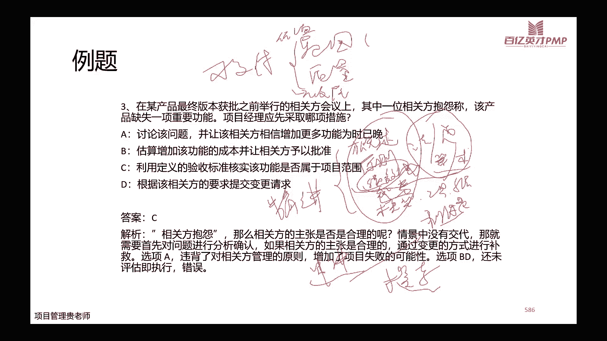

如果说没有什么问题的话。